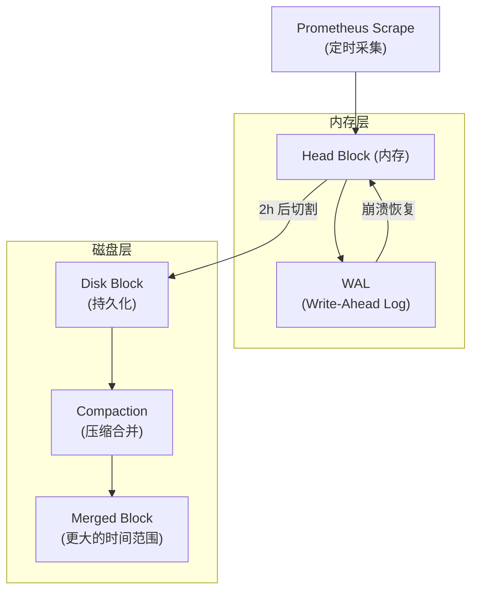
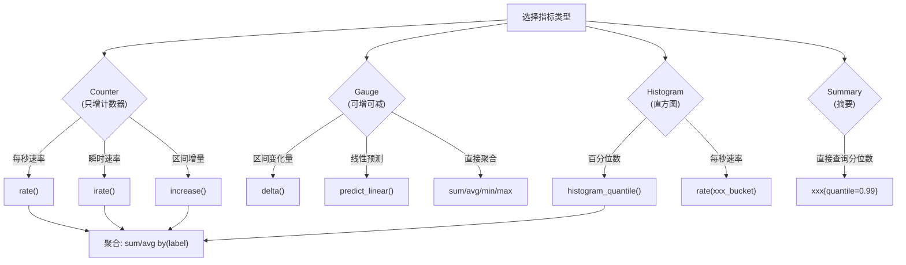
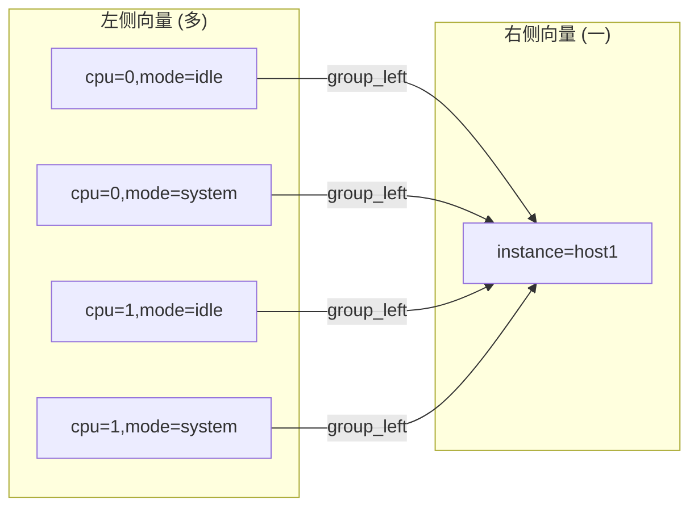
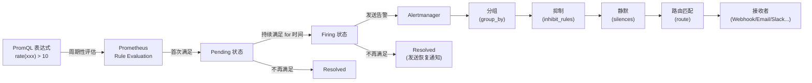

##  0x00    前言
前文 [理解 Prometheus 的基本数据类型及应用（基础篇）](https://pandaychen.github.io/2020/04/11/PROMETHEUS-METRICS-INTRO/) 梳理了 Prometheus 的应用基础，本文梳理下 prometheus 查询及指标应用的最佳实践以及 PromQL 使用等

##  0x01    相关概念回顾

####    时序数据库

Prometheus 内置了一个高效的时序数据库（TSDB），专门为时间序列数据的写入和查询进行了优化。理解其存储机制有助于更好地使用 PromQL 以及进行容量规划

**整体存储架构**

Prometheus TSDB 采用了分层存储设计，数据从内存到磁盘的流转过程如下：



**Head Block（内存块）**

Head Block 是 TSDB 中最活跃的部分，所有新采集的样本首先写入 Head Block。Head Block 保存最近约 `2` 小时的数据，存储在内存中以实现高速写入和查询。当 Head Block 中的数据超过 `2` 小时后，会被切割（cut off）为一个不可变的 Disk Block 并持久化到磁盘

**WAL（Write-Ahead Log）**

为了防止 Prometheus 进程崩溃导致内存中的数据丢失，所有写入 Head Block 的数据会同时追加到 WAL（预写日志）中。WAL 是一个仅追加（append-only）的日志文件序列，存储在 `wal/` 目录下。当 Prometheus 重启时，会通过回放 WAL 来恢复 Head Block 中的数据

**Disk Block（磁盘块）**

每个 Disk Block 是一个独立的目录，包含固定时间范围内的所有时序数据，其内部结构如下：

```text
block-directory/
├── meta.json        # Block 的元信息（时间范围、样本数量、压缩级别等）
├── index            # 倒排索引，用于根据 label 快速查找时序
├── chunks/          # 实际的样本数据，按时序分段存储
│   ├── 000001
│   └── 000002
└── tombstones       # 删除标记（通过 API 删除数据时不会立即物理删除）
```

- `index`：建立了从 label 组合到 chunk 文件位置的倒排索引，使得 PromQL 能够根据 label 匹配高效定位时序数据
- `chunks`：存储实际的采样数据，采用 XOR 压缩编码，对浮点数时序数据的压缩率非常高（通常 `1-2` 字节/样本）
- `tombstones`：标记被删除的时间范围，在下一次 Compaction 时才真正物理删除

**Compaction（压缩合并）**

Prometheus 会定期对小的 Disk Block 进行合并（Compaction），将多个小 Block 合并为更大的 Block。Compaction 的主要作用：

1. 减少磁盘上的 Block 数量，降低查询时需要遍历的文件数
2. 合并时会真正删除 `tombstones` 标记的数据
3. 重新构建索引，优化查询效率
4. Block 的最大时间范围不超过保留时间的 `10%`（或 `31` 天，取较小值）

**数据保留策略（Retention）**

Prometheus 支持两种保留策略：

- 基于时间的保留：`--storage.tsdb.retention.time=15d`（默认 `15` 天）
- 基于磁盘空间的保留：`--storage.tsdb.retention.size=512MB`

当数据超过保留策略时，最旧的 Block 会被整个删除。需要注意的是删除粒度是整个 Block，而不是单个样本

####    采样样本
Prometheus 会定期去对数据进行采集，每一次采集的结果都是一次采样样本（sample），这些数据会被存储为时间序列，也就是带有时间戳的 value stream，这些 value stream 归属于自己的监控指标。采集样本包括了 `3` 部分：
-   监控指标（metric）
-   毫秒时间戳（timestamp）
-   样本值（value）

####    关于监控指标的解读
监控指标被表示为下面的格式：

```python
metric_name {label_name_1=label_value_1, label_name_2=label_value_2, ...}
```

解释：
-   `metric_name`：指明监控的内容
-   `label_value_xxx`：用于声明这个监控内容中不同维度的值

使用常见的二维坐标系（笛卡尔坐标系）举例，有 `X`，`Y` 两个轴，上面有两点 `A` 和 `B`，坐标分别为 `(1, 3)` 和 `(2, 1)`：

```text
Y
  ^
  │   . A (1, 3)
  │
  │     . B (2, 1)
  |
    v------------------> X
```


对应于 Prometheus，`metric_name` 就是笛卡尔坐标系，而 `label_name_1` 即为 `X`，`label_name_2` 为 `Y`。需要注意的是 `A` 和 `B` 两个点并不代表采样点，而是**监控指标**。

**可以想象在此坐标系中还存在一条虚拟的时间轴，分别从 `A/B` 两点从屏幕外垂直屏幕进去，在这两条虚拟的时间轴上，每一个点就是一个采样点，采样点上会带一个毫秒时间戳和一个值，这个值就是样本的值**

对于 Prometheus 而言，这里存在两个时间序列，分别为：

-   坐标系 `{"X"="1","Y"="3"}`
-   坐标系 `{"X"="2","Y"="1"}`

在 Prometheus 中，样本的值必须为 `float64` 类型；此外，建议标签值不要使用一个数量非常多的值，否则会造成时间序列数量的极度膨胀。标签的值应该越简单越好

##  0x02  指标计算

####  常用函数整理
**一个常用技巧是遇到 `counter` 数据类型，在做任何操作之前，先套上一个 `rate` 或 `increase` 函数**

1、`rate` 函数是专门搭配 `counter` 数据类型使用函数，功能是取 `counter` 在这个时间段中平均每秒的增量，例如获取 `eth0` 网卡 `1m` 内每秒流量的平均值，指标名是 `node_network_receive_bytes_total`，label 选择 `eth0`

```python
rate(node_network_receive_bytes_total{device="eth0"}[1m])
```

2、`increase` 函数表示某段时间内数据的增量，而 `rate()` 函数则表示某段时间内数据的平均值；那么这两个函数如何选取使用呢？当获取数据比较精细的时候，类似于 `1m` 取样推荐使用 `rate()` 函数；当获取数据比较粗糙的时候类似于 `5m`/`10m` 甚至更长时间取样推荐使用 `increase()` 函数；例如获取 `eth0` 网卡 `1m` 内流量的增量
`increase` 计算的是增量（不做除法），而 `rate` 是先计算增量后再除以时间区间的秒数（即 `increase / 区间秒数`）

```python
increase(node_network_receive_bytes_total{device="eth0"}[1m])
```

3、`sum` 函数是求和函数, 注意点是使用 `sum` 是**将所有的监控的服务器的值进行取和**，所以只看某一台服务器指标时需要使用 `by` 进行拆分。例如获取所有主机 `eth0` 网卡 `1m` 内每秒流量的平均值的和：

```python
sum(rate(node_network_receive_bytes_total{device="eth0"}[1m]))
```

4、`topk` 函数取前面 `N` 位的最高值（即 topN），当存在很多服务器时，想要获取某个 key 的数据排在前 `3` 位的服务器，可使用如下：

```python
topk(3,key) #FOR GAUGE
topk(3,rate(key[1m])) #FOR COUNTER
```

5、`count` 函数是找出当前或者历史数据中某个 key 的数值大于或小于某个值的统计，例如：

```python
count(node_netstat_Tcp_CurrEstab>50)
```

6、`avg`/`min`/`max` 是常用的聚合运算函数，与 `sum` 类似，可以配合 `by`/`without` 使用

```python
avg(rate(node_cpu_seconds_total{mode="idle"}[5m])) by (instance)
min(node_memory_MemFree_bytes) by (instance)
max(rate(http_requests_total[5m])) by (path)
```

7、`histogram_quantile` 函数用于从 Histogram 类型指标计算百分位数（分位数），第一个参数是分位值（`0~1`），第二个参数是 Histogram 的 `_bucket` 指标。这是 Histogram 最重要的查询函数

```python
# 计算 HTTP 请求延迟的 P99
histogram_quantile(0.99, rate(http_request_duration_seconds_bucket[5m]))

# 按 path 分组计算 P95
histogram_quantile(0.95, sum(rate(http_request_duration_seconds_bucket[5m])) by (le, path))
```

注意：`histogram_quantile` 的第二个参数**必须**包含 `le` 标签（即 Histogram bucket 的上界标签），如果使用 `sum` 聚合，`by` 子句中必须保留 `le`

8、`absent` 函数用于判断某个时序是否存在，当指标不存在时返回 `1`，存在时返回空。常用于告警规则中检测服务是否存活

```python
# 当目标实例的 up 指标不存在时触发告警
absent(up{job="my-service"})

# 当某个指标消失超过 5 分钟时触发告警
absent(rate(http_requests_total{job="api"}[5m]))
```

9、`delta` 函数计算 Gauge 类型指标在一段时间内的变化量（首尾样本之差），与 `increase` 类似但专门用于 Gauge（可以为负值）

```python
# 过去 1 小时内内存变化量
delta(node_memory_MemFree_bytes[1h])
```

10、`predict_linear` 函数基于线性回归预测某个 Gauge 指标在未来某个时间点的值，非常适合用于容量预测告警

```python
# 预测 4 小时后磁盘剩余空间是否小于 0（即磁盘是否会写满）
predict_linear(node_filesystem_free_bytes{mountpoint="/"}[1h], 4 * 3600) < 0
```

11、`label_replace` / `label_join` 用于对标签进行操作

```python
# 从 instance 标签中提取 IP（去掉端口号），生成新标签 ip
label_replace(up, "ip", "$1", "instance", "(.*):.*")

# 将 job 和 instance 标签拼接为新标签 endpoint
label_join(up, "endpoint", "-", "job", "instance")
```

12、`clamp_min` / `clamp_max` 用于限制值的范围，将低于/高于阈值的值截断为阈值

```python
# 确保 CPU 使用率不低于 0（避免计算异常时出现负值）
clamp_min(100 - avg(rate(node_cpu_seconds_total{mode="idle"}[5m])) by (instance) * 100, 0)
```

####  PromQL 函数选择决策树

根据不同的指标类型，选择合适的 PromQL 函数是查询的关键。下面的决策树可以帮助快速选择：



####  PromQL 运算符

PromQL 支持丰富的运算符，用于对时序数据进行计算和筛选

**算术运算符**

算术运算符可以应用于标量与标量、向量与标量、向量与向量之间：

| 运算符 | 含义 | 示例 |
| :---: | :---: | :--- |
| `+` | 加法 | `node_memory_MemTotal_bytes - node_memory_MemFree_bytes` |
| `-` | 减法 | `http_requests_total - http_errors_total` |
| `*` | 乘法 | `rate(http_requests_total[5m]) * 100` |
| `/` | 除法 | `http_errors_total / http_requests_total` |
| `%` | 取模 | `time() % 3600`（当前时间在本小时内的秒数） |
| `^` | 幂运算 | `2 ^ 10` |

**比较运算符**

比较运算符默认作为过滤器使用（过滤掉不满足条件的时序），加上 `bool` 修饰符后返回 `0` 或 `1`：

```python
# 过滤器模式：只保留空闲内存小于 1GB 的实例
node_memory_MemFree_bytes < 1024*1024*1024

# bool 模式：返回 0/1 表示是否满足条件
node_memory_MemFree_bytes < bool 1024*1024*1024
```

支持的比较运算符：`==`、`!=`、`>`、`<`、`>=`、`<=`

**逻辑运算符**

逻辑运算符仅用于瞬时向量之间：

```python
# and：取交集，返回两边都存在的时序（以左侧值为准）
http_requests_total > 100 and http_requests_total < 1000

# or：取并集，返回两边的所有时序（去重）
rate(http_requests_total{code="500"}[5m]) > 1 or rate(http_requests_total{code="502"}[5m]) > 1

# unless：取差集，返回左侧存在但右侧不存在的时序
http_requests_total unless http_requests_total{method="OPTIONS"}
```

####  向量匹配（Vector Matching）

当两个瞬时向量进行运算时，PromQL 需要根据标签进行匹配来确定哪些时序之间可以做运算。这是 PromQL 进阶使用中最重要的概念之一

**一对一匹配（One-to-One）**

默认情况下，两个向量进行运算时要求标签完全一致。可以通过 `on()` 指定只根据某些标签匹配，或通过 `ignoring()` 排除某些标签：

```python
# 计算每个 method 的错误率
# 左侧有 {method, code} 标签，右侧有 {method} 标签
# 使用 on(method) 只根据 method 匹配
rate(http_errors_total{code="500"}[5m])
  / on(method)
rate(http_requests_total[5m])

# 使用 ignoring 排除 code 标签后做匹配
rate(http_errors_total{code="500"}[5m])
  / ignoring(code)
rate(http_requests_total[5m])
```

**一对多 / 多对一匹配（group_left / group_right）**

当一侧的一个时序需要和另一侧的多个时序匹配时，需要使用 `group_left`（左侧为"多"）或 `group_right`（右侧为"多"）：

```python
# 场景：用实例的 CPU 核数来归一化 CPU 使用率
# 左侧（多）：每个 CPU 每个 mode 都有一个时序
# 右侧（一）：每个 instance 只有一个 cpu_count
rate(node_cpu_seconds_total[5m])
  / on(instance) group_left
machine_cpu_cores
```



**向量匹配总结**

| 匹配方式 | 关键字 | 适用场景 |
| :---: | :---: | :--- |
| 一对一 | `on()` / `ignoring()` | 两侧标签维度不完全一致时做精确匹配 |
| 多对一 | `group_left` | 左侧维度更多（如按 CPU 核做除法归一化） |
| 一对多 | `group_right` | 右侧维度更多 |

##  0x03  PromQL 实战：CPU 使用率的计算
本小节，以 CPU 使用率场景介绍下 PromQL 的使用，CPU 模式，CPU 要通过分时复用的方式运行于不同的模式中，使用 `top` 命令查看，通过 `curl http://localhost:9100/metrics` 拿到 CPU 的具体指标数据如下（通过 `node-exporter` 抓取的指标中 cpu 相关主要是各个 `node_cpu_seconds_total`）

- `us`：用户进程使用 cpu 的时间
- `sy`：内核进程使用 cpu 的时间
- `ni`：用户进程空间内改变过优先级的进程使用的 cpu 时间
- `id`：空闲 cpu 时间
- `wa`：等待 io 的 cpu 时间
- `hi`：硬中断的 cpu 时间
- `si`：软中断的 cpu 时间
- `st`：虚拟机管理程序使用的 cpu 时间

某个时间点指标如下：

```PYTHON
# HELP node_cpu_seconds_total Seconds the cpus spent in each mode.
# TYPE node_cpu_seconds_total counter
node_cpu_seconds_total{cpu="0",mode="idle"} 26659.41
node_cpu_seconds_total{cpu="0",mode="iowait"} 4.79
node_cpu_seconds_total{cpu="0",mode="irq"} 0
node_cpu_seconds_total{cpu="0",mode="nice"} 0
node_cpu_seconds_total{cpu="0",mode="softirq"} 2.69
node_cpu_seconds_total{cpu="0",mode="steal"} 0
node_cpu_seconds_total{cpu="0",mode="system"} 31.65
node_cpu_seconds_total{cpu="0",mode="user"} 8.67
node_cpu_seconds_total{cpu="1",mode="idle"} 26634.43
node_cpu_seconds_total{cpu="1",mode="iowait"} 54.14
node_cpu_seconds_total{cpu="1",mode="irq"} 0
node_cpu_seconds_total{cpu="1",mode="nice"} 0.02
node_cpu_seconds_total{cpu="1",mode="softirq"} 1.23
node_cpu_seconds_total{cpu="1",mode="steal"} 0
node_cpu_seconds_total{cpu="1",mode="system"} 34.07
node_cpu_seconds_total{cpu="1",mode="user"} 9
node_cpu_seconds_total{cpu="2",mode="idle"} 26629.89
node_cpu_seconds_total{cpu="2",mode="iowait"} 6.57
node_cpu_seconds_total{cpu="2",mode="irq"} 0
node_cpu_seconds_total{cpu="2",mode="nice"} 0
node_cpu_seconds_total{cpu="2",mode="softirq"} 1.95
node_cpu_seconds_total{cpu="2",mode="steal"} 0
node_cpu_seconds_total{cpu="2",mode="system"} 24.66
node_cpu_seconds_total{cpu="2",mode="user"} 7.2
node_cpu_seconds_total{cpu="3",mode="idle"} 26699.96
node_cpu_seconds_total{cpu="3",mode="iowait"} 5.72
node_cpu_seconds_total{cpu="3",mode="irq"} 0
node_cpu_seconds_total{cpu="3",mode="nice"} 0.01
node_cpu_seconds_total{cpu="3",mode="softirq"} 1.27
node_cpu_seconds_total{cpu="3",mode="steal"} 0
node_cpu_seconds_total{cpu="3",mode="system"} 22.32
node_cpu_seconds_total{cpu="3",mode="user"} 7.33
```

上面的一行就是某一核 cpu 的某个模式的运行时间（单位：s），把某一核各个模式的 cpu 时间加起来就是执行 `uptime` 得到的系统开机以来运行运行的总的秒数，比如 `node_cpu_seconds_total{cpu="0",mode="idle"} 26659.41` 意义是从系统开机到现在为止，`cpu0` 的空闲时间是 `26659.41s`，用它除以 `uptime` 就可得到开机以来 `cpu0` 的空闲率

基于上述指标，扩展计算 CPU 使用率的公式：

1、`cpu0` 在 `5` 分钟内处于空闲状态的时间：`increase(node_cpu_seconds_total{cpu="0",mode="idle"}[5m])`，该公式表示的是当前时间点的 `node_cpu_seconds_total` 减去 `5min` 之前的 `node_cpu_seconds_total` 的值，也就是这 `5min` 内处于 `idle` 状态的 cpu 时间

2、`cpu0` `5` 分钟内处于空闲状态的时间占比（注意分母需要 `sum` 对所有 mode 求和，否则会返回多个时序无法直接做除法）：`sum(increase(node_cpu_seconds_total{cpu="0",mode="idle"}[5m])) / sum(increase(node_cpu_seconds_total{cpu="0"}[5m]))`

3、一台主机所有 `cpu` `5` 分钟内处于空闲状态的时间占比：`sum(increase(node_cpu_seconds_total{mode="idle"}[5m])) / sum(increase(node_cpu_seconds_total[5m]))`

4、若 Prometheus 监控多台主机（`instance`），要根据每台主机做 sum：`sum (increase(node_cpu_seconds_total{mode="idle"}[5m]))  by (instance) / sum (increase(node_cpu_seconds_total[5m])) by (instance)`

5、计算 cpu 使用率 = 1 - cpu 空闲率

```python
100 * (1 - sum (increase(node_cpu_seconds_total{mode="idle"}[5m]))  by (instance) / sum (increase(node_cpu_seconds_total[5m])) by (instance))
```

6、根据 `irate()` 函数，可以简化计算公式为（`irate` 计算的是瞬时速率，对于 `idle` 模式而言，其每秒速率就是空闲占比，因为所有模式的 `irate` 之和等于 `1`）：

```PYTHON
100 - (avg(irate(node_cpu_seconds_total{mode="idle"}[5m])) by (instance) * 100)
```

##  0x04  常见系统指标计算

本节汇总 `node-exporter` 提供的常见系统级指标的 PromQL 计算公式，这些是日常监控和告警中最常用的查询

####  内存相关指标

1、空闲内存剩余率

```python
(node_memory_MemFree_bytes + node_memory_Cached_bytes + node_memory_Buffers_bytes) / node_memory_MemTotal_bytes * 100
```

2、内存使用率

```python
100 - (node_memory_MemFree_bytes + node_memory_Cached_bytes + node_memory_Buffers_bytes) / node_memory_MemTotal_bytes * 100
```

3、按实例分组的内存使用率（多主机场景）

```python
(1 - (node_memory_MemFree_bytes + node_memory_Cached_bytes + node_memory_Buffers_bytes) / node_memory_MemTotal_bytes) * 100 by (instance)
```

注意：在 Linux 中 `MemFree` 不等于"可用内存"，还需要加上 `Cached` 和 `Buffers`（这两部分可以被系统回收）。在较新版本的 `node-exporter` 中，也可以直接使用 `node_memory_MemAvailable_bytes`：

```python
(1 - node_memory_MemAvailable_bytes / node_memory_MemTotal_bytes) * 100
```

####  磁盘相关指标

1、磁盘使用率（按挂载点和文件系统类型筛选）

```python
100 - (node_filesystem_free_bytes{mountpoint="/",fstype=~"ext4|xfs"} / node_filesystem_size_bytes{mountpoint="/",fstype=~"ext4|xfs"} * 100)
```

2、预测磁盘在 `4` 小时后是否会被写满（结合 `predict_linear`）

```python
predict_linear(node_filesystem_free_bytes{mountpoint="/"}[1h], 4 * 3600) < 0
```

3、磁盘 IO 使用率（每秒读写操作耗时占比）

```python
rate(node_disk_io_time_seconds_total[5m]) * 100
```

4、磁盘每秒读写量

```python
# 每秒读取字节数
rate(node_disk_read_bytes_total[5m])

# 每秒写入字节数
rate(node_disk_written_bytes_total[5m])
```

####  网络相关指标

1、网卡每秒接收/发送流量（单位：字节/秒）

```python
# 接收流量
rate(node_network_receive_bytes_total{device="eth0"}[5m])

# 发送流量
rate(node_network_transmit_bytes_total{device="eth0"}[5m])
```

2、网卡每秒接收/发送包量

```python
rate(node_network_receive_packets_total{device="eth0"}[5m])
rate(node_network_transmit_packets_total{device="eth0"}[5m])
```

3、TCP 连接状态分布

```python
node_netstat_Tcp_CurrEstab                    # 当前 ESTABLISHED 连接数
node_sockstat_TCP_tw                          # TIME_WAIT 连接数
rate(node_netstat_Tcp_ActiveOpens[5m])        # 每秒主动建连数
rate(node_netstat_Tcp_PassiveOpens[5m])       # 每秒被动建连数
```

####  系统负载指标

1、系统负载（`1`/`5`/`15` 分钟平均值）

```python
node_load1     # 1 分钟平均负载
node_load5     # 5 分钟平均负载
node_load15    # 15 分钟平均负载
```

2、负载与 CPU 核数的比值（大于 `1` 表示超负荷）

```python
node_load1 / count without(cpu, mode)(node_cpu_seconds_total{mode="idle"})
```

3、系统运行时间

```python
time() - node_boot_time_seconds
```

##  0x05  Review（2024）

####  四大指标的意义及常用应用

以 http-cgi 为例，定义如下指标
```go
var (
	httpRequestsTotal = promauto.NewCounterVec(
		prometheus.CounterOpts{
			Name: "http_requests_total",
			Help: "Number of HTTP requests",
		},
		[]string{"path", "method", "status"},
	)

	httpRequestDuration = promauto.NewHistogramVec(
		prometheus.HistogramOpts{
			Name: "http_request_duration_seconds",
			Help: "Duration of HTTP requests",
		},
		[]string{"path", "method", "status"},
	)

	httpInflightRequests = promauto.NewGaugeVec(
		prometheus.GaugeOpts{
			Name: "http_inflight_requests",
			Help: "Number of inflight HTTP requests",
		},
		[]string{"path", "method"},
	)

	httpResponseSizeBytes = promauto.NewSummaryVec(
		prometheus.SummaryOpts{
			Name: "http_response_size_bytes",
			Help: "Size of HTTP responses",
		},
		[]string{"path", "method", "status"},
	)
)

func handleRequest(w http.ResponseWriter, r *http.Request) {
	path := r.URL.Path
	method := r.Method
	status := "200" // 假设响应状态码为 200

	// Counter
	httpRequestsTotal.WithLabelValues(path, method, status).Inc()

	// Gauge
	httpInflightRequests.WithLabelValues(path, method).Inc()
	defer httpInflightRequests.WithLabelValues(path, method).Dec()

	// Histogram
	timer := prometheus.NewTimer(httpRequestDuration.WithLabelValues(path, method, status))
	defer timer.ObserveDuration()

	// Summary
	respSize := doWork()
	httpResponseSizeBytes.WithLabelValues(path, method, status).Observe(float64(respSize))

	w.WriteHeader(http.StatusOK)
}

func doWork() int {
	// 模拟处理请求
	time.Sleep(100 * time.Millisecond)
	return 512 // 假设响应大小为 512 字节
}
```


####   实际应用：基于 alertmanager 的高级配置
如何使用 Counter 实现基于增量的告警策略？借助于 PromQL 编写适当的查询表达式，并将其配置为 Alertmanager 的告警规则来实现。下面使用 Prometheus Counter 监控 HTTP `5xx` 错误并在错误率超过阈值时触发告警，主要代码如下：

```GO
var httpRequestsTotal = promauto.NewCounterVec(prometheus.CounterOpts{
	Name: "http_requests_total",
	Help: "Total number of HTTP requests",
}, []string{"code", "method"})

func main() {
	http.Handle("/metrics", promhttp.Handler())
	http.HandleFunc("/", func(w http.ResponseWriter, r *http.Request) {
		code := "200"
		if r.URL.Path == "/error" {
			code = "500"
		}
		httpRequestsTotal.WithLabelValues(code, r.Method).Inc()
		w.WriteHeader(200)
	})
	http.ListenAndServe(":8080", nil)
}
```

那么，使用如下 PromQL 来计算过去 `5` 分钟内每秒 HTTP `5xx` 错误的平均速率：

```python
rate(http_requests_total{code=~"5.."}[5m])
```

最后，在 Prometheus 配置文件中创建一个告警规则，当过去 `5` 分钟内**每秒的** HTTP `5xx` 错误率超过 `10` 时（即每秒超过 `10` 个 `5xx` 错误），触发告警：

```YAML
groups:
- name: example
  rules:
  - alert: HighErrorRate
    expr: rate(http_requests_total{code=~"5.."}[5m]) > 10
    for: 1m
    labels:
      severity: critical
    annotations:
      summary: "High error rate ({{$value}} errors/sec)"
      description: "HTTP 5xx error rate is too high, affecting the application"
```

上述告警规则中各字段的含义：
- `expr`：PromQL 表达式，Prometheus 会按照 `evaluation_interval`（默认 `15s`）周期性地评估此表达式
- `for`：持续时间，表达式必须连续满足 `1m` 才会从 `pending` 状态转为 `firing` 状态
- `labels`：为告警附加自定义标签，Alertmanager 可以据此路由到不同的接收者
- `annotations`：告警的描述信息，支持模板变量（如 `{{$value}}`）

下面是完整的告警从触发到通知的流程：



####  label 的意义
标签（label）是一种强大且灵活的元数据机制，用于对时间序列数据进行描述、区分和过滤。标签是键值对（key-value pair）形式的数据，可以附加到时间序列上，以提供有关数据来源和特性的详细信息。通过使用标签，Prometheus 可以更有效地查询和聚合数据，帮助开发人员和运维人员更好地理解和监控系统、应用程序和服务的性能

- 描述数据来源和特性：标签可以提供有关时间序列数据的详细描述，例如实例名称、服务名称、请求方法、状态码等
- 区分和过滤时间序列：标签允许你根据特定条件过滤和选择时间序列数据。例如，你可以使用标签查询特定服务或实例的性能指标，或者根据请求方法和状态码过滤 HTTP 请求数据
- 数据聚合：标签可以用于对数据进行分组和聚合，以便计算各种统计信息，如总和、平均值、最大值、最小值等

##  0x06 参考
-   [彻底理解 Prometheus 查询语法](https://blog.csdn.net/zhouwenjun0820/article/details/105823389)
-   [Prometheus 操作指南](https://github.com/yunlzheng/prometheus-book)
-   [理解时间序列](https://github.com/yunlzheng/prometheus-book/blob/master/promql/what-is-prometheus-metrics-and-labels.md)
-   [Prometheus Metrics 设计的最佳实践和应用实例，看这篇够了](https://cloud.tencent.com/developer/article/1639138)
-   [PromQL 简明教程](https://www.kawabangga.com/posts/4408)
-   [Prometheus 技术分享——prometheus 的函数与计算公式详解](https://zhuanlan.zhihu.com/p/595103670)
-   [Prometheus 的函数和计算公式](https://blog.csdn.net/wc1695040842/article/details/107013799)
-   [监控 metrics 系列 ---- Prometheus 入门](https://kingjcy.github.io/post/monitor/metrics/prometheus/prometheus/)
-   [PromQL 基本使用](https://songjiayang.gitbooks.io/prometheus/content/promql/summary.html)
-   [Prometheus 实战](https://songjiayang.gitbooks.io/prometheus/content/)
-   [Prometheus TSDB 存储引擎](https://prometheus.io/docs/prometheus/latest/storage/)
-   [Prometheus Querying Functions](https://prometheus.io/docs/prometheus/latest/querying/functions/)
-   [Prometheus Querying Operators](https://prometheus.io/docs/prometheus/latest/querying/operators/)
-   [Alertmanager Configuration](https://prometheus.io/docs/alerting/latest/configuration/)