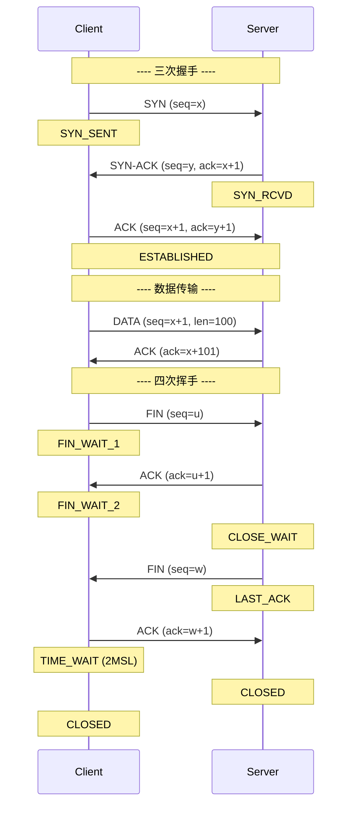
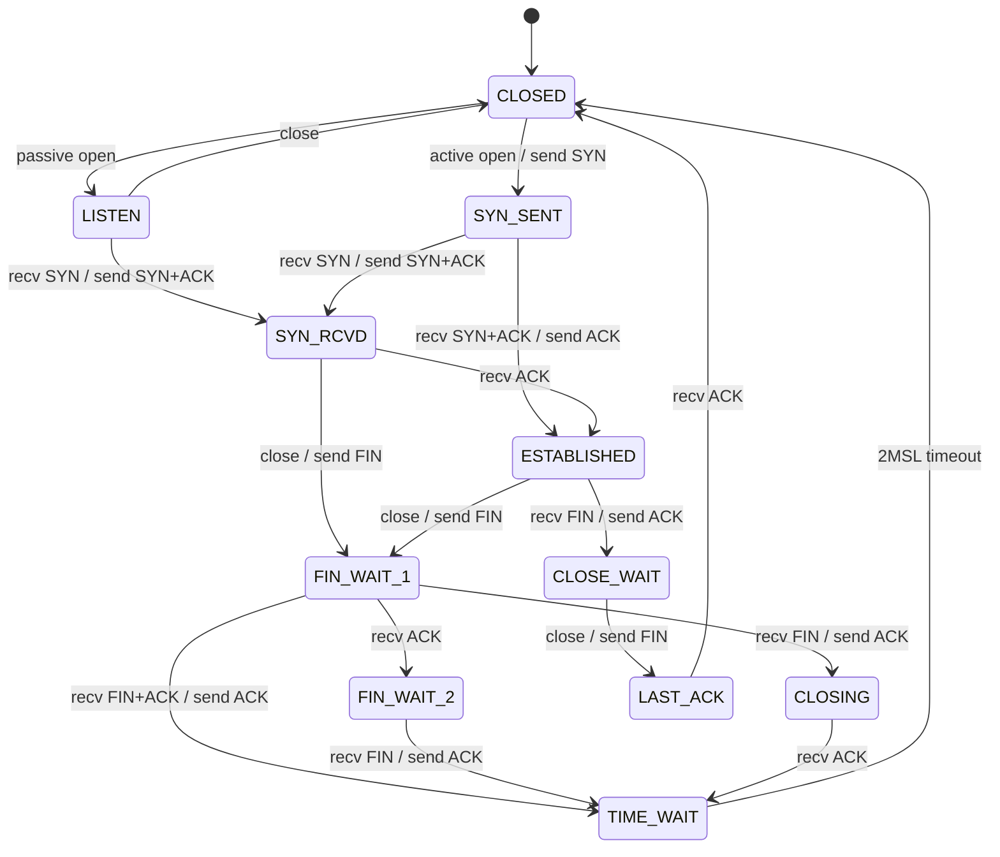
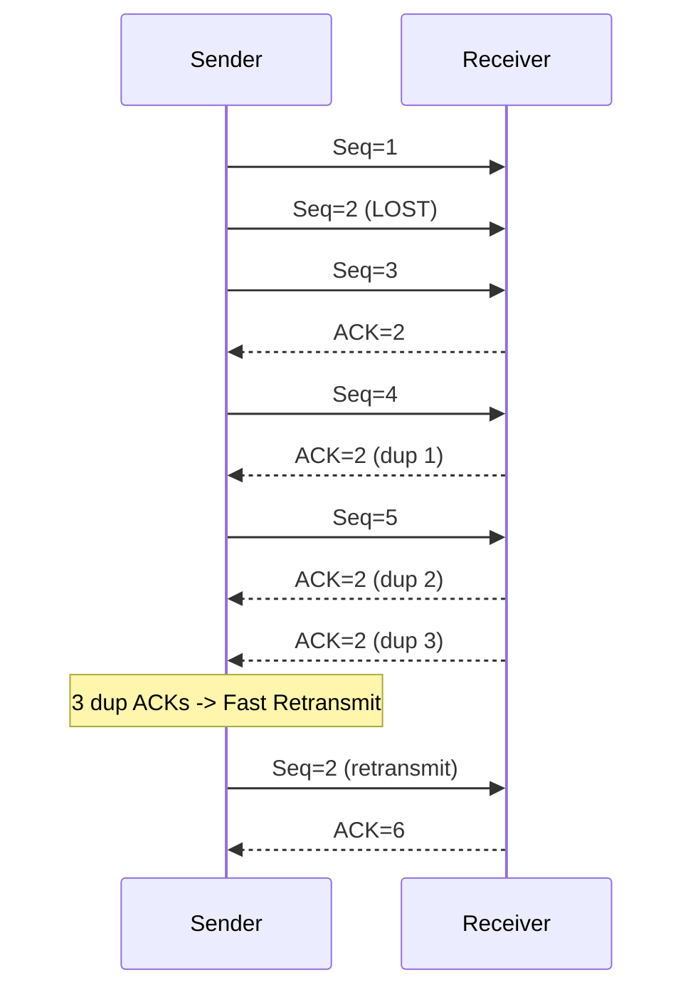
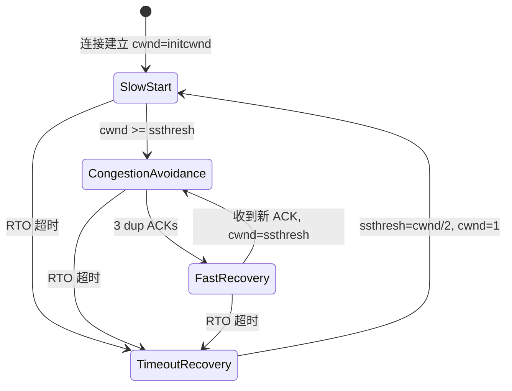
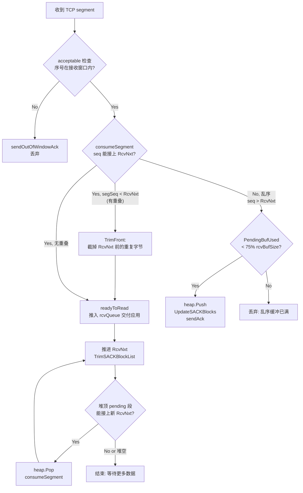

##  0x00    前言
本文汇总下笔者在近期工作中遇到的与 TCP/IP 协议栈相关的知识点汇总

####    Linux内核网络数据收发流程
1、Linux网络接收数据包流程如下，在Linux内核中当数据包到达网卡的时候，通过`DMA`方式将数据映射到内存，然后硬中断通知CPU有数据到来，调用硬中断处理函数，之后交给软中断去处理。通过`ksoftirq`调用软中断处理函数，收包的软中断处理函数是`net_rx_action`函数，主要将Ring Buffer缓冲区数据做成`sk_buff`送给上层协议栈进行处理，之后数据包经过层层解包最终将数据放入套接字缓冲区中，CPU通过将数据拷贝给应用程序


2、Linux网络发送数据包流程如下，首先，应用层应用程序通过CPU将数据拷贝到套接字缓冲区，然后数据包经过层层处理封装好数据包，经过软中断处理函数，通过建立`DMA`映射，将数据放到发送缓冲区中，最后经过一个物理网卡发送出去


####    DMA
DMA（Direct Memory Access，直接内存访问）它可以在CPU不参与的情况下，完成外部硬件设备和存储器之间或者存储器和存储器之间的高速数据传输，数据可以直接通过DMA进行快速拷贝，节省 CPU 的资源去做其他工作

<!--TODO: 补充 DMA 工作原理示意图-->

##  0x01    链路层

-   目的 mac 地址：`6` 字节物理地址
-   源 mac 地址：`6` 字节物理地址
-   数据包协议类型： 为 `0x0800` 时为 IPv4 协议包，为 `0x0806` 时，后面为 ARP 协议包
-   数据包：网卡输送能力上限 MTU(`1500` 字节), 对网络层 ip 协议对封装

```TEXT
0               1               2               3               4               5               6
0 1 2 3 4 5 6 7 8 1 2 3 4 5 6 7 8 1 2 3 4 5 6 7 8 1 2 3 4 5 6 7 8 1 2 3 4 5 6 7 8 1 2 3 4 5 6 7 8
+-+-+-+-+-+-+-+-+-+-+-+-+-+-+-+-+-+-+-+-+-+-+-+-+-+-+-+-+-+-+-+-+-+-+-+-+-+-+-+-+-+-+-+-+-+-+-+-+
|                          DESTINATION      MAC    6 字节目的 mac 地址                               |
+-+-+-+-+-+-+-+-+-+-+-+-+-+-+-+-+-+-+-+-+-+-+-+-+-+-+-+-+-+-+-+-+-+-+-+-+-+-+-+-+-+-+-+-+-+-+-+-+
|                          ORIGINALSRC      MAC    6 字节源 mac 地址                                |
+-+-+-+-+-+-+-+-+-+-+-+-+-+-+-+-+-+-+-+-+-+-+-+-+-+-+-+-+-+-+-+-+-+-+-+-+-+-+-+-+-+-+-+-+-+-+-+-+
|       2 字节 网络层协议类型      |     46 - 1500 字节（ip 包头 + 传输层包头 + 应用层数据）           |
+-+-+-+-+-+-+-+-+-+-+-+-+-+-+-+-+-+-+-+-+-+-+-+-+-+-+-+-+-+-+-+-+-+-+-+-+-+-+-+-+-+-+-+-+-+-+-+-+
```

##  0x02    网络层

####    IPv4 协议头格式

```TEXT
 0                   1                   2                   3
 0 1 2 3 4 5 6 7 8 9 0 1 2 3 4 5 6 7 8 9 0 1 2 3 4 5 6 7 8 9 0 1
+-+-+-+-+-+-+-+-+-+-+-+-+-+-+-+-+-+-+-+-+-+-+-+-+-+-+-+-+-+-+-+-+
|Version|  IHL  |Type of Service|          Total Length         |
+-+-+-+-+-+-+-+-+-+-+-+-+-+-+-+-+-+-+-+-+-+-+-+-+-+-+-+-+-+-+-+-+
|         Identification        |Flags|      Fragment Offset    |
+-+-+-+-+-+-+-+-+-+-+-+-+-+-+-+-+-+-+-+-+-+-+-+-+-+-+-+-+-+-+-+-+
|  Time to Live |    Protocol   |         Header Checksum       |
+-+-+-+-+-+-+-+-+-+-+-+-+-+-+-+-+-+-+-+-+-+-+-+-+-+-+-+-+-+-+-+-+
|                       Source Address                          |
+-+-+-+-+-+-+-+-+-+-+-+-+-+-+-+-+-+-+-+-+-+-+-+-+-+-+-+-+-+-+-+-+
|                    Destination Address                        |
+-+-+-+-+-+-+-+-+-+-+-+-+-+-+-+-+-+-+-+-+-+-+-+-+-+-+-+-+-+-+-+-+
|                    Options                    |    Padding    |
+-+-+-+-+-+-+-+-+-+-+-+-+-+-+-+-+-+-+-+-+-+-+-+-+-+-+-+-+-+-+-+-+
```

关键字段说明：

-   **Version**（`4bit`）：协议版本，IPv4 为 `4`
-   **IHL**（`4bit`）：IP 头长度，以 `4` 字节为单位，最小为 `5`（即 `20` 字节），最大为 `15`（即 `60` 字节）
-   **Total Length**（`16bit`）：IP 数据包总长度，最大 `65535` 字节
-   **Identification / Flags / Fragment Offset**：IP 分片与重组相关字段
-   **TTL**（`8bit`）：生存时间，每经过一个路由器减 `1`，到 `0` 时丢弃（防止数据包在网络中无限循环），Linux 默认 `64`（可通过 `net.ipv4.ip_default_ttl` 配置）
-   **Protocol**（`8bit`）：上层协议类型，`6` 为 TCP，`17` 为 UDP，`1` 为 ICMP
-   **Header Checksum**（`16bit`）：IP 头校验和，每经过一个路由器都要重新计算（因为 TTL 变了）

####    IP 分片与重组

当 IP 数据包大小超过链路层的 MTU（通常 `1500` 字节）时，IP 层会将数据包分片传输。接收方根据 `Identification`（标识同一原始包的所有分片）、`MF`（More Fragments 标志）和 `Fragment Offset`（分片偏移量，以 `8` 字节为单位）来重组原始数据包

-   **DF 标志**（Don't Fragment）：设置后禁止分片，如果包大于 MTU 则丢弃并返回 ICMP `Fragmentation Needed` 错误，这是 Path MTU Discovery 的基础
-   分片在网络中的任意路由器都可能发生，但重组只在最终目的主机上进行

##  0x03    传输层：TCP

####    TCP协议格式

TCP 头部格式如下，需要注意几个核心字段：**Sequence Number** 用来解决网络包乱序（reordering）问题；**Acknowledgement Number** 即 ACK，用来解决丢包的问题；**Window**（Advertised-Window）就是滑动窗口，用于解决流控；**TCP Flag** 用于操控 TCP 状态机

```TEXT
 0                   1                   2                   3
 0 1 2 3 4 5 6 7 8 9 0 1 2 3 4 5 6 7 8 9 0 1 2 3 4 5 6 7 8 9 0 1
+-+-+-+-+-+-+-+-+-+-+-+-+-+-+-+-+-+-+-+-+-+-+-+-+-+-+-+-+-+-+-+-+
|          Source Port          |       Destination Port        |
+-+-+-+-+-+-+-+-+-+-+-+-+-+-+-+-+-+-+-+-+-+-+-+-+-+-+-+-+-+-+-+-+
|                        Sequence Number                        |
+-+-+-+-+-+-+-+-+-+-+-+-+-+-+-+-+-+-+-+-+-+-+-+-+-+-+-+-+-+-+-+-+
|                    Acknowledgment Number                      |
+-+-+-+-+-+-+-+-+-+-+-+-+-+-+-+-+-+-+-+-+-+-+-+-+-+-+-+-+-+-+-+-+
|  Data |       |C|E|U|A|P|R|S|F|                               |
| Offset| Rsrvd |W|C|R|C|S|S|Y|I|            Window             |
|       |       |R|E|G|K|H|T|N|N|                               |
+-+-+-+-+-+-+-+-+-+-+-+-+-+-+-+-+-+-+-+-+-+-+-+-+-+-+-+-+-+-+-+-+
|           Checksum            |         Urgent Pointer        |
+-+-+-+-+-+-+-+-+-+-+-+-+-+-+-+-+-+-+-+-+-+-+-+-+-+-+-+-+-+-+-+-+
|                    Options                    |    Padding    |
+-+-+-+-+-+-+-+-+-+-+-+-+-+-+-+-+-+-+-+-+-+-+-+-+-+-+-+-+-+-+-+-+
|                             data                              |
+-+-+-+-+-+-+-+-+-+-+-+-+-+-+-+-+-+-+-+-+-+-+-+-+-+-+-+-+-+-+-+-+
```

TCP 的包是不关心 IP 地址的，那是 IP 层上的事，但是有源端口和目标端口。一个 TCP 连接需要四元组来表示是同一个连接 `(src_ip, src_port, dst_ip, dst_port)`

####    TCP的状态机

网络上的传输是没有连接的，包括 TCP 也是一样的。TCP 所谓的"连接"，其实只不过是在通讯的双方维护一个"连接状态"，让它看上去好像有连接一样。所以 TCP 的状态变换是非常重要的

**三次握手**的主要目的是初始化 Sequence Number 的初始值（ISN：Initial Sequence Number），通信双方要互相通知对方自己的 ISN。**四次挥手**本质上是 `2` 次，因为 TCP 是全双工的，所以发送方和接收方都需要 `FIN` 和 `ACK`



TCP 完整的 `11` 种状态转换如下：



几个关键问题（引用自 [coolshell](https://coolshell.cn/articles/11564.html)）：

> **关于建连接时 SYN 超时**：如果 server 端接到了 client 发的 SYN 后回了 SYN-ACK 后 client 掉线了，server 端没有收到 client 回来的 ACK，那么这个连接处于一个中间状态。于是 server 端如果在一定时间内没有收到的 TCP 会重发 SYN-ACK。在 Linux 下，默认重试次数为 `5` 次，重试的间隔时间从 `1s` 开始每次都翻倍，`5` 次的重试时间间隔为 `1s, 2s, 4s, 8s, 16s`，总共 `31s`，第 `5` 次发出后还要等 `32s` 才知道第 `5` 次也超时了，所以总共需要 `63s`，TCP 才会断开这个连接

> **关于 SYN Flood 攻击**：攻击者给服务器发了一个 SYN 后就下线了，于是服务器需要默认等 `63s` 才会断开连接，这样攻击者就可以把服务器的 SYN 连接队列耗尽。Linux 通过 `tcp_syncookies` 的参数来应对，当 SYN 队列满了后，TCP 会通过源地址端口、目标地址端口和时间戳构造出一个特别的 Sequence Number 发回去（cookie），如果是正常连接则会把这个 SYN Cookie 发回来，然后服务端可以通过 cookie 建连接。对于正常的请求应该调整三个 TCP 参数：`tcp_synack_retries`（减少重试次数）、`tcp_max_syn_backlog`（增大 SYN 连接数）、`tcp_abort_on_overflow`（处理不过来干脆拒绝连接）

> **关于 ISN 的初始化**：ISN 不能 hard code，RFC793 中说 ISN 会和一个假的时钟绑在一起，这个时钟会在每 `4` 微秒对 ISN 做加一操作，直到超过 `2^32`，又从 `0` 开始。这样一个 ISN 的周期大约是 `4.55` 个小时。只要 MSL 的值小于 `4.55` 小时就不会重用到 ISN

> **关于 MSL 和 TIME_WAIT**：从 TIME_WAIT 到 CLOSED 状态有一个超时设置 `2*MSL`（RFC793 定义了 MSL 为 `2` 分钟，Linux 设置成了 `30s`）。原因有二：1）TIME_WAIT 确保有足够的时间让对端收到了 ACK，如果被动关闭的那方没有收到 ACK 就会触发被动端重发 FIN，一来一去正好 `2` 个 MSL；2）有足够的时间让这个连接不会跟后面的连接混在一起

> **关于 TIME_WAIT 数量太多**：大并发短连接场景下 TIME_WAIT 会太多。常见的处理方式是设置 `tcp_tw_reuse` 和 `tcp_tw_recycle` 参数（后者 `recycle` 比前者 `reuse` 更为激进），但**打开这两个参数会有比较大的坑——可能会让 TCP 连接出一些诡异的问题**。如果使用 `tcp_tw_reuse`，必须设置 `tcp_timestamps=1`，否则无效。`tcp_tw_recycle` 在 NAT 网络环境下会导致建链接的 SYN 被直接丢掉（4.12+ 版本已移除此参数）。**使用 `tcp_tw_reuse` 和 `tcp_tw_recycle` 来解决 TIME_WAIT 的问题是非常危险的，因为这两个参数违反了 TCP 协议（RFC 1122）**

####    TCP options

1、tcp timestamp option 在三次握手中有什么作用？

TCP Timestamp Option（时间戳选项，RFC 7323）在 TCP 头部 Options 中携带两个 `32bit` 的时间戳字段（`TSval` 和 `TSecr`），主要有两个核心作用：

-   **RTTM（Round-Trip Time Measurement）**：发送方在 `SYN` 包中设置 `TSval` 为当前时间戳，接收方在 `SYN-ACK` 中将 `TSval` 回填到 `TSecr`。发送方收到后可精确计算 RTT，比传统采样更准确（尤其在重传场景下可以区分原始包和重传包的 ACK，解决了 Karn 算法的问题）
-   **PAWS（Protection Against Wrapped Sequence Numbers）**：防止序列号回绕导致旧连接的延迟报文被新连接误收。当序列号空间在高速网络中快速消耗完并回绕时，PAWS 通过检查时间戳的单调递增性来拒绝旧的报文段。这对于高带宽长肥管道（Long Fat Network）场景尤为重要

可以通过 `sysctl -w net.ipv4.tcp_timestamps=0` 禁用 TCP 时间戳选项。禁用后每个数据包可节省 `12` 字节（选项头），但会丧失 PAWS 保护和精确的 RTT 测量能力。**在高速网络环境和使用 `tcp_tw_reuse` 的场景下，强烈建议保持 timestamps 开启**
####    TCP options：SACK

todo

####    TCP options：D-SACK

todo

####    SEQ && ACK
-   序列号（`SEQ`）：在建立连接时由内核生成的随机数作为其初始值，通过 `SYN` 报文传给接收端主机，每发送一次数据，就累加一次该数据字节数的大小，用来解决网络包乱序问题。累加方式为序列号等于上一次发送的序列号加上`len(data)`，若上一次发送的报文是 `SYN`/`FIN` 报文，则调整为上一次发送的序列号加一
-   确认号（`ACK`）：指下一次期望收到的数据的序列号，发送端收到接收方发来的 `ACK` 确认报文以后，可认为在这个序号以前的数据都已经被正常接收；用来解决丢包的问题。确认号等于上一次收到的报文中的序列号再加上 `len(data)`。若收到的是 SYN/FIN 报文，则等于上一次收到的报文中的序列号加一

在 TCP 重组中，依赖于这两个关键参数

####    MTU And MSS
-   MTU: Maximum Transmission Unit 最大传输单元
-   MSS: Maximum Segment Size 最大分段大小

##  0x04    TCP：高级话题

####    TCP 滑动窗口机制
基于滑动窗口的流控机制，是TCP避免发送方的数据填满接收方的缓存，标识为tcp头中的`window`字段，通常窗口大小由接收方的窗口大小来决定（注意TCP是全双工的，这里只考虑一方客户端发送另一方服务端接收的场景），引出两个问题：

1.  接收方（server）如何计算window的大小并设置于TCP协议头部（接收方告诉发送方当前自己还有多少缓冲区可以用于接收数据）
2.  发送方（client）收到了上面的数据包，如何使用这个`tcpheader->window`，首先发送方发送的数据大小不能超过接收方的窗口大小，否则接收方就无法正常接收到数据，其次发送方还需要考虑拥塞控制等场景

TCP 必须要解决可靠传输以及包乱序（reordering）的问题，所以 TCP 必须要知道网络实际的数据处理带宽或是数据处理速度，这样才不会引起网络拥塞导致丢包。TCP Header中的 Window字段（Advertised-Window），该字段是**接收端告诉发送端自己还有多少缓冲区可以接收数据**。于是发送端就可以根据这个接收端的处理能力来发送数据，而不会导致接收端处理不过来

TCP 缓冲区的关键指针如下：

-   接收端：`LastByteRead` 指向 TCP 缓冲区中读到的位置，`NextByteExpected` 指向收到的连续包的最后一个位置，`LastByteRcved` 指向收到的包的最后一个位置（中间可能有数据空白区）
-   发送端：`LastByteAcked` 指向被接收端 ACK 过的位置，`LastByteSent` 表示发出去了但还没收到确认 ACK 的位置，`LastByteWritten` 指向上层应用正在写的地方

接收端回（给发送端） ACK 中会汇报 `AdvertisedWindow = MaxRcvBuffer – LastByteRcvd – 1`；发送方根据这个窗口控制发送数据的大小

#####   1、发送方的滑动窗口

发送方的数据分为四个区域：

```TEXT
      已确认(#1)  |  已发未确认(#2)  |  窗口内未发(#3) | 窗口外(#4)
  ──────────────┼────────────────┼───────────────┼──────────────
                |<── 发送窗口(snd_wnd) ──────────>|
           snd_una              snd_nxt
```

-   `#1`：已收到 ACK 确认的数据
-   `#2`：已发送但还没收到 ACK 的数据
-   `#3`：在窗口中还没有发出的（接收方还有空间）
-   `#4`：窗口以外的数据（接收方没空间）

当收到新的 ACK 后，窗口左边界（`snd_una`）向右滑动；当发送新数据时，`snd_nxt` 向右推进

#####   2、接收方的滑动窗口

接收方窗口相对简单：

```TEXT
      已接收已确认  |  接收窗口(可接收)    | 不可接收
  ──────────────┼──────────────────┼──────────────
           rcv_nxt          rcv_nxt + rcv_wnd
```

接收方通过动态调整 `rcv_wnd` 来通告发送方自己的处理能力

#####   3、Zero Window

> 如果 Window 变成 `0` 了，发送端就不发数据了（Window Closed）。如果发送端不发数据了，接收方一会儿 Window size 可用了怎么通知发送端呢？TCP 使用了 Zero Window Probe 技术，发送端在窗口变成 `0` 后，会发 ZWP 的包给接收方，让接收方来 ACK 其 Window 尺寸，一般这个值会设置成 `3` 次，每次大约 `30-60` 秒（如果 `3` 次过后还是 `0` 的话，有的 TCP 实现就会发 RST 把链接断了）

#####   4、Silly Window Syndrome（糊涂窗口综合症）

> 如果接收方太忙了，来不及取走 Receive Window 里的数据，那么就会导致发送方的窗口越来越小。到最后如果接收方腾出几个字节并告诉发送方现在有几个字节的 Window，而发送方会义无反顾地发送这几个字节。要知道 TCP+IP 头有 `40` 个字节，为了几个字节要搭上这么大的开销，这太不经济了

> **Silly Window Syndrome 现象就像是本来可以坐 200 人的飞机里只做了一两个人**

> 要解决这个问题就是避免对小的 window size 做出响应，直到有足够大的 window size 再响应：
>
> -   如果这个问题是由 **Receiver 端**引起的，那么就会使用 **David D. Clark 方案**：在 receiver 端，如果收到的数据导致 window size 小于某个值，可以直接 `ack(0)` 回 sender 把 window 给关闭了，等到 receiver 端处理了一些数据后 window size 大于等于了 MSS 或者 receiver buffer 有一半为空，就可以把 window 打开让 sender 发送数据过来
>
> -   如果这个问题是由 **Sender 端**引起的，那么就会使用著名的 **Nagle 算法**：1）要等到 `Window Size >= MSS` 或是 `Data Size >= MSS`，2）收到之前发送数据的 ACK 回包，才会发数据，否则就是在攒数据

> 另外，Nagle 算法默认是打开的，对于一些需要小包场景的程序——**比如像 telnet 或 ssh 这样的交互性比较强的程序，需要关闭这个算法**。可以在 socket 设置 `TCP_NODELAY` 选项来关闭这个算法（关闭 Nagle 算法没有全局参数，需要根据每个应用自己的特点来关闭）
>
> ```c
> setsockopt(sock_fd, IPPROTO_TCP, TCP_NODELAY, (char *)&value, sizeof(int));
> ```

> **TCP_CORK 其实是更激进的 Nagle 算法，完全禁止小包发送，而 Nagle 算法没有禁止小包发送，只是禁止了大量的小包发送。最好不要两个选项都设置**

**补充**：Nagle 算法与 TCP Delayed ACK（延迟确认，接收方等待 `40ms` 看是否有数据捎带确认）组合使用时可能导致 `40ms` 的额外延迟，这在对延迟敏感的应用中（如游戏、实时通信）是不可接受的，所以这类场景通常需要设置 `TCP_NODELAY`

####    TCP重传机制

TCP 要保证所有的数据包都可以到达，所以必须要有重传机制。注意，接收端给发送端的 ACK 确认只会确认最后一个**连续**的包，即 **SeqNum 和 ACK 是以字节数为单位，ACK 的时候不能跳着确认，只能确认最大的连续收到的包**

#####   TCP 的 RTT 算法

Timeout 的设置对于重传非常重要。设长了重发就慢，设短了可能并没有丢就重发，会增加网络拥塞。TCP 引入了 RTT（Round Trip Time）来动态设置 RTO（Retransmission TimeOut）

**1）经典算法（RFC793）**

> 首先采样 RTT，然后做平滑计算 SRTT（Smoothed RTT）：**SRTT = (α \* SRTT) + ((1-α) \* RTT)**（其中 `α` 取值在 `0.8` 到 `0.9` 之间，这个算法叫 Exponential weighted moving average、加权移动平均）。然后计算 RTO：**RTO = min[UBOUND, max[LBOUND, (β \* SRTT)]]**（其中 UBOUND 是最大的 timeout 时间上限，LBOUND 是最小的 timeout 时间下限，`β` 值一般在 `1.3` 到 `2.0` 之间）

**2）Karn/Partridge 算法（1987）**

> 经典算法在重传的时候有个终极问题，是用第一次发数据的时间和 ACK 回来的时间做 RTT 样本值，还是用重传的时间和 ACK 回来的时间做 RTT 样本值？无论选哪头都有问题。所以 Karn/Partridge 算法的最大特点是**忽略重传，不把重传的 RTT 做采样**。但这又引发了一个 BUG：如果网络突然变慢产生了较大延时导致要重传所有的包，因为重传的不算，RTO 就不会被更新。于是 Karn 算法用了一个取巧的方式——只要一发生重传，就对现有的 RTO 值翻倍（Exponential backoff）

**3）Jacobson/Karels 算法（1988，当前 Linux 使用）**

> 前面两种算法用的都是加权移动平均，最大的问题就是如果 RTT 有一个大的波动，很难被发现，因为被平滑掉了。Jacobson/Karels 算法引入了最新的 RTT 采样和平滑过的 SRTT 的差距做因子来计算：
>
> **SRTT = SRTT + α(RTT – SRTT)** ： 计算平滑 RTT
>
> **DevRTT = (1-β) \* DevRTT + β \* (|RTT-SRTT|)** ： 计算平滑 RTT 和真实值的差距（加权移动平均）
>
> **RTO = μ \* SRTT + ∂ \* DevRTT** 
>
> 在 Linux 下，`α = 0.125,β = 0.25,μ = 1,∂ = 4`

**补充**：Linux 4.11.6 中该算法实现在 [`tcp_rtt_estimator()`](https://elixir.bootlin.com/linux/v4.11.6/source/net/ipv4/tcp_input.c#L710)，内核中 RTO 的最小值默认为 `200ms`（`TCP_RTO_MIN`），最大值为 `120s`（`TCP_RTO_MAX`）

#####   1、超时重传机制

当发送方发送数据后启动 RTO 定时器，如果在 RTO 时间内没有收到对应的 ACK，则触发超时重传。有两种选择：

-   仅重传 timeout 的包（节省带宽但慢）
-   重传 timeout 后所有的数据（快但浪费带宽）

这两种方式都不好，因为都在等 timeout，timeout 可能会很长

#####   2、快速重传机制

> TCP 引入了 **Fast Retransmit** 算法，**不以时间驱动，而以数据驱动重传**。也就是说，如果包没有连续到达，就 ACK 最后那个可能被丢了的包，如果发送方连续收到 `3` 次相同的 ACK，就重传。Fast Retransmit 的好处是不用等 timeout 了再重传

示例：发送方发出了 `1, 2, 3, 4, 5` 份数据，第一份先送到了于是 ACK 回 `2`，结果 `2` 因为某些原因没收到，`3` 到达了于是还是 ACK 回 `2`，后面的 `4` 和 `5` 都到了但还是 ACK 回 `2`，发送端收到了三个 `ack=2` 的确认，知道了 `2` 还没有到，于是就马上重传 `2`。接收端收到了 `2`，此时因为 `3, 4, 5` 都收到了，于是 ACK 回 `6`



> Fast Retransmit 只解决了一个问题，就是 timeout 的问题，它依然面临一个艰难的选择，就是，是重传之前的一个还是重传所有的问题。因为发送端并不清楚这连续的 `3` 个 dup ACK 是谁传回来的

#####   3、SACK 机制

> 另外一种更好的方式叫 **Selective Acknowledgment（SACK）**（参看 RFC 2018），这种方式需要在 TCP 头里加一个 SACK 的东西，ACK 还是 Fast Retransmit 的 ACK，SACK 则是汇报收到的数据碎版。这样在发送端就可以根据回传的 SACK 来知道哪些数据到了，哪些没有到，于是就优化了 Fast Retransmit 的算法

> 这里还需要注意一个问题——**接收方 Reneging，所谓 Reneging 的意思就是接收方有权把已经报给发送端 SACK 里的数据给丢了**。这样干是不被鼓励的，因为这个事会把问题复杂化了，但是接收方这么做可能会有些极端情况，比如要把内存给别的更重要的东西。**所以发送方也不能完全依赖 SACK，还是要依赖 ACK，并维护 Time-Out，如果后续的 ACK 没有增长，那么还是要把 SACK 的东西重传，另外接收端这边永远不能把 SACK 的包标记为 ACK**

> 注意：SACK 会消费发送方的资源，试想如果一个攻击者给数据发送方发一堆 SACK 的选项，这会导致发送方开始要重传甚至遍历已经发出的数据，这会消耗很多发送端的资源

**补充**：Linux 下可以通过 `net.ipv4.tcp_sack` 参数打开 SACK 功能（Linux 2.4 后默认打开）。内核 4.11.6 中 SACK 的处理逻辑在 [`tcp_sacktag_write_queue()`](https://elixir.bootlin.com/linux/v4.11.6/source/net/ipv4/tcp_input.c#L1548)

#####   4、Duplicate SACK（D-SACK）：重复收到数据的问题

> D-SACK 主要使用了 SACK 来告诉发送方有哪些数据被重复接收了（RFC 2883）。D-SACK 使用了 SACK 的第一个段来做标志：
> - 如果 SACK 的第一个段的范围被 ACK 所覆盖，那么就是 D-SACK
> - 如果 SACK 的第一个段的范围被 SACK 的第二个段覆盖，那么就是 D-SACK

**示例一：ACK 丢包**

```TEXT
Transmitted  Received    ACK Sent
Segment      Segment     (Including SACK Blocks)

3000-3499    3000-3499   3500 (ACK dropped)
3500-3999    3500-3999   4000 (ACK dropped)
3000-3499    3000-3499   4000, SACK=3000-3500
                                    ---------
```

丢了两个 ACK，所以发送端重传了第一个数据包 `3000-3499`，接收端发现重复收到，回了一个 `SACK=3000-3500`，因为 ACK 都到了 `4000`（意味着收到了 `4000` 之前的所有数据），所以这个 SACK 就是 D-SACK——告诉发送端数据包没有丢，丢的是 ACK 包

**示例二：网络延误**

```TEXT
Transmitted    Received    ACK Sent
Segment        Segment     (Including SACK Blocks)

500-999        500-999     1000
1000-1499      (delayed)
1500-1999      1500-1999   1000, SACK=1500-2000
2000-2499      2000-2499   1000, SACK=1500-2500
2500-2999      2500-2999   1000, SACK=1500-3000
1000-1499      1000-1499   3000
               1000-1499   3000, SACK=1000-1500
                                  ---------
```

网络包 `1000-1499` 被网络延误了，后面到达的三个包触发了 Fast Retransmit 重传，但重传时被延误的包又到了，所以回了一个 `SACK=1000-1500`（D-SACK），标识发送端知道之前的重传不是因为丢包，而是因为网络延时

> 引入了 D-SACK 有这么几个好处：
> 1. 可以让发送方知道，是发出去的包丢了，还是回来的 ACK 包丢了
> 2. 是不是自己的 timeout 太小了导致重传
> 3. 网络上出现了先发的包后到的情况（reordering）
> 4. 网络上是不是把数据包给复制了
>
> **知道这些东西可以很好得帮助 TCP 了解网络情况，从而可以更好的做网络上的流控**

**补充**：Linux 下的 `net.ipv4.tcp_dsack` 参数用于开启 D-SACK 功能（Linux 2.4 后默认打开）

####    拥塞控制算法（Congestion Handling）
Congestion Handling是TCP协议设计者针对整个网络的考量，即TCP不是一个自私的协议，当拥塞发生的时候，要做自我牺牲，就像交通阻塞一样，每个车都应该把路让出来，避免加重拥塞。Congestion Handling主要是如下四个算法：

-   慢启动（Slow Start）
-   拥塞避免（Congestion Avoidance）
-   拥塞发生
-   快速恢复（Fast Recovery）

TCP拥塞控制目的就是避免发送方的数据填满整个网络。为了在发送方调节所要发送数据的量，引入新概念即拥塞窗口，拥塞窗口 `cwnd`是**发送方**维护的一个的状态变量，它会根据网络的拥塞程度动态变化的。前文提到过发送窗口 `swnd` 与接收窗口 `rwnd` 是约等于的关系，那么引入拥塞窗口后，此时发送窗口的值是`swnd = min(cwnd, rwnd)`，即拥塞窗口和接收窗口中的最小值。拥塞窗口 `cwnd` 变化的基本规则：

-  **只要网络中没有出现拥塞，`cwnd` 就会增大**
-  **但网络中出现了拥塞，`cwnd` 就减少**

那么问题来了，协议栈如何判断当前网络出现拥塞？判断方式是**只要发送方没有在规定时间内接收到 ACK 应答报文，也就是发生了超时重传，就会认为网络出现了拥塞**

接下来就分析下拥塞控制的四类算法

1、慢启动

慢启动的意思是，刚刚加入网络的连接，一点一点地提速，不要一上来就像那些特权车一样霸道地把路占满，规则为**当发送方每收到一个 ACK，拥塞窗口 cwnd 的大小就会加 1，是指数性的增长**，慢启动的算法如下（如果网速很快的话，ACK也会返回得快，RTT也会短，那么慢启动就一点也不慢）：

1.  连接建好的开始先初始化 `cwnd = 1`，表明可以传一个 `MSS` 大小的数据
2.  每当收到一个 ACK，`cwnd++`（单个 ACK 维度看是线性 +1，但一个 RTT 内会收到 `cwnd` 个 ACK）
3.  每当过了一个 RTT，`cwnd = cwnd*2`，**总体效果呈指数增长**
4.  慢启动何时结束？状态变量慢启动门限 ssthresh（slow start threshold）是一个上限，当 `cwnd >= ssthresh` 时，就会结束慢启动模式，进入拥塞避免算法

-   当 `cwnd < ssthresh` 时，使用慢启动算法
-   当 `cwnd >= ssthresh` 时，就会使用拥塞避免算法

> 引用 Google 的论文 [An Argument for Increasing TCP's Initial Congestion Window](https://research.google/pubs/an-argument-for-increasing-tcps-initial-congestion-window/)：Linux 3.0 后采用了该论文的建议，把 `cwnd` 初始化成了 `10` 个 MSS。而 Linux 3.0 以前（如 2.6），Linux 采用了 RFC3390，cwnd 是跟 MSS 的值来变的：如果 `MSS < 1095` 则 `cwnd = 4`；如果 `MSS > 2190` 则 `cwnd = 2`；其它情况下则是 `3`

```BASH
# kernel 5.4.119
[root@VM-X-X-tencentos X-X]#  ss -nli |grep cwnd
         cubic cwnd:10
         cubic cwnd:10
         cubic cwnd:10
```

小结下，TCP拥塞控制的各个阶段特点：

| 阶段 | 触发条件 | cwnd 变化规则 | 作用 |
| :-----| :---- | :---- | :----|
| 慢启动 | 连接建立或超时重传后 | 每收到 `1` 个 ACK，`cwnd++`；每过一个 RTT，`cwnd` 翻倍（指数增长） | 快速探测可用带宽 |
| 拥塞避免 | `cwnd >= ssthresh` | 每收到 `1` 个 ACK，`cwnd += 1/cwnd`；每过一个 RTT，`cwnd += 1`（线性增长） | 谨慎探测网络容量上限 |
| 快速重传 | 收到 `3` 个重复 ACK | 立即重传丢失的包（不等 RTO 超时） | 快速恢复单包丢失 |
| 快速恢复（TCP Reno） | 快速重传触发后 | `ssthresh = cwnd/2`，`cwnd = ssthresh + 3 MSS`；之后每收到重复 ACK，`cwnd += 1 MSS` | 维持传输速率避免中断 |
| 超时重传 | RTO 超时（严重拥塞）| `ssthresh = cwnd/2`，`cwnd = 1 MSS`，回到慢启动 | 彻底降速缓解拥塞 |

#####   2、拥塞避免算法（Congestion Avoidance）

> 当 `cwnd >= ssthresh` 时进入拥塞避免算法（一般来说 ssthresh 的值是 `65535` 字节），算法如下：
>
> 1）收到一个 ACK 时，`cwnd = cwnd + 1/cwnd`
>
> 2）当每过一个 RTT 时，`cwnd = cwnd + 1`
>
> 这样就可以避免增长过快导致网络拥塞，慢慢的增加调整到网络的最佳值。很明显，是一个线性上升的算法

#####   3、拥塞发生时的算法

当丢包的时候，会有两种情况：

**情况一：RTO 超时重传**（TCP 认为这种情况太糟糕，反应也很强烈）

> - `ssthresh = cwnd / 2`
> - `cwnd` 重置为 `1`
> - 进入慢启动过程

**情况二：收到 3 个 duplicate ACK（Fast Retransmit）**

> - TCP Tahoe 的实现和 RTO 超时一样
> - TCP Reno 的实现是：
>   - `cwnd = cwnd / 2`
>   - `ssthresh = cwnd`
>   - 进入快速恢复算法（Fast Recovery）

#####   4、快速恢复算法（Fast Recovery）

**TCP Reno**（定义在 RFC5681）：

> 快速重传和快速恢复算法一般同时使用。快速恢复算法是认为，还有 `3` 个 Duplicated ACKs 说明网络也不那么糟糕，所以没有必要像 RTO 超时那么强烈。进入 Fast Recovery 之前，cwnd 和 ssthresh 已被更新为 `cwnd = cwnd/2`，`ssthresh = cwnd`
>
> 然后真正的 Fast Recovery 算法如下：
>
> - `cwnd = ssthresh + 3 * MSS`（`3` 的意思是确认有 `3` 个数据包被收到了）
> - 重传 Duplicated ACKs 指定的数据包
> - 如果再收到 duplicated ACKs，那么 `cwnd = cwnd + 1`
> - 如果收到了新的 ACK，那么 `cwnd = ssthresh`，然后就进入了拥塞避免的算法了

> 上面这个算法也有问题，**它依赖于 3 个重复的 ACKs**。`3` 个重复的 ACKs 并不代表只丢了一个数据包，很有可能是丢了好多包。但这个算法只会重传一个，而剩下的那些包只能等到 RTO 超时，于是进入了恶梦模式，即超时一个窗口就减半一下，多个超时会超成 TCP 的传输速度呈级数下降

**TCP New Reno**（RFC 6582）：

> 在没有 SACK 的支持下改进 Fast Recovery 算法
>
> - 当 sender 收到了 `3` 个 Duplicated ACKs，进入 Fast Retransmit 模式，重传重复 ACKs 指示的那个包。如果只有这一个包丢了，那么重传这个包后回来的 ACK 会把整个已经被 sender 传输出去的数据 ACK 回来。如果没有的话，说明有多个包丢了，称这个 ACK 为 Partial ACK
> - 一旦 Sender 发现了 Partial ACK 出现，那么 sender 就可以推理出来有多个包被丢了，于是继续重传 sliding window 里未被 ACK 的第一个包，直到再也收不到了 Partial ACK，才真正结束 Fast Recovery 这个过程

**FACK 算法**（Forward Acknowledgment）：

> FACK 是基于 SACK 的算法。SACK 可以让发送端在重传过程中把那些丢掉的包重传，而不是一个一个的传。但如果重传的包数据比较多，又会导致本来就很忙的网络更忙了。所以 FACK 用来做重传过程中的拥塞流控：
>
> - 把 SACK 中最大的 Sequence Number 保存在 `snd.fack`，snd.fack 的更新由 ACK 带秋
> - 定义 `awnd = snd.nxt – snd.fack`（在网络上的数据量 actual quantity of data outstanding in the network）
> - 如果需要重传数据，`awnd = snd.nxt – snd.fack + retran_data`
> - 触发 Fast Recovery 的条件是：`((snd.fack – snd.una) > (3*MSS)) || (dupacks == 3)`。这样不需要等到 `3` 个 dup ACKs 才重传，而是只要 SACK 中最大的一个数据和 ACK 的数据比较长了（`3` 个 MSS），那就触发重传。在整个重传过程中 cwnd 不变，直到当第一次丢包的 `snd.nxt <= snd.una`（重传的数据都被确认了），然后进入拥塞避免机制——cwnd 线性上涨

拥塞控制各阶段的状态转换如下：



#####   5、其他拥塞控制算法简介

> **TCP Vegas**（1994）：通过对 RTT 的非常重的监控来计算一个基准 RTT，然后通过这个基准 RTT 来估计当前的网络实际带宽，如果实际带宽比期望的带宽要小或多，就开始线性地减少或增加 cwnd 的大小。Vegas 的核心思想是用 RTT 的值来影响拥塞窗口，而不是通过丢包

> **HSTCP（High Speed TCP）**（RFC 3649）：使得 Congestion Window 涨得快减得慢。拥塞避免时窗口增长：`cwnd = cwnd + α(cwnd)/cwnd`；丢包后窗口下降：`cwnd = (1-β(cwnd))*cwnd`

> **TCP BIC**（2004）：发明者看穿了事情的本质，其实就是一个搜索的过程，所以 BIC 主要用的是 Binary Search（二分查找）来找到合适的 cwnd。在 Linux 2.6.8 中是默认拥塞控制算法

> **TCP WestWood**：采用和 Reno 相同的慢启动、拥塞避免算法，主要改进是在发送端做带宽估计，当探测到丢包时根据带宽值来设置拥塞窗口、慢启动阈值

**补充**：

-   **CUBIC**（Linux 2.6.19+ 默认算法）：BIC 的改进版本，使用三次函数（cubic function）来调整 cwnd，使得窗口增长在远离上次丢包点时增长更快，靠近时更慢。实现在 [`net/ipv4/tcp_cubic.c`](https://elixir.bootlin.com/linux/v4.11.6/source/net/ipv4/tcp_cubic.c)
-   **BBR**（Google，2016）：完全不同的思路，基于带宽和延迟模型而非丢包来控制拥塞。BBR 交替探测 bottleneck bandwidth 和 min RTT，通过 `pacing_rate` 和 `cwnd` 两个维度来控制发送速率。特别适合高带宽高延迟（如跨洋链路）和有随机丢包的网络。可通过 `sysctl -w net.ipv4.tcp_congestion_control=bbr` 启用

####    TCP：流重组
`SEQ` 是为了保证 TCP 数据包的按顺序传输来设计的，可以有效的实现 TCP 数据的完整传输，特别是在数据传送过程中出现错误的时候可以有效的进行错误修正。在 TCP 会话的重新组合过程中需要按照数据包的序列号对接收到的数据包进行排序

1、BSD 的实现思路 <br>


以 SSH 连接的服务端（被动接收）出发，实现涉及两个队列，队列 A 存放顺序到来的数据包，队列 B 存放失序到来的数据包；假设队列 A 最后的缓存数据记录为 `seq=100`/`len=100`，下一个到达的数据包可能如下：
-   case1：顺序到来的数据包，数据包 `2` 的序列号为 `seq2 = seq1+len1`，由此数据包的 seq 可知，这个报文预期后续报文，将此报文追加到正常报文队列
-   case2：重复数据包，如数据包 `3`/`4`/`5`，都包含在队列 A 已经缓存的数据包 buffer 之中，应该被丢弃
-   case3：重叠数据包，如数据包 `6` 的前部分 `seq=150`、`len=50` 与已缓存的数据包 buffer 重叠，而后部分 `len=50` 则是新数据，此时应该对这个报文作如下处理
    -   计算重复字节数：`(seq1+len1)-seq2=100+100-150=50`，即这个报文段前 `50` 个字节是重复的，需要丢弃
    -   截取报文段新数据，即只保留字节序号段 `200~249`
    -   重新设置这个报文段的 `seq=200`
    -   重新设置这个报文段的数据长度 `len2=50`
    -   将重新设置后报文段加入顺序队列 A
-   case4：提前到达的报文，如数据包 `7`：`seq2>seq1+len1`，是提前到来的报文，此时应该将这个报文放置到失序报文队列 B 缓存起来，以备后续重组使用

这样直到客户端断开此 TCP 连接（`FIN` OR `RST`），此时将正常报文队列和失序报文队列中的数据合并起来，完成重组。取出正常报文队列最后一个报文的 `seq` 和 `len`，在失序报文队列中查找属于它的后续报文，该报文是否可以作为正常报文队列的后续报文，至此重组完成

2、cs144的tcp assembler<br>

todo


3、gvisor 的实现（用户态协议栈）<br>

gvisor 是 Google 开源的用户态 Linux 兼容内核，其 TCP 协议栈实现在 [`pkg/tcpip/transport/tcp/`](https://github.com/google/gvisor/tree/master/pkg/tcpip/transport/tcp)，TCP 重组逻辑相对清晰

**核心数据结构**：

-   **`receiver`**（[`rcv.go`](https://github.com/google/gvisor/blob/master/pkg/tcpip/transport/tcp/rcv.go)）：接收端核心结构，包含 `RcvNxt`（期望接收的下一个序号）、`rcvWnd`（接收窗口大小）
-   **`pendingRcvdSegments`**（`segmentHeap` 类型）：乱序段存储，使用 Go 标准库 `container/heap` 实现的**最小堆**（按序列号排序），堆顶始终是当前最小起始序号的段
-   **`rcvQueue`**（`segmentList` 链表）：已按序可交付给应用层的段链表，应用通过 `Read()` 从这里取数据
-   **`segment`**（[`segment.go`](https://github.com/google/gvisor/blob/master/pkg/tcpip/transport/tcp/segment.go)）：承载 `PacketBuffer`、序号、标志位等；关键方法 `TrimFront(n)` 用于裁剪重叠前缀

**核心算法流程**（`handleRcvdSegment`）：



重点说明：

-   **重叠处理**：当 `segSeq < RcvNxt`（即该段的部分数据已经被确认过），gvisor 通过 `TrimFront(diff)` 截掉前缀中已确认的字节，只保留新数据部分，这与 BSD 方案中的"计算重复字节数→截取新数据"是同一思路
-   **乱序段存储与消费**：乱序段通过 `heap.Push` 入堆；当新的按序段到来使 `RcvNxt` 推进后，会循环检查堆顶是否能接上。如果堆顶段已完全在 `RcvNxt` 之前（纯重复段），则 Pop 掉丢弃
-   **乱序缓冲上限**（设计取舍）：`PendingBufUsed + segLen < rcvBufSize * 3/4`，即约 `75%` 的接收缓冲区配额可给乱序段，`25%` 留给顺序数据交付，防止连接因乱序段占满缓冲而停滞

**gVisor vs Linux 内核 vs BSD 经典方案对比**：

| 维度 | gVisor | Linux 内核（4.11.6） | BSD 经典方案 |
| :---- | :---- | :---- | :---- |
| 乱序结构 | `segmentHeap`（min-heap 按序号） | `rb_tree` + `ofo_queue` 红黑树 | 双队列（顺序队列 A + 失序队列 B） |
| 插入方式 | `heap.Push`，O(log n) | 红黑树插入 + 相邻段合并，O(log n) | 队列追加 |
| 重叠处理 | 消费时 `TrimFront` 截断前缀 | 插入时合并/裁剪（`tcp_data_queue_ofo`） | 计算重复字节数 + 截取新数据 |
| 交付应用 | `readyToRead` -> `rcvQueue` 链表 | `sk_receive_queue` 链表 | 连接结束时合并两队列 |
| SACK 支持 | 乱序入堆时 `UpdateSACKBlocks` | `tcp_sacktag_write_queue()` | 视实现而定 |

####    内核中的相关字段
上述TCP滑动窗口、重传、拥塞控制等机制在内核中的字段大都存在于`tcp_sock`[结构](https://elixir.bootlin.com/linux/v4.11.6/source/include/linux/tcp.h#L144)


滑动窗口动态性，发送窗口由 `snd_una`（左边界）和 `snd_nxt`（右边界）构成，通过ACK滑动左边界，通过 `snd_wnd` 更新右边界。接收方通过 `tcp_rcv_space_adjust()` 动态计算 `rcv_wnd`（可用缓冲区空间），避免应用程序读取过慢导致溢出

一、滑动窗口（发送方窗口控制）

| 字段 | 说明 | 类型| 
| :-----:| :----: | :----: | 
|`snd_wnd`| 接收方通告的窗口大小（来自对端的ACK报文），表示发送方当前最多能发送的字节数|
|`snd_una`|	发送窗口左边界：最早未确认的字节序号（等待ACK的起始位置）|
|`snd_nxt`|	下一个待发送的字节序号，即窗口右边界 `snd_una + snd_wnd` 内的数据允许发送|
|`window_clamp`| 窗口大小上限：防止接收方通告窗口过大，受限于系统缓冲区大小（`sk_rcvbuf`）|
|`max_window`| 历史最大接收方通告窗口，用于记录连接生命周期内对端通告的最大窗口值|

二、滑动窗口（接收方窗口控制）

| 字段 | 说明 | 类型| 
| :-----:| :----: | :----: | 
|`rcv_wnd` |	当前接收窗口大小：接收缓冲区剩余空间（`sk_rcvbuf` - 已用缓冲），动态通告给发送方|
|`rcv_nxt` | 期望接收的下一个字节序号（接收窗口左边界）|
|`rcv_wup` | 最后一次发送窗口更新时的`rcv_nxt`值，用于检测是否需要发送窗口更新报文|
| `rcv_ssthresh` | 接收窗口慢启动阈值：初始值为 `rcv_wnd`，控制窗口增长速率以避免缓冲区溢出|


重传机制相关字段

| 字段 | 说明 | 类型| 
| :-----:| :----: | :----: | 
|`retrans_out` |	正在重传的数据包数量（未收到ACK）|
|`lost_out` |已标记丢失但尚未重传的数据包数量（基于SACK或超时）|
|`sacked_out`| 被SACK确认的数据包数量（用于选择性重传）|
|`retrans_stamp`| 最后一次重传的时间戳，用于计算重传超时（RTO）|

SACK（选择性确认）支持

| 字段 | 说明 | 类型| 
| :-----:| :----: | :----: | 
|`selective_acks[4]` | `struct tcp_sack_block` | 存储SACK块：记录接收方反馈的已接收数据区间，帮助识别空洞（Holes）|
|`duplicate_sack[1]` |`struct tcp_sack_block` | D-SACK块：标识重复接收的数据区间，用于区分ACK丢失与网络乱序|
|`fackets_out`|基于SACK的丢失恢复计数（Forward Acknowledgment）|

拥塞控制相关字段

| 字段 | 说明 | 类型| 
| :-----:| :----: | :----: | 
|`snd_cwnd` | 拥塞窗口大小：网络链路允许的最大未确认数据量（单位：字节或MSS）|
|`snd_ssthresh`|慢启动阈值：当 `snd_cwnd` 超过此值时进入拥塞避免阶段（线性增长）|
|`snd_cwnd_cnt`|拥塞窗口线性增长计数器：每收到一个ACK增加计数，达到 `snd_cwnd` 时窗口+1|
|`snd_cwnd_clamp`| 拥塞窗口上限，防止窗口过大导致缓冲区溢出|

拥塞状态与算法支持

| 字段 | 说明 | 类型| 
| :-----:| :----: | :----: | 
|`prior_cwnd`	|进入拥塞恢复前的拥塞窗口值，用于Fast Recovery阶段的窗口回退|
|`prr_delivered`|恢复阶段新交付的数据量（Proportional Rate Reduction算法）|
|`frto`	|F-RTO（快速重传超时）启用标志：优化超时重传后的拥塞控制|
|`rate_delivered`	|最近一次ACK确认的数据量（用于BBR等基于速率的拥塞控制算法|


小结下：

-   窗口控制：`snd_wnd`、 `snd_una`、`rcv_wnd`、`rcv_nxt`，发送方窗口大小 `min(snd_cwnd, snd_wnd)`；接收方通过ACK更新 `snd_wnd`
-   拥塞控制与流量控制分离：流量控制依赖 `snd_wnd`（接收方能力），拥塞控制依赖 `snd_cwnd`（网络能力）；实际发送窗口取两者最小值：`min(snd_cwnd, snd_wnd)`
-   拥塞算法可扩展性：字段如 `snd_cwnd`、`snd_ssthresh` 由拥塞控制算法（如Cubic、BBR）动态更新，通过 `tcp_congestion_ops` 结构体注册钩子函数
-   SACK优化重传效率：通过 `selective_acks[]` 记录非连续接收的数据块，发送方仅重传丢失区间（而非整个窗口），减少带宽浪费
-   拥塞响应：`snd_cwnd`、`snd_ssthresh`，丢包事件（超时/重复ACK）触发拥塞窗口减半
-   重传触发：`retrans_out`、`lost_out`、`selective_acks[]`，接收方SACK反馈空洞 -> 发送方重传丢失段

####    gopacket 中的 tcp 重组实现

todo

####    内核协议栈关键 sysctl 配置

以下是 `net.ipv4.tcp_*` 相关的关键内核参数分类说明，理解这些参数对于 TCP 协议栈的调优至关重要

#####   一、TCP 连接管理

| 参数 | 默认值 | 说明 | 调优建议 |
| :---- | :---- | :---- | :---- |
| `net.ipv4.tcp_syncookies` | `1` | SYN Flood 防护，当 SYN 队列满时使用 SYN Cookie 机制 | 保持开启；注意 syncookies 是妥协版的 TCP 协议，不应用于处理正常的大负载连接 |
| `net.ipv4.tcp_max_syn_backlog` | `128` | SYN 半连接队列大小 | 高并发服务器建议 `8192` 或更大 |
| `net.ipv4.tcp_synack_retries` | `5` | SYN-ACK 重试次数（默认等待 `63s`） | 可调为 `2`（等待约 `7s`），减少 SYN Flood 资源消耗 |
| `net.ipv4.tcp_syn_retries` | `6` | 主动连接时 SYN 重试次数 | 短连接场景可调为 `2` |
| `net.ipv4.tcp_abort_on_overflow` | `0` | Accept 队列溢出时是否直接 RST | 建议保持 `0`（静默丢弃），除非需要快速失败 |
| `net.ipv4.tcp_fin_timeout` | `60` | FIN_WAIT_2 状态超时时间（秒） | 可调为 `30`，加快半关闭连接回收 |
| `net.ipv4.tcp_keepalive_time` | `7200` | Keepalive 探测开始时间（秒） | 高并发场景建议 `600` |
| `net.ipv4.tcp_keepalive_intvl` | `75` | Keepalive 探测间隔（秒） | 建议 `15` |
| `net.ipv4.tcp_keepalive_probes` | `9` | Keepalive 探测次数 | 建议 `5` |

#####   二、TIME_WAIT 管理

引用自 [coolshell](https://coolshell.cn/articles/11564.html) 的警告：**使用 tcp_tw_reuse 和 tcp_tw_recycle 来解决 TIME_WAIT 的问题是非常非常危险的，因为这两个参数违反了 TCP 协议（RFC 1122）**

| 参数 | 默认值 | 说明 | 注意事项 |
| :---- | :---- | :---- | :---- |
| `net.ipv4.tcp_timestamps` | `1` | TCP 时间戳（PAWS + RTTM） | **强烈建议保持开启**，是 `tcp_tw_reuse` 的前提条件 |
| `net.ipv4.tcp_tw_reuse` | `0` | 允许复用 TIME_WAIT 状态的连接用于新的**出站**连接 | 需配合 `tcp_timestamps=1`；仅对客户端有效 |
| `net.ipv4.tcp_tw_recycle` | `0` | 快速回收 TIME_WAIT 连接 | **Linux 4.12+ 已移除**；NAT 环境下会导致连接建立失败（SYN 被丢弃） |
| `net.ipv4.tcp_max_tw_buckets` | `180000` | TIME_WAIT 状态连接最大数量 | 超限后系统会 destroy 多余的并打日志 `time wait bucket table overflow` |

#####   三、TCP 缓冲区与窗口

| 参数 | 默认值 | 说明 |
| :---- | :---- | :---- |
| `net.ipv4.tcp_rmem` | `4096 131072 6291456` | 接收缓冲区 `min/default/max`（字节） |
| `net.ipv4.tcp_wmem` | `4096 16384 4194304` | 发送缓冲区 `min/default/max`（字节） |
| `net.ipv4.tcp_mem` | 自动计算 | TCP 全局内存限制 `low/pressure/high`（页面数） |
| `net.core.rmem_max` | `212992` | 全局接收缓冲区上限；`tcp_rmem` 的 max 不能超过此值 |
| `net.core.wmem_max` | `212992` | 全局发送缓冲区上限 |
| `net.ipv4.tcp_window_scaling` | `1` | 窗口缩放（RFC 1323），支持 `>64KB` 的窗口 |
| `net.ipv4.tcp_adv_win_scale` | `1` | 接收缓冲区中应用数据与 TCP 开销的比例；`1` 表示 `1/2` 给应用 |
| `net.core.somaxconn` | `128` | Listen backlog 上限 | 高并发建议 `4096+` |
| `net.core.netdev_max_backlog` | `1000` | 网卡接收队列长度 | 高流量服务器建议 `5000+` |

#####   四、重传与拥塞控制

| 参数 | 默认值 | 说明 |
| :---- | :---- | :---- |
| `net.ipv4.tcp_sack` | `1` | 开启 SACK 支持（选择性确认） |
| `net.ipv4.tcp_dsack` | `1` | 开启 D-SACK 支持（检测重复接收） |
| `net.ipv4.tcp_fack` | `1` | 开启 FACK 支持（前向确认，配合 SACK 优化重传） |
| `net.ipv4.tcp_retries1` | `3` | 在放弃前 TCP 尝试的重传次数（达到后通知网络层更新路由） |
| `net.ipv4.tcp_retries2` | `15` | 在放弃一个 TCP 连接前的最大重传次数（约 `13-30` 分钟） |
| `net.ipv4.tcp_orphan_retries` | `0` | 孤儿连接（FIN_WAIT / LAST_ACK）的重传次数；`0` 表示默认 `8` 次 |
| `net.ipv4.tcp_congestion_control` | `cubic` | 拥塞控制算法选择（可选 `cubic`/`bbr`/`reno`/`vegas` 等） |
| `net.ipv4.tcp_slow_start_after_idle` | `1` | 连接空闲后是否重新慢启动；长连接场景建议设为 `0` |
| `net.ipv4.tcp_no_metrics_save` | `0` | 是否缓存连接的 TCP 指标（RTT、cwnd 等）供后续连接复用 |
| `net.ipv4.tcp_moderate_rcvbuf` | `1` | 是否自动调整接收缓冲区大小 |

#####   五、高并发 Web 服务器优化案例

以下是一个面向高并发短连接场景（如 HTTP 反向代理 / API 网关）的完整配置示例：

```bash
# ===== TCP 连接管理 =====
net.ipv4.tcp_syncookies = 1
net.ipv4.tcp_max_syn_backlog = 8192
net.ipv4.tcp_synack_retries = 2
net.ipv4.tcp_syn_retries = 2
net.ipv4.tcp_fin_timeout = 30
net.ipv4.tcp_keepalive_time = 600
net.ipv4.tcp_keepalive_intvl = 15
net.ipv4.tcp_keepalive_probes = 5

# ===== TIME_WAIT 管理 =====
net.ipv4.tcp_timestamps = 1
net.ipv4.tcp_tw_reuse = 1
net.ipv4.tcp_max_tw_buckets = 200000

# ===== 缓冲区与队列 =====
net.core.somaxconn = 4096
net.core.netdev_max_backlog = 5000
net.core.rmem_max = 16777216
net.core.wmem_max = 16777216
net.ipv4.tcp_rmem = 4096 87380 16777216
net.ipv4.tcp_wmem = 4096 65536 16777216
net.ipv4.tcp_window_scaling = 1

# ===== 重传与拥塞控制 =====
net.ipv4.tcp_sack = 1
net.ipv4.tcp_dsack = 1
net.ipv4.tcp_fack = 1
net.ipv4.tcp_congestion_control = bbr
net.ipv4.tcp_slow_start_after_idle = 0
net.ipv4.tcp_moderate_rcvbuf = 1

# ===== 本地端口范围（代理网关需要大量出站连接） =====
net.ipv4.ip_local_port_range = 1024 65535
```

配置说明：

-   `tcp_tw_reuse=1` + `tcp_timestamps=1`：在代理/网关场景下大量主动连接会产生 TIME_WAIT，开启 reuse 可以复用这些连接的端口（仅对出站连接有效）
-   `tcp_congestion_control=bbr`：BBR 在有一定随机丢包的网络（如公网、跨机房链路）下表现优于 CUBIC，且对延迟更友好
-   `tcp_slow_start_after_idle=0`：长连接服务（如 gRPC、WebSocket）在空闲一段时间后不需要重新慢启动，避免突发流量时的延迟增加
-   `somaxconn=4096`：Go 的 `net.Listen` 默认使用 `SOMAXCONN`，此值太小会导致高并发时连接被拒绝
-   缓冲区设置为 `16MB` 上限：适用于 `10Gbps` 以上的网络环境，如果是普通 `1Gbps` 服务器可适当调低

对于高带宽长连接场景（如大文件传输、视频流），建议额外调大缓冲区并启用窗口缩放：

```bash
net.core.rmem_max = 67108864
net.core.wmem_max = 67108864
net.ipv4.tcp_rmem = 4096 87380 67108864
net.ipv4.tcp_wmem = 4096 65536 67108864
```

##  0x05    传输层：UDP

todo

##  0x06    应用层

####    tcp粘包现象

todo

##  0x07 参考
-   [流量控制 - 滑动窗口](https://wiki.brewlin.com/wiki/github/net-protocol/3.%E4%BC%A0%E8%BE%93%E5%B1%82/tcp/5.%E6%B5%81%E9%87%8F%E6%8E%A7%E5%88%B6%E7%9A%84%E5%AE%9E%E7%8E%B0-%E6%BB%91%E5%8A%A8%E7%AA%97%E5%8F%A3/)
-   [An Implementation and Analysis of a Kernel Network Stack in Go with the CSP Style](https://arxiv.org/abs/1603.05636)
-   [SampleCaptures](https://wiki.wireshark.org/SampleCaptures#tcp)
-   [tcp retransmission](https://www.cloudshark.org/captures/64c49f52f75e)
-   [TCP 的那些事儿（上）](https://coolshell.cn/articles/11564.html)
-   [TCP 的那些事儿（下）](https://coolshell.cn/articles/11609.html)
-   [TCP 重组原理及实现](https://www.cnblogs.com/realjimmy/p/12933690.html)
-   [4.2 TCP 重传、滑动窗口、流量控制、拥塞控制](https://xiaolincoding.com/network/3_tcp/tcp_feature.html#%E9%87%8D%E4%BC%A0%E6%9C%BA%E5%88%B6)
-   [CS144 计算机网络 Lab1](https://kiprey.github.io/2021/11/cs144-lab1/)
-   [Comp 443 program 2: TCP Stream Reassembler](http://pld.cs.luc.edu/courses/443/spr10/tcp_reassembler.html)
-   [TCP Datagram Reassembly](https://pypcapkit.jarryshaw.me/en/v0.15.4/reassembly/tcp.html)
-   [CS144-minnow](https://github.com/cs144/minnow)
-   [【计算机网络】Stanford CS144 Lab Assignments 学习笔记](https://www.cnblogs.com/kangyupl/p/stanford_cs144_labs.html)
-   [The IP Fragmentation and Re-assembly Algorithm](https://www.cs.emory.edu/~cheung/Courses/455/Syllabus/4b-internet/IP-protocol5.html)
-   [25 张图，一万字，拆解 Linux 网络包发送过程](https://mp.weixin.qq.com/s?__biz=Mzg3ODUxNzM0MA==&mid=2247484532&idx=2&sn=2a934f8d6ae87b53b62671972987388d&scene=21#wechat_redirect)
-   [图解Linux网络包接收过程](https://cloud.tencent.com/developer/article/1966873)
-   [Linux是怎么从网络上接收数据包的](https://mp.weixin.qq.com/s/gVYdRWCoQwpFtsKXMyIHRg)
-   [4.2 TCP 重传、滑动窗口、流量控制、拥塞控制](https://xiaolincoding.com/network/3_tcp/tcp_feature.html#%E6%8B%A5%E5%A1%9E%E6%8E%A7%E5%88%B6)
-   [Selective Repeat / Go Back N](https://www.tkn.tu-berlin.de/teaching/rn/animations/gbn_sr/)
-   [DMA介绍](https://www.xiaolincoding.com/os/8_network_system/zero_copy.html#%E4%B8%BA%E4%BB%80%E4%B9%88%E8%A6%81%E6%9C%89-dma-%E6%8A%80%E6%9C%AF)