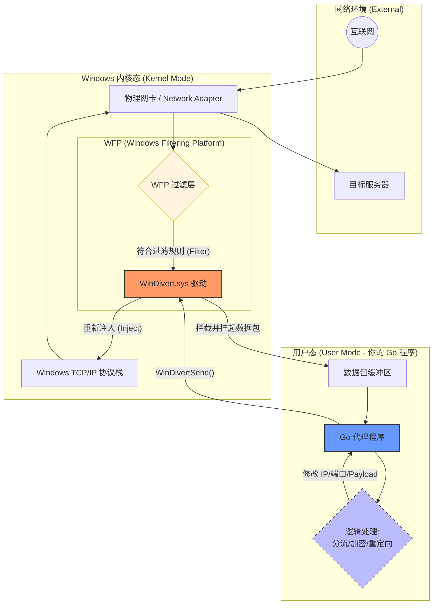
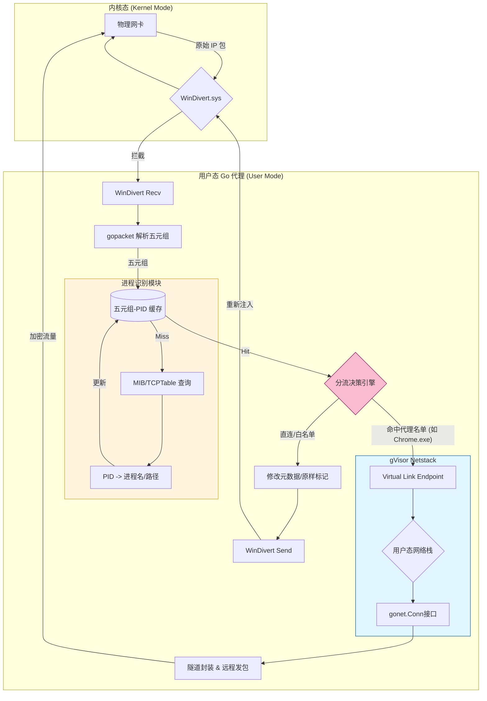
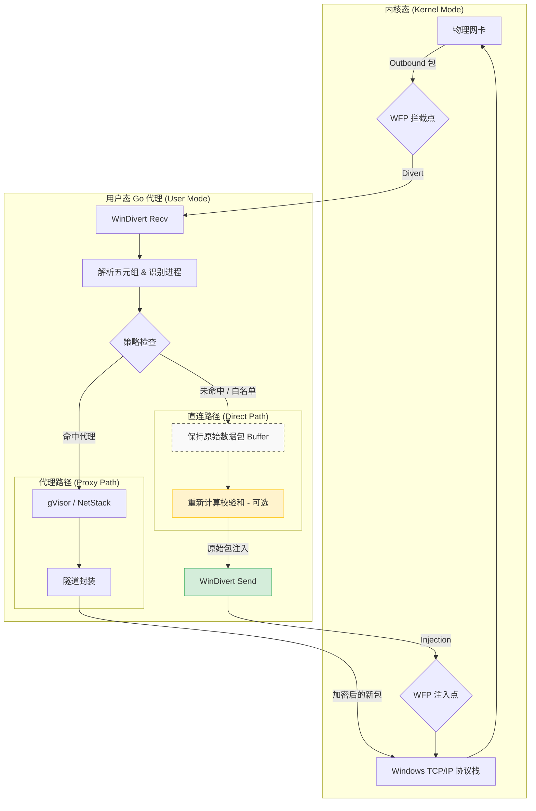

##  0x00 前言
本文汇总下笔者在研究Clash（ClashMeta）等一些windows上的透明代理项目的一些技术思路总结，基于wintun OR windivert

##  0x01    配置&&功能

####    进程过滤
[Rules 规则](https://clash.wiki/configuration/rules.html#process-name-%E6%BA%90%E8%BF%9B%E7%A8%8B%E5%90%8D)可支持按照PROCESS-NAME 源进程名、PROCESS-PATH 源进程路径等走对应的规则，比如

```bash
# clash 开 tun 模式代理，根据进程名匹配规则排除游戏代理 Netch.exe
- PROCESS-NAME,Netch.exe,DIRECT
```

```bash
PROCESS-NAME 源进程名
PROCESS-NAME 规则用于根据发送数据包的进程名称路由数据包

#目前, 仅支持 macOS、Linux、FreeBSD 和 Windows

PROCESS-NAME,nc,DIRECT 将任何来自进程 nc 的数据包路由到 DIRECT

PROCESS-PATH 源进程路径
PROCESS-PATH 规则用于根据发送数据包的进程路径路由数据包

#目前, 仅支持 macOS、Linux、FreeBSD 和 Windows

PROCESS-PATH,/usr/local/bin/nc,DIRECT 将任何来自路径为 /usr/local/bin/nc 的进程的数据包路由到 DIRECT
```


####    转发栈对比
Clash可选四种模式：

-   system：system 模式使用系统协议栈， 可以提供更稳定全面的 tun 体验， 且占用相对其他堆栈更低
-   gvisor：通过在用户空间中实现网络协议栈， 可以提供更高的安全性和隔离性， 同时可以避免操作系统内核和用户空间之间的切换， 从而在特定情况下具有更好的网络处理性能
-   mixed：混合堆栈， tcp 使用 system 栈， udp 使用 gvisor 栈， 使用体验可能相对更好
-   lwip：lwip 即 lightweight IP， 是一款专为嵌入式系统设计的 TCP/IP 协议栈， 采用了单线程的事件驱动模型， 性能表现可能不如 system/gvisor 协议栈（需要启用 `CGO`）

##  0x02    原理分析（Wintun）
Meta的数据流基本如下：

1.  启动TUN网卡，并设置目的IP路由（何种流量），引流到TUN网卡（`Tun-Recv`）
2.  `Tun-Process`会根据规则决定走代理（`PROXY`）OR直连模式（`DIRECT`）
3.  支持使用进程路径/进程名作为规则


####    基于进程的代理配置（TCP）分析
这里以gvisor的实现为例，包含两块核心内容：
1.  在gvisor协议栈中完成TUN引流、与客户端的TCP三次握手（fake握手）等工作
2.  在经过gvisor协议栈前置处理完成之后的回调方法`handleTCPConn`中，完成规则匹配以及根据规则匹配结果进行后续Dial（直连 OR 代理）等

```GO
// handleTCPConn：处理TCP连接，参数connCtx保存了连接的上下文信息
func handleTCPConn(connCtx C.ConnContext) {
	defer func(conn net.Conn) {
		_ = conn.Close()
	}(connCtx.Conn())

	metadata := connCtx.Metadata()
	if !metadata.Valid() {
		log.Warnln("[Metadata] not valid: %#v", metadata)
		return
	}

    // ....

	// 查询当前连接connCtx的规则信息
	// 根据客户端ip/port，要连接的目的ip/port
	proxy, rule, err := resolveMetadata(connCtx, metadata)
	if err != nil {
		log.Warnln("[Metadata] parse failed: %s", err.Error())
		return
	}

    // ... 
}
```

`resolveMetadata`中会调用`match`方法，这里完成了对进程名的查找（根据源IP、源端口，协议），具体查找方式可以参考[gopsutil 使用与分析](https://pandaychen.github.io/2024/08/04/A-GOPSUTIL-STUDY/)一文，最后可以根据进程名、进程路径去搜索相关的代理规则进行匹配，从而实现了该功能

```go
// Metadata is used to store connection address
type Metadata struct {
	NetWork      NetWork    `json:"network"`
	Type         Type       `json:"type"`
	SrcIP        netip.Addr `json:"sourceIP"`
	DstIP        netip.Addr `json:"destinationIP"`
	SrcPort      uint16     `json:"sourcePort,string"`      // `,string` is used to compatible with old version json output
	DstPort      uint16     `json:"destinationPort,string"` // `,string` is used to compatible with old version json output
	InIP         netip.Addr `json:"inboundIP"`
	InPort       uint16     `json:"inboundPort,string"` // `,string` is used to compatible with old version json output
	InName       string     `json:"inboundName"`
	InUser       string     `json:"inboundUser"`
	Host         string     `json:"host"`
	DNSMode      DNSMode    `json:"dnsMode"`
	Uid          uint32     `json:"uid"`
	Process      string     `json:"process"`
	ProcessPath  string     `json:"processPath"`
	SpecialProxy string     `json:"specialProxy"`
	SpecialRules string     `json:"specialRules"`
	RemoteDst    string     `json:"remoteDestination"`
	// Only domain rule
	SniffHost string `json:"sniffHost"`
}

// 匹配规则（核心）
func match(metadata *C.Metadata) (C.Proxy, C.Rule, error) {
	configMux.RLock()
	defer configMux.RUnlock()
	var (
		resolved             bool
		attemptProcessLookup = true
	)

	if node, ok := resolver.DefaultHosts.Search(metadata.Host, false); ok {
		metadata.DstIP, _ = node.RandIP()
		resolved = true
	}

	for _, rule := range getRules(metadata) {
		if !resolved && shouldResolveIP(rule, metadata) {
			func() {
				ctx, cancel := context.WithTimeout(context.Background(), resolver.DefaultDNSTimeout)
				defer cancel()
				ip, err := resolver.ResolveIP(ctx, metadata.Host)
				if err != nil {
					log.Debugln("[DNS] resolve %s error: %s", metadata.Host, err.Error())
				} else {
					log.Debugln("[DNS] %s --> %s", metadata.Host, ip.String())
					metadata.DstIP = ip
				}
				resolved = true
			}()
		}

		// 开启了进程匹配
		if attemptProcessLookup && !findProcessMode.Off() && (findProcessMode.Always() || rule.ShouldFindProcess()) {
			attemptProcessLookup = false
			// 查找进程路径、进程名，进程id

			// 传入参数：源IP、源端口，协议
			uid, path, err := P.FindProcessName(metadata.NetWork.String(), metadata.SrcIP, int(metadata.SrcPort))
			if err != nil {
				log.Debugln("[Process] find process %s: %v", metadata.String(), err)
			} else {
				metadata.Process = filepath.Base(path) //进程名
				metadata.ProcessPath = path            //进程路径
				metadata.Uid = uid
			}
		}

		//命中规则
		if matched, ada := rule.Match(metadata); matched {
			adapter, ok := proxies[ada]
			if !ok {
				continue
			}

			// parse multi-layer nesting
			passed := false
			for adapter := adapter; adapter != nil; adapter = adapter.Unwrap(metadata, false) {
				if adapter.Type() == C.Pass {
					passed = true
					break
				}
			}
			if passed {
				log.Debugln("%s match Pass rule", adapter.Name())
				continue
			}

			if metadata.NetWork == C.UDP && !adapter.SupportUDP() {
				log.Debugln("%s UDP is not supported", adapter.Name())
				continue
			}

			return adapter, rule, nil
		}
	}

	// 默认走直连方式
	return proxies["DIRECT"], nil, nil
}
```

##  0x03    原理分析（Windivert）
Windivert是一种高性能的用户层数据包截获工具，核心价值在于让开发者无需编写复杂的内核驱动（Kernel Driver），就能在用户态（User Mode）直接操纵网络底层数据包。WinDivert 基于 WFP（Windows Filtering Platform）实现，这是 Windows 内核中处理网络过滤的官方框架，架构由两部分组成：

-	`WinDivert.sys`（内核驱动）：负责根据过滤规则，从网络协议栈中捕获（钩）出数据包
-	`WinDivert.dll`（用户态库）：为代理程序提供 API，通过句柄（Handle）与内核驱动通信

Windivert的主要工作数据流如下：



####	WinDivert 全流量代理的工作原理
在全流量代理场景下，WinDivert 的执行逻辑如下：

1、设定过滤器（DivertOpen）过程，当代理程序启动时，通过 WinDivert 向内核下达指令，设定过滤规则。如`tcp.DstPort == 80 or tcp.DstPort == 443`表述拦截所有 `80/443` 端口的 TCP 流量，内核驱动会根据这个规则监控所有经过网络栈的数据包

2、数据包截获（DivertRecv）过程，当符合规则的数据包到达（或发出）时，会触发下面的事件：

-	内核挂起： `WinDivert.sys` 会在协议栈中拦截该数据包，防止它继续向上传递给应用或向下发出网卡
-	拷贝至用户态：数据包被放入一个队列，代理程序通过 `WinDivertRecv` 将整个原始数据包（包含 IP/TCP 头部）读取到内存中

3、数据包操纵与魔改（Modification）过程，通常由开发者实现（代理程序），会根据代理协议（如 Shadowsocks/V2Ray/Trojan 等）对包进行如下处理：

-	修改目的地址： 将数据包的原始目标 IP 修改为代理服务器的 IP
-	SNI 嗅探： 分析 HTTPS 握手包，识别目标域名以进行分流
-	流量封包： 将数据包作为负载（Payload）封装进新的加密协议中

4、重新注入（DivertSend），处理完成后，代理程序通过 `WinDivertSend` 将修改后的（或全新的）数据包交还给内核，重新注入协议栈，内核驱动将包重新放回网络流中。由于原始数据包的目的 IP 已被修改，Windows 路由表会将其发送至代理网关，而不是直接发往原始目标

5、在代理网关中会通过代理协议，将数据包转化为真实的原始目的IP的数据包（流）

windivert的工作机制如下图：


####	windivert+gvisor的全流量代理
1、基于windivert与gvisor实现的全流量代理的实现架构如下（包含了进程名/路径识别）



在上图中，未命中规则的进程会通过windivert重新注入到内核协议栈，而命中了规则的进程，会通过gvisor用户态协议栈进行封装（代理转发等）完整后续流程：



##	0x04	net-speeder
net-speeder 是一个非常经典的解决高丢包网络环境下传输速度问题的工具。最初源于 Linux（利用 `iptables` 和 `libnet`），也可以利用WinDivert在Win系统上实现。其核心工作原理为**发两遍，赌一遍（Packet Double Sending）**，详细原理描述如下

####	WinDivert的实现

1、核心机制是（发包）流量倍增，在正常的网络传输中，如果发生丢包，TCP 协议会触发重传机制，这会导致明显的延迟和带宽下降。Net-speeder 的实现逻辑是它并不试图改变 TCP 的拥塞控制算法，而是通过 WinDivert 在网络层截获每一个**出站（Outbound）**数据包。即当代理程序每收到一个原始数据包，就会立即复制一份，然后通过 WinDivertSend 将两份完全一样的数据包（原始包 + 冗余包）重新注入到内核驱动中发往目标

2、利用 WinDivert 实现全流量截获，步骤如下：

-	透明拦截（DivertOpen）：使用特定的过滤规则（如 `ip and !impostor`）监听所有网卡的出站流量
-	用户态克隆： 数据包从内核拷贝到 net-speeder 代理程序中
-	重新注入到协议栈：第一次调用 WinDivertSend 发送原始包，紧接着第二次调用 WinDivertSend 发送完全一致的副本

为什么能加速（对抗丢包）呢？本质上是带宽换稳定性，在高丢包率的线路（如跨国链路）上非常有效，如果第一个包在途中丢失，只要第二个冗余包到达，接收端就会认为数据已收到，从而避免了触发 TCP 指数级退避的重传逻辑。相较于普通重传需要等待接收端的 `SACK` 或等待超时，net-speeder 这种主动重传是零延迟的

3、服务端的去重机制： 既然发了两遍，服务器会收到两个相同的包，TCP/IP 栈会自动丢弃重复的序列号包，因此接收端应用层不会感知到重复。另外对于TCP checksum的计算，由于包是原样复制的，WinDivert 会保留原始的 checksum，确保两个包都能通过目标系统的完整性检查

最后还有两个细节问题：

1.	带宽消耗： 全流量代理下使用此模式会导致带宽占用直接翻倍
2.	如何防止发包死循环？必须使用 `!impostor` 标志，否则 WinDivert 重新发送的包会再次被自己截获（回环）

####	Linux的实现
参考[netspeed](https://github.com/chuixifeng/netspeeder)原始项目实现

##  0x05 参考
-   [Clash 教程](https://www.codein.icu/clashtutorial/)
-   [规则集](https://github.com/angwz/DomainRouter)
-   [[Feature] Tun #393](https://github.com/Dreamacro/clash/pull/393)
-   [虚空终端 Docs：Tun 模式](https://wiki.metacubex.one/config/inbound/tun/)
-	[net-speeder：在高延迟不稳定链路上优化单线程下载速度](https://github.com/snooda/net-speeder)