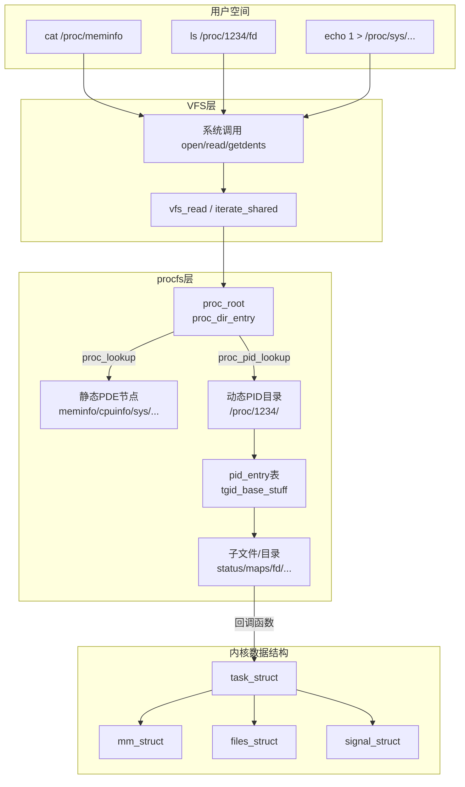
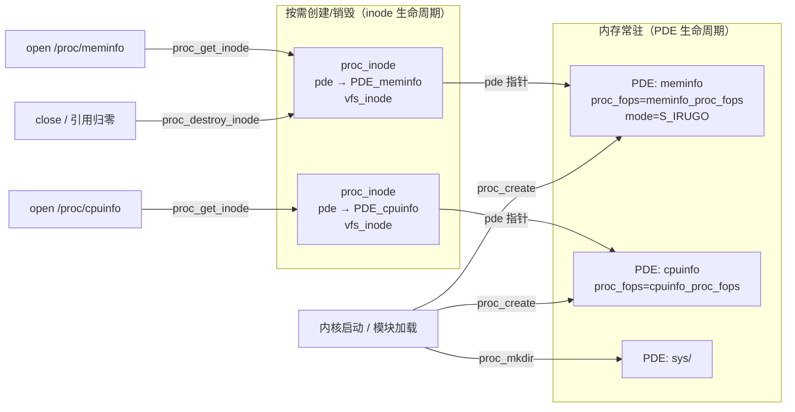
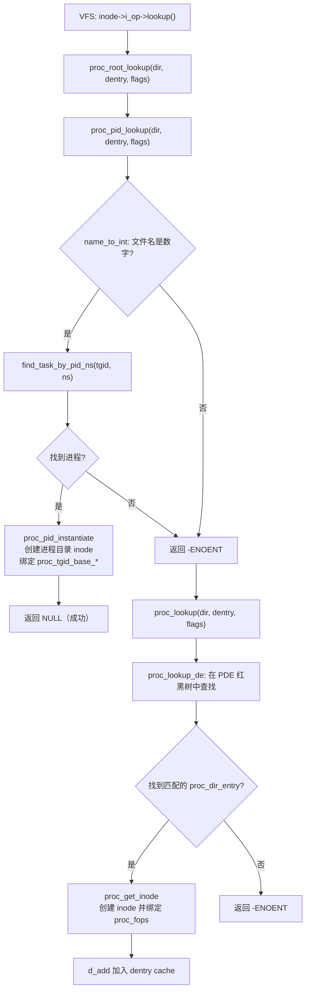
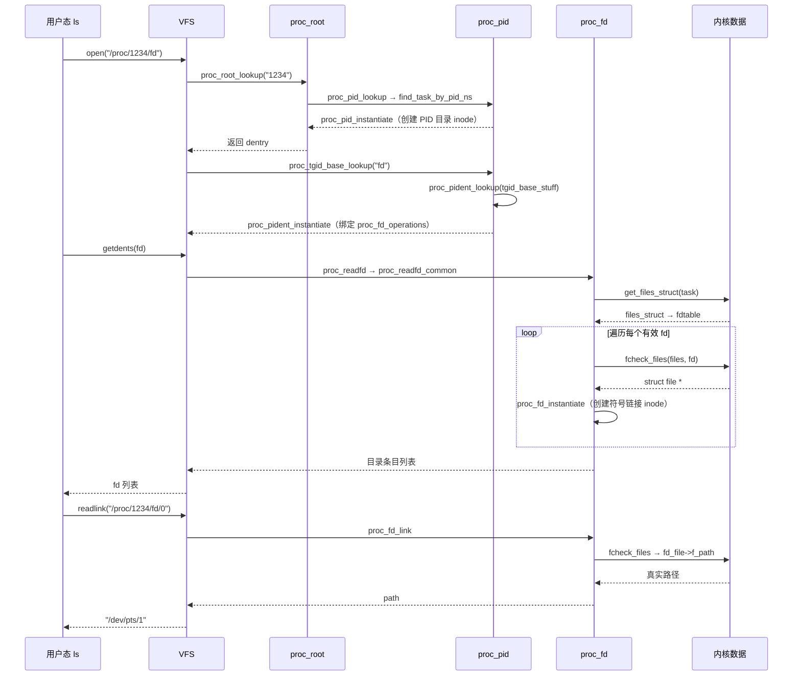

##  0x00    前言
`proc`文件系统（[procfs](https://www.kernel.org/doc/Documentation/filesystems/proc.txt)）是一种基于内核的VFS，以文件系统目录和文件形式，提供一个指向内核数据结构的接口，通过它能够查看和改变各种系统属性。从开发者角度说，Procfs 是一种特殊的虚拟文件系统，可以挂载到用户的目录树中，允许用户空间中的进程使用系统调用（如`write`/`read`等）方便地读取内核信息

本文内核代码基于 [v4.11.6](https://elixir.bootlin.com/linux/v4.11.6/source/include) 版本


-   procfs 它不依赖物理存储设备，而是由内核动态生成文件和目录，用于暴露系统信息（如进程状态、硬件配置、内核参数等），它通过注册到 VFS 的机制，将自己挂载到文件系统树（`/proc`），并遵循 VFS 的接口规范（如`inode_operations`、`file_operations`）
-   内核数据结构：procfs 的内容（如 `/proc/cpuinfo`、`/proc/meminfo`等）由内核动态生成，通过回调函数响应读/写操作
-   VFS 接口：procfs 需要实现 VFS 定义的操作函数（例如 `open()`、`read()`、`readdir()`），才能被用户空间访问
-   procfs 的功能和内容完全由内核管理，通过 `mount -t proc proc /proc` 命令将 procfs 挂载到 VFS 树中，使其成为文件系统的一部分

####    挂载proc

```BASH
# Mount the `proc` device under `/proc`
# with the filesystem type specified as
# `proc`.
#
# note.: you could mount procfs pretty much
#        anywhere you want and specify any
#        device name.
#
#
#         .------------> fs type
#         |    
#         |     .------> device (dummy identifier
#         |    |         in this case - anything)
#         |    |
#         |    |     .-> location
#         |    |     |
#         |    |     |
mount -t proc proc /proc
```

##  0x01    引言：访问/proc文件
`/proc/`目录下包含了文件和目录（pid维度）

```BASH
[root@VM-X-X-tencentos ~]# ls /proc/ -al
total 4
dr-xr-xr-x 270 root  root               0 Nov  7 07:06 .
dr-xr-xr-x  19 root  root            4096 Nov  7 16:46 ..
dr-xr-xr-x   8 root  root               0 Nov  7 07:06 1
......
dr-xr-xr-x   8 root  root               0 Nov  7 07:06 15
dr-xr-xr-x   8 root  root               0 Nov  7 07:07 996
dr-xr-xr-x   3 root  root               0 Nov  7 07:06 acpi
-r--r--r--   1 root  root               0 Nov  7 07:07 bt_stat
-r--r--r--   1 root  root               0 Nov  7 16:45 buddyinfo
dr-xr-xr-x   4 root  root               0 Nov  7 07:07 bus
-r--r--r--   1 root  root               0 Nov  7 07:06 cgroups
-r--r--r--   1 root  root               0 Nov  7 07:06 cmdline
-r--r--r--   1 root  root           30094 Nov  7 07:07 config.gz
-r--r--r--   1 root  root               0 Nov  7 16:45 consoles
-r--r--r--   1 root  root               0 Nov  7 07:06 cpuinfo
-r--r--r--   1 root  root               0 Nov  7 16:45 crypto
-r--r--r--   1 root  root               0 Nov  7 16:45 devices
-r--r--r--   1 root  root               0 Nov  7 07:07 diskstats
-r--r--r--   1 root  root               0 Nov  7 16:45 dma
dr-xr-xr-x   4 root  root               0 Nov  7 16:45 driver
-r--r--r--   1 root  root               0 Nov  7 16:45 execdomains
-r--r--r--   1 root  root               0 Nov  7 16:45 fb
-r--r--r--   1 root  root               0 Nov  7 07:06 filesystems
dr-xr-xr-x   5 root  root               0 Nov  7 07:07 fs
-r--r--r--   1 root  root               0 Nov  7 07:06 interrupts
-r--r--r--   1 root  root               0 Nov  7 07:07 iomem
-r--r--r--   1 root  root               0 Nov  7 16:45 ioports
dr-xr-xr-x  28 root  root               0 Nov  7 07:06 irq
-r--r--r--   1 root  root               0 Nov  7 07:07 kallsyms
-r--------   1 root  root 140737477890048 Nov  7 07:06 kcore
-r--r--r--   1 root  root               0 Nov  7 16:45 keys
-r--r--r--   1 root  root               0 Nov  7 16:45 key-users
-r--------   1 root  root               0 Nov  7 16:45 kmsg
-r--------   1 root  root               0 Nov  7 16:45 kpagecgroup
-r--------   1 root  root               0 Nov  7 16:45 kpagecount
-r--------   1 root  root               0 Nov  7 16:45 kpageflags
-rw-r--r--   1 root  root               0 Nov  7 16:45 latency_stats
-r--r--r--   1 root  root               0 Nov  7 07:07 loadavg
-r--r--r--   1 root  root               0 Nov  7 16:45 loadavg_bt
-r--r--r--   1 root  root               0 Nov  7 16:45 locks
-r--r--r--   1 root  root               0 Nov  7 07:17 mdstat
dr-xr-xr-x   2 root  root               0 Nov  7 16:45 megaraid
-r--r--r--   1 root  root               0 Nov  7 07:06 meminfo
-r--r--r--   1 root  root               0 Nov  7 16:45 misc
-r--r--r--   1 root  root               0 Nov  7 16:45 module_md5_list
-r--r--r--   1 root  root               0 Nov  7 07:07 modules
lrwxrwxrwx   1 root  root              11 Nov  7 07:06 mounts -> self/mounts
dr-xr-xr-x   4 root  root               0 Nov  7 16:45 mpt
-rw-r--r--   1 root  root               0 Nov  7 16:45 mtrr
lrwxrwxrwx   1 root  root               8 Nov  7 07:06 net -> self/net
-r--------   1 root  root               0 Nov  7 16:45 pagetypeinfo
-r--r--r--   1 root  root               0 Nov  7 07:06 partitions
dr-xr-xr-x   5 root  root               0 Nov  7 07:07 pressure
dr-xr-xr-x   3 root  root               0 Nov  7 16:45 rue
-r--r--r--   1 root  root               0 Nov  7 16:45 sched_debug
-r--r--r--   1 root  root               0 Nov  7 16:45 schedstat
dr-xr-xr-x   5 root  root               0 Nov  7 16:45 scsi
lrwxrwxrwx   1 root  root               0 Nov  7 07:06 self -> 26694
-r--------   1 root  root               0 Nov  7 16:45 slabinfo
dr-xr-xr-x   5 root  root               0 Nov  7 16:45 sli
-r--r--r--   1 root  root               0 Nov  7 16:45 softirqs
-r--r--r--   1 root  root               0 Nov  7 07:07 stat
-r--r--r--   1 root  root               0 Nov  7 07:06 swaps
dr-xr-xr-x   1 root  root               0 Nov  7 07:06 sys
--w-------   1 root  root               0 Nov  7 16:45 sysrq-trigger
dr-xr-xr-x   5 root  root               0 Nov  7 16:45 sysvipc
lrwxrwxrwx   1 root  root               0 Nov  7 07:06 thread-self -> 26694/task/26694
-r--------   1 root  root               0 Nov  7 16:45 timer_list
dr-xr-xr-x   5 root  root               0 Nov  7 16:45 tkernel
dr-xr-xr-x   6 root  root               0 Nov  7 07:07 tty
-r--r--r--   1 root  root               0 Nov  7 07:06 uptime
-r--r--r--   1 root  root               0 Nov  7 07:07 version
-r--------   1 root  root               0 Nov  7 16:45 vmallocinfo
-r--r--r--   1 root  root               0 Nov  7 07:07 vmstat
-r--r--r--   1 root  root               0 Nov  7 16:45 zoneinfo
```

比如，访问进程`13323`下的`limits`文件，能获取到本进程的资源限制

```BASH
[root@VM-X-X-tencentos bcc]#  cat /proc/13323/limits
Limit                     Soft Limit           Hard Limit           Units     
Max cpu time              unlimited            unlimited            seconds   
Max file size             unlimited            unlimited            bytes     
Max data size             unlimited            unlimited            bytes     
Max stack size            8388608              unlimited            bytes     
Max core file size        0                    0                    bytes     
Max resident set          unlimited            unlimited            bytes     
Max processes             62825                62825                processes 
Max open files            1024                 524288               files     
Max locked memory         8388608              8388608              bytes     
Max address space         unlimited            unlimited            bytes     
Max file locks            unlimited            unlimited            locks     
Max pending signals       62825                62825                signals   
Max msgqueue size         819200               819200               bytes     
Max nice priority         0                    0                    
Max realtime priority     0                    0                    
Max realtime timeout      unlimited            unlimited            us    
```

使用bcc的trace[工具](https://github.com/iovisor/bcc/blob/master/tools/trace.py)跟踪上面的`cat`过程，可以看到最终调用了`proc_pid_limits`函数

```BASH
PID     TID     COMM            FUNC
21450   21450   cat             proc_pid_limits
        proc_pid_limits+0x1 
        seq_read+0xe5 
        __vfs_read+0x1b 
        vfs_read+0x8e       #调用链vfs_read
        sys_read+0x55 
        do_syscall_64+0x73 
        entry_SYSCALL_64_after_hwframe+0x3d 
```


再列举一个例子，访问`ls /proc/13323/fd`可以知道当前进程`13323`打开了哪些fd：

```BASH
[root@VM-X-X-tencentos proc]# ll -ath /proc/13323/fd
total 0
lrwx------ 1 root root 64 Feb 10 10:43 1 -> /dev/pts/1
lrwx------ 1 root root 64 Feb 10 10:43 2 -> /dev/pts/1
lr-x------ 1 root root 64 Feb 10 10:43 3 -> 'pipe:[2640532256]'
lrwx------ 1 root root 64 Feb 10 10:43 4 -> 'socket:[2640532254]'
l-wx------ 1 root root 64 Feb 10 10:43 5 -> 'pipe:[2640532256]'
lr-x------ 1 root root 64 Feb 10 10:43 6 -> /etc/sudoers
lrwx------ 1 root root 64 Feb 10 10:43 7 -> 'socket:[2640532270]'
dr-x------ 2 root root  8 Feb 10 10:43 .
lrwx------ 1 root root 64 Feb 10 10:43 0 -> /dev/pts/1
dr-xr-xr-x 9 root root  0 Feb 10 10:43 ..
```

上面的命令对应用户态内核态切换如下图：


####    procs 详情
`/proc`下面主要包含如下内容：

1.  静态生成的（系统初始化生成）,比如`/proc/fs`、`/proc/fb`、`/proc/net`等，这部分子目录在系统初始化时候，应该挂载在proc目录对应的`proc_dir_entry`链表下
2.  `.`、`..`子目录，分别是对当前目录和父目录的链接
3.  `/proc/`下由数字组成的进程子目录是每次读取proc内容**动态生成**，即动态遍历当前进程列表形成；以及每进程子目录下子目录/子文件的形成

####	proc下的主要目录&&文件
参考：[Linux Procfs (一) /proc/* 文件实例解析](https://juejin.cn/post/7055321925463048228)

```bash
/proc/cpuinfo：CPU 硬件信息
/proc/meminfo：内存总大小、空闲、缓存、Swap 等状态
/proc/loadavg：系统平均负载
/proc/uptime：系统启动总时间、空闲时间
/proc/cmdline：内核启动参数
/proc/filesystems：内核支持的文件系统列表
/proc/stat：系统整体 CPU 使用率、中断、进程切换统计
/proc/partitions：块设备与分区信息
/proc/mounts：当前已挂载文件系统列表

/proc/net/dev：网卡流量、错误、丢包统计
/proc/net/tcp：TCP 连接表
/proc/net/udp：UDP 连接表
/proc/net/route：内核路由表
/proc/net/arp：ARP 表
/proc/net/netstat：网络栈统计
/proc/net/sockstat：套接字使用统计

/proc/[PID]/cmdline：进程启动命令与参数
/proc/[PID]/status：进程状态
/proc/[PID]/maps：进程虚拟内存映射
/proc/[PID]/fd/：进程打开的文件描述符列表
/proc/[PID]/environ：进程环境变量
/proc/[PID]/limits：进程资源限制
/proc/[PID]/io：进程 I/O 统计
/proc/[PID]/sched：进程调度信息与优先级
```

####	procfs架构：内核视角
理解 proc 文件系统的关键在于理解 proc 文件系统内部树，此内部树是指独立于 VFS 的文件树，procfs内核实现原理如下：


####	procfs 与 VFS
通过VFS的接口，如何访问到proc 内部文件树的文件节点呢？下文可以了解到，procfs 的文件节点由内核通过 `proc_mkdir` 和 `proc_create` 函数来创建。当用户程序需要访问 procfs 文件节点时，内核会基于 proc 文件节点动态生成 `struct inode` 结构，并将访问 procfs 的方法（函数表）也赋值给inode。这样用户程序就可以能够通过 VFS 来访问 proc 文件了

##	0x02	seq_file机制

seq_file 是用于简化procfs的创建和读取操作的机制，提供了一种迭代式、分块输出的方式来生成动态内容

####	seq_file机制介绍

在procfs的内核实现中，大量使用了`seq_*`相关代码。`seq_file` 是内核提供的一套标准框架，专门用于解决通过虚拟文件系统输出大量内核数据时的缓冲区管理问题

####	设计动机

传统的 procfs `read` 回调中，开发者需要手动管理用户态缓冲区的偏移（`*ppos`）、分页、截断等细节，极易出现如下问题：
-	数据量超过单次 `read` 的缓冲区大小时，需要手动维护"读到哪里了"的状态
-	多个数据项拼接时，边界计算容易出错
-	缓冲区溢出时缺乏统一的扩容机制

`seq_file` 将这些复杂逻辑封装在内核框架中，开发者只需定义四个回调函数（`start/next/show/stop`），即可实现对任意大小数据的顺序遍历输出

####	核心数据结构

1、`struct seq_file`：每个打开的 seq 文件实例对应一个该结构体，存储在 `file->private_data` 中，结构定义如下：

```cpp
//https://elixir.bootlin.com/linux/v4.11.6/source/include/linux/seq_file.h#L17
struct seq_file {
	char *buf;          // 内核缓冲区指针（输出缓冲区）
	size_t size;        // 缓冲区总大小（初始为 PAGE_SIZE，溢出时翻倍扩容）
	size_t from;        // 当前待拷贝到用户态的起始偏移（buf 内部偏移），也可理解为用户空间已读取的位置
	size_t count;       // 缓冲区中待拷贝的有效数据字节数，buf 中有效数据量
	size_t pad_until;   // seq_pad 的对齐目标位置，填充位置
	loff_t index;       // 当前迭代器的逻辑位序（第几个元素），当前迭代位置
	loff_t read_pos;    // 已经拷贝到用户态的累计字节数，当前读取位置
	u64 version;        // 版本号，用于跨 read 调用的断点续传（如 maps 中记录 vm_start）
	struct mutex lock;  // 保护 seq_file 结构的互斥锁
	const struct seq_operations *op;  // 迭代器操作函数表
	int poll_event;
	const struct file *file;  // 关联的文件指针
	void *private;      // 私有数据指针（如 proc_maps_private）
};
```

2、`struct seq_operations`：迭代器操作函数表，定义了遍历数据集合的四个回调方法（特别注意，由file结构的`private_data`成员指向）。seq_file 框架的核心设计理念是遍历与打印过程解耦：

-	`start()` 和 `next()` 函数专门负责遍历底层的数据结构（如链表、数组、rbtree等），它们找到下一个数据节点后，将其指针作为返回值抛给 VFS 框架
-	VFS 框架拿到这个指针后，直接作为 `void *v` 传递给 `show()`
-	`show()` 函数只负责打印（转换为需要的结构）

```cpp
struct seq_operations {
	void * (*start) (struct seq_file *m, loff_t *pos);  // 定位到第 pos 个元素，返回迭代器指针
	void (*stop) (struct seq_file *m, void *v);          // 遍历结束时的清理（如释放锁）
	void * (*next) (struct seq_file *m, void *v, loff_t *pos);  // 移动到下一个元素
	int (*show) (struct seq_file *m, void *v);           // 将当前元素格式化输出到缓冲区
};
```

四个回调的契约：
-	`start`：遍历起始回调，找到第`pos`个数据节点（遍历的起点）。 返回 `NULL` 表示遍历结束，返回 `ERR_PTR(error)` 表示出错
-	`show`：内容输出回调，将单个节点的数据格式化输出到`seq_file`缓冲区。返回 `0` 表示成功，返回负数表示出错，返回 `SEQ_SKIP`（值为`1`）表示跳过当前元素
-	`stop`：遍历结束回调，清理资源（解锁、释放内存等）。无论遍历是否成功都**必定被调用**（类似于 `finally` 语义）
-	`next`：遍历下一个回调，获取当前节点的下一个节点


小结下，**seq_file 就是一个内核缓冲区，proc 文件中的数据需要先格式化输出到 seq_file 内核缓冲区，再拷贝至用户缓冲区。格式化输出的过程需要使用`struct seq_operations`定义的方法执行**

注意几个细节问题：
1、`start`的第二个参数`loff_t *pos`，这里`pos`为指针类型的原因是什么？从内核实现看，`start` 函数不仅需要读取当前的读取位置（Index/Offset），还需要修改

-	处理定位与跳过无效节点：当用户态通过 `lseek()` 调整读取偏移量，或者在多次 `read()` 之间内核数据结构发生了变化（例如链表节点被删除）时，传入的 `*pos` 目标索引可能已失效，若 `*pos` 对应的位置无效，`start` 可以直接在函数内部修改 `*pos` 的值（如 `(*pos)++`），将其修正为下一个真实的有效节点索引，然后再返回该有效节点的指针。这样能保证内核的读取位置指针与实际返回的数据条目保持同步
-	同步 seq_file 的内部状态（`m->index`）：对应于`seq_read`实现中主循环的代码`p = m->op->start(m, &m->index)`，注意这里的`m->index`实际上是 `struct seq_file` 结构体中的 `m->index` 的地址，如果 `start` 函数修改了 `*pos`，就会直接更新 `m->index`，从而让 `seq_file` 了解当前文件会话读取记录的位置
-	`start`与 `next` 函数回调保持接口设计的一致性，二者都可以通过直接修改 *pos 来控制迭代器在数据集合中的绝对位置。不过这里需要区分单次输出模式（如 `/proc/meminfo` 的 `single_start`）与列表/多条目迭代模式（如 `/proc/modules` 或 `/proc/net/tcp`）

```c
//单次输出模式（如 /proc/meminfo 的 single_start）
//由于只有一条记录，它只读取 *pos 判断是否为 0，不需要修改它
static void *single_start(struct seq_file *p, loff_t *pos)
{
    return *pos ? NULL : SEQ_START_TOKEN; // *pos 为 0 返回 TOKEN，>0 返回 NULL (EOF)
}

//列表/多条目迭代模式（如 /proc/modules 或 /proc/net/tcp）
//start 会依据 *pos 去查找第 N 项，如果在搜索过程中发现需要跳过某些项，就会直接修改 *pos
static void *xxx_seq_start(struct seq_file *m, loff_t *pos)
{
    /* 根据 *pos 遍历寻找目标节点 */
    struct node *p = find_node_at(*pos);

	//检测p的状态，非法可跳过
    if (p && p->is_deleted) {
        (*pos)++; // 修改 pos，跳过已被删除的节点
        p = p->next;
    }
    return p;
}
```

2、`show`的第二个参数`void *v`的使用场景是什么？第二个参数 `void *v` 的本质是**当前正在遍历的数据节点（迭代器指针）**，分三种情况讨论：

-	case 1：类型转换，提取当前节点数据（最常见场景）。当 `/proc` 或 `/sys` 文件需要输出一个列表（如 `/proc/net/dev` 输出所有网卡，`/proc/modules` 输出所有内核模块）时，`v` 就是当前被遍历到的具体结构体指针，通常就是将 `v` 强转回其真实的结构体类型，然后打印其成员
-	case 2：判断是否需要打印表头（Header），对应`/proc` 文件在输出第一行时，需要打印列名（表头）场景。在 `start()` 函数中，如果检测到偏移量 `*pos == 0`，通常会返回一个特殊的宏 `SEQ_START_TOKEN`（本质上是 `(void *)1`），而不是真实的数据节点指针。`show` 函数通过判断 `v` 是否等于这个特殊 Token，来决定是否打印表头
-	case 3：`single_open` 机制下的占位符，对于像 `/proc/meminfo` 这种不需要遍历链表、只需要一次性全部打印的文件，它使用了 `single_open`，在 `single_open` 底层自动绑定的 `single_start` 中，当 `*pos == 0` 时固定返回 `SEQ_START_TOKEN`，当 `*pos > 0` 时返回 `NULL`

```c
static int xxx_seq_show(struct seq_file *m, void *v)
{
    // 如果 v 是起始标志，说明当前是第一行，打印表头
    if (v == SEQ_START_TOKEN) {
        seq_puts(m, "Name RX-Bytes TX-Bytes\n");
        return 0;
    }

    // 否则，v 就是真实的数据节点，正常打印数据
    struct my_data *data = v;
    seq_printf(m, "%-10s %8llu %8llu\n", data->name, data->rx, data->tx);
    return 0;
}
```

####	seq_operations的工作机制


1、以当用户程序执行 `cat /proc/xxx` 的过程进行说明。首先会`open`打开文件，打开文件的过程会创建 file 对象，然后将 file 对象的私有指针（`private_data`）指向 proc 文件对应的 `seq_file`

todo

2、接着，`cat` 命令会读取 proc 文件数据，读取的过程需要用到 `seq_file` 对象中的 `op` 函数表，即`struct struct seq_operations`，具体过程如下：

-	步骤1：调用 `start` 函数开始迭代，获取第一个数据项（整型数、字符串、结构体等），并调用 `show` 函数格式化输出该数据项至 `seq_file` 内核缓冲区
-	步骤2：调用 `next` 函数获取下一个数据项，并调用 `show` 函数格式化输出该数据项至 `seq_file` 内核缓冲区
-	步骤3：持续执行步骤2，直至所有数据项都格式化输出到 `seq_file` 内核缓冲区
-	步骤4：调用 `stop` 函数停止迭代，清理资源
-	步骤5：将 `seq_file` 收集到数据拷贝至用户缓冲区

```c
//https://elixir.bootlin.com/linux/v4.11.6/source/fs/proc/meminfo.c#L169
static const struct file_operations meminfo_proc_fops = {
	.open		= meminfo_proc_open,
	.read		= seq_read,		
	.llseek		= seq_lseek,
	.release	= single_release,
};

//https://elixir.bootlin.com/linux/v4.11.6/source/fs/proc/cmdline.c
static const struct file_operations cmdline_proc_fops = {
	.open		= cmdline_proc_open,
	.read		= seq_read,
	.llseek		= seq_lseek,
	.release	= single_release,
};

//https://elixir.bootlin.com/linux/v4.11.6/source/fs/proc/root.c
static const struct file_operations proc_root_operations = {
	.read		 = generic_read_dir,
	.iterate_shared	 = proc_root_readdir,
	.llseek		= generic_file_llseek,
};
```

todo

####  	open/read系统调用 && seq_open/seq_read与seq_operations的关系

在开始介绍`seq_open`、`seq_read`之前，先搞懂上述三者之间的联系。直观上看，VFS 系统调用（`open`/`read`）负责触发，seq_file 核心函数（`seq_open`/`seq_read`）充当管理缓冲区和状态机的引擎，而 seq_operations 的四个成员（`start/show/next/stop`）则是提供底层数据的业务逻辑，下面介绍下这里大致的内核流程：

1、阶段一：准备工作（`open/seq_open`）

首先，由用户态触发，即用户程序调用 `open("/proc/meminfo", O_RDONLY)`，走`open`的内核调用链，会触发 Linux 虚拟文件系统 (VFS) 的路径解析并初始化文件描述符，包含如下几步：

-	VFS 路径解析：内核遍历 procfs，当解析到 `meminfo` 节点时，获取对应的 `proc_dir_entry` 并实例化一个 VFS inode，在这个实例化过程中，`inode->i_fop` 指针会被赋值为该文件特定的操作集合，即 `meminfo_proc_fops`
-	分配 File 对象： 在内核的 `do_dentry_open` 函数中，内核会分配一个新的 `struct file` 结构来代表进程打开的这个文件句柄。随后将 inode 的文件操作指针挂载到 file 结构体上，即执行 `file->f_op = inode->i_fop`
-	继续直接调用 `f_op->open`： 同样在 `do_dentry_open` 中，内核会检查 `file->f_op->open` 是否存在。由于 `meminfo_proc_fops` 注册了该函数，内核会直接执行 `file->f_op->open(inode, file)`，即直接调用 `meminfo_proc_open(inode, file)`
-	`meminfo_proc_open`的核心是调用 `single_open`，并将回调函数`meminfo_proc_show`（格式化输出内存信息）传入；其他文件类型也可以调用`seq_open`

[`single_open`](https://elixir.bootlin.com/linux/v4.11.6/source/fs/seq_file.c#L573)/seq_open的实现细节如下：

-	内核分配一个 `struct seq_file` 对象（负责内存缓冲和状态记录）
-	将`meminfo_proc_show`单函数（类型为`int (*show)(struct seq_file *, void *)`）或[`cpuinfo_op`](https://elixir.bootlin.com/linux/v4.11.6/source/fs/proc/cpuinfo.c#L9)，类型为`struct seq_operations`，赋值给 `seq_file->op`，然后将这个 `seq_file` 对象存入 VFS 的 `file->private_data` 中

2、阶段二：数据读取过程（`read/vfs_read/seq_read`），一次完整的读取`/proc/meminfo`可能需要多次调用`read(fd, buf, size)`

-	首先，由用户态触发调用 `read(fd, buf, size)`，继而进入VFS 层直接调用 `file->f_op->read`，对于配置了 `seq_file` 的节点指向了`seq_read()` 
-	`seq_read` 从 `file->private_data` 中提取出之前绑定的 `struct seq_file` 对象，开始执行 while 循环，并在循环中按顺序调用 `seq_operations` 的四个成员

3、阶段三：`seq_operations` 在 `seq_read` 中的执行流，上述四个成员的作用如下：

-	`start(m, &pos)`：每次读取循环开始时调用，负责起点与加锁。根据全局游标 `pos`，在底层数据结构（如进程链表、CPU 数组等）中找到起始元素并返回其指针。为了防止读取过程中数据被销毁，通常在这里执行加锁操作（如 `rcu_read_lock` 或自旋锁）
-	`show(m, v)`：在`start` 或 `next`函数，返回有效的元素指针后，主要用于装载数据。其接收元素指针 `v`，解析数据，通过 `seq_printf` 格式化后，**写入 `seq_file` 内部维护的内核缓冲区（`m->buf`，默认大小 `4KB`），而不是直接写给用户态**
-	`next(m, v, &pos)`：当`show`函数执行完毕且内核缓冲区（`m->buf`）还未满时调用，将底层数据指针移动到下一个元素，更新 `pos`，返回新指针。随后 `seq_read` 会使用新指针再次调用 `show`
-	`stop(m, v)`：当 `next` 返回 `NULL`时调用（底层数据遍历完）或 `show` 发现 `seq_file` 的 `4KB` 内部缓冲区已经被塞满写不下时，强制退出循环并调用，此时执行清理工作，必须释放 `start` 中加的锁

4、执行收尾工作：当 `stop` 执行完毕后，`seq_operations` 的工作暂时结束，交回控制权。`seq_read` 最后会调用 `copy_to_user()`，将填满数据的内核缓冲区（`m->buf`），安全地拷贝到用户态 read 提供的 buf 中，随后返回读取的字节数

详细实现见下 **`seq_read` 核心流程分析**

####	两种使用模式

**模式一：多条目迭代模式**（`seq_open` + 自定义 `seq_operations`）

适用于需要遍历多条记录的场景，如 `/proc/[pid]/maps`（遍历 VMA 链表）、`/proc/net/tcp`（遍历 TCP 连接表）等。使用者需要实现完整的 `start/next/show/stop` 四个回调函数

```cpp
// 典型用法示例（以 /proc/[pid]/maps 为例）
// https://elixir.bootlin.com/linux/v4.11.6/source/fs/proc/task_mmu.c#L378
static const struct seq_operations proc_pid_maps_op = {
	.start	= m_start,     // 加锁、定位到起始 VMA
	.next	= m_next,      // 移动到下一个 VMA
	.stop	= m_stop,      // 释放锁
	.show	= show_pid_map // 格式化输出单个 VMA 信息
};

static int pid_maps_open(struct inode *inode, struct file *file)
{
	return do_maps_open(inode, file, &proc_pid_maps_op);
}

const struct file_operations proc_pid_maps_operations = {
	.open    = pid_maps_open,
	.read    = seq_read,      // 使用标准的 seq_read
	.llseek  = seq_lseek,
	.release = proc_map_release,
};
```

**模式二：单次输出模式**（`single_open` + 单个 `show` 回调）

适用于数据量较小、一次性输出的场景，如 `/proc/meminfo`、`/proc/[pid]/limits` 等。`single_open` 内部自动构造了一组特殊的 `seq_operations`，其 `start` 只在 `pos==0` 时返回非空，`next` 永远返回 `NULL`

```cpp
//https://elixir.bootlin.com/linux/v4.11.6/source/fs/seq_file.c#L573
int single_open(struct file *file, int (*show)(struct seq_file *, void *),
		void *data)
{
	struct seq_operations *op = kmalloc(sizeof(*op), GFP_KERNEL);
	int res = -ENOMEM;

	if (op) {
		op->start = single_start;  // pos==0 时返回非空，否则返回 NULL
		op->next  = single_next;   // 永远返回 NULL（只遍历一次）
		op->stop  = single_stop;   // 空操作
		op->show  = show;          // 用户提供的 show 回调
		res = seq_open(file, op);
		if (!res)
			((struct seq_file *)file->private_data)->private = data;
		else
			kfree(op);
	}
	return res;
}

static void *single_start(struct seq_file *p, loff_t *pos)
{
	return NULL + (*pos == 0);  // pos==0 返回 (void*)1，否则返回 NULL
}

static void *single_next(struct seq_file *p, void *v, loff_t *pos)
{
	++*pos;
	return NULL;  // 永远返回 NULL，终止遍历
}
```

####	`seq_read` 核心流程分析

[`seq_read`](https://elixir.bootlin.com/linux/v4.11.6/source/fs/seq_file.c#L169) 是 `seq_file` 框架的核心函数，当用户态调用 `read()` 系统调用时，VFS 层最终调用到此函数。其整体逻辑如下：

```cpp
ssize_t seq_read(struct file *file, char __user *buf, size_t size, loff_t *ppos)
{
	struct seq_file *m = file->private_data;	//读取内核save的数据
	size_t copied = 0;
	void *p;
	int err = 0;

	//加锁
	mutex_lock(&m->lock);
	m->version = file->f_version;

	// 阶段1：位置校验，如果 ppos 与上次不一致（如 lseek 后），通过 traverse 重新定位
	if (*ppos == 0)
		m->index = 0;
	if (unlikely(*ppos != m->read_pos)) {
		while ((err = traverse(m, *ppos)) == -EAGAIN)
			;
		if (err) {
			m->read_pos = 0;
			m->version = 0;
			m->index = 0;
			m->count = 0;
			goto Done;
		} else {
			m->read_pos = *ppos;
		}
	}

	// 阶段2：如果缓冲区中有上次剩余数据，先拷贝给用户
	if (!m->buf) {
		m->buf = seq_buf_alloc(m->size = PAGE_SIZE);
		if (!m->buf)
			goto Enomem;
	}
	if (m->count) {
		n = min(m->count, size);
		err = copy_to_user(buf, m->buf + m->from, n);
		// ... 更新 count/from/size/buf/copied
		if (!size)
			goto Done;
	}

	// 阶段3：核心迭代循环，调用 start -> show -> next 填充缓冲区
	pos = m->index;
	p = m->op->start(m, &pos);       // 定位到当前位置
	while (1) {
		if (!p || IS_ERR(p))
			break;
		err = m->op->show(m, p);      // 格式化当前元素到 buf
		if (err < 0)
			break;
		if (unlikely(err))            // SEQ_SKIP：跳过当前元素
			m->count = 0;
		if (unlikely(!m->count)) {
			p = m->op->next(m, p, &pos);
			m->index = pos;
			continue;
		}
		if (m->count < m->size)
			goto Fill;                // 有数据且未溢出，进入填充阶段
		// 缓冲区溢出：扩容后重试（m->count >= m->size）
		m->op->stop(m, p);
		kvfree(m->buf);
		m->count = 0;
		m->buf = seq_buf_alloc(m->size <<= 1);  // 缓冲区翻倍
		if (!m->buf)
			goto Enomem;
		m->version = 0;
		pos = m->index;
		p = m->op->start(m, &pos);   // 从当前位置重新开始
	}
	m->op->stop(m, p);
	m->count = 0;
	goto Done;

Fill:
	// 阶段4：继续填充更多元素到缓冲区（尽量填满用户请求的 size）
	while (m->count < size) {
		size_t offs = m->count;
		loff_t next = pos;
		p = m->op->next(m, p, &next);
		if (!p || IS_ERR(p))
			break;
		err = m->op->show(m, p);
		if (seq_has_overflowed(m) || err) {
			m->count = offs;          // 回退到上一个成功位置
			if (likely(err <= 0))
				break;
		}
		pos = next;
	}
	m->op->stop(m, p);

	// 阶段5：将缓冲区数据拷贝到用户空间
	n = min(m->count, size);
	err = copy_to_user(buf, m->buf, n);
	copied += n;
	m->count -= n;
	if (m->count)
		m->from = n;                  // 记录未拷贝完的偏移
	else
		pos++;
	m->index = pos;

Done:
	if (!copied)
		copied = err;
	else {
		*ppos += copied;
		m->read_pos += copied;
	}
	file->f_version = m->version;
	mutex_unlock(&m->lock);
	return copied;
}
```

`seq_read` 的核心流程可以用下图表示：

```mermaid
flowchart TD
    A["用户态 read(fd, buf, size)"] --> B["mutex_lock"]
    B --> C{"缓冲区有剩余数据?"}
    C -->|是| D["copy_to_user 剩余数据"]
    D --> E{"用户 buf 已满?"}
    E -->|是| Z["Done: 返回 copied"]
    E -->|否| F["调用 op->start(m, &pos)"]

    C -->|否| F
    F --> G{"p 有效?"}tgid_base_stuff
    G -->|否/ERR| H["op->stop(m, p)"]
    H --> Z

    G -->|是| I["op->show(m, p)"]
    I --> J{"缓冲区溢出?<br/>m->count == m->size"}
    J -->|是| K["op->stop → 释放 buf<br/>m->size <<= 1 翻倍扩容<br/>重新 op->start"]
    K --> G

    J -->|否| L["进入 Fill 阶段"]
    L --> M["op->next(m, p, &next)"]
    M --> N{"还有元素 && buf 未满?"}
    N -->|是| O["op->show(m, p)"]
    O --> P{"溢出?"}
    P -->|是| Q["回退 m->count = offs"]
    P -->|否| M
    Q --> R["op->stop(m, p)"]
    N -->|否| R
    R --> S["copy_to_user(buf, m->buf, n)"]
    S --> Z
    Z --> T["mutex_unlock, 返回"]
```

####	seq_read 流程的关键设计

1、**缓冲区自动扩容**：初始分配 `PAGE_SIZE`（4KB）大小的内核缓冲区。如果单个元素的 `show` 输出超过缓冲区容量（`m->count == m->size`），则释放旧缓冲区，分配两倍大小的新缓冲区（`m->size <<= 1`），然后从当前 `index` 重新调用 `start` + `show`

2、**断点续传机制**：通过三个游标协作实现：
-	`m->index`：逻辑位序，记录当前遍历到第几个元素
-	`m->read_pos`：字节位置，记录已拷贝到用户态的累计字节数
-	`m->version`：由使用者自定义的位置标记（如 `/proc/[pid]/maps` 中记录 `vm_start` 地址），用于在多次 `read` 之间恢复遍历位置

3、**溢出检测**：`seq_has_overflowed(m)` 判断 `m->count == m->size`。当 `show` 输出的数据超过缓冲区剩余空间时，内核回退到上一个元素（`m->count = offs`），在下次 `read` 调用时重试

####	辅助输出函数

seq_file 提供了一组函数用于在 `show` 回调中向缓冲区写入数据：

| 函数 | 用途 |
|------|------|
| `seq_printf(m, fmt, ...)` | 格式化输出，类似 `printf` |
| `seq_puts(m, s)` | 输出字符串 |
| `seq_putc(m, c)` | 输出单个字符 |
| `seq_put_decimal_ull(m, delim, num)` | 高性能无符号整数输出（避免 `sprintf` 的开销） |
| `seq_put_decimal_ll(m, delim, num)` | 高性能有符号整数输出 |
| `seq_write(m, data, len)` | 写入原始字节数据 |
| `seq_escape(m, s, esc)` | 转义输出（将特殊字符替换为八进制序列） |
| `seq_path(m, path, esc)` | 输出文件路径 |
| `seq_setwidth(m, size)` + `seq_pad(m, c)` | 设置列宽并填充空格对齐 |

这些函数内部都会检查缓冲区剩余空间，空间不足时标记溢出（`seq_set_overflow`），由 `seq_read` 负责后续的扩容重试

####	/proc/meminfo的seq_read的实现
`/proc/meminfo` 使用的是 `single_open` 接口，直接复用了内核 seq_file 框架统一提供的通用函数 `single_start`

通用实现函数如下：

```c
//https://elixir.bootlin.com/linux/v4.11.6/source/fs/seq_file.c#L558
static void *single_start(struct seq_file *p, loff_t *pos)
{
	return NULL + (*pos == 0);
}

static void *single_next(struct seq_file *p, void *v, loff_t *pos)
{
	++*pos;
	return NULL;
}

static void single_stop(struct seq_file *p, void *v){}
```

```c
//https://elixir.bootlin.com/linux/v4.11.6/source/fs/seq_file.c#L573
int single_open(struct file *file, int (*show)(struct seq_file *, void *),
		void *data)
{
	struct seq_operations *op = kmalloc(sizeof(*op), GFP_KERNEL);
	int res = -ENOMEM;

	if (op) {
		// 注册seq_operation的四个函数
		op->start = single_start;	
		op->next = single_next;
		op->stop = single_stop;
		op->show = show;		//对应meminfo_proc_show

		//调用seq_open
		res = seq_open(file, op);
		if (!res)
			((struct seq_file *)file->private_data)->private = data;
		else
			kfree(op);
	}
	return res;
}

//https://elixir.bootlin.com/linux/v4.11.6/source/fs/seq_file.c#L573
int seq_open(struct file *file, const struct seq_operations *op)
{
	struct seq_file *p;

	WARN_ON(file->private_data);

	p = kzalloc(sizeof(*p), GFP_KERNEL);
	if (!p)
		return -ENOMEM;

	file->private_data = p;

	//init lock
	mutex_init(&p->lock);
	p->op = op;
	p->file = file;
	file->f_version = 0;
	file->f_mode &= ~FMODE_PWRITE;
	return 0;
}
```

再回到针对meminfo读取的`seq_read`函数，通过`->start()`定位到读位置，通过[`meminfo_proc_show`](https://elixir.bootlin.com/linux/v4.11.6/source/fs/proc/meminfo.c#L45)函数将数据格式化写入内核缓冲区，注意到`meminfo_proc_show`的传入参数是`seq_file *`（参数`v`为`NULL`，来源于`->start()`函数的返回值）

```c
//https://elixir.bootlin.com/linux/v4.11.6/source/fs/proc/meminfo.c#L45
static int meminfo_proc_show(struct seq_file *m, void *v)
{
	struct sysinfo i;
	unsigned long committed;
	long cached;
	long available;
	unsigned long pages[NR_LRU_LISTS];
	int lru;

	//内核相关数据结构数据

	si_meminfo(&i);
	si_swapinfo(&i);
	committed = percpu_counter_read_positive(&vm_committed_as);

	cached = global_node_page_state(NR_FILE_PAGES) -
			total_swapcache_pages() - i.bufferram;
	if (cached < 0)
		cached = 0;

	for (lru = LRU_BASE; lru < NR_LRU_LISTS; lru++)
		pages[lru] = global_node_page_state(NR_LRU_BASE + lru);

	available = si_mem_available();

	show_val_kb(m, "MemTotal:       ", i.totalram);
	show_val_kb(m, "MemFree:        ", i.freeram);
	show_val_kb(m, "MemAvailable:   ", available);
	show_val_kb(m, "Buffers:        ", i.bufferram);
	show_val_kb(m, "Cached:         ", cached);
	show_val_kb(m, "SwapCached:     ", total_swapcache_pages());
	show_val_kb(m, "Active:         ", pages[LRU_ACTIVE_ANON] +
					   pages[LRU_ACTIVE_FILE]);
	show_val_kb(m, "Inactive:       ", pages[LRU_INACTIVE_ANON] +
					   pages[LRU_INACTIVE_FILE]);
	show_val_kb(m, "Active(anon):   ", pages[LRU_ACTIVE_ANON]);
	show_val_kb(m, "Inactive(anon): ", pages[LRU_INACTIVE_ANON]);
	show_val_kb(m, "Active(file):   ", pages[LRU_ACTIVE_FILE]);
	show_val_kb(m, "Inactive(file): ", pages[LRU_INACTIVE_FILE]);
	show_val_kb(m, "Unevictable:    ", pages[LRU_UNEVICTABLE]);
	show_val_kb(m, "Mlocked:        ", global_page_state(NR_MLOCK));

	......
	hugetlb_report_meminfo(m);

	arch_report_meminfo(m);

	return 0;
}

//https://elixir.bootlin.com/linux/v4.11.6/source/fs/proc/meminfo.c#L26
static void show_val_kb(struct seq_file *m, const char *s, unsigned long num)
{
	char v[32];
	static const char blanks[7] = {' ', ' ', ' ', ' ',' ', ' ', ' '};
	int len;

	len = num_to_str(v, sizeof(v), num << (PAGE_SHIFT - 10));

	seq_write(m, s, 16);

	if (len > 0) {
		if (len < 8)
			seq_write(m, blanks, 8 - len);	//seq_write写入内核buf

		seq_write(m, v, len);
	}
	seq_write(m, " kB\n", 4);
}
```

####	大白话描述

todo

##  0x02 procfs 的内核视角

####    pseudo FS的实现本质
在传统的磁盘文件系统（如 ext4）中，文件代表的是一段存储在物理介质上的静态数据（对应于inode），在 procfs 中，文件只是一个内核窗口（如`/proc/cpuinfo`并不是一个真正的磁盘文件），即触发读取时，内核会捕获到 `read` 系统调用，并立即触发了与该文件绑定的回调函数，实时搜集当前的硬件信息并格式化成文本返回

procfs 整体架构中，用户态访问通过 VFS 层路由到 procfs 的各个数据结构：



每个 `/proc` 节点都可以定义自己的 `struct file_operations`，在procfs中，常用的成员如下：
-	`.read`： 对应用户态的 `read()`，定义如何生成数据。
-	`.write`： 对应用户态的 `write()`，允许用户通过向文件写入字符串来修改内核参数（如 `echo 1 > /proc/sys/net/ipv4/ip_forward`）
-	`.open`： 定义打开文件时的初始化操作
-	对于比较复杂、需要输出大量结构化数据的文件（如 `/proc/net/dev`等），内核通常会使用 `seq_file` 接口，常用于处理大数据量的分页读取

####	内核视角：动态与静态
在4.11.6版本内核中，`/proc` 目录下的文件来源复杂且庞大，内核将它们分为了两大阵营，即全局静态文件（如 `/proc/meminfo`）和 进程动态文件（如 `/proc/{pid}/fd/0`）。虽然用户态最终发起的都是标准的 `read()/open()` 等系统调用，但在内核的 VFS层之下，这两类文件绑定 hook 函数的路径截然不同

1、全局静态文件（如`/proc/meminfo`）：这类文件反映的是整个系统的全局状态，它们在系统启动或模块加载时就被硬编码注册到了 procfs 中

-	预先分配：内核启动时，内存子系统会主动[调用](https://elixir.bootlin.com/linux/v4.11.6/source/include/linux/proc_fs.h#L31) `proc_create("meminfo", 0, NULL, &meminfo_proc_fops)`，会在内存中生成一个持久的 `proc_dir_entry` 结构体，其中保存了文件的主名和处理该文件的 Hook 集合（在 4.11.6 版本对应的结构是`file_operations`）
-	VFS 查找&&组装：当执行 `cat /proc/meminfo` 时，VFS 层在路径解析阶段（关联`open`系统调用）找到了这个 `proc_dir_entry`，并基于它在内存中创建一个对应的 inode。内核会直接把 `proc_dir_entry->proc_fops`（也就是 `meminfo_proc_fops`）赋值给 `inode->i_fop`，后面会对这部分操作进行完整的分析
-	读取处理：后续，读操作就会顺理成章地路由到 `meminfo_proc_fops` 中定义的 `.read` 函数（通常结合 `seq_file` 机制一段段输出内存信息）

2、进程动态文件：由于进程是动态变化的，且每个进程都有海量的属性（fd、maps、status等），如果为每个进程的每个属性预先创建 `proc_dir_entry`，会瞬间耗尽系统内存。因此，`/proc/{pid}` 下的所有内容都是按需动态生成（非常驻）。以VFS试图解析路径 `/proc/{pid}/fd/0` 为例，内核的动态查找机制一般如下：

-	解析到 `123` 时，`/proc` 根目录的查找 Hook （`proc_root_lookup`函数）会验证 PID `123` 是否存在，若存在，实时生成一个代表该进程的 inode
-	解析到 fd 目录时，会根据`tgid_base_stuff`定位到`DIR("fd"...)`，进入特定的子系统，调用 `proc_fd_lookup` Hook
-	解析到 `0` 时，内核会去审查 PID `123` 进程的 `task_struct` 中的打开文件表。确认文件描述符 `0` 存在后，内核会创建出一个新的 inode

注意，此时生成的 `fd/0` 是一个符号链接，内核不会给它绑定像 meminfo 那样的普通文件读取 Hook，而是给它的 `inode->i_op`（inode 操作集）绑定 `proc_pid_link_inode_operations`。当用户态尝试读取 OR 跳转这个文件时，触发的是软链接解析 hook，内核会找到目标进程真正打开的底层物理文件（如 `/dev/pts/1`）

####	tgid_base_stuff数组
`tgid_base_stuff`可以理解为硬编码图纸，在 Linux 4.11.6 内核中，它定义了 `/proc/{pid}/` 目录下每个子目录或子文件的元数据和行为 Hook

```c
static const struct pid_entry tgid_base_stuff[] = {
	DIR("task",       S_IRUGO|S_IXUGO, proc_task_inode_operations, proc_task_operations),
	DIR("fd",         S_IRUSR|S_IXUSR, proc_fd_inode_operations, proc_fd_operations),
	DIR("map_files",  S_IRUSR|S_IXUSR, proc_map_files_inode_operations, proc_map_files_operations),
	DIR("fdinfo",     S_IRUSR|S_IXUSR, proc_fdinfo_inode_operations, proc_fdinfo_operations),
	DIR("ns",	  S_IRUSR|S_IXUGO, proc_ns_dir_inode_operations, proc_ns_dir_operations),
	REG("environ",    S_IRUSR, proc_environ_operations),
	REG("auxv",       S_IRUSR, proc_auxv_operations),
	......
	LNK("cwd",        proc_cwd_link),
	LNK("root",       proc_root_link),
	LNK("exe",        proc_exe_link),
	......
}
```

数组中每个成员，都是由宏定义的一个`pid_entry`对象。以`DIR`宏为例（用于在数组中声明一个目录），`DIR` 宏展开后的本质是初始化一个 `struct pid_entry` 结构体：

```c
// 宏展开伪代码
{
    .name = "task",
    .len  = 4,
    .mode = S_IFDIR | S_IRUGO | S_IXUGO,  /* 目录标识 + 0555 权限 */
    .iop  = &proc_task_inode_operations,  /* 负责解析 task/{tid} */
    .fop  = &proc_task_operations,        /* 负责 ls /proc/{pid}/task */
}
```

以 `DIR("task", S_IRUGO|S_IXUGO, proc_task_inode_operations, proc_task_operations)`为例，其四个参数分别代表以下含义：

-	参数1（名字`"task"`）：该条目在 `/proc/{pid}/` 目录下的文件名/目录名，当用户访问 `/proc/1234/task` 时，内核遍历数组匹配到字符串 `"task"`
-	参数2（权限与类型`S_IRUGO|S_IXUGO`）：定义了访问权限模式（Permission Mode），`DIR` 宏会在内部自动叠加 `S_IFDIR` 标志，标记这是一个目录。如 fd 目录的权限是 `S_IRUSR|S_IXUSR`（`0500`），出于安全保护，仅允许进程所有者（或 `root`）读取和进入
	-	`S_IRUGO (0444)`：User、Group、Other 用户皆可读
	-	`S_IXUGO (0111)`：User、Group、Other 用户皆可进入（搜索）该目录
-	参数3（Inode 操作集`proc_task_inode_operations`）：指向 `struct inode_operations`，即**VFS 层级的目录/文件控制 Hook**，主要作用是控制这个目录本身的路径解析行为。最核心的是其中 `.lookup` 钩子（对于 task 目录，这里绑定的就是 `proc_task_lookup`），当用户接着访问 `/proc/1234/task/5678 `时，VFS 就会调用这个操作集去解析下一级 `{tid}`
-	参数4（File 操作集`proc_task_operations`）：指向 `struct file_operations`，即**文件系统层级的文件/目录操作 Hook**，主要作用是控制用户对这个目录进行打开、读取列出等操作。比如当在终端执行 `ls /proc/1234/task` 时，触发的就是这里绑定的 `.iterate_shared` (或 `.readdir`) 钩子，由内核去遍历主进程下的所有线程并展示出来

这里区分第三和第四个参数的作用，这两个参数分别对应 VFS 中的 句柄操作（File Level） 和 元数据/结构操作（Inode Level）：

-	第四个参数（`file_operations/fop`）：完全是对当前分量（本身）的操作作用，当用户直接 `open()` 并对当前目录/文件进行读写或遍历时使用。功能类似内容提供者，当停在当前节点并执行 `ls` 或 `read` 等操作时，由它来提供当前节点的数据。如用户执行 `ls /proc/1234/task`，内核打开的是 `task` 这个目录本身，触发的就是第四个参数里的 `.iterate_shared/.readdir`钩子，用来列出当前目录里的内容
-	第三个参数（`inode_operations/iop`）：核心用于对下一级引路，但也兼管本身的属性对下一级的操作。功能是负责检查访问权限，并在路径继续深入时查找/定位下一级的节点。如访问 `/proc/1234/task/5678` 时：	
	-	控制对下一级（子目录/文件）进行查找和定位：内核需要知道如何从 `task` 找到 `5678`，触发的就是第三个参数里的 `.lookup` 钩子
	-	对本身的操作：除了引路之外，它还包含了对当前目录节点自身的管理 Hook，比如检查权限（`.permission`，判断你有没有权限进入当前目录）和获取属性（`.getattr`）

除了`DIR`之外，todo

####	基于 tgid_base_stuff 的查找过程
在 Linux 4.11.6 内核中，所有 proc 函数的调用时机完全由用户态系统调用（如 `open/ls/readlink/stat`）触发 VFS（虚拟文件系统）的执行流程决定，内核通过将不同的 proc 函数绑定到对应节点的 `inode_operations`（节点操作）和 `file_operations`（文件操作）句柄上，在特定的 VFS 阶段自动回调它们。`tgid_base_stuff`数组的查找入口是`proc_tgid_base_lookup`

```c
//https://elixir.bootlin.com/linux/v4.11.6/source/fs/proc/base.c#L2950
static struct dentry *proc_tgid_base_lookup(struct inode *dir, struct dentry *dentry, unsigned int flags)
{
	return proc_pident_lookup(dir, dentry,
				  tgid_base_stuff, ARRAY_SIZE(tgid_base_stuff));
}

//https://elixir.bootlin.com/linux/v4.11.6/source/fs/proc/base.c#L2385
static struct dentry *proc_pident_lookup(struct inode *dir, 
					 struct dentry *dentry,
					 const struct pid_entry *ents,
					 unsigned int nents)
{
	int error;
	struct task_struct *task = get_proc_task(dir);
	const struct pid_entry *p, *last;

	error = -ENOENT;

	if (!task)
		goto out_no_task;

	/*
	 * Yes, it does not scale. And it should not. Don't add
	 * new entries into /proc/<tgid>/ without very good reasons.
	 */
	last = &ents[nents];
	for (p = ents; p < last; p++) {
		if (p->len != dentry->d_name.len)
			continue;
		if (!memcmp(dentry->d_name.name, p->name, p->len))
			break;
	}
	if (p >= last)
		goto out;

	error = proc_pident_instantiate(dir, dentry, task, p);
out:
	put_task_struct(task);
out_no_task:
	return ERR_PTR(error);
}
```

todo

####	典型hook举例

#####	路径解析阶段
主要关联`inode_operations.lookup`这个hook，当用户发起任何带有路径的系统调用（如 `open("/proc/...")`、`stat("/proc/...")`）时，VFS 的 namei 子系统会从左到右逐层解析路径。每跨越一级目录，就会调用上一级目录 inode 的 `.lookup` 钩子，典型的hook有如下几类：

1、`proc_root_lookup`

-	绑定位置：`proc_root_inode_operations.lookup`
-	触发时机：VFS 刚进入 `/proc` 根目录，试图解析第一级子项时（例如 `/proc/meminfo` 或 `/proc/1234`）
-	执行动作：判断第一级是数字（PID）还是静态节点名；如果是 PID，调用 `proc_pid_instantiate` 实例化进程目录

2、`proc_tgid_base_lookup`（内部调用 `proc_pident_lookup`），通常会关联`tgid_base_stuff`

-	绑定位置：`proc_tgid_base_inode_operations.lookup`
-	触发时机：解析 `/proc/{pid}/` 下的直接子项时（如 `/proc/1234/status` 或 `/proc/1234/task`）
-	执行动作：遍历 `tgid_base_stuff` 数组匹配文件名，匹配成功后创建对应的 inode

3、 `proc_task_lookup`

-	绑定位置：`proc_task_inode_operations.lookup`
-	触发时机：解析 `/proc/{pid}/task/` 下的线程目录时（如 `/proc/1234/task/5678`）
-	执行动作：校验线程 `5678` 是否属于进程 `1234`，成功后实例化该线程的目录节点

4、`proc_fd_lookup`

-	绑定位置：`proc_fd_inode_operations.lookup`
-	触发时机：解析 `/proc/{pid}/fd/` 下的具体描述符时（如 `/proc/1234/fd/0`）
-	执行动作：检查进程 `1234` 的 `files_struct` 表，判断 `0` 号描述符是否存在，若存在则生成指向目标文件的符号链接 inode

#####	目录遍历阶段

主要关联`file_operations.iterate_shared`这个hook。调用时机一般是当用户使用 `ls` 命令或调用 `getdents64` 系统调用读取某个目录的内容时触发

1、`proc_root_readdir`

-	绑定位置：`proc_root_operations.iterate_shared`
-	触发时机：执行 `ls /proc` 时
-	执行动作：先输出静态注册的全局文件（如 `meminfo`等），再遍历系统的 PID 链表，将所有进程 PID 动态填充进输出列表

2、`proc_pident_readdir`

-	绑定位置：`proc_tgid_base_operations.iterate_shared`
-	触发时机：执行 `ls /proc/1234` 时
-	执行动作：直接遍历 `tgid_base_stuff` 图纸数组，把该进程支持的所有文件和目录项（status, maps, fd 等）返回给用户态

3、`proc_fd_readdir`

-	绑定位置：`proc_fd_operations.iterate_shared`
-	触发时机：执行 `ls /proc/1234/fd` 时
-	执行动作：锁住进程的 `files_struct`，扫描该进程当前打开的所有数字 fd，依次拼装成目录条目

#####	软链接解引用阶段

主要关联`inode_operations.get_link`，调用时机通常为，访问 `/proc` 下的符号链接（如 `/proc/{pid}/fd/N`、`/proc/{pid}/cwd`、`/proc/{pid}/exe`）时

1、`proc_pid_get_link/proc_fd_link_get_link`

-	绑定位置：`proc_fd_link_inode_operations.get_link`
-	触发时机：用户执行 `ls -l /proc/1234/fd/0`、`readlink` 或直接 `cat /proc/1234/fd/0` 时
-	执行动作：从 PID `1234` 的 `task_struct->files` 找到 `0` 号 fd 对应的 `struct file`，取出其真正的 path 结构，使 VFS 重定向到真实的物理文件路径（如 `/dev/pts/1`）

######	文件内容读取阶段
主要关联`file_operations.read`，调用时机为，用户调用 open + read 系统调用（如 `cat` 命令）读取具体的 proc 普通文件时

1、`seq_read`

-	绑定位置：通用于大部分 `proc_fops` 的 `.read` 字段（如 `meminfo_proc_fops`）
-	触发时机：对静态全局文件或使用 `seq_file` 框架的文件执行 `read()` 调用时
-	执行动作：管理内核缓冲区与用户态缓冲区的拷贝，自动处理多次 read 时的 `offset` 偏移

最后，以执行 `cat /proc/1234/fd/0` 为例，内核函数的触发时序如下：

```text
用户态系统调用: `cat /proc/1234/fd/0`
  │
  ├─ 1. VFS 解析 "/proc"     ──► 触发 proc_root_lookup("1234") 
  ├─ 2. VFS 解析 "1234"      ──► 触发 proc_tgid_base_lookup("fd")，
  ├								 线性遍历 tgid_base_stuff 数组，拿 "fd" 比对字符串，匹配到 DIR("fd", ...)，
  ├								 提取出 S_IRUSR|S_IXUSR 检查是否有权限访问，确认过权限
  ├							     动态分配一个 inode，并将 proc_fd_inode_operations 填入 inode->i_op，
  ├								 将 proc_fd_operations 填入 inode->i_fop
  ├
  ├─ 3. VFS 解析 "fd"        ──► 触发 proc_fd_lookup("0")
  └─ 4. VFS 操作 "0" 软链接   ──► 触发 proc_fd_link_get_link() 获取目标路径
                                 └─► 最终 VFS 转向目标文件执行真实 read()
```

####    核心数据结构
-   [`proc_dir_entry`](https://elixir.bootlin.com/linux/v4.11.6/source/fs/proc/internal.h#L33)：对`/proc`目录的描述
-   [`pid_entry`](https://elixir.bootlin.com/linux/v4.11.6/source/fs/proc/base.c#L115)：proc目录下面的进程子目录，是对应与每一个进程ID pid目录的描述

####	proc_inode：类比于VFS的inode
`struct proc_inode` 这个结构的意义是 procfs 幻象映射到实体，类比与VFS架构中的inode概念（有一个`vfs_inode`成员），进一步说，`proc_inode` 是内核 VFS 层的 `struct inode` 在 procfs 的扩展

`proc_inode`本质上是一个带状态的容器，VFS 只管调用 `read/write`函数，它并不关心文件背后的逻辑，但当 VFS 拿着 `vfs_inode` 找到 procfs 驱动时，内核利用 `container_of` 宏通过 `vfs_inode` 的地址反推回整个 `proc_inode` 的首地址，这样就可以知道它的类型是 pde 或pid。如果是 pde，就去执行 `pde->proc_fops` 里的回调函数，如果是 pid类型，就去遍历 `task_struct`

```cpp
//proc_inode列出的这些成员，揭示了 /proc 下不同文件的分类处理逻辑
struct proc_inode {
	struct pid *pid;	//如果这个 inode 代表的是一个进程目录（如 /proc/123），这个指针就指向该进程的 PID 描述符
	unsigned int fd;
	union proc_op op;	//联合体，存储了该 inode 对应的具体操作函数集（比如是处理 fd 的，还是处理空间的）
	struct proc_dir_entry *pde;	//如果是静态注册的文件（如 /proc/meminfo），这个指针就指向它的身份证
	struct ctl_table_header *sysctl;	//sysctl相关：专门用于 /proc/sys 下的内核参数修改逻辑
	struct ctl_table *sysctl_entry;
	struct list_head sysctl_inodes;
	const struct proc_ns_operations *ns_ops;
	struct inode vfs_inode;
};
```

内核初始化时，procfs 文件系统会注册一个专用的内存池，当访问 `/proc` 下的某个文件时，内核会从此内存池中创建`proc_inode`节点，参考[`proc_alloc_inode`](https://elixir.bootlin.com/linux/v4.11.6/source/fs/proc/inode.c)实现，这里有个小细节（**结构体嵌入**），由于 `vfs_inode` 是 `proc_inode` 结构体的最后一个成员，内核实际上分配的是整个`proc_inode` 的大小，但返回给 VFS 层的是其中 `vfs_inode` 的地址，如此通过内核的`container_of`宏，就可以获取其他成员的地址了。当文件不再被使用（引用计数归零）且 VFS 决定回收其缓存时，内核会调用 `proc_destroy_inode`，将其占用的内存归还给 SLAB 内存池

简单介绍下内核（按需）分配`proc_inode`的场景：

1、case1：路径查找，如`ls /proc/meminfo` 或 `cat /proc/[pid]/status` 时，VFS 需要根据路径名找到对应的 inode，不存在时的处理：

-	VFS 发现内存中没有这个文件的 inode 缓存（dentry cache miss）
-	VFS 调用 `/proc` 目录定义的 `lookup` 回调函数
-	内核根据这个文件的对应的类型（如 `proc_dir_entry` 或 `task_struct`），实时创建一个 `proc_inode`

2、case2：进程目录访问，当访问 `/proc/[pid]` 相关的目录时，内核会根据当前的 `pid` 结构体动态实例化一个 `proc_inode`，并将 `struct pid` 指针存入给出的那个 `pid` 成员中

现在从代码上分析下上述的过程，从根目录`proc_root_lookup`出发

```cpp
static struct dentry *proc_root_lookup(struct inode * dir, struct dentry * dentry, unsigned int flags)
{
	//case2
	if (!proc_pid_lookup(dir, dentry, flags))
		return NULL;
	
	//case1
	return proc_lookup(dir, dentry, flags);
}

struct dentry *proc_lookup(struct inode *dir, struct dentry *dentry,
		unsigned int flags)
{
	return proc_lookup_de(PDE(dir), dir, dentry);
}

struct dentry *proc_lookup_de(struct proc_dir_entry *de, struct inode *dir,
		struct dentry *dentry)
{
	struct inode *inode;

	read_lock(&proc_subdir_lock);
	de = pde_subdir_find(de, dentry->d_name.name, dentry->d_name.len);
	// 如果查询命中了
	if (de) {
		pde_get(de);
		read_unlock(&proc_subdir_lock);
		// 获取inode信息
		inode = proc_get_inode(dir->i_sb, de);
		if (!inode)
			return ERR_PTR(-ENOMEM);
		d_set_d_op(dentry, &simple_dentry_operations);
		d_add(dentry, inode);
		return NULL;
	}
	read_unlock(&proc_subdir_lock);
	return ERR_PTR(-ENOENT);
}

//https://elixir.bootlin.com/linux/v4.11.6/source/fs/proc/inode.c#L432
struct inode *proc_get_inode(struct super_block *sb, struct proc_dir_entry *de)
{
	// 分配一个inode（在procs中实际上的proc_inode）
	struct inode *inode = new_inode_pseudo(sb);

	if (inode) {
		inode->i_ino = de->low_ino;
		inode->i_mtime = inode->i_atime = inode->i_ctime = current_time(inode);
		PROC_I(inode)->pde = de;

		if (is_empty_pde(de)) {
			make_empty_dir_inode(inode);
			return inode;
		}
		if (de->mode) {
			inode->i_mode = de->mode;
			inode->i_uid = de->uid;
			inode->i_gid = de->gid;
		}
		if (de->size)
			inode->i_size = de->size;
		if (de->nlink)
			set_nlink(inode, de->nlink);
		WARN_ON(!de->proc_iops);
		inode->i_op = de->proc_iops;
		if (de->proc_fops) {
			if (S_ISREG(inode->i_mode)) {
					inode->i_fop = &proc_reg_file_ops;
			} else {
				inode->i_fop = de->proc_fops;
			}
		}
	} else
	       pde_put(de);
	return inode;
}

//https://elixir.bootlin.com/linux/v4.11.6/source/fs/inode.c#L887
struct inode *new_inode_pseudo(struct super_block *sb)
{
	struct inode *inode = alloc_inode(sb);

	if (inode) {
		spin_lock(&inode->i_lock);
		inode->i_state = 0;
		spin_unlock(&inode->i_lock);
		INIT_LIST_HEAD(&inode->i_sb_list);
	}
	return inode;
}

//https://elixir.bootlin.com/linux/v4.11.6/source/fs/inode.c#L202
static struct inode *alloc_inode(struct super_block *sb)
{
	struct inode *inode;

	//如果super_block定义了alloc_inode的实现
	if (sb->s_op->alloc_inode)
		inode = sb->s_op->alloc_inode(sb);
	else
		inode = kmem_cache_alloc(inode_cachep, GFP_KERNEL);

	......

	return inode;
}
```

最后看下，上面`sb->s_op->alloc_inode`定义在`struct super_block`结构中的回调函数`alloc_inode`是什么

```cpp
//https://elixir.bootlin.com/linux/v4.11.6/source/fs/proc/inode.c
static const struct super_operations proc_sops = {
	.alloc_inode	= proc_alloc_inode,	//proc对应的super_block下的回调定义
	.destroy_inode	= proc_destroy_inode,
	.drop_inode	= generic_delete_inode,
	......
};
```

####    proc_dir_entry（PDE）
proc 内部文件树的节点类型（文件或目录）为 `struct proc_dir_entry` 结构，`proc_dir_entry`的结构如下：

```cpp
//https://elixir.bootlin.com/linux/v4.11.6/source/fs/proc/internal.h#L33
struct proc_dir_entry {
	unsigned int low_ino;
	umode_t mode;
	nlink_t nlink;
	kuid_t uid;
	kgid_t gid;
	loff_t size;
	const struct inode_operations *proc_iops;     // 文件inode操作函数
	const struct file_operations *proc_fops;     // 文件操作函数
	struct proc_dir_entry *parent;		  /* 父目录指针，指向包含此节点的父目录 */
	struct rb_root subdir;			  /* 子目录红黑树根 */
	struct rb_node subdir_node;		 /* 红黑树节点，子节点插入父目录红黑树的节点 */
	void *data;
	atomic_t count;		/* use count */
	atomic_t in_use;	/* number of callers into module in progress; */
			/* negative -> it's going away RSN */
	struct completion *pde_unload_completion;
	struct list_head pde_openers;	/* who did ->open, but not ->release */
	spinlock_t pde_unload_lock; /* proc_fops checks and pde_users bumps */
	u8 namelen;
	char name[];
};
```

`struct proc_dir_entry`（简称 PDE）是内核管理 `/proc` 文件系统所有节点（文件、目录、链接）的数据结构，每个节点在内核中都对应一个PDE，PDE用于存储节点的名称、权限、所属目录、操作回调、私有数据等关键信息

注意，在高版本的内核中，`subdir`、`subdir_node`已经调整为红黑树的实现了，2.6的内核实现是链表。数据结构`proc_dir_entry`在内核中代表了一个proc入口，在procfs中表现为一个文件，可以在这个结构体中看到一些文件特有的属性成员，如`uid`、`gid`、`mode`、`name`等。即如果 PDE 是一个目录，那么 PDE 的 `subdir` 成员将会生效，`subdir` 是子节点（文件和目录）的红黑树根，子节点通过 PDE 的 `subdir_node` 成员插入父节点红黑树，这样就构成了树形结构

`proc_dir_entry` 与 `inode` 的生命周期关系如下图所示：



`proc_dir_entry`的本质是什么？因为本身procfs就是一个伪文件系统，不像`ext4`这种有文件实体（inode）可以使用，内核需要一种方式在内存里持久化地维护目录结构，所以`proc_dir_entry` 本质上是一个内存驻留的结构体，代表了 `/proc` 树中的一个节点。当调用 `proc_create()/proc_mkdir()` 时，内核就在内存中实例化了一个 PDE，可以理解`proc_dir_entry`与`struct file`结构体的功能有点类似。此外，PDE 与 Inode 的关系如下：

-	PDE：持久的，只要内核没卸载，`meminfo` 的 PDE 就一直存在于内存中
-	Inode：临时节点，如当打开 `meminfo` 时，内核才会根据 PDE 里的信息，临时在内存里幻化出一个 inode 对象供 VFS 使用。一旦文件关闭且不再被缓存，这个 inode 就会被销毁，但 PDE 依然常驻

PDE 核心成员如下：

-	`name`：文件（路径）名（如 `meminfo`）
-	`mode`：文件权限（如 `S_IRUGO`）
-	`proc_fops`： 指向 `file_operations` 的指针
-	`data`：一个私有指针 `void *data`


下面成员维护了整个 `/proc` 的层级关系：

-	`parent`： 指向父目录的指针
-	`subdir`：子节点红黑树的根（`rb_root`），在 v4.11.6 中已从链表改为红黑树实现
-	`subdir_node`：在父节点红黑树中的节点（`rb_node`）

todo：pde的成员作用

`/proc/`下文件（目录）的两种生成策略：

-	如`ls /proc/sys/vm/*`，内核就是通过遍历 PDE 形成的红黑树来找到目标节点的（通过`pde_subdir_find`函数在红黑树中按名称查找），此类节点是内核模块在加载时显式注册到这棵 PDE 树上的
-	如 `ls /proc/`下面的pid目录，PID 目录是动态扫描 `task_struct` 产生的（动态计算）

####    pid_entry
```cpp
struct pid_entry {
	const char *name;
	unsigned int len;
	umode_t mode;
	const struct inode_operations *iop;
	const struct file_operations *fop;
	union proc_op op;
};
```

`pid_entry`下面所有的文件的操作方法都定义在[`tgid_base_stuff`](https://elixir.bootlin.com/linux/v4.11.6/source/fs/proc/base.c#L2843)结构中

```cpp
//https://elixir.bootlin.com/linux/v4.11.6/source/fs/proc/base.c#L2843
static const struct pid_entry tgid_base_stuff[] = {
	DIR("task",       S_IRUGO|S_IXUGO, proc_task_inode_operations, proc_task_operations),
	DIR("fd",         S_IRUSR|S_IXUSR, proc_fd_inode_operations, proc_fd_operations),
	DIR("map_files",  S_IRUSR|S_IXUSR, proc_map_files_inode_operations, proc_map_files_operations),
	DIR("fdinfo",     S_IRUSR|S_IXUSR, proc_fdinfo_inode_operations, proc_fdinfo_operations),
	DIR("ns",	  S_IRUSR|S_IXUGO, proc_ns_dir_inode_operations, proc_ns_dir_operations),
#ifdef CONFIG_NET
	DIR("net",        S_IRUGO|S_IXUGO, proc_net_inode_operations, proc_net_operations),
#endif
	REG("environ",    S_IRUSR, proc_environ_operations),
	REG("auxv",       S_IRUSR, proc_auxv_operations),
	ONE("status",     S_IRUGO, proc_pid_status),
	ONE("personality", S_IRUSR, proc_pid_personality),
	ONE("limits",	  S_IRUGO, proc_pid_limits),
#ifdef CONFIG_SCHED_DEBUG
	REG("sched",      S_IRUGO|S_IWUSR, proc_pid_sched_operations),
#endif
#ifdef CONFIG_SCHED_AUTOGROUP
	REG("autogroup",  S_IRUGO|S_IWUSR, proc_pid_sched_autogroup_operations),
#endif
	REG("comm",      S_IRUGO|S_IWUSR, proc_pid_set_comm_operations),
#ifdef CONFIG_HAVE_ARCH_TRACEHOOK
	ONE("syscall",    S_IRUSR, proc_pid_syscall),
#endif
	REG("cmdline",    S_IRUGO, proc_pid_cmdline_ops),
	ONE("stat",       S_IRUGO, proc_tgid_stat),
	ONE("statm",      S_IRUGO, proc_pid_statm),
	REG("maps",       S_IRUGO, proc_pid_maps_operations),
#ifdef CONFIG_NUMA
	REG("numa_maps",  S_IRUGO, proc_pid_numa_maps_operations),
#endif
	REG("mem",        S_IRUSR|S_IWUSR, proc_mem_operations),
	LNK("cwd",        proc_cwd_link),
	LNK("root",       proc_root_link),
	LNK("exe",        proc_exe_link),
	REG("mounts",     S_IRUGO, proc_mounts_operations),
	REG("mountinfo",  S_IRUGO, proc_mountinfo_operations),
	REG("mountstats", S_IRUSR, proc_mountstats_operations),
#ifdef CONFIG_PROC_PAGE_MONITOR
	REG("clear_refs", S_IWUSR, proc_clear_refs_operations),
	REG("smaps",      S_IRUGO, proc_pid_smaps_operations),
	REG("pagemap",    S_IRUSR, proc_pagemap_operations),
#endif
#ifdef CONFIG_SECURITY
	DIR("attr",       S_IRUGO|S_IXUGO, proc_attr_dir_inode_operations, proc_attr_dir_operations),
#endif
#ifdef CONFIG_KALLSYMS
	ONE("wchan",      S_IRUGO, proc_pid_wchan),
#endif
#ifdef CONFIG_STACKTRACE
	ONE("stack",      S_IRUSR, proc_pid_stack),
#endif
#ifdef CONFIG_SCHED_INFO
	ONE("schedstat",  S_IRUGO, proc_pid_schedstat),
#endif
#ifdef CONFIG_LATENCYTOP
	REG("latency",  S_IRUGO, proc_lstats_operations),
#endif
#ifdef CONFIG_PROC_PID_CPUSET
	ONE("cpuset",     S_IRUGO, proc_cpuset_show),
#endif
#ifdef CONFIG_CGROUPS
	ONE("cgroup",  S_IRUGO, proc_cgroup_show),
#endif
	ONE("oom_score",  S_IRUGO, proc_oom_score),
	REG("oom_adj",    S_IRUGO|S_IWUSR, proc_oom_adj_operations),
	REG("oom_score_adj", S_IRUGO|S_IWUSR, proc_oom_score_adj_operations),
#ifdef CONFIG_AUDITSYSCALL
	REG("loginuid",   S_IWUSR|S_IRUGO, proc_loginuid_operations),
	REG("sessionid",  S_IRUGO, proc_sessionid_operations),
#endif
#ifdef CONFIG_FAULT_INJECTION
	REG("make-it-fail", S_IRUGO|S_IWUSR, proc_fault_inject_operations),
#endif
#ifdef CONFIG_ELF_CORE
	REG("coredump_filter", S_IRUGO|S_IWUSR, proc_coredump_filter_operations),
#endif
#ifdef CONFIG_TASK_IO_ACCOUNTING
	ONE("io",	S_IRUSR, proc_tgid_io_accounting),
#endif
#ifdef CONFIG_HARDWALL
	ONE("hardwall",   S_IRUGO, proc_pid_hardwall),
#endif
#ifdef CONFIG_USER_NS
	REG("uid_map",    S_IRUGO|S_IWUSR, proc_uid_map_operations),
	REG("gid_map",    S_IRUGO|S_IWUSR, proc_gid_map_operations),
	REG("projid_map", S_IRUGO|S_IWUSR, proc_projid_map_operations),
	REG("setgroups",  S_IRUGO|S_IWUSR, proc_setgroups_operations),
#endif
#if defined(CONFIG_CHECKPOINT_RESTORE) && defined(CONFIG_POSIX_TIMERS)
	REG("timers",	  S_IRUGO, proc_timers_operations),
#endif
	REG("timerslack_ns", S_IRUGO|S_IWUGO, proc_pid_set_timerslack_ns_operations),
};
```

`tgid_base_stuff`结构中的几个宏定义：

1、`DIR`：目录条目，`DIR("task", S_IRUGO|S_IXUGO, proc_task_inode_operations, proc_task_operations)`表示创建目录`/proc/<pid>/task/`，该目录包含该进程的所有线程信息，参数分别表示目录名、权限、inode操作、文件操作

```cpp
static const struct file_operations proc_task_operations = {
	.read		= generic_read_dir,
	.iterate_shared	= proc_task_readdir,	//proc_task_readdir：对应的目录遍历方法实现
	.llseek		= generic_file_llseek,
};

static const struct inode_operations proc_task_inode_operations = {
	.lookup		= proc_task_lookup,
	.getattr	= proc_task_getattr,
	.setattr	= proc_setattr,
	.permission	= proc_pid_permission,
};
```

又如`DIR("fd",S_IRUSR|S_IXUSR, proc_fd_inode_operations, proc_fd_operations)`，该目录表示某个进程打开的所有fd列表

```BASH
[root@VM-X-X-tencentos ~]# ls /proc/1081/fd
0  1  2  3  4
```

```cpp
const struct inode_operations proc_fd_inode_operations = {
	.lookup		= proc_lookupfd,	//lookup 对应的lookup方法实现
	.permission	= proc_fd_permission,
	.setattr	= proc_setattr,
};

const struct file_operations proc_fd_operations = {
	.read		= generic_read_dir,
	.iterate_shared	= proc_readfd,
	.llseek		= generic_file_llseek,
};
```

2、`REG`：表示常规文件条目，`REG("environ", S_IRUSR, proc_environ_operations)`，创建一个常规文件，如`/proc/<pid>/environ` 文件，显示进程的环境变量，参数分别为文件名、权限、文件操作结构体

```cpp
//https://elixir.bootlin.com/linux/v4.11.6/source/fs/proc/base.c#L974
static const struct file_operations proc_environ_operations = {
	.open		= environ_open,
	.read		= environ_read,
	.llseek		= generic_file_llseek,
	.release	= mem_release,
};
```

3、`ONE`：单一文件条目，`ONE("status", S_IRUGO, proc_pid_status)`，创建一个只读的常规文件，使用简化的回调函数，如`/proc/<pid>/status`文件是显示进程状态信息，参数分别是文件名、权限、数据生成函数指针。与 `REG` 的区别是`ONE` 使用内置的 `proc_single_file_operations`（内含 `single_open` + `seq_read`），只需提供一个 `proc_show` 回调函数；而 `REG` 需要自定义完整的 `file_operations` 结构体

```cpp
int proc_pid_status(struct seq_file *m, struct pid_namespace *ns,
			struct pid *pid, struct task_struct *task)
{
	struct mm_struct *mm = get_task_mm(task);

	task_name(m, task);
	task_state(m, ns, pid, task);

	if (mm) {
		task_mem(m, mm);
		mmput(mm);
	}
	task_sig(m, task);
	task_cap(m, task);
	task_seccomp(m, task);
	task_cpus_allowed(m, task);
	cpuset_task_status_allowed(m, task);
	task_context_switch_counts(m, task);
	return 0;
}
```

4、`LNK`：符号链接条目，`LNK("cwd", proc_cwd_link)`表示创建一个符号链接，如`/proc/<pid>/cwd` 链接指向进程的当前工作目录，参数分别为链接名、链接目标生成函数

```BASH
[root@VM-X-X-tencentos ~]# ll -alrth  /proc/1081/
......
lrwxrwxrwx   1 root root 0 Nov  7 07:07 root -> /
lrwxrwxrwx   1 root root 0 Nov  7 07:07 cwd -> /

[root@VM-X-X-tencentos ~]# ls /proc/1081/cwd/
bin  boot  data  dev  etc  home  lib  lib64  lost+found  media  mnt  opt  proc  root  run  sbin  srv  sys  tmp  usr  var
```

```cpp
static int proc_cwd_link(struct dentry *dentry, struct path *path)
{
	struct task_struct *task = get_proc_task(d_inode(dentry));
	int result = -ENOENT;

	if (task) {
		task_lock(task);
		if (task->fs) {
			get_fs_pwd(task->fs, path); //返回task->fs指向的目录，保存在path中
			result = 0;
		}
		task_unlock(task);
		put_task_struct(task);
	}
	return result;
}

static inline void get_fs_pwd(struct fs_struct *fs, struct path *pwd)
{
	spin_lock(&fs->lock);
	*pwd = fs->pwd;
	path_get(pwd);
	spin_unlock(&fs->lock);
}
```

上面介绍的回调函数，如`struct file_operations/inode_operations`等，即当触发内核代码调用VFS架构下的`struct file/inode`的操作时，会调用响应的操作函数（如`file_operations`的`open/read/llseek`等），未定义的操作即不支持

####    小结
当程序读取`/proc`下面的文件时，内核的处理如下：


##  0x03 proc_dir_entry 主要功能分析
本小节主要基于内核代码，分析下`/proc`及子目录的初始化流程

1、内核初始化创建`/proc`目录，[代码](https://elixir.bootlin.com/linux/v4.11.6/source/init/main.c#L488)，内核初始化时会调用 `start_kernel` 函数，该函数会调用 `proc_root_init` 函数来初始化 proc 内部文件树

```cpp
asmlinkage void __init start_kernel(void)
{
	......
    proc_root_init();
	......
}
```

2、`proc_root_init->register_filesystem->proc_sys_init`

proc文件系统的内核定义如下：

```c
//https://elixir.bootlin.com/linux/v4.11.6/source/fs/proc/root.c#L116
static struct file_system_type proc_fs_type = {
	.name		= "proc",
	.mount		= proc_mount,
	.kill_sb	= proc_kill_sb,
	.fs_flags	= FS_USERNS_MOUNT,
};
```

继续跟踪下内核的初始化过程：

```c
void __init proc_root_init(void)
{
	int err;

	proc_init_inodecache();
	set_proc_pid_nlink();
	err = register_filesystem(&proc_fs_type);	//  注册proc文件系统
	if (err)
		return;

	proc_self_init();
	proc_thread_self_init();
	proc_symlink("mounts", NULL, "self/mounts");	 // 创建 mounts 符号链接文件

	proc_net_init();							 // 创建 net符号链接及内部目录树结构

#ifdef CONFIG_SYSVIPC
	proc_mkdir("sysvipc", NULL);
#endif
	proc_mkdir("fs", NULL);						// 创建 fs 目录
	proc_mkdir("driver", NULL);					// 创建 drivers 目录
	proc_create_mount_point("fs/nfsd"); /* somewhere for the nfsd filesystem to be mounted */
#if defined(CONFIG_SUN_OPENPROMFS) || defined(CONFIG_SUN_OPENPROMFS_MODULE)
	/* just give it a mountpoint */
	proc_create_mount_point("openprom");
#endif
	proc_tty_init();
	proc_mkdir("bus", NULL);
	proc_sys_init();							// 创建sys目录并初始化
}

//注册proc文件系统
//https://elixir.bootlin.com/linux/v4.11.6/source/fs/proc/root.c#L116
static struct file_system_type proc_fs_type = {
	.name		= "proc",
	.mount		= proc_mount,	//挂载入口
	.kill_sb	= proc_kill_sb,
	.fs_flags	= FS_USERNS_MOUNT,
};
```

3、挂载procfs入口：`proc_mount->proc_fill_super`，将procfs文件系统挂载到内核全局的VFS树中，调用`proc_fill_super`完成超级快的初始化工作

```cpp
//https://elixir.bootlin.com/linux/v4.11.6/source/fs/proc/root.c#L88
static struct dentry *proc_mount(struct file_system_type *fs_type,
	int flags, const char *dev_name, void *data)
{
	struct pid_namespace *ns;

	if (flags & MS_KERNMOUNT) {
		ns = data;
		data = NULL;
	} else {
		ns = task_active_pid_ns(current);
	}

	return mount_ns(fs_type, flags, data, ns, ns->user_ns, proc_fill_super);
}
```

```cpp
int proc_fill_super(struct super_block *s, void *data, int silent)
{
	struct pid_namespace *ns = get_pid_ns(s->s_fs_info);
	struct inode *root_inode;
	int ret;

	if (!proc_parse_options(data, ns))
		return -EINVAL;

	/* User space would break if executables or devices appear on proc */
	s->s_iflags |= SB_I_USERNS_VISIBLE | SB_I_NOEXEC | SB_I_NODEV;
	s->s_flags |= MS_NODIRATIME | MS_NOSUID | MS_NOEXEC;
	s->s_blocksize = 1024;
	s->s_blocksize_bits = 10;	// 必须是10,2^10=1024
	s->s_magic = PROC_SUPER_MAGIC;	 //magic number，宏的具体数字为0x9fa0
	s->s_op = &proc_sops;		// 具体的超级块操作,主要涉及的是索引块的操作
	s->s_time_gran = 1;

	s->s_stack_depth = FILESYSTEM_MAX_STACK_DEPTH;
	
	pde_get(&proc_root);
	root_inode = proc_get_inode(s, &proc_root);	// 转换为vfs具体能识别的索引节点
	if (!root_inode) {
		pr_err("proc_fill_super: get root inode failed\n");
		return -ENOMEM;
	}
	//https://elixir.bootlin.com/linux/v4.11.6/source/fs/dcache.c#L1855
	//初始化根节点，并且与super_block进行关联！
	s->s_root = d_make_root(root_inode);
	if (!s->s_root) {
		pr_err("proc_fill_super: allocate dentry failed\n");
		return -ENOMEM;
	}

	ret = proc_setup_self(s);
	if (ret) {
		return ret;
	}
	return proc_setup_thread_self(s);
}

enum {
    PROC_ROOT_INO = 1,
};

//https://elixir.bootlin.com/linux/v4.11.6/source/fs/proc/root.c#L204
//proc 内部文件树的根节点是 /proc 目录，它是一个特殊的PDE
struct proc_dir_entry proc_root = {
	.low_ino	= PROC_ROOT_INO, 	  // 根的索引节点号
	.namelen	= 5, 					 // 根文件名长度、文件名
	.mode		= S_IFDIR | S_IRUGO | S_IXUGO, 
	.nlink		= 2, 
	.count		= ATOMIC_INIT(1),
	.proc_iops	= &proc_root_inode_operations, 	// 根文件的具体索引节点操作
	.proc_fops	= &proc_root_operations,		// 根文件支持的文件操作
	.parent		= &proc_root,
	.subdir		= RB_ROOT,		//根指向的rb根
	.name		= "/proc",
};
```

上面的`proc_root`节点不仅包含正常的文件及目录，还要管理进程指定的pid文件，`proc_root`必须能够处理inode和file，`proc_root_inode_operations`与`proc_root_operations`的定义如下：

```cpp
static const struct file_operations proc_root_operations = {
    .read		= generic_read_dir,
    .iterate_shared	= proc_root_readdir,	//目录遍历（v3.11起由.readdir改为.iterate，v4.7起升级为.iterate_shared）
    .llseek		= generic_file_llseek,
};

/*
 * proc root can do almost nothing..
 */
static const struct inode_operations proc_root_inode_operations = {
    .lookup     = proc_root_lookup,			//对应vfs架构中的real_lookup函数
    .getattr    = proc_root_getattr,
};
```

`proc_root` 是 Linux 内核中 `/proc` 文件系统根节点，所有 `/proc` 下的文件或目录都是挂载到这个根节点下的子节点，它是整个 proc 内部文件树的根

####	proc_root_lookup：proc下的inode查找
当用户空间访问proc文件的时候（通过`open`系统调用打开`/proc/xxxx`时），vfs就会调用`real_lookup()`，它就会调用`inode_operations`中的`proc_root_lookup`函数，实际上就是调用`proc_root_lookup()`函数

在[Linux 内核之旅（十一）：追踪 open 系统调用](https://pandaychen.github.io/2025/04/02/A-LINUX-KERNEL-TRAVEL-11/)文中，可以清晰的看到`lookup`调用这个[过程](https://elixir.bootlin.com/linux/v4.11.6/source/fs/namei.c#L3259)

-	case1：目录（中间）分量访问：`link_path_walk->walk_component->lookup_slow->......`
-	case2：文件（最后）分量访问：`do_last->lookup_open->......`

```cpp
//https://elixir.bootlin.com/linux/v4.11.6/source/fs/proc/root.c#L196
static const struct inode_operations proc_root_inode_operations = {
	.lookup		= proc_root_lookup,	//在`open` syscall中被调用
	.getattr	= proc_root_getattr,
};

//https://elixir.bootlin.com/linux/v4.11.6/source/fs/namei.c#L1625
static struct dentry *lookup_slow(const struct qstr *name,struct dentry *dir,unsigned int flags)
{
	struct dentry *dentry = ERR_PTR(-ENOENT), *old;
	struct inode *inode = dir->d_inode;

	inode_lock_shared(inode);
	......
again:
	dentry = d_alloc_parallel(dir, name, &wq);
	if (IS_ERR(dentry))
		goto out;
	if (unlikely(!d_in_lookup(dentry))) {
		.......
	} else {
		// 中间路径查找：调用lookup回调函数
		old = inode->i_op->lookup(inode, dentry, flags);
		d_lookup_done(dentry);
		if (unlikely(old)) {
			dput(dentry);
			dentry = old;
		}
	}
out:
	inode_unlock_shared(inode);
	return dentry;
}

//https://elixir.bootlin.com/linux/v4.11.6/source/fs/namei.c#L3146
static int lookup_open(struct nameidata *nd, struct path *path,
			struct file *file,
			const struct open_flags *op,
			bool got_write, int *opened)
{
	struct dentry *dir = nd->path.dentry;
	struct inode *dir_inode = dir->d_inode;	//父目录的inode
	......
no_open:
	if (d_in_lookup(dentry)) {
		//最后一个分量查找，调用父目录inode的方法查找子文件的元信息
		struct dentry *res = dir_inode->i_op->lookup(dir_inode, dentry,
							     nd->flags);
		d_lookup_done(dentry);
		if (unlikely(res)) {
			......
		}
	}
	......
}
```

在`/proc/`目录下进行查找，调用的`lookup`函数即`proc_root_lookup`：

```cpp
//https://elixir.bootlin.com/linux/v4.11.6/source/fs/proc/root.c#L204
static struct dentry *proc_root_lookup(struct inode * dir, struct dentry * dentry, unsigned int flags)
{
	 // 先查找进程id相关的文件
	if (!proc_pid_lookup(dir, dentry, flags)){
		return NULL;
	}
	// 再查找内核运行状态的文件
	return proc_lookup(dir, dentry, flags);
}

//https://elixir.bootlin.com/linux/v4.11.6/source/fs/proc/generic.c#L251
struct dentry *proc_lookup(struct inode *dir, struct dentry *dentry,
		unsigned int flags)
{
	return proc_lookup_de(PDE(dir), dir, dentry);
}
```

`proc_pid_lookup`与`proc_lookup`的实现：

```cpp
//在指定的pid文件夹中查找dentry是否存在
struct dentry *proc_pid_lookup(struct inode *dir, struct dentry * dentry, unsigned int flags)
{
	int result = -ENOENT;
	struct task_struct *task;
	unsigned tgid;
	struct pid_namespace *ns;

	// 检查目录是否为数字（快速失败）
	tgid = name_to_int(&dentry->d_name);
	if (tgid == ~0U)
		goto out;

	//有趣：获取对应的namespace
	ns = dentry->d_sb->s_fs_info;
	rcu_read_lock();
	//通过pid查找到指定的task
	task = find_task_by_pid_ns(tgid, ns);
	if (task)
		get_task_struct(task);
	rcu_read_unlock();
	if (!task)
		goto out;
	
	//生成一个新索引节点，并进行缓存
	result = proc_pid_instantiate(dir, dentry, task, NULL);
	put_task_struct(task);
out:
	return ERR_PTR(result);
}

//proc_lookup->proc_lookup_de
//https://elixir.bootlin.com/linux/v4.11.6/source/fs/proc/generic.c#L230
struct dentry *proc_lookup_de(struct proc_dir_entry *de, struct inode *dir,
		struct dentry *dentry)
{
	struct inode *inode;

	read_lock(&proc_subdir_lock);
	// 从dentry中提取出具体的proc_dir_entry
	de = pde_subdir_find(de, dentry->d_name.name, dentry->d_name.len);
	if (de) {
		//找到了
		pde_get(de);
		read_unlock(&proc_subdir_lock);
		inode = proc_get_inode(dir->i_sb, de);	// 获取对应的inode
		if (!inode)
			return ERR_PTR(-ENOMEM);
		d_set_d_op(dentry, &simple_dentry_operations); 	//老套路了，加入到dentry cache中
		d_add(dentry, inode);
		return NULL;
	}
	read_unlock(&proc_subdir_lock);
	return ERR_PTR(-ENOENT);
}
```

`proc_root_lookup` 的两阶段查找流程：



为什么`proc_root_lookup`中的设计要优先进程id其次再内核呢？这是考虑到进程目录数量远大于内核文件数量，先匹配高频访问如进程相关的查找（`ps/top` 等）比内核状态文件访问更频繁，其次快速失败机制如果查找的不是数字（非PID），`proc_pid_lookup` 会快速返回失败以切换到查找内核文件

####	file_operations：proc_root_readdir
`proc_root_operations`对应的`.readdir`实现为`proc_root_readdir`，该函数是procfs 文件系统根目录`/proc/`的目录遍历实现，它的作用是控制如何列出 `/proc` 目录下的内容

```cpp
#define FIRST_PROCESS_ENTRY 256

//https://elixir.bootlin.com/linux/v4.11.6/source/fs/proc/root.c#L170
static int proc_root_readdir(struct file *file, struct dir_context *ctx)
{
    // 第一阶段：读取内核状态文件（静态文件）
    if (ctx->pos < FIRST_PROCESS_ENTRY) {
        int error = proc_readdir(file, ctx);  // 读取内核相关文件
        if (unlikely(error <= 0))
            return error;  // 出错或读取完成
        ctx->pos = FIRST_PROCESS_ENTRY;  // 切换到进程条目阶段
    }
    
    // 第二阶段：读取进程目录
    return proc_pid_readdir(file, ctx);  // 读取进程PID目录
}
```

系统中对于一个目录有多种读取子目录的方式（如`ls`和`ls -al`显示的结果不同），这是由传入过程中对`file->f_ops`设定不同的偏移决定的。对于`/proc`根目录而言：

-	`f_pos = 0`：为`.`目录链接，链接到自身
-	`f_pos = 1`：为`..`目录链接，链接到父目录
-	`f_pos` 如果是在`2~FIRST_PROCESS_ENTRY-1`之间：表示`/proc/`下的静态目录或者静态文件
-	`f_pos` 如果是在`FIRST_PROCESS_ENTRY~FIRST_PROCESS_ENTRY+ ARRAY_SIZE(proc_base_stuff)-1`：为`self`子目录内容
-	`f_pos = FIRST_PROCESS_ENTRY+ ARRAY_SIZE(proc_base_stuff)`：为`init_task`即`0`号初始进程
-	`f_pos = PID_MAX_LIMIT + TGID_OFFSET`：标识目录遍历结束

继续分析`proc_pid_readdir`的实现，该函数用于列出 `/proc`目录时生成进程列表，包括

-	特殊符号链接：`self`、`thread-self`
-	所有进程目录：`/proc/1`、 `/proc/2`等

```cpp
int proc_pid_readdir(struct file *file, struct dir_context *ctx)
{
	struct tgid_iter iter;
	// pid_namespace 为pid结构的命名空间
	struct pid_namespace *ns = file_inode(file)->i_sb->s_fs_info;
	loff_t pos = ctx->pos;

	if (pos >= PID_MAX_LIMIT + TGID_OFFSET)
		return 0;

	if (pos == TGID_OFFSET - 2) {
		struct inode *inode = d_inode(ns->proc_self);
		//self
		if (!dir_emit(ctx, "self", 4, inode->i_ino, DT_LNK))
			return 0;
		ctx->pos = pos = pos + 1;
	}
	if (pos == TGID_OFFSET - 1) {
		struct inode *inode = d_inode(ns->proc_thread_self);
		if (!dir_emit(ctx, "thread-self", 11, inode->i_ino, DT_LNK))
			return 0;
		ctx->pos = pos = pos + 1;
	}
	iter.tgid = pos - TGID_OFFSET;
	iter.task = NULL;
	// next_tgid(ns, iter) 来寻找每一个pid（对应ns命名空间内的）
	for (iter = next_tgid(ns, iter);
	     iter.task;
	     iter.tgid += 1, iter = next_tgid(ns, iter)) {
		char name[PROC_NUMBUF];
		int len;

		cond_resched();
		if (!has_pid_permissions(ns, iter.task, HIDEPID_INVISIBLE))
			continue;

		len = snprintf(name, sizeof(name), "%d", iter.tgid);
		ctx->pos = iter.tgid + TGID_OFFSET;
		if (!proc_fill_cache(file, ctx, name, len,
				     proc_pid_instantiate, iter.task, NULL)) {
			put_task_struct(iter.task);
			return 0;
		}
	}
	// 标志着目录遍历结束
	ctx->pos = PID_MAX_LIMIT + TGID_OFFSET;
	return 0;
}
```


```cpp
static struct tgid_iter next_tgid(struct pid_namespace *ns, struct tgid_iter iter)
{
	struct pid *pid;

	if (iter.task)
		put_task_struct(iter.task);
	rcu_read_lock();
retry:
	iter.task = NULL;
	pid = find_ge_pid(iter.tgid, ns);
	if (pid) {
		iter.tgid = pid_nr_ns(pid, ns);
		iter.task = pid_task(pid, PIDTYPE_PID);

		if (!iter.task || !has_group_leader_pid(iter.task)) {
			iter.tgid += 1;
			goto retry;
		}
		get_task_struct(iter.task);
	}
	rcu_read_unlock();
	return iter;
}

struct pid *find_ge_pid(int nr, struct pid_namespace *ns)
{
	struct pid *pid;

	do {
		// 在指定命名空间中查找精确的 PID
		pid = find_pid_ns(nr, ns);
		if (pid)
			break;	//说明找不到或者已经寻找完成
		// 在该命名空间的位图中查找下一个存在的 PID
		nr = next_pidmap(ns, nr);
	} while (nr > 0);

	return pid;
}

struct pid *find_pid_ns(int nr, struct pid_namespace *ns)
{
	struct upid *pnr;

	hlist_for_each_entry_rcu(pnr,
			&pid_hash[pid_hashfn(nr, ns)], pid_chain)
		if (pnr->nr == nr && pnr->ns == ns)
			return container_of(pnr, struct pid,
					numbers[ns->level]);

	return NULL;
}
```


####	`inode_operations.lookup`：目录下查找文件
下面列举几个典型的`inode_operations`封装，通过这些 `inode_operations`，内核定义了当在这些目录下查找文件（`lookup`）或获取属性（`getattr`）时该如何响应， 比如

-	在 `/proc/` 根目录下，文件名可能是 cpuinfo（静态），也可能是 `123`（动态 PID）
-	在 `/proc/[pid]/fd/` 下，文件名必须是数字（fd）
-	在 `/proc/[pid]/ns/` 下，文件名必须是特定的命名空间名称

1、`proc_root_inode_operations`，对应目录`/proc/`根目录，是整个 `/proc` 的入口，其`proc_root_lookup`承担了两种功能：

-	负责寻找静态项（如 `meminfo/cpuinfo`）
-	负责找进程项（如果用户输入的字符串全是数字，它会去查 PID 列表并创建进程目录）

```cpp
static const struct inode_operations proc_root_inode_operations = {
	.lookup		= proc_root_lookup,
	.getattr	= proc_root_getattr,
};
```

2、`proc_dir_inode_operations`：对应目录`/proc/` 下的普通静态子目录，如`/proc/sys/`、`/proc/net/`、`/proc/fs/`等。此函数用于管理那些通过 `proc_mkdir` 创建的固定目录。它们的 `lookup`函数即`proc_lookup`，主要是在该目录的子节点链表（`proc_dir_entry` 树）中搜索匹配的文件名

```cpp
//https://elixir.bootlin.com/linux/v4.11.6/source/fs/proc/generic.c#L328
static const struct inode_operations proc_dir_inode_operations = {
	.lookup		= proc_lookup,
	.getattr	= proc_getattr,
	.setattr	= proc_notify_change,
};
```

3、`proc_fdinfo_inode_operations`：对应目录`/proc/[pid]/fdinfo/`，提供比 `/proc/[pid]/fd/` 更详细的读写位置（`pos`）、标志位（`flags`）等元数据

```cpp
//https://elixir.bootlin.com/linux/v4.11.6/source/fs/proc/fd.c#L345
const struct inode_operations proc_fdinfo_inode_operations = {
	.lookup		= proc_lookupfdinfo,
	.setattr	= proc_setattr,
};

const struct file_operations proc_fdinfo_operations = {
	.read		= generic_read_dir,
	.iterate_shared	= proc_readfdinfo,
	.llseek		= generic_file_llseek,
};
```

4、`proc_fd_inode_operations`，对应目录为`/proc/[pid]/fd/`，此操作专门为查看进程打开的文件描述符而设计，主要包含如下实现：

-	`lookup`：会将数字（`fd` 号）实时映射到内核的 `struct file` 对象
-	`permission`：会检查是否有权查看该进程的 `fd`（通常要求 `root` 或该进程的所有者）

```cpp
//https://elixir.bootlin.com/linux/v4.11.6/source/fs/proc/fd.c#L300
const struct inode_operations proc_fd_inode_operations = {
	.lookup		= proc_lookupfd,
	.permission	= proc_fd_permission,
	.setattr	= proc_setattr,
};
```

5、`proc_ns_dir_inode_operations`：对应目录为`/proc/[pid]/ns/`（Namespace 目录），用于管理进程所属的各种命名空间（如 ipc、net、uts 等）

-	`lookup`：这里的每一个文件其实都是一个特殊的句柄，允许通过 `setns` 系统调用让当前进程进入目标进程的命名空间

```cpp
//https://elixir.bootlin.com/linux/v4.11.6/source/fs/proc/namespaces.c#L175
const struct inode_operations proc_ns_dir_inode_operations = {
	.lookup		= proc_ns_dir_lookup,
	.getattr	= pid_getattr,
	.setattr	= proc_setattr,
};
```

##  0x04 pid_entry主要功能分析

本节分析 `/proc/[pid]/` 下子目录和子文件的创建与查找机制

####	pid_entry 的宏展开机制

`pid_entry` 结构体的实例化通过一组宏完成，底层统一使用 `NOD` 宏：

```cpp
//https://elixir.bootlin.com/linux/v4.11.6/source/fs/proc/base.c#L115
struct pid_entry {
	const char *name;
	unsigned int len;
	umode_t mode;
	const struct inode_operations *iop;
	const struct file_operations *fop;
	union proc_op op;
};

#define NOD(NAME, MODE, IOP, FOP, OP) {			\
	.name = (NAME),					\
	.len  = sizeof(NAME) - 1,			\
	.mode = MODE,					\
	.iop  = IOP,					\
	.fop  = FOP,					\
	.op   = OP,					\
}

#define DIR(NAME, MODE, iops, fops)	\
	NOD(NAME, (S_IFDIR|(MODE)), &iops, &fops, {} )

#define LNK(NAME, get_link)					\
	NOD(NAME, (S_IFLNK|S_IRWXUGO),			\
		&proc_pid_link_inode_operations, NULL,		\
		{ .proc_get_link = get_link } )

#define REG(NAME, MODE, fops)	\
	NOD(NAME, (S_IFREG|(MODE)), NULL, &fops, {})

#define ONE(NAME, MODE, show)					\
	NOD(NAME, (S_IFREG|(MODE)),				\
		NULL, &proc_single_file_operations,		\
		{ .proc_show = show } )
```

其中 `ONE` 宏的回调链路为：`proc_single_file_operations.open` -> `proc_single_open` -> `single_open(filp, proc_single_show, inode)` -> `proc_single_show` -> `PROC_I(inode)->op.proc_show(m, ns, pid, task)`，最终调用到用户注册的 `show` 函数（如 `proc_pid_status`）

```cpp
//https://elixir.bootlin.com/linux/v4.11.6/source/fs/proc/base.c#L730
static int proc_single_show(struct seq_file *m, void *v)
{
	struct inode *inode = m->private;
	struct pid_namespace *ns;
	struct pid *pid;
	struct task_struct *task;
	int ret;

	ns = inode->i_sb->s_fs_info;
	pid = proc_pid(inode);
	task = get_pid_task(pid, PIDTYPE_PID);
	if (!task)
		return -ESRCH;
	ret = PROC_I(inode)->op.proc_show(m, ns, pid, task);
	put_task_struct(task);
	return ret;
}

static const struct file_operations proc_single_file_operations = {
	.open		= proc_single_open,
	.read		= seq_read,
	.llseek		= seq_lseek,
	.release	= single_release,
};
```

####	tgid_base_stuff 与 tid_base_stuff 的区别

内核维护了两张 `pid_entry` 表：

-	`tgid_base_stuff`：描述 `/proc/[pid]/` 下的文件和目录，用于进程（线程组领头）级别的信息展示
-	`tid_base_stuff`：描述 `/proc/[pid]/task/[tid]/` 下的文件和目录，用于单个线程级别的信息展示

两者的主要差异：

| 差异点 | `tgid_base_stuff` | `tid_base_stuff` |
|--------|-------------------|------------------|
| 路径 | `/proc/[pid]/` | `/proc/[pid]/task/[tid]/` |
| `task` 子目录 | 有（包含所有线程） | 无（自身即线程） |
| `stat` 使用的函数 | `proc_tgid_stat` | `proc_tid_stat` |
| `map_files` 目录 | 有 | 无 |
| `children` 文件 | 有 | 无 |

####	进程子目录的创建流程：proc_pid_instantiate

当首次访问 `/proc/[pid]` 目录时（如 `ls /proc/1234`），内核通过 `proc_pid_lookup` -> `proc_pid_instantiate` 动态创建该进程目录的 inode：

```cpp
//https://elixir.bootlin.com/linux/v4.11.6/source/fs/proc/base.c#L3049
static int proc_pid_instantiate(struct inode *dir,
				struct dentry * dentry,
				struct task_struct *task, const void *ptr)
{
	struct inode *inode;

	// 创建一个 proc_inode（内含 vfs inode），并关联到 task 的 pid
	inode = proc_pid_make_inode(dir->i_sb, task, S_IFDIR | S_IRUGO | S_IXUGO);
	if (!inode)
		goto out;

	// 绑定进程目录的操作函数
	inode->i_op = &proc_tgid_base_inode_operations;
	inode->i_fop = &proc_tgid_base_operations;
	inode->i_flags|=S_IMMUTABLE;

	set_nlink(inode, nlink_tgid);
	d_set_d_op(dentry, &pid_dentry_operations);
	d_add(dentry, inode);

	if (pid_revalidate(dentry, 0))
		return 0;
out:
	return -ENOENT;
}
```

这里绑定的 `proc_tgid_base_inode_operations` 的 `lookup` 函数是 `proc_tgid_base_lookup`，它负责在 `/proc/[pid]/` 下查找子文件（如 `status`、`maps`、`fd` 等）

####	proc_pident_lookup：进程子目录下的通用查找

`proc_tgid_base_lookup` 和 `proc_tid_base_lookup` 都委托给了通用函数 `proc_pident_lookup`，该函数通过线性扫描 `pid_entry` 数组来查找匹配的文件名：

```cpp
//https://elixir.bootlin.com/linux/v4.11.6/source/fs/proc/base.c#L2950
static struct dentry *proc_tgid_base_lookup(struct inode *dir,
					    struct dentry *dentry, unsigned int flags)
{
	return proc_pident_lookup(dir, dentry,
				  tgid_base_stuff, ARRAY_SIZE(tgid_base_stuff));
}

//https://elixir.bootlin.com/linux/v4.11.6/source/fs/proc/base.c#L2385
static struct dentry *proc_pident_lookup(struct inode *dir, 
					 struct dentry *dentry,
					 const struct pid_entry *ents,
					 unsigned int nents)
{
	int error;
	struct task_struct *task = get_proc_task(dir);
	const struct pid_entry *p, *last;

	error = -ENOENT;
	if (!task)
		goto out_no_task;

	// 线性扫描 pid_entry 数组（注释明确说明"不需要 scale"）
	last = &ents[nents];
	for (p = ents; p < last; p++) {
		if (p->len != dentry->d_name.len)
			continue;
		if (!memcmp(dentry->d_name.name, p->name, p->len))
			break;
	}
	if (p >= last)
		goto out;

	// 找到匹配项后，创建对应的 inode
	error = proc_pident_instantiate(dir, dentry, task, p);
out:
	put_task_struct(task);
out_no_task:
	return ERR_PTR(error);
}
```

注意代码中的注释 `"Yes, it does not scale. And it should not."`，由于每个进程的子目录/文件数量是有限的（约几十个），线性扫描的性能完全足够

todo

####	proc_pident_readdir：进程子目录下的通用遍历

当执行 `ls /proc/[pid]/` 时，`iterate_shared` 回调最终调用 `proc_pident_readdir`，遍历 `pid_entry` 数组生成目录列表：

```cpp
//https://elixir.bootlin.com/linux/v4.11.6/source/fs/proc/base.c#L2420
static int proc_pident_readdir(struct file *file, struct dir_context *ctx,
			       const struct pid_entry *ents, unsigned int nents)
{
	struct task_struct *task = get_proc_task(file_inode(file));
	const struct pid_entry *p;

	if (!task)
		return -ENOENT;

	if (!dir_emit_dots(file, ctx))  // 输出 . 和 .. 目录
		goto out;

	if (ctx->pos >= nents + 2)
		goto out;

	// 从 ctx->pos-2 开始遍历（减去 . 和 .. 的两个位置）
	for (p = ents + (ctx->pos - 2); p < ents + nents; p++) {
		if (!proc_fill_cache(file, ctx, p->name, p->len,
				     proc_pident_instantiate, task, p))
			break;
		ctx->pos++;
	}
out:
	put_task_struct(task);
	return 0;
}
```

##	0x05	/proc/下的典型实现
在示例说明前，先简单介绍下procfs读取（输出）数据的一些范式，大部分都遵从`open then read`机制，即如下流程：

1、open 阶段，主要完成：

-	权限校验
-	引用绑定：将 `mm_struct` 的指针存入 `file->private_data`（如 `proc_maps_private` 结构体）
-	`file_operation`绑定
-	此时不加 `mmap_sem` 锁，因为现在只是打开文件，还没有真正开始读数据
-	对于可能较大的数据（文件），内核会采用`seq_read`机制进行多次批量`read`

2、read 阶段 （`seq_read -> m_start`）：可能多次调用

-	从 `file->private_data` 结构体拿出需要的结构（如 `mm`）
-	加锁`down_read(&mm->mmap_sem)`
-	遍历并显示（如`show_map`）
-	释放锁：`up_read`

####	例1：ls /proc/
`ls /proc/`输出为固定目录加上当前命名空间下可见的进程id的目录集合


####	例2：cat /proc/meminfo
`/proc/meminfo` 是典型的单文件只读实现，核心是通过内核中的 `seq_file` 接口，定义如下：

```cpp
//https://elixir.bootlin.com/linux/v4.11.6/source/fs/proc/meminfo.c#L45
static int meminfo_proc_open(struct inode *inode, struct file *file)
{
	// 绑定展示函数 meminfo_proc_show
	return single_open(file, meminfo_proc_show, NULL);
}

static const struct file_operations meminfo_proc_fops = {
	.open		= meminfo_proc_open,
	.read		= seq_read,	//标准的序列化读取函数
	.llseek		= seq_lseek,
	.release	= single_release,
};

// 在内核初始化时创建 /proc/meminfo 节点
static int __init proc_meminfo_init(void)
{
	proc_create("meminfo", 0, NULL, &meminfo_proc_fops);
	return 0;
}
fs_initcall(proc_meminfo_init);
```

可以从下面三个方面来分析下这个实现：

1、`meminfo`数据的源头来源：内核中关于内存统计信息（分布在内存管理的各个子系统），即全局变量和计数器（如 `totalram_pages`、`active_anon_pages` 等）

2、核心回调函数的实现是`meminfo_proc_show`，在用户态执行 `cat /proc/meminfo` 时，内核会通过以下链路触发这个函数

-	`open`系统调用打开文件，完成将文件名与回调函数的关联，关联内核函数`meminfo_proc_open`
-	用户态系统调用 `read()->vfs_read()`，当进入到VFS层`vfs_read`函数时触发回调，由于该文件的 `file_operations` 绑定了 `seq_read`，内核最终会调用 `meminfo_proc_show`
-	`meminfo_proc_show`函数实现最终的内容生成：函数内部会调用 `si_meminfo()` 获取系统整体内存快照（短暂采样），然后使用 `seq_printf` 将这些数据格式化为字符串

```cpp
static inline unsigned long global_page_state(enum zone_stat_item item)
{
	long x = atomic_long_read(&vm_zone_stat[item]);
	return x;
}

// si_meminfo：短暂采样
void si_meminfo(struct sysinfo *val)
{
	val->totalram = totalram_pages;
	val->sharedram = global_node_page_state(NR_SHMEM);
	val->freeram = global_page_state(NR_FREE_PAGES);	//sample
	val->bufferram = nr_blockdev_pages();
	val->totalhigh = totalhigh_pages;
	val->freehigh = nr_free_highpages();
	val->mem_unit = PAGE_SIZE;
}

//https://elixir.bootlin.com/linux/v4.11.6/source/fs/proc/meminfo.c#L45
static int meminfo_proc_show(struct seq_file *m, void *v)
{
	struct sysinfo i;
	unsigned long committed;
	long cached;
	long available;
	unsigned long pages[NR_LRU_LISTS];
	int lru;

	si_meminfo(&i);
	si_swapinfo(&i);
	committed = percpu_counter_read_positive(&vm_committed_as);

	cached = global_node_page_state(NR_FILE_PAGES) -
			total_swapcache_pages() - i.bufferram;
	if (cached < 0)
		cached = 0;

	for (lru = LRU_BASE; lru < NR_LRU_LISTS; lru++)
		pages[lru] = global_node_page_state(NR_LRU_BASE + lru);

	available = si_mem_available();

	show_val_kb(m, "MemTotal:       ", i.totalram);
	show_val_kb(m, "MemFree:        ", i.freeram);
	show_val_kb(m, "MemAvailable:   ", available);
	show_val_kb(m, "Buffers:        ", i.bufferram);
	show_val_kb(m, "Cached:         ", cached);
	show_val_kb(m, "SwapCached:     ", total_swapcache_pages());
	show_val_kb(m, "Active:         ", pages[LRU_ACTIVE_ANON] +
					   pages[LRU_ACTIVE_FILE]);
	......


	hugetlb_report_meminfo(m);

	arch_report_meminfo(m);

	return 0;
}
```

####	ls /proc/${pid}/fd
`ls /proc/[pid]/fd` 会列出该进程当前打开的所有文件描述符（以符号链接形式呈现）。其内核实现位于 `fs/proc/fd.c`，核心调用链为：`iterate_shared` -> `proc_readfd` -> `proc_readfd_common`

```cpp
//https://elixir.bootlin.com/linux/v4.11.6/source/fs/proc/fd.c
const struct file_operations proc_fd_operations = {
	.read		= generic_read_dir,
	.iterate_shared	= proc_readfd,
	.llseek		= generic_file_llseek,
};

static int proc_readfd(struct file *file, struct dir_context *ctx)
{
	return proc_readfd_common(file, ctx, proc_fd_instantiate);
}
```

`proc_readfd_common` 是遍历进程 fd 表的核心函数：

```cpp
//https://elixir.bootlin.com/linux/v4.11.6/source/fs/proc/fd.c#L206
static int proc_readfd_common(struct file *file, struct dir_context *ctx,
			      instantiate_t instantiate)
{
	struct task_struct *p = get_proc_task(file_inode(file));
	struct files_struct *files;
	unsigned int fd;

	if (!p)
		return -ENOENT;

	// 输出 . 和 .. 目录项
	if (!dir_emit_dots(file, ctx))
		goto out;

	// 获取目标进程的文件描述符表
	files = get_files_struct(p);
	if (!files)
		goto out;

	//rcu并发
	rcu_read_lock();
	// 从 ctx->pos-2 开始遍历（减去 . 和 .. 占的两个位置）
	for (fd = ctx->pos - 2;
	     fd < files_fdtable(files)->max_fds;
	     fd++, ctx->pos++) {
		char name[PROC_NUMBUF];
		int len;

		// 检查 fd 是否有效（在 fdtable 的位图中查找）
		if (!fcheck_files(files, fd))
			continue;
		rcu_read_unlock();

		// 将 fd 编号转换为字符串
		len = snprintf(name, sizeof(name), "%u", fd);

		// 调用 proc_fill_cache 创建目录缓存条目
		// instantiate 即 proc_fd_instantiate，用于为每个 fd 创建 inode
		if (!proc_fill_cache(file, ctx,
				     name, len, instantiate, p,
				     (void *)(unsigned long)fd))
			goto out_fd_loop;
		cond_resched();
		rcu_read_lock();
	}
	rcu_read_unlock();
out_fd_loop:
	put_files_struct(files);
out:
	put_task_struct(p);
	return 0;
}
```

其中 `proc_fd_instantiate` **负责为每个有效的 fd 创建一个符号链接类型的 inode**：

```cpp
//https://elixir.bootlin.com/linux/v4.11.6/source/fs/proc/fd.c#L152
static int proc_fd_instantiate(struct inode *dir, struct dentry *dentry,
			       struct task_struct *task, const void *ptr)
{
	unsigned fd = (unsigned long)ptr;
	struct proc_inode *ei;
	struct inode *inode;

	// 创建一个link类型的inode
	inode = proc_pid_make_inode(dir->i_sb, task, S_IFLNK);
	if (!inode)
		goto out;

	ei = PROC_I(inode);
	ei->fd = fd;  // 在 proc_inode 中记录 fd 编号

	inode->i_op = &proc_pid_link_inode_operations;
	inode->i_size = 64;
	ei->op.proc_get_link = proc_fd_link;  // 符号链接解析函数

	d_set_d_op(dentry, &tid_fd_dentry_operations);
	// 加入denty cache
	d_add(dentry, inode);

	if (tid_fd_revalidate(dentry, 0))
		return 0;
out:
	return -ENOENT;
}
```

该函数的关键设计：每个 fd 条目是一个**符号链接**（`S_IFLNK`），当 `ls -l` 或 `readlink` 读取时，内核通过 `proc_fd_link` 实时查找该 fd 对应的实际文件路径

####	cat /proc/${pid}/maps
`cat /proc/[pid]/maps`可以查看某个进程的虚拟内存布局情况（该例子展示了内核如何将复杂的内存管理数据结构红黑树、链表等实时翻译成文本），这里主要是遍历对应进程的虚拟内存区的vma

1、结构回调函数[注册](https://elixir.bootlin.com/linux/v4.11.6/source/fs/proc/task_mmu.c#L382)，由于`/proc/[pid]/maps`的特殊性，所以需要采用`seq_read`的方式来进行，即执行 `cat /proc/3902517/maps` 时，内核并不会一次性生成整个文件，而是利用 `seq_file` 机制按需、分步地迭代内存区域。原因如前描述，由于 maps 可能会非常大，`seq_file`机制允许内核只生成一部分数据填满 buffer 传给用户，等用户下次 `read` 时，再从上一个 VMA 的位置继续迭代

```cpp
static int show_pid_map(struct seq_file *m, void *v)
{
	//最终调用了show_map处理
	return show_map(m, v, 1);
}

// 重要：seq_operations的控制
static const struct seq_operations proc_pid_maps_op = {
	.start	= m_start,
	.next	= m_next,
	.stop	= m_stop,
	.show	= show_pid_map
};

static int pid_maps_open(struct inode *inode, struct file *file)
{
	return do_maps_open(inode, file, &proc_pid_maps_op);
}

const struct file_operations proc_pid_maps_operations = {
	.open		= pid_maps_open,
	.read		= seq_read,
	.llseek		= seq_lseek,
	.release	= proc_map_release,
};
```

注意到`proc_pid_maps_op`这个变量中定义的四个成员（`seq_operations`控制函数），它完成了在读取过程的中的关键输出环节（除了`open`）：

1.	`open->read->vfs_read`：绑定进程的 `mm_struct` 到文件句柄，确定要观察哪个进程的内存，进而触发系统调用`read`，然后在内核 VFS 层通过 `proc_pid_maps_operations` 找到该文件绑定的 `seq_read`
2.	`m_start`：获取 `mmap_lock` 锁，保证读取时内存布局不被修改
3.	`m_next`：遍历 `vm_area_struct` 链表/红黑树，找到下一个内存区间VMA
4.	`m_show[show_pid_map]`：调用 `show_map_vma` 格式化字符串,将内核 VMA 信息转为文本
5.	`m_stop`：释放 `mmap_lock` 锁，允许进程继续修改自己的内存，输出完成

2、open过程分析：绑定进程的 `mm_struct` 到文件句柄，定位到`task_struct`（哪个进程的内存布局）

先着重跟踪下`pid_maps_open`的实现，对应于`proc_pid_maps_operations[file_operations]`中对于`open`的关联，即调用syscall open打开`/proc/[pid]/maps`时，会调用`pid_maps_open`函数。`pid_maps_open` 的目的是找到该进程对应的 `mm_struct`，并确保在接下来的读取过程中，这个 `mm` 对象不会被销毁（依赖于`mmgrab`与`mmput`机制保证）

```cpp
static int pid_maps_open(struct inode *inode, struct file *file)
{
	return do_maps_open(inode, file, &proc_pid_maps_op);
}

static int do_maps_open(struct inode *inode, struct file *file,
			const struct seq_operations *ops)
{
	return proc_maps_open(inode, file, ops,
				sizeof(struct proc_maps_private));
}

// 注意这个结构体
struct proc_maps_private {
	struct inode *inode;
	struct task_struct *task;
	struct mm_struct *mm;		
#ifdef CONFIG_MMU
	struct vm_area_struct *tail_vma;
#endif
#ifdef CONFIG_NUMA
	struct mempolicy *task_mempolicy;
#endif
};

//https://elixir.bootlin.com/linux/v4.11.6/source/fs/proc/task_mmu.c#L227
static int proc_maps_open(struct inode *inode, struct file *file,
			const struct seq_operations *ops, int psize)
{
	struct proc_maps_private *priv = __seq_open_private(file, ops, psize);

	if (!priv)
		return -ENOMEM;

	priv->inode = inode;
	// 根据inode
	priv->mm = proc_mem_open(inode, PTRACE_MODE_READ);
	if (IS_ERR(priv->mm)) {
		int err = PTR_ERR(priv->mm);

		seq_release_private(inode, file);
		return err;
	}

	return 0;
}

//核心函数
struct mm_struct *proc_mem_open(struct inode *inode, unsigned int mode)
{
	//1.身份定位：从 inode 到 task_struct
	//在 /proc 文件系统中，每个文件（如 /proc/1234/maps）的 inode 里都记录了它所属进程的信息
	struct task_struct *task = get_proc_task(inode);
	struct mm_struct *mm = ERR_PTR(-ESRCH);

	if (task) {
		/*
		2.	安全检查：mm_access 的守护
		这是最关键的一步。内核不会随便让一个进程读取另一个进程的内存映射，因为这涉及敏感信息（如库加载地址、堆栈位置，可用于安全攻击）
    	2.1 cred_guard_mutex: 获取互斥锁，防止在检查权限时进程执行 exec（这会导致凭据 credentials 变化）
	    2.2 ptrace_may_access: 进行 PTRACE 权限检查。如果权限不足（比如你尝试看 root 进程的 maps），这里会返回 -EACCES
	    2.3 get_task_mm: 如果权限通过，增加 mm_struct 的引用计数（mm_users），确保 mm 在读取期间有效
		*/
		mm = mm_access(task, mode | PTRACE_MODE_FSCREDS);
		put_task_struct(task);

		/*
		3. 引用计数机制：mmgrab vs mmput
		- mm_users (通过 mmput 操作): 对应的是页表和内存资源。如果 mm_users 降为 0，内核会释放该进程占用的所有物理内存和页表
		- mm_count (通过 mmgrab 操作): 对应的是 mm_struct 结构体本身。只要 mm_count > 0，即使进程退出了，mm_struct 这个结构体对象在内存中就不会被 kmem_cache_free 掉
		*/
		if (!IS_ERR_OR_NULL(mm)) {
			/* ensure this mm_struct can't be freed */
			mmgrab(mm);	// 增加 mm_count
			/* but do not pin its memory */
			mmput(mm);	// 减少 mm_users
		}
	}

	return mm;
}

struct mm_struct *mm_access(struct task_struct *task, unsigned int mode)
{
	struct mm_struct *mm;
	int err;

	err =  mutex_lock_killable(&task->signal->cred_guard_mutex);
	if (err)
		return ERR_PTR(err);

	// 重要！根据task_struct获取mm_struct
	mm = get_task_mm(task);
	if (mm && mm != current->mm &&
			!ptrace_may_access(task, mode)) {
		mmput(mm);
		mm = ERR_PTR(-EACCES);
	}
	mutex_unlock(&task->signal->cred_guard_mutex);

	return mm;
}
```

上面这段代码中，`get_proc_task`这个函数有点意思，为何可以通过`inode`指针获取到进程结构`task_struct`呢？关键点如下：

-	`struct proc_inode`加`container_of`机制：拿到`proc_inode`中的`struct pid *`成员
-	通过`struct pid`拿到对应的`struct task_struct`


这里简单描述下查找过程，在procfs中，每一个文件或目录（inode）实际上都关联在某个进程的 pid 结构（`struct pid`）上

1、关键的数据结构`proc_inode`（前文已述），当通过 `open` 打开 `/proc/[pid]/maps` 时，内核已经通过路径查找定位到了对应的 `inode`，而 procfs 的 `inode` 在创建时（如进程启动后，用户首次访问其 proc 目录），就已经把该进程的 `struct pid` 指针存入了 `proc_inode` 的`pid`成员中

```cpp
struct proc_inode {
	......
    struct pid *pid;    // 这里的 pid 结构是关联的关键
    struct inode vfs_inode;
};
```

2、通过`proc_pid(inode)` 提取 PID 结构，利用了 `container_of` 宏，从 `vfs_inode` 的地址倒推出 `proc_inode` 的首地址，从而拿到 `pid` 指针。`struct pid *`是内核对 PID 的抽象结构（**PID 抽象层即内核引入 `struct pid` 是为了处理命名空间（Namespace）。同一个进程在不同的 PID Namespace 里有不同的数字 PID。`struct pid` 作为一个中介，可以跨 Namespace 稳定地引用进程**）

```cpp
// proc_pid：获取预存的 pid 结构体指针
static inline struct pid *proc_pid(const struct inode *inode)
{
    // 从 inode 指针转换回 proc_inode，并返回其中的 pid
    return PROC_I(inode)->pid;
}
```

3、通过`pid`对象，调用`get_pid_task` 转换为 `task_struct`

```cpp
struct task_struct *get_pid_task(struct pid *pid, enum pid_type type)
{
    struct task_struct *result;
    rcu_read_lock(); // 进入 RCU 临界区，保证 task 不会在查找期间被释放
    
    // 从 pid 结构中找到 task 指针
	// 会根据 pid 结构体中的散列表或链表找到 task_struct
    result = pid_task(pid, type); 
    
    if (result)
        get_task_struct(result); //非常重要：增加 task_struct 的引用计数，防止它在后续使用中消失
        
    rcu_read_unlock();
    return result;
}

// pid_task：通过内核的 PID 管理机制（hashtable查找），找到该 PID 当前对应的进程描述符 task_struct
struct task_struct *pid_task(struct pid *pid, enum pid_type type)
{
	struct task_struct *result = NULL;
	if (pid) {
		struct hlist_node *first;
		first = rcu_dereference_check(hlist_first_rcu(&pid->tasks[type]),
					      lockdep_tasklist_lock_is_held());
		if (first)
			result = hlist_entry(first, struct task_struct, pids[(type)].node);
	}
	return result;
}
```

这里有一处内核的并发细节实现，注意上面`get_pid_task-->pid_task`的调用路径上的`rcu_read_lock/rcu_read_unlock`操作以及`pid_task`中的`lockdep_tasklist_lock_is_held`，对于`lockdep_tasklist_lock_is_held`而言，如果要调用函数`pid_task`，必须遵循如下两种范式：

1、范式一，RCU 读者（最常见，高性能），典型函数实现如[` proc_fd_permission`](https://elixir.bootlin.com/linux/v4.11.6/source/fs/proc/fd.c#L292)、[`get_proc_task_net`](https://elixir.bootlin.com/linux/v4.11.6/source/fs/proc/proc_net.c#L116)、[`kill_pid_info`](https://elixir.bootlin.com/linux/v4.11.6/source/kernel/signal.c#L1306)等

```cpp
rcu_read_lock();
// 通过 pid 获取 task
struct task_struct *task = pid_task(pid, PIDTYPE_PID);
if (task) {
    // 只能在临界区内使用 task，且不能睡眠
	......
    printk("Task name: %s\n", task->comm);
}
rcu_read_unlock();
```

2、范式二，持有全局锁（写操作），典型的操作如[`zap_pid_ns_processes`](https://elixir.bootlin.com/linux/v4.11.6/source/kernel/pid_namespace.c#L243)

```cpp
read_lock(&tasklist_lock);
struct task_struct *task = pid_task(pid, PIDTYPE_PID);
// 操作 task...
read_unlock(&tasklist_lock);
```

所以，这里核心查找路径是`inode->proc_inode->[struct pid]->task_struct`

```cpp
//https://elixir.bootlin.com/linux/v4.11.6/source/fs/proc/internal.h#L138
static inline struct pid *proc_pid(const struct inode *inode)
{
	// 根据vfs_node获取到对应的pid结构
	return PROC_I(inode)->pid;
}

static inline struct task_struct *get_proc_task(const struct inode *inode)
{
	//  从 inode 指针转换回 proc_inode，并返回其中的 pid
	//  PIDTYPE_PID：指定要找的是该 PID 对应的进程实体（而不是进程组长或会话组长）
	return get_pid_task(proc_pid(inode), PIDTYPE_PID);
}

//https://elixir.bootlin.com/linux/v4.11.6/source/kernel/pid.c#L419
struct task_struct *get_pid_task(struct pid *pid, enum pid_type type)
{
	struct task_struct *result;
	rcu_read_lock();
	result = pid_task(pid, type);
	if (result)
		get_task_struct(result);
	rcu_read_unlock();
	return result;
}

//https://elixir.bootlin.com/linux/v4.11.6/source/kernel/pid.c#L380
struct task_struct *pid_task(struct pid *pid, enum pid_type type)
{
	struct task_struct *result = NULL;
	if (pid) {
		struct hlist_node *first;
		first = rcu_dereference_check(hlist_first_rcu(&pid->tasks[type]),
					      lockdep_tasklist_lock_is_held());
		if (first)
			// 注意：v4.11.6 使用 pids[type].node，v5.0+ 改为 pid_links[type]
			result = hlist_entry(first, struct task_struct, pids[(type)].node);
	}
	return result;
}

//https://elixir.bootlin.com/linux/v4.11.6/source/include/linux/sched/task.h#L88
static inline struct task_struct *get_task_struct(struct task_struct *t)
{
	atomic_inc(&t->usage);
	return t;
}
```

3、`m_start`：如前文描述，`proc_pid_maps_op` 使用了 `seq_file` 接口，整个遍历过程是由 `start/next/show/stop` 四个步骤组成的，这里先分析下`m_start`。当开始读取 `maps` 文件时，`m_start` 会被调用。注意到`m_start`会尝试加读锁`mmap_sem`（较新的内核版本中，`m_start` 会尝试获取 `mm_struct` 的 `mmap_lock`），而在`m_stop`函数中，当一次`read`读取周期结束或报错时，`m_stop` 会释放这个锁。而`show_map` 处于 `m_start` 和 `m_stop` 划定的临界区之内，自然不需要重复加锁

另外，在本文的内核版本中，使用 `down_read(&mm->mmap_sem)`这个锁的粒度不是基于单个 VMA，而是基于整个进程的地址空间（`mm_struct`）的

-	读锁（Read Lock）：`cat /proc/[pid]/maps` 持有的是读锁
-	写锁（Write Lock）：任何导致 VMA 增加或减少的操作（如 `mmap/munmap/mprotect`等）都必须获取写锁

由于读写锁的互斥特性，只要 `m_start` 拿到了读锁，直到 `m_stop` 释放锁之前，任何试图修改 VMA 链表的写操作都会被阻塞

```cpp
//https://elixir.bootlin.com/linux/v4.11.6/source/fs/proc/task_mmu.c#L154
static void *m_start(struct seq_file *m, loff_t *ppos)
{
	struct proc_maps_private *priv = m->private;
	//m->version：比较重要的字段，代码里把 vma->vm_start 赋值给 version
	//这是为了在读取大文件触发多次read调用后，下次read之时能根据地址找回上次读取的位置
	unsigned long last_addr = m->version;
	struct mm_struct *mm;
	struct vm_area_struct *vma;
	unsigned int pos = *ppos;

	/* See m_cache_vma(). Zero at the start or after lseek. */
	if (last_addr == -1UL)
		return NULL;

	priv->task = get_proc_task(priv->inode);
	if (!priv->task)
		return ERR_PTR(-ESRCH);

	mm = priv->mm;
	//mmget_not_zero(mm)：在加锁前，先确保 mm_struct 仍然有效（引用计数不为 0），防止在加锁瞬间进程已经彻底销毁
	if (!mm || !mmget_not_zero(mm))
		return NULL;
	
	//注意：加读锁，mmap_sem是一个读写信号量
	down_read(&mm->mmap_sem);
	hold_task_mempolicy(priv);
	priv->tail_vma = get_gate_vma(mm);

	if (last_addr) {
		// 寻找起始的 VMA
		vma = find_vma(mm, last_addr - 1);
		if (vma && vma->vm_start <= last_addr)
			vma = m_next_vma(priv, vma);
		if (vma)
			return vma;
	}

	m->version = 0;
	if (pos < mm->map_count) {
		for (vma = mm->mmap; pos; pos--) {
			m->version = vma->vm_start;
			vma = vma->vm_next;
		}
		return vma;
	}

	/* we do not bother to update m->version in this case */
	if (pos == mm->map_count && priv->tail_vma)
		return priv->tail_vma;

	vma_stop(priv);
	return NULL;
}
```

4、`m_next`：通过vma双向链表遍历到下一个节点

```cpp
static void *m_next(struct seq_file *m, void *v, loff_t *pos)
{
	struct proc_maps_private *priv = m->private;
	struct vm_area_struct *next;

	(*pos)++;
	next = m_next_vma(priv, v);
	if (!next)
		vma_stop(priv);
	return next;
}


static struct vm_area_struct *
m_next_vma(struct proc_maps_private *priv, struct vm_area_struct *vma)
{
	if (vma == priv->tail_vma)
		return NULL;
	return vma->vm_next ?: priv->tail_vma;
}
```

5、`m_show[show_pid_map]`：处理单个vma（在锁的保护下），注意`show_map_vma`中对stack、heap区域的识别函数

-	`vma->vm_start` 和 `vma->vm_end`：地址范围
-	`vma->vm_flags`：权限`rwxp`
-	`vma->vm_pgoff`：偏移量
-	如果 VMA 关联了文件，它还会通过 `vma->vm_file` 去找文件名

```cpp
//https://elixir.bootlin.com/linux/v4.11.6/source/fs/proc/task_mmu.c#L361
static int show_map(struct seq_file *m, void *v, int is_pid)
{
	show_map_vma(m, v, is_pid);
	m_cache_vma(m, v);
	return 0;
}

static void
show_map_vma(struct seq_file *m, struct vm_area_struct *vma, int is_pid)
{
	struct mm_struct *mm = vma->vm_mm;
	struct file *file = vma->vm_file;
	struct proc_maps_private *priv = m->private;
	vm_flags_t flags = vma->vm_flags;
	unsigned long ino = 0;
	unsigned long long pgoff = 0;
	unsigned long start, end;
	dev_t dev = 0;
	const char *name = NULL;

	if (file) {
		struct inode *inode = file_inode(vma->vm_file);
		dev = inode->i_sb->s_dev;
		ino = inode->i_ino;
		pgoff = ((loff_t)vma->vm_pgoff) << PAGE_SHIFT;
	}

	/* We don't show the stack guard page in /proc/maps */
	start = vma->vm_start;
	if (stack_guard_page_start(vma, start))
		start += PAGE_SIZE;
	end = vma->vm_end;
	if (stack_guard_page_end(vma, end))
		end -= PAGE_SIZE;

	seq_setwidth(m, 25 + sizeof(void *) * 6 - 1);
	seq_printf(m, "%08lx-%08lx %c%c%c%c %08llx %02x:%02x %lu ",
			start,
			end,
			flags & VM_READ ? 'r' : '-',
			flags & VM_WRITE ? 'w' : '-',
			flags & VM_EXEC ? 'x' : '-',
			flags & VM_MAYSHARE ? 's' : 'p',
			pgoff,
			MAJOR(dev), MINOR(dev), ino);

	/*
	 * Print the dentry name for named mappings, and a
	 * special [heap] marker for the heap:
	 */
	if (file) {
		seq_pad(m, ' ');
		seq_file_path(m, file, "\n");
		goto done;
	}

	if (vma->vm_ops && vma->vm_ops->name) {
		name = vma->vm_ops->name(vma);
		if (name)
			goto done;
	}

	name = arch_vma_name(vma);
	if (!name) {
		if (!mm) {
			name = "[vdso]";
			goto done;
		}

		if (vma->vm_start <= mm->brk &&
		    vma->vm_end >= mm->start_brk) {
			name = "[heap]";
			goto done;
		}

		if (is_stack(priv, vma))
			name = "[stack]";
	}

done:
	if (name) {
		seq_pad(m, ' ');
		seq_puts(m, name);
	}
	seq_putc(m, '\n');
}
```

6、`m_stop`

```cpp
//https://elixir.bootlin.com/linux/v4.11.6/source/fs/proc/task_mmu.c#L215
static void m_stop(struct seq_file *m, void *v)
{
	struct proc_maps_private *priv = m->private;

	if (!IS_ERR_OR_NULL(v))
		vma_stop(priv);
	if (priv->task) {
		put_task_struct(priv->task);	// 重要：减少 task 引用计数
		priv->task = NULL;
	}
}

static void vma_stop(struct proc_maps_private *priv)
{
	struct mm_struct *mm = priv->mm;

	release_task_mempolicy(priv);
	up_read(&mm->mmap_sem);		//释放锁
	mmput(mm);	// 减少 mm 的引用计数
}
```

这里总结下，上面的读取流程，当打开`/proc/[pid]/maps`文件，在用户态调用 `read(fd, buf, size)` 时，内核进入 `seq_read`函数，其逻辑大致如下：

1.	`m_start`（只调用一次）
	-	执行 `down_read(&mm->mmap_sem)`，加锁，此时进程的 VMA 链表被锁定，任何写操作都无法进入
	-	根据 `ppos` 找到本次读取的起始 VMA
2.	`show/m_next`（可能循环多次）
	-	`show`：把 VMA 信息（地址、权限等）格式化成字符串，填入内核的 `seq_file` 缓冲区
	-	`m_next`：指针移动到下一个 VMA
	-	退出条件：如果缓冲区填满了，或者 VMA 遍历完了，循环停止
3.	`m_stop` (只调用一次)
	-	执行 `up_read(&mm->mmap_sem)`，解锁
	-	将 `m->version` 更新为当前 VMA 的地址，方便下次 `read` 进来时找回位置
4.	最后内核将缓冲区的数据copy到用户态 buf 中，`read` 系统调用结束

所以，这就保证了在一次 `read()` 返回的数据中，所有的 VMA 信息是绝对同步的（锁保护），因为有 `m_start` 拿住的读锁，`show_map` 访问这些字段时，不需要担心 vma 对象本身被销毁或者这些字段被并发修改。但是，一个有趣的边界情况是，如果一个进程有非常多的 VMA（`cat /proc/pid/maps` 运行耗时较久），为了不让写者饿死，`seq_file` 机制在读取大数据量时，可能会在多次 `read` 系统调用之间释放并重新获取锁，如此内核引入了 `m->version`（记录上一次读取到的 `vm_start` 地址）来解决，这种设计体现了数据的断点续传，同时也保证了对写着的公平竞争的特点。**即内核哲学之一，内核优先保证系统不崩溃（通过重新定位指针），而不强制保证输出的绝对完美快照（除非一次性读完所有数据）**

-	现场恢复：当 `m_start` 第二次被调用时，它会检查 `m->version`，此值保存了上一次读取到的最后一个 VMA 的起始地址（`vm_start`）
-	重新定位：`m_start` 会调用 `find_vma(mm, last_addr)`来寻找下一个VMA，即便原来的 VMA 被删除了，`find_vma` 也能找到地址空间中紧接着那个位置的下一个 VMA

对写方的公平竞争体现在：

-	释放锁，给写者机会修改 VMA
-	重新获取锁，通过 `find_vma(mm, last_addr)` 重新定位
-	如果 VMA 真的变了，用户看到的输出可能是跳跃的，但**这保证了内核不会崩溃**

##  0x06 proc 函数钩子实例分析（进程属性相关）

####    proc_pid_limit的实现
`/proc/x/limits`实时反映当前进程的资源限制

```BASH
[root@VM-X-X-centos ]# cat /proc/4124608/limits 
```


[`proc_pid_limits`](https://elixir.bootlin.com/linux/v4.11.6/source/fs/proc/base.c#L573)

```cpp
/* Display limits for a process */
static int proc_pid_limits(struct seq_file *m, struct pid_namespace *ns,
			   struct pid *pid, struct task_struct *task)
{
	unsigned int i;
	unsigned long flags;

	struct rlimit rlim[RLIM_NLIMITS];

	if (!lock_task_sighand(task, &flags))
		return 0;
	memcpy(rlim, task->signal->rlim, sizeof(struct rlimit) * RLIM_NLIMITS);
	unlock_task_sighand(task, &flags);

	/*
	 * print the file header
	 */
       seq_printf(m, "%-25s %-20s %-20s %-10s\n",
		  "Limit", "Soft Limit", "Hard Limit", "Units");

	for (i = 0; i < RLIM_NLIMITS; i++) {
		if (rlim[i].rlim_cur == RLIM_INFINITY)
			seq_printf(m, "%-25s %-20s ",
				   lnames[i].name, "unlimited");
		else
			seq_printf(m, "%-25s %-20lu ",
				   lnames[i].name, rlim[i].rlim_cur);

		if (rlim[i].rlim_max == RLIM_INFINITY)
			seq_printf(m, "%-20s ", "unlimited");
		else
			seq_printf(m, "%-20lu ", rlim[i].rlim_max);

		if (lnames[i].unit)
			seq_printf(m, "%-10s\n", lnames[i].unit);
		else
			seq_putc(m, '\n');
	}

	return 0;
}
```

####    proc_pid_cmdline的实现

`/proc/x/cmdline`记录了进程启动时的完整命令行参数

```BASH
[root@VM-X-X-centos X]# cat /proc/4124608/cmdline 
sudosu-root
```

在 v4.11.6 中，对应的实现函数是 `proc_pid_cmdline_read`（注意：与 2.6.x 内核的旧接口 `proc_pid_cmdline` 不同，v4.11.6 直接实现了 `.read` 回调而非通过 seq_file），通过 `proc_pid_cmdline_ops` 注册：

```cpp
//https://elixir.bootlin.com/linux/v4.11.6/source/fs/proc/base.c#L207
static ssize_t proc_pid_cmdline_read(struct file *file, char __user *buf,
				     size_t _count, loff_t *pos)
{
	struct task_struct *tsk;
	struct mm_struct *mm;
	char *page;
	unsigned long count = _count;
	unsigned long arg_start, arg_end, env_start, env_end;
	unsigned long len1, len2, len;
	unsigned long p;
	char c;
	ssize_t rv;

	BUG_ON(*pos < 0);

	tsk = get_proc_task(file_inode(file));
	if (!tsk)
		return -ESRCH;
	mm = get_task_mm(tsk);
	put_task_struct(tsk);
	if (!mm)
		return 0;
	if (!mm->env_end) {
		rv = 0;
		goto out_mmput;
	}

	page = (char *)__get_free_page(GFP_TEMPORARY);
	if (!page) {
		rv = -ENOMEM;
		goto out_mmput;
	}

	// 获取参数和环境变量的地址范围
	down_read(&mm->mmap_sem);
	arg_start = mm->arg_start;
	arg_end = mm->arg_end;
	env_start = mm->env_start;
	env_end = mm->env_end;
	up_read(&mm->mmap_sem);

	BUG_ON(arg_start > arg_end);
	BUG_ON(env_start > env_end);

	len1 = arg_end - arg_start;
	len2 = env_end - env_start;

	if (len1 == 0) {
		rv = 0;
		goto out_free_page;
	}

	// 检查 ARGV 末尾是否为 '\0'，判断是标准参数还是 setproctitle 场景
	rv = access_remote_vm(mm, arg_end - 1, &c, 1, 0);
	if (rv <= 0)
		goto out_free_page;

	rv = 0;

	if (c == '\0') {
		// 标准场景：命令行参数以 '\0' 分隔，占满整个 ARGV 区域
		if (len1 <= *pos)
			goto out_free_page;
		p = arg_start + *pos;
		len = len1 - *pos;
		while (count > 0 && len > 0) {
			unsigned int _count;
			int nr_read;
			_count = min3(count, len, PAGE_SIZE);
			nr_read = access_remote_vm(mm, p, page, _count, 0);
			if (nr_read < 0)
				rv = nr_read;
			if (nr_read <= 0)
				goto out_free_page;
			if (copy_to_user(buf, page, nr_read)) {
				rv = -EFAULT;
				goto out_free_page;
			}
			p += nr_read;
			len -= nr_read;
			buf += nr_read;
			count -= nr_read;
			rv += nr_read;
		}
	} else {
		// setproctitle 场景：命令行可能延伸到 ENVP 区域
		// 使用两段式读取（ARGV + ENVP）
		struct {
			unsigned long p;
			unsigned long len;
		} cmdline[2] = {
			{ .p = arg_start, .len = len1 },
			{ .p = env_start, .len = len2 },
		};
		loff_t pos1 = *pos;
		unsigned int i;

		i = 0;
		while (i < 2 && pos1 >= cmdline[i].len) {
			pos1 -= cmdline[i].len;
			i++;
		}
		while (i < 2) {
			p = cmdline[i].p + pos1;
			len = cmdline[i].len - pos1;
			while (count > 0 && len > 0) {
				unsigned int _count, l;
				int nr_read;
				bool final;
				_count = min3(count, len, PAGE_SIZE);
				nr_read = access_remote_vm(mm, p, page, _count, 0);
				if (nr_read < 0)
					rv = nr_read;
				if (nr_read <= 0)
					goto out_free_page;
				final = false;
				l = strnlen(page, nr_read);
				if (l < nr_read) {
					nr_read = l;
					final = true;
				}
				if (copy_to_user(buf, page, nr_read)) {
					rv = -EFAULT;
					goto out_free_page;
				}
				p += nr_read;
				len -= nr_read;
				buf += nr_read;
				count -= nr_read;
				rv += nr_read;
				if (final)
					goto out_free_page;
			}
			pos1 = 0;
			i++;
		}
	}

out_free_page:
	free_page((unsigned long)page);
out_mmput:
	mmput(mm);
	if (rv > 0)
		*pos += rv;
	return rv;
}

static const struct file_operations proc_pid_cmdline_ops = {
	.read	= proc_pid_cmdline_read,
	.llseek	= generic_file_llseek,
};
```

##	0x07	proc 函数钩子实例分析（进程内存相关）
先梳理下进程的内存统计的背景知识，业务进程使用的内存主要有以下几种情况（其中前两者算作进程的`RSS`，后两者属于page cache）

-	用户空间的匿名映射页（Anonymous pages in User Mode address spaces）：比如调用`malloc`分配的内存，以及使用`MAP_ANONYMOUS`的`mmap`等场景；当系统内存不够时，内核可以将这部分内存交换出去
-	用户空间的文件映射页（Mapped pages in User Mode address spaces）：包含map file和map tmpfs；前者比如指定文件的`mmap`，后者比如IPC共享内存；当系统内存不够时，内核可以回收这些页，但回收之前可能需要与文件同步数据
-	文件缓存（page in page cache of disk file）：发生在程序通过普通的`read`/`write`读写文件时，当系统内存不够时，内核可以回收这些页，但回收之前可能需要与文件同步数据
-	buffer pages，属于page cache：比如读取块设备文件

本小节汇总下与内存相关的几个proc文件

-	`/proc/[pid]/stat`
-	`/proc/[pid]/statm`

####	VSS/RSS/PSS/USS
-	`VSS`：（Virtual Set Size）虚拟耗用内存（包含共享库占用的内存），即是进程向系统申请的虚拟内存（包含共享库内存总数），即单个进程全部可访问的地址空间，其大小可能包括还尚未在内存中驻留的部分
-	`RSS`：（Resident Set Size）常驻内存大小，表示进程实际使用物理内存；是进程在 RAM 中实际保存的总内存（包含共享库占用的共享内存总数）。这个值经常用于进程内存监控，不过有一点需要关注：`RSS`包含了共享库占用的共享内存总数，然而实际上一个共享库仅会被加载到内存中一次，无论被多少个进程使用	
-	`PSS`：（Proportional Set Size） 实际使用的物理内存（比例分配共享库占用的内存），是单个进程运行时实际占用的物理内存（包含比例分配共享库占用的内存）。对比 `RSS` 来说，`PSS` 中的共享库内存是按照比例计算的（若一个共享库有 `N` 个进程使用，那么该库比例分配给 `PSS` 的大小为`1/N`），即`PSS` 明确的表示了单个进程在系统总内存中的实际使用量
-	`USS`：（Unique Set Size） 进程独自占用的物理内存（不包含共享库占用的内存），是进程实际独自占用的物理内存（不包含共享库占用的内存）。`USS` 揭示了单个进程运行中真实的内存增量大小。如果单个进程终止，`USS` 就是实际返还给系统的内存大小

一般来说内存占用大小有如下规律：`VSS >= RSS >= PSS >= USS`

####	do_task_stat的实现：/proc/[pid]/stat
`/proc/[pid]/stat`相关的输出字段：

```TEXT
(23) vsize  %lu
        Virtual memory size in bytes.
(24) rss  %ld
        Resident Set Size: number of pages the process has
        in real memory.  This is just the pages which count
        toward text, data, or stack space.  This does not
        include pages which have not been demand-loaded in,
        or which are swapped out.
```

对应的内核函数为[`do_task_stat`](https://elixir.bootlin.com/linux/v4.11.6/source/fs/proc/array.c#L393)，rss列的计算函数为[`get_mm_rss`](https://elixir.bootlin.com/linux/v4.11.6/source/fs/proc/array.c#L514)，可见`RSS`的计算包含了`MM_FILEPAGES`/`MM_ANONPAGES`/`MM_SHMEMPAGES`（单位：页）

```cpp
static inline unsigned long get_mm_rss(struct mm_struct *mm)
{
	return get_mm_counter(mm, MM_FILEPAGES) +
		get_mm_counter(mm, MM_ANONPAGES) +
		get_mm_counter(mm, MM_SHMEMPAGES);
}
```

注意到，`/proc/[pid]/stat`的`RSS`值与`/proc/[pid]/statm`输出的`RSS`是相等的

```BASH
[root@VM-x-x-centos memory]# cat /proc/3447782/stat | awk '{print "RSS(page):", $24}'
RSS(page): 22811
[root@VM-218-158-centos memory]# cat /proc/3447782/statm 
330060 22811 3727 1320 0 33217 0
```

####	 proc_pid_statm的实现
`/proc/${PID}/statm` 用于记录指定进程的内存使用情况，所有数值以 内存页（Page）为单位（`1` 页通常为 `4` KB），关联内核函数为[`proc_pid_statm`](https://elixir.bootlin.com/linux/v4.11.6/source/fs/proc/array.c#L586)，即当用户态读取 `/proc/${PID}/statm` 时，内核通过虚拟文件系统（VFS）触发该函数

```TEXT
Provides information about memory usage, measured in pages.
The columns are:

  size       (1) total program size
             (same as VmSize in /proc/[pid]/status)
  resident   (2) resident set size
             (same as VmRSS in /proc/[pid]/status)
  share      (3) shared pages (i.e., backed by a file)
  text       (4) text (code)
  lib        (5) library (unused in Linux 2.6)
  data       (6) data + stack
  dt         (7) dirty pages (unused in Linux 2.6)
```

```BASH
[root@VM-X-X-centos ~]# cat /proc/3447782/statm 
329932/size/ 21419/resident/ 2538/share/ 1320/text/ 0 32065/data/ 0

#size：进程的虚拟内存总量（包括物理内存、交换区、未映射内存等）
#resident：实际驻留物理内存的大小（RSS），即进程当前使用的物理内存
#share：与其他进程共享的物理内存（如共享库、共享内存段）
#text：代码段（可执行指令）占用的物理内存（所有进程共享同一程序的代码段时，此值可能重复计算）
#data：数据段（全局变量、静态数据）和堆栈占用的物理内存（反映进程的堆内存和栈内存使用）
```

`proc_pid_statm`函数的实现如下，注意[`get_mm_counter`](https://elixir.bootlin.com/linux/v4.11.6/source/include/linux/mm.h#L1448)函数的作用是读取`mm_struct`结构体的成员数组计数`mm->rss_stat.count[index]`

```cpp
static inline unsigned long get_mm_counter(struct mm_struct *mm, int member)
{
	long val = atomic_long_read(&mm->rss_stat.count[member]);

#ifdef SPLIT_RSS_COUNTING
	/*
	 * counter is updated in asynchronous manner and may go to minus.
	 * But it's never be expected number for users.
	 */
	if (val < 0)
		val = 0;
#endif
	return (unsigned long)val;
}

unsigned long task_statm(struct mm_struct *mm,
			 unsigned long *shared, unsigned long *text,
			 unsigned long *data, unsigned long *resident)
{
	*shared = get_mm_counter(mm, MM_FILEPAGES) +
			get_mm_counter(mm, MM_SHMEMPAGES);
	*text = (PAGE_ALIGN(mm->end_code) - (mm->start_code & PAGE_MASK))
								>> PAGE_SHIFT;
	*data = mm->data_vm + mm->stack_vm;
	*resident = *shared + get_mm_counter(mm, MM_ANONPAGES);
	return mm->total_vm;
}

int proc_pid_statm(struct seq_file *m, struct pid_namespace *ns,
			struct pid *pid, struct task_struct *task)
{
	unsigned long size = 0, resident = 0, shared = 0, text = 0, data = 0;
	struct mm_struct *mm = get_task_mm(task);

	if (mm) {
		size = task_statm(mm, &shared, &text, &data, &resident);
		mmput(mm);
	}
	/*
	 * For quick read, open code by putting numbers directly
	 * expected format is
	 * seq_printf(m, "%lu %lu %lu %lu 0 %lu 0\n",
	 *               size, resident, shared, text, data);
	 */
	seq_put_decimal_ull(m, "", size);
	seq_put_decimal_ull(m, " ", resident);
	seq_put_decimal_ull(m, " ", shared);
	seq_put_decimal_ull(m, " ", text);
	seq_put_decimal_ull(m, " ", 0);	//废弃
	seq_put_decimal_ull(m, " ", data);
	seq_put_decimal_ull(m, " ", 0);	//废弃
	seq_putc(m, '\n');

	return 0;
}
```

####	/proc/partitions实现

`/proc/partitions` 是 procfs 中专门用于暴露系统块设备（磁盘 / 分区）信息的核心虚拟文件，通常一台主机通常会有多个块设备

```bash
[root@VM-x-x-tencentos ~]# cat /proc/partitions 
major minor  #blocks  name

 253        0  104857600 vda
 253        1  104856559 vda1
 253       16  209715200 vdb
```


`/proc/partitions` 文件的数据项是 `struct gendisk` 结构（通用磁盘结构体），`struct gendisk`是内核块设备子系统的核心数据结构，用于抽象和管理系统中所有块设备，定义：

```c
struct gendisk
{
    int major; // 主设备号
    int first_minor; // 起始次设备号
    int minors; // 次设备号
    char disk_name[DISK_NAME_LEN]; // 磁盘名称
    struct xarray part_tbl; // 分区表
    struct block_device *part0; //主设备块设备对象
    ......
};
```

调用 `start` 函数后，内核会查询块设备列表获取到第一个块设备。 接着内核调用 `show` 函数格式化输出块设备信息，该场景下的 `show` 函数具体实现如下：

```c
static int show_partition(struct seq_file *seqf, void *v)
{
	struct gendisk *sgp = v;
	struct disk_part_iter piter;
	struct hd_struct *part;
	char buf[BDEVNAME_SIZE];

	/* Don't show non-partitionable removeable devices or empty devices */
	if (!get_capacity(sgp) || (!disk_max_parts(sgp) &&
				   (sgp->flags & GENHD_FL_REMOVABLE)))
		return 0;
	if (sgp->flags & GENHD_FL_SUPPRESS_PARTITION_INFO)
		return 0;

	/* show the full disk and all non-0 size partitions of it */
	disk_part_iter_init(&piter, sgp, DISK_PITER_INCL_PART0);
	while ((part = disk_part_iter_next(&piter)))
		seq_printf(seqf, "%4d  %7d %10llu %s\n",
			   MAJOR(part_devt(part)), MINOR(part_devt(part)),
			   (unsigned long long)part_nr_sects_read(part) >> 1,
			   disk_name(sgp, part->partno, buf));
	disk_part_iter_exit(&piter);

	return 0;
}

static const struct seq_operations partitions_op = {
	.start	= show_partition_start,
	.next	= disk_seqf_next,
	.stop	= disk_seqf_stop,
	.show	= show_partition
};
```

##	0x08	总结：`cat /proc/${pid}/fd` 的全路径追踪

本节以 `ls -l /proc/1234/fd` 命令为例，完整追踪从用户态到内核态的每个环节，揭示 procfs 如何将进程的文件描述符表实时映射为可见的符号链接目录

完整调用链概览：



####	阶段一：路径解析（VFS path lookup）

用户态执行 `ls /proc/1234/fd` 时，shell 调用 `open("/proc/1234/fd", O_RDONLY|O_DIRECTORY)`，内核进入 VFS 路径解析流程。路径 `/proc/1234/fd` 被分解为三个路径分量：`proc` -> `1234` -> `fd`

**第一步：解析 `/proc`（挂载点）**

todo

VFS 通过挂载表识别 `/proc` 是一个 procfs 挂载点，获取到 procfs 的根 `proc_root` 的 inode，其 `i_op` 为 `proc_root_inode_operations`

**第二步：在 `/proc` 下查找 `1234`**

VFS 调用 `proc_root_inode_operations->lookup`，即 `proc_root_lookup`：

```cpp
static struct dentry *proc_root_lookup(struct inode *dir,
				       struct dentry *dentry, unsigned int flags)
{
	// 先尝试按 PID 查找（"1234" 是纯数字，匹配成功）
	if (!proc_pid_lookup(dir, dentry, flags))
		return NULL;
	// 如果不是数字，才查找静态文件（如 meminfo）
	return proc_lookup(dir, dentry, flags);
}
```

`proc_pid_lookup` 的核心逻辑：
1. `name_to_int(&dentry->d_name)`：将 `"1234"` 转换为整数 `tgid=1234`
2. `find_task_by_pid_ns(tgid, ns)`：在当前 PID namespace 中查找对应的 `task_struct`
3. `proc_pid_instantiate(dir, dentry, task, NULL)`：为该进程创建一个目录 inode，绑定 `proc_tgid_base_inode_operations`

**第三步：在 `/proc/1234` 下查找 `fd`**

VFS 调用 `proc_tgid_base_inode_operations->lookup`，即 `proc_tgid_base_lookup`：

```cpp
static struct dentry *proc_tgid_base_lookup(struct inode *dir,
					    struct dentry *dentry, unsigned int flags)
{
	return proc_pident_lookup(dir, dentry,
				  tgid_base_stuff, ARRAY_SIZE(tgid_base_stuff));
}
```

`proc_pident_lookup` 线性扫描 `tgid_base_stuff` 数组，匹配到：

```cpp
DIR("fd", S_IRUSR|S_IXUSR, proc_fd_inode_operations, proc_fd_operations)
```

然后调用 `proc_pident_instantiate` 创建 `fd` 子目录的 inode，绑定 `proc_fd_inode_operations`（lookup = `proc_lookupfd`）和 `proc_fd_operations`（iterate_shared = `proc_readfd`）

其中，lookup用于在`fd`目录查找指定的文件，iterate_shared用于遍历读取`fd`目录，这点前文已描述过

####	阶段二：目录读取（getdents 系统调用）

`ls` 命令随后调用 `getdents` 系统调用读取 `/proc/1234/fd` 目录内容。VFS 调用 `proc_fd_operations->iterate_shared`，即 `proc_readfd`，最终委托给 `proc_readfd_common`函数：

```cpp
static int proc_readfd_common(struct file *file, struct dir_context *ctx,
			      instantiate_t instantiate)
{
	// 1. 获取目标进程的 task_struct
	struct task_struct *p = get_proc_task(file_inode(file));
	struct files_struct *files;
	unsigned int fd;

	if (!p)
		return -ENOENT;

	// 2. 输出 . 和 .. 目录
	if (!dir_emit_dots(file, ctx))
		goto out;

	// 3. 获取进程的文件描述符表 files_struct
	files = get_files_struct(p);
	if (!files)
		goto out;

	// 4. 遍历 fd 表，为每个有效 fd 生成目录条目
	rcu_read_lock();
	for (fd = ctx->pos - 2;
	     fd < files_fdtable(files)->max_fds;
	     fd++, ctx->pos++) {
		char name[PROC_NUMBUF];
		int len;

		// fcheck_files：在 fdtable 的位图中检查该 fd 是否正在使用
		if (!fcheck_files(files, fd))
			continue;
		rcu_read_unlock();

		len = snprintf(name, sizeof(name), "%u", fd);

		// proc_fill_cache：创建 dentry 缓存条目
		// proc_fd_instantiate：为该 fd 创建符号链接 inode
		if (!proc_fill_cache(file, ctx, name, len,
				     instantiate, p,
				     (void *)(unsigned long)fd))
			goto out_fd_loop;

		// 允许被调度
		cond_resched();
		rcu_read_lock();
	}
	rcu_read_unlock();
	// ...
}
```

这里的关键数据结构关系：`task_struct` -> `files_struct` -> `fdtable` -> `fd[]`（`struct file *` 数组）。`fcheck_files(files, fd)` 的本质是检查 `fdtable->fd[fd]` 是否为非 NULL（即该 fd 槽位是否被占用），其实现通过 RCU 读侧保护以避免与 `close()` 等操作的竞态

####	阶段三：符号链接解析（readlink / follow_link）

当 `ls -l` 显示每个 fd 的链接目标时（如 `0 -> /dev/pts/1`），VFS 调用符号链接的 `get_link` 操作。在 `proc_fd_instantiate` 中（上一小节），每个 fd 的 inode 被设置为：

```c
inode->i_op = &proc_pid_link_inode_operations;
ei->op.proc_get_link = proc_fd_link;
```

`proc_fd_link` 的实现：

```cpp
//https://elixir.bootlin.com/linux/v4.11.6/source/fs/proc/fd.c#L135
static int proc_fd_link(struct dentry *dentry, struct path *path)
{
	struct files_struct *files = NULL;
	struct task_struct *task;
	int ret = -ENOENT;

	// 获取进程的 task_struct
	task = get_proc_task(d_inode(dentry));
	if (task) {
		files = get_files_struct(task);
		put_task_struct(task);
	}

	if (files) {
		unsigned int fd = proc_fd(d_inode(dentry));
		struct file *fd_file;

		// 加锁查找 fd 对应的 struct file
		spin_lock(&files->file_lock);
		fd_file = fcheck_files(files, fd);
		if (fd_file) {
			// 获取该文件的真实路径（如 /dev/pts/1、pipe:[12345] 等）
			*path = fd_file->f_path;
			path_get(&fd_file->f_path);
			ret = 0;
		}
		spin_unlock(&files->file_lock);
		put_files_struct(files);
	}

	return ret;
}
```

核心逻辑：通过 `proc_fd(inode)` 从 `proc_inode->fd` 成员获取 fd 编号，然后在进程的 `files_struct` 中查找对应的 `struct file`，最终返回 `file->f_path`（即该文件的真实路径信息）

####	阶段四：权限控制（proc_fd_permission）

访问 `/proc/[pid]/fd/` 目录需要特殊的权限检查：

```cpp
//https://elixir.bootlin.com/linux/v4.11.6/source/fs/proc/fd.c#L280
int proc_fd_permission(struct inode *inode, int mask)
{
	struct task_struct *p;
	int rv;

	// 先进行标准的 Unix 权限检查
	rv = generic_permission(inode, mask);
	if (rv == 0)
		return rv;

	// 特殊放行：如果访问者和目标进程属于同一线程组，则允许访问
	rcu_read_lock();
	p = pid_task(proc_pid(inode), PIDTYPE_PID);
	if (p && same_thread_group(p, current))
		rv = 0;
	rcu_read_unlock();

	return rv;
}
```

这个特殊逻辑解决了一个实际问题：当进程执行 `setuid()` 后，其 `fd` 目录的 owner 变为 root（`S_IRUSR|S_IXUSR`），但该进程仍然需要访问自身的 `/proc/self/fd`。`same_thread_group` 检查确保了这种合理的自我访问不被拒绝

####	阶段五：dentry 缓存验证（tid_fd_revalidate）

由于进程的 fd 可能随时被 `close()`，已缓存的 dentry 可能已经过期。内核通过 `tid_fd_revalidate` 在每次访问时验证 fd 是否仍然有效：

```cpp
//https://elixir.bootlin.com/linux/v4.11.6/source/fs/proc/fd.c#L79
static int tid_fd_revalidate(struct dentry *dentry, unsigned int flags)
{
	struct files_struct *files;
	struct task_struct *task;
	struct inode *inode;
	unsigned int fd;

	if (flags & LOOKUP_RCU)
		return -ECHILD;  // RCU walk 模式不支持，回退到 ref walk

	inode = d_inode(dentry);
	task = get_proc_task(inode);
	fd = proc_fd(inode);

	if (task) {
		files = get_files_struct(task);
		if (files) {
			struct file *file;

			rcu_read_lock();
			file = fcheck_files(files, fd);
			if (file) {
				unsigned f_mode = file->f_mode;
				rcu_read_unlock();
				put_files_struct(files);

				// 根据文件的读写模式更新 inode 权限
				task_dump_owner(task, 0, &inode->i_uid, &inode->i_gid);
				if (S_ISLNK(inode->i_mode)) {
					unsigned i_mode = S_IFLNK;
					if (f_mode & FMODE_READ)
						i_mode |= S_IRUSR | S_IXUSR;
					if (f_mode & FMODE_WRITE)
						i_mode |= S_IWUSR | S_IXUSR;
					inode->i_mode = i_mode;
				}
				security_task_to_inode(task, inode);
				put_task_struct(task);
				return 1;  // dentry 有效
			}
			rcu_read_unlock();
			put_files_struct(files);
		}
		put_task_struct(task);
	}
	return 0;  // dentry 无效，fd 已关闭或进程已退出
}
```

该函数不仅验证 fd 是否有效，还会动态更新 inode 的权限位：如果 fd 以只读方式打开（`FMODE_READ`），则符号链接显示为 `lr-x------`；如果同时可读写（`FMODE_READ|FMODE_WRITE`），则显示为 `lrwx------`，这就是 `ls -l /proc/[pid]/fd` 输出中权限位的来源

##	0x09	番外：一些补充

####	/proc/sys/ sysctl 接口

`/proc/sys/` 是 procfs 中一个特殊的可读写子树，用于动态调整内核运行参数。与 procfs 中其他只读文件不同，`/proc/sys/` 下的文件支持 `write` 操作（如 `echo 1 > /proc/sys/net/ipv4/ip_forward`）

`/proc/sys/` 的初始化入口是 `proc_sys_init`，在 `proc_root_init` 中被调用：

```cpp
//https://elixir.bootlin.com/linux/v4.11.6/source/fs/proc/proc_sysctl.c
static const struct file_operations proc_sys_file_operations = {
	.open		= proc_sys_open,
	.poll		= proc_sys_poll,
	.read		= proc_sys_read,    // 读取内核参数值
	.write		= proc_sys_write,   // 修改内核参数值
	.llseek		= default_llseek,
};

static const struct file_operations proc_sys_dir_file_operations = {
	.read		= generic_read_dir,
	.iterate_shared	= proc_sys_readdir,
	.llseek		= generic_file_llseek,
};

static const struct inode_operations proc_sys_inode_operations = {
	.lookup		= proc_sys_lookup,
	.permission	= proc_sys_permission,
	.setattr	= proc_sys_setattr,
	.getattr	= proc_sys_getattr,
};
```

sysctl 参数通过 `ctl_table` 结构体注册，每个表项定义了参数名、数据指针、最大长度和读写回调：

```cpp
struct ctl_table {
	const char *procname;           // 在 /proc/sys/ 下显示的名称
	void *data;                     // 指向内核变量的指针
	int maxlen;                     // 数据最大长度
	umode_t mode;                   // 文件权限
	struct ctl_table *child;        // 子目录表项（形成目录层级）
	proc_handler *proc_handler;     // 读写回调（如 proc_dointvec、proc_dostring）
	// ...
};
```

内核模块可以通过 `register_sysctl_table` 或 `register_sysctl` 动态注册 sysctl 参数：

```cpp
// 内核模块注册 sysctl 参数示例
static int my_param = 0;

static struct ctl_table my_table[] = {
	{
		.procname	= "my_param",
		.data		= &my_param,
		.maxlen		= sizeof(int),
		.mode		= 0644,
		.proc_handler	= proc_dointvec,  // 整数类型的读写处理
	},
	{ }
};

static struct ctl_table_header *my_header;

static int __init my_init(void)
{
	my_header = register_sysctl("my_module", my_table);
	return my_header ? 0 : -ENOMEM;
}

static void __exit my_exit(void)
{
	unregister_sysctl_table(my_header);
}
```

当用户执行 `cat /proc/sys/my_module/my_param` 时，`proc_sys_read` -> `proc_handler`（即 `proc_dointvec`）被调用，将 `my_param` 的当前值转换为字符串返回；`echo 42 > /proc/sys/my_module/my_param` 则触发 `proc_sys_write` -> `proc_dointvec`，将字符串 `"42"` 解析为整数写入 `my_param`

####	内核模块中 proc 节点的创建 API

内核提供了一组 API 用于在 `/proc` 下动态创建文件和目录：

**1、`proc_create`：创建常规文件**

```cpp
//https://elixir.bootlin.com/linux/v4.11.6/source/fs/proc/generic.c#L470
struct proc_dir_entry *proc_create(const char *name, umode_t mode,
				   struct proc_dir_entry *parent,
				   const struct file_operations *proc_fops)
{
	return proc_create_data(name, mode, parent, proc_fops, NULL);
}

struct proc_dir_entry *proc_create_data(const char *name, umode_t mode,
					struct proc_dir_entry *parent,
					const struct file_operations *proc_fops,
					void *data)
{
	struct proc_dir_entry *p;

	BUG_ON(proc_fops == NULL);

	if ((mode & S_IFMT) == 0)
		mode |= S_IFREG;
	if (!S_ISREG(mode)) {
		WARN_ON(1);
		return NULL;
	}

	// 分配并初始化 proc_dir_entry
	p = proc_create_reg(name, mode, &parent, data);
	if (!p)
		return NULL;
	p->proc_fops = proc_fops;
	// 将 PDE 插入到父目录的红黑树中
	return proc_register(parent, p);
}
```

**2、`proc_mkdir`：创建目录**

```cpp
struct proc_dir_entry *proc_mkdir(const char *name, struct proc_dir_entry *parent)
{
	return proc_mkdir_data(name, 0, parent, NULL);
}
```

**3、`proc_symlink`：创建符号链接**

```cpp
struct proc_dir_entry *proc_symlink(const char *name,
				    struct proc_dir_entry *parent,
				    const char *dest);
```

**4、`remove_proc_entry`：删除节点**

```cpp
void remove_proc_entry(const char *name, struct proc_dir_entry *parent);
```

内核模块中的典型使用模式：

```cpp
static struct proc_dir_entry *my_proc_dir;
static struct proc_dir_entry *my_proc_file;

static int my_proc_show(struct seq_file *m, void *v)
{
	seq_printf(m, "Hello from /proc/mymodule/info\n");
	return 0;
}

static int my_proc_open(struct inode *inode, struct file *file)
{
	return single_open(file, my_proc_show, NULL);
}

static const struct file_operations my_proc_fops = {
	.open    = my_proc_open,
	.read    = seq_read,
	.llseek  = seq_lseek,
	.release = single_release,
};

static int __init my_init(void)
{
	my_proc_dir = proc_mkdir("mymodule", NULL);      // 创建 /proc/mymodule/
	if (!my_proc_dir)
		return -ENOMEM;
	my_proc_file = proc_create("info", 0444, my_proc_dir, &my_proc_fops);
	if (!my_proc_file) {
		remove_proc_entry("mymodule", NULL);
		return -ENOMEM;
	}
	return 0;
}

static void __exit my_exit(void)
{
	remove_proc_entry("info", my_proc_dir);
	remove_proc_entry("mymodule", NULL);
}
```

####	/proc/[pid]/status 的详细实现

`/proc/[pid]/status` 是一个以人类可读格式展示进程状态的综合文件，通过 `ONE("status", S_IRUGO, proc_pid_status)` 宏注册。其核心函数 `proc_pid_status` 依次调用多个子函数来收集不同维度的信息：

```cpp
//https://elixir.bootlin.com/linux/v4.11.6/source/fs/proc/array.c#L358
int proc_pid_status(struct seq_file *m, struct pid_namespace *ns,
			struct pid *pid, struct task_struct *task)
{
	struct mm_struct *mm = get_task_mm(task);

	task_name(m, task);           // Name: 进程名（task->comm）
	task_state(m, ns, pid, task); // State/Tgid/Ngid/Pid/PPid/TracerPid/Uid/Gid
	if (mm) {
		task_mem(m, mm);          // VmPeak/VmSize/VmLck/VmPin/VmHWM/VmRSS/...
		mmput(mm);
	}
	task_sig(m, task);            // Threads/SigQ/SigPnd/ShdPnd/SigBlk/SigIgn/SigCgt
	task_cap(m, task);            // CapInh/CapPrm/CapEff/CapBnd/CapAmb
	task_seccomp(m, task);        // Seccomp
	task_cpus_allowed(m, task);   // Cpus_allowed/Cpus_allowed_list
	cpuset_task_status_allowed(m, task);  // Mems_allowed/Mems_allowed_list
	task_context_switch_counts(m, task);  // voluntary_ctxt_switches/nonvoluntary_ctxt_switches
	return 0;
}
```

各子函数的输出对应关系：

| 子函数 | 输出字段 | 数据来源 |
|--------|---------|---------|
| `task_name` | `Name` | `task->comm`（最长 16 字节） |
| `task_state` | `State/Tgid/Pid/PPid/Uid/Gid` | `task->state`、`pid_nr_ns()`、`task->real_parent` |
| `task_mem` | `VmSize/VmRSS/VmData/VmStk/VmExe/...` | `mm->total_vm`、`get_mm_rss()`、`mm->data_vm` 等 |
| `task_sig` | `Threads/SigPnd/SigBlk/SigIgn/SigCgt` | `task->signal->count`、`task->pending`、`task->blocked` |
| `task_cap` | `CapInh/CapPrm/CapEff/CapBnd/CapAmb` | `task->cred->cap_*` |
| `task_seccomp` | `Seccomp` | `task->seccomp.mode` |
| `task_context_switch_counts` | `voluntary_ctxt_switches` | `task->nvcsw`、`task->nivcsw` |

与 `/proc/[pid]/stat` 的对比：`status` 以 `Key: Value` 的人类可读格式输出，适合人工查看和简单的 `grep` 解析；`stat` 以空格分隔的数字序列输出，适合程序化解析（如 `top`、`ps` 等工具），且 `stat` 包含更多运行时统计字段（如 CPU 时间、调度策略、启动时间等）

##	0x0A	/proc/modules实现

```bash
[root@VM-x-x-tencentos ~]# cat /proc/modules
veth 36864 0 - Live 0xffffffffa06c2000
tls 139264 0 - Live 0xffffffffa0698000
binfmt_misc 24576 1 - Live 0xffffffffa0680000
mptcp_diag 12288 0 - Live 0xffffffffa0692000
xsk_diag 12288 0 - Live 0xffffffffa0672000
tcp_diag 12288 0 - Live 0xffffffffa0684000
udp_diag 12288 0 - Live 0xffffffffa067a000
raw_diag 12288 0 - Live 0xffffffffa065f000
inet_diag 24576 4 mptcp_diag,tcp_diag,udp_diag,raw_diag, Live 0xffffffffa0655000
unix_diag 12288 0 - Live 0xffffffffa0663000
af_packet_diag 12288 0 - Live 0xffffffffa0659000
netlink_diag 12288 0 - Live 0xffffffffa064f000
xt_conntrack 12288 1 - Live 0xffffffffa0649000
xt_MASQUERADE 16384 1 - Live 0xffffffffa0641000
nf_conntrack_netlink 53248 0 - Live 0xffffffffa0621000
iptable_nat 12288 1 - Live 0xffffffffa05c5000
nf_nat 57344 2 xt_MASQUERADE,iptable_nat, Live 0xffffffffa062f000
nf_conntrack 192512 4 xt_conntrack,xt_MASQUERADE,nf_conntrack_netlink,nf_nat, Live 0xffffffffa05f4000
nf_defrag_ipv6 24576 1 nf_conntrack, Live 0xffffffffa05d8000
nf_defrag_ipv4 12288 1 nf_conntrack, Live 0xffffffffa05bd000
xt_addrtype 12288 2 - Live 0xffffffffa05b7000
iptable_filter 12288 1 - Live 0xffffffffa05b1000
overlay 180224 0 - Live 0xffffffffa0581000
isofs 49152 0 - Live 0xffffffffa0576000
sr_mod 24576 0 - Live 0xffffffffa05eb000
cdrom 77824 2 isofs,sr_mod, Live 0xffffffffa0566000
i2c_piix4 28672 0 - Live 0xffffffffa0549000
floppy 90112 0 - Live 0xffffffffa054d000
pcspkr 12288 0 - Live 0xffffffffa0543000
virtio_balloon 24576 0 - Live 0xffffffffa0489000
sunrpc 774144 1 - Live 0xffffffffa0498000
sch_fq_codel 20480 3 - Live 0xffffffffa0426000
fuse 184320 1 - Live 0xffffffffa03f5000
nfnetlink 20480 3 nf_conntrack_netlink, Live 0xffffffffa03ef000
ip_tables 28672 2 iptable_nat,iptable_filter, Live 0xffffffffa0314000
cirrus 16384 0 - Live 0xffffffffa0336000
drm_shmem_helper 24576 1 cirrus, Live 0xffffffffa02ef000
drm_kms_helper 241664 3 cirrus, Live 0xffffffffa0434000
crct10dif_pclmul 12288 1 - Live 0xffffffffa02c3000
crc32_pclmul 12288 0 - Live 0xffffffffa02f3000
crc32c_intel 16384 4 - Live 0xffffffffa02e8000
drm 724992 4 cirrus,drm_shmem_helper,drm_kms_helper, Live 0xffffffffa0338000
virtio_net 77824 0 - Live 0xffffffffa0319000
ghash_clmulni_intel 16384 0 - Live 0xffffffffa02b7000
sha512_ssse3 49152 0 - Live 0xffffffffa0305000
sha256_ssse3 32768 1 - Live 0xffffffffa02f5000
i2c_core 114688 3 i2c_piix4,drm_kms_helper,drm, Live 0xffffffffa02c8000
sha1_ssse3 32768 0 - Live 0xffffffffa0258000
aesni_intel 356352 0 - Live 0xffffffffa0265000
net_failover 20480 1 virtio_net, Live 0xffffffffa022c000
backlight 24576 1 drm, Live 0xffffffffa0239000
crypto_simd 16384 1 aesni_intel, Live 0xffffffffa023e000
failover 12288 1 net_failover, Live 0xffffffffa0233000
cryptd 24576 2 ghash_clmulni_intel,crypto_simd, Live 0xffffffffa0225000
dm_multipath 45056 0 - Live 0xffffffffa0216000
autofs4 53248 2 - Live 0xffffffffa0201000
```

下面分析下`/proc/modules`的读取实现

```c
//https://elixir.bootlin.com/linux/v4.11.6/source/kernel/module.c#L4141
static const struct seq_operations modules_op = {
	.start	= m_start,
	.next	= m_next,
	.stop	= m_stop,
	.show	= m_show
};

/* Called by the /proc file system to return a list of modules. */
static void *m_start(struct seq_file *m, loff_t *pos)
{
	mutex_lock(&module_mutex);
	return seq_list_start(&modules, *pos);
}

static void *m_next(struct seq_file *m, void *p, loff_t *pos)
{
	return seq_list_next(p, &modules, pos);
}

static void m_stop(struct seq_file *m, void *p)
{
	mutex_unlock(&module_mutex);
}

static int m_show(struct seq_file *m, void *p)
{
	struct module *mod = list_entry(p, struct module, list);
	char buf[MODULE_FLAGS_BUF_SIZE];

	/* We always ignore unformed modules. */
	if (mod->state == MODULE_STATE_UNFORMED)
		return 0;

	seq_printf(m, "%s %u",
		   mod->name, mod->init_layout.size + mod->core_layout.size);
	print_unload_info(m, mod);

	/* Informative for users. */
	seq_printf(m, " %s",
		   mod->state == MODULE_STATE_GOING ? "Unloading" :
		   mod->state == MODULE_STATE_COMING ? "Loading" :
		   "Live");
	/* Used by oprofile and other similar tools. */
	seq_printf(m, " 0x%pK", mod->core_layout.base);

	/* Taints info */
	if (mod->taints)
		seq_printf(m, " %s", module_flags(mod, buf));

	seq_puts(m, "\n");
	return 0;
}
```

todo

##  0x0B  参考
-   [Linux进程网络流量统计方法及实现](https://zhuanlan.zhihu.com/p/49981590)
-   [使用 golang gopacket 实现进程级流量监控](https://github.com/rfyiamcool/notes/blob/main/netflow.md)
-   [从内核代码角度详解proc目录](https://blog.spoock.com/2019/10/26/proc-from-kernel/)
-   [Linux下/proc目录简介](https://blog.spoock.com/2019/10/08/proc/)
-   [Linux Procfs (一) /proc/* 文件实例解析](https://juejin.cn/post/7055321925463048228)
-	[A journey into the Linux proc filesystem](https://fernandovillalba.substack.com/p/a-journey-into-the-linux-proc-filesystem)
-	[聊聊 Linux 的内存统计](https://www.0xffffff.org/2019/07/17/42-linux-memory-monitor/)
-	[Linux中进程内存与cgroup内存的统计](https://hustcat.github.io/memory-usage-in-process-and-cgroup/?spm=a2c6h.12873639.article-detail.4.4db57092lEvNeV)
-	[proc_pid_statm(5) — Linux manual page](https://man7.org/linux/man-pages/man5/proc_pid_statm.5.html)
-	[一文吃透 Linux proc 文件系统](https://zhuanlan.zhihu.com/p/2015438400728113341)