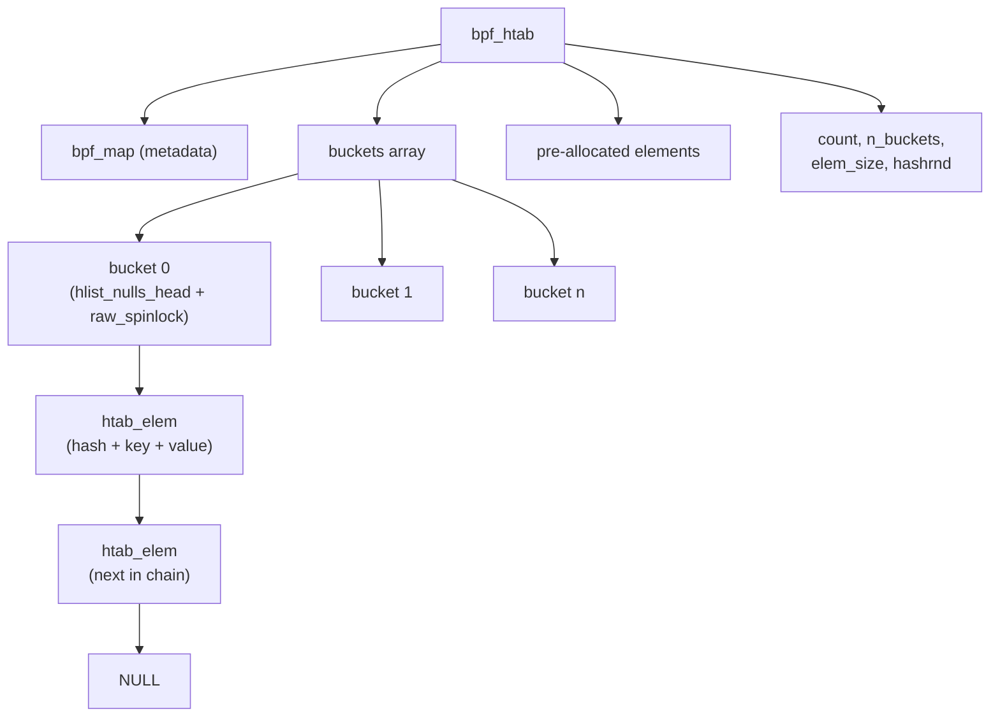
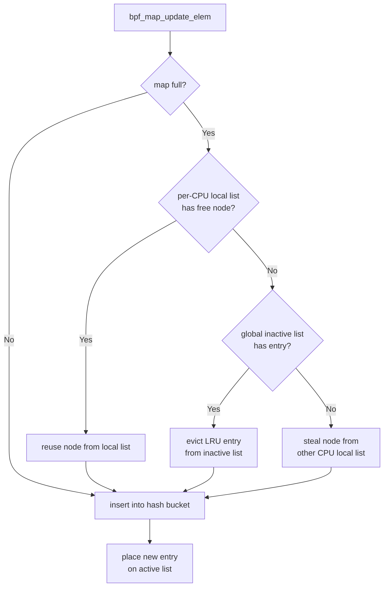
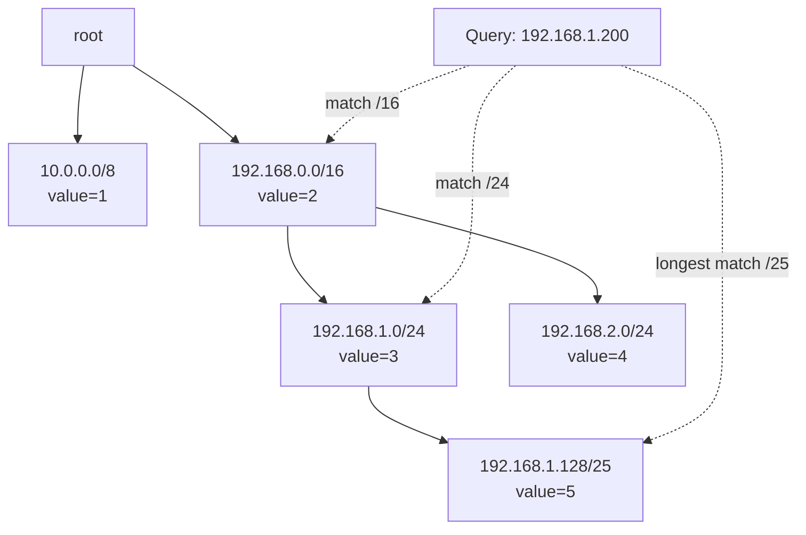
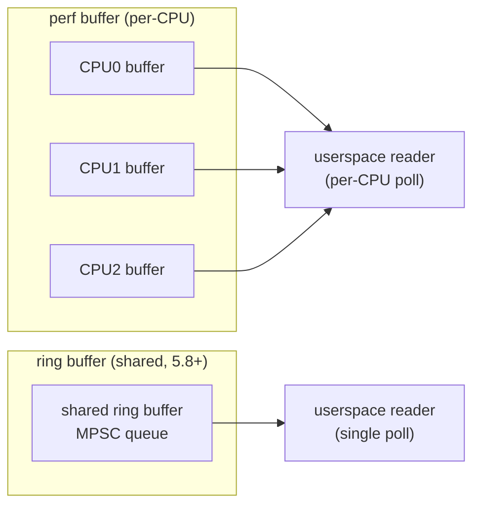

##  0x00    前言
本文主要介绍eBPF应用开发涉及到的数据结构，基于内核版本`6.6.47`

BPF Map 是 eBPF 程序与用户态程序、以及 eBPF 程序之间共享数据的核心机制。Map 本质上是驻留在内核空间的key-value存储，通过 `bpf_xxxx` 系统调用进行创建和操作。不同类型的 Map 适用于不同场景，选择合适的 Map 类型对程序性能至关重要

##  0x01    BPF Hash Map

####    数据结构概览

数据结构设计如下：

```TEXT
  +--------------------+
  | struct bpf_map map |--> general BPF map (metadata)
  |--------------------|
  | struct bucket *    |--> bucket linked-list
  |--------------------|
  | void *elems        |--> elements (hash+key+value), link-listed
  |--------------------|
  |                    |
  |--------------------|
  | count, n_buckets,  |--> hash map metadata
  | elem_size, hashrnd |
  +--------------------+
```

内核表示 BPF map 的结构体 `struct bpf_map` 是不区分 map 类型的，因此 hash map 在 BPF map 之上又封装了一层，即 `struct bpf_htab`，表示一个内核 hash map。Hash map 又主要分为两部分：

1.  `Buckets`：对 `key` 进行哈希之后找到对应的 `buckets`，但这里存放的只是 `buckets` 链表和锁等元数据，不存放数据
2.  `Elements`：即真正需要存放的数据，也组织成链表

####    内核核心结构

以下是内核 `kernel/bpf/hashtab.c` 中的核心结构体定义

```c
struct bucket {
    struct hlist_nulls_head head;
    raw_spinlock_t raw_lock;
};

struct bpf_htab {
    struct bpf_map map;
    struct bpf_mem_alloc ma;
    struct bpf_mem_alloc pcpu_ma;
    struct bucket *buckets;
    void *elems;
    union {
        struct pcpu_freelist freelist;
        struct bpf_lru lru;
    };
    struct htab_elem *__percpu *extra_elems;
    struct percpu_counter pcount;
    atomic_t count;
    u32 n_buckets;
    u32 elem_size;
    u32 hashrnd;
    struct lock_class_key lockdep_key;
    int __percpu *map_locked[HASHTAB_MAP_LOCK_COUNT];
};

struct htab_elem {
    union {
        struct hlist_nulls_node hash_node;
        struct {
            void *padding;
            union {
                struct bpf_htab *htab;
                struct pcpu_freelist_node fnode;
                struct htab_elem *batch_flink;
            };
        };
    };
    union {
        void *ptr_to_pptr;
        struct bpf_lru_node lru_node;
    };
    u32 hash;
    char key[] __aligned(8);
};
```

Hash Map 的内部结构可以用以下关系图表示：



关键要点：

-   每个 `bucket` 包含一把自旋锁 `raw_spinlock_t`，保护该 bucket 下的链表并发操作
-   `htab_elem` 通过 `hlist_nulls_node` 链接到 bucket 的哈希链表中
-   `key[]` 是柔性数组成员（flexible array member），key 之后紧跟 value 数据
-   对于 LRU 类型的 hash map，`htab_elem` 中会使用 `lru_node` 字段替代普通的 freelist 节点

####    PERCPU VS NON-PERCPU

| 特性 | NON-PERCPU（普通） | PERCPU |
|------|-------------------|--------|
| 数据存储 | 所有 CPU 共享同一份数据 | 每个 CPU 各自维护一份独立的数据副本 |
| 并发访问 | 需要锁保护（bucket-level spinlock） | 无锁访问，每个 CPU 操作自己的副本 |
| 性能 | 高并发写入时锁争用较大 | 高吞吐，无锁竞争开销 |
| 内存开销 | 仅一份数据 | `nr_cpus` 份数据，内存随 CPU 数增长 |
| 用户态读取 | 直接读取 value | 需要汇总所有 CPU 的副本（sum/merge） |
| 典型场景 | 连接表、配置下发、进程信息记录 | 流量统计、计数器、直方图、延迟采样 |

PERCPU 类型适用于写多读少且各 CPU 独立统计的场景（如包计数、延迟直方图），可以完全消除锁争用。代价是用户态需要额外汇总各 CPU 的值，并且内存占用与 CPU 核数成正比

####  PERCPU的`Lookup`实现（坑）
基于cilium/ebpf的`Lookup`方法，需要注意 PERCPU map 在用户态的 value 大小计算：每个 CPU 的 value 按 8 字节对齐后，乘以可用 CPU 数量，得到 `fullValueSize`

```GO
// newMap allocates and returns a new Map structure.
// Sets the fullValueSize on per-CPU maps.
func newMap(fd *sys.FD, name string, typ MapType, keySize, valueSize, maxEntries, flags uint32) (*Map, error) {
        m := &Map{
                name,
                fd,
                typ,
                keySize,
                valueSize,
                maxEntries,
                flags,
                "",
                int(valueSize),
        }

        if !typ.hasPerCPUValue() {
                return m, nil
        }

        possibleCPUs, err := PossibleCPU()
        if err != nil {
                return nil, err
        }

        m.fullValueSize = int(internal.Align(valueSize, 8)) * possibleCPUs
        return m, nil
}
```

##  0x02    常用的MAP结构与使用注意点

####    BPF_MAP_TYPE_HASH

`BPF_MAP_TYPE_HASH` 是最基础的哈希表类型，初始化时需要指定支持的最大条目数（`max_entries`），满了之后继续插入数据时会返回 `-E2BIG` 错误。内核代码位于 [kernel/bpf/hashtab.c](https://github.com/torvalds/linux/blob/v6.6/kernel/bpf/hashtab.c)

核心特性：

-   支持 `bpf_map_lookup_elem()`、`bpf_map_update_elem()`、`bpf_map_delete_elem()` 等操作
-   默认执行内存预分配（pre-alloc），可通过 `BPF_F_NO_PREALLOC` 标志关闭
-   Lookup / Update / Delete 平均时间复杂度 `O(1)`
-   bucket 级别自旋锁保护并发安全

典型应用场景：

1.  内核态数据传递给用户态（如流量统计信息）
2.  进程跟踪表（以 PID/TGID 为 key）
3.  配置参数下发（用户态写入，内核态读取）

与 `BPF_MAP_TYPE_LRU_HASH` 的核心区别在于：**HASH 满后 insert 失败返回 `-E2BIG`，LRU_HASH 满后自动淘汰最久未使用的 entry**

```c
struct {
        __uint(type, BPF_MAP_TYPE_HASH);
        __uint(max_entries, 10240);
        __type(key, u32);
        __type(value, u64);
} my_hash_map SEC(".maps");

SEC("kprobe/do_sys_openat2")
int trace_openat(struct pt_regs *ctx)
{
    u32 pid = bpf_get_current_pid_tgid() >> 32;
    u64 ts = bpf_ktime_get_ns();
    bpf_map_update_elem(&my_hash_map, &pid, &ts, BPF_ANY);
    return 0;
}
```

####    BPF_MAP_TYPE_LRU_HASH

`BPF_MAP_TYPE_LRU_HASH` 在普通 hash map 基础上增加了 LRU（Least Recently Used）淘汰机制。当 map 容量已满时，再插入新的 entry 会自动淘汰最久未被访问（lookup/update）的 entry，而不是返回错误。引入于内核 4.10，内核代码位于 [kernel/bpf/hashtab.c](https://github.com/torvalds/linux/blob/v6.6/kernel/bpf/hashtab.c) 和 [kernel/bpf/bpf_lru_list.c](https://github.com/torvalds/linux/blob/v6.6/kernel/bpf/bpf_lru_list.c)

**内核实现原理**

LRU Hash 在 `bpf_htab` 内部使用 `struct bpf_lru` 管理淘汰策略，采用 **per-CPU local list + global LRU list** 两级结构：

-   **Global LRU list**：全局的双向链表，维护所有 entry 的 LRU 顺序。分为 `active list` 和 `inactive list` 两个子链表
-   **Per-CPU local free list**：每个 CPU 维护本地的空闲 entry 列表，减少对全局锁的争用
-   当 insert 时发现 map 已满，先从 per-CPU local list 取空闲节点，若没有则从 global inactive list 淘汰，最后尝试从其他 CPU "偷取"（steal）

```c
struct bpf_lru {
    union {
        struct bpf_common_lru common_lru;        /* global LRU */
        struct bpf_lru_locallist __percpu *percpu_lru;  /* per-CPU LRU */
    };
    ...
};

struct bpf_lru_list {
    struct list_head lists[NR_BPF_LRU_LIST_T]; /* active / inactive / free */
    ...
};
```

LRU 淘汰流程：



**使用场景**

-   **连接跟踪表（conntrack）**：网络连接数量不可预知，满后淘汰最旧的连接
-   **NAT 映射表**：地址转换记录，容量有限时自动释放不活跃映射
-   **IP 统计/限流**：统计源 IP 的包数量/字节数，map 满时淘汰不活跃 IP
-   **DDoS 防御中的 rate limiter**：记录每个源 IP 的请求速率

**注意事项**

1.  淘汰是**被动触发**的，仅在 insert 时发现 map 满才执行淘汰，不会后台自动清理
2.  `bpf_map_lookup_elem()` 和 `bpf_map_update_elem()` 都会刷新 entry 的"最近访问"状态（将其提升到 active list）
3.  高频 update 场景下，`BPF_MAP_TYPE_LRU_PERCPU_HASH` 性能优于全局 LRU，因为减少了全局锁争用
4.  在伪造源 IP 的 DDoS 攻击下，海量不同 IP 会导致 LRU map 条目快速轮转（频繁淘汰+插入），CPU 开销显著增大
5.  `max_entries` 设置需要权衡：过小会频繁淘汰有效数据，过大会浪费内存（预分配）

**内核态 C 示例：XDP 统计源 IP 包数量**

```c
#include "vmlinux.h"
#include <bpf/bpf_helpers.h>
#include <bpf/bpf_endian.h>

struct ip_stats {
    __u64 packets;
    __u64 bytes;
};

struct {
    __uint(type, BPF_MAP_TYPE_LRU_HASH);
    __uint(max_entries, 65536);
    __type(key, __u32);              /* src IPv4 addr */
    __type(value, struct ip_stats);
} src_ip_stats SEC(".maps");

SEC("xdp")
int xdp_count_src_ip(struct xdp_md *ctx)
{
    void *data = (void *)(long)ctx->data;
    void *data_end = (void *)(long)ctx->data_end;

    struct ethhdr *eth = data;
    if ((void *)(eth + 1) > data_end)
        return XDP_PASS;
    if (bpf_ntohs(eth->h_proto) != ETH_P_IP)
        return XDP_PASS;

    struct iphdr *iph = (void *)(eth + 1);
    if ((void *)(iph + 1) > data_end)
        return XDP_PASS;

    __u32 src_ip = iph->saddr;
    __u64 pkt_len = data_end - data;

    struct ip_stats *stats = bpf_map_lookup_elem(&src_ip_stats, &src_ip);
    if (stats) {
        __sync_fetch_and_add(&stats->packets, 1);
        __sync_fetch_and_add(&stats->bytes, pkt_len);
    } else {
        struct ip_stats new_stats = {
            .packets = 1,
            .bytes = pkt_len,
        };
        bpf_map_update_elem(&src_ip_stats, &src_ip, &new_stats, BPF_NOEXIST);
    }

    return XDP_PASS;
}

char _license[] SEC("license") = "GPL";
```

上面的例子中，当 map 中已经有 `65536` 个不同的源 IP 记录后，再遇到新的 IP，LRU 机制会自动淘汰最久没有收到流量的 IP 记录，腾出空间给新 IP。无需开发者手动管理过期逻辑

####   BPF_MAP_TYPE_ARRAY

`BPF_MAP_TYPE_ARRAY` 是最简单的 Map 类型，底层就是一个连续数组。key 是 `__u32` 类型的索引（从 `0` 到 `max_entries - 1`），lookup 操作 `O(1)` 直接按下标寻址

核心特性：

-   创建时所有 entry 即被零初始化，无需手动插入
-   **不支持删除 entry**（`bpf_map_delete_elem()` 返回 `-EINVAL`），只能 update
-   value 地址在 map 生命周期内固定，可安全持有指针
-   内存连续，CPU cache 友好

典型场景：

-   固定大小的统计数组（如按 softirq 类型的计数器）
-   全局配置表（用 index 0 存储一个配置结构体）
-   作为 "堆内存" 的替代（配合 `BPF_MAP_TYPE_PERCPU_ARRAY`，突破栈 512 字节限制）

```c
struct {
    __uint(type, BPF_MAP_TYPE_ARRAY);
    __uint(max_entries, 256);
    __type(key, u32);
    __type(value, u64);
} my_array SEC(".maps");
```

####    BPF_MAP_TYPE_PERCPU_HASH / PERCPU_ARRAY

PERCPU 变体（`BPF_MAP_TYPE_PERCPU_HASH`、`BPF_MAP_TYPE_PERCPU_ARRAY`）为每个 CPU 维护独立的 value 副本，核心优势是**完全无锁**的并发读写。引入于内核 4.6 版本

关键特性：

-   内核态 `bpf_map_lookup_elem()` 返回的是**当前 CPU** 的 value 副本，无需加锁
-   用户态 `bpf_map_lookup_elem()` 返回所有 CPU 副本的数组，需要自行汇总
-   内存开销 = `value_size * nr_possible_cpus`（按 `8` 字节对齐）

使用场景：

-   **流量计数器**：每个 CPU 各自累加，用户态定期汇总
-   **延迟直方图**：per-CPU 独立记录，避免锁争用
-   **临时堆空间**：`PERCPU_ARRAY` + `max_entries=1` 作为无锁的 per-CPU 临时缓冲区，突破 BPF 栈 512 字节限制

```c
struct {
    __uint(type, BPF_MAP_TYPE_PERCPU_HASH);
    __uint(max_entries, 1024);
    __type(key, u32);
    __type(value, u64);
} percpu_counter SEC(".maps");

SEC("tp_btf/sched_switch")
int count_context_switch(u64 *ctx)
{
    u32 cpu = bpf_get_smp_processor_id();
    u64 *val = bpf_map_lookup_elem(&percpu_counter, &cpu);
    if (val)
        *val += 1;       /* no lock needed, per-CPU value */
    else {
        u64 init = 1;
        bpf_map_update_elem(&percpu_counter, &cpu, &init, BPF_NOEXIST);
    }
    return 0;
}
```

####    BPF_MAP_TYPE_LPM_TRIE

`BPF_MAP_TYPE_LPM_TRIE` 是 eBPF 中专门用于**最长前缀匹配（Longest Prefix Matching）** 的数据结构，引入于内核 4.11。内核代码位于 [kernel/bpf/lpm_trie.c](https://github.com/torvalds/linux/blob/v6.6/kernel/bpf/lpm_trie.c)

**原理**

LPM Trie 基于**压缩前缀树（compressed trie）** 实现。树中每个节点代表一个前缀，从根节点到叶子节点的路径表示 bit 级别的匹配过程。查找时逐 bit 比较 key 的数据部分，选择匹配最长前缀的节点作为结果，时间复杂度 `O(prefixlen)`

LPM Trie 的树形查找示意如下（以 IPv4 CIDR 为例）：



查询 `192.168.1.200` 时，trie 按 bit 逐层匹配：先匹配到 `/16`，再匹配到 `/24`，最终匹配到 `/25`（最长前缀），返回 `value=5`

**Key 结构**

LPM Trie 的 key 由两部分组成：

-   `prefixlen`：前缀长度（以 **bit** 为单位，如 IPv4 的 `/24` 对应 prefixlen=24）
-   `data`：实际数据（**必须**按网络字节序/大端序存储）

```c
struct lpm_key_ipv4 {
    __u32 prefixlen;    /* in bits, e.g. 24 for /24 */
    __u32 data;         /* IPv4 addr in network byte order */
};

struct lpm_key_ipv6 {
    __u32 prefixlen;    /* in bits, e.g. 64 for /64 */
    __u8  data[16];     /* IPv6 addr in network byte order */
};
```

**使用场景**

-   **XDP/TC 中的 CIDR 匹配**：IP 黑白名单、ACL 规则
-   **路由表最长前缀匹配**：将路由条目（如 `10.0.0.0/8 -> 网关A`）存入 trie，查找最佳匹配路由
-   **IPv6 前缀匹配**：key data 部分扩展为 16 字节即可支持 IPv6
-   **域名后缀匹配**：将反转后的域名字符按 bit 编码存入 trie

**注意事项**

1.  **必须**设置 `BPF_F_NO_PREALLOC` 标志，因为 trie 节点按需分配，预分配无意义且会浪费内存
2.  key 中的 `data` 必须按**网络字节序（大端）** 存储，用 `bpf_htonl()` / `bpf_htons()` 转换
3.  `prefixlen = 0` 表示默认路由（catch-all），匹配所有 key
4.  `max_entries` 代表 trie 中**最大节点数**（包含中间节点），不等于叶子数或规则数
5.  lookup 时传入的 `prefixlen` 应设置为 key 数据的**完整 bit 长度**（如 IPv4 设为 32），trie 内部会自动找最长匹配
6.  支持 `bpf_map_get_next_key()` 遍历（内核 4.16+）
7.  不支持 PERCPU 变体

**内核态 C 示例 1：IPv4 CIDR 黑名单（XDP drop）**

```c
#include "vmlinux.h"
#include <bpf/bpf_helpers.h>
#include <bpf/bpf_endian.h>

#define MAX_RULES 4096

struct lpm_key_ipv4 {
    __u32 prefixlen;
    __u32 data;     /* network byte order */
};

struct {
    __uint(type, BPF_MAP_TYPE_LPM_TRIE);
    __uint(max_entries, MAX_RULES);
    __type(key, struct lpm_key_ipv4);
    __type(value, __u32);                /* action: 1=drop, 0=pass */
    __uint(map_flags, BPF_F_NO_PREALLOC);
} ipv4_blacklist SEC(".maps");

SEC("xdp")
int xdp_lpm_filter(struct xdp_md *ctx)
{
    void *data = (void *)(long)ctx->data;
    void *data_end = (void *)(long)ctx->data_end;

    struct ethhdr *eth = data;
    if ((void *)(eth + 1) > data_end)
        return XDP_PASS;
    if (bpf_ntohs(eth->h_proto) != ETH_P_IP)
        return XDP_PASS;

    struct iphdr *iph = (void *)(eth + 1);
    if ((void *)(iph + 1) > data_end)
        return XDP_PASS;

    /* lookup 时 prefixlen 设为 32（完整 IPv4），trie 自动返回最长匹配 */
    struct lpm_key_ipv4 key = {
        .prefixlen = 32,
        .data = iph->saddr,   /* 已经是网络字节序 */
    };

    __u32 *action = bpf_map_lookup_elem(&ipv4_blacklist, &key);
    if (action && *action == 1)
        return XDP_DROP;

    return XDP_PASS;
}

char _license[] SEC("license") = "GPL";
```

用户态通过 `bpf_map_update_elem()` 插入 CIDR 规则，例如封禁 `10.0.0.0/8` 和 `192.168.1.0/24`：

```c
/* userspace: insert CIDR rules */
struct lpm_key_ipv4 key1 = { .prefixlen = 8 };
inet_pton(AF_INET, "10.0.0.0", &key1.data);
__u32 drop_action = 1;
bpf_map_update_elem(map_fd, &key1, &drop_action, BPF_ANY);

struct lpm_key_ipv4 key2 = { .prefixlen = 24 };
inet_pton(AF_INET, "192.168.1.0", &key2.data);
bpf_map_update_elem(map_fd, &key2, &drop_action, BPF_ANY);
```

**内核态 C 示例 2：IPv6 前缀匹配**

```c
struct lpm_key_ipv6 {
    __u32 prefixlen;
    __u8  data[16];   /* 128-bit IPv6 addr, network byte order */
};

struct {
    __uint(type, BPF_MAP_TYPE_LPM_TRIE);
    __uint(max_entries, 1024);
    __type(key, struct lpm_key_ipv6);
    __type(value, __u32);
    __uint(map_flags, BPF_F_NO_PREALLOC);
} ipv6_lpm SEC(".maps");

static __always_inline __u32 *lookup_ipv6(struct in6_addr *addr)
{
    struct lpm_key_ipv6 key = { .prefixlen = 128 };
    __builtin_memcpy(key.data, addr, 16);
    return bpf_map_lookup_elem(&ipv6_lpm, &key);
}
```

####    BPF_MAP_TYPE_STACK_TRACE

`BPF_MAP_TYPE_STACK_TRACE` 专门用于存储内核/用户态的调用栈信息，配合 `bpf_get_stackid()` helper 使用。引入于内核 4.6

-   key 是 `bpf_get_stackid()` 返回的 stack id（32位哈希值）
-   value 是 `__u64` 数组，存储栈帧中每层的指令地址
-   典型用于 CPU profiling、off-CPU 分析、火焰图生成

```c
struct {
    __uint(type, BPF_MAP_TYPE_STACK_TRACE);
    __uint(max_entries, 8192);
    __uint(key_size, sizeof(u32));
    __uint(value_size, 100 * sizeof(u64));  /* max 100 stack frames */
} stack_traces SEC(".maps");

SEC("perf_event")
int profile_handler(struct bpf_perf_event_data *ctx)
{
    u32 pid = bpf_get_current_pid_tgid() >> 32;
    int stack_id = bpf_get_stackid(ctx, &stack_traces,
                                    BPF_F_USER_STACK | BPF_F_FAST_STACK_CMP);
    /* record (pid, stack_id) pair for later symbolization */
    return 0;
}
```

##  0x03    一些使用技巧

####    减少预分配（pre-allocation）开销

> 注意：在早期内核中（commit `94dacdbd5d2d`），`BPF_F_NO_PREALLOC` 在 kprobe 场景下可能触发死锁，参见 [BCC PR #4044](https://github.com/iovisor/bcc/pull/4044)。在 6.6 内核中此问题已修复，但仍需了解其背景

从 Linux 4.6 开始，BPF hash maps 会默认执行内存预分配，并引入 `BPF_F_NO_PREALLOC` 标志。这样做的动机是为了避免 kprobe + bpf 死锁。社区尝试了其他解决方案，但最终，预分配所有 map 元素是最简单的解决方案，并且不影响用户空间的行为。

当完整的 map 预分配过于昂贵时，可使用 `BPF_F_NO_PREALLOC` 标志定义 map 以保持早期行为。详情请参阅 bpf: map pre-alloc。当 map 大小不大时（比如 `MAX_ENTRIES = 256`），这个标志是不必要的，因为 `BPF_F_NO_PREALLOC` 速度较慢（运行时动态分配）

以下是一个使用示例：

```c
struct {
        __uint(type, BPF_MAP_TYPE_HASH);
        __uint(max_entries, MAX_ENTRIES);
        __type(key, u32);
        __type(value, u64);
        __uint(map_flags, BPF_F_NO_PREALLOC);
} start SEC(".maps");
```

####    运行时确定 map 大小
libbpf-tools 的一个优点是可移植，因此 map 所需的最大空间可能因不同的机器而异。在这种情况下，可以在加载之前定义 map 而不指定大小，然后运行时调整。例如：

在 `<name>.bpf.c` 中，定义 map：

```c
struct {
        __uint(type, BPF_MAP_TYPE_HASH);
        __type(key, u32);
        __type(value, u64);
} start SEC(".maps");
```

在 open 阶段之后，调用 `bpf_map__set_max_entries()`（新版 libbpf API，替代了早期的 `bpf_map__resize()`）进行动态调整。例如：

```c
struct cpudist_bpf *obj;
obj = cpudist_bpf__open();
//bpf_map__resize(obj->maps.start, pid_max); //old version
bpf_map__set_max_entries(obj->maps.start, pid_max);
```

####    Per-CPU
在选择 map 类型时，如果与同一 CPU 相关联并发生多个事件，则可以使用 per-CPU 数组来跟踪时间戳，这比使用 hash map 更加简单和高效。然而必须确保内核在两次 BPF 程序调用之间不会将进程从一个 CPU 迁移到另一个 CPU。`softirqs.bpf.c`示例分析了软中断，并且满足了这两个条件：

```c
struct {
        __uint(type, BPF_MAP_TYPE_PERCPU_ARRAY);
        __uint(max_entries, 1);
        __type(key, u32);
        __type(value, u64);
} start SEC(".maps");

SEC("tp_btf/softirq_entry")
int BPF_PROG(softirq_entry, unsigned int vec_nr)
{
        u64 ts = bpf_ktime_get_ns();
        u32 key = 0;

        bpf_map_update_elem(&start, &key, &ts, 0);
        return 0;
}

SEC("tp_btf/softirq_exit")
int BPF_PROG(softirq_exit, unsigned int vec_nr)
{
        u32 key = 0;
        u64 *tsp;

        [...]
        tsp = bpf_map_lookup_elem(&start, &key);
        [...]
}
```

####    全局变量
不仅可以使用全局变量来自定义 BPF 程序逻辑，还可以使用它们来替代 map，这使程序更加简单和高效。全局变量可以是任意大小。可设定全局变量为一个固定的大小

例如，因为 `SOFTIRQ` 类型的数量是固定的，可以在 softirq.bpf.c 中定义全局数组来保存计数和直方图：

```c
__u64 counts[NR_SOFTIRQS] = {};
struct hist hists[NR_SOFTIRQS] = {};
```

然后，可以直接在用户空间遍历这个数组：

```c
static int print_count(struct softirqs_bpf__bss *bss)
{
        const char *units = env.nanoseconds ? "nsecs" : "usecs";
        __u64 count;
        __u32 vec;

        printf("%-16s %6s%5s\n", "SOFTIRQ", "TOTAL_", units);

        for (vec = 0; vec < NR_SOFTIRQS; vec++){
                count = __atomic_exchange_n(&bss->counts[vec], 0,
                                        __ATOMIC_RELAXED);
                if (count > 0)
                        printf("%-16s %11llu\n", vec_names[vec], count);
        }

        return 0;
}
```

####    Map 声明风格说明

BPF map 有两种声明风格，推荐使用 BTF-defined 风格：

**BTF-defined 风格（推荐，内核 5.2+）**：

```c
struct {
    __uint(type, BPF_MAP_TYPE_HASH);
    __uint(max_entries, 1024);
    __type(key, __u32);
    __type(value, __u64);
} my_map SEC(".maps");
```

**Legacy `bpf_map_def` 风格（不推荐）**：

```c
struct bpf_map_def SEC("maps/my_map") my_map = {
    .type = BPF_MAP_TYPE_HASH,
    .key_size = sizeof(__u32),
    .value_size = sizeof(__u64),
    .max_entries = 1024,
};
```

BTF-defined 风格的优势：类型信息完整、支持 map-in-map、支持 `bpf_map__set_*()` API 动态配置、兼容 CO-RE 重定位。本文后续的 perf buffer 示例中保留了 legacy 风格用于对比，实际开发中应统一使用 BTF-defined 风格

##  0x04    再看perf_event VS ringbuf



####    perf buffer
eBPF中提供了内核和用户空间之间高效地交换数据的机制即perf buffer，它是一种 per-CPU 的环形缓冲区，当需要将 eBPF 收集到的数据发送到用户空间记录或者处理时，就可以用 perf buffer 来完成。它还有如下特点：

-   能够记录可变长度数据
-   能够通过内存映射的方式在用户态读取数据，而无需通过系统调用陷入到内核去拷贝数据
-   实现 epoll 通知机制

eBPF 提供了专门的 map 和 helper function 来使用 perf buffer，如下是最常用的两个：

-   map：`BPF_MAP_TYPE_PERF_EVENT_ARRAY`：此类型 map 专门用于 perf buffer
-   helper function：`bpf_perf_event_output`：用于将数据发送到 perf buffer 并通知用户态

以下示例使用 legacy `bpf_map_def` 风格（仅作对比参考，新代码请使用 BTF-defined 风格）：

```c
struct bpf_map_def SEC("maps/my_map") my_map = {
    .type = BPF_MAP_TYPE_PERF_EVENT_ARRAY,
    .key_size = sizeof(int),
    .value_size = sizeof(u32),
    .max_entries = 1024,
};

struct data_t {
    u32 pid;
};

SEC("kprobe/vfs_mkdir")
int kprobe_vfs_mkdir(void *ctx)
{
    bpf_printk("mkdir_perf_event (vfs hook point)%u\n", bpf_get_current_pid_tgid());
    struct data_t data = {};
    data.pid = bpf_get_current_pid_tgid();
    bpf_perf_event_output(ctx, &my_map, BPF_F_CURRENT_CPU, &data, sizeof(data));
    return 0;
}
```

在 `BPF_MAP_TYPE_PERF_EVENT_ARRAY` 类型的映射中，`key_size` 和 `value_size` 的含义与其他类型的映射略有不同：

-   `key_size`：键是 CPU 的编号，因此 `key_size` 通常被设置为 `sizeof(int)`
-   `value_size`：值是一个文件描述符（fd），该 fd 关联了一个 perf event。因此 `value_size` 通常被设置为 `sizeof(u32)`，而不是实际需要传输的结构体大小（不能写成 `sizeof(struct data_t)`）

上面的代码存在**两次内存拷贝**的问题：

1.  `struct data_t data = {};` -- 在栈上创建数据（第一次拷贝：初始化）
2.  `bpf_perf_event_output(...)` -- 将栈上的数据拷贝到 perf buffer（第二次拷贝）

此外，因为 `data` 是在栈上分配的，eBPF verifier 会限制结构体不能超过 **512 字节**

####    perf buffer heap 优化

`struct data_t data = {}` 因为是在栈上创建的，所以会存在大小限制，结构体大小不能超过 512 字节。常见的做法是用 `BPF_MAP_TYPE_PERCPU_ARRAY` 作为 "堆内存"：

```c
struct bpf_map_def SEC("maps/heap") heap = {
    .type = BPF_MAP_TYPE_PERCPU_ARRAY,
    .key_size = sizeof(int),
    .value_size = sizeof(struct data_t),
    .max_entries = 1,
};

struct data_t {
    u32 pid;
};

struct bpf_map_def SEC("maps/perf_map") perf_map = {
    .type = BPF_MAP_TYPE_PERF_EVENT_ARRAY,
    .key_size = sizeof(int),
    .value_size = sizeof(u32),
    .max_entries = 1024,
};

SEC("kprobe/vfs_mkdir")
int kprobe_vfs_mkdir(void *ctx)
{
    bpf_printk("mkdir_perf_event (vfs hook point)%u\n", bpf_get_current_pid_tgid());
    int zero = 0;
    struct data_t *data = bpf_map_lookup_elem(&heap, &zero);
    if (!data) {
        return 0;
    }

    data->pid = bpf_get_current_pid_tgid();
    bpf_perf_event_output(ctx, &perf_map, BPF_F_CURRENT_CPU, data, sizeof(*data));
    return 0;
}
```

通过 `bpf_map_lookup_elem(&heap, &zero)` 从 `BPF_MAP_TYPE_PERCPU_ARRAY` 中获取一块 per-CPU 的内存作为临时缓冲区，从而避免了 `512` 字节的栈大小限制。但仍然存在两次拷贝的问题

`BPF_MAP_TYPE_PERCPU_ARRAY` 的优势：

-   **并发更新**：每个 CPU 核心有独立的数据副本，并发更新无需加锁
-   **无锁访问**：避免了锁竞争的开销
-   **高效的局部性**：每个 CPU 核心只访问自己的数据副本，cache 友好

`BPF_MAP_TYPE_PERF_EVENT_ARRAY` 的优势：

-   **内核到用户态数据传输**：与 Linux 的 perf_event 子系统集成，允许将数据从内核空间高效传输到用户空间
-   **适用于事件流**：实时捕获和处理事件数据（如 kprobe/tracepoint 触发的事件）

总之，`BPF_MAP_TYPE_PERCPU_ARRAY` 适用于需要高性能并发访问的 per-CPU 临时存储，而 `BPF_MAP_TYPE_PERF_EVENT_ARRAY` 适用于内核到用户态的事件数据传输

####    perf buffer 的问题

**1、内存效率**

perfbuf 为每个 CPU 分配一个独立的缓冲区，这意味着开发者通常需要在内存效率和数据丢失之间做出折中：

-   越大的 per-CPU buffer 越能避免丢数据，但也意味着大部分时间里，大部分内存都是浪费的
-   尽量小的 per-CPU buffer 能提高内存使用效率，但在数据量陡增（毛刺）时将导致丢数据
-   对于那些大部分时间都比较空闲、周期性来一大波数据的场景，这个问题尤其突出，很难在两者之间取得一个很好的平衡

ringbuf 的解决方式是分配一个所有 CPU 共享的大缓冲区：

-   大缓冲区，意味着能更好地容忍数据量毛刺
-   共享，则意味着内存使用效率更高
-   CPU 数量从 `16` 增加到 `32` 时，perfbuf 的总 buffer 会翻倍（per-CPU），ringbuf 的总 buffer 不一定需要翻倍

**2、事件顺序**

perfbuf 的 per-CPU 特性导致内核调度器在不同 CPU 上调度进程时，对于那些存活时间很短的进程（fork→exec→exit 会在极短的时间内在不同 CPU 上执行），用户态无法按照事件发生的顺序获取数据

但对于 ringbuf 来说，因为它是共享的同一个缓冲区，ringbuf 保证如果事件 A 发生在事件 B 之前，那 A 一定会先于 B 被提交，也会在 B 之前被消费

**3、数据复制**

BPF 程序使用 perfbuf 时，必须先初始化一份事件数据，然后将它复制到 perfbuf，然后才能发送到用户空间。这意味着数据会被**复制两次**：

1.  复制到一个局部变量或 per-CPU array（BPF 的栈空间很小，因此较大的变量无法放到栈上）
2.  复制到 perfbuf 中

更糟糕的是，如果 perfbuf 已经没有足够空间放数据了，那第一步的复制完全是浪费的

BPF ringbuf 提供了一个可选的 reservation/submit API 来避免这种问题：

-   首先申请为数据预留空间（reserve the space）
-   预留成功后，应用就可以直接将准备发送的数据放到 ringbuf 了，从而节省了 perfbuf 中的第一次复制
-   将数据提交到用户空间将是一件极其高效、不会失败的操作，也不涉及任何额外的内存复制
-   如果因为 buffer 没有空间而预留失败了，BPF 程序马上就能知道，从而也不用再执行第一步复制

| 对比项 | perf buffer | ring buffer |
|--------|-------------|-------------|
| 引入版本 | 4.4+ | 5.8+ |
| 缓冲区模型 | per-CPU 独立 | 所有 CPU 共享（MPSC） |
| 内存效率 | 低（per-CPU 预分配） | 高（共享，弹性利用） |
| 事件顺序 | 无法保证跨 CPU 顺序 | 全局有序 |
| 数据拷贝 | 2 次 | 1 次（reserve/submit）或 2 次（output） |
| API | `bpf_perf_event_output()` | `bpf_ringbuf_output()` / `bpf_ringbuf_reserve()` + `bpf_ringbuf_submit()` |

参考：[BPF ring buffer](http://arthurchiao.art/blog/bpf-ringbuf-zh/)

####    ringbuf
由于 perf buffer 的 per-CPU 模型存在的两个严重缺陷：

-   内存使用效率低下（inefficient use of memory）
-   事件顺序无法保证（event re-ordering）

因此内核 5.8 引入了 ringbuf 来解决这个问题。ringbuf 是一个"多生产者、单消费者"（multi-producer, single-consumer，MPSC）队列，可安全地在多个 CPU 之间共享和操作。perfbuf 支持的一些功能它都支持，包括：

-   可变长数据（variable-length data records）
-   通过 memory-mapped region 来高效地从 userspace 读数据，避免内存复制或系统调用
-   支持 epoll notifications 和 busy-loop 两种获取数据方式

**epoll notifications 和 busy-loop 两种消费模式**：

-   **epoll notifications**：使用 Linux 的 epoll 机制。用户空间应用将 ringbuf 的 fd 添加到 epoll 实例中，调用 `epoll_wait()` 等待新数据。当内核有新数据写入 ringbuf 时触发 epoll 事件唤醒应用。优点是无新数据时不消耗 CPU；缺点是唤醒有延迟
-   **busy-loop**：用户空间应用不断轮询 ringbuf 检查是否有新数据。优点是延迟最低；缺点是持续占用 CPU 资源

**内核态示例：ringbuf 基础用法（bpf_ringbuf_output）**

```c
struct {
	__uint(type, BPF_MAP_TYPE_RINGBUF);
	__uint(max_entries, 1 << 24);   /* 16MB, shared across all CPUs */
} events SEC(".maps");

struct task_info {
	u32 pid;
	u8 comm[80];
};

SEC("kprobe/vfs_mkdir")
int kprobe_vfs_mkdir(void *ctx)
{
    struct task_info task_data = {};
    u64 id   = bpf_get_current_pid_tgid();
    u32 tgid = id >> 32;
    task_data.pid = tgid;
    bpf_get_current_comm(&task_data.comm, 80);
    bpf_ringbuf_output(&events, &task_data, sizeof(task_data), 0);
    return 0;
}
```

对比 `bpf_perf_event_output` 方式的代码：

```c
struct bpf_map_def SEC("maps/my_map") my_map = {
    .type = BPF_MAP_TYPE_PERF_EVENT_ARRAY,
    .key_size = sizeof(int),
    .value_size = sizeof(u32),
    .max_entries = 1024,
};

struct data_t {
    u32 pid;
};

SEC("kprobe/vfs_mkdir")
int kprobe_vfs_mkdir(void *ctx)
{
    struct data_t data = {};
    data.pid = bpf_get_current_pid_tgid();
    bpf_perf_event_output(ctx, &my_map, BPF_F_CURRENT_CPU, &data, sizeof(data));
    return 0;
}
```

`bpf_ringbuf_output` 和 `bpf_perf_event_output` 有如下几点不同：

-   ringbuf map 的大小（`max_entries`）在 BPF 侧指定，这是所有 CPU **共享**的总大小
-   `bpf_ringbuf_output()` 不需要 BPF context 参数（`ctx`），API 更简洁
-   ringbuf map 类型为 `BPF_MAP_TYPE_RINGBUF`

**用户态代码（基于 datadog/manager）**

```go
m := &manager.Manager{
    Probes: []*manager.Probe{
        &manager.Probe{
            UID:              "MyFirstHook",
            Section:          "kprobe/vfs_mkdir",
            AttachToFuncName: "vfs_mkdir",
            EbpfFuncName:     "kprobe_vfs_mkdir",
        },
    },
    RingbufMaps: []*manager.RingbufMap{
        &manager.RingbufMap{
            Map: manager.Map{
                Name: "events",
            },
            RingbufMapOptions: manager.RingbufMapOptions{
                DataHandler: myDataHandler,
            },
        },
    },
}
```

相比之前的代码，只是将 perfbuf map 替换成了 ringbuf map，并设置 `DataHandler` 回调函数处理内核态传输过来的数据。DataHandler 的回调函数原型如下：

```go
DataHandler func(CPU int, data []byte, perfMap *RingbufMap, manager *Manager)
```

实际程序运行得到的结果如下：

```text
successfully started, head over to /sys/kernel/debug/tracing/trace_pipe
Generating events to trigger the probes ...
creating /tmp/test_folder
received: pid:1118833,comm:main
removing /tmp/test_folder
```

通过 `/sys/kernel/debug/tracing/trace_pipe` 得到的结果与用户态程序解析结果一致：

```text
<...>-1118835 [010] d...1 702590.314924: bpf_trace_printk: pid: 1118833, comm: main
```

####    ringbuf reserve/commit 优化

`bpf_ringbuf_output()` API 的目的是确保从 perfbuf 到 ringbuf 迁移时无需对 BPF 代码做重大改动，但这也意味着它继承了 perfbuf API 的一些缺点：

-   **额外的内存复制**：需要额外的空间来构建 event 变量，然后将其复制到 buffer。不仅低效，而且经常需要引入只有一个元素的 per-CPU array
-   **非常晚的 buffer 空间申请**：如果 buffer 满导致发送失败，前面准备数据的工作完全浪费

为了解决 `xxx_output()` 存在的问题，引入了新的 `bpf_ringbuf_reserve()` / `bpf_ringbuf_submit()` API：

-   **提前预留空间**，或者能立即发现没有可用空间了（返回 NULL）
-   预留成功后，一旦数据写好了，将它发送到 userspace 是一个**不会失败**的操作（`bpf_ringbuf_submit()` 没有返回值，保证成功）
-   预留的空间在被提交之前用户空间看不到，BPF 程序可以从容地组织 event 数据，避免了额外的内存复制和临时存储空间

限制：BPF 校验器在校验时（at verification time）必须知道预留数据的大小，因此**不支持动态大小的事件数据**。对于动态大小的数据，只能退回到用 `bpf_ringbuf_output()` 方式

```c
struct task_info *task_data;
task_data = bpf_ringbuf_reserve(&events, sizeof(*task_data), 0);
if (!task_data) {
    return 0;
}
task_data->pid = bpf_get_current_pid_tgid() >> 32;
bpf_get_current_comm(&task_data->comm, sizeof(task_data->comm));
bpf_ringbuf_submit(task_data, 0);
return 0;
```

`bpf_ringbuf_submit` 的函数原型：

```c
void bpf_ringbuf_submit(void *data, u64 flags)
```

`flags` 参数有三个选项：

-   `BPF_RB_NO_WAKEUP`：提交数据后**不唤醒**用户空间进程。适用于 busy-loop 模式，用户空间进程总是在轮询，不需要被唤醒
-   `BPF_RB_FORCE_WAKEUP`：提交数据后**强制唤醒**用户空间进程。适用于 epoll notifications 模式
-   `0`：由内核根据当前条件自动决定是否唤醒用户空间进程（推荐默认值）

使用 `bpf_ringbuf_reserve()` / `bpf_ringbuf_submit()` 提交数据，用户态代码不需要改变


##  0x05    参考
-   [BPF 进阶笔记（三）：BPF Map 内核实现](https://arthurchiao.art/blog/bpf-advanced-notes-3-zh/)
-   [BPF_MAP_TYPE_HASH, with PERCPU and LRU Variants](https://docs.kernel.org/bpf/map_hash.html)
-   [BPF_MAP_TYPE_LPM_TRIE](https://docs.kernel.org/next/bpf/map_lpm_trie.html)
-   [perf_event和ringbuf原理介绍和使用](https://blog.spoock.com/2023/09/16/eBPF-event/)
-   [PERCPU-APPLICATION](https://github.com/cilium/ebpf/blob/main/examples/kprobe_percpu/main.go)
-   [kernel：hashtable v6.6](https://github.com/torvalds/linux/blob/v6.6/kernel/bpf/hashtab.c)
-   [kernel：lpm_trie v6.6](https://github.com/torvalds/linux/blob/v6.6/kernel/bpf/lpm_trie.c)
-   [kernel：bpf_lru_list v6.6](https://github.com/torvalds/linux/blob/v6.6/kernel/bpf/bpf_lru_list.c)
-   [使用 libbpf 编写 BPF 应用程序进阶技巧](https://www.ebpf.top/post/top_and_tricks_for_bpf_libbpf/)
-   [BPF ring buffer：使用场景、核心设计及程序示例（2020）](http://arthurchiao.art/blog/bpf-ringbuf-zh/)