## 0x00 前言
本文代码片段参考[v1.21.1](https://github.com/kubernetes/kubernetes/tree/v1.21.1)版本

##  0x01  基础知识

####  k8s基本架构


- apiserver：资源操作的唯一入口，接收用户输入的命令，提供认证、授权、API注册和发现等机制，通过标准的RESTFul API，重新封装了对 ETCD 接口调用，提供系统内其他组件调用的代理入口
- scheduler：负责集群资源调度，按照预定的调度策略将Pod调度到相应的node节点上
- controllerManager：负责维护集群的状态，比如程序部署安排、故障检测、自动扩展、滚动更新等
- etcd：负责存储集群中各种资源对象的信息，k/v方式存储，所有的 k8s 集群数据存放在此。此外，各个组件通信都并不是互相调用 API 来完成的，而是把状态写入 ETCD（相当于写入一个消息），其他组件通过监听 ETCD 的状态的的变化（相当于订阅消息），然后做后续的处理，然后再一次把更新的数据写入 ETCD
- kubectl：命令行配置工具
- node：集群的数据平面，负责为容器提供运行环境
- kubelet：负责维护容器的生命周期，即通过控制docker，来创建/更新/销毁容器，会按固定频率检查节点健康状态并上报给 APIServer，该状态会记录在 Node 对象的 status 中
- kubeProxy：负责提供集群内部的服务发现和负载均衡
- docker（runtime）：负责节点上容器的各种操作

####  Linux VS kubernetes


####  声明式应用管理
Kubernetes 总体设计遵循控制器模式，用户通过 YAML 文件等方式来表达所需要的期望状态也就是终态（无论网络、存储等），然后 Kubernetes 的各种组件就会让整个集群的状态跟用户声明的终态逼近，最终达成两者的完全一致。这个实际状态逐渐向期望状态逼近的过程，就叫做 reconcile（调谐），同样 Operator 和自定义 Controller 也类似此工作方式

声明式应用管理的本质即Infrastructure as Data/Configuration as Data，基础设施的管理不应该耦合于某种编程语言或者配置方式，而应该是纯粹的、格式化的、系统可读的数据，并且这些数据能够完整的表征使用者所期望的系统状态。任何时候对基础设施做操作，最终都等价于对这些数据的增/删/改/查。若想在 Kubernetes 上做任何操作，只需要提交一个 YAML 文件，然后对这个 YAML 文件进行增删改查即可，而无需使用 Kubernetes 项目的 Restful API来完成。此YAML 文件里的内容本质就是 Kubernetes 系统对应的 Data（简单理解就是API对象等同于具有不同类型固定格式的Data）。**Kubernetes 本质上其实是一个以数据（Data）来表达系统的设定值、通过控制器（Controller）的动作来让系统维持在设定值的调谐系统**

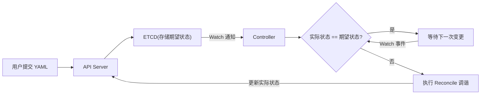

通俗点说，kubernetes的本质是一个数据库，那么相关分类如下：

- 数据模型：Kubernetes 的各种 API 对象与 CRD 机制
- 数据拦截校验和修改机制：Kubernetes Admission Hook
- 数据驱动机制：Kubernetes Controller/Operator
- 数据监听变更与索引机制：Informer 机制

####  k8s的组件

| 组件 | 作用 | 归属 |
| :-----| :---- | :---- |
| kubectl | 命令行工具，用户与 k8s 集群交互的入口，通过 RESTful API 向 apiserver 发送请求 | 客户端工具 |
| kubelet | 节点代理，负责 Pod 生命周期管理（创建/更新/销毁容器），上报节点状态给 apiserver | Node 组件 |
| cri-shim | CRI（Container Runtime Interface）的垫片层，将 kubelet 的 CRI 请求转发给具体的容器运行时（如 containerd、CRI-O） | Node 组件 |
| csi | CSI（Container Storage Interface）插件，提供标准化的存储卷挂载/卸载/扩容接口，解耦存储供应商与 k8s 核心代码 | Node 组件（存储） |
| cni plugin | CNI（Container Network Interface）插件，负责为 Pod 配置网络（分配IP、设置路由规则），实现 Pod 间跨节点通信 | Node 组件（网络） |

####  k8s核心组件的实现思路
在k8s中，与apiserver 通信的Controller/Scheduler 的业务逻辑可以抽象为如下模型，如图所示：

- 若组件需要与apiserver 交互（通信），k8s抽象了通用Informer 框架（**实现在 apiserver 的 访问包client-go**）负责apiserver 数据的本地cache及监听。Informer 还会比对资源是否变更（依靠内部的Delta FIFO Queue），只有变更的资源才会触发handler
- 组件都采用control loop 逻辑
- 组件内部维护一个 queue队列，通过注册Informer事件函数保持queue数据的更新，作用相当于队列的生产者，而control loop 作为队列的消费者
- 通过 Informer 提供过的 Lister 拥有遍历数据的能力，将操作结果重新通过kubeclient 写入到apiserver


####  编排系统的设计

1、资源模型的抽象

- 有哪些种类的资源，如CPU、内存等
- 如何用数据结构表示这些资源

2、资源的调度设计

- 如何描述一个 workload 的资源申请（spec），如该容器需要 `4` 核和 `12GB~16GB` 内存
- 如何描述一台 node 当前的资源分配状态，例如已分配/未分配资源量，是否支持超分等

3、调度算法设计：如何根据 workload spec 为它挑选最合适的 node

4、资源的限额（capacity enforcement）

- 如何确保 workload 使用的资源量不超出预设范围（从而不会影响其他 workload）
- 如何确保 workload 和系统/基础服务的限额，使二者互不影响

####	容器生态系统

1.	Docker，Kubernetes 等工具来运行一个容器时会调用容器运行时（CRI）比如 containerd，CRI-O
2.	通过容器运行时来完成容器的创建、运行、销毁等实际工作
	-	Docker 使用的是 containerd 作为其运行时；Kubernetes 支持 containerd，CRI-O 等多种容器运行时
	-	这些容器运行时都遵循了 OCI 规范，并通过 runc 来实现与操作系统内核交互来完成容器的创建和运行

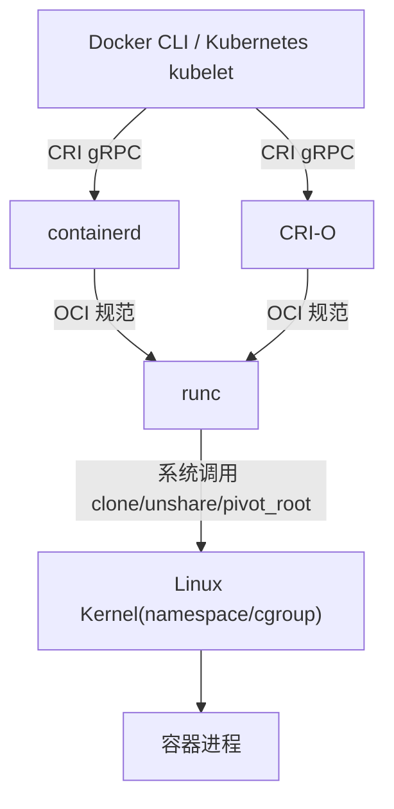


##  0x02  review：基础概念

####  pod

Pod 是 Kubernetes 中最小的可调度单元，它并不是一个容器，而是一组共享网络和存储的容器的逻辑集合。同一 Pod 中的容器共享 Network Namespace（相同 IP）、IPC Namespace、以及通过 Volume 共享存储。Pod 的设计理念来源于"进程组"：多个紧密协作的进程应该被部署在同一个环境中

Pod 的核心字段包括：

- `spec.containers`：定义 Pod 中运行的容器列表（至少一个）
- `spec.initContainers`：初始化容器，在主容器启动前按顺序执行，全部成功后主容器才会启动
- `spec.volumes`：定义 Pod 级别的存储卷
- `spec.nodeSelector` / `spec.affinity`：调度约束
- `spec.restartPolicy`：重启策略（Always/OnFailure/Never）
- `spec.serviceAccountName`：Pod 使用的 ServiceAccount

Pod 的生命周期状态（Phase）：

| Phase | 说明 |
| :-----| :---- |
| Pending | Pod 已被创建，但有一个或多个容器尚未就绪（如调度中、拉取镜像中） |
| Running | Pod 已绑定到节点，所有容器已被创建，至少有一个容器正在运行 |
| Succeeded | Pod 中所有容器都已成功终止，且不会再重启 |
| Failed | Pod 中所有容器已终止，且至少有一个容器是以非零状态退出 |
| Unknown | 无法获取 Pod 状态，通常是与 Node 通信失败 |

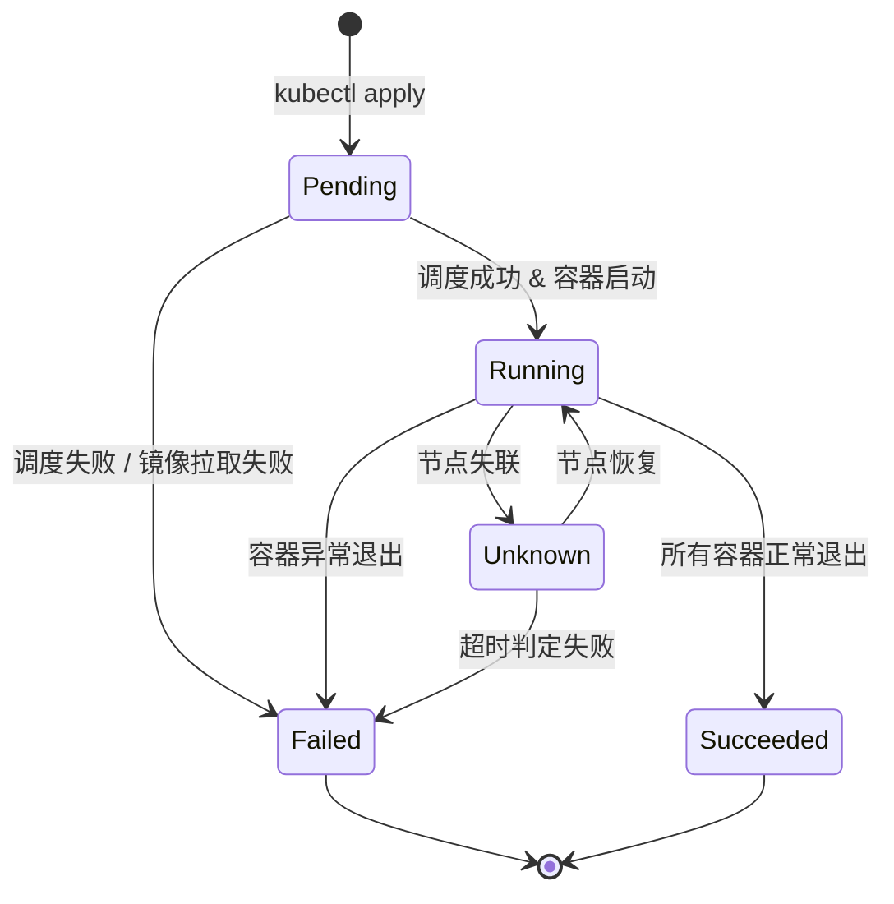

Pod 中的多容器设计模式：

- **Sidecar 模式**：辅助容器与主容器共同工作，如日志收集（Filebeat）、服务网格代理（Envoy/Istio）
- **Init Container 模式**：在主容器启动前执行初始化任务，如等待依赖服务就绪、数据库 migration、配置文件渲染等，Init Container 按顺序逐个执行
- **Ambassador 模式**：代理容器作为 Pod 与外部服务通信的代理，如数据库连接代理
- **Adapter 模式**：适配容器对主容器的输出进行标准化转换，如日志格式统一

Pod 的重要 Condition：

- `PodScheduled`：Pod 已被调度到某个节点
- `Initialized`：所有 Init Container 已成功完成
- `ContainersReady`：Pod 中所有容器已就绪
- `Ready`：Pod 可以对外提供服务（被加入 Service 的 Endpoints）

Pod 的资源管理（QoS 等级）：

| QoS 等级 | 条件 | 优先级 |
| :-----| :---- | :---- |
| Guaranteed | 所有容器都设置了 requests 和 limits，且 requests == limits | 最高，最后被驱逐 |
| Burstable | 至少一个容器设置了 requests 或 limits，但不满足 Guaranteed 条件 | 中等 |
| BestEffort | 没有任何容器设置 requests 和 limits | 最低，最先被驱逐 |

####  pod 控制器

Pod 控制器（Workload Controller）负责管理 Pod 的生命周期，确保 Pod 的实际状态与声明的期望状态一致。不同类型的控制器适用于不同的工作负载场景：

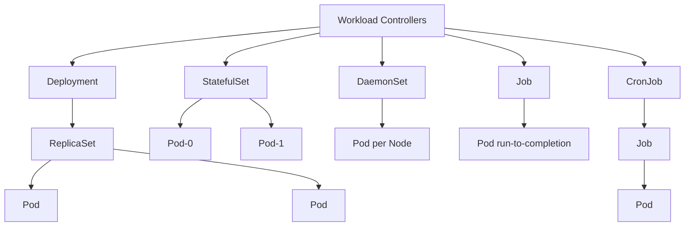

**Deployment**：最常用的无状态应用控制器，通过管理 ReplicaSet 来间接管理 Pod。核心能力：
- 声明式更新：修改 Pod 模板后自动触发滚动更新（Rolling Update）
- 回滚：通过 `kubectl rollout undo` 回退到历史版本（Deployment 保留 ReplicaSet 历史）
- 扩缩容：修改 `replicas` 字段即可水平扩缩
- 暂停/恢复：支持暂停更新过程，进行多次修改后一次性发布
- 更新策略：`RollingUpdate`（默认，可配置 `maxSurge`/`maxUnavailable`）和 `Recreate`（先删后建）

**ReplicaSet**：确保指定数量的 Pod 副本始终运行。一般不直接使用，而是由 Deployment 管理。ReplicaSet 通过 `selector` 匹配 Pod，通过 `ownerReferences` 标记归属关系

**StatefulSet**：有状态应用控制器，提供以下保证：
- 稳定的持久化存储：每个 Pod 绑定独立的 PVC，Pod 重建后仍挂载同一 PVC
- 稳定的网络标识：Pod 名称固定为 `{statefulset}-{ordinal}`（如 `mysql-0`、`mysql-1`），配合 Headless Service 提供稳定 DNS 名
- 有序部署与扩缩：Pod 按序号顺序创建（`0` -> `1` -> `2`），逆序删除
- 有序滚动更新：按逆序逐个更新 Pod
- 典型场景：MySQL 主从、Redis Cluster、ZooKeeper、Kafka 等

**DaemonSet**：确保所有（或特定）节点上都运行一个 Pod 副本。典型场景：
- 节点日志收集：Fluentd、Filebeat
- 节点监控：Prometheus Node Exporter
- 网络插件：Calico、Cilium 的 Agent
- 存储插件：CSI Node Driver

**Job**：一次性任务，创建 Pod 执行任务直到成功完成。核心字段：
- `completions`：需要成功完成的 Pod 数
- `parallelism`：并行运行的 Pod 数
- `backoffLimit`：失败重试次数
- `activeDeadlineSeconds`：超时时间

**CronJob**：基于 Cron 表达式的定时任务，按调度计划周期性创建 Job。支持 `concurrencyPolicy`（Allow/Forbid/Replace）控制并发策略

####  service

Service 是 Kubernetes 中用于将一组 Pod 暴露为网络服务的抽象。由于 Pod 的 IP 是不稳定的（重建后会变），Service 提供了一个稳定的访问入口（ClusterIP + DNS 名），并通过 Label Selector 自动发现后端 Pod，实现负载均衡

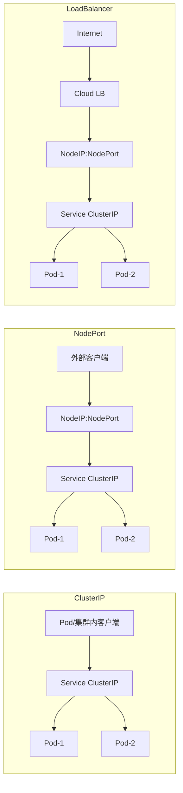

Service 的核心工作原理：Service 通过 `spec.selector` 匹配 Pod 的 Label，自动维护一个 Endpoints 对象（包含所有匹配 Pod 的 IP:Port 列表）。kube-proxy 监听 Service 和 Endpoints 的变化，在每个节点上生成相应的 iptables/IPVS 规则来实现流量转发

1、ClusterIP（默认类型）

ClusterIP 是最基础的 Service 类型，k8s 为 Service 分配一个集群内部虚拟 IP（ClusterIP），仅在集群内部可访问。集群内的 Pod 可以通过 `<service-name>.<namespace>.svc.cluster.local` 的 DNS 名或直接通过 ClusterIP 访问该 Service

特殊变体 **Headless Service**（`clusterIP: None`）：不分配 ClusterIP，DNS 查询直接返回后端 Pod 的 IP 列表，常配合 StatefulSet 使用，使客户端可以直接连接到特定的 Pod

```YAML
apiVersion: v1
kind: Service
metadata:
  name: my-service
spec:
  type: ClusterIP
  selector:
    app: my-app
  ports:
  - port: 80          # Service 对外暴露的端口
    targetPort: 8080   # Pod 容器实际监听的端口
```

2、NodePort

NodePort 在 ClusterIP 的基础上，在每个节点上开放一个静态端口（范围 `30000~32767`），外部流量可以通过 `<NodeIP>:<NodePort>` 访问到 Service。kube-proxy 会在每个节点上创建相应的 iptables/IPVS 规则，将 NodePort 的流量转发到后端 Pod


3、LoadBalancer

LoadBalancer 在 NodePort 的基础上，由云厂商提供一个外部负载均衡器（如 AWS ELB、阿里云 SLB），将外部流量分发到各节点的 NodePort 上。这是将 Service 暴露到公网的标准方式，需要云环境支持


4、ExternalName

ExternalName 类型不会创建 ClusterIP，而是通过 CNAME DNS 记录将 Service 名映射到外部域名（如 `my.database.example.com`），用于在集群内以统一的 Service 名访问集群外的服务

####  volume

Volume 解决了容器中文件系统的两个问题：一是容器崩溃重启后文件丢失；二是同一 Pod 中多个容器需要共享文件。Kubernetes 的 Volume 有明确的生命周期，与使用它的 Pod 相同（或独立于 Pod）

常见的 Volume 类型：

| 类型 | 说明 | 生命周期 |
| :-----| :---- | :---- |
| emptyDir | Pod 分配到节点时创建的空目录，Pod 删除后随之删除。同一 Pod 内多容器共享数据的常用方式 | 与 Pod 相同 |
| hostPath | 将节点文件系统的文件或目录挂载到 Pod 中。适用于需要访问节点级数据的场景（如 Docker socket、日志目录），但有安全风险 | 独立于 Pod |
| configMap / secret | 将 ConfigMap 或 Secret 数据以文件形式挂载到容器中，常用于配置注入 | 与 Pod 相同 |
| downwardAPI | 将 Pod 的元数据（如标签、注解、资源限制）以文件形式暴露给容器 | 与 Pod 相同 |
| projected | 将多种 Volume 源（Secret、ConfigMap、DownwardAPI、ServiceAccountToken）合并到同一目录 | 与 Pod 相同 |

持久化存储（PV/PVC 体系）：

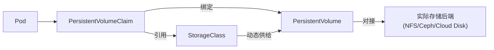

- **PersistentVolume（PV）**：集群级别的存储资源，由管理员预先创建（静态供给）或由 StorageClass 动态创建。PV 有独立于 Pod 的生命周期
- **PersistentVolumeClaim（PVC）**：用户对存储资源的请求声明，指定所需容量和访问模式。k8s 自动将 PVC 绑定到满足条件的 PV
- **StorageClass**：定义存储类型和供给策略，支持动态供给（Dynamic Provisioning）——用户创建 PVC 时自动创建对应的 PV，无需管理员手动操作
- 访问模式：`ReadWriteOnce`（单节点读写）、`ReadOnlyMany`（多节点只读）、`ReadWriteMany`（多节点读写）
- 回收策略：`Retain`（保留数据需手动清理）、`Delete`（删除 PVC 时自动删除 PV 和存储）、`Recycle`（已废弃）

####  basic flow
通过kubectl创建创建pod时，大概流程如下：


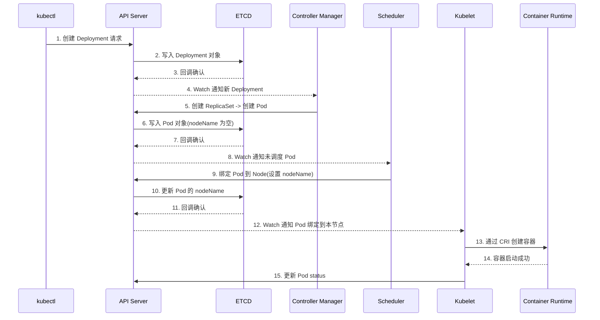

1.  apiserver接收kubectl的创建资源的请求
2.  apiserver将创建请求写入ETCD
3.  apiserver接收到etcd的回调事件
4.  apiserver将回调事件发送给ControllerManager（实际上是watch-notify机制）
5.  controllerManager中的ReplicationController处理本次请求，创建RS，然后它会调控RS中的Pod的副本数量处于期望值，比期望值小就新创建Pod，于是它告诉apiserver要创建pod
6.  apiserver将创建pod的请求写入etcd集群
7.  apiserver接收etcd的创建pod的回调事件
8.  apiserver将创建pod的回调事件发送给scheduler模块，由它为pod挑选一个合适的宿主node
9.  scheduler告诉apiserver，这个pod可以调度到哪个node上
10. apiserver将scheduler通知的事件写入etcd
11. apiserver接收到etcd的回调，将更新pod的事件发送给对应node上的kubelet进程（同样也是watch机制）
12. kubelet通过CRI接口同容器运行时（Docker）交互，维护更新对应的容器

####  k8s组件的若干细节

1、控制平面（集群）

**kube-apiserver**：k8s入口（其它控制面组件都没有被设计为可暴露远程服务）。此外，apiserver 与各其他组件通信时都需要提供/验证相应的证书（客户端/服务端），apiserver的核心功能分为网关功能（认证、鉴权、消息转发）以及封装了对ETCD的大部分CRUD、List-watch操作等等，用于提供k8s的资源注册与发现功能。以CRD为例，创建 CRD 是自定义资源的注册过程，而ControllerManager 是收到对资源事件从而作出响应的处理

**kube-scheduler**：集群默认调度器，调度器通过 kubernetes 的监测（etcd Watch）机制来发现集群中新创建且尚未被调度到 Node 上的 Pod。调度器会保证节点上有足够的资源供其上的所有 Pod 使用

- scheduler会检查节点上所有容器的请求的总和不会超过节点的容量
- scheduler先在集群中找到一个 Pod 的所有可调度节点，然后根据一系列函数对这些可调度节点打分， 选出其中得分最高的 Node 来运行 Pod，然后scheduler将这个调度决定通知给 kube-apiserver
- scheduler在做调度决定时需要考虑的因素包括单独和整体的资源请求（request）、硬件/软件/策略限制（limit）、亲和/反亲和等

kube-scheduler 给一个 pod 做调度选择包含如下两步：

1.  过滤阶段：会将所有满足 Pod 调度需求的 Node 选出来，通常情况下，这个 Node 列表包含不止一个 Node。如果这个列表是空的，代表这个 Pod 不可调度
2.  打分阶段：调度器会为 Pod 从所有可调度节点中选取一个最合适的 Node。根据当前启用的打分规则，调度器会给每一个可调度节点进行打分

**kube-controller-manager**：自带的控制器包括 Replicaset Controller、Node Controller、Namespace Controller 和 ServiceAccount Controller等

2、Node节点（集群）

**kubelet**：对Node的大部分操作都归属kubelet管理，分三类说明如下：

- 针对 Pod 管理：最主要的功能是保证 Pod 能健康地运行。某些情况下，当节点不可达时，apiserver 无法与 kubelet 通信，删除 Pod 的决定不能传达给 kubelet 直到连接恢复，期间被计划删除的 Pod 可能继续在游离节点上运行。其他重要功能包括：
    1. 如果 Deployment 对容器定义了资源限制（Limit），kubelet 会为对应 Pod 的 cgroup 设定上限（CPU 的 `cpu.cfs_quota_us` 以及内存的 `memory.limit_in_bytes`）
    2. kubelet 会为每个 Pod 生成 `/etc/resolv.conf` 文件用于 DNS 查询，以及单独挂载 `/etc/hosts`
    3. kubelet 根据容器配置的镜像拉取策略拉取镜像（如 `IfNotPresent` 策略会在镜像已存在时跳过拉取），镜像与容器的垃圾回收也由 kubelet 完成
    4. 容器生命周期回调中，`exec` 在容器内执行，而 `httpGet` 和 `tcpSocket` 由 kubelet 进程执行

- 针对 Node 的功能：kubelet 监控节点的 CPU、内存、磁盘空间和文件系统 inode 等资源，当资源达到特定消耗水平时，kubelet 可以主动驱逐 Pod 以回收资源防止饥饿。kubelet 还负责创建和更新节点的 `.status`，以及更新对应的 Lease 对象

- 针对 apiserver 的功能：从 apiserver 到 kubelet 的连接用于：
    - 获取 Pod 日志
    - 挂接到运行中的 Pod（`kubectl exec`）
    - 提供端口转发功能（`kubectl port-forward`）


**kube-proxy**：是每个 Node 上运行的网络代理，反映了每个 Node 上 Kubernetes API 中定义的服务（Service），并且支持流量转发（通过 `iptables` 实现）功能，包括 userspace 代理模式、iptables 规则代理模式以及 IPVS 代理模式

kube-proxy 与 CNI 的关系：kube-proxy 主要解决 Service 流量转发到 Pod 的问题；而 CNI 主要实现 overlay network 网络模型，解决的是集群容器互通的问题。所谓 overlay network，是在已有的宿主机网络上，通过软件构建一个覆盖在所有集群节点之上的、可以把所有容器连通在一起的虚拟网络，使得集群里所有容器能够互通（比如 Pod A/B 在不同的节点上，可以相互 ping 通）

**容器运行时（Container Runtime）**：集群中每个节点上都需要有一个正常工作的容器运行时，这样 kubelet 才能启动容器及其 Pod。容器运行时接口（CRI）是 kubelet 和容器运行时之间通信的主要协议（gRPC）。目前主要的运行时包括：containerd、CRI-O 等（Docker 在 1.24 版本后已被弃用为直接运行时，但 Docker 构建的镜像仍可使用）

3、组件汇总

控制平面（Master）包含的组件：

- apiserver：核心枢纽，是流量进出口，外界只能通过它才能与 k8s 交互
- kube-scheduler：决定 Pod 调度到哪个节点上，调度之后不再管理（需要 descheduler 做二次调度）
- etcd：存储组件
- controller-manager：k8s 自带的所有资源 controller 集合

节点（Node）包含的组件：

- kubelet：负责节点上容器相关动作的管理
- kube-proxy：负责将节点上的流量转发到容器中

####  kubeproxy-iptables模式的转发分析

NodePort 模式下，外部请求经过 iptables 链路的流转过程如下：

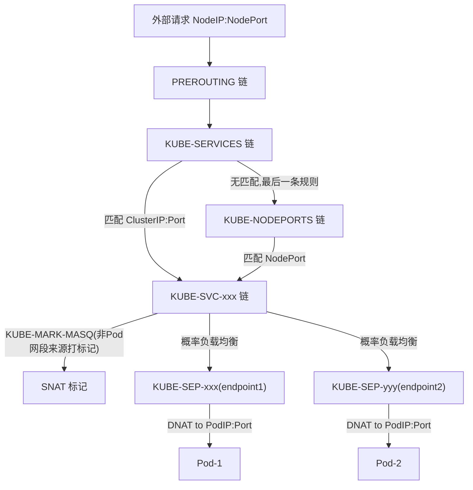

以笔者本机搭建的minikube为例，有如下服务`crd-array-watcher`，类型为NodePort，那么从CVM上访问`telnet $(minikube ip) 32198`服务的路径如下：

```BASH
[root@VM-X-X-tencentos ~]# kubectl get svc -A
NAMESPACE     NAME                                   TYPE        CLUSTER-IP       EXTERNAL-IP   PORT(S)                  AGE
default       crd-array-watcher                      NodePort    10.100.116.139   <none>        8080:32198/TCP           5d18h
```

在minikube的Node节点上：

```BASH
# minikube ssh

root@minikube:~# iptables -t nat -L -v -n --line-numbers
Chain PREROUTING (policy ACCEPT 55 packets, 3300 bytes)
num   pkts bytes target     prot opt in     out     source               destination         
1     1297 82043 KUBE-SERVICES  all  --  *      *       0.0.0.0/0            0.0.0.0/0            /* kubernetes service portals */
2       65  3953 DOCKER_OUTPUT  all  --  *      *       0.0.0.0/0            192.168.49.1        
3      876 52560 DOCKER     all  --  *      *       0.0.0.0/0            0.0.0.0/0            ADDRTYPE match dst-type LOCAL

......

Chain OUTPUT (policy ACCEPT 7175 packets, 431K bytes)
num   pkts bytes target     prot opt in     out     source               destination         
1    2273K  136M KUBE-SERVICES  all  --  *      *       0.0.0.0/0            0.0.0.0/0            /* kubernetes service portals */
2      241 20129 DOCKER_OUTPUT  all  --  *      *       0.0.0.0/0            192.168.49.1        
3     662K   40M DOCKER     all  --  *      *       0.0.0.0/0           !127.0.0.0/8          ADDRTYPE match dst-type LOCAL

......

Chain KUBE-SERVICES (2 references)
num   pkts bytes target     prot opt in     out     source               destination         
1        0     0 KUBE-SVC-5WLEADX2DETM25TL  tcp  --  *      *       0.0.0.0/0            10.97.142.21         /* kubearmor/kubearmor-controller-webhook-service cluster IP */ tcp dpt:443
2       36  2682 KUBE-SVC-TCOU7JCQXEZGVUNU  udp  --  *      *       0.0.0.0/0            10.96.0.10           /* kube-system/kube-dns:dns cluster IP */ udp dpt:53
3        0     0 KUBE-SVC-JD5MR3NA4I4DYORP  tcp  --  *      *       0.0.0.0/0            10.96.0.10           /* kube-system/kube-dns:metrics cluster IP */ tcp dpt:9153
......
8        0     0 KUBE-SVC-HW2XM7FRY33HEVYM  tcp  --  *      *       0.0.0.0/0            10.100.116.139       /* default/crd-array-watcher cluster IP */ tcp dpt:8080
9        0     0 KUBE-SVC-GCRHHKL6ZB4XAFBC  tcp  --  *      *       0.0.0.0/0            10.103.198.138       /* default/crd-array-watchers cluster IP */ tcp dpt:8080
10    6552  393K KUBE-NODEPORTS  all  --  *      *       0.0.0.0/0            0.0.0.0/0            /* kubernetes service nodeports; NOTE: this must be the last rule in this chain */ ADDRTYPE match dst-type LOCAL

......

Chain KUBE-SVC-HW2XM7FRY33HEVYM (2 references)
num   pkts bytes target     prot opt in     out     source               destination         
1        2   120 KUBE-MARK-MASQ  tcp  --  *      *      !10.244.0.0/16        10.100.116.139       /* default/crd-array-watcher cluster IP */ tcp dpt:8080
2        4   240 KUBE-SEP-PLQTWCYKKRRVAV4U  all  --  *      *       0.0.0.0/0            0.0.0.0/0            /* default/crd-array-watcher -> 10.244.0.35:8080 */

......
```


```BASH
root@minikube:~# iptables -t nat -L KUBE-SVC-HW2XM7FRY33HEVYM -v -n --line-numbers
Chain KUBE-SVC-HW2XM7FRY33HEVYM (2 references)
num   pkts bytes target     prot opt in     out     source               destination         
1        2   120 KUBE-MARK-MASQ  tcp  --  *      *      !10.244.0.0/16        10.100.116.139       /* default/crd-array-watcher cluster IP */ tcp dpt:8080
2        4   240 KUBE-SEP-PLQTWCYKKRRVAV4U  all  --  *      *       0.0.0.0/0            0.0.0.0/0            /* default/crd-array-watcher -> 10.244.0.35:8080 */

root@minikube:~# iptables -t nat -L KUBE-SEP-PLQTWCYKKRRVAV4U -v -n --line-numbers
Chain KUBE-SEP-PLQTWCYKKRRVAV4U (1 references)
num   pkts bytes target     prot opt in     out     source               destination         
1        0     0 KUBE-MARK-MASQ  all  --  *      *       10.244.0.35          0.0.0.0/0            /* default/crd-array-watcher */
2        4   240 DNAT       tcp  --  *      *       0.0.0.0/0            0.0.0.0/0            /* default/crd-array-watcher */ tcp to:10.244.0.35:8080
```

##	0x03	API && CRD

####	K8S 的 API 类型
在kubernetes中可以通过 GET/LIST/PUT/POST/DELETE 等 API 操作，来创建、查询、修改或删除集群中的资源，相应的各 kube-controller 监听到资源变化时，就会执行相应的 reconcile 逻辑，来使 status 与 spec 描述相符，API的类型：

-	标准 API（针对内置资源类型）：Namespaced 类型，可以用 namespace 来隔离（如namespaces、pods、services等），格式为`/api/{version}/namespaces/{namespace}/{resource}`（如`/api/v1/namespaces/default/pods`）；Un-namespaced 类型为全局的，不能用 namespace 隔离（如nodes、clusterroles等），格式为`/api/{version}/{resource}`（如`/api/v1/nodes`）
-	扩展 API（apiextension）：常见Namespaced 类型，格式为`/apis/{apiGroup}/{apiVersion}/namespaces/{namespace}/{resource}`（如`/apis/cilium.io/v2/namespaces/kube-system/ciliumnetworkpolicies`）

####	CRD
CRD是扩展 API 的（最主要）声明和使用方式

-	CRD：用来声明用户的自定义资源，例如它是 namespace-scope 还是 cluster-scope 的资源、有哪些字段等等，K8s 会自动根据这个定义生成相应的 API
-	CRD 是资源类型定义，具体的资源叫 CR
-	Operator 框架：本质功能是时刻盯着资源状态，一有变化马上作出反应（即 reconcile 过程）

####	怎么理解CRD？
K8s 是个数据库，CRD 是一张表，API 是 SQL

1、K8s：数据库，存储引擎为etcd，以及构建在存储引擎之上的一套 API 和语义，允许用户创建、读取、更新和删除数据库中的数据

| 关系型数据库 | Kubernetes | 说明 |
| :-----| :---- | :---- |
| DATABASE | cluster | 一套 K8s 集群（或者namespace）就是一个 database |
| TABLE | Kind | 每种资源类型对应一个表，分为内置类型和扩展类型 |
| COLUMN | property | 表里面的列，可以是 string、boolean 等类型 |
| rows | resources | 表中的一个具体 record |

-	内置 Kind：Job、Service、Deployment、Event、NetworkPolicy、Secret、ConfigMap 等等
-	扩展 Kind：各种 CRD，例如 CiliumNetworkPolicy

2、CRD 是一张表，CRD 和内置的 Pod、Service、NetworkPolicy 一样，也是数据库的一张表，参考如下的示例 fruit CRD，有 `name/sweet/weight/comment` 列，以及 `apple/banana` 等 entry。所以CRD允许用户创建自己的表，设置自己的列，声明 CRD 就会自动创建 API


```YAML
#cat fruit.yaml 
apiVersion: apiextensions.k8s.io/v1
kind: CustomResourceDefinition
metadata:
  name: fruits.example.org        # CRD 名字
spec:
  conversion:
    strategy: None
  group: example.org              # REST API: /apis/<group>/<version>
  names:
    kind: Fruit
    listKind: FruitList
    plural: fruits
    singular: fruit
  scope: Namespaced               # Fruit 资源是区分 namespace 的
  versions:
  - name: v1                      # REST API: /apis/<group>/<version>
    schema:
      openAPIV3Schema:
        properties:
          spec:
            properties:
              comment:            # 字段 1，表示备注
                type: string
              sweet:              # 字段 2，表示甜否
                type: boolean
              weight:             # 字段 3，表示重量
                type: integer
            type: object
        type: object
    served: true                  # 启用这个版本的 API（v1）
    storage: true
    additionalPrinterColumns:     # 可选项，配置了这些 printer columns 之后，
    - jsonPath: .spec.sweet       # 命令行 k get <crd> <cr> 时，能够打印出下面这些字段，
      name: sweet                 # 否则，k8s 默认只打印 CRD 的 NAME 和 AGE
      type: boolean
    - jsonPath: .spec.weight
      name: weight
      type: integer
    - jsonPath: .spec.comment
      name: comment
      type: string

#apple-cr.yaml
apiVersion: example.org/v1
kind: Fruit
metadata:
  name: apple
spec:
  sweet: false
  weight: 100
  comment: little bit rotten

#cat banana-cr.yaml 
apiVersion: example.org/v1
kind: Fruit
metadata:
  name: banana
spec:
  sweet: true
  weight: 80
  comment: just bought
```

3、定义表结构（CRD spec），CRD（CR）描述格式可以是 YAML 或 JSON。CRD 的内容可以简单分为三部分：

常规 k8s metadata：每种 K8s 资源都需要声明的字段，包括 `apiVersion/kind/metadata.name` 等

```YAML
apiVersion: apiextensions.k8s.io/v1
kind: CustomResourceDefinition
metadata:
  name: fruits.example.org        # CRD 名字
......
```

Table-level 信息：例如表的名字，最好用小写，方便以后命令行操作

```YAML
......
spec:
  conversion:
	strategy: None
  group: example.org              # REST API: /apis/<group>/<version>
  names:
	kind: Fruit
	listKind: FruitList
	plural: fruits
	singular: fruit
  scope: Namespaced               # Fruit 资源是区分 namespace 的
......
```

Column-level 信息：列名及类型等等，遵循 OpenAPISpecification v3 规范

```YAML
......
  versions:
  - name: v1                      # REST API: /apis/<group>/<version>
    schema:
      openAPIV3Schema:
        properties:
          spec:
            properties:
              comment:            # 字段 1，表示备注
                type: string
              sweet:              # 字段 2，表示甜否
                type: boolean
              weight:             # 字段 3，表示重量
                type: integer
            type: object
        type: object
    served: true                  # 启用这个版本的 API（v1）
    storage: true
    additionalPrinterColumns:     # 可选项，配置了这些 printer columns 之后，
    - jsonPath: .spec.sweet       # 命令行 k get <crd> <cr> 时，能够打印出下面这些字段，
      name: sweet                 # 否则，k8s 默认只打印 CRD 的 NAME 和 AGE
      type: boolean
    - jsonPath: .spec.weight
      name: weight
      type: integer
    - jsonPath: .spec.comment
      name: comment
      type: string
```


4、关于CRD的常用操作

```BASH
#创建 CRD：这一步相当于 `CREATE TABLE fruits ...;`
[root@VM-X-X-tencentos crd1]# kubectl apply -f fruit.yaml 
customresourcedefinition.apiextensions.k8s.io/fruits.example.org created

#创建 CR：相当于 INSERT INTO fruits values(...);
kubectl create -f apple-cr.yaml
fruit.example.org/apple created
kubectl create -f banana-cr.yaml
fruit.example.org/banana created

#查询 CR：相当于 SELECT * FROM fruits ... ; 或 SELECT * FROM fruits WHERE name='apple';
[root@VM-X-X-tencentos crd1]# kubectl get fruits
NAME     SWEET   WEIGHT   COMMENT
apple    false   100      little bit rotten
banana   true    80       just bought

[root@VM-X-X-tencentos crd1]# kubectl get fruits apple
NAME    SWEET   WEIGHT   COMMENT
apple   false   100      little bit rotten

# 删除 CR：相当于 DELETE FROM fruits WHERE name='apple';
[root@VM-X-X-tencentos crd1]# kubectl delete fruit apple
fruit.example.org "apple" deleted

# 查看文档
kubectl explain fruits

# 标签操作
# 和内置资源类型一样，K8s 支持对 CR 打标签，然后根据标签做过滤：

# 查看所有 frutis
$ kubectl get fruits
NAME     SWEET   WEIGHT   COMMENT
apple    false   100      little bit rotten
banana   true    80       just bought

# 给 banana 打上一个特殊新标签
$ kubectl label fruits banana tastes-good=true
fruit.example.org/banana labeled

# 按标签筛选 CR
$ kubectl get fruits -l tastes-good=true
NAME     SWEET   WEIGHT   COMMENT
banana   true    80       just bought

# 删除 label
$ kubectl label fruits banana tastes-good-
fruit.example.org/banana labeled
```

5、API 是 SQL

前文说过，通过 kubectl 命令行来执行 CR 的增删查改，它其实只是一个外壳，内部调用的是 Kubernetes 为这个 CRD 自动生成的 API，如下：

```JSON
kubectl create -v 10 -f apple-cr.yaml
......
I0926 10:50:58.158636 3310786 helper.go:246] "Request Body" body=<
        {"apiVersion":"example.org/v1","kind":"Fruit","metadata":{"name":"banana","namespace":"default"},"spec":{"comment":"just bought","sweet":true,"weight":80}}
 >
I0926 10:50:58.158696 3310786 round_trippers.go:527] "Request" curlCommand=<
        curl -v -XPOST  -H "Accept: application/json" -H "Content-Type: application/json" -H "User-Agent: kubectl/v1.33.1 (linux/amd64) kubernetes/8adc0f0" 'https://192.168.49.2:8443/apis/example.org/v1/namespaces/default/fruits?fieldManager=kubectl-create&fieldValidation=Strict'
 >
I0926 10:50:58.162442 3310786 round_trippers.go:632] "Response" verb="POST" url="https://192.168.49.2:8443/apis/example.org/v1/namespaces/default/fruits?fieldManager=kubectl-create&fieldValidation=Strict" status="201 Created" headers=<
        Audit-Id: 5ad37351-24b3-4014-9050-238ed4f34b4e
        Cache-Control: no-cache, private
        Content-Length: 511
        Content-Type: application/json
        Date: Fri, 26 Sep 2025 02:50:58 GMT
        X-Kubernetes-Pf-Flowschema-Uid: fc02528a-ec6f-4720-b6b4-4bb1129cd230
        X-Kubernetes-Pf-Prioritylevel-Uid: ae8d9360-7b04-4f51-8428-ced0722e032e
 > milliseconds=3 getConnectionMilliseconds=0 serverProcessingMilliseconds=3
I0926 10:50:58.162513 3310786 helper.go:246] "Response Body" body=<
        {"apiVersion":"example.org/v1","kind":"Fruit","metadata":{"creationTimestamp":"2025-09-26T02:50:58Z","generation":1,"managedFields":[{"apiVersion":"example.org/v1","fieldsType":"FieldsV1","fieldsV1":{"f:spec":{".":{},"f:comment":{},"f:sweet":{},"f:weight":{}}},"manager":"kubectl-create","operation":"Update","time":"2025-09-26T02:50:58Z"}],"name":"banana","namespace":"default","resourceVersion":"537732","uid":"e155e0ba-01d1-4b4e-86dc-dfbbe3568ac3"},"spec":{"comment":"just bought","sweet":true,"weight":80}}
 >
fruit.example.org/banana created
```

####	CRD的适用场景？

CRD 适用于需要扩展 Kubernetes API、利用 Kubernetes 生态能力（声明式管理、RBAC、Informer 等）来管理自定义资源的场景：

| 场景 | 说明 | 典型案例 |
| :-----| :---- | :---- |
| 平台抽象 | 将复杂的底层资源组合封装为更高层的抽象概念 | Istio 的 VirtualService/DestinationRule、Crossplane 的云资源抽象 |
| 应用生命周期管理 | 通过 Operator 模式管理有状态应用的部署、扩缩容、备份恢复等 | MySQL Operator、Redis Operator、Prometheus Operator |
| 策略与配置管理 | 定义集群级别的策略规则 | Cilium NetworkPolicy、Cert-Manager 的 Certificate/Issuer |
| 多租户与权限管理 | 定义租户、配额等多租户相关资源 | Capsule 的 Tenant、HNC 的 SubnamespaceAnchor |
| CI/CD 流水线 | 定义构建和部署流水线的各个阶段 | Tekton 的 Pipeline/Task、ArgoCD 的 Application |

CRD 与其他扩展方式的选择：

- **CRD + Controller/Operator**：适合需要声明式管理、需要利用 k8s 生态能力（RBAC、Informer、kubectl）的场景，开发门槛较低（应用较为广泛）
- **API Aggregation（AA）**：适合需要完全自定义 API 行为（如自定义存储后端、自定义子资源）的高级场景，开发成本较高
- **Admission Webhook**：适合对已有资源做校验（Validating）或修改（Mutating），不需要新增资源类型

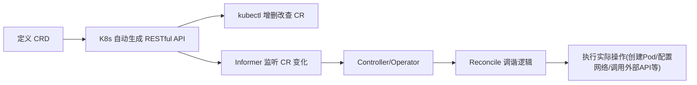

##	0x04	鉴权（RBAC）与认证

Kubernetes API 请求的处理流程经过三道关卡：认证（Authentication）-> 授权（Authorization）-> 准入控制（Admission Control）

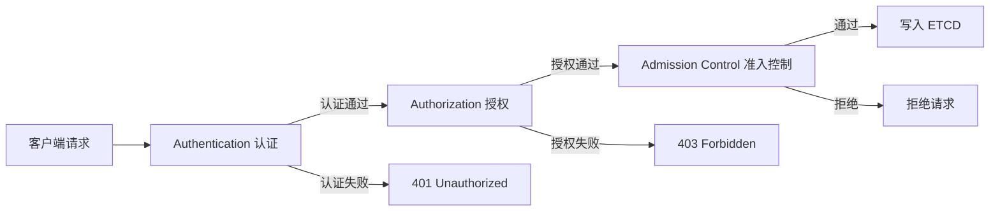

####	authentication（AuthN）

Authentication 解决的是"你是谁"的问题。Kubernetes 支持多种认证方式，apiserver 会依次尝试配置的认证模块，任一模块认证成功即可：

| 认证方式 | 说明 | 适用场景 |
| :-----| :---- | :---- |
| X509 客户端证书 | 通过 TLS 双向认证，证书中的 CN 字段作为用户名，O 字段作为用户组 | 集群组件间通信（kubelet <-> apiserver）、kubectl 配置 |
| ServiceAccount Token | Pod 内自动挂载的 JWT Token（`/var/run/secrets/kubernetes.io/serviceaccount/token`），由 apiserver 签发和验证 | Pod 内访问 apiserver（最常用的程序化认证方式） |
| OIDC Token | 通过外部 OpenID Connect 提供商（如 Dex、Keycloak）签发的 ID Token 进行认证 | 企业统一身份认证、SSO 集成 |
| Webhook Token | 将 Bearer Token 发送到外部 Webhook 服务进行验证 | 自定义认证逻辑、与已有认证系统集成 |
| Bootstrap Token | 用于新节点加入集群时的临时引导认证 | kubeadm 节点加入 |

Kubernetes 中有两类用户身份：
- **User Account**：给人使用（如开发者、运维人员），由外部系统管理（证书、OIDC 等），k8s 本身不存储用户信息
- **Service Account**：给程序使用（如 Pod 中运行的应用），由 k8s 管理，是 namespace 级别的资源

####	Authorization（AuthZ）

Authorization 解决的是"你能做什么"的问题。Kubernetes 支持多种授权模式，按配置顺序依次检查：

| 授权模式 | 说明 |
| :-----| :---- |
| RBAC（Role-Based Access Control） | 基于角色的访问控制，最常用。通过 Role/ClusterRole 定义权限，通过 RoleBinding/ClusterRoleBinding 将权限绑定到用户/组/SA |
| ABAC（Attribute-Based Access Control） | 基于属性的访问控制，通过策略文件定义，修改需重启 apiserver，已较少使用 |
| Node | 专门用于 kubelet 的授权模式，限制 kubelet 只能访问其所在节点上的 Pod、Secret 等资源 |
| Webhook | 将授权决策委托给外部 HTTP 服务 |

RBAC 是 Kubernetes 最主流的授权模型，核心概念：

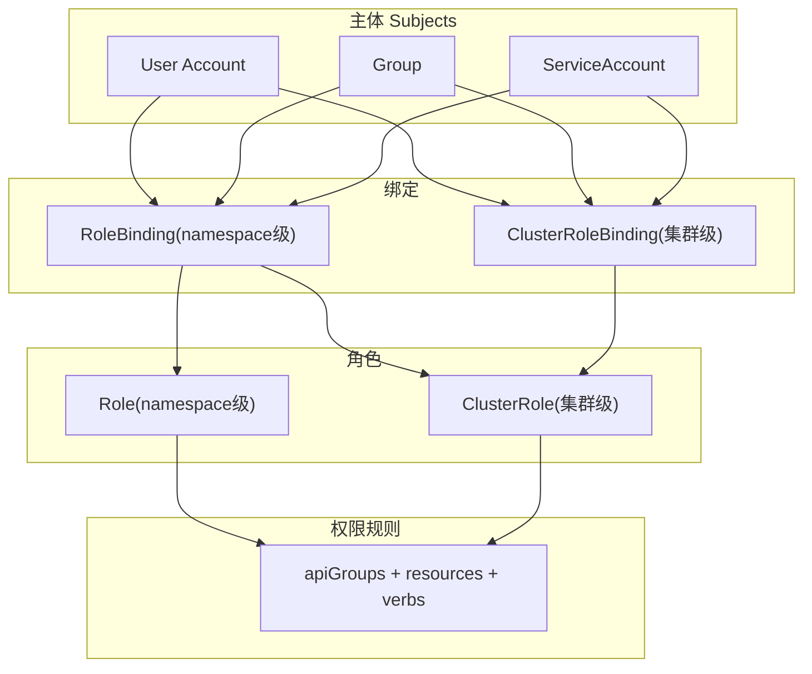

- **Role**：命名空间级别的权限集合，定义对某些资源的操作权限（如 `get`/`list`/`watch`/`create`/`update`/`delete`）
- **ClusterRole**：集群级别的权限集合，可授权集群范围的资源（如 nodes、namespaces）以及非资源端点（如 `/healthz`）
- **RoleBinding**：将 Role 或 ClusterRole 绑定到主体（用户/组/SA），仅在指定 namespace 生效
- **ClusterRoleBinding**：将 ClusterRole 绑定到主体，在整个集群范围生效

####	例1：基于Role的pod watch权限配置

1、创建专属 ServiceAccount（客户端 Pod 使用）

```YAML
apiVersion: v1
kind: ServiceAccount
metadata:
  name: grpc-lb-client-sa  # 服务账户名称
  namespace: client-ns      # 客户端所在命名空间
```

2、定义 Role 授予 Endpoints 权限

```YAML
apiVersion: rbac.authorization.k8s.io/v1
kind: Role
metadata:
  namespace: client-ns      # 必须与客户端命名空间一致
  name: grpc-endpoint-reader
rules:
- apiGroups: [""]           # 核心 API 组（Endpoints 属于 core/v1）
  resources: ["endpoints","pods"]   # 资源类型
  verbs: ["get", "list", "watch"]  # 必须包含 watch 以实现监听
```

3、绑定 Role 到 ServiceAccount

```YAML
apiVersion: rbac.authorization.k8s.io/v1
kind: RoleBinding
metadata:
  name: bind-grpc-endpoint-reader
  namespace: client-ns
subjects:
- kind: ServiceAccount
  name: grpc-lb-client-sa    # 步骤1创建的 SA
  namespace: client-ns
roleRef:
  kind: Role
  name: grpc-endpoint-reader  # 步骤2定义的 Role
  apiGroup: rbac.authorization.k8s.io
```

4、POD配置，在客户端 Deployment 中指定 ServiceAccount

```YAML
apiVersion: apps/v1
kind: Deployment
metadata:
  name: my-nginx-app
  namespace: client-ns
spec:
  replicas: 1  #pod副本数量
  selector:
    matchLabels:
      app: my-nginx-app
  template:
    metadata:
      labels:
        app: my-nginx-app
    spec:
      serviceAccountName: grpc-lb-client-sa  # 关键：绑定专属 SA
      containers:
      - name: nginx
        image: hub.x.com/cls/nginx:base
        ports:
          - containerPort: 80
```

测试，在pod（`my-nginx-app`）中访问监控的url，然后增加`replicas`的值，观察数据输出：


```BASH
# 使用 SA Token 访问 APIServer
TOKEN=$(cat /var/run/secrets/kubernetes.io/serviceaccount/token)
curl -k -H "Authorization: Bearer $TOKEN" \
  https://kubernetes.default.svc/api/v1/namespaces/client-ns/pods?watch=true
```

输出如下，这里的`type`包括如下类型：

| 类型 | 作用 | 
| :-----| :---- |
| ADDED | 表示一个新对象被创建并添加到资源列表中 |  
| MODIFIED |  一个已存在的对象被更新或修改|   
| DELETED | 一个已存在的对象被删除 |  
| BOOKMARK | 特殊的事件，它不代表资源的变化，而是作为一个书签，用于通知客户端当前资源的最新 `ResourceVersion` |  
| ERROR | 发生错误，watch终止 |  

特殊说明下，当启动 Watch 连接时，apiserver 会首先列出所有现有对象，并为每个对象发送一个 `ADDED`事件，以便客户端初始化其本地状态（这就是 Informer 的 ListAndWatch机制中的 List 部分）；此外在 Watch 过程中，如果有一个新的 Pod（或任何你正在 watch 的资源）被创建时会收到一个 `ADDED`事件

```JSON
{
	"type": "ADDED",
	"object": {
		"kind": "Pod",
		"apiVersion": "v1",
		"metadata": {
			"name": "my-nginx-app-1-65b4996c66-j7jb2",
			"generateName": "my-nginx-app-1-65b4996c66-",
			"namespace": "client-ns",
			"uid": "30b9d400-4881-4220-8915-633e41d60a8a",
			"resourceVersion": "549709",
			"generation": 1,
			"creationTimestamp": "2025-09-26T06:57:45Z",
			"labels": {
				"app": "my-nginx-app-1",
				"pod-template-hash": "65b4996c66"
			},
			"annotations": {
				"kubearmor-policy": "enabled",
				"kubearmor-visibility": "process,file,network,capabilities"
			},
			"ownerReferences": [{
				"apiVersion": "apps/v1",
				"kind": "ReplicaSet",
				"name": "my-nginx-app-1-65b4996c66",
				"uid": "2ec7fdf6-94bf-4e6d-985f-591c36cf2d10",
				"controller": true,
				"blockOwnerDeletion": true
			}],
			"managedFields": [{
				"manager": "kube-controller-manager",
				"operation": "Update",
				"apiVersion": "v1",
				"time": "2025-09-26T06:57:45Z",
				"fieldsType": "FieldsV1",
				"fieldsV1": {
					"f:metadata": {
						"f:generateName": {},
						"f:labels": {
							".": {},
							"f:app": {},
							"f:pod-template-hash": {}
						},
						"f:ownerReferences": {
							".": {},
							"k:{\"uid\":\"2ec7fdf6-94bf-4e6d-985f-591c36cf2d10\"}": {}
						}
					},
					"f:spec": {
						"f:containers": {
							"k:{\"name\":\"nginx\"}": {
								".": {},
								"f:image": {},
								"f:imagePullPolicy": {},
								"f:name": {},
								"f:ports": {
									".": {},
									"k:{\"containerPort\":80,\"protocol\":\"TCP\"}": {
										".": {},
										"f:containerPort": {},
										"f:protocol": {}
									}
								},
								"f:resources": {},
								"f:terminationMessagePath": {},
								"f:terminationMessagePolicy": {}
							}
						},
						"f:dnsPolicy": {},
						"f:enableServiceLinks": {},
						"f:restartPolicy": {},
						"f:schedulerName": {},
						"f:securityContext": {},
						"f:serviceAccount": {},
						"f:serviceAccountName": {},
						"f:terminationGracePeriodSeconds": {}
					}
				}
			}, {
				"manager": "kubelet",
				"operation": "Update",
				"apiVersion": "v1",
				"time": "2025-09-26T06:57:46Z",
				"fieldsType": "FieldsV1",
				"fieldsV1": {
					"f:status": {
						"f:conditions": {
							"k:{\"type\":\"ContainersReady\"}": {
								".": {},
								"f:lastProbeTime": {},
								"f:lastTransitionTime": {},
								"f:observedGeneration": {},
								"f:status": {},
								"f:type": {}
							},
							"k:{\"type\":\"Initialized\"}": {
								".": {},
								"f:lastProbeTime": {},
								"f:lastTransitionTime": {},
								"f:observedGeneration": {},
								"f:status": {},
								"f:type": {}
							},
							"k:{\"type\":\"PodReadyToStartContainers\"}": {
								".": {},
								"f:lastProbeTime": {},
								"f:lastTransitionTime": {},
								"f:observedGeneration": {},
								"f:status": {},
								"f:type": {}
							},
							"k:{\"type\":\"PodScheduled\"}": {
								"f:observedGeneration": {}
							},
							"k:{\"type\":\"Ready\"}": {
								".": {},
								"f:lastProbeTime": {},
								"f:lastTransitionTime": {},
								"f:observedGeneration": {},
								"f:status": {},
								"f:type": {}
							}
						},
						"f:containerStatuses": {},
						"f:hostIP": {},
						"f:hostIPs": {},
						"f:observedGeneration": {},
						"f:phase": {},
						"f:podIP": {},
						"f:podIPs": {
							".": {},
							"k:{\"ip\":\"10.244.0.52\"}": {
								".": {},
								"f:ip": {}
							}
						},
						"f:startTime": {}
					}
				},
				"subresource": "status"
			}]
		},
		"spec": {
			"volumes": [{
				"name": "kube-api-access-qccwf",
				"projected": {
					"sources": [{
						"serviceAccountToken": {
							"expirationSeconds": 3607,
							"path": "token"
						}
					}, {
						"configMap": {
							"name": "kube-root-ca.crt",
							"items": [{
								"key": "ca.crt",
								"path": "ca.crt"
							}]
						}
					}, {
						"downwardAPI": {
							"items": [{
								"path": "namespace",
								"fieldRef": {
									"apiVersion": "v1",
									"fieldPath": "metadata.namespace"
								}
							}]
						}
					}],
					"defaultMode": 420
				}
			}],
			"containers": [{
				"name": "nginx",
				"image": "hub.x.com/cls/nginx:base",
				"ports": [{
					"containerPort": 80,
					"protocol": "TCP"
				}],
				"resources": {},
				"volumeMounts": [{
					"name": "kube-api-access-qccwf",
					"readOnly": true,
					"mountPath": "/var/run/secrets/kubernetes.io/serviceaccount"
				}],
				"terminationMessagePath": "/dev/termination-log",
				"terminationMessagePolicy": "File",
				"imagePullPolicy": "IfNotPresent"
			}],
			"restartPolicy": "Always",
			"terminationGracePeriodSeconds": 30,
			"dnsPolicy": "ClusterFirst",
			"serviceAccountName": "grpc-lb-client-sa-cluster",
			"serviceAccount": "grpc-lb-client-sa-cluster",
			"nodeName": "minikube",
			"securityContext": {},
			"schedulerName": "default-scheduler",
			"tolerations": [{
				"key": "node.kubernetes.io/not-ready",
				"operator": "Exists",
				"effect": "NoExecute",
				"tolerationSeconds": 300
			}, {
				"key": "node.kubernetes.io/unreachable",
				"operator": "Exists",
				"effect": "NoExecute",
				"tolerationSeconds": 300
			}],
			"priority": 0,
			"enableServiceLinks": true,
			"preemptionPolicy": "PreemptLowerPriority"
		},
		"status": {
			"observedGeneration": 1,
			"phase": "Running",
			"conditions": [{
				"type": "PodReadyToStartContainers",
				"observedGeneration": 1,
				"status": "True",
				"lastProbeTime": null,
				"lastTransitionTime": "2025-09-26T06:57:46Z"
			}, {
				"type": "Initialized",
				"observedGeneration": 1,
				"status": "True",
				"lastProbeTime": null,
				"lastTransitionTime": "2025-09-26T06:57:45Z"
			}, {
				"type": "Ready",
				"observedGeneration": 1,
				"status": "True",
				"lastProbeTime": null,
				"lastTransitionTime": "2025-09-26T06:57:46Z"
			}, {
				"type": "ContainersReady",
				"observedGeneration": 1,
				"status": "True",
				"lastProbeTime": null,
				"lastTransitionTime": "2025-09-26T06:57:46Z"
			}, {
				"type": "PodScheduled",
				"observedGeneration": 1,
				"status": "True",
				"lastProbeTime": null,
				"lastTransitionTime": "2025-09-26T06:57:45Z"
			}],
			"hostIP": "192.168.49.2",
			"hostIPs": [{
				"ip": "192.168.49.2"
			}],
			"podIP": "10.244.0.52",
			"podIPs": [{
				"ip": "10.244.0.52"
			}],
			"startTime": "2025-09-26T06:57:45Z",
			"containerStatuses": [{
				"name": "nginx",
				"state": {
					"running": {
						"startedAt": "2025-09-26T06:57:46Z"
					}
				},
				"lastState": {},
				"ready": true,
				"restartCount": 0,
				"image": "hub.x.com/cls/nginx:base",
				"imageID": "docker-pullable://hub.x.com/cls/nginx@sha256:2f2cf15feee194648a7efb4bd1d399d37abb5285fa2e31b46596fd8221416552",
				"containerID": "docker://9bc2f3cbe013b1933fec7f66e7b91a8ca7893fc3eb0998fe7a94dc5d6ee03750",
				"started": true,
				"resources": {},
				"volumeMounts": [{
					"name": "kube-api-access-qccwf",
					"mountPath": "/var/run/secrets/kubernetes.io/serviceaccount",
					"readOnly": true,
					"recursiveReadOnly": "Disabled"
				}]
			}],
			"qosClass": "BestEffort"
		}
	}
}
```

####	例2：**基于clusterRole的watch权限配置**
1、service account

```YAML
apiVersion: v1
kind: ServiceAccount
metadata:
  name: grpc-lb-client-sa-cluster  # 服务账户名称
  namespace: client-ns      # 客户端所在命名空间
```

2、权限（ClusterRole）

```YAML
apiVersion: rbac.authorization.k8s.io/v1
kind: ClusterRole
metadata:
  #namespace: client-ns      # 注意：不需要namespace
  name: grpc-endpoint-reader-cluster
rules:
- apiGroups: [""]           # 核心 API 组（Endpoints 属于 core/v1）
  resources: ["endpoints","pods"]   # 资源类型
  verbs: ["get", "list", "watch"]  # 必须包含 watch 以实现监听
```

3、ClusterRoleBinding

```YAML
apiVersion: rbac.authorization.k8s.io/v1
kind: ClusterRoleBinding
metadata:
  name: bind-grpc-endpoint-reader-cluster
  #namespace: client-ns 注意：不需要namespace
subjects:
- kind: ServiceAccount
  name: grpc-lb-client-sa-cluster    # 步骤1创建的 SA
  namespace: client-ns
roleRef:
  kind: ClusterRole
  name: grpc-endpoint-reader-cluster  # 步骤2定义的 Role
  apiGroup: rbac.authorization.k8s.io
```

4、POD配置

```YAML
apiVersion: apps/v1
kind: Deployment
metadata:
  name: my-nginx-app-1
  namespace: client-ns
spec:
  replicas: 1  #pod副本数量
  selector:
    matchLabels:
      app: my-nginx-app-1
  template:
    metadata:
      labels:
        app: my-nginx-app-1
    spec:
      serviceAccountName: grpc-lb-client-sa-cluster  # 关键：绑定专属 SA
      containers:
      - name: nginx
        image: hub.x.com/cls/nginx:base
        ports:
          - containerPort: 80
```

5、启动POD，进入容器开启watch监听pods事件

```BASH
TOKEN=$(cat /var/run/secrets/kubernetes.io/serviceaccount/token)
curl -k -H "Authorization: Bearer $TOKEN"  https://kubernetes.default.svc/api/v1/pods/?watch=true
```

输出如下：

```JSON
{
	"type": "ADDED",
	"object": {
		"kind": "Pod",
		"apiVersion": "v1",
		"metadata": {
			"name": "nginx12345-7cd74c867-shlsr",
			"generateName": "nginx12345-7cd74c867-",
			"namespace": "default",		# the other namespace
			"uid": "ee5b448d-2538-42ed-a9ad-18ccb126d3a6",
			"resourceVersion": "550038",
			"generation": 1,
			"creationTimestamp": "2025-09-26T07:04:23Z",
			"labels": {
				"app": "nginx12345",
				"pod-template-hash": "7cd74c867"
			},
			"ownerReferences": [{
				"apiVersion": "apps/v1",
				"kind": "ReplicaSet",
				"name": "nginx12345-7cd74c867",
				"uid": "cce26a3d-82f5-43be-886e-763339cdd1ec",
				"controller": true,
				"blockOwnerDeletion": true
			}],
			"managedFields": [{
				"manager": "kube-controller-manager",
				"operation": "Update",
				"apiVersion": "v1",
				"time": "2025-09-26T07:04:23Z",
				"fieldsType": "FieldsV1",
				"fieldsV1": {
					"f:metadata": {
						"f:generateName": {},
						"f:labels": {
							".": {},
							"f:app": {},
							"f:pod-template-hash": {}
						},
						"f:ownerReferences": {
							".": {},
							"k:{\"uid\":\"cce26a3d-82f5-43be-886e-763339cdd1ec\"}": {}
						}
					},
					"f:spec": {
						"f:containers": {
							"k:{\"name\":\"nginx\"}": {
								".": {},
								"f:image": {},
								"f:imagePullPolicy": {},
								"f:name": {},
								"f:resources": {},
								"f:terminationMessagePath": {},
								"f:terminationMessagePolicy": {}
							}
						},
						"f:dnsPolicy": {},
						"f:enableServiceLinks": {},
						"f:restartPolicy": {},
						"f:schedulerName": {},
						"f:securityContext": {},
						"f:terminationGracePeriodSeconds": {}
					}
				}
			}]
		},
		"spec": {
			"volumes": [{
				"name": "kube-api-access-4hrxn",
				"projected": {
					"sources": [{
						"serviceAccountToken": {
							"expirationSeconds": 3607,
							"path": "token"
						}
					}, {
						"configMap": {
							"name": "kube-root-ca.crt",
							"items": [{
								"key": "ca.crt",
								"path": "ca.crt"
							}]
						}
					}, {
						"downwardAPI": {
							"items": [{
								"path": "namespace",
								"fieldRef": {
									"apiVersion": "v1",
									"fieldPath": "metadata.namespace"
								}
							}]
						}
					}],
					"defaultMode": 420
				}
			}],
			"containers": [{
				"name": "nginx",
				"image": "nginx",
				"resources": {},
				"volumeMounts": [{
					"name": "kube-api-access-4hrxn",
					"readOnly": true,
					"mountPath": "/var/run/secrets/kubernetes.io/serviceaccount"
				}],
				"terminationMessagePath": "/dev/termination-log",
				"terminationMessagePolicy": "File",
				"imagePullPolicy": "Always"
			}],
			"restartPolicy": "Always",
			"terminationGracePeriodSeconds": 30,
			"dnsPolicy": "ClusterFirst",
			"serviceAccountName": "default",
			"serviceAccount": "default",
			"securityContext": {},
			"schedulerName": "default-scheduler",
			"tolerations": [{
				"key": "node.kubernetes.io/not-ready",
				"operator": "Exists",
				"effect": "NoExecute",
				"tolerationSeconds": 300
			}, {
				"key": "node.kubernetes.io/unreachable",
				"operator": "Exists",
				"effect": "NoExecute",
				"tolerationSeconds": 300
			}],
			"priority": 0,
			"enableServiceLinks": true,
			"preemptionPolicy": "PreemptLowerPriority"
		},
		"status": {
			"phase": "Pending",
			"qosClass": "BestEffort"
		}
	}
}
```

####	例3：基于user account的get权限配置（kubectl）

TODO

##  0x05  informer机制
从前文已知，在kubernetes是典型的server-client架构中，etcd存储集群的数据信息，apiserver作为统一的操作入口，任何对数据的操作都必须经过apiserver。客户端通过ListAndWatch机制查询apiserver，而informer模块则封装了List-watch

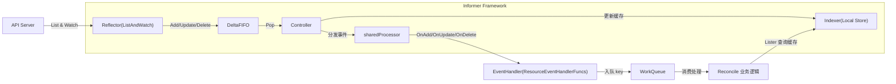

具体的数据流向：

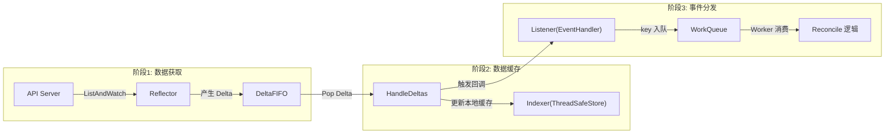

如上图，kubernetes informer的架构中主要包含了Controller、Indexer以及Listener组成，其中Controller的实现又包含了Reflector、DeltaFIFO、以及配套的消费者实现

####  Controller

```GO
type Controller interface {
   Run(stopCh <-chan struct{})
   HasSynced() bool
   LastSyncResourceVersion() string
}

//controller结构体实现了Controller接口
type controller struct {
   config         Config
   reflector      *Reflector    //包含了Reflector
   reflectorMutex sync.RWMutex
   clock          clock.Clock
}

type Config struct {
   Queue     //重要：DeltaFIFO
   ListerWatcher    //重要：ListerWatcher
   Process ProcessFunc   //重要：从DeltaFIFO Pop调用时，调用的回调
   ObjectType runtime.Object  //期待处理的资源对象的类型
   FullResyncPeriod time.Duration   //全量resync的周期
   ShouldResync ShouldResyncFunc  //delta fifo周期性同步判断时使用
   RetryOnError bool
   ......
}
```

####  Reflector
同一类型资源Informer共享一个`Reflector`，`Reflector`通过`ListAndWatch`成员来ListAndWatch apiserver来获取资源的数据，获取时需要**基于ResourceVersion（Etcd生成的全局唯一且递增的资源版本号）**。通过此序号，客户端可以知道目前与服务端信息同步的状态，每次只取大于等于本地序号的事件，如此保证了事件的全局唯一，并可基于此特性实现断点续传等功能

`ListAndwatch`包含了两层意思，即List与Watch

- 当Controller重启或Watch中断的情况下，可以调用资源的list API（HTTP短连接）以进行全量更新，如`r.listerWatcher.List`方法用于获取资源下的所有对象（如pod）的数据，参数`options`的`ResourceVersion`控制获取的位置，如果`ResourceVersion`为`0`，则表示获取所有Pod的资源数据，如果`ResourceVersion`非`0`，则表示根据资源版本号继续获取
- Watch方式会基于当前的资源版本号监听资源变更（Added/Updated/Deleted）事件，通过在Http请求中设置`watch=true`，表示采用Http长连接持续监听apiserver发来的资源变更事件，apiserver在response的HTTP Header中设置`Transfer-Encoding`的值为`chunked`，表示采用分块传输编码。每当有事件来临，返回一个`WatchEvent`

`Reflector`在获取新的资源数据后，调用`Add`方法将资源对象的`Delta`记录存放到本地缓存`DeltaFIFO`中

```GO
type Reflector struct {
   name string
   expectedTypeName string     //被监控的资源的类型名
   expectedType reflect.Type   // 监控的对象类型
   expectedGVK *schema.GroupVersionKind
   store Store    // 存储，就是Delta_FIFO,这里的Store类型实际是Delta_FIFO的父类
   listerWatcher ListerWatcher  // 用来进行list&watch的接口对象
   backoffManager wait.BackoffManager
   resyncPeriod time.Duration   //重新同步的周期
   ShouldResync func() bool    //周期性的判断是否需要重新同步
   clock clock.Clock     //时钟对象，主要是为了给测试留后门，方便修改时间
   ......
}
```

####  DeltaFIFO

DeltaFIFO 是 Informer 架构中 Reflector 与 Indexer 之间的缓冲队列，它是一个先进先出的队列，队列中的元素是 Delta（资源变化记录）。DeltaFIFO 与 threadSafeStore 都实现了 `Store` 接口

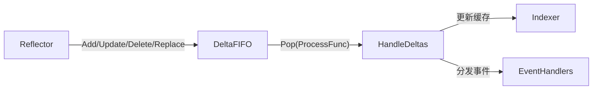

**1、数据结构**

队列中的核心数据是 Delta，包含两部分：类型（DeltaType）和对象（Object）

```GO
const (
    Added    DeltaType = "Added"
    Updated  DeltaType = "Updated"
    Deleted  DeltaType = "Deleted"
    Replaced DeltaType = "Replaced"  // Watch 出错后 relist 时产生
    Sync     DeltaType = "Sync"      // 周期性 resync 时产生
)

type Delta struct {
    Type   DeltaType
    Object interface{}
}

type Deltas []Delta
```

DeltaFIFO 的核心结构：

```GO
type DeltaFIFO struct {
    lock   sync.Mutex
    cond   sync.Cond
    items  map[string]Deltas   // key -> 该资源对象的 Delta 变化列表
    queue  []string            // 所有 key 的有序队列，保证 FIFO
    keyFunc KeyFunc            // 计算对象 key 的函数，默认为 {namespace}/{name}
    knownObjects KeyListerGetter  // 底层存储引用（即 Indexer），用于 Replace/Resync
    ......
}
```

关键要点：
- 一个 `Deltas`（Delta 数组）对应一个资源对象，记录该对象的一系列变化。最新的变化在数组末尾，最旧的在首位
- `items` 是 map 结构，每个 key 对应一个 Deltas 队列
- `queue` 是有序数组，包含所有 key，保证先进先出的消费顺序
- `knownObjects` 指向 Indexer，DeltaFIFO 通过它的 `ListKeys()` 和 `GetByKey()` 方法访问本地缓存

**2、核心方法**

**Add / Update / Delete**

三者逻辑相似，都调用内部的 `queueActionLocked` 方法：
- 作用：向 DeltaFIFO 加入一个 Added/Updated/Deleted 类型的 Delta
- 输入：resource object
- `Add` 和 `Update` 的内部逻辑完全一致，仅 DeltaType 不同
- `Delete` 在加入前会额外检查：如果对象的 key 既不存在于 Indexer 缓存，也不存在于队列中，则直接返回（无需删除一个不存在的对象）

`queueActionLocked` 的内部逻辑：

1. 通过 `KeyFunc` 计算 object 的 key
2. 通过 key 从 `items` 获取旧的 Deltas，将新 Delta 追加到末尾形成新的 Deltas
3. 对 Deltas 进行去重操作（连续两个相同类型的 Deleted Delta 会合并）
4. 如果该 key 的 Deltas 之前不存在，则将 key 追加到 `queue` 数组末尾
5. 在 `items` 中更新 key 与新 Deltas 的绑定

**Replace**

- 作用：在 Informer 初始化（List）时使用，将 List 得到的全量对象一次性装载至队列，并与本地缓存同步
- 输入：object 数组
- 内部逻辑：
    1. 遍历输入的 object 数组，计算每个 object 的 key 并加入 `keys` 集合，同时调用 `queueActionLocked` 将对象以 `Replaced` 类型加入队列
    2. 通过 `knownObjects.ListKeys()` 获取本地缓存中所有 key
    3. 遍历本地缓存的 key，如果不在 `keys` 集合中（说明远端已删除），则从本地缓存取出该对象，以 `Deleted` 类型加入队列

**Resync**

- 作用：周期性同步队列与本地存储，确保不丢失事件
- 内部逻辑：通过 `knownObjects.ListKeys()` 获取 Indexer 中所有 key，逐一调用 `queueActionLocked` 以 `Sync` 类型加入队列

**Pop**

- 作用：从队列头部取出一个 Deltas 并使用 `ProcessFunc` 处理
- 输入：`ProcessFunc`（处理函数）
- 内部逻辑：
    1. 循环等待（如果队列为空则阻塞在 `cond.Wait()`）
    2. 从 `queue` 数组取出最旧的 key（下标为 0），移除该 key
    3. 通过 `items` map 取出对应的 Deltas，并从 `items` 中删除
    4. 调用 `ProcessFunc` 处理该 Deltas（如果处理失败，会将 Deltas 重新放回队列）

DeltaFIFO 本身并不直接操作资源对象的增删改，它更多充当**缓冲和转存**的角色。资源对象的最新本地缓存维护在 Indexer 中，Indexer 与 etcd 中存储的对象保持状态一致

**3、Informer 启动流程**

当 Informer 调用 `Run` 方法启动时，初始化工作按以下顺序进行：

1. 初始化 DeltaFIFO，将其 `knownObjects` 指向一个 Indexer 实例
2. 启动一个 goroutine 循环执行 `Pop`，等待从 DeltaFIFO 队列中消费数据并用 `HandleDeltas` 处理
3. 执行 List 操作（全量拉取），将结果通过 `DeltaFIFO.Replace()` 装载到队列
4. List 完成后启动 Watch（增量监听），持续接收变更事件并写入 DeltaFIFO

####  Informer
Informer是一个抽象概念，[`SharedInformerFactory`](https://github.com/kubernetes/kubernetes/blob/v1.21.1/staging/src/k8s.io/client-go/informers/factory.go#L187)

```GOLANG
type SharedInformerFactory interface {
	internalinterfaces.SharedInformerFactory
	ForResource(resource schema.GroupVersionResource) (GenericInformer, error)
	WaitForCacheSync(stopCh <-chan struct{}) map[reflect.Type]bool

	Admissionregistration() admissionregistration.Interface
	Internal() apiserverinternal.Interface
	Apps() apps.Interface
	Autoscaling() autoscaling.Interface
	Batch() batch.Interface
	Certificates() certificates.Interface
	Coordination() coordination.Interface
	Core() core.Interface
	Discovery() discovery.Interface
	Events() events.Interface
	Extensions() extensions.Interface
	Flowcontrol() flowcontrol.Interface
	Networking() networking.Interface
	Node() node.Interface
	Policy() policy.Interface
	Rbac() rbac.Interface
	Scheduling() scheduling.Interface
	Storage() storage.Interface
}
```

####  Indexer
Indexer 接口是缓存（`Store`）和索引（`Index`系列）的高级抽象，实现了 Informer 高效、快速的索引查询功能。结构如下：

-  `Store`接口：缓存 Local Store 的抽象
-  `cache`结构体：`Indexer` 的实现，其中`ThreadSafeStore`类型的成员`cacheStorage`也实现了`Indexer`的所有方法，`ThreadSafeStore`意义是定义了线程安全的存储接口

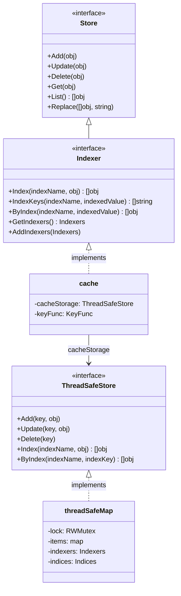

```GO
type Indexer interface {
  // 封装了 缓存 Local Store
	Store
  // 下面方法 为对索引结构的操作
	// Index returns the stored objects whose set of indexed values
	// intersects the set of indexed values of the given object, for
	// the named index
	Index(indexName string, obj interface{}) ([]interface{}, error)
	// IndexKeys returns the storage keys of the stored objects whose
	// set of indexed values for the named index includes the given
	// indexed value
	IndexKeys(indexName, indexedValue string) ([]string, error)
	// ListIndexFuncValues returns all the indexed values of the given index
	ListIndexFuncValues(indexName string) []string
	// ByIndex returns the stored objects whose set of indexed values
	// for the named index includes the given indexed value
	ByIndex(indexName, indexedValue string) ([]interface{}, error)
	// GetIndexer return the indexers
	GetIndexers() Indexers

	// AddIndexers adds more indexers to this store.  If you call this after you already have data
	// in the store, the results are undefined.
	AddIndexers(newIndexers Indexers) error
}

//cache 结构体实现了 Indexer 中的所有方法（包含Store的方法）
type cache struct {
	// cacheStorage bears the burden of thread safety for the cache
  // 这是个接口其实 就涵盖了 Indexer 接口 的所有方法
  // 因此实现了 ThreadSafeStore 该接口，就相当于实现了 Indexer 接口
	cacheStorage ThreadSafeStore
	// keyFunc is used to make the key for objects stored in and retrieved from items, and
	// should be deterministic.
  // 用于计算 Object 的 key
	keyFunc KeyFunc
}

// ThreadSafeStore 接口：表示可以对缓存的操作
type ThreadSafeStore interface {
	Add(key string, obj interface{})
	Update(key string, obj interface{})
	Delete(key string)
	Get(key string) (item interface{}, exists bool)
	List() []interface{}
	ListKeys() []string
	Replace(map[string]interface{}, string)
	Index(indexName string, obj interface{}) ([]interface{}, error)
	IndexKeys(indexName, indexKey string) ([]string, error)
	ListIndexFuncValues(name string) []string
	ByIndex(indexName, indexKey string) ([]interface{}, error)
	GetIndexers() Indexers

	// AddIndexers adds more indexers to this store.  If you call this after you already have data
	// in the store, the results are undefined.
	AddIndexers(newIndexers Indexers) error
	Resync() error
}
```

结构体`threadSafeMap`是接口`ThreadSafeStore`的实例化，也是缓存（Local Store）的实际数据存储（安全有锁），下面详细描述下基于缓存的索引如何组织：

```GO
// threadSafeMap implements ThreadSafeStore
type threadSafeMap struct {
  // 相当于缓存的本质，存储着 key-object
	lock  sync.RWMutex
	items map[string]interface{}

  // Indexers  Indices 也是map 结构
  // 相当于 索引的 结构
	// indexers maps a name to an IndexFunc
	indexers Indexers
	// indices maps a name to an Index
	indices Indices
}

// Index maps the indexed value to a set of keys in the store that match on that value
// 索引值 map: 由索引函数计算所得索引值(indexedValue) => [objKey1, objKey2...]
type Index map[string]sets.String

// Indexers maps a name to a IndexFunc
// map 索引类型 => 索引函数
type Indexers map[string]IndexFunc

// Indices maps a name to an Index
// map 索引类型 => 索引值 map
type Indices map[string]Index

// k8s.io/apimachinery/pkg/util/sets/string.go
// sets.String 可以理解为 没有重复元素的数组，不过在 go 语言里面是采用 map 形式构建，因为 map 的 key 不能重复 
// sets.String is a set of strings, implemented via map[string]struct{} for minimal memory consumption.
type String map[string]Empty
```

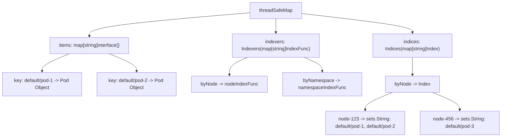

举个例子，用一个 Informer 来监听 Kubernetes 集群中的 Pod 资源，需要建立一个索引，以便能快速根据 Pod 所在的节点名称（nodeName）查找所有运行在该节点上的 Pod，那么上面数据结构的功能如下

`sets.String`：集合用于存储一组不重复的键，用来存储具有相同索引值（如同一个Node）的所有对象的 Key，通常key为namespace/name组成（如 `default/mypod`）。所有运行在 `node-123`节点上的 Pod，它们的 Key 会被收集到一个 `sets.String`集合中，如下：

```GO
sets.String{
    "default/pod-1": struct{}{},
    "default/pod-2": struct{}{},
    "kube-system/pod-abc": struct{}{},
}
```

`Index`：将一个索引值（如具体的Node `node-123`）映射到包含所有具有该索引值的对象 Key 的集合

```GO
// Index
map[string]sets.String{
    "node-123": sets.String{"default/pod-1": {}, "default/pod-2": {}, "kube-system/pod-abc": {}},
    "node-456": sets.String{"default/pod-3": {}},
    "node-789": sets.String{}, // 即使没有 Pod 的节点，也可能存在（为空集合）
}
```

`Indexers`：类似一个注册表，它定义了可以创建哪些类型的索引以及如何计算这些索引。键是索引类型的名称，值是用来计算对象索引值的函数

```GO
//key：索引类型的名字，例如 "byNode"
//value：IndexFunc，一个函数，输入是一个对象，输出是该对象在此索引类型下的所有索引值（一个字符串切片）
//首先需要注册一个索引器，告诉系统如何从 Pod 对象中提取节点名

// 定义一个 IndexFunc
nodeIndexFunc := func(obj interface{}) ([]string, error) {
    pod := obj.(*v1.Pod) // 将对象转换为 Pod
    return []string{pod.Spec.NodeName}, // 返回这个 Pod 的 nodeName
}

// 注册到 Indexers中
indexers := map[string]IndexFunc{
    "byNode": nodeIndexFunc, // 索引类型"byNode"的计算方法 = nodeIndexFunc
}
```

`Indices`：这是整个索引的顶层容器。它将每个索引类型（如 `byNode`）映射到该类型下完整的索引数据（即一个 `Index`）

```GO
//key：索引类型的名字，例如 "byNode"
//value：该索引类型下所有的索引数据
indices := map[string]Index{
    // 索引类型 "byNode" 对应的所有索引数据
    "byNode": { 
        // 下面是 Index (map[string]sets.String)
        "node-123": sets.String{"default/pod-1": {}, "default/pod-2": {}, "kube-system/pod-abc": {}},
        "node-456": sets.String{"default/pod-3": {}},
    },
    // 未来还可以有其他索引类型，例如 "byNamespace"
    // "byNamespace": { ... }
}
```

现在，假设新增一个 `pod-4`，它被调度到 `node-456`，其 Key 为 `default/pod-4`，那么操作过程如下：

1.  计算索引值：系统查看 Indexers，发现注册了一个 `byNode`索引类型，其计算函数是 `nodeIndexFunc`。于是调用 `nodeIndexFunc(pod-4)`，得到索引值 `["node-456"]`
2.  更新索引：系统找到 Indices中 `byNode`这个索引类型对应的 Index，然后在这个 Index中，找到键为 `node-456`的集合（一个 `sets.String`）
3.  将新 Pod 的 Key `default/pod-4`添加到这个集合中
4.  最终状态：更新后，`indices["byNode"]["node-456"]`这个集合现在就包含了 `default/pod-3`和 `default/pod-4`

查询时的过程如下，假设需要获取所有在 `node-456`上的 Pod，过程如下：

1.  通过 Indices找到 `byNode`索引
2.  通过 Index找到 `node-456`这个键对应的 `sets.String`（即 `{"default/pod-3", "default/pod-4"}`）
3.  最后根据这些 Key，从底层存储的 `map[string]interface{}`中取出完整的 Pod 对象

##  0x06 参考
- [深入理解k8s中的informer机制 ](https://www.cnblogs.com/yangyuliufeng/p/13611126.html)
- [理解 Informer 的缓存与索引数据结构的设计](https://blog.csdn.net/qq_24433609/article/details/126229637)
- [K8s 的核心是 API 而非容器（一）：从理论到 CRD 实践（2022）](https://arthurchiao.art/blog/k8s-is-about-apis-zh/)
- [一文搞懂 K8s 中的 RBAC 认证授权](https://xie.infoq.cn/article/ef2eddd10f76d46456006bbd9)
- [Cracking Kubernetes RBAC Authorization (AuthZ) Model (2022)](https://arthurchiao.art/blog/cracking-k8s-authz-rbac/)
- [Cracking Kubernetes Authentication (AuthN) Model (2022)](https://arthurchiao.art/blog/cracking-k8s-authn/)
- [Kubernetes 源码阅读 - Informer](https://pages.ruofeng.me/posts/kubernetes-informer-in-depth/)
- [理解K8S Informer机制](https://zhuanlan.zhihu.com/p/500092544)