## 0x00 前言

Linux 进程调度的本质是：在有限 CPU 上（进程数目远超 CPU 数目），依据某种调度算法分配 CPU 时间（有效地分配CPU的时间），既要保证进程的最快响应，也要保证进程之间的公平

>
> - **本文主体机制分析基于 [Linux v4.11.6](https://elixir.bootlin.com/linux/v4.11.6/source)**。若无特殊说明，均以此版本为准
> - **调度延迟可观测（tracepoint）章节基于 [Linux v5.4.241](https://elixir.bootlin.com/linux/v5.4.241/source)**

**本文主要涉及的主题**：
- 主调度 `__schedule`的机制
- 周期性 `scheduler_tick`的机制
- CFS相关（vruntime / 权重 / 入队出队 / pick）、抢占模型、`context_switch`、唤醒路径方式等

其他推荐阅读：

todo

- []()，关联内核版本4.14

---

## 0x01 CPU 视角与虚拟地址

本小节描述 CPU 视角下的CPU的工作机制：CPU 如何在用户程序之间、内核代码与用户程序之间切换？从 CPU 视角如何访问 `task_struct`结构的？

### 1. CPU 的工作流程（机制）


如上图所示，CPU的**指令指针寄存器**，指向的就是当前运行的指令的位置，把这里的指令读进CPU执行，如果需要取数据，则将数据读进数据寄存器里面来，进行运算，运算的结果从寄存器写入内存。CPU只要一加电就会按照这个模式运行下去，指令指针寄存器指向A进程的代码某一行，就运行A进程的逻辑，指向Linux内核的代码某一行，就运行内核的逻辑，一直像这样运行下去

CPU 的**指令指针寄存器**指向当前运行指令的位置，把指令读进 CPU 执行；需要数据则读进数据寄存器运算，结果写回内存。CPU 加电后按此模式运行：IP 指向 A 进程代码某一行，就运行 A；指向内核代码某一行，就运行内核

此外，CPU里面还有其他的寄存器，用于内存管理，进程切换等

### 2. 从 CPU 视角如何访问 `task_struct`？

本小节讨论这个问题：

- 内核如何管理进程？，进程在内存中的组织（存储）机制
- 从CPU的视角，是如何访问`task_struct`结构的？

通过前文学习可知，在内核中，进程是被维护在`task_struct`定义的数据结构里面，并放在一个进程列表中，如下图。无论是进程还是线程在内核里面都称为任务task


内核用 `task_struct` 表示进程（线程），并挂在一个进程列表上，链表头是启动时创建的 [`struct task_struct init_task`](https://github.com/torvalds/linux/blob/v4.11/init/init_task.c#L66)。通过它可遍历找到所有进程。那么从CPU视角来看，如何定位到`struct task_struct init_task`这个（全局的）数据结构对象？怎么知道struct task_struct这个数据结构放在哪里呢？

回顾前文Linux内核内存管理的知识，不管内核还是用户程序代码或者数据，都是放在物理内存的某个位置的。但是从开发者角度来说基本都是在和虚拟内存打交道（物理内存很难触碰，也很少用物理内存地址这种说法），再由内核完成虚拟内存地址到物理内存地址的映射。这里先看下`32/64`位机器的虚拟内存布局，如下图：


以`64`位机器为例，虚拟内存地址空间又划分为两块：
-   内核态地址空间
-   用户态地址空间：即用户程序的视角，用户的代码只可能访问用户态地址空间（通常），这部分地址不同的程序访问的地址都是重复的，只不过Linux要想办法把这部分各个程序都重复的空间对应到物理内存不同的地方，当然不用都对应，哪里有数据对应哪里，毕竟物理空间没有这么大的地方

用户态地址空间的布局如下图所示，主要包含如下数据：
-   代码段，全局变量等
-   函数栈
-   堆
-   内存映射区


从上图了解到，另一片内核地址空间（虚线的部分），在用户程序的视角来看，只是看起来有，但是无法直接访问。如果想访问内核态地址空间，就需要从用户态通过例如系统调用进入内核，进入内核后，视角就变成了内核视角，在内核视角，这片地址空间只有一份，无论从哪个进程进入的内核态，进来后访问的是同一份，对应的也是物理内存中同一块空间

内核地址空间布局如下图：


内核态地址空间包含以下数据：
- 内核的代码、全局变量等
- 内核数据结构（上面提到的`task_struct`结构，就放在内核态地址空间里面的数据结构区域）
- 内核栈
- 内核中动态分配的内存


1.  用户态程序如果想访问内核态地址空间，就需要从用户态通过例如系统调用进入内核，进入内核后，视角就变成了内核视角，在内核视角，这片地址空间只有一份，无论从哪个进程进入的内核态，进来后访问的是同一份，对应的也是物理内存中同一块空间
2.  在内核视角看起来，用户态的那部分地址空间其实没多少意义，因为每个进程都有这么一块（虚拟地址）空间
3.  那么从CPU硬件视角出发，用户态地址空间和内核态地址空间都是虚拟的无法直接访问，必须要变成物理内存地址的才可以访问，该映射的过程称为页表映射
所以，上面提到的`task_struct`结构（全局链表对象），就放在内核态地址空间里面的数据结构区域（可以通过对应的内核地址空间的地址进行访问）

### 3. `init_task` 与虚拟内存地址空间

无论内核还是用户程序，代码/数据都在物理内存某处；开发者几乎只和虚拟地址打交道，由内核完成虚实映射

以 64 位为例，虚拟地址空间划分为：

- **内核态地址空间**
- **用户态地址空间**：用户代码通常只能访问用户态；各进程用户态虚地址可重叠，由页表映射到不同物理页

用户态布局主要包括：代码段与全局变量、函数栈、堆、内存映射区。内核态布局主要包括：内核代码与全局变量、**内核数据结构**（`task_struct` 即在此）、内核栈、内核动态分配内存。要点如下：

1. 用户态要访问内核态，需经系统调用等进入内核；进入后是内核视角，内核地址空间全局一份
2. 内核视角下，各进程用户态虚地址空间本身意义有限（每进程一份虚空间）
3. 对 CPU 硬件而言，虚地址必须经页表变成物理地址才能访问

### 4. 页表映射与 CR3

上面介绍了用户态视角和内核态视角，这里切回CPU视角，对于CPU这个物理硬件来讲，用户态地址空间和内核态地址空间都是虚拟的，必须要变成物理的才好访问，这个映射的过程称为页表映射，核心过程如下图


下面的描述介绍了，从CPU的视角，是如何访问`task_struct`结构的：

- 因为每个进程都有自己的用户态虚拟地址空间，因而每个进程都有自己的页表，用于将用户态的地址映射为物理地址。同时，每个进程的页表的根，放在`task_struct`结构中
- 内核有统一的一个内核虚拟地址空间，因而内核也需要有个页表，用于将内核态的地址映射为物理地址。内核的页表的根放在一个预设的地方，可以直接映射到物理地址
- 在CPU处理器内部，有一个控制寄存器叫 CR3，存放着页目录的物理地址，故 CR3 又叫做页目录基址寄存器（Page Directory Base Register，PDBR）
- 如果当前进程A运行在用户态，则从task_struct里面找到页表顶级目录，加载到CR3里面去，则程序里面访问的虚拟地址就通过CPU指向的页表转换成物理地址进行访问
- 然而内核里面访问task_struct使用的也是虚拟地址，因而进程进入内核后，CR3要变成指向内核页表的顶级目录，内核程序访问内核数据结构的虚拟地址就是用CPU指向的内核页表转换成物理地址进行访问的
- 内核页表的根是内存初始化的时候预设在一个虚拟地址和物理地址

todo：KPTI机制


针对用户进程而言，由于每个进程都有自己的用户态虚拟地址空间，因而每个进程都有自己的页表，用于将用户态的地址映射为物理内存地址。每个进程的页表的根，放在`task_struct`结构中（`struct mm_struct *mm`[成员](https://elixir.bootlin.com/linux/v4.11.6/source/include/linux/sched.h#L562)）。而内核有统一唯一的内核虚拟地址空间，因而内核也有个页表，用于将内核态的地址映射为物理内存地址。**内核的页表的根放在一个预设的地方，可以直接映射到物理地址。在处理器内部，有一个控制寄存器叫 `CR3`，存放着页目录的物理地址，故 `CR3` 又叫做页目录基址寄存器（Page Directory Base Register，PDBR）**。内核页表的根是内存初始化的时候预设在一个虚拟地址和物理地址

如果当前进程A运行在用户态，则从其对应的`task_struct`里面找到页表顶级目录，加载到`CR3`寄存器，则A程序里面访问的虚拟地址就通过CPU指向的页表转换成物理地址进行访问。然而内核里面访问`task_struct`使用的也是虚拟地址，因而进程进入内核态后，`CR3`要变成指向内核页表的顶级目录，内核程序访问内核数据结构的虚拟地址就是用CPU指向的内核页表转换成物理地址进行访问的

每个进程有自己的用户态页表，页表根在 `task_struct` 的 [`struct mm_struct *mm`](https://elixir.bootlin.com/linux/v4.11.6/source/include/linux/sched.h#L562)。内核有统一内核映射，x86 上控制寄存器 **CR3**（PDBR）存放页目录物理基址

> **一个细节**：原文的表述「进入内核后 CR3 要切到独立内核页表」。在 **x86-64** 上，进程页表通常**已经包含内核映射**；系统调用进入内核时**一般不切换 CR3**。CR3 / `switch_mm` 主要发生在**进程地址空间（mm）切换**时（例如 `context_switch` 中 `next->mm` 与 `prev->active_mm` 不同）

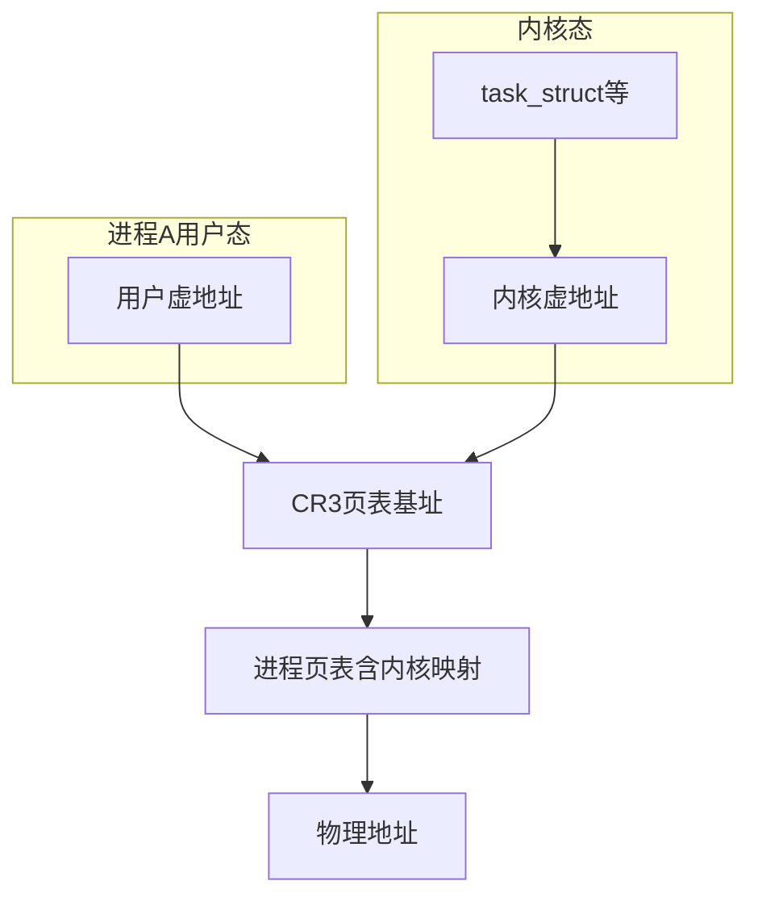

todo

---

## 0x02 进程调度：一个白话解读
本章节参考[《万字详解 Linux 内核调度器极其妙用》](https://mp.weixin.qq.com/s/gkZ0kve8wOrV5a8Q2YeYPQ)

> 假设只有一个 CPU、进程切换次序 A→B→C→A。注意不要被「谁把 A 换下来、内核代码又是谁调度上来」绕晕，技巧是**切到硬件 CPU 视角**，应用程序和内核都变成客体

### 2.1 调度相关数据结构

接下来先看 `task_struct` 数据结构里与调度有关的变量。首先是 `policy`（调度策略）


```cpp
struct task_struct {
    ......
    unsigned int			policy; // 调度策略
    int				on_rq;

	int				prio;
	int				static_prio;
	int				normal_prio;
	unsigned int			rt_priority;

	const struct sched_class	*sched_class;       //核心，调度策略的执行逻辑，实现了调取器类中要求的添加任务队列、删除任务队列、从队列中选择进程等方法
	struct sched_entity		se;
	struct sched_rt_entity		rt;
  ......
}
```


策略分两大类：

- 实时调度策略：`SCHED_FIFO`、`SCHED_RR`、`SCHED_DEADLINE`，优先级比较高
- 普通调度策略：`SCHED_NORMAL`、`SCHED_BATCH`、`SCHED_IDLE`，优先级比较低

`policy` 成员只是一个变量，调度时执行的代码放在 `sched_class` 里面：

- `rt_sched_class` 对应实时进程的调度策略
- `fair_sched_class` 对应普通进程的调度策略（CFS，Completely Fair Scheduling，完全公平调度）
- `idle_sched_class` 对应空闲进程的调度策略

（完整五级链还有 `stop_sched_class`、`dl_sched_class`）

`task_struct` 里的成员执行哪种 `sched_class`，就会按哪种方式被调度。虽然每个进程都有一个 `task_struct`，但所有 `task_struct` 的 `sched_class` 指向的都是同一份全局对象。**这三个（实际是五个）`sched_class` 内核中只有一份，只包含调度逻辑，是中立的，不属于任何进程**；一旦进了某个 `sched_class` 的代码逻辑，就要脱离某个进程的视角，进入内核的视角

即虽然每个进程都有一个task_struct，但是所有的task_struct的`sched_class`变量指向的都是同一个或者`rt_sched_class`，或者`fair_sched_class`，或者`idle_sched_class`。这三个`sched_class`内核中只有一份，只包含调度逻辑，是中立的，不属于任何进程的，因而在看代码的时候要意识到，一旦进了某个`sched_class`的代码逻辑，就要脱离某个进程的视角，进入内核的视角了

另一个和调度有关的成员`sched_entity`是调度实体：有实时调度实体 `sched_rt_entity`，也有完全公平算法调度实体 `sched_entity`。以CFS调度实体为例：

[`sched_entity`](https://elixir.bootlin.com/linux/v4.11.6/source/include/linux/sched.h#L359)：代表被CFS算法调度的实体

```c
//https://elixir.bootlin.com/linux/v4.11.6/source/include/linux/sched.h#L359
struct sched_entity {
	/* For load-balancing: */
	struct load_weight		load;
	struct rb_node			run_node;
	struct list_head		group_node;
	unsigned int			on_rq;

	u64				exec_start;
	u64				sum_exec_runtime;
	u64				vruntime;               //核心，对于完全公平调度算法，需要记录下进程的运行时间。CPU会提供一个时钟，过一段时间就触发一个时钟中断。CFS会为每一个进程安排一个虚拟运行时间vruntime。如果一个进程在运行，随着时间的增长，也就是一个个tick的到来，进程的vruntime将不断增大。没有得到执行的进程vruntime不变，这个字段为CFS算法的调度提供依据
	u64				prev_sum_exec_runtime;

	u64				nr_migrations;

	struct sched_statistics		statistics;

  ......
};
```

在 Linux 内核中，为每一个 CPU 都创建队列来保存可以在这个 CPU 上运行的任务，用 `struct rq` 表示，这里面包括一个实时进程队列 `rt_rq` 和一个 CFS 运行队列 `cfs_rq`；**`task_struct` 就是用 `sched_entity` 这个成员变量将自己挂载到某个 CPU 的队列上的**

```c
//cpu维度的数据结构
struct rq {
    struct rt_rq rt;    //实时进程队列rt_rq
    struct cfs_rq cfs;      //CFS运行队列cfs_rq（实际上，CFS 的队列是一棵红黑树）
    struct dl_rq dl;
}
```

注意：每个CPU逻辑核都有自己的 `struct rq` 结构，用于描述在此 CPU 上所运行的所有进程，其包括一个实时进程队列`rt_rq` 和一个 CFS 运行队列 `cfs_rq`。在调度时，调度器首先会先去实时进程队列找是否有实时进程需要运行，如果没有才会去 CFS 运行队列（叫队列，实际上是红黑树）找是否有进行需要运行。这样保证了实时任务的优先级永远大于普通任务


`sched_entity` 里面有一个重要的变量 `vruntime`。对于完全公平调度算法，需要记录下进程的运行时间。CPU 会提供一个时钟，过一段时间就触发一个时钟中断，就像表滴答一下（Tick）。CFS 会为每一个进程安排一个虚拟运行时间 `vruntime`。如果一个进程在运行，随着时间的增长，也就是一个个 tick 的到来，进程的 `vruntime` 将不断增大。没有得到执行的进程 `vruntime` 不变

显然，那些 `vruntime` 少的，原来受到了不公平的对待，需要给它补上，所以CFS调度算法会优先运行这样的进程。因而 CFS 运行队列需要能够对 `vruntime` 进行排序，找出最小的那个。这个能够排序的数据结构不但需要查询时能快速找到最小的，更新时也需要能快速调整排序。由于`vruntime` 可是经常在变的，内核能够平衡查询和更新速度的是树，这里使用的是**红黑树**

CFS调度算法的运行队列需要能够对`vruntime`进行排序，找出最小的那个`vruntime`，这个能够排序的数据结构不但需要查询的时候，能够快速找到最小的，更新的时候也需要能够快速地调整排序，要知道`vruntime`可是经常在变的，变了再插入这个数据结构，就需要重新排序。所以内核选择了[红黑树](https://pandaychen.github.io/2024/10/05/A-LINUX-KERNEL-TRAVEL-0/)作为CFS调度算法的实现


```cpp
struct task_struct {
    unsigned int			policy;
    int				on_rq;
    int				prio;
    int				static_prio;
    int				normal_prio;
    unsigned int			rt_priority;
    const struct sched_class	*sched_class;  // 调度类方法表
    struct sched_entity		se;
    struct sched_rt_entity		rt;
    /* ... */
};
```

```c
struct cfs_rq {
	struct load_weight load;
	unsigned int nr_running;
	u64 min_vruntime;
	struct rb_root tasks_timeline;
	struct rb_node *rb_leftmost;
	struct sched_entity *curr, *next, *last, *skip;
	/* ... */
};
```

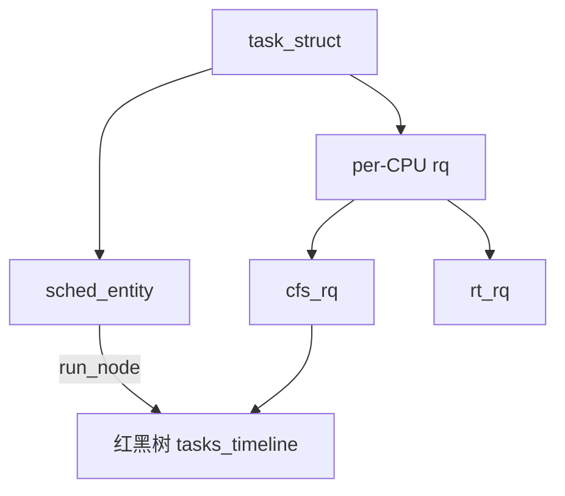

### 2.2 新创建的进程是如何运行起来的？

当一个进程创建的时候（对应内核函数`copy_process`），就会分配 `task_struct` 结构，就会根据程序员设置的调度策略设置 `sched_class` 变量，默认指向 `fair_sched_class`

进程创建后的一件重要的事情，就是调用 `sched_class` 的 `enqueue_task` 方法，将这个进程放进某个 CPU 的队列上来，虽然不一定马上运行，但是说明可以在这个 CPU 上被调度上去运行了。在这里 `sched_class` 的代码已经被调用了，其实调度已经开始了。从 CPU 的视角来看，指令指针寄存器里面指向的还是 `sched_class` 里面的代码，也即内核的代码只是对内存中的 `task_struct` 及 `sched_entity` 进行操作而已，进程的代码并没有运行

在`sched_class`的 `enqueue_task` 方法将进程放入 CPU 队列后，**会调用一个核心方法 `check_preempt_curr`，来试图去抢占当前的进程去运行**。当前进程是谁？在 Linux 里面，进程都是由父进程 `fork` 的，这里的当前进程是父进程，然而这个时候父进程并没有运行在 CPU 上，因为这个时候 CPU 里面运行的还是内核代码。这里的「当前进程」也即父进程是目前队列里面排名最靠前的进程，而这里的抢占的意思是子进程试图排在父进程的前面，但是也不是马上就放到 CPU 上运行，而是仅仅将父进程设置了一个标志位 `TIF_NEED_RESCHED`，表示应该被调度走。那么什么时候真的被调度走呢？父进程创建子进程是调用 `fork` 系统调用进的内核，当创建完毕后，从 `fork` 系统调用返回用户态的时候，发现了这个标志位，才主动让给子进程运行的

那如何让新创建的子进程在用户态运行起来呢？到现在为止，介绍的还都是 CPU 如何执行内核代码来对进程相关数据结构做修改。要想让用户态程序真的运行，按照 CPU 的原理，应该页表就绪，虚拟内存及对应的物理内存上有代码、有数据，然后指令指针寄存器指向程序的某行代码

回顾一下栈的原理（后进先出），栈是一个从高地址到低地址，往下增长的结构，也就是上面是栈底，下面是栈顶，入栈和出栈的操作都是从下面的栈顶开始的

根据前文描述，要想让用户态程序真的运行，按照CPU的原理，应该`CR3`指向这个进程的页表，虚拟内存及对应的物理内存上有代码，有数据，然后指令指针寄存器指向程序的某行代码，这样新进程才可以运行。那么用户进程的这些信息是如何被设置到相应的寄存器，虚拟内存，物理内存的呢？这和`task_struct`的另一个成员变量`stack`指向的内核栈有关。

在CPU里，SP（Stack Pointer）是栈顶指针寄存器，入栈操作Push和出栈操作Pop指令，会自动调整SP的值。另外有一个寄存器BP（Base Pointer），是栈基地址指针寄存器，指向当前栈帧的最底部

####  栈机制

在用户态，如果A调用B，A的栈里面包含A函数的局部变量，然后是调用B的时候要传给它的参数，然后返回A的地址也应该入栈，这就形成了A的栈帧。接下来就是B的栈帧部分了，先保存的是A的栈帧的栈底的位置，也就是EBP。因为在B函数里面获取A传进来的参数，就是通过这个指针获取的，接下来保存的是B的局部变量等。然后，当B返回的时候，返回值会保存在EAX寄存器中，从栈中弹出返回地址，将指令跳转回去，参数也从栈中弹出，然后继续执行A。注意，以上的栈操作，都是在进程的内存空间里面进行的


> **一个细节**：原文此处常写「CR3 指向这个进程的页表」。这里稍微调整下说法：若父子此前已共享或各自 mm 已装入，关键更在于 `switch_mm`/`switch_to` 与 `pt_regs` 恢复，而不是「每次进内核都换一套独立内核页表」

这和 `task_struct` 的另一个成员变量 `stack` 指向的内核栈有关。在 CPU 里，SP（Stack Pointer）是栈顶指针寄存器；BP（Base Pointer）指向当前栈帧底部。栈从高地址往低地址增长

####  系统调用与栈机制

如果程序通过系统调用从进程的内存空间到内核中了，内核中也有各种函数调用，那么类似的入栈/出栈操作如何执行呢？于是内核栈（成员变量`stack`）就派上了用场

在内核栈的最高地址端，存放的是一个结构 `pt_regs`，此结构的作用是当系统调用从用户态切换到内核态的时候，**首先要做的第一件事情，就是将用户态运行过程中的 CPU 上下文（各种寄存器）保存在这个结构里。这里两个重要的寄存器 SP 和 IP，SP 里面是用户态程序运行到的栈顶位置，IP 里面是用户态程序运行到的某行代码。这样当从内核系统调用返回的时候，才能让进程在刚才的地方接着运行下去**

所以在内核填充`pt_regs`，然后从系统调用返回用户态，是让用户态程序运行的一种方式


这里回想一下，整个 Linux 系统的第一个用户态进程也是这样运行起来的。当Linux系统启动的时候，首先进行初始化的是内核代码，当内核初始化结束，会创建第一个用户态进程即`1`号进程（后续所有的用户进程都是这个`1`号进程的子孙）。创建的方式是在内核态运行`do_execve`（内核系统调用），对应的进程可能为`/sbin/init`，`/etc/init`，`/bin/init`，`/bin/sh`等

```bash
[root@VM-X-X-centos X]# ps aux
root           1  0.0  0.1 214124  8332 ?        Ss    2022 332:52 /usr/lib/systemd/systemd --switched-root --system --deserialize 17
```

这里详细说明下，在`do_execve`的实现中，会设置`struct pt_regs`，主要设置的是`ip`和`sp`，指向第一个进程的起始位置，这样调用`iret`就可以从系统调用中返回。这个时候会从`pt_regs`恢复寄存器，此时指令指针寄存器`IP`恢复了，指向用户态下一个要执行的语句。函数栈指针`SP`也被恢复了，指向用户态函数栈的栈顶。所以，下一条指令，就从用户态开始运行了

todo

某个用户态进程调用`fork`创建新进程，`fork`是系统调用会调用到内核函数，在内核中子进程会复制父进程的几乎一切，包括`task_struct`，内存空间等。这里注意的是，`fork`作为一个系统调用，是将用户态的当前运行状态放在`pt_regs`里面了，`IP`和`SP`指向的就是`fork`这个函数，然后就进内核了

接下来所有的用户进程都是这个 `1` 号进程的徒子徒孙。如果要创建新进程，是某个用户态进程调用 `fork`。`fork` 作为系统调用，会将用户态的当前运行状态放在 `pt_regs` 里面，IP 和 SP 指向的就是 `fork` 这个函数，然后就进内核了。子进程创建完了，如果 `check_preempt_curr` 成功抢占了父进程，则父进程会被标记 `TIF_NEED_RESCHED`，在 `fork` 返回时会检查这个标记，将 CPU 主动让给子进程；因为子进程是完全复制的父进程，返回用户态时仍然在 `fork` 的位置（因而返回用户态的时候，仍然在`fork`的位置，当然父进程将来返回的时候，也会在`fork`的位置），只不过返回值不一样，等于 `0` 说明是子进程

### 2.3 主动调度与上下文切换
继续，本小节主要关注两个问题：

- 运行起来的进程如何主动调度走
- 进程上下文切换

先介绍一下进程调度的相关概念，进程调度分主动调度和抢占调度

-   主动调度（voluntary）：也称自愿切换，比如A进程运行着，里面有一条指令`sleep`，或者等待某个I/O事件，就需要主动让出CPU，让其他的进程运行
-   抢占式调度（involuntary）：也称强制切换，比如A进程运行的时间太长了，会被其他进程抢占。还有一种情况是，有一个进程B原来等待某个I/O事件，等待到了被唤醒，发现比当前正在CPU上运行的进行优先级高，于是进行抢占

所谓的**主动调度**，就是 A 进程运行着，里面有一条指令 `sleep`，或者等待某个 I/O 事件，就需要主动让出 CPU。所谓的**抢占调度**，就是 A 进程运行的时间太长了，会被其他进程抢占；还有一种情况是，有一个进程 B 原来等待某个 I/O 事件，等待到了被唤醒，发现比当前正在 CPU 上运行的进程优先级高，于是进行抢占

1、主动调度

先来看主动调度的场景。假设 A 进程正在用户态运行，函数的调用过程假设为 `A_main→A_Fun→read()`，这个调用过程自然是被保存在用户态栈里面。**而`read()` 是一个系统调用，会进入内核；进入内核的那个时刻，用户态的栈顶指针 SP 和指令指针 IP 都会被保存在 `pt_regs` 里面，放到 A 进程对应的 `task_struct` 的 `stack` 成员变量指向的内核栈里面**

在内核中，假设继续仍然会进行函数调用，如 `do_read()→A_Kernel1→A_Kernel2`。这个调用过程自然是被保存在内核栈里面，这个栈也有一个栈顶指针SP，这个时候的IP指向的是A_Kernel2里面的内核代码。

在内核函数 `A_Kernel2` 中发现要读的东西还没就绪，就需要进行等待，那么`A_Kernel2`的内核代码中应该会包含如下代码片段：

```cpp
/* Nothing to read, let's sleep */
schedule();
```

这里内核调用了`schedule()`函数，这是主动调度的开始。进程调度第一定律：所有进程的调度最终是通过正在运行的进程调用`__schedule` 函数实现；调用了`schedule()`函数，这是主动调度的开始

这里请注意，虽然是`A_Kernel2`调用的`schedule()`函数，这个调用操作仍然保存在内核栈中，SP和IP也都会指向`schedule()`函数，但是代码逻辑已经进入内核调度逻辑了，要注意切换到中立的视角，而非进程A的视角。

在`schedule()`内核函数里面会完成以下的事情：


1.  在当前的CPU上，取出任务队列`rq`
2.  很重要的一点：`task_struct *prev`指向这个CPU的任务队列上面正在运行的进程`curr`，其实是A。为啥A是`prev`呢？因为A一旦被切换下来，它就成了前任了。从这里可以看出，视角要切换成中立的视角，已经不把A当做当前进程了
3.  内核会通过`fair_sched_class.pick_next_task`函数获取下一个任务，其实是从CFS调度算法的红黑树里面找出当前`vruntime`最小的，最应该运行的任务，`task_struct *next`指向这个（继任）任务，假设为进程B
4.  当选出的继任者（B）和前任（A）不同，则需要进行上下文切换，上下文切换是在`context_switch`内核函数里面实现

这里继续分析下进程上下文切换的过程：

**进程调度第一定律**——无论某个进程是如何被调度的，最终都会到达 `schedule` 函数（其本体是 `__schedule`）。请注意：虽然是 `A_Kernel2` 调用的 `schedule()`，但代码逻辑已经进入内核调度逻辑了，要注意切换到中立的视角，而非进程 A 的视角。

在 `schedule()` 里面会完成：在当前的 CPU 上取出任务队列 `rq`；`task_struct *prev` 指向这个 CPU 任务队列上面正在运行的进程 `curr`（其实是 A）——为啥是 prev？因为 A 一旦被切换下来，它就成了前任了；`fair_sched_class.pick_next_task` 取下一个任务，从红黑树里面找出当前 `vruntime` 最小的，`task_struct *next` 指向继任（假设为 B）；当前任与继任不同，则进行上下文切换，在 `context_switch` 里面实现

####  `context_switch`：进程上下文切换
本小节切换到CPU视角来介绍下`context_switch`的大致逻辑，有这两行核心代码：

```cpp
  switch_to(prev, next, prev);
  return finish_task_switch(prev);
```

当内核运行到 `switch_to(......)` 这一行的时候，IP 指向这一行，SP 指向的还是 A 进程的内核栈。而一切都在 `switch_to` 里面发生了变化。在 `task_struct` 里面，还有一个成员变量 `struct thread_struct thread`，里面保存了进程切换时的寄存器的值。在 `switch_to` 里面，A 进程的 SP 就保存进 A 进程的 `task_struct` 的 `thread` 结构中，而 B 进程的 SP 就从它的 `thread` 结构中取出来，加载到 CPU 的 SP 栈顶寄存器里面；还将这个 CPU 的 `current_task` 指向 B 进程的 `task_struct`


当内核运行到`switch_to()`函数的时候，`IP`指向这一行，`SP`指向的还是A进程的内核栈。而一切都在`switch_to`里面发生了变化。在`task_struct`里面，还有一个成员变量`struct thread_struct thread`，里面保存了进程切换时的寄存器的值。在`switch_to`函数实现里面，A进程的`SP`就存进A进程的`task_struct`的`thread`结构中，而B进程的`SP`就从其`task_struct`的`thread`结构中取出来，加载到CPU的`SP`栈顶寄存器里面；此外在`switch_to`里面，还会将这个CPU的`current_task`指向B进程的`task_struct`，至此进程上下文的切换就结束了

至此，进程上下文的切换就结束了

####  小结

这里小结下切换的过程：

对于 A 进程来讲，SP 暂时停在了 `switch_to` 这一行并被保存；如果 SP 拿出来，就能通过内核栈找到调用过程 `do_read()→A_Kernel1→A_Kernel2→schedule`，再往前追溯，`pt_regs` 里保存了 A 在用户态的 SP 和 IP

对于 B 进程来讲，`current_task` 指向了它的 `task_struct`，SP 被拿出来指向内核栈栈顶。在 B 的内核栈里面，能够找到当年 B 被调度走的那个时刻的内核调用过程，这里假设是 `do_write()→B_Kernel1→B_Kernel2→schedule`，为什么最后一层是调用 `schedule` 呢？因为 B 当年被调度走的时候，也是运行的 `schedule` 函数

到目前这个时刻，CPU 里的指令指针寄存器 IP 其实没有被修改过，这是让人容易困惑的事情。当调用 `switch_to` 函数的时候，IP 就随着函数的调用进入函数逻辑；当 `switch_to` 干完了上面的事情，返回的时候，IP 就指向了下一行代码 `finish_task_switch`。这里的 `finish_task_switch` 其实是 B 进程的后续是，因为当年 B 进程就是运行到 `switch_to` 被切走的，所以现在回来，运行的是 B 的 `finish_task_switch`

`finish_task_switch` 结束要从 `schedule` 返回了，那应该返回到 `A_Kernel2` 还是 `B_Kernel2`？根据函数调用栈的原理，栈顶指针指向哪就返回哪——别忘了前面 SP 已经切换成为 B 进程的了，所以返回的是 `B_Kernel2`。可以看到：虽然 IP 还是一行一行代码执行下去，不用做特意的「跳进程」，但由于有进程调度第一定律，所有的调度都会走 `schedule` 函数，而从 `schedule` 这里一进一出，**IP 没变，但是 SP 变了，进程切换就完成了**

接下来 B 还会返回 `B_Kernel1`、返回 `do_write`，进一步返回用户态；从 B 的 `pt_regs` 拿出当年进内核时用户态的 IP 和 SP，假设当年用户态是 `B_main→B_Fun→write()`，接下来 B 就能在 `B_Fun` 里面接着运行下去。一次主动切换终于完成了

这里小结下切换的过程，对于A进程来讲，`SP`暂时停在了`switch_to`这一行，并被保存进了`task_struct.stack`结构，如果`SP`拿出来，就能通过`task_struct`里面的`stack`指向的内核栈，找到在内核的调用过程`do_read()->A_Kernel1->A_Kernel2->schedule`，再往前追溯，`task_struct`的`pt_regs`里面保存了A进程在用户态的`SP`和`IP`，通过这些可以还原A进程在用户态时的运行状态。也即将来A恢复运行的时候，是能够从当时的节点运行的

那么对于B进程而言，`current_task`指向了其`task_struct`，也就能找到B进程的内核栈，而`SP`被拿出来，指向了内核栈的栈顶。在B进程的内核栈`stack`里面，能够找到当年B被调度走的那个时刻的在内核中的调用过程（假设是`do_write()->B_Kernel1->B_Kernel2->schedule`），为什么最后一层是调用`schedule`呢？因为B当年被调度走的时候，也是是运行的`schedule`函数

上面刚好也再次印证了，无论某个进程是如何被调度的，最终都会到达`schedule()`函数

这里了解了在进行切换中，`SP`实际上是随着切换进程不停的在修改的，而`IP`寄存器呢（**CPU里的指令指针寄存器IP其实没有被修改过**）？当调用`switch_to`函数的时候，`IP`就随着函数的调用进入函数逻辑，当`switch_to`执行了进程切换逻辑，返回的时候，`IP`就指向了下一行代码`finish_task_switch`，那么这里的`finish_task_switch`是B进程的`finish_task_switch`，还是A进程的`finish_task_switch`呢？其实是B进程的`finish_task_switch`，因为先前B进程就是运行到`switch_to`被切走的，所以现在回来，运行的是B进程的`finish_task_switch`。其实从CPU的角度来看，这个时候还不区分A还是B的`finish_task_switch`，在CPU眼里，这就是内核的一行代码。但是代码再往下运行，就能区分出来了，因为`finish_task_switch`结束，要从`schedule`函数返回了，那应该是返回到`A_Kernel2`还是返回到`B_Kernel2`呢？根据函数调用栈的原理，栈顶指针指向哪行就返回哪行，别忘了前面`SP`已经切换成为B进程的了，已经指向B的内核栈了，所以返回的是`B_Kernel2`。虽然指令指针寄存器`IP`还是一行一行代码的执行下去，不用做特意的切换，但由于有进程调度第一定律，所有的调度都会走`schedule`函数，而从`schedule`函数这里一进一出，`IP`没变，但是`SP`变了，进程切换就完成了

接下来B进程还会返回`B_Kernel1`，返回`do_write`，进一步返回用户态，返回的时候，从B进程的`pt_regs`里面取出B进程先前进内核的时候在用户态的`IP`和`SP`，返回用户态，假设先前B进程在用户态的调用路径`B_main->B_Fun->write()`，接下来，B在用户态就能在`B_Fun`里面接着运行下去。这样一次主动切换终于完成

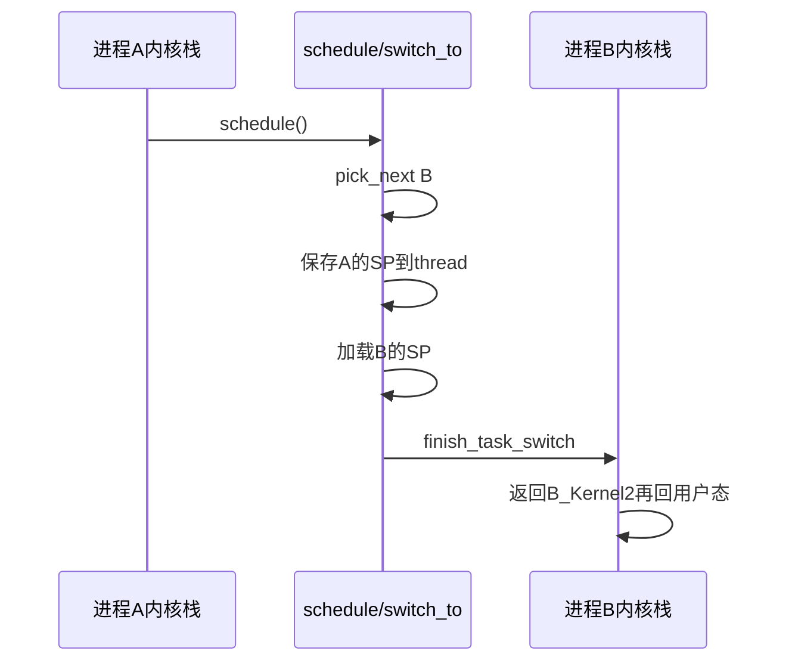

### 2.4 抢占式调度

还遗留最后一个问题：一个运行中的进程是如何被抢占的？在计算机里面有一个时钟，会过一段时间触发一次时钟中断，通知操作系统，时间又过去一个时钟周期，可以查看是否需要抢占的时间点

最常见的现象就是一个进程执行时间太长了，是时候切换到另一个进程了。时钟会过一段时间触发一次时钟中断。时钟中断处理函数会调用 `scheduler_tick()`，在这里面会更新当前进程的 `vruntime`，然后调用 `check_preempt_tick`，检查是否是时候被抢占了

当发现当前进程应该被抢占，**不能直接把它踢下来**，而是把它标记为应该被抢占 `TIF_NEED_RESCHED`，要等待当前进程在某个时机可以运行 `schedule`。这都是进程调度第一定律在发挥作用

另外一个可能抢占的场景是当一个进程被唤醒的时候。当一个进程在等待一个 I/O 的时候，会主动放弃 CPU；但是当 I/O 到来的时候，进程往往会被唤醒，就会调用 `check_preempt_curr` 检查是否应该抢占当前进程。如果应该发生抢占，也不是直接踢走当前进程，而是将当前进程标记为应该被抢占

那什么时候是真正抢占的时机呢？

- 对于用户态的进程来讲，从系统调用中返回的那个时刻，是一个被抢占的时机。当发现当前进程被标记 `TIF_NEED_RESCHED` 的时候，当前进程会调用 `schedule` 让出进程。
  - **版本注记**：原文写 `exit_to_usermode_loop`；在 **v4.11.6 / x86** 上对应路径在 `arch/x86/entry/common.c` 的 `prepare_exit_to_usermode` 等，符号名因版本而异，语义相同。
- 对内核态的执行中，被抢占的时机一般发生在 `preempt_enable()` 中。在内核态有的操作不能被中断，所以进行这些操作之前总是先 `preempt_disable()` 关闭抢占，当再次打开的时候，就是一次内核态代码被抢占的机会。
- 在内核态也会遇到中断的情况，当中断返回的时候，返回的仍然是内核态。这个时候也是一个执行抢占的时机，调用的是 `preempt_schedule_irq`，里面会在需要的时候调用 `schedule`

1、抢占式调度最常见的是，一个进程执行时间太长了，是时候切换到另一个进程运行了。如何衡量一个进程的运行时间呢？在计算机里面有一个时钟，会过一段时间触发一次时钟中断，通知操作系统，时间又过去一个时钟周期，可以查看是否需要抢占的时间点。时钟中断处理函数会调用`scheduler_tick()`，在这里面会更新新当前（正在运行）进程的`vruntime`，然后调用`check_preempt_tick`，检查是否是时候被抢占了。当发现当前进程应该被抢占，不能直接把它踢下来，而是把它标记为应该被抢占`TIF_NEED_RESCHED`，要等待当前进程在某个时机可以运行`schedule`

2、另外一个抢占式调度的场景是当一个进程被唤醒时候。当一个进程在等待一个I/O的时候，会主动放弃CPU。但是当I/O到来的时候，进程往往会被唤醒（内核通过`wake_up_process`[函数](https://elixir.bootlin.com/linux/v4.11.6/source/kernel/sched/core.c#L2138)唤醒此进程的`task_struct`），就会调用了`check_preempt_curr`检查是否应该抢占当前进程。如果应该发生抢占，也不是直接踢走当前进程，而是将当前进程标记为应该被抢占`TIF_NEED_RESCHED`，同样等待前进程在某个时机可以运行`schedule`


3、那什么时候是真正抢占的时机呢？对于用户态的进程来讲，从系统调用中返回的那个时刻，是一个被抢占的时机。在`exit_to_usermode_loop`里面，当发现当前进程被标记`TIF_NEED_RESCHED`的时候，当前进程会调用`schedule`让出CPU；而对内核态的执行中，被抢占的时机一般发生在`preempt_enable()`中，在内核态的执行中，有的操作是不能被中断的，所以在进行这些操作之前，总是先调用`preempt_disable()`关闭抢占，当再次打开的时候，就是一次内核态代码被抢占的机会。在`preempt_enable()`中，同样是当发现当前进程被标记为`TIF_NEED_RESCHED`的时候，当前进程会调用`schedule`让出CPU

4、此外，在内核态也会遇到中断的情况，当中断返回的时候，返回的仍然是内核态。这个时候也是一个执行抢占的时机，从中断返回内核的，调用的是`preempt_schedule_irq`，里面会在需要的时候调用`schedule`让出当前进程

至此，内核的调度机制白话部分介绍完成

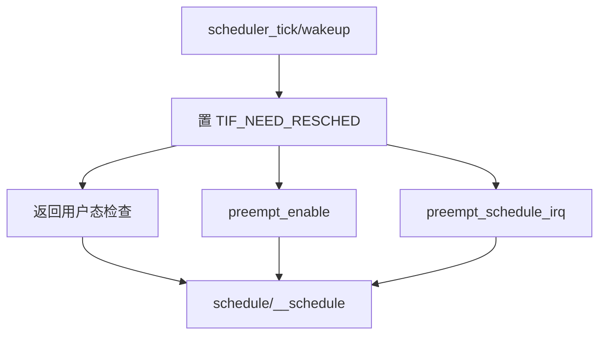

---

## 0x03 进程调度：名词与框架


### 调度类 `sched_class`
在Linux中，公共部分抽象为 `struct sched_class`，使用`struct sched_class`结构体描述一个具体的调度类。核心调度通过其成员调用具体算法：

```cpp
struct sched_class {
	const struct sched_class *next; // 指向更低优先级调度类
   //next成员指向下一个调度类（比自己低一个优先级）。在Linux中，每一个调度类都是有明确的优先级关系，高优先级调度类管理的进程会优先获得cpu使用权
  //入队操作，向该调度器管理的runqueue中添加一个进程
  void (*enqueue_task) (struct rq *rq, struct task_struct *p, int flags);
	
  // 出队操作，向该调度器管理的runqueue中删除一个进程
  void (*dequeue_task) (struct rq *rq, struct task_struct *p, int flags);
	
  //当一个进程被唤醒或者创建的时候，需要检查当前进程是否可以抢占当前cpu上正在运行的进程，如果可以抢占需要标记TIF_NEED_RESCHED flag
  void (*check_preempt_curr)(struct rq *rq, struct task_struct *p, int flags);
	
  //从runqueue中选择一个最适合运行的task，依据什么挑选最适合运行的进程？
  struct task_struct * (*pick_next_task)(struct rq *rq, struct task_struct *prev, struct rq_flags *rf);
	......
};
```

每一个进程都对应一种调度策略（每一个进程在创建之后，总是要选择一种调度策略），每一种调度策略又对应一种调度类（每一个调度类可以对应多种调度策略），其中stop调度器和idle-task调度器，仅由内核使用

即每个进程对应一种调度策略，策略映射到调度类

| 调度类 | 描述 | 调度策略 | 意义 |
| :----- | :---- | :---- | :---- |
| `stop_sched_class` | stop | （内核） | 最高优先级，可抢占几乎一切 |
| `dl_sched_class` | Deadline | `SCHED_DEADLINE` | 按绝对截止期排序 |
| `rt_sched_class` | 实时 | `SCHED_FIFO`、`SCHED_RR` | 每优先级一条队列 |
| `fair_sched_class` | CFS | `SCHED_NORMAL`、`SCHED_BATCH`、`SCHED_IDLE` | 完全公平 |
| `idle_sched_class` | idle | （idle 线程） | 无事可做时跑 idle |

策略含义简述：

- `SCHED_DEADLINE`：限期进程调度策略，使task选择Deadline调度器来调度运行
- `SCHED_RR`：实时时间片轮转，进程用完时间片后加入优先级对应运行队列的尾部，把CPU让给同优先级的其他进程，属于实时进程调度策略
- `SCHED_FIFO`：实时先进先出，无时间片，同优先级需主动让出。属于实时进程调度策略，先进先出调度没有时间片，没有更高优先级的情况下，只能等待主动让出CPU
- `SCHED_NORMAL` / `SCHED_BATCH` / `SCHED_IDLE`：走 CFS（IDLE 极低权重），普通进程调度策略


调度类的优先级如下，每一个调度类利用next成员构建单项链表

```TEXT
sched_class_highest----->stop_sched_class
                         .next---------->dl_sched_class
                                         .next---------->rt_sched_class
                                                         .next--------->fair_sched_class
                                                                        .next----------->idle_sched_class
                                                                                         .next = NULL
```

Linux调度核心在选择下一个合适的task运行的时候，会按照上面调度类优先级的顺序遍历各个调度类的`pick_next_task`函数。因此，`SCHED_FIFO`调度策略的实时进程永远比`SCHED_NORMAL`调度策略的普通进程优先运行

```cpp
//负责选择一个即将运行的进程
static inline struct task_struct *pick_next_task(struct rq *rq,
                                                 struct task_struct *prev, struct rq_flags *rf)
{
	const struct sched_class *class;
	struct task_struct *p;

	for_each_class(class) {  /* 按 next 链表从高到低遍历 */
    //按照优先级顺序便利所有的调度类，通过next指针遍历单链表
		p = class->pick_next_task(rq, prev, rf);
		if (p)
			return p;
	}
	.......
}
```

### 就绪队列 runqueue
系统中每个CPU（逻辑核）都会有一个全局的就绪队列（cpu runqueue），结构体为`struct rq`，它是per-CPU类型，即每个cpu上都会有一个`struct rq`结构体，可以减少锁的开销（降低跨核锁竞争）。每一个调度类也有属于自己管理的就绪队列


-   `struct cfs_rq`：CFS调度类的就绪队列，管理就绪态的`struct sched_entity`调度实体，后续通过`pick_next_task`接口从就绪队列中选择最适合运行的调度实体（虚拟时间最小的调度实体）
-   `struct rt_rq`：实时调度器就绪队列
-   `struct dl_rq`：Deadline调度器就绪队列

```cpp
struct rq {
	struct cfs_rq cfs;
	struct rt_rq rt;
	struct dl_rq dl;
	/* ... */
};
```

### cfs_rq的红黑树


```c
//https://elixir.bootlin.com/linux/v4.11.6/source/kernel/sched/sched.h#L397
struct cfs_rq {
	struct load_weight load;  //load：就绪队列权重，就绪队列管理的所有调度实体权重之和
	unsigned int nr_running, h_nr_running;  //nr_running：就绪队列上调度实体的个数

	u64 exec_clock;
	u64 min_vruntime; //min_vruntime：跟踪就绪队列上所有调度实体的最小虚拟时间
#ifndef CONFIG_64BIT
	u64 min_vruntime_copy;
#endif

	struct rb_root tasks_timeline;  //用于跟踪调度实体按虚拟时间大小排序的红黑树的信息
                                  //（包含红黑树的根以及红黑树中最左边节点）
	struct rb_node *rb_leftmost;

	/*
	 * 'curr' points to currently running entity on this cfs_rq.
	 * It is set to NULL otherwise (i.e when none are currently running).
	 */
	struct sched_entity *curr, *next, *last, *skip;
  ......
};
```

---

## 0x04 主调度器：`__schedule` 与 `context_switch`

调度器类型：

- **主调度器**（主动让出）：`__schedule()`，需在内核路径主动调用（或抢占点触发）。本体是`__schedule()`函数，需要在内核代码中主动调用
- **周期性调度器**（定时调度）：`scheduler_tick()`，由 tick 以约 `HZ` 次/秒触发。本体是`scheduler_tick()`函数，周期性调度器则由配合系统的tick时钟中断以每秒`HZ`次的周期性触发

与调度器类型息息相关的概念就是调度时机，即前文提到的两种调度切换方式。调度时机包括定时调度`schedule_tick`和其它进程阻塞时主动让出两种：

- **自愿切换（voluntary）**：因等待资源将 state 改为非 `TASK_RUNNING` 后 `schedule()`。任务由于等待某种资源，将state改为非`RUNNING`状态后，调用`schedule()`主动让出CPU
- **非自愿切换（involuntary）**：仍为 `TASK_RUNNING` 却失去 CPU（时间片用尽、更高优先级、`cond_resched`/`yield` 等）。任务状态仍为`RUNNING`却失去CPU使用权，情况有任务时间片用完/有更高优先级的任务等场景，任务中调用`cond_resched()`或`yield`让出CPU；这里包含的一种场景就与周期性调度器有关系（CFS）

### 主调度器：`__schedule`
主动调度就是进程运行到一半，因为等待 I/O 等操作而主动调用 `schedule()` 函数让出 CPU。关联源码[kernel/sched/core.c `__schedule`](https://elixir.bootlin.com/linux/v4.11.6/source/kernel/sched/core.c#L3363)

```cpp
static void __sched notrace __schedule(bool preempt)
{
	struct task_struct *prev, *next;
	unsigned long *switch_count;
	struct rq_flags rf;
	struct rq *rq;
	int cpu;

	cpu = smp_processor_id();
	rq = cpu_rq(cpu);
	prev = rq->curr;

	local_irq_disable();
	rcu_note_context_switch();

	smp_mb__before_spinlock();
	raw_spin_lock(&rq->lock);
	rq_pin_lock(rq, &rf);

	rq->clock_update_flags <<= 1;

	switch_count = &prev->nivcsw;
	if (!preempt && prev->state) {
		if (unlikely(signal_pending_state(prev->state, prev))) {
			prev->state = TASK_RUNNING;
		} else {
			deactivate_task(rq, prev, DEQUEUE_SLEEP);
			prev->on_rq = 0;
			/* iowait / workqueue worker 等处理 */
		}
		switch_count = &prev->nvcsw;
	}

	if (task_on_rq_queued(prev))
		update_rq_clock(rq);

	next = pick_next_task(rq, prev, &rf);
	clear_tsk_need_resched(prev);
	clear_preempt_need_resched();

	if (likely(prev != next)) {
		rq->nr_switches++;
		rq->curr = next;
		++*switch_count;
		trace_sched_switch(preempt, prev, next);

		rq = context_switch(rq, prev, next, &rf); /* 解锁在切换路径中 */
	} else {
		rq->clock_update_flags &= ~(RQCF_ACT_SKIP|RQCF_REQ_SKIP);
		rq_unpin_lock(rq, &rf);
		raw_spin_unlock_irq(&rq->lock);
	}

	balance_callback(rq);
}
```

要点：

1. `schedule()` → `__schedule(false)`；抢占路径如 `preempt_schedule_common()` → `__schedule(true)`
2. `!preempt && prev->state`：主动睡眠出队，`nvcsw++`；否则倾向 `nivcsw++`
3. `prev == next` 时可能不切换（仍是最该跑的那个）

####  `__schedule`的内核调用例子

1、写入块设备，写入需要一段时间，这段时间用不上CPU

```cpp
//https://elixir.bootlin.com/linux/v4.11.6/source/fs/btrfs/ioctl.c#L641
static void btrfs_wait_for_no_snapshoting_writes(struct btrfs_root *root){
    ......
    do {
        prepare_to_wait(&root->subv_writers->wait, &wait,
                TASK_UNINTERRUPTIBLE);
        writers = percpu_counter_sum(&root->subv_writers->counter);
        if (writers)
            schedule();
        finish_wait(&root->subv_writers->wait, &wait);
    } while (writers);
}
```

2、从 Tap 网络设备等待一个读取

```cpp
static ssize_t tap_do_read(struct tap_queue *q,
            struct iov_iter *to,
            int noblock, struct sk_buff *skb){
    ......
    while (1) {
        if (!noblock)
            prepare_to_wait(sk_sleep(&q->sk), &wait,
                    TASK_INTERRUPTIBLE);
        ......
        /* Nothing to read, let's sleep */
        schedule();
    }
    ......
}
```

类似的case 在 Linux 内核中非常多，它们会把进程设置为 `D` 状态（`TASK_UNINTERRUPTIBLE`），主要集中在 disk I/O 的访问和信号量（Semaphore）锁的访问上

### `context_switch` 两段式

源码：[context_switch](https://elixir.bootlin.com/linux/v4.11.6/source/kernel/sched/core.c#L2838)

```cpp
//https://elixir.bootlin.com/linux/v4.11.6/source/kernel/sched/core.c#L2838
context_switch(struct rq *rq, struct task_struct *prev,
	       struct task_struct *next, struct rq_flags *rf)
{
	struct mm_struct *mm, *oldmm;

	prepare_task_switch(rq, prev, next);
	mm = next->mm;
	oldmm = prev->active_mm;

	if (!mm) { /* 内核线程 */
		next->active_mm = oldmm;
		mmgrab(oldmm);
		enter_lazy_tlb(oldmm, next);
	} else
		switch_mm_irqs_off(oldmm, mm, next); /* 地址空间 / CR3 */

	if (!prev->mm) {
		prev->active_mm = NULL;
		rq->prev_mm = oldmm;
	}

	/* ... unlock 准备 ... */
	switch_to(prev, next, prev); /* 寄存器与内核栈 */
	barrier();
	return finish_task_switch(prev);
}
```

todo

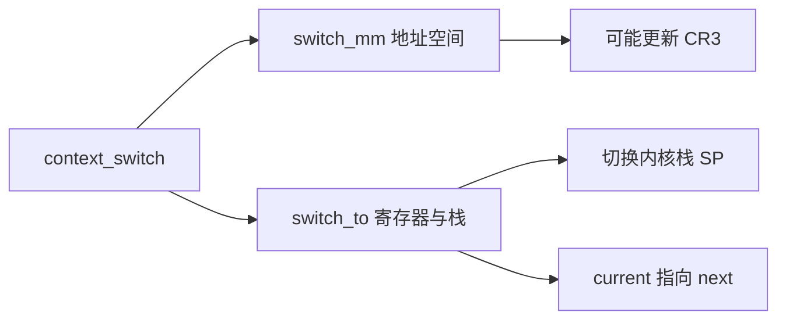

主动让出的典型内核路径示例（等待、读设备等）最终都落到 `schedule()`

---

## 0x05 周期性调度器

系统中每个CPU都会有一个系统定时器，本质上是一个可编程中断时钟。通过配置可以让其每秒生成固定`HZ`个中断。时钟每过一段时间触发一次时钟中断，时钟中断处理函数会调用 `scheduler_tick()`函数，即周期性调度的入口是`scheduler_tick`->`curr->sched_class->task_tick`，时钟节拍最终会调用调度类`task_tick`方法完成调度相关的工作，会在这里判断是否需要调度下一个任务来抢占当前CPU核。也会触发多核之间任务队列的负载均衡，保证不让忙的核忙死，闲的核闲死。在调度节拍中会定时将每个进程所执行过的时间都换算成vruntime，并累计起来，也会定时判断当前进程是否已经执行了足够长的时间，如果是的话，需要再选择另一个vruntime较小的任务来运行

周期性调度通常会引发抢占式调度，所谓的抢占调度，就是A进程运行的时间太长了，会被其他进程抢占。还有一种情况是，有一个进程B原来等待某个I/O事件，等待到了被唤醒，发现比当前正在CPU上运行的进行优先级高，于是进行抢占

由于tick中断发生时，中断处理程序中`scheduler_tick`会根据current进程所属的调度类（`curr->sched_class`）调用不同的`task_tick`方法实现，这里以CFS实现的fair调度类（`task_tick_fair`）简单说明

1. 更新rq（CPU运行队列）的clock和clock_task：关联函数`update_rq_clock()`
2. 更新cfs_rq的min_vruntime以及正在运行task（实际是`struct sched_entity`）的vruntime：关联函数`update_curr()`
3. 更新sched_entity和cfs_rq的平均负载统计：关联函数`update_load_avg()`
4. 检查当前是否需要重新调度并设置`TIF_NEED_RESCHED`：关联函数`check_preempt_tick()`
5. 因为步骤`3`中已经更新了负载，最后一步判断是否进行负载均衡：关联函数`trigger_load_balance()`

再次说明：周期性调度器的`scheduler_tick`部分并不会去主动调度，而是为当前进程设置`TIF_NEED_RESCHED`标志位，tick时钟中断返回时才会根据标志位的状态来调度

周期性调度入口：[scheduler_tick](https://elixir.bootlin.com/linux/v4.11.6/source/kernel/sched/core.c#L3091)

```cpp
//https://elixir.bootlin.com/linux/v4.11.6/source/kernel/sched/core.c#L3091
void scheduler_tick(void)
{
	int cpu = smp_processor_id();
  // 取出当前的cpu及其任务队列
	struct rq *rq = cpu_rq(cpu);
	struct task_struct *curr = rq->curr;

	sched_clock_tick();

  //由于要操作rq，所以提前获取rq的spinlock锁
	raw_spin_lock(&rq->lock);
  //读取cpu clock来更新rq的clock和clock_task
	update_rq_clock(rq);

  //cfs的方法对应task_tick_fair
	curr->sched_class->task_tick(rq, curr, 0);
	cpu_load_update_active(rq);
	calc_global_load_tick(rq);

  //释放rq的spinlock锁
	raw_spin_unlock(&rq->lock);

	perf_event_task_tick();

#ifdef CONFIG_SMP
  //判断是否需要触发负载均衡，是的话则raise sched_softirq
	rq->idle_balance = idle_cpu(cpu);
	trigger_load_balance(rq);
#endif
	rq_last_tick_reset(rq);
}
```

继续，`task_tick_fair---->entity_tick`的实现，只有CFS算法的`task_tick`方法才会调用`entity_tick`函数

```c
//https://elixir.bootlin.com/linux/v4.11.6/source/kernel/sched/fair.c#L8967
static void task_tick_fair(struct rq *rq, struct task_struct *curr, int queued)
{
	struct cfs_rq *cfs_rq;
	struct sched_entity *se = &curr->se;
   /*若是进程数据任务组的话，则逐层为每一个父任务组的cfs_rq调用entity_tick*/

	for_each_sched_entity(se) {
		cfs_rq = cfs_rq_of(se);
		entity_tick(cfs_rq, se, queued);
	}

	......
}

//https://elixir.bootlin.com/linux/v4.11.6/source/kernel/sched/fair.c#L3892
static void
entity_tick(struct cfs_rq *cfs_rq, struct sched_entity *curr, int queued)
{
	/*
	 * Update run-time statistics of the 'current'.
	 */
  //涉及cfs，计算任务运行时间delta，将delta转化为虚拟时间更新到进程的vruntime，并更新rq上的min_vruntime
	update_curr(cfs_rq);

	/*
	 * Ensure that runnable average is periodically updated.
	 */

  //更新负载，包括任务entity和cfs_rq中的平均负载
	update_load_avg(curr, UPDATE_TG);

  //设计组调度部分，包括更新组权重、带宽控制等
	update_cfs_shares(curr);

  ......

	if (cfs_rq->nr_running > 1)
		check_preempt_tick(cfs_rq, curr); //核心：检查vruntime是否需要抢占，并设置TIF_NEED_RESCHED
}
```

CFS 路径：`task_tick_fair` → `entity_tick`：

1. `update_curr()`：更新 `vruntime` / `min_vruntime`
2. `update_load_avg()`：负载统计
3. `check_preempt_tick()`：必要时 `resched_curr()` → `TIF_NEED_RESCHED`
4. tick 末尾可能 `trigger_load_balance`

####  update_curr的实现

`update_curr`函数（CFS的核心函数），其主要功能是针对`task_struct.sched_entity.vruntime`（进程的虚拟运行时间），如果一个进程在运行，随着时间的增长（一个个 tick 的到来）进程的 `vruntime` 将不断增大。没有得到执行的进程 `vruntime` 不变，最后尽量保证所有进程的vruntime相等

```c
//https://elixir.bootlin.com/linux/v4.11.6/source/kernel/sched/fair.c#L844
static void update_curr(struct cfs_rq *cfs_rq)
{
	struct sched_entity *curr = cfs_rq->curr;
	u64 now = rq_clock_task(rq_of(cfs_rq));
	u64 delta_exec;

	if (unlikely(!curr))
		return;

	delta_exec = now - curr->exec_start;
	if (unlikely((s64)delta_exec <= 0))
		return;

	curr->exec_start = now;

	schedstat_set(curr->statistics.exec_max,
		      max(delta_exec, curr->statistics.exec_max));

	curr->sum_exec_runtime += delta_exec;
	schedstat_add(cfs_rq->exec_clock, delta_exec);

  //delta_exec：实际运行时间
	curr->vruntime += calc_delta_fair(delta_exec, curr);
	update_min_vruntime(cfs_rq);

	if (entity_is_task(curr)) {
		struct task_struct *curtask = task_of(curr);

		trace_sched_stat_runtime(curtask, delta_exec, curr->vruntime);
		cpuacct_charge(curtask, delta_exec);
		account_group_exec_runtime(curtask, delta_exec);
	}

	account_cfs_rq_runtime(cfs_rq, delta_exec);
}

//https://elixir.bootlin.com/linux/v4.11.6/source/kernel/sched/fair.c#L657
/*
NICE_0_LOAD宏对应的是1024，如果权重是1024，那么vruntime 就正好等于实际运行时间，否则会进入__calc_delta 来根据权重和实际运行时间折算一个vruntime增量。如果weight 较高，则同样实际运行时间算出来的vruntime 就会偏小，就会在调度中获取更多的cpu，cfs 就是这样实现了cpu资源按权重分配
*/
static inline u64 calc_delta_fair(u64 delta, struct sched_entity *se)
{
	if (unlikely(se->load.weight != NICE_0_LOAD)){
    /* delta_exec * weight / lw.weight */
    //虚拟运行时间 vruntime += 实际运行时间 delta_exec * NICE_0_LOAD/ 权重
		delta = __calc_delta(delta, NICE_0_LOAD, &se->load);
  }

	return delta;
}
```

####  entity_tick-->check_preempt_tick
`check_preempt_tick`详解（CFS的核心函数），它的主要工作内容则是检查此时是否应该发生重新调度，然后`resched_curr()`去设置`TIF_NEED_RESCHED`标志位

```c
//https://elixir.bootlin.com/linux/v4.11.6/source/kernel/sched/fair.c#L3736
static void
check_preempt_tick(struct cfs_rq *cfs_rq, struct sched_entity *curr)
{
	unsigned long ideal_runtime, delta_exec;
	struct sched_entity *se;
	s64 delta;

	//计算出当前进程此次运行理想的时间片应是多少（当前进程在本次调度中分配的运行时间）
  //TODO：sched_slice在CFS算法的分析文章中解析
  ideal_runtime = sched_slice(cfs_rq, curr);
  //算出进程从上次开始运行到现在一共跑了多长时间（当前进程已经运行的实际时间）
	delta_exec = curr->sum_exec_runtime - curr->prev_sum_exec_runtime;
  //若运行时间已经超过了理应分到的时间片，则说明该重新调度了
	if (delta_exec > ideal_runtime) {
    //为curr进程设置need_resched
    //如果实际运行时间已经超过分配给进程的运行时间，就需要抢占当前进程，在resched_curr函数中设置进程的TIF_NEED_RESCHED抢占标志
		resched_curr(rq_of(cfs_rq));
		/*
		 * The current task ran long enough, ensure it doesn't get
		 * re-elected due to buddy favours.
		 */
		clear_buddies(cfs_rq, curr);
		return;
	}

	/*
	 * Ensure that a task that missed wakeup preemption by a
	 * narrow margin doesn't have to wait for a full slice.
	 * This also mitigates buddy induced latencies under load.
	 */
  //若运行时间小于最小调度运行时间粒度，则不需要重新调度
  //说明：由于cfs有一个调度周期sysctl_sched_latency的概念，即在一个固定的调度周期内cfs_rq上的所有进程都要被运行一遍，所以同时会存在一个最小调度时间粒度sysctl_sched_min_granularity的概念，若当前进程运行时间小于这个粒度则不会重新调度
	if (delta_exec < sysctl_sched_min_granularity)
		return;

	//从红黑树中找到虚拟时间最小的调度实体（即最左孩子节点）
  se = __pick_first_entity(cfs_rq);
	delta = curr->vruntime - se->vruntime;

	//若当前进程的vruntime小于cfs_rq上（红黑树）的最左边的vruntime（红黑树中最左边调度实体虚拟时间）则不需要重新调度
  if (delta < 0)
		return;

	if (delta > ideal_runtime)
		resched_curr(rq_of(cfs_rq));
}
```

**再次强调**：tick 里通常**不直接切换**，只打标志；真正切换在返回路径 / 抢占点调用 `__schedule`。

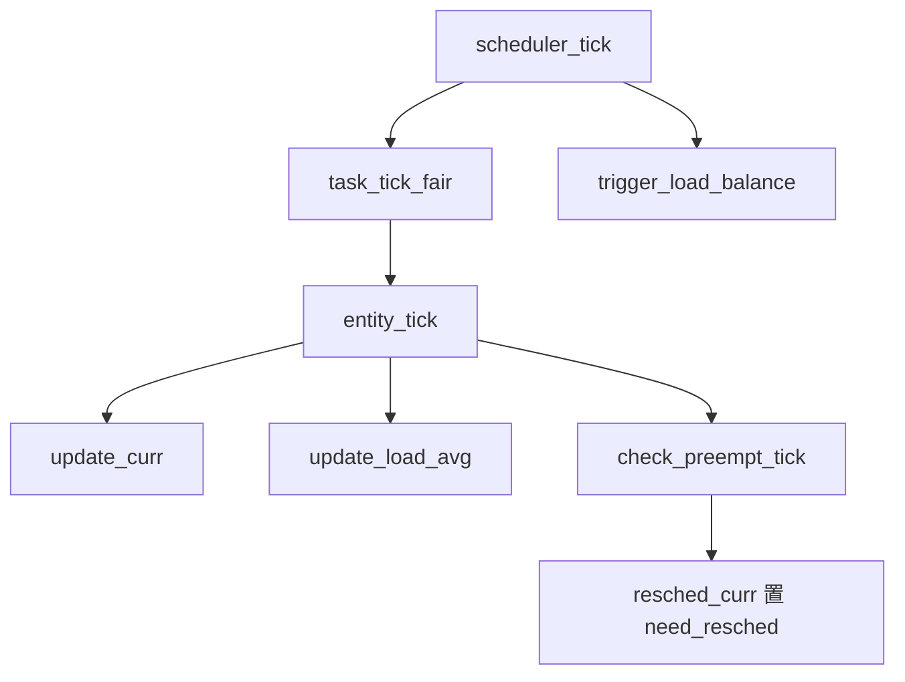

小结下周期性调度的流程，对于普通进程 `scheduler_tick` ==> `fair_sched_class.task_tick_fair` ==> `entity_tick` ==> `update_curr` 更新当前进程的 `vruntime` ==> `check_preempt_tick` 检查是否是时候被抢占；再强调一点，当发现当前进程应该被抢占，不能直接把它踢下来，而是把它标记为应该被抢占（因为根据进程调度第一定律，一定要等待正在运行的进程调用 `__schedule` 主动让出CPU才行）

---

## 0x06 CFS 核心概念介绍

### 权重与 nice

nice值`nice ∈ [-20, 19]` 映射到权重表 [`sched_prio_to_weight`](https://elixir.bootlin.com/linux/v4.11.6/source/kernel/sched/core.c#L7288)。nice `0` 权重为 `1024`（`NICE_0_LOAD`）。**对 CFS 用户进程，nice 是权重而非实时抢占优先级**：权重大 → 同样真实时间折算出的 `vruntime` 增量更小 → 更易保持「落后」从而多跑

### `vruntime` 与 `calc_delta_fair`

```cpp
/* fair.c */
curr->vruntime += calc_delta_fair(delta_exec, curr);

static inline u64 calc_delta_fair(u64 delta, struct sched_entity *se)
{
	if (unlikely(se->load.weight != NICE_0_LOAD))
		delta = __calc_delta(delta, NICE_0_LOAD, &se->load);
	/* 近似：vruntime += delta_exec * NICE_0_LOAD / weight */
	return delta;
}
```

### `sched_slice`

默认调度周期 `sysctl_sched_latency`（本文内核版本默认约 `6ms`），最小粒度 `sysctl_sched_min_granularity`（约 `0.75ms`）。任务过多时周期拉长以免切片过碎

含义：当前实体在本轮调度周期内「理想」应跑的真实时间份额

```cpp
static u64 sched_slice(struct cfs_rq *cfs_rq, struct sched_entity *se)
{
	u64 slice = __sched_period(cfs_rq->nr_running + !se->on_rq);
	for_each_sched_entity(se) {
		/* slice = period * se.weight / cfs_rq.load.weight */
		slice = __calc_delta(slice, se->load.weight, load);
	}
	return slice;
}
```

### entity_tick--->check_preempt_tick

```cpp
check_preempt_tick(struct cfs_rq *cfs_rq, struct sched_entity *curr)
{
	ideal_runtime = sched_slice(cfs_rq, curr);
	delta_exec = curr->sum_exec_runtime - curr->prev_sum_exec_runtime;
	if (delta_exec > ideal_runtime) {
		resched_curr(rq_of(cfs_rq));
		clear_buddies(cfs_rq, curr);
		return;
	}
	if (delta_exec < sysctl_sched_min_granularity)
		return;
	se = __pick_first_entity(cfs_rq); /* 红黑树最左 = 最小 vruntime */
	delta = curr->vruntime - se->vruntime;
	if (delta < 0)
		return;
	if (delta > ideal_runtime)
		resched_curr(rq_of(cfs_rq));
}
```

### 入队 / 出队与红黑树

- `__enqueue_entity`：按 `vruntime` 插入 `tasks_timeline`（rbtree的根），维护 `rb_leftmost`
- `__pick_first_entity`：直接取 `rb_leftmost`（`O(1)` 找最小）
- 当前运行实体通常不在树中（`curr`），更新 `vruntime` 后比较是否该让位

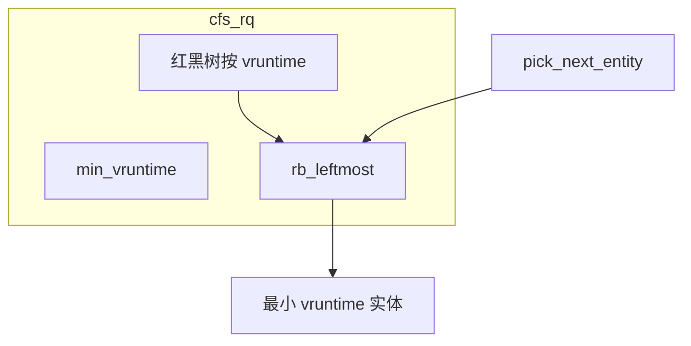

---

## 0x07 抢占模型

### 谁置 `TIF_NEED_RESCHED`，谁真正 `__schedule`

| 场景 | 置标志 | 真正调度 |
| ---- | ------ | -------- |
| tick 超时片 / vruntime 落后 | `resched_curr` | 返回用户态 / preempt 点 |
| 唤醒更高权任务 | `check_preempt_curr` | 同上 |
| 新 fork 子进程 | `check_preempt_curr(..., WF_FORK)` | 父进程 syscall 返回 |
| 主动阻塞 | 直接 `schedule()` | 立即 `__schedule(false)` |

### 用户态抢占 vs 内核抢占

todo

- **用户态**：syscall/异常返回用户前检查 `need_resched`（`prepare_exit_to_usermode` [路径](https://elixir.bootlin.com/linux/v4.11.6/source/arch/tile/kernel/process.c#L478)）
- **内核态**：依赖 `CONFIG_PREEMPT*`；`preempt_count` 非 `0` 时不可抢占；`preempt_enable()` 降为 `0` 且 `need_resched` 则可 `preempt_schedule`
- **中断返回内核**：`preempt_schedule_irq`

三种内核抢占配置（概念）：`PREEMPT_NONE` / `VOLUNTARY` / `PREEMPT`，越往后内核中可抢占点越多，延迟越低，吞吐与复杂度权衡不同

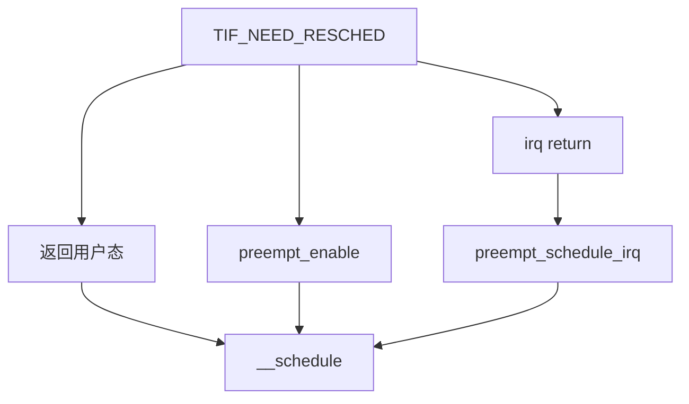

---

## 0x08 唤醒路径：`wake_up_process` / `try_to_wake_up`

源码：[`wake_up_process`](https://elixir.bootlin.com/linux/v4.11.6/source/kernel/sched/core.c#L2138) → [`try_to_wake_up`](https://elixir.bootlin.com/linux/v4.11.6/source/kernel/sched/core.c#L1964)

```cpp
int wake_up_process(struct task_struct *p)
{
	return try_to_wake_up(p, TASK_NORMAL, 0);
}
```

`try_to_wake_up` 三段逻辑（SMP）：

1. **状态匹配**：`p->state & state` 否则直接失败；打 `trace_sched_waking`
2. **已在 rq 上**：`ttwu_remote` 尝试远端唤醒（可能只改状态 / 触发抢占检查）
3. **不在 rq**：等 `on_cpu` 清零 → `select_task_rq`（`SD_BALANCE_WAKE`）→ 可能 `set_task_cpu` → `ttwu_queue` 入队 → 最终 `ttwu_do_wakeup` / `check_preempt_curr`

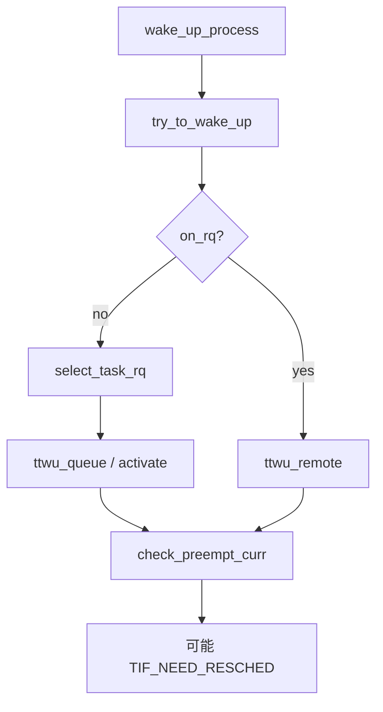

与新进程路径对比：`wake_up_new_task` 用 `SD_BALANCE_FORK`，并 `activate_task` + `check_preempt_curr(..., WF_FORK)`（见 `0x0A`章节）

todo

---

## 0x09 进程调度延迟（可观测）

Linux内核为观测CPU运行队列运行指标（主要是调度延迟）提供了三个经典的tracepoint hook，代码基于[5.4.241](https://elixir.bootlin.com/linux/v5.4.241/source/kernel/sched/core.c#L4085)版本

前面已经介绍，调度分为两类 Voluntary Switch和 Involuntary Switch，而且调度时并不是立即切换，所以必然存在一定的调度延迟。所谓调度延迟，是指一个任务具备运行的条件（新创建进入 CPU 的 runqueue OR 抢占调度准备完成），到真正执行（获得 CPU 的执行权）的这段时间。那为什么会有调度延迟呢？因为 CPU 还被其他任务占据，还没有空出来，而且可能还有其他在 runqueue 中排队的任务；排队的任务越多，调度延迟就可能越长，所以这也是间接衡量 CPU 负载的一个指标（CPU 负载通过计算各个时刻 runqueue 上的任务数量获得）

```cpp
wake_up_process() --> ttwu_do_wakeup() --> trace_sched_wakeup   //抢占式调度
_do_fork() -->wake_up_new_task() --> trace_sched_wakeup_new   //新进程创建调度
__schedule() --> trace_sched_switch             // 
```

> 本章 **tracepoint / 部分调用链** 以 [Linux v5.4.241](https://elixir.bootlin.com/linux/v5.4.241/source/kernel/sched/core.c) 为例；**voluntary / involuntary 判定逻辑与 4.11.6 `__schedule` 一致**

调度延迟：任务具备运行条件（新入队或唤醒）到真正获得 CPU 的时间间隔。排队越多，延迟可能越长，也间接反映负载。

典型 hook：

```text
wake_up_process → ttwu_do_wakeup → trace_sched_wakeup
_do_fork → wake_up_new_task → trace_sched_wakeup_new
__schedule → trace_sched_switch
```

### 切换类型
在 CFS 调度中，当一个task_struct因访问 I/O 资源暂时不可获得而主动让出 CPU，自然是 Voluntary Switch，而一个task_struct因 vruntime 处于劣势而被抢占，自然是 Involuntary Switch。考虑这种情况：如果是任务主动调用 `cond_resched()`，当 need schedule 标志位满足条件，就实施调度的情况呢？属于哪种？
`/proc/<pid>/sched` 中 `nr_voluntary_switches` / `nr_involuntary_switches` 对应 `task_struct` 的 `nvcsw` / `nivcsw`

```bash
[root@VM-X-X-centos ~]# cat /proc/2689622/sched
scpserver (2689622, #threads: 6)
-------------------------------------------------------------------
se.exec_start                                :   68001639204.231892
se.vruntime                                  :     900444917.762884
se.sum_exec_runtime                          :             4.215309
se.nr_migrations                             :                    4
nr_switches                                  :                    8
nr_voluntary_switches                        :                    8
nr_involuntary_switches                      :                    0
......
```

对应成员为：

```c
struct task_struct {
    ......
    /* Context switch counts: */
    unsigned long  nvcsw;
    unsigned long  nivcsw;
    ......
}
```

从`__schedule`的实现来看，两个因素：

1.  取决于调用 `__schedule()` 的入参`preempt`是 `false/true`
2.  取决于 switch out 的任务（即 prev）的状态，这里判断 `prev->state` 是否为 `0`，其实是判断状态是否为 `TASK_RUNNING`

```c
schedule() --> __schedule(false);
preempt_schedule_common() --> __schedule(true)
```

因此，如果入参是 `false`且 `prev->state` 非`TASK_RUNNING`，那么就被归为 voluntary switch；否则为involuntary switch

在下面引用的这段[代码块](https://elixir.bootlin.com/linux/v5.4.241/source/kernel/sched/core.c#L4103)中，有几处细节：

1、`!preempt/*preempt为false才有可能进入此块*/ && prev->state`这个条件什么情况下才会触发？即`prev->state`为何不是`TASK_RUNNING`状态？（被切出的任务怎么会不是 TASK_RUNNING 状态呢？）
在进入 `__schedule` 函数的时候，prev task 肯定是还占据着 CPU 的，但该状态是可以被设置的，比如，调用 `wait_event_xxx` 系列宏的时候，就会设置当前 task 的状态为 `INTERRUPTIBLE/UNINTERRUPTIBLE`

2、从`if (likely(prev != next))`这块代码可知，`likely`为大概率事件，即大概率会发生切换switch（`prev != next`成立），所以在这段代码中才进行计数累加

3、如果上面的`if`判断为false，`prev==next`的情况，即满足如果调用 `pick_next_task()` 经 scheduler 再次选择后，prev 的 vruntime还是最小，还是该它执行，那也是不会切换的

```c
//https://elixir.bootlin.com/linux/v5.4.241/source/kernel/sched/core.c#L4103
static void __sched notrace __schedule(bool preempt)
{
	struct task_struct *prev, *next;
	unsigned long *switch_count;
	struct rq_flags rf;
	struct rq *rq;
	int cpu;

	cpu = smp_processor_id();
	rq = cpu_rq(cpu);
	prev = rq->curr;

	schedule_debug(prev, preempt);

	if (sched_feat(HRTICK))
		hrtick_clear(rq);

	local_irq_disable();
	rcu_note_context_switch(preempt);

	rq_lock(rq, &rf);
	smp_mb__after_spinlock();

	/* Promote REQ to ACT */
	rq->clock_update_flags <<= 1;
	update_rq_clock(rq);
  //switch_count为nivcsw
	switch_count = &prev->nivcsw;
	if (!preempt/*preempt为false才有可能进入此块*/ && prev->state) {
		if (signal_pending_state(prev->state, prev)) {
			prev->state = TASK_RUNNING;
		} else {
			deactivate_task(rq, prev, DEQUEUE_SLEEP | DEQUEUE_NOCLOCK);

			if (prev->in_iowait) {
				atomic_inc(&rq->nr_iowait);
				delayacct_blkio_start();
			}
		}
    //switch_count为nvcsw
		switch_count = &prev->nvcsw;
	}

	next = pick_next_task(rq, prev, &rf);
	clear_tsk_need_resched(prev);
	clear_preempt_need_resched();

	if (likely(prev != next)) {
    // switch_count累加的代码
		rq->nr_switches++;
		/*
		 * RCU users of rcu_dereference(rq->curr) may not see
		 * changes to task_struct made by pick_next_task().
		 */
		RCU_INIT_POINTER(rq->curr, next);
		/*
		 * The membarrier system call requires each architecture
		 * to have a full memory barrier after updating
		 * rq->curr, before returning to user-space.
		 *
		 * Here are the schemes providing that barrier on the
		 * various architectures:
		 * - mm ? switch_mm() : mmdrop() for x86, s390, sparc, PowerPC.
		 *   switch_mm() rely on membarrier_arch_switch_mm() on PowerPC.
		 * - finish_lock_switch() for weakly-ordered
		 *   architectures where spin_unlock is a full barrier,
		 * - switch_to() for arm64 (weakly-ordered, spin_unlock
		 *   is a RELEASE barrier),
		 */
		++*switch_count;

		trace_sched_switch(preempt, prev, next);

		/* Also unlocks the rq: */
		rq = context_switch(rq, prev, next, &rf);
	} else {
		rq->clock_update_flags &= ~(RQCF_ACT_SKIP|RQCF_REQ_SKIP);
		rq_unlock_irq(rq, &rf);
	}

	balance_callback(rq);
}
```

小结下判定思路：

1. `__schedule(preempt)` 的 `preempt` 参数
2. `prev->state` 是否非 0（非 `TASK_RUNNING`）

→ `!preempt && prev->state`：自愿；否则非自愿。

`cond_resched()`：若触发调度时任务仍为 `TASK_RUNNING` 且走 preempt 语义，通常计为 **involuntary**。

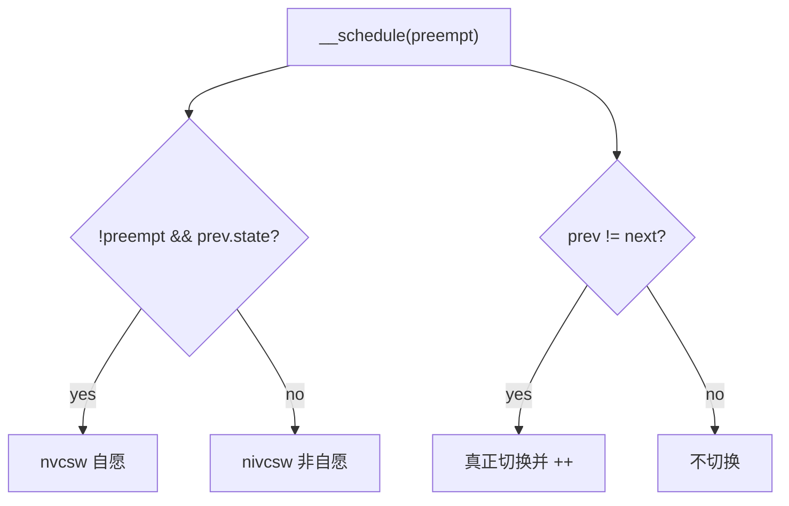

### 如何算延迟（观测思路）
1.  当前正在CPU运行的任务`task_struct`因等待某种事件进入休眠态（Voluntary Switch），那么就是从被唤醒（`wakeup`/`wakeup_new` 的时间点），到获得 CPU （任务切换时的 `next_pid`）的间隔
2.  任务因 Involuntary Switch 让出 CPU（任务切换时作为 `prev_pid`），到再次获得 CPU （之后的某次任务切换时作为`next_pid`）所经历的时间。在这期间，任务始终在 runqueue 上，始终是 runnable 的状态，所以有 `prev_state` 是否为 `TASK_RUNNING` 的判断

- **自愿让出后再跑**：从 `wakeup`/`wakeup_new` 到作为 `next` 上 CPU 的间隔
- **非自愿让出后再跑**：作为 `prev` 被切下（且仍 runnable）到再次作为 `next` 的间隔

---

## 0x0A 新进程的调度策略与时机
本小节讨论下，新创建的进程如何被内核调度执行到？

### 核心问题

1. 进程不主动释放 CPU 时，每次调度最少能跑多久？
2. nice 是「优先级抢占」吗？高 nice 权重能否实时抢走低权重任务的 CPU？

### 关键结论

- 每逻辑 CPU 一个 `struct rq`（`DEFINE_PER_CPU_SHARED_ALIGNED(struct rq, runqueues)`），内含 `rt_rq` + `cfs_rq` 等
- 用户进程默认 `fair_sched_class`；实时类用多优先级队列（`MAX_RT_PRIO=100`）
- fork 后：`sched_fork` 初始化调度字段 → `wake_up_new_task` 选 CPU、入队、抢占检查
- CFS 下最短持续运行受 `kernel.sched_min_granularity_ns` 约束（减少频繁切换）；主动阻塞另论
- **CFS 的 nice 是权重，不是 RT 那种硬抢占优先级**

### 相关的内核函数

[`wake_up_new_task`](https://elixir.bootlin.com/linux/v4.11.6/source/kernel/sched/core.c#L2536)：

```cpp
void wake_up_new_task(struct task_struct *p)
{
	/* ... */
	p->state = TASK_RUNNING;
#ifdef CONFIG_SMP
	__set_task_cpu(p, select_task_rq(p, task_cpu(p), SD_BALANCE_FORK, 0));
#endif
	rq = __task_rq_lock(p, &rf);
	update_rq_clock(rq);
	post_init_entity_util_avg(&p->se);
	activate_task(rq, p, 0);
	p->on_rq = TASK_ON_RQ_QUEUED;
	trace_sched_wakeup_new(p);
	check_preempt_curr(rq, p, WF_FORK);
	/* ... task_woken ... */
}
```

选 CPU 时在「缓存亲和」与「空闲核」间权衡：优先共享 L1/L2 的 SMT 兄弟，其次同 LLC，再跨 socket（细节在 `select_task_rq_fair`，SMP 负载均衡专章展开）。

`sched_fork` 要点：非 RT 则 `p->sched_class = &fair_sched_class`；`se.vruntime` 等在 `__sched_fork` 清零，随后公平调度会按 `cfs_rq` 校准初始虚拟时间，避免新进程靠「0」饿死老进程。

### Mermaid：fork 后半段到首次执行

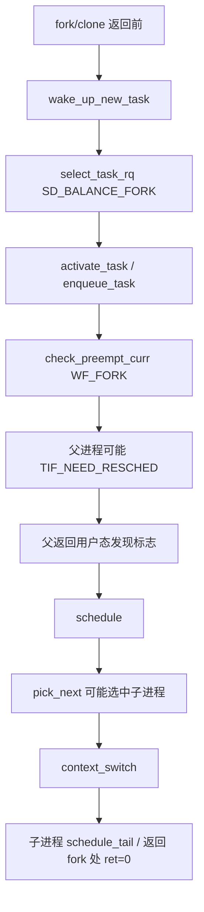

**版本差异注记**：部分文章写 `cfs_rq.tasks_timeline` 为 `rb_root_cached`；**v4.11.6 为 `rb_root` + `rb_leftmost`**。`do_fork` 在 4.11 中对外接口为 `_do_fork` / `do_fork` 包装

---

## 0x0B Linux 进程是如何创建过程
包含两个部分内容：
1.   `fork` **前半段**实现（结构如何复制）
2.  **后半段**（如何入队并首次执行）

### `task_struct` 关键字段图谱

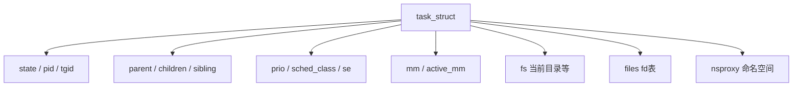

- `state`：运行/可中断睡眠/不可中断睡眠等；注意 **`TASK_RUNNING` 同时覆盖「正在跑」与「在 rq 上就绪」**两种场景
- `mm`：用户地址空间；内核线程常 `mm==NULL`，用 `active_mm` 借页表
- `files` / `fs` / `nsproxy`：打开文件、cwd/root、namespace
- CoW：`copy_mm` 复制页表项并标只读，写时再真正拆页

### `_do_fork` / `copy_process`

[`_do_fork`](https://elixir.bootlin.com/linux/v4.11.6/source/kernel/fork.c) 核心：

```cpp
long _do_fork(unsigned long clone_flags, ...)
{
	p = copy_process(clone_flags, stack_start, stack_size,
			 child_tidptr, NULL, trace, tls, NUMA_NO_NODE);
	if (!IS_ERR(p)) {
		/* ... tid / vfork ... */
		wake_up_new_task(p);
		/* ... */
	}
	return nr;
}
```

`copy_process` 的核心实现步骤：

1. `dup_task_struct(current)`：新 `task_struct` + 内核栈；先浅拷贝指针
2. `sched_fork(p)`：调度字段
3. `copy_files` / `copy_fs` / `copy_mm` / `copy_namespaces`：无 `CLONE_*` 则共享并 `refcount++`，否则深拷贝
4. `alloc_pid`：pidmap 位图分配 pid（节省内存）
5. 挂进程树关系等

`fork()` 系统调用通常只带 `SIGCHLD`，**不带** `CLONE_VM/FS/FILES`，故得到独立地址空间与 fd 表；`clone`/`pthread_create` 常带 `CLONE_VM` 等共享资源

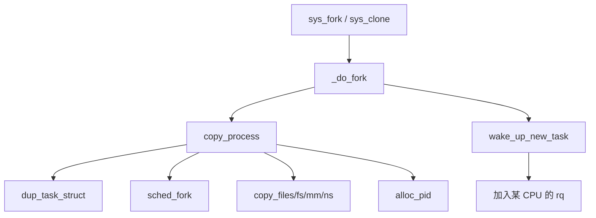

---

## 0x0C Linux 负载 VS CPU 开销
本章节主要讨论 **系统级 loadavg**，相关结论如下：

1. `top` 的 Load Avg 来自 `/proc/loadavg`
2. 瞬时贡献来自各 CPU：`nr_running + nr_uninterruptible`（用户态视角近似 **R + D**）
3. 1/5/15 分钟值是对瞬时负载做 **EWMA**（指数加权移动平均），采样周期 `LOAD_FREQ = 5*HZ+1`（约 5 秒）
4. **负载高 ≠ CPU 忙**：大量 D 状态（等磁盘等）可抬高 loadavg，而 CPU 空闲
5. 内核同时会把不可中断睡眠计入负载：负载应反映对**系统资源整体**的压力，而不只是 CPU

### 实现

[`include/linux/sched/loadavg.h`](https://elixir.bootlin.com/linux/v4.11.6/source/include/linux/sched/loadavg.h)：

```cpp
#define LOAD_FREQ	(5*HZ+1)
#define EXP_1		1884
#define EXP_5		2014
#define EXP_15		2037
```

[`calc_load_fold_active`](https://elixir.bootlin.com/linux/v4.11.6/source/kernel/sched/loadavg.c)：把本 rq 的 running + uninterruptible 相对变化 fold 进全局 `calc_load_tasks`；再周期性 `calc_load` / `calc_load_n` 更新 `avenrun[3]`

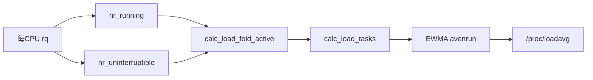

### loadavg vs PELT

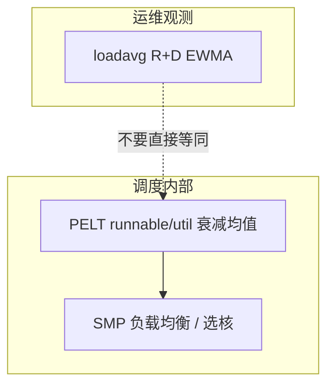

PELT（Per-Entity Load Tracking）服务调度器内部均衡与容量估算；**loadavg 是给管理员看的粗指标**。二者都与「跑队列上有多少活」相关，但窗口、是否含 D、用途都不同

todo

---

## 0x10 参考

- [Linux v4.11.6 elixir](https://elixir.bootlin.com/linux/v4.11.6/source)
- [Linux v5.4.119 elixir（观测扩展）](https://elixir.bootlin.com/linux/v5.4.119/source)
- [万字详解 Linux 内核调度器极其妙用（popsuper1982）](https://mp.weixin.qq.com/s/gkZ0kve8wOrV5a8Q2YeYPQ)
- [你的新进程是如何被内核调度执行到的？（张彦飞）](https://mp.weixin.qq.com/s/y2axbQTzOGZweJn3LAhWvg)
- [Linux进程是如何创建出来的？（张彦飞）](https://mp.weixin.qq.com/s/ftrSkVvOr6s5t0h4oq4I2w)
- [Linux 中的负载高低和 CPU 开销并不完全对应（张彦飞）](https://mp.weixin.qq.com/s/1Pl4tT_Nq-fEZrtRpILiig)
- [（一）Linux进程调度器-基础](https://www.cnblogs.com/LoyenWang/p/12249106.html)
- [（二）Linux进程调度器-CPU负载](https://www.cnblogs.com/LoyenWang/p/12316660.html)
- [（三）Linux进程调度器-进程切换](https://www.cnblogs.com/LoyenWang/p/12386281.html)
- [（四）Linux进程调度器-组调度及带宽控制](https://www.cnblogs.com/LoyenWang/p/12459000.html)
- [（五）Linux进程调度器-CFS](https://www.cnblogs.com/LoyenWang/p/12495319.html)
- [（六）Linux进程调度器-实时调度器](https://www.cnblogs.com/LoyenWang/p/12584345.html)
- [一文搞懂 linux cfs 调度器](https://zhuanlan.zhihu.com/p/556295381)
- [Linux 的调度延迟 - 原理与观测](https://zhuanlan.zhihu.com/p/462728452)
- [Linux 调度 - 切换类型的划分](https://zhuanlan.zhihu.com/p/402423877)
- [CFS调度器（1）-基本原理（wowotech）](http://www.wowotech.net/process_management/447.html)
- [Linux进程调度：主调度器](https://zhuanlan.zhihu.com/p/426395078)
- [Linux进程调度：周期性调度器](https://zhuanlan.zhihu.com/p/426448579)
- [Linux进程调度：调度时机](https://zhuanlan.zhihu.com/p/163728119)
