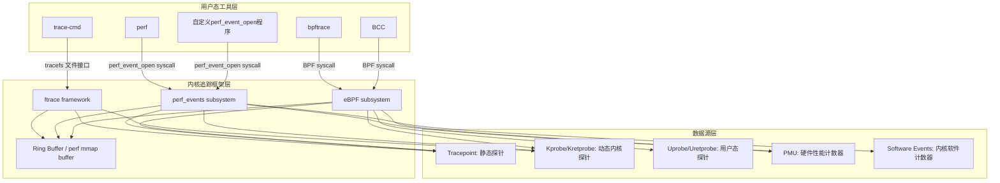
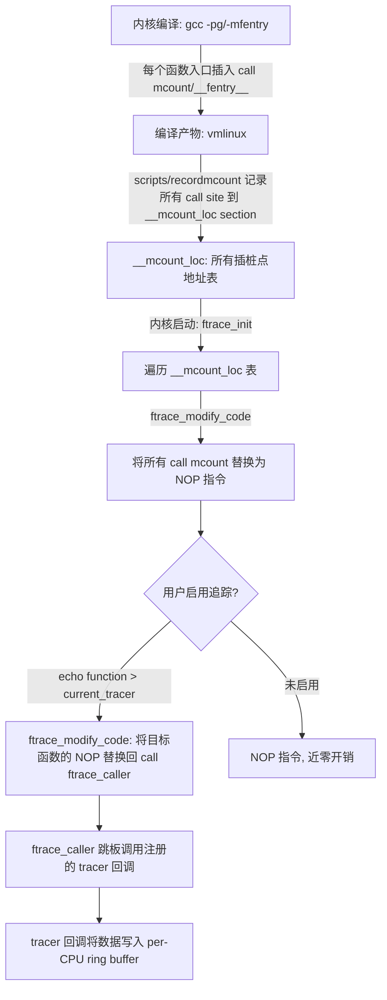
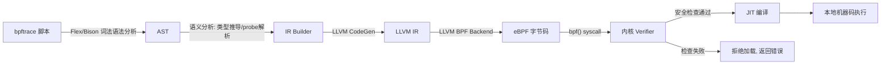
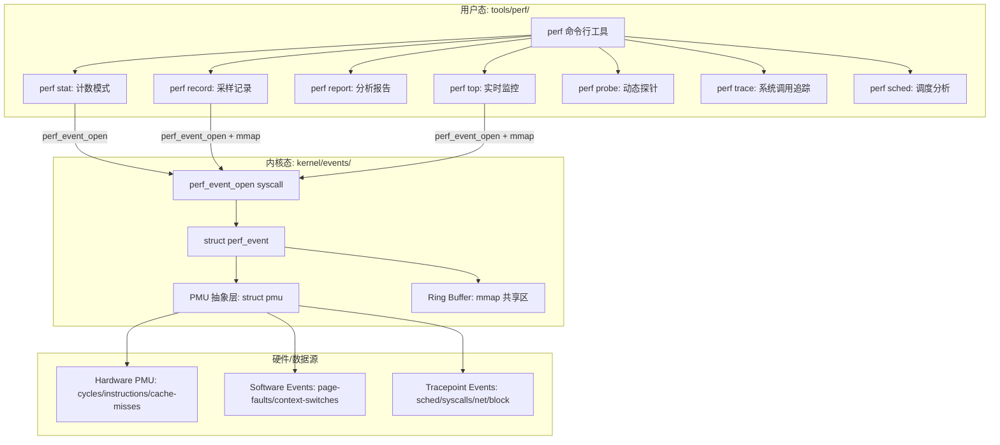
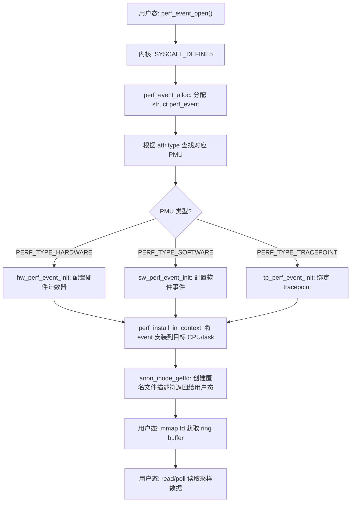
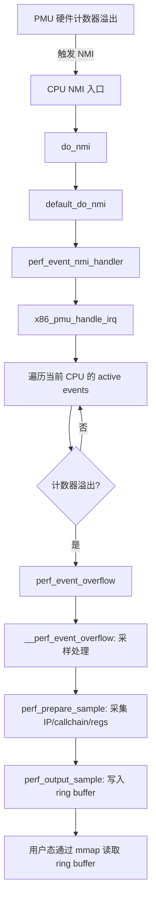
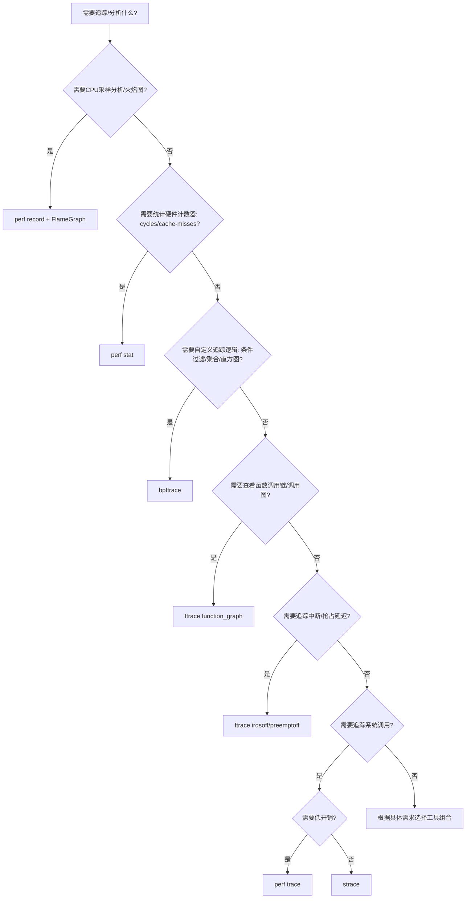

##  0x00    前言
本文 ftrace/perf 内核实现部分的代码引用基于 [v4.11.6](https://elixir.bootlin.com/linux/v4.11.6/source)；bpftrace 依赖 eBPF 子系统，完整功能需要 kernel 4.15+（BTF 支持需要 5.2+），因此 bpftrace 部分以较新内核为参考

追踪类调试工具鸟瞰图


####    性能追踪
-   宏观：通过全链路监控找出整个分布式系统中的瓶颈组件
-   微观：快速地找出进程内的瓶颈函数，从（内核）代码层面直接寻找调用次数最频繁、耗时最长的函数，通常它就是性能瓶颈

####    linux tracing技术


Linux追踪技术的总体架构可以分为三层：用户态工具层、内核追踪框架层、数据源层。用户态工具（如 `perf`/`trace-cmd`/`bpftrace`）通过系统调用或文件系统接口与内核追踪框架交互，内核追踪框架（ftrace/perf_events/eBPF）负责管理探针注册、数据采集和缓冲区，底层数据源包括静态 tracepoint、动态 kprobe/uprobe 以及硬件 PMU 计数器等



1、观测数据源，分为指标&事件两类

指标观测


事件观测


##  0x01    ftrace

####    工作原理
Ftrace的框架图如下，ftrace包括多种类型的tracers，每个tracer完成不同的功能，将这些不同类型的tracers注册进入ftrace framework，各类tracers收集不同的信息，并放入到Ring buffer缓冲区以供调用


从上图可知，Ftrace是基于`debugfs`调试文件系统的，需要先挂载`debugfs`： `mount -t debugfs none /sys/kernel/debug`

```BASH
[root@VM-163-30-centos ]# ls /sys/kernel/debug/
acpi  boot_params  dynamic_debug  fnic  kprobes  rssd            suspend_stats  usb             x86
bdi   dma_buf      extfrag        hid   mce      sched_features  tracing        wakeup_sources
```

####    tracefs文件接口

ftrace通过`tracefs`（挂载于`/sys/kernel/tracing`或`/sys/kernel/debug/tracing`）暴露控制接口，以下是核心文件：

|文件|说明|
|---|---|
|`available_tracers`|列出内核编译时支持的所有tracer类型|
|`current_tracer`|读取/设置当前使用的tracer|
|`trace`|读取trace buffer内容（快照方式，读取时不清空）|
|`trace_pipe`|以管道方式读取trace数据（消费式，读后清空，适合实时监控）|
|`tracing_on`|`1`启用/`0`关闭追踪开关|
|`set_ftrace_filter`|设置只追踪哪些函数（支持通配符，如`*read*`）|
|`set_ftrace_notrace`|设置排除哪些函数|
|`set_ftrace_pid`|限制只追踪指定PID的进程|
|`set_graph_function`|`function_graph` tracer专用，设置只展开哪个函数的调用图|
|`available_filter_functions`|列出所有可追踪的内核函数|
|`buffer_size_kb`|设置per-CPU ring buffer大小|
|`trace_options`|控制各种输出选项（如时间戳格式、显示进程名等）|
|`events/`|目录，包含所有可用的tracepoint事件，按子系统分类|

`trace` vs `trace_pipe`的区别：`trace`是快照读取，多次读取得到相同内容（直到buffer被清空或覆盖）；`trace_pipe`是消费式读取，读后数据从buffer中移除，适合用 `cat trace_pipe` 实时观察事件流

```BASH
#查看内核支持的tracer
[root@VM-X-X-centos tracing]# cat available_tracers
hwlat blk function_graph wakeup_dl wakeup_rt wakeup function nop

#查看可追踪函数数量
[root@VM-X-X-centos tracing]# wc -l available_filter_functions
36547 available_filter_functions
```

####    ftrace的hook机制
1、静态插桩方式

在Kernel中打开了`CONFIG_FUNCTION_TRACER`功能后，会增加`-pg`编译选项，编译器会在每个内核函数的入口处调用一个特殊的汇编函数`mcount` 或 `__fentry__`，如果跟踪功能被打开，`mcount/fentry` 会调用当前设置的 tracer，tracer将不同的数据写入ring buffer

`-pg`与`-mfentry`的区别：
-   `-pg`：GCC传统选项，在函数 prologue（栈帧建立）**之后**插入对 `mcount` 的调用。此时 `%rbp` 已经被压栈，可以通过 frame pointer 回溯调用链
-   `-mfentry`：GCC 4.6+ 支持（x86_64），在函数的**第一条指令之前**插入对 `__fentry__` 的调用。此时栈帧尚未建立，`%rsp` 直接指向返回地址，性能更好且对函数参数无干扰。现代内核（3.x+）优先使用 `-mfentry`

2、动态插桩方式

启用了`CONFIG_DYNAMIC_FTRACE`选项，编译内核时所有的`mcount/fentry`调用点都会被收集记录。编译时记录所有被添加跳转指令的函数，这里表示所有支持追踪的函数。在内核的初始化启动过程中，会根据编译期记录的列表，将`mcount/fentry`调用点替换为`NOP`指令（ no-operation）并直接转到下一条指令。因此在没有开启跟踪功能的情况下，Ftrace不会对内核性能产生任何影响。在开启追踪功能时，Ftrace才会将`NOP`指令动态替换为`mcount/fentry`（这里的动态是指的动态修改函数指令），以实现追踪功能


动态 ftrace 的 NOP patching 流程如下：



`ftrace_modify_code` 的关键之处在于它需要在运行时修改内核代码段的指令。在 x86 上通过 `text_poke` 系列函数实现，该函数使用临时映射绕过代码段的只读保护，并通过 IPI（处理器间中断）确保所有 CPU 看到一致的指令视图

####    Ring Buffer实现

ftrace 使用 per-CPU 的 ring buffer 存储追踪数据，每个 CPU 有独立的 buffer，避免跨 CPU 锁竞争。内核实现位于 [`kernel/trace/ring_buffer.c`](https://elixir.bootlin.com/linux/v4.11.6/source/kernel/trace/ring_buffer.c)

-   **per-CPU 设计**：每个 CPU 维护独立的 `ring_buffer_per_cpu` 结构，写入时无需锁（因为只有当前 CPU 写自己的 buffer），读取时才需要同步
-   **页面链表**：buffer 由多个页面（`buffer_page`）组成环形链表，每个页面包含一个 `buffer_data_page` 用于存储实际数据
-   **无锁写入**：写入端通过 `local_t`（per-CPU 原子变量）实现无锁并发写入，利用 `cmpxchg` 原子操作管理 commit pointer
-   **Overwrite vs Discard**：当 buffer 满时，可以选择覆盖最旧数据（overwrite mode）或丢弃新数据（discard mode），通过 `trace_options` 中的 `overwrite` 选项控制

####    Tracer类型详解

```BASH
[root@VM-X-X-centos tracing]# cat available_tracers
hwlat blk function_graph wakeup_dl wakeup_rt wakeup function nop
```

|Tracer|功能说明|
|---|---|
|`nop`|空tracer，不做任何追踪。用于关闭当前tracer（`echo nop > current_tracer`）|
|`function`|追踪内核函数调用，记录每个函数的调用者和被调用者。输出格式为 `caller -> callee`|
|`function_graph`|追踪函数的进入和返回，以缩进图形展示完整调用树，并显示每个函数的执行耗时|
|`irqsoff`|追踪中断被关闭的最长时间段，记录从 `local_irq_disable` 到 `local_irq_enable` 之间的最大延迟及调用栈|
|`preemptoff`|追踪抢占被关闭的最长时间段，记录从 `preempt_disable` 到 `preempt_enable` 之间的最大延迟|
|`preemptirqsoff`|同时追踪中断关闭和抢占关闭，记录两者综合的最大延迟|
|`wakeup`|追踪进程从被唤醒到实际获得CPU调度执行的最大延迟|
|`wakeup_rt`|与`wakeup`类似，但只追踪实时进程（RT priority）的唤醒延迟|
|`wakeup_dl`|追踪DEADLINE调度类进程的唤醒延迟|
|`hwlat`|硬件延迟检测器，通过在CPU上忙等并检测时间间隙来发现硬件层面的延迟（如SMI中断）|
|`blk`|块设备I/O追踪器，记录块I/O请求的发起、合并、完成等事件|

####    ftrace实战
比如，使用ftrace追踪X86系统下，`open`/`openat`内核函数调用链：

```BASH
# 挂载 tracefs（若未自动挂载）
sudo mount -t tracefs nodev /sys/kernel/tracing
# 进入跟踪目录
cd /sys/kernel/tracing

#启用函数调用图跟踪器
echo function_graph > current_tracer   

#设置目标追踪函数
echo __x64_sys_openat > set_graph_function

#注意：若追踪函数不存在会设置报错
#echo do_sys_openat > set_graph_function 
#-bash: echo: write error: Invalid argument

cat set_graph_function
__x64_sys_openat

# 过滤特定进程，只获取目标进程 PID（例如跟踪 PID 为 311588 的进程）
echo 311588 > set_ftrace_pid

cat set_ftrace_pid 
311588

#设置跟踪缓冲区大小（避免溢出），调整缓冲区为 16MB
echo 16384 > buffer_size_kb

# 启动跟踪，清空旧数据
echo > trace

# 开启跟踪
echo 1 > tracing_on

# 关闭跟踪
echo 0 > tracing_on

# 输出最终结果，调用路径
cat trace
```

最终得到`openat`系统调用链如下所示：

```TEXT
[root@VM-X-X-tencentos tracing]# cat trace|grep open
 7)  write-311588  |               |  __x64_sys_openat() {
 7)  write-311588  |               |    do_sys_openat2() {
 7)  write-311588  |               |      do_filp_open() {
 7)  write-311588  |               |        path_openat() {
 7)  write-311588  |               |          open_last_lookups() {
 7)  write-311588  |               |            lookup_open.isra.0() {
 7)  write-311588  |               |          do_open() {
 7)  write-311588  |               |            may_open() {
 7)  write-311588  |               |            vfs_open() {
 7)  write-311588  |               |              do_dentry_open() {
 7)  write-311588  |               |                security_file_open() {
 7)  write-311588  |               |                  selinux_file_open() {
 7)  write-311588  |               |                  bpf_lsm_file_open() {
 7)  write-311588  |               |                ext4_file_open() {
 7)  write-311588  |               |                  dquot_file_open() {
 7)  write-311588  |   0.254 us    |                    generic_file_open();
```

####    ftrace经典用例

1、function tracer：追踪指定函数调用

```BASH
cd /sys/kernel/tracing
echo function > current_tracer

#只追踪 do_sys_open 和 vfs_read 函数
echo 'do_sys_open vfs_read' > set_ftrace_filter

#使用通配符：追踪所有 tcp_ 开头的函数
echo 'tcp_*' > set_ftrace_filter

#追加过滤（不清空已有规则）
echo 'udp_*' >> set_ftrace_filter

echo 1 > tracing_on
#执行目标操作...
echo 0 > tracing_on

#输出格式：时间戳 | CPU | 进程名-PID | 延迟标记 | 调用者 -> 被调用者
cat trace
# tracer: function
#
# entries-in-buffer/entries-written: 12/12   #P:4
#
#                              _-----=> irqs-off
#                             / _----=> need-resched
#                            | / _---=> hardirq/softirq
#                            || / _--=> preempt-depth
#                            ||| /     delay
#           TASK-PID   CPU#  ||||    TIMESTAMP  FUNCTION
#              | |       |   ||||       |         |
         cat-312456  [002] ....  3456.789012: vfs_read <-ksys_read
         cat-312456  [002] ....  3456.789045: vfs_read <-ksys_read
```

2、irqsoff tracer：追踪中断关闭的最长延迟

在实时系统或延迟敏感的场景中，中断关闭时间过长会导致响应延迟。`irqsoff` tracer 可以自动记录系统运行过程中中断被关闭的最长时间段

```BASH
cd /sys/kernel/tracing
echo irqsoff > current_tracer
echo 1 > tracing_on

#运行一段时间后
echo 0 > tracing_on

#查看最大中断关闭延迟
cat trace
# tracer: irqsoff
#
# irqsoff latency trace v1.1.5 on 4.11.6
# --------------------------------------------------------------------
# latency: 42 us, #4/4, CPU#1 | (M:preempt VP:0, KP:0, SP:0 HP:0)
#    -----------------
#    | task: swapper/1-0 (uid:0 nice:0 policy:0 rt_prio:0)
#    -----------------
#  => started at: _raw_spin_lock_irqsave
#  => ended at:   _raw_spin_unlock_irqrestore
```

输出显示了最大中断关闭延迟（这里是`42us`）、发生在哪个函数中、以及完整的调用栈

3、事件追踪（Tracepoint Events）

内核预定义了大量静态 tracepoint，按子系统组织在 `events/` 目录下：

```BASH
#查看所有可用事件子系统
ls /sys/kernel/tracing/events/
block  ext4  irq  kmem  mmc  net  power  random  raw_syscalls  sched  signal  skb  sock  syscalls  task  timer  workqueue ...

#查看某个子系统下的事件
ls /sys/kernel/tracing/events/sched/
sched_kthread_stop  sched_migrate_task  sched_process_exec  sched_process_exit  sched_process_fork  sched_process_free  sched_process_wait  sched_switch  sched_wakeup ...

#启用特定事件
echo 1 > /sys/kernel/tracing/events/sched/sched_switch/enable
echo 1 > tracing_on

cat trace_pipe
#  <idle>-0  [000] d... 1234.567890: sched_switch: prev_comm=swapper/0 prev_pid=0 prev_prio=120 prev_state=R ==> next_comm=kworker/0:1 next_pid=123 next_prio=120

#关闭事件
echo 0 > /sys/kernel/tracing/events/sched/sched_switch/enable
```

4、trace-cmd工具封装

`trace-cmd` 是对ftrace的用户态命令行封装，使用更方便：

```BASH
#记录function_graph
trace-cmd record -p function_graph -g __x64_sys_openat -P $(pidof target_process)

#查看记录
trace-cmd report | head -50

#记录特定事件
trace-cmd record -e sched:sched_switch -e sched:sched_wakeup sleep 5
trace-cmd report

#实时监控
trace-cmd stream -p function -l 'tcp_*'
```

5、使用 ftrace 追踪内核函数耗时分布

结合 `function_graph` 和 `tracing_thresh` 选项，可以只显示耗时超过阈值的函数调用：

```BASH
cd /sys/kernel/tracing
echo function_graph > current_tracer

#只显示耗时超过 100 微秒的函数
echo 100 > tracing_thresh

echo 1 > tracing_on
#运行目标负载...
echo 0 > tracing_on
cat trace
```

##  0x02    bpftrace

bpftrace 是基于 eBPF 的高级追踪语言和工具，语法类似 awk，支持一行式命令和脚本文件两种使用方式。它将用户编写的追踪脚本编译为 eBPF 字节码并加载到内核执行，适合快速编写内核/用户态追踪程序。更多 bpftrace 用例参考 [bpftrace 常用 code 收集](https://pandaychen.github.io/2025/06/22/A-COLLECTION-WITH-BPFTRACE/)

####    bpftrace架构与编译流水线

bpftrace 的核心工作流程：用户编写的脚本经过词法/语法分析生成 AST，再经过语义分析后通过 LLVM 后端编译为 eBPF 字节码，最后通过 `bpf()` 系统调用加载到内核。内核验证器（verifier）对字节码进行安全检查，通过后由 JIT 编译器将其编译为本地机器码执行



各阶段说明：

-   **词法/语法分析**：bpftrace 使用 Flex 做词法分析、Bison 做语法分析，将脚本文本解析为 AST（抽象语法树）。Probe 定义（如 `kprobe:vfs_read`）、过滤条件（`/pid == 123/`）、Action 块（`{ @[comm] = count(); }`）分别映射为 AST 的不同节点
-   **语义分析**：遍历 AST 进行类型推导（如 `args.filename` 需要根据 tracepoint format 推断类型）、内置变量解析（`pid`/`comm`/`kstack` 等）、Map 类型确定等
-   **LLVM IR 生成**：将 AST 转换为 LLVM 中间表示。bpftrace 为每个 probe 生成独立的 LLVM IR 函数，map 操作转换为 BPF helper 调用（如 `bpf_map_lookup_elem`/`bpf_map_update_elem`）
-   **eBPF 字节码**：LLVM 的 BPF backend 将 IR 编译为 eBPF 字节码（64位 RISC 指令集，11个寄存器）
-   **内核 Verifier**：检查字节码的安全性——无界循环检测、内存边界检查、指针类型安全、栈深度限制（512字节）等。Verifier 通过模拟执行所有可能路径来保证程序不会导致内核崩溃
-   **JIT 编译**：x86_64 架构上，eBPF 字节码被 JIT 编译为本地机器码，性能接近原生 C 代码

####    Probe类型与内核挂载机制

bpftrace 支持多种 probe 类型，每种类型对应不同的内核挂载机制：

|Probe类型|格式|内核机制|说明|
|---|---|---|---|
|`kprobe`|`kprobe:func_name`|[`register_kprobe()`](https://elixir.bootlin.com/linux/v4.11.6/source/kernel/kprobes.c)|在内核函数入口处插入断点指令（x86上为`int3`），触发时跳转到注册的处理函数|
|`kretprobe`|`kretprobe:func_name`|`register_kretprobe()`|劫持函数返回地址（替换为trampoline），在函数返回时触发|
|`tracepoint`|`tracepoint:subsys:event`|`tracepoint_probe_register()`|挂载到内核预定义的静态插桩点，稳定的 ABI|
|`uprobe`|`uprobe:binary:func`|`uprobe_register()`|在用户态程序函数入口插入断点，跨越内核/用户态边界|
|`uretprobe`|`uretprobe:binary:func`|同上|用户态函数返回时触发|
|`profile`|`profile:hz:99`|`perf_event_open()` + `PERF_COUNT_SW_CPU_CLOCK`|基于定时器的采样，在所有 CPU 上以指定频率触发|
|`interval`|`interval:s:5`|定时器|每N秒触发一次，用于定期输出统计|
|`software`|`software:faults:100`|`perf_event_open()` + software event|基于内核软件事件的采样|
|`hardware`|`hardware:cache-misses:1000`|`perf_event_open()` + PMU|基于硬件 PMU 计数器的采样|

kprobe 的内核实现原理（x86_64）：`register_kprobe` 将目标函数地址处的指令保存，并替换为 `int3`（`0xCC`）断点指令。当 CPU 执行到此处时触发 `#BP` 异常，进入内核的 `do_int3` 处理函数，经过 `kprobe_handler` 调用用户注册的 pre_handler（即 eBPF 程序），然后通过单步执行（设置 EFLAGS.TF）执行被保存的原始指令，最后在 `#DB` 异常中恢复正常执行流。整个过程对被追踪函数是透明的

####    Map与输出机制

bpftrace 中的全局变量 `@name` 底层都是 BPF map，常用的 map 类型映射：

-   `@name = value`（简单变量）-> `BPF_MAP_TYPE_ARRAY`（单元素数组）
-   `@name[key] = value`（关联数组）-> `BPF_MAP_TYPE_HASH`
-   `@name = count()`（计数聚合）-> `BPF_MAP_TYPE_HASH` + `bpf_map_update_elem` 原子更新
-   `@name = hist(value)`（直方图）-> `BPF_MAP_TYPE_HASH`（key为log2 bucket index）
-   per-CPU 变量 -> `BPF_MAP_TYPE_PERCPU_HASH`（避免跨CPU锁竞争）

输出机制：bpftrace 使用 `BPF_MAP_TYPE_PERF_EVENT_ARRAY` 或 `BPF_MAP_TYPE_RINGBUF`（kernel 5.8+）将实时事件数据从内核态传递到用户态。`printf()` 等输出函数在内核态只是将格式化参数写入 perf event buffer，实际的字符串格式化由用户态的 bpftrace 进程完成

####    bpftrace经典用例

1、系统调用追踪：统计进程级系统调用分布

```BASH
#统计每个进程执行的系统调用次数
bpftrace -e 'tracepoint:raw_syscalls:sys_enter { @[comm] = count(); }'

#追踪文件打开操作
bpftrace -e 'tracepoint:syscalls:sys_enter_openat { printf("%s %s\n", comm, str(args.filename)); }'

#捕获进程执行命令及参数
bpftrace -e 'tracepoint:syscalls:sys_enter_execve { printf("%s ", comm); join(args->argv); }'
```

2、VFS函数延迟统计：以直方图形式统计`read()`调用耗时

```BASH
#按进程名统计 vfs_read 耗时分布（单位ns）
bpftrace -e '
kprobe:vfs_read { @start[tid] = nsecs; }
kretprobe:vfs_read /@start[tid]/ {
    @ns[comm] = hist(nsecs - @start[tid]);
    delete(@start[tid]);
}'
```

利用 `tid` 作为 key 关联入口和返回：因为内核线程一次只执行一个系统调用，线程ID可以唯一标识一次调用。`/@start[tid]/` 过滤条件确保只统计完整的调用对（避免 bpftrace 在调用中途启动导致的不完整数据）

3、调度器分析：上下文切换统计与调用栈

```BASH
#统计各内核调用栈导致上下文切换的次数
bpftrace -e 'tracepoint:sched:sched_switch { @[kstack] = count(); }'

#统计5秒内各类调度事件的触发次数
bpftrace -e 'tracepoint:sched:sched* { @[probe] = count(); } interval:s:5 { exit(); }'

#统计进程被唤醒后到实际运行的调度延迟
bpftrace -e '
tracepoint:sched:sched_wakeup { @wakeup[args.pid] = nsecs; }
tracepoint:sched:sched_switch /args.next_pid/ {
    $lat = nsecs - @wakeup[args.next_pid];
    if ($lat > 0) { @usecs = hist($lat / 1000); }
    delete(@wakeup[args.next_pid]);
}'
```

4、CPU Profiling：`profile:hz:99` 采样热点分析

```BASH
#以99Hz采样内核调用栈（避免与系统定时器100Hz同步导致采样偏差）
bpftrace -e 'profile:hz:99 { @[kstack] = count(); }'

#采样用户态调用栈
bpftrace -e 'profile:hz:99 { @[ustack] = count(); }'

#按进程名采样内核+用户态混合栈
bpftrace -e 'profile:hz:99 { @[comm, kstack, ustack] = count(); }'
```

关于为何使用 `99Hz` 而非 `100Hz`：使用非整数频率可避免采样点与系统定时器或其他周期性事件（如 `100Hz` 的 timer tick）同步对齐，从而消除观测偏差（Lock-step Sampling Bias），获得更均匀的统计分布

5、网络追踪

```BASH
#追踪TCP发送，统计各进程发送字节数
bpftrace -e 'kprobe:tcp_sendmsg { @bytes[comm] = sum(arg2); }'

#追踪TCP重传事件
bpftrace -e 'tracepoint:tcp:tcp_retransmit_skb {
    printf("retransmit: pid=%d comm=%s sport=%d dport=%d\n",
        pid, comm, args.sport, args.dport);
}'

#追踪新建TCP连接（connect）
bpftrace -e 'kprobe:tcp_v4_connect { printf("connect: pid=%d comm=%s\n", pid, comm); }'
```

6、块I/O延迟分析

```BASH
#统计块I/O请求大小分布
bpftrace -e 'tracepoint:block:block_rq_issue { @bytes = hist(args.bytes); }'

#统计块I/O延迟（从发起到完成的耗时）
bpftrace -e '
tracepoint:block:block_rq_issue { @start[args.dev, args.sector] = nsecs; }
tracepoint:block:block_rq_complete /@start[args.dev, args.sector]/ {
    @usecs = hist((nsecs - @start[args.dev, args.sector]) / 1000);
    delete(@start[args.dev, args.sector]);
}'
```

##  0x03    perf

perf 是 Linux 内核自带的性能分析工具，由内核源码树 `tools/perf/` 目录维护。它同时包含用户态工具和内核子系统两部分，用户态 `perf` 命令通过 `perf_event_open` 系统调用与内核 `perf_events` 子系统（`kernel/events/`）交互

####    perf架构

perf 的整体架构分为用户态和内核态两部分：



####    三大事件类型

|事件类型|说明|常用事件|
|---|---|---|
|**Hardware Events**|由 CPU PMU 硬件计数器产生|`cycles`、`instructions`、`cache-references`、`cache-misses`、`branch-instructions`、`branch-misses`|
|**Software Events**|内核软件计数器|`cpu-clock`、`task-clock`、`page-faults`、`context-switches`、`cpu-migrations`、`alignment-faults`|
|**Tracepoint Events**|内核预定义的静态追踪点|`sched:sched_switch`、`syscalls:sys_enter_read`、`block:block_rq_issue`、`net:netif_receive_skb`|

此外还有：
-   **Hardware Cache Events**：CPU 缓存相关事件（如 `L1-dcache-load-misses`）
-   **Dynamic Tracepoint（kprobe/uprobe）**：通过 `perf probe` 动态添加

```BASH
#查看当前系统支持的所有事件
perf list

#查看硬件事件
perf list hw

#查看 tracepoint 事件
perf list tracepoint
```

####    采样模式 vs 计数模式

perf 支持两种工作模式：

-   **计数模式（Counting）**：`perf stat` 使用此模式。内核在事件发生时递增计数器，用户态定期通过 `read()` 读取计数值。开销极低，适合统计全局指标
-   **采样模式（Sampling）**：`perf record` / `perf top` 使用此模式。设置一个采样周期（如每 N 个 cycles），当计数器溢出时触发中断（硬件事件触发 NMI，软件事件触发软中断），中断处理函数记录当前 IP、调用栈等信息到 ring buffer，用户态通过 `mmap` 映射读取

####    perf工作过程与内核实现

perf采样过程大概分为两步：

1.  调用 `perf_event_open` 来打开一个 event 文件，主要工作由[`SYSCALL_DEFINE5(perf_event_open, ...)`](https://elixir.bootlin.com/linux/v4.11.6/source/kernel/events/core.c#L9418)完成，包括创建各种event内核对象、创建各种event文件句柄以及指定采样处理回调
2.  调用 `read`、`mmap`等系统调用读取内核采样回来的数据


当 `perf_event_open` 创建事件对象并打开后，硬件上发生的事件就可以触发执行了。需要注意的是，NMI 中断处理函数 `perf_event_nmi_handler` 是在 **perf 子系统初始化阶段**（`init_hw_perf_events`）通过 `register_nmi_handler` 预先注册到内核的，而非由 `perf_event_open` 注册。`perf_event_open` 的实际作用是创建 `perf_event` 内核对象，并编程 PMU 硬件计数器设置溢出周期。当 PMU 计数器溢出时触发 NMI 中断，已预注册的 `perf_event_nmi_handler` 被调用，它会遍历当前 CPU 上的活跃事件进行采样处理。具体过程是访问该进程的IP寄存器的值（也就是下一条指令的地址），通过分析该进程的可执行文件，可以得知每次采样的IP值处于哪个函数的内部，最后内核和硬件一起协同合作，定时将当前正在执行的函数，以及函数完整的调用链路都给记录下来

####    perf_event_open系统调用流程

`perf_event_open` 是 perf 的核心系统调用，其内核实现流程如下：



关键数据结构 [`struct perf_event`](https://elixir.bootlin.com/linux/v4.11.6/source/include/linux/perf_event.h#L585) 是 perf 子系统的核心，每个打开的事件对应一个实例，包含：
-   `attr`：用户传入的事件属性（类型、采样周期、标志位等）
-   `pmu`：指向该事件所属的 PMU 抽象层
-   `rb`：指向 ring buffer（用于存储采样数据）
-   `overflow_handler`：计数器溢出时的回调函数

####    PMU抽象层

内核通过 [`struct pmu`](https://elixir.bootlin.com/linux/v4.11.6/source/include/linux/perf_event.h#L246) 抽象不同的性能计数器来源：

-   `pmu_enable/pmu_disable`：启用/禁用 PMU
-   `event_init`：初始化事件
-   `add/del`：将事件添加到/从 PMU 移除
-   `start/stop`：启动/停止计数
-   `read`：读取当前计数值

x86 架构上，Intel 和 AMD 分别实现各自的 PMU 驱动（`intel_pmu_init` / `amd_pmu_init`），注册到 `x86_pmu` 全局结构中

####    采样中断路径（x86 Hardware Events）



####    Ring Buffer与mmap机制

perf 的 ring buffer 通过 `mmap` 系统调用映射到用户态地址空间，实现零拷贝数据传输：

-   内核态写入：采样中断处理函数将采样记录（`perf_event_header` + payload）写入 ring buffer
-   用户态读取：`perf record` 通过 `mmap` 映射同一块内存，直接读取数据，无需内核/用户态拷贝
-   Buffer 头部（`struct perf_event_mmap_page`）包含 `data_head`（写指针）和 `data_tail`（读指针），通过内存屏障保证一致性

####    perf实战

1、perf stat（计数模式）

```BASH
#通过 -e 指定 Kernel Tracepoint Events，perf stat 可以统计程序执行的系统调用
[root@VM-X-X-centos ~]# perf stat -e 'sched:sched_process_*' -a sleep 5

 Performance counter stats for 'system wide':

                22      sched:sched_process_free                                    
                28      sched:sched_process_exit                                    
                72      sched:sched_process_wait                                    
                90      sched:sched_process_fork                                    
                56      sched:sched_process_exec                                    
                 0      sched:sched_process_hang                                    

       5.003716058 seconds time elapsed
```

```BASH
#统计程序的CPU周期、指令数、IPC、缓存命中率等
perf stat ./my_program

# Performance counter stats for './my_program':
#         3,456,789      cycles
#         2,345,678      instructions              #    0.68  insn per cycle
#            12,345      cache-references
#             1,234      cache-misses              #   10.00% of all cache refs
#               567      branch-misses
#       0.001234567 seconds time elapsed
```

2、perf top（实时热点监控）

`perf top` 类似 `top` 命令，实时显示CPU时间消耗最多的函数：

```BASH
#实时监控系统级热点函数
perf top

#只监控内核态函数
perf top -K

#监控指定进程
perf top -p $(pidof target_process)

#指定事件和采样频率
perf top -e cache-misses -c 10000
```

3、perf record + perf report（离线采样分析）

```BASH
#记录CPU cycles采样，-g 启用调用栈采集
perf record -g -p $(pidof target_process) -- sleep 30

#记录所有CPU的采样
perf record -a -g -- sleep 10

#指定采样频率（每秒99次）
perf record -F 99 -a -g -- sleep 10

#分析记录
perf report

#以文本形式输出（适合脚本处理）
perf report --stdio

#按调用链百分比排序
perf report --sort comm,dso,symbol
```

`perf report` 的交互界面中，可以展开查看每个函数的调用者（caller）和被调用者（callee）关系，以及各自的CPU占比

4、perf record + FlameGraph（火焰图）

火焰图是性能分析的利器，通过 Brendan Gregg 的 [FlameGraph](https://github.com/brendangregg/FlameGraph) 工具将 perf 采样数据可视化：

```BASH
#采样记录
perf record -F 99 -a -g -- sleep 30

#生成火焰图
perf script | stackcollapse-perf.pl | flamegraph.pl > flamegraph.svg

#完整流程
perf record -F 99 -a -g -- sleep 30
perf script > out.perf
FlameGraph/stackcollapse-perf.pl out.perf > out.folded
FlameGraph/flamegraph.pl out.folded > flamegraph.svg
```

火焰图的阅读方法：
-   **x轴**：表示采样总量的百分比，越宽的函数占用CPU时间越多
-   **y轴**：调用栈深度，从底部（调用者）到顶部（被调用者）
-   **颜色**：无特殊含义（随机暖色调），仅用于区分不同函数
-   **平顶**（plateau）：顶部最宽的函数通常是性能瓶颈

5、perf probe（动态添加内核探测点）

`perf probe` 可以在内核函数的任意位置动态添加探测点，无需重新编译内核：

```BASH
#在 tcp_sendmsg 函数入口添加探测点
perf probe tcp_sendmsg

#添加探测点并记录函数参数（需要内核调试信息）
perf probe 'tcp_sendmsg size'

#列出已添加的探测点
perf probe -l

#使用探测点进行采样
perf record -e probe:tcp_sendmsg -a -- sleep 10
perf report

#删除探测点
perf probe -d tcp_sendmsg
```

6、perf trace（系统调用追踪）

`perf trace` 是 `strace` 的替代品，基于 tracepoint 实现，开销远低于基于 `ptrace` 的 `strace`：

```BASH
#追踪系统级所有系统调用
perf trace -a -- sleep 5

#追踪指定进程
perf trace -p $(pidof target_process)

#只追踪特定系统调用
perf trace -e read,write,openat -p $(pidof target_process)

#统计系统调用耗时分布
perf trace -s -p $(pidof target_process) -- sleep 10
```

7、perf sched（调度器延迟分析）

```BASH
#记录调度事件
perf sched record -- sleep 10

#查看调度延迟
perf sched latency
# -----------------------------------------------------------------------------------------------------------------
#  Task                  |   Runtime ms  | Switches | Average delay ms | Maximum delay ms | Maximum delay at       |
# -----------------------------------------------------------------------------------------------------------------
#  kworker/0:1H-312      |      0.123 ms |        5 | avg:    0.045 ms | max:    0.089 ms | max at: 1234.567890 s
#  target_process-1234   |     45.678 ms |      123 | avg:    0.234 ms | max:    1.567 ms | max at: 1235.678901 s

#查看上下文切换的详细时间线
perf sched map

#查看调度统计摘要
perf sched timehist
```

##  0x04    总结

####    三大工具对比

|对比维度|ftrace|bpftrace|perf|
|---|---|---|---|
|**定位**|内核内建追踪框架|基于eBPF的高级追踪语言|性能分析工具（采样+计数）|
|**用户接口**|tracefs 文件系统（echo/cat）、trace-cmd|类awk脚本语言（一行式或脚本文件）|命令行子命令（stat/record/report/top等）|
|**数据源**|内核函数（function/function_graph）、tracepoint、kprobe|kprobe/kretprobe、tracepoint、uprobe、profile、hardware|PMU硬件计数器、软件事件、tracepoint、kprobe|
|**可编程性**|低（选择tracer+设置filter）|高（支持变量、map、条件、循环、直方图等）|中（命令行参数组合，不支持自定义逻辑）|
|**输出方式**|文本文件（trace/trace_pipe）|stdout（printf/map/hist）|二进制文件（perf.data）+ 报告/火焰图|
|**性能开销**|极低（动态NOP patching，未启用时零开销）|低（eBPF JIT编译，接近原生代码性能）|低（采样模式下与采样频率成正比）|
|**内核版本要求**|2.6.27+（基础），3.x+（dynamic ftrace）|4.9+（基础），4.15+（大部分功能），5.2+（BTF）|2.6.31+（基础功能）|
|**典型场景**|函数调用链追踪、延迟分析（irqsoff）、事件追踪|灵活的自定义追踪脚本、延迟分布直方图、热点分析|CPU profiling、火焰图、硬件计数器分析、调度分析|

####    选型决策



实际工作中，这三个工具往往配合使用：先用 `perf top` / `perf stat` 定位瓶颈方向（CPU密集？IO密集？锁竞争？），再用 `perf record` + 火焰图确认热点函数，用 `ftrace function_graph` 查看调用链，最后用 `bpftrace` 编写自定义脚本进行精细化分析（如统计特定函数的延迟分布、按条件过滤和聚合等）

##  0x05  参考

####    ftrace
-   [七张图看懂 Linux profiling 机制](https://tinylab.org/linux-profiling-methods-overview)
-   [从Ftrace开始内核探索之旅](https://github.com/mz1999/blog/blob/master/docs/ftrace.md)
-   [问题排查利器：Linux 原生跟踪工具 Ftrace 必知必会](https://www.ebpf.top/post/ftrace_tools/)
-   [【一文秒懂】Ftrace系统调试工具使用终极指南](https://www.cnblogs.com/-Donge/p/17981595)
-   [ftrace基本用法](https://tinylab.org/ftrace-usage/)
-   [一文学会ftrace的基础用法](https://www.daodaodao123.com/?p=959)
-   [Ftrace Kernel Documentation](https://www.kernel.org/doc/html/latest/trace/ftrace.html)
-   [ftrace - Function Tracer - Kernel Source](https://elixir.bootlin.com/linux/v4.11.6/source/kernel/trace)

####    bpftrace
-   [bpftrace Reference Guide](https://github.com/bpftrace/bpftrace/blob/master/docs/reference_guide.md)
-   [The bpftrace One-Liner Tutorial](https://github.com/bpftrace/bpftrace/blob/master/docs/tutorial_one_liners.md)
-   [bpftrace Internals (LLVM backend)](https://github.com/bpftrace/bpftrace/blob/master/docs/internals_development.md)
-   [bpftrace 常用code收集](https://pandaychen.github.io/2025/06/22/A-COLLECTION-WITH-BPFTRACE/)
-   [BPF and XDP Reference Guide - Cilium](https://docs.cilium.io/en/stable/bpf/)

####    perf
-   [2.4 perf 的使用](https://hotttao.github.io/posts/linux/linux_perf/06_perf_use/)
-   [perf Wiki - perf_events](https://perf.wiki.kernel.org/index.php/Main_Page)
-   [Brendan Gregg - perf Examples](https://www.brendangregg.com/perf.html)
-   [Brendan Gregg - Flame Graphs](https://www.brendangregg.com/flamegraphs.html)
-   [FlameGraph GitHub](https://github.com/brendangregg/FlameGraph)
-   [perf_event_open(2) man page](https://man7.org/linux/man-pages/man2/perf_event_open.2.html)
-   [kernel/events/core.c - v4.11.6](https://elixir.bootlin.com/linux/v4.11.6/source/kernel/events/core.c)

####    综合
-   [Linux可观测性](https://qiankunli.github.io/2019/11/25/linux_observability.html#tracepoint-%E5%92%8C-kprobe)
-   [CPU平均负载为多少更合理？](https://mp.weixin.qq.com/s/utbtKusx-gBgemh94f6trg)
-   [Brendan Gregg - Linux Performance](https://www.brendangregg.com/linuxperf.html)
-   [Linux Tracing Systems - Julia Evans](https://jvns.ca/blog/2017/07/05/linux-tracing-systems/)