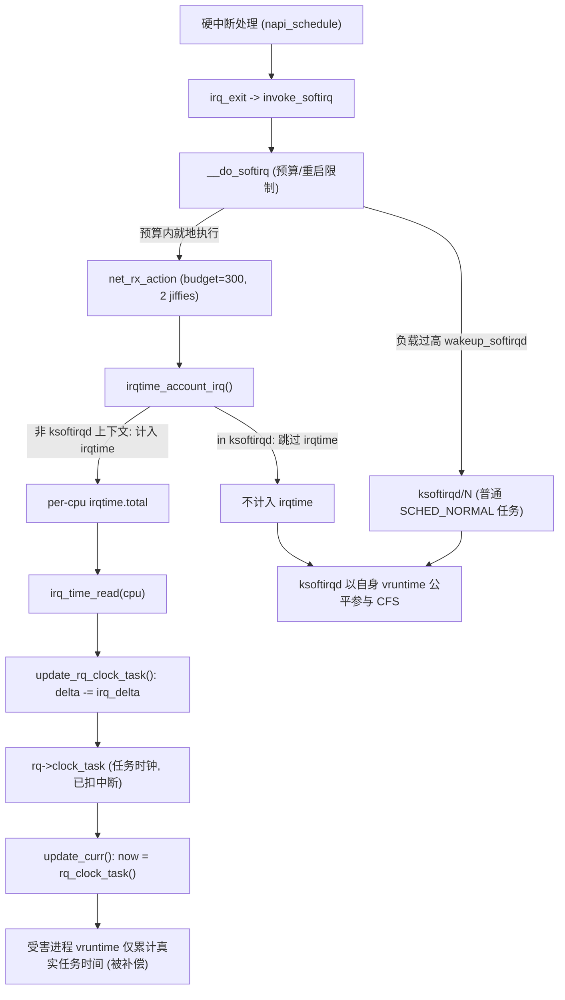

##  0x00    前言
本文学习下CFS调度算法（Completely Fair Scheduler，完全公平调度器）用于Linux系统中普通进程的调度，CFS调度器的目标是让所有普通进程的`vruntime`尽可能接近，实现公平的调度。CFS的设计理念是在真实硬件上实现理想的、精确的多任务CPU。CFS调度器和先前内核版本调度器不同之处在于没有时间片的概念，而是分配cpu使用时间的比例，若`2`个相同优先级的进程在一个CPU上运行，那么每个进程都将会分配`50%`的CPU运行时间

-	调度实体：对应结构`sched_entity`
-	红黑树：CFS采用了红黑树算法来管理所有的调度实体，算法效率`O(log(n))`
-	vruntime：CFS跟踪调度实体`sched_entity`的虚拟运行时间`vruntime`，平等对待运行队列中的调度实体`sched_entity`，将执行时间少的调度实体`sched_entity`排列到红黑树的左边
-	核心调度器：内核中进程调度模块，对外提供了周期性调度（定时触发）以及主调度器两个实现
-	就绪队列：所有当前运行的进程都在这个队列中维护，需要选择出下一个执行的进程也从此队列中选举
-	调度优先级：给予不同的进程不同的优先级，这样分配到的时间就不一样
-	调度算法：给与不同类型的进程使用不同的调度算法来选择执行进程


本文代码基于 [v4.11.6](https://elixir.bootlin.com/linux/v4.11.6/source/include) 版本

##  0x01    CFS数据结构及关系
-	`task_struct`：每一个调度类并不是直接管理`task_struct`，而是关联调度实体
-	`sched_entity`：调度实体
-	`cfs_rq`：每个CPU独立维护的就绪队列

根据上文的介绍，了解到CFS调度器使用`sched_entity`跟踪调度信息。CFS调度器使用`cfs_rq`跟踪就绪队列信息以及管理就绪态调度实体，并维护一棵按照虚拟时间排序的红黑树，`cfs_rq->tasks_timeline`（类型 `struct rb_root`）是红黑树的根节点，`cfs_rq->rb_leftmost`指向红黑树中最左边的调度实体节点（虚拟时间最小的调度实体），为了更快的选择最适合运行的调度实体，`rb_leftmost`相当于一个缓存。每个就绪态的调度实体`sched_entity`包含插入红黑树中使用的节点`rb_node`，同时`vruntime`成员记录已经运行的`task_struct`虚拟时间。CFS算法会选择红黑树最左边的进程运行，随着系统时间的推移，原来左边运行过的进程慢慢的会移动到红黑树的右边，原来右边的进程也会最终跑到最左边。它们之间的关系如下图：


####	sched_class：调度器类
`sched_class`是用于表示所有调度器算法的结构体封装

```cpp
struct sched_class {
	const struct sched_class *next;

	void (*enqueue_task) (struct rq *rq, struct task_struct *p, int flags);
	void (*dequeue_task) (struct rq *rq, struct task_struct *p, int flags);
	void (*yield_task) (struct rq *rq);
	bool (*yield_to_task) (struct rq *rq, struct task_struct *p, bool preempt);

	void (*check_preempt_curr) (struct rq *rq, struct task_struct *p, int flags);

	struct task_struct * (*pick_next_task) (struct rq *rq,
						struct task_struct *prev,
						struct rq_flags *rf);
	void (*put_prev_task) (struct rq *rq, struct task_struct *p);

	void (*set_curr_task) (struct rq *rq);
	void (*task_tick) (struct rq *rq, struct task_struct *p, int queued);
};
```

####	task_struct调度相关

```cpp
// include/linux/sched.h
struct task_struct {
	// ...
	int				prio;
	int				static_prio;
	int				normal_prio;

	const struct sched_class	*sched_class;
	struct sched_entity		se;

	unsigned int			policy;
	int				nr_cpus_allowed;
	cpumask_t			cpus_allowed;  
}
```

####	CPU就绪队列 AND CFS 就绪队列
就绪队列用于维护所有当前可运行的进程，每个CPU上都有一个就绪队列

```cpp
// kernel/sched/sched.h
struct rq {
	unsigned int nr_running;

	#define CPU_LOAD_IDX_MAX 5
	unsigned long cpu_load[CPU_LOAD_IDX_MAX];

	struct load_weight load;

	struct cfs_rq cfs;

	struct task_struct *curr, *idle, *stop;
	u64 clock;
};
```

`cfs_rq`用来维护CFS调度器的就绪进程队列（红黑树）：

```cpp
struct cfs_rq {
	//就绪队列上所有进程的累积负载值
	struct load_weight load;
	
	//就绪队列上的进程数量
	unsigned int nr_running;

	//记录就绪队列上进程的最小虚拟运行时间。这个值是计算就绪队列虚拟运行时间的基础，大部分情况下是CFS红黑树最小子节点（最左节点）的虚拟运行时间，但实际情况下可能有时候会比最小子节点的虚拟运行时间稍大一些
	u64 min_vruntime;

	//v4.11.6 中红黑树根节点用 struct rb_root，最左节点单独用 rb_leftmost 指针缓存
	//（注：4.15+ 合并为 struct rb_root_cached tasks_timeline，内部自带 leftmost 缓存）
	struct rb_root tasks_timeline;
	struct rb_node *rb_leftmost;
};
```

####	调度实体
`sched_entity`描述进程调度的实体信息：

```cpp
// include/linux/sched.h（v4.11.6，注意此版本 sched_entity 尚无 runnable_weight 字段，该字段为 4.15+ PELT 重写引入）
struct sched_entity {
	// 权重信息，在计算虚拟时间的时候会用到inv_weight成员
	struct load_weight		load;
	// CFS调度器使用红黑树维护调度的进程信息
	struct rb_node			run_node;
	// 进入就绪队列是为1
	unsigned int			on_rq;

	u64				exec_start;
	// 调度实体已经运行实际时间总合
	u64				sum_exec_runtime;
	// 调度实体已经运行的虚拟时间总合
	u64				vruntime;
	u64				prev_sum_exec_runtime;
};
```

##	0x02	CFS相关的一些概念

####	调度延迟（目标延迟）：sysctl_sched_latency
> 说明：这里先厘清两个容易混淆的术语。`sysctl_sched_latency` 在内核中被称为**调度延迟**（scheduling latency，也叫 target latency，即"目标延迟"），它是 CFS 期望的一个"所有可运行任务至少被调度一次"的时间窗口；而下文的 `__sched_period()` 计算得到的是**实际调度周期**（scheduling period）。二者在就绪任务数较少（`nr_running <= sched_nr_latency`，默认 `8`）时相等，其余情况下调度周期会大于调度延迟。原文两个小节的命名此前存在互换/混淆，这里统一订正。

调度延迟 `sysctl_sched_latency` 表示调度器期望让所有就绪状态的进程（线程）在这个时间窗口内至少获得一次 CPU 的时间跨度。其默认值为 `6ms`，但会根据 CPU 数量动态调整。

需要注意，这个"按 CPU 数缩放"并非无条件生效：仅当调节策略 `sysctl_sched_tunable_scaling == SCHED_TUNABLESCALING_LOG`（默认值）时，内核才会在初始化及 CPU 上下线时通过 `update_sysctl()`/`sched_init_granularity()` 按 `1 + ilog2(nr_cpus)` 的因子放大 `sysctl_sched_latency` 与 `sysctl_sched_min_granularity`，即参考公式 `sysctl_sched_latency = 6ms * (1 + log2(nr_cpus))`；若策略为 `NONE`，则保持常量 `6ms` 不缩放。

```bash
# 该机器为多核，故实际值大于默认 6ms（按 CPU 数缩放的结果）
[root@VM-x-x-centos ~]# sysctl -a|grep sched|grep sched_latency_ns
kernel.sched_latency_ns = 18000000
```

####	调度周期：__sched_period
调度周期是保证每一个可运行进程都至少运行（完成）一次的时间间隔。例如每个进程都运行`10ms`，系统中总共有`2`个进程，那么调度周期就是`20ms`。如果现在保证调度周期不变，固定是`6ms`，如果有`100`个进程，那么每个进程分配到的时间就是`0.06ms`。随着进程的增加，每个进程分配的时间在减少，进程调度过于频繁，上下文切换时间开销就会变大。因此，CFS调度器的调度周期并不是固定的：当系统处于就绪态的进程少于一个定值（`sched_nr_latency`，默认值`8`）的时候，调度周期就固定等于调度延迟 `sysctl_sched_latency`（默认值`6ms`）；当系统就绪态进程个数超过这个值时，需要保证每个进程至少运行一定的时间才让出CPU，这个"至少一定的时间"被称为最小粒度时间（在CFS默认设置中，最小粒度时间是`0.75ms`，关联变量`sysctl_sched_min_granularity`），此时调度周期 = `nr_running * sysctl_sched_min_granularity`

```cpp
//调度周期是一个动态变化的值，使用__sched_period计算调度周期
//nr_running是系统中就绪进程数量，当超过sched_nr_latency时，无法在一个调度延迟内轮转完所有进程，因此转为保证调度最小粒度。如果nr_running并没有超过sched_nr_latency，那么调度周期就等于调度延迟sysctl_sched_latency（6ms）
static u64 __sched_period(unsigned long nr_running)
{
	if (unlikely(nr_running > sched_nr_latency))
		return nr_running * sysctl_sched_min_granularity;
	else
		return sysctl_sched_latency;
}
```

####	nice：普通进程的优先级
现实情况下，CFS调度器针对普通进程的优先级是通过权重实现的，权重代表着进程的优先级，即各个进程之间按照权重的比例分配CPU时间，权重越大分配的时间比例越大，相当于优先级越高。在引入权重之后，分配给进程的时间计算公式如下：

```TEXT
分配给进程的时间 = 总的cpu时间 * 进程的权重/就绪队列（runqueue）所有进程权重之和
```

此外，CFS调度器中设计了`nice`值，与权重一一对应。`nice`取值范围是`[-20, 19]`（数值越小代表优先级越大，同时也意味着权重值越大），转换方式如下：

```cpp
//数组的值可以看作是公式：weight = 1024 / 1.25nice计算得到。公式中的1.25取值依据是：进程每降低一个nice值，将多获得10% cpu的时间。公式中以1024权重为基准值计算得来，1024权重对应nice值为0，其权重被称为NICE_0_LOAD。默认情况下，大部分进程的权重基本都是NICE_0_LOAD
const int sched_prio_to_weight[40] = {
 /* -20 */     88761,     71755,     56483,     46273,     36291,
 /* -15 */     29154,     23254,     18705,     14949,     11916,
 /* -10 */      9548,      7620,      6100,      4904,      3906,
 /*  -5 */      3121,      2501,      1991,      1586,      1277,
 /*   0 */      1024,       820,       655,       526,       423,
 /*   5 */       335,       272,       215,       172,       137,
 /*  10 */       110,        87,        70,        56,        45,
 /*  15 */        36,        29,        23,        18,        15,
}; 
```

普通进程的nice值在`[-20,19]`之间，而内核本身选择范围`[0,139]`在内部表示优先级，数值越低优先级越高


####	虚拟运行时间vruntime VS runtime


1、虚拟运行时间`vruntime`

例如调度周期是`6ms`，系统一共`2`个相同优先级的进程A和B，那么每个进程都将在`6ms`周期时间内内各运行`3ms`。如果进程A和B，他们的权重分别是`1024`和`820`（对应`nice`值分别是`0`和`1`）。根据权重进程A获得的运行时间是`6x1024/(1024+820)=3.3ms`，进程B获得的执行时间是`6x820/(1024+820)=2.7ms`。进程A的CPU使用比例是`3.3/6x100%=55%`，进程B的CPU使用比例是`2.7/6x100%=45%`

上述计算结果符合**进程每降低一个nice值，将多获得10% CPU的时间**，很明显这两个进程的实际执行时间是不相等的，但是CFS想保证每个进程运行时间相等。因此CFS引入了vruntime的概念，也就是说上面的`2.7ms`和`3.3ms`经过一个公式的转换可以得到一样的值，这个转换后的值称作虚拟运行时间。这样CFS只需要保证每个进程运行的虚拟运行时间是相等的即可。对高优先级进程`1` 物理秒换算为 `0.5` 虚拟秒（vruntime 增长慢），而低优先级进程`1` 物理秒 换算为 `2` 虚拟秒（vruntime 增长快）


虚拟运行时间和实际时间（wall time）转换公式如下：


```TEXT
#注意：`nice`值为`0`的进程的虚拟时间和实际时间相同
                                 NICE_0_LOAD
vriture_runtime = wall_time * ----------------
                                    weight 
```


进程A的虚拟时间`3.3 * 1024 / 1024 = 3.3ms`，可以看出`nice`值为`0`的进程的虚拟时间和实际时间是相等的。进程B的虚拟时间是`2.7 * 1024 / 820 = 3.3ms`。可以看出尽管A和B进程的权重值不一样，但是计算得到的虚拟时间是一样的。因此CFS主要保证每一个进程获得执行的虚拟时间一致即可。在选择下一个即将运行的进程的时候，只需要找到虚拟时间最小的进程即可。内核对公式做了如下转换：

```TEXT
                                 NICE_0_LOAD
vriture_runtime = wall_time * ----------------
                                    weight
  
                                   NICE_0_LOAD * 2^32
                = (wall_time * -------------------------) >> 32
                                        weight
                                                                                        2^32
                = (wall_time * NICE_0_LOAD * inv_weight) >> 32        (inv_weight = ------------ )
                                                                                        weight 
```

2、`weight` && `inv_weight`

其中，`inv_weight`的值可根据`weight`计算（而权重`weight`的值已经计算保存到`sched_prio_to_weight`数组中，计算公式`sched_prio_to_wmult[i] = 2^32 / sched_prio_to_weight[i]`），在使用时只需要查表`sched_prio_to_wmult`就可以得到`inv_weight`的值

```TEXT
                  2^32
(inv_weight = ------------ )
                  weight 
```

```cpp
/*
 * Inverse (2^32/x) values of the sched_prio_to_weight[] array, precalculated.
 *
 * In cases where the weight does not change often, we can use the
 * precalculated inverse to speed up arithmetics by turning divisions
 * into multiplications:
 */
const u32 sched_prio_to_wmult[40] = {
 /* -20 */     48388,     59856,     76040,     92818,    118348,
 /* -15 */    147320,    184698,    229616,    287308,    360437,
 /* -10 */    449829,    563644,    704093,    875809,   1099582,
 /*  -5 */   1376151,   1717300,   2157191,   2708050,   3363326,
 /*   0 */   4194304,   5237765,   6557202,   8165337,  10153587,
 /*   5 */  12820798,  15790321,  19976592,  24970740,  31350126,
 /*  10 */  39045157,  49367440,  61356676,  76695844,  95443717,
 /*  15 */ 119304647, 148102320, 186737708, 238609294, 286331153,
};
```

内核中使用`struct load_weight`结构描述进程的权重信息（包含在调度实体`sched_entity`中）

```cpp
struct load_weight {
	unsigned long		weight;		//进程的权重
	u32			inv_weight;			//inv_weight等于2^32/weight
};
```

3、转换：`runtime`-->`vruntime`：`calc_delta_fair`函数实现此转换，核心是调用`__calc_delta`函数

```cpp
//将实际时间转换成虚拟时间
//calc_delta_fair()函数调用__calc_delta()的时候传递的weight参数是NICE_0_LOAD，lw参数是进程对应的struct load_weight结构体
static inline u64 calc_delta_fair(u64 delta, struct sched_entity *se)
{
	/*
	nice值为0（权重是NICE_0_LOAD）的进程的虚拟时间和实际时间是相等的。因此如果进程的权重是NICE_0_LOAD，进程对应的虚拟时间就不用计算
	*/
	if (unlikely(se->load.weight != NICE_0_LOAD))
		delta = __calc_delta(delta, NICE_0_LOAD, &se->load);	//

	return delta;
}

static u64 __calc_delta(u64 delta_exec, unsigned long weight, struct load_weight *lw)
{
	u64 fact = scale_load_down(weight);
	int shift = 32;
 
	__update_inv_weight(lw);
 
	if (unlikely(fact >> 32)) {
		while (fact >> 32) {
			fact >>= 1;
			shift--;
		}
	}
 
	fact = (u64)(u32)fact * lw->inv_weight;
 
	while (fact >> 32) {
		fact >>= 1;
		shift--;
	}
 
	return mul_u64_u32_shr(delta_exec, fact, shift);
} 
```

`__calc_delta`函数的抽象公式如下：

```TEXT
__calc_delta() = (delta_exec * weight * lw->inv_weight) >> 32
 
                                  weight                                 2^32
               = delta_exec * ----------------    (lw->inv_weight = --------------- )
                                lw->weight                             lw->weight 
```

4、调度实体中的时间相关字段

由于`struct sched_entity`结构体描述调度实体，包括`struct load_weight`用来记录权重信息，核心字段如下：

```cpp
struct sched_entity {
	struct load_weight		load;	//load：权重信息，在计算虚拟时间的时候会用到inv_weight成员
	struct rb_node		run_node;	//run_node：CFS调度器的每个就绪队列维护了一颗红黑树，上面挂满了就绪等待执行的task，run_node就是挂载点
	unsigned int		on_rq;		//on_rq：调度实体se加入就绪队列后，on_rq置1。从就绪队列删除后，on_rq置0
	u64			sum_exec_runtime;	//sum_exec_runtime：调度实体已经运行实际时间总和
	u64			vruntime;			//vruntime：调度实体已经运行的虚拟时间总和
}; 
```

5、CFS 的公平性本质：加权公平

从上面的描述了解到，CFS 的公平性目标是让所有进程的 **vruntime 趋近一致**，但这并非要求所有进程的实际运行时间（runtime）相同，优先级（权重）决定了进程的权重比例，本质是**高优先级进程的 `vruntime` 增长更慢，从而在相同时间内积累更多实际运行时间**，所以这一机制实现了**权重越高，实际运行时间越长**的公平性，而非绝对平等

如下例子，假设进程 A（权重 `2048`，优先级高）和进程 B（权重 `1024`，优先级低）同时运行，若两者均运行 `1ms`：
-	进程A 的 `vruntime` 增量：`1ms * (1024/2048) = 0.5ms`
-	进程B 的 `vruntime` 增量：`1ms * (1024/1024) = 1ms`

所以为了让 进程A 和 进程B 的 `vruntime` 趋近一致，A 需要运行 `2ms`，B 运行 `1ms`，如此结果为进程A 的实际运行时间是 进程B 的 `2` 倍，但两者的 `vruntime` 增量相同，符合公平性

-	进程A 的 `vruntime` 增量：`2ms * (1024/2048) = 1ms`
-	进程B 的 `vruntime` 增量：`1ms * (1024/1024) = 1ms`

6、runtime与vruntime的关系

这里介绍下实际运行时间的动态分配机制，由于CFS 不依赖固定时间片，而是根据进程权重和可运行进程数态分配时间片：

-	调度周期（`sched_period`）：所有可运行进程至少运行一次的周期，默认约 `6ms ~ 48ms`（取决于进程数），而进程时间片的计算公式为**时间片 = (调度周期 * 进程权重) / 总权重**，即权重越高的进程，时间片越长；总权重是所有可运行进程权重之和
-	调度决策：CFS 维护红黑树，按 `vruntime` 排序，优先调度 `vruntime` 最小的进程；而高优先级进程因 `vruntime` 增长更慢，会被更频繁调度，从而获得更多实际运行时间
-  长期收敛性：在多个调度周期后，高优先级进程的 **vruntime 增速慢**，实际运行时间积累更快；而低优先级进程的 **vruntime 增速快**，实际运行时间积累更慢

这样CFS算法的最终调度效果就是：所有进程的 `vruntime` 趋近一致，但实际运行时间按权重比例分配

7、vruntime小结

-	`vruntime` 本质上是一个累加值，但其累加规则并非简单的物理时间叠加，而是基于进程的 ​权重（优先级）​​动态调整

####	min_vruntime：CFS就绪队列的最小虚拟运行时间（实时）
CFS代码中出现的`min_vruntime`（注意到其是归属于`cfs_rq`结构），其作用是作为`vruntime` 的标尺，用来动态记录每个CPU CFS就绪队列上 `vruntime` 的最小值（`min_vruntime`是属于CFS运行就绪队列的唯一成员），这个值是计算就绪队列虚拟运行时间的基础，大部分情况下是CFS红黑树最小子节点（最左节点）的虚拟运行时间，但实际情况下可能有时候会比最小子节点的虚拟运行时间稍大一些

```cpp
/* kernel/sched/sched.h */

struct cfs_rq {
    u64         min_vruntime;
    /* ... */
};
```

`min_vruntime`主要应用于如下场景：

1、新进程创建，如何设置其vruntime？

一个进程在刚刚加入到CFS就绪队列的红黑树中时，需要有一个基准值，即这个新加入的进程，应该和什么虚拟运行时间进行对比，找到它在红黑树中的合适位置（不能设置为一个较小的值会破坏CFS的公平性），该值即为`min_vruntime`。为什么`min_vruntime`不能直接取最左子节点对应进程的虚拟运行时间？因为系统在运行，对应的里面的每个进程其虚拟运行时间也是一直在增加，因此每个就绪队列的最小虚拟运行时间也一直是增加的才对。正因为这样，这个值不能取最左子节点进程的虚拟运行时间，而是根据系统的情况一直累加，不能发生回退。既然虚拟运行时间是一直累加的，那么在进程一直运行的情况下，就可能发生数据溢出现象，因此在对比两个虚拟运行时间大小的时候，不是直接比较而是判断的两者的差值（见后文分析）

2、`min_vruntime`的更新逻辑（见后文分析）

3、基于`min_vruntime`的校准更新逻辑，主要场景如下

-	`task_fork_fair`：进程创建时，在以就绪队列的最小虚拟运行时间为基准设置其最初的虚拟运行时间时，还需要再减去队列的最小虚拟运行时间
-	`enqueue_entity`：进程加入一个CFS就绪队列时，虚拟运行时间要加上该CPU就绪队列的最小虚拟运行时间
-	`dequeue_entity`：进程离开一个CFS就绪队列时，虚拟运行时间要减去该CPU就绪队列的最小虚拟运行时间

这个机制比较合理，因为可能在调度的过程中会发生CPU切换。如进程在刚创建的时候，其vruntime是根据当时所在的CPU就绪队列的`min_vruntime`为基础计算的，而进程真正开始被调度执行的时候，其所在的CPU可能不是最开始创建时所在的CPU了，中间发生了进程在不同CPU之间的迁移（不同的CPU之间，其虚拟运行时间也不尽相同，所以需要处理）

##	0x03 	代码中若干重要函数

####	`calc_delta_fair`
`calc_delta_fair`，用来计算进程的`vruntime`的函数（见上文）

####	`sched_slice`
`sched_slice`函数是用来计算一个调度周期内，一个调度实体可以分配多少运行时间

```cpp
static u64 sched_slice(struct cfs_rq *cfs_rq, struct sched_entity *se)
{
	//__sched_period函数是计算调度周期的函数，此函数当进程个数小于8时，调度周期等于调度延迟等于6ms。否则调度周期等于进程的个数乘以0.75ms，表示一个进程最少可以运行0.75ms，防止进程过快发生上下文切换
	u64 slice = __sched_period(cfs_rq->nr_running + !se->on_rq);

	//遍历当前的调度实体，如果调度实体没有调度组的关系，则只运行一次
	//获取当前CFS运行队列cfs_rq，获取运行队列的权重cfs_rq->rq代表的是这个运行队列的权重。最后通过__calc_delta计算出此进程的实际运行时间
	for_each_sched_entity(se) {
		struct load_weight *load;
		struct load_weight lw;

		cfs_rq = cfs_rq_of(se);
		load = &cfs_rq->load;

		if (unlikely(!se->on_rq)) {
			lw = cfs_rq->load;

			update_load_add(&lw, se->load.weight);
			load = &lw;
		}

		//__calc_delta函数：不仅仅可以计算一个进程的虚拟时间，它在这里是计算一个进程在总的调度周期中可以获取的运行时间，公式为：进程的运行时间 = （调度周期时间 * 进程的weight） / CFS运行队列的总weigth
		slice = __calc_delta(slice, se->load.weight, load);
	}
	return slice;
}
```

####	`place_entity`：惩罚/补偿一个调度实体
`place_entity`函数用来惩罚一个调度实体，本质是修改其`vruntime`的值。根据传入参数`initial`分为两种情况

-	`initial==0/*false*/`：如果`inital`为`false`，则代表的是唤醒的进程，对于唤醒的进程则需要照顾，最大的照顾是调度延时的一半，确保调度实体的`vruntime`不得倒退
-	`initial==1/*true*/`：当参数`initial`为`true`时，代表是新创建的进程，新创建的进程则给它的`vruntime`增加值，代表惩罚它。因为新创建进程的`vruntime`过小，防止其一直占在CPU

```cpp
static void
place_entity(struct cfs_rq *cfs_rq, struct sched_entity *se, int initial)
{
	//获取当前CFS运行队列的min_vruntime的值
	u64 vruntime = cfs_rq->min_vruntime;

	/*
	 * The 'current' period is already promised to the current tasks,
	 * however the extra weight of the new task will slow them down a
	 * little, place the new task so that it fits in the slot that
	 * stays open at the end.
	 */
	if (initial && sched_feat(START_DEBIT))
		// 新创建的进程惩罚的时间如何计算？参考sched_vslice的实现，参考下文
		vruntime += sched_vslice(cfs_rq, se);

	/* sleeps up to a single latency don't count. */
	if (!initial) {
		unsigned long thresh = sysctl_sched_latency;

		/*
		 * Halve their sleep time's effect, to allow
		 * for a gentler effect of sleepers:
		 */
		if (sched_feat(GENTLE_FAIR_SLEEPERS))
			thresh >>= 1;

		vruntime -= thresh;
	}

	/* ensure we never gain time by being placed backwards. */
	//通过`max_vruntime`获取最大的`vruntime`
	se->vruntime = max_vruntime(se->vruntime, vruntime);
}
```

####	`update_curr`
`update_curr`函数用来更新当前进程的运行时间信息（形象比喻为linux CFS的记账函数，其中时间账本为`struct sched_entity`）以及当前CPU cfs就绪队列的重要成员（如`update_min_vruntime`），注意到其参数为cfs就绪队列`cfs_rq`


```cpp
static void update_curr(struct cfs_rq *cfs_rq)
{
	struct sched_entity *curr = cfs_rq->curr;
	u64 now = rq_clock_task(rq_of(cfs_rq));
	u64 delta_exec;

	if (unlikely(!curr))
		return;

	//计算出当前CFS运行队列的进程，距离上次更新虚拟时间的差值
	delta_exec = now - curr->exec_start;
	if (unlikely((s64)delta_exec <= 0))
		return;

	//更新exec_start的值
	curr->exec_start = now;

	schedstat_set(curr->statistics.exec_max,
		      max(delta_exec, curr->statistics.exec_max));

	//更新当前进程总共执行的时间
	curr->sum_exec_runtime += delta_exec;
	schedstat_add(cfs_rq->exec_clock, delta_exec);

	//通过calc_delta_fair计算当前进程虚拟时间
	curr->vruntime += calc_delta_fair(delta_exec, curr);
	//通过update_min_vruntime函数来更新CFS运行队列中最小的vruntime的值
	update_min_vruntime(cfs_rq);


	account_cfs_rq_runtime(cfs_rq, delta_exec);
}
```

####	`update_min_vruntime`：计算与判断CFS就绪队列最小虚拟运行时间
`update_min_vruntime`用于CFS就绪队列最小虚拟运行时间更新（见下文代码分析），汇总下哪些地方会涉及到**最小的虚拟运行时间**的计算？

-	就绪队列本身的`cfs_rq->min_vruntime`成员
-	当前正在运行的进程的最小虚拟时间，因为CFS调度器选择最适合运行的进程是选择维护的红黑树中虚拟时间最小的进程
-	如果在当前进程运行的过程中，有进程加入就绪队列，那么红黑树最左边的进程的虚拟时间同样也有可能是最小的虚拟时间

所以，计算`min_vruntime`就是上述几种情况的大小比较，但需要满足一个原则**需要保证就绪队列的最小虚拟时间min_vruntime单调递增的特性，更新最小虚拟时间**，这里的单调递增指的是要始终增大，不能减小


##	0x04	CFS的运行原理及核心代码走读

####    进程创建
进程的创建是通过`do_fork()`完成，调用链如下：`do_fork()`----> `_do_fork()` ----> `copy_process()`----> `sched_fork()`；当fork 进程时，核心`copy_process`以复制父进程的方式来生成一个新的`task_struct`，然后调用`wake_up_new_task` 函数将新进程添加到CPU的就绪队列中，等待调度器调度执行

```cpp
long _do_fork(unsigned long clone_flags,unsigned long stack_start,unsigned long stack_size,int __user *parent_tidptr,int __user *child_tidptr,unsigned long tls){
    struct task_struct *p;
    int trace = 0;
    long nr;
    //......
    // 复制结构
    p = copy_process(clone_flags, stack_start, stack_size,child_tidptr, NULL, trace, tls, NUMA_NO_NODE);
    //......
    if (!IS_ERR(p)) {
        struct pid *pid;
        pid = get_task_pid(p, PIDTYPE_PID);
        nr = pid_vnr(pid);
        if (clone_flags & CLONE_PARENT_SETTID)
            put_user(nr, parent_tidptr);
        //......
        // 唤醒新进程
        wake_up_new_task(p);
        //......
        put_pid(pid);
    }
    //...
} 

static struct task_struct *copy_process(...){
    // 复制进程task_struct结构体
    struct task_struct *p;
    p = dup_task_struct(current, ...);
    // 复制files_struct
    retval = copy_files(clone_flags,p)
    // 复制fs_struct
    retval = copy_fs(clone_flags,p)
    // 复制mm_struct
    retval = copy_mm(clone_flags,p)
    // 复制进程的命名空间 nsproxy
    retval = copy_namespace(clone_flags,p)
    // 申请pid并设置进程号
    pid = alloc_pid(p->nsproxy->pid_ns_for_children,...);
    p->pid = pid_nr(pid);
    if (clone_flags & CLONE_THREAD) {
        p->tgid = current->tgid;
    }else{
        p->tgid = p->pid;
    }
    //...
}
```

一个新创建的普通进程，从调度的代码视角看，`copy_process`函数对新进程的`task_struct` 进行各种初始化，其中会调用`sched_fork` 来完成调度相关的初始化，核心逻辑如下：

```cpp
static struct task_struct *copy_process(...){
    //...
    retval = sched_fork(clone_flags, p);
	//...
}

int sched_fork(unsigned long clone_flags, struct task_struct *p){
    __sched_fork(clone_flags, p);
    p->state = TASK_NEW;
    if (rt_prio(p->prio))
        p->sched_class = &rt_sched_class;
    else
        p->sched_class = &fair_sched_class; // fair_sched_class （CFS的调度类）是一个全局对象，为CFS调度算法的实现
}

static void __sched_fork(struct task_struct *p){
    p ->on_rq = 0;
    //...
    p->se.nr_migrations = 0;
    p->se.vruntime = 0; // 注意：新进程是0对老进程不公平，在新进程真正被加入运行队列时，会将其值设置为cfs_rq->min_vruntime
}

void wake_up_new_task(struct task_struct *p){
    // 为进程选择一个合适的cpu
    cpu = select_task_rq(p, task_cpu(p)
    // 为进程指定运行队列
    __set_task_cpu(p,cpu, WF_FORK));
    // 将进程添加到运行队列红黑树
    rq = __task_rq_lock(p);
    activate_task(rq, p, 0);
}
```

需要说明的是上面`wake_up_new_task`实现中，通过调用`select_task_rq()`函数重新选择CPU（逻辑核），通过调用调度类中`select_task_rq`方法选择调度类中最空闲的CPU。如此在缓存性能和空闲核两个点做权衡，同等条件会尽量优先考虑缓存命中率，选择同`L1`/`L2`的核，其次会选择同一个物理CPU上的（共享`L3`），最坏情况下去选择另一个（负载最小的）物理CPU上的核，称之为漂移。通常由于宿主机的CPU利用率过高的水平导致出现了漂移的情况，进程在不同的核上运行概率增加，导致缓存MISS，穿透到内存的访问次数增加，进程的运行性能就会下降

####	CFS调度类：task_fork_fair（进程创建）
接着`sched_fork`函数继续分析，其中`fair_sched_class`是CFS调度类实现，调用调度类中的`task_fork`函数

```cpp
const struct sched_class fair_sched_class = {
	.next				= &idle_sched_class,
	.enqueue_task		= enqueue_task_fair,
	.dequeue_task		= dequeue_task_fair,
	.yield_task			= yield_task_fair,
	.yield_to_task		= yield_to_task_fair,
	.check_preempt_curr	= check_preempt_wakeup,
	.pick_next_task		= pick_next_task_fair,
	.put_prev_task		= put_prev_task_fair,
	//..
	.set_curr_task      = set_curr_task_fair,
	.task_tick			= task_tick_fair,
	.task_fork			= task_fork_fair,
	.prio_changed		= prio_changed_fair,
	.switched_from		= switched_from_fair,
	.switched_to		= switched_to_fair,
	.get_rr_interval	= get_rr_interval_fair,
	.update_curr		= update_curr_fair,
};
```

`task_fork_fair`函数主要做`fork`新进程创建相关的操作，参数`p`就是创建的`task_struct`，核心实现如下：
```cpp
static void task_fork_fair(struct task_struct *p)
{
	struct cfs_rq *cfs_rq;
	struct sched_entity *se = &p->se, *curr;
	struct rq *rq = this_rq();
	struct rq_flags rf;
 
	rq_lock(rq, &rf);
	update_rq_clock(rq);
 
	cfs_rq = task_cfs_rq(current);
	//cfs_rq是CFS调度器就绪队列，curr指向当前正在cpu上运行的task的调度实体
	curr = cfs_rq->curr;                 
	if (curr) {
		//update_curr()函数是比较重要，主要是更新当前正在运行的调度实体的运行时间信息
		update_curr(cfs_rq);                 
		//初始化当前创建的新进程的虚拟时间
		se->vruntime = curr->vruntime;       
	}

	//place_entity()函数在进程创建以及唤醒的时候都会调用，创建进程的时候传递参数initial=1。主要目的是更新调度实体得到虚拟时间（se->vruntime成员）。要和cfs_rq->min_vruntime的值保持差别不大
	place_entity(cfs_rq, se, 1);             
 
	/*
	这里为什么要减去cfs_rq->min_vruntime呢？因为现在计算进程的vruntime是基于当前cpu上的cfs_rq，并且现在还没有加入当前cfs_rq的就绪队列上。等到当前进程创建完毕开始唤醒的时候，加入的就绪队列就不一定是现在计算基于的cpu。所以，在加入就绪队列的函数中会根据情况加上当前就绪队列cfs_rq->min_vruntime。为什么要先减后加处理呢？假设cpu0上的cfs就绪队列的最小虚拟时间min_vruntime的值是1000000，此时创建进程的时候赋予当前进程虚拟时间是1000500。但是，唤醒此进程加入的就绪队列却是cpu1上CFS就绪队列，cpu1上的cfs就绪队列的最小虚拟时间min_vruntime的值如果是9000000。如果不采用先减后加方法，那么该进程在cpu1上运行肯定是乐坏了，疯狂的运行。现在的处理计算得到的调度实体的虚拟时间是1000500 - 1000000 + 9000000 = 9000500，因此事情就不是那么的糟糕
	*/

	// 另外这里减去的min_vruntime会在enqueue_entity入红黑树的时候加回
	se->vruntime -= cfs_rq->min_vruntime;   
	rq_unlock(rq, &rf);
}
```

```cpp
static void update_curr(struct cfs_rq *cfs_rq)
{
	struct sched_entity *curr = cfs_rq->curr;
	u64 now = rq_clock_task(rq_of(cfs_rq));
	u64 delta_exec;
 
	if (unlikely(!curr))
		return;
 
	//计算本次更新虚拟时间距离上次更新虚拟时间的差
	delta_exec = now - curr->exec_start;                    
	if (unlikely((s64)delta_exec <= 0))
		return;
 
	curr->exec_start = now;
	curr->sum_exec_runtime += delta_exec;
	//更新当前调度实体虚拟时间，calc_delta_fair()函数根据上面说的虚拟时间的计算公式计算虚拟时间（也就是调用__calc_delta()函数）
	curr->vruntime += calc_delta_fair(delta_exec, curr);    
	// 更新CFS就绪队列的最小虚拟时间min_vruntime。min_vruntime也是不断更新的，主要就是跟踪就绪队列中所有调度实体的最小虚拟时间。如果min_vruntime一直不更新的话，由于min_vruntime太小，导致后面创建的新进程若根据这个值来初始化新进程的虚拟时间，那么就会扰乱调度新老进程的优先级
	update_min_vruntime(cfs_rq);                            
}
```

`update_min_vruntime`函数的意义在于动态更新当前调度器对应的CPU就绪队列最小虚拟时间（就绪队列本身的`cfs_rq->min_vruntime`成员）,由于CFS调度器选择最适合运行的进程是选择维护的红黑树中虚拟时间最小的进程，如果在当前进程运行的过程中（其`vruntime`不断增大），有进程加入就绪队列，那么红黑树最左边的进程的虚拟时间同样也有可能是最小的虚拟时间，这需要保证就绪队列的最小虚拟时间`min_vruntime`单调递增的特性来更新此值

```cpp
static void update_min_vruntime(struct cfs_rq *cfs_rq)
{
	struct sched_entity *curr = cfs_rq->curr;
	u64 vruntime = cfs_rq->min_vruntime;
 
	if (curr) {
		if (curr->on_rq)
			vruntime = curr->vruntime;
		else
			curr = NULL;
	}
 
	//v4.11.6 直接使用 cfs_rq->rb_leftmost 缓存的最左节点（而非 4.15+ 的 rb_first_cached）
	if (cfs_rq->rb_leftmost) { /* non-empty tree */
		struct sched_entity *se;
		se = rb_entry(cfs_rq->rb_leftmost, struct sched_entity, run_node);
 
		if (!curr)
			vruntime = se->vruntime;
		else
			vruntime = min_vruntime(vruntime, se->vruntime);
	}
 
	/* ensure we never gain time by being placed backwards. */
	cfs_rq->min_vruntime = max_vruntime(cfs_rq->min_vruntime, vruntime);
}
```

主流程`place_entity`，由于`vruntime`越小越容易被调度执行，所以这里要做两件事：
-	对新创建的进程进行惩罚
-	对旧进程（sleep很久）的进行进程补偿

```cpp
static void
place_entity(struct cfs_rq *cfs_rq, struct sched_entity *se, int initial)
{
	u64 vruntime = cfs_rq->min_vruntime;
 
	/*
	 * The 'current' period is already promised to the current tasks,
	 * however the extra weight of the new task will slow them down a
	 * little, place the new task so that it fits in the slot that
	 * stays open at the end.
	 */
	//如果是创建进程调用该函数的话，参数initial参数是1
	//因此这里是处理创建的进程，针对刚创建的进程会进行一定的惩罚，将虚拟时间加上一个值就是惩罚，毕竟虚拟时间越小越容易被调度执行
	//惩罚的时间由sched_vslice()计算
	if (initial && sched_feat(START_DEBIT))
		vruntime += sched_vslice(cfs_rq, se);              
 
	/* sleeps up to a single latency don't count. */
	if (!initial) {
		unsigned long thresh = sysctl_sched_latency;
 
		/*
		 * Halve their sleep time's effect, to allow
		 * for a gentler effect of sleepers:
		 */
		if (sched_feat(GENTLE_FAIR_SLEEPERS))
			thresh >>= 1;
		
		//这里主要是针对唤醒的进程，针对睡眠很久的的进程，总是期望它很快得到调度执行，毕竟睡了那么久
		//所以这里减去一定的虚拟时间作为补偿
		vruntime -= thresh;                                 
	}
 
	/* ensure we never gain time by being placed backwards. */
	//保证调度实体的虚拟时间不能倒退
	//原因？设想一下如果一个进程刚睡眠1ms，然后醒来后却要奖励3ms（虚拟时间减去3ms），然后竟然赚了2ms。作为调度器，睡眠100ms，奖励3ms，那就是没问题的
	se->vruntime = max_vruntime(se->vruntime, vruntime);    
}
```

惩罚时间的计算由`sched_vslice`函数完成：

```cpp
static u64 sched_vslice(struct cfs_rq *cfs_rq, struct sched_entity *se)
{
	return calc_delta_fair(sched_slice(cfs_rq, se), se);
}

static u64 sched_slice(struct cfs_rq *cfs_rq, struct sched_entity *se)
{
	//__sched_period()：根据就绪队列调度实体个数计算调度周期
	u64 slice = __sched_period(cfs_rq->nr_running + !se->on_rq);   
 
	for_each_sched_entity(se) {                                    
		struct load_weight *load;
		struct load_weight lw;
 
		cfs_rq = cfs_rq_of(se);
		// 获取就绪队列的权重，也就是就绪队列上所有调度实体权重之和
		load = &cfs_rq->load;                                   
 
		if (unlikely(!se->on_rq)) {
			lw = cfs_rq->load;
 
			update_load_add(&lw, se->load.weight);
			load = &lw;
		}
		//__calc_delta()函数包含如下两个功能：
		//1：计算进程运行时间转换成虚拟时间
		//2：计算调度实体se的权重占整个就绪队列权重的比例，然后乘以调度周期时间即可得到当前调度实体应该运行的时间（参数weught传递调度实体se权重，参数lw传递就绪队列权重cfs_rq->load）。例如，就绪队列权重是3072，当前调度实体se权重是1024，调度周期是6ms，那么调度实体应该得到的时间是6*1024/3072=2ms
		slice = __calc_delta(slice, se->load.weight, load);      
	}
	return slice;
}
```

至此，一个fork新创建的进程在调度前的准备工作基本就完成了

##	0x05	调度方式一：新进程的调度过程

####	CFS的核心调度器
CFS的核心调度器包含了两种实现，即主调度器和周期性调度器，接下来就分析下这两类方式的主要实现。上一小节介绍了`do_dork`->`sched_fork`->`task_fork_fair`，对新进程创建到调度前的准备事项，本小节继续介绍唤醒新进程调度的流程，重要的几个方法：
-	`wake_up_new_task`
-	`enqueue_task_fair`
-	`enqueue_entity`
-	`account_entity_enqueue`
-	`__enqueue_entity`

1、新进程加入就绪队列，经过`do_fork()`的大部分初始化工作完成之后，接下来就是唤醒新进程准备运行，将新进程加入就绪队列准备调度

```cpp
do_fork()-->_do_fork()-->wake_up_new_task()-->activate_task()-->enqueue_task()-->enqueue_task_fair()
                                   |
                                   +------------>check_preempt_curr()--->check_preempt_wakeup() 
```

新进程的调度流程如下图：


2、`wake_up_new_task`：负责唤醒新创建的进程，当准备就绪后会调用`check_preempt_curr`函数尝试抢占当前CPU，[代码](https://elixir.bootlin.com/linux/v4.11.6/source/kernel/sched/core.c#L2536)片段如下：

```cpp
void wake_up_new_task(struct task_struct *p)
{
	struct rq_flags rf;
	struct rq *rq;
	//....
 
	p->state = TASK_RUNNING;
#ifdef CONFIG_SMP
	p->recent_used_cpu = task_cpu(p);
	//通过调用select_task_rq()函数重新选择cpu，通过调用调度类中select_task_rq方法选择调度类中最空闲的cpu
	__set_task_cpu(p, select_task_rq(p, task_cpu(p), SD_BALANCE_FORK, 0));   
#endif
	rq = __task_rq_lock(p, &rf);

	//将进程加入（runqueue）就绪队列，通过调用调度类中enqueue_task方法
	activate_task(rq, p, ENQUEUE_NOCLOCK);                                  
	p->on_rq = TASK_ON_RQ_QUEUED;
	//既然新进程已经准备就绪，那么此时需要检查新进程是否满足抢占当前正在运行进程的条件，如果满足抢占条件需要设置TIF_NEED_RESCHED标志位
	check_preempt_curr(rq, p, WF_FORK);                                      
}

void activate_task(struct rq *rq, struct task_struct *p, int flags)
{
	if (task_contributes_to_load(p))
		rq->nr_uninterruptible--;

	enqueue_task(rq, p, flags);
}

static inline void enqueue_task(struct rq *rq, struct task_struct *p, int flags)
{
	update_rq_clock(rq);
	if (!(flags & ENQUEUE_RESTORE))
		sched_info_queued(rq, p);
	//CFS调度类对应的enqueue_task方法函数是enqueue_task_fair()
	p->sched_class->enqueue_task(rq, p, flags);
}
```

3、CFS的入队策略`enqueue_task_fair`[函数](https://elixir.bootlin.com/linux/v4.11.6/source/kernel/sched/fair.c#L4760)

```cpp
static void
enqueue_task_fair(struct rq *rq, struct task_struct *p, int flags)
{
	struct cfs_rq *cfs_rq;
	struct sched_entity *se = &p->se;
 
	for_each_sched_entity(se) {            
		//on_rq成员代表调度实体是否已经在就绪队列中
		//值为1代表在就绪队列中，当然就无需继续添加就绪队列了          
		if (se->on_rq)                      
			break;
		cfs_rq = cfs_rq_of(se);
		//enqueue_entity：将调度实体加入就绪队列，入队（enqueue）操作
		enqueue_entity(cfs_rq, se, flags);            
	}
 
	if (!se)
		add_nr_running(rq, 1);
 
	hrtick_update(rq);
}
```

4、`enqueue_entity`[函数](https://elixir.bootlin.com/linux/v4.11.6/source/kernel/sched/fair.c#L3581)：将调度实体`se`插入`cfs_rq`的调度红黑树结构中

```cpp
static void enqueue_entity(struct cfs_rq *cfs_rq, struct sched_entity *se, int flags)
{
	bool renorm = !(flags & ENQUEUE_WAKEUP) || (flags & ENQUEUE_MIGRATED);
	bool curr = cfs_rq->curr == se;
 
	/*
	 * If we're the current task, we must renormalise before calling
	 * update_curr().
	 */
	if (renorm && curr)
		/*
	如果传入的调度实体是当前进程，并且当前进程不是被唤醒或者迁移CPU，那么当前进程的虚拟运行时间就需要加上队列当前的最小虚拟运行时间。虚拟运行时间增加，意味着在红黑树中往右边移动，下一次会更晚的被调度到
		这一步需要在下面调用update_curr函数之前进行。
		*/
		se->vruntime += cfs_rq->min_vruntime;
 
	//update_curr 顺便更新当前运行调度实体的虚拟时间信息
	update_curr(cfs_rq);                        
 
	if (renorm && !curr)
		//还记得之前在task_fork_fair()函数最后减去的min_vruntime吗？入就绪队列时再加回来
		se->vruntime += cfs_rq->min_vruntime;   
 
	//更新就绪队列相关信息，例如就绪队列的权重
	account_entity_enqueue(cfs_rq, se);         
 
	if (flags & ENQUEUE_WAKEUP)
		//针对唤醒的进程（flag有ENQUEUE_WAKEUP标识），是需要根据情况给予一定的补偿
		//见place_entity()函数分析
		//当然这里针对新进程第一次加入就绪队列是不需要调用的
		place_entity(cfs_rq, se, 0);            
 
	if (!curr)
		//__enqueue_entity()是将se加入就绪队列维护的红黑树中，所有的se以vruntime为key
		__enqueue_entity(cfs_rq, se);           
	//所有的操作完毕也意味着se已经加入cfs就绪队列，置位on_rq成员
	se->on_rq = 1;                              
}
```

5、`__enqueue_entity`[函数](https://elixir.bootlin.com/linux/v4.11.6/source/kernel/sched/fair.c#L547)：将当前的调度实体加入当前`cfs_rq`的红黑树，并触发红黑树的平衡自调整

```cpp
static void __enqueue_entity(struct cfs_rq *cfs_rq, struct sched_entity *se)
{
	//红黑树根节点
	struct rb_node **link = &cfs_rq->tasks_timeline.rb_node;
	struct rb_node *parent = NULL;
	struct sched_entity *entry;
	int leftmost = 1;

	/*
	 * Find the right place in the rbtree:
	 */
	   /*
     * 从红黑树中找到se所应该在的位置
     * 同时leftmost标识其位置是不是最左结点
     * 如果在查找结点的过程中向右走了, 则置leftmost为0
     * 否则说明一直再相左走, 最终将走到最左节点, 此时leftmost始终为1
     */
	while (*link) {
		parent = *link;
		// 利用container_of找到节点实例的首地址
		entry = rb_entry(parent, struct sched_entity, run_node);
		/*
		 * We dont care about collisions. Nodes with
		 * the same key stay together.
		 * 以se->vruntime值为键值进行红黑树结点的比较
		 */
		if (entity_before(se, entry)) {
			// 注意：vruntime可能会溢出，但不影响计算结果，见上文分析
			link = &parent->rb_left;
		} else {
			link = &parent->rb_right;
			leftmost = 0;
		}
	}

	/*
	 * Maintain a cache of leftmost tree entries (it is frequently
	 * used):
	 * 如果leftmost为1, 说明se是红黑树当前的最左结点, 即vruntime最小
     * 那么把这个节点保存在cfs就绪队列的rb_leftmost域中
	 */
	if (leftmost)
		cfs_rq->rb_leftmost = &se->run_node;

	//在红黑树中插入节点，即将node节点插入到parent节点的左树或者右树
	rb_link_node(&se->run_node, parent, link);
	//设置节点的颜色（触发rbtree平衡）
	rb_insert_color(&se->run_node, &cfs_rq->tasks_timeline);
}

void rb_insert_color(struct rb_node *node, struct rb_root *root)
{
	__rb_insert(node, root, dummy_rotate);
}
```

6、`account_entity_enqueue`：更新就绪队列的相关信息，如权重等

```cpp
static void account_entity_enqueue(struct cfs_rq *cfs_rq, struct sched_entity *se)
{
	//更新就绪队列权重，就是将se权重加在就绪队列权重上面
	update_load_add(&cfs_rq->load, se->load.weight);  
	if (!parent_entity(se))
		//cpu就绪队列struct rq同样也需要更新权重信息
		update_load_add(&rq_of(cfs_rq)->load, se->load.weight);   
#ifdef CONFIG_SMP
	if (entity_is_task(se)) {
		struct rq *rq = rq_of(cfs_rq);
 
		account_numa_enqueue(rq, task_of(se));
		//将调度实体se加入链表
		list_add(&se->group_node, &rq->cfs_tasks);                 
	}
#endif
	//就绪队列中所有调度实体的个数+1
	cfs_rq->nr_running++;                                          
}
```

至此，对新建进程已经成功加入了CPU的CFS就绪队列，这里只需要等待CFS算法在合适的时机进行调度

##	0x06	调度方式二：周期性调度
除了对新建进程的调度方式外，还有另外一种核心调度模式即周期性调度。需要强调的是，CFS 并没有传统意义上的"固定时间片"，所谓"检查时间片是否耗尽"更准确的表述是：周期性地检查当前任务本轮已运行的物理时间是否超过了 `sched_slice()` 计算出的理想运行时间（`ideal_runtime`），以及是否满足最小粒度（`sysctl_sched_min_granularity`）等抢占条件（关于耗尽检测的说法见后文分析），并据此决定是否应该抢占当前进程。一般会在定时器的中断函数中，通过一层层函数调用最终到`scheduler_tick()`[函数](https://elixir.bootlin.com/linux/v4.11.6/source/kernel/sched/core.c#L3091)，周期性调度的核心方法如下：

-	`scheduler_tick`
-	`entity_tick`
-	`check_preempt_tick`
-	`check_preempt_curr`

```cpp
void scheduler_tick(void)
{
	int cpu = smp_processor_id();
	struct rq *rq = cpu_rq(cpu);
	struct task_struct *curr = rq->curr;

	sched_clock_tick();

	raw_spin_lock(&rq->lock);
	update_rq_clock(rq);
	//调用调度类对应的task_tick方法，针对CFS调度类该函数是task_tick_fair
	curr->sched_class->task_tick(rq, curr, 0);
	cpu_load_update_active(rq);
	calc_global_load_tick(rq);
	raw_spin_unlock(&rq->lock);

	perf_event_task_tick();

#ifdef CONFIG_SMP
	rq->idle_balance = idle_cpu(cpu);
	trigger_load_balance(rq);	//触发负载均衡
#endif
	rq_last_tick_reset(rq);
}
```

1、`task_tick_fair`/`entity_tick`（又看到了熟悉的`update_curr`函数）


```cpp
static void task_tick_fair(struct rq *rq, struct task_struct *curr, int queued)
{
	struct cfs_rq *cfs_rq;
	struct sched_entity *se = &curr->se;
	//for循环是针对组调度，组调度未打开的情况下，这里就是一层循环
	for_each_sched_entity(se) {
		cfs_rq = cfs_rq_of(se);
		entity_tick(cfs_rq, se, queued);
	}
}

static void entity_tick(struct cfs_rq *cfs_rq, struct sched_entity *curr, int queued)
{
	/*
	 * Update run-time statistics of the 'current'.
	 */
	//调用update_curr()更新当前运行的调度实体的虚拟时间等信息
	update_curr(cfs_rq);                    
 
	if (cfs_rq->nr_running > 1)
		//如果就绪队列就绪态的调度实体个数大于1需要检查是否满足抢占条件，如果可以抢占就设置TIF_NEED_RESCHED flag
		check_preempt_tick(cfs_rq, curr);     
}
```

2、`check_preempt_tick`：周期性调度的核心逻辑，统计当前进程`curr`已经运行的时间，以此判断是否能够被其他进程抢占，如果cfs判断需要立马抢占，只是调用`resched_curr`去设置抢占标志`TIF_NEED_RESCHED`，那么真正的切换时机呢？根据进程调度第一定律，一定要等待正在运行的进程自身调用 `__schedule` 函数实现

```cpp
static void
check_preempt_tick(struct cfs_rq *cfs_rq, struct sched_entity *curr)
{
	unsigned long ideal_runtime, delta_exec;
	struct sched_entity *se;
	s64 delta;
 
	//计算curr进程在本次调度周期中应该分配的时间片。时间片用完就应该被抢占
	ideal_runtime = sched_slice(cfs_rq, curr); 
	//delta_exec：是当前进程已经运行的实际时间
	//
	delta_exec = curr->sum_exec_runtime - curr->prev_sum_exec_runtime; 
	if (delta_exec > ideal_runtime) {
		//如果实际运行时间已经超过分配给进程的时间片，自然就需要抢占当前进程。设置TIF_NEED_RESCHED flag
		resched_curr(rq_of(cfs_rq));           
		clear_buddies(cfs_rq, curr);
		return;
	}
 
	// 为了防止频繁过度抢占，应该保证每个进程运行时间不应该小于最小粒度时间sysctl_sched_min_granularity
	// 因此如果运行时间小于最小粒度时间，不应该抢占
	if (delta_exec < sysctl_sched_min_granularity) 
		return;
 
    //从红黑树中找到虚拟时间最小的调度实体
	se = __pick_first_entity(cfs_rq);             
	delta = curr->vruntime - se->vruntime;
 
    //如果当前进程的虚拟时间仍然比红黑树中最左边调度实体虚拟时间小，也不应该发生调度
	if (delta < 0)                                
		return;

	//这里 delta 是 vruntime 差值（虚拟时间），而 ideal_runtime 是 sched_slice 得到的物理时间，二者量纲并不严格一致
	//这看似"bug"，实则是内核有意为之的近似：由于 vruntime 的增长速率与权重成反比，对权重小（低优先级）的任务而言相同物理时间会换算出更大的 vruntime 差值，因此该判断会让轻权重任务更容易被抢占，符合 CFS 让高优先级任务获得更多 CPU 的目标
	if (delta > ideal_runtime)                    
		resched_curr(rq_of(cfs_rq));
}
```

小结下，针对每一次周期调度流程
1.	更新当前正在运行进程的虚拟时间
2.	检查当前进程是否满足被抢占的条件，即`check_preempt_tick`函数中的`if (delta_exec > ideal_runtime)....`，然后置位`IF_NEED_RESCHED`
3.	检查`TIF_NEED_RESCHED` flag
	-	如果置位，从就绪队列中挑选最小虚拟时间的进程运行
	-	将当前被强占的进程重新加入就绪队列红黑树上（enqueue task）
	-	从就绪队列红黑树上删除即将运行进程的节点（dequeue task）


##	0x07	如何挑选下一个合适进程？
当进程被设置`TIF_NEED_RESCHED` flag后会在某一时刻触发系统发生调度或者进程调用`schedule()`函数主动放弃cpu使用权，触发系统调度

1、`schedule`/`__schedule`，CFS 的调度过程是由 `schedule` 函数完成的，该函数的执行过程如下：

-	关闭当前 CPU 的抢占功能
-	如果当前 CPU 的运行队列中不存在任务，调用 `idle_balance` 从其他 CPU 的运行队列中取一部分执行
-	调用 `pick_next_task` 选择红黑树中优先级最高的任务
-	调用 `context_switch` 切换运行的上下文，包括寄存器的状态和堆栈
-	重新开启当前 CPU 的抢占功能

```cpp
// schedule 方法入口
asmlinkage __visible void __sched schedule(void){
    struct task_struct *tsk = current;
    sched_submit_work(tsk);
    do {
        preempt_disable();
        __schedule(false);
        sched_preempt_enable_no_resched();
    } while (need_resched());
}

//主要逻辑是在 __schedule 函数中实现的
static void __sched notrace __schedule(bool preempt)
{
	struct task_struct *prev, *next;
	struct rq_flags rf;
	struct rq *rq;
	int cpu;
 	// 在当前cpu 上取出任务队列rq（其实是红黑树）
	cpu = smp_processor_id();
	rq = cpu_rq(cpu);

	//prev即 即将要被切换走的"正在运行"的进程
	prev = rq->curr;
 
	if (!preempt && prev->state) {
		if (unlikely(signal_pending_state(prev->state, prev))) {
			prev->state = TASK_RUNNING;
		} else {
			//针对主动放弃cpu进入睡眠的进程，需要从对应的就绪队列上删除该进程（见下文分析）
			deactivate_task(rq, prev, DEQUEUE_SLEEP | DEQUEUE_NOCLOCK);    
			prev->on_rq = 0;
		}
	}

	// 获取下一个待执行任务，其实就是从当前rq 的红黑树节点中选择vruntime最小的节点
	next = pick_next_task(rq, prev, &rf);   
	//清除TIF_NEED_RESCHED flag
	clear_tsk_need_resched(prev);           
 
	if (likely(prev != next)) {
		rq->curr = next;
		// 当选出的继任者和前任不同，就要进行上下文切换，继任者进程正式进入运行
		//上下文切换，从prev进程切换到next进程
		rq = context_switch(rq, prev, next, &rf);    
	}
 
	balance_callback(rq);
}
```

2、`pick_next_task`/`pick_next_task_fair`：CFS调度器选择下一个执行进程


```cpp
static struct task_struct *
pick_next_task_fair(struct rq *rq, struct task_struct *prev, struct rq_flags *rf)
{
	struct cfs_rq *cfs_rq = &rq->cfs;
	struct sched_entity *se;
	struct task_struct *p;
	int new_tasks;
 
again:
	if (!cfs_rq->nr_running)
		goto idle;
	
	//处理prev进程的后续工作，当进程让出cpu时就会调用该函数
	put_prev_task(rq, prev);                        
	do {
		//选择最适合运行的调度实体
		se = pick_next_entity(cfs_rq, NULL);
		//选择出来的调度实体se还需要继续加工一下才能投入运行，加工方法set_next_entity，见下文分析     
		set_next_entity(cfs_rq, se);              
		cfs_rq = group_cfs_rq(se);
		//针对没有使能组调度的情况下，循环一次即退出循环
	} while (cfs_rq);                           
 
	p = task_of(se);
#ifdef CONFIG_SMP
	list_move(&p->se.group_node, &rq->cfs_tasks);
#endif
 
	if (hrtick_enabled(rq))
		hrtick_start_fair(rq, p);
 
	return p;
idle:
	new_tasks = idle_balance(rq, rf);
 
	if (new_tasks < 0)
		return RETRY_TASK;
 
	if (new_tasks > 0)
		goto again;
 
	return NULL;
}
```

3、`put_prev_task()`/`put_prev_task_fair()`：是将即将失去执行权的当前进程，放回到其调度器的就绪队列中，核心工作由`put_prev_entity`函数实现，虽然参数叫`prev`，但是记住目前仍然是`rq->curr`

```cpp
static void put_prev_task_fair(struct rq *rq, struct task_struct *prev)
{
	struct sched_entity *se = &prev->se;
	struct cfs_rq *cfs_rq;
	for_each_sched_entity(se) {         
		cfs_rq = cfs_rq_of(se);
		put_prev_entity(cfs_rq, se);      
	}
}

static void put_prev_entity(struct cfs_rq *cfs_rq, struct sched_entity *prev)
{
	/*
	 * If still on the runqueue then deactivate_task()
	 * was not called and update_curr() has to be done:
	 */
	/*
	如果prev进程依然在就绪队列上，极有可能是prev进程被强占的情况。在让出cpu之前需要更新进程虚拟时间等信息
	如果prev进程不在就绪队列上，这里可以直接跳过更新。因为，prev进程在deactivate_task()中已经调用了update_curr()，所以这里就可以省略了
	*/
	if (prev->on_rq)                            
		update_curr(cfs_rq);

	/*
	如果prev进程依然在就绪队列上，需要重新将prev进程插入红黑树等待调度
	*/
	if (prev->on_rq) {
		/* Put 'current' back into the tree. */

		/*
			重新将prev进程插入红黑树等待调度
		*/
		__enqueue_entity(cfs_rq, prev);         
		/* in !on_rq case, update occurred at dequeue */

		/*
		更新prev进程的负载信息，这些信息在负载均衡的时候会用到
		*/
		update_load_avg(cfs_rq, prev, 0);      
	}
	/*
	后事已经处理完毕，就绪队列的curr指针也应该指向NULL，代表当前就绪队列上没有正在运行的进程
	*/
	cfs_rq->curr = NULL;                        
}
```

4、`set_next_entity`，此函数用于将调度实体存放的进程做为下一个可执行进程的信息保存下来，注意这里参数`se`已经是选中被调度的实体了

```cpp
static void
set_next_entity(struct cfs_rq *cfs_rq, struct sched_entity *se)
{
	/* 'current' is not kept within the tree. */
	if (se->on_rq) {
		/*
		__dequeue_entity()是将调度实体从红黑树中删除，针对即将运行的进程，都会从红黑树中删除当前进程。当进程被强占后，调用put_prev_entity()函数会重新插入红黑树。因此这个地方和put_prev_entity()函数中加入红黑树是个呼应
		*/
		__dequeue_entity(cfs_rq, se);            
		//更新进程的负载信息，负载均衡会使用       
		update_load_avg(cfs_rq, se, UPDATE_TG);  
	}

	//更新就绪队列curr成员，现在se是当前正在运行的进程
	cfs_rq->curr = se;
	//update_stats_curr_start更新调度实体exec_start成员，为update_curr()函数统计时间做准备                            
    update_stats_curr_start(cfs_rq, se);
	//check_preempt_tick()函数用到，统计当前进程已经运行的时间，以此判断是否能够被其他进程抢占
	se->prev_sum_exec_runtime = se->sum_exec_runtime;   
}
```

##	0x08	进程的睡眠

1、在`__schedule`方法中，注意到如果当前占用CPU的`prev`进程主动睡眠，那么会调用`deactivate_task()`函数，最终会调用调度类`dequeue_task`/`dequeue_task_fair`方法，该函数与`enqueue_task_fair()`的作用刚好相反，即将调度实体`se`从对应的就绪队列`cfs_rq`上删除

```cpp
static void dequeue_task_fair(struct rq *rq, struct task_struct *p, int flags)
{
	struct cfs_rq *cfs_rq;
	struct sched_entity *se = &p->se;
	int task_sleep = flags & DEQUEUE_SLEEP;
	for_each_sched_entity(se) {                 
		cfs_rq = cfs_rq_of(se);
		//将调度实体se从对应的就绪队列cfs_rq上删除
		dequeue_entity(cfs_rq, se, flags);      
	}
	if (!se)
		sub_nr_running(rq, 1);
}

static void dequeue_entity(struct cfs_rq *cfs_rq, struct sched_entity *se, int flags)
{
	//出就绪队列之前更新下cfs_rq已经curr当前正在运行进程的虚拟时间等信息
	update_curr(cfs_rq);                          
	if (se != cfs_rq->curr)
		//如果se不是当前正在运行的进程，其对应的调度实体还在cfs就绪队列红黑树上，调用__dequeue_entity()函数从红黑树上删除节点
		__dequeue_entity(cfs_rq, se);          
	//调度实体已经从就绪队列的红黑树上删除，因此更新on_rq成员
	se->on_rq = 0;                                

	//更新就绪队列相关信息，例如权重信息
	account_entity_dequeue(cfs_rq, se);           
	if (!(flags & DEQUEUE_SLEEP))
		//如果进程不是睡眠（例如从一个CPU迁移到另一个CPU），进程最小虚拟时间需要减去当前就绪队列对应的最小虚拟时间
		//迁移之后会在enqueue的时候加上对应CPU（可能是同个也可能是另外一个）的CFS就绪队列最小虚拟时间
		se->vruntime -= cfs_rq->min_vruntime;     
} 
```

2、`account_entity_dequeue`

```cpp
static void account_entity_dequeue(struct cfs_rq *cfs_rq, struct sched_entity *se)
{
	//从就绪队列权重总和中减去当前dequeue调度实体的权重
	update_load_sub(&cfs_rq->load, se->load.weight); 
	if (!parent_entity(se))
		update_load_sub(&rq_of(cfs_rq)->load, se->load.weight);
#ifdef CONFIG_SMP
	if (entity_is_task(se)) {
		account_numa_dequeue(rq_of(cfs_rq), task_of(se));
		// 从链表中删除调度实体se
		list_del_init(&se->group_node);                   
	}
#endif
	//就绪队列中可运行调度实体计数减1
	cfs_rq->nr_running--;                                 
}
```

##	0x09	内核软中断收包对 CFS 时间计费的"偷用"与补偿
本节讨论一个非常经典且容易被忽视的问题：**Linux 内核协议栈收包时会"偷偷"借用当前 CPU 上正在运行进程的执行态（上下文）来处理报文，那么这部分被"偷走"的 CPU 时间，CFS 是如何做区分与补偿的？** 

这直接关系到 CFS 记账的公平性，先描述一下现象

####	问题本质：软中断"借用"当前进程的执行态
网卡收包的下半部处理运行在 `NET_RX_SOFTIRQ` 软中断上下文中。软中断并不是一个独立的调度实体（`task_struct`），它没有自己的 `sched_entity`、也不会进入 CFS 就绪队列，而是在如下两条主要时机"借用"当前被打断进程的内核栈/上下文就地执行：

-	硬中断返回时：`irq_exit()` -> `invoke_softirq()` -> `__do_softirq()` -> `net_rx_action()`（最常见路径）
-	`local_bh_enable()`（开启下半部）时

关键点在于：软中断执行时，`current` 指针仍然指向那个**恰好在该 CPU 上被中断的进程**。如果不加区分地把这段收包耗时按普通运行时间累加到 `current->se.vruntime` 上（即在 `update_curr` 中计入），那么这个"无辜"的进程就会平白无故地被抬高 `vruntime`，在红黑树中被推向右侧、更晚被调度，形成对它的不公平调度。这就是所谓"协议栈偷用当前进程执行态"的公平性隐患

那么 CFS 是如何解决的？核心思路分两层：

1.	**时间维度上做区分**：借助 `CONFIG_IRQ_TIME_ACCOUNTING`，把硬/软中断消耗的时间单独统计出来，并在推进"任务时钟" `rq->clock_task` 时**扣除**掉这部分中断时间，从而使得 `update_curr` 计算的 `delta_exec` 不含中断时间
2.	**负载维度上做公平化下沉**：当软中断负载过高时，将其转交给 `ksoftirqd/N` 内核线程处理，而 `ksoftirqd` 是一个正常的 `SCHED_NORMAL` 任务，会以自己的 `vruntime` 公平地参与 CFS 竞争

下面结合 v4.11.6 源码逐层展开

####	完整收包软中断链路（v4.11.6）
1、硬中断中触发软中断：驱动在硬中断里调用 `napi_schedule()`，将本设备的 `napi_struct` 挂到 per-cpu 的 `softnet_data.poll_list`，并 raise `NET_RX_SOFTIRQ`

```cpp
// net/core/dev.c
static inline void ____napi_schedule(struct softnet_data *sd,
				     struct napi_struct *napi)
{
	list_add_tail(&napi->poll_list, &sd->poll_list);
	__raise_softirq_irqoff(NET_RX_SOFTIRQ);   // 置位软中断 pending 位
}
```

2、硬中断退出时执行软中断：`irq_exit()` 在确认不处于中断嵌套且有 pending 软中断时调用 `invoke_softirq()`

```cpp
// kernel/softirq.c
void irq_exit(void)
{
	......
	account_irq_exit_time(current);              // 结算本段硬中断时间（见下文 irqtime）
	preempt_count_sub(HARDIRQ_OFFSET);
	if (!in_interrupt() && local_softirq_pending())
		invoke_softirq();
	......
}

static inline void invoke_softirq(void)
{
	//若 ksoftirqd 已经在运行，则不在此就地处理，交给 ksoftirqd（避免重复/抢占）
	if (ksoftirqd_running())
		return;

	if (!force_irqthreads) {
#ifdef CONFIG_HAVE_IRQ_EXIT_ON_IRQ_STACK
		__do_softirq();                      // 就地在（软）中断栈上执行
#else
		do_softirq_own_stack();
#endif
	} else {
		wakeup_softirqd();                   // 强制线程化：唤醒 ksoftirqd
	}
}
```

3、`__do_softirq()`：软中断总处理入口，带有**时间预算**与**重启次数**双重限制，避免软中断长时间独占 CPU

```cpp
// kernel/softirq.c
#define MAX_SOFTIRQ_TIME  msecs_to_jiffies(2)   // 软中断最长连续处理 2ms
#define MAX_SOFTIRQ_RESTART 10                  // 最多重启 10 轮

//https://elixir.bootlin.com/linux/v4.11.6/source/kernel/softirq.c#L241
asmlinkage __visible void __softirq_entry __do_softirq(void)
{
	unsigned long end = jiffies + MAX_SOFTIRQ_TIME;
	int max_restart = MAX_SOFTIRQ_RESTART;
	__u32 pending;
	int softirq_bit;

	pending = local_softirq_pending();

	//https://elixir.bootlin.com/linux/v4.11.6/source/kernel/softirq.c#L259
	//注意，下面会详细说明
	account_irq_enter_time(current);             // 软中断开始，结算前一段时间
	__local_bh_disable_ip(_RET_IP_, SOFTIRQ_OFFSET);
restart:
	set_softirq_pending(0);
	local_irq_enable();
	//... 遍历 pending 逐个执行 h->action(h)，NET_RX_SOFTIRQ 对应 net_rx_action ...
	local_irq_disable();

	pending = local_softirq_pending();
	if (pending) {
		//预算未耗尽且无需重新调度，则继续下一轮；否则唤醒 ksoftirqd 处理剩余软中断
		if (time_before(jiffies, end) && !need_resched() &&
		    --max_restart)
			goto restart;

		wakeup_softirqd();                   // 负载过高：下沉到 ksoftirqd
	}
	
	//https://elixir.bootlin.com/linux/v4.11.6/source/kernel/softirq.c#L309
	account_irq_exit_time(current);              // 软中断结束，结算本段时间
	__local_bh_enable(SOFTIRQ_OFFSET);
}
```

4、`net_rx_action()`：`NET_RX_SOFTIRQ` 的处理函数，同样有 `budget`（报文数）与 `time_limit`（时间）两个约束

```cpp
// net/core/dev.c
int netdev_budget __read_mostly = 300;           // 一轮 poll 最多处理的报文数

static __latent_entropy void net_rx_action(struct softirq_action *h)
{
	struct softnet_data *sd = this_cpu_ptr(&softnet_data);
	//v4.11.6 此处为硬编码的 2 jiffies；netdev_budget_usecs 是 4.12 才引入的可调 sysctl
	unsigned long time_limit = jiffies + 2;
	int budget = netdev_budget;
	LIST_HEAD(list);
	LIST_HEAD(repoll);

	local_irq_disable();
	list_splice_init(&sd->poll_list, &list);
	local_irq_enable();

	for (;;) {
		struct napi_struct *n;

		if (list_empty(&list)) {
			if (!sd_has_rps_ipi_waiting(sd) && list_empty(&repoll))
				goto out;
			break;
		}

		n = list_first_entry(&list, struct napi_struct, poll_list);
		budget -= napi_poll(n, &repoll);       // 调用驱动注册的 poll 收包

		/* If softirq window is exhausted then punt. */
		//预算或时间耗尽：记一次 time_squeeze，跳出（剩余留待下一轮软中断/ksoftirqd）
		if (unlikely(budget <= 0 ||
			     time_after_eq(jiffies, time_limit))) {
			sd->time_squeeze++;
			break;
		}
	}
	//... 若仍有 napi 待处理，重新 raise NET_RX_SOFTIRQ ...
	if (!list_empty(&sd->poll_list))
		__raise_softirq_irqoff(NET_RX_SOFTIRQ);
out:
	......
}
```

`sd->time_squeeze` 即 `/proc/net/softnet_stat` 中的 `squeezed` 计数，表示软中断在预算/时间耗尽时仍有报文未处理完的次数，是收包侧观测软中断压力的重要指标

####	CFS 如何"区分/补偿"：irqtime + rq_clock_task
这一小节是本章节的核心。CFS 之所以能"不冤枉"被借用执行态的进程，关键在于**任务时钟 `rq->clock_task` 会扣除中断时间**，而 `update_curr()` 记账时用的正是 `rq_clock_task()`

1、中断时间的采集：`irqtime_account_irq`。该函数在硬/软中断进出（`account_irq_enter_time`/`account_irq_exit_time`，即 `irq_enter/irq_exit`、软中断进出）时被调用，用 `sched_clock_cpu()` 采样并把中断耗时累加进 per-cpu 的 `struct irqtime`

`account_irq_enter_time/account_irq_exit_time`的调用，在前面`__do_softirq`函数中有说明

```c
//https://elixir.bootlin.com/linux/v4.11.6/source/include/linux/vtime.h#L111
static inline void account_irq_enter_time(struct task_struct *tsk)
{
	vtime_account_irq_enter(tsk);

	//主要是调用irqtime_account_irq
	irqtime_account_irq(tsk);
}

static inline void account_irq_exit_time(struct task_struct *tsk)
{
	vtime_account_irq_exit(tsk);
	irqtime_account_irq(tsk);
}
```

`irqtime_account_irq`的实现如下：

```cpp
//https://elixir.bootlin.com/linux/v4.11.6/source/kernel/sched/cputime.c#L37
static void irqtime_account_delta(struct irqtime *irqtime, u64 delta,
				  enum cpu_usage_stat idx)
{
	u64 *cpustat = kcpustat_this_cpu->cpustat;

	u64_stats_update_begin(&irqtime->sync);

	//把中断耗时累加进 per-cpu 的 `struct irqtime`

	cpustat[idx] += delta;          // 供 /proc/stat 的 hi/si 展示
	irqtime->total += delta;        // 供调度器读取（irq_time_read）
	irqtime->tick_delta += delta;	
	u64_stats_update_end(&irqtime->sync);
}

//https://elixir.bootlin.com/linux/v4.11.6/source/kernel/sched/cputime.c#L53
void irqtime_account_irq(struct task_struct *curr)
{
	struct irqtime *irqtime = this_cpu_ptr(&cpu_irqtime);
	s64 delta;
	int cpu;

	if (!sched_clock_irqtime)       // 未开启 IRQ_TIME_ACCOUNTING 则直接返回
		return;

	cpu = smp_processor_id();
	delta = sched_clock_cpu(cpu) - irqtime->irq_start_time;
	irqtime->irq_start_time += delta;

	/*
	 * We do not account for softirq time from ksoftirqd here.
	 * We want to continue accounting softirq time to ksoftirqd thread
	 * in that case, so as not to confuse scheduler with a special task
	 * that do not consume any time, but still wants to run.
	 */
	//硬中断时间 -> CPUTIME_IRQ
	if (hardirq_count())
		irqtime_account_delta(irqtime, delta, CPUTIME_IRQ);
	//软中断时间 -> CPUTIME_SOFTIRQ，但【当且仅当】当前不是 ksoftirqd 时才计入
	else if (in_serving_softirq() && curr != this_cpu_ksoftirqd())
		irqtime_account_delta(irqtime, delta, CPUTIME_SOFTIRQ);
}
```

这里有一个极其关键的判断 `curr != this_cpu_ksoftirqd()`：如果软中断本来就是在 `ksoftirqd` 线程里跑的，那么这段时间就**不应该**被当作"需要从任务时钟里扣掉的中断时间"，因为 `ksoftirqd` 本身就是一个真实的调度实体，它跑软中断消耗的时间理应正常计入它自己的 `vruntime`（否则 `ksoftirqd` 会把自己的运行时间从自己身上减掉，导致其 `sum_exec_runtime` 永远不前进，进而被调度器"饿不死也跑不动"，这正是 commit `25e2d8c1`（*sched/cputime: Fix ksoftirqd cputime accounting regression*）修复的问题）

2、中断时间被"扣除"进 `rq->clock_task`：`update_rq_clock_task`

这里回顾下`update_rq_clock`的调用位置：`enqueue_task`、`scheduler_tick`等

```cpp
// kernel/sched/core.c
static void update_rq_clock_task(struct rq *rq, s64 delta)
{
#if defined(CONFIG_IRQ_TIME_ACCOUNTING) || defined(CONFIG_PARAVIRT_TIME_ACCOUNTING)
	s64 steal = 0, irq_delta = 0;
#endif
#ifdef CONFIG_IRQ_TIME_ACCOUNTING
	//本次时间片内新增的中断时间 = 当前累计 irqtime - 上次已结算的 prev_irq_time
	irq_delta = irq_time_read(cpu_of(rq)) - rq->prev_irq_time;

	/*
	 * Since irq_time is only updated on {soft,}irq_exit, we might run into
	 * this case when a previous update_rq_clock() happened inside a
	 * {soft,}irq region. ...
	 * 保证 ->clock_task 单调：若中断时间比本次 delta 还大，先只吃掉 delta 部分
	 */
	if (irq_delta > delta)
		irq_delta = delta;

	rq->prev_irq_time += irq_delta;
	delta -= irq_delta;             // 关键：从 delta 中扣除中断时间
#endif
#ifdef CONFIG_PARAVIRT_TIME_ACCOUNTING
	//虚拟化场景下再扣除 steal time（被 hypervisor 偷走的时间），思路完全一致
	if (static_key_false((&paravirt_steal_rq_enabled))) {
		steal = paravirt_steal_clock(cpu_of(rq));
		steal -= rq->prev_steal_time_rq;
		if (unlikely(steal > delta))
			steal = delta;
		rq->prev_steal_time_rq += steal;
		delta -= steal;
	}
#endif

	rq->clock_task += delta;        // 任务时钟只累加"纯任务执行时间"
	//...
}

//https://elixir.bootlin.com/linux/v4.11.6/source/kernel/sched/core.c#L226
void update_rq_clock(struct rq *rq)
{
	s64 delta;
	//...
	delta = sched_clock_cpu(cpu_of(rq)) - rq->clock;
	if (delta < 0)
		return;
	rq->clock += delta;             // rq->clock：墙上时间（含中断）
	update_rq_clock_task(rq, delta);// rq->clock_task：扣除中断/steal 后的任务时间
}
```

可以看到 `rq` 维护了两个时钟：`rq->clock`（墙上时间，包含中断）与 `rq->clock_task`（扣除了硬/软中断、steal time 后的纯任务时间）

3、`update_curr` 用的是 `rq_clock_task`，天然不含中断时间。回顾前文 `update_curr` 的第一行：

```cpp
static void update_curr(struct cfs_rq *cfs_rq)
{
	struct sched_entity *curr = cfs_rq->curr;
	//注意：这里取的是 rq_clock_task（任务时钟），不是 rq_clock（墙上时钟）
	u64 now = rq_clock_task(rq_of(cfs_rq));
	u64 delta_exec;
	//...
	delta_exec = now - curr->exec_start;   // 因此 delta_exec 不含中断时间
	//...
	curr->vruntime += calc_delta_fair(delta_exec, curr);  // vruntime 也就不含中断时间
	update_min_vruntime(cfs_rq);
}
```

```cpp
// kernel/sched/sched.h
static inline u64 rq_clock(struct rq *rq)        // 墙上时钟
{
	return rq->clock;
}
static inline u64 rq_clock_task(struct rq *rq)   // 任务时钟（已扣除中断/steal）
{
	return rq->clock_task;
}
```

至此闭环形成：软中断收包虽然借用了当前进程 `current` 的执行态，但这段时间被计入 per-cpu `irqtime`，并在 `update_rq_clock_task` 里从 `rq->clock_task` 增量中扣除；而 `update_curr` 恰恰使用 `rq_clock_task` 来计算 `delta_exec` 与 `vruntime`。因此**被借用执行态的进程的 `vruntime` 不会因为替协议栈"背锅"而被抬高**，这就是 CFS 对"偷用执行态"的补偿与区分

需要特别说明：上述扣除依赖 `CONFIG_IRQ_TIME_ACCOUNTING` 且 `sched_clock_irqtime` 使能（`irq_time_read` 有效）。若内核未开启该特性，则 `rq->clock_task == rq->clock`，软中断时间会实打实计入当前进程的 `vruntime`，此时确实存在"背锅"的不公平，这也是该特性存在的意义

####	负载维度的公平化：ksoftirqd 参与 CFS 竞争
当软中断压力过大（`__do_softirq` 超过 `MAX_SOFTIRQ_TIME`/`MAX_SOFTIRQ_RESTART`，或 `net_rx_action` 预算耗尽），处理会 `wakeup_softirqd()` 下沉给 per-cpu 的 `ksoftirqd/N` 内核线程。`ksoftirqd` 是普通 `SCHED_NORMAL` 任务，拥有自己的 `sched_entity`、正常入队 CFS 红黑树、按 `vruntime` 公平参与调度。此时收包耗时以 `ksoftirqd` 自身的运行时间计入它的 `vruntime`，与其他普通进程公平竞争 CPU

配合前面 `irqtime_account_irq` 中 `curr != this_cpu_ksoftirqd()` 的判断，`ksoftirqd` 跑软中断的时间**不会**被从任务时钟里扣除（因为它就是任务本身），而是通过 `irqtime_account_process_tick` 单独归属到 `ksoftirqd` 的系统时间（`CPUTIME_SOFTIRQ`）：

```cpp
// kernel/sched/cputime.c（irqtime_account_process_tick 节选）
	if (this_cpu_ksoftirqd() == p) {
		/*
		 * ksoftirqd time do not get accounted in cpu_softirq_time.
		 * So, we have to handle it separately here.
		 * Also, p->stime needs to be updated for ksoftirqd.
		 */
		account_system_index_time(p, cputime, CPUTIME_SOFTIRQ);
	}
```

由此形成两条互补的公平化路径：
-	**就地软中断**（借用他人执行态）：靠 `irqtime` + `rq_clock_task` 把时间从"受害进程"身上扣除
-	**下沉 ksoftirqd**（自己就是调度实体）：靠正常的 `vruntime` 记账，公平参与 CFS

####	计费流向图


####	小结
-	**结论**：软中断收包会借用当前进程执行态，但在开启 `CONFIG_IRQ_TIME_ACCOUNTING` 后，这段时间通过 `irqtime` 统计并在 `update_rq_clock_task` 中从 `rq->clock_task` 扣除；由于 `update_curr` 使用 `rq_clock_task`，被借用执行态的进程 `vruntime` 不会被抬高，实现了"区分与补偿"。高负载下软中断下沉到 `ksoftirqd` 则通过正常 `vruntime` 公平参与调度
-	**可观测手段**：
	-	`/proc/stat` 与 `mpstat -P ALL`：`hi`（硬中断时间）、`si`（软中断时间）来源于 `cpustat[CPUTIME_IRQ/SOFTIRQ]`
	-	`/proc/net/softnet_stat`：第三列 squeezed 即 `sd->time_squeeze`，反映 `net_rx_action` 预算/时间耗尽的次数
	-	`bpftrace`：`tracepoint:irq:softirq_entry`/`softirq_exit`（含 `vec==NET_RX`）度量软中断耗时，结合 `tracepoint:sched:sched_switch` 观察 `ksoftirqd` 的调度行为

##	0x0A	唤醒抢占
唤醒抢占的逻辑是下图中的第二条路线，即`wake_up_new_task`-->`check_preempt_curr`-->`check_preempt_wakeup`

```text
do_fork()--->_do_fork()--->wake_up_new_task()--->activate_task()--->enqueue_task()--->enqueue_task_fair()
                                   |
                                   +------------>check_preempt_curr()--->check_preempt_wakeup() 
```

####	抢占当前进程条件
当进程被唤醒时（`wake_up_new_task`、`try_to_wake_up`等），也是检查进程是否可以抢占当前进程执行权的时机，因为唤醒的进程有可能具有更高的优先级或者更小的虚拟时间。此时会调用`check_preempt_curr`执行抢占检查的工作：

1、`wake_up_new_task`函数

```cpp
void wake_up_new_task(struct task_struct *p)
{
	struct rq_flags rf;
	struct rq *rq;
 
	p->state = TASK_RUNNING;

	rq = __task_rq_lock(p, &rf);
	activate_task(rq, p, ENQUEUE_NOCLOCK);                                   
	p->on_rq = TASK_ON_RQ_QUEUED;
	// 既然唤醒了新进程，那么就检查是否能够抢占执行
	check_preempt_curr(rq, p, WF_FORK);                                      
}

void check_preempt_curr(struct rq *rq, struct task_struct *p, int flags)
{
	const struct sched_class *class;
 
	if (p->sched_class == rq->curr->sched_class) {
		//唤醒的进程和当前的进程同属于一个调度类，直接调用调度类的check_preempt_curr函数检查抢占条件
		rq->curr->sched_class->check_preempt_curr(rq, p, flags);   
	} else {
		//否则如果唤醒的进程和当前进程不属于一个调度类，就需要按照调度器类的优先级来选择
		//例如，当期进程是CFS调度类，唤醒的进程是RT调度类，自然实时进程是需要抢占当前进程的，因为优先级更高
		for_each_class(class) {                                    
			if (class == rq->curr->sched_class)
				break;
			if (class == p->sched_class) {
				resched_curr(rq);
				break;
			}
		}
	}
}
```

2、`check_preempt_wakeup`函数，假设唤醒的进程`p->se`和当前正在运行的进程`curr->se`同属于一个CFS调度类

```cpp
static void check_preempt_wakeup(struct rq *rq, struct task_struct *p, int wake_flags)
{
	struct sched_entity *se = &curr->se, *pse = &p->se;
	struct cfs_rq *cfs_rq = task_cfs_rq(curr);
 
	//重要：检查唤醒的进程是否满足抢占当前进程的条件
	if (wakeup_preempt_entity(se, pse) == 1)   
		goto preempt;
 
	return;
preempt:
	//如果可以抢占当前进程，设置TIF_NEED_RESCHED flag
	resched_curr(rq);                           
}
```

3、`wakeup_preempt_entity`函数：传入两个调度实体，返回对比结果（是否可以抢占）


```cpp
static int wakeup_preempt_entity(struct sched_entity *curr, struct sched_entity *se)
{
	s64 gran, vdiff = curr->vruntime - se->vruntime;
 
	if (vdiff <= 0)                    
		return -1;
 
	//默认情况下，wakeup_gran()函数返回的值是1ms根据调度实体se的权重计算的虚拟时间
	gran = wakeup_gran(se);
	if (vdiff > gran)                  
		return 1;
 
	return 0;
}

static unsigned long
wakeup_gran(struct sched_entity *curr, struct sched_entity *se)
{
	unsigned long gran = sysctl_sched_wakeup_granularity;

	/*
	 * Since its curr running now, convert the gran from real-time
	 * to virtual-time in his units.
	 *
	 * By using 'se' instead of 'curr' we penalize light tasks, so
	 * they get preempted easier. That is, if 'se' < 'curr' then
	 * the resulting gran will be larger, therefore penalizing the
	 * lighter, if otoh 'se' > 'curr' then the resulting gran will
	 * be smaller, again penalizing the lighter task.
	 *
	 * This is especially important for buddies when the leftmost
	 * task is higher priority than the buddy.
	 */
	return calc_delta_fair(gran, se);
}
```

举例来说，有`se3`、`se2`和`se1`三个调度实体以及其相应的虚拟运行时间：

-	对于`se1`：curr虚拟时间比se小，返回`-1`
-	对于`se2`：如果curr虚拟时间比se大，并且两者差值小于gran，返回`0`
-	对于`se3`：如果curr虚拟时间比se大，并且两者差值大于gran，返回`1`

默认情况下，`wakeup_gran()`[函数](https://elixir.bootlin.com/linux/v4.11.6/source/kernel/sched/fair.c#L6092)返回的值是`1ms`根据调度实体se的权重计算的虚拟时间。因此，满足抢占的条件就是，唤醒的进程的虚拟时间首先要比正在运行进程的虚拟时间小，并且差值还要大于唤醒抢占粒度（即代码中的`sysctl_sched_wakeup_granularity`）才行。这样做的目的是避免抢占过于频繁，导致大量上下文切换影响系统性能

```TEXT
se3             se2    curr         se1
------|---------------|------|-----------|--------> vruntime
          |<------gran------>|
                         
 
     wakeup_preempt_entity(curr, se1) = -1
     wakeup_preempt_entity(curr, se2) =  0
     wakeup_preempt_entity(curr, se3) =  1
```

##	0x0B	总结

####	进程调度


####	vruntime
`vruntime`本质是一个累计值，作为每个调度实体（`struct sched_entity`）的 vruntime 字段记录该进程的加权累计运行时间

1、`vruntime`的累加性质

2、`vruntime`的特殊调整

3、`vruntime`的底层实现

4、`vruntime`的累加值溢出

参考`__enqueue_entity`方法中，调用`entity_before`函数有符号差值比较的实现：函数将无符号的`vruntime`差值转换为有符号的64位整数（`s64`类型），这种转换在差值未超出`s64`范围时完全正确，且当`a`或`b`任意一方在`u64`累加溢出时，比较仍然是有效的（假设`a->vruntime = 2^64 - 100`即将溢出，`b->vruntime = 200`溢出后重新递增，无符号减法即`a - b = (2^64 - 100) - 200 = 2^64 - 300`，但在`u64`中结果为 `0xFFFFFFFFFFFFFEDC`，即`-300`的补码。转换为`s64`为`-300`，因此`entity_before(a, b)`返回`true`，仍然有效）

-	当`a->vruntime < b->vruntime`时，差值为负数，转换后符号位为`1`，表达式`(s64)(a->vruntime - b->vruntime) < 0`正确返回`true`
-	当`a->vruntime > b->vruntime`时，差值为正数，表达式返回`false`

```cpp
static void __enqueue_entity(struct cfs_rq *cfs_rq, struct sched_entity *se)
{
	//...
		//利用entity_before()函数比较两个调度实体se的vruntime值大小
		if (entity_before(se, entry)) {
			link = &parent->rb_left;
		}
	//...
}

static inline int entity_before(struct sched_entity *a, struct sched_entity *b)
{
	return (s64)(a->vruntime - b->vruntime) < 0;
}
```

同样技巧还应用`max_vruntime`函数中，`max_vruntime`和`vruntime`是`u64`类型，也存在溢出的风险

```cpp
static inline u64 max_vruntime(u64 max_vruntime, u64 vruntime)
{
	s64 delta = (s64)(vruntime - max_vruntime);
	if (delta > 0)
		max_vruntime = vruntime;
 
	return max_vruntime;
}
```

##	0x0C	一些细节

####	为什么说CFS是公平的？
在 CFS中，尽管所有进程的 vruntime 最终会趋向于同步增长，但高优先级进程（权重更高的进程）实际获得的 CPU 时间更多。这是 CFS 实现公平的核心机制：通过调整虚拟运行时间的增长速度，让高优先级进程在虚拟运行时间维度上看似公平，而在物理时间维度上获得更多资源

-	**所有进程的 vruntime 最终会趋向同步增长，看似公平**
-	**但在物理时间维度上，高优先级进程通过权重机制获得了更多资源，这是对优先级差异的合理体现**

vruntime 同步增长是 CFS 实现公平的表象，确保所有进程在虚拟时间维度上平等。实际 CPU 时间分配中高优先级进程通过更慢的 vruntime 增长，获得更多物理时间，这是权重的直接作用

####	如何检测时间耗尽？
`sched_slice`可以计算计算一个调度周期内一个调度实体可以分配多少运行时间，那么CPU如何知道这个调度实体已经运行到达它的运行时间上限了呢？换句话说CPU如何检查某个进程已经用完了它此刻的"时间片"？结合本文描述，在 Linux CFS 调度算法中，sched_slice 用于计算一个调度周期内调度实体（如进程或线程）应分配的理想运行时间。但 CFS 算法并不严格依赖固定的时间片（如传统时间片轮转调度），而是通过虚拟运行时间（vruntime）的动态比较实现公平性。以下是 CPU 判断调度实体是否耗尽时间上限的机制：

1、`sched_slice` 的作用与计算：表示一个调度实体在**理想公平条件**下，每个调度周期内应分配的实际物理运行时间，该时间与进程权重（优先级`nice`值）以及系统配置调度周期（`kernel.sched_latency_ns`）相关，`sched_slice` 的结果仅仅是理论值，用于初始化期望运行时间，实际调度中CFS 是通过 vruntime 来实现动态平衡的

2、 CFS 算法如何跟踪某个调度实体的运行时间上限？CFS 不会直接检查进程是否用完 `sched_slice`，而是通过以下机制间接判断：

-	进程的虚拟运行时间（vruntime）：按优先级加权累计。vruntime 的增长速率与实际运行时间和权重相关。对于高优先级进程而言，权重越高，`vruntime` 增长慢，能运行更久。而对低优先级进程，权重低，vruntime 增长快，更快让出 CPU
-	红黑树与最小 vruntime：CFS的运行队列是一颗红黑树，所有可运行进程按 vruntime 排序，最左侧节点是 vruntime 最小的进程；此外，CFS的公平性规则保证CFS 总是选择 vruntime 最小的进程运行，若当前当某个运行进程的 vruntime 超过其他进程的最小值时，会被抢占

3、CFS算法如何检测时间耗尽呢，一般有如下场景：

3.1	时钟中断触发更新

-	通过时钟中断触发更新，在周期性时钟中断的核心处理逻辑实现，即在中断处理中调用 `scheduler_tick()`函数，进而触发CFS的调度核心逻辑 `task_tick_fair()`
-	在`task_tick_fair()-->entity_tick()-->update_curr()`方法中，会即时对vruntime更新累加

```cpp
//通过 update_curr() 计算当前进程已运行的物理时间（delta_exec），并更新其 vruntime
void update_curr(struct cfs_rq *cfs_rq) {
	// ...
    struct sched_entity *curr = cfs_rq->curr;
    u64 now = rq_clock_task(rq_of(cfs_rq));
    u64 delta_exec = now - curr->exec_start;  // 计算实际运行时间
	// ...
    curr->vruntime += calc_delta_fair(delta_exec, curr); // 更新 vruntime
    curr->exec_start = now;
}
```

3.2	CFS调度算法检查是否需要触发抢占，在`task_tick_fair()-->entity_tick()--->check_preempt_tick()-->resched_curr()`实现，会检测两种情况：

-	核心是比较 vruntime，参考下面的代码片段：即计算当前进程的 vruntime 与红黑树中最小 vruntime 的差值。若差值超过阈值（`sysctl_sched_min_granularity`，默认为 0.75ms），则标记需要抢占
-	

```cpp
/*
 * Preempt the current task with a newly woken task if needed:
 */
static void
check_preempt_tick(struct cfs_rq *cfs_rq, struct sched_entity *curr)
{
	unsigned long ideal_runtime, delta_exec;
	struct sched_entity *se;
	s64 delta;

	ideal_runtime = sched_slice(cfs_rq, curr);
	// 作用：
	delta_exec = curr->sum_exec_runtime - curr->prev_sum_exec_runtime;
	if (delta_exec > ideal_runtime) {
		resched_curr(rq_of(cfs_rq));
		/*
		 * The current task ran long enough, ensure it doesn't get
		 * re-elected due to buddy favours.
		 */
		clear_buddies(cfs_rq, curr);
		return;
	}

	/*
	 * Ensure that a task that missed wakeup preemption by a
	 * narrow margin doesn't have to wait for a full slice.
	 * This also mitigates buddy induced latencies under load.
	 */
	if (delta_exec < sysctl_sched_min_granularity)
		return;

	// 获取当前cfs_rq红黑树上最左边的节点
	se = __pick_first_entity(cfs_rq);

	// 计算当前正在运行的进程vruntime 与红黑树vruntime最小节点的vruntime的差值
	delta = curr->vruntime - se->vruntime;

	if (delta < 0)
		//说明当前运行进程的vruntime较小
		return;

	// 如果差值delta大于ideal_runtime，那么则通过resched_curr标记抢占
	// 注意到ideal_runtime是sched_slice函数的结果
	if (delta > ideal_runtime)
		resched_curr(rq_of(cfs_rq));	//触发重新调度
}
```

3.3	抢占标记与调度

-	设置抢占标志：若进程已运行足够长时间（vruntime 超出其他进程），内核设置 `TIF_NEED_RESCHED` 标志
-	调度时机：在下次用户态返回或内核态抢占点，主动调用 `schedule()` 切换进程，这里要牢记进程调度切换第一定律

4、动态调整的时间上限，CFS 的实际运行时间上限是动态的，受以下因素影响：

-	进程权重与优先级：高优先级进程的 `sched_slice` 更长，但通过 vruntime 的缓慢增长间接实现，而非硬性时间限制
-	运行队列负载：若运行队列中有大量进程，调度周期（`sysctl_sched_latency`）可能扩展为 `调度周期 = max(6ms, nr_running × 0.75ms)`，避免时间片过小
-	最小调度粒度（`sysctl_sched_min_granularity`）：进程至少运行 `sysctl_sched_min_granularity` 默认为`0.75ms`才会被抢占，防止频繁切换

####	CFS调度策略中的可观测
前文[EBPF 内核态代码学习（一）：进程调度延时计算](https://pandaychen.github.io/2024/11/09/A-EBPF-KERNEL-CODE-STUDY/)介绍了CPU延时及负载相关的几种测量工具，这里再稍微梳理下`tracepoint:sched:sched_wakeup`、`tracepoint:sched:sched_wakeup_new`与`tracepoint:sched:sched_switch`这三个hook点与不同调度类型场景触发的关系，即Voluntary Switch与Involuntary Switch

| 调度类型 | 说明 |触发场景 | 与ebpf hook的关系 |
| :-----:| :----: | :----: | :----: |
| Voluntary Switch<br>（主动切换）|延迟通常与资源等待相关| 当任务主动让出 CPU 时发生，常见于：<br>1、等待资源：如 I/O 操作、锁释放、信号量等待等，调用 `schedule()` 主动进入阻塞状态<br>主动休眠：通过 `sleep()` 或 `yield()` 等函数显式让出 CPU<br>协作式调度：在用户态任务中主动触发调度（如实时任务协作）| 1、`sched_switch`：记录切换事件，其中 `prev` 任务的状态会被标记为阻塞（如 `TASK_INTERRUPTIBLE`），`next` 任务被调度<br> 2、`sched_wakeup`：当任务重新被唤醒时触发，例如 I/O 完成或锁释放后，任务从阻塞状态变为可运行状态 |
| Involuntary Switch（被动切换） | 延迟常由调度器策略（如抢占）引起 | 当任务被强制剥夺 CPU 时发生，常见于：<br> 1、时间片耗尽：任务用完调度器分配的时间片（CFS 调度器的 `time_slice` 归零）<br> 2、抢占式调度：高优先级任务（如实时进程）抢占当前任务 <br> 3、中断或异常：硬件中断、软中断或页面错误后，调度器重新选择任务 | 1、`sched_switch`：记录切换事件，并且调度器触发切换时`prev` 任务的状态仍为 `TASK_RUNNING`（表示任务仍可运行但被抢占），还在等待队列中 <br> 2、`sched_wakeup`：若被抢占的任务后续需要重新调度（如时间片轮转），可能触发 `sched_wakeup` |

通过上面表格可知：
-	`sched_wakeup`/`sched_wakeup_new`：用于标记任务进入运行队列的时间戳，与 `sched_switch` 结合可计算任务等待调度延迟（从唤醒到实际运行、等待CPU的时间），对 Voluntary/Involuntary Switch 而言，无论主动还是被动切换，任务唤醒时均会触发这两个钩子
-	`sched_switch`：无论是主动还是被动切换，均通过此钩子记录上下文切换信息（如 `prev` 和 `next` 任务的 PID、优先级、状态等），并且可以通过`prev->state`字段判断切换类型，对于Voluntary Switch，`prev->state` 的状态值非 `TASK_RUNNING`（如阻塞）;而对Involuntary Switch：`prev->state` 为 `TASK_RUNNING`（仍可运行但被抢占），[参考](https://github.com/iovisor/bcc/blob/master/libbpf-tools/runqslower.bpf.c#L53)

##	0x0D	扩展：CFS 的其他关键机制
前文主要围绕单个 CPU 上普通进程的入队、记账、抢占与选择展开，最后补充一些CPU调度的其他重要机制

####	组调度：CONFIG_FAIR_GROUP_SCHED
在前文中多处出现的 `for_each_sched_entity(se)` 循环，其真正意义在**组调度**下才体现。开启 `CONFIG_FAIR_GROUP_SCHED` 后，调度实体 `sched_entity` 不再只对应一个进程，而是可以对应一个**任务组** `task_group`（对应 cgroup v1/v2 的 cpu 子系统），形成层级：

-	每个 `task_group` 在每个 CPU 上都有一个 `sched_entity`（`tg->se[cpu]`）和一个 `cfs_rq`（`tg->cfs_rq[cpu]`）
-	组内进程挂在组的 `cfs_rq` 红黑树上；组的 `sched_entity` 又挂在父级 `cfs_rq` 上，逐级向上直到根 `rq->cfs`
-	`for_each_sched_entity` 就是**从叶子 se 沿 `se->parent` 一路向上遍历**，逐层更新每一级 `cfs_rq` 的权重、`vruntime`、负载

```cpp
// kernel/sched/sched.h
struct task_group {
	struct sched_entity	**se;        // 每 CPU 一个组调度实体
	struct cfs_rq		**cfs_rq;    // 每 CPU 一个组的 CFS 就绪队列
	unsigned long		shares;      // 组权重（对应 cpu.shares）
	......
};

#define for_each_sched_entity(se) \
		for (; se; se = se->parent)
```

组权重 `shares` 决定了该组相对于同级其他实体分到的 CPU 比例，再在组内按各进程权重二次分配。未开启组调度时，`se->parent` 恒为 `NULL`，`for_each_sched_entity` 退化为只循环一次

####	PELT：Per-Entity Load Tracking（负载跟踪）
前文中， `set_next_entity`/`put_prev_entity` 中调用的 `update_load_avg()`，属于 PELT 机制。PELT 以调度实体为粒度，跟踪其**可运行负载 `load_avg`** 与**利用率 `util_avg`**，采用几何级数衰减（每 `1024us` 为一个周期，历史贡献按 `y=0.978...` 衰减，`y^32 ≈ 0.5`）。这些量是 SMP 负载均衡与 CPU 调频（schedutil）的决策依据

```cpp
// v4.11.6：sched_entity 内嵌 sched_avg（注意此版本尚无 runnable_weight/runnable_avg）
struct sched_avg {
	u64		last_update_time;
	u64		load_sum;
	u32		util_sum;
	u32		period_contrib;
	unsigned long	load_avg;    // 加权可运行负载均值
	unsigned long	util_avg;    // 利用率均值
};
```

PELT 与 `vruntime` 是两套独立体系，`vruntime` 决定"在本 CPU 上谁先运行"（公平性），PELT 的 `load_avg` 决定"CPU 之间如何均衡负载"以及"该跑多高频率"

####	CFS 带宽控制：CONFIG_CFS_BANDWIDTH
前文 `update_curr()` 末尾调用的 `account_cfs_rq_runtime()` 函数属于**带宽控制**，用于实现 cgroup 的 `cpu.cfs_quota_us`/`cpu.cfs_period_us`（即限制一个组在每个周期内最多能用多少 CPU 时间）：

```c
//https://elixir.bootlin.com/linux/v4.11.6/source/kernel/sched/fair.c#L4097
static __always_inline
void account_cfs_rq_runtime(struct cfs_rq *cfs_rq, u64 delta_exec)
{
	if (!cfs_bandwidth_used() || !cfs_rq->runtime_enabled)
		return;

	__account_cfs_rq_runtime(cfs_rq, delta_exec);
}

//https://elixir.bootlin.com/linux/v4.11.6/source/kernel/sched/fair.c#L4079
static void __account_cfs_rq_runtime(struct cfs_rq *cfs_rq, u64 delta_exec)
{
	/* dock delta_exec before expiring quota (as it could span periods) */
	cfs_rq->runtime_remaining -= delta_exec;
	expire_cfs_rq_runtime(cfs_rq);

	if (likely(cfs_rq->runtime_remaining > 0))
		return;

	/*
	 * if we're unable to extend our runtime we resched so that the active
	 * hierarchy can be throttled
	 */
	if (!assign_cfs_rq_runtime(cfs_rq) && likely(cfs_rq->curr))
		resched_curr(rq_of(cfs_rq));
}
```

-	每个 `task_group` 有一个带宽池 `struct cfs_bandwidth`（`quota`/`period`/`runtime`）
-	`account_cfs_rq_runtime()` 在记账时从本地 `cfs_rq->runtime_remaining` 扣减；不足时向全局池 `assign_cfs_rq_runtime()` 申请
-	配额耗尽则 `throttle_cfs_rq()` 将该组**限流**（移出可运行队列，即使有任务也不给跑）；到下一个 period 由定时器 `unthrottle_cfs_rq()` 解除限流并补充 `runtime`

这解释了为什么"进程明明可运行、CPU 也空闲，却被限流不跑"，正是被 CFS 带宽控制 throttle 了

####	SMP 负载均衡
CFS 的 `vruntime` 只保证**单个 CPU 内**的公平；跨 CPU 的均衡由负载均衡子系统完成，主要入口：

-	唤醒/新建选核：`select_task_rq_fair()`，结合 `wake_affine`（倾向唤醒者所在 CPU 以复用 cache）与 `find_idlest_group`/`find_idlest_cpu`（找最空闲 CPU）；这正是前文 `wake_up_new_task -> select_task_rq` 的 CFS 实现
-	周期性均衡：`scheduler_tick() -> trigger_load_balance()` 在 `SCHED_SOFTIRQ` 中触发 `run_rebalance_domains() -> load_balance()`，沿调度域 `sched_domain`（SMT/MC/NUMA 层级）从最忙的组 `find_busiest_group()` 迁移任务到较空闲 CPU
-	迁移涉及 `vruntime` 的加减 `min_vruntime`（前文 `dequeue_entity`/`enqueue_entity` 已述），以及 PELT 负载的迁移

####	调度类全景与 pick_next_task 全局逻辑
Linux 调度器按调度类（`sched_class`）分层，优先级从高到低通过 `->next` 单链串起：

```text
stop_sched_class -> dl_sched_class -> rt_sched_class -> fair_sched_class -> idle_sched_class
```

`__schedule -> pick_next_task` 会**按调度类优先级依次询问**：只要高优先级类有可运行任务就先选它，因此实时（RT/DL）任务总是优先于 CFS 普通任务。前文 `check_preempt_curr` 中 `for_each_class` 的跨类抢占判断即源于此。CFS 只是 `fair_sched_class` 这一层的实现

```cpp
// kernel/sched/core.c（快速路径：全是 CFS 任务时直接走 fair 类）
static inline struct task_struct *
pick_next_task(struct rq *rq, struct task_struct *prev, struct rq_flags *rf)
{
	const struct sched_class *class;
	struct task_struct *p;

	if (likely(prev->sched_class == &fair_sched_class &&
		   rq->nr_running == rq->cfs.h_nr_running)) {
		p = fair_sched_class.pick_next_task(rq, prev, rf);
		......
		return p;
	}
	//慢速路径：按调度类优先级依次尝试
	for_each_class(class) {
		p = class->pick_next_task(rq, prev, rf);
		if (p)
			return p;
	}
}
```

####	抢占模型与"进程调度第一定律"
前文多次提到"设置 `TIF_NEED_RESCHED` 只是标记，真正切换要等 `__schedule`"。这里补充抢占的完整时机和步骤：

-	`resched_curr()` 只是给当前任务打上 `TIF_NEED_RESCHED` 标志（必要时发 IPI 让目标 CPU 尽快检查）
-	`preempt_count`：记录抢占禁用嵌套层数（硬中断/软中断/显式 `preempt_disable` 都会增加），只有归零时才允许内核抢占
-	真正的重新调度发生在这些**抢占点**：
	-	返回用户态时（系统调用/中断返回路径检查 `TIF_NEED_RESCHED`）
	-	开启了 `CONFIG_PREEMPT` 时，中断返回内核态且 `preempt_count==0`
	-	`preempt_enable()` 递减计数到 0 时
	-	进程主动调用 `schedule()`（阻塞/让出）
-	所谓"进程调度第一定律"即：**上下文切换总是发生在某个 CPU 主动或被动调用 `__schedule()` 时**，标志位只是"预约"，不等于立即切换

####	演进说明：从 CFS 到 EEVDF
需要指出，本文基于 v4.11.6 讲解经典 CFS。内核自 **v6.6** 起，主线内核已用 **EEVDF（Earliest Eligible Virtual Deadline First）** 取代 CFS 作为默认的 fair 调度器。EEVDF 算法在保留 `vruntime` 加权公平思想的基础上，引入了 `vlag`（相对 `min_vruntime` 的滞后量）与 `deadline`（虚拟截止时间），用"是否 eligible + 最早虚拟截止时间"来选择任务，从而更好地兼顾公平性与延迟。`sysctl_sched_latency`/`sysctl_sched_min_granularity` 等旋钮也随之调整为 `base_slice` 等。本文所述 CFS 机制仍是理解 EEVDF 的重要基础，二者在权重、`vruntime`、就绪队列红黑树等核心概念上一脉相承

##  0x0E  参考
-   [【原创】（五）Linux进程调度-CFS调度器](https://www.cnblogs.com/LoyenWang/p/12495319.html)
-   [CFS调度器（1）-基本原理](http://www.wowotech.net/process_management/447.html)
-   [调度系统设计精要](https://mp.weixin.qq.com/s/R3BZpYJrBPBI0DwbJYB0YA)
-   [一文搞懂linux cfs调度器](https://zhuanlan.zhihu.com/p/556295381)
-	[Linux 进程调度(4)- min_vruntime (CFS 调度器)](https://zhuanlan.zhihu.com/p/363674137)
-	[CFS调度器（2）-源码解析](http://www.wowotech.net/process_management/448.html)
-	[linux调度子系统7 - se 的 enqueue 和 dequeue](https://zhuanlan.zhihu.com/p/363791956)