##  0x00    前言
前文[Linux 内核之旅（三）：虚拟内存管理（上）](https://pandaychen.github.io/2024/11/05/A-LINUX-KERNEL-TRAVEL-2/)学习了进程虚拟内存空间在内核中的布局以及管理，本文继续学习下内核态的虚拟内存空间的布局及管理

对于进程虚拟内存空间而言，不同进程之间的虚拟内存空间是相互隔离的，彼此之间相互独立（相互无感知），使得进程以为自己拥有所有的内存资源。而内核态虚拟内存空间是所有进程共享的，不同进程进入内核态之后看到的虚拟内存空间全部是一样的

本文涵盖以下内容（虚拟内存管理部分基于 [4.11.6 内核](https://elixir.bootlin.com/linux/v4.11.6/source)，eBPF 相关章节基于 [6.6.47 内核](https://elixir.bootlin.com/linux/v6.6.47/source)）：

-   内核态虚拟内存空间布局
-   符号表（kallsyms）
-   高端内存
-   页表体系构建与管理
-   缺页中断处理流程
-   物理内存分配与虚拟内存关联
-   从 mmap 到写入物理内存的端到端过程
-   64 位下内核访问内核态/用户态虚拟地址空间的机制
-   `bpf_probe_read_user` 与 `bpf_probe_read_kernel` 的底层实现区别

##  0x01    内核态虚拟空间地址布局
由于内核会涉及到物理内存的管理，**有一个错误结论是只要进入了内核态就开始使用物理地址了**，进程进入内核态之后使用的仍然是虚拟内存地址，只不过在内核中使用的虚拟内存地址被限制在了内核态虚拟内存空间范围中

####    x86_64 内核虚拟地址空间布局

在 64 位 x86 系统中，内核虚拟地址空间位于 `0xFFFF 8000 0000 0000` ~ `0xFFFF FFFF FFFF FFFF`（共 `128TB`），内部划分为多个功能区域，内核源码中 [Documentation/x86/x86_64/mm.txt](https://elixir.bootlin.com/linux/v4.11.6/source/Documentation/x86/x86_64/mm.txt) 对此有详细描述：

```text
起始地址                    结束地址                      大小     用途
===============================================================================
ffff880000000000    ffffc7ffffffffff    64TB    直接映射区（Direct Mapping）
ffffc90000000000    ffffe8ffffffffff    32TB    vmalloc/ioremap 区
ffffea0000000000    ffffeaffffffffff     1TB    虚拟内存映射区（vmemmap）
ffffeb0000000000    ffffefffffffffff              空洞
fffff00000000000    fffff7ffffffffff             空洞
fffff80000000000    fffff80fffffffff    64GB    EFI 区域
ffffffff80000000    ffffffff9fffffff   512MB    内核代码段（kernel text mapping）
ffffffffa0000000    ffffffffffefffff   1520MB   内核模块区（module mapping space）
ffffffffff600000    ffffffffff600fff     4KB    vsyscall 页
```

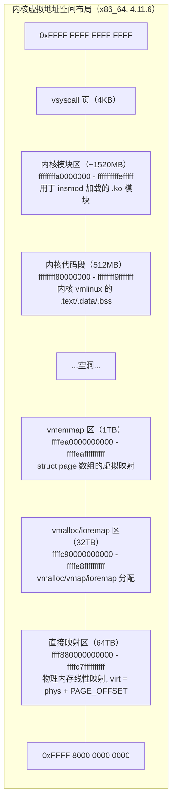

各区域的核心作用：

-   **直接映射区（Direct Mapping）**：这是内核中最重要的内存区域，内核将所有物理内存以线性偏移的方式映射到这个区域，虚拟地址与物理地址之间的转换只需要加减一个固定的偏移量 `PAGE_OFFSET`（即 `__pa(vaddr) = vaddr - PAGE_OFFSET`，`__va(paddr) = paddr + PAGE_OFFSET`）。内核中通过 `kmalloc` 分配的内存、`struct page` 管理的物理页等都位于直接映射区。在内核 4.11.6 中，直接映射区最大支持 `64TB` 物理内存
-   **vmalloc/ioremap 区**：用于 `vmalloc()` 分配的虚拟连续但物理不连续的内存，以及 `ioremap()` 映射的设备 I/O 内存。与直接映射区不同，vmalloc 区的虚拟地址到物理地址的映射需要通过页表逐级翻译
-   **vmemmap 区**：用于存放 `struct page` 数组的虚拟映射，使得内核可以用 `pfn_to_page(pfn)` 快速将物理页帧号转换为对应的 `struct page` 指针
-   **内核代码段**：内核镜像 vmlinux 的 `.text`（代码）、`.data`（已初始化数据）、`.bss`（未初始化数据）等 section 被映射到此区域
-   **内核模块区**：通过 `insmod` 动态加载的内核模块 `.ko` 文件被映射到此区域

####    直接映射区的核心地位

直接映射区是内核虚拟内存管理的基石，几乎所有的内核内存分配最终都会落到直接映射区：

```cpp
// 虚拟地址到物理地址的转换（直接映射区）
static inline unsigned long __pa(unsigned long x)
{
    return x - PAGE_OFFSET;
}

// 物理地址到虚拟地址的转换（直接映射区）
static inline void *__va(unsigned long x)
{
    return (void *)(x + PAGE_OFFSET);
}
```

通过 `kmalloc`、`alloc_pages` 等分配的内存都位于直接映射区，它们的虚拟地址和物理地址之间是固定偏移关系，转换开销极低。而 `vmalloc` 分配的内存虽然虚拟地址连续，但物理地址可能分散在不同的物理页中，每次访问都需要经过完整的页表翻译

##  0x02    符号表相关
内核提供了符号与地址的映射关系（内核只使用地址，符号表便于阅读&&调试），如DNS域名系统，通常，内核提供了有两类符号（映射）表：

-	`/boot/System.map-$(uname -r)`：包含整个内核镜像的符号表，是磁盘上真实文件
-	`/proc/kallsyms`：不仅包含内核镜像符号表，还包含所有动态加载模块的符号表（若函数被编译器内联inline或优化掉，则可能不存在于`/proc/kallsyms`），读取时内核动态生成

```cpp
[root@VM-X-X-centos ~]# ll -rth /boot/System.map-$(uname -r)
-rw-r--r-- 1 root root 4.6M Nov 26  2021 /boot/System.map-5.4.119-1-tlinux4-0008
[root@VM-X-X-centos ~]# ll -rth /proc/kallsyms
-r--r--r-- 1 root root 0 Jul 15 14:23 /proc/kallsyms
```

####	内核链接脚本：vmlinux.lds.S
内核链接脚本`vmlinux.lds.S`与kallsyms文件（内核符号表）之间的关系是编译阶段的协作关系，共同确保内核运行时能正确解析符号地址

1、编译流程中的依赖关系，`vmlinux.lds.S`作为链接脚本，定义了内核镜像 vmlinux的内存布局，包括代码段（`.text`）、数据段（`.data`）、初始化段（`__initcall`）等的起始/结束地址及对齐规则。即`vmlinux.lds.S`定义的布局决定了符号的物理地址，而kallsyms工具依赖这些地址生成符号表

2、内存布局中的协作，`vmlinux.lds.S`预留了符号表空间，控制内核各段的内存布局，确保代码/数据位于正确虚拟地址

3、运行时符号解析，当内核启动后，`/proc/kallsyms`通过上述数组动态解析符号地址与名称的映射关系

4、`vmlinux.lds.S`与`kallsyms`本质关系，`vmlinux.lds.S`是地基，定义内核内存布局，确定符号物理地址，而`kallsyms`是地图，用于基于地址布局生成符号名称映射，支持运行时调试

通过 vmlinux.lds.S 可以将内核的 section，大体分如下几个区间：

```TEXT
[  _text, _end )     //内核字段从 _text 入口，到 _end 结束
[  _stext, _etext )                               //文本段
[  __start_rodata, __end_rodata )                 //只读数据段
[  __init_begin, __init_end )                     //初始化段
[  __inittext_begin, __inittext_end )             //初始化文本段
[  __initdata_begin, __initdata_end )             //初始化数据段
[  _sdata, _edata )                               // 数据段，已初始化
[  __bss_start, __bss_stop )                      // bss 段，未初始化或全局变量
```

其中`.text` 段的布局如下：

```text
	.text : {			/* Real text segment		*/
		_stext = .;		/* Text and read-only data	*/
			__exception_text_start = .;
			*(.exception.text)
			__exception_text_end = .;
			IRQENTRY_TEXT
			SOFTIRQENTRY_TEXT
			ENTRY_TEXT
			TEXT_TEXT
			SCHED_TEXT
			CPUIDLE_TEXT
			LOCK_TEXT
			KPROBES_TEXT
			HYPERVISOR_TEXT
			IDMAP_TEXT
			HIBERNATE_TEXT
			TRAMP_TEXT
			*(.fixup)
			*(.gnu.warning)
		. = ALIGN(16);
		*(.got)			/* Global offset table		*/
	}
 
	. = ALIGN(SEGMENT_ALIGN);
	_etext = .;			/* End of text section */
```

####    符号表：kallsyms
每个符号条目包含以下信息：

-	地址：符号在内核地址空间中的虚拟地址
-	类型：符号的类型（如 `T` 表示函数，`D` 表示全局变量）
-	名称：符号的标识符

符号表的分类：

-	静态符号表（`System.map`）：编译时固定生成，仅包含内核核心符号。
-	动态符号表（`/proc/kallsyms`）：运行时动态生成，包含所有符号（内核核心 + 已加载模块的符号）

```bash
[root@VM-X-X-centos ~]# cat /proc/kallsyms |grep sys_call_table
ffffffff82200240 D sys_call_table
ffffffff82201260 D ia32_sys_call_table

[root@VM-X-X-centos ~]# grep "call_table" /boot/System.map-$(uname -r)
ffffffff81ba0d90 t brnf_sysctl_call_tables
ffffffff82200240 D sys_call_table
ffffffff82201260 D ia32_sys_call_table
```

对于上一小节提到的文本段`[_stext,_etext)`，看看实际数据是什么：

```BASH
[root@VM-X-X-centos edriver]# cat /proc/kallsyms |grep -A 20 _stext
ffffffff81000000 T _stext
ffffffff81000000 T _text
ffffffff81000030 T secondary_startup_64
ffffffff810000f0 T verify_cpu
ffffffff810001f0 T start_cpu0
ffffffff81000200 T __startup_64
ffffffff810005f0 T pvh_start_xen
ffffffff81000670 T __startup_secondary_64
ffffffff81000680 t trace_initcall_finish_cb
ffffffff810006c0 t perf_trace_initcall_level
ffffffff810007f0 t perf_trace_initcall_start
ffffffff810008c0 t perf_trace_initcall_finish
ffffffff810009a0 t trace_event_raw_event_initcall_level
ffffffff81000a80 t trace_raw_output_initcall_level
ffffffff81000ad0 t trace_raw_output_initcall_start
ffffffff81000b20 t trace_raw_output_initcall_finish
ffffffff81000b70 t __bpf_trace_initcall_level
......

[root@VM-X-X-centos edriver]# cat /proc/kallsyms |grep -B 10 _etext
ffffffff81e02530 T smp_error_interrupt
ffffffff81e026d0 T smp_irq_move_cleanup_interrupt
ffffffff81e02788 T __irqentry_text_end
ffffffff82000000 T __do_softirq
ffffffff82000000 T __softirqentry_text_start
ffffffff820002d7 T __softirqentry_text_end
ffffffff82000fbb t .E_read_words
ffffffff82000fbe t .E_leading_bytes
ffffffff82000fc0 t .E_trailing_bytes
ffffffff82000fc7 t .E_write_words
ffffffff82000fdc T _etext
```

再看下内核函数`do_sys_open`的地址，位于`[_stext,_etext)`之间：

```BASH
[root@VM-X-X-centos edriver]# cat /proc/kallsyms |grep -B 50000 _etext|grep do_sys_open
ffffffff81297210 T do_sys_open
ffffffff81bd61c5 t do_sys_open.cold.24
```

####    kallsyms：内核地址
在eBPF开发中，经常需要访问`/proc/kallsyms`文件来获取kprobe函数信息，`/proc/kallsyms` 中的符号地址是内核虚拟地址空间中的地址，而非进程用户空间的虚拟地址，对于`perf`、`ftrace`、`kprobe` 等工具也会依赖 `/proc/kallsyms` 解析内核地址（如 `perf report` 将地址转换为函数名）

`/proc/kallsyms`是 Linux 内核开启 `CONFIG_KALLSYMS`选项时由内核自动创建的一个虚拟文件，用于列出内核已编译进去的全部函数和变量等符号信息，简单理解`kallsyms`是一份**内核函数和变量名->虚拟内存地址的映射表**

```BASH
[root@VM-X-X-tencentos ebpf-pro]# cat /proc/kallsyms |grep do_sys_open
ffffffff813eae80 t __pfx_do_sys_openat2
ffffffff813eae90 t do_sys_openat2
ffffffff813eb8b0 T __pfx_do_sys_open
ffffffff813eb8c0 T do_sys_open
```

如上示例中，符号 `do_sys_open` 的地址 `ffffffff813eb8c0` 属于内核空间高位地址范围，由于进程用户空间是互相隔离的，每个进程拥有独立的用户空间（`32`位为 `0x00000000-0xBFFFFFFF`，`64`位为 `0x0000000000000000-0x00007FFFFFFFFFFF`），但所有进程共享同一份内核空间映射。`/proc/kallsyms` 的符号地址对所有进程是全局一致的。此外，虽然内核空间映射到每个进程的虚拟地址空间（通过页表），但进程在用户态是无权访问内核地址的，仅当进程通过系统调用陷入内核态时，才能访问内核空间

##	0x03	高端内存

####    32 位系统中的高端内存问题

在 32 位 Linux 系统中，内核虚拟地址空间只有 `1GB`（`0xC000 0000` ~ `0xFFFF FFFF`），其中直接映射区的大小约为 `896MB`。这意味着如果物理内存超过 `896MB`，内核就无法将全部物理内存直接线性映射到内核虚拟地址空间中。超出 `896MB` 的物理内存被称为**高端内存（High Memory）**，位于 `896MB` 以内的物理内存被称为**低端内存（Low Memory）**

为了能够访问高端内存中的物理页，32 位内核在虚拟地址空间中预留了 `128MB` 的区域用于临时映射高端内存页，主要通过以下机制实现：

-   **`kmap()`**：将一个高端内存物理页临时映射到内核虚拟地址空间中，使内核可以访问该页。`kmap` 可能会睡眠（如果映射槽位用完需要等待），因此不能在中断上下文中使用
-   **`kunmap()`**：解除 `kmap` 建立的临时映射
-   **`kmap_atomic()`**：原子映射，不会睡眠，每个 CPU 有固定的映射槽位，速度更快但使用限制更多

```cpp
// 32 位系统中访问高端内存物理页的典型用法
struct page *page = alloc_page(GFP_HIGHUSER);   // 从高端内存分配一页
void *vaddr = kmap(page);                        // 临时映射到内核虚拟地址
memset(vaddr, 0, PAGE_SIZE);                     // 通过虚拟地址访问
kunmap(page);                                    // 解除映射
```

####    64 位系统中高端内存的弱化

在 64 位系统中，内核虚拟地址空间有 `128TB`，其中直接映射区就有 `64TB`，远超当前任何服务器的物理内存容量。因此 64 位系统不存在高端内存的概念，所有物理内存都可以被直接映射到内核虚拟地址空间中

```text
32 位：内核虚拟空间 1GB，直接映射区 896MB → 需要高端内存机制
64 位：内核虚拟空间 128TB，直接映射区 64TB → 不需要高端内存机制
```

虽然 64 位内核源码中仍然保留了 `kmap`/`kunmap` 等 API（为了代码兼容性），但它们在 64 位系统上的实现本质上就是直接返回 `page_address(page)`（即直接映射区的地址），不做任何额外映射

##  0x04    页表体系构建与管理

页表是虚拟内存管理的核心，它建立了虚拟地址到物理地址的映射关系。在 4.11.6 内核中，x86_64 使用**四级页表**体系

####    四级页表结构

虚拟地址（`48` 位有效）被拆分为五段，分别用于索引四级页表和页内偏移：

```text
63    48 47    39 38    30 29    21 20    12 11        0
+-------+--------+--------+--------+--------+-----------+
| 符号   |  PGD   |  PUD   |  PMD   |  PTE   | Page      |
| 扩展   | 9 bits | 9 bits | 9 bits | 9 bits | Offset    |
|16 bits |        |        |        |        | 12 bits   |
+-------+--------+--------+--------+--------+-----------+
```

每级页表包含 `512` 个条目（`2^9 = 512`），每个条目占 `8` 字节（`64` 位），因此每个页表页大小为 `4KB`（`512 * 8 = 4096`），恰好是一个物理页

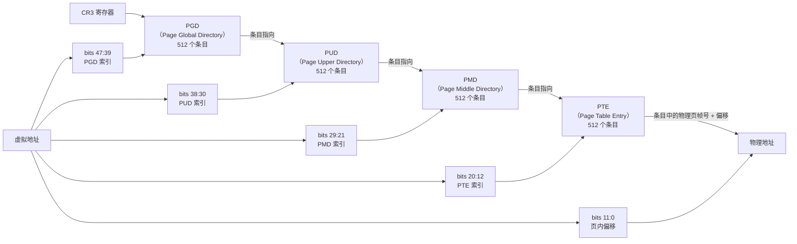

对应的内核数据类型和核心索引宏：

```cpp
// 4.11.6 中的页表类型定义
typedef struct { unsigned long pgd; } pgd_t;   // 顶级页目录项
typedef struct { unsigned long pud; } pud_t;   // 上级页目录项
typedef struct { unsigned long pmd; } pmd_t;   // 中间页目录项
typedef struct { unsigned long pte; } pte_t;   // 页表项

// 从虚拟地址获取各级页表索引的核心宏
#define pgd_index(address)  (((address) >> PGDIR_SHIFT) & (PTRS_PER_PGD - 1))
#define pud_index(address)  (((address) >> PUD_SHIFT) & (PTRS_PER_PUD - 1))
#define pmd_index(address)  (((address) >> PMD_SHIFT) & (PTRS_PER_PMD - 1))
#define pte_index(address)  (((address) >> PAGE_SHIFT) & (PTRS_PER_PTE - 1))

// x86_64 下的常量
#define PGDIR_SHIFT     39
#define PUD_SHIFT       30
#define PMD_SHIFT       21
#define PAGE_SHIFT      12
#define PTRS_PER_PGD    512
#define PTRS_PER_PUD    512
#define PTRS_PER_PMD    512
#define PTRS_PER_PTE    512
```

####    PTE 页表项的标志位

每个 PTE 页表项中不仅存储了物理页帧号（PFN），还包含了一系列控制位，这些标志位对虚拟内存管理至关重要：

```text
63  62     NX（No Execute）: 1=不可执行
......
12  物理页帧号（PFN）的高位
11  -
10  -
9   -
8   G（Global）: 1=全局页，TLB 刷新时不清除
7   PS（Page Size）: 在 PMD 中使用，1=2MB 大页
6   D（Dirty）: 1=页面已被写入
5   A（Accessed）: 1=页面已被访问过
4   PCD（Page Cache Disable）: 1=禁用缓存
3   PWT（Page Write Through）: 1=写穿透
2   U/S（User/Supervisor）: 1=用户态可访问，0=仅内核态
1   R/W（Read/Write）: 1=可读写，0=只读
0   P（Present）: 1=页面在内存中，0=不在（缺页中断的触发条件）
```

内核中操作这些标志位的宏：

```cpp
// 检查 PTE 是否存在（Present 位）
static inline int pte_present(pte_t a) { return pte_flags(a) & (_PAGE_PRESENT | _PAGE_PROTNONE); }
// 检查 PTE 是否可写
static inline int pte_write(pte_t a)   { return pte_flags(a) & _PAGE_RW; }
// 检查 PTE 是否脏（被写过）
static inline int pte_dirty(pte_t a)   { return pte_flags(a) & _PAGE_DIRTY; }
// 设置 PTE 为只读（清除 R/W 位）
static inline pte_t pte_wrprotect(pte_t pte) { return pte_clear_flags(pte, _PAGE_RW); }
// 设置 PTE 为可写
static inline pte_t pte_mkwrite(pte_t pte)   { return pte_set_flags(pte, _PAGE_RW); }
// 设置 PTE 为脏
static inline pte_t pte_mkdirty(pte_t pte)   { return pte_set_flags(pte, _PAGE_DIRTY); }
```

####    页表的渐进式分配

前文讨论过进程创建的过程，这里内核一个关键的设计理念是：**内核不会在进程创建时就为其建立完整的页表体系**。在进程创建（`fork`）时，内核只为进程分配一张顶级页目录 PGD（通过 `mm_struct->pgd`），中间的 PUD、PMD 以及最底层的 PTE 页表页都是在**缺页中断**发生时按需分配的

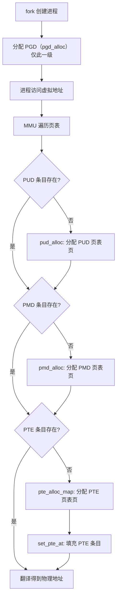

缺页中断处理中页表分配的核心代码路径（[`__handle_mm_fault`](https://elixir.bootlin.com/linux/v4.11.6/source/mm/memory.c#L3586)）：

```cpp
static int __handle_mm_fault(struct vm_area_struct *vma, unsigned long address,
                             unsigned int flags)
{
    struct vm_fault vmf = { ... };
    struct mm_struct *mm = vma->vm_mm;
    pgd_t *pgd;
    pud_t *pud;
    pmd_t *pmd;

    pgd = pgd_offset(mm, address);       // 从 mm->pgd 获取 PGD 条目

    pud = pud_alloc(mm, pgd, address);   // 如果 PUD 不存在则分配
    if (!pud)
        return VM_FAULT_OOM;

    pmd = pmd_alloc(mm, pud, address);   // 如果 PMD 不存在则分配
    if (!pmd)
        return VM_FAULT_OOM;

    // ... 检查是否是大页映射 ...

    return handle_pte_fault(&vmf);        // 处理 PTE 级别的缺页
}
```

##  0x05    缺页中断（Page Fault）处理流程

缺页中断是虚拟内存管理的核心机制，当 CPU 访问的虚拟地址在页表中没有有效映射时，MMU 会触发缺页中断，由内核的缺页中断处理程序来处理

####    缺页中断的触发条件

以下情况会触发缺页中断：
-   PTE 不存在（页表项为空，页表页尚未分配）
-   PTE 的 `Present` 位为 `0`（页面被换出到 swap，或尚未分配物理页）
-   PTE 权限不匹配（如写入只读页面，触发写保护缺页）

####    完整的缺页中断处理流程

x86_64 架构下，缺页中断的入口为 [`do_page_fault`](https://elixir.bootlin.com/linux/v4.11.6/source/arch/x86/mm/fault.c#L1397)，完整的调用链和判断分支如下：

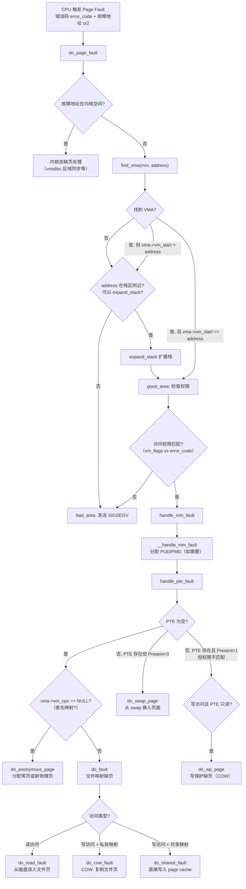

####    各缺页处理分支详解

1、[`do_anonymous_page`](https://elixir.bootlin.com/linux/v4.11.6/source/mm/memory.c#L2848)：处理匿名页缺页

```cpp
static int do_anonymous_page(struct vm_fault *vmf)
{
    struct vm_area_struct *vma = vmf->vma;
    pte_t entry;

    // 如果是读访问，映射到全局零页，避免物理内存浪费
    if (!(vmf->flags & FAULT_FLAG_WRITE) &&
            !mm_forbids_zeropage(vma->vm_mm)) {
        entry = pte_mkspecial(pfn_pte(my_zero_pfn(vmf->address),
                                      vma->vm_page_prot));
        // ... 设置 PTE 指向零页 ...
        goto setpte;
    }

    // 写访问：分配新的物理页并清零
    page = alloc_zeroed_user_highpage_movable(vma, vmf->address);
    if (!page)
        return VM_FAULT_OOM;

    // 建立匿名反向映射（rmap），用于页面回收时找到映射此页的所有 PTE
    __SetPageUptodate(page);
    entry = mk_pte(page, vma->vm_page_prot);
    if (vma->vm_flags & VM_WRITE)
        entry = pte_mkwrite(pte_mkdirty(entry));

setpte:
    set_pte_at(vma->vm_mm, vmf->address, vmf->pte, entry);
    // ...
    return 0;
}
```

2、[`do_fault`](https://elixir.bootlin.com/linux/v4.11.6/source/mm/memory.c#L3229)：处理文件页缺页（内部根据访问类型分发）

```cpp
static int do_fault(struct vm_fault *vmf)
{
    struct vm_area_struct *vma = vmf->vma;

    if (!vma->vm_ops->fault)
        return VM_FAULT_SIGBUS;

    if (!(vmf->flags & FAULT_FLAG_WRITE))
        return do_read_fault(vmf);      // 读缺页

    if (!(vma->vm_flags & VM_SHARED))
        return do_cow_fault(vmf);       // 私有文件映射写缺页（COW）

    return do_shared_fault(vmf);         // 共享文件映射写缺页
}
```

3、[`do_read_fault`](https://elixir.bootlin.com/linux/v4.11.6/source/mm/memory.c#L3147)：文件读缺页的核心流程

```cpp
static int do_read_fault(struct vm_fault *vmf)
{
    // 调用 vma->vm_ops->fault（如 ext4_filemap_fault）
    // 内部会在 page cache 中查找或从磁盘读入文件页
    ret = __do_fault(vmf);

    // 建立 PTE 映射：虚拟地址 -> page cache 中的文件页
    // PTE 为只读
    ret |= finish_fault(vmf);
    return ret;
}
```

4、[`do_wp_page`](https://elixir.bootlin.com/linux/v4.11.6/source/mm/memory.c#L2278)：写保护缺页（Copy-On-Write）

```cpp
static int do_wp_page(struct vm_fault *vmf)
{
    struct vm_area_struct *vma = vmf->vma;

    // 获取当前 PTE 映射的旧物理页
    vmf->page = vm_normal_page(vma, vmf->address, vmf->orig_pte);

    // 如果是私有映射且只有一个映射者，可以直接复用（无需复制）
    if (page_mapcount(vmf->page) == 1 && ...) {
        // 直接将 PTE 设为可写
        wp_page_reuse(vmf);
        return VM_FAULT_WRITE;
    }

    // 需要 COW：分配新页，复制旧页内容，更新 PTE 指向新页
    return wp_page_copy(vmf);
}
```

##  0x06    物理内存分配与虚拟内存关联

缺页中断处理过程中需要分配物理内存页，内核提供了多层次的物理内存分配接口

####    伙伴系统（Buddy System）

伙伴系统是 Linux 内核物理内存分配的基础，它管理空闲的物理页帧，以 `2^n` 个连续页帧为单位进行分配和释放（`n` 从 `0` 到 `MAX_ORDER-1`，通常 `MAX_ORDER=11`，即最大分配 `2^10 = 1024` 个连续页 = `4MB`）

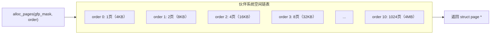

核心分配接口：

```cpp
// 分配 2^order 个连续物理页，返回第一个页的 struct page 指针
struct page *alloc_pages(gfp_t gfp_mask, unsigned int order);

// 分配单个物理页
#define alloc_page(gfp_mask) alloc_pages(gfp_mask, 0)

// 分配并返回内核虚拟地址（直接映射区的地址）
unsigned long __get_free_pages(gfp_t gfp_mask, unsigned int order);

// 分配单页并清零
unsigned long get_zeroed_page(gfp_t gfp_mask);
```

其中 `gfp_mask`（Get Free Pages mask）是分配标志，常见取值：

-   `GFP_KERNEL`：常规内核分配，可以睡眠
-   `GFP_ATOMIC`：原子分配，不可睡眠（用于中断上下文）
-   `GFP_HIGHUSER_MOVABLE`：用于用户空间页面分配，可从高端内存分配，页面可迁移

####    slab/slub 分配器

伙伴系统以页为最小单位分配，但内核中频繁需要分配远小于一页的对象（如 `struct vm_area_struct`、`struct inode` 等）。slab/slub 分配器在伙伴系统之上构建，将物理页切分为固定大小的小对象来管理：

```cpp
// 创建一个 slab 缓存，用于分配固定大小的对象
struct kmem_cache *kmem_cache_create(const char *name, size_t size,
                                     size_t align, unsigned long flags,
                                     void (*ctor)(void *));

// 从 slab 缓存中分配一个对象
void *kmem_cache_alloc(struct kmem_cache *cachep, gfp_t flags);

// 通用的小对象分配（内部使用预定义的 slab 缓存）
void *kmalloc(size_t size, gfp_t flags);
```

在虚拟内存管理中，VMA 结构体的分配就是通过 slab 完成的：

```cpp
// mmap_region 中分配 VMA
vma = kmem_cache_zalloc(vm_area_cachep, GFP_KERNEL);
```

####    物理页到 PTE 的关联

物理内存分配完成后，需要将物理页帧号填入 PTE 中，并设置相应的权限标志位，这一步通过 [`set_pte_at`](https://elixir.bootlin.com/linux/v4.11.6/source/arch/x86/include/asm/pgtable.h#L80) 完成：

```cpp
// 将物理页和权限组装成 PTE 条目
pte_t entry = mk_pte(page, vma->vm_page_prot);

// 根据需要设置可写、脏等标志
if (vma->vm_flags & VM_WRITE)
    entry = pte_mkwrite(pte_mkdirty(entry));

// 将 PTE 写入页表
set_pte_at(mm, address, pte, entry);
```

其中 [`mk_pte`](https://elixir.bootlin.com/linux/v4.11.6/source/arch/x86/include/asm/pgtable.h#L384) 将 `struct page` 的物理页帧号（PFN）和页面保护属性组合成一个完整的 PTE 条目

##  0x07    完整流程：从 mmap 到写入物理内存

本节从全局视角，完整、详细地描述一次内存映射从 `mmap` 系统调用开始，到进程最终能够读写物理内存的端到端过程。分别以**共享文件映射**和**私有匿名映射**两条线路展开

####    线路A：mmap 共享文件映射完整流程

场景：进程调用 `mmap(NULL, len, PROT_READ|PROT_WRITE, MAP_SHARED, fd, offset)` 将一个文件映射到虚拟内存中，然后对映射区域进行写入

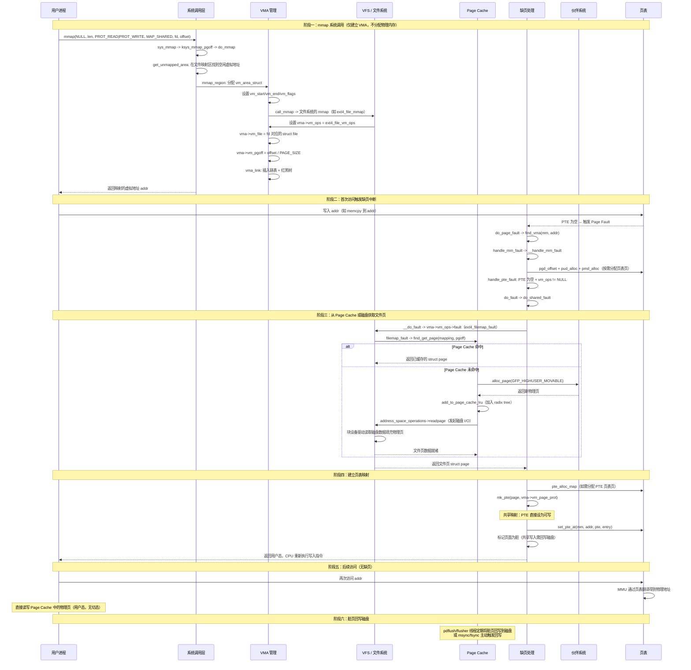

**阶段总结**：

| 阶段 | 核心操作 | 关键内核函数 |
|------|---------|-------------|
| mmap 调用 | 创建 VMA，建立 VMA↔文件的关联 | `do_mmap` -> `mmap_region` -> `call_mmap` |
| 缺页中断 | 逐级分配页表页，判断缺页类型 | `do_page_fault` -> `handle_mm_fault` -> `handle_pte_fault` |
| 获取文件页 | 查找/填充 Page Cache | `do_shared_fault` -> `__do_fault` -> `filemap_fault` |
| 建立映射 | 将 PTE 关联到物理页 | `mk_pte` + `set_pte_at` |
| 脏页回写 | Page Cache 中的脏页写回磁盘 | `pdflush` / `writeback` / `msync` |

####    线路B：mmap 私有匿名映射完整流程

场景：进程调用 `mmap(NULL, len, PROT_READ|PROT_WRITE, MAP_PRIVATE|MAP_ANONYMOUS, -1, 0)` 申请一块私有匿名内存（如 `malloc` 大块内存分配），然后对其进行写入

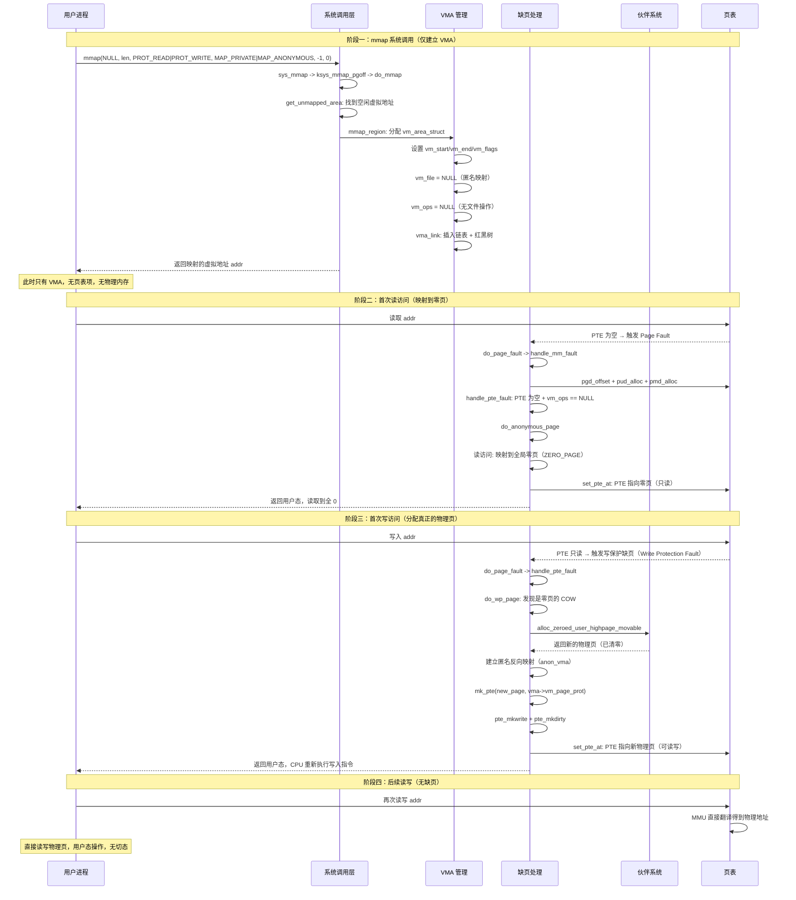

如果进程首次访问就是写访问（跳过读零页阶段），则 `do_anonymous_page` 会直接分配新物理页并设置可写的 PTE，路径更短：


**阶段总结**：

| 阶段 | 核心操作 | 关键内核函数 |
|------|---------|-------------|
| mmap 调用 | 创建 VMA（无文件关联） | `do_mmap` -> `mmap_region` |
| 首次读 | 映射零页，避免物理内存浪费 | `do_anonymous_page` -> `ZERO_PAGE` |
| 首次写 | 分配物理页，建立可写映射 | `do_wp_page` 或 `do_anonymous_page` -> `alloc_zeroed_user_highpage_movable` |
| 后续访问 | MMU 直接翻译，无缺页 | 硬件页表翻译 |

####    两种映射方式的核心对比

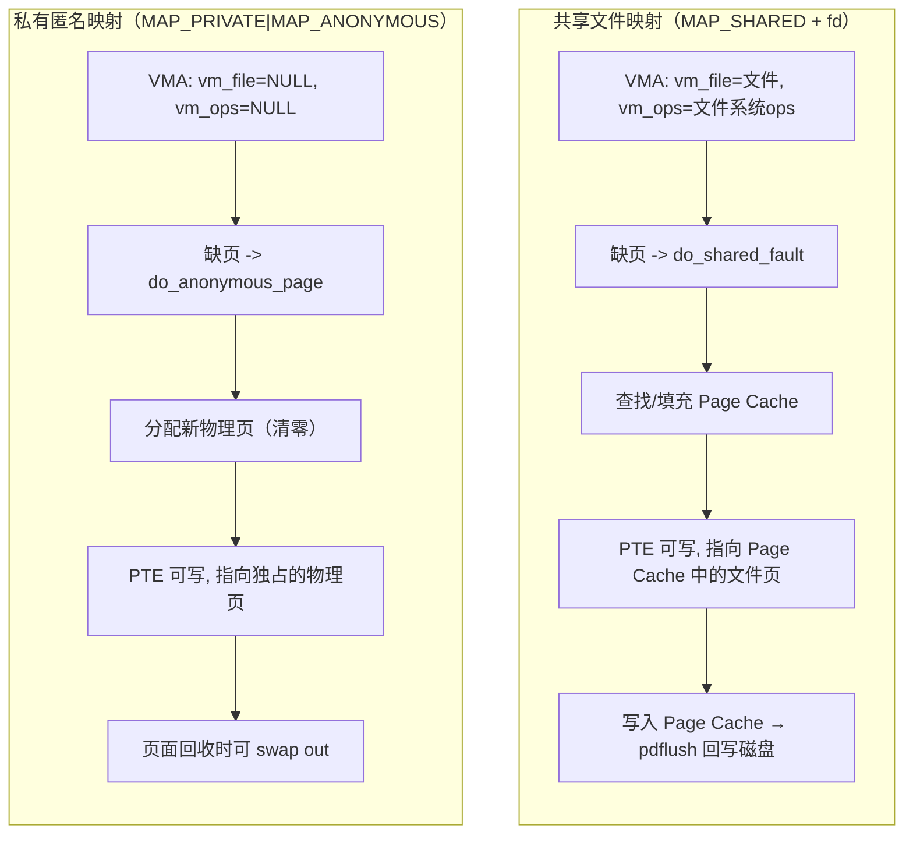

####    关键数据结构关联全景图

从 mmap 到物理内存访问涉及的核心数据结构关联：

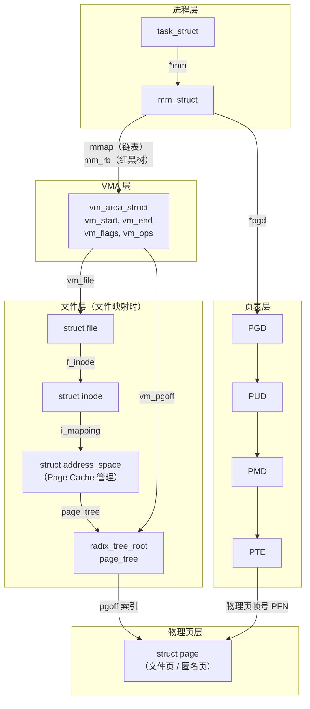

##  0x08    64 位下内核访问内核/用户虚拟地址空间的机制

> 说明：本节的 eBPF 相关章节基于 [6.6.47 内核版本](https://elixir.bootlin.com/linux/v6.6.47/source)

前文分析了内核态虚拟地址空间的布局。在 eBPF 开发中，也有一个极易踩坑的问题：**内核代码在访问「内核虚拟地址」和「用户虚拟地址」时，走的是完全不同的两条路径**。理解这一点，才能理解 `bpf_probe_read_kernel` 与 `bpf_probe_read_user` 为什么要分成两个 helper

####    64 位地址空间的二分与共享

在 x86\_64（4 级页表、48 位有效虚拟地址）上，虚拟地址空间被划分为两个不相交的半区：

```text
用户半区（低）: 0x0000_0000_0000_0000 ~ 0x0000_7FFF_FFFF_FFFF   （128TB，每进程独立）
   ...canonical 空洞（非法地址）...
内核半区（高）: 0xFFFF_8000_0000_0000 ~ 0xFFFF_FFFF_FFFF_FFFF   （128TB，全进程共享）
```

上述知识点引入了如下关键事实：

-   **内核半区在每个进程的页表中都存在且内容一致**（内核页表项被同步/共享到所有进程的 PGD 高半部分），因此不论当前运行在哪个进程上下文，内核虚拟地址始终是有效且指向同一份物理内存的
-   **用户半区随进程而变**：`CR3` 寄存器在进程切换时被换成新进程的 PGD 物理地址，用户半区的映射随之切换。也就是说，一个用户虚拟地址只有在其所属进程为当前进程（`current`）时才有意义

####    路径一：内核访问内核虚拟地址（直接解引用）

内核代码访问内核地址时，**直接解引用即可**，因为该地址恒定有效、恒定映射：

```cpp
// 直接读取内核全局变量 / 内核对象字段，无需任何保护
extern const sys_call_ptr_t sys_call_table[];
unsigned long addr = (unsigned long)sys_call_table[__NR_openat];   // 直接访问

struct task_struct *p = current;
pid_t pid = p->pid;            // 直接解引用内核指针
```

在这条路径上，内核**不需要做任何地址合法性校验**：如果这里发生了缺页（Page Fault），说明内核逻辑本身出了 bug（比如解引用了野指针），缺页处理程序会判定故障地址落在内核空间且无对应 VMA/映射，直接触发 `oops`（内核崩溃），而不是优雅返回错误

####    路径二：内核访问用户虚拟地址（受控访问）

内核在系统调用等场景中经常需要读写用户态传入的缓冲区（如 `read()`/`write()` 的 `buf`），但**绝不能像访问内核地址那样直接解引用用户指针**，原因有四：

1.  **用户页可能尚未映射或被换出**：用户内存是惰性分配的（见 0x05 缺页中断），直接访问可能触发缺页，必须以可恢复的方式访问
2.  **指针可能非法或恶意**：用户指针来自用户态，可能指向内核地址、非 canonical 地址或未映射区。若不校验，用户程序就能诱导内核读写任意地址（经典的越权/提权漏洞）
3.  **SMAP（Supervisor Mode Access Prevention）**：自 Intel Broadwell 起，CPU 默认禁止内核态（ring0）直接访问用户页，除非临时置位 `EFLAGS.AC`。内核通过 `STAC`/`CLAC` 指令在访问用户内存前后开关该标志
4.  **进程上下文约束**：用户地址只在 `current->mm` 正确时才有意义。在硬中断、部分内核线程（`current->mm == NULL`）等上下文中，当前 `CR3` 未必指向目标进程的地址空间，此时访问某个用户地址就是错误的

因此内核统一通过 **`access_ok()` + `copy_from_user()`/`copy_to_user()`/`get_user()`/`put_user()`** 这套 uaccess 接口访问用户内存，它们完成三件事：

-   **`access_ok(addr, size)`**：校验 `[addr, addr+size)` 完整落在用户地址区间（6.x 内核中退化为对 `TASK_SIZE_MAX` 的纯范围检查；4.x/5.x 内核早期依赖 `set_fs()` 设置的 `addr_limit`）
-   **`STAC`/`CLAC`**：临时放开 SMAP，访问结束立即关闭
-   **异常修复表（`_ASM_EXTABLE`）**：为每条用户内存访问指令登记一个修复地址。一旦访问触发缺页且无法修复（坏地址），缺页处理程序不会 `oops`，而是跳转到修复地址，让 uaccess 函数返回 `-EFAULT`

以 `read()` 系统调用把内核数据拷回用户缓冲区为例（简化）：

```c
// 内核态：kbuf 是内核地址（直接用），buf 是用户地址（必须走 copy_to_user）
ssize_t xx_read(char __user *buf, const char *kbuf, size_t n)
{
    // copy_to_user 内部：access_ok(buf, n) → STAC → 逐字拷贝(带异常修复) → CLAC
    if (copy_to_user(buf, kbuf, n))
        return -EFAULT;      // 坏地址被优雅转换为错误码，而非崩溃
    return n;
}
```

####    两条路径对比

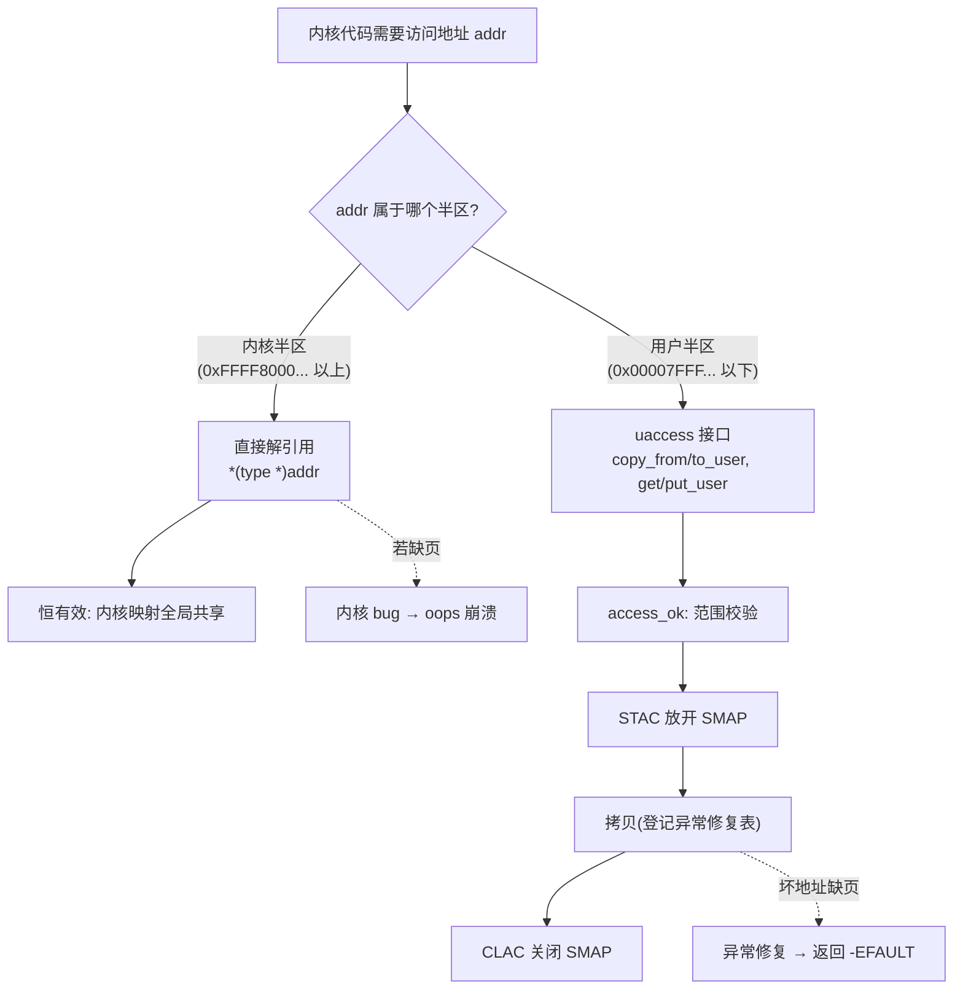

| 对比维度 | 内核访问内核 VA | 内核访问用户 VA |
| --- | --- | --- |
| 访问方式 | 直接解引用 | `copy_from_user` 等 uaccess 接口 |
| 是否 `access_ok` 校验 | 否 | 是（须落在用户区间） |
| 是否处理 SMAP（STAC/CLAC） | 否 | 是 |
| 映射是否恒有效 | 是（全局共享） | 否（随进程切换，可能未分配/被换出） |
| 上下文要求 | 无 | 需 `current->mm` 正确 |
| 访问坏地址的后果 | `oops`（视为内核 bug） | 优雅返回 `-EFAULT`（异常修复表兜底） |

这套**内核地址直接访问、用户地址受控访问**的差异，正是 eBPF 两个 helper 分开实现的根本原因

##  0x09    bpf_probe_read_user 与 bpf_probe_read_kernel 的实现

####    为什么 eBPF 必须用专门的 helper

eBPF 程序运行在内核态，但它是**受限、不可信**的代码，verifier 禁止它直接解引用任意指针（否则一个坏指针就能让内核崩溃）。而在 `kprobe`/`tracepoint` 等挂载点，开发者拿到的函数参数往往是指针，指向的内存对 eBPF 而言是 unsafe 的，可能是用户地址、可能是尚未映射的内核地址。因此 eBPF 只能通过**带缺页保护（fault-safe）的 helper** 来读取目标内存，即 `bpf_probe_read_*` 系列

####    版本演进：从一个 helper 到两个

结合上一节内容可知，读取用户内存和读取内核内存在底层是两条不同路径，eBPF helper 的演进也正是围绕这一点：

```text
≤ 5.4   仅有 bpf_probe_read
        └─ probe_kernel_read()  →  set_fs(KERNEL_DS) + __copy_from_user_inatomic
           在 x86_64 上「恰好」能读用户/内核地址，但语义含糊、不可移植

  5.5   拆分为 bpf_probe_read_user / bpf_probe_read_kernel（+ *_str）
        ├─ probe_user_read()   →  set_fs(USER_DS)   + access_ok + __copy_from_user_inatomic
        └─ probe_kernel_read() →  set_fs(KERNEL_DS) + __copy_from_user_inatomic
           (commit 6ae08ae3dea2, Daniel Borkmann)

5.10~5.18  set_fs()/addr_limit 机制被彻底移除
           probe_user_read   → copy_from_user_nofault
           probe_kernel_read → copy_from_kernel_nofault

  6.x   当前形态（本文）
        ├─ bpf_probe_read_user   → copy_from_user_nofault
        └─ bpf_probe_read_kernel → copy_from_kernel_nofault
```

> 注：`bpf_probe_read_user`/`bpf_probe_read_kernel` 是 5.5 才正式引入的（部分发行版5.4也已支持）

####    6.x 实现剖析

**（1）`bpf_probe_read_user` → `copy_from_user_nofault`**

[`kernel/trace/bpf_trace.c`](https://elixir.bootlin.com/linux/v6.6/source/kernel/trace/bpf_trace.c)：

```cpp
static __always_inline int
bpf_probe_read_user_common(void *dst, u32 size, const void __user *unsafe_ptr)
{
    int ret = copy_from_user_nofault(dst, unsafe_ptr, size);
    if (unlikely(ret < 0))
        memset(dst, 0, size);       // 出错时清零目标缓冲区
    return ret;
}

BPF_CALL_3(bpf_probe_read_user, void *, dst, u32, size,
           const void __user *, unsafe_ptr)
{
    return bpf_probe_read_user_common(dst, size, unsafe_ptr);
}
```

[`mm/maccess.c`](https://elixir.bootlin.com/linux/v6.6/source/mm/maccess.c)：

```cpp
long copy_from_user_nofault(void *dst, const void __user *src, size_t size)
{
    long ret = -EFAULT;

    if (!__access_ok(src, size))    // 1、src 必须落在用户地址区间
        return ret;
    if (!nmi_uaccess_okay())        // 2、当前 CR3/mm 上下文必须正确（NMI 等场景保护）
        return ret;

    pagefault_disable();            // 3、关缺页：不允许睡眠去做缺页换入
    ret = __copy_from_user_inatomic(dst, src, size);  // 4、uaccess 原语：STAC/CLAC + 异常修复
    pagefault_enable();

    return ret ? -EFAULT : 0;
}
```

上述代码实现要点，走的是**用户内存访问原语** `__copy_from_user_inatomic`，因此天然带 SMAP 的 `STAC/CLAC`、`access_ok` 用户区间校验，并通过 `current` 的页表（用户半区）读取；`pagefault_disable()` 保证即使目标页未驻留也不会去走睡眠式缺页换入，而是直接经异常修复返回 `-EFAULT`

**（2）`bpf_probe_read_kernel` → `copy_from_kernel_nofault`**

```cpp
BPF_CALL_3(bpf_probe_read_kernel, void *, dst, u32, size,
           const void *, unsafe_ptr)
{
    return bpf_probe_read_kernel_common(dst, size, unsafe_ptr);   // 内部同样出错清零
}
```

```cpp
long copy_from_kernel_nofault(void *dst, const void *src, size_t size)
{
    unsigned long align = 0;
    ...
    if (!copy_from_kernel_nofault_allowed(src, size))   // 1、架构钩子：可拒绝非法内核区间
        return -ERANGE;

    pagefault_disable();
    // 2、按对齐用内核访问原语逐字长拷贝（u64/u32/u16/u8）
    if (!(align & 7))
        copy_from_kernel_nofault_loop(dst, src, size, u64, Efault);
    ...
    copy_from_kernel_nofault_loop(dst, src, size, u8,  Efault);
    pagefault_enable();
    return 0;
Efault:
    pagefault_enable();
    return -EFAULT;         // 3、坏地址经异常修复跳到这里
}
// 循环体展开为 __get_kernel_nofault()，即内核内存访问原语，无 SMAP 切换、无用户区间校验
```

要点：走的是**内核内存访问原语** `__get_kernel_nofault`，**不做** SMAP `STAC/CLAC`（访问的是内核页）、**不做** `access_ok` 用户区间校验；取而代之的是架构相关的 `copy_from_kernel_nofault_allowed()` 钩子（在用户/内核地址空间不重叠的架构上可拒绝非法区间），同样以 `pagefault_disable()` + 异常修复保证不会 `oops`

此外，`bpf_probe_read_kernel`/`bpf_probe_read_kernel_str` 在 `func_proto` 查找处还受 `security_locked_down(LOCKDOWN_BPF_READ_KERNEL)` 管控（内核 lockdown 打开时禁用读内核内存）

####    核心差异对比

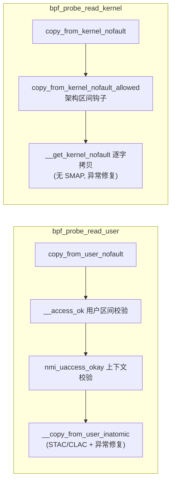

| 维度 | `bpf_probe_read_user` | `bpf_probe_read_kernel` |
| --- | --- | --- |
| 目标地址空间 | 用户半区（`< TASK_SIZE`） | 内核半区 |
| 底层函数 | `copy_from_user_nofault` | `copy_from_kernel_nofault` |
| 访问原语 | `__copy_from_user_inatomic` | `__get_kernel_nofault` |
| 地址校验 | `__access_ok`（用户区间） | `copy_from_kernel_nofault_allowed`（架构相关） |
| SMAP（STAC/CLAC） | 需要 | 不需要 |
| 上下文要求 | 需 `current->mm`/CR3 正确 | 无特殊要求 |
| 缺页处理 | `pagefault_disable` + 异常修复 → `-EFAULT` | 同左 |
| lockdown 管控 | 无 | `LOCKDOWN_BPF_READ_KERNEL` |
| 典型数据 | `filename`、`sockaddr`、`argv` 等用户缓冲 | `sk_buff`、`task_struct`、`sock` 等内核对象 |

####    为什么不合并成一个 helper

-   **可移植性**：在 s390 等用户/内核地址空间不重叠的架构上，必须用对应的访问原语才能寻址正确的空间，用内核原语去读用户地址会失败
-   **SMAP 正确性**：读用户内存必须开关 `AC` 标志，读内核内存则不能
-   **语义需清晰**：在 x86\_64 上老式 `bpf_probe_read` 混用，但语义含糊、跨架构不可移植。显式区分 user/kernel 让 verifier 与 CO-RE 能做正确处理

##  0x0A    bpf_probe_read_user / bpf_probe_read_kernel 的典型使用

以 `libbpf`与 CO-RE 举例，核心原则为**判断被读指针指向用户空间还是内核空间，用户指针用 `_user` 变体，内核指针用 `_kernel` 变体**

####    挂载点：内核内部函数 vs 系统调用入口

-   `do_sys_openat2` 是**内核内部函数**，参数即为普通函数入参，直接用 `BPF_KPROBE` 宏取参
-   `__x64_sys_connect` 是 x86\_64 上的**系统调用入口封装**（`SYSCALL_DEFINE` 展开生成），其真实参数被打包在 `struct pt_regs *regs` 中，需用 `BPF_KPROBE_SYSCALL` 宏解包

####    kprobe/do_sys_openat2：读用户空间字符串

内核原型（[`fs/open.c`](https://elixir.bootlin.com/linux/v6.6/source/fs/open.c)）：

```cpp
// filename 带 __user 标注，指向用户空间
static long do_sys_openat2(int dfd, const char __user *filename, struct open_how *how);
```

对eBPF 程序而言，因为`filename` 是用户指针，必须用 `bpf_probe_read_user_str()`，sample如下：

```cpp
#include <vmlinux.h>
#include <bpf/bpf_helpers.h>
#include <bpf/bpf_tracing.h>

char LICENSE[] SEC("license") = "GPL";   // probe_read 系列要求 GPL

SEC("kprobe/do_sys_openat2")
int BPF_KPROBE(k_openat2, int dfd, const char *filename, struct open_how *how)
{
    char fname[256];

    // filename 指向用户空间 → 必须用 _user 变体；_str 会在遇到 '\0' 时停止
    long n = bpf_probe_read_user_str(fname, sizeof(fname), filename);
    if (n > 0)
        bpf_printk("openat2 dfd=%d file=%s", dfd, fname);
    return 0;
}
```

####    kprobe/__x64_sys_connect：读用户空间结构体

内核原型（[`net/socket.c`](https://elixir.bootlin.com/linux/v6.6/source/net/socket.c)

```cpp
// uservaddr 带 __user 标注，指向用户空间的 sockaddr
int __sys_connect(int fd, struct sockaddr __user *uservaddr, int addrlen);
```

对eBPF 程序而言，用 `BPF_KPROBE_SYSCALL` 解包系统调用参数，`uservaddr` 是用户指针，用 `bpf_probe_read_user()` 拷贝定长结构体。sample代码如下：

```cpp
SEC("kprobe/__x64_sys_connect")
int BPF_KPROBE_SYSCALL(k_connect, int fd, struct sockaddr *uservaddr, int addrlen)
{
    struct sockaddr_in sa = {};

    // uservaddr 指向用户空间 → _user 变体，按定长拷贝
    if (bpf_probe_read_user(&sa, sizeof(sa), uservaddr) != 0)
        return 0;

    if (sa.sin_family == AF_INET) {
        __u16 dport = bpf_ntohs(sa.sin_port);
        __u32 daddr = sa.sin_addr.s_addr;
        bpf_printk("connect fd=%d daddr=%x dport=%d", fd, daddr, dport);
    }
    return 0;
}
```

> 说明：`BPF_KPROBE_SYSCALL` 会自动处理（syscall 参数封装在 `pt_regs` 里），这层间接（等价于先取 `regs`，再从中提取 `di/si/dx` 等寄存器）。若直接用 `BPF_KPROBE`，拿到的第一个参数会是 `struct pt_regs *`，取不到真实入参

####    kprobe/tcp_sendmsg：读内核空间结构体

作为内核调用函数，`sk` 指向的是内核对象，必须用 `bpf_probe_read_kernel()`：

```cpp
// tcp_sendmsg(struct sock *sk, struct msghdr *msg, size_t size)
SEC("kprobe/tcp_sendmsg")
int BPF_KPROBE(k_tcp_sendmsg, struct sock *sk)
{
    __u16 dport = 0;

    // &sk->__sk_common.skc_dport 是内核地址 → _kernel 变体
    bpf_probe_read_kernel(&dport, sizeof(dport), &sk->__sk_common.skc_dport);
    bpf_printk("tcp_sendmsg dport=%d", bpf_ntohs(dport));
    return 0;
}
```

在 CO-RE 场景中，`BPF_CORE_READ(sk, __sk_common.skc_dport)` 底层展开即为 `bpf_probe_read_kernel()`；若要读用户指针链，应使用 `bpf_probe_read_user()` 或 `BPF_CORE_READ_USER()`

####    小结

| 指针来源 | 应使用 |
| --- | --- |
| 带 `__user` 标注 / 来自 syscall 用户入参（`filename`、`buf`、`sockaddr`、`argv`...） | `bpf_probe_read_user[_str]` |
| 内核对象字段 / 内核函数返回的内核指针（`sk`、`task`、`skb`、`dentry`...） | `bpf_probe_read_kernel[_str]` / `BPF_CORE_READ` |

一些常见问题：

-   **用错变体**：在 x86\_64 上用 `bpf_probe_read_user` 读内核地址会被 `__access_ok` 直接拒绝（返回 `-EFAULT`）；用 `bpf_probe_read_kernel` 读用户地址在多数情况会失败或读到错误数据。出错时目标缓冲区被 `memset(0)`，容易表现为「读到全 0」的静默错误
-   **字符串 vs 定长**：读 C 字符串用 `_str` 变体（遇 `\0` 停止并返回长度）；读定长结构体用非 `_str` 变体
-   **License**：`probe_read` 系列为 GPL-only，程序需声明 `char LICENSE[] SEC("license") = "GPL";`
-   **上下文**：读用户内存依赖 `current` 为目标进程；在与目标进程无关的上下文（如无关的软/硬中断）中读用户地址无意义

##  0x0B  参考
-   [4.6 深入理解 Linux 虚拟内存管理](https://www.xiaolincoding.com/os/3_memory/linux_mem.html)
-   [4.7 深入理解 Linux 物理内存管理](https://www.xiaolincoding.com/os/3_memory/linux_mem2.html#_6-1-%E5%8C%BF%E5%90%8D%E9%A1%B5%E7%9A%84%E5%8F%8D%E5%90%91%E6%98%A0%E5%B0%84)
-   [mmap 源码分析](https://leviathan.vip/2019/01/13/mmap%E6%BA%90%E7%A0%81%E5%88%86%E6%9E%90/)
-   [linux源码解读（十六）：红黑树在内核的应用——虚拟内存管理](https://www.cnblogs.com/theseventhson/p/15820092.html)
-   [图解 Linux 虚拟内存空间管理](https://github.com/liexusong/linux-source-code-analyze/blob/master/process-virtual-memory-manage.md)
-   [/proc/kallsyms 全面解析和实战应用指南](https://blog.csdn.net/Interview_TC/article/details/148256969)
-   [从内核世界透视 mmap 内存映射的本质（原理篇）](https://www.cnblogs.com/binlovetech/p/17712761.html)
-   [一步一图带你深入理解 Linux 虚拟内存管理](https://mp.weixin.qq.com/s?__biz=Mzg2MzU3Mjc3Ng==&mid=2247486732&idx=1&sn=435d5e834e9751036c96384f6965b328)
-   [一步一图带你构建 Linux 页表体系](https://mp.weixin.qq.com/s?__biz=Mzg2MzU3Mjc3Ng==&mid=2247488477&idx=1&sn=f8531b3220ea3a9ca2a0fdc2fd9dabc6)
-   [Linux Documentation/x86/x86_64/mm.txt](https://elixir.bootlin.com/linux/v4.11.6/source/Documentation/x86/x86_64/mm.txt)
-   [bpf: Add probe_read_{user, kernel} and probe_read_{user,kernel}_str helpers（commit 6ae08ae3dea2）](https://git.kernel.org/pub/scm/linux/kernel/git/torvalds/linux.git/commit/?id=6ae08ae3dea2)
-   [maccess: rename probe_kernel_{read,write} to copy_{from,to}_kernel_nofault（commit fe557319aa06）](https://git.kernel.org/pub/scm/linux/kernel/git/torvalds/linux.git/commit/?id=fe557319aa06)
-   [v6.6 mm/maccess.c](https://elixir.bootlin.com/linux/v6.6/source/mm/maccess.c)
-   [v6.6 kernel/trace/bpf_trace.c](https://elixir.bootlin.com/linux/v6.6/source/kernel/trace/bpf_trace.c)
-   [BPF and eBPF - bpf-helpers(7) man page（bpf_probe_read_user / bpf_probe_read_kernel）](https://man7.org/linux/man-pages/man7/bpf-helpers.7.html)
-   [libbpf: bpf_tracing.h（BPF_KPROBE / BPF_KPROBE_SYSCALL 宏）](https://github.com/libbpf/libbpf/blob/master/src/bpf_tracing.h)
-   [x86: uaccess、SMAP 与 STAC/CLAC](https://www.kernel.org/doc/html/latest/x86/index.html)
