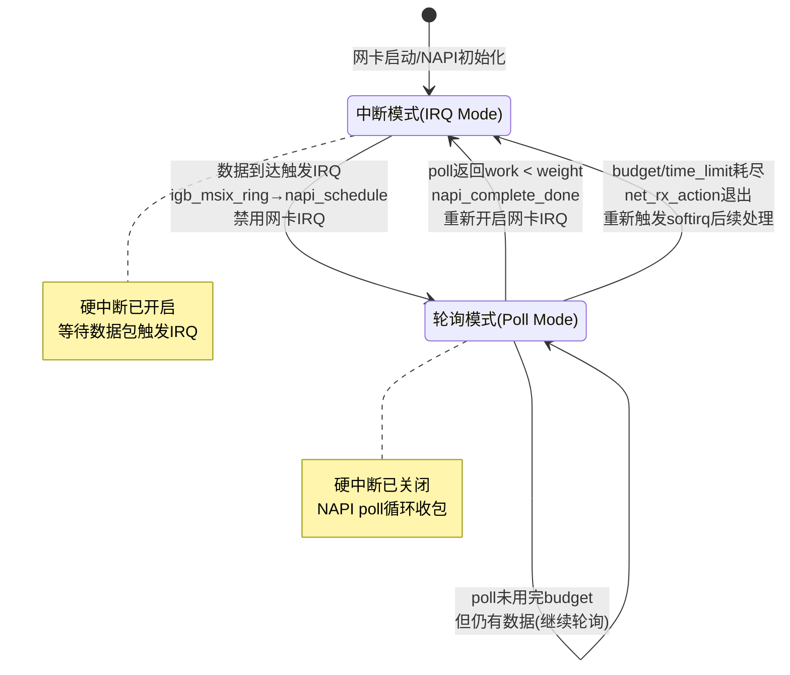
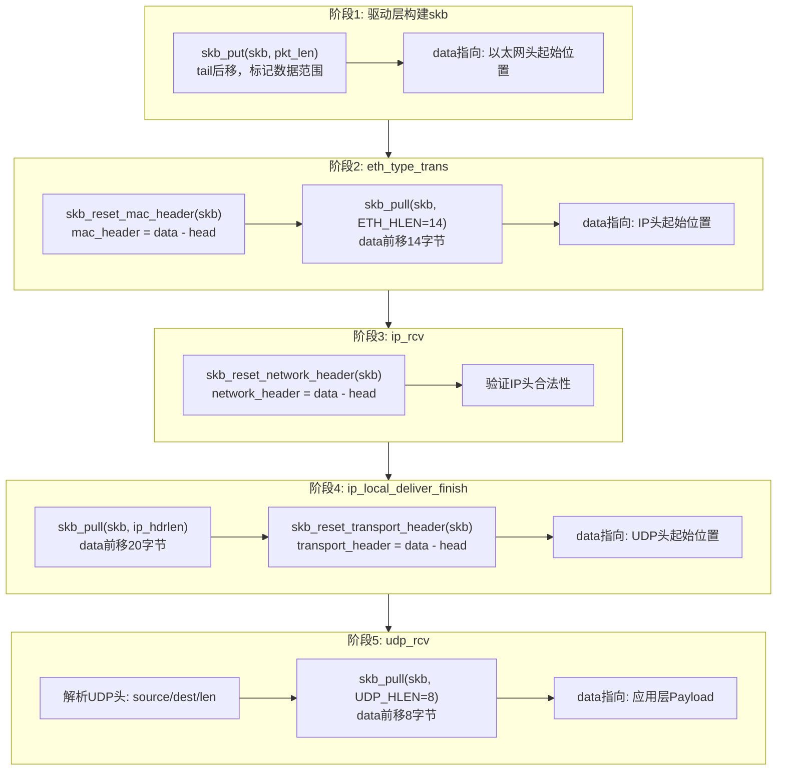
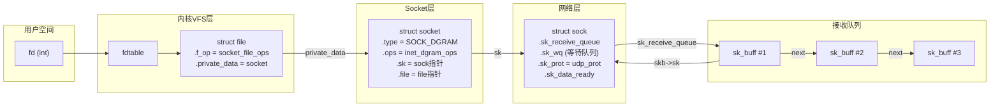
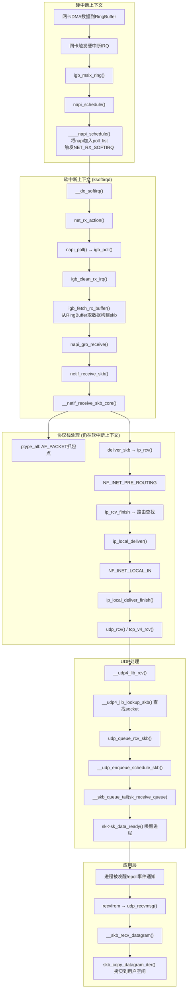
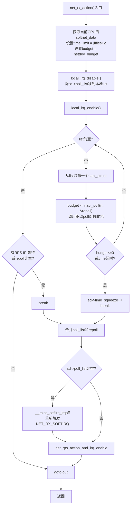
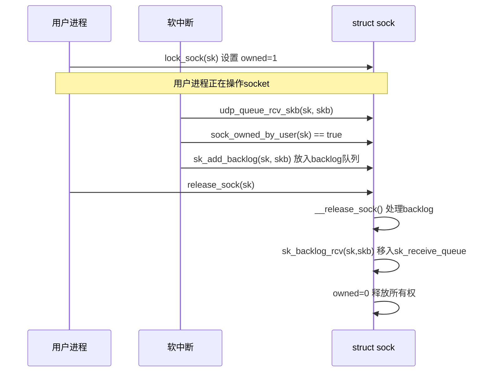
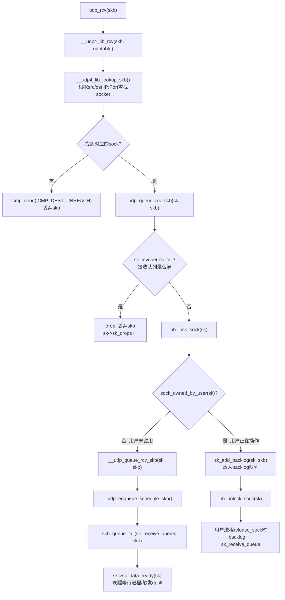
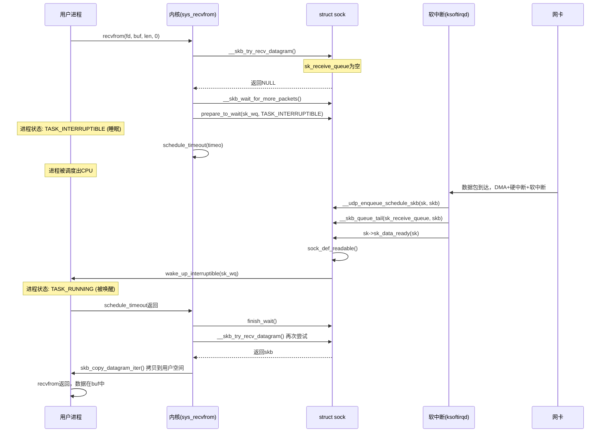
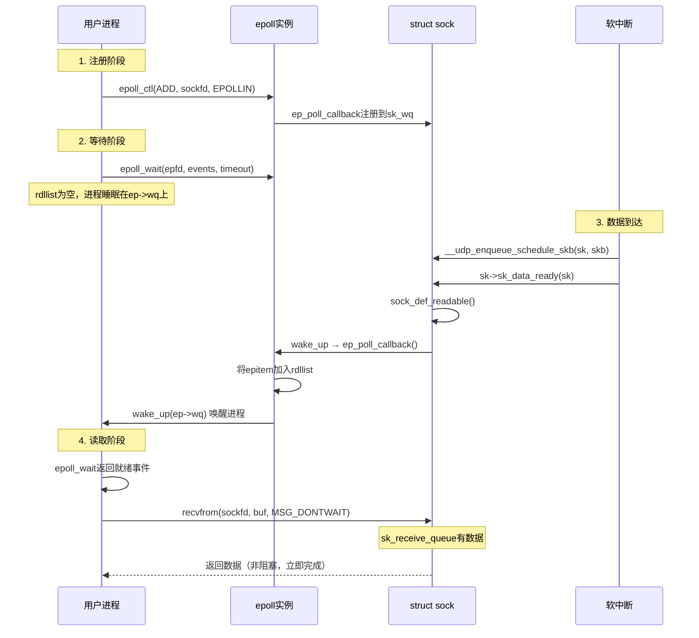
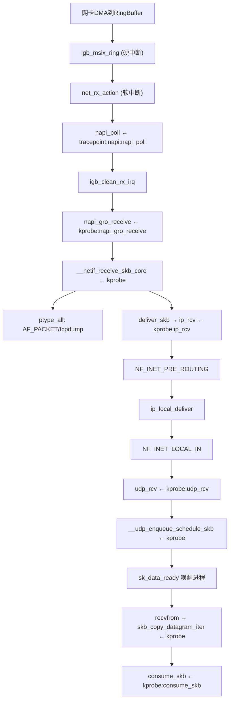

##  0x00    前言
笔者最近在研究基于ebpf的网络协议栈可观测及tracing，本文对协议栈的数据处理基础做了若干总结

本文代码基于 [v4.11.6](https://elixir.bootlin.com/linux/v4.11.6/source/include) 版本

推荐阅读：
-	[Linux 网络栈接收数据（RX）：原理及内核实现（2022）](https://arthurchiao.art/blog/linux-net-stack-implementation-rx-zh/)
-	[图解Linux网络包接收过程](https://zhuanlan.zhihu.com/p/256428917)

##  0x01   网卡的报文接收过程
一些背景知识：

-   网卡驱动是加载到内核中的模块，负责衔接网卡和内核的网络模块，驱动在加载的时候将自己注册进网络模块，当相应的网卡收到数据包时，网络模块会调用相应的驱动程序处理数据
-   常见的intel网卡：igb（网卡，其中的 i 是 intel，gb 表示每秒 1Gb）、ixgbe（xgb 表示 10Gb，e 表示以太网）、i40e（intel 40Gbps 以太网）


####	NAPI技术

继续，考虑网卡没有处理器的场景（需要更上层来收包），如果到达网卡的数据没有进程或线程来处理，就只能被丢弃。那么，接下来谁来收这些包，怎么收这些包呢？目前主要有这两种方式：

-	Busy-polling（持续轮询）：给网卡预留专门的 CPU 和线程，100% 用于收发包，典型的方式是 DPDK。优点是延迟低吞吐高（因为 CPU 100% 给网卡了）。由于该技术绕过了内核协议栈（kernel bypass），这种方案主要用在高性能的 L3/L4 处理场景，例如网关（路由转发）、四层负载均衡等
-	硬件中断（IRQ）：在绝大部分场景下，预留专门的 CPU 用于收发包属于资源浪费。简单来说， 只需要在网卡有包达到时，通知 CPU 来收即可；如果没有包，CPU 做别的事情去就可以了。当网卡有包到达时，通过硬件中断（IRQ）机制通知CPU，这是最高优先级的通知机制，告诉 CPU 需要马上处理

而中断方式针对高吞吐场景的改进是 NAPI ，其结合了轮询和中断两种方式，它允许设备驱动注册一个 `poll` 方法，然后调用这个方法完成收包。和传统方式相比，NAPI 机制一次中断会接收多个包，因此可以减少硬件中断的数量。工作流程如下：

1.	网卡驱动打开 NAPI 功能，默认处于未工作状态（没有在收包）
2.	数据包到达，网卡通过 DMA 写到内存
3.	网卡触发一个硬中断，中断处理函数开始执行
4.	软中断（softirq），唤醒 NAPI 子系统。这会触发在一个单独的线程里，调用网卡驱动注册的 `poll` 方法收包
5.	**网卡驱动禁止网卡产生新的硬件中断，这样做是为了 NAPI 能够在收包的时候不会被新的中断打扰**
6.	**一旦没有包需要收了，NAPI 关闭，网卡的硬中断重新开启**
7.	转步骤 `2`


-	每次执行到 NAPI 的 `poll()` 方法时，也就是会执行到网卡注册的 poll() 方法时，会批量从 RingBuffer 收包；在此 poll 工作时，会尽量把所有待收的包都收完（通过内核 budget 配置和调优）；在此期间内新到达网卡的包，也不会再触发硬件中断 IRQ
-	当 NAPI poll() 未正在运行或不在这个调度周期内，收到的包会触发 IRQ，然后内核来启动 poll() 再收包（下面要讨论的`igb_msix_ring`硬件中断处理函数的流程）
-	**NAPI 存在的意义是无需硬件中断通知就可以接收网络数据**。NAPI 的轮询循环（poll loop）是受硬件中断（IRQ）触发而运行起来的。NAPI 功能启用，但默认是没有工作的，直到第一个包到达的时候，网卡触发的一个硬件将它唤醒。当然内核也有其他的情况导致NAPI 功能也会被关闭，直到下一个硬中断再次将它唤起

NAPI 在中断模式和轮询模式之间的状态切换：



####	网卡收包：一个例子
本小节使用以太网的物理网卡结合一个UDP packet的接收过程为例子描述下内核收包过程，如下：

一、阶段1：数据包从网卡到内存

下图展示了数据包（packet）如何进入内存，并被内核的网络模块开始处理

```TEXT
                   +-----+
                   |     |                            Memroy
+--------+   1     |     |  2  DMA     +--------+--------+--------+--------+
| Packet |-------->| NIC |------------>| Packet | Packet | Packet | ...... |
+--------+         |     |             +--------+--------+--------+--------+
                   |     |<--------+
                   +-----+         |
                      |            +---------------+
                      |                            |
                    3 | Raise IRQ                  | Disable IRQ
                      |                          5 |
                      |                            |
                      ↓                            |
                   +-----+                   +------------+
                   |     |  Run IRQ handler  |            |
                   | CPU |------------------>| NIC Driver |
                   |     |       4           |            |
                   +-----+                   +------------+
                                                   | 
                                                6  | Raise soft IRQ
                                                   |
                                                   ↓
```

0、系统初始化时，网卡驱动程序会向内核申请一块内存（RingBuffer），用于存储未来到达的网络数据包；网卡驱动程序将申请的RingBuffer地址告诉网卡

1、数据包由外部网络进入物理网卡，如果目的地址非该网卡，且该网卡未开启混杂（promiscuous）模式，该包会被网卡丢弃

2、网卡将数据包通过DMA（Direct Memory Access）的方式写入到指定的内存地址，该地址由网卡驱动分配并初始化（网卡会通过DMA将数据拷贝到RingBuffer中，此过程不需要cpu参与）

3、网卡通过硬件中断（IRQ）通知CPU，告诉CPU有数据来了，CPU必须最高优先级处理，否则数据待会存不下了

4、CPU根据中断表，调用已经注册的中断函数，这个中断函数会调到驱动程序（NIC Driver）中相应的函数（调用对应的网卡驱动硬中断处理程序）

5、网卡驱动被调用后，**网卡驱动先禁用网卡的中断，表示驱动程序已经知道内存中有数据了，告诉网卡下次再收到数据包直接写内存就可以了，不要再通知CPU了，这样可以提高效率，避免CPU不停的被中断**；然后启动对应的软中断函数

6、启动软中断，这步结束后，硬件中断处理函数就结束返回了。由于硬中断处理程序执行的过程中不能被中断，所以如果它执行时间过长，会导致CPU没法响应其它硬件的中断，于是内核引入软中断，这样可以将硬中断处理函数中耗时的部分移到软中断处理函数里面来慢慢处理

（软中断函数开始从RingBuffer中进行循环取包，并且封装为`sk_buff`，然后投递给网络协议栈进行处理；协议栈处理完成后数据就进入用户态的对应进程，进程就可以操作数据了）

二、阶段2：内核的网络模块

软中断会触发内核网络模块中的软中断处理函数，继续上面的流程

```TEXT
                                                     +-----+
                                             17      |     |
                                        +----------->| NIC |
                                        |            |     |
                                        |Enable IRQ  +-----+
                                        |
                                        |
                                  +------------+                                      Memroy
                                  |            |        Read           +--------+--------+--------+--------+
                 +--------------->| NIC Driver |<--------------------- | Packet | Packet | Packet | ...... |
                 |                |            |          9            +--------+--------+--------+--------+
                 |                +------------+
                 |                      |    |        skb
            Poll | 8      Raise softIRQ | 6  +-----------------+
                 |                      |             10       |
                 |                      ↓                      ↓
         +---------------+  Call  +-----------+        +------------------+        +--------------------+  12  +---------------------+
         | net_rx_action |<-------| ksoftirqd |        | napi_gro_receive |------->| enqueue_to_backlog |----->| CPU input_pkt_queue |
         +---------------+   7    +-----------+        +------------------+   11   +--------------------+      +---------------------+
                                                               |                                                      | 13
                                                            14 |        + - - - - - - - - - - - - - - - - - - - - - - +
                                                               ↓        ↓
                                                    +--------------------------+    15      +------------------------+
                                                    | __netif_receive_skb_core |----------->| packet taps(AF_PACKET) |
                                                    +--------------------------+            +------------------------+
                                                               |
                                                               | 16
                                                               ↓
                                                      +-----------------+
                                                      | protocol layers |
                                                      +-----------------+

```


7、内核中的`ksoftirqd`进程专门负责软中断的处理，当它收到软中断后，就会调用相应软中断所对应的处理函数，对于上面第`6`步中是网卡驱动模块抛出的软中断，`ksoftirqd`会调用网络模块的`net_rx_action`函数（`ksoftirqd`线程开始调用驱动的`poll`函数收包）

8、`net_rx_action`会调用网卡驱动里的`poll`函数（对于igb网卡驱动来说，此[函数](https://elixir.bootlin.com/linux/v4.11.6/source/drivers/net/ethernet/intel/igb/igb_main.c#L6600)就是`igb_poll`）来一个个的处理数据包（`poll`函数将收到的包送到协议栈注册的`ip_rcv`函数中）

9、在`poll`函数中，驱动会一个接一个的读取网卡写到内存中的数据包，内存中数据包的格式只有驱动知道

10、网卡驱动程序将内存中的数据包转换成内核网络模块能识别的`skb`格式，然后调用`napi_gro_receive`函数

11、`napi_gro_receive`会处理`GRO`（Generic Receive Offloading）相关的内容，也就是将可以合并的数据包进行合并，这样就只需要调用一次协议栈。然后判断是否开启了`RPS`（Receive Packet Steering），如果开启了，将会调用`enqueue_to_backlog`

12、在`enqueue_to_backlog`函数中，会将数据包放入CPU的`softnet_data`结构体的`input_pkt_queue`中，然后返回，如果`input_pkt_queue`满了的话，该数据包将会被丢弃，queue的大小可以通过`net.core.netdev_max_backlog`来配置（备注：`enqueue_to_backlog`函数也会被`netif_rx`函数调用，而`netif_rx`正是`lo`设备发送数据包时调用的函数）

13、CPU会接着在自己的软中断上下文中处理自己`input_pkt_queue`里的网络数据（调用`__netif_receive_skb_core`）

14、如果没开启`RPS`，`napi_gro_receive`会直接调用`__netif_receive_skb_core`

15、看是不是有`AF_PACKET`类型的socket（raw socket），如果有的话，拷贝一份数据给它（`tcpdump`即抓取来自这里的packet）

16、调用协议栈相应的函数，将数据包交给协议栈处理

17、待内存中的所有数据包被处理完成后（即`poll`函数执行完成），**会再次启用网卡的硬中断，这样下次网卡再收到数据的时候就会通知CPU**


三、阶段3：协议栈网络层（IP）

接着看下数据包来到协议栈的处理过程，重要的内核函数如下：

```TEXT
          |
          |
          ↓         promiscuous mode &&
      +--------+    PACKET_OTHERHOST (set by driver)   +-----------------+
      | ip_rcv |-------------------------------------->| drop this packet|
      +--------+                                       +-----------------+
          |
          |
          ↓
+---------------------+
| NF_INET_PRE_ROUTING |
+---------------------+
          |
          |
          ↓
      +---------+
      |         | enabled ip forword  +------------+        +----------------+
      | routing |-------------------->| ip_forward |------->| NF_INET_FORWARD |
      |         |                     +------------+        +----------------+
      +---------+                                                   |
          |                                                         |
          | destination IP is local                                 ↓
          ↓                                                 +---------------+
 +------------------+                                       | dst_output_sk |
 | ip_local_deliver |                                       +---------------+
 +------------------+
          |
          |
          ↓
 +------------------+
 | NF_INET_LOCAL_IN |
 +------------------+
          |
          |
          ↓
    +-----------+
    | UDP layer |
    +-----------+
```

-   `ip_rcv`：此函数是IP模块的入口函数，该函数第一件事就是将垃圾数据包（目的mac地址不是当前网卡，但由于网卡设置了混杂模式而被接收进来）直接丢掉，然后调用注册在`NF_INET_PRE_ROUTING`上的函数
-   `NF_INET_PRE_ROUTING`： netfilter注册在协议栈中的钩子，可以通过`iptables`来注入一些数据包处理函数，用来修改或者丢弃数据包，如果数据包没被丢弃，将继续往下走
-   `routing`： 进行路由，如果是目的IP不是本地IP，且没有开启ip forward功能，那么数据包将被丢弃；如果开启了ip forward功能，那将进入`ip_forward`函数（转发模式常用）
-   `ip_forward`： `ip_forward`会先调用netfilter注册的`NF_INET_FORWARD`相关函数，如果数据包没有被丢弃，那么将继续往后调用`dst_output_sk`函数
-   `dst_output_sk`： 该函数会调用IP层的相应函数将该数据包发送出去（参考协议栈数据包发送流程的后半部分）
-   `ip_local_deliver`：如果上面`routing`的时候发现目的IP是本地IP，那么将会调用该函数。该函数会先调用`NF_INET_LOCAL_IN`相关的钩子程序，如果通过，数据包将会向下发送到UDP层

四、阶段4：协议栈传输层（UDP）

```TEXT
          |
          |
          ↓
      +---------+            +-----------------------+
      | udp_rcv |----------->| __udp4_lib_lookup_skb |
      +---------+            +-----------------------+
          |
          |
          ↓
 +--------------------+      +-----------+
 | sock_queue_rcv_skb |----->| sk_filter |
 +--------------------+      +-----------+
          |
          |
          ↓
 +------------------+
 | __skb_queue_tail |
 +------------------+
          |
          |
          ↓
  +---------------+
  | sk_data_ready |
  +---------------+

```

-   `udp_rcv`： 此[函数](https://elixir.bootlin.com/linux/v4.11.6/source/net/ipv4/udp.c#L2105)是UDP模块的入口函数，它里面会调用其它的函数，主要是做一些必要的检查，其中一个重要的调用是`__udp4_lib_lookup_skb`，该函数会根据目的IP和端口找对应的socket，如果没有找到相应的socket，那么该数据包将会被丢弃，否则继续（关联hook点`kprobe:udp_rcv`）
-   `sock_queue_rcv_skb`： 该函数会检查这个socket的receive buffer是不是满了，如果满了的话，丢弃该数据包，然后就是调用`sk_filter`看这个包是否是满足条件的包，如果当前socket上设置了filter，且该包不满足条件的话，这个数据包也将被丢弃（在Linux里面，每个socket上都可以像tcpdump里面一样定义filter，不满足条件的数据包将会被丢弃）
-   `__skb_queue_tail`： 将数据包放入socket接收队列的末尾
-   `sk_data_ready`： 通知socket数据包已经准备好；调用完`sk_data_ready`之后，一个数据包处理完成，等待应用层程序来读取，上面所有函数的执行过程都在软中断的上下文中

五、阶段5：socket应用程序

应用层一般有两种方式接收数据：
-   `recvfrom`函数阻塞等待数据到来，这种情况下当socket收到通知后，`recvfrom`就会被唤醒，然后读取接收队列的数据
-   通过`epoll`/`select`监听相应的socket，当收到通知后，再调用`recvfrom`函数去读取接收队列的数据

至此，一个UDP包就经由网卡成功送到了应用层程序

####    网卡收包的若干细节

1、数据复制

在数据包从网卡到达应用层的过程中，会经历两次数据复制，这里对性能是有影响的：

-	第一次：将包从网卡通过 DMA 复制到 RingBuffer（阶段1中的第 `2` 步，图中第 `3` 步）
-	第二次：从 RingBuffer 复制到 `skb` 结构体（阶段2中的第 `9`/`10` 步，即驱动`poll`函数从RingBuffer取数据并构建`sk_buff`，图中第 `6` 步）


##  0x02  核心数据结构
-   `struct socket`：传输层使用的[数据结构](https://elixir.bootlin.com/linux/v4.11.6/source/include/linux/net.h#L111)，用于声明、定义套接字
-   `struct sock`：网络层会调用`struct sock`[结构体](https://elixir.bootlin.com/linux/v4.11.6/source/include/net/sock.h#L311)，该结构体包含`struct sock_common`[结构体](https://elixir.bootlin.com/linux/v4.11.6/source/include/net/sock.h#L120)
-   `struct sk_buff`：内核中使用的套接字缓冲区[结构体](https://elixir.bootlin.com/linux/v4.11.6/source/include/linux/skbuff.h#L566)，套接字结构体用于表示一个网络连接对应的本地接口的网络信息，而`sk_buff`结构则是该网络连接对应的数据包的存储

####    struct sk_buff结构： 套接字缓冲区
对于ebpf应用开发者而言，最关注的结构莫过于`sk_buff`了。`sk_buff`用来管理和控制接收OR发送数据包的信息，各层协议都依赖于`sk_buff`而存在。内核中`sk_buff`结构体在各层协议之间传输不是用拷贝`sk_buff`结构体，而是通过增加协议头和移动指针来操作的。如果是发送方向（从L4传输到L2），则是通过往`sk_buff`结构体中增加该层协议头来操作（`skb_push`）；如果是接收方向（从L2到L4），则是通过移动`sk_buff`结构体中的data指针来实现（`skb_pull`），不会删除各层协议头


```C
struct sk_buff {
	union {
		struct {
			/* These two members must be first. 构成sk_buff链表*/
			struct sk_buff		*next;
			struct sk_buff		*prev;
			union {
				struct net_device	*dev;	//网络设备对应的结构体，很重要但是不是本文重点，所以不做展开
				/* Some protocols might use this space to store information,
				 * while device pointer would be NULL.
				 * UDP receive path is one user.
				 */
				unsigned long		dev_scratch;   // 对于某些不适用net_device的协议需要采用该字段存储信息，如UDP的接收路径
			};
		};
		struct rb_node		rbnode; /* used in netem, ip4 defrag, and tcp stack 将sk_buff以红黑树组织，在TCP中有用到*/
		struct list_head	list;   // sk_buff链表头指针（5.10内核后）
	};
	union {
		struct sock		*sk;       // 指向网络层套接字结构体
		int			ip_defrag_offset;   //用来处理IPv4报文分片
	};
	union {
		ktime_t		tstamp;    // 时间戳
		u64		skb_mstamp_ns; /* earliest departure time */
	};
	/* 存储私有信息
	 * This is the control buffer. It is free to use for every
	 * layer. Please put your private variables there. If you
	 * want to keep them across layers you have to do a skb_clone()
	 * first. This is owned by whoever has the skb queued ATM.
	 */
	char			cb[48] __aligned(8);
	union {
		struct {
			unsigned long	_skb_refdst;				   // 目标entry
			void		(*destructor)(struct sk_buff *skb);	// 析构函数
		};
		struct list_head	tcp_tsorted_anchor;			    // TCP发送队列(tp->tsorted_sent_queue)
	};
....
	unsigned int		len,	// 实际长度
				data_len;	    // 数据长度
	__u16			mac_len,    // mac层长度
				hdr_len;        // 可写头部长度
	/* Following fields are _not_ copied in __copy_skb_header()
	 * Note that queue_mapping is here mostly to fill a hole.
	 */
	__u16			queue_mapping;   // 多队列设备的队列映射
......
	/* fields enclosed in headers_start/headers_end are copied
	 * using a single memcpy() in __copy_skb_header()
	 */
	/* private: */
	__u32			headers_start[0];	
	/* public: */
......
	__u8			__pkt_type_offset[0];
	__u8			pkt_type:3;
	__u8			ignore_df:1;
	__u8			nf_trace:1;
	__u8			ip_summed:2;
	__u8			ooo_okay:1;
	__u8			l4_hash:1;
	__u8			sw_hash:1;
	__u8			wifi_acked_valid:1;
	__u8			wifi_acked:1;
	__u8			no_fcs:1;
	/* Indicates the inner headers are valid in the skbuff. */
	__u8			encapsulation:1;
	__u8			encap_hdr_csum:1;
	__u8			csum_valid:1;
......
	__u8			__pkt_vlan_present_offset[0];
	__u8			vlan_present:1;
	__u8			csum_complete_sw:1;
	__u8			csum_level:2;
	__u8			csum_not_inet:1;
	__u8			dst_pending_confirm:1;
......
	__u8			ipvs_property:1;
	__u8			inner_protocol_type:1;
	__u8			remcsum_offload:1;
......
	union {
		__wsum		csum;
		struct {
			__u16	csum_start;
			__u16	csum_offset;
		};
	};
	__u32			priority;
	int			skb_iif;		// 接收到该数据包的网络接口的编号
	__u32			hash;
	__be16			vlan_proto;
	__u16			vlan_tci;
......
	union {
		__u32		mark;
		__u32		reserved_tailroom;
	};
	union {
		__be16		inner_protocol;
		__u8		inner_ipproto;
	};
	__u16			inner_transport_header;
	__u16			inner_network_header;
	__u16			inner_mac_header;
	__be16			protocol;
	__u16			transport_header;	// 传输层头部
	__u16			network_header;		// 网络层头部
	__u16			mac_header;			// mac层头部
	/* private: */
	__u32			headers_end[0];
	/* public: */
	/* These elements must be at the end, see alloc_skb() for details.  */
	sk_buff_data_t		tail;
	sk_buff_data_t		end;
	unsigned char		*head, *data;
	unsigned int		truesize;
	refcount_t		users;
......
};
```

####    `struct sk_buff`成员&&管理
`sk_buff`的成员主要关注如下三类：

-   组织布局（Layout）
-   通用数据成员（General）
-   管理`sk_buff`结构体的函数（Management functions）

1、`sk_buff`的管理组织方式

通常`sk_buff`使用双链表`sk_buff_head`结构进行管理（并且`sk_buff`需要能在`O(1)`时间内获得双链表的头节点），布局如下图所示

```cpp
//有些情况下sk_buff不是用双链表而是用红黑树组织的，那么有效的域是rbnode
//5.10内核中，list域是一个list_head结构体，而非sk_buff_head
struct sk_buff_head {
	/* These two members must be first. */
	struct sk_buff	*next;  //sk_buff中的next、prev指向相邻的sk_buff
	struct sk_buff	*prev;

	__u32		qlen;   //链表中元素的数量
	spinlock_t	lock;   //并发访问时保护
};
```


2、`sk_buff`的线性空间管理 && 创建

```cpp
/* These elements must be at the end, see alloc_skb() for details.  */
	sk_buff_data_t		tail;
	sk_buff_data_t		end;
	unsigned char		*head,*data;
```

从下图中可以发现，`head`与`end`指向的位置始终不变，数据的变化、协议头的添加都是依靠`tail`与`data`的移动来实现的；此外，初始化时，`head`、`data`、`tail`都指向开始位置


`sk_buff`线性数据区的创建过程如下，`sk_buff`结构数据区初始化成功后，此时 `head` 指针、`data` 指针、`tail` 指针都是指向同一个地方（**`head` 指针和 `end` 指针指向的位置一直都不变，而对于数据的变化和协议信息的添加都是通过 `data` 指针和 `tail` 指针的改变来表现的**）

3、重要成员

-   `struct sock *sk`：指向拥有该`sk_buff`的套接字（即skb 关联的socket），当这个包是socket 发出或接收时，这里指向对应的socket，而如果是转发包，这里是`NULL`；在可观测场景下，当socket已经建立时，可以用来解析获取传输层的关键信息
-   `unsigned int truesize`：表示skb使用的大小，包括skb结构体以及它所指向的数据
-   `unsigned int		len`：所有数据的长度之和，包括分片的数据以及协议头
-   `unsigned int      data_len`：分片的数据长度
-   `__u16			mac_len`：链路层帧头长度
-   `__u16 hdr_len`：被copy的skb中可写的头部长度

4、General成员，即skb的通用成员，与协议类型或内核特性无关，这里也列举几个

`struct net_device	*dev`成员，用来表示从哪个设备收到报文，或将把报文发到哪个设备

```cpp
//include/linux/skbuff.h
			union {
				struct net_device	*dev;
				/* Some protocols might use this space to store information,
				 * while device pointer would be NULL.
				 * UDP receive path is one user.
				 */
				unsigned long		dev_scratch;
			};
```

`char cb[48]`成员，是skb能被各层共用的精髓，`48`即为TCP的控制块`tcp_sbk_cb`[数据结构](https://elixir.bootlin.com/linux/v4.11.6/source/include/net/tcp.h#L736)的size

```cpp
//include/linux/skbuff.h
	/*
	 * This is the control buffer. It is free to use for every
	 * layer. Please put your private variables there. If you
	 * want to keep them across layers you have to do a skb_clone()
	 * first. This is owned by whoever has the skb queued ATM.
	 */
	char			cb[48] __aligned(8);
```

`tcp_sbk_cb`结构如下，可以通过`TCP_SKB_CB`这个宏获取`cb`字段（被转换为`struct tcp_skb_cb *`类型）
```cpp
//include/net/tcp.h
#define TCP_SKB_CB(__skb)	((struct tcp_skb_cb *)&((__skb)->cb[0]))
//include/net/tcp.h
struct tcp_skb_cb {
	__u32		seq;		/* Starting sequence number	*/
	__u32		end_seq;	/* SEQ + FIN + SYN + datalen	*/

	/* ... */
	__u8		tcp_flags;	/* TCP header flags. (tcp[13])	*/

	/* ... */
};
```

`pkt_type`这个字段用于表示数据包类型，此类型是由目标MAC地址决定的

```cpp
//include/linux/skbuff.h
	__u8			pkt_type:3;


#define PACKET_HOST		0		/* To us		*/
#define PACKET_BROADCAST	1		/* To all		*/
#define PACKET_MULTICAST	2		/* To group		*/
#define PACKET_OTHERHOST	3		/* To someone else 	*/
#define PACKET_OUTGOING		4		/* Outgoing of any type */
#define PACKET_LOOPBACK		5		/* MC/BRD frame looped back */
#define PACKET_USER		6		/* To user space	*/
#define PACKET_KERNEL		7		/* To kernel space	*/
```

`__be16 protocol`这个字段标识了L2上层的协议类型，典型的协议类型如下：

```cpp
//include/uapi/linux/if_ether.h
/*
 *	These are the defined Ethernet Protocol ID's.
 */


#define ETH_P_IP	0x0800		/* Internet Protocol packet	*/
#define ETH_P_X25	0x0805		/* CCITT X.25			*/
#define ETH_P_ARP	0x0806		/* Address Resolution packet	*/

#define ETH_P_IPV6	0x86DD		/* IPv6 over bluebook		*/
```

`transport_header`、`network_header`、`mac_header`这三个字段标识了各层头部相对于`head`的偏移量，在ebpf对`sk_buff`结构的解析中也非常常用

```cpp
//include/linux/skbuff.h
	__u16			transport_header;
	__u16			network_header;
	__u16			mac_header;
```

5、管理函数（Management functions）

5.1、分配和释放内存，通过`alloc_skb`获取一个`struct sk_buff`加长度为`size`（经过对齐）的数据缓冲区，其中`skb->end`指向的是一个`skb_shared_info`结构体，`head`、`data`、`tail`以及`end`初始化指向如图所示，`end`留出了padding（tailroom）保证使读取为主的`skb_shared_info`结构与前面的数据不在一个缓存行


```cpp
//net/core/skbuff.c
static inline struct sk_buff *alloc_skb(unsigned int size, gfp_t priority){
    //....
	skb = kmem_cache_alloc_node(cache, gfp_mask & ~__GFP_DMA, node);
	/* ... */
	size = SKB_DATA_ALIGN(size);
	size += SKB_DATA_ALIGN(sizeof(struct skb_shared_info));
	data = kmalloc_reserve(size, gfp_mask, node, &pfmemalloc);
	/* kmalloc(size) might give us more room than requested.
	 * Put skb_shared_info exactly at the end of allocated zone,
	 * to allow max possible filling before reallocation.
	 */
	size = SKB_WITH_OVERHEAD(ksize(data));
	/* ... */
	skb->head = data;
	skb->data = data;
	skb_reset_tail_pointer(skb);
	skb->end = skb->tail + size;
    //...
}
```

5.2、`sk_buff`数据缓冲区指针操作


-   `skb_put`
-   `skb_push`
-   `skb_pull`：常用于协议栈接收报文时，从外到内剥离协议头（以太网头-IP 头-TCP 头）的操作
-   `skb_reserve`

5.3、接收数据包的处理过程，伪代码描述如下：

```cpp
// 驱动构造 skb（DMA 数据已写入）
struct sk_buff *skb = build_skb(dma_buffer, buffer_size);
skb_put(skb, packet_len);  // 设置数据长度

// 协议栈处理（以太网层）
__be16 proto = eth_type_trans(skb, dev);
skb_pull(skb, ETH_HLEN);    // 剥离以太网头

// 协议栈处理（IP 层）
struct iphdr *iph = ip_hdr(skb);
skb_pull(skb, iph->ihl * 4); // 剥离 IP 头

// 协议栈处理（TCP 层）
struct tcphdr *th = tcp_hdr(skb);
skb_pull(skb, th->doff * 4); // 剥离 TCP 头

// 应用层获取负载数据
char *payload = skb->data;
int payload_len = skb->len;
```

5.4、发送数据包的处理过程，下图展示了发送数据包时skb缓冲区被填满的过程，伪代码描述如下：

```cpp
unsigned int total_header_len = ETH_HLEN + IP4_HLEN + TCP_HLEN;
unsigned int payload_len = 1000;
// 分配skb，总空间为 headers + payload，初始 data 和 tail 指向缓冲区起始位置
struct sk_buff *skb = alloc_skb(total_header_len + payload_len, GFP_KERNEL);
// 预留所有协议头的空间，预留头部空间，data 和 tail 后移
skb_reserve(skb, total_header_len);
// 添加负载数据，填充负载数据，tail 后移，扩展数据区
skb_put(skb, payload_len);
memcpy(skb->data, payload, payload_len);
// 添加TCP头，添加协议头（从内到外），data 前移，覆盖预留空间
tcp_header = skb_push(skb, TCP_HLEN);
// 添加IP头
ip_header = skb_push(skb, IP4_HLEN);
// 添加以太网头
eth_header = skb_push(skb, ETH_HLEN);
// 发送
dev_queue_xmit(skb);
```


####    struct socket结构
每个`struct socket`结构都有一个`struct sock`结构成员，`sock`是对`socket`的扩充，`socket->sk`指向对应的`sock`结构，`sock->socket` 指向对应的`socket`结构

```cpp
struct socket {
	socket_state		state;  //链接状态
	short			type;       //套接字类型，如SOCK_STREAM等
	unsigned long		flags;
	struct socket_wq	*wq;
	struct file		*file;      //套接字对应的文件指针，毕竟Linux一切皆文件
	struct sock		*sk;        //网络层的套接字
	const struct proto_ops	*ops;
};
```

此外，`struct socket`的另一个重要成员即 `file` 内核对象指针，该指针关联了与`struct file`即`struct file_operations`的关系（初始化时为空），看下图


####    struct sock结构

```cpp
struct sock {
	struct sock_common	__sk_common;	   // 网络层套接字通用结构体
......
	socket_lock_t		sk_lock;	       // 套接字同步锁
	atomic_t		sk_drops;	           // IP/UDP包丢包统计
	int			sk_rcvlowat;        	   // SO_RCVLOWAT标记位
......
	struct sk_buff_head	sk_receive_queue;	// 收到的数据包队列
......
	int			sk_rcvbuf;				  // 接收缓存大小
......
	union {
		struct socket_wq __rcu	*sk_wq;	    // 等待队列
		struct socket_wq	*sk_wq_raw;
	};
......
	int			sk_sndbuf;			       // 发送缓存大小
	/* ===== cache line for TX ===== */
	int			sk_wmem_queued;			   // 传输队列大小
	refcount_t		sk_wmem_alloc;		    // 已确认的传输字节数
	unsigned long		sk_tsq_flags;	    // TCP Small Queue标记位
	union {
		struct sk_buff	*sk_send_head;		// 发送队列对首
		struct rb_root	tcp_rtx_queue;		 
	};
	struct sk_buff_head	sk_write_queue;		 // 发送队列
......
	u32			sk_pacing_status; /* see enum sk_pacing 发包速率控制状态*/ 
	long			sk_sndtimeo;		    // SO_SNDTIMEO 标记位
	struct timer_list	sk_timer;			// 套接字清空计时器
	__u32			sk_priority;		    // SO_PRIORITY 标记位
......
	unsigned long		sk_pacing_rate; /* bytes per second 发包速率*/
	unsigned long		sk_max_pacing_rate;  // 最大发包速率
	struct page_frag	sk_frag;		    // 缓存页帧
......
	struct proto		*sk_prot_creator;
	rwlock_t		sk_callback_lock;
	int			sk_err,					  // 上次错误
				sk_err_soft;			  // 软错误：不会导致失败的错误
	u32			sk_ack_backlog;			   // ack队列长度
	u32			sk_max_ack_backlog;		   // 最大ack队列长度
	kuid_t			sk_uid;				  // user id
	struct pid		*sk_peer_pid;		   // 套接字对应的peer的id
......
	long			sk_rcvtimeo;		  // 接收超时
	ktime_t			sk_stamp;			  // 时间戳
......
	struct socket		*sk_socket;		   // Identd协议报告IO信号
	void			*sk_user_data;		  // RPC层私有信息
......
	struct sock_cgroup_data	sk_cgrp_data;   // cgroup数据
	struct mem_cgroup	*sk_memcg;		   // 内存cgroup关联
	void			(*sk_state_change)(struct sock *sk);	// 状态变化回调函数
	void			(*sk_data_ready)(struct sock *sk);		// 数据处理回调函数
	void			(*sk_write_space)(struct sock *sk);		// 写空间可用回调函数
	void			(*sk_error_report)(struct sock *sk);    // 错误报告回调函数
	int			(*sk_backlog_rcv)(struct sock *sk, struct sk_buff *skb);	// 处理存储区回调函数
......
	void                    (*sk_destruct)(struct sock *sk);	// 析构回调函数
	struct sock_reuseport __rcu	*sk_reuseport_cb;			   // group容器重用回调函数
......
};
```

`struct sock`这里重点看这几个成员：
-	`struct sk_buff_head	sk_receive_queue`：socket的接收包队列
-	`struct socket_wq __rcu	*sk_wq`：socket的等待队列


这两个成员在后文[Linux 内核之旅（十二）：内核视角下的三次握手](https://pandaychen.github.io/2025/04/25/A-LINUX-KERNEL-TRAVEL-12/)将会详述

####    struct sock_common结构
`struct sock_common`是套接口在网络层的最小表示，即最基本的网络层套接字信息
```cpp
struct sock_common {
	/* skc_daddr and skc_rcv_saddr must be grouped on a 8 bytes aligned
	 * address on 64bit arches : cf INET_MATCH()
	 */
	union {
		__addrpair	skc_addrpair;
		struct {
			__be32	skc_daddr;		// 外部/目的IPV4地址
			__be32	skc_rcv_saddr;	// 本地绑定IPV4地址
		};
	};
	union  {
		unsigned int	skc_hash;	// 根据协议查找表获取的哈希值
		__u16		skc_u16hashes[2]; // 2个16位哈希值，UDP专用
	};
	/* skc_dport && skc_num must be grouped as well */
	union {
		__portpair	skc_portpair;	// 
		struct {
			__be16	skc_dport;	    // inet_dport占位符
			__u16	skc_num;	    // inet_num占位符
		};
	};
	unsigned short		skc_family;	      // 网络地址family
	volatile unsigned char	skc_state;    // 连接状态
	unsigned char		skc_reuse:4;      // SO_REUSEADDR 标记位
	unsigned char		skc_reuseport:1;  // SO_REUSEPORT 标记位
	unsigned char		skc_ipv6only:1;   // IPV6标记位
	unsigned char		skc_net_refcnt:1; // 该套接字网络名字空间内引用数
	int			skc_bound_dev_if;		 // 绑定设备索引
	union {
		struct hlist_node	skc_bind_node;     // 不同协议查找表组成的绑定哈希表
		struct hlist_node	skc_portaddr_node; // UDP/UDP-Lite protocol二级哈希表
	};
	struct proto		*skc_prot;			  // 协议回调函数，根据协议不同而不同
......
	union {									
		struct hlist_node	skc_node;		    // 不同协议查找表组成的主哈希表
		struct hlist_nulls_node skc_nulls_node;  // UDP/UDP-Lite protocol主哈希表
	};
	unsigned short		skc_tx_queue_mapping;    // 该连接的传输队列
	unsigned short		skc_rx_queue_mapping;    // 该连接的接受队列
......
	union {
		int		skc_incoming_cpu; // 多核下处理该套接字数据包的CPU编号
		u32		skc_rcv_wnd;	  // 接收窗口大小
		u32		skc_tw_rcv_nxt; /* struct tcp_timewait_sock  */
	};
	refcount_t		skc_refcnt;   // 套接字引用计数
......
};
```

####    小结
网络通信中通过网卡获取到的数据包至少包括了物理层，链路层和网络层的内容，因此套接字结构体仅仅从网络层开始，即通常只定义了传输层的套接字`socket`和网络层的套接字`sock`。`socket` 是用于负责对上给用户提供接口，并且和文件系统关联。而 `sock`负责向下对接内核网络协议栈

从传输层到链路层，它是存放数据的通用结构，为了保持高效率，数据在传递过程中尽量不发生额外的拷贝。因此，从高层到低层的时候，会不断地在数据前加头，因此每一层的协议都会调用`skb_reserve`，为自己的报头预留空间。至于从低层到高层，去掉低层报头的方式就是移动一下指针，指向高层头，非常简洁

####    核心数据结构：以UDP数据包接收为例

本小节以一个完整的UDP数据包接收过程为例，详细说明内核中各层协议头部结构的定义、在`sk_buff`中如何引用、以及各核心数据结构之间的关系

1、UDP数据包在各层的封装关系

一个UDP数据包在网络上传输时，其二层帧结构（Frame Check Sequence 帧校验序列）如下：

```TEXT
+------------------+----------------+----------------+---------+-----+
| Ethernet Header  |   IP Header    |  UDP Header    | Payload | FCS |
|     (14 Bytes)   |  (20 Bytes)    |   (8 Bytes)    |         |     |
+------------------+----------------+----------------+---------+-----+
      L2                  L3               L4            L7
```

2、各层头部结构的内核定义

2.1、以太网帧头`struct ethhdr`

```cpp
//file: include/uapi/linux/if_ether.h
#define ETH_ALEN    6       // MAC地址长度
#define ETH_HLEN    14      // 以太网头部总长度

struct ethhdr {
    unsigned char   h_dest[ETH_ALEN];   // 目的MAC地址（6字节）
    unsigned char   h_source[ETH_ALEN]; // 源MAC地址（6字节）
    __be16          h_proto;            // 上层协议类型（2字节），如0x0800表示IPv4
} __attribute__((packed));
```

2.2、IP头部`struct iphdr`

```cpp
//file: include/uapi/linux/ip.h
struct iphdr {
#if defined(__LITTLE_ENDIAN_BITFIELD)
    __u8    ihl:4,          // 首部长度（单位4字节），通常为5即20字节
            version:4;      // IP版本，IPv4为4
#elif defined(__BIG_ENDIAN_BITFIELD)
    __u8    version:4,
            ihl:4;
#endif
    __u8    tos;            // 服务类型（Type of Service）
    __be16  tot_len;        // IP数据包总长度（含头部）
    __be16  id;             // 标识符，用于分片重组
    __be16  frag_off;       // 分片偏移和标志位
    __u8    ttl;            // 生存时间
    __u8    protocol;       // 上层协议号，UDP=17，TCP=6
    __sum16 check;          // 头部校验和
    __be32  saddr;          // 源IP地址
    __be32  daddr;          // 目的IP地址
    /* 可选字段（如果ihl>5则存在） */
};
```

2.3、UDP头部`struct udphdr`

```cpp
//file: include/uapi/linux/udp.h
struct udphdr {
    __be16  source;     // 源端口号
    __be16  dest;       // 目的端口号
    __be16  len;        // UDP数据报长度（含头部8字节）
    __sum16 check;      // 校验和
};
```

3、`sk_buff`如何引用各层头部

内核通过`sk_buff`中的三个偏移量字段来定位各层头部的位置（相对于`skb->head`的偏移）：

```cpp
//file: include/linux/skbuff.h
__u16   transport_header;   // 传输层头部偏移（UDP/TCP头）
__u16   network_header;     // 网络层头部偏移（IP头）
__u16   mac_header;         // 链路层头部偏移（以太网头）
```

内核提供了便捷的宏/内联函数来获取各层头部指针：

```cpp
//file: include/linux/skbuff.h
static inline struct ethhdr *eth_hdr(const struct sk_buff *skb)
{
    return (struct ethhdr *)skb_mac_header(skb);
}

//file: include/linux/ip.h
static inline struct iphdr *ip_hdr(const struct sk_buff *skb)
{
    return (struct iphdr *)skb_network_header(skb);
}

//file: include/linux/udp.h
static inline struct udphdr *udp_hdr(const struct sk_buff *skb)
{
    return (struct udphdr *)skb_transport_header(skb);
}

// 底层实现：偏移量 + head指针
static inline unsigned char *skb_mac_header(const struct sk_buff *skb)
{
    return skb->head + skb->mac_header;
}

static inline unsigned char *skb_network_header(const struct sk_buff *skb)
{
    return skb->head + skb->network_header;
}

static inline unsigned char *skb_transport_header(const struct sk_buff *skb)
{
    return skb->head + skb->transport_header;
}
```

4、**接收方向上各层头部的设置与剥离过程**

在数据包接收方向，各层头部偏移量的设置时机如下：

```cpp
// 步骤1：网卡驱动层 - 设置mac_header
// 在 eth_type_trans() 中完成
//file: net/ethernet/eth.c
__be16 eth_type_trans(struct sk_buff *skb, struct net_device *dev)
{
    struct ethhdr *eth;
    // 设置mac_header偏移量为当前data位置
    skb_reset_mac_header(skb);
    // data指针前移ETH_HLEN(14字节)，跳过以太网头
    skb_pull_inline(skb, ETH_HLEN);
    eth = eth_hdr(skb);
    // 根据目的MAC设置pkt_type
    if (unlikely(is_multicast_ether_addr(eth->h_dest))) {
        if (ether_addr_equal_64bits(eth->h_dest, dev->broadcast))
            skb->pkt_type = PACKET_BROADCAST;
        else
            skb->pkt_type = PACKET_MULTICAST;
    } else if (unlikely(!ether_addr_equal_64bits(eth->h_dest, dev->dev_addr))) {
        skb->pkt_type = PACKET_OTHERHOST;
    }
    return eth->h_proto;    // 返回上层协议类型
}

// 步骤2：IP层 - 设置network_header
//file: net/ipv4/ip_input.c
int ip_rcv(struct sk_buff *skb, ...)
{
    // 设置network_header偏移量
    skb_reset_network_header(skb);
    // ... 校验IP头 ...
}

// 步骤3：传输层 - 设置transport_header
//file: net/ipv4/udp.c  (在__udp4_lib_rcv中)
// IP层处理完后，通过pskb_may_pull确保传输层头部可访问
// skb_set_transport_header在ip_local_deliver_finish中隐式完成
```

5、`sk_buff`在接收方向上的指针变化过程



各阶段对应的`sk_buff`内存布局变化：

```TEXT
驱动层（初始状态）:
    head                                                          end
    |                                                              |
    v                                                              v
    +--+------------------+----------------+--------+---------+----+
    |  | Ethernet Header  |   IP Header    |UDP Hdr | Payload |    |
    +--+------------------+----------------+--------+---------+----+
    ^   ^                                                     ^
    |   |                                                     |
    |   data                                                  tail
    |
    headroom(skb_reserve预留)

eth_type_trans之后:
    head                                                          end
    |                                                              |
    v                                                              v
    +--+------------------+----------------+--------+---------+----+
    |  | Ethernet Header  |   IP Header    |UDP Hdr | Payload |    |
    +--+------------------+----------------+--------+---------+----+
        ^                  ^                                   ^
        |                  |                                   |
        mac_header         data                                tail

ip_rcv/ip_local_deliver之后:
    head                                                          end
    |                                                              |
    v                                                              v
    +--+------------------+----------------+--------+---------+----+
    |  | Ethernet Header  |   IP Header    |UDP Hdr | Payload |    |
    +--+------------------+----------------+--------+---------+----+
        ^                  ^                ^                   ^
        |                  |                |                   |
        mac_header         network_header   data/transport_hdr  tail

udp_rcv处理之后:
    head                                                          end
    |                                                              |
    v                                                              v
    +--+------------------+----------------+--------+---------+----+
    |  | Ethernet Header  |   IP Header    |UDP Hdr | Payload |    |
    +--+------------------+----------------+--------+---------+----+
        ^                  ^                ^         ^         ^
        |                  |                |         |         |
        mac_header         network_header   transport data      tail
                                            _header
```

6、`fd -> file -> socket -> sock -> sk_receive_queue -> sk_buff` 完整关系



上图中各层的职责分工：
- `fd`：用户空间的文件描述符，通过`fdtable`找到`struct file`
- `struct file`：VFS层对象，`private_data`指向`struct socket`，`f_op`为`socket_file_ops`
- `struct socket`：BSD socket抽象层，`ops`为协议方法集（如`inet_dgram_ops`），面向用户空间接口
- `struct sock`：网络层核心对象，包含收发队列、协议状态、回调函数等，面向内核协议栈
- `sk_buff`：数据包载体，通过双链表组织在`sk_receive_queue`中，`skb->sk`反向指向所属的`sock`

其中`skb->sk`反向引用的意义在于：当数据包在协议栈中传递时（如发送路径中需要查询socket选项、或者释放skb时需要更新socket内存计数`sk_wmem_alloc`），可以通过`skb`直接定位到对应的socket而无需额外查找

##	0x03	可观测：内核收包的主要过程

####	准备工作

Linux驱动，内核协议栈等等模块在具备接收网卡数据包之前，需要完整如下的初始化工作，这部分内容可以参考[图解Linux网络包接收过程](https://mp.weixin.qq.com/s/GoYDsfy9m0wRoXi_NCfCmg)：

1、Linux系统启动，创建ksoftirqd内核线程，用来处理软中断

创建ksoftirqd内核线程关联结构[`softirq_threads`](https://elixir.bootlin.com/linux/v4.11.6/source/kernel/softirq.c#L748)，当ksoftirqd被创建出来以后，它就会进入自己的线程循环函数`ksoftirqd_should_run`和`run_ksoftirqd`，不停地判断有没有软中断需要被处理

```cpp
//file: kernel/softirq.c
static struct smp_hotplug_thread softirq_threads = {
    .store          = &ksoftirqd,
    .thread_should_run  = ksoftirqd_should_run,
    .thread_fn      = run_ksoftirqd,
    .thread_comm        = "ksoftirqd/%u",
};

static __init int spawn_ksoftirqd(void)
{
    register_cpu_notifier(&cpu_nfb);

    BUG_ON(smpboot_register_percpu_thread(&softirq_threads));

    return 0;
}
early_initcall(spawn_ksoftirqd);
```

2、网络子系统初始化

-	SoftIRQ handler 初始化：`net_dev_init` 分别为接收和发送数据注册了一个软中断处理函数（后文会描述网卡驱动的中断处理函数是如何触发 `net_rx_action()` 执行的）；这里内核的软中断系统是一种在硬中断处理上下文（驱动中）之外执行代码的机制，可以把软中断系统想象成一系列内核线程（每个 CPU 一个）， 这些线程执行针对不同事件注册的处理函数（SoftIRQ handler）

3、协议栈注册，针对协议栈支持的各类协议如arp/icmp/ip/udp/tcp等，每一个协议都会将自己的处理函数注册

4、网卡驱动初始化，初始化DMA以及向内核注册收包函数地址（NAPI的`poll`函数）

5、启动网卡，分配RX/TX队列，注册中断对应的处理函数

```cpp
//file: drivers/net/ethernet/intel/igb/igb_main.c
static int __igb_open(struct net_device *netdev, bool resuming)
{
    /* allocate transmit descriptors */
    err = igb_setup_all_tx_resources(adapter);

    /* allocate receive descriptors */
    err = igb_setup_all_rx_resources(adapter);

    /* 注册中断处理函数 */
    err = igb_request_irq(adapter);
    if (err)
        goto err_req_irq;

    /* 启用NAPI */
    for (i = 0; i < adapter->num_q_vectors; i++)
        napi_enable(&(adapter->q_vector[i]->napi));

    //......
}
```

6、当上面工作都完成之后，就可以打开硬中断，等待数据包的到来

其中协议栈注册主要完成了各层协议处理函数的注册，如内核实现网络层的ip协议，传输层的tcp/udp协议等，这些协议对应的实现函数分别是`ip_rcv()`/`tcp_v4_rcv()`/`udp_rcv()`，内核调用`inet_init`后开始网络协议栈注册。通过`inet_init`将上述函数注册到了`inet_protos`和`ptype_base`数据结构中

<!--inet_init协议注册关系图，展示inet_protos和ptype_base的数据结构关系-->

```cpp
//file: net/ipv4/af_inet.c
//udp_protocol结构体中的handler是udp_rcv，tcp_protocol结构体中的handler是tcp_v4_rcv
//通过inet_add_protocol被初始化到数据结构中
static struct packet_type ip_packet_type __read_mostly = {
    .type = cpu_to_be16(ETH_P_IP),
    .func = ip_rcv,
};

static const struct net_protocol udp_protocol = {
    .handler =  udp_rcv,
    .err_handler =  udp_err,
    .no_policy =    1,
    .netns_ok = 1,
};

static const struct net_protocol tcp_protocol = {
    .early_demux    =   tcp_v4_early_demux,
    .handler    =   tcp_v4_rcv,
    .err_handler    =   tcp_v4_err,
    .no_policy  =   1,
    .netns_ok   =   1,

};

static int __init inet_init(void){
    ......

	//inet_add_protocol：注册icmp/tcp/udp等协议钩子
    if (inet_add_protocol(&icmp_protocol, IPPROTO_ICMP) < 0)
        pr_crit("%s: Cannot add ICMP protocol\n", __func__);
    if (inet_add_protocol(&udp_protocol, IPPROTO_UDP) < 0)
        pr_crit("%s: Cannot add UDP protocol\n", __func__);
    if (inet_add_protocol(&tcp_protocol, IPPROTO_TCP) < 0)
        pr_crit("%s: Cannot add TCP protocol\n", __func__);
    ......

	//注册ip_packet_type
	//dev_add_pack(&ip_packet_type)
	//ip_packet_type结构体中的type是协议名，func是ip_rcv函数
	//在dev_add_pack中会被注册到ptype_base哈希表中
    dev_add_pack(&ip_packet_type);
}

/*
inet_add_protocol函数将tcp和udp对应的处理函数都注册到了inet_protos数组
*/
int inet_add_protocol(const struct net_protocol *prot, unsigned char protocol){
    if (!prot->netns_ok) {
        pr_err("Protocol %u is not namespace aware, cannot register.\n",
            protocol);
        return -EINVAL;
    }

    return !cmpxchg((const struct net_protocol **)&inet_protos[protocol],
            NULL, prot) ? 0 : -1;
}

//file: net/core/dev.c
void dev_add_pack(struct packet_type *pt){
    struct list_head *head = ptype_head(pt);
    ......
}

static inline struct list_head *ptype_head(const struct packet_type *pt){
    if (pt->type == htons(ETH_P_ALL))
        return &ptype_all;
    else
        return &ptype_base[ntohs(pt->type) & PTYPE_HASH_MASK];
}
```

小结下，上述逻辑中`inet_protos`记录了udp，tcp处理函数的地址，`ptype_base`存储了`ip_rcv()`函数的处理地址，软中断中会通过`ptype_base`找到`ip_rcv`函数地址，进而将ip包正确地送到`ip_rcv()`函数中执行，进而在`ip_rcv`中将会通过`inet_protos`结构定位到tcp或者udp的处理函数，再而把包转发给`udp_rcv()`或`tcp_v4_rcv()`函数。另外，在`ip_rcv`、`tcp_v4_rcv`、`udp_rcv`等函数中可以了解更详细的处理细节，比如`ip_rcv`中会处理netfilter和iptables过滤规则， netfilter 或 iptables 规则，这些规则都是在软中断的上下文中执行的，会加大网络延迟（规则复杂且数目较多）

####	接收数据的主要流程（核心）

下面给出内核收包从网卡到应用层的完整调用链总览：



1、硬中断处理

首先数据帧从网线到达网卡的接收队列上，网卡在分配给自己的RingBuffer中寻找可用的内存位置，找到后DMA引擎会把数据DMA到这块Ringbuffer中（该过程对CPU无感）。当DMA操作完成以后，网卡会向CPU发起一个硬中断，通知CPU有数据帧到达。igb网卡的硬中断注册的处理函数是[`igb_msix_ring`](https://elixir.bootlin.com/linux/v4.11.6/source/drivers/net/ethernet/intel/igb/igb_main.c#L5782)，这里硬中断里只完成简单必要的工作，剩下的大部分逻辑都是转交给软中断处理。`igb_msix_ring`的逻辑仅仅记录了一个寄存器，修改了一下CPU的`poll_list`，然后发出软中断即完成

硬中断期间是不能再进行另外的硬中断的，不能嵌套。所以硬中断处理函数（handler）执行时，会屏蔽部分或全部（新的）硬中断。这就要求硬中断要尽快处理，然后关闭这次硬中断，这样下次硬中断才能再进来；另一方面，中断被屏蔽的时间越长，丢失事件的可能性也就越大；如果一次硬中断时间过长，RingBuffer 会被塞满导致丢包。因此所有耗时的操作都应该从硬中断处理逻辑中剥离出来，硬中断因此能尽可能快地执行，然后再重新打开。所以软中断就是针对这一目的设计的


<!--硬中断处理流程图-->

-   `igb_write_itr`：记录一下硬件中断频率
-   硬中断触发，调用`napi_schedule->__napi_schedule->____napi_schedule->__raise_softirq_irqoff`：触发软中断

```cpp
// igb网卡的硬中断处理函数
//file: drivers/net/ethernet/intel/igb/igb_main.c
static irqreturn_t igb_msix_ring(int irq, void *data)
{
    struct igb_q_vector *q_vector = data;

    /* Write the ITR value calculated from the previous interrupt. */
    igb_write_itr(q_vector);

    napi_schedule(&q_vector->napi);

    return IRQ_HANDLED;
}

/* Called with irq disabled */
static inline void ____napi_schedule(struct softnet_data *sd,
                     struct napi_struct *napi)
{
    //list_add_tail修改了CPU变量softnet_data里的poll_list，将驱动napi_struct传过来的poll_list添加了进来
    //其中softnet_data中的poll_list是一个双向列表，其中的设备都带有输入帧等着被处理
    list_add_tail(&napi->poll_list, &sd->poll_list);

    //触发了一个软中断NET_RX_SOFTIRQ
    //触发过程只是对一个变量进行了一次或运算而已
    __raise_softirq_irqoff(NET_RX_SOFTIRQ);
}

void __raise_softirq_irqoff(unsigned int nr)
{
    trace_softirq_raise(nr);
    or_softirq_pending(1UL << nr);
}
//file: include/linux/irq_cpustat.h

//local_softirq_pending() 修改
#define or_softirq_pending(x)  (local_softirq_pending() |= (x))
```

注意是先注册 NAPI poll，再打开硬件中断；硬中断先执行到网卡注册的 IRQ handler，在 handler 里面再触发 `NET_RX_SOFTIRQ` 的软中断softirq。在网卡驱动的硬中断处理函数做的事情很少，但软中断将会在和硬中断相同的 CPU 上执行。这就是给每个 CPU 一个特定的硬中断的意义：此 CPU 不仅处理这个硬中断，而且通过 NAPI 处理接下来的软中断来收包

2、 `ksoftirqd`内核线程处理软中断

先介绍下内核调度器与调用栈，调度执行到某个特定线程的调用栈如下表所示，如果此时调度到的是 `ksoftirqd` 线程，那 `thread_fn()` 执行的就是 `run_ksoftirqd()`函数。并且从下面的流程还可以看出，在NAPI工作模式下，`__do_softirq()`即软中断核心逻辑会不停地收包直至返回，然后再次打开硬中断

```TEXT
smpboot_thread_fn
  |-while (1) {
      set_current_state(TASK_INTERRUPTIBLE); // 设置当前 CPU 为可中断状态

      if !thread_should_run {                // 无 pending 的软中断
          preempt_enable_no_resched();
          schedule();
      } else {                               // 有 pending 的软中断
          __set_current_state(TASK_RUNNING);
          preempt_enable();
          thread_fn(td->cpu);                // 如果此时执行的是 ksoftirqd 线程，
            |-run_ksoftirqd                  // 那会执行 run_ksoftirqd() 回调函数
                |-local_irq_disable();       // 关闭所在 CPU 的所有硬中断
                |
                |-if local_softirq_pending() {
                |    __do_softirq();
                |    local_irq_enable();      // 重新打开所在 CPU 的所有硬中断
                |    cond_resched();          // 将 CPU 交还给调度器
                |    return;
                |-}
                |
                |-local_irq_enable();         // 重新打开所在 CPU 的所有硬中断
      }
    }
```

ksoftirqd中两个线程函数`ksoftirqd_should_run`和`run_ksoftirqd`的主要逻辑如下：


<!--ksoftirqd线程函数主要逻辑图-->

-   `ksoftirqd_should_run`：读取`local_softirq_pending`函数的结果（硬中断也调用此函数，硬中断位置会修改写入标记），如果硬中断中设置了`NET_RX_SOFTIRQ`，接下来会真正进入线程函数中`run_ksoftirqd`处理
-   `run_ksoftirqd`函数：在软中断线程初始化时，就会注册`run_ksoftirqd()`函数。首先调用`local_irq_disable()`，`local_irq_disable()`是个宏，会展开成处理器架构相关的函数，**功能是关闭所在 CPU 的所有硬中断**，接下来，判断如果有 pending softirq，则执行`__do_softirq()` 处理软中断，软中断流程完成后，然后重新打开所在 CPU 的硬中断，然后返回；否则直接打开所在 CPU 的硬中断，然后返回


```cpp
static int ksoftirqd_should_run(unsigned int cpu)
{
    return local_softirq_pending();
}

#define local_softirq_pending() \
    __IRQ_STAT(smp_processor_id(), __softirq_pending)

static void run_ksoftirqd(unsigned int cpu)
{
    // 屏蔽当前CPU上的所有中断
	// 关闭所在 CPU 的所有硬中断
    local_irq_disable();
    if (local_softirq_pending()) {
		//__do_softirq的核心方法：
		// 软中断处理函数 net_rx_action 会调用 NAPI 的 poll 函数来收包
        __do_softirq();
        rcu_note_context_switch(cpu);
		// 重新打开所在 CPU 的所有硬中断
        local_irq_enable();
		// 将 CPU 交还给调度器
        cond_resched();
        return;
    }

    //用于将CPSR寄存器中的中断使能位设为1，从而使得CPU能够响应中断
 	// 重新打开所在 CPU 的所有硬中断
    local_irq_enable();
}
```

这里对`run_ksoftirqd`的逻辑进行下说明：

-   [`__do_softirq`](https://elixir.bootlin.com/linux/v4.11.6/source/kernel/softirq.c#L241)：判断根据当前CPU的软中断类型，调用其注册的`action`方法（前文描述过为`NET_RX_SOFTIRQ`注册的处理函数[`net_rx_action`](https://elixir.bootlin.com/linux/v4.11.6/source/net/core/dev.c#L5313)）
-   网络软中断下半部处理由 `net_rx_action` 函数完成，其主要功能就是从待处理队列中获取一个数据包，然后根据数据包的网络层协议类型来找到相应的处理接口来处理

这里总结下`__do_softirq() -> net_rx_action()`的流程：


```cpp
asmlinkage void __do_softirq(void)
{
    do {
        if (pending & 1) {
            unsigned int vec_nr = h - softirq_vec;
            int prev_count = preempt_count();

            //...
            trace_softirq_entry(vec_nr);
            //CALL net_rx_action
			// 指向 net_rx_action()
			//一旦软中断代码判断出有 softirq 处于 pending 状态，就会开始处理， 执行 net_rx_action，从 RingBuffer 收包
            h->action(h);
            trace_softirq_exit(vec_nr);
            //...
        }
        h++;
        pending >>= 1;
    } while (pending);
}
```

`h->action(h)`即调用`net_rx_action`函数，它的工作过程如下：

1.  函数开头的`time_limit`和`budget`是用来控制`net_rx_action`函数主动退出的，目的是保证网络包的接收不霸占CPU不放，等下次网卡再有硬中断过来的时候再处理剩下的接收数据包
2.  `net_rx_action`最核心逻辑是获取到当前CPU变量`softnet_data`，对其`poll_list`进行遍历, 然后执行到网卡驱动注册到的`poll`函数（对于igb网卡来说即igb驱动的`igb_poll`[函数](https://elixir.bootlin.com/linux/v4.11.6/source/drivers/net/ethernet/intel/igb/igb_main.c#L6600)）
3.	`igb_poll`的初始化流程在[`igb_alloc_q_vector`](https://elixir.bootlin.com/linux/v4.11.6/source/drivers/net/ethernet/intel/igb/igb_main.c#L1225)函数中：`netif_napi_add(adapter->netdev, &q_vector->napi,igb_poll, 64)`
4.	`napi_poll`函数的核心`h->action` 调用的实际是`net_rx_action`，该函数的功能是检查当前CPU的`softnet_data`的`poll_list`，取出第一个设备的napi列表，调用`napi_poll`获取对应网卡上的数据包，每个设备执行poll会受到两个参数的约束（确保不会占用过多的CPU资源），一旦超过给定的时间限制或者处理的包达到配额上限, 则直接返回

-	`netdev_budget_usecs`：每个设备能够处理的最大时间长度（最长可以占用的 CPU 时间）
-	`netdev_budget`：单个设备一次能处理的最大包的配额

配额的意义是在NAPI模式下，系统会为软中断线程及NAPI各分配一个额度值（软中断的额度为`netdev_budget`，默认值是`300`，所有NAPI共用；每个NAPI的额度是`weight_p`，默认值是`64`），在一次poll流程里，`ixgbe_poll`每接收一个报文就消耗一个额度，**如果`ixgbe_poll`消耗的额度为NAPI的额度，说明此时网卡收到的报文比较多，因此需要继续下一次poll，每次`napi_poll`消耗的额度会累加，当超过软中断线程的额度时，退出本次软中断处理流程；当`ixgbe_poll`消耗的额度没有达到NAPI的额度时，说明网卡报文不多，因此重新开启队列中断，进入中断模式**

5、NAPI 子系统和设备驱动之间的就是否关闭 NAPI 有一份契约（可以参考igb驱动的实现`igb_poll`）

-	如果一次 `poll()` 用完了它的全部 weight，那它不要更改 NAPI 状态，接下来 `net_rx_action()` 会做这个事情
-	如果一次 `poll()` 没有用完全部 weight（说明包量不多），那它必须关闭 NAPI。下次有硬件中断触发，驱动的硬件处理函数调用 `napi_schedule()` 时，NAPI 会被重新打开

```cpp
//https://elixir.bootlin.com/linux/v4.11.6/source/net/core/dev.c#L5269
static __latent_entropy void net_rx_action(struct softirq_action *h)
{
	// 该 CPU 的 softnet_data 统计
	struct softnet_data *sd = this_cpu_ptr(&softnet_data);	
	unsigned long time_limit = jiffies + 2;
	// 该 CPU 的所有 NAPI 变量的总预算
	int budget = netdev_budget;
	LIST_HEAD(list);
	LIST_HEAD(repoll);

	local_irq_disable();
	list_splice_init(&sd->poll_list, &list);
	local_irq_enable();

	//特别注意，在napi_poll有三种情况会退出循环
	for (;;) {
		struct napi_struct *n;

		if (list_empty(&list)) {
			if (!sd_has_rps_ipi_waiting(sd) && list_empty(&repoll))
				goto out;
			break;
		}

		n = list_first_entry(&list, struct napi_struct, poll_list);
		// napi的poll收包
		// 注意：执行网卡驱动注册的 poll() 方法，返回的是处理的数据帧数量，
    	// 函数返回时，那些数据帧都已经发送到上层栈进行处理了
		// 每次napi_poll之后，额度会减掉已经处理的包的数量n
		budget -= napi_poll(n, &repoll);

		/* If softirq window is exhausted then punt.
		 * Allow this to run for 2 jiffies since which will allow
		 * an average latency of 1.5/HZ.
		 */
		// budget 或 time limit 用完了
		if (unlikely(budget <= 0 ||
			     time_after_eq(jiffies, time_limit))) {
			// 更新 softnet_data.time_squeeze 计数
			sd->time_squeeze++;
			break;
		}
	}

	local_irq_disable();

	list_splice_tail_init(&sd->poll_list, &list);
	list_splice_tail(&repoll, &list);
	list_splice(&list, &sd->poll_list);


	// 在给定的 time/budget 内，没有能够处理完全部 napi
	// 关闭 NET_RX_SOFTIRQ 类型软中断，将 CPU 让给其他任务用
    // 主动让出 CPU，不要让这种 softirq 独占 CPU 太久

	// 若 poll_list 非空，则重新触发 NET_RX_SOFTIRQ 软中断，继续处理剩余设备
	if (!list_empty(&sd->poll_list))
		__raise_softirq_irqoff(NET_RX_SOFTIRQ);	//再次调度软中断

	// Receive Packet Steering：唤醒其他 CPU 从 ring buffer 收包
	net_rps_action_and_irq_enable(sd);
out:
	__kfree_skb_flush();
}

// napi_poll ...
static int napi_poll(struct napi_struct *n, struct list_head *repoll)
{
	void *have;
	int work, weight;

	list_del_init(&n->poll_list);

	have = netpoll_poll_lock(n);

	weight = n->weight;

	/* This NAPI_STATE_SCHED test is for avoiding a race
	 * with netpoll's poll_napi().  Only the entity which
	 * obtains the lock and sees NAPI_STATE_SCHED set will
	 * actually make the ->poll() call.  Therefore we avoid
	 * accidentally calling ->poll() when NAPI is not scheduled.
	 */
	work = 0;
	//状态检查：若 NAPI 实例未处于 NAPI_STATE_SCHED 状态（即未被调度），则跳过处理
	if (test_bit(NAPI_STATE_SCHED, &n->state)) {
		// igb_poll for igb driver
		// mlx5 for mlx5 driver
		work = n->poll(n, weight);	// 调用设备驱动的 poll 函数，注意参数中的weight（配额）
		/*
		设备驱动的 poll 函数（如 ixgbe_poll/igb_poll/e1000_clean等）负责从 DMA 环形缓冲区（Rx Ring）提取数据包：
		1. 数据包提取：遍历 Rx Ring 的 Descriptor，将数据从 DMA 区域拷贝到 sk_buff 结构体
		2. 协议栈提交：通过 napi_gro_receive 或 netif_receive_skb 将数据包提交至网络协议栈
		3. 额度消耗：每处理一个数据包，消耗 1 点额度（work 计数递增）

		n->poll的正常退出条件：
		1. 达到 weight 额度上限
		2. Rx Ring 无新数据包
		*/
		trace_napi_poll(n, work, weight);
	}

	//如果数据包超过了配额，WARN
	WARN_ON_ONCE(work > weight);
	//下面是轮询结果处理与状态更新
	//napi_poll 根据驱动 poll 函数的返回值（实际处理的包数 work）决定后续操作

	// NAPI与网卡驱动之间的contract
	// 本次napi poll的配额没有用完，说明网卡包已经被处理完了（配额充足），此时需要重新进入中断模式
	if (likely(work < weight))
		goto out_unlock;

	/* Drivers must not modify the NAPI state if they
	 * consume the entire weight.  In such cases this code
	 * still "owns" the NAPI instance and therefore can
	 * move the instance around on the list at-will.
	 */
	if (unlikely(napi_disable_pending(n))) {
		// 完成处理，启用中断
		napi_complete(n);
		goto out_unlock;
	}

	if (n->gro_list) {
		/* flush too old packets
		 * If HZ < 1000, flush all packets.
		 */
		napi_gro_flush(n, HZ >= 1000);
	}

	/* Some drivers may have called napi_schedule
	 * prior to exhausting their budget.
	 */
	if (unlikely(!list_empty(&n->poll_list))) {
		pr_warn_once("%s: Budget exhausted after napi rescheduled\n",
			     n->dev ? n->dev->name : "backlog");
		goto out_unlock;
	}

	// 本次额度用完（说明网卡还有包需要处理），还需要继续poll，则将napi->poll_list重新加回到repoll
	// 移至链表尾部
	list_add_tail(&n->poll_list, repoll);

out_unlock:
	netpoll_poll_unlock(have);

	return work;
}
```

通过上面的代码，总结下`net_rx_action`、`napi_poll`的主要工作过程：

先总结下`napi_poll`的主要流程：

1、`test_bit(NAPI_STATE_SCHED, &n->state)`：先执行状态检查，若 NAPI 实例未处于 `NAPI_STATE_SCHED` 状态（即未被调度），则跳过处理

2、`work = n->poll(n, weight)`，调用具体网卡设备驱动的 `poll` 函数从 DMA 环形缓冲区（Rx Ring）提取数据包

-	数据包提取：遍历 Rx Ring 的 Descriptor，将数据从 DMA 区域拷贝到 `sk_buff` 结构体
-	协议栈提交：通过 `napi_gro_receive` 或 `netif_receive_skb` 将数据包提交至网络协议栈
-	额度消耗：每处理一个数据包，消耗 `1` 点额度（`work` 计数递增）
-	正常退出条件：达到 `weight` 额度上限或者Rx Ring 无新数据包

3、轮询结果处理与状态更新，`napi_poll` 根据驱动 `poll` 函数的返回值（实际处理的包数 `work`）决定后续操作

-	case1：当数据包未处理完（`work >= weight`）时，将 NAPI 实例移至当前 CPU 的 `softnet_data.poll_list` 尾部，这样做的目的是避免单一设备独占 CPU，保证其他设备的轮询机会（Round-Robin 调度）
-	case2：数据包已处理完（`work < weight`）时，调用 `napi_complete(n)`函数，依次完成**清除 `NAPI_STATE_SCHED` 状态、将实例从 `poll_list` 移除、以及重新启用网卡硬件中断（允许下次数据到达时触发新中断）**

4、软中断退出与重新调度，回到`net_rx_action`的流程

继续梳理下`net_rx_action`的主要流程：

1、从 ringbuffer 读数据，ringbuffer 是内核内存，其中存放的包是网卡通过 DMA 直接送过来的，`net_rx_action()` 从处理 ringbuffer 开始

2、`napi_poll`（igb驱动为`igb_poll`方法）的主要工作是在给定的预算范围内，函数遍历当前 CPU 队列的 NAPI 变量列表，依次执行其 `poll` 方法

3、	在`net_rx_action()`函数的持续收包逻辑中，有三种情况会退出循环（收包轮询）：

-	`list_empty(&list) == true`：说明 `list` 已经为空，没有 NAPI 需要 `poll`
-	`budget <= 0`：说明收包的数量已经超过 `netdev_budget`（`budget`每次会减掉`napi_poll`的返回值），全局额度已经耗尽
-	`time_after_eq(jiffies, time_limit) == true`：说明累计运行时间已经超过 `netdev_budget_us`，即分配的时间片超时了

4、 接下来，如果处理时间超时或处理的报文数到了最多允许处理的个数的场景，说明还有 NAPI 上有报文需要处理，调度软中断。否则，说明这次软中断处理完全部的NAPI上的需要处理的报文，不再需要调度软中断了

`net_rx_action`核心逻辑流程：



在`net_rx_action`流程中涉及到的几个关键数据结构：

-	`napi_struct`，包含`poll_list`（链入 CPU 的轮询队列）、`poll`（指向设备驱动的轮询函数）、`weight`（单次轮询最大包数）
-	`softnet_data`（PerCPU 结构），包含`poll_list`（当前 CPU 待轮询的 NAPI 实例链表）、`time_squeeze`（统计因超时退出的次数），其中`time_squeeze`可以作为性能调优的依据，直观上理解这个变量表示**rx ringbuffer 还有包等待接收，但 softirq 预算用完了**，当`time_squeeze` 升高并不一定表示系统有丢包，只是表示 softirq 的收包预算用完时，RX queue 中仍然有包等待处理。只要 RX queue 在下次 softirq 处理之前没有溢出，那就不会因为 `time_squeeze` 而导致丢包；但如果有持续且大量的 `time_squeeze`，那确实有 RX queue 溢出导致丢包的可能。在这种情况下，调大 `budget` 参数是更合理的选择，与其让网卡频繁触发 IRQ->SoftIRQ 来收包，不如让 SoftIRQ 每次多执行一会，处理掉 RX queue 中尽量多的包再返回，因为中断和线程切换开销也是很大的

`net_rx_action() -> napi_poll()`的整体流程如下图：


最后，阅读代码有一个疑问，在[`likely(work < weight)`]()这里为`true`之后没有直接调用`napi_complete`关闭NAPI，原因为何？这里结合上面提到的网卡驱动poll函数与NAPI之间的契约就容易理解了 

```cpp
//https://elixir.bootlin.com/linux/v4.11.6/source/drivers/net/ethernet/intel/igb/igb_main.c#L6600

static int igb_poll(struct napi_struct *napi, int budget)
{
	struct igb_q_vector *q_vector = container_of(napi,
						     struct igb_q_vector,
						     napi);
	bool clean_complete = true;
	int work_done = 0;

	if (q_vector->tx.ring)
		clean_complete = igb_clean_tx_irq(q_vector, budget);

	if (q_vector->rx.ring) {
		int cleaned = igb_clean_rx_irq(q_vector, budget);

		work_done += cleaned;
		if (cleaned >= budget)
			clean_complete = false;
	}

	/* If all work not completed, return budget and keep polling */
	if (!clean_complete)
		// 一次收包把配额budget用完了，直接返回配额
		return budget;

	/* If not enough Rx work done, exit the polling mode */
	// 在igb_poll中，根据契约，如果一次收包过程配额都没有用完，说明包不多，那么就关闭NAPi吧
	napi_complete_done(napi, work_done);
	igb_ring_irq_enable(q_vector);

	return 0;
}
```


<!--net_rx_action与napi_poll配合流程图-->

继续走读下收包核心函数`igb_poll`，其重点工作是对[`igb_clean_rx_irq`](https://elixir.bootlin.com/linux/v4.11.8/source/drivers/net/ethernet/intel/igb/igb_main.c#L7157)的调用，`igb_clean_rx_irq`的主要工作：

-	`igb_fetch_rx_buffer->napi_alloc_skb->__napi_alloc_skb`：从 RingBuffer DMA 区域复制数据，然后初始化一个 `struct sk_buff *skb` 结构体变量
-	`igb_is_non_eop`：`igb_fetch_rx_buffer`和`igb_is_non_eop`的作用就是把数据帧从RingBuffer上取下来，特别注意这里是通过**循环获取的**，因为有可能帧要占多个RingBuffer（当网卡通过 DMA 将数据包写入内存时，可能因硬件特性或数据包长度超过缓冲区容量，将一个完整数据帧分散到多个接收描述符对应的缓冲区中），所以是在一个循环中获取的，直到帧尾部。`igb_is_non_eop`函数的主要功能是用于判断当前接收的数据缓冲区（Rx buffer）是否属于一个完整数据帧的结尾部分。**获取下来的一个数据帧用一个`sk_buff`来表示**，这个结构会贯穿协议栈处理直到应用层
-	`napi_alloc_skb`：调用[`__napi_alloc_skb`](https://elixir.bootlin.com/linux/v4.11.8/source/net/core/skbuff.c#L471)，该方法最终最调用`__build_skb`进行创建`sk_buff`的操作；这里有个细节稍微提一下，generic XDP的处理逻辑就是在`__build_skb`之前，不过此内核igb驱动不支持，可以参考mlx5驱动的实现[`skb_from_cqe`](https://elixir.bootlin.com/linux/v4.11.8/source/drivers/net/ethernet/mellanox/mlx5/core/en_rx.c#L927)
-	`igb_process_skb_fields`：收取完数据以后，对其进行一些校验，然后开始设置`skb`变量的timestamp, VLAN id, protocol等字段
-	`napi_gro_receive`：`napi_skb_finish->netif_receive_skb`

```cpp
/**
 *  igb_poll - NAPI Rx polling callback
 *  @napi: napi polling structure
 *  @budget: count of how many packets we should handle
 **/
static int igb_poll(struct napi_struct *napi, int budget)
{
    //...

	//igb_poll的核心逻辑是对igb_clean_rx_irq的调用
    if (q_vector->tx.ring)
        clean_complete = igb_clean_tx_irq(q_vector);

    if (q_vector->rx.ring)
        clean_complete &= igb_clean_rx_irq(q_vector, budget);
    //...
}

static bool igb_clean_rx_irq(struct igb_q_vector *q_vector, const int budget)
{
    //...
    do {
        /* retrieve a buffer from the ring */
        skb = igb_fetch_rx_buffer(rx_ring, rx_desc, skb);

        /* fetch next buffer in frame if non-eop */
        if (igb_is_non_eop(rx_ring, rx_desc))
            continue;
        }

        /* verify the packet layout is correct */
        if (igb_cleanup_headers(rx_ring, rx_desc, skb)) {
            skb = NULL;
            continue;
        }

        /* populate checksum, timestamp, VLAN, and protocol */
        igb_process_skb_fields(rx_ring, rx_desc, skb);

        napi_gro_receive(&q_vector->napi, skb);
}

static struct sk_buff *igb_fetch_rx_buffer(struct igb_ring *rx_ring,
					   union e1000_adv_rx_desc *rx_desc,
					   struct sk_buff *skb)
{
	unsigned int size = le16_to_cpu(rx_desc->wb.upper.length);
	struct igb_rx_buffer *rx_buffer;
	struct page *page;

	//...

	if (likely(!skb)) {

		/* allocate a skb to store the frags */
		skb = napi_alloc_skb(&rx_ring->q_vector->napi, IGB_RX_HDR_LEN);
		if (unlikely(!skb)) {
			rx_ring->rx_stats.alloc_failed++;
			return NULL;
		}

		/* we will be copying header into skb->data in
		 * pskb_may_pull so it is in our interest to prefetch
		 * it now to avoid a possible cache miss
		 */
		prefetchw(skb->data);
	}
	//...
}
```

这里额外贴下`mlx5`驱动的`skb_from_cqe`[实现](https://elixir.bootlin.com/linux/v4.11.8/source/drivers/net/ethernet/mellanox/mlx5/core/en_rx.c#L762)，可以看到XDP在内核的实现位置：

```cpp
static inline
struct sk_buff *skb_from_cqe(struct mlx5e_rq *rq, struct mlx5_cqe64 *cqe,
			     u16 wqe_counter, u32 cqe_bcnt)
{
	//...
	rcu_read_lock();

	// 优先进行xdp的处理
	consumed = mlx5e_xdp_handle(rq, di, va, &rx_headroom, &cqe_bcnt);
	rcu_read_unlock();
	// 如果xdp以及处理了，就不走后面的流程
	if (consumed)
		return NULL; /* page/packet was consumed by XDP */

	// 走正常协议栈流程
	skb = build_skb(va, RQ_PAGE_SIZE(rq));
	if (unlikely(!skb)) {
		rq->stats.buff_alloc_err++;
		mlx5e_page_release(rq, di, true);
		return NULL;
	}

	/* queue up for recycling ..*/
	page_ref_inc(di->page);
	mlx5e_page_release(rq, di, true);

	skb_reserve(skb, rx_headroom);
	skb_put(skb, cqe_bcnt);

	return skb;
}
```

`igb_clean_rx_irq`函数的最后流程是调用`napi_gro_receive->napi_skb_finish`函数，继续跟踪就看到了熟悉的`netif_receive_skb`函数，在`netif_receive_skb`中，数据包将被送到协议栈中继续处理

```cpp
//file: net/core/dev.c
gro_result_t napi_gro_receive(struct napi_struct *napi, struct sk_buff *skb)
{
    skb_gro_reset_offset(skb);
	/*
	dev_gro_receive这个函数代表的是网卡GRO特性
	可以简单理解成把相关的小包合并成一个大包就行，目的是减少传送给网络栈的包数，这有助于减少 CPU 的使用量
	*/
    return napi_skb_finish(dev_gro_receive(napi, skb), skb);
}

//file: net/core/dev.c
static gro_result_t napi_skb_finish(gro_result_t ret, struct sk_buff *skb)
{
    switch (ret) {
    case GRO_NORMAL:
		// 熟悉的函数
        if (netif_receive_skb(skb))
            ret = GRO_DROP;
        break;
    //......
}
```

3、网络协议栈处理

`netif_receive_skb->__netif_receive_skb_core`函数会根据packet的协议调用注册的协议处理函数处理，在`__netif_receive_skb_core`函数，`__netif_receive_skb_core`取出protocol，它会从数据包中取出协议信息，然后遍历注册在这个协议上的回调函数列表

-	tcpdump的抓包点逻辑
-	`list_for_each_entry_rcu`用于遍历由RCU保护的链表，目的是将网络数据包（sk_buff）分发给注册的协议处理程序（如抓包工具tcpdump或协议栈）,在`__netif_receive_skb_core`中，`list_for_each_entry_rcu`被用于两个场景（代码片段如下）
	-	遍历`ptype_all`链表，将数据包发送给所有注册的全局协议处理程序，由于可能有多个处理程序注册到`ptype_all`（例如多个抓包实例），所以需循环逐个检查设备是否匹配（`ptype->dev == skb->dev`）并分发数据包
	-	遍历`ptype_base`哈希链表：根据数据包的类型（如IPv4、ARP）分发到对应的协议栈处理程序，由于同一协议类型可能有多个处理程序（如内核协议栈和用户态工具），需遍历所有可能的匹配项

<!--__netif_receive_skb_core协议分发逻辑图-->

```cpp
static int __netif_receive_skb_core(struct sk_buff *skb, bool pfmemalloc)
{
    //......

    //pcap逻辑，这里会将数据送入抓包点。tcpdump就是从这个入口获取包的
    list_for_each_entry_rcu(ptype, &ptype_all, list) {
        if (!ptype->dev || ptype->dev == skb->dev) {
			 // 数据包传递给匹配的协议处理程序
            if (pt_prev)
                ret = deliver_skb(skb, pt_prev, orig_dev);
            pt_prev = ptype;
        }
    }

    //......

	//ptype_base 是一个 hashtable
	//ip_rcv 函数地址就存储在这个 hashtable
    list_for_each_entry_rcu(ptype,
            &ptype_base[ntohs(type) & PTYPE_HASH_MASK], list) {
        if (ptype->type == type &&
            (ptype->dev == null_or_dev || ptype->dev == skb->dev ||
             ptype->dev == orig_dev)) {
			// 数据包传递给特定协议类型的处理程序
            if (pt_prev)
                ret = deliver_skb(skb, pt_prev, orig_dev);	//for ip_rcv
            pt_prev = ptype;
        }
    }
}

//file: net/core/dev.c
static inline int deliver_skb(struct sk_buff *skb,
                  struct packet_type *pt_prev,
                  struct net_device *orig_dev)
{
    //......

	//这里调用到了协议层注册的处理函数
	//对于ip包，就会进入到ip_rcv
	//对于arp包，会进入到arp_rcv
    return pt_prev->func(skb, skb->dev, pt_prev, orig_dev);
}
```

4、IP协议层处理流程

网络包接收在 IP 层的入口函数是 `ip_rcv`，在此即可看到netfilter的核心逻辑了。packet在这里会遇到netfilter第一个 HOOK `PREROUTING`。当该钩子上的规则都处理完后，会进行路由选择。如果发现是本设备的网络包，进入`ip_local_deliver` 函数之后又会遇到 `INPUT` HOOK，如下图逻辑


`ip_rcv` 核心逻辑如下：
-   数据合法性验证，统计计数器更新
-   最后以 netfilter 的方式调用 `ip_rcv_finish`函数，这个意义在于任何 iptables 规则都能在 packet 刚进入 IP 层协议的时候被应用
-   `NF_HOOK` 这个函数会执行到 iptables 中 `pre_routing` 里的各种表注册的各种规则。当处理完后，进入 `ip_rcv_finish`，此函数中将进行路由选择（`PREROUTING`命名由此得来，因为是在路由前执行）
-   继续处理，如果发现是本地设备上的接收，会进入 `ip_local_deliver` 函数，接着是又会执行到 `LOCAL_IN` HOOK（即`INPUT` 链）
-   netfilter在内核接收场景上的大体流程是：`PREROUTING`链 -> 路由判断（是本机）-> `INPUT`链 -> 后续处理

还有一点需要注意的是，这里都是在软中断中处理的，即netfilter或iptables 规则都是在软中断上下文中执行的，数量规则很复杂时会导致网络延迟

```cpp
//file: net/ipv4/ip_input.c
int ip_rcv(struct sk_buff *skb, struct net_device *dev, struct packet_type *pt, struct net_device *orig_dev)
{
    //......

	//NF_HOOK是一个钩子函数，当执行完注册的钩子后就会执行到最后一个参数指向的函数ip_rcv_finish
    return NF_HOOK(NFPROTO_IPV4, NF_INET_PRE_ROUTING, skb, dev, NULL,
               ip_rcv_finish);
}

static int ip_rcv_finish(struct sk_buff *skb)
{
    //......

    if (!skb_dst(skb)) {
		//ip_route_input_noref中调用了ip_route_input_mc
        int err = ip_route_input_noref(skb, iph->daddr, iph->saddr,
                           iph->tos, skb->dev);
        //...
    }

	//......
    return dst_input(skb);
}

//file: net/ipv4/route.c
static int ip_route_input_mc(struct sk_buff *skb, __be32 daddr, __be32 saddr,
                u8 tos, struct net_device *dev, int our)
{
    if (our) {
        rth->dst.input= ip_local_deliver;	//函数`ip_local_deliver`被赋值给了dst.input
        rth->rt_flags |= RTCF_LOCAL;
    }
}
```

上面`ip_rcv_finish`中的`return dst_input(skb)`就是调用了`ip_local_deliver`，如下：

```cpp
/* Input packet from network to transport.  */
static inline int dst_input(struct sk_buff *skb)
{
	//skb_dst(skb)->input调用的input方法就是路由子系统赋的ip_local_deliver
    return skb_dst(skb)->input(skb);
}
```

在`ip_local_deliver`函数最后的逻辑`ip_local_deliver_finish`中，会看到根据协议`ip_hdr(skb)->protocol`类型来选择对应的handler进行调用`ipprot->handler(skb)`，skb buffer将会进一步被派送到更上层的协议中，比如udp/tcp

```cpp
//file: net/ipv4/ip_input.c
int ip_local_deliver(struct sk_buff *skb)
{
    /*
     *  Reassemble IP fragments.
     */	
	//如果ip分片需要重组
    if (ip_is_fragment(ip_hdr(skb))) {
        if (ip_defrag(skb, IP_DEFRAG_LOCAL_DELIVER))
            return 0;
    }

    return NF_HOOK(NFPROTO_IPV4, NF_INET_LOCAL_IN, skb, skb->dev, NULL,
               ip_local_deliver_finish);
}

static int ip_local_deliver_finish(struct sk_buff *skb)
{
    //......

    int protocol = ip_hdr(skb)->protocol;
    const struct net_protocol *ipprot;

	//inet_protos中保存着tcp_rcv()和udp_rcv()的函数地址
    ipprot = rcu_dereference(inet_protos[protocol]);
    if (ipprot != NULL) {
        ret = ipprot->handler(skb);
    }
}
```

5、UDP协议层处理过程

UDP协议的处理[函数](https://elixir.bootlin.com/linux/v4.11.6/source/net/ipv4/udp.c#L1873)是`udp_rcv->__udp4_lib_rcv`，关键流程如下：

-	`__udp4_lib_lookup_skb`：根据`skb`来寻找对应的socket结构，即`struct sock *sk`
-	`udp_queue_rcv_skb`：将`skb`成功挂到`sk`对应的接收队列`sk_receive_queue`的尾部，等待上层接收

```cpp
//file: net/ipv4/udp.c
int udp_rcv(struct sk_buff *skb)
{
    return __udp4_lib_rcv(skb, &udp_table, IPPROTO_UDP);
}

/*
 *	All we need to do is get the socket, and then do a checksum.
 */
int __udp4_lib_rcv(struct sk_buff *skb, struct udp_table *udptable,
           int proto)
{
	// ......
	//__udp4_lib_lookup_skb是根据skb来寻找对应的socket，当找到以后将数据包放到socket的缓存队列里
	//如果没有找到，则发送一个目标不可达的icmp包
    sk = __udp4_lib_lookup_skb(skb, uh->source, uh->dest, udptable);

    if (sk != NULL) {
        int ret = udp_queue_rcv_skb(sk, skb);
		//......
    }

    icmp_send(skb, ICMP_DEST_UNREACH, ICMP_PORT_UNREACH, 0);
}
```

`udp_queue_rcv_skb`函数的主要功能是

```cpp
//file: net/ipv4/udp.c
int udp_queue_rcv_skb(struct sock *sk, struct sk_buff *skb)
{   
    //......

	//sk_rcvqueues_full：接收队列如果满了的话，将直接把包丢弃
	//接收队列大小受内核参数net.core.rmem_max和net.core.rmem_default影响
    if (sk_rcvqueues_full(sk, skb, sk->sk_rcvbuf))
        goto drop;

        rc = 0;

    ipv4_pktinfo_prepare(skb);
    bh_lock_sock(sk);
	/*
	sock_owned_by_user：这里判断用户是不是正在这个socket上进行系统调用（socket被占用），如果没有，那就可以直接放到socket的接收队列中
	如果有，那就通过sk_add_backlog把数据包添加到backlog队列
	当用户释放的socket的时候，内核会检查backlog队列，如果有数据再移动到接收队列中
	*/
    if (!sock_owned_by_user(sk))
        rc = __udp_queue_rcv_skb(sk, skb);	//核心处理
    else if (sk_add_backlog(sk, skb, sk->sk_rcvbuf)) {
        bh_unlock_sock(sk);
        goto drop;
    }
    bh_unlock_sock(sk);

    return rc;
}
```

`sock_owned_by_user`函数用于判断当前socket是否正被用户进程持有（即用户进程正在对该socket执行系统调用），其核心机制是通过`sk->sk_lock.owned`字段来判断的：

```cpp
//https://elixir.bootlin.com/linux/v4.11.6/source/include/net/sock.h#L1513
static inline bool sock_owned_by_user(const struct sock *sk)
{
	sock_owned_by_me(sk);
    return sk->sk_lock.owned;
}
```

这里涉及到内核中socket锁的分层设计（`socket_lock_t`），该锁同时服务于进程上下文和软中断上下文两个场景：

```cpp
//file: include/net/sock.h
typedef struct {
    spinlock_t      slock;      // 自旋锁，软中断上下文使用
    int             owned;      // 标记：1表示被用户进程持有
    wait_queue_head_t wq;       // 等待队列
} socket_lock_t;
```

**场景说明**：当用户进程调用如`recvfrom`/`sendmsg`等socket系统调用时，会通过`lock_sock`获取socket的所有权：

```cpp
//file: net/core/sock.c
void lock_sock(struct sock *sk)
{
    lock_sock_nested(sk, 0);
}

void lock_sock_nested(struct sock *sk, int subclass)
{
    might_sleep();
    spin_lock_bh(&sk->sk_lock.slock);
    if (sk->sk_lock.owned)
        __lock_sock(sk);            // 如果已被占有，当前进程睡眠等待
    sk->sk_lock.owned = 1;          // 标记为用户进程持有
    spin_unlock(&sk->sk_lock.slock);
}
```

当软中断（如`udp_queue_rcv_skb`）发现`sock_owned_by_user`为`true`时，说明此刻用户进程正在操作该socket，软中断不能直接操作`sk_receive_queue`（避免竞争），转而将`skb`放入`sk->sk_backlog`队列暂存。当用户进程完成操作后调用`release_sock`时，会处理积压在backlog中的数据包：

```cpp
//file: net/core/sock.c
void release_sock(struct sock *sk)
{
    spin_lock_bh(&sk->sk_lock.slock);
    if (sk->sk_backlog.tail)
        __release_sock(sk);         // 处理backlog队列中的skb
    sk->sk_lock.owned = 0;          // 释放所有权
    if (waitqueue_active(&sk->sk_lock.wq))
        wake_up(&sk->sk_lock.wq);   // 唤醒等待获取锁的进程
    spin_unlock_bh(&sk->sk_lock.slock);
}

static void __release_sock(struct sock *sk)
{
    struct sk_buff *skb, *next;

    // 循环处理backlog队列中的所有skb
    while ((skb = sk->sk_backlog.head) != NULL) {
        sk->sk_backlog.head = sk->sk_backlog.tail = NULL;
        spin_unlock_bh(&sk->sk_lock.slock);

        do {
            next = skb->next;
            prefetch(next);
            skb->next = NULL;
            // sk_backlog_rcv对于UDP就是__udp_queue_rcv_skb
            // 将skb从backlog移到sk_receive_queue
            sk_backlog_rcv(sk, skb);
            skb = next;
        } while (skb != NULL);

        spin_lock_bh(&sk->sk_lock.slock);
    }
}
```



小结：这种设计巧妙地避免了在软中断和用户进程之间使用重量级锁来保护`sk_receive_queue`。软中断只需要获取轻量的`slock`自旋锁来检查`owned`标记并操作backlog队列，而不需等待用户进程释放socket

继续看下`__udp_queue_rcv_skb->__udp_enqueue_schedule_skb`的实现：

```cpp
int __udp_enqueue_schedule_skb(struct sock *sk, struct sk_buff *skb)
{
	struct sk_buff_head *list = &sk->sk_receive_queue;
	int rmem, delta, amt, err = -ENOMEM;
	spinlock_t *busy = NULL;
	int size;
	//......

	//把skb挂到list的尾部
	// 将这个 skb 插入 socket 的接收队列 sk->sk_receive_queue
	__skb_queue_tail(list, skb);
	//所有在这个 socket 上等待数据的进程都收到一个通过 sk_data_ready 通知处理函数
	if (!sock_flag(sk, SOCK_DEAD))
        sk->sk_data_ready(sk);

	
	//......	
}
EXPORT_SYMBOL_GPL(__udp_enqueue_schedule_skb);
```

UDP收包入队的完整流程图：



至此，软中断的一轮接收报文及处理过程结束，`run_ksoftirqd`逻辑中`__do_softirq`处理完成，继续下面的流程

##	0x04	应用层处理
上一章节描述了整个Linux内核对数据包的接收和处理过程，最后把数据包放到socket的接收队列中，那么应用层如何接受数据呢？以UDP应用常用的`recvfrom`函数（glibc库函数）为例进行分析

####	系统调用：recvfrom
对于系统库函数`recvfrom`，该函数在执行后会将用户进行陷入到内核态，进入到Linux实现的系统调用`sys_recvfrom`，回想下前文介绍的socket相关结构


如上图，`struct socket`结构中的`const struct proto_ops`成员对应的是协议的方法集合（每个协议都会实现不同的方法集）

```cpp
//file: net/ipv4/af_inet.c
//IPv4 Internet协议族来说,每种协议都有对应的处理方法
const struct proto_ops inet_stream_ops = {
    ......
    .recvmsg       = inet_recvmsg,	//
    .mmap          = sock_no_mmap,    
}

//udp是通过inet_dgram_ops来定义的，其中注册了inet_recvmsg方法
const struct proto_ops inet_dgram_ops = {
    ......
    .sendmsg       = inet_sendmsg,
    .recvmsg       = inet_recvmsg,  //UDP的处理方法
}
```

`struct sock *sk`结构的`sk_prot`成员定义了二级处理函数。对于UDP协议来说，会被设置成UDP协议实现的方法集`udp_prot`

```cpp
//file: net/ipv4/udp.c
struct proto udp_prot = {
    .name          = "UDP",
    .owner         = THIS_MODULE,
    .close         = udp_lib_close,
    .connect       = ip4_datagram_connect,
    ......
    .sendmsg       = udp_sendmsg,
    .recvmsg       = udp_recvmsg,
    .sendpage      = udp_sendpage,    
}
```

[inet_recvmsg](https://elixir.bootlin.com/linux/v4.11.6/source/net/ipv4/af_inet.c#L784)的实现最后会调用`sk->sk_prot->recvmsg`进行后续处理，对于UDP协议的socket来说（`sk_prot`就是`struct proto udp_prot`），该实现就是`udp_recvmsg`

```cpp
//file: net/ipv4/af_inet.c
int inet_recvmsg(struct socket *sock, struct msghdr *msg, size_t size,
		 int flags)
{
	struct sock *sk = sock->sk;
	int addr_len = 0;
	int err;

	sock_rps_record_flow(sk);

	err = sk->sk_prot->recvmsg(sk, msg, size, flags & MSG_DONTWAIT,
				   flags & ~MSG_DONTWAIT, &addr_len);
	if (err >= 0)
		msg->msg_namelen = addr_len;
	return err;
}
EXPORT_SYMBOL(inet_recvmsg);
```

####	sys_recvfrom的调用链


####	udp_recvmsg的核心逻辑
`udp_recvmsg`函数包含下面的主要工作：
1. 取数据包：`__skb_recv_datagram()`函数，从`sk_receive_queue`上取一个`skb`，对应上面`udp_rcv`流程中最后的`__udp_enqueue_schedule_skb`的入队操作
2. 拷贝数据（内核空间copy到用户空间）：`skb_copy_datagram_iovec()`或`skb_copy_and_csum_datagram_iovec()`
3. 必要时计算校验和：`skb_copy_and_csum_datagram_iovec()`

从内核[udp_recvmsg](https://elixir.bootlin.com/linux/v4.11.6/source/net/ipv4/udp.c#L1408)实现，寻找收包的调用链，最终会调用`__skb_recv_datagram`[函数](https://elixir.bootlin.com/linux/v4.11.6/source/net/core/datagram.c#L270)

```TEXT
udp_recvmsg
	--->__skb_recv_udp
		---> __skb_recv_datagram
			--->__skb_try_recv_datagram
```

`__skb_recv_datagram`的实现如下，从`__skb_try_recv_datagram`函数代码可知[收包过程](https://elixir.bootlin.com/linux/v4.11.6/source/net/core/datagram.c#L206)就是访问`sk->sk_receive_queue`；如果没有数据，且用户允许等待，则将调用`__skb_wait_for_more_packets()`执行等待操作（会让用户进程进入睡眠状态）

```cpp
struct sk_buff *__skb_recv_datagram(struct sock *sk, unsigned int flags,
				    void (*destructor)(struct sock *sk,
						       struct sk_buff *skb),
				    int *peeked, int *off, int *err)
{
	struct sk_buff *skb, *last;
	long timeo;

	timeo = sock_rcvtimeo(sk, flags & MSG_DONTWAIT);

	do {
		//
		skb = __skb_try_recv_datagram(sk, flags, destructor, peeked,
					      off, err, &last);
		if (skb)
			return skb;

		if (*err != -EAGAIN)
			break;
	} while (timeo &&
		!__skb_wait_for_more_packets(sk, err, &timeo, last));

	return NULL;
}
EXPORT_SYMBOL(__skb_recv_datagram);
```

####	一图以蔽之


####	数据复制的时机
在packet包从网卡到达应用层的过程中，会经历几次数据复制，这个对性能影响非常大

1、第一次数据复制：是将包从网卡通过 DMA 复制到 ring buffer（下图左侧部分）


2、第二次数据复制，见下图

-	第一次是将包从网卡通过 DMA 复制到 ring buffer，对应图中第 `3` 步
-	第二次是从 ring buffer 复制到 skb 结构体，对应图中第 `6` 步


##	0x05	阻塞接收与非阻塞接收

本章节详细分析应用层进程通过不同方式接收数据时，内核内部的处理路径差异。以UDP的`recvfrom`为例，主要有下面三种场景：

1.	阻塞模式
2.	非阻塞模式
3.	epoll模式

####	阻塞接收（Blocking Receive）

当用户进程调用`recvfrom`且不设置`MSG_DONTWAIT`标志时，如果socket接收队列为空，进程会进入睡眠状态等待数据到来

1、超时时间计算

```cpp
//https://elixir.bootlin.com/linux/v4.11.6/source/net/core/datagram.c#L270
struct sk_buff *__skb_recv_datagram(struct sock *sk, unsigned int flags,
                    void (*destructor)(struct sock *sk,
                               struct sk_buff *skb),
                    int *peeked, int *off, int *err)
{
    struct sk_buff *skb, *last;
    long timeo;

    // 根据flags计算等待超时时间
    // 如果flags包含MSG_DONTWAIT，timeo=0（非阻塞）
    // 否则timeo = sk->sk_rcvtimeo（可通过SO_RCVTIMEO设置，默认MAX_SCHEDULE_TIMEOUT即无限等待）
    timeo = sock_rcvtimeo(sk, flags & MSG_DONTWAIT);

    do {
        skb = __skb_try_recv_datagram(sk, flags, destructor, peeked,
                          off, err, &last);
        if (skb)
            return skb;

        if (*err != -EAGAIN)
            break;
    } while (timeo &&
        !__skb_wait_for_more_packets(sk, err, &timeo, last));

    return NULL;
}
```

```cpp
//file: include/net/sock.h
static inline long sock_rcvtimeo(const struct sock *sk, bool noblock)
{
    // noblock为true时返回0（非阻塞），否则返回socket设置的接收超时
    return noblock ? 0 : sk->sk_rcvtimeo;
}
```

2、进程睡眠等待：`__skb_wait_for_more_packets`

当接收队列为空且允许等待时，进程通过此函数进入睡眠：

```cpp
//file: net/core/datagram.c
int __skb_wait_for_more_packets(struct sock *sk, int *err,
                long *timeo_p, const struct sk_buff *skb)
{
    int error;
    DEFINE_WAIT_FUNC(wait, receiver_wake_function);

    // 将当前进程加入socket的等待队列 sk->sk_wq
    prepare_to_wait_exclusive(sk_sleep(sk), &wait, TASK_INTERRUPTIBLE);

    /* Socket errors? */
    error = sock_error(sk);
    if (error)
        goto out_err;

    // 再次检查接收队列是否有数据（避免竞态）
    if (sk->sk_receive_queue.prev != skb)
        goto out;

    error = -EAGAIN;
    if (!*timeo_p)
        goto out_err;

    /* handle signals */
    if (signal_pending(current))
        goto interrupted;

    error = 0;
    // 进程调度出去，进入睡眠状态
    // 超时或被唤醒后返回
    *timeo_p = schedule_timeout(*timeo_p);
out:
    finish_wait(sk_sleep(sk), &wait);
    return error;
interrupted:
    error = sock_intr_errno(*timeo_p);
out_err:
    *err = error;
    finish_wait(sk_sleep(sk), &wait);
    return error;
}
```

其中`sk_sleep(sk)`返回的是`sk->sk_wq->wait`等待队列头：

```cpp
//file: include/net/sock.h
static inline wait_queue_head_t *sk_sleep(struct sock *sk)
{
    BUILD_BUG_ON(offsetof(struct socket_wq, wait) != 0);
    return &rcu_dereference_raw(sk->sk_wq)->wait;
}
```

3、数据到达后唤醒进程：`sk_data_ready`（可以[epoll内核实现](https://pandaychen.github.io/2025/05/22/A-LINUX-KERNEL-TRAVEL-13/)一文对比下）

当软中断将数据包放入`sk_receive_queue`后，会调用`sk->sk_data_ready`回调函数。对于UDP socket，该回调在创建时被初始化为`sock_def_readable`：

```cpp
//file: net/core/sock.c
// socket初始化时设置
void sock_init_data(struct socket *sock, struct sock *sk)
{
    // ...
    sk->sk_data_ready = sock_def_readable;
    // ...
}

// 默认的数据就绪回调
static void sock_def_readable(struct sock *sk)
{
    struct socket_wq *wq;

    rcu_read_lock();
    wq = rcu_dereference(sk->sk_wq);
    // 检查等待队列上是否有等待者
    if (skwq_has_sleeper(wq))
        // 唤醒等待队列上的进程
        wake_up_interruptible_sync_poll(&wq->wait, POLLIN | POLLPRI |
                        POLLRDNORM | POLLRDBAND);
    // 同时通知异步通知（fasync）机制
    sk_wake_async(sk, SOCK_WAKE_WAITD, POLL_IN);
    rcu_read_unlock();
}
```

4、阻塞接收完整时序图



####	非阻塞接收（Non-blocking Receive）

当用户进程调用`recvfrom`时设置了`MSG_DONTWAIT`标志，或者socket通过`fcntl`设置了`O_NONBLOCK`标志时，如果没有数据可读则立即返回错误

1、非阻塞模式的判断路径

```cpp
......
// 在inet_recvmsg中，flags & MSG_DONTWAIT 会被传递给udp_recvmsg
err = sk->sk_prot->recvmsg(sk, msg, size, flags & MSG_DONTWAIT,
                   flags & ~MSG_DONTWAIT, &addr_len);

// 最终在__skb_recv_datagram中：
timeo = sock_rcvtimeo(sk, flags & MSG_DONTWAIT);
// MSG_DONTWAIT为1时，timeo = 0

do {
    skb = __skb_try_recv_datagram(...);
    if (skb)
        return skb;
    if (*err != -EAGAIN)
        break;
} while (timeo &&   // timeo=0，循环条件为false，直接退出
    !__skb_wait_for_more_packets(sk, err, &timeo, last));

return NULL;  // 返回NULL，err = -EAGAIN
......
```

当`timeo == 0`时，循环体执行一次后条件判断`timeo && ...`为`false`，直接退出循环返回`NULL`。上层函数会将`-EAGAIN`（等价于`-EWOULDBLOCK`）返回给用户空间，用户进程收到`errno = EAGAIN`表示当前没有数据可读

2、`O_NONBLOCK`标志的传递路径

当socket设置了`O_NONBLOCK`标志时，即使`recvfrom`的flags参数不包含`MSG_DONTWAIT`，也会走非阻塞路径：

```cpp
//file: net/socket.c
// sys_recvfrom → sock_recvmsg → sock_recvmsg_nosec
// 在实际调用时，如果file设置了O_NONBLOCK，会合并到flags中
if (sock->file->f_flags & O_NONBLOCK)
    flags |= MSG_DONTWAIT;
```

####	epoll模式下的接收

epoll是Linux高性能网络编程中最常用的IO多路复用机制，其与socket收包的协作核心在于`sk_data_ready`回调

1、epoll监听socket的注册过程

当调用`epoll_ctl(epfd, EPOLL_CTL_ADD, sockfd, &event)`时，内核会将一个回调函数`ep_poll_callback`挂到socket的等待队列上：

```cpp
//file: fs/eventpoll.c
// epoll_ctl -> ep_insert
static int ep_insert(struct eventpoll *ep, struct epoll_event *event,
             struct file *tfile, int fd, int full_check)
{
    struct epitem *epi;
    struct ep_pqueue epq;

    // 分配epitem
    epi = kmem_cache_alloc(epi_cache, GFP_KERNEL);
    // ...

    // 设置回调函数
    epq.epi = epi;
    init_poll_funcptr(&epq.pt, ep_ptable_queue_proc);

    // 调用socket的poll方法，在此过程中会将ep_poll_callback
    // 注册到socket的等待队列sk->sk_wq上
    revents = ep_item_poll(epi, &epq.pt);
    // ...
}

// 注册到socket等待队列的回调函数
static void ep_ptable_queue_proc(struct file *file, wait_queue_head_t *whead,
                 poll_table *pt)
{
    struct epitem *epi = ep_item_from_epqueue(pt);
    struct eppoll_entry *pwq;

    pwq = kmem_cache_alloc(pwq_cache, GFP_KERNEL);
    // 设置唤醒回调为ep_poll_callback
    init_waitqueue_func_entry(&pwq->wait, ep_poll_callback);
    pwq->whead = whead;
    pwq->base = epi;
    // 将等待项加入socket的等待队列
    add_wait_queue(whead, &pwq->wait);
}
```

2、数据到达时的epoll唤醒流程

当软中断将数据包放入`sk_receive_queue`并调用`sk_data_ready -> sock_def_readable -> wake_up_interruptible`时，会触发socket等待队列上注册的`ep_poll_callback`：

```cpp
//file: fs/eventpoll.c
static int ep_poll_callback(wait_queue_t *curr, unsigned mode, int wake_flags,
                void *key)
{
    struct epitem *epi = ep_item_from_wait(curr);
    struct eventpoll *ep = epi->ep;

    spin_lock_irqsave(&ep->lock, flags);

    // 将就绪的epitem加入eventpoll的就绪列表rdllist
    if (!ep_is_linked(&epi->rdllink)) {
        list_add_tail(&epi->rdllink, &ep->rdllist);
    }

    // 唤醒在epoll_wait上等待的进程
    if (waitqueue_active(&ep->wq))
        wake_up_locked(&ep->wq);
    // 同时唤醒通过epoll fd进行poll的进程
    if (waitqueue_active(&ep->poll_wait))
        pwake++;

    spin_unlock_irqrestore(&ep->lock, flags);

    if (pwake)
        ep_poll_safewake(&ep->poll_wait);

    return 1;
}
```

3、epoll模式下的完整数据接收流程



4、epoll模式的关键特性

-	**边缘触发（ET）vs 水平触发（LT）**：LT模式下，只要`sk_receive_queue`中有数据，每次`epoll_wait`都会返回该socket的可读事件；ET模式下，只在状态变化（从无数据到有数据）时通知一次
-	**非阻塞配合**：epoll模式下通常将socket设置为`O_NONBLOCK`，这样`recvfrom`不会阻塞，配合epoll事件驱动实现高效IO
-	**`sk_data_ready`是桥梁**：无论是阻塞模式唤醒睡眠进程，还是epoll模式触发事件通知，都是通过`sk_data_ready`回调实现的。区别在于等待队列上挂的回调函数不同，**阻塞模式挂的是`autoremove_wake_function`，epoll模式挂的是`ep_poll_callback`**

##	0x06	主要hook点
从上图中标注的关键节点，列举下内核接收包主要的hooks，如下：

1、[`tracepoint:net:netif_receive_skb`](https://elixir.bootlin.com/linux/v4.11.6/source/net/core/dev.c#L4296)

```cpp
int netif_receive_skb(struct sk_buff *skb)
{
	trace_netif_receive_skb_entry(skb);

	return netif_receive_skb_internal(skb);
}
EXPORT_SYMBOL(netif_receive_skb);
```

2、`tracepoint:tcp:tcp_retransmit_skb`：TCP重传事件

```cpp
//https://elixir.bootlin.com/linux/v4.11.6/source/net/ipv4/tcp_output.c#L2824
int tcp_retransmit_skb(struct sock *sk, struct sk_buff *skb, int segs)
{
	struct tcp_sock *tp = tcp_sk(sk);
	int err = __tcp_retransmit_skb(sk, skb, segs);

	//......
	return err;
}
```

3、`kprobe:ip_rcv`：IP层接收入口

```cpp
//file: net/ipv4/ip_input.c
int ip_rcv(struct sk_buff *skb, struct net_device *dev, struct packet_type *pt, struct net_device *orig_dev)
```

可观测信息：通过`skb`参数可解析IP头部（源/目的IP、协议号、TTL等），通过`dev`可获取接收网卡设备信息。该hook点位于netfilter `PREROUTING`链之前，适合统计IP层接收包量、协议分布

4、`kprobe:udp_rcv`：UDP协议层接收入口

```cpp
//file: net/ipv4/udp.c
int udp_rcv(struct sk_buff *skb)
```

可观测信息：此时`skb`已经过IP层校验，可通过`udp_hdr(skb)`解析UDP源/目的端口、数据长度，关联hook点为`kprobe:__udp4_lib_lookup_skb`可观测socket查找过程

5、`kprobe:tcp_v4_rcv`：TCP协议层接收入口

```cpp
//file: net/ipv4/tcp_ipv4.c
int tcp_v4_rcv(struct sk_buff *skb)
```

可观测信息：TCP包进入传输层的入口，可观测TCP头部信息（序列号、确认号、标志位等），结合`inet_lookup`可追踪socket匹配

6、`kprobe:__netif_receive_skb_core`：协议栈分发核心函数

```cpp
//file: net/core/dev.c
static int __netif_receive_skb_core(struct sk_buff *skb, bool pfmemalloc)
```

可观测信息：数据包从驱动层进入协议栈的关键入口。此处可观测`skb->protocol`（L3协议类型）、`skb->dev`（接收设备）、`skb->pkt_type`（包类型），是统计网卡级别收包量和协议分布的理想位置

7、`tracepoint:napi:napi_poll`：NAPI轮询事件

```cpp
//内核通过TRACE_EVENT定义
//参数：napi_struct *napi, int work, int budget
```

可观测信息：每次NAPI poll调用后触发，`work`表示本次处理的包数，`budget`表示配额。当`work == budget`说明流量较大，NAPI需要继续轮询。可用于监控网卡收包压力和NAPI调度频率

8、`kprobe:napi_gro_receive`：GRO合并处理入口

```cpp
//file: net/core/dev.c
gro_result_t napi_gro_receive(struct napi_struct *napi, struct sk_buff *skb)
```

可观测信息：驱动将`skb`提交给协议栈前的GRO处理入口，可统计每个NAPI实例的包提交速率

9、`kprobe:sock_queue_rcv_skb` / `kprobe:__udp_enqueue_schedule_skb`：数据包入socket接收队列

```cpp
//file: net/core/sock.c
int sock_queue_rcv_skb(struct sock *sk, struct sk_buff *skb)

//file: net/ipv4/udp.c
int __udp_enqueue_schedule_skb(struct sock *sk, struct sk_buff *skb)
```

可观测信息：数据包最终进入socket接收队列的时刻，可通过`sk`获取socket信息（端口、地址），结合`sk->sk_rcvbuf`和`sk->sk_rmem_alloc`监控接收缓冲区使用率

10、`kprobe:skb_copy_datagram_iter`：数据从内核态拷贝到用户态

```cpp
//file: net/core/datagram.c
int skb_copy_datagram_iter(const struct sk_buff *skb, int offset,
                           struct iov_iter *to, int len)
```

可观测信息：用户进程读取数据时的内核态到用户态拷贝操作，可统计应用层实际消费的数据量和频率

11、`kprobe:consume_skb` / `kprobe:kfree_skb`：skb释放/丢弃

```cpp
//file: net/core/skbuff.c
void consume_skb(struct sk_buff *skb)    // 正常消费释放
void kfree_skb(struct sk_buff *skb)      // 异常丢弃
```

可观测信息：`kfree_skb`表示数据包在协议栈中被丢弃（如队列满、校验失败等），是定位丢包点的关键hook。配合`tracepoint:skb:kfree_skb`可获取丢弃原因（`reason`参数）

####	Hook点与收包流程对应关系



##  0x07  补充知识点

####    softnet_data结构详解

`softnet_data`是一个Per-CPU的数据结构，每个CPU都有一个独立的实例，用于管理该CPU上的网络收包状态：

```cpp
//https://elixir.bootlin.com/linux/v4.11.6/source/include/linux/netdevice.h#L2737
struct softnet_data {
    struct list_head    poll_list;       // 待轮询的NAPI实例链表
    struct sk_buff_head process_queue;   // 处理队列（RPS使用）
    unsigned int        processed;       // 已处理计数
    unsigned int        time_squeeze;    // 因budget/time耗尽退出的次数（调优指标）
    unsigned int        cpu_collision;   // 发送时CPU碰撞次数
    unsigned int        received_rps;    // 通过RPS接收的包数

    struct sk_buff_head input_pkt_queue; // 输入包队列（RPS/非NAPI路径使用）
    struct napi_struct  backlog;         // 虚拟NAPI（用于处理input_pkt_queue）

    // ...
    struct sk_buff      *completion_queue; // 待释放的skb队列
    // ...
};
```

各字段的使用场景：
-   `poll_list`：NAPI核心队列。硬中断中通过`____napi_schedule`将设备的`napi_struct`挂到此链表，`net_rx_action`从此链表取NAPI实例进行轮询
-   `input_pkt_queue`：当开启RPS（Receive Packet Steering）时，`enqueue_to_backlog`会将skb放入目标CPU的此队列；或者非NAPI驱动（如lo设备通过`netif_rx`）也会使用此队列
-   `process_queue`：`input_pkt_queue`中的包在处理时会被移到`process_queue`中逐个处理
-   `backlog`：一个虚拟的NAPI实例，其poll函数为`process_backlog`，用于处理`input_pkt_queue`中的数据包。当`enqueue_to_backlog`向`input_pkt_queue`添加skb时，会同时调度此虚拟NAPI
-   `time_squeeze`：**关键调优指标**，表示`net_rx_action`因预算或时间耗尽而退出的次数。可通过`/proc/net/softnet_stat`的第二列观察

####    GRO（Generic Receive Offloading）机制

GRO是Linux内核在软件层面实现的包合并优化技术，目的是减少协议栈需要处理的包数量，降低CPU开销：

1、工作原理

GRO在网卡驱动调用`napi_gro_receive`时生效。它会检查新到达的包是否可以与之前暂存的包进行合并（例如，连续的TCP段可以合并成一个大包）：

```cpp
//file: net/core/dev.c
gro_result_t napi_gro_receive(struct napi_struct *napi, struct sk_buff *skb)
{
    skb_gro_reset_offset(skb);
    // dev_gro_receive尝试将skb与napi->gro_list中的包合并
    return napi_skb_finish(dev_gro_receive(napi, skb), skb);
}
```

2、合并条件（以TCP协议为例）

-   同一个flow（相同五元组）
-   连续的序列号
-   相同的MAC/IP/TCP头部选项
-   不含紧急数据或特殊标志

3、与LRO（Large Receive Offload）的区别

-   LRO在网卡硬件中实现，合并规则较粗糙，可能破坏包的语义（如修改头部信息），不适合转发场景
-   GRO在内核软件层实现，合并规则严格，保持包的完整性，适合所有场景（包括路由转发）

4、对UDP的处理：

-   对于UDP，GRO的支持相对有限。在较新内核中支持UDP GRO（`UDP_GRO` socket选项），但在`4.11.6`内核版本中主要受益的是TCP流量

####    RPS/RFS机制

RPS（Receive Packet Steering）和RFS（Receive Flow Steering）是软件层面的多核负载均衡机制，用于将网络包分散到多个CPU处理：

1、RPS的工作原理

当网卡只有单队列或队列数少于CPU核数时，RPS可以在软件层面将不同flow的包分发到不同CPU处理：

```cpp
//file: net/core/dev.c
static int enqueue_to_backlog(struct sk_buff *skb, int cpu,
                  unsigned int *qtail)
{
    struct softnet_data *sd;
    unsigned long flags;
    unsigned int qlen;

    sd = &per_cpu(softnet_data, cpu);

    local_irq_save(flags);
    rps_lock(sd);

    // 检查input_pkt_queue是否已满
    if (!netif_running(skb->dev))
        goto drop;
    qlen = skb_queue_len(&sd->input_pkt_queue);
    if (qlen <= netdev_max_backlog) {
        if (qlen) {
enqueue:
            // 将skb放入目标CPU的input_pkt_queue
            __skb_queue_tail(&sd->input_pkt_queue, skb);
            input_queue_tail_incr_save(sd, qtail);
            rps_unlock(sd);
            local_irq_restore(flags);
            return NET_RX_SUCCESS;
        }
        // 队列为空，需要调度backlog NAPI
        if (!__test_and_set_bit(NAPI_STATE_SCHED, &sd->backlog.state)) {
            if (!rps_ipi_queued(sd))
                ____napi_schedule(sd, &sd->backlog);
        }
        goto enqueue;
    }

drop:
    // 队列满，丢包
    sd->dropped++;
    rps_unlock(sd);
    local_irq_restore(flags);
    kfree_skb(skb);
    return NET_RX_DROP;
}
```

2、RPS的CPU选择策略：RPS通过对数据包的hash值（基于源/目的IP和端口的四元组hash）来选择目标CPU，保证同一flow的包总是被同一个CPU处理（避免乱序）

3、RFS的改进：RFS在RPS的基础上，进一步将包发送到应用程序线程所在的CPU，减少CPU之间的cache迁移开销

4、何时使用RPS/RFS：

-   网卡硬件队列数少于CPU核数时
-   单队列网卡场景
-   注意：如果网卡本身支持RSS（Receive Side Scaling，硬件多队列），通常优先使用RSS，因为硬件级别的分发开销更低

####    关键性能调优参数（主要）

| 参数 | 默认值 | 说明 | 调优场景 |
|------|--------|------|---------|
| `net.core.netdev_budget` | `300` | 单次`net_rx_action`处理的最大包数 | `time_squeeze`持续增高时调大 |
| `net.core.netdev_budget_usecs` | `2000` | 单次`net_rx_action`的最大执行时间（μs） | 配合`netdev_budget`一起调整 |
| `net.core.netdev_max_backlog` | `1000` | `input_pkt_queue`最大长度 | RPS场景或`softnet_stat`第二列增长时调大 |
| `net.core.rmem_max` | `212992` | socket接收缓冲区最大值（bytes） | 高带宽UDP场景需要调大 |
| `net.core.rmem_default` | `212992` | socket接收缓冲区默认值（bytes） | 同上 |
| `net.ipv4.udp_mem` | 系统计算 | UDP全局内存限制（pages） | UDP大流量场景 |
| RingBuffer大小 | 驱动默认 | 通过`ethtool -G eth0 rx N`调整 | `ifconfig`显示`overruns`增长时调大 |

`/proc/net/softnet_stat` 各列含义（每行对应一个CPU）：

```TEXT
列1: sd->processed      - 该CPU处理的总帧数
列2: sd->time_squeeze   - net_rx_action因budget/time耗尽退出的次数（重要！）
列3: sd->dropped        - 因input_pkt_queue满而丢弃的包数（RPS/非NAPI路径）
```

```bash
[root@VM-X-X-tencentos ~]# cat /proc/net/softnet_stat
0290f2ae 00000000 00000008 00000000 00000000 00000000 00000000 00000000 00000000 00000000 00000000
02676c26 00000000 00000019 00000000 00000000 00000000 00000000 00000000 00000000 00000000 00000000
02c37c5f 00000000 00000004 00000000 00000000 00000000 00000000 00000000 00000000 00000000 00000000
02a8312b 00000000 00000007 00000000 00000000 00000000 00000000 00000000 00000000 00000000 00000000
```

监控建议：
-   持续监控`/proc/net/softnet_stat`第2列（`time_squeeze`），如果持续增长，表示软中断处理预算不够，应调大`netdev_budget`
-   持续监控第3列（`dropped`），如果增长，调大`netdev_max_backlog`
-   通过`ethtool -S eth0`查看网卡级别的丢包统计（如`rx_dropped`/`rx_missed_errors`），如果增长需要调大RingBuffer
-   通过`cat /proc/interrupts | grep eth`观察硬中断的CPU分布，如果集中在单核需要调整IRQ亲和性

##  0x08  参考
-   [Monitoring and Tuning the Linux Networking Stack: Sending Data](https://blog.packagecloud.io/monitoring-tuning-linux-networking-stack-sending-data/)
-   [Monitoring and Tuning the Linux Networking Stack: Receiving Data](https://blog.packagecloud.io/monitoring-tuning-linux-networking-stack-receiving-data/)
-   [Linux网络 - 数据包的发送过程](https://segmentfault.com/a/1190000008926093)
-   [Linux 内核数据流概览初探](http://klworldy.com/posts/kerneldataflow/)
-   [Linux是怎么从网络上接收数据包的](https://mp.weixin.qq.com/s/gVYdRWCoQwpFtsKXMyIHRg)
-   [linux网络子系统研究：数据收发简略流程图](https://www.latelee.cn/net-study/linux-network-data-recv-send.html)
-   [eBPF Docs Program context __sk_buff](https://docs.ebpf.io/linux/program-context/__sk_buff/)
-   [25 张图，一万字，拆解 Linux 网络包发送过程](https://mp.weixin.qq.com/s?__biz=Mzg3ODUxNzM0MA==&mid=2247484532&idx=2&sn=2a934f8d6ae87b53b62671972987388d&scene=21#wechat_redirect)
-   [Linux网络 - 数据包的接收过程](https://segmentfault.com/a/1190000008836467)
-   [Linux 网卡数据收发过程分析](https://mp.weixin.qq.com/s?__biz=MzA3NzYzODg1OA==&mid=2648464515&idx=1&sn=117fa172f80cda8f446a1eb5e191464f&scene=21#wechat_redirect)
-   [图解Linux网络包接收过程](https://cloud.tencent.com/developer/article/1966873)
-   [Illustrated Guide to Monitoring and Tuning the Linux Networking Stack: Receiving Data](https://blog.packagecloud.io/illustrated-guide-monitoring-tuning-linux-networking-stack-receiving-data/)
-   [内核网络中的GRO、RFS、RPS技术介绍和调优](https://www.kerneltravel.net/blog/2020/network_ljr9/)
-   <<深入理解Linux网络技术内幕>>
-   [sk_buff 简介](https://www.llcblog.cn/2020/10/26/how-sk-buff-work/)
-   [【Linux】网络专题（二）——核心数据结构sk_buff](https://void-star.icu/archives/939)
-	[Linux 网络栈接收数据（RX）：配置调优（2022）](https://arthurchiao.art/blog/linux-net-stack-tuning-rx-zh/)
-   [Linux 网络栈接收数据（RX）：原理及内核实现（2022）](https://arthurchiao.art/blog/linux-net-stack-implementation-rx-zh/)
-   [带你理解 iptables 原理](https://blog.csdn.net/zhangyanfei01/article/details/121782458)