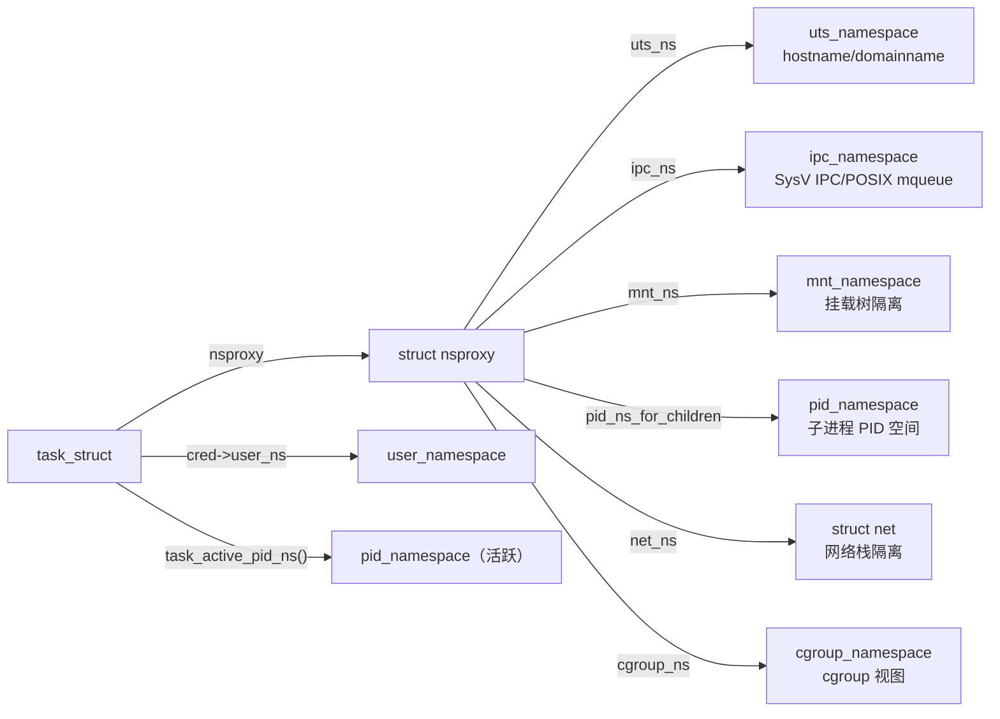
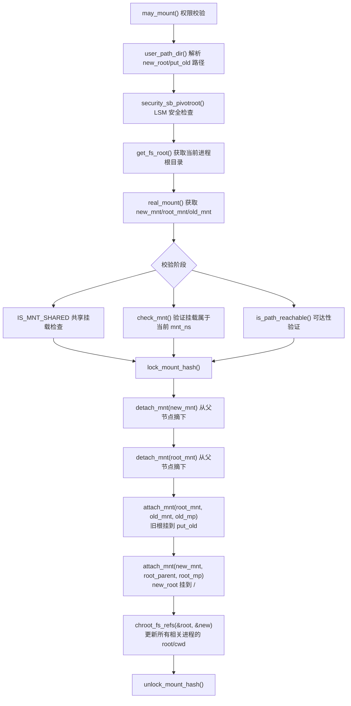
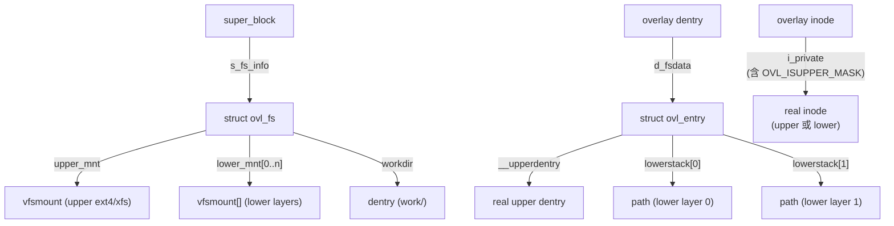
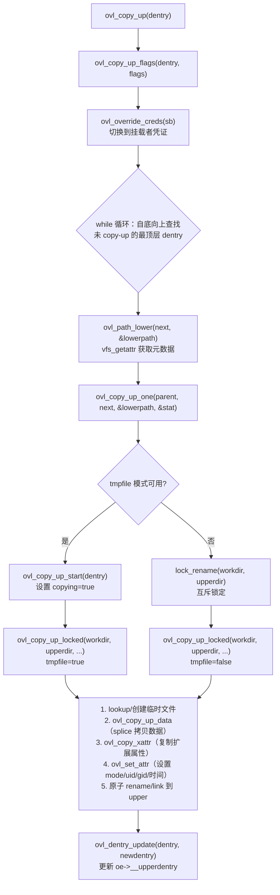
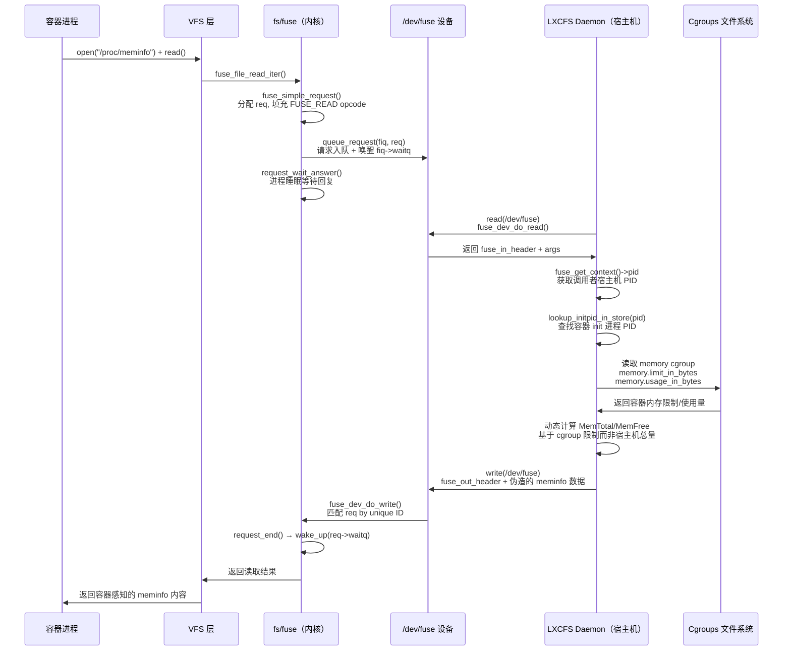
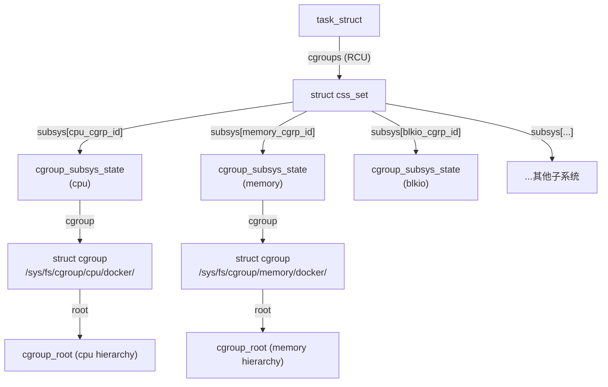

##  0x00    前言

本文基于 **Linux Kernel v4.11.6** 源码，从内核视角深入剖析 Docker 容器的五大核心底层技术：Namespace 隔离与 `pivot_root`、OverlayFS 联合文件系统、LXCFS/FUSE 资源视图伪装、eBPF 容器场景下的差异分析、以及 Cgroups 资源限制

##  0x01    容器隔离的基石：Namespace 机制与 pivot_root 系统调用

####    进程与 Namespace 的关联

在 v4.11.6 中，每个进程（`struct task_struct`）通过 `task_struct->nsproxy` 指针关联到一组 Namespace

```C
//https://elixir.bootlin.com/linux/v4.11.6/source/include/linux/nsproxy.h#L30
struct nsproxy {
    atomic_t count;
    struct uts_namespace *uts_ns;
    struct ipc_namespace *ipc_ns;
    struct mnt_namespace *mnt_ns;
    struct pid_namespace *pid_ns_for_children;
    struct net           *net_ns;
    struct cgroup_namespace *cgroup_ns;
};
```

需要注意的是，PID Namespace 是一个特例，当前进程的活跃 PID Namespace 通过 `task_active_pid_ns(task)` 获取（从 `task->pids[PIDTYPE_PID].pid->numbers[level].ns` 解析），**而 `nsproxy->pid_ns_for_children` 仅用于指定子进程 fork 时加入的 PID Namespace**，所以其变量名字为`pid_ns_for_children`。User Namespace 则存储在 `task->cred->user_ns` 中，不在 `nsproxy` 内

数据结构关联如下：



####    pivot_root 系统调用

`pivot_root` 是容器运行时（如 runc）切换容器根文件系统的核心系统调用，其[实现](https://elixir.bootlin.com/linux/v4.11.6/source/fs/namespace.c#L3114)位于 `fs/namespace.c`：

```C
SYSCALL_DEFINE2(pivot_root, const char __user *, new_root,
        const char __user *, put_old)
```

核心执行流程如下：



关键校验步骤如下：

1. **`may_mount()`**：检查 `ns_capable(current->nsproxy->mnt_ns->user_ns, CAP_SYS_ADMIN)`，确保调用者在当前 Mount Namespace 的 User Namespace 中拥有 `CAP_SYS_ADMIN`
2. **共享挂载检查**：`IS_MNT_SHARED(old_mnt)` / `IS_MNT_SHARED(new_mnt->mnt_parent)` / `IS_MNT_SHARED(root_mnt->mnt_parent)` 三者均不能为共享挂载，否则 `pivot_root` 的传播语义不可控
3. **可达性验证**：`is_path_reachable(old_mnt, old.dentry, &new)` 确保 `put_old` 可从 `new_root` 到达；`is_path_reachable(new_mnt, new.dentry, &root)` 确保 `new_root` 位于当前根之下
4. **核心操作**：在 `lock_mount_hash()` 保护下，先 `detach_mnt` 摘下 `new_mnt` 和 `root_mnt`，再 `attach_mnt` 将 `root_mnt` 挂到 `put_old` 位置、`new_mnt` 挂到原根位置
5. **`chroot_fs_refs()`**：遍历所有线程，将 `fs->root` 和 `fs->pwd` 中指向旧根的引用替换为新根

####    pivot_root vs chroot 安全性对比

从 VFS 挂载树角度解释为什么 `pivot_root` 比 `chroot` 更安全：

| 维度 | `chroot` | `pivot_root` |
|------|----------|--------------|
| 机制 | 仅修改进程 `fs->root` 指针 | 重组 VFS 挂载树拓扑 |
| `..` 逃逸 | 可通过 `chdir("..") + chroot(".")` 逃回真实根 | 旧根被移动到 `put_old`，之后可 `umount`，完全消除 |
| 旧根可见性 | 旧根挂载仍在树上，内核路径解析可到达 | 旧根可被 `umount2(put_old, MNT_DETACH)` 彻底移除 |
| 适用场景 | 调试/临时隔离 | 容器运行时（runc/containerd） |

从源码实现来分析，**`chroot` 的 `..` 逃逸本质是，内核在 `follow_dotdot()` 中，若当前 dentry 不是当前挂载点的 `mnt_root` 则直接 `dentry = dentry->d_parent`，不检查是否超出 `chroot` 设置的根。而 `pivot_root` 后旧根已被卸载，不存在可遍历的父 dentry**

关于`pivot_root`的实现完整分析，参考[]()

##  0x02    容器存储的基石：OverlayFS (overlay2) 

####    OverlayFS 基础概念

OverlayFS 是一种堆叠文件系统，它依赖并建立在其它文件系统（如 `ext4fs`/`xfs` 等）之上，并不直接参与磁盘空间结构的划分，仅仅将原来底层文件系统中不同的目录进行策略式合并，然后向用户呈现统一视图。挂载命令如下：

```BASH
#其中lower1:lower2:lower3表示不同的lower层目录
#不同的目录使用:分隔，层次关系依次为lower1 > lower2 > lower3
mount -t overlay overlay -o lowerdir=lower1:lower2:lower3,upperdir=upper,workdir=work merged
```

分层规则：
-   `lowerdir`：只读层，支持多个目录堆叠，优先级依次降低
-   `upperdir`：可读写层，所有创建、修改、删除操作都在此体现
-   `merged`：联合挂载后的统一视图，是用户最终看到的目录
-   `workdir`：OverlayFS 内部使用的临时目录，用于原子性操作，必须与 `upperdir` 在同一文件系统上

####    核心数据结构

在 v4.11.6 中，OverlayFS 的核心数据结构定义在 `fs/overlayfs/ovl_entry.h`（注意：此版本**没有** `struct ovl_inode`，inode 信息通过 `inode->i_private` 存储）：

**`struct ovl_fs`**（超级块私有数据，一个 overlay 挂载对应一个）：

```C
//https://elixir.bootlin.com/linux/v4.11.6/source/fs/overlayfs/ovl_entry.h#L20
struct ovl_fs {
    struct vfsmount *upper_mnt;       /* upper 层 vfsmount */
    unsigned numlower;                /* lower 层数量 */
    struct vfsmount **lower_mnt;      /* lower 层 vfsmount 数组 */
    struct dentry *workdir;           /* workdir dentry */
    long namelen;                     /* 文件名最大长度 */
    struct ovl_config config;         /* 挂载配置 */
    const struct cred *creator_cred;  /* 挂载者凭证 */
    bool tmpfile;                     /* 是否支持 O_TMPFILE */
    wait_queue_head_t copyup_wq;      /* copy-up 等待队列 */
};
```

**`struct ovl_entry`**（每个 overlay dentry 的私有数据，存储在 `dentry->d_fsdata`）：

```C
struct ovl_entry {
    struct dentry *__upperdentry;   /* upper 层对应的真实 dentry */
    struct ovl_dir_cache *cache;    /* 目录缓存 */
    union {
        struct {
            u64 version;            /* 目录版本号 */
            const char *redirect;   /* redirect xattr */
            bool opaque;            /* 不透明标记 */
            bool copying;           /* copy-up 进行中标志 */
        };
        struct rcu_head rcu;
    };
    unsigned numlower;              /* lower 层路径数 */
    struct path lowerstack[];       /* 柔性数组：lower 层 path */
};
```

数据结构关联关系：



####    读操作路径

v4.11.6 的 OverlayFS 读操作并不拦截文件 I/O。当用户 `open()` 一个 overlay 文件时：

1. VFS 调用 `ovl_open()`（`fs/overlayfs/inode.c`）
2. `ovl_open()` 打开底层真实文件（upper dentry 或 lower dentry 对应的真实路径）
3. 将打开的真实 `struct file` 返回给用户，后续 `read()`/`write()` 直接走底层文件系统（如 ext4）的 `file_operations`

这意味着 overlay 层在文件数据 I/O 路径上几乎零开销，仅在 `open`/`lookup`/`stat` 等元数据操作上有介入

####    写操作 Copy-Up 机制

当首次写入一个仅存在于 lower 层的文件时，触发 Copy-Up。完整调用链位于 `fs/overlayfs/copy_up.c`：



`ovl_copy_up_locked()` 的核心步骤：

1. **创建临时文件**：若支持 `O_TMPFILE`，调用 `ovl_do_tmpfile(upperdir, mode)`；否则在 `workdir` 中 `ovl_lookup_temp()` + `ovl_create_real()`
2. **拷贝数据**：`ovl_copy_up_data(lowerpath, upperpath, stat->size)` — 先尝试 `vfs_clone_file_range()`（reflink），失败后回退到 `do_splice_direct()`，以 1MB 块进行拷贝
3. **拷贝扩展属性**：`ovl_copy_xattr(lowerpath->dentry, temp)` — 遍历 `vfs_listxattr` + `vfs_getxattr` + `vfs_setxattr`
4. **设置属性**：`ovl_set_attr(temp, stat)` — mode/uid/gid/atime/mtime
5. **原子提交**：tmpfile 模式用 `ovl_do_link()`，workdir 模式用 `ovl_do_rename()` — 保证操作原子性
6. **fsync**：`vfs_fsync(new_file, 0)` 确保数据落盘，防止 crash 后文件内容为全零

`workdir` 的核心作用是提供原子性保证：文件先在 workdir 中完整构造，最后通过 `rename(2)` 原子移动到 upperdir。如果中途崩溃，workdir 中的残留文件不影响 overlay 视图的一致性

####    Whiteout 机制

当删除一个来自 lower 层的文件时，OverlayFS 在 upper 层创建一个 **Whiteout 文件**，即主次设备号均为 `0` 的字符设备文件（`mknod(name, S_IFCHR, makedev(0, 0))`）。内核在遍历目录合并时，遇到 whiteout 即跳过 lower 层中的同名文件

对于目录删除，使用 **opaque xattr**（`trusted.overlay.opaque=y`）标记该目录为不透明，阻止合并下层同名目录

####    d_real() 的作用

`ovl_d_real()`（`fs/overlayfs/super.c`）是 OverlayFS 与 VFS 层交互的关键。当 VFS 需要获取 overlay dentry 背后的"真实" dentry 时调用。例如：

- 进程打开文件时，`vfs_open()` → `d_real()` 获取真实底层 dentry
- NFS 导出时需要真实的 file handle

这解决了 overlay dentry 与真实 inode 之间的"身份转换"问题

##  0x03    容器视图隔离：LXCFS 与 FUSE 的交互模型

####    问题背景

容器内的 `/proc/meminfo`、`/proc/cpuinfo` 等文件默认暴露宿主机的全局信息，导致容器内应用误判可用资源。LXCFS 通过 FUSE（用户态文件系统）机制，根据容器的 Cgroups 限制动态生成伪造的 `/proc` 数据

####    FUSE 内核机制（`fs/fuse/`）

FUSE 的核心是 `/dev/fuse` 字符设备，内核与用户态 daemon 之间通过请求队列通信：

- **`struct fuse_conn`**：一个 FUSE 挂载对应一个连接，包含 `fuse_iqueue`（待处理请求队列）
- **`struct fuse_req`**：一次 VFS 操作对应一个请求，含 `in`（入参）/`out`（出参）/`waitq`（等待唤醒）
- **`fuse_req->in.h.unique`**：请求唯一 ID，daemon 回复时用于匹配

####    完整请求链路

容器进程执行 `cat /proc/meminfo` 时的完整内核路径：



####    Docker 集成方式

Docker 通过 bind mount 将 LXCFS 的虚拟文件挂载到容器内：

```BASH
docker run -it -m 256m \
    -v /var/lib/lxcfs/proc/meminfo:/proc/meminfo:rw \
    -v /var/lib/lxcfs/proc/cpuinfo:/proc/cpuinfo:rw \
    -v /var/lib/lxcfs/proc/stat:/proc/stat:rw \
    -v /var/lib/lxcfs/proc/uptime:/proc/uptime:rw \
    ubuntu:18.04 /bin/bash
```

LXCFS 处理 `/proc/meminfo` 的核心逻辑（`src/proc_fuse.c`）：
1. 通过 `fuse_get_context()->pid` 获取请求进程的宿主机 PID
2. `lookup_initpid_in_store(pid)` 查找该进程所属容器的 init PID
3. `get_pid_cgroup(initpid, "memory")` 获取容器的 memory cgroup 路径
4. `get_min_memlimit(cgroup, false)` 读取 `memory.limit_in_bytes`
5. `cgroup_ops->get_memory_current()` 读取 `memory.usage_in_bytes`
6. 动态计算各字段：`MemTotal = min(memlimit, host_total)`，`MemFree = MemTotal - memusage`

todo：LXCFS 解决了什么问题？


##  0x05    资源限制的基石：Cgroups 数据结构关联

####    进程与 Cgroups 的绑定

在 v4.11.6 中，进程通过 `task_struct->cgroups` 指针（RCU 保护）关联到 `struct css_set`，后者持有各子系统的 `cgroup_subsys_state` 指针数组：



####    核心数据结构

**`struct css_set`**（`include/linux/cgroup-defs.h`）：

```C
struct css_set {
    atomic_t refcount;
    struct hlist_node hlist;           /* 全局哈希表节点 */
    struct list_head tasks;            /* 使用此 css_set 的所有任务 */
    struct list_head cgrp_links;       /* 关联的 cgroup 列表 */
    struct cgroup_subsys_state *subsys[CGROUP_SUBSYS_COUNT]; /* 各子系统状态 */
    struct rcu_head rcu_head;
};
```

**`struct cgroup_subsys_state`**（各子系统的 per-cgroup 状态）：

```C
struct cgroup_subsys_state {
    struct cgroup *cgroup;             /* 所属 cgroup */
    struct cgroup_subsys *ss;          /* 所属子系统描述符 */
    struct percpu_ref refcnt;          /* 引用计数 */
    struct cgroup_subsys_state *parent;/* 父节点 */
    int id;                            /* CSS ID */
    unsigned int flags;                /* CSS_ONLINE, CSS_DYING 等 */
};
```

####    访问宏

内核提供了便捷的访问宏（`include/linux/cgroup.h`）：

```C
/* 获取进程的 css_set */
static inline struct css_set *task_css_set(struct task_struct *task) {
    return rcu_dereference(task->cgroups);
}

/* 获取进程在指定子系统中的 cgroup_subsys_state */
#define task_css(task, subsys_id) \
    task_css_set(task)->subsys[subsys_id]

/* 获取进程在指定子系统中所属的 cgroup */
static inline struct cgroup *task_cgroup(struct task_struct *task, int subsys_id) {
    return task_css(task, subsys_id)->cgroup;
}
```

####    css_set 的设计意图

`css_set` 的核心设计思想是**去重共享**：多个进程若属于完全相同的 cgroup 组合（即在所有子系统中都属于同一个 cgroup），则共享同一个 `css_set`。这使得：

- `fork()` 时仅需增加 `css_set` 引用计数，O(1) 操作
- `exit()` 时仅需减少引用计数
- 全局 `css_set_table` 哈希表以 `subsys[]` 指针向量为 key 进行去重

进程迁移 cgroup 时（写入 `cgroup.procs`），内核调用 `find_css_set()` 查找或创建目标 `css_set`，然后 `rcu_assign_pointer(task->cgroups, new_css_set)` 原子切换

####    v4.11.6 支持的 Cgroup 子系统

| 子系统 | 功能 | Docker 对应参数 |
|--------|------|-----------------|
| cpu | CPU 时间配额（CFS bandwidth） | `--cpu-quota`, `--cpu-period` |
| cpuacct | CPU 使用统计 | — |
| cpuset | CPU/内存节点绑定 | `--cpuset-cpus`, `--cpuset-mems` |
| memory | 内存限制与 OOM | `--memory`, `--memory-swap` |
| blkio | 块 I/O 限速 | `--blkio-weight` |
| devices | 设备访问控制 | `--device` |
| freezer | 进程组冻结/解冻 | `docker pause` |
| net_cls | 网络包分类标记 | — |
| net_prio | 网络接口优先级 | — |
| pids | 进程数量限制 | `--pids-limit` |
| hugetlb | 大页内存限制 | — |
| perf_event | 性能事件访问控制 | — |

##  0x06  参考
-   [Overlay 文件系统介绍](https://flyflypeng.tech/%E4%BA%91%E5%8E%9F%E7%94%9F/2023/03/29/Overlay-%E6%96%87%E4%BB%B6%E7%B3%BB%E7%BB%9F.html)
-   [docker容器技术基础之联合文件系统OverlayFS](https://zhuanlan.zhihu.com/p/392508816)
-   [理解docker [三] - git与overlayfs](https://zhuanlan.zhihu.com/p/144616121)
-   [理解存储驱动overlay2](https://slions.github.io/2021/07/12/%E7%90%86%E8%A7%A3%E5%AD%98%E5%82%A8%E9%A9%B1%E5%8A%A8overlay2/)
-   [Linux Kernel v4.11.6 源码 - Bootlin Elixir](https://elixir.bootlin.com/linux/v4.11.6/source)
-   [LXCFS - GitHub](https://github.com/lxc/lxcfs/)
-   [pivot_root(2) - Linux manual page](https://man7.org/linux/man-pages/man2/pivot_root.2.html)
-   [eBPF helpers documentation](https://github.com/isovalent/ebpf-docs)
