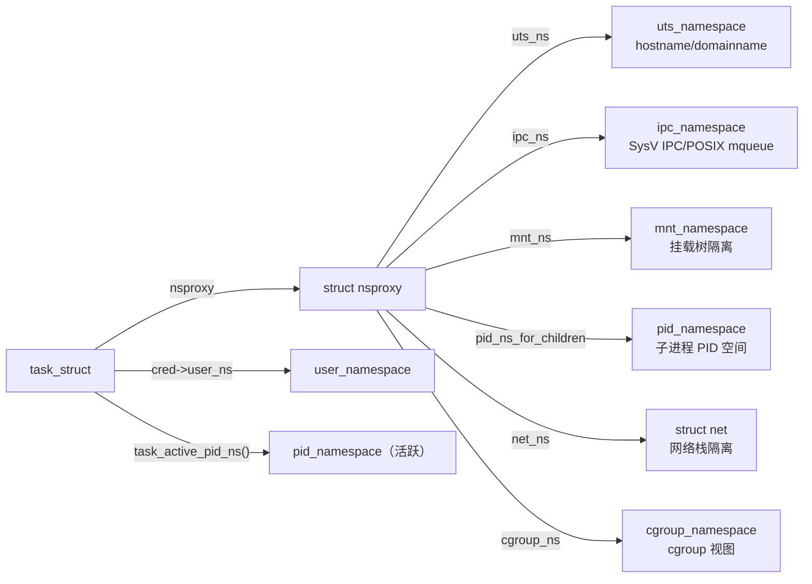
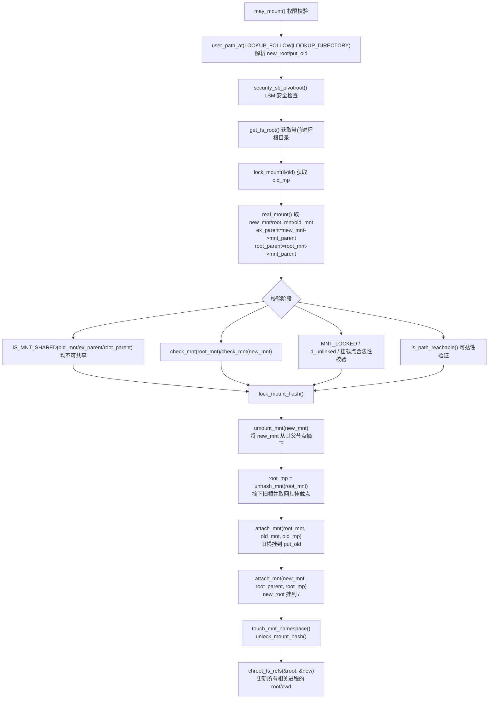
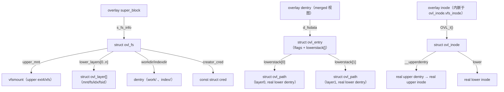
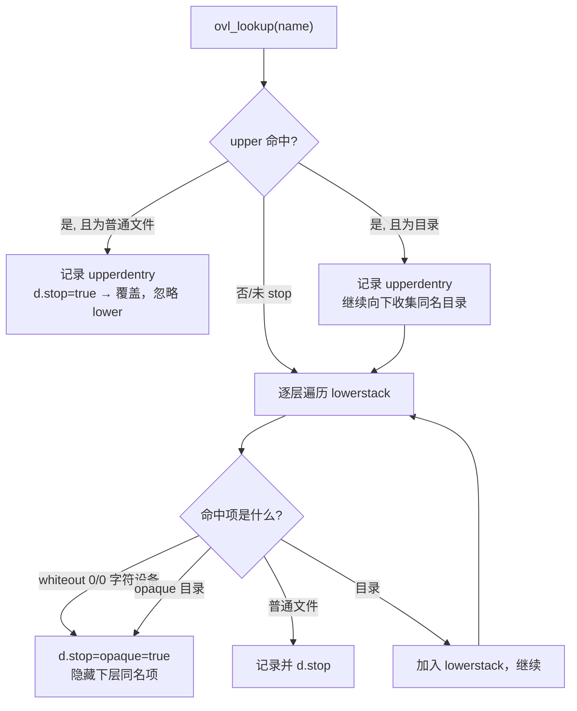
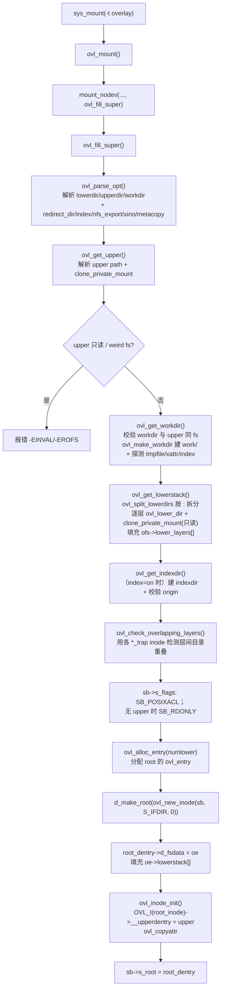
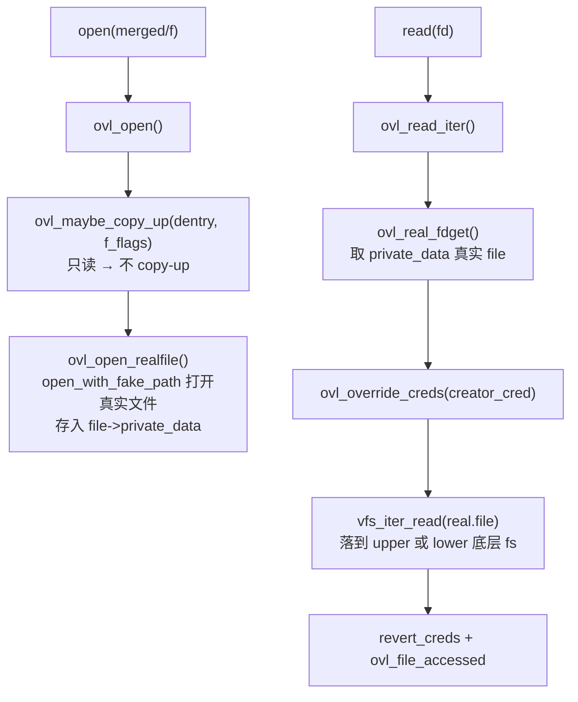
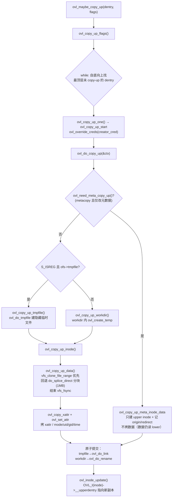
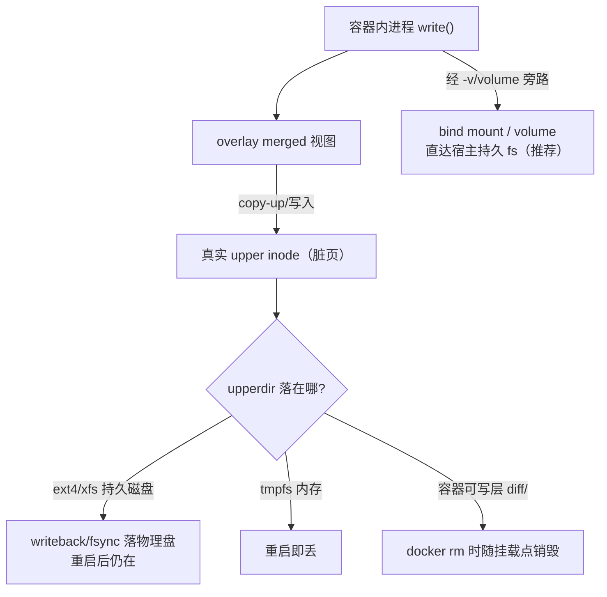
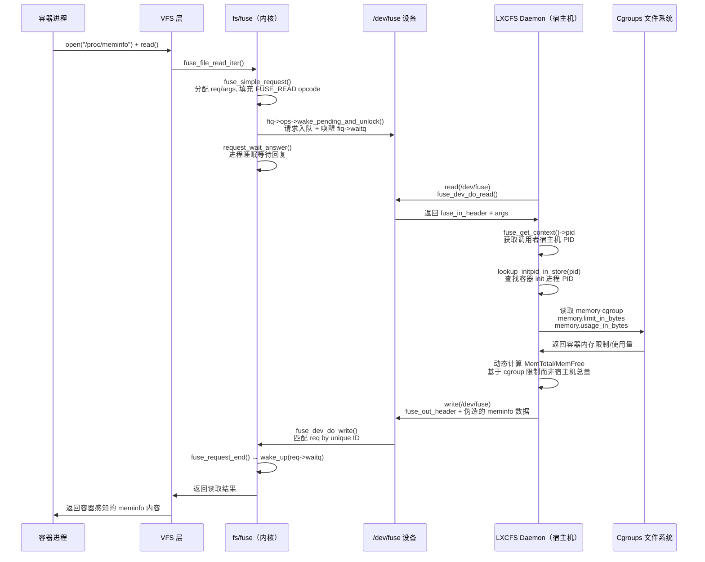
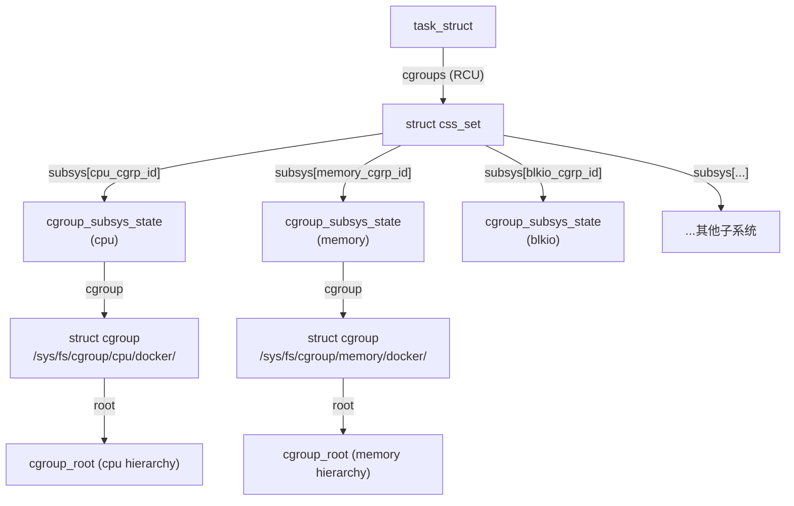

##  0x00    前言

本文基于 **Linux Kernel v5.4.241** [源码](https://elixir.bootlin.com/linux/v5.4.241/source/)，从内核视角深入理解 Docker 容器的核心底层技术，主要涵盖如下：

-   Namespace 隔离与 `pivot_root` 机制
-   OverlayFS 联合文件系统（重点）
-   LXCFS/FUSE 资源视图伪装
-   eBPF 容器场景下的差异分析
-   Cgroups 下资源限制

####    OverlayFS 基础
OverlayFS 是一种典型的虚拟文件系统，属于联合文件系统（Union File System）。之所以被称为虚拟，是因为它本身不直接管理底层的物理磁盘数据块。相反，它是建立在其他已经存在的本地文件系统（如 ext4、xfs等）之上的一个抽象层。它通过将多个不同的目录叠加在一起，向用户呈现一个统一的文件系统视图，工作机制如下：

| 目录层级 | 属性 | 作用说明 |
| :-----| :---- | :---- |
| Lowerdir (底层) | 只读 (Read-Only) | 提供基础的文件和目录。可以指定多个底层目录，用户对这里的原始文件无法进行直接修改 |
| Upperdir (上层) | 可读写 (Read-Write) | 记录所有的变更操作。当用户在这个虚拟文件系统中新建、修改或删除文件时，这些操作都会被写入到上层目录中 |
|Merged (合并层)|虚拟视图|用户实际看到并操作的挂载点。如果底层和上层有同名文件，上层的文件会遮盖（覆盖）底层的文件（这就是 Overlay 名字的由来）|

容器内写文件，遵循写时复制（Copy-on-Write）规则：**当用户试图修改 Merged 视图中一个属于 Lowerdir 的文件时，OverlayFS 会先将该文件从底层复制到 Upperdir，然后再在 Upperdir 中进行修改。底层的文件始终保持原样不变**

注意，一般在容器中，看到的就是merge层的结果，挂载点也是`xxxx/merged`

```bash
[root@VM-x-x-tencentos ~]# findmnt
TARGET                         SOURCE FSTYPE      OPTIONS
/                              /dev/vda1
                                      xfs         rw,relatime,attr2,inode64,logbufs=8,logbsize=32k,noquota
├─/dev                         devtmpfs
│                                     devtmpfs    rw,nosuid,size=4096k,nr_inodes=2008951,mode=755
│ ├─/dev/hugepages             hugetlbfs
│ │                                   hugetlbfs   rw,nosuid,nodev,relatime,pagesize=2M
│ ├─/dev/mqueue                mqueue mqueue      rw,nosuid,nodev,noexec,relatime
│ ├─/dev/shm                   tmpfs  tmpfs       rw,nosuid,nodev
│ └─/dev/pts                   devpts devpts      rw,nosuid,noexec,relatime,gid=5,mode=620,ptmxmode=000
├─/sys                         sysfs  sysfs       rw,nosuid,nodev,noexec,relatime
│ ├─/sys/kernel/tracing        tracefs
│ │                                   tracefs     rw,nosuid,nodev,noexec,relatime
│ ├─/sys/kernel/debug          debugfs
│ │                                   debugfs     rw,nosuid,nodev,noexec,relatime
│ │ └─/sys/kernel/debug/tracing
│ │                            tracefs
│ │                                   tracefs     rw,nosuid,nodev,noexec,relatime
│ ├─/sys/fs/fuse/connections   fusectl
│ │                                   fusectl     rw,nosuid,nodev,noexec,relatime
│ ├─/sys/kernel/security       securityfs
│ │                                   securityfs  rw,nosuid,nodev,noexec,relatime
│ ├─/sys/fs/cgroup             cgroup2
│ │                                   cgroup2     rw,nosuid,nodev,noexec,relatime,nsdelegate,memory_recursiveprot
│ ├─/sys/fs/pstore             pstore pstore      rw,nosuid,nodev,noexec,relatime
│ ├─/sys/fs/bpf                bpf    bpf         rw,nosuid,nodev,noexec,relatime,mode=700
│ └─/sys/kernel/config         configfs
│                                     configfs    rw,nosuid,nodev,noexec,relatime
├─/proc                        proc   proc        rw,nosuid,nodev,noexec,relatime
│ └─/proc/sys/fs/binfmt_misc   systemd-1
│                                     autofs      rw,relatime,fd=37,pgrp=1,timeout=0,minproto=5,maxproto=5,direct,pipe_ino=8642
│   └─/proc/sys/fs/binfmt_misc binfmt_misc
│                                     binfmt_misc rw,nosuid,nodev,noexec,relatime
├─/run                         tmpfs  tmpfs       rw,nosuid,nodev,size=3222264k,nr_inodes=819200,mode=755
│ ├─/run/user/71200            tmpfs  tmpfs       rw,nosuid,nodev,relatime,size=1611132k,nr_inodes=402783,mode=700,uid=71200,gid=100
│ └─/run/docker/netns/d62277e5b2b1
│                              nsfs[net:[4026532370]]
│                                     nsfs        rw
├─/data                        /dev/vdb
│                                     ext4        rw,relatime
│ └─/data/docker/lib/overlay2/c12046e28d8cc6ee75815429588ef931ea1eae8f121ac3188d634a0b41afdbd5/merged
│                              overlay
│                                     overlay     rw,relatime,lowerdir=/data/docker/lib/overlay2/l/X32EDIUVLPKCIVMWIG4N3PZCOI:/data/do
└─/var/lib/nfs/rpc_pipefs      sunrpc rpc_pipefs  rw,relatime
```

####    一个例子

比如，在宿主机上，通过如下脚本获取某个容器的所有level的目录视图

```bash
#!/bin/bash

CONTAINER=$1

if [ -z "$CONTAINER" ]; then
    echo "用法: $0 <容器ID或名称>"
    exit 1
fi

# 获取容器信息
INFO=$(docker inspect "$CONTAINER" 2>/dev/null)
if [ $? -ne 0 ]; then
    echo "错误: 容器 '$CONTAINER' 不存在"
    exit 1
fi

# 提取并显示目录
echo "容器: $CONTAINER"
echo "================================"

# Upper目录
UPPER=$(echo "$INFO" | grep -o '"UpperDir": "[^"]*' | cut -d'"' -f4)
echo "Upper目录:"
echo "  $UPPER"
echo ""

# Lower目录
LOWER=$(echo "$INFO" | grep -o '"LowerDir": "[^"]*' | cut -d'"' -f4)
echo "Lower目录:"
echo "$LOWER" | tr ':' '\n' | while read -r dir; do
    echo "  $dir"
done

# 统计信息
echo ""
echo "统计:"
echo "  Upper目录存在: $([ -d "$UPPER" ] && echo "是" || echo "否")"
LOWER_COUNT=$(echo "$LOWER" | tr ':' '\n' | grep -c .)
echo "  Lower目录数量: $LOWER_COUNT"
```

运行结果：

```bash
[root@VM-x-x-tencentos ~]# bash overlay.sh 8f62d941c669
容器: 8f62d941c669
================================
Upper目录:
  /data/docker/lib/overlay2/c12046e28d8cc6ee75815429588ef931ea1eae8f121ac3188d634a0b41afdbd5/diff

Lower目录:
  /data/docker/lib/overlay2/c12046e28d8cc6ee75815429588ef931ea1eae8f121ac3188d634a0b41afdbd5-init/diff
  /data/docker/lib/overlay2/109459d14a9fe7adcb239d5833a6ce58b301640379c98250af4cd0b5a9d480b7/diff

统计:
  Upper目录存在: 是
  Lower目录数量: 2
```

####    OverlayFS vs VFS
VFS 是 Linux 内核的一套接口标准和框架，而 OverlayFS 是实现了这套标准的一个具体的文件系统插件。OverlayFS 和 VFS 之间是一种巧妙的双向依赖与代理（Proxy）关系

在正常的单层文件系统中（比如用户直接读写 ext4），调用链非常直接，即**用户进程 ➜ 系统调用 (sys_open) ➜ VFS ➜ ext4 驱动 ➜ 块设备**。当引入 OverlayFS（在 Docker 容器中操作文件）时，OverlayFS 在架构中扮演了中间人的角色，调用链变成了**用户进程 ➜ 系统调用 ➜ VFS ➜ OverlayFS ➜ VFS (内部转发) ➜ 底层文件系统 (如 ext4) ➜ 块设备**。简单描述如下：

1、对上：OverlayFS 向 VFS 注册自己

为了让用户态程序能够像访问普通文件系统一样访问 OverlayFS，OverlayFS 必须实现 VFS 定义的超级块（super_block）、索引节点（inode）、目录项（dentry）和文件（file）这四大核心对象的函数指针（如 `inode_operations` 和 `file_operations`等）。当用户在合并层（Merged）执行 `open()` 时，VFS 会调用 OverlayFS 提供的 `ovl_open()` 函数

2、对下：OverlayFS 通过 VFS 操作底层数据
OverlayFS 本身不知道如何读写磁盘。当它接收到上层 VFS 传来的指令后，它会根据自身上下层合并的逻辑，找到真实文件所在的 Lowerdir 或 Upperdir。找到之后，OverlayFS 会再次调用 VFS 的接口（如 `vfs_read`等），去操作底层的 ext4等文件系统

3、深入内核机制：数据结构的映射

从内核对象来看，两者的关系体现为一种包裹或指针指向的状态：

-   VFS 层面看到的对象： 用户进程打开一个文件，VFS 会为其分配一个 file、dentry 和 inode。这些对象所属的文件系统类型被标记为 overlay
-   OverlayFS 内部的映射： OverlayFS 会在内存中维护自己特有的数据结构（例如 `ovl_inode`等）。这个结构体内部包含了指向底层真实文件系统 inode 的指针（分为指向上层的 `upperdentry` 和指向下层的 `lowerdentry`等）

当用户试图修改一个只读底层文件触发写时复制时，其实就是 OverlayFS 拦截了 VFS 的写请求（具体是如何拦截的？后文介绍），在 VFS 层面先完成了文件从底层 ext4 到上层 ext4 的拷贝，然后再将写请求转发给上层 ext4 的 inode

下文将会以open、write、read等系统调用来介绍OverlayFS 是如何实现劫持的

####    overlay：宿主机视角
在宿主机上，可以看到overlayfs的所有目录。在宿主机上，这些目录只是底层物理文件系统（比如 ext4）上普通的、真实的目录。OverlayFS 的魔法只在挂载点（Mount Point）生效，而隔离效果只在挂载命名空间（Mount Namespace）内生效。因为宿主机的 root 进程处于初始命名空间，天然拥有全局视角。可以把 Docker 在宿主机上的目录结构（通常在 `/var/lib/docker/overlay2/<container_id_or_hash>/` 下）与 OverlayFS 的原生概念做一个精准映射：

| 宿主机上的 Docker 目录 | OverlayFS 原生概念 | 权限 | 实际作用与关系|
| :-----| :---- | :---- |:---- |
| lower（或者`l/`的软链）| lowerdir | 只读 |镜像层。这是容器的基础环境（如 Ubuntu 的基础系统文件）。底层可以有多个，以只读方式叠加 |
|  diff/ | upperdir |可读写 | 容器可写层。容器运行后所有的新增、修改、删除操作，全部真实地记录在这个 diff 目录里|
| work/ | workdir | 不可见 |过渡目录。用于保证 Copy-Up（写时复制）操作的原子性。用户和容器都无需直接感知它 |
| merged/|  挂载点 (Mount Point) | 虚拟视图 |容器的根目录 (`/`)。它是 OverlayFS 将 lower 和 diff 合并后呈现的最终视图 |

举个简单例子，当容器内发生文件操作时，宿主机会看到什么：

1、容器内新建一个文件

-   容器视角： 在 `/root/` 下创建了 `new_file.sh`
-   宿主机视角： 宿主机直接在 `/var/lib/docker/overlay2/<id>/diff/root/new_file.sh` 发现了此文件。lower 目录不变，merged 目录通过虚拟映射显示该文件

2、容器内修改一个镜像自带的文件（Copy-Up）

-   容器视角： 修改了 `/etc/nginx/nginx.conf`
-   宿主机视角： OverlayFS 会把这个文件从只读的 lower 目录悄悄复制一份到 `diff/etc/nginx/nginx.conf`。然后容器的修改实际上是写入了 diff 里的这个副本。宿主机可以看到两个版本的配置文件：原始的在 lower，修改后的在 diff

3、容器内删除一个镜像自带的文件（Whiteout 白板机制）

-   容器视角： 删除了 `/bin/wget`，文件消失
-   宿主机视角： 底层 lower 目录里的只读 `wget` 依然健在，不可更改。但在 `diff/bin/` 目录下，OverlayFS 会创建一个特殊的字符设备文件（主次设备号为 `0,0`），名字也叫 `wget`（即白板文件）。当 merged 层合并时，一旦遇到这个白板，就会遮挡底层的同名文件，从而在容器内表现为文件已被删除

##  0x01    容器隔离的基石：Namespace 机制与 pivot_root 系统调用

本章节重点介绍内核是如何实现“隔离”机制的

####    进程与 Namespace 的关联

在内核 v5.4.241 中，每个进程（`struct task_struct`）通过 `task_struct->nsproxy` 指针关联到一组 Namespace（该结构自 v4.x 至 v5.4 保持一致）

```C
//https://elixir.bootlin.com/linux/v5.4.241/source/include/linux/nsproxy.h#L31
struct nsproxy {
    atomic_t count;
    struct uts_namespace *uts_ns;
    struct ipc_namespace *ipc_ns;
    struct mnt_namespace *mnt_ns;
    struct pid_namespace *pid_ns_for_children;
    struct net           *net_ns;
    struct cgroup_namespace *cgroup_ns;
};
```

需要注意的是，PID Namespace 是一个特例，当前进程的活跃 PID Namespace 通过 `task_active_pid_ns(task)` 获取（从 `task->pids[PIDTYPE_PID].pid->numbers[level].ns` 解析），**而 `nsproxy->pid_ns_for_children` 仅用于指定子进程 fork 时加入的 PID Namespace**（所以其变量名字为`pid_ns_for_children`）。User Namespace 则存储在 `task->cred->user_ns` 中，不在 `nsproxy` 内

todo（详细分析）

在[前文]()介绍进程fork创建子进程时，


数据结构关联如下：



####    pivot_root 系统调用

`pivot_root` 是容器运行时（如 runc 等）切换容器根文件系统的核心系统调用，其[实现](https://elixir.bootlin.com/linux/v5.4.241/source/fs/namespace.c#L3615)位于 `fs/namespace.c`：

```C
SYSCALL_DEFINE2(pivot_root, const char __user *, new_root,
        const char __user *, put_old)
```

v5.4 的核心执行流程如下（相比早期内核实现，核心的**摘旧挂新流程**改为 `umount_mnt` + `unhash_mnt` + `attach_mnt`）：



关键校验步骤如下：

todo，补充

1. **`may_mount()`**：检查 `ns_capable(current->nsproxy->mnt_ns->user_ns, CAP_SYS_ADMIN)`，确保调用者在当前 Mount Namespace 的 User Namespace 中拥有 `CAP_SYS_ADMIN`
2. **共享挂载检查**：`IS_MNT_SHARED(old_mnt)` / `IS_MNT_SHARED(ex_parent)`（即 `new_mnt->mnt_parent`）/ `IS_MNT_SHARED(root_parent)`（即 `root_mnt->mnt_parent`）三者均不能为共享挂载，否则 `pivot_root` 的传播语义不可控；此外 v5.4 还校验 `new_mnt` 未被 `MNT_LOCKED` 锁定、`new.dentry` 未被 `d_unlinked`
3. **可达性验证**：`is_path_reachable(old_mnt, old.dentry, &new)` 确保 `put_old` 可从 `new_root` 到达；`is_path_reachable(new_mnt, new.dentry, &root)` 确保 `new_root` 位于当前根之下
4. **核心操作**：在 `lock_mount_hash()` 保护下，先 `umount_mnt(new_mnt)` 将新根从其父节点摘下，再 `unhash_mnt(root_mnt)` 摘下旧根并取回它的挂载点 `root_mp`；随后 `attach_mnt(root_mnt, old_mnt, old_mp)` 把旧根挂到 `put_old`、`attach_mnt(new_mnt, root_parent, root_mp)` 把新根挂到原根位置
5. **`chroot_fs_refs()`**：遍历所有线程，将 `fs->root` 和 `fs->pwd` 中指向旧根的引用替换为新根

####    pivot_root vs chroot 安全性对比

从 VFS 挂载树角度解释为什么 `pivot_root` 比 `chroot` 更安全：

todo

| 维度 | `chroot` | `pivot_root` |
|------|----------|--------------|
| 机制 | 仅修改进程 `fs->root` 指针 | 重组 VFS 挂载树拓扑 |
| `..` 逃逸 | 可通过 `chdir("..") + chroot(".")` 逃回真实根 | 旧根被移动到 `put_old`，之后可 `umount`，完全消除 |
| 旧根可见性 | 旧根挂载仍在树上，内核路径解析可到达 | 旧根可被 `umount2(put_old, MNT_DETACH)` 彻底移除 |
| 适用场景 | 调试/临时隔离 | 容器运行时（runc/containerd） |

从源码实现来分析，**`chroot` 的 `..` 逃逸本质是，内核在 `follow_dotdot()` 中，若当前 dentry 不是当前挂载点的 `mnt_root` 则直接 `dentry = dentry->d_parent`，不检查是否超出 `chroot` 设置的根。而 `pivot_root` 后旧根已被卸载，不存在可遍历的父 dentry**

关于`pivot_root`的实现完整分析，参考[Linux 内核之旅（十七）：Linux Namespace](https://pandaychen.github.io/2025/07/23/A-LINUX-KERNEL-TRAVEL-17/)

##  0x02    容器存储的基石：OverlayFS 内核实现深度剖析

本章节基于 **Linux Kernel v5.4.241** 的源码目录 [`fs/overlayfs/`](https://elixir.bootlin.com/linux/v5.4.241/source/fs/overlayfs)，从内核数据结构与底层机制角度，深度剖析 OverlayFS 的运行原理，理解 Docker `overlay2` 存储驱动在内核侧的实现本质。按如下模块依次展开：

1.  `lower`/`upper`/`merged` 三层的内核态实现
2.  对 VFS 核心结构（`super_block`/`inode`/`dentry`/`file`）的兼容与截获机制
3.  挂载过程解析（Mount 链路）
4.  读写各层次的全量 Case 枚举与内核执行链路
5.  状态持久化：如何保存修改与"重启丢失"的本质
6.  扩展问题：LXCFS 与 OverlayFS 的关系、以及 OverlayFS 对 VFS 的 hook 机制本质

> 版本说明，v5.4 的 OverlayFS 相比早期实现（如 v4.11.6）有几处**关键演进**：
> 1. **引入了独立的 `struct ovl_inode`**（内嵌 `struct inode vfs_inode`，使用独立 slab 缓存），overlay 不再用 `i_private` 低位打标记的方式关联真实 inode
> 2. **常规文件启用了完整的堆叠式文件操作表 `ovl_file_operations`**（`ovl_open`/`ovl_read_iter`/`ovl_write_iter`/`ovl_fsync`/`ovl_mmap` 等），数据 I/O 由 overlay 显式转发；copy-up 触发点从 `d_real` 下沉到了 `ovl_open`，[定义](https://elixir.bootlin.com/linux/v5.4.241/source/fs/overlayfs/file.c#L688)
> 3. `struct ovl_layer` / `struct ovl_path` / `struct ovl_sb` 抽象了层的概念，支持 `index`、`nfs_export`、`xino`、`metacopy`（仅拷元数据）等新特性
> 4. `ovl_fill_super` 被拆分为 `ovl_get_upper()`/`ovl_get_workdir()`/`ovl_get_lowerstack()`/`ovl_get_indexdir()` 等子过程，挂载标志改用 `SB_RDONLY`/`SB_POSIXACL`

因此本文还是选择5.x版本进行后续代码分析

####    OverlayFS 基础概念

正如前文描述，OverlayFS 是一种堆叠文件系统，它依赖并建立在其它文件系统（如 `ext4fs`/`xfs` 等）之上，并不直接参与磁盘空间结构的划分，仅仅将原来底层文件系统中不同的目录进行策略式合并，然后向用户呈现统一视图。挂载命令如下：

```BASH
#其中lower1:lower2:lower3表示不同的lower层目录
#不同的目录使用:分隔，层次关系依次为lower1 > lower2 > lower3
mount -t overlay overlay -o lowerdir=lower1:lower2:lower3,upperdir=upper,workdir=work merged
```

分层规则：
-   `lowerdir`：只读层，支持多个目录堆叠，优先级依次降低
-   `upperdir`：可读写层，所有创建、修改、删除操作都在此体现
-   `merged`：联合挂载后的统一视图，是用户最终看到的目录
-   `workdir`：OverlayFS 内部使用的临时目录，用于原子性操作，必须与 `upperdir` 在同一文件系统上

####    lower / upper / merged 三层的内核态实现：VFS的四大组件

理解OverlayFS的实现以及其与VFS的配合模式，一定要理解**代理模式（Proxy Pattern）与双重身份**，OverlayFS 在 Linux 内核中扮演了一个双面的角色：

-   向上（对 VFS 框架）：假装自己是一个普通的单层文件系统，实现并注册了 VFS 要求的四大操作表（`s_op`、`i_op`、`d_op`、`f_op`）
-   向下（对底层真实文件系统）：它本身又是一个 VFS 的客户端，通过调用内核内部的 `vfs_*` 相关的API（如 `vfs_open`、`vfs_mkdir`、`vfs_getattr`等），将请求转发给底层真实文件系统（ext4/xfs）的 dentry/inode/file

本小节先简单介绍下 OverlayFS 是如何适配 VFS 概念的：

1、 dentry 的适配：从**1对1到1对多拓扑展开**

在原生 VFS 中，内存路径拓扑是 1 对 1 的，即一个 VFS dentry 对应磁盘上的一个物理目录/文件节点；而OverlayFS 必须把多层（Upper + 多个 Lowers）相同路径的物理节点，在内存中折叠成 VFS 看到的一个虚拟节点。OverlayFS 的适配手法是VFS 的 dentry 作为一个外壳，OverlayFS 利用 `dentry->d_fsdata` 指针挂载了自己的 `ovl_entry`

映射结构

-   VFS 视角：`/merged/foo` 对应一个 `struct dentry`（Overlay 类型）
-   OverlayFS 视角：这个 dentry 结构的 `d_fsdata` 指向 `struct ovl_entry`，内部包含一个底层路径数组 `lowerstack[]`（每个元素是 `struct ovl_path`）。**注意在 v5.4 中，指向 Upper 层的 `__upperdentry` 指针不再放在 `ovl_entry` 里，而是移到了每个 overlay inode 私有的 `struct ovl_inode`**；`ovl_entry` 只保留 `flags` 与 `lowerstack[]`

对路径查找（lookup）的适配如下，当 VFS 解析路径触发 `d_op->d_lookup`（即 [`ovl_lookup`](https://elixir.bootlin.com/linux/v5.4.241/source/fs/overlayfs/namei.c#L813)）时，OverlayFS 会在后台先后对 Upper 目录和所有 Lower 目录依次发起内部 VFS 查找（`lookup_one_len`），把找出的所有真实 dentry 填入 `ovl_entry`/`ovl_inode` 中，最后向 VFS 返回这个封装好的外壳 dentry

```
VFS 视图:       [ Overlay dentry (/merged/a.txt) ]
                         │ (d_fsdata)
                         ▼
Overlay 适配层: [ struct ovl_entry ]
                 ├── Upper dentry ───► [ ext4 dentry (/upper/a.txt) ]
                 └── Lower stack ────► [ ext4 dentry (/lower/a.txt) ]
```

2、inode 的适配：**属性代理与双向容器**

VFS 要求每个 dentry 都必须绑定一个 `struct inode` 来提供文件元数据和操作接口。OverlayFS 并不维护磁盘上的 inode 结构，它的 inode 是在内存中动态织入的代理。适配手法是结构体嵌入（Container Embedding）。OverlayFS 定义了 `struct ovl_inode`，并将 VFS 原生的 `struct inode` 嵌入其中作为成员（非常常见了），通过内核 `container_of` 机制（`OVL_I(inode)`），OverlayFS 可以随时在 VFS `inode` 和 `ovl_inode` 之间无缝切换

```c
struct ovl_inode {
    struct dentry *__upperdentry; // 当前生效的 Upper dentry
    struct ovl_path lowerpath;    // 当前生效的 Lower path
    /* ... */
    struct inode vfs_inode;       // 嵌入的原生 VFS inode
};
```

另外，还有两处细节：

-   操作委派（Delegation）：VFS 调用的 `vfs_inode->i_op` 被设置为 `ovl_file_inode_operations` 或 `ovl_dir_inode_operations`。
如当用户调用 `stat` 触发 `i_op->getattr` 时，OverlayFS 的 `ovl_getattr()` [函数](https://elixir.bootlin.com/linux/v5.4.241/source/fs/overlayfs/inode.c#L141)会去取出底层真实的 inode（`ovl_i_real(inode)`），然后再去调用底层文件系统（如 ext4）的 `i_op->getattr`
-   POSIX 兼容性补偿（XINO）：VFS 要求同一个文件的 `st_dev` 和 `st_ino` 在声明周期内保持不变。但 OverlayFS 跨越了不同的底层挂载点，且发生 Copy-Up 后文件会从 Lower 切换到 Upper。如此为了欺骗 VFS，OverlayFS 在 inode 层实现了 XINO（eXtended Inode Number） 机制，在 `ovl_getattr` 时动态重写 `st_ino` 和 `st_dev`，向 VFS 隐瞒底层 inode 发生变更的事实。参考[` ovl_map_dev_ino`](https://elixir.bootlin.com/linux/v5.4.241/source/fs/overlayfs/inode.c#L78)实现

3、file 的适配：**二级打开（dentry_open）与 I/O 转发**

当用户程序发起 `open()` 时，VFS 会分配一个 `struct file`对象。对于普通文件系统，file 会直接关联 Page Cache 和块设备 I/O；但对 OverlayFS 来说，其使用了打开即代理（Second Open）的模式，即在 VFS 调用 `ovl_open()` 时，OverlayFS 并不初始化具体的 I/O 句柄，而是：

-   根据当前文件是在 Upper 还是 Lower，拿到底层的真实 dentry 和 mnt（即 `struct path`）
-   调用内核内部函数 `dentry_open()` / `vfs_open()`，要求 VFS 为底层文件系统重新生成一个底层的 `struct file`（简称 realfile）
-   将这个 realfile 塞进 OverlayFS 自身 file 的 `private_data` 中（或封装在 `ovl_file` 中）

I/O 数据的透传：OverlayFS 的 `f_op`（`ovl_file_operations`）大部分都是极简的转发函数。对于用户态来说，读写的所有的 Page Cache 实际上全都在底层文件系统（如 ext4）的 `address_space` 中，OverlayFS 自己完全不参与任何 Cache 管理

```c
//https://elixir.bootlin.com/linux/v5.4.241/source/fs/overlayfs/file.c#L233
static ssze_t ovl_read_iter(struct kiocb *iocb, struct iov_iter *iter) {
    struct file *file = iocb->ki_filp;
    struct file *realfile = file->private_data; // 取出底层的 realfile
    ......
    // 重新封装 kiocb 指向 realfile，然后直接下发给 VFS API
    return vfs_iter_read(realfile, iter, &iocb->ki_pos, ...);
}
```

4、super_block 的适配：**多挂载点生命周期管理**

VFS 的 `super_block` 结构代表一个文件系统的挂载上下文。OverlayFS 的 `super_block`（通过 `s_fs_info` 绑定 `struct ovl_fs`）不对应任何物理设备，它的主要作用是持有对所有底层文件系统 `vfsmount` 和 `super_block` 的引用计数字段。如当执行 `mount -t overlay` 时，VFS 创建 OverlayFS 的 `super_block`。OverlayFS 会在这个超级块对应的 `ovl_fs` 结构中实现如下逻辑：

-   保存 Upper 层目录的 `struct path` 和 `vfsmount`
-   保存所有 Lower 层目录的 `struct path` 数组和对应的 `vfsmount`
-   保存 Workdir 的 `dentry`

防止底层挂载点被提前卸载：OverlayFS 通过在 `ovl_fs` 中增加底层 `vfsmount` 的引用计数（mntgrab），确保只要 OverlayFS 挂载着，底层的 ext4/xfs 挂载点就绝对不会被 VFS 强行卸载

小结下，OverlayFS 对 VFS 四要素的适配：

1.  将 VFS 的 dentry 扩展成多层路径指针数组
2.  将 VFS 的 file 扩展成底层 real_file 的句柄
3.  将 VFS 的 inode 扩展成底层 real_inode 的代理，并利用 VFS 自身的内部 API（`vfs_*`等）完成深层的二次调用

####  三层对应的核心数据结构（重要）

在 v5.4.241 内核中，OverlayFS 的核心数据结构定义在 [`fs/overlayfs/ovl_entry.h`](https://elixir.bootlin.com/linux/v5.4.241/source/fs/overlayfs/ovl_entry.h)。需要建立的第一个认知是**overlay FS 不管理任何磁盘块，`lower`/`upper`/`merged` 在内核态并不是三份磁盘结构，而是三组指向真实底层文件系统对象的引用视图**：

-   `upperdir`（可写层）：在内核态用一个 `struct vfsmount *upper_mnt`（`ovl_fs->upper_mnt`）与每个 overlay inode 私有的真实 upper `struct dentry`（`OVL_I(inode)->__upperdentry`）表示
-   `lowerdir`（只读层，可多层）：用 `struct ovl_layer *lower_layers` 数组描述每一层（含 `vfsmount`、`ovl_sb`、`idx`、`fsid`），每个 overlay dentry 命中的 lower 层则记录在 `ovl_entry->lowerstack[]`（`struct ovl_path` 数组）
-   `merged`（统一视图）：**没有独立数据结构**，它就是 overlay 自己的 `super_block` + dentry 树，每个 overlay dentry 通过 `d_fsdata` 指回真实 lower 层，每个 overlay inode 通过 `OVL_I()` 指回真实 upper/lower inode

todo：结构关系

v5.4 用 `struct ovl_layer` / `struct ovl_path` / `struct ovl_sb` 把层（概念）抽象了出来，相关数据结构定义如下：

```C
//https://elixir.bootlin.com/linux/v5.4.241/source/fs/overlayfs/ovl_entry.h
struct ovl_sb {
    struct super_block *sb;           /* 底层真实 fs 的 super_block */
    dev_t pseudo_dev;                 /* 为该层分配的伪设备号（xino/nfs_export 用） */
};

struct ovl_layer{
    struct vfsmount *mnt;             /* 该层的私有 vfsmount */
    struct inode *trap;               /* ovl inode cache 里的"陷阱" inode，防层间重叠 */
    struct ovl_sb *fs;                /* 指向该层所属 ovl_sb */
    int idx;                          /* 层序号（upper == 0） */
    int fsid;                         /* 每个 unique 底层 sb 一个 fsid（upper == 0） */
};

struct ovl_path {
    struct ovl_layer *layer;          /* 属于哪一层 */
    struct dentry *dentry;            /* 该层的真实 dentry */
};
```


回忆下，VFS中`struct path`的定义如下，`struct ovl_path`相比与此，多了若干用于校验的成员

```c
struct path {
	struct vfsmount *mnt;	/* 指向这个文件系统的根的dentry */
	struct dentry *dentry;	  /* 指向这个文件系统的超级块对象 */
	int mnt_flags;                  /* 此文件系统的挂载标志 */
};
```


**`struct ovl_fs`**（超级块私有数据 `sb->s_fs_info`，一个 overlay 挂载对应一个）：

```C
//https://elixir.bootlin.com/linux/v5.4.241/source/fs/overlayfs/ovl_entry.h
struct ovl_fs {
    struct vfsmount *upper_mnt;       /* upper 层的私有 vfsmount */
    unsigned int numlower;            /* lower 层数量 */
    unsigned int numlowerfs;          /* 与 upper 不同的 unique lower sb 数 */
    struct ovl_layer *lower_layers;   /* lower 层数组（取代旧的 lower_mnt[]） */
    struct ovl_sb *lower_fs;          /* 各 unique lower sb 描述数组 */
    struct dentry *workbasedir;       /* workdir= 挂载选项指向的目录 */
    struct dentry *workdir;           /* workbasedir 下的 work/ 目录 */
    struct dentry *indexdir;          /* index 目录：按 origin file handle 索引 inode */
    long namelen;                     /* 文件名最大长度 */
    struct ovl_config config;         /* 挂载配置（原始字符串 + 各开关） */
    const struct cred *creator_cred;  /* 挂载者凭证，copy-up/建 whiteout 时借用 */
    bool tmpfile;                     /* upper fs 是否支持 O_TMPFILE */
    bool noxattr;                     /* upper fs 是否不支持 xattr（触发 metacopy 降级） */
    bool upperdir_locked;
    bool workdir_locked;
    struct inode *upperdir_trap;      /* 以下各 *_trap 用于检测层间目录重叠 */
    struct inode *workbasedir_trap;
    struct inode *workdir_trap;
    struct inode *indexdir_trap;
    unsigned int xino_bits;           /* inode 号高位用于编码 fsid，实现跨层唯一 st_ino */
};
```

**`struct ovl_config`**（保存挂载时的原始目录字符串与各特性开关）：

```C
//https://elixir.bootlin.com/linux/v5.4.241/source/fs/overlayfs/ovl_entry.h
struct ovl_config {
    char *lowerdir;                   /* "l1:l2:l3" 原始字符串 */
    char *upperdir;
    char *workdir;
    bool default_permissions;
    bool redirect_dir;                /* 目录 rename 用 redirect xattr 记录 */
    bool redirect_follow;
    const char *redirect_mode;        /* off/follow/nofollow/on */
    bool index;                       /* 硬链接/copy-up 索引（NFS export 依赖） */
    bool nfs_export;                  /* 支持 NFS export */
    int xino;                         /* off/on/auto：跨层唯一 inode 号 */
    bool metacopy;                    /* 仅拷贝元数据的 copy-up 优化 */
};
```

**`struct ovl_entry`**（每个 overlay dentry 的私有数据，存储在 `dentry->d_fsdata`）。v5.4 中它被内核开发者**大幅瘦身**，`__upperdentry`、`cache`、`redirect`、`version` 等都迁移到了 `ovl_inode`，只剩 `flags` 与 `lowerstack[]`：

```C
//https://elixir.bootlin.com/linux/v5.4.241/source/fs/overlayfs/ovl_entry.h
struct ovl_entry {
    union {
        struct {
            unsigned long flags;      /* OVL_E_UPPER_ALIAS / OVL_E_OPAQUE 等 */
        };
        struct rcu_head rcu;
    };
    unsigned numlower;                /* 本 dentry 命中的 lower 层数 */
    struct ovl_path lowerstack[];     /* 柔性数组：命中的各 lower 层 (layer, dentry) */
};
```


**`struct ovl_inode`**（v5.4 新增数据结构，每个 overlay inode 的私有数据，通过 `container_of` 内嵌 VFS inode）：

```C
//https://elixir.bootlin.com/linux/v5.4.241/source/fs/overlayfs/ovl_entry.h
struct ovl_inode {
    union {
        struct ovl_dir_cache *cache;  /* 目录：合并缓存 */
        struct inode *lowerdata;      /* 常规文件：metacopy 时的真实数据 inode */
    };
    const char *redirect;             /* redirect xattr（目录 rename 追踪） */
    u64 version;                      /* 版本号（合并缓存失效判断） */
    unsigned long flags;
    struct inode vfs_inode;           /* 内嵌的 VFS inode（本体） */
    struct dentry *__upperdentry;     /* upper 层真实 dentry，NULL 表示纯 lower */
    struct inode *lower;              /* lower 层真实 inode */
    struct mutex lock;                /* 串行化 copy-up 等操作 */
};

/* 从 VFS inode 反查 ovl_inode */
static inline struct ovl_inode *OVL_I(struct inode *inode)
{
    return container_of(inode, struct ovl_inode, vfs_inode);
}
```

**`enum ovl_path_type`**（描述一个 overlay dentry 的层归属定义，定义在 [`overlayfs.h`](https://elixir.bootlin.com/linux/v5.4.241/source/fs/overlayfs/overlayfs.h)，v5.4 相比早期新增了 `__OVL_PATH_ORIGIN`）：

```C
enum ovl_path_type {
    __OVL_PATH_UPPER  = (1 << 0),   /* 存在 upper 副本 */
    __OVL_PATH_MERGE  = (1 << 1),   /* 是需要合并的目录（upper+lower 同时存在） */
    __OVL_PATH_ORIGIN = (1 << 2),   /* dentry 记录了 lower origin（index/xino 追踪） */
};
#define OVL_TYPE_UPPER(type)  ((type) & __OVL_PATH_UPPER)
#define OVL_TYPE_MERGE(type)  ((type) & __OVL_PATH_MERGE)
#define OVL_TYPE_ORIGIN(type) ((type) & __OVL_PATH_ORIGIN)
```

数据结构关联关系如下（`merged` 即 overlay 自身的 sb/dentry 树，通过指针穿透到真实层；注意 v5.4 中真实 upper/lower 的关联点在 `ovl_inode` 上）：



####    小结
`ovl_sb`、`ovl_entry` 和 `ovl_inode` 就是在 VFS（虚拟文件系统）层面，对超级块（Superblock）、目录项（Dentry）和索引节点（Inode）三大组件的影子封装，而`ovl_layer`则扮演了全局宏观地图的角色

1、`struct ovl_sb`是底层物理文件系统的代理人，每当 OverlayFS 挂载一个底层文件系统（比如某层在 ext4，某层在 xfs等等），就会为其分配一个 `ovl_sb`结构

-   `struct super_block *sb`：指向底层真实超级块，即指向 Ext4 / XFS 等真实文件系统的核心对象。正如前文所描述，OverlayFS 本身是一个fake文件系统，当需要查询可用空间（statfs）或者挂载只读属性时，OverlayFS 会顺着这个指针，把请求透传给底层的fs（ext4等）去执行
-   `dev_t pseudo_dev`：伪设备号，用于兼容POSIX。内核分配的匿名设备号。用于配合 xino 特性或 NFS 导出，深度剖析下：
    -   考虑这样一个场景，有一个 Upper 层在 `/dev/sda1`，两个 Lower 层在 `/dev/sdb1`。同一个 OverlayFS 挂载点下，不同文件的物理设备号（`st_dev`）和 Inode 号（`st_ino`）是不同的
    -   如果不用伪设备号，容器里的 `tar/rsync` 等工具在遍历目录时，会发现同一个目录下文件的 `st_dev` 疯狂跳变，会误以为遇到了挂载点边界而报错
    -   分配 `pseudo_dev` 后，OverlayFS 可以在向用户空间返回 `stat` 信息时，统一下发这个伪设备号，或者利用高位合并 Inode 号（`xino`），欺骗用户态程序，让其以为这就是一块纯粹的物理硬盘

2、`struct ovl_entry`：用于记录多层路径的详细信息。VFS 查找文件时生成的结构是 `struct dentry`，OverlayFS 会把这个 `ovl_entry` 偷偷挂在 `dentry->d_fsdata` 下面，它决定了当前路径在OverlayFS中凿穿了多少层级

-   `union`成员的作用是状态标志位（`flags`） / RCU 延迟释放头（`rcu`）
    -   `RCU`：Linux VFS 路径查找高度依赖 RCU 无锁机制（Lockless RCU Walk）。放入 RCU 头是为了保证在多核并发查找时，这个 entry 能够安全地延迟释放
    -   `flags`：记录这个路径节点的特殊状态。以 `OVL_E_OPAQUE`标志为例，如果一个目录带有这个标志，readdir 在遍历到这一层时就会立刻停止向下合并（比如用户在 Upper 层执行了 `rm -rf dir && mkdir dir`，这个新的 dir 就是 Opaque 的，原 lower 层的 dir 必须被彻底遮蔽）

-   `unsigned numlower`：命中的下层数量。记录当前这个文件或目录，在底下的 Lowerdir 中存在于哪几层
-   `struct ovl_path lowerstack[]`：表示下层路径栈，此变长数组保存真实命中该文件的 Lower 层信息（层索引 + 真实的底层 dentry）。一个 OverlayFS 可能有 `100` 个 Lower 层，但 `/etc/passwd` 可能只在第 `1` 层和第 `50` 层存在，那么 numlower 就是 `2`，lowerstack 只有 `2` 个元素
    -   对于目录而言：打开这个 Overlay 目录时，内核会遍历这 `2` 个 lowerstack，把里面的文件名归并去重，呈现给用户
    -   对于文件而言：`lowerstack[0]` 就是最高层的那个文件，读数据直接访问它即可，其他的直接忽略


3、`struct ovl_inode`：这个结构体现了Linux 经典的面向对象设计。VFS 看到的是 `struct inode vfs_inode`，但 OverlayFS 可以用 `container_of` 宏往回倒推，就能拿到包含它在内的整个 `ovl_inode` 对象。

-   `union`成员的作用比较精妙。因为一个文件要么是目录，要么是普通文件
    -   `cache`成员（针对目录）：由于目录合并（Merge）需要遍历多层，非常耗时。这个 cache 缓存了合并后的目录项列表（包含屏蔽被删除的文件）
    -   `lowerdata`成员（针对普通文件）：对应 OverlayFS 高级特性 Metacopy（仅元数据 Copy-up）。当在容器内只执行如  `chmod +x file` （假设file是大文件）时，系统为了性能不会拷贝几个 G 的文件数据，而是只在 Upper 层建一个空文件存权限（元数据）。此时 lowerdata 就指向底层真实存数据的 Inode。读数据时，OverlayFS 会通过这个指针下潜去读，写数据时才会触发完全 Copy-up
-   `const char *redirect`：用于重定向寻址 `xattr`，对应高级特性 Redirect_dir（目录重定向）。如果在容器里 `mv /lower/dir_A /lower/dir_B`时，在早期 OverlayFS 里是不允许跨目录 rename 包含 lower 文件的目录的，会报错 `EXDEV`。开启 `redirect_dir` 特性后，OverlayFS 允许在 Upper 建立 `dir_B`，但在 `dir_B` 身上打一个扩展属性（xattr），记录它原本的下层名字是 `dir_A`。这个 redirect 字段就是缓存在内存中的寻址指针，保证文件重命名后，依然能顺藤摸瓜找到 lower 层的数据
-   `u64 version`：目录版本号，用于缓存失效机制。当 Upper 层目录发生增删改时，VFS inode 的 `version` 会递增。如果内核发现 `version` 变了，就会丢弃上面提到的 `ovl_dir_cache` 并重新合并
-   `struct dentry *__upperdentry`、`struct inode *lower`：真身指针，分别指向 Upper 层和最高 Lower 层的真实 VFS 对象
    -   如果只读一个底层文件，`__upperdentry` 为 `NULL`，lower 有值
    -   如果创建了一个新文件，`__upperdentry` 有值，lower 为 `NULL`
    -   如果修改了一个底层文件（Copy-up 发生后），二者都有值。读写全部路由给 `__upperdentry`，lower 作为备份或硬链接参照
-   `struct mutex lock`：并发串行锁。保证当前 Inode 的元数据状态转换（尤其是 Copy-up）是原子的

4、`struct ovl_layer`，`struct ovl_path`的成员之一，在 OverlayFS 的内核架构中，`struct ovl_layer` 是用来抽象和描述一个单层目录（Layer）的核心基础数据结构。无论是唯一的可写层（Upperdir），还是多个只读层（Lowerdir 1~N），在 OverlayFS 内部都会被实例化为一个 ovl_layer 对象。OverlayFS 将它们组织成一个数组，从而构成了堆叠的逻辑


-  `struct vfsmount *mnt`：该层的私有挂载树。指向该层对应的底层物理文件系统（如 Ext4/XFS）的 VFS 挂载点对象，作用如下：
    -   克隆挂载（Clone Mount）：当通过 `mount -t overlay ... -o lowerdir=/a,upperdir=/b` 命令进行挂载时，OverlayFS 不会直接使用用户态空间的 `/a` 和 `/b` 挂载点。相反，内核会调用 `clone_private_mount()`，在内核空间隐蔽地为每一层创建一份私有的 vfsmount
    -   防逃逸与隔离：为了防止容器环境下的 Mount Namespace 污染，避免挂载点生命周期冲突。OverlayFS 内部发生的所有底层路径查找、打开（如`ovl_open_realfile`），都是基于这个私有的 `mnt` 构造 `struct path` 来完成的
-   `struct inode *trap`：环路检测陷阱，即充当陷阱（Trap）的标记型 Inode，用于防止用户错误配置导致的层间重叠或无限递归环路。在容器编排或手工配置中，用户可能会犯错，比如把 Upperdir 设置成了 Lowerdir 的子目录，或者把 Workdir 和 Upperdir 设成同一个路径。如果不加限制，这种配置会导致内核在路径解析时陷入死循环（比如不停地触发 Copy-up 引发内核栈溢出）。因此在 OverlayFS 挂载初始化阶段，内核会在每一层（Upper, Lower, Work）的根目录的 inode 的 VFS 层缓存中，绑定这个特殊的 trap inode。在路径漫游（Path Walk）时，如果 OverlayFS 检测到自己竟然遍历到了某个 trap inode，就说明发生了结构性交织（Overlapping），系统会立刻拒绝挂载或报错，从而保护内核免受 Crash
-  `struct ovl_sb *fs`：底层超级块描述符，指向该层所在的底层文件系统（Underlying Filesystem）的 Overlay 封装对象，参考上面对`struct ovl_sb`的介绍。若多个 `ovl_layer` 如果属于同一个物理文件系统，它们的 `fs` 指针会指向同一个 `ovl_sb` 对象。这在做硬链接优化（Hardlink Copy-up）时极其关键，只有当 Lower 和 Upper 共享同一个底层 `super_block`（即 `fs` 相同）时，才能尝试进行硬链接操作，否则必须老老实实跨文件系统拷数据
-   `int idx`：层的堆叠序号，标识该层在整个 OverlayFS 堆叠结构中的高度（Index）。对Upper 层的 `idx` 永远是 `0`（哪怕它是只读挂载的 OverlayFS 没有 Upper 层，逻辑上 `0` 也是预留给顶层的）。对Lower 层递增，最顶部的 Lowerdir（配置中最靠左的）idx = 1，第二层 idx = 2，以此类推。此外，当用户读取一个文件时，OverlayFS 的 `ovl_lookup` 就是根据 idx 从 `0` 到 `N` 遍历这个 Layer 数组的，找到的第一个非白障（Whiteout）文件就是用户最终看到的文件。它决定了谁覆盖谁
-   `int fsid`： 底层文件系统实例 ID，给底层不同的物理文件系统（Superblock）打上的唯一编号。与`idx`不一样，前者表示目录的层级，而 `fsid` 代表的是物理块设备。编号规则如下：
    -   Upperdir 所在的物理文件系统，其 `fsid` 强制分配为 `0`
    -   遍历所有的 Lowerdir：如果某个 Lower 层和 Upper 层在同一个物理磁盘分区上，它的 `fsid` 也是 `0`
    -   如果某个 Lower 层在另一块磁盘上（挂载了另一个 Ext4/XFS），它会分配一个新的 `fsid`（如 `1, 2...`）
    -  `fsid`的核心用途是NFS Export 与 Inode 映射，当要通过 NFS 把这个 OverlayFS 共享出去时，NFS 需要生成一个全局唯一的 File Handle。此外在 `stat()` 系统调用查看文件属性时，如果文件在不同的 `fsid` 之间流转（比如在不同的底层文件系统间被 copy-up），会导致用户态看到的 `st_dev`（设备号）和 `st_ino`（Inode号）发生突变，破坏 POSIX 标准。因此记录 `fsid` 并在 `ovl_getattr` 等函数中进行映射计算，就是**为了欺骗用户态，让那些由多个跨磁盘目录拼装起来的文件系统，看起来就像是一整块连续的、有统一设备号的磁盘一样**

##  0x0  OverlayFS：函数实现

####    OverlayFS：何时触发？
当在宿主机或容器操作文件时，何时会触发overlayFS的相关钩子呢？

todo

####    与VFS基础结构的关系
结合上一章节的内容，思考下，当overlayFS成功打开一个文件之后，file、dentry、inode、superblock四大VFS基础数据结构与 OverlayFS 私有数据结构之间的双向映射关系是如何的？

| VFS | 挂载字段/提取方式 | 指向的 OverlayFS 结构 | 核心作用与生命周期|
| :-----| :---- | :---- |:---- |
| `struct super_block` | `sb->s_fs_info` | `struct ovl_fs *` | 全局中枢：挂载时 (mount) 创建，保存整个 OverlayFS 的 upper/lower 层拓扑、挂载参数 ）（`ovl_config`） 和工作目录（`workdir`），直到 `umount` 才释放 |
| `struct dentry` | `dentry->d_fsdata` | `struct ovl_entry *` | 路径拓扑：路径解析时动态分配。记录当前这个虚拟目录项在底层击中了几个 lower 层（`numlower`），以及它们对应的层级位置（`lowerstack[]`）|
| `struct inode` | 内存内嵌偏移（`container_of`）| `struct ovl_inode *` | 数据与属性：OverlayFS 从不独立分配 vfs_inode，而是分配硕大的 `ovl_inode` 并在内部包裹它。宏 `OVL_I(inode)` 通过指针减法直接算出外部 `ovl_inode` 的内存地址 |
| `struct file` | `file->private_data` | 底层 `struct file *` （普通文件） <br> `struct ovl_dir_file *` （目录） | IO 上下文：调用 `open()` 时，OverlayFS 拦截并在底层 ext4/xfs 真正打开文件，将底层真实的 file 指针藏在这里。读写操作时直接拿出这个底层 fd 提交 IO。如果是目录，则存放合并 readdir 所需的读取游标和缓存 |

todo

```c
//https://elixir.bootlin.com/linux/v5.4.241/source/fs/overlayfs/dir.c#L1254
const struct inode_operations ovl_dir_inode_operations = {
	.lookup		= ovl_lookup,
	.mkdir		= ovl_mkdir,
	.symlink	= ovl_symlink,
	.unlink		= ovl_unlink,
	.rmdir		= ovl_rmdir,
	.rename		= ovl_rename,
	.link		= ovl_link,
	.setattr	= ovl_setattr,
	.create		= ovl_create,
	.mknod		= ovl_mknod,
	.permission	= ovl_permission,
	.getattr	= ovl_getattr,
	.listxattr	= ovl_listxattr,
	.get_acl	= ovl_get_acl,
	.update_time	= ovl_update_time,
};

//https://elixir.bootlin.com/linux/v5.4.241/source/fs/overlayfs/readdir.c#L912
const struct file_operations ovl_dir_operations = {
	.read		= generic_read_dir,
	.open		= ovl_dir_open,
	.iterate	= ovl_iterate,
	.llseek		= ovl_dir_llseek,
	.fsync		= ovl_dir_fsync,
	.release	= ovl_dir_release,
};


//https://elixir.bootlin.com/linux/v5.4.241/source/fs/overlayfs/file.c#L688
const struct file_operations ovl_file_operations = {
	.open		= ovl_open,
	.release	= ovl_release,
	.llseek		= ovl_llseek,
	.read_iter	= ovl_read_iter,
	.write_iter	= ovl_write_iter,
	.fsync		= ovl_fsync,
	.mmap		= ovl_mmap,
	.fallocate	= ovl_fallocate,
	.fadvise	= ovl_fadvise,
	.unlocked_ioctl	= ovl_ioctl,
	.compat_ioctl	= ovl_compat_ioctl,
	.splice_read    = generic_file_splice_read,
	.splice_write   = ovl_splice_write,

	.copy_file_range	= ovl_copy_file_range,
	.remap_file_range	= ovl_remap_file_range,
};

//https://elixir.bootlin.com/linux/v5.4.241/source/fs/overlayfs/super.c#L382
static const struct super_operations ovl_super_operations = {
	.alloc_inode	= ovl_alloc_inode,
	.free_inode	= ovl_free_inode,
	.destroy_inode	= ovl_destroy_inode,
	.drop_inode	= generic_delete_inode,
	.put_super	= ovl_put_super,
	.sync_fs	= ovl_sync_fs,
	.statfs		= ovl_statfs,
	.show_options	= ovl_show_options,
	.remount_fs	= ovl_remount,
};

//https://elixir.bootlin.com/linux/v5.4.241/source/fs/overlayfs/super.c#L160
static const struct dentry_operations ovl_dentry_operations = {
	.d_release = ovl_dentry_release,
	.d_real = ovl_d_real,
};

static const struct dentry_operations ovl_reval_dentry_operations = {
	.d_release = ovl_dentry_release,
	.d_real = ovl_d_real,
	.d_revalidate = ovl_dentry_revalidate,
	.d_weak_revalidate = ovl_dentry_weak_revalidate,
};
```

overlayFS的`fs_type`定义如下：

```c
static struct file_system_type ovl_fs_type = {
	.owner		= THIS_MODULE,
	.name		= "overlay",
	.mount		= ovl_mount,
	.kill_sb	= kill_anon_super,
};
MODULE_ALIAS_FS("overlay");
```

####  初始化过程：内核如何把多层组装成统一逻辑视图

todo

以本文开篇的例子说明：

```BASH
#其中lower1:lower2:lower3表示不同的lower层目录
#不同的目录使用:分隔，层次关系依次为lower1 > lower2 > lower3
mount -t overlay overlay -o lowerdir=lower1:lower2:lower3,upperdir=upper,workdir=work merged
```

如上 overlayFS 提供的文件挂载封装声明的`.mount`成员：

```c
//https://elixir.bootlin.com/linux/v5.4.241/source/fs/overlayfs/super.c#L1758
static struct dentry *ovl_mount(struct file_system_type *fs_type, int flags,
				const char *dev_name, void *raw_data)
{
	return mount_nodev(fs_type, flags, raw_data, ovl_fill_super);
}
```

组装发生在挂载期的 `ovl_fill_super()` [函数](https://elixir.bootlin.com/linux/v5.4.241/source/fs/overlayfs/super.c#L1599)，核心是三步：

```c
todo
```

1.  **私有挂载克隆**：对 `upperdir` 与每个 `lowerdir` 分别调用 `clone_private_mount()` 生成独立的 `vfsmount`，避免影响宿主命名空间的挂载树；lower 的 `vfsmount` 被置为只读（`clone_private_mount` 结合 `SB_RDONLY` 检查），从内核层面保证 lower 只读；每一层被封装成一个 `struct ovl_layer` 存入 `ofs->lower_layers[]`
2.  **lower 字符串拆分**：`ovl_get_lowerstack() → ovl_split_lowerdirs()` 按 `:` 把 `lowerdir=l1:l2:l3` 拆成多段（并处理 `\` 转义），依次 `ovl_lower_dir()`/`kern_path()` 解析成 `struct path`
3.  **落到 root dentry/inode**：把每个 lower 的 `(layer, dentry)` 填入 root `oe->lowerstack[i]`，`root_dentry->d_fsdata = oe`；把 upper dentry 通过 `ovl_inode_init()` 写入 root inode 的 `OVL_I(inode)->__upperdentry`。此后对该 overlay 的任何路径查找，都是从 root 的 `ovl_entry` 出发逐层派生子 dentry 的 `ovl_entry`

####  目录/文件的合并（Merge）算法

本小节简单讨论下，假设某路径不在dentry cache，针对单个路径（目录/文件）的open动作关联的合并实现（文件系统的挂载类型是 OverlayFS）

todo：前序调用链，从`sys_getdents64`开始

合并逻辑的入口是 [`ovl_lookup()`（`fs/overlayfs/namei.c`）](https://elixir.bootlin.com/linux/v5.4.241/source/fs/overlayfs/namei.c)，它在解析某个 overlay 子路径时按"**自上而下**"的优先级依次查找：

```C
// 简化后的核心流程（namei.c: ovl_lookup）
// 1) 先在父目录的 upper 层查找
upperdir = ovl_dentry_upper(dentry->d_parent);
if (upperdir) {
    err = ovl_lookup_layer(upperdir, &d, &upperdentry);   // 命中则记录 upperdentry
    // 处理 origin/redirect：upper 可能带 trusted.overlay.origin/redirect xattr
}

// 2) 未被 stop 时，再逐个 lower 层查找，命中的塞进 stack[]（ovl_path）
for (i = 0; !d.stop && i < ovl_numlower(poe); i++) {
    struct ovl_path lower = ovl_lowerstack(poe)[i];
    err = ovl_lookup_layer(lower.dentry, &d, &this);
    if (this) { stack[ctr].dentry = this; stack[ctr].layer = lower.layer; ctr++; }
}
```

其中 `ovl_lookup_single()` [实现](https://elixir.bootlin.com/linux/v5.4.241/source/fs/overlayfs/namei.c#L280)，决定了"覆盖 vs 合并 vs 隐藏"的关键判定：

todo

-   **同名文件覆盖**：若某层命中的是**非目录**（`!d_can_lookup(this)`），设置 `d.stop = true`，停止向更低层查找，即高优先级层的文件"覆盖"低层同名文件
-   **同名目录合并**：若命中的是目录（`d.is_dir = true`），则**不 stop**，继续把更低层的同名目录也收集进 `lowerstack[]`；这样多层同名目录被"叠加"，其条目在 readdir 阶段合并
-   **whiteout 隐藏**：若 `ovl_is_whiteout(this)` 为真（主次设备号 `0/0` 的字符设备），设置 `d.stop = d.opaque = true`，下层同名项被彻底隐藏
-   **opaque 目录截断**：若目录带 `trusted.overlay.opaque=y`（`ovl_is_opaquedir()`），同样 `d.stop`，阻止与下层目录合并
-   **redirect/origin 影响（v5.4 新增）**：upper 目录可带 `trusted.overlay.redirect` 记录它在 lower 的原始路径，`ovl_lookup` 会据此**改从 redirect 指向的路径**继续在 lower 查找并合并（支持目录 rename 后仍能合并到原 lower 内容）；`trusted.overlay.origin` + index 目录则用于把 copy-up 后的 upper 与其 lower origin 关联（`metacopy`/硬链接/`nfs_export` 依赖），对应 `type` 里的 `__OVL_PATH_ORIGIN`

目录**内容**的实际合并发生在读目录（当然前提是）时：`ovl_dir_operations`（[`readdir.c`](https://elixir.bootlin.com/linux/v5.4.241/source/fs/overlayfs/readdir.c)）遍历 `lowerstack[]` 与 upper，用红黑树缓存对同名条目**去重**（高层优先），并**过滤 whiteout**，最终向用户呈现一份合并后的目录列表

todo：函数调用链



####    2、对 VFS 核心结构的兼容与截获机制

#####  核心疑问：不管磁盘块，如何"扮演"成一个文件系统？

OverlayFS 是典型的**堆叠式（stacked）文件系统**：它向 VFS 注册了一个标准 `file_system_type`，并实现了一整套 `super_operations` / `inode_operations` / `dentry_operations` / `xattr_handler`。VFS 完全按标准接口回调 overlay，overlay 再把请求"**转发**"给底层真实文件系统。兼容的关键在于**双层结构 + 指针关联**。

#####  双层结构与指针关联

overlay 为每一个真实对象都建立一个"影子对象"，通过三类指针把两层绑定（**v5.4 的关键变化：inode 的关联从 `i_private` 打标记改为独立的 `struct ovl_inode`**）：

| VFS 结构 | overlay 侧存放位置 | 指向真实层 | 相关函数 |
|----------|--------------------|------------|----------|
| `super_block` | `sb->s_fs_info` | `struct ovl_fs`（含 upper/lower 的 vfsmount、layers） | `ovl_fill_super` |
| `dentry` | `dentry->d_fsdata` | `struct ovl_entry`（`flags` + `lowerstack[]`） | `ovl_lookup` |
| `inode` | `OVL_I(inode)`（`container_of`） | `struct ovl_inode`（`__upperdentry` + `lower`） | `ovl_get_inode` / `ovl_inode_init` |

v5.4 不再用"指针最低位复用标志"的老技巧，而是让每个 overlay inode 都**内嵌**在一个 `struct ovl_inode` 里，用 `container_of` 双向换算，并使用**独立的 slab 缓存 `ovl_inode_cachep`** 分配/回收：

```C
//https://elixir.bootlin.com/linux/v5.4.241/source/fs/overlayfs/super.c
static struct inode *ovl_alloc_inode(struct super_block *sb)
{
    struct ovl_inode *oi = kmem_cache_alloc(ovl_inode_cachep, GFP_KERNEL);
    ...
    oi->cache = NULL;
    oi->redirect = NULL;
    oi->version = 0;
    oi->flags = 0;
    oi->__upperdentry = NULL;
    oi->lower = NULL;
    mutex_init(&oi->lock);
    return &oi->vfs_inode;                 /* 对外交回内嵌的 VFS inode */
}

//https://elixir.bootlin.com/linux/v5.4.241/source/fs/overlayfs/super.c#L202
static void ovl_destroy_inode(struct inode *inode)
{
    struct ovl_inode *oi = OVL_I(inode);
    dput(oi->__upperdentry);               /* 释放对真实 upper dentry 的引用 */
    iput(oi->lower);                       /* 释放对真实 lower inode 的引用 */
    ...
    kmem_cache_free(ovl_inode_cachep, oi);
}

/* 取真实 inode：优先 upper，其次 lower */
static inline struct inode *ovl_inode_real(struct inode *inode)
{
    return ovl_inode_upper(inode) ?: ovl_inode_lower(inode);
}
```

#####  inode_operations / file_operations 的装配（v5.4 的本质变化）

`ovl_fill_inode()`（`inode.c`）按文件类型装配操作表。**这里正是 v5.4 与早期版本最大的区别：常规文件不仅设置了 `i_op`，还设置了 `i_fop = &ovl_file_operations` 和 `a_ops = &ovl_aops`**

```C
//https://elixir.bootlin.com/linux/v5.4.241/source/fs/overlayfs/inode.c#L577
static void ovl_fill_inode(struct inode *inode, umode_t mode, dev_t rdev, ...)
{
    switch (mode & S_IFMT) {
    case S_IFREG:
        //普通文件
        inode->i_op = &ovl_file_inode_operations;
        inode->i_fop = &ovl_file_operations;        /* v5.4 新增：堆叠式文件操作表 */
        inode->i_mapping->a_ops = &ovl_aops;        /* 仅 noop_direct_IO，供 O_DIRECT 检查 */
        break;
    case S_IFDIR:
        //目录
        inode->i_op = &ovl_dir_inode_operations;
        inode->i_fop = &ovl_dir_operations;
        break;
    case S_IFLNK:
        inode->i_op = &ovl_symlink_inode_operations;
        break;
    default:
        inode->i_op = &ovl_special_inode_operations;
        init_special_inode(inode, mode, rdev);
        break;
    }
}
```

其中 `ovl_file_inode_operations` 仍只含元数据方法（数据 I/O 交给 `ovl_file_operations`）：

```C
static const struct inode_operations ovl_file_inode_operations = {
    .setattr     = ovl_setattr,
    .permission  = ovl_permission,
    .getattr     = ovl_getattr,
    .listxattr   = ovl_listxattr,
    .get_acl     = ovl_get_acl,
    .update_time = ovl_update_time,
    .fiemap      = ovl_fiemap,
};
```

**本质变化**：v4.11.6 的 overlay 常规文件**不设置 `i_fop`**，`read()`/`write()` 靠 `d_real` 选层后直接落在底层 fs 的 `file_operations`；而 **v5.4 让 overlay 自己实现了一整套堆叠式 `ovl_file_operations`**（`ovl_open`/`ovl_read_iter`/`ovl_write_iter`/`ovl_fsync`/`ovl_mmap`/`ovl_llseek` 等），数据 I/O 由 overlay 显式打开底层真实文件（存入 `file->private_data`）并转发。相应地，**copy-up 的触发点从 `d_real` 下沉到了 `ovl_open`**

#####  d_real：方法拦截与转发的关键契约（v5.4 新签名）

`ovl_d_real` 主要在需要直接与底层文件系统进行物理数据交互的场景调用，如果底层文件系统触发了 Metacopy 或 Copy-up 机制，`ovl_d_real` 能够精准路由，确保读取时指向 lower 数据，写入前触发 copy-up 后指向 upper 数据

1.  文件打开与 IO 操作： 当用户态调用 `open()` 打开一个 OverlayFS 中的文件时，VFS 层相关路径解析中会调用 `d_real`。因为最终的 `read()/write()` 需要底层文件系统（如 ext4）的 `file_operations` 来执行
2.  内存映射（mmap）：当对文件进行 mmap 时，内核需要建立页表映射（Page Cache）。Page Cache 必须与底层的真实 inode 和 address_space 绑定，否则会导致上下层数据不一致。`ovl_d_real` 确保了内存映射基于真实的底层文件
3.  File Locks（文件锁）：对文件加锁（如 `flock/fcntl`）需要作用于真实的 inode 上，以确保跨不同挂载点的锁一致性

由于OverlayFS只是一个堆叠文件系统，仅仅是Upperdir、Lowerdir的文件系统的合并呈现。所以VFS（虚拟文件系统）在进行实际的数据读写或内存映射时，不能操作虚拟的 OverlayFS dentry（目录项），必须获取到底层真实文件系统（如 ext4, xfs）的 dentry。这正是 `ovl_d_real` 的核心功能。`ovl_d_real()`（[`super.c`](https://elixir.bootlin.com/linux/v5.4.241/source/fs/overlayfs/super.c)）是堆叠文件系统与 VFS 之间的身份转换的契约，但 **v5.4 的签名变为 `(dentry, inode)`，去掉了 `open_flags`，也不再在 `d_real` 内部触发 copy-up**（copy-up 触发点移到了 `ovl_open`），其实现代码如下：

```C
//https://elixir.bootlin.com/linux/v5.4.241/source/fs/overlayfs/super.c#L79
//该函数是 OverlayFS 注册给 VFS 的 dentry_operations->d_real 回调函数
//它的主要任务是：根据传入的虚拟 OverlayFS dentry 和可选的 inode，找到并返回存储真实数据的底层文件系统 dentry。
static struct dentry *ovl_d_real(struct dentry *dentry,
                 const struct inode *inode)
{
    struct dentry *real;

    /* It's an overlay file */
    if (inode && d_inode(dentry) == inode)
        return dentry;

    if (!d_is_reg(dentry)) {               /* 非常规文件：目录/软链直接返回自身 */
        if (!inode || inode == d_inode(dentry))
            return dentry;
        goto bug;
    }

    real = ovl_dentry_upper(dentry);       /* 优先返回 upper 真实 dentry */
    if (real && (inode == d_inode(real)))
        return real;
    if (real && !inode && ovl_has_upperdata(d_inode(dentry)))
        return real;

    real = ovl_dentry_lowerdata(dentry);   /* 否则返回 lower（含 metacopy 的 lowerdata） */
    ...
    if (!WARN_ON(!inode || inode == d_inode(real)))
        return real;                       /* 或递归 d_real 处理多层堆叠 */
    
bug:
	WARN(1, "%s(%pd4, %s:%lu): real dentry (%p/%lu) not found\n",
	     __func__, dentry, inode ? inode->i_sb->s_id : "NULL",
	     inode ? inode->i_ino : 0, real,
	     real && d_inode(real) ? d_inode(real)->i_ino : 0);
	return dentry;
}
```

`ovl_d_real`的主要工作是：

1.  处理请求自身 inode 的情况：如果调用者传入了 inode，且该 inode 正好是当前 OverlayFS 虚拟 dentry 的 inode，则直接返回该虚拟 dentry。这说明调用者确实只想操作 Overlay 层面的元数据
2.  处理非普通文件（非 Regular File）：`if (!d_is_reg(dentry))` 拦截了目录、符号链接、设备节点等。注意，在 OverlayFS 中，只有普通文件才有数据实体分布在上下层的情况。对于非普通文件，直接返回当前的 dentry（前提是 inode 匹配或未指定）
3.  尝试命中 Upper 层（上层目录）：函数通过 `ovl_dentry_upper(dentry)` 获取上层文件系统的真实 dentry。如果调用者指定了特定的 inode，且与 upper dentry 的 inode 匹配，则返回上层 dentry。（关键点）如果未指定 inode（`!inode`条件通常代表调用者想要获取包含真实数据的那个 dentry），并且 `ovl_has_upperdata(d_inode(dentry))` 为真，则返回上层 dentry。在 5.4 内核版本中引入了 Metacopy（元数据复制） 特性，有时 upper 文件只有元数据（修改了权限等），但数据还在 lower 层。只有确认 upper 层包含真实数据时，才能安全返回上层 dentry
4.  回退到 Lower 层（下层目录）：如果上层没有数据，调用 `ovl_dentry_lowerdata(dentry)` 获取存储实际数据的下层 dentry。如果找不到，说明文件系统状态异常
5.  （最后的细节）处理堆叠递归：参考此代码`real = d_real(real, inode);` 。因为 OverlayFS 的底层可能也是一个堆叠文件系统（例如 OverlayFS 嵌套 OverlayFS的场景）。所以需要递归调用 VFS 的 `d_real`，一层层剥开，直到找到最底层的真实 dentry

`d_real` 的调用者主要是需要"底层真实对象"的场景（如 `vfs_fsync`/`fadvise`、NFS export 取 file handle、以及 `ovl_open_realfile` 之外的部分内部路径等等场景）。**v5.4 版本的数据读写不再依赖 `d_real` 现打开底层文件**，而是由 `ovl_open()` 在打开阶段就通过 `ovl_open_realfile()` 打开真实文件缓存到 `file->private_data`，后续 `ovl_read_iter`/`ovl_write_iter` 直接复用即可（见后文完整分析）。overlay 真正介入的元数据操作仍是 `lookup`/`stat`/`setattr`/`xattr`/目录读取等

`ovl_d_real`的返回值也比较明确了：

1、返回原始的 OverlayFS 虚拟 dentry (传入的 dentry 本身)

-   明确请求 OverlayFS 自身的元数据： 如果传入了 inode，且该 inode 正是 OverlayFS 虚拟 dentry 关联的 inode（`d_inode(dentry) == inode`）。说明调用者只想操作联合挂载点的元数据
-   操作非普通文件： 如果该文件是目录、字符/块设备节点、符号链接等，并且调用者没有指定 inode 或指定的 inode 匹配。在 OverlayFS 中，只有普通文件的数据会被上下层分离，非普通文件直接由 Overlay 层的虚拟 dentry 代表即可
-   异常回退： 如果底层数据状态异常（如普通文件在上下层都找不到数据，或者最终找到的底层 inode 与请求的 inode 不一致），代码会返回原始 dentry 作为最后的兜底操作

2、返回 Upper 层（上层目录）的真实 dentry，当操作的目标文件在 Upperdir 中时，会返回上层文件系统（如 ext4）原生的 dentry：

-   精确匹配上层 Inode： 如果传入了特定的 inode，并且它正好等于 Upper 层的实际 inode，直接返回 Upper dentry
-   需要获取真实数据，且数据在 Upper 层： 如果调用者传入的 inode 为 `NULL`，并且通过 `ovl_has_upperdata()` 判断上层确实有该文件的数据实体（而不是仅仅发生了 Metacopy 元数据复制），则返回 Upper dentry

3、返回 Lower 层（下层目录）的真实 dentry，如果文件没有被修改过，或者只修改了权限等元数据（Metacopy 特性开启），实际的数据依然在下层：

-   数据实体在下层： 当调用者请求数据（`inode == NULL`），且 Upper 层没有数据（或压根不存在 Upper 文件）时，函数通过 `ovl_dentry_lowerdata(dentry)` 找到下层提供数据的真实 dentry 并返回

4、返回更底层的嵌套 dentry（通过递归）

-   底层文件系统也是堆叠文件系统： 假设 OverlayFS 的 Lowerdir 所在的挂载点本身又是一个 OverlayFS。获取到的 Lower dentry 依然是虚拟的，此时代码中的 `real = d_real(real, inode);` 会触发底层系统的 `d_real` （递归）回调，最终返回真正触达物理磁盘（或最底层）的那个 dentry

####    ovl_copy_up

todo：copy-up的实现细节

#####  元数据操作的统一范式：拦截-->切换凭证-->转发

所有被 overlay 拦截的元数据方法几乎都遵循同一范式：**用挂载者凭证覆盖当前进程凭证 → 调 `vfs_*` 转发到真实对象 → 还原凭证**。以 `ovl_getattr` 为例：

```C
//https://elixir.bootlin.com/linux/v5.4.241/source/fs/overlayfs/inode.c#L141
static int ovl_getattr(const struct path *path, struct kstat *stat, ...)
{
    struct path realpath;
    const struct cred *old_cred;

    ovl_path_real(path->dentry, &realpath);        /* 找到真实层 path */
    old_cred = ovl_override_creds(dentry->d_sb);   /* 借用 creator_cred */
    err = vfs_getattr(&realpath, stat, ...);       /* 转发到底层 fs */
    revert_creds(old_cred);

    ......

    return err;
}
```

`ovl_permission`、`ovl_setattr`、`ovl_xattr_get/set`、`ovl_listxattr`、`ovl_get_acl` 均是此范式。`ovl_override_creds()` 使用 `ofs->creator_cred`（挂载时 `prepare_creds()` 抓取），保证对底层文件的访问用的是挂载者权限，而非容器内进程权限

####    3、挂载过程解析（Mount 链路）

todo

#####  从系统调用到 ovl_fill_super

用户态执行：

```BASH
mount -t overlay overlay -o lowerdir=l1:l2,upperdir=u,workdir=w /merged
```

内核侧入口链路（`super.c`）：

```C
static struct dentry *ovl_mount(struct file_system_type *fs_type, int flags,
                const char *dev_name, void *raw_data)
{
    return mount_nodev(fs_type, flags, raw_data, ovl_fill_super);
}

static struct file_system_type ovl_fs_type = {
    .owner   = THIS_MODULE,
    .name    = "overlay",
    .mount   = ovl_mount,
    .kill_sb = kill_anon_super,
};
```

`overlay` 没有真实块设备，故用 `mount_nodev()`（匿名超级块），真正的构建工作全在 `ovl_fill_super()`。**v5.4 的 `ovl_fill_super()` 相比早期做了明显的模块化拆分**，把 upper/workdir/lower/index 的获取分别抽成独立子过程：



#####  参数解析与校验

`ovl_parse_opt()` 用 `match_token()` 解析选项表 `ovl_tokens`（`lowerdir=`/`upperdir=`/`workdir=`/`default_permissions`/`redirect_dir=`/`index=`/`nfs_export=`/`xino=`/`metacopy=`），存入 `ofs->config`；其中 `index`/`nfs_export`/`xino`/`metacopy` 是 v5.4 的新选项，并有各自默认值（如 `xino=auto`、`metacopy` 默认按内核配置）。随后 `ovl_fill_super()` 做多项校验：

-   **必须有 `lowerdir`**；若无 `upperdir` 则至少要 2 个 lower（纯只读合并挂载，`sb` 置 `SB_RDONLY`）
-   有 `upperdir` 时**必须有 `workdir`**，且 `upperpath.mnt == workpath.mnt`（同一底层挂载/文件系统）
-   workdir 与 upperdir **不能互为子树**、各层之间不能相互重叠。v5.4 版本使用 `ovl_check_overlapping_layers()` + 每层的 `*_trap` inode 统一检测，否则原子 rename 语义会被破坏
-   upper 底层不能是只读（`SB_RDONLY` 报错），且不能是 overlay 自身（禁止嵌套 upper）
-   lower 层数不超过 `OVL_MAX_STACK`(500)，且总堆叠深度不超过 `FILESYSTEM_MAX_STACK_DEPTH`
-   `ovl_mount_dir_noesc()` 校验目标是目录、非"weird"文件系统（不支持 automount 等）
-   `ovl_make_workdir()` 会**探测底层能力**：是否支持 `O_TMPFILE`（`ofs->tmpfile`）、xattr（`ofs->noxattr`，不支持则关掉 index/metacopy/redirect）、`RENAME_WHITEOUT`、`d_type` 等

#####  初始化构建 root dentry

关键收尾代码（`super.c: ovl_fill_super`，v5.4 语义）：

```C
oe = ovl_alloc_entry(numlower);
...
/* 建 overlay root inode（内嵌于 ovl_inode）与 dentry */
root_dentry = d_make_root(ovl_new_inode(sb, S_IFDIR, 0));
...
root_dentry->d_fsdata = oe;                                /* dentry ↔ ovl_entry */
for (i = 0; i < numlower; i++) {
    oe->lowerstack[i].dentry = dget(stack[i].dentry);      /* 绑定各 lower dentry */
    oe->lowerstack[i].layer  = &ofs->lower_layers[i];      /* 绑定所属 ovl_layer */
}

/* v5.4：upper 真实 dentry 写入 root inode 的 ovl_inode，而非 ovl_entry */
ovl_inode_init(d_inode(root_dentry), upperpath.dentry, ovl_dentry_lower(root_dentry));
ovl_copyattr(ovl_inode_real(d_inode(root_dentry)), d_inode(root_dentry));
sb->s_root = root_dentry;
```

至此，一棵以 `sb->s_root` 为根、`ovl_entry`/`ovl_inode` 分别指向真实 lower/upper 的 overlay dentry 树建立完成，`merged` 视图即由它对外呈现

##  0x0 具体case的追踪解读

本章节详细追踪下overlayFS的文件打开过程

####    4、读写各层次全量 Case 与内核执行链路追踪

约定：文件名为 `f`，父目录已可在 upper 定位。**v5.4 的读写全部走 overlay 自己的堆叠式 [`ovl_file_operations`](https://elixir.bootlin.com/linux/v5.4.241/source/fs/overlayfs/file.c)**，`open` 时把底层真实文件缓存到 `file->private_data`，后续读写从 `private_data` 取真实 `file` 转发，这是相对早期版本"仅靠 `d_real` 选层、数据 I/O 直落底层 fop"的根本变化

todo

overlay 常规文件的操作表：

```C
//https://elixir.bootlin.com/linux/v5.4.241/source/fs/overlayfs/file.c
const struct file_operations ovl_file_operations = {
    .open        = ovl_open,          /* 按需 copy-up + 打开底层真实文件 */
    .release     = ovl_release,       /* fput(file->private_data) */
    .llseek      = ovl_llseek,
    .read_iter   = ovl_read_iter,
    .write_iter  = ovl_write_iter,
    .fsync       = ovl_fsync,
    .mmap        = ovl_mmap,
    .fallocate   = ovl_fallocate,
    .fadvise     = ovl_fadvise,
    .unlocked_ioctl = ovl_ioctl,
    .compat_ioctl   = ovl_compat_ioctl,
    .copy_file_range  = ovl_copy_file_range,
    .remap_file_range = ovl_remap_file_range,
};
```

在[Linux 内核之旅（十一）：追踪 open 系统调用](https://pandaychen.github.io/2025/04/02/A-LINUX-KERNEL-TRAVEL-11/)一文中介绍了`open`系统调用的链路实现，这里简单回顾下：

todo

打开阶段 `ovl_open()` 是所有读写的起点：

```C
//https://elixir.bootlin.com/linux/v5.4.241/source/fs/overlayfs/file.c#L121
static int ovl_open(struct inode *inode, struct file *file)
{
    struct file *realfile;
    int err;

    err = ovl_maybe_copy_up(file_dentry(file), file->f_flags);  /* 按需 copy-up */
    if (err)
        return err;

    file->f_flags &= ~(O_CREAT | O_EXCL | O_NOCTTY | O_TRUNC);

    realfile = ovl_open_realfile(file, ovl_inode_realdata(inode)); /* 打开真实文件 */
    if (IS_ERR(realfile))
        return PTR_ERR(realfile);

    file->private_data = realfile;                              /* 缓存真实 file */
    return 0;
}


```

`ovl_read_iter()` / `ovl_write_iter()` 均通过 `ovl_real_fdget()` 从 `file->private_data` 取真实 `file`（若打开后发生过 copy-up，会检测到 `file_inode(real) != realinode` 并重新 `ovl_open_realfile`），在 `ovl_override_creds()` 凭证切换下调 `vfs_iter_read/write` 转发

todo：补充`ovl_real_fdget`的实现

##  0x0 OverlayFS：读实现

#####  读取操作（三种 Case）

读取不触发 copy-up（`ovl_maybe_copy_up` 在只读打开时判定不需要），差异只在"打开哪一层的真实文件"：

-   **Case A（仅 upper 存在）**：`ovl_lookup` 命中 upper，`OVL_I(inode)->__upperdentry != NULL`；`ovl_open_realfile` 打开 upper 真实文件，`ovl_read_iter → vfs_iter_read` 读 upper
-   **Case B（仅 lower 存在）**：`ovl_lookup` 逐层命中 lower，无 upper；`ovl_inode_realdata()` 返回 lower（或 metacopy 的 `lowerdata`），`read()` 读 lower（只读打开不触发 copy-up）
-   **Case C（upper 与 lower 均存在，覆盖读取）**：`ovl_lookup` 在 upper 命中普通文件后即 `d.stop`；`ovl_inode_realdata()` 优先取 upper，lower 副本被"遮蔽"，读到的是 upper 内容

```c
//https://elixir.bootlin.com/linux/v5.4.241/source/fs/overlayfs/copy_up.c#L911
int ovl_maybe_copy_up(struct dentry *dentry, int flags)
{
	int err = 0;

	if (ovl_open_need_copy_up(dentry, flags)) {
		err = ovl_want_write(dentry);
		if (!err) {
			err = ovl_copy_up_flags(dentry, flags);
			ovl_drop_write(dentry);
		}
	}

	return err;
}
```

读路径整体链路：



##  0x0    OverlayFS：写实现

#####  写入 / 修改操作（五种 Case）

**Case A（修改仅在 upper 的文件）**：`ovl_open` 里 `ovl_maybe_copy_up()` 判定已在 upper，**不 copy-up**；`ovl_write_iter → vfs_iter_write` 直接落在 upper 真实文件。

**Case B（修改仅在 lower 的文件 ： Copy-up 重点）**

触发点为 `ovl_open()` 中的 `ovl_maybe_copy_up()`：内部 `ovl_open_flags_need_copy_up(flags)` 当 `(OPEN_FMODE(flags) & FMODE_WRITE) || (flags & O_TRUNC)` 时返回真，则调 `ovl_copy_up_flags()`。此外 `ovl_setattr`/`ovl_xattr_set`/`ovl_do_remove`/`ovl_rename`/`ovl_ioctl_set_flags` 等也会显式触发 copy-up。完整调用链位于 [`copy_up.c`](https://elixir.bootlin.com/linux/v5.4.241/source/fs/overlayfs/copy_up.c)（v5.4 已重构为 `ovl_do_copy_up → ovl_copy_up_(workdir|tmpfile) → ovl_copy_up_inode → ovl_copy_up_data`）：



关键点：

1.  **建临时文件**：支持 `O_TMPFILE` 时 `ovl_copy_up_tmpfile()` → `ovl_do_tmpfile()`（隐藏文件，无需 workdir 中转）；否则 `ovl_copy_up_workdir()` 在 `workdir` 里 `ovl_create_temp()`
2.  **拷数据 `ovl_copy_up_data()`**：先尝试 `vfs_clone_file_range()`（同 fs reflink，写时复制）；失败回退 `do_splice_direct()`，按 `OVL_COPY_UP_CHUNK_SIZE`(1MB) 分块拷贝；结束 `vfs_fsync()` 保证数据落盘（防 crash 后出现空洞/全零）
3.  **拷元数据**：`ovl_copy_xattr()` 复制扩展属性（跳过 overlay 私有 xattr）；`ovl_set_attr()` 复制 mode/uid/gid/atime/mtime，让 upper 副本与 lower 原件在用户视角一致
4.  **metacopy（v5.4 新增）**：若仅改元数据（如 `chmod`/`chown`），`ovl_need_meta_copy_up()` 允许只在 upper 建一个"元数据 inode"并用 `trusted.overlay.metacopy` + origin/redirect 记录指向 lower 的**数据**，**暂不拷贝数据体**；真正写数据时再由 `ovl_maybe_copy_up_meta_inode_data` 补齐。这样 `chmod` 一个大文件不必立刻整份拷贝
5.  **原子提交**：tmpfile 用 `ovl_do_link()` 硬链接到 upper 目标名；workdir 用 `ovl_do_rename()` 原子改名。`workdir` 的意义就是"先构造、再原子 rename"，崩溃残留不污染 merged 视图
6.  **更新引用**：`ovl_inode_update()` 把 `OVL_I(inode)->__upperdentry` 指向新副本，此后该 inode 变为 upper 类型

**Case C（删除 lower 中的文件：Whiteout 重点）**

入口 `ovl_unlink` → `ovl_do_remove()`（[`dir.c`](https://elixir.bootlin.com/linux/v5.4.241/source/fs/overlayfs/dir.c)）。先 `ovl_copy_up(dentry->d_parent)` 确保父目录已在 upper，再按 `ovl_lower_positive()`（下层是否还存在同名项）二选一：

```C
if (!ovl_lower_positive(dentry))
    err = ovl_remove_upper(dentry, is_dir, &list);   /* 下层无 → 直接删 upper */
else
    err = ovl_remove_and_whiteout(dentry, &list);    /* 下层有 → 需 whiteout 遮蔽 */
```

`ovl_remove_and_whiteout()` 的核心：在 `workdir` 里用 `ovl_whiteout()` → `ovl_do_whiteout()` → `vfs_whiteout()` 创建一个 **whiteout（主次设备号 0/0 的字符设备）**，再 `ovl_do_rename()` 把它原子改名覆盖到 upper 的同名位置（目标是目录时用 `RENAME_EXCHANGE`）：

```C
whiteout = ovl_whiteout(ofs);                      /* vfs_whiteout: S_IFCHR, dev(0,0) */
if (d_is_dir(upper))
    flags = RENAME_EXCHANGE;
err = ovl_do_rename(wdir, whiteout, udir, upper, flags);
```

此后 `ovl_lookup` 在 upper 命中 whiteout 即 `d.stop`，lower 同名文件被彻底隐藏。这就是"删除只读层文件"的实现

**Case D（删除 upper 中的文件 / 合并目录）**：走 `ovl_remove_upper()`，直接 `vfs_unlink()`/`vfs_rmdir()` 删除 upper 真实对象；若是带 redirect 的合并目录，先 `ovl_check_empty_and_clear()` 处理 opaque/清空。

**Case E（跨层重命名 Rename）**：`ovl_rename()`（`dir.c`）流程为：先 `ovl_copy_up(old)`、`ovl_copy_up(new->d_parent)`（必要时 `ovl_copy_up(new)`）把参与方提升到 upper；根据 `ovl_lower_positive(old)` 决定是否给源加 `RENAME_WHITEOUT`（源在下层仍存在时，rename 后原位置要留 whiteout）；对目录用 `ovl_set_redirect()`/`ovl_set_opaque()` 维护合并语义；最后 `lock_rename()` + `ovl_do_rename()` 在 upper 层原子完成。**注意 overlay 不支持"复制整棵目录树上移"，`ovl_can_move()` 会用 `-EXDEV` 拒绝无法处理的目录 rename**。

**补充：其它文件方法的转发**。`ovl_fsync()` 只对 upper 真实文件调 `vfs_fsync_range`（lower 只读、避免 EROFS）；`ovl_mmap()` 把 `vma->vm_file` 换成真实文件后调 `call_mmap`；`ovl_llseek()` 中 **overlay file 的 `f_pos` 是主副本**（copy-up 后仍保留），只是借真实文件执行 `SEEK_HOLE/DATA` 后回写 `f_pos`；`ovl_copy_file_range`/`ovl_remap_file_range` 转发 reflink/dedupe。

overlay 目录的 `inode_operations`（`ovl_dir_inode_operations`）汇总了目录写方法：

```C
const struct inode_operations ovl_dir_inode_operations = {
    .lookup = ovl_lookup,  .create = ovl_create,  .mkdir = ovl_mkdir,
    .symlink = ovl_symlink,.mknod = ovl_mknod,    .link  = ovl_link,
    .unlink = ovl_unlink,  .rmdir = ovl_rmdir,    .rename = ovl_rename,
    .setattr = ovl_setattr,.permission = ovl_permission, .getattr = ovl_getattr,
    .listxattr = ovl_listxattr, .get_acl = ovl_get_acl, .update_time = ovl_update_time,
};
```

####    5、状态持久化：如何保存修改与"重启丢失"的本质

#####  upperdir 的数据如何真正落盘

再次强调：**overlay 自身没有任何脏页，也不持有块设备**。所有真实的数据页与 inode 都归属于 `upperdir` 所在的底层文件系统（如 ext4/xfs）：

-   copy-up 与写入产生的脏页挂在**真实 upper inode** 的 `address_space` 上（overlay 常规文件的 `a_ops = &ovl_aops` 只实现了 `noop_direct_IO`，并不承载脏页），由内核回写线程（`writeback`）按周期或压力刷到物理磁盘
-   用户 `fsync()` 在 v5.4 走 `ovl_file_operations.fsync = ovl_fsync`，它取 `file->private_data` 里的真实 upper 文件调 `vfs_fsync_range()` 立即刷盘（对 lower 只读文件则跳过，避免 EROFS）
-   copy-up 结束时 `ovl_copy_up_data()` 主动 `vfs_fsync()`，保证副本数据已落盘
-   `sync`/`syncfs` 时，`ovl_sync_fs()`（`super.c`）把请求转发给 `upper_sb->s_op->sync_fs()`
-   另外，overlay file 的 `f_pos` 是**主副本**：即便文件在打开后才发生 copy-up、底层真实 `file` 被重新打开，读写偏移仍以 overlay file 的 `f_pos` 为准，不会因换层而错乱

转发刷盘的核心代码如下：

```C
static int ovl_sync_fs(struct super_block *sb, int wait)
{
    struct ovl_fs *ufs = sb->s_fs_info;
    struct super_block *upper_sb = ufs->upper_mnt->mnt_sb;
    ...
    return upper_sb->s_op->sync_fs(upper_sb, wait);  /* 转发给底层 fs 刷盘 */
}
```

所以"修改是否被保存"完全取决于 **`upperdir` 落在什么存储上、以及该存储是否随后被持久保留**

#####  为什么会"不保存、重启即丢失"

关键在于 OverlayFS 与物理存储**解耦**：merged 视图的可写性来自 upper，而 upper 可以指向"非持久"的位置。常见三种"重启/销毁即丢失"的场景：

1.  **upperdir/workdir 建在 `tmpfs` 上**：tmpfs 完全在内存（+swap），底层 fs 刷盘对内存页无意义，机器重启后 upper 的所有修改随内存清空而消失
2.  **容器可写层随容器销毁被删除**：Docker `overlay2` 为每个容器在 `/var/lib/docker/overlay2/<id>/diff`（即 upperdir）保存可写层，`/merged` 为挂载点。`docker rm` 删除容器时会卸载 overlay 挂载并删除该 `diff` 目录，未持久化的改动即消失
3.  **未做持久卷映射**：若数据只写进容器 rootfs（upper），而没有通过 `-v`/`--mount`（bind mount 或 volume）把目录旁路到宿主机持久路径，则容器生命周期结束时数据不复存在

因此容器里要持久化的数据必须放到 volume/bind mountovl_maybe_copy_up，本质就是**绕开 overlay 的临时 upper 层，直接写到宿主机上生命周期独立于容器的真实文件系统**



####    6、扩展问题

#####  LXCFS 与 OverlayFS 的关系、配合、以及为何引入 LXCFS

二者**解决的是完全正交的两类问题**，在容器里协同但互不依赖：

-   **OverlayFS** 解决的是"**文件视图**"：把只读镜像层（lower）与容器可写层（upper）合并成容器 rootfs（merged），实现镜像分层复用与写时复制
-   **LXCFS** 解决的是"**资源视图**"：容器内的 `/proc/meminfo`、`/proc/cpuinfo`、`/proc/stat`、`/proc/uptime`、`/sys/.../online` 等默认暴露**宿主机全局**信息（v5.4 内核仍没有"进程可见的 `/proc` 资源随 cgroup 自动收敛"的机制，即便 cgroup v2 也是如此），导致容器内应用（尤其 JVM 堆、`nproc`、GC 线程数、`free`/`top`）**误判可用资源**。LXCFS 通过 FUSE 在用户态按容器所属 cgroup 的限额，动态生成"容器视角"的 `/proc` 文件

**配合方式**：容器 rootfs 由 OverlayFS 合并出来后，Docker/LXC 再用 **bind mount** 把 LXCFS 生成的虚拟文件覆盖到 merged 视图里的 `/proc/meminfo` 等路径上（覆盖 overlay 呈现的宿主机原文件）。即 overlay 负责整体文件树，LXCFS 只"打补丁"覆盖若干 `/proc` 资源文件。二者叠加，容器才能同时得到"隔离的文件系统"+"收敛的资源视图"

#####  OverlayFS 对 VFS 的"hook"是通过什么机制实现的

需要澄清一个常见误解：**OverlayFS 并不是用 kprobe、ftrace、函数替换或劫持指令去"hook"VFS**，而是完全依赖 VFS 本身的**面向对象式多态派发 + 堆叠文件系统契约**：

1.  **注册为一等文件系统**：通过 `register_filesystem(&ovl_fs_type)` 注册 `type = "overlay"`，挂载时 VFS 走标准路径进入 `ovl_fill_super`
2.  **提供各类 operations 函数表**：`ovl_super_operations`、`ovl_dir_inode_operations` / `ovl_file_inode_operations` / `ovl_special_inode_operations`、`ovl_dentry_operations`、`ovl_xattr_handlers`、`ovl_dir_operations`，**以及 v5.4 新增的常规文件 `ovl_file_operations`（完整的 stacked file operations：`open`/`read_iter`/`write_iter`/`fsync`/`mmap`/`ioctl`/`copy_file_range` 等）**。VFS 在 `lookup`/`open`/`read`/`write`/`getattr`/`setxattr`/`iterate` 等各处，都是通过这些**函数指针回调**进入 overlay 代码。这就是所谓"截获"的真实含义：**不是拦截别人的调用，而是 VFS 主动按接口回调 overlay**
3.  **`d_real` 契约做身份转换**：这是堆叠文件系统区别于普通 fs 的关键扩展点。VFS 在需要"真实底层对象"时（如 `vfs_fsync`/`fadvise`、NFS export 取 file handle）调用 `dentry->d_op->d_real`；**v5.4 的 `ovl_d_real(dentry, inode)` 已去掉 `open_flags` 参数、也不再在其中触发 copy-up**。数据读写改由 `ovl_open` 提前 `ovl_open_realfile()` 打开真实文件、copy-up 也在 `ovl_open` 里完成
4.  **转发而非重实现**：overlay 的方法体几乎都是"`ovl_override_creds` → `vfs_*`（如 `vfs_getattr`/`vfs_setxattr`/`vfs_rename`/`vfs_whiteout`/`vfs_iter_read`/`vfs_iter_write`）→ `revert_creds`"，把真正的磁盘操作转发给底层文件系统

一句话概括：**OverlayFS 是"站在 VFS 抽象之上、又把工作转包给下层真实文件系统"的中间层，它的"hook"就是标准 VFS 回调接口（v5.4 已含完整的 stacked `file_operations`）+ `d_real` 转发契约，属于合法的框架内扩展，而非运行时劫持**。

##  0x0     overlayFS 操作分析：以ls -al为例

本章节，以在容器的某个目录执行`ls -al`命令为例，介绍下完整的内核调用链路

todo

```c
SYSCALL_DEFINE3(getdents64, unsigned int, fd,
		struct linux_dirent64 __user *, dirent, unsigned int, count)
{
	return ksys_getdents64(fd, dirent, count);
}

//https://elixir.bootlin.com/linux/v5.4.241/source/fs/readdir.c#L356
int ksys_getdents64(unsigned int fd, struct linux_dirent64 __user *dirent,
		    unsigned int count)
{
	struct fd f;
	struct getdents_callback64 buf = {
		.ctx.actor = filldir64,
		.count = count,
		.current_dir = dirent
	};
	int error;

	if (!access_ok(dirent, count))
		return -EFAULT;

	f = fdget_pos(fd);
	if (!f.file)
		return -EBADF;

	error = iterate_dir(f.file, &buf.ctx);
	if (error >= 0)
		error = buf.error;
	if (buf.prev_reclen) {
		struct linux_dirent64 __user * lastdirent;
		typeof(lastdirent->d_off) d_off = buf.ctx.pos;

		lastdirent = (void __user *) buf.current_dir - buf.prev_reclen;
		if (__put_user(d_off, &lastdirent->d_off))
			error = -EFAULT;
		else
			error = count - buf.count;
	}
	fdput_pos(f);
	return error;
}
```

```c
//https://elixir.bootlin.com/linux/v5.4.241/source/fs/readdir.c#L40
int iterate_dir(struct file *file, struct dir_context *ctx)
{
	struct inode *inode = file_inode(file);
	bool shared = false;
	int res = -ENOTDIR;
	if (file->f_op->iterate_shared)
		shared = true;
	else if (!file->f_op->iterate)
		goto out;

	res = security_file_permission(file, MAY_READ);
	if (res)
		goto out;

	if (shared)
		res = down_read_killable(&inode->i_rwsem);
	else
		res = down_write_killable(&inode->i_rwsem);
	if (res)
		goto out;

	res = -ENOENT;
	if (!IS_DEADDIR(inode)) {
		ctx->pos = file->f_pos;
		if (shared)
			res = file->f_op->iterate_shared(file, ctx);
		else
			res = file->f_op->iterate(file, ctx);   //call ovl_iterate
		file->f_pos = ctx->pos;
		fsnotify_access(file);
		file_accessed(file);
	}
	if (shared)
		inode_unlock_shared(inode);
	else
		inode_unlock(inode);
out:
	return res;
}
```

```c
static int ovl_iterate(struct file *file, struct dir_context *ctx)
{
	struct ovl_dir_file *od = file->private_data;
	struct dentry *dentry = file->f_path.dentry;
	struct ovl_cache_entry *p;
	int err;

	if (!ctx->pos)
		ovl_dir_reset(file);

	if (od->is_real) {
		/*
		 * If parent is merge, then need to adjust d_ino for '..', if
		 * dir is impure then need to adjust d_ino for copied up
		 * entries.
		 */
		if (ovl_xino_bits(dentry->d_sb) ||
		    (ovl_same_sb(dentry->d_sb) &&
		     (ovl_is_impure_dir(file) ||
		      OVL_TYPE_MERGE(ovl_path_type(dentry->d_parent))))) {
			return ovl_iterate_real(file, ctx);
		}
		return iterate_dir(od->realfile, ctx);
	}

	if (!od->cache) {
		struct ovl_dir_cache *cache;

		cache = ovl_cache_get(dentry);
		if (IS_ERR(cache))
			return PTR_ERR(cache);

		od->cache = cache;
		ovl_seek_cursor(od, ctx->pos);
	}

	while (od->cursor != &od->cache->entries) {
		p = list_entry(od->cursor, struct ovl_cache_entry, l_node);
		if (!p->is_whiteout) {
			if (!p->ino) {
				err = ovl_cache_update_ino(&file->f_path, p);
				if (err)
					return err;
			}
			if (!dir_emit(ctx, p->name, p->len, p->ino, p->type))
				break;
		}
		od->cursor = p->l_node.next;
		ctx->pos++;
	}
	return 0;
}
```


```c
static struct ovl_dir_cache *ovl_cache_get(struct dentry *dentry)
{
	int res;
	struct ovl_dir_cache *cache;

	cache = ovl_dir_cache(d_inode(dentry));
	if (cache && ovl_dentry_version_get(dentry) == cache->version) {
		WARN_ON(!cache->refcount);
		cache->refcount++;
		return cache;
	}
	ovl_set_dir_cache(d_inode(dentry), NULL);

	cache = kzalloc(sizeof(struct ovl_dir_cache), GFP_KERNEL);
	if (!cache)
		return ERR_PTR(-ENOMEM);

	cache->refcount = 1;
	INIT_LIST_HEAD(&cache->entries);
	cache->root = RB_ROOT;

	res = ovl_dir_read_merged(dentry, &cache->entries, &cache->root);
	if (res) {
		ovl_cache_free(&cache->entries);
		kfree(cache);
		return ERR_PTR(res);
	}

	cache->version = ovl_dentry_version_get(dentry);
	ovl_set_dir_cache(d_inode(dentry), cache);

	return cache;
}
```

```c
//https://elixir.bootlin.com/linux/v5.4.241/source/fs/overlayfs/readdir.c#L355
static int ovl_dir_read_merged(struct dentry *dentry, struct list_head *list,
	struct rb_root *root)
{
	int err;
	struct path realpath;
	struct ovl_readdir_data rdd = {
		.ctx.actor = ovl_fill_merge,
		.dentry = dentry,
		.list = list,
		.root = root,
		.is_lowest = false,
	};
	int idx, next;

	for (idx = 0; idx != -1; idx = next) {
		next = ovl_path_next(idx, dentry, &realpath);
		rdd.is_upper = ovl_dentry_upper(dentry) == realpath.dentry;

		if (next != -1) {
			err = ovl_dir_read(&realpath, &rdd);
			if (err)
				break;
		} else {
			/*
			 * Insert lowest layer entries before upper ones, this
			 * allows offsets to be reasonably constant
			 */
			list_add(&rdd.middle, rdd.list);
			rdd.is_lowest = true;
			err = ovl_dir_read(&realpath, &rdd);
			list_del(&rdd.middle);
		}
	}
	return err;
}
```

##  0x0    proc视图隔离：LXCFS 与 FUSE 的交互模型

####    问题背景

容器内的 `/proc/meminfo`、`/proc/cpuinfo` 等文件默认暴露宿主机的全局信息，导致容器内应用误判可用资源。LXCFS 通过 FUSE（用户态文件系统）机制，根据容器的 Cgroups 限制动态生成伪造的 `/proc` 数据

####    FUSE 内核机制（`fs/fuse/`）

FUSE 的核心是 `/dev/fuse` 字符设备，内核与用户态 daemon 之间通过请求队列通信（以下按 v5.4 版本实现 [`fs/fuse/fuse_i.h`](https://elixir.bootlin.com/linux/v5.4.241/source/fs/fuse/fuse_i.h) 进行描述）：

- **`struct fuse_conn`**：一个 FUSE 挂载对应一个连接，`count` 已是 `refcount_t`，内含 `struct fuse_iqueue fiq`（输入/待处理请求队列）
- **`struct fuse_iqueue`**：v5.4 引入设备无关的回调集合 `const struct fuse_iqueue_ops *ops`（`wake_pending_and_unlock`/`wake_interrupt_and_unlock`/`wake_forget_and_unlock`），`/dev/fuse` 用默认的 `fuse_dev_fiq_ops`（走 `fiq->waitq`），virtio-fs 则用自己的回调，这是 5.4 为支持 virtio-fs 做的抽象；`reqctr` 分配请求唯一 ID
- **`struct fuse_req`**：一次操作对应一个请求。v5.4 中它**持有 `struct fuse_args *args`**（承载 opcode、`in_args[]`/`out_args[]`），并单独保存 `in.h`（`struct fuse_in_header`）、`out.h`（`struct fuse_out_header`）、`waitq`（完成唤醒）、`refcount_t count` 与位标志 `unsigned long flags`
- **`fuse_req->in.h.unique`**：请求唯一 ID，daemon 回复时用于匹配；请求统一经 `fuse_simple_request()` 下发，完成时 `fuse_request_end()` 唤醒 `waitq`

####    完整请求链路

容器进程执行 `cat /proc/meminfo` 时的完整内核路径：



####    Docker 集成方式

Docker 通过 bind mount 将 LXCFS 的虚拟文件挂载到容器内：

```BASH
docker run -it -m 256m \
    -v /var/lib/lxcfs/proc/meminfo:/proc/meminfo:rw \
    -v /var/lib/lxcfs/proc/cpuinfo:/proc/cpuinfo:rw \
    -v /var/lib/lxcfs/proc/stat:/proc/stat:rw \
    -v /var/lib/lxcfs/proc/uptime:/proc/uptime:rw \
    ubuntu:18.04 /bin/bash
```

LXCFS 处理 `/proc/meminfo` 的核心逻辑（`src/proc_fuse.c`）：
1. 通过 `fuse_get_context()->pid` 获取请求进程的宿主机 PID
2. `lookup_initpid_in_store(pid)` 查找该进程所属容器的 init PID
3. `get_pid_cgroup(initpid, "memory")` 获取容器的 memory cgroup 路径
4. `get_min_memlimit(cgroup, false)` 读取 `memory.limit_in_bytes`
5. `cgroup_ops->get_memory_current()` 读取 `memory.usage_in_bytes`
6. 动态计算各字段：`MemTotal = min(memlimit, host_total)`，`MemFree = MemTotal - memusage`

todo：LXCFS 解决了什么问题？

##  0x0    资源限制的基石：Cgroups 数据结构关联

####    进程与 Cgroups 的绑定

在 v5.4.241 中，进程通过 `task_struct->cgroups` 指针（RCU 保护）关联到 `struct css_set`，后者持有各子系统的 `cgroup_subsys_state` 指针数组：



####    核心数据结构

**`struct css_set`**（[`include/linux/cgroup-defs.h`](https://elixir.bootlin.com/linux/v5.4.241/source/include/linux/cgroup-defs.h)）。v5.4 相比早期版本引入了 cgroup v2（默认层级/线程模式）相关字段：

```C
struct css_set {
    struct cgroup_subsys_state *subsys[CGROUP_SUBSYS_COUNT]; /* 各子系统状态 */
    refcount_t refcount;               /* v5.4：由 atomic_t 改为 refcount_t */
    struct css_set *dom_cset;          /* domain cset（线程模式下指向最近 domain 祖先） */
    struct cgroup *dfl_cgrp;           /* 默认层级(cgroup v2)上关联的 cgroup */
    int nr_tasks;                      /* 内部任务计数 */
    struct list_head tasks;            /* 使用此 css_set 的所有任务 */
    struct list_head mg_tasks;         /* 迁移中的任务 */
    struct list_head dying_tasks;      /* 正在退出的任务 */
    struct list_head task_iters;       /* 遍历本 cset 的所有 css_task_iter */
    struct list_head e_cset_node[CGROUP_SUBSYS_COUNT]; /* 默认层级下按 cgroup 枚举 css */
    struct list_head threaded_csets;   /* dom_cset 指向本 cset 的所有线程 cset */
    struct list_head threaded_csets_node;
    struct hlist_node hlist;           /* 全局哈希表节点 */
    struct list_head cgrp_links;       /* 关联的 cgroup 列表 */
    struct rcu_head rcu_head;
};
```

**`struct cgroup_subsys_state`**（各子系统的 per-cgroup 状态）：

```C
struct cgroup_subsys_state {
    struct cgroup *cgroup;             /* 所属 cgroup */
    struct cgroup_subsys *ss;          /* 所属子系统描述符 */
    struct percpu_ref refcnt;          /* 引用计数 */
    struct list_head sibling;          /* v5.4：挂在父节点 ->children 的兄弟链 */
    struct list_head children;         /* 子 css 链表 */
    struct list_head rstat_css_node;   /* rstat 统计刷新链 */
    int id;                            /* CSS ID */
    unsigned int flags;                /* CSS_ONLINE, CSS_DYING 等 */
    u64 serial_nr;                     /* 全局单调递增序号，用于稳定遍历 */
    atomic_t online_cnt;              /* online 计数，保证父先于子上线/后于子下线 */
    struct work_struct destroy_work;
    struct rcu_work destroy_rwork;     /* percpu_ref 销毁 + RCU 释放 */
    struct cgroup_subsys_state *parent;/* 父节点 */
};
```

####    访问宏

内核提供了便捷的访问宏（`include/linux/cgroup.h`）：

```C
/* 获取进程的 css_set */
static inline struct css_set *task_css_set(struct task_struct *task) {
    return rcu_dereference(task->cgroups);
}

/* 获取进程在指定子系统中的 cgroup_subsys_state */
#define task_css(task, subsys_id) \
    task_css_set(task)->subsys[subsys_id]

/* 获取进程在指定子系统中所属的 cgroup */
static inline struct cgroup *task_cgroup(struct task_struct *task, int subsys_id) {
    return task_css(task, subsys_id)->cgroup;
}
```

####    css_set 的设计意图

`css_set` 的核心设计思想是**去重共享**：多个进程若属于完全相同的 cgroup 组合（即在所有子系统中都属于同一个 cgroup），则共享同一个 `css_set`。这使得：

- `fork()` 时仅需增加 `css_set` 引用计数，`O(1)` 操作
- `exit()` 时仅需减少引用计数
- 全局 `css_set_table` 哈希表以 `subsys[]` 指针向量为 key 进行去重

进程迁移 cgroup 时（写入 `cgroup.procs`），内核调用 `find_css_set()` 查找或创建目标 `css_set`，然后 `rcu_assign_pointer(task->cgroups, new_css_set)` 原子切换

####    v5.4.241 支持的 Cgroup 子系统

> 说明：v5.4 内核已同时支持 **cgroup v1 与 cgroup v2**（默认层级 unified hierarchy）。下表列出的仍是各资源控制器；cgroup v2 下它们统一挂到同一层级，且新增了如 `cgroup.threads`（线程模式）等控制接口。Docker 默认在多数发行版上仍以 cgroup v1 驱动为主。

| 子系统 | 功能 | Docker 对应参数 |
|--------|------|-----------------|
| cpu | CPU 时间配额（CFS bandwidth） | `--cpu-quota`, `--cpu-period` |
| cpuacct | CPU 使用统计 | — |
| cpuset | CPU/内存节点绑定 | `--cpuset-cpus`, `--cpuset-mems` |
| memory | 内存限制与 OOM | `--memory`, `--memory-swap` |
| blkio | 块 I/O 限速 | `--blkio-weight` |
| devices | 设备访问控制 | `--device` |
| freezer | 进程组冻结/解冻 | `docker pause` |
| net_cls | 网络包分类标记 | — |
| net_prio | 网络接口优先级 | — |
| pids | 进程数量限制 | `--pids-limit` |
| hugetlb | 大页内存限制 | — |
| perf_event | 性能事件访问控制 | — |

##  0x06  参考
-   [Overlay 文件系统介绍](https://flyflypeng.tech/%E4%BA%91%E5%8E%9F%E7%94%9F/2023/03/29/Overlay-%E6%96%87%E4%BB%B6%E7%B3%BB%E7%BB%9F.html)
-   [docker容器技术基础之联合文件系统OverlayFS](https://zhuanlan.zhihu.com/p/392508816)
-   [理解docker [三] - git与overlayfs](https://zhuanlan.zhihu.com/p/144616121)
-   [理解存储驱动overlay2](https://slions.github.io/2021/07/12/%E7%90%86%E8%A7%A3%E5%AD%98%E5%82%A8%E9%A9%B1%E5%8A%A8overlay2/)
-   [Linux Kernel v5.4.241 源码 - Bootlin Elixir](https://elixir.bootlin.com/linux/v5.4.241/source)
-   [OverlayFS 内核实现源码 - fs/overlayfs (v5.4.241)](https://elixir.bootlin.com/linux/v5.4.241/source/fs/overlayfs)
-   [OverlayFS 堆叠式文件操作 - fs/overlayfs/file.c (v5.4.241)](https://elixir.bootlin.com/linux/v5.4.241/source/fs/overlayfs/file.c)
-   [OverlayFS 核心数据结构 - fs/overlayfs/ovl_entry.h (v5.4.241)](https://elixir.bootlin.com/linux/v5.4.241/source/fs/overlayfs/ovl_entry.h)
-   [Documentation/filesystems/overlayfs.rst (v5.4.241)](https://elixir.bootlin.com/linux/v5.4.241/source/Documentation/filesystems/overlayfs.rst)
-   [Docker overlay2 存储驱动官方文档](https://docs.docker.com/storage/storagedriver/overlayfs-driver/)
-   [LXCFS - GitHub](https://github.com/lxc/lxcfs/)
-   [pivot_root(2) - Linux manual page](https://man7.org/linux/man-pages/man2/pivot_root.2.html)
-   [eBPF helpers documentation](https://github.com/isovalent/ebpf-docs)
-   [Overlay fs联合文件系统源码解析系列（一）挂载过程详解](https://blog.51cto.com/harmonyos/6189862)
-   [Docker容器里进程的 pid 是如何申请出来的](https://mp.weixin.qq.com/s/LDu6s1eZw6_xEwfa6pMM-A)
-   [内核OverlayFS—注册与挂载](https://arkingc.github.io/2017/10/12/2017-10-12-linux-code-overlayfs-mnt/)