##  0x00    前言
本文代码基于 [v4.11.6](https://elixir.bootlin.com/linux/v4.11.6/source/include) 版本

以 UDP 数据包的发送过程为主线，详细分析 Linux 内核网络协议栈的发送路径，从用户空间的 `sendto` 系统调用开始，一直追踪到网卡驱动层的 DMA 发送和发送完成中断处理


##  0x01   报文发送过程
本小节使用以太网的物理网卡，以一个UDP包的发送过程作为示例，了解下具体的发包过程

####    socket层
1、`socket()`：创建一个UDP socket结构体，并初始化相应的UDP操作函数

2、`sendto(sock, ...)`：应用层的程序（Application）调用该函数开始发送数据包，该函数会进而调用`inet_sendmsg`

3、`inet_sendmsg`：该函数主要是检查当前socket有无绑定源端口，如果没有的话，调用`inet_autobind`分配一个，然后调用UDP层的函数

4、`inet_autobind`：该函数会调用socket上绑定的`get_port`函数获取一个可用端口，由于该socket是UDP的socket，所以`get_port`函数会调到UDP内核实现里面的相应函数

```TEXT
               +-------------+
               | Application |
               +-------------+
                     |
                     |
                     ↓
+------------------------------------------+
| socket(AF_INET, SOCK_DGRAM, IPPROTO_UDP) |
+------------------------------------------+
                     |
                     |
                     ↓
           +-------------------+
           | sendto(sock, ...) |
           +-------------------+
                     |
                     |
                     ↓
              +--------------+
              | inet_sendmsg |
              +--------------+
                     |
                     |
                     ↓
             +---------------+
             | inet_autobind |
             +---------------+
                     |
                     |
                     ↓
               +-----------+
               | UDP layer |
               +-----------+

```

####    UDP层

```TEXT
                     |
                     |
                     ↓
              +-------------+
              | udp_sendmsg |
              +-------------+
                     |
                     |
                     ↓
          +----------------------+
          | ip_route_output_flow |
          +----------------------+
                     |
                     |
                     ↓
              +-------------+
              | ip_make_skb |
              +-------------+
                     |
                     |
                     ↓
         +------------------------+
         | udp_send_skb(skb, fl4) |
         +------------------------+
                     |
                     |
                     ↓
                +----------+
                | IP layer |
                +----------+
```

####    IP层

```TEXT
          |
          |
          ↓
   +-------------+
   | ip_send_skb |
   +-------------+
          |
          |
          ↓
  +-------------------+       +-------------------+       +---------------+
  | __ip_local_out_sk |------>| NF_INET_LOCAL_OUT |------>| dst_output_sk |
  +-------------------+       +-------------------+       +---------------+
                                                                  |
                                                                  |
                                                                  ↓
 +------------------+        +----------------------+       +-----------+
 | ip_finish_output |<-------| NF_INET_POST_ROUTING |<------| ip_output |
 +------------------+        +----------------------+       +-----------+
          |
          |
          ↓
  +-------------------+      +------------------+       +----------------------+
  | ip_finish_output2 |----->| dst_neigh_output |------>| neigh_resolve_output |
  +-------------------+      +------------------+       +----------------------+
                                                                   |
                                                                   |
                                                                   ↓
                                                           +----------------+
                                                           | dev_queue_xmit |
                                                           +----------------+
```

####    netdevice子系统

```TEXT
                          |
                          |
                          ↓
                   +----------------+
  +----------------| dev_queue_xmit |
  |                +----------------+
  |                       |
  |                       |
  |                       ↓
  |              +-----------------+
  |              | Traffic Control |
  |              +-----------------+
  | loopback              |
  |   or                  +--------------------------------------------------------------+
  | IP tunnels            ↓                                                              |
  |                       ↓                                                              |
  |            +---------------------+  Failed   +----------------------+         +---------------+
  +----------->| dev_hard_start_xmit |---------->| raise NET_TX_SOFTIRQ |- - - - >| net_tx_action |
               +---------------------+           +----------------------+         +---------------+
                          |
                          +----------------------------------+
                          |                                  |
                          ↓                                  ↓
                  +----------------+              +------------------------+
                  | ndo_start_xmit |              | packet taps(AF_PACKET) |
                  +----------------+              +------------------------+
```

##  0x02   报文发送全景概览
本小节使用以太网的物理网卡，以一个 UDP 包的发送过程作为示例，下面是数据包从用户空间到网卡硬件的内核函数调用链的完整路径：


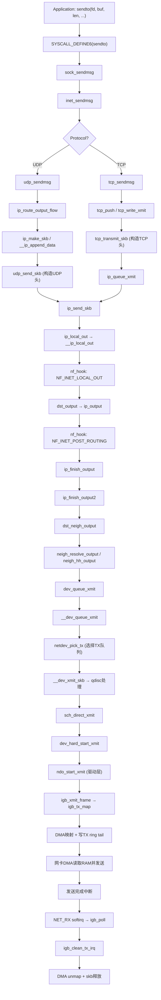

下面分层说明每个阶段的核心函数调用：

####    socket 层
1. `socket(AF_INET, SOCK_DGRAM, IPPROTO_UDP)`：创建一个 UDP socket 结构体，并初始化相应的 UDP 操作函数（`udp_prot` / `inet_dgram_ops`）
2. `sendto(sock, ...)`：应用层调用该函数开始发送数据包，经系统调用进入内核
3. `inet_sendmsg`：`AF_INET` 协议族提供的通用发送函数，检查当前 socket 有无绑定源端口，如果没有的话，调用 `inet_autobind` 分配一个，然后调用传输层协议函数（`udp_sendmsg` 或 `tcp_sendmsg`）

####    UDP 层
- `udp_sendmsg`：UDP 协议层核心发送函数，处理目的地址获取、路由查找、UDP corking、数据拼装
- `ip_route_output_flow`：查找路由，生成路由结构 `struct rtable`
- `ip_make_skb`：将用户数据组装成 `sk_buff`（非 corked 快速路径）
- `udp_send_skb`：构造 UDP 头部（源/目的端口、长度、校验和），将 skb 交给 IP 层

####    IP 层
- `ip_send_skb` → `ip_local_out` → `__ip_local_out`：设置 IP 包长度、计算 IP 头校验和
- `nf_hook(NF_INET_LOCAL_OUT)`：经过 netfilter `OUTPUT` 链
- `dst_output` → `ip_output`：更新统计、设置协议类型
- `nf_hook(NF_INET_POST_ROUTING)`：经过 netfilter `POSTROUTING` 链
- `ip_finish_output` → `ip_finish_output2`：处理 IP 分片（如需要）、查找邻居子系统

####    邻居子系统
- `dst_neigh_output`：检查 `MSG_CONFIRM` 标志，选择输出路径
- `neigh_hh_output`：已缓存硬件头的快速路径（拷贝缓存的 L2 头）
- `neigh_resolve_output`：慢速路径，可能触发 ARP 请求，通过 `dev_hard_header` 构造以太网帧头

####    netdevice 子系统
- `dev_queue_xmit` → `__dev_queue_xmit`：选择 TX 队列、进入 qdisc
- `__dev_xmit_skb`：qdisc 处理（入队或直接发送）
- `sch_direct_xmit` → `dev_hard_start_xmit`：调用驱动 `ndo_start_xmit`

####    Device Driver（以 igb 为例）
- `igb_xmit_frame`：检查 TX 描述符可用数、处理 TSO/checksum offload
- `igb_tx_map`：建立 DMA 映射，填充 TX 描述符环，写 tail 寄存器触发硬件发送
- 发送完成后硬件触发中断 → `NET_RX` softirq → `igb_poll` → `igb_clean_tx_irq` 完成 DMA unmap 和 skb 释放

##  0x03    基础知识

####    MTU 与 MSS
- **MTU**（Maximum Transmission Unit）：链路层一次能传输的最大数据帧载荷大小，以太网默认 `1500` 字节（不含 `14` 字节以太网头和 `4` 字节 FCS）
- **MSS**（Maximum Segment Size）：TCP 层单个段的最大数据载荷。`MSS = MTU - IP头(20) - TCP头(20) = 1460`（无选项情况下）。对于 UDP，单个数据报最大为 `MTU - IP头(20) - UDP头(8) = 1472` 字节（不分片情况下）

####    GSO / TSO / UFO
- **TSO**（TCP Segmentation Offload）：将大的 TCP 数据段交给网卡硬件分片，减少 CPU 开销。内核构造一个大 skb，网卡硬件按 MSS 切割后发出
- **GSO**（Generic Segmentation Offload）：TSO 的软件实现。如果网卡不支持 TSO，内核在 `dev_hard_start_xmit` 之前通过软件执行分段。启用 GSO 时，`size_goal` 是 MSS 的整数倍
- **UFO**（UDP Fragmentation Offload）：将 UDP 分片卸载到网卡硬件，但绝大多数网卡不支持，实际很少使用

####    Scatter/Gather I/O
网卡如果支持 SG（`NETIF_F_SG`），则可以直接发送分散在内存不同位置的数据（skb 线性区 + 分页区），不需要内核预先将数据拷贝到连续内存中

####    校验和卸载
- `CHECKSUM_PARTIAL`：内核计算伪头校验和，硬件完成最终校验和计算
- `CHECKSUM_NONE`：内核需要完整计算校验和（软件方式）
- `CHECKSUM_COMPLETE`/`CHECKSUM_UNNECESSARY`：用于接收方向

##  0x03    核心数据结构拆解

本节以 UDP 发送为主线，详细分析协议栈发送路径涉及的核心数据结构及其层次关系

####    socket / sock / inet_sock / udp_sock 层次关系
Linux 内核使用层层嵌套的结构体实现协议的继承关系。用户空间看到的是 `socket` 对象（通过 fd 引用），内核中的实际传输控制由 `sock`（及其扩展）完成：

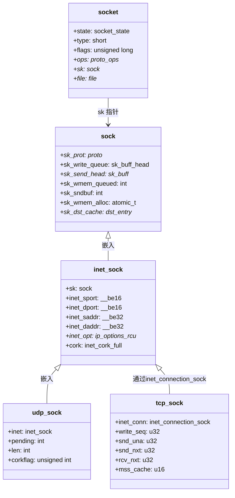

转换方式（内核中通过 `container_of` 宏或专用转换函数实现）：

```cpp
// sock → inet_sock
static inline struct inet_sock *inet_sk(const struct sock *sk)

// sock → tcp_sock
static inline struct tcp_sock *tcp_sk(const struct sock *sk)

// sock → udp_sock
static inline struct udp_sock *udp_sk(const struct sock *sk)
```

关键字段说明：
- `socket->ops`：指向协议族操作集（如 `inet_dgram_ops` / `inet_stream_ops`），包含 `sendmsg`/`recvmsg` 等函数指针
- `sock->sk_prot`：指向具体协议操作集（如 `udp_prot` / `tcp_prot`），包含协议层的 `sendmsg`/`recvmsg`
- `sock->sk_write_queue`：发送队列，TCP 中用于存储待发送的 skb 链表
- `sock->sk_wmem_queued`：发送队列占用的内存大小
- `sock->sk_sndbuf`：发送缓冲区上限

####    struct sk_buff 深度剖析
[`sk_buff`](https://elixir.bootlin.com/linux/v4.11.6/source/include/linux/skbuff.h#L580) 是内核网络协议栈中最核心的数据结构，代表一个网络数据包。其内存布局分为线性数据区和分页数据区两部分：

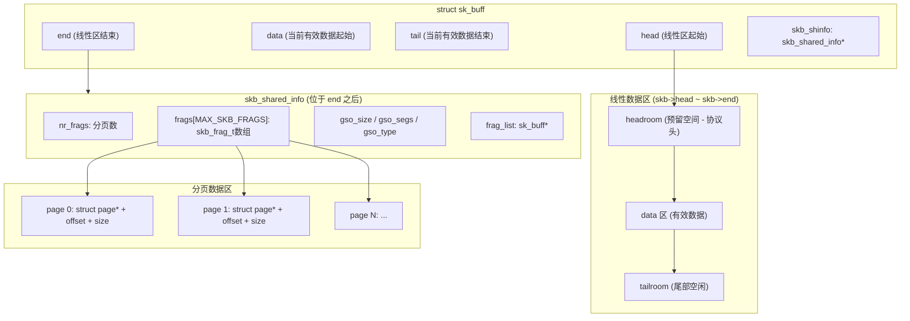

`sk_buff` 中与发送相关的关键字段：

```cpp
struct sk_buff {
    struct sk_buff      *next, *prev;   // 链表指针，用于加入 sk_buff_head 队列
    struct sock         *sk;            // 关联的 socket
    struct net_device   *dev;           // 关联的网络设备

    /* 协议头指针 */
    __u16               transport_header;  // 传输层头偏移(UDP/TCP头)
    __u16               network_header;    // 网络层头偏移(IP头)
    __u16               mac_header;        // MAC头偏移(以太网头)

    /* 数据区指针 */
    unsigned char       *head;          // 线性区起始
    unsigned char       *data;          // 有效数据起始
    unsigned int        tail;           // 有效数据结束
    unsigned int        end;            // 线性区结束

    unsigned int        len;            // 数据总长度(线性+分页)
    unsigned int        data_len;       // 分页区数据长度
    __u8                ip_summed:2;    // 校验和状态
    /* ...... */
};
```

协议头在 skb 中的构造过程（`skb_push` 的调用顺序）：

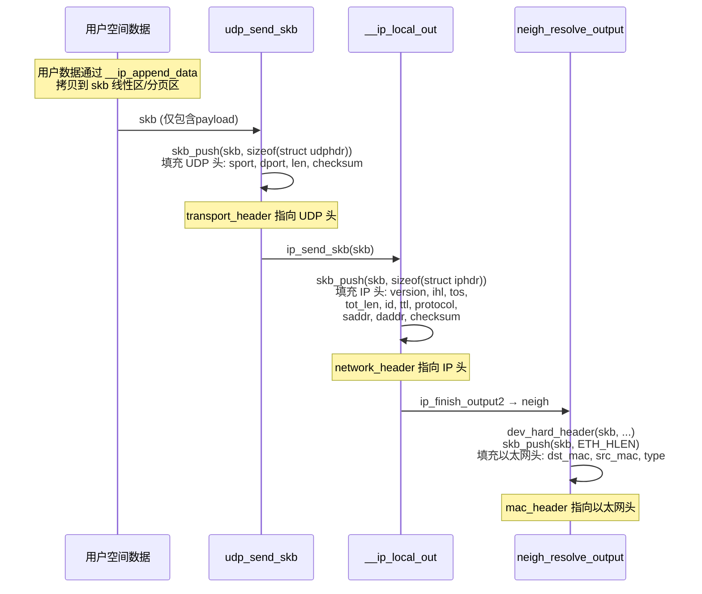

最终发送时，skb 的线性数据区从 `data` 开始依次包含：`以太网头(14B) | IP头(20B) | UDP头(8B) | 用户数据`

####    sk_buff_head：发送队列

[`sk_buff_head`](https://elixir.bootlin.com/linux/v4.11.6/source/include/linux/skbuff.h#L281) 是 skb 的双向链表头，用于组织发送/接收队列：

```cpp
struct sk_buff_head {
    struct sk_buff  *next;
    struct sk_buff  *prev;
    __u32           qlen;       // 队列中 skb 的数量
    spinlock_t      lock;       // 队列自旋锁
};
```

在 TCP 中，`sock->sk_write_queue` 就是一个 `sk_buff_head`，组织了所有待发送的 skb。`sock->sk_send_head` 指向队列中下一个需要发送的 skb（已入队列但尚未传给 IP 层的第一个 skb）

####    msghdr / iov_iter / iovec：用户数据传递

[`msghdr`](https://elixir.bootlin.com/linux/v4.11.6/source/include/linux/socket.h#L47) 是系统调用层传递用户数据的统一结构：

```cpp
struct msghdr {
    void            *msg_name;       // 目的地址（struct sockaddr）
    int             msg_namelen;     // 地址长度
    struct iov_iter msg_iter;        // 数据迭代器
    void            *msg_control;    // 辅助数据（ancillary data）
    __kernel_size_t msg_controllen;  // 辅助数据长度
    unsigned int    msg_flags;       // 标志（MSG_DONTWAIT等）
    struct kiocb    *msg_iocb;       // 异步IO控制块
};
```

[iov_iter`](https://elixir.bootlin.com/linux/v4.11.6/source/include/linux/uio.h#L30) 封装了用户空间数据缓冲区的迭代方式，内部引用 `struct iovec` 数组：

```cpp
struct iov_iter {
	int type;
	size_t iov_offset;
	size_t count;
	union {
		const struct iovec *iov;	//
		......
	};
	union {
		unsigned long nr_segs;
		struct {
			int idx;
			int start_idx;
		};
	};
};
```

```cpp
struct iovec {
    void __user *iov_base;    // 用户空间缓冲区地址
    __kernel_size_t iov_len;  // 缓冲区长度
};
```

在 `sendto` 系统调用中，内核会将用户传入的 `buffer` 和 `len` 封装为一个单元素的 `iov_iter`，再设置到 `msghdr.msg_iter` 中

####	sk_buff

见[前文]()

####	sk_buff_head

见[前文]()

```cpp
//https://elixir.bootlin.com/linux/v4.11.6/source/include/linux/skbuff.h#L281
struct sk_buff_head {
	/* These two members must be first. */
	struct sk_buff	*next;
	struct sk_buff	*prev;

	__u32		qlen;
	spinlock_t	lock;
};
```

####   struct sock：发送相关的成员
介绍下sock结构中发送的成员。tcp 数据发送的过程，首先是从应用层再流入内核，内核会将应用层传入的数据copy到 `sk_buff` 链表中进行发送，关联`struct sock`结构的`sk_write_queue`与`sk_send_head`是最重要的两个[成员](https://elixir.bootlin.com/linux/v4.11.6/source/include/net/sock.h#L233)：

-	`sk_write_queue`：发送队列的双向链表头
-	`sk_send_head`：指向发送队列中下一个要发送的数据包

```cpp
struct sock {
	......
	struct sk_buff		*sk_send_head;	//指针
	struct sk_buff_head	sk_write_queue;	//对象
	......
}
```

这两个成员的关系如下图所示：


```cpp
//https://elixir.bootlin.com/linux/v4.11.6/source/include/net/tcp.h#L1565
static inline struct sk_buff *tcp_send_head(const struct sock *sk)
{
	return sk->sk_send_head;
}
```


####    以 UDP 包为例：各层协议头的构造位置

| 协议头 | 构造函数 | 源码位置 | 关键操作 |
|--------|----------|----------|----------|
| UDP 头 | `udp_send_skb` | `net/ipv4/udp.c` | `skb_push(sizeof(udphdr))`，填充 `sport/dport/len/checksum` |
| IP 头 | `ip_local_out` → `__ip_local_out` | `net/ipv4/ip_output.c` | 由 `ip_setup_cork` / `__ip_make_skb` 时初始化，`__ip_local_out` 设置 `tot_len` 并计算校验和 |
| 以太网头 | `dev_hard_header` / `neigh_hh_output` | `net/ethernet/eth.c` | `eth_header()` 填充 `dst_mac/src_mac/ethertype` |

##  0x04    Socket 层：系统调用入口

####    协议族注册
内核启动时，`inet_init` 函数注册 `AF_INET` 协议族并初始化 TCP/UDP/ICMP/RAW 协议栈。[`inetsw_array`](https://elixir.bootlin.com/linux/v4.11.6/source/net/ipv4/af_inet.c#L1015) 定义了协议类型到操作函数集的映射：

```cpp
// net/ipv4/af_inet.c
static struct inet_protosw inetsw_array[] = {
    {
        .type =       SOCK_STREAM,        // TCP
        .protocol =   IPPROTO_TCP,
        .prot =       &tcp_prot,          // 协议层操作集
        .ops =        &inet_stream_ops,   // socket层操作集
        .flags =      INET_PROTOSW_PERMANENT | INET_PROTOSW_ICSK,
    },
    {
        .type =       SOCK_DGRAM,         // UDP
        .protocol =   IPPROTO_UDP,
        .prot =       &udp_prot,          // 协议层操作集
        .ops =        &inet_dgram_ops,    // socket层操作集
        .flags =      INET_PROTOSW_PERMANENT,
    },
    /* ...... */
};
```

当用户创建 socket 时（如 `socket(AF_INET, SOCK_DGRAM, IPPROTO_UDP)`），`inet_create` 在 `inetsw_array` 中查找匹配的条目，将 `ops`（socket 层操作）和 `prot`（协议层操作）关联到 socket 对象：

```cpp
// inet_create 中的关键赋值
sock->ops = answer->ops;           // 如 &inet_dgram_ops
sk->sk_prot = answer->prot;        // 如 &udp_prot
```

对于 UDP，两层操作集分别为：

```cpp
// socket 层操作集 - 由 sock->ops->sendmsg 调用
const struct proto_ops inet_dgram_ops = {
    .sendmsg   = inet_sendmsg,     // 通用入口
    .recvmsg   = inet_recvmsg,
    /* ...... */
};

// 协议层操作集 - 由 sk->sk_prot->sendmsg 调用
struct proto udp_prot = {
    .name      = "UDP",
    .sendmsg   = udp_sendmsg,      // UDP 具体实现
    .recvmsg   = udp_recvmsg,
    /* ...... */
};
```

####    sendto 系统调用

以 [`sendto`](https://elixir.bootlin.com/linux/v4.11.6/source/net/socket.c#L1664) 为例，系统调用入口做了三件事：
1. 通过 fd 定位到内核 `socket`/`sock` 对象
2. 构造 `struct msghdr`，将用户数据和目的地址封装进去
3. 调用 `sock_sendmsg`

```cpp
// net/socket.c
SYSCALL_DEFINE6(sendto, int, fd, void __user *, buff, size_t, len,
        unsigned int, flags, struct sockaddr __user *, addr,
        int, addr_len)
{
    struct socket *sock;
    struct sockaddr_storage address;
    struct msghdr msg;
    struct iovec iov;
    int err;

    err = import_single_range(WRITE, buff, len, &iov, &msg.msg_iter);
    if (unlikely(err))
        return err;

    sock = sockfd_lookup_light(fd, &err, &fput_needed);
    if (!sock)
        goto out;

    msg.msg_name = NULL;
    msg.msg_control = NULL;
    msg.msg_controllen = 0;
    msg.msg_namelen = 0;
    if (addr) {
        err = move_addr_to_kernel(addr, addr_len, &address);
        if (err < 0)
            goto out_put;
        msg.msg_name = (struct sockaddr *)&address;
        msg.msg_namelen = addr_len;
    }
    if (sock->file->f_flags & O_NONBLOCK)
        flags |= MSG_DONTWAIT;
    msg.msg_flags = flags;
    err = sock_sendmsg(sock, &msg);

out_put:
    fput_light(sock->file, fput_needed);
out:
    return err;
}
```

注意：4.11.6 内核版本中 `import_single_range` 代替了旧版手动设置 `iov` 的方式，直接初始化 `msg.msg_iter`

####    sock_sendmsg -> inet_sendmsg

`sock_sendmsg` 经过安全检查后调用 [`sock_sendmsg_nosec`](https://elixir.bootlin.com/linux/v4.11.6/source/net/socket.c#L611)：

```cpp
// net/socket.c (4.11.6 版本，无 kiocb 参数)
static inline int sock_sendmsg_nosec(struct socket *sock, struct msghdr *msg)
{
    int ret = sock->ops->sendmsg(sock, msg, msg_data_left(msg));
    BUG_ON(ret == -EIOCBQUEUED);
    return ret;
}
```

这里 `sock->ops->sendmsg` 对于 UDP 就是 `inet_sendmsg`。[`inet_sendmsg`](https://elixir.bootlin.com/linux/v4.11.6/source/net/ipv4/af_inet.c#L730) 是 `AF_INET` 协议族的通用发送入口：

```cpp
// net/ipv4/af_inet.c (4.11.6 版本，无 kiocb 参数)
int inet_sendmsg(struct socket *sock, struct msghdr *msg, size_t size)
{
    struct sock *sk = sock->sk;

    sock_rps_record_flow(sk);

    if (!inet_sk(sk)->inet_num && !sk->sk_prot->no_autobind &&
        inet_autobind(sk))
        return -EAGAIN;

    return sk->sk_prot->sendmsg(sk, msg, size);
}
```

对于 UDP，`sk->sk_prot->sendmsg` 指向 `udp_sendmsg`；对于 TCP，指向 `tcp_sendmsg`

##  0x05    传输层发送

####    UDP 发送路径（主线）：udp_sendmsg 全流程

[`udp_sendmsg`](https://elixir.bootlin.com/linux/v4.11.6/source/net/ipv4/udp.c#L907) 是 UDP 协议层的核心发送函数，其流程如下：

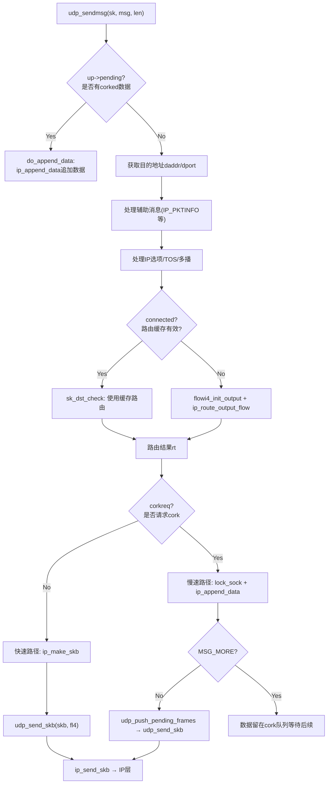

下面结合 4.11.6 内核源码逐步分析：

#####   1、检查 corked 数据

```cpp
// net/ipv4/udp.c - udp_sendmsg
int udp_sendmsg(struct sock *sk, struct msghdr *msg, size_t len)
{
    struct inet_sock *inet = inet_sk(sk);
    struct udp_sock *up = udp_sk(sk);
    struct flowi4 fl4_stack;
    struct flowi4 *fl4;
    /* ...... 变量声明 ...... */

    if (len > 0xFFFF)
        return -EMSGSIZE;

    fl4 = &inet->cork.fl.u.ip4;
    if (up->pending) {
        /* 已有 corked 数据在等待，加锁后追加 */
        lock_sock(sk);
        if (likely(up->pending)) {
            if (unlikely(up->pending != AF_INET)) {
                release_sock(sk);
                return -EINVAL;
            }
            goto do_append_data;
        }
        release_sock(sk);
    }
```

UDP corking 允许用户程序请求内核累积多次 `send` 的数据合并为一个数据报再发送。启用方式有两种：`setsockopt(UDP_CORK)` 或发送时指定 `MSG_MORE` 标志

#####   2、获取目的地址和端口

```cpp
    if (msg->msg_name) {
        struct sockaddr_in *usin = (struct sockaddr_in *)msg->msg_name;
        if (msg->msg_namelen < sizeof(*usin))
            return -EINVAL;
        if (usin->sin_family != AF_INET) {
            if (usin->sin_family != AF_UNSPEC)
                return -EAFNOSUPPORT;
        }
        daddr = usin->sin_addr.s_addr;
        dport = usin->sin_port;
        if (dport == 0)
            return -EINVAL;
    } else {
        /* 未指定地址 → 使用已连接socket的目的地址 */
        if (sk->sk_state != TCP_ESTABLISHED)
            return -EDESTADDRREQ;
        daddr = inet->inet_daddr;
        dport = inet->inet_dport;
        connected = 1;
    }
```

如果调用 `sendto` 指定了目的地址，从 `msg->msg_name` 解析；否则使用 socket 的 `connect` 缓存地址。注意这里使用 `TCP_ESTABLISHED` 状态检查，UDP 复用了 TCP 的状态定义

#####   3、路由查找

```cpp
    /* 快速路径：已连接socket使用缓存路由 */
    if (connected)
        rt = (struct rtable *)sk_dst_check(sk, 0);

    if (rt == NULL) {
        struct net *net = sock_net(sk);

        fl4 = &fl4_stack;
        flowi4_init_output(fl4, ipc.oif, sk->sk_mark, tos,
                   RT_SCOPE_UNIVERSE, sk->sk_protocol,
                   inet_sk_flowi_flags(sk)|FLOWI_FLAG_CAN_SLEEP,
                   faddr, saddr, dport, inet->inet_sport,
                   sock_i_uid(sk));

        security_sk_classify_flow(sk, flowi4_to_flowi(fl4));
        rt = ip_route_output_flow(net, fl4, sk);
        if (IS_ERR(rt)) {
            err = PTR_ERR(rt);
            rt = NULL;
            if (err == -ENETUNREACH)
                IP_INC_STATS(net, IPSTATS_MIB_OUTNOROUTES);
            goto out;
        }
        /* 缓存路由到socket */
        if (connected)
            sk_dst_set(sk, dst_clone(&rt->dst));
    }
```

路由查找是整个发送路径中的关键步骤。`flowi4_init_output` 构造流描述结构 `flowi4`，`ip_route_output_flow` 查找路由表并生成 `struct rtable`。如果 socket 已连接，路由结果会缓存在 `sk->sk_dst_cache` 中

#####   4、非 corked 快速路径：ip_make_skb + udp_send_skb

```cpp
    /* 非 corked 快速路径 */
    if (!corkreq) {
        skb = ip_make_skb(sk, fl4, getfrag, msg, ulen,
                  sizeof(struct udphdr), &ipc, &rt,
                  msg->msg_flags);
        err = PTR_ERR(skb);
        if (!IS_ERR_OR_NULL(skb))
            err = udp_send_skb(skb, fl4);
        goto out;
    }
```

`ip_make_skb` 内部调用 `__ip_append_data` 将用户数据组装到 skb 中（处理 MTU、分片、SG 等），然后调用 `__ip_make_skb` 完成 IP 头初始化。组装好的 skb 交给 `udp_send_skb` 添加 UDP 头

#####   5、udp_send_skb：构造 UDP 头

[`udp_send_skb`](https://elixir.bootlin.com/linux/v4.11.6/source/net/ipv4/udp.c#L775) 是 UDP 发送的最后一步，负责添加 UDP 头并处理校验和：

```cpp
// net/ipv4/udp.c
static int udp_send_skb(struct sk_buff *skb, struct flowi4 *fl4)
{
    struct sock *sk = skb->sk;
    struct inet_sock *inet = inet_sk(sk);
    struct udphdr *uh;
    int err = 0;
    int is_udplite = IS_UDPLITE(sk);
    int offset = skb_transport_offset(skb);
    int len = skb->len - offset;
    __wsum csum = 0;

    /* 构造 UDP 头 */
    uh = udp_hdr(skb);
    uh->source = inet->inet_sport;         // 源端口
    uh->dest = fl4->fl4_dport;             // 目的端口
    uh->len = htons(len);                  // UDP总长度(头+数据)
    uh->check = 0;                         // 先清零，后面计算

    /* 校验和处理 */
    if (is_udplite)
        csum = udplite_csum(skb);
    else if (sk->sk_no_check_tx) {
        /* 关闭校验和 */
        skb->ip_summed = CHECKSUM_NONE;
        goto send;
    } else if (skb->ip_summed == CHECKSUM_PARTIAL) {
        /* 硬件计算校验和 */
        udp4_hwcsum(skb, fl4->saddr, fl4->daddr);
        goto send;
    } else
        /* 软件计算校验和 */
        csum = udp_csum(skb);

    /* 加上伪头校验和 */
    uh->check = csum_tcpudp_magic(fl4->saddr, fl4->daddr, len,
                      sk->sk_protocol, csum);
    if (uh->check == 0)
        uh->check = CSUM_MANGLED_0;

send:
    err = ip_send_skb(sock_net(sk), skb);
    if (err) {
        if (err == -ENOBUFS && !inet->recverr) {
            UDP_INC_STATS(sock_net(sk),
                     UDP_MIB_SNDBUFERRORS, is_udplite);
            err = 0;
        }
    } else
        UDP_INC_STATS(sock_net(sk),
                 UDP_MIB_OUTDATAGRAMS, is_udplite);
    return err;
}
```

`udp_send_skb` 完成 UDP 头构造后，调用 `ip_send_skb` 进入 IP 层。注意校验和处理的三种路径：硬件计算（`CHECKSUM_PARTIAL`）、软件计算（`udp_csum`）和禁用（`sk_no_check_tx`）

####    TCP 发送路径（对比）

TCP 发送路径与 UDP 有本质不同：TCP 是面向连接的流式协议，数据先拷贝到发送队列 `sk_write_queue`，由拥塞控制和流量控制决定何时实际发送

#####   tcp_sendmsg 核心逻辑

`tcp_sendmsg` 的核心工作是将用户数据拷贝到 skb 链表中，而不是立即发送。关键流程：

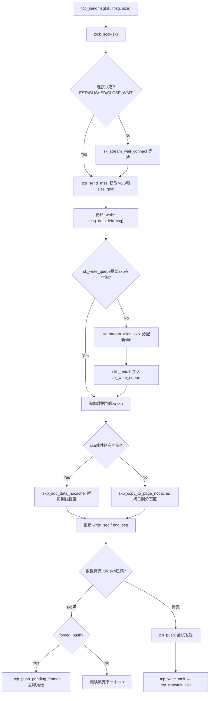

TCP 与 UDP 的关键差异：
- **TCP 需要拷贝数据到发送队列**：因为 TCP 需要保留数据直到收到 ACK（可靠传输），而 UDP 是"发完即忘"
- **TCP 有拥塞控制和 Nagle 算法**：`tcp_push` 内部会检查拥塞窗口、Nagle 条件决定是否立即发送
- **TCP 有 sk_write_queue / sk_send_head 机制**：`sk_write_queue` 是所有待发送数据的队列，`sk_send_head` 指向队列中尚未发送的第一个 skb

#####   tcp_transmit_skb：构造 TCP 头

[`tcp_transmit_skb`](https://elixir.bootlin.com/linux/v4.11.6/source/net/ipv4/tcp_output.c#L920) 负责克隆 skb、构造 TCP 头部、调用 IP 层发送。核心步骤：

```cpp
// net/ipv4/tcp_output.c (精简)
static int tcp_transmit_skb(struct sock *sk, struct sk_buff *skb, int clone_it,
                gfp_t gfp_mask)
{
    struct tcp_sock *tp = tcp_sk(sk);
    struct inet_sock *inet = inet_sk(sk);
    struct tcphdr *th;
    /* ...... */

    /* 克隆skb：原始skb保留在sk_write_queue等待ACK */
    if (clone_it) {
        if (unlikely(skb_cloned(skb)))
            skb = pskb_copy(skb, gfp_mask);
        else
            skb = skb_clone(skb, gfp_mask);
        if (unlikely(!skb))
            return -ENOBUFS;
    }

    /* 计算TCP头长度并用skb_push预留空间 */
    tcp_header_size = tcp_options_size + sizeof(struct tcphdr);
    skb_push(skb, tcp_header_size);
    skb_reset_transport_header(skb);

    /* 构造TCP头 */
    th = (struct tcphdr *)skb->data;
    th->source      = inet->inet_sport;
    th->dest        = inet->inet_dport;
    th->seq         = htonl(tcb->seq);
    th->ack_seq     = htonl(tp->rcv_nxt);
    th->window      = htons(tcp_select_window(sk));
    th->check       = 0;
    th->urg_ptr     = 0;
    /* 设置标志位、选项等 ...... */

    /* 计算校验和 */
    icsk->icsk_af_ops->send_check(sk, skb);

    /* 调用IP层发送：queue_xmit 即 ip_queue_xmit */
    err = icsk->icsk_af_ops->queue_xmit(sk, skb, &inet->cork.fl);
    /* ...... */
}
```

注意 TCP 使用 `ip_queue_xmit`（而非 `ip_send_skb`），因为 TCP 需要处理路由缓存、IP 选项等连接级别的信息

##  0x06    网络层（IP层）发送处理

IP 层负责添加 IP 头、查找路由、处理 netfilter 钩子、执行 IP 分片

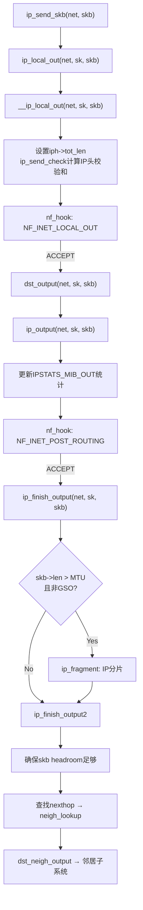

####    ip_send_skb

[`ip_send_skb`](https://elixir.bootlin.com/linux/v4.11.6/source/net/ipv4/ip_output.c#L1387) 是 UDP 发送进入 IP 层的入口：

```cpp
// net/ipv4/ip_output.c
int ip_send_skb(struct net *net, struct sk_buff *skb)
{
    int err;

    err = ip_local_out(net, skb->sk, skb);
    if (err) {
        if (err > 0)
            err = net_xmit_errno(err);
        if (err)
            IP_INC_STATS(net, IPSTATS_MIB_OUTDISCARDS);
    }
    return err;
}
```

####    __ip_local_out：设置IP头长度和校验和

```cpp
// net/ipv4/ip_output.c
int __ip_local_out(struct net *net, struct sock *sk, struct sk_buff *skb)
{
    struct iphdr *iph = ip_hdr(skb);

    iph->tot_len = htons(skb->len);    // 设置IP包总长度
    ip_send_check(iph);                  // 计算IP头校验和
    skb->protocol = htons(ETH_P_IP);

    return nf_hook(NFPROTO_IPV4, NF_INET_LOCAL_OUT,
               net, sk, skb, NULL, skb_dst(skb)->dev,
               dst_output);
}
```

`ip_send_check` 内部调用 `ip_fast_csum` 计算 IP 头部校验和（在 x86 上有汇编优化）。然后通过 `nf_hook` 进入 netfilter 的 `NF_INET_LOCAL_OUT` 链。如果 netfilter 放行（返回 `1`），回调函数 `dst_output` 被调用

####    ip_output：经过 POST_ROUTING

```cpp
// net/ipv4/ip_output.c
int ip_output(struct net *net, struct sock *sk, struct sk_buff *skb)
{
    struct net_device *dev = skb_dst(skb)->dev;

    IP_UPD_PO_STATS(net, IPSTATS_MIB_OUT, skb->len);

    skb->dev = dev;
    skb->protocol = htons(ETH_P_IP);

    return NF_HOOK_COND(NFPROTO_IPV4, NF_INET_POST_ROUTING,
                net, sk, skb, NULL, dev,
                ip_finish_output,
                !(IPCB(skb)->flags & IPSKB_REROUTED));
}
```

`IP_UPD_PO_STATS` 同时更新包数和字节数统计。netfilter 的 `NF_INET_POST_ROUTING` 链放行后，调用 `ip_finish_output`

####    ip_finish_output 与 IP 分片

```cpp
// net/ipv4/ip_output.c
static int ip_finish_output(struct net *net, struct sock *sk, struct sk_buff *skb)
{
    unsigned int mtu;

    mtu = ip_skb_dst_mtu(skb);
    if (skb_is_gso(skb))
        return ip_finish_output_gso(net, sk, skb, mtu);

    if (skb->len > mtu || (IPCB(skb)->flags & IPSKB_FRAG_PMTU))
        return ip_fragment(net, sk, skb, mtu, ip_finish_output2);

    return ip_finish_output2(net, sk, skb);
}
```

如果包长度超过 MTU 且不是 GSO，执行 `ip_fragment` 进行 IP 分片。分片后每个片段最终都会调用 `ip_finish_output2`

####    ip_finish_output2：进入邻居子系统

[`ip_finish_output2`](https://elixir.bootlin.com/linux/v4.11.6/source/net/ipv4/ip_output.c#L186) 负责查找邻居缓存并将数据包交给邻居子系统处理：

```cpp
// net/ipv4/ip_output.c (精简)
static int ip_finish_output2(struct net *net, struct sock *sk, struct sk_buff *skb)
{
    struct dst_entry *dst = skb_dst(skb);
    struct rtable *rt = (struct rtable *)dst;
    struct net_device *dev = dst->dev;
    unsigned int hh_len = LL_RESERVED_SPACE(dev);
    struct neighbour *neigh;
    u32 nexthop;

    /* 统计：多播/广播计数 */
    if (rt->rt_type == RTN_MULTICAST)
        IP_UPD_PO_STATS(net, IPSTATS_MIB_OUTMCAST, skb->len);
    else if (rt->rt_type == RTN_BROADCAST)
        IP_UPD_PO_STATS(net, IPSTATS_MIB_OUTBCAST, skb->len);

    /* 确保skb头部有足够空间放置链路层头 */
    if (unlikely(skb_headroom(skb) < hh_len && dev->header_ops)) {
        struct sk_buff *skb2;
        skb2 = skb_realloc_headroom(skb, LL_RESERVED_SPACE(dev));
        if (skb2 == NULL) {
            kfree_skb(skb);
            return -ENOMEM;
        }
        if (skb->sk)
            skb_set_owner_w(skb2, skb->sk);
        consume_skb(skb);
        skb = skb2;
    }

    /* 查找下一跳邻居 */
    rcu_read_lock_bh();
    nexthop = (__force u32)rt_nexthop(rt, ip_hdr(skb)->daddr);
    neigh = __ipv4_neigh_lookup_noref(dev, nexthop);
    if (unlikely(!neigh))
        neigh = __neigh_create(&arp_tbl, &nexthop, dev, false);
    if (!IS_ERR(neigh)) {
        int res = dst_neigh_output(dst, neigh, skb);
        rcu_read_unlock_bh();
        return res;
    }
    rcu_read_unlock_bh();

    kfree_skb(skb);
    return -EINVAL;
}
```

`__ipv4_neigh_lookup_noref` 在邻居缓存中查找对应 IP 的 L2 地址。如果找不到，`__neigh_create` 在 ARP 表中创建新条目（可能触发 ARP 请求）。找到后通过 `dst_neigh_output` 进入邻居子系统

##  0x07    邻居子系统

邻居子系统（Neighbour Subsystem）负责将 L3 地址（IP）解析为 L2 地址（MAC），并构造以太网帧头

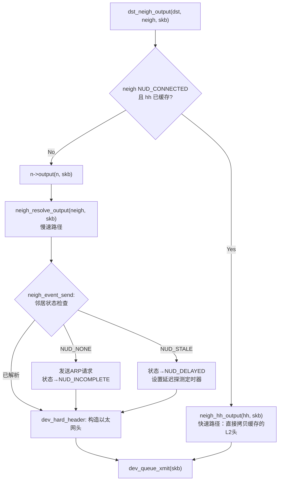

####    dst_neigh_output

```cpp
// include/net/dst.h
static inline int dst_neigh_output(struct dst_entry *dst, struct neighbour *n,
                   struct sk_buff *skb)
{
    const struct hh_cache *hh;

    /* MSG_CONFIRM标志：确认ARP缓存条目仍然有效 */
    if (dst->pending_confirm) {
        unsigned long now = jiffies;
        dst->pending_confirm = 0;
        if (n->confirmed != now)
            n->confirmed = now;
    }

    hh = &n->hh;
    if ((n->nud_state & NUD_CONNECTED) && hh->hh_len)
        return neigh_hh_output(hh, skb);    // 快速路径
    else
        return n->output(n, skb);            // 慢速路径
}
```

####    neigh_hh_output：快速路径

当邻居被认为是 `NUD_CONNECTED`（`NUD_PERMANENT`/`NUD_NOARP`/`NUD_REACHABLE`之一）且硬件头已缓存时，走快速路径：

```cpp
// include/net/neighbour.h
static inline int neigh_hh_output(const struct hh_cache *hh, struct sk_buff *skb)
{
    unsigned int seq;
    int hh_len;

    do {
        seq = read_seqbegin(&hh->hh_lock);
        hh_len = hh->hh_len;
        if (likely(hh_len <= HH_DATA_MOD)) {
            memcpy(skb->data - HH_DATA_MOD, hh->hh_data, HH_DATA_MOD);
        } else {
            int hh_alen = HH_DATA_ALIGN(hh_len);
            memcpy(skb->data - hh_alen, hh->hh_data, hh_alen);
        }
    } while (read_seqretry(&hh->hh_lock, seq));

    skb_push(skb, hh_len);
    return dev_queue_xmit(skb);
}
```

直接将缓存的硬件头（以太网头）`memcpy` 到 skb 的 data 前面，然后 `skb_push` 调整指针，进入 `dev_queue_xmit`

####    neigh_resolve_output：慢速路径

```cpp
// net/core/neighbour.c (精简)
int neigh_resolve_output(struct neighbour *neigh, struct sk_buff *skb)
{
    int rc = 0;

    if (!neigh_event_send(neigh, skb)) {
        struct net_device *dev = neigh->dev;
        unsigned int seq;
        int err;

        /* 如果设备支持硬件头缓存且尚未缓存，初始化缓存 */
        if (dev->header_ops->cache && !neigh->hh.hh_len)
            neigh_hh_init(neigh);

        do {
            __skb_pull(skb, skb_network_offset(skb));
            seq = read_seqbegin(&neigh->ha_lock);
            /* 构造以太网头 */
            err = dev_hard_header(skb, dev, ntohs(skb->protocol),
                          neigh->ha, NULL, skb->len);
        } while (read_seqretry(&neigh->ha_lock, seq));

        if (err >= 0)
            rc = dev_queue_xmit(skb);
        else
            goto out_kfree_skb;
    }
    /* ...... */
}
```

`neigh_event_send` 检查邻居状态：如果是 `NUD_NONE` 会立即发送 ARP 请求；如果已解析，`dev_hard_header` 构造以太网帧头。对于以太网设备，`dev_hard_header` 最终调用 [`eth_header`](https://elixir.bootlin.com/linux/v4.11.6/source/net/ethernet/eth.c#L69)：

```cpp
// net/ethernet/eth.c
int eth_header(struct sk_buff *skb, struct net_device *dev,
           unsigned short type,
           const void *daddr, const void *saddr, unsigned int len)
{
    struct ethhdr *eth = (struct ethhdr *)skb_push(skb, ETH_HLEN);

    eth->h_proto = htons(type);           // EtherType (如 0x0800 = IPv4)

    if (!saddr)
        saddr = dev->dev_addr;
    memcpy(eth->h_source, saddr, ETH_ALEN);  // 源MAC

    if (daddr) {
        memcpy(eth->h_dest, daddr, ETH_ALEN);  // 目的MAC
        return ETH_HLEN;
    }
    /* ...... */
}
```

至此，skb 包含了完整的 以太网头 + IP头 + UDP头 + 用户数据

##  0x08    网络设备子系统

网络设备子系统负责选择发送队列、执行流量控制（qdisc），并将数据传递给驱动

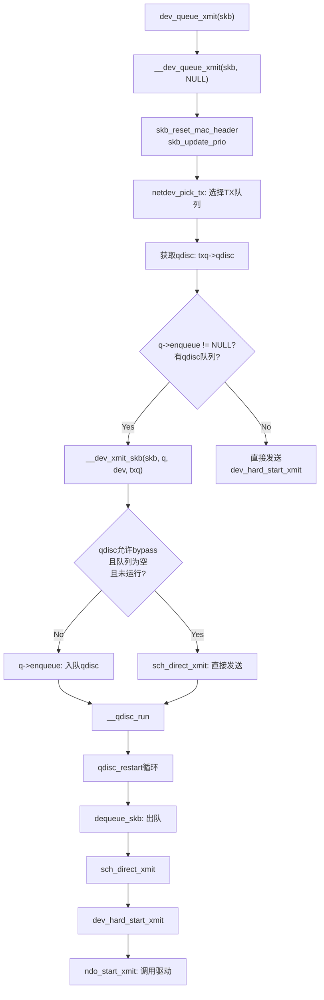

####    dev_queue_xmit 与 __dev_queue_xmit

[`__dev_queue_xmit`](https://elixir.bootlin.com/linux/v4.11.6/source/net/core/dev.c#L3474) 是网络设备子系统的核心函数：

```cpp
// net/core/dev.c (精简)
static int __dev_queue_xmit(struct sk_buff *skb, void *accel_priv)
{
    struct net_device *dev = skb->dev;
    struct netdev_queue *txq;
    struct Qdisc *q;
    int rc = -ENOMEM;

    skb_reset_mac_header(skb);
    rcu_read_lock_bh();
    skb_update_prio(skb);

    /* 选择TX队列 */
    txq = netdev_pick_tx(dev, skb, accel_priv);
    q = rcu_dereference_bh(txq->qdisc);

    if (q->enqueue) {
        /* 有qdisc队列：走qdisc处理流程 */
        rc = __dev_xmit_skb(skb, q, dev, txq);
        goto out;
    }

    /* 无qdisc队列（loopback/tunnel等虚拟设备） */
    if (dev->flags & IFF_UP) {
        int cpu = smp_processor_id();
        if (txq->xmit_lock_owner != cpu) {
            if (__this_cpu_read(xmit_recursion) > RECURSION_LIMIT)
                goto recursion_alert;
            HARD_TX_LOCK(dev, txq, cpu);
            if (!netif_xmit_stopped(txq)) {
                __this_cpu_inc(xmit_recursion);
                skb = dev_hard_start_xmit(skb, dev, txq, &rc);
                __this_cpu_dec(xmit_recursion);
            }
            HARD_TX_UNLOCK(dev, txq);
        }
    }
    /* ...... */
}
```

####    TX 队列选择：netdev_pick_tx

```cpp
// net/core/flow_dissector.c
struct netdev_queue *netdev_pick_tx(struct net_device *dev,
                    struct sk_buff *skb,
                    void *accel_priv)
{
    int queue_index = 0;

    if (dev->real_num_tx_queues != 1) {
        const struct net_device_ops *ops = dev->netdev_ops;
        if (ops->ndo_select_queue)
            queue_index = ops->ndo_select_queue(dev, skb, accel_priv,
                                __netdev_pick_tx);
        else
            queue_index = __netdev_pick_tx(dev, skb);

        if (!accel_priv)
            queue_index = netdev_cap_txqueue(dev, queue_index);
    }

    skb_set_queue_mapping(skb, queue_index);
    return netdev_get_tx_queue(dev, queue_index);
}
```

队列选择的优先级：驱动 `ndo_select_queue` → XPS（Transmit Packet Steering，管理员配置的 CPU-to-TX-queue 映射） → `skb_tx_hash`（基于流 hash 计算）

####    __dev_xmit_skb：qdisc 处理

```cpp
// net/core/dev.c (精简)
static inline int __dev_xmit_skb(struct sk_buff *skb, struct Qdisc *q,
                 struct net_device *dev,
                 struct netdev_queue *txq)
{
    spinlock_t *root_lock = qdisc_lock(q);
    bool contended;
    int rc;

    qdisc_pkt_len_init(skb);
    qdisc_calculate_pkt_len(skb, q);

    contended = qdisc_is_running(q);
    if (unlikely(contended))
        spin_lock(&q->busylock);    // 减少主锁竞争

    spin_lock(root_lock);

    if (unlikely(test_bit(__QDISC_STATE_DEACTIVATED, &q->state))) {
        /* qdisc已停用 → 丢弃 */
        kfree_skb(skb);
        rc = NET_XMIT_DROP;
    } else if ((q->flags & TCQ_F_CAN_BYPASS) && !qdisc_qlen(q) &&
           qdisc_run_begin(q)) {
        /* 快速路径：work-conserving qdisc + 队列为空 + 未在运行 → 直接发送 */
        qdisc_bstats_update(q, skb);
        if (sch_direct_xmit(skb, q, dev, txq, root_lock, true)) {
            if (unlikely(contended)) {
                spin_unlock(&q->busylock);
                contended = false;
            }
            __qdisc_run(q);
        } else
            qdisc_run_end(q);
        rc = NET_XMIT_SUCCESS;
    } else {
        /* 常规路径：数据入队，启动qdisc处理 */
        rc = q->enqueue(skb, q) & NET_XMIT_MASK;
        if (qdisc_run_begin(q)) {
            if (unlikely(contended)) {
                spin_unlock(&q->busylock);
                contended = false;
            }
            __qdisc_run(q);
        }
    }

    spin_unlock(root_lock);
    if (unlikely(contended))
        spin_unlock(&q->busylock);
    return rc;
}
```

默认 qdisc：单队列设备使用 `pfifo_fast`（允许 bypass），多队列设备使用 `mq`

####    __qdisc_run 与 qdisc_restart

```cpp
// net/sched/sch_generic.c
void __qdisc_run(struct Qdisc *q)
{
    int quota = dev_tx_weight;  // sysctl: net.core.dev_weight

    while (qdisc_restart(q)) {
        if (--quota <= 0 || need_resched()) {
            /* 配额耗尽或需要让出CPU → 触发NET_TX软中断 */
            __netif_schedule(q);
            break;
        }
    }
    qdisc_run_end(q);
}

static inline int qdisc_restart(struct Qdisc *q)
{
    struct sk_buff *skb = dequeue_skb(q);
    if (unlikely(!skb))
        return 0;

    spinlock_t *root_lock = qdisc_lock(q);
    struct net_device *dev = qdisc_dev(q);
    struct netdev_queue *txq = skb_get_tx_queue(dev, skb);

    return sch_direct_xmit(skb, q, dev, txq, root_lock, true);
}
```

`__qdisc_run` 在循环中反复从 qdisc 出队 skb 并尝试发送。当配额耗尽或进程需要调度时，通过 `__netif_schedule` 触发 `NET_TX_SOFTIRQ`，数据包的发送会延迟到软中断上下文中继续进行

####    sch_direct_xmit

```cpp
// net/sched/sch_generic.c (精简)
int sch_direct_xmit(struct sk_buff *skb, struct Qdisc *q,
            struct net_device *dev, struct netdev_queue *txq,
            spinlock_t *root_lock, bool validate)
{
    int ret = NETDEV_TX_BUSY;

    spin_unlock(root_lock);
    HARD_TX_LOCK(dev, txq, smp_processor_id());

    if (!netif_xmit_frozen_or_stopped(txq))
        skb = dev_hard_start_xmit(skb, dev, txq, &ret);

    HARD_TX_UNLOCK(dev, txq);
    spin_lock(root_lock);

    if (dev_xmit_complete(ret)) {
        ret = qdisc_qlen(q);
    } else {
        /* 驱动返回BUSY → 重新入队 */
        ret = dev_requeue_skb(skb, q);
    }

    if (ret && netif_xmit_frozen_or_stopped(txq))
        ret = 0;
    return ret;
}
```

##  0x09    软中断调度

当 qdisc 处理配额耗尽或驱动返回 BUSY 导致数据重新入队时，通过软中断异步继续发送

####    __netif_schedule 触发软中断

```cpp
// net/core/dev.c
void __netif_schedule(struct Qdisc *q)
{
    if (!test_and_set_bit(__QDISC_STATE_SCHED, &q->state))
        __netif_reschedule(q);
}

static void __netif_reschedule(struct Qdisc *q)
{
    struct softnet_data *sd;
    unsigned long flags;

    local_irq_save(flags);
    sd = this_cpu_ptr(&softnet_data);
    q->next_sched = NULL;
    *sd->output_queue_tailp = q;          // 将qdisc加入output_queue
    sd->output_queue_tailp = &q->next_sched;
    raise_softirq_irqoff(NET_TX_SOFTIRQ); // 触发NET_TX软中断
    local_irq_restore(flags);
}
```

`__netif_reschedule` 将 qdisc 挂到当前 CPU 的 `softnet_data.output_queue` 上，然后触发 `NET_TX_SOFTIRQ`。这个软中断由 `net_tx_action` 处理

####    net_tx_action：软中断处理函数

[`net_tx_action`](https://elixir.bootlin.com/linux/v4.11.6/source/net/core/dev.c#L4107) 处理两件事：completion_queue（释放已发送完成的 skb）和 output_queue（继续发送排队的 qdisc）

```cpp
// net/core/dev.c (精简)
static __latent_entropy void net_tx_action(struct softirq_action *h)
{
    struct softnet_data *sd = this_cpu_ptr(&softnet_data);

    /* 1. 处理 completion_queue：释放已发送完成的 skb */
    if (sd->completion_queue) {
        struct sk_buff *clist;

        local_irq_disable();
        clist = sd->completion_queue;
        sd->completion_queue = NULL;
        local_irq_enable();

        while (clist) {
            struct sk_buff *skb = clist;
            clist = clist->next;
            __kfree_skb(skb);
        }
    }

    /* 2. 处理 output_queue：继续发送排队的qdisc */
    if (sd->output_queue) {
        struct Qdisc *head;

        local_irq_disable();
        head = sd->output_queue;
        sd->output_queue = NULL;
        sd->output_queue_tailp = &sd->output_queue;
        local_irq_enable();

        while (head) {
            struct Qdisc *q = head;
            spinlock_t *root_lock;

            head = head->next_sched;
            root_lock = qdisc_lock(q);

            if (spin_trylock(root_lock)) {
                smp_mb__before_atomic();
                clear_bit(__QDISC_STATE_SCHED, &q->state);
                qdisc_run(q);   // 重新启动 __qdisc_run
                spin_unlock(root_lock);
            } else {
                if (!test_bit(__QDISC_STATE_DEACTIVATED, &q->state))
                    __netif_reschedule(q);  // 无法获锁→重新调度
                else
                    clear_bit(__QDISC_STATE_SCHED, &q->state);
            }
        }
    }
}
```

重要提示：发送数据的总 CPU 时间 = 用户进程的系统时间（`sendmsg` 调用链直到驱动尝试发送） + softirq 时间（`NET_TX` 软中断中的重试发送）

##  0x0A    dev_hard_start_xmit 与驱动发送

####    dev_hard_start_xmit

[`dev_hard_start_xmit`](https://elixir.bootlin.com/linux/v4.11.6/source/net/core/dev.c#L3098) 是设备无关层到驱动层的桥梁，处理 GSO 分段、校验和、packet taps，最终调用驱动的 `ndo_start_xmit`：

```cpp
// net/core/dev.c (精简)
struct sk_buff *dev_hard_start_xmit(struct sk_buff *first, struct net_device *dev,
                    struct netdev_queue *txq, int *ret)
{
    struct sk_buff *skb = first;
    int rc = NETDEV_TX_OK;

    while (skb) {
        struct sk_buff *next = skb->next;
        skb->next = NULL;

        /* 如果设备不需要skb的dst引用，提前释放 */
        if (dev->priv_flags & IFF_XMIT_DST_RELEASE)
            skb_dst_drop(skb);

        /* GSO：如果硬件不支持，在此进行软件分段 */
        if (netif_needs_gso(skb, netif_skb_features(skb))) {
            skb = __skb_gso_segment(skb, netif_skb_features(skb), false);
            /* ...... */
        }

        /* 校验和：硬件不支持则软件计算 */
        if (skb->ip_summed == CHECKSUM_PARTIAL) {
            if (skb_checksum_help(skb))
                goto out_kfree_skb;
        }

        /* packet taps (AF_PACKET, tcpdump 等) */
        if (!list_empty(&ptype_all) || !list_empty(&dev->ptype_all))
            dev_queue_xmit_nit(skb, dev);

        /* 调用驱动发送函数 */
        rc = netdev_start_xmit(skb, dev, txq, false);
        /* netdev_start_xmit 内部调用 ops->ndo_start_xmit */

        if (netif_xmit_stopped(txq) && next)
            next = NULL;    // 队列已停止，不再发下一个

        skb = next;
    }
    /* ...... */
}
```

####    igb 驱动发送：igb_xmit_frame

以 igb 驱动为例，`ndo_start_xmit` 注册为 `igb_xmit_frame`：

```cpp
// drivers/net/ethernet/intel/igb/igb_main.c
static const struct net_device_ops igb_netdev_ops = {
    .ndo_open               = igb_open,
    .ndo_stop               = igb_close,
    .ndo_start_xmit         = igb_xmit_frame,
    .ndo_get_stats64        = igb_get_stats64,
    /* ...... */
};
```

`igb_xmit_frame` 的核心流程：

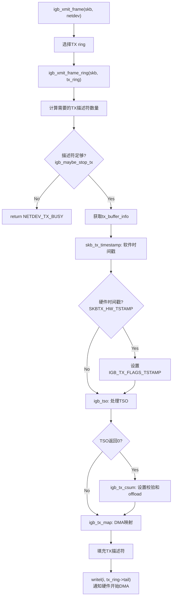

####    igb_tx_map：DMA 映射与 TX ring 操作

[`igb_tx_map`](https://elixir.bootlin.com/linux/v4.11.6/source/drivers/net/ethernet/intel/igb/igb_main.c) 是驱动层的核心，建立 DMA 映射让网卡硬件直接从 RAM 读取数据：

```cpp
// drivers/net/ethernet/intel/igb/igb_main.c (精简)
static void igb_tx_map(struct igb_ring *tx_ring,
               struct igb_tx_buffer *first,
               const u8 hdr_len)
{
    struct sk_buff *skb = first->skb;
    struct igb_tx_buffer *tx_buffer;
    union e1000_adv_tx_desc *tx_desc;
    u32 tx_flags = first->tx_flags;
    u16 i = tx_ring->next_to_use;

    tx_desc = IGB_TX_DESC(tx_ring, i);

    /* DMA映射skb线性数据区 */
    size = skb_headlen(skb);
    dma = dma_map_single(tx_ring->dev, skb->data, size, DMA_TO_DEVICE);

    /* 遍历所有分页(frags)，逐一DMA映射和填充描述符 */
    for (frag = &skb_shinfo(skb)->frags[0];; frag++) {
        if (dma_mapping_error(tx_ring->dev, dma))
            goto dma_error;

        tx_desc->read.buffer_addr = cpu_to_le64(dma);

        /* 如果fragment大于单个描述符容量，拆分为多个描述符 */
        while (unlikely(size > IGB_MAX_DATA_PER_TXD)) {
            tx_desc->read.cmd_type_len =
                cpu_to_le32(cmd_type ^ IGB_MAX_DATA_PER_TXD);
            i++;
            tx_desc++;
            /* ...... 环形缓冲区wrap处理 ...... */
            dma += IGB_MAX_DATA_PER_TXD;
            size -= IGB_MAX_DATA_PER_TXD;
        }
        if (likely(!data_len))
            break;
        /* 映射下一个分页 */
        size = skb_frag_size(frag);
        dma = skb_frag_dma_map(tx_ring->dev, frag, 0, size, DMA_TO_DEVICE);
    }

    /* 标记最后一个描述符 */
    cmd_type |= size | IGB_TXD_DCMD;
    tx_desc->read.cmd_type_len = cpu_to_le32(cmd_type);

    /* DQL: 通知动态队列限制系统 */
    netdev_tx_sent_queue(txring_txq(tx_ring), first->bytecount);

    first->time_stamp = jiffies;
    first->next_to_watch = tx_desc;

    /* 写屏障：确保所有描述符写入内存后再通知硬件 */
    wmb();

    i++;
    tx_ring->next_to_use = i;
    /* 写tail寄存器 → 触发硬件DMA */
    writel(i, tx_ring->tail);
    mmiowb();
}
```

关键步骤解释：
1. `dma_map_single` / `skb_frag_dma_map`：将 skb 数据的虚拟地址映射为 DMA 地址（让网卡能访问）
2. 填充 TX 描述符（`e1000_adv_tx_desc`）：告诉网卡数据在哪、多长
3. `writel(i, tx_ring->tail)`：写 MMIO 寄存器通知网卡"新数据已就绪"，网卡随即启动 DMA 传输
4. `wmb()` / `mmiowb()`：写屏障确保 CPU 写入顺序对网卡可见（关键！弱内存序架构如 IA-64 需要）

####    Dynamic Queue Limits (DQL)

DQL 是一种背压（back pressure）机制，防止过多数据堆积在设备 TX 队列中导致延迟增大：
- 发送时调用 `netdev_tx_sent_queue`：通知 DQL 有多少字节进入 TX 队列
- 完成时调用 `netdev_tx_completed_queue`：通知 DQL 有多少字节发送完毕
- DQL 内部算法动态计算"允许队列中堆积的最大字节数"，超过限制时临时禁用 TX 队列产生背压

DQL 参数通过 sysfs 可查看和调优：`/sys/class/net/<dev>/queues/tx-<N>/byte_queue_limits/`

##  0x0B    发送完成与硬中断

网卡 DMA 传输完成后，会触发硬件中断通知驱动清理资源

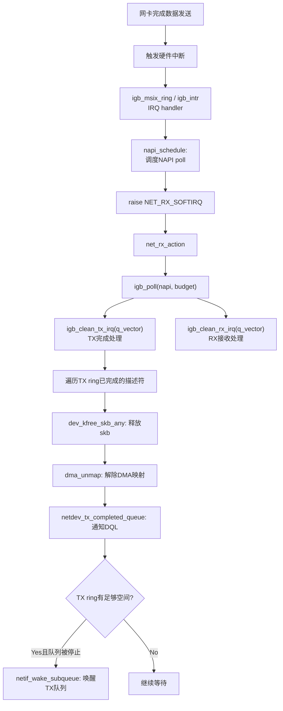

####    TX 与 RX 共享中断和 NAPI

**重要**：在 igb 驱动中，TX 完成和 RX 接收共享同一个中断和 NAPI poll 函数。`igb_poll` 先处理 TX 完成再处理 RX 接收：

```cpp
// drivers/net/ethernet/intel/igb/igb_main.c
static int igb_poll(struct napi_struct *napi, int budget)
{
    struct igb_q_vector *q_vector = container_of(napi, struct igb_q_vector, napi);
    bool clean_complete = true;

    if (q_vector->tx.ring)
        clean_complete = igb_clean_tx_irq(q_vector);   // 先处理TX完成

    if (q_vector->rx.ring)
        clean_complete &= igb_clean_rx_irq(q_vector, budget);  // 再处理RX

    if (!clean_complete)
        return budget;  // 还有工作未完成，继续poll

    napi_complete_done(napi, 0);
    igb_ring_irq_enable(q_vector);
    return 0;
}
```

TX 完成和 RX 有独立的处理预算（TX 默认 `IGB_DEFAULT_TX_WORK = 128`），但共享 NAPI 的时间片

####    igb_clean_tx_irq：TX 完成处理

```cpp
// drivers/net/ethernet/intel/igb/igb_main.c (精简)
static bool igb_clean_tx_irq(struct igb_q_vector *q_vector)
{
    struct igb_ring *tx_ring = q_vector->tx.ring;
    struct igb_tx_buffer *tx_buffer;
    union e1000_adv_tx_desc *tx_desc;
    unsigned int total_bytes = 0, total_packets = 0;
    unsigned int budget = q_vector->tx.work_limit;  // 128
    unsigned int i = tx_ring->next_to_clean;

    tx_buffer = &tx_ring->tx_buffer_info[i];
    tx_desc = IGB_TX_DESC(tx_ring, i);

    do {
        union e1000_adv_tx_desc *eop_desc = tx_buffer->next_to_watch;

        if (!eop_desc)
            break;

        read_barrier_depends();

        /* 检查DD位：硬件完成发送后会设置此位 */
        if (!(eop_desc->wb.status & cpu_to_le32(E1000_TXD_STAT_DD)))
            break;

        tx_buffer->next_to_watch = NULL;

        total_bytes += tx_buffer->bytecount;
        total_packets += tx_buffer->gso_segs;

        /* 释放skb */
        dev_kfree_skb_any(tx_buffer->skb);

        /* 解除DMA映射 */
        dma_unmap_single(tx_ring->dev,
                 dma_unmap_addr(tx_buffer, dma),
                 dma_unmap_len(tx_buffer, len),
                 DMA_TO_DEVICE);

        tx_buffer->skb = NULL;

        /* 清理该包使用的所有描述符的DMA映射 */
        while (tx_desc != eop_desc) {
            tx_buffer++;
            tx_desc++;
            i++;
            if (unlikely(!i)) {
                i -= tx_ring->count;
                tx_buffer = tx_ring->tx_buffer_info;
                tx_desc = IGB_TX_DESC(tx_ring, 0);
            }
            if (dma_unmap_len(tx_buffer, len)) {
                dma_unmap_page(tx_ring->dev,
                           dma_unmap_addr(tx_buffer, dma),
                           dma_unmap_len(tx_buffer, len),
                           DMA_TO_DEVICE);
            }
        }

        /* 移动到下一个包 */
        tx_buffer++;
        tx_desc++;
        i++;
        budget--;
    } while (likely(budget));

    /* 通知DQL系统 */
    netdev_tx_completed_queue(txring_txq(tx_ring), total_packets, total_bytes);

    tx_ring->next_to_clean = i;

    /* 更新统计 */
    tx_ring->tx_stats.bytes += total_bytes;
    tx_ring->tx_stats.packets += total_packets;

    /* 如果TX ring重新有足够空间，唤醒被停止的TX队列 */
    if (unlikely(total_packets &&
        netif_carrier_ok(tx_ring->netdev) &&
        igb_desc_unused(tx_ring) >= TX_WAKE_THRESHOLD)) {
        smp_mb();
        if (__netif_subqueue_stopped(tx_ring->netdev,
                         tx_ring->queue_index) &&
            !(test_bit(__IGB_DOWN, &q_vector->adapter->state))) {
            netif_wake_subqueue(tx_ring->netdev, tx_ring->queue_index);
            tx_ring->tx_stats.restart_queue++;
        }
    }

    return !!budget;
}
```

关键步骤：
1. 检查 `E1000_TXD_STAT_DD` 位：硬件设置此位表示对应描述符的数据已发送完成
2. `dev_kfree_skb_any`：释放 skb 内存
3. `dma_unmap_single` / `dma_unmap_page`：解除 DMA 映射
4. `netdev_tx_completed_queue`：通知 DQL 完成了多少字节
5. `netif_wake_subqueue`：如果 TX ring 有足够空间且队列被停止了，重新唤醒

##     0x0    内核数据发送
本小节补充下TCP的发送场景，基于TCP三次握手完成，通过`accept`获取到客户端的连接fd，基于这个fd发送数据的场景进行分析

####   1、accept 获取fd完成的布局

TODO

####   2、send* 系统调用
不管是`send`、`sendto`、[`sendmsg`](https://elixir.bootlin.com/linux/v4.11.6/source/net/socket.c#L1921)等系统调用，最终都会调用`sock_sendmsg`，主要完成：

1. 通过fd在内核中定位到对应的 socket/sock 结构对象，在这个对象里记录着各种协议栈的函数地址（在生成fd的时候就已经初始化好了）
2. 构造一个 `struct msghdr` 对象，把用户传入的数据，比如 buffer地址、数据长度等等都设置进去
3. 调用`sock_sendmsg`，即协议栈对应的函数 `inet_sendmsg` ，其中 `inet_sendmsg` 函数地址是通过 socket 内核对象里的 `ops` 成员找到的

以`sendto`[系统调用](https://elixir.bootlin.com/linux/v4.11.6/source/net/socket.c#L1664)为例：

```cpp
SYSCALL_DEFINE6(sendto, int, fd, void __user *, buff, size_t, len,
		unsigned int, flags, struct sockaddr __user *, addr,
		int, addr_len)
{
	struct socket *sock;
	struct sockaddr_storage address;
	int err;
	struct msghdr msg;
	struct iovec iov;
	
       ......
       // 根据fd定位socket/sock结构
	sock = sockfd_lookup_light(fd, &err, &fput_needed);
	if (!sock)
		goto out;

       // 设置msghdr对象
	msg.msg_name = NULL;
	msg.msg_control = NULL;
	msg.msg_controllen = 0;
	msg.msg_namelen = 0;
	if (addr) {
		err = move_addr_to_kernel(addr, addr_len, &address);
		if (err < 0)
			goto out_put;
		msg.msg_name = (struct sockaddr *)&address;
		msg.msg_namelen = addr_len;
	}
	if (sock->file->f_flags & O_NONBLOCK)
		flags |= MSG_DONTWAIT;
	msg.msg_flags = flags;
	err = sock_sendmsg(sock, &msg);

out_put:
	fput_light(sock->file, fput_needed);
out:
	return err;
}
```

继续`sock_sendmsg ---> sock_sendmsg_nosec`：

```cpp
static inline int sock_sendmsg_nosec(struct socket *sock, struct msghdr *msg)
{
       // sendmsg对应 inet_sendmsg
       // 该函数是 AF_INET 协议族提供的通用发送函数
	int ret = sock->ops->sendmsg(sock, msg, msg_data_left(msg));
	BUG_ON(ret == -EIOCBQUEUED);
	return ret;
}
```

对于`inet_sendmsg`而言：

```cpp
int inet_sendmsg(......)
{
	......
	// 对于 TCP socket， sendmsg 指向 tcp_sendmsg
	// 对于 UDP socket， sendmsg 指向 udp_sendmsg
	return sk->sk_prot->sendmsg(iocb, sk, msg, size);
}
```

####   tcp_sendmsg 函数分析
内核协议栈 `inet_sendmsg` 会关联对应 socket 上的具体协议发送函数，对于 TCP 协议而言就是 `tcp_sendmsg`（通过 socket 内核对象定位到），注意到`tcp_sendmsg`的参数`sk`，说明其用于处理某个具体的socket/sock的数据发送功能，`tcp_sendmsg`的核心功能如下：

```cpp
int tcp_sendmsg(struct sock *sk, struct msghdr *msg, size_t size)
{
	struct tcp_sock *tp = tcp_sk(sk);
	struct sk_buff *skb;
	struct sockcm_cookie sockc;
	int flags, err, copied = 0;
	int mss_now = 0, size_goal, copied_syn = 0;
	bool process_backlog = false;
	bool sg;
	long timeo;
	/* 加锁，避免与软中断的冲突 */
	lock_sock(sk);

	flags = msg->msg_flags;
    // 若开启了TCP Fast Open，会在发送SYN时携带上数据
	if (unlikely(flags & MSG_FASTOPEN || inet_sk(sk)->defer_connect)) {
		err = tcp_sendmsg_fastopen(sk, msg, &copied_syn, size);
		if (err == -EINPROGRESS && copied_syn > 0)
			goto out;
		else if (err)
			goto out_err;
	}

    // 获取发送的超时时间，如果是非阻塞则为0
	timeo = sock_sndtimeo(sk, flags & MSG_DONTWAIT);

	tcp_rate_check_app_limited(sk);  /* is sending application-limited? */

	/* Wait for a connection to finish. One exception is TCP Fast Open
	 * (passive side) where data is allowed to be sent before a connection
	 * is fully established.
	 */

	// 只有ESTABLISHED 和 CLOSE_WAIT才允许发送数据
	if (((1 << sk->sk_state) & ~(TCPF_ESTABLISHED | TCPF_CLOSE_WAIT)) &&
	    !tcp_passive_fastopen(sk)) {
		// 否则，只能等待连接建立
		err = sk_stream_wait_connect(sk, &timeo);
		if (err != 0)
			goto do_error;
	}

	if (unlikely(tp->repair)) {
		if (tp->repair_queue == TCP_RECV_QUEUE) {
			copied = tcp_send_rcvq(sk, msg, size);
			goto out_nopush;
		}

		err = -EINVAL;
		if (tp->repair_queue == TCP_NO_QUEUE)
			goto out_err;
	}

	sockc.tsflags = sk->sk_tsflags;
	if (msg->msg_controllen) {
		err = sock_cmsg_send(sk, msg, &sockc);
		if (unlikely(err)) {
			err = -EINVAL;
			goto out_err;
		}
	}

	/* This should be in poll */
	sk_clear_bit(SOCKWQ_ASYNC_NOSPACE, sk);

	/* Ok commence sending. */
	copied = 0;

restart:
	// 获取当前有效的 mss
	// size_goal：数据段的最大长度
	mss_now = tcp_send_mss(sk, &size_goal, flags);
	/* 
	* mtu: max transmission unit
	* mss: max segment size. (mtu - (ip header size) - (tcp header size))
	* GSO: Generic Segmentation Offload
	* size_goal 表示数据报到达网络设备时，数据段的最大长度，该长度用来分割数据，
	* TCP 发送段时，每个 SKB 的大小不能超过 size_goal
	* 不支持 GSO 情况下， size_goal 就等于 MSS，如果支持 GSO，
	* 那么 size_goal 是 mss 的整数倍，数据报发送到网络设备后再由网络设备根据 MSS 进行分割
	*/

	err = -EPIPE;
	if (sk->sk_err || (sk->sk_shutdown & SEND_SHUTDOWN))
		goto do_error;

	sg = !!(sk->sk_route_caps & NETIF_F_SG);

	// msg_data_left：msghdr的count字段
	while (msg_data_left(msg)) {
		int copy = 0;
		// max：size_goal
		int max = size_goal;
        // tcp_write_queue_tail：获取socket/sock（sk）对象对于的发送队列即sk_write_queue
		skb = tcp_write_queue_tail(sk);
		if (tcp_send_head(sk)) {
			if (skb->ip_summed == CHECKSUM_NONE)
				max = mss_now;
			/*
				当 size_goal - skb->len>0，判断 skb 是否已满，大于零说明 skb（sk_buff） 还有剩余空间
				即还可以继续向 skb 追加填充数据，组成一个 mss 的数据包，发往 ip 层
			*/
			copy = max - skb->len;
		}

		if (copy <= 0 || !tcp_skb_can_collapse_to(skb)) {
			/*
				1、copy<=0 说明当前 skb 空间不足，那么要重新创建一个 sk_buff 来装载当前数据
				2、被设置了 eor 标记不能合并
			*/
			bool first_skb;

new_segment:
			/* Allocate new segment. If the interface is SG,
			 * allocate skb fitting to single page.
			 */
			/* 如果发送队列的总大小（sk_wmem_queued）>= 发送缓存上限（sk_sndbuf）
             * 或者发送缓冲区中尚未发送的数据量，超过了用户的设置值，那么进入等待状态。*/
			if (!sk_stream_memory_free(sk))
				goto wait_for_sndbuf;

			if (process_backlog && sk_flush_backlog(sk)) {
				process_backlog = false;
				goto restart;
			}
			first_skb = skb_queue_empty(&sk->sk_write_queue);

			/*
				正常情况：
				重新分配一个 sk_buff 结构
			*/
			skb = sk_stream_alloc_skb(sk,
						  select_size(sk, sg, first_skb),
						  sk->sk_allocation,
						  first_skb);
			if (!skb)
				goto wait_for_memory;

			process_backlog = true;
			/*
			 * Check whether we can use HW checksum.  
			 */
			if (sk_check_csum_caps(sk))
				skb->ip_summed = CHECKSUM_PARTIAL;
			
			//skb_entail：将 skb 添加进发送队列sk_write_queue（双链表）尾部
			skb_entail(sk, skb);
			//由于申请了一个新的sk_buff，初始化skb 数据缓冲区大小是 size_goal
			copy = size_goal;
			max = size_goal;

			/* All packets are restored as if they have
			 * already been sent. skb_mstamp isn't set to
			 * avoid wrong rtt estimation.
			 */
			if (tp->repair)
				TCP_SKB_CB(skb)->sacked |= TCPCB_REPAIRED;
		}

		/* Try to append data to the end of skb. */
		// 重试复制数据，先再次校验长度
		if (copy > msg_data_left(msg))
			copy = msg_data_left(msg);

		/* Where to copy to? */
		// 检查skb 的线性存储区底部是否还有空间？
		if (skb_availroom(skb) > 0) {
			/* We have some space in skb head. Superb! */
			copy = min_t(int, copy, skb_availroom(skb));
			// 将数据拷贝到连续的数据区域
			err = skb_add_data_nocache(sk, skb, &msg->msg_iter, copy);
			if (err)
				goto do_fault;
		} else {
			// skb线性存储区无可用空间
			bool merge = true;
			int i = skb_shinfo(skb)->nr_frags;
			struct page_frag *pfrag = sk_page_frag(sk);

			if (!sk_page_frag_refill(sk, pfrag))
				goto wait_for_memory;

			if (!skb_can_coalesce(skb, i, pfrag->page,
					      pfrag->offset)) {
				if (i >= sysctl_max_skb_frags || !sg) {
					tcp_mark_push(tp, skb);
					goto new_segment;
				}
				merge = false;
			}

			copy = min_t(int, copy, pfrag->size - pfrag->offset);

			if (!sk_wmem_schedule(sk, copy))
				goto wait_for_memory;
			
			/* 如果 skb 的线性存储区底部已经没有空间了，
             * 将数据拷贝到 skb 的 struct skb_shared_info 结构指向的不需要连续的页面区域 */
			err = skb_copy_to_page_nocache(sk, &msg->msg_iter, skb,
						       pfrag->page,
						       pfrag->offset,
						       copy);
			if (err)
				goto do_error;

			/* Update the skb. */
			if (merge) {
				skb_frag_size_add(&skb_shinfo(skb)->frags[i - 1], copy);
			} else {
				skb_fill_page_desc(skb, i, pfrag->page,
						   pfrag->offset, copy);
				page_ref_inc(pfrag->page);
			}
			pfrag->offset += copy;
		}

		//如果复制的数据长度为零（或者第一次拷贝），那么取消 PSH 标志
		if (!copied)
			TCP_SKB_CB(skb)->tcp_flags &= ~TCPHDR_PSH;

		//更新发送队列的最后一个序号 write_seq
		tp->write_seq += copy;
		//更新 skb 的结束序号
		TCP_SKB_CB(skb)->end_seq += copy;
		// 初始化 gso 分段数 gso_segs
		tcp_skb_pcount_set(skb, 0);

		copied += copy;
		if (!msg_data_left(msg)) {
			if (unlikely(flags & MSG_EOR))
				TCP_SKB_CB(skb)->eor = 1;
			//用户层数据已经拷贝完毕，进行发送
			goto out;
		}

		/* 如果当前 skb 还可以填充数据，或者发送的是带外数据，或者使用 tcp repair 选项，
         * 那么继续拷贝数据，先不发送*/
		if (skb->len < max || (flags & MSG_OOB) || unlikely(tp->repair))
			continue;

		// 重要！检查是否必须立即发送
		if (forced_push(tp)) {
			tcp_mark_push(tp, skb);
			// 积累的数据包数量太多了，需要发送出去
			__tcp_push_pending_frames(sk, mss_now, TCP_NAGLE_PUSH);
		} else if (skb == tcp_send_head(sk))
			// 如果是第一个网络包，那么只发送当前段
			tcp_push_one(sk, mss_now);

		// 不走下面的流程
		continue;

wait_for_sndbuf:
		//若发送队列中段数据总长度已经达到了发送缓冲区的长度上限，那么设置 SOCK_NOSPACE
		set_bit(SOCK_NOSPACE, &sk->sk_socket->flags);
wait_for_memory:
		// 在进入睡眠等待前，如果已有数据从用户空间复制过来，那么通过 tcp_push 先发送出去
		if (copied)
			tcp_push(sk, flags & ~MSG_MORE, mss_now,
				 TCP_NAGLE_PUSH, size_goal);
		// 进入睡眠，等待内存空闲信号唤醒
		err = sk_stream_wait_memory(sk, &timeo);
		if (err != 0)
			goto do_error;
		
		//睡眠后 MSS 和 TSO 段长可能会发生变化，需要重新计算
		mss_now = tcp_send_mss(sk, &size_goal, flags);
	}

out:
	/* 在连接状态下，在发送过程中，如果有正常的退出，或者由于错误退出（参考上面跳转到out的代码）
     * 但是已经有复制数据了，都会进入发送环节。 */
	if (copied) {
		// 如果已经有数据复制到发送队列了，就尝试立即发送
		tcp_tx_timestamp(sk, sockc.tsflags, tcp_write_queue_tail(sk));
		// 是否能立即发送数据要看是否启用了 Nagle 算法
		tcp_push(sk, flags, mss_now, tp->nonagle, size_goal);
	}
out_nopush:
	release_sock(sk);
	return copied + copied_syn;

do_fault:
	if (!skb->len) {
		tcp_unlink_write_queue(skb, sk);
		/* It is the one place in all of TCP, except connection
		 * reset, where we can be unlinking the send_head.
		 */
		tcp_check_send_head(sk, skb);
		sk_wmem_free_skb(sk, skb);
	}

do_error:
	if (copied + copied_syn)
		goto out;
out_err:
	err = sk_stream_error(sk, flags, err);
	/* make sure we wake any epoll edge trigger waiter */
	if (unlikely(skb_queue_len(&sk->sk_write_queue) == 0 &&
		     err == -EAGAIN)) {
		sk->sk_write_space(sk);
		tcp_chrono_stop(sk, TCP_CHRONO_SNDBUF_LIMITED);
	}
	release_sock(sk);
	return err;
}
```

这里再强调一下`sk_write_queue`与`sk_send_head`的配合机制

####   3、传输层处理

`tcp_transmit_skb`的作用是拷贝skb，构造skb中的tcp首部，并将调用网络层的发送函数发送skb

1.	在发送前，首先需要复制skb，因为在成功发送到网络设备之后，skb会释放，而tcp层不能真正的释放，是需要等到对该数据段的ack才可以释放
2.	然后构造tcp首部和选项
3.	最后调用网络层提供的发送回调函数发送skb，ip层的回调函数为`ip_queue_xmit`

```cpp
//https://elixir.bootlin.com/linux/v4.11.6/source/net/ipv4/tcp_output.c#L920
static int tcp_transmit_skb(struct sock *sk, struct sk_buff *skb, int clone_it,
			    gfp_t gfp_mask)
{
	const struct inet_connection_sock *icsk = inet_csk(sk);
	struct inet_sock *inet;
	struct tcp_sock *tp;
	struct tcp_skb_cb *tcb;
	struct tcp_out_options opts;
	unsigned int tcp_options_size, tcp_header_size;
	struct tcp_md5sig_key *md5;
	struct tcphdr *th;
	int err;

	......
	tp = tcp_sk(sk);

	// 判断SKB clone OR SKB copy的场景（见后文） 
	if (clone_it) {
		skb_mstamp_get(&skb->skb_mstamp);
		TCP_SKB_CB(skb)->tx.in_flight = TCP_SKB_CB(skb)->end_seq
			- tp->snd_una;
		tcp_rate_skb_sent(sk, skb);

		if (unlikely(skb_cloned(skb)))
			skb = pskb_copy(skb, gfp_mask);
		else
			skb = skb_clone(skb, gfp_mask);
		if (unlikely(!skb) )
			return -ENOBUFS;
	}

	inet = inet_sk(sk);
	tcb = TCP_SKB_CB(skb);
	memset(&opts, 0, sizeof(opts));

	// 计算syn包tcp选项长度
	if (unlikely(tcb->tcp_flags & TCPHDR_SYN))
		tcp_options_size = tcp_syn_options(sk, skb, &opts, &md5);
	else{
		//计算已连接状态tcp选项长度
		tcp_options_size = tcp_established_options(sk, skb, &opts,	
							   &md5);
	}
	//计算tcp头部长度，用于skb_push
	tcp_header_size = tcp_options_size + sizeof(struct tcphdr);

	/* if no packet is in qdisc/device queue, then allow XPS to select
	 * another queue. We can be called from tcp_tsq_handler()
	 * which holds one reference to sk_wmem_alloc.
	 *
	 * TODO: Ideally, in-flight pure ACK packets should not matter here.
	 * One way to get this would be to set skb->truesize = 2 on them.
	 */
	skb->ooo_okay = sk_wmem_alloc_get(sk) < SKB_TRUESIZE(1);

	/* If we had to use memory reserve to allocate this skb,
	 * this might cause drops if packet is looped back :
	 * Other socket might not have SOCK_MEMALLOC.
	 * Packets not looped back do not care about pfmemalloc.
	 */
	skb->pfmemalloc = 0;

	//加入tcp头
	skb_push(skb, tcp_header_size);
	skb_reset_transport_header(skb);

	skb_orphan(skb);
	skb->sk = sk;
	skb->destructor = skb_is_tcp_pure_ack(skb) ? __sock_wfree : tcp_wfree;
	skb_set_hash_from_sk(skb, sk);
	atomic_add(skb->truesize, &sk->sk_wmem_alloc);

	skb_set_dst_pending_confirm(skb, sk->sk_dst_pending_confirm);

	/* Build TCP header and checksum it. */
	// 构造TCP 头部
	th = (struct tcphdr *)skb->data;
	th->source		= inet->inet_sport;
	th->dest		= inet->inet_dport;
	th->seq			= htonl(tcb->seq);
	th->ack_seq		= htonl(tp->rcv_nxt);
	*(((__be16 *)th) + 6)	= htons(((tcp_header_size >> 2) << 12) |
					tcb->tcp_flags);

	th->check		= 0;
	th->urg_ptr		= 0;

	/* The urg_mode check is necessary during a below snd_una win probe */
	if (unlikely(tcp_urg_mode(tp) && before(tcb->seq, tp->snd_up))) {
		if (before(tp->snd_up, tcb->seq + 0x10000)) {
			th->urg_ptr = htons(tp->snd_up - tcb->seq);
			th->urg = 1;
		} else if (after(tcb->seq + 0xFFFF, tp->snd_nxt)) {
			th->urg_ptr = htons(0xFFFF);
			th->urg = 1;
		}
	}

	tcp_options_write((__be32 *)(th + 1), tp, &opts);
	skb_shinfo(skb)->gso_type = sk->sk_gso_type;
	if (likely(!(tcb->tcp_flags & TCPHDR_SYN))) {
		//非SYN报文，动态计算窗口值（th->window）
		th->window      = htons(tcp_select_window(sk));
		tcp_ecn_send(sk, skb, th, tcp_header_size);
	} else {
		/* RFC1323: The window in SYN & SYN/ACK segments
		 * is never scaled.
		 */
		// 其他类型需要设置接收窗口
		th->window	= htons(min(tp->rcv_wnd, 65535U));
	}

	// 计算校验和
	icsk->icsk_af_ops->send_check(sk, skb);

	if (likely(tcb->tcp_flags & TCPHDR_ACK))
		tcp_event_ack_sent(sk, tcp_skb_pcount(skb));

	// 有数据要发送
	if (skb->len != tcp_header_size) {
		tcp_event_data_sent(tp, sk);
		tp->data_segs_out += tcp_skb_pcount(skb);
	}

	if (after(tcb->end_seq, tp->snd_nxt) || tcb->seq == tcb->end_seq)
		TCP_ADD_STATS(sock_net(sk), TCP_MIB_OUTSEGS,
			      tcp_skb_pcount(skb));

	tp->segs_out += tcp_skb_pcount(skb);
	/* OK, its time to fill skb_shinfo(skb)->gso_{segs|size} */
	skb_shinfo(skb)->gso_segs = tcp_skb_pcount(skb);
	skb_shinfo(skb)->gso_size = tcp_skb_mss(skb);

	/* Our usage of tstamp should remain private */
	skb->tstamp = 0;

	/* Cleanup our debris for IP stacks */
	memset(skb->cb, 0, max(sizeof(struct inet_skb_parm),
			       sizeof(struct inet6_skb_parm)));

	//调用发送接口queue_xmit发送报文
	//ip层的回调函数为ip_queue_xmit
	err = icsk->icsk_af_ops->queue_xmit(sk, skb, &inet->cork.fl);

	if (likely(err <= 0))
		return err;

    //进入拥塞控制 
	tcp_enter_cwr(sk);

	return net_xmit_eval(err);
}
```

####   4、网络层发送处理

TODO

####   5、邻居子系统

TODO

####   6、网络设备子系统

TODO

####   7、软中断调度

TODO

####   8、igb 网卡驱动发送

TODO

####   9、发送完成硬中断

TODO

##  0x0C    监控与调优

####    UDP 协议层统计

```bash
# /proc/net/snmp 中的 UDP 统计
$ cat /proc/net/snmp | grep Udp:
Udp: InDatagrams NoPorts InErrors OutDatagrams RcvbufErrors SndbufErrors InCsumErrors
Udp: 16314 0 0 17161 0 0 0
```

关键指标：
- `OutDatagrams`：成功交给 IP 层的 UDP 包数。在 `udp_send_skb` 中 `ip_send_skb` 成功后递增
- `SndbufErrors`：发送缓冲区错误数。当 `ip_send_skb` 返回 `ENOBUFS`（内核内存不足）或 socket 发送缓冲区满（`SOCK_NOSPACE`）时递增
- `InCsumErrors`：接收方向校验和错误数

```bash
# /proc/net/udp 中的 per-socket 统计
$ cat /proc/net/udp
  sl  local_address rem_address   st tx_queue rx_queue ... drops
  515: 00000000:B346 00000000:0000 07 00000000:00000000 ... 0
```

`tx_queue`：该 socket 发送队列中的字节数；`drops`：该 socket 的丢包数（接收方向）

####    IP 协议层统计

```bash
$ cat /proc/net/snmp | grep Ip:
```

关键指标：
- `OutRequests`：IP 层尝试发送的包数（每次发送都递增）
- `OutDiscards`：IP 层丢弃的包数（`ip_send_skb` 中发生错误时）
- `OutNoRoutes`：无路由可达（`udp_sendmsg` 路由查找失败时）
- `FragOKs` / `FragCreates` / `FragFails`：IP 分片统计

####    网络设备统计

```bash
# ethtool 查看网卡详细统计
$ sudo ethtool -S eth0 | grep -i tx
     tx_packets: 2298757402
     tx_bytes: 31973946891907
     tx_errors: 0
     tx_dropped: 0
```

```bash
# tc 查看 qdisc 统计
$ tc -s qdisc show dev eth0
qdisc mq 0: root
 Sent 31973946891907 bytes 2298757402 pkt (dropped 0, overlimits 0 requeues 1776429)
 backlog 0b 0p requeues 1776429
```

- `dropped`：qdisc 丢弃的包数（TX 队列长度不够）
- `requeues`：`dev_requeue_skb` 调用次数（驱动返回 BUSY 导致的重排队）
- `backlog`：qdisc 队列中当前排队的字节数

####    关键 sysctl 调优参数

| 参数 | 默认值 | 说明 |
|------|--------|------|
| `net.core.wmem_max` | 212992 | socket 发送缓冲区最大值 |
| `net.core.wmem_default` | 212992 | socket 发送缓冲区默认值 |
| `net.core.dev_weight` | 64 | `__qdisc_run` 每次最多处理的包数 |
| `net.ipv4.udp_mem` | 系统计算 | UDP 全局内存限制（页数） |
| `net.ipv4.udp_wmem_min` | 4096 | UDP socket 最小发送缓冲区 |

```bash
# 增大发送缓冲区
$ sudo sysctl -w net.core.wmem_max=16777216
$ sudo sysctl -w net.core.wmem_default=16777216

# 增大 qdisc 处理权重（适用于高吞吐场景）
$ sudo sysctl -w net.core.dev_weight=600

# 增大 TX 队列长度
$ sudo ifconfig eth0 txqueuelen 10000

# 配置 XPS (CPU 0 处理 tx-0 队列)
$ echo 1 > /sys/class/net/eth0/queues/tx-0/xps_cpus
```

##  0x0D    参考
-   [Monitoring and Tuning the Linux Networking Stack: Sending Data](https://blog.packagecloud.io/monitoring-tuning-linux-networking-stack-sending-data/)
-   [Monitoring and Tuning the Linux Networking Stack: Receiving Data](https://blog.packagecloud.io/monitoring-tuning-linux-networking-stack-receiving-data/)
-   [Linux网络 - 数据包的发送过程](https://segmentfault.com/a/1190000008926093)
-   [图解 Linux 网络包发送过程](https://zhuanlan.zhihu.com/p/373060740)
-   [[内核源码] 网络协议栈 - write (tcp) 发送数据](https://wenfh2020.com/2021/08/19/kernel-tcp-write/)
-   [TCP的发送系列 - tcp_sendmsg()的实现](https://www.cnblogs.com/aiwz/p/6333235.html)
-   [25 张图，一万字，拆解 Linux 网络包发送过程](https://blog.csdn.net/zhangyanfei01/article/details/116725966)
