##  0x00    前言
本文从内核视角来跟踪TCP的完整通信过程（三次握手、数据传输、四次挥手），包含客户端与服务端双端方向的内核调用链及状态迁移内核实现追踪。代码基于 [v4.11.6](https://elixir.bootlin.com/linux/v4.11.6/source/include) 版本


上图是经典的TCP切换状态机，不过内核v4.11.6 TCP三次握手的状态有些许改变，服务端新增了一个`TCP_NEW_SYN_RECV`状态

####    TCP状态切换：三次握手
1.  client：`TCP_SYN_SENT`
2.  server：`TCP_NEW_SYN_RECV`
3.  client：`TCP_ESTABLISHED`
4.  server：`TCP_SYN_RECV`
5.  server：`TCP_ESTABLISHED`

TCP的状态信息，由`struct sock`的`sk_state`字段进行存储

####	服务端代码

```cpp
int main(int argc, char const *argv[])
{
	int fd = socket(AF_INET, SOCK_STREAM, 0);
	bind(fd, ...);
	listen(fd, 128);
	accept(fd, ...);
	//handler fd
}
```

####	客户端代码

```cpp
int main(){
	fd = socket(AF_INET,SOCK_STREAM, 0);
	connect(fd, ...);
 	......
}
```

##  0x01    基础知识

####	request_sock / sock
`struct request_sock` 和 `struct sock` 是 TCP 三次握手流程中最核心的两个结构体，`request_sock` 是半连接（SYN_RECV）阶段的**临时轻量套接字**，而 `struct sock` 是连接建立（ESTABLISHED）后的全功能重量级套接字，其初衷是内核为了对抗 SYN Flood 攻击、优化多核并发以及精简内存开销而演进出的极致设计

1、结构体角色与核心作用

`struct request_sock`（轻量级请求控制块）：

-	创建时机：当本端收到客户端的 SYN 包，且决定接受这个连接请求时（`tcp_conn_request` 流程），关联[代码](https://elixir.bootlin.com/linux/v4.11.6/source/net/ipv4/tcp_input.c#L6308)
-	该结构体的功能如下
	-	记录握手信息：它只保存构建 SYN+ACK 报文以及校验第三次握手 ACK 所必需的极简元数据（如对端的 mss、rcv_isn 初始序列号、snd_isn 本端初始序列号、四元组信息等）
	-	挂载重传定时器： 负责维护 SYN+ACK 的指数退避重传，直到收到第三次握手，或者超时被销毁
	-	存在状态为TCP_NEW_SYN_RECV（4.x内核引入的伪状态）

同样，对于三次握手过程中的`struct sock`（全功能网络套接字）：

-	创建时机：三次握手完成（关联TCP_ESTABLISHED状态），内核收到客户端的第三次 ACK 报文 时（`tcp_check_req` → `tcp_v4_syn_recv_sock` 流程）
-	该结构体的功能如下
	-	全协议栈支持：承载了 TCP 协议栈的所有复杂功能，包括拥塞控制状态机（tcp_congestion_ops）、滑动窗口、重传队列、动态缓冲区等
	-	数据搬运： 拥有真正用于应用层读写的 sk_write_queue（发送队列）和 sk_receive_queue（接收队列）
	-	被 accept 从全连接队列中移除后会绑定到 fd 和 `struct file`

2、req_to_sk 的伪装术

在早期 Linux 内核（2.6 版本）中，`struct request_sock` 和 `struct sock` 是完全独立的两个结构体，半连接队列也是一个独立的局部哈希表。在 4.11.6 版本，为了实现 Lockless Listener（无锁化监听），内核做了重构，即让 request_sock 伪装成一个特殊的 struct sock

```c
//https://elixir.bootlin.com/linux/v4.11.6/source/include/net/request_sock.h#L49
struct request_sock {
	struct sock_common		__req_common;	// 重点：包含 sock 的核心公用头部
#define rsk_refcnt			__req_common.skc_refcnt
#define rsk_hash			__req_common.skc_hash
#define rsk_listener			__req_common.skc_listener
#define rsk_window_clamp		__req_common.skc_window_clamp
#define rsk_rcv_wnd			__req_common.skc_rcv_wnd

	struct request_sock		*dl_next;
	u16				mss;
	u8				num_retrans; /* number of retransmits */
	u8				cookie_ts:1; /* syncookie: encode tcpopts in timestamp */
	u8				num_timeout:7; /* number of timeouts */
	u32				ts_recent;
	struct timer_list		rsk_timer;
	const struct request_sock_ops	*rsk_ops;
	struct sock			*sk;
	u32				*saved_syn;
	u32				secid;
	u32				peer_secid;
};

//https://elixir.bootlin.com/linux/v4.11.6/source/include/net/sock.h#L311
struct sock {
	/*
	 * Now struct inet_timewait_sock also uses sock_common, so please just
	 * don't add nothing before this first member (__sk_common) --acme
	 */
	struct sock_common	__sk_common;
#define sk_node			__sk_common.skc_node
#define sk_nulls_node		__sk_common.skc_nulls_node
#define sk_refcnt		__sk_common.skc_refcnt
#define sk_tx_queue_mapping	__sk_common.skc_tx_queue_mapping
	......
}
```

从上面定义看出，request_sock 的第一个成员并不是普通的字段，而是一个 `struct sock_common`，这就产生了一个精妙的宏`req_to_sk(req)`

```c
//https://elixir.bootlin.com/linux/v4.11.6/source/include/net/request_sock.h#L76
static inline struct sock *req_to_sk(struct request_sock *req) {
	return (struct sock *)req;
}
```

为什么能够强制类型转换？ 因为 `struct sock` 的第一个成员也是 `struct sock_common`。这就意味着，在内核看来，request_sock 内存块的前半部分，其布局和 `struct sock` 完全一致。注意，**request_sock 和 sock 不是可以任意互转，而是可以在 struct sock_common 这个公共前缀范围内互相解释**

通过`struct sock *sk = req_to_sk(req)`强制转换，`sk`只能安全访问 `sock_common` 里的字段，比如：

```bash
sk->sk_hash
sk->sk_state
sk->sk_prot
sk->sk_nulls_node
sk->sk_refcnt
sk->sk_daddr
sk->sk_rcv_saddr
sk->sk_dport
sk->sk_num
sk->sk_bound_dev_if
```

3、内核设计的意义

在后文，有一个知识点需要额外注意，由于在4.11.6 版本中，半连接队列被取消了，内核需要把半连接对象（request_sock）直接塞进全局的 `tcp_hashinfo.ehash`（已建立连接哈希表）中，但是ehash 里的桶节点类型规定必须是 `struct sock *`，如何实现呢？于是内核直接调用`req_to_sk(req)`将 request_sock 强转并包装成一个伪 sock，对于后续动作：

-	无锁查找：当网卡来包时，软中断无锁地去 ehash 里计算四元组查找。查找的结果节点可能是一个真正的 struct sock（状态为 TCP_ESTABLISHED），也可能是一个被伪装的 request_sock（状态为 TCP_NEW_SYN_RECV）
-	分流处理： 内核只需在无锁查找到节点后，检查下 `sk->sk_state`，如果是 TCP_NEW_SYN_RECV，就代表这实际上是个 request_sock，立刻交由 `tcp_check_req` 去验证第三次握手，否则，就是一个正常状态机下的sock结构

####	socket/sock/inet_sock/inet_connection_sock
`struct socket` 是用于负责对（上层）给用户提供接口，并且和文件系统关联。而 `struct sock` 负责向下对接内核网络协议栈


如上图`sock -> inet_sock -> inet_connection_sock -> tcp_sock` 四个结构体呈现从通用到专用的层次关系

1、`sock`基础层，内核网络栈的核心抽象，管理所有协议通用的基础设施，核心成员如下

-	等待队列：`struct socket_wq *sk_wq`，用于同步阻塞模式以及epoll非阻塞模式下的等待唤醒机制
-	数据队列：`sk_receive_queue`（接收队列）、`sk_write_queue`（发送队列）
-	状态与内存：套接字状态（`sk_state`）、缓冲区大小（`sk_sndbuf`/`sk_rcvbuf`）、内存计数器（`sk_wmem_alloc`）
-	协议操作集：指向`struct proto`（如`tcp_prot`），定义协议行为函数

2、`inet_sock` IP层扩展，继承`sock`，添加IPv4协议族专属字段，核心成员如下：

-	地址与端口：源/目的IP（`inet_saddr`/`inet_daddr`）、源/目的端口（`inet_sport`/`inet_dport`）
-	IP选项：TTL（`uc_ttl`）、服务类型（`tos`）、IP分片标志（`hdrincl`）等
-	多播支持：组播地址（`mc_addr`）、设备索引（`mc_index`）

3、`inet_connection_sock`为面向连接协议扩展，继承`inet_sock`，为面向连接协议（如TCP）提供基础，核心成员如下：

-	连接管理：半连接队列（`request_sock_queue`）、全连接队列（`icsk_accept_queue`）
-	定时器：重传定时器（`icsk_retransmit_timer`）、延迟ACK定时器（`icsk_delack_timer`）
-	拥塞控制：算法操作集（`icsk_ca_ops`）、私有数据（`icsk_ca_priv`）

4、`tcp_sock`TCP协议专属，继承`inet_connection_sock`，实现TCP协议完整状态机

-	序列号控制：发送序列（`snd_nxt`）、接收序列（`rcv_nxt`）、未确认序列（`snd_una`）
-	流量控制：拥塞窗口（`snd_cwnd`）、接收窗口（`rcv_wnd`）、慢启动阈值（`snd_ssthresh`）
-	TCP的高级特性：乱序队列（`out_of_order_queue`）、SACK选项、时间戳

内核通过单次内存分配与类型转换实现高效访问，创建TCP套接字时，一次性分配`struct tcp_sock`（包含所有父结构字段），当需要做层次间的类型转换时，直接通过指针强制转换访问父结构，由于父结构是子结构的首个成员，转换后可直接访问其字段（如`tp->icsk->sk->sk_receive_queue`）

```cpp
struct tcp_sock *tp = alloc_tcp_sock();  
struct inet_connection_sock *icsk = (struct inet_connection_sock *)tp;  
struct sock *sk = (struct sock *)icsk;  // 最终转为通用sock
```

####	inet_connection_sock结构

TODO

```c
struct inet_connection_sock {
	/* inet_sock has to be the first member! */
	struct inet_sock	  icsk_inet;
	struct request_sock_queue icsk_accept_queue;	//全连队列
	struct inet_bind_bucket	  *icsk_bind_hash;
	unsigned long		  icsk_timeout;
 	struct timer_list	  icsk_retransmit_timer;
 	struct timer_list	  icsk_delack_timer;
	__u32			  icsk_rto;
	__u32			  icsk_pmtu_cookie;
	const struct tcp_congestion_ops *icsk_ca_ops;
	const struct inet_connection_sock_af_ops *icsk_af_ops;
	unsigned int		  (*icsk_sync_mss)(struct sock *sk, u32 pmtu);
	__u8			  icsk_ca_state:6,
				  icsk_ca_setsockopt:1,
				  icsk_ca_dst_locked:1;
	__u8			  icsk_retransmits;
	__u8			  icsk_pending;
	__u8			  icsk_backoff;
	__u8			  icsk_syn_retries;
	__u8			  icsk_probes_out;
	__u16			  icsk_ext_hdr_len;
	struct {
		__u8		  pending;	 /* ACK is pending			   */
		__u8		  quick;	 /* Scheduled number of quick acks	   */
		__u8		  pingpong;	 /* The session is interactive		   */
		__u8		  blocked;	 /* Delayed ACK was blocked by socket lock */
		__u32		  ato;		 /* Predicted tick of soft clock	   */
		unsigned long	  timeout;	 /* Currently scheduled timeout		   */
		__u32		  lrcvtime;	 /* timestamp of last received data packet */
		__u16		  last_seg_size; /* Size of last incoming segment	   */
		__u16		  rcv_mss;	 /* MSS used for delayed ACK decisions	   */ 
	} icsk_ack;
	struct {
		int		  enabled;

		/* Range of MTUs to search */
		int		  search_high;
		int		  search_low;

		/* Information on the current probe. */
		int		  probe_size;

		u32		  probe_timestamp;
	} icsk_mtup;
	u32			  icsk_user_timeout;

	u64			  icsk_ca_priv[88 / sizeof(u64)];
#define ICSK_CA_PRIV_SIZE      (11 * sizeof(u64))
};
```

####	半连接队列 vs 全连接队列（结构）

在4.11.6内核中，TCP连接管理涉及三种核心哈希表/队列结构，它们分别服务于不同阶段的连接查找与管理。相比2.6内核，半连接对象不再使用独立的哈希表，而是直接插入全局`ehash`

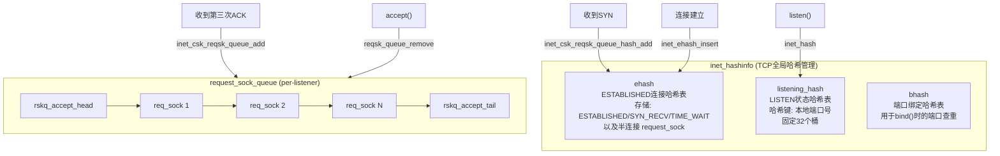

**1、`inet_hashinfo`**：TCP全局哈希表管理结构，在内核启动时（`tcp_init`）分配，全局只有一个实例`tcp_hashinfo`

```c
//https://elixir.bootlin.com/linux/v4.11.6/source/include/net/inet_hashtables.h#L120
struct inet_hashinfo {
	// ehash：存储所有具有完整四元组的sock（含半连接request_sock）
	// 状态范围：TCP_ESTABLISHED <= sk_state < TCP_CLOSE
	struct inet_ehash_bucket	*ehash;         // 哈希桶数组
	spinlock_t			*ehash_locks;           // 分段锁数组（减少锁竞争）
	unsigned int			ehash_mask;         // 哈希掩码（桶数-1，用于取模）
	unsigned int			ehash_locks_mask;   // 锁数组掩码

	// bhash：端口绑定哈希表，bind()时检查端口是否冲突
	struct inet_bind_hashbucket	*bhash;
	unsigned int			bhash_size;

	struct kmem_cache		*bind_bucket_cachep;

	// listening_hash：存储所有TCP_LISTEN状态的sock
	// 哈希键仅为本地端口号，固定大小 INET_LHTABLE_SIZE=32
	// 放在独立cacheline，因为写入频率较高
	struct inet_listen_hashbucket	listening_hash[INET_LHTABLE_SIZE]
					____cacheline_aligned_in_smp;
};
```

**2、`inet_listen_hashbucket`**：listen哈希表的桶结构，每个桶用自旋锁保护，链表串联同一端口的listen sock

```c
//https://elixir.bootlin.com/linux/v4.11.6/source/include/net/inet_hashtables.h#L112
struct inet_listen_hashbucket {
	spinlock_t		lock;       // 保护本桶的自旋锁
	struct hlist_head	head;   // 链表头，串联listen sock
};
```

**3、`inet_ehash_bucket`**：ehash的桶结构。使用`hlist_nulls_head`（末尾带`NULL`标记的哈希链表），支持RCU无锁读取。4.11.6中半连接（`TCP_NEW_SYN_RECV`状态的`request_sock`）与`ESTABLISHED`等状态的sock共用此表

```c
//https://elixir.bootlin.com/linux/v4.11.6/source/include/net/inet_hashtables.h#L42
struct inet_ehash_bucket {
	struct hlist_nulls_head chain;  // nulls哈希链表头
};
```

**4、全连接队列结构 `request_sock_queue`**（注意：**每个listen sock一个**），通过单链表管理已完成三次握手的连接：

位于`struct inet_connection_sock`结构（icsk）定义的成员，表示面向连接的高级抽象

```c
//https://elixir.bootlin.com/linux/v4.11.6/source/include/net/request_sock.h#L161
struct request_sock_queue {
	spinlock_t		rskq_lock;          // 保护队列的自旋锁
	u8			rskq_defer_accept;      // TCP_DEFER_ACCEPT选项
	u32			synflood_warned;        // SYN洪水告警标记

	atomic_t		qlen;               // 半连接计数（pending状态）
	atomic_t		young;              // 未重传过SYN+ACK的半连接数

	struct request_sock	*rskq_accept_head;  // 全连接队列头指针
	struct request_sock	*rskq_accept_tail;  // 全连接队列尾指针
	struct fastopen_queue	fastopenq;      // TCP Fast Open队列
};
```

####	ehash 的初始化与参数因子

ehash在内核启动时由[`tcp_init`](https://elixir.bootlin.com/linux/v4.11.6/source/net/ipv4/tcp.c#L3378)分配，大小受系统内存和`thash_entries`启动参数影响：

```c
//https://elixir.bootlin.com/linux/v4.11.6/source/net/ipv4/tcp.c#L3378
void __init tcp_init(void)
{
	// 分配ehash，大小取决于系统内存
	// thash_entries可通过内核启动参数指定
	// 每128KB内存对应一个slot（第4个参数17表示2^17=128K）
	tcp_hashinfo.ehash =
		alloc_large_system_hash("TCP established",
					sizeof(struct inet_ehash_bucket),
					thash_entries,
					17, /* one slot per 128 KB of memory */
					0,
					NULL,
					&tcp_hashinfo.ehash_mask,  // 输出：桶数-1
					0,
					thash_entries ? 0 : 512 * 1024);
	// 初始化每个桶的链表头
	for (i = 0; i <= tcp_hashinfo.ehash_mask; i++)
		INIT_HLIST_NULLS_HEAD(&tcp_hashinfo.ehash[i].chain, i);

	// 分配分段锁（锁数量远小于桶数量，多个桶共享一把锁）
	if (inet_ehash_locks_alloc(&tcp_hashinfo))
		panic("TCP: failed to alloc ehash_locks");
	// ...
}
```

关键参数因子：
-	`ehash_mask`：值为桶数量减`1`，用于哈希取模（`hash & ehash_mask`），桶数量总是`2`的幂次
-	`ehash_locks`：分段锁数组，锁数量通常远小于桶数量（如`1024`把锁对应`65536`个桶），多个相邻桶共享一把锁以减少内存开销，同时降低锁竞争
-	`thash_entries`内核启动参数：可在`/proc/cmdline`中设置`thash_entries=N`覆盖默认的ehash大小，适用于高并发场景需要更大哈希表的情况

####	ehash 的核心操作函数：inet_ehash_insert

[`inet_ehash_insert`](https://elixir.bootlin.com/linux/v4.11.6/source/net/ipv4/inet_hashtables.c#L386)负责将sock插入ehash，同时检测是否已有相同四元组的连接（防止重复）：

```c
//https://elixir.bootlin.com/linux/v4.11.6/source/net/ipv4/inet_hashtables.c#L386
bool inet_ehash_insert(struct sock *sk, struct sock *osk)
{
	struct inet_hashinfo *hashinfo = sk->sk_prot->h.hashinfo;
	struct hlist_nulls_head *list;
	struct inet_ehash_bucket *head;
	spinlock_t *lock;
	bool ret = true;

	// 根据四元组计算哈希值，定位桶和对应的锁
	head = inet_ehash_bucket(hashinfo, sk->sk_hash);
	list = &head->chain;
	lock = inet_ehash_lockp(hashinfo, sk->sk_hash);

	spin_lock(lock);
	if (osk) {
		// 替换旧sock（如TIME_WAIT回收场景）
		WARN_ON_ONCE(sk->sk_hash != osk->sk_hash);
		ret = sk_nulls_del_node_init_rcu(osk);
	}
	if (ret)
		__sk_nulls_add_node_rcu(sk, list);  // RCU方式插入链表头
	spin_unlock(lock);
	return ret;
}
```

####	队列操作函数与触发时机

| 操作 | 函数 | 触发时机 | 目标结构 |
|------|------|---------|---------|
| listen sock入表 | `inet_hash()` -> `__inet_hash()` | `listen()`系统调用 | `listening_hash` |
| 半连接入表 | `inet_csk_reqsk_queue_hash_add()` | 收到SYN，创建`request_sock`后 | `ehash` |
| 查找已建立连接 | `__inet_lookup_established()` | `tcp_v4_rcv`收包时 | `ehash` |
| 查找listen sock | `__inet_lookup_listener()` | `tcp_v4_rcv`收包，ehash未命中时 | `listening_hash` |
| 加入全连接队列 | `inet_csk_reqsk_queue_add()` | 第三次ACK处理，创建child sock后 | `accept_queue` |
| 从全连接出队 | `reqsk_queue_remove()` | `accept()`系统调用 | `accept_queue` |
| ESTABLISHED入表 | `inet_ehash_insert()` | child sock进入ESTABLISHED | `ehash` |
| 从ehash删除 | `inet_unhash()` | 连接关闭（`tcp_done`） | `ehash` |

####	inetsw_array

```cpp
static struct inet_protosw inetsw_array[] =
{
  {		//TCP 协议
    .type =       SOCK_STREAM,
    .protocol =   IPPROTO_TCP,
    .prot =       &tcp_prot,	//重要
    .ops =        &inet_stream_ops,
    .flags =      INET_PROTOSW_PERMANENT |
            INET_PROTOSW_ICSK,
  },
  {		//UDP 协议
    .type =       SOCK_DGRAM,
    .protocol =   IPPROTO_UDP,
    .prot =       &udp_prot,
    .ops =        &inet_dgram_ops,
    .flags =      INET_PROTOSW_PERMANENT,
  },
  {	 // ICMP 协议
    .type =       SOCK_DGRAM,
    .protocol =   IPPROTO_ICMP,
    .prot =       &ping_prot,
    .ops =        &inet_sockraw_ops,
    .flags =      INET_PROTOSW_REUSE,
  },
	//....
}
```

其中`tcp_prot` 的定义如下（sock 之下内核协议栈的动作）

```cpp
struct proto tcp_prot = {
  .name      = "TCP",
  .owner      = THIS_MODULE,
  .close      = tcp_close,
  .connect    = tcp_v4_connect,
  .disconnect    = tcp_disconnect,
  .accept      = inet_csk_accept,
  .ioctl      = tcp_ioctl,
  .init      = tcp_v4_init_sock,
  .destroy    = tcp_v4_destroy_sock,
  .shutdown    = tcp_shutdown,
  .setsockopt    = tcp_setsockopt,
  .getsockopt    = tcp_getsockopt,
  .keepalive    = tcp_set_keepalive,
  .recvmsg    = tcp_recvmsg,
  .sendmsg    = tcp_sendmsg,
  .sendpage    = tcp_sendpage,
  .backlog_rcv    = tcp_v4_do_rcv,
  .release_cb    = tcp_release_cb,
  .hash      = inet_hash,
  .get_port    = inet_csk_get_port,
  ......
}
```

####	struct tcphdr：tcp header

TODO

```c
//https://elixir.bootlin.com/linux/v4.11.6/source/include/uapi/linux/tcp.h#L24
struct tcphdr {
	__be16	source;
	__be16	dest;
	__be32	seq;
	__be32	ack_seq;
#if defined(__LITTLE_ENDIAN_BITFIELD)
	__u16	res1:4,
		doff:4,
		fin:1,
		syn:1,
		rst:1,
		psh:1,
		ack:1,
		urg:1,
		ece:1,
		cwr:1;
#elif defined(__BIG_ENDIAN_BITFIELD)
	__u16	doff:4,
		res1:4,
		cwr:1,
		ece:1,
		urg:1,
		ack:1,
		psh:1,
		rst:1,
		syn:1,
		fin:1;
#else
#error	"Adjust your <asm/byteorder.h> defines"
#endif	
	__be16	window;
	__sum16	check;
	__be16	urg_ptr;
};
```

####	bind hashtable

todo

##	0x02	server：socket实现
当调用`socket`[函数](https://elixir.bootlin.com/linux/v4.11.6/source/net/socket.c#L1258)创建`struct socket`结构时，在用户层视角只看到返回了一个文件描述符 fd，内核做了哪些事情？

```cpp
int socket(int domain, int type, int protocol);
```

####	socket调用的细节
创建 socket的过程如下，由于socket也是文件，所以需要关联到VFS即sockfs文件系统，参考[前文](https://pandaychen.github.io/2024/11/20/A-LINUX-KERNEL-TRAVEL-3/#sock_fs文件系统)

1.  文件部分（VFS）
2.  网络部分
3.  建立进程`task_struct`与打开文件描述符之间、VFS核心结构之间的关联关系

```text
#------------------- 用户态 ---------------------------
socket
#------------------- 内核态 ---------------------------
__x64_sys_socket # 内核系统调用
__sys_socket 
    |-- sock_create 
        |-- __sock_create 
#------------------- VFS ---------------------------
            |-- sock_alloc 
                |-- new_inode_pseudo 
                    |-- alloc_inode 
                        |-- sock_alloc_inode 
                            |-- kmem_cache_alloc
#------------------- 网络部分 ---------------------------
            |-- inet_create # pf->create 
                |-- sk_alloc 
                    |-- sk_prot_alloc 
                        |-- kmem_cache_alloc
                |-- inet_sk
                |-- sock_init_data
                    |-- sk_init_common 
                    |-- timer_setup
                |-- sk->sk_prot->init(sk) # tcp_v4_init_sock 
                    |-- tcp_init_sock
#------------------- 进程/VFS关系 ------------------------
    |-- sock_map_fd # net/socket.c
        |-- get_unused_fd_flags 
        |-- sock_alloc_file 
            |-- alloc_file_pseudo 
        |-- fd_install
            |-- __fd_install 
                |-- fdt = rcu_dereference_sched(files->fdt)
                |-- rcu_assign_pointer(fdt->fd[fd], file)
```

流程图如下：

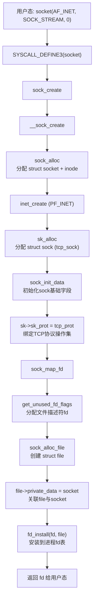

<!--TODO: socket-api-flow 图待补充-->

```cpp
//https://elixir.bootlin.com/linux/v4.11.6/source/net/ipv4/af_inet.c#L1014
static const struct net_proto_family inet_family_ops = {
	.family = PF_INET,
	.create = inet_create,
	.owner	= THIS_MODULE,
};

SYSCALL_DEFINE3(socket, int, family, int, type, int, protocol)
{
	int retval;
	struct socket *sock;
	int flags;

	//...

	// 对AF_INET，这里的sock_create对应的是inet_create
	retval = sock_create(family, type, protocol, &sock);
	if (retval < 0)
		goto out;

	retval = sock_map_fd(sock, flags & (O_CLOEXEC | O_NONBLOCK));
	if (retval < 0)
		goto out_release;

	//...
}
```
`socket`主要完成：

-	调用`sock_create->__sock_create`，新建一个`struct socket`及相关内容
-	调用`sock_map_fd`，新建一个`struct file` 并将`file`的`private_data`初始化为上一步创建的`struct socket`，这样对文件的操作可以调用`socket`结构体定义的方法，并关联`fd`和`file`

`__socket_create`函数主要工作如下：

-	调用`sock_alloc` 分配一个`struct socket`结构体和`inode`，并且标明`inode`是`socket`类型，这样对`inode`的操作最终可以调用`socket`的相关操作
-	根据输入参数，查找`net_families`数组（该数组通过`inet_init`创建），获得域特定的`socket`创建函数
-	调用实际`create`函数新建，如`inet_create`

```cpp
//sock_alloc
struct socket *sock_alloc(void)
{
	struct inode *inode;
	struct socket *sock;

    /*创建inode和socket*/
	inode = new_inode_pseudo(sock_mnt->mnt_sb);
	if (!inode)
		return NULL;

    /*返回创建的socket指针*/
	sock = SOCKET_I(inode);

    /*inode相关初始化*/
	inode->i_ino = get_next_ino();
	inode->i_mode = S_IFSOCK | S_IRWXUGO;
	inode->i_uid = current_fsuid();
	inode->i_gid = current_fsgid();
	inode->i_op = &sockfs_inode_ops;

	return sock;
}
EXPORT_SYMBOL(sock_alloc);

int __sock_create(struct net *net, int family, int type, int protocol,
			 struct socket **res, int kern)
{
	int err;
	struct socket *sock;
	const struct net_proto_family *pf;

	//...
	sock = sock_alloc();	/*创建struct socket结构体*/
	//...
	sock->type = type;	/*设置套接字类型*/

	rcu_read_lock();
	pf = rcu_dereference(net_families[family]);	/*获取对应协议族的协议实例对象*/
	err = -EAFNOSUPPORT;
	if (!pf)
		goto out_release;

	//...
	err = pf->create(net, sock, protocol, kern);
	if (err < 0)
		goto out_module_put;
	//...
}
EXPORT_SYMBOL(__sock_create);
```

对于`__sock_create`中的`pf->create`函数，其中`pf`由`net_families[]`数组获得，`net_families[]`数组里存放了各个协议族的信息，以`family`字段作为下标。`net_families[]`数组定义及初始化代码如下：

```cpp
static DEFINE_SPINLOCK(net_family_lock);
static const struct net_proto_family __rcu *net_families[NPROTO] __read_mostly;

static const struct net_proto_family inet_family_ops = {
    .family = PF_INET,
    .create = inet_create,
    .owner  = THIS_MODULE,
};

//net_families[]数组的初始化在inet_init函数
static int __init inet_init(void)
{
...
    (void)sock_register(&inet_family_ops);
...
}

//注册
int sock_register(const struct net_proto_family *ops)
{
...
    rcu_assign_pointer(net_families[ops->family], ops);
...
}
```

TCP协议对应的`family`字段是`AF_INET`，`pf->create`对应的函数即为`inet_create`，此外，在 `sk_alloc` 函数中，`struct inet_protosw *answer` 结构的 `tcp_prot` 赋值给了 `struct sock *sk` 的 `sk_prot` 成员（后续看到`sock`结构关联的`sk_prot`调用，即参考`tcp_prot`结构的函数搜索即可）。核心逻辑如下：

```cpp
static int inet_create(struct net *net, struct socket *sock, int protocol,
		       int kern)
{
	struct sock *sk;

	//socket 状态设置
	sock->state = SS_UNCONNECTED;

	/* Look for the requested type/protocol pair. */
	//查找全局数组inetsw（在inet_init函数中初始化）中对应的协议操作集合，最重要的是struct proto和struct proto_ops，分别用于处理四层和socket相关的内容
lookup_protocol:
	err = -ESOCKTNOSUPPORT;
	rcu_read_lock();
	list_for_each_entry_rcu(answer, &inetsw[sock->type], list) {
		err = 0;
		/* Check the non-wild match. */
		if (protocol == answer->protocol) {
			if (protocol != IPPROTO_IP)
				break;
		} else {
			/* Check for the two wild cases. */
			if (IPPROTO_IP == protocol) {
				protocol = answer->protocol;
				break;
			}
			if (IPPROTO_IP == answer->protocol)
				break;
		}
		err = -EPROTONOSUPPORT;
	}

	//调用sk_alloc()，分配一个struct sock，并将proto类型的指针指向第二步获得的内容
	sk = sk_alloc(net, PF_INET, GFP_KERNEL, answer_prot, kern);
	if (!sk)
		goto out;

	err = 0;
	if (INET_PROTOSW_REUSE & answer_flags)
		sk->sk_reuse = SK_CAN_REUSE;
	
	//初始化inet_sock，调用sock_init_data，形成socket和sock一一对应的关系，相互有指针指向对方
	inet = inet_sk(sk);
	sock_init_data(sock, sk);

	sk->sk_destruct	   = inet_sock_destruct;
	sk->sk_protocol	   = protocol;
	sk->sk_backlog_rcv = sk->sk_prot->backlog_rcv;

	inet->uc_ttl	= -1;
	inet->mc_loop	= 1;
	inet->mc_ttl	= 1;
	inet->mc_all	= 1;
	inet->mc_index	= 0;
	inet->mc_list	= NULL;
	inet->rcv_tos	= 0;

	//...

	//最后调用proto中注册的init函数，err = sk->sk_prot->init(sk)，如果对应于TCP，其函数指针指向tcp_v4_init_sock
	if (sk->sk_prot->init) {
		err = sk->sk_prot->init(sk);
		if (err) {
			sk_common_release(sk);
			goto out;
		}
	}
	//...
}
```

`socket`函数最后的逻辑是调用`sock_map_fd`函数负责分配文件，并与`struct socket`进行绑定，主要做两件事：

```cpp
static int sock_map_fd(struct socket *sock, int flags)
{
	struct file *newfile;
    //分配文件描述符
	int fd = get_unused_fd_flags(flags);
	if (unlikely(fd < 0)) {
		sock_release(sock);
		return fd;
	}

	//调用sock_alloc_file，分配一个struct file，并将私有数据指针指向socket结构
	newfile = sock_alloc_file(sock, flags, NULL);
	if (likely(!IS_ERR(newfile))) {
		//关联文件描述符fd和file
		fd_install(fd, newfile);
		return fd;
	}

	put_unused_fd(fd);
	return PTR_ERR(newfile);
}

//https://elixir.bootlin.com/linux/v4.11.6/source/net/socket.c#L395
struct file *sock_alloc_file(struct socket *sock, int flags, const char *dname)
{
	// ......
	path.dentry = d_alloc_pseudo(sock_mnt->mnt_sb, &name);
	if (unlikely(!path.dentry))
		return ERR_PTR(-ENOMEM);
	path.mnt = mntget(sock_mnt);

	d_instantiate(path.dentry, SOCK_INODE(sock));

	file = alloc_file(&path, FMODE_READ | FMODE_WRITE,
		  &socket_file_ops);
	if (IS_ERR(file)) {
		/* drop dentry, keep inode */
		ihold(d_inode(path.dentry));
		path_put(&path);
		return file;
	}

	sock->file = file;
	file->f_flags = O_RDWR | (flags & O_NONBLOCK);
	file->private_data = sock;      //file的private成员设置为 struct socket 
	return file;
}
```

注意到上面`sock_alloc_file`函数的最后，会把`file->private_data`设置为`struct socket*`变量，由于socket也是文件，所以基于VFS的这套框架，各个成员有如下关系：

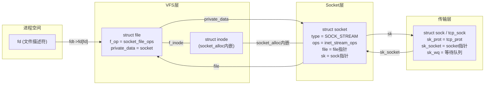

<!--TODO: socket-relation 图待补充-->


这里多说一句，内核在`accept`[函数](https://elixir.bootlin.com/linux/v4.11.6/source/net/socket.c#L1489)中也会创建`struct socket`结构，这两个具体的执行流程是不同的

最后，小结下创建socket结构时，内核会：
-	创建接收队列`sk_receive_queue`，用于接收软中断softirq时存储对应的数据包
-	等待队列`sk_wq`，当连接完成后，如果当前没有数据到来，那么当前进程会阻塞，并且状态从运行态切换至阻塞（主动让出CPU），并且当前进程关联的socket存储在该队列中，等到有数据到来的时候，内核再通过该队列中获取对应的进程将其唤醒
-	软中断处理函数`sk_data_ready`，会直接将软中断的回调函数注册好，当数据到来的时候，调用该方法来处理
-	协议族函数`proto_ops`，内核会将一系列内核协议栈相关的处理函数提前注册好，比如针对`AF_INET`注册的是`inet_create`
-	初始化`struct sock`结构内部的相关队列信息

##	0x03	server：listen实现
`listen`系统调用的功能如下：

-   将 socket 设置为监听 socket，作为服务端被动等待客户端连接
-   backlog 限制全连接队列的大小及半连接个数

```cpp
/* backlog：全连接队列和半连接队列限制大小
 * return：正确返回 0，否则返回 -1
 */
int listen(int sockfd, int backlog);
```

`listen`[系统调用](https://elixir.bootlin.com/linux/v4.11.6/source/net/ipv4/af_inet.c#L194)的主要作用就是**申请和初始化接收队列，包括全连接队列（链表）和半连接队列（hash表）**，如图

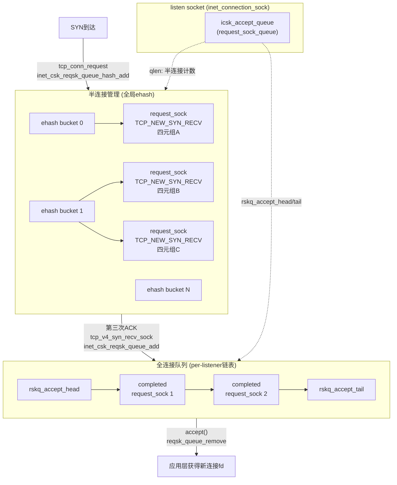

<!--TODO: listen 队列结构图待补充-->

从`listen`系统调用出发：

```cpp
//https://elixir.bootlin.com/linux/v4.11.6/source/net/socket.c#L1437
SYSCALL_DEFINE2(listen, int, fd, int, backlog)
{
	......
	//根据 fd 查找 socket 内核对象
	sock = sockfd_lookup_light(fd, &err, &fput_needed);
	if (sock) {
        //获取内核参数 net.core.somaxconn
        somaxconn = sock_net(sock->sk)->core.sysctl_somaxconn;
        // 配置检查，校准backlog 配置默认最大值
        if ((unsigned int)backlog > somaxconn)
            backlog = somaxconn;
        
        //调用协议栈注册的 listen 函数：inet_listen
        err = sock->ops->listen(sock, backlog);
        //...
    }
    ......
}
```

`sock->ops->listen` 调用的是 `inet_listen`函数：

```cpp
int inet_listen(struct socket *sock, int backlog) {
    struct sock *sk = sock->sk;
    unsigned char old_state;
    int err, tcp_fastopen;

    lock_sock(sk);

    err = -EINVAL;
    // 只有 tcp 才允许 listen，作为服务端的 socket，不能主动连接其它服务
    if (sock->state != SS_UNCONNECTED || sock->type != SOCK_STREAM)
        goto out;

    // 状态检查：只有处于 TCP_CLOSE 或者 TCP_LISTEN 状态的 socket 才能调用 listen
    old_state = sk->sk_state;
    if (!((1 << old_state) & (TCPF_CLOSE | TCPF_LISTEN)))
        goto out;

    //设置全连接队列长度
    sk->sk_max_ack_backlog = backlog;

    // listen 可以重复调用，重复调用 listen 可修改 backlog
    // 还不是 listen 状态（尚未 listen 过）
    if (old_state != TCP_LISTEN) {
        ......
        // 开始监听：listen 核心逻辑（下）
        err = inet_csk_listen_start(sk, backlog);
    }
    ......
}
```

继续贴下`inet_csk_listen_start`的[实现](https://elixir.bootlin.com/linux/v4.11.6/source/net/ipv4/inet_connection_sock.c#L864)：

```cpp
int inet_csk_listen_start(struct sock *sk, int backlog) {
    // 参考基础知识：根据sock结构拿到inet_connection_sock结构的指针
    struct inet_connection_sock *icsk = inet_csk(sk);
    struct inet_sock *inet = inet_sk(sk);
    int err = -EADDRINUSE;

    reqsk_queue_alloc(&icsk->icsk_accept_queue);

    sk->sk_ack_backlog = 0;
    inet_csk_delack_init(sk);

    // 经过验证后，设置 socket 的状态为 TCP_LISTEN
    inet_sk_state_store(sk, TCP_LISTEN);

    // 疑惑：重新验证端口，虽然在这之前 bind 绑定了端口，但是 bind 和 listen 这是两个独立的操作
    // 这两个操作之间时间段，整个系统，可能执行了一些影响端口的操作
    // 所以 listen 要重新验证一下端口是否已经成功绑定了
    if (!sk->sk_prot->get_port(sk, inet->inet_num)) {
        inet->inet_sport = htons(inet->inet_num);

        sk_dst_reset(sk);
        // 关联注册的函数：inet_hash，用于初始化全连接表等
        err = sk->sk_prot->hash(sk);
        ......
    }
    ......
}

int inet_hash(struct sock *sk) {
    int err = 0;

    if (sk->sk_state != TCP_CLOSE) {
        local_bh_disable();
        //  hash 保存 sk 值
        err = __inet_hash(sk, NULL);
        local_bh_enable();
    }

    return err;
}
```

####   listen中hashtable的逻辑
在开始之前，先梳理下这里用到的若干关键数据结构：

-	`inet_hashinfo`：TCP全局哈希表管理结构，包含`ehash`（ESTABLISHED连接哈希表）、`listening_hash`（LISTEN状态哈希表）和`bhash`（端口绑定哈希表）
-	`inet_listen_hashbucket`：listen哈希表的桶结构，每个桶用自旋锁保护
-	`inet_ehash_bucket`：ehash的桶结构，存储所有非LISTEN状态的sock，包括半连接（`TCP_NEW_SYN_RECV`）

在4.11.6内核中，listen socket通过`inet_hash`函数加入`listening_hash`表，而半连接对象（`request_sock`）在创建后通过`inet_ehash_insert`加入全局`ehash`表，与`ESTABLISHED`状态的sock共用同一哈希表

下面结合内核源码详细分析listen中各个hashtable操作的实现细节

**（1）`reqsk_queue_alloc`**：在4.11.6内核中仅初始化全连接队列的锁和计数器，不再为半连接预分配独立哈希表（半连接直接使用全局ehash）

```c
//https://elixir.bootlin.com/linux/v4.11.6/source/net/core/request_sock.c#L28
void reqsk_queue_alloc(struct request_sock_queue *queue)
{
	spin_lock_init(&queue->rskq_lock);
	queue->rskq_accept_head = NULL;   // 全连接队列为空
	// 注意：不再有 listen_opt 的分配（2.6内核有独立半连接哈希表）
}
```

**（2）`inet_hash` / `__inet_hash`**：将listen sock插入`listening_hash`表

```c
//https://elixir.bootlin.com/linux/v4.11.6/source/net/ipv4/inet_hashtables.c#L468
int __inet_hash(struct sock *sk, struct sock *osk)
{
	struct inet_hashinfo *hashinfo = sk->sk_prot->h.hashinfo;
	struct inet_listen_hashbucket *ilb;
	int err = 0;

	if (sk->sk_state != TCP_LISTEN) {
		// 非LISTEN状态，插入ehash
		inet_ehash_nolisten(sk, osk);
		return 0;
	}

	// LISTEN状态：插入listening_hash
	// 哈希键仅为本地端口号
	ilb = &hashinfo->listening_hash[inet_sk_listen_hashfn(sk)];
	spin_lock(&ilb->lock);
	// 检查是否有SO_REUSEPORT冲突
	if (sk->sk_reuseport) {
		err = inet_reuseport_add_sock(sk, ilb, false);
		if (err)
			goto unlock;
	}
	__sk_nulls_add_node_rcu(sk, &ilb->head);  // RCU插入链表
	sock_prot_inuse_add(sock_net(sk), sk->sk_prot, 1);
unlock:
	spin_unlock(&ilb->lock);
	return err;
}
```

**（3）`inet_csk_reqsk_queue_hash_add`**：收到SYN后，将半连接`request_sock`加入ehash并启动SYN+ACK重传定时器

```c
//https://elixir.bootlin.com/linux/v4.11.6/source/net/ipv4/inet_connection_sock.c#L834
void inet_csk_reqsk_queue_hash_add(struct sock *sk, struct request_sock *req,
				   unsigned long timeout)
{
	reqsk_queue_hash_req(req, timeout);  // 设置定时器
	inet_csk_reqsk_queue_added(sk);      // 更新半连接计数 qlen++
}

// 定时器设置与ehash插入
static void reqsk_queue_hash_req(struct request_sock *req,
				 unsigned long timeout)
{
	// 启动SYN+ACK重传定时器，超时时间为TCP_TIMEOUT_INIT（1秒）
	req->num_retrans = 0;
	req->num_timeout = 0;
	req->sk = NULL;
	setup_pinned_timer(&req->rsk_timer, reqsk_timer_handler,
			   (unsigned long)req);
	mod_timer(&req->rsk_timer, jiffies + timeout);

	// 将request_sock插入全局ehash（四元组哈希）
	inet_ehash_insert(req_to_sk(req), NULL);
	// req_to_sk()将request_sock转为sock指针
	// 此sock的sk_state为TCP_NEW_SYN_RECV
}
```

[`inet_csk_listen_start`](https://elixir.bootlin.com/linux/v4.11.6/source/net/ipv4/inet_connection_sock.c#L864)，其中`icsk->icsk_accept_queue` 定义在 `inet_connection_sock`（类型为`request_sock_queue`），是内核用来接收客户端请求的主要数据结构，其中包含了重要的全连接队列`request_sock`结构成员`rskq_accept_head`和`rskq_accept_tail`，这里**注意对于全连接队列来说，在它上面不需要进行复杂的查找工作，accept 的时候只是先进先出处理就好了，因此全连接队列通过 `rskq_accept_head` 和 `rskq_accept_tail` 以链表的形式来管理**，而半连接队列由于需要快速的查找，所以使用hash表来实现

```cpp
//https://elixir.bootlin.com/linux/v4.11.6/source/include/net/request_sock.h#L161
struct request_sock_queue {
	spinlock_t		rskq_lock;
	u8			rskq_defer_accept;

	atomic_t		qlen;
	atomic_t		young;
 	//全连接队列
	struct request_sock	*rskq_accept_head;
	struct request_sock	*rskq_accept_tail;
	//...
};

int inet_csk_listen_start(struct sock *sk, int backlog)
{
	//将 struct sock 对象强制转换成了 inet_connection_sock
	struct inet_connection_sock *icsk = inet_csk(sk);
	struct inet_sock *inet = inet_sk(sk);
	int err = -EADDRINUSE;

	reqsk_queue_alloc(&icsk->icsk_accept_queue);

	sk->sk_max_ack_backlog = backlog;
	sk->sk_ack_backlog = 0;
	inet_csk_delack_init(sk);

	/* There is race window here: we announce ourselves listening,
	 * but this transition is still not validated by get_port().
	 * It is OK, because this socket enters to hash table only
	 * after validation is complete.
	 */
	sk_state_store(sk, TCP_LISTEN);
	if (!sk->sk_prot->get_port(sk, inet->inet_num)) {
		inet->inet_sport = htons(inet->inet_num);

		sk_dst_reset(sk);
		err = sk->sk_prot->hash(sk);

		if (likely(!err))
			return 0;
	}

	sk->sk_state = TCP_CLOSE;
	return err;
}
EXPORT_SYMBOL_GPL(inet_csk_listen_start);
```

在`4.11.6`内核的`reqsk_queue_alloc`并未发现半连接hash表初始化的代码，事实上该版本的实现已经不同于`2.6`了，主要区别是：
-	全局整合：移除独立哈希表，半连接请求（`struct request_sock`）直接插入全局连接哈希表 `ehash`，与其他状态的 socket 共用同一hash表
-	无预分配：`reqsk_queue_alloc` 仅初始化锁和全连接队列头，半连接队列无独立内存预分配

####	ehash的初始化
全局 ehash（Established Hash）是 Linux 内核中用于管理所有非 LISTEN 状态的 TCP 连接的核心哈希表（包括 `SYN_RECV`、`ESTABLISHED`、`TIME_WAIT` 等），其初始化发生在内核启动阶段，位于[`tcp_init`](https://elixir.bootlin.com/linux/v4.11.6/source/net/ipv4/tcp.c#L3378)

```cpp
void __init tcp_init(void)
{
	//...
	tcp_hashinfo.ehash =
		alloc_large_system_hash("TCP established",
					sizeof(struct inet_ehash_bucket),
					thash_entries,
					17, /* one slot per 128 KB of memory */
					0,
					NULL,
					&tcp_hashinfo.ehash_mask,
					0,
					thash_entries ? 0 : 512 * 1024);
	for (i = 0; i <= tcp_hashinfo.ehash_mask; i++)
		INIT_HLIST_NULLS_HEAD(&tcp_hashinfo.ehash[i].chain, i);

	if (inet_ehash_locks_alloc(&tcp_hashinfo))
		panic("TCP: failed to alloc ehash_locks");

	//...
}
```

##	0x04	client：connect实现（发起三次握手）
客户端通过 `connect` 发起连接请求（发送SYN包），`connect`系统调用及涉及到的接口实例化的代码如下：

```cpp
/* sockfd: socket 函数返回的套接字描述符
 * servaddr: 要连接的目标服务地址（IP/PORT）
 * addrlen: 地址长度
 * return: 正确返回 0，否则返回 -1
 */
int connect(int sockfd, const struct sockaddr *servaddr, socklen_t addrlen);

/* net/ipv4/tcp_ipv4.c */
struct proto tcp_prot = {
    ......
    .connect = tcp_v4_connect,
    ......
};

/* net/ipv4/af_inet.c */
const struct proto_ops inet_stream_ops = {
    .family  = PF_INET,
    ......
    .connect = inet_stream_connect,
    ......
};
```

####	connect 的调用链

```text
#------------------- 用户态 ---------------------------
connect(fd, addr, addrlen)
#------------------- 内核态 ---------------------------
SYSCALL_DEFINE3(connect, ...)
    |-- sockfd_lookup_light(fd)         # 通过fd查找socket结构
    |-- sock->ops->connect()            # inet_stream_connect
        |-- __inet_stream_connect()
            |-- sk->sk_prot->connect()  # tcp_v4_connect
                |-- ip_route_connect()  # 路由查找
                |-- inet_hash_connect() # 分配本地端口
                |-- tcp_set_state(sk, TCP_SYN_SENT)
                |-- tcp_connect(sk)     # 构造并发送SYN包
                    |-- tcp_connect_init()
                    |-- tcp_transmit_skb()
                    |-- inet_csk_reset_xmit_timer()  # 启动重传定时器
            |-- inet_wait_for_connect() # 阻塞等待连接完成
```

####	inet_stream_connect

`inet_stream_connect`是`connect`系统调用在TCP协议中的socket层入口，核心工作是调用协议层的connect函数并处理阻塞等待：

```cpp
//https://elixir.bootlin.com/linux/v4.11.6/source/net/ipv4/af_inet.c#L567
int __inet_stream_connect(struct socket *sock, struct sockaddr *uaddr,
			  int addr_len, int flags)
{
	struct sock *sk = sock->sk;
	int err;
	long timeo;

	switch (sock->state) {
	default:
		err = -EINVAL;
		goto out;
	case SS_CONNECTED:
		err = -EISCONN;
		goto out;
	case SS_CONNECTING:
		break;
	case SS_UNCONNECTED:
		err = -EISCONN;
		if (sk->sk_state != TCP_CLOSE)
			goto out;
		// 调用协议层 connect：tcp_v4_connect
		err = sk->sk_prot->connect(sk, uaddr, addr_len);
		if (err < 0)
			goto out;
		// socket 层状态设置为 SS_CONNECTING
		sock->state = SS_CONNECTING;
		err = -EINPROGRESS;
		break;
	}

	timeo = sock_sndtimeo(sk, flags & O_NONBLOCK);

	if ((1 << sk->sk_state) & (TCPF_SYN_SENT | TCPF_SYN_RECV)) {
		// 非阻塞模式直接返回 -EINPROGRESS（高性能编程）

		// 非阻塞模式下需要等待握手结束才返回（低性能）
		if (!timeo || !inet_wait_for_connect(sk, timeo, true))
			goto out;
		err = sock_intr_errno(timeo);
		if (signal_pending(current))
			goto out;
	}

	if (sk->sk_state == TCP_CLOSE)
		goto sock_error;

	sock->state = SS_CONNECTED;
	err = 0;
out:
	return err;
	......
}
```

####	tcp_v4_connect 核心实现
继续，[`tcp_v4_connect`](https://elixir.bootlin.com/linux/v4.11.6/source/net/ipv4/tcp_ipv4.c#L152) 是TCP协议connect的核心函数，负责设置目标地址、查找路由、分配本地端口、设置状态并触发SYN包发送

```cpp
//https://elixir.bootlin.com/linux/v4.11.6/source/net/ipv4/tcp_ipv4.c#L152
int tcp_v4_connect(struct sock *sk, struct sockaddr *uaddr, int addr_len)
{
	struct sockaddr_in *usin = (struct sockaddr_in *)uaddr;
	struct inet_sock *inet = inet_sk(sk);
	struct tcp_sock *tp = tcp_sk(sk);
	__be16 orig_sport, orig_dport;
	__be32 daddr, nexthop;
	struct flowi4 *fl4;
	struct rtable *rt;
	int err;

	// 地址合法性检查
	if (addr_len < sizeof(struct sockaddr_in))
		return -EINVAL;
	if (usin->sin_family != AF_INET)
		return -EAFNOSUPPORT;

	// 目标地址和下一跳地址
	nexthop = daddr = usin->sin_addr.s_addr;
	inet_opt = rcu_dereference_protected(inet->inet_opt, ...);
	if (inet_opt && inet_opt->opt.srr) {
		if (!daddr)
			return -EINVAL;
		nexthop = inet_opt->opt.faddr;
	}

	orig_sport = inet->inet_sport;
	orig_dport = usin->sin_port;

	// 路由查找：确定出口设备和源IP
	fl4 = &inet->cork.fl.u.ip4;
	rt = ip_route_connect(fl4, nexthop, inet->inet_saddr,
			      RT_CONN_FLAGS(sk), sk->sk_bound_dev_if,
			      IPPROTO_TCP, orig_sport, orig_dport, sk);
	if (IS_ERR(rt)) {
		err = PTR_ERR(rt);
		goto failure;
	}

	if (!inet_opt || !inet_opt->opt.srr)
		daddr = fl4->daddr;

	// 设置源地址（如果未绑定）
	if (!inet->inet_saddr)
		inet->inet_saddr = fl4->saddr;
	sk_rcv_saddr_set(sk, inet->inet_saddr);

	// 设置目的地址和端口
	inet->inet_dport = usin->sin_port;
	sk_daddr_set(sk, daddr);

	tp->rx_opt.ts_recent = 0;
	tp->rx_opt.ts_recent_stamp = 0;

	// 设置发送窗口初始值
	if (likely(!tp->repair)) {
		if (!tp->write_seq)
			tp->write_seq = secure_tcp_sequence_number(
				inet->inet_saddr, inet->inet_daddr,
				inet->inet_sport, usin->sin_port);
		tp->tsoffset = secure_tcp_ts_off(inet->inet_saddr,
						 inet->inet_daddr);
	}

	inet->inet_id = tp->write_seq ^ jiffies;

	// 分配本地端口并加入 ehash
	err = inet_hash_connect(&tcp_death_row, sk);
	if (err)
		goto failure;

	sk_set_txhash(sk);
	rt = ip_route_newports(fl4, rt, orig_sport, orig_dport,
			       inet->inet_sport, inet->inet_dport, sk);
	if (IS_ERR(rt)) {
		err = PTR_ERR(rt);
		goto failure;
	}

	sk->sk_gso_type = SKB_GSO_TCPV4;
	sk_setup_caps(sk, &rt->dst);

	if (!tp->write_seq && likely(!tp->repair))
		tp->write_seq = secure_tcp_sequence_number(
			inet->inet_saddr, inet->inet_daddr,
			inet->inet_sport, inet->inet_dport);

	// 设置 TCP 状态为 TCP_SYN_SENT
	tcp_set_state(sk, TCP_SYN_SENT);

	// 调用 tcp_connect 构建并发送 SYN 包
	err = tcp_connect(sk);
	if (err)
		goto failure;

	rt = NULL;
	return 0;

failure:
	tcp_set_state(sk, TCP_CLOSE);
	ip_rt_put(rt);
	sk->sk_route_caps = 0;
	inet->inet_dport = 0;
	return err;
}
```

####	tcp_connect：构造并发送SYN包

[`tcp_connect`](https://elixir.bootlin.com/linux/v4.11.6/source/net/ipv4/tcp_output.c#L3392) 负责初始化TCP连接参数、构造SYN报文并发送

```cpp
//https://elixir.bootlin.com/linux/v4.11.6/source/net/ipv4/tcp_output.c#L3392
int tcp_connect(struct sock *sk)
{
	struct tcp_sock *tp = tcp_sk(sk);
	struct sk_buff *buff;
	int err;

	// 初始化连接参数：窗口大小、MSS等
	tcp_connect_init(sk);

	// 分配 SYN 包的 skb
	buff = sk_stream_alloc_skb(sk, 0, sk->sk_allocation, true);
	if (unlikely(!buff))
		return -ENOBUFS;

	// 设置 SYN 标志
	tcp_init_nondata_skb(buff, tp->write_seq++, TCPHDR_SYN);
	tp->retrans_stamp = tcp_time_stamp;

	// 将 SYN 包加入发送队列
	tcp_connect_queue_skb(sk, buff);
	tcp_ecn_send_syn(sk, buff);

	// 发送 SYN 包（通过 tcp_transmit_skb）
	err = tp->fastopen_req ? tcp_send_syn_data(sk, buff) :
	      tcp_transmit_skb(sk, buff, 1, sk->sk_allocation);
	if (err == -ECONNREFUSED)
		return err;

	tp->snd_nxt = tp->write_seq;
	tp->pushed_seq = tp->write_seq;
	TCP_INC_STATS(sock_net(sk), TCP_MIB_ACTIVEOPENS);

	// 启动重传定时器，超时时间为 TCP_TIMEOUT_INIT（1秒）
	inet_csk_reset_xmit_timer(sk, ICSK_TIME_RETRANS,
				  inet_csk(sk)->icsk_rto, TCP_RTO_MAX);
	return 0;
}
```

`tcp_connect` 执行完成后，客户端TCP状态已变为`TCP_SYN_SENT`，SYN包已发送，重传定时器已启动。如果在超时时间内未收到SYN+ACK响应，内核将触发重传

####	connect 的阻塞等待：inet_wait_for_connect

当socket为**阻塞模式**时，`connect`会通过`inet_wait_for_connect`等待连接完成（即收到SYN+ACK后状态变为`TCP_ESTABLISHED`），这同样是内核等待队列机制的典型应用：

```cpp
//https://elixir.bootlin.com/linux/v4.11.6/source/net/ipv4/af_inet.c#L540
static long inet_wait_for_connect(struct sock *sk, long timeo, bool writebias)
{
	DEFINE_WAIT_FUNC(wait, woken_wake_function);

	add_wait_queue(sk_sleep(sk), &wait);
	sk->sk_write_pending += writebias;

	while ((1 << sk->sk_state) & (TCPF_SYN_SENT | TCPF_SYN_RECV)) {
		release_sock(sk);
		timeo = wait_woken(&wait, TASK_INTERRUPTIBLE, timeo);
		lock_sock(sk);
		if (signal_pending(current) || !timeo)
			break;
	}
	remove_wait_queue(sk_sleep(sk), &wait);
	sk->sk_write_pending -= writebias;
	return timeo;
}
```

当服务端的SYN+ACK包到达时，客户端通过`tcp_rcv_synsent_state_process`将状态设置为`TCP_ESTABLISHED`，随后唤醒在等待队列上的进程

####	ebpf with connect()

在较新的内核版本（4.18+）中，内核通过`BPF_CGROUP_INET4_CONNECT` hook允许cgroup eBPF程序在`tcp_v4_connect`执行前拦截connect请求，可修改目标地址/端口（常用于透明代理、Service Mesh场景）。其调用位置在`__inet_stream_connect -> sk->sk_prot->connect`之前

```c
// 4.17+内核中的hook点（4.11.6不支持）
// net/ipv4/af_inet.c - inet_stream_connect 调用链中
BPF_CGROUP_RUN_PROG_INET4_CONNECT(sk, uaddr);
// 该hook允许eBPF程序：
// 1. 修改 uaddr 中的目标IP和端口
// 2. 返回值控制：返回0允许连接，返回非0拒绝连接
```

对于阻塞/非阻塞socket，eBPF返回值的处理方式相同：均在`connect`系统调用入口处生效，若eBPF程序返回拒绝，则`connect`直接返回`-EPERM`，不会进入`tcp_v4_connect`

##	0x05	server：接收客户端的SYN包

在服务器端，所有的 TCP 报文都经过网卡及软中断（SYN包也不例外），进入到 `tcp_v4_rcv`函数，在该函数中根据网络包（skb）TCP 头信息中的目的 IP 信息查到当前在 listen 的 socket（关联`__inet_lookup_skb`函数），然后继续进入 `tcp_v4_do_rcv` 处理握手过程，服务端收到客户端发送的 SYN 包后，将状态修改为 `TCP_NEW_SYN_RECV`，为了节省资源，并没有为 `struct sock` 分配空间，而是创建轻量级的连接请求数据结构 `struct request_sock`

当 SYN 包从网卡驱动一路上升，通过 IP 层（`ip_local_deliver_finish`）分发到 TCP 的入口函数 `tcp_v4_rcv` 后，后续调用链如下：

```
tcp_v4_rcv()                           <-- TCP 总入口，负责全局哈希表查找
  └── __inet_lookup_skb()              <-- 查找 icsk，此时匹配到处于 TCP_LISTEN 状态的套接字
  └── tcp_v4_do_rcv()                  <-- 进入接收核心 dispatch
        └── tcp_rcv_state_process()    <-- TCP 状态机引擎
              └── tcp_v4_conn_request() <-- LISTEN 状态专属的连接请求处理函数（核心主战场）
```

在服务端，当网卡收到一个pure SYN 包时，内核的处理流程为软中断层分流与轻量级资源构建的过程，即用最低的内存占用来记录这次握手请求，并以最快的速度回复 SYN-ACK（同时可以全力防范 SYN Flood 攻击）

这里涉及到几个关键点：
1.  状态机切换
2.  父子sock
3.  `tcp_v4_rcv->tcp_v4_do_rcv->tcp_rcv_established`的核心过程
4.  `tcp_v4_rcv`的参数`struct sk_buff *skb`是在哪里获取的，代表什么意义？
5.  半连接队列及操作实现

```cpp
inet_reqsk_alloc(const struct request_sock_ops * ops, struct sock * sk_listener, bool attach_listener) 
tcp_conn_request(struct request_sock_ops * rsk_ops, const struct tcp_request_sock_ops * af_ops, struct sock * sk, struct sk_buff * skb)
tcp_rcv_state_process(struct sock * sk, struct sk_buff * skb) 
tcp_v4_do_rcv(struct sock * sk, struct sk_buff * skb) 
tcp_v4_rcv(struct sk_buff * skb) 
```

####    主要过程
1、协议校验与安全防御（`tcp_v4_rcv->tcp_v4_do_rcv`）

2、连接对象创建与初始化（`tcp_rcv_state_process->tcp_v4_conn_request`）

在 `tcp_rcv_state_process` 的 `TCP_LISTEN` 分支中，主要两个步骤：
-   拒绝非法报文
-   创建连接请求对象，调用 `icsk->icsk_af_ops->conn_request`（实际为 `tcp_v4_conn_request`[函数](https://elixir.bootlin.com/linux/v4.11.6/source/net/ipv4/tcp_input.c#L6205)），此函数中`struct request_sock *req = inet_reqsk_alloc(&tcp_request_sock_ops, sk, false)`代码用来分配 `request_sock`结构，存储连接元数据（即源/目的 IP、端口、序列号），然后对序列号初始化，生成服务端初始序列号（ISN）并预测客户端序列号（用于后续 ACK 验证）

3、半连接队列管理与定时器设置（`tcp_v4_conn_request`）

4、SYN+ACK 报文构造与发送（`tcp_v4_conn_request`）

####	核心阶段：`tcp_v4_conn_request`-->`tcp_conn_request`
本阶段的核心逻辑位于`tcp_v4_conn_request()--->tcp_conn_request()` [函数](https://elixir.bootlin.com/linux/v4.11.6/source/net/ipv4/tcp_ipv4.c#L1266)，包含四个阶段：

1、第一阶段，防御性边界检查（丢弃与 Cookie 抉择），内核在真正为此连接分配内存之前，必须先执行前置检查

-	全连接队列满检查（`sk_acceptq_is_full`）：内核会检查当前监听套接字的全连接队列（Accept Queue）是否已满。若满且用户没有开启 `sysctl_tcp_abort_on_overflow`，内核会直接丢弃这个 SYN 包（此时客户端会误以为丢包而重传 SYN）
-	半连接队列满与 Syncookie 决策：内核检查半连接队列（SYN Queue）是否已满。若满但是开启了 Syncookie (`sysctl_tcp_syncookies == 1`)：内核会打上 `want_cookie = true` 的标记，继续往下走，但不会分配半连接节点；若满且没开 Syncookie，内核直接丢弃

2、第二阶段，轻量级半连接结构`request_sock`创建与选项解析，通过检查后，内核开始记录这个客户端的相关属性：

-	分配 `request_sock`：内核调用 `inet_reqsk_alloc()`。它不是真正的 sock结构体，仅仅用来记录握手阶段上下文的轻量级数据
-	解析 TCP 选项 (`tcp_parse_options`)：内核去剥离 SYN 包里的 TCP Options 头部，提取出客户端带过来的重要属性，这些属性会被暂存到 `tcp_rsk(req)`（即把 `request_sock` 强转为 `tcp_request_sock`）的控制块中。如下：
	-	MSS（最大报文段大小）
	-	Window Scale（窗口放大因子）
	-	SACK_PERM（是否支持选择性确认）
	-	Timestamp（时间戳）

3、第三阶段，构建路由与序号生成。内核准备回复SYN+ACK包前的计算工作：

-	路由查找 (`tcp_v4_route_req`)：内核根据 SYN 包的源 IP、目的 IP 构建流向（Flow），去查本地路由表（FIB），确定回复 SYN-ACK 时应该走哪个网卡、下一跳地址等信息，并将路由缓存结果绑定到 req 上。如果查不到路由，直接释放 req 并丢包
-	安全序号初始化 (`tcp_v4_init_sequence`)：如果不需要走 Syncookie 逻辑，内核会调用加密哈希算法（基于双方四元组、时间戳和一个内核随机的 `net_secret` 密钥），计算出一个高随机性的服务端初始序列号（ISN），防止 TCP 序列号欺骗攻击

4、第四阶段，回复 SYN-ACK 与全局哈希挂载

-	发送（回复） SYN-ACK 报文：调用 `af_ops->send_synack`（实际执行 `tcp_v4_send_synack`），将构建好的 SYN-ACK 包顺着刚才查出来的路由方向发回给客户端
-	挂载到全局 ehash 表：在旧内核版本中，半连接套接字是挂在监听套接字私有的一个链表/哈希表里的。本文版本内核会直接把这个状态为 `TCP_SYN_RECV` 的 `request_sock` 塞进全局的建立连接哈希表（`ehash`）中，关联[逻辑](https://elixir.bootlin.com/linux/v4.11.6/source/net/ipv4/tcp_input.c#L6413)。内核如此优化的目的是，**当客户端第三次握手的 ACK 回来时，软中断在 `tcp_v4_rcv` 入口查找 Socket 时，可以在 `ehash` 里直接精准命中这个 `request_sock`，而不需要再去查 Listen 锁，从而实现高并发下的完全无锁化（Lockless）接收**
-	激活重传定时器：在把 `request_sock` 存入哈希表的同时，调用 `inet_csk_reqsk_queue_added()`。这会初始化并启动一个重传定时器（通常初次是 `1` 秒）。如果客户端的第三次握手 ACK 迟迟不来，内核就会在这个定时器到期时，自动重传 SYN-ACK

####    tcp_v4_rcv的核心流程（ALL sk_state）
本小节，先完整的梳理下TCP报文在内核流转的主要代码以及不同状态的处理，函数调用链为`tcp_v4_rcv-->tcp_v4_do_rcv-->tcp_rcv_state_process`

当 IP 层将 TCP 数据包递交上来时，第一个接手的就是 `tcp_v4_rcv`。它的主要职责是初步检查、找人（socket 查找）和决定数据包的去向，核心包含如下步骤：

1、基本校验： 检查 Checksum 是否正确，头部长度是否合法等

2、查找 socket（查表）：根据源 IP、目的 IP、源端口、目的端口，在内核的哈希表中找到对应的 sock 结构体（可能是处于 LISTEN 状态的监听 Socket，也可能是已经建立连接的 socket，或者是半连接状态的 `request_sock`）

3、处理特殊状态（如 `TCP_NEW_SYN_RECV`）：正常情况下的三次握手最后一步 ACK，会在这里被直接拦截处理，转化为全新的子 socket

4、查看 socket 是否正忙（backlog 机制）：如果这个 socket 此时没有被用户进程锁住（比如没有在调用 recv 或 accept），直接调用 `tcp_v4_do_rcv`处理剩下的逻辑（负责真正的 TCP 协议状态机推进）；如果 socket 正在被用户进程使用（处于 locked 状态），`tcp_v4_rcv`会把数据包扔进这个 socket 的 backlog 队列，等用户进程忙完了再去处理

```cpp
int tcp_v4_rcv(struct sk_buff *skb)
{
	struct net *net = dev_net(skb->dev);
	const struct iphdr *iph;
	const struct tcphdr *th;
	bool refcounted;
	struct sock *sk;

    ......
	th = (const struct tcphdr *)skb->data;

    ......
	th = (const struct tcphdr *)skb->data;
	iph = ip_hdr(skb);

	memmove(&TCP_SKB_CB(skb)->header.h4, IPCB(skb),
		sizeof(struct inet_skb_parm));

	TCP_SKB_CB(skb)->seq = ntohl(th->seq);
	TCP_SKB_CB(skb)->end_seq = (TCP_SKB_CB(skb)->seq + th->syn + th->fin +
				    skb->len - th->doff * 4);
	TCP_SKB_CB(skb)->ack_seq = ntohl(th->ack_seq);
	TCP_SKB_CB(skb)->tcp_flags = tcp_flag_byte(th);
	TCP_SKB_CB(skb)->tcp_tw_isn = 0;
	TCP_SKB_CB(skb)->ip_dsfield = ipv4_get_dsfield(iph);
	TCP_SKB_CB(skb)->sacked	 = 0;

lookup:
	sk = __inet_lookup_skb(&tcp_hashinfo, skb, __tcp_hdrlen(th), th->source,
			       th->dest, &refcounted);
	if (!sk)
		goto no_tcp_socket;
    
    // 处理TIME_WAIT
    if (sk->sk_state == TCP_TIME_WAIT)
		goto do_time_wait;

    // 处理TCP_NEW_SYN_RECV
    if (sk->sk_state == TCP_NEW_SYN_RECV) {
        // 半连接状态下的处理
        .....
    }

    if (sk->sk_state == TCP_LISTEN) {
		ret = tcp_v4_do_rcv(sk, skb);
		goto put_and_return;
	}

    .......
}
```

`tcp_v4_do_rcv`函数：

```cpp
int tcp_v4_do_rcv(struct sock *sk, struct sk_buff *skb)
{
	struct sock *rsk;

    // TCP_ESTABLISHED
	if (sk->sk_state == TCP_ESTABLISHED) { /* Fast path */
        ......
		tcp_rcv_established(sk, skb, tcp_hdr(skb), skb->len);
		return 0;
	}

	if (tcp_checksum_complete(skb))
		goto csum_err;

    // TCP_LISTEN
	if (sk->sk_state == TCP_LISTEN) {
		/*
		如果服务器当时开启了 SYN Cookie（比如遭遇了 SYN Flood 攻击，没有保存半连接状态），那么第三步的 ACK 到达时，内核查表只能找到原来的 TCP_LISTEN 监听套接字
		*/

		//检查 ACK 包里的 Cookie 是否合法
		//如果合法，它会在这个函数内部直接创建一个新的子套接字（代表已经建立的连接），并返回这个新套接字指针 nsk
		struct sock *nsk = tcp_v4_cookie_check(sk, skb);

		if (!nsk)
			goto discard;
		if (nsk != sk) {
			//若cookies校验成功，此时 nsk != sk 成立（nsk 是新连接，sk 是监听连接）
			sock_rps_save_rxhash(nsk, skb);
			sk_mark_napi_id(nsk, skb);
			if (tcp_child_process(sk, nsk, skb)) {
				// 在这里处理新连接的状态推进
				rsk = nsk;
				goto reset;
			}
			// 注意：不会进入到tcp_rcv_state_process函数
			return 0;	// <--- 注意这里！直接返回 0 了
		}
	}

	if (tcp_rcv_state_process(sk, skb)) {
		rsk = sk;
		goto reset;
	}
    ......
}
```

`tcp_rcv_state_process`函数：

```cpp
int tcp_rcv_state_process(struct sock *sk, struct sk_buff *skb)
{
	struct tcp_sock *tp = tcp_sk(sk);
	struct inet_connection_sock *icsk = inet_csk(sk);
	const struct tcphdr *th = tcp_hdr(skb);
	struct request_sock *req;
	int queued = 0;
	bool acceptable;

	switch (sk->sk_state) {
	case TCP_CLOSE:
		goto discard;

    // 这里的case对应的是服务端三次握手的逻辑
	case TCP_LISTEN:
		if (th->ack)
			return 1;

		if (th->rst)
			goto discard;

		if (th->syn) {
			if (th->fin)
				goto discard;
			local_bh_disable();
			acceptable = icsk->icsk_af_ops->conn_request(sk, skb) >= 0;
			local_bh_enable();

			if (!acceptable)
				return 1;
			consume_skb(skb);
			return 0;
		}
		goto discard;
    //客户端第二次握手处理
	case TCP_SYN_SENT:
		tp->rx_opt.saw_tstamp = 0;
        //客户端响应 SYN+ACK 的主要逻辑
		queued = tcp_rcv_synsent_state_process(sk, skb, th);
		if (queued >= 0)
			return queued;

		/* Do step6 onward by hand. */
		tcp_urg(sk, skb, th);
		__kfree_skb(skb);
		tcp_data_snd_check(sk);
		return 0;
	}

	tp->rx_opt.saw_tstamp = 0;
	req = tp->fastopen_rsk;
	if (req) {
		WARN_ON_ONCE(sk->sk_state != TCP_SYN_RECV &&
		    sk->sk_state != TCP_FIN_WAIT1);

		if (!tcp_check_req(sk, skb, req, true))
			goto discard;
	}

	if (!th->ack && !th->rst && !th->syn)
		goto discard;

	if (!tcp_validate_incoming(sk, skb, th, 0))
		return 0;

	/* step 5: check the ACK field */
	acceptable = tcp_ack(sk, skb, FLAG_SLOWPATH |
				      FLAG_UPDATE_TS_RECENT) > 0;

	switch (sk->sk_state) {
	case TCP_SYN_RECV:
		if (!acceptable)
			return 1;

		if (!tp->srtt_us)
			tcp_synack_rtt_meas(sk, req);

		if (req) {
			inet_csk(sk)->icsk_retransmits = 0;
			reqsk_fastopen_remove(sk, req, false);
		} else {
			/* Make sure socket is routed, for correct metrics. */
			icsk->icsk_af_ops->rebuild_header(sk);
			tcp_init_congestion_control(sk);

			tcp_mtup_init(sk);
			tp->copied_seq = tp->rcv_nxt;
			tcp_init_buffer_space(sk);
		}
		smp_mb();
		tcp_set_state(sk, TCP_ESTABLISHED);
		sk->sk_state_change(sk);

		if (sk->sk_socket)
			sk_wake_async(sk, SOCK_WAKE_IO, POLL_OUT);

		tp->snd_una = TCP_SKB_CB(skb)->ack_seq;
		tp->snd_wnd = ntohs(th->window) << tp->rx_opt.snd_wscale;
		tcp_init_wl(tp, TCP_SKB_CB(skb)->seq);

		if (tp->rx_opt.tstamp_ok)
			tp->advmss -= TCPOLEN_TSTAMP_ALIGNED;

		if (req) {
			tcp_rearm_rto(sk);
		} else
			tcp_init_metrics(sk);

		if (!inet_csk(sk)->icsk_ca_ops->cong_control)
			tcp_update_pacing_rate(sk);

		tp->lsndtime = tcp_time_stamp;

		tcp_initialize_rcv_mss(sk);
		tcp_fast_path_on(tp);
		break;

	case TCP_FIN_WAIT1: {
		int tmo;
		if (req) {
			if (!acceptable)
				return 1;
			reqsk_fastopen_remove(sk, req, false);
			tcp_rearm_rto(sk);
		}
		if (tp->snd_una != tp->write_seq)
			break;

		tcp_set_state(sk, TCP_FIN_WAIT2);
		sk->sk_shutdown |= SEND_SHUTDOWN;

		sk_dst_confirm(sk);

		if (!sock_flag(sk, SOCK_DEAD)) {
			/* Wake up lingering close() */
			sk->sk_state_change(sk);
			break;
		}

		if (tp->linger2 < 0 ||
		    (TCP_SKB_CB(skb)->end_seq != TCP_SKB_CB(skb)->seq &&
		     after(TCP_SKB_CB(skb)->end_seq - th->fin, tp->rcv_nxt))) {
			tcp_done(sk);
			NET_INC_STATS(sock_net(sk), LINUX_MIB_TCPABORTONDATA);
			return 1;
		}

		tmo = tcp_fin_time(sk);
		if (tmo > TCP_TIMEWAIT_LEN) {
			inet_csk_reset_keepalive_timer(sk, tmo - TCP_TIMEWAIT_LEN);
		} else if (th->fin || sock_owned_by_user(sk)) {
			inet_csk_reset_keepalive_timer(sk, tmo);
		} else {
			tcp_time_wait(sk, TCP_FIN_WAIT2, tmo);
			goto discard;
		}
		break;
	}

	case TCP_CLOSING:
		if (tp->snd_una == tp->write_seq) {
			tcp_time_wait(sk, TCP_TIME_WAIT, 0);
			goto discard;
		}
		break;

	case TCP_LAST_ACK:
		if (tp->snd_una == tp->write_seq) {
			tcp_update_metrics(sk);
			tcp_done(sk);
			goto discard;
		}
		break;
	}

	/* step 6: check the URG bit */
	tcp_urg(sk, skb, th);

	/* step 7: process the segment text */
	switch (sk->sk_state) {
	case TCP_CLOSE_WAIT:
	case TCP_CLOSING:
	case TCP_LAST_ACK:
		if (!before(TCP_SKB_CB(skb)->seq, tp->rcv_nxt))
			break;
	case TCP_FIN_WAIT1:
	case TCP_FIN_WAIT2:
		if (sk->sk_shutdown & RCV_SHUTDOWN) {
			if (TCP_SKB_CB(skb)->end_seq != TCP_SKB_CB(skb)->seq &&
			    after(TCP_SKB_CB(skb)->end_seq - th->fin, tp->rcv_nxt)) {
				NET_INC_STATS(sock_net(sk), LINUX_MIB_TCPABORTONDATA);
				tcp_reset(sk);
				return 1;
			}
		}
		/* Fall through */
	case TCP_ESTABLISHED:
		tcp_data_queue(sk, skb);
		queued = 1;
		break;
	}

	/* tcp_data could move socket to TIME-WAIT */
	if (sk->sk_state != TCP_CLOSE) {
		tcp_data_snd_check(sk);
		tcp_ack_snd_check(sk);
	}

	if (!queued) {
discard:
		tcp_drop(sk, skb);
	}
	return 0;
}
```

####    状态机切换流程
`tcp_v4_rcv`是TCP协议的核心处理函数，处理从 IP 层传入的 TCP 数据包，它的入口在IP层的结束位置`ip_local_deliver_finish`[函数](https://elixir.bootlin.com/linux/v4.11.6/source/net/ipv4/ip_input.c#L192)

```cpp
static int ip_local_deliver_finish(struct net *net, struct sock *sk, struct sk_buff *skb)
{
    ......
    // tcp_v4_rcv函数，将skb传入TCP层处理
    ret = ipprot->handler(skb);
	......
}
```

从IP进入到TCP层时`tcp_v4_rcv`被调用，主要涉及的核心代码如下，其中包含了这些重要函数：

-   [`tcp_conn_request`](https://elixir.bootlin.com/linux/v4.11.6/source/net/ipv4/tcp_input.c#L6277)

TODO： tcp_v4_rcv && tcp_v4_do_rcv 详细分析

```cpp
int tcp_v4_rcv(struct sk_buff *skb) {
    struct sock *sk;
    ......
    // 从连接表（ehash、lhash等）获取sk最新结构
    // __inet_lookup_skb的实现
    sk = __inet_lookup_skb(&tcp_hashinfo, skb, __tcp_hdrlen(th), th->source,
			       th->dest, &refcounted);
    
    //server响应SYN packet时，sk_state为TCP_LISTEN状态
    if (sk->sk_state == TCP_LISTEN) {
        // sk_state 
        ret = tcp_v4_do_rcv(sk, skb);
    }
    ......
}

int tcp_v4_do_rcv(struct sock *sk, struct sk_buff *skb) {
    ......
    //服务器收到客户端的第一步握手 SYN 或者第三步 ACK 都会走到这里
    if (sk->sk_state == TCP_LISTEN) {
        //SYN Cookie 检查
		struct sock *nsk = tcp_v4_cookie_check(sk, skb);
		if (!nsk)
			goto discard;
		if (nsk != sk) {
			// 创建新 socket 处理连接
			sock_rps_save_rxhash(nsk, skb);
			sk_mark_napi_id(nsk, skb);
            // 服务端收到客户端的ACK（三次握手最后步骤）
			// 处理子 socket（视为完整新连接）
            // 这里的逻辑见下文
			if (tcp_child_process(sk, nsk, skb)) {
				rsk = nsk;
				goto reset;
			}
			return 0;
		}
	} else{
		sock_rps_save_rxhash(sk, skb);
    }

    // 注意：本小节的流程
	// 处理 SYN 包，这里传入的sk仍然是旧sk
    if (tcp_rcv_state_process(sk, skb)) {
        rsk = sk;
		goto reset;
    }

reset:
	tcp_v4_send_reset(rsk, skb);
    ...
}

//https://elixir.bootlin.com/linux/v4.11.6/source/net/ipv4/tcp_input.c#L5875
int tcp_rcv_state_process(struct sock *sk, struct sk_buff *skb) {
    ...
    switch (sk->sk_state) {
        ...
    case TCP_LISTEN:    // 这里sk的sk_state仍然是TCP_LISTEN状态
        ...
        if (th->syn) {
            ...
            // 实际上对应的是tcp_v4_conn_request，然后调用tcp_conn_request
            acceptable = icsk->icsk_af_ops->conn_request(sk, skb) >= 0;
            ...
        }
        ...
    }
    ...
}

//https://elixir.bootlin.com/linux/v4.11.6/source/net/ipv4/tcp_ipv4.c#L1266
int tcp_v4_conn_request(struct sock *sk, struct sk_buff *skb)
{
    ......
	return tcp_conn_request(&tcp_request_sock_ops,
				&tcp_request_sock_ipv4_ops, sk, skb);
}

//https://elixir.bootlin.com/linux/v4.11.6/source/net/ipv4/tcp_input.c#L6277
int tcp_conn_request(struct request_sock_ops *rsk_ops,
             const struct tcp_request_sock_ops *af_ops,
             struct sock *sk, struct sk_buff *skb) {
    ...
	
	// 重要：创建轻量级连接请求request_sock
    req = inet_reqsk_alloc(rsk_ops, sk, !want_cookie);
    ...
    if (fastopen_sk) {
        ...
    } else {
        ...
        if (!want_cookie)
				// 加入半连接队列并启动定时器
			inet_csk_reqsk_queue_hash_add(sk, req, TCP_TIMEOUT_INIT);
        // 服务端给客户端发送 SYN + ACK 包
        // https://elixir.bootlin.com/linux/v4.11.6/source/net/ipv4/tcp_input.c#L6414
        af_ops->send_synack(sk, dst, &fl, req, &foc,
                    !want_cookie ? TCP_SYNACK_NORMAL :
                           TCP_SYNACK_COOKIE);
        ...
    }
}

struct request_sock *inet_reqsk_alloc(const struct request_sock_ops *ops,
                      struct sock *sk_listener,
                      bool attach_listener) {
    struct request_sock *req = reqsk_alloc(ops, sk_listener,
                           attach_listener);

    if (req) {
        struct inet_request_sock *ireq = inet_rsk(req);
        ...
        // 设置 TCP_NEW_SYN_RECV 状态（本文内核版本）
        ireq->ireq_state = TCP_NEW_SYN_RECV;
        ...
    }

    return req;
}
```

`af_ops->send_synack`对应的是[`tcp_v4_send_synack`](https://elixir.bootlin.com/linux/v4.11.6/source/net/ipv4/tcp_ipv4.c#L860)函数，负责构造 SYN+ACK 报文并通过IP层发送给客户端。其核心流程分三步：**路由查找** -> **构造SYN+ACK报文** -> **校验和计算与发送**

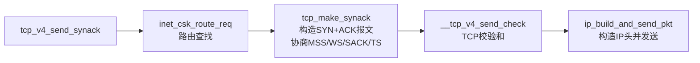

```c
//https://elixir.bootlin.com/linux/v4.11.6/source/net/ipv4/tcp_ipv4.c#L860
static int tcp_v4_send_synack(const struct sock *sk, struct dst_entry *dst,
			      struct flowi *fl,
			      struct request_sock *req,
			      struct tcp_fastopen_cookie *foc,
			      enum tcp_synack_type synack_type)
{
	const struct inet_request_sock *ireq = inet_rsk(req);
	struct flowi4 fl4;
	int err = -1;
	struct sk_buff *skb;

	// 第一步：路由查找（如果调用方未提供dst）
	// inet_csk_route_req 根据 request_sock 中的目标IP查找路由
	if (!dst && (dst = inet_csk_route_req(sk, &fl4, req)) == NULL)
		return -1;

	// 第二步：构造 SYN+ACK 报文（核心）
	skb = tcp_make_synack(sk, dst, req, foc, synack_type);

	if (skb) {
		// 第三步：计算TCP校验和（伪首部：源IP + 目的IP + 协议 + TCP长度）
		__tcp_v4_send_check(skb, ireq->ir_loc_addr, ireq->ir_rmt_addr);

		// 第四步：构造IP头部并发送
		err = ip_build_and_send_pkt(skb, sk, ireq->ir_loc_addr,
					    ireq->ir_rmt_addr,
					    ireq->opt);  // IP选项
		err = net_xmit_eval(err);
	}

	return err;
}
```

####	tcp_make_synack：SYN+ACK报文构造与选项协商

[`tcp_make_synack`](https://elixir.bootlin.com/linux/v4.11.6/source/net/ipv4/tcp_output.c#L3171)是构造SYN+ACK报文的核心函数，负责设置TCP头部各字段并进行**TCP选项协商**（MSS、Window Scale、SACK、Timestamp）：

```c
//https://elixir.bootlin.com/linux/v4.11.6/source/net/ipv4/tcp_output.c#L3171
struct sk_buff *tcp_make_synack(const struct sock *sk, struct dst_entry *dst,
				struct request_sock *req,
				struct tcp_fastopen_cookie *foc,
				enum tcp_synack_type synack_type)
{
	struct inet_request_sock *ireq = inet_rsk(req);
	const struct tcp_sock *tp = tcp_sk(sk);
	struct tcp_out_options opts;
	struct sk_buff *skb;
	struct tcphdr *th;
	int tcp_header_size;
	struct tcp_md5sig_key *md5 = NULL;

	// 分配skb
	skb = alloc_skb(MAX_TCP_HEADER, GFP_ATOMIC);
	if (unlikely(!skb))
		return NULL;

	skb_reserve(skb, MAX_TCP_HEADER);

	// 关键：TCP选项协商
	// synack_options()会根据客户端SYN中请求的选项，
	// 决定服务端响应哪些选项
	memset(&opts, 0, sizeof(opts));
	skb->ip_summed = CHECKSUM_PARTIAL;
	// ...

	// 构造TCP头部
	tcp_header_size = tcp_synack_options(req, mss, skb, &opts, md5, foc)
			  + sizeof(*th);
	skb_push(skb, tcp_header_size);
	skb_reset_transport_header(skb);

	th = (struct tcphdr *)skb->data;
	memset(th, 0, sizeof(struct tcphdr));
	th->syn = 1;   // SYN标志
	th->ack = 1;   // ACK标志
	// 设置服务端ISN（初始序列号）
	tcp_init_nondata_skb(skb, tcp_rsk(req)->snt_isn,
			     TCPHDR_SYN | TCPHDR_ACK);

	th->seq = htonl(TCP_SKB_CB(skb)->seq);
	th->ack_seq = htonl(tcp_rsk(req)->rcv_nxt);  // 确认客户端的SYN

	// 通告接收窗口
	th->window = htons(min(req->rsk_rcv_wnd, 65535U));

	// 写入协商的TCP选项
	tcp_options_write((__be32 *)(th + 1), NULL, &opts);

	th->doff = (tcp_header_size >> 2);  // 头部长度
	// ...

	return skb;
}
```

`tcp_synack_options`中进行的**选项协商**逻辑：

| TCP选项 | 协商规则 | 内核字段 |
|---------|---------|---------|
| **MSS** | 必选项，服务端根据出口MTU计算自己的MSS通告给客户端 | `opts->mss` |
| **Window Scale** | 若客户端SYN携带WS选项，服务端选择合适的缩放因子响应 | `ireq->wscale_ok`, `ireq->snd_wscale` |
| **SACK Permitted** | 若客户端SYN携带SACK选项且`sysctl_tcp_sack`启用，则响应 | `ireq->sack_ok` |
| **Timestamp** | 若客户端SYN携带TS选项且`sysctl_tcp_timestamps`启用，则响应 | `ireq->tstamp_ok` |
| **TCP Fast Open Cookie** | 若启用TFO且`foc`非空，在SYN+ACK中附带cookie | `foc` |

SYN Cookie场景下的区别：当`synack_type == TCP_SYNACK_COOKIE`时，ISN（初始序列号）中编码了MSS、时间戳等信息，用于在不保存半连接状态的情况下验证后续ACK的合法性。此时不创建`request_sock`，也不启用Window Scale和SACK选项（因为无法保存状态）

####   状态迁移的可观测
额外补充，新版本内核（如`6.16`）提供了一个[观测点](https://elixir.bootlin.com/linux/v6.16-rc6/source/net/ipv4/af_inet.c#L1343)`tracepoint:sock:inet_sock_set_state`，可以用来获取TCP状态的变迁

```cpp
void inet_sk_set_state(struct sock *sk, int state)
{
	//sk->sk_state：旧状态
	//state：新状态
	trace_inet_sock_set_state(sk, sk->sk_state, state);
	sk->sk_state = state;
}
```

##	0x06	client：响应SYN-ACK包，发送三次握手的ACK包
客户端发送完SYN包，等待接收服务端的SYN+ACK，当该（SYN+ACK）报文到来时，同样会进入到 `tcp_rcv_state_process` 函数中，默认阻塞（`inet_wait_for_connect`）的进程被唤醒处理 SYN+ACK（**注意客户端当前socket 的状态是 `TCP_SYN_SENT`**）。在正常三次握手的情况下，客户端将当前 TCP 状态改变为 `TCP_ESTABLISHED`，并给服务端返回的 SYN 包，发送对应的 ACK

####    主要逻辑
`tcp_rcv_synsent_state_process`[函数](https://elixir.bootlin.com/linux/v4.11.6/source/net/ipv4/tcp_input.c#L5647) 是客户端响应 SYN+ACK 的主要逻辑

####    状态机切换
```cpp
int tcp_v4_do_rcv(struct sock *sk, struct sk_buff *skb) {
    ...
    if (tcp_rcv_state_process(sk, skb)) {
        ...
    }
    ...
}

// 除了 ESTABLISHED、TCP_NEW_SYN_RECV 和 TIME_WAIT，其他状态下的 TCP 处理都会走到这个函数
int tcp_rcv_state_process(struct sock *sk, struct sk_buff *skb) {
    ...
    switch (sk->sk_state) {
        ...
        case TCP_SYN_SENT:  //客户端处理SYN+ACK包（客户端当前处于TCP_SYN_SENT状态）
            ...
            queued = tcp_rcv_synsent_state_process(sk, skb, th);
            ...
    }
    ...
}

//核心逻辑
static int tcp_rcv_synsent_state_process(struct sock *sk, struct sk_buff *skb,
                     const struct tcphdr *th) {
    struct inet_connection_sock *icsk = inet_csk(sk);
	struct tcp_sock *tp = tcp_sk(sk);

    ...
    if (th->ack) {
        ...
        // tcp_ack
        // https://elixir.bootlin.com/linux/v4.11.6/source/net/ipv4/tcp_input.c#L3538
        // tcp_ack->tcp_clean_rtx_queue
		// 见下面
        tcp_ack(sk, skb, FLAG_SLOWPATH);

        // 将 TCP 状态改变为 TCP_ESTABLISHED，连接建立完成
        tcp_finish_connect(sk, skb);
        ...
        if (sk->sk_write_pending ||
            icsk->icsk_accept_queue.rskq_defer_accept ||
            icsk->icsk_ack.pingpong) {
            //延迟确认
            ...
        } else {
            // 向服务发送 ack
            tcp_send_ack(sk);
        }
    }
}

//https://elixir.bootlin.com/linux/v4.11.6/source/net/ipv4/tcp_input.c#L5547
void tcp_finish_connect(struct sock *sk, struct sk_buff *skb) {
    ...
    // 修改socket状态，客户端设置状态为TCP_ESTABLISHED
    tcp_set_state(sk, TCP_ESTABLISHED);

    //初始化拥塞控制
    tcp_init_congestion_control(sk);

    //开启TCP保活计时器
    if (sock_flag(sk, SOCK_KEEPOPEN))
		inet_csk_reset_keepalive_timer(sk, keepalive_time_when(tp));
    ...
}
```

`tcp_send_ack`主要用于向服务端发回ACK报文
```cpp
//https://elixir.bootlin.com/linux/v4.11.6/source/net/ipv4/tcp_output.c#L3462
void tcp_send_ack(struct sock *sk)
{
	struct sk_buff *buff;

	/* If we have been reset, we may not send again. */
	if (sk->sk_state == TCP_CLOSE)
		return;
    
    //申请和构造 ACK 包
	buff = alloc_skb(MAX_TCP_HEADER,
			 sk_gfp_mask(sk, GFP_ATOMIC | __GFP_NOWARN));
	if (unlikely(!buff)) {
        // 异常处理
		inet_csk_schedule_ack(sk);
		inet_csk(sk)->icsk_ack.ato = TCP_ATO_MIN;
		inet_csk_reset_xmit_timer(sk, ICSK_TIME_DACK,
					  TCP_DELACK_MAX, TCP_RTO_MAX);
		return;
	}

    // 发送ACK
	tcp_transmit_skb(sk, buff, 0, (__force gfp_t)0);
}
```

小结下当客户端处理SYN+ACK时，清除了 `connect` 时设置的重传定时器，把当前 socket 状态设置为 `ESTABLISHED`，开启保活计时器后发出第三次握手的 ACK 确认报文

####    tcp_ack的主要过程

```cpp
static int tcp_ack(struct sock *sk, const struct sk_buff *skb, int flag)
{
	struct inet_connection_sock *icsk = inet_csk(sk);
	struct tcp_sock *tp = tcp_sk(sk);
	struct tcp_sacktag_state sack_state;
	
	u32 ack_seq = TCP_SKB_CB(skb)->seq;
	u32 ack = TCP_SKB_CB(skb)->ack_seq;

    // 删除定时器
	tcp_rearm_rto(sk);

	//删除发送队列
	tcp_clean_rtx_queue(sk, prior_fackets, prior_snd_una, &acked,
				    &sack_state);
}
```

##	0x07	server：响应ACK包
服务端收到客户端第三次握手的 ACK 包，服务端将 TCP 状态从 `TCP_NEW_SYN_RECV` 更新为 `TCP_SYN_RECV`，然后才为连接结构`struct sock`分配空间，关于`TCP_NEW_SYN_RECV`的改动请参考[inet: add TCP_NEW_SYN_RECV state](https://github.com/torvalds/linux/commit/10feb428a5045d5eb18a5d755fbb8f0cc9645626)

即第二次握手（服务端收到SYN报文）TCP 状态是 `TCP_NEW_SYN_RECV`，第三次握手后，TCP 状态才是 `TCP_SYN_RECV`

这里还有一个细节是：如果服务端开启了syncookies机制，那么这里的ACK包，有可能来自于两种情况（核心都是`tcp_child_process`），简言之，正常情况下的 TCP_NEW_SYN_RECV 处理通常发生在 `tcp_v4_rcv` 中，而基于 SYN Cookie 的 TCP_LISTEN 状态下的子连接创建发生在 `tcp_v4_do_rcv` 中

1、开启了syncookies机制时，syncookies对应的ACK报文处理逻辑，对应下面的代码

```c
int tcp_v4_do_rcv(struct sock *sk, struct sk_buff *skb)
{
	struct sock *rsk;

	if (sk->sk_state == TCP_ESTABLISHED) { /* Fast path */
		......
		tcp_rcv_established(sk, skb, tcp_hdr(skb), skb->len);
		return 0;
	}

	if (tcp_checksum_complete(skb))
		goto csum_err;

	if (sk->sk_state == TCP_LISTEN) {
		//
		struct sock *nsk = tcp_v4_cookie_check(sk, skb);

		if (!nsk)
			goto discard;
		if (nsk != sk) {
			sock_rps_save_rxhash(nsk, skb);
			sk_mark_napi_id(nsk, skb);
			// 通过了syncookies校验
			if (tcp_child_process(sk, nsk, skb)) {
				rsk = nsk;
				goto reset;
			}
			return 0;
		}
	}
	......
}                
```

2. 未开启时，正常的三次握手的ACK报文处理逻辑，对应于下面的代码：

```c
//https://elixir.bootlin.com/linux/v4.11.6/source/net/ipv4/tcp_ipv4.c#L1692
int tcp_v4_rcv(struct sk_buff *skb)
{
	......
	if (sk->sk_state == TCP_NEW_SYN_RECV) {
		struct request_sock *req = inet_reqsk(sk);
		struct sock *nsk;

		sk = req->rsk_listener;
		if (unlikely(tcp_v4_inbound_md5_hash(sk, skb))) {
			sk_drops_add(sk, skb);
			reqsk_put(req);
			goto discard_it;
		}
		if (unlikely(sk->sk_state != TCP_LISTEN)) {
			inet_csk_reqsk_queue_drop_and_put(sk, req);
			goto lookup;
		}
		/* We own a reference on the listener, increase it again
		 * as we might lose it too soon.
		 */
		sock_hold(sk);
		refcounted = true;
		nsk = tcp_check_req(sk, skb, req, false);
		if (!nsk) {
			reqsk_put(req);
			goto discard_and_relse;
		}
		if (nsk == sk) {
			reqsk_put(req);
		} else if (tcp_child_process(sk, nsk, skb)) {
			tcp_v4_send_reset(nsk, skb);
			goto discard_and_relse;
		} else {
			sock_put(sk);
			return 0;
		}
	}
	......
}
```


####    状态机切换

1、`tcp_v4_rcv-->tcp_check_req-->tcp_v4_syn_recv_sock-->inet_csk_complete_hashdance`：`tcp_check_req` 是处理 TCP 第三次握手（ACK 包）的核心函数，负责验证 ACK 合法性、创建child socket 并迁移连接状态，TCP状态由`TCP_NEW_SYN_RECV`切换为`TCP_SYN_RECV`。涉及到的核心函数流转如下

-	`__inet_lookup_skb`
-	`tcp_check_req`
-	`inet_csk_complete_hashdance`：将新连接child加入全连接队列

```cpp
int tcp_v4_rcv(struct sk_buff *skb) {
    ......
	sk = __inet_lookup_skb(&tcp_hashinfo, skb, __tcp_hdrlen(th), th->source,
			       th->dest, &refcounted);

    if (sk->sk_state == TCP_NEW_SYN_RECV) { //服务器状态为TCP_NEW_SYN_RECV
        // 获取半连接结构request_sock
		struct request_sock *req = inet_reqsk(sk);	
		struct sock *nsk;	//NULL

		sk = req->rsk_listener;
		......
		// 第一步：tcp_check_req
		nsk = tcp_check_req(sk, skb, req, false);
		if (!nsk) {
			// nsk == NULL,quit
			reqsk_put(req);	 // 释放半连接对象
			goto discard_and_relse;
		}
		if (nsk == sk) {
			// 释放半连接对象，但监听 socket 引用不变
			reqsk_put(req);
		} else if (tcp_child_process(sk, nsk, skb)) {	// nsk!=sk，说明成功创建子 socket
			// tcp_child_process失败
			// 向客户端发送RST
			tcp_v4_send_reset(nsk, skb);
			// 释放资源
			goto discard_and_relse;
		} else {
			// tcp_child_process成功、
			// 释放监听 socket 的引用计数
			sock_put(sk);
			return 0;
		}
    }
    ......

discard_it:
	/* Discard frame. */
	kfree_skb(skb);
	return 0;

discard_and_relse:
	sk_drops_add(sk, skb);
	if (refcounted)
		sock_put(sk);
	goto discard_it;
}
```

`tcp_check_req`函数主要用于负责验证 ACK 合法性、创建子 socket 并迁移连接状态，注意`tcp_check_req`函数有三种返回值（`NULL`、`sk`、`child`），需要结合`tcp_v4_rcv`中调用`nsk = tcp_check_req(sk, skb, req, false)`之后的处理来看

```cpp
nsk = tcp_check_req(sk, skb, req, false); // 处理第三次握手 ACK，创建子 socket
if (!nsk) { ... }      // case 1: nsk 为 NULL
if (nsk == sk) { ... } // case 2: nsk 等于原监听 socket
else if { tcp_child_process(sk, nsk, skb) } // case 3: nsk 为新创建的子 socket（成功），
else { ... } //case 4 ：创建子socket成功 && 加全连接队列成功
```

1、**case1**，当`nsk == NULL`时，说明无法创建子 socket，可能原因为packet非法或者全连接队列已满`sk_acceptq_is_full(sk)==true`，如果为全连接队列满导致，则参考`tcp_check_req`中标签`listen_overflow`的处理。默认内核的行为如下：

```cpp
reqsk_put(req);       // 释放半连接对象（request_sock）
goto discard_and_relse; // 丢弃数据包，释放资源
```

可增大 `net.core.somaxconn` 和 `listen()` 的 `backlog` 参数，避免队列溢出

2、**case2**，当`nsk == sk`时（`nsk` 等于原监听 socket `sk`），触发原因为收到重复或无效 ACK，比如收到重复 ACK报文，半连接队列中无匹配的 `request_sock`，但 ACK 序列号合法，可能是重传导致；另一种情况是开启了SYN Cookie 验证通过，未创建半连接对象，需重新生成 `request_sock`，默认内核的行为如下：

```cpp
reqsk_put(req); // 释放当前临时 req（非必需对象）
// 继续用监听 socket 处理后续数据包
```

3、**case3**，当 `nsk != sk`且`tcp_child_process`返回非`0`表示成功创建子 Socket，但`tcp_child_process`失败，内核默认行为：

```cpp
tcp_v4_send_reset(nsk, skb); // 向客户端发送 RST
goto discard_and_relse;       // 释放资源
```

4、**case4**，`nsk != sk`且`tcp_child_process`调用成功，此时内核会将子 socket 状态从 `TCP_SYN_RECV` 转为 `TCP_ESTABLISHED`（连接已经先前就移入了全连接队列），随后唤醒因 `accept()` 阻塞进程

```cpp
/*
参数 
sk：监听 Socket（TCP_LISTEN 状态）
skb：收到的 ACK 数据包
req：半连接队列中对应的 request_sock（存储 SYN 包信息）
fastopen：是否启用 TCP Fast Open
*/
struct sock *tcp_check_req(struct sock *sk, struct sk_buff *skb,
               struct request_sock *req,
               bool fastopen)
{
	struct sock *child;
    ......

	/* Check for pure retransmitted SYN. */
	// 检查是否为重传的SYN包
	if (TCP_SKB_CB(skb)->seq == tcp_rsk(req)->rcv_isn &&
	    flg == TCP_FLAG_SYN &&
	    !paws_reject) {
		if (!tcp_oow_rate_limited(sock_net(sk), skb,
					  LINUX_MIB_TCPACKSKIPPEDSYNRECV,
					  &tcp_rsk(req)->last_oow_ack_time) &&

		    !inet_rtx_syn_ack(sk, req)) {
			unsigned long expires = jiffies;

			expires += min(TCP_TIMEOUT_INIT << req->num_timeout,
				       TCP_RTO_MAX);
			if (!fastopen)
				mod_timer_pending(&req->rsk_timer, expires);
			else
				req->rsk_timer.expires = expires;
		}
		return NULL;
	}

    // 这里syn_recv_sock对应的是 tcp_v4_syn_recv_sock
	/* OK, ACK is valid, create big socket and
	 * feed this segment to it. It will repeat all
	 * the tests. THIS SEGMENT MUST MOVE SOCKET TO
	 * ESTABLISHED STATE. If it will be dropped after
	 * socket is created, wait for troubles.
	 */
    child = inet_csk(sk)->icsk_af_ops->syn_recv_sock(sk, skb, req, NULL,
                             req, &own_req);
	if (!child)
		goto listen_overflow;
    ......

	// 完成连接的最终状态迁移与资源移交
	// 核心作用是将新创建的子 socket 加入全连接队列（AcceptQueue）
	return inet_csk_complete_hashdance(sk, child, req, own_req);
listen_overflow:
	if (!sysctl_tcp_abort_on_overflow) {
		// 注意：对应net.ipv4.tcp_abort_on_overflow配置
		// 如果为0（默认配置），则返回NULL，服务端静默丢弃 ACK，客户端重传 ACK 直至超时
		// 如果为1，则服务端发送 RST 复位连接，客户端收到 ECONNREFUSED
		inet_rsk(req)->acked = 1;
		return NULL;
	}
embryonic_reset:
	if (!(flg & TCP_FLAG_RST)) {
		req->rsk_ops->send_reset(sk, skb);
	} else if (fastopen) { /* received a valid RST pkt */
		reqsk_fastopen_remove(sk, req, true);
		tcp_reset(sk);
	}
	.......
	return NULL;
}
```

####	tcp_v4_syn_recv_sock实现

`tcp_v4_rcv--->tcp_check_req--->tcp_v4_syn_recv_sock`函数是处理第三次握手ACK包的核心函数，**负责创建子套接字并完成连接状态迁移**，其核心流程为：

1.	创建子套接字`newsk`：调用`tcp_create_openreq_child(sk, req, skb)`克隆监听套接字，基于监听套接字 `sk` 和半连接对象 `req` 创建子套接字 `newsk`
2.	初始化子套接字成员，从半连接对象 `req` 中提取客户端和服务端 IP/端口，初始化子套接字`newsk`，初始化顺序为`inet_csk_clone_lock->sk_clone_lock->sk_prot_alloc`
3.	关联路由与传输层初始化`struct tcp_sock *newtp = tcp_sk(newsk)`

```cpp
//https://elixir.bootlin.com/linux/v4.11.6/source/net/ipv4/tcp_ipv4.c#L1286
// sk：监听套接字（TCP_LISTEN）
// skb：收到的 ACK 数据包
// req：半连接对象（存储 SYN 包信息）
// dst：路由缓存
struct sock *tcp_v4_syn_recv_sock(const struct sock *sk, struct sk_buff *skb,
                  struct request_sock *req,
                  struct dst_entry *dst,
                  struct request_sock *req_unhash,
                  bool *own_req) {
    ......
    if (sk_acceptq_is_full(sk))	
		//全连接队列满了
        goto exit_overflow;

    //创建 sock && 初始化
    newsk = tcp_create_openreq_child(sk, req, skb);
    if (!newsk)
        goto exit_nonewsk;
    ......

	sk_daddr_set(newsk, ireq->ir_rmt_addr);
	sk_rcv_saddr_set(newsk, ireq->ir_loc_addr);
	newinet->inet_saddr	      = ireq->ir_loc_addr;

	......

	return newsk;
}

//https://elixir.bootlin.com/linux/v4.11.6/source/net/ipv4/tcp_minisocks.c#L432
struct sock *tcp_create_openreq_child(const struct sock *sk,
                      struct request_sock *req,
                      struct sk_buff *skb) {
    struct sock *newsk = inet_csk_clone_lock(sk, req, GFP_ATOMIC);
    ......
}

//
struct sock *inet_csk_clone_lock(const struct sock *sk,
                 const struct request_sock *req,
                 const gfp_t priority) {
	// 根据原始sk 复制一个新的struct sock结构出来
    struct sock *newsk = sk_clone_lock(sk, priority);

    if (newsk) {
        struct inet_connection_sock *newicsk = inet_csk(newsk);
        //为新连接分配 sock 空间，tcp 改变为 TCP_SYN_RECV
		newsk->sk_state = TCP_SYN_RECV;
		newicsk->icsk_bind_hash = NULL;

		inet_sk(newsk)->inet_dport = inet_rsk(req)->ir_rmt_port;	//目的端口
		inet_sk(newsk)->inet_num = inet_rsk(req)->ir_num;
		inet_sk(newsk)->inet_sport = htons(inet_rsk(req)->ir_num);	//源端口
        ......
    }
    return newsk;
}

//https://elixir.bootlin.com/linux/v4.11.6/source/net/core/sock.c#L1483
struct sock *sk_clone_lock(const struct sock *sk, const gfp_t priority)
{
	struct sock *newsk;
	bool is_charged = true;

	newsk = sk_prot_alloc(sk->sk_prot, priority, sk->sk_family);
	if (newsk != NULL) {
		sock_copy(newsk, sk);
		......
		// newsk 初始化
		// 初始化sock接收队列
		skb_queue_head_init(&newsk->sk_receive_queue);
		// 初始化sock等待队列
		skb_queue_head_init(&newsk->sk_write_queue);

		sk_set_socket(newsk, NULL);
		newsk->sk_wq = NULL;
	}
	return newsk;
}
```

在跟踪完`syn_rcv_sock`之后，正常情况下会运行到`inet_csk_complete_hashdance(sk, child, req, own_req)`，此函数负责将新建立的连接从半连接队列转移到全连接队列（accept 队列）

```cpp
//https://elixir.bootlin.com/linux/v4.11.6/source/net/ipv4/inet_connection_sock.c#L947
/*
struct sock *sk         // 监听套接字（父套接字）
struct sock *child      // 新创建的子套接字（代表新连接）
struct request_sock *req // 半连接队列中的请求块
bool own_req              // 资源所有权标志
*/
struct sock *inet_csk_complete_hashdance(struct sock *sk, struct sock *child,
					 struct request_sock *req, bool own_req)
{
	if (own_req) {
		// 从半连接队列移除请求req
		inet_csk_reqsk_queue_drop(sk, req);
		// 更新半连接队列计数
		reqsk_queue_removed(&inet_csk(sk)->icsk_accept_queue, req);
		// 加入全连接队列（重要）
		if (inet_csk_reqsk_queue_add(sk, req, child))
			return child;	//返回child socket
	}
	/*
	own_req的核心作用：
	若为 true，表示当前路径成功创建了 child且需处理队列转移；
	若为 false，说明其他路径已处理该请求，需释放 child避免重复操作
	*/
	bh_unlock_sock(child);
	sock_put(child);
	return NULL;
}
```

继续分析下`inet_csk_reqsk_queue_add`的实现，根据上文可以了解到，当前版本的全连接队列通过链表管理（`rskq_accept_head`和 `rskq_accept_tail`）

```cpp
//https://elixir.bootlin.com/linux/v4.11.6/source/net/ipv4/inet_connection_sock.c#L922
struct sock *inet_csk_reqsk_queue_add(struct sock *sk,
				      struct request_sock *req,
				      struct sock *child)
{
	struct request_sock_queue *queue = &inet_csk(sk)->icsk_accept_queue;

	// 加自旋锁保护队列
	spin_lock(&queue->rskq_lock);
	if (unlikely(sk->sk_state != TCP_LISTEN)) {
		inet_child_forget(sk, req, child);
		child = NULL;
	} else {
		// 关联子套接字到请求块
		req->sk = child;
		req->dl_next = NULL;
		// 链表插入操作
		if (queue->rskq_accept_head == NULL)	// 队列为空时
			queue->rskq_accept_head = req;	 	// 设为头节点
		else									// 队列非空
			queue->rskq_accept_tail->dl_next = req;	// 尾插法
		queue->rskq_accept_tail = req;			// 更新尾指针
		sk_acceptq_added(sk);					// 增加全连接队列计数（sk->sk_ack_backlog++）
	}
	spin_unlock(&queue->rskq_lock);				 // 解锁
	return child;
}
```

2、`tcp_v4_rcv->tcp_check_req->tcp_child_process`：`TCP_SYN_RECV`切换为`TCP_ESTABLISHED`，在这个阶段，内核将 TCP 状态更新为 `TCP_SYN_RECV`，处理完逻辑后，随后将状态更新为 `TCP_ESTABLISHED`，这一阶段的核心函数是`tcp_child_process`

```cpp
int tcp_v4_rcv(struct sk_buff *skb) {
    ...
    if (sk->sk_state == TCP_NEW_SYN_RECV) {
        ...
        if (!tcp_filter(sk, skb)) {
            ...
            // 修改 TCP 状态为：TCP_SYN_RECV
            nsk = tcp_check_req(sk, skb, req, false);
        }
        ......
        if (nsk == sk) {
            ......
        } else if (tcp_child_process(sk, nsk, skb)) {
            // 处理新连接的核心逻辑
            ......
        }
        ......
    }
    ......
}
```

重点看一下`tcp_child_process`的[实现](https://elixir.bootlin.com/linux/v4.11.6/source/net/ipv4/tcp_minisocks.c#L811)，该函数的主要作用是将新创建的子 socket 从协议栈移交至应用层，主要工作为：

1. 处理子 socket 的状态迁移，当内核收到第三次 ACK 包后，`tcp_child_process` 通过调用 `tcp_rcv_state_process` 驱动子 socket 状态机，将其状态从 `TCP_SYN_RECV` 更新为 `TCP_ESTABLISHED`，即完成连接的协议栈层就绪，标志连接可传输数据
2. 触发父进程唤醒（通知 `accept()`），若子 socket 状态从 `SYN_RECV` 成功迁移至 `ESTABLISHED`，函数会调用监听 socket（`parent`）的 `sk_data_ready()` 回调函数（默认为 `sock_def_readable`），唤醒阻塞在 `accept` 上的进程

```cpp
// parent：listen socket
// child：accept socket
int tcp_child_process(struct sock *parent, struct sock *child,
              struct sk_buff *skb) {
    ...
    if (!sock_owned_by_user(child)) {
		// 处理状态迁移
		// TCP_SYN_RECV->TCP_ESTABLISHED
        ret = tcp_rcv_state_process(child, skb);
        /* Wakeup parent, send SIGIO */
        if (state == TCP_SYN_RECV && child->sk_state != state)
            // 非常重要：当新连接到达时，唤醒socket（listenfd）的等待队列！
			// sk_data_ready() 通过 wake_up_interruptible() 唤醒监听队列上的进程
			// 若listen socket 配置了异步 I/O（O_ASYNC），会额外发送 SIGIO 信号通知应用层
			//目的：避免频繁唤醒，仅在连接真正就绪（状态变更）时通知应用层
            parent->sk_data_ready(parent);
    }
    ...
}

int tcp_rcv_state_process(struct sock *sk, struct sk_buff *skb) {
    ......
    switch (sk->sk_state) {
    case TCP_SYN_RECV:
        ......
        // 当前服务端的socket状态是TCP_SYN_RECV，更新为TCP_ESTABLISHED
        tcp_set_state(sk, TCP_ESTABLISHED);
        ......
    }
}
```

在`tcp_child_process`函数中这段代码`parent->sk_data_ready(parent)`的作用是什么？为什么需要使用`parent`来调用？
1.	通知对象是listen socket，即`parent`（状态为`TCP_LISTEN`），其任务是接收新连接，而新创建的子socket（`child`）用于实际数据传输，所以需要唤醒listen socket上的关联的sock等待队列。当子socket状态从`TCP_SYN_RECV`迁移到`TCP_ESTABLISHED`后，需要通知listen socket 有新连接就绪，唤醒阻塞在`accept()`进程关联在listen socket的等待队列（`sk->sk_wq`）

2. 子socket，即`child`关联的sock等待队列，在同步阻塞模式下，可以用于唤醒等待数据传输的进程

对于上面提到的两个不同流程中的`tcp_child_process`，核心作用都是完全一样的：拿着最后一步的 ACK 包，去激活刚刚诞生出来的子 socket，把它推入 TCP_ESTABLISHED 状态，并将其挂载到父 socket 的 accept 队列中，唤醒等待的应用程序。不同之处是**子 Socket 是怎么创建出来的**（即前置条件不同），下面说明一下：

场景 1：在 `tcp_v4_rcv` 中遇到 TCP_NEW_SYN_RECV（常规的三次握手）

-	前置条件：服务器收到第一步 SYN 时，正常分配了一个半连接对象（`request_sock`）
-	触发机制：客户端发来第三步 ACK，`tcp_v4_rcv` 查表时找到了这个半连接对象（状态表现为 TCP_NEW_SYN_RECV）
-	创建子 socket： 内核调用 `tcp_check_req()`，验证 ACK 无误后，根据之前保存的半连接信息，正式创建一个全连接的子 socket（`nsk`）
-	调用 `tcp_child_process`： 把这个 ACK 包喂给刚生出来的 `nsk`，让它完成状态切换（进入 ESTABLISHED）并排队等待 `accept()`

场景 2：在 `tcp_v4_do_rcv` 中遇到 TCP_LISTEN（触发了 SYN Cookie）

-	前置条件： 服务器开启 SYNCookie，收到第一步 SYN 时，没有保存半连接对象，直接回了 SYN+ACK
-	触发机制： 客户端发来第三步 ACK，因为没有半连接对象，`tcp_v4_rcv` 查表只能找到原来的监听 socket (TCP_LISTEN)，于是把包交给了`tcp_v4_do_rcv`
-	创建子 socket：`tcp_v4_do_rcv` 调用 `tcp_v4_cookie_check()`，对包里的 cookie 进行解密和校验。如果合法，凭空（根据 cookie 中的信息）直接构造出一个全连接的子 socket （`nsk`）
-	调用 `tcp_child_process`： 把这个 ACK 包喂给这个凭空造出来的 `nsk`，后续动作与上面一致

####	重要： __inet_lookup_skb 与 __inet_lookup_listener 的实现逻辑

`__inet_lookup_skb`是`tcp_v4_rcv`中查找目标sock的[关键函数](https://elixir.bootlin.com/linux/v4.11.6/source/net/ipv4/tcp_ipv4.c#L1656)，其查找逻辑为先查`ehash`（ESTABLISHED连接），再查`listening_hash`（LISTEN状态）：

```cpp
//https://elixir.bootlin.com/linux/v4.11.6/source/include/net/inet_hashtables.h#L350
static inline struct sock *__inet_lookup_skb(struct inet_hashinfo *hashinfo,
					     struct sk_buff *skb,
					     int doff,
					     const __be16 sport,
					     const __be16 dport,
					     bool *refcounted)
{
	struct sock *sk = skb_steal_sock(skb);
	if (sk)
		return sk;
	// 先查 ehash（已建立连接），再查 listening_hash
	return __inet_lookup(dev_net(skb_dst(skb)->dev), hashinfo, skb,
			     doff, iph->saddr, sport, iph->daddr, dport,
			     inet_iif(skb), refcounted);
}

// __inet_lookup 内部调用链：
// 1. __inet_lookup_established() - 查询ehash表
// 2. __inet_lookup_listener() - 查询listening_hash表
//https://elixir.bootlin.com/linux/v4.11.6/source/include/net/inet_hashtables.h#L303
static inline struct sock *__inet_lookup(struct net *net,
					 struct inet_hashinfo *hashinfo,
					 struct sk_buff *skb, int doff,
					 const __be32 saddr, const __be16 sport,
					 const __be32 daddr, const __be16 dport,
					 const int dif,
					 bool *refcounted)
{
	u16 hnum = ntohs(dport);
	struct sock *sk;

	sk = __inet_lookup_established(net, hashinfo, saddr, sport,
				       daddr, hnum, dif);
	*refcounted = true;
	if (sk)
		return sk;
	*refcounted = false;
	return __inet_lookup_listener(net, hashinfo, skb, doff, saddr,
				      sport, daddr, hnum, dif);
}
```

####	__inet_lookup_established 的实现

[`__inet_lookup_established`](https://elixir.bootlin.com/linux/v4.11.6/source/net/ipv4/inet_hashtables.c#L300)在ehash中查找与报文四元组精确匹配的sock，是`tcp_v4_rcv`收包时的第一步查找。查找流程：**计算四元组哈希** -> **定位桶** -> **遍历nulls链表** -> **精确匹配**

```c
//https://elixir.bootlin.com/linux/v4.11.6/source/net/ipv4/inet_hashtables.c#L300
struct sock *__inet_lookup_established(struct net *net,
				  struct inet_hashinfo *hashinfo,
				  const __be32 saddr, const __be16 sport,
				  const __be32 daddr, const u16 hnum,
				  const int dif)
{
	INET_ADDR_COOKIE(acookie, saddr, daddr);
	const __portpair ports = INET_COMBINED_PORTS(sport, hnum);
	struct sock *sk;
	const struct hlist_nulls_node *node;
	// 计算四元组哈希值
	unsigned int hash = inet_ehashfn(net, daddr, hnum, saddr, sport);
	// 定位桶
	unsigned int slot = hash & hashinfo->ehash_mask;
	struct inet_ehash_bucket *head = &hashinfo->ehash[slot];

begin:
	// RCU无锁遍历桶链表
	sk_nulls_for_each_rcu(sk, node, &head->chain) {
		if (sk->sk_hash != hash)
			continue;
		// 精确匹配四元组：源IP、源端口、目的IP、目的端口、网络命名空间、网卡
		if (likely(INET_MATCH(sk, net, acookie,
				      saddr, daddr, ports, dif))) {
			if (unlikely(!refcount_inc_not_zero(&sk->sk_refcnt)))
				goto out;
			// 二次校验（防止RCU读期间sock被释放后重新分配）
			if (unlikely(!INET_MATCH(sk, net, acookie,
						 saddr, daddr, ports, dif))) {
				sock_gen_put(sk);
				goto begin;
			}
			goto found;
		}
	}
	// nulls检查：如果链表末尾的nulls值与slot不匹配
	// 说明遍历期间发生了rehash，需要重新查找
	if (get_nulls_value(node) != slot)
		goto begin;
out:
	sk = NULL;
found:
	return sk;
}
```

ehash的哈希函数`inet_ehashfn`基于四元组计算，使用Jenkins hash确保分布均匀：

```c
// 哈希计算（简化）
// hash = jhash_3words(saddr, daddr, sport | (dport << 16), net_hash_mix(net))
// 最终 slot = hash & ehash_mask
```

`__inet_lookup_listener`根据目的IP和端口在`listening_hash`表中查找匹配的listen socket，支持精确匹配（绑定特定IP）和通配匹配（绑定`INADDR_ANY`）：

```cpp
//https://elixir.bootlin.com/linux/v4.11.6/source/net/ipv4/inet_hashtables.c#L204
struct sock *__inet_lookup_listener(struct net *net,
				    struct inet_hashinfo *hashinfo,
				    struct sk_buff *skb, int doff,
				    const __be32 saddr, __be16 sport,
				    const __be32 daddr, const unsigned short hnum,
				    const int dif)
{
	unsigned int hash = inet_lhashfn(net, hnum);
	struct inet_listen_hashbucket *ilb = &hashinfo->listening_hash[hash];
	int score, hiscore = 0, matches = 0, reuseport = 0;
	struct sock *sk, *result = NULL;

	// 遍历 listening_hash 桶中的 sock
	sk_for_each_rcu(sk, &ilb->head) {
		// 计算匹配得分（IP、端口、网络命名空间等）
		score = compute_score(sk, net, hnum, daddr, dif);
		if (score > hiscore) {
			result = sk;
			hiscore = score;
			reuseport = sk->sk_reuseport;
			if (reuseport) {
				// SO_REUSEPORT 支持：多个listen socket绑定同一端口
				matches = 1;
			}
		} else if (score == hiscore && reuseport) {
			matches++;
			// 使用哈希选择其中一个socket（负载均衡）
			if (reciprocal_scale(hash, matches) == 0)
				result = sk;
		}
	}
	return result;
}
```

####	重要：sock对象的创建的区别
这里说明下此握手阶段的sock对象创建与系统调用`socket()`的sock对象创建的不同之处

在服务端收到客户端第一个SYN包时，`tcp_v4_rcv->tcp_v4_do_rcv->tcp_rcv_state_process->tcp_v4_conn_request->tcp_conn_request` 的[过程](https://elixir.bootlin.com/linux/v4.11.6/source/net/ipv4/tcp_ipv4.c#L1434)，通过`icsk->icsk_af_ops->conn_request(sk, skb)`创建半连接队列hashtable表项（最终调用的函数为`inet_reqsk_alloc`），这个半连接表项对应的结构为[`request_sock`](https://elixir.bootlin.com/linux/v4.11.6/source/include/net/request_sock.h#L49)，并非一个完整的`struct sock`对象

当服务端收到客户端第三次ACK时且正常完成握手后，才会把这个`inet_reqsk_alloc`结构升级为正常的`struct sock`，关联调用链为`tcp_v4_syn_recv_sock->tcp_create_openreq_child->inet_csk_clone_lock->sk_clone_lock`

```text
半连接结构inet_reqsk_alloc + 监听listen sock = 新连接的sock结构
```

再贴一下`sk_clone_lock`的[实现代码](https://elixir.bootlin.com/linux/v4.11.6/source/net/core/sock.c#L1490)，在克隆场景`sk_clone_lock`中，子 sock 通过复制父对象状态继承字段值，无需再次初始化（**子 sock 需继承父对象的上下文如回调函数、队列状态，确保协议栈行为一致**）。此外，这里格外关注`sk_wq`等待队列与`sk_data_ready` sock就绪回调函数两个字段

```cpp
struct sock *sk_clone_lock(const struct sock *sk, const gfp_t priority)
{
	struct sock *newsk;
	bool is_charged = true;
	// sk_prot_alloc(prot, ...)：分配子 sock 内存
	// prot 是父 sock->sk_prot，决定了分配的内存大小
	// 如 TCP 对应 tcp_prot，TCPv6 对应 tcpv6_prot
	newsk = sk_prot_alloc(sk->sk_prot, priority, sk->sk_family);
	if (newsk != NULL) {
		struct sk_filter *filter;

		// 重点：复制父 sock 字段到子对象newsk
		// 包括 sk_data_ready、sk_wq 在内的核心字段
		sock_copy(newsk, sk);

		sk_set_socket(newsk, NULL);
		newsk->sk_wq = NULL;
	}
out:
	return newsk;
}
```

-	`sk_data_ready`成员：由父对象的 `sock_copy()` 复制，直接继承父对象的回调函数，通常为 `sock_def_readable`
-	`sk_wq`：同样由父对象的 `sock_copy()` 复制，初始为空队列，后续由用户进程通过 `epoll_ctl()` 或 `select()` 等动态添加等待项

这里着重点出`sk_wq`与`sk_data_ready`的意义是，用户态编程时，当某个fd（关联sock数据就绪时）可读可写时，内核会通过这二者配合的机制唤醒上层进程进行数据处理

####	重要：双端 TCP_ESTABLISHED 的设置
本小节描述下，对于客户端与服务端，三次握手完成之后，对于客户端、服务端的协议栈的ehash，状态设置为TCP_ESTABLISHED的过程，客户端和服务端发生的位置肯定是不一样的，下面分别进行说明

#####	客户端：active open
当客户端 connect() 时，socket 先进入 ehash，此时其状态机还不是 TCP_ESTABLISHED，而是 TCP_SYN_SENT：

```c
tcp_v4_connect()
  -> tcp_set_state(sk, TCP_SYN_SENT)
  -> inet_hash_connect(tcp_death_row, sk)	//插入ehash 哈希表
     -> __inet_hash_connect()
        -> inet_ehash_nolisten(sk, NULL)
           -> inet_ehash_insert(sk, NULL)
```

也就是说，客户端 socket 在发送 SYN 包阶段就已经进入 ehash。后续收到服务端 SYN+ACK 时，内核通过 ehash 找回这个 TCP_SYN_SENT socket。客户端状态变为 TCP_ESTABLISHED 的位置如下：

```c
tcp_v4_rcv()
  -> tcp_v4_do_rcv()
  -> tcp_rcv_state_process()
     case TCP_SYN_SENT:
       -> tcp_rcv_synsent_state_process()
          -> tcp_finish_connect()	//重要！设置TCP_ESTABLISHED的函数，参考前文
             -> tcp_set_state(sk, TCP_ESTABLISHED)
```

#####	服务端：passive open
服务端收到 SYN 时，先创建的是 request_sock，不是最终 child socket：

```c
tcp_v4_rcv()
  -> tcp_rcv_state_process()
     case TCP_LISTEN:
       -> tcp_v4_conn_request()
          -> inet_csk_reqsk_queue_hash_add()
             -> reqsk_queue_hash_req()
```

服务端 SYN 阶段的 request socket 会参与 hash 查找，状态表现为 TCP_NEW_SYN_RECV 这类 request socket 状态。当服务端收到第三次握手 ACK 后，路径是：

```c
tcp_v4_rcv()
  -> __inet_lookup_skb()
     -> __inet_lookup_established()
        //找到 request_sock / TCP_NEW_SYN_RECV
  -> tcp_check_req(listener, skb, req, false)
  -> tcp_v4_syn_recv_sock()
```

child socket 创建时，初始状态是 TCP_SYN_RECV：

```c
tcp_v4_syn_recv_sock()
  -> tcp_create_openreq_child()
     -> inet_csk_clone_lock()
        -> newsk->sk_state = TCP_SYN_RECV
```

服务端 child socket 插入 ehash 的位置是：

```c
tcp_v4_syn_recv_sock()
  -> inet_ehash_nolisten(newsk, req_to_sk(req_unhash))
     -> inet_ehash_insert(newsk, old_req_sk)
```

这里会用真正的 child struct `sock *newsk` 替换 ehash 中原来的 request socket。然后完成 hashdance 和 accept queue 挂载：

```c
//1、child 创建：
tcp_check_req()
  -> inet_csk_complete_hashdance(listener, child, req, own_req) //注意：inet_csk_complete_hashdance() 不是设置 TCP_ESTABLISHED 的位置
     -> inet_csk_reqsk_queue_add(listener, req, child)
        -> req->sk = child
        -> 挂入 listener->icsk_accept_queue
```

服务端 child socket 状态变为 TCP_ESTABLISHED 的位置是：

```c
tcp_v4_rcv()
  -> tcp_check_req()
     -> 返回 child
  -> tcp_child_process(listener, child, skb)
     -> tcp_rcv_state_process(child, skb)	//关键代码在 tcp_rcv_state_process() 的 case TCP_SYN_RECV分支
        case TCP_SYN_RECV:
          -> tcp_set_state(child, TCP_ESTABLISHED)
```

汇总下服务端的调用链如下：

```c
//1、child 创建：
tcp_check_req()
  -> tcp_v4_syn_recv_sock()
  -> inet_csk_clone_lock()
     newsk->sk_state = TCP_SYN_RECV

//2、child 插入 ehash：
tcp_v4_syn_recv_sock()
  -> inet_ehash_nolisten(newsk, req_to_sk(req))

//3、child 加入 accept queue：
inet_csk_complete_hashdance()
  -> inet_csk_reqsk_queue_add()

//4、状态变为 TCP_ESTABLISHED：
tcp_child_process()
  -> tcp_rcv_state_process()
     case TCP_SYN_RECV
       -> tcp_set_state(sk, TCP_ESTABLISHED)
```


-	客户端：先以 TCP_SYN_SENT 进入 ehash，收到 SYN+ACK 后 `tcp_finish_connect()` 置 ESTABLISHED
-	服务端：SYN 阶段先 hash request_sock；最终 ACK 到来后 `tcp_v4_syn_recv_sock()` 创建 child 并插入 ehash，随后 `tcp_rcv_state_process()` 的 TCP_SYN_RECV 分支置 ESTABLISHED

##	0x08	server：accept操作
服务端`accept`系统调用的功能就是从已经建立好的全连接队列（链表）中取出一个返回给用户进程。当 `accept` 之后，通常服务端进程会创建一个新的 socket 出来，专门用于和对应的客户端通信，然后把它放到当前进程的打开文件列表中，这里内核数据结构关系如下（注意到`file.file_operations`是指向`socket_file_ops`）


先回想一下`struct socket`的[结构](https://elixir.bootlin.com/linux/v4.11.6/source/include/linux/net.h#L111)，其中包含了非常重要的`sock`成员，也是 socket 的核心内核对象，其中发送队列、接收队列、等待队列等核心数据结构都位于此

```cpp
struct socket {
	//...
    struct file     *file;
    struct sock     *sk;
	//...
}
```

accept系统调用的核心调用链如下：

```c
accept4()
  -> sock_alloc()
  -> sock_alloc_file()
  -> sock->ops->accept()
       -> inet_accept()
          -> sk1->sk_prot->accept()
             -> inet_csk_accept()
                -> reqsk_queue_remove(&icsk->icsk_accept_queue, sk)
                -> newsk = req->sk
          -> sock_graft(newsk, newsock)
  -> fd_install(newfd, newfile)
```

`accept`系统调用核心代码如下，主要分为四步即新建socket并初始化、初始化socket的VFS结构、接收连接（fd），最后添加新fd到当前进程的打开文件列表中

```cpp
// https://elixir.bootlin.com/linux/v4.11.6/source/net/socket.c#L1470
// 返回一个新fd，用于后续客户端连接
SYSCALL_DEFINE4(accept4, int, fd, struct sockaddr __user *, upeer_sockaddr,
        int __user *, upeer_addrlen, int, flags)
{
    struct socket *sock, *newsock;

    //根据 fd 查找到监听的 socket
	//这里的fd关联的是listen（socket）API 使用的那个fd
    sock = sockfd_lookup_light(fd, &err, &fput_needed);

    //申请并初始化新的 socket
	// 注意sock_alloc函数的返回值为 struct socket * 类型
    newsock = sock_alloc();
    newsock->type = sock->type;
    newsock->ops = sock->ops;

    //申请新的 file 对象，并设置到新 socket 上
    newfile = sock_alloc_file(newsock, flags, sock->sk->sk_prot_creator->name);
    ......

    //接收连接
    err = sock->ops->accept(sock, newsock, sock->file->f_flags);

    //添加新文件fd到当前进程的打开文件列表fdtable中
	//newfd为与客户端连接使用的fd
    fd_install(newfd, newfile);
}
```

1、初始化 `struct socket` 对象，`accept`中首先是调用 `sock_alloc` 申请一个`newsock`（类型为 `struct socket`），然后接着把 `listen` 状态的 `socket` 对象上的协议操作函数集合 `ops` 赋值给新的 `socket`（对于所有的 `AF_INET` 协议族下的 `socket` 来说，它们的 `ops` 方法都是一样的）。其中 `inet_stream_ops` 的定义如下：

```cpp
const struct proto_ops inet_stream_ops = {
	......
    .accept        = inet_accept,		//新连接接收
    .listen        = inet_listen,
    .sendmsg       = inet_sendmsg,
    .recvmsg       = inet_recvmsg,

}
```

2、调用`sock_alloc_file`函数：为新 `socket` 对象申请 `file`（初始化`struct socket`的`file`成员），`sock_alloc_file` 又会调用 `alloc_file`对`struct file`结构进行初始化，注意在 `alloc_file` 方法中，把 `socket_file_ops` 函数集合设置到 `file->f_op`了，最后注意到**在accept里创建的新 `socket` 里的 `file->f_op->poll` 函数指向的是 `sock_poll`**，这对于epoll机制非常重要，当 `epoll_ctl` 注册该fd时，内核会调用`file->f_op->poll`即`sock_poll`来获取当前就绪事件并注册回调

```cpp
struct file *sock_alloc_file(struct socket *sock, int flags, 
    const char *dname)
{
    struct file *file;
	// 调用alloc_file
    file = alloc_file(&path, FMODE_READ | FMODE_WRITE,
            &socket_file_ops);
    ......

	// 将alloc的file对象挂到sock的file成员上
    sock->file = file;

	//......
}

//alloc_file
struct file *alloc_file(struct path *path, fmode_t mode,
        const struct file_operations *fop)
{
    struct file *file;
	//注意在 alloc_file 方法中，把 socket_file_ops 函数集合一并赋到了新 file->f_op 中了
    file->f_op = fop;

	// file 对象的成员 socket 指针，指向 socket 对象
    ......
}

// file_operations的实例化：socket_file_ops
static const struct file_operations socket_file_ops = {
    ...
    .aio_read   = sock_aio_read,
    .aio_write  = sock_aio_write,
    .poll     = sock_poll,		//核心：记住这个poll成员及对应的方法`sock_poll`
    .release  = sock_close,
    ...
};
```

3、接收连接的核心逻辑：`sock->ops->accept(sock, newsock, sock->file->f_flags)`，对应的方法是 [`inet_accept`](https://elixir.bootlin.com/linux/v4.11.6/source/net/ipv4/af_inet.c#L692)，此函数执行时会从握手队列（全连接队列）里直接获取创建好的 sock 并关联与该 `struct sock`的关系

这里先回想下在三次握手最后阶段（服务端处理ACK包），服务端通过调用`tcp_v4_syn_recv_sock->inet_csk_complete_hashdance->inet_csk_reqsk_queue_add`将新连接加入到全连接队列中，那么对于accept，内核就需要把连接从全连接队列中取出来，并通知（应用层）来取

```cpp
int inet_accept(struct socket *sock, struct socket *newsock, int flags, bool kern)
{
	......
	struct sock *sk1 = sock->sk;
	//这里对应的是 inet_csk_accept
	//https://elixir.bootlin.com/linux/v4.11.6/source/net/ipv4/inet_connection_sock.c#L427
	struct sock *sk2 = sk1->sk_prot->accept(sk1, flags, &err, kern);

	// 重要：struct sock与struct socket结构建立关联
	// 在 inet_csk_accept 函数完成之后
	sock_graft(sk2, newsock);

	newsock->state = SS_CONNECTED;
	//....
}
```

`inet_accept` 会调用 `struct sock` 的 `sk1->sk_prot->accept`，也即 `tcp_prot` 的 `accept` 函数即`inet_csk_accept` 函数，见下一小节

```cpp
void sock_init_data(struct socket *sock, struct sock *sk)
{
    sk->sk_wq   =   NULL;
	//将sock 对象的 sk_data_ready 函数指针设置为 sock_def_readable
    sk->sk_data_ready   =   sock_def_readable;
}
```

4、添加新文件到当前进程的打开文件列表中，当 `file`、`socket`、`sock` 等关键内核对象创建完毕以后，剩下要做的一件事情就是把它挂到当前进程的打开文件列表即完成

这里介绍下`sockfd_lookup_light`的[实现](https://elixir.bootlin.com/linux/v4.11.6/source/net/socket.c#L489)，在`accept`系统调用中，参数`fd`指向的是listen的socket，该socket包含的VFS结构指向已经基本完整，所以从该函数的作用就是从进程->进程打开的fd->`struct file`->`file.private_data`拿到`struct socket`结构对象

```cpp
//https://elixir.bootlin.com/linux/v4.11.6/source/net/socket.c#L489
static struct socket *sockfd_lookup_light(int fd, int *err, int *fput_needed)
{
	struct fd f = fdget(fd);
	struct socket *sock;

	*err = -EBADF;
	if (f.file) {
		// 实际socket *是存储在file->private_data成员上
		sock = sock_from_file(f.file, err);
		if (likely(sock)) {
			*fput_needed = f.flags;
			return sock;
		}
		fdput(f);
	}
	return NULL;
}

//https://elixir.bootlin.com/linux/v4.11.6/source/net/socket.c#L448
struct socket *sock_from_file(struct file *file, int *err){
	if (file->f_op == &socket_file_ops)
		return file->private_data;	/* set in sock_map_fd */
	//.....
}
```

####	accept 的核心逻辑： inet_csk_accept
`inet_csk_accept`主要实现了tcp协议`accept`操作，其主要功能是从已经完成三次握手的全连接队列（对于成员是`struct inet_connection_sock`的`icsk_accept_queue`[成员](https://elixir.bootlin.com/linux/v4.11.6/source/include/net/inet_connection_sock.h#L91)）中取控制块，如果没有已经完成的连接，则需要根据（socket）阻塞标记来来区分对待，若非阻塞则直接返回，若阻塞则需要在一定时间范围内阻塞等待。这里有两个关键的子流程：

-	`inet_csk_wait_for_connect`：当全连接队列为空时，将当前进程放入listen socket的等待队列（`sk_wq`）中休眠，直到被唤醒（新连接到达时由`sock_def_readable`唤醒）或超时。对于非阻塞socket则跳过此步骤直接返回`-EAGAIN`
-	`reqsk_queue_remove`：从全连接队列的头部（`rskq_accept_head`）取出一个已完成三次握手的`request_sock`，更新头指针，并递减全连接队列计数。此操作在`icsk_accept_queue.rskq_lock`自旋锁保护下进行

```cpp
struct sock *inet_csk_accept(struct sock *sk, int flags, int *err, bool kern){
    struct inet_connection_sock *icsk = inet_csk(sk);
	// 获取全连接队列
    struct request_sock_queue *queue = &icsk->icsk_accept_queue;
    struct request_sock *req;
    struct sock *newsk;

	......

    /* 不是listen状态 */
    if (sk->sk_state != TCP_LISTEN)
        goto out_err;

    /* 还没有已完成的连接 */
    if (reqsk_queue_empty(queue)) {

        /* 获取等待时间，非阻塞为0 */
        long timeo = sock_rcvtimeo(sk, flags & O_NONBLOCK);

        /* If this is a non blocking socket don't sleep */
        error = -EAGAIN;
        /* 非阻塞立即返回错误 */
        if (!timeo)
            goto out_err;

        /* 阻塞模式下等待连接到来 */
		/*
			如果请求队列中没有已完成握手的连接，
			并且套接字已经设置了阻塞标记，
			则需要加入调度队列等待连接的到来 
		*/
        error = inet_csk_wait_for_connect(sk, timeo);
        if (error)
            goto out_err;
    }

    /* 从已完成连接队列中移除 */
    req = reqsk_queue_remove(queue, sk);

    /* 设置新控制块指针，如果没有错误newsk会被返回给调用方 */
    newsk = req->sk;

    /* TCP协议 && fastopen */
    if (sk->sk_protocol == IPPROTO_TCP &&
        tcp_rsk(req)->tfo_listener) {
        spin_lock_bh(&queue->fastopenq.lock);
        if (tcp_rsk(req)->tfo_listener) {
            req->sk = NULL;
            req = NULL;
        }
        spin_unlock_bh(&queue->fastopenq.lock);
    }
out:
    release_sock(sk);

    /* 释放请求控制块 */
    if (req)
        reqsk_put(req);

    /* 返回找到的连接控制块 */
    return newsk;
}
```

`inet_csk_wait_for_connect`函数实现了当请求队列中没有已完成三次握手的连接，并且套接字已经设置了阻塞标记，则需要加入等待队列等待连接的到来，这又是一个很典型的内核等待队列的应用，核心代码如下：

```cpp
static int inet_csk_wait_for_connect(struct sock *sk, long timeo)
{
    struct inet_connection_sock *icsk = inet_csk(sk);
    DEFINE_WAIT(wait);
    int err;

	//熟悉的循环
    for (;;) {
        /* 加入等待队列 */
        prepare_to_wait_exclusive(sk_sleep(sk), &wait,
                      TASK_INTERRUPTIBLE);
        release_sock(sk);

        /* 如果全连接队列为空，说明还是等待的条件不满足，进行CPU切换调度，主动让出CPU */
        if (reqsk_queue_empty(&icsk->icsk_accept_queue))
            timeo = schedule_timeout(timeo);	//进程第一调度定律
        sched_annotate_sleep();
        lock_sock(sk);
        err = 0;
        /* 走到这里说明进程已经被唤醒，重新拿到CPU的执行权，需要检查全连接队列不为空（等待的条件），如果满足即可退出等待队列*/
		/* 这里唤醒方会把当前阻塞在等待队列上的task_struct移除，然后再唤醒 */
		/* 所以解释了为何在for()循环开始要重新把进程加入到等待队列中	*/
        if (!reqsk_queue_empty(&icsk->icsk_accept_queue))
            break;
        err = -EINVAL;
        /* 连接状态非LISTEN */
        if (sk->sk_state != TCP_LISTEN)
            break;
        /* 信号打断 */
        err = sock_intr_errno(timeo);
        if (signal_pending(current))
            break;
        err = -EAGAIN;
        /* 调度超时也需要退出等待 */
        if (!timeo)
            break;
    }
    /* 结束等待 */
	/* sk_sleep(sk) 的作用是获取sk的等待队列头 */
    finish_wait(sk_sleep(sk), &wait);
    return err;
}
```

`reqsk_queue_remove`函数作用是将完成三次握手的控制块从请求队列移除：

```cpp
static inline struct request_sock *reqsk_queue_remove(struct request_sock_queue *queue,
                              struct sock *parent)
{
    struct request_sock *req;
	/* 需要加锁 */
    spin_lock_bh(&queue->rskq_lock);

    /* 找到队列头 */
    req = queue->rskq_accept_head;
    if (req) {
        /* 减少已连接计数 */
        sk_acceptq_removed(parent);
        /* 头部指向下一节点 */
        queue->rskq_accept_head = req->dl_next;

        /* 队列为空 */
        if (queue->rskq_accept_head == NULL)
            queue->rskq_accept_tail = NULL;
    }
    spin_unlock_bh(&queue->rskq_lock);
    return req;
}
```

####	accept内核调用中的一个细节
当三次握手完成，应用层使用accept获取到这个新的socket，同时accept将此连接（半连接对象`struct request_sock`）从全连接队列（`reqsk_queue_remove()`函数）中拆除，那么此时这个socket存储在内核的那个结构中？

在上面的`inet_csk_accept`函数中，真正的新连接 socket 是`newsk = req->sk`，也就是 child `struct sock`，当`accept()` 完成后，这个 child socket 主要存在于两个地方：`accept()` 后它不再挂在监听 socket 的全连接队列上，而是被新 fd 的 `struct file -> struct socket -> struct sock` 链路持有，并继续保留在 TCP established ehash 中

1、用户态 accepted fd 对应的 file/socket 链路

```c
current->files
  -> fdtable[accepted_fd]
    -> struct file
      -> file->private_data = struct socket *newsock	//fd的private data指向这个新建连接的socket
        -> newsock->sk = struct sock *child_sk
```

同时 child sock 反向指向 socket，这个绑定由 `sock_graft(sk2, newsock)` 实现

```c
child_sk->sk_socket = newsock
child_sk->sk_wq     = newsock->wq
```

2、此外，当内核协议栈接收逻辑走到`tcp_v4_rcv`时，都会通过四元组查找已建立连接，[查表](https://elixir.bootlin.com/linux/v4.11.6/source/net/ipv4/tcp_ipv4.c#L1657)，即TCP established ehash

```c
tcp_hashinfo.ehash
  -> bucket
    -> child_sk
```

####	`struct sock`创建的区别

下面对比`socket()`系统调用与三次握手中创建sock对象的差异。`socket()`通过`inet_create->sock_init_data`初始化，此时传入的`struct socket`非NULL，所以`sk->sk_wq`会被设置为socket的等待队列；而三次握手中通过`sk_clone_lock`克隆的子sock，其`sk_wq`初始为NULL（`sk_set_socket(newsk, NULL)`），直到`accept`中调用`sock_graft`时才与新的`struct socket`关联

```cpp
void sock_init_data(struct socket *sock, struct sock *sk)
{
	if (sock) {
		sk->sk_type	=	sock->type;
		sk->sk_wq	=	sock->wq;
		sock->sk	=	sk;
		sk->sk_uid	=	SOCK_INODE(sock)->i_uid;
	} else {
		sk->sk_wq	=	NULL;
		sk->sk_uid	=	make_kuid(sock_net(sk)->user_ns, 0);
	}
}
```

##	0x09	数据传输

ok，经过上面的步骤，目前客户端与服务端都获得了一个可写（读）的fd，可以发送/接收数据

回到`tcp_v4_rcv->tcp_v4_do_rcv`的处理过程中，数据接收的核心逻辑位于`tcp_rcv_established`[函数](https://elixir.bootlin.com/linux/v4.11.6/source/net/ipv4/tcp_input.c#L5351)

```cpp
//https://elixir.bootlin.com/linux/v4.11.6/source/net/ipv4/tcp_ipv4.c#L1403
int tcp_v4_do_rcv(struct sock *sk, struct sk_buff *skb)
{
	struct sock *rsk;

	if (sk->sk_state == TCP_ESTABLISHED) { /* Fast path */
		struct dst_entry *dst = sk->sk_rx_dst;

		sock_rps_save_rxhash(sk, skb);
		sk_mark_napi_id(sk, skb);
		if (dst) {
			if (inet_sk(sk)->rx_dst_ifindex != skb->skb_iif ||
			    !dst->ops->check(dst, 0)) {
				dst_release(dst);
				sk->sk_rx_dst = NULL;
			}
		}
		tcp_rcv_established(sk, skb, tcp_hdr(skb), skb->len);
		return 0;
	}
	......
}
```

####	tcp_rcv_established
`tcp_rcv_established`的逻辑比较复杂，其核心逻辑是通过快速路径（Fast Path） 和 慢速路径（Slow Path）的分流机制优化数据处理效率，首先了解下：

-	`tcp_queue_rcv`：负责将数据包加入接收队列
-	`tcp_data_queue`：负责处理接收到的数据段排序，包括顺序数据入队、乱序数据管理（`out_of_order_queue`）和重复数据检测

在`tcp_rcv_established`中可以看到数据成功接收时唤醒逻辑，大致为数据入队后立即调用 `sk_data_ready` 回调函数：

```cpp
eaten = tcp_queue_rcv(.......); // 数据入队
sk->sk_data_ready(sk, 0);  // 触发唤醒
```

这里的`sk->sk_data_ready(......)`在同步阻塞模式以及epoll IO多路复用模式下的机制是不同的，见文末分析

####	fast path VS slow path

快速路径（Fast Path）和慢速路径（Slow Path）是`tcp_rcv_established`中的核心分流机制，其设计目的是：对于绝大多数正常的、按序到达的数据包（热路径），通过最少的判断和处理步骤完成接收，减少CPU开销；只有异常或复杂情况才进入完整处理流程

**快速路径触发条件**（以下条件需同时满足）：
1. `tcp_flag_word(th) & TCP_HP_BITS) == tp->pred_flags`：TCP头部标志位匹配预期（通常为纯ACK或纯数据包，无RST/SYN/FIN/URG）
2. `TCP_SKB_CB(skb)->seq == tp->rcv_nxt`：数据包序列号等于期望的下一个接收序列号（包按序到达）
3. `!after(TCP_SKB_CB(skb)->ack_seq, tp->snd_nxt)`：ACK序列号合法（不确认尚未发送的数据）

简言之，快速路径只包含下面两种报文：
-	纯数据包（带有 ACK 标记）
-	纯确认包（只有 ACK 标记，没有数据）

**`pred_flags`预测标志**的计算：
```cpp
//https://elixir.bootlin.com/linux/v4.11.6/source/include/net/tcp.h#L664
static inline void tcp_fast_path_on(struct tcp_sock *tp)
{
	__tcp_fast_path_on(tp, tp->snd_wnd >> tp->rx_opt.snd_wscale);
}

static inline void __tcp_fast_path_on(struct tcp_sock *tp, u32 snd_wnd)
{
	// pred_flags 编码了期望的TCP头部格式：
	// 头部长度 + 窗口大小 + 无特殊标志
	tp->pred_flags = htonl((tp->tcp_header_len << 26) |
			       ntohl(TCP_FLAG_ACK) |
			       snd_wnd);
}

// 快速路径关闭条件
static inline void tcp_fast_path_check(struct sock *sk)
{
	struct tcp_sock *tp = tcp_sk(sk);
	// 如果接收队列中有乱序数据或接收窗口为0，关闭快速路径
	if (skb_queue_empty(&tp->out_of_order_queue) &&
	    tp->rcv_wnd &&
	    atomic_read(&sk->sk_rmem_alloc) < sk->sk_rcvbuf)
		tcp_fast_path_on(tp);
	else
		tp->pred_flags = 0; // 强制进入慢速路径
}
```

**慢速路径触发场景**：
- 乱序包到达（`seq != rcv_nxt`）
- 收到窗口更新
- 有乱序队列中的数据待处理
- SACK选项处理
- 紧急数据（URG指针）
- 时间戳校验失败（PAWS检查不通过）
- 接收缓冲区不足

**内核设计目的**：在高吞吐传输场景中，>95%的包是按序到达的纯数据/ACK包，快速路径避免了完整的TCP状态机处理（如乱序队列检查、SACK解析等），将关键路径的CPU开销降到最低

todo：tcp_rcv_established详细分析

```cpp
void tcp_rcv_established(struct sock *sk, struct sk_buff *skb,
			 const struct tcphdr *th, unsigned int len)
{
	struct tcp_sock *tp = tcp_sk(sk);

	if (unlikely(!sk->sk_rx_dst))
		inet_csk(sk)->icsk_af_ops->sk_rx_dst_set(sk, skb);

	tp->rx_opt.saw_tstamp = 0;

	if ((tcp_flag_word(th) & TCP_HP_BITS) == tp->pred_flags &&
	    TCP_SKB_CB(skb)->seq == tp->rcv_nxt &&
	    !after(TCP_SKB_CB(skb)->ack_seq, tp->snd_nxt)) {
		int tcp_header_len = tp->tcp_header_len;

		/* Check timestamp */
		if (tcp_header_len == sizeof(struct tcphdr) + TCPOLEN_TSTAMP_ALIGNED) {
			/* No? Slow path! */
			if (!tcp_parse_aligned_timestamp(tp, th))
				goto slow_path;

			if ((s32)(tp->rx_opt.rcv_tsval - tp->rx_opt.ts_recent) < 0)
				goto slow_path;

		}

		if (len <= tcp_header_len) {
			/* Bulk data transfer: sender */
			if (len == tcp_header_len) {
				if (tcp_header_len ==
				    (sizeof(struct tcphdr) + TCPOLEN_TSTAMP_ALIGNED) &&
				    tp->rcv_nxt == tp->rcv_wup)
					tcp_store_ts_recent(tp);

				tcp_ack(sk, skb, 0);
				__kfree_skb(skb);
				tcp_data_snd_check(sk);
				return;
			} else { /* Header too small */
				TCP_INC_STATS(sock_net(sk), TCP_MIB_INERRS);
				goto discard;
			}
		} else {
			int eaten = 0;
			bool fragstolen = false;

			if (tp->ucopy.task == current &&
			    tp->copied_seq == tp->rcv_nxt &&
			    len - tcp_header_len <= tp->ucopy.len &&
			    sock_owned_by_user(sk)) {
				__set_current_state(TASK_RUNNING);

				if (!tcp_copy_to_iovec(sk, skb, tcp_header_len)) {
					if (tcp_header_len ==
					    (sizeof(struct tcphdr) +
					     TCPOLEN_TSTAMP_ALIGNED) &&
					    tp->rcv_nxt == tp->rcv_wup)
						tcp_store_ts_recent(tp);

					tcp_rcv_rtt_measure_ts(sk, skb);

					__skb_pull(skb, tcp_header_len);
					tcp_rcv_nxt_update(tp, TCP_SKB_CB(skb)->end_seq);
					NET_INC_STATS(sock_net(sk),
							LINUX_MIB_TCPHPHITSTOUSER);
					eaten = 1;
				}
			}
			if (!eaten) {
				if (tcp_checksum_complete(skb))
					goto csum_error;

				if ((int)skb->truesize > sk->sk_forward_alloc)
					goto step5;

				if (tcp_header_len ==
				    (sizeof(struct tcphdr) + TCPOLEN_TSTAMP_ALIGNED) &&
				    tp->rcv_nxt == tp->rcv_wup)
					tcp_store_ts_recent(tp);

				tcp_rcv_rtt_measure_ts(sk, skb);

				NET_INC_STATS(sock_net(sk), LINUX_MIB_TCPHPHITS);

				/* Bulk data transfer: receiver */
				eaten = tcp_queue_rcv(sk, skb, tcp_header_len,
						      &fragstolen);
			}

			tcp_event_data_recv(sk, skb);

			if (TCP_SKB_CB(skb)->ack_seq != tp->snd_una) {
				/* Well, only one small jumplet in fast path... */
				tcp_ack(sk, skb, FLAG_DATA);
				tcp_data_snd_check(sk);
				if (!inet_csk_ack_scheduled(sk))
					goto no_ack;
			}

			__tcp_ack_snd_check(sk, 0);
no_ack:
			if (eaten)
				kfree_skb_partial(skb, fragstolen);
			sk->sk_data_ready(sk);
			return;
		}
	}

slow_path:
	if (len < (th->doff << 2) || tcp_checksum_complete(skb))
		goto csum_error;

	if (!th->ack && !th->rst && !th->syn)
		goto discard;

	if (!tcp_validate_incoming(sk, skb, th, 1))
		return;

step5:
	if (tcp_ack(sk, skb, FLAG_SLOWPATH | FLAG_UPDATE_TS_RECENT) < 0)
		goto discard;

	tcp_rcv_rtt_measure_ts(sk, skb);

	/* Process urgent data. */
	tcp_urg(sk, skb, th);

	/* step 7: process the segment text */
	tcp_data_queue(sk, skb);

	tcp_data_snd_check(sk);
	tcp_ack_snd_check(sk);
	return;

csum_error:
	TCP_INC_STATS(sock_net(sk), TCP_MIB_CSUMERRORS);
	TCP_INC_STATS(sock_net(sk), TCP_MIB_INERRS);

discard:
	tcp_drop(sk, skb);
}
```

####	tcp_queue_rcv函数
`tcp_queue_rcv`函数的主要作用是：

1.	数据包合并优化：尝试将新收到的 skb 与接收队列尾部的 skb 合并（通过 `tcp_try_coalesce`），减少内存碎片和复制开销
2.	队列尾部插入，若无法合并（`eaten = 0`），则调用 `__skb_queue_tail()` 将 skb 加入 `sk->sk_receive_queue` 即sock的接收队列的尾部
3.	更新接收序号：调用 `tcp_rcv_nxt_update()` 更新下一个期望接收的 TCP 序列号

```cpp
static int __must_check tcp_queue_rcv(struct sock *sk, struct sk_buff *skb, int hdrlen,
		  bool *fragstolen)
{
	int eaten;
	struct sk_buff *tail = skb_peek_tail(&sk->sk_receive_queue);

	__skb_pull(skb, hdrlen);
	eaten = (tail &&
		 tcp_try_coalesce(sk, tail, skb, fragstolen)) ? 1 : 0;
	tcp_rcv_nxt_update(tcp_sk(sk), TCP_SKB_CB(skb)->end_seq);
	if (!eaten) {
		__skb_queue_tail(&sk->sk_receive_queue, skb);
		skb_set_owner_r(skb, sk);
	}
	return eaten;
}
```

####	慢速路径的核心处理：tcp_data_queue（接收数据排序）

[`tcp_data_queue`](https://elixir.bootlin.com/linux/v4.11.6/source/net/ipv4/tcp_input.c#L4389) 是**慢速路径中处理接收数据的核心函数**，负责数据排序、乱序处理和重复检测：

TODO

```cpp
//https://elixir.bootlin.com/linux/v4.11.6/source/net/ipv4/tcp_input.c#L4389
static void tcp_data_queue(struct sock *sk, struct sk_buff *skb)
{
	struct tcp_sock *tp = tcp_sk(sk);
	int eaten = -1;
	bool fragstolen = false;

	// 顺序数据：序列号等于期望的下一个
	if (TCP_SKB_CB(skb)->seq == tp->rcv_nxt) {
		if (tcp_receive_window(tp) == 0)
			goto out_of_window;

		// 尝试快速路径直接拷贝到用户空间
		if (tp->ucopy.task == current &&
		    tp->copied_seq == tp->rcv_nxt && tp->ucopy.len &&
		    sock_owned_by_user(sk) && !tp->urg_data) {
			// 直接拷贝到用户空间缓冲区（DMA-like优化）
			......
		}

		if (eaten <= 0) {
queue_and_out:
			// 加入接收队列
			eaten = tcp_queue_rcv(sk, skb, 0, &fragstolen);
		}
		// 更新rcv_nxt
		tcp_rcv_nxt_update(tp, TCP_SKB_CB(skb)->end_seq);

		// 检查乱序队列：之前乱序到达的包现在可能变为有序
		if (!skb_queue_empty(&tp->out_of_order_queue)) {
			tcp_ofo_queue(sk);  // 从乱序队列移入接收队列
		}

		// 检查FIN
		if (TCP_SKB_CB(skb)->tcp_flags & TCPHDR_FIN)
			tcp_fin(sk);

		// 发送ACK检查
		if (!inet_csk_ack_scheduled(sk))
			goto no_ack;
		......
		return;
	}

	// 乱序数据处理
	if (!after(TCP_SKB_CB(skb)->end_seq, tp->rcv_nxt)) {
		// 数据完全重复，丢弃
		tcp_drop(sk, skb);
		tcp_dsack_set(sk, TCP_SKB_CB(skb)->seq, TCP_SKB_CB(skb)->end_seq);
		goto out;
	}

	// 加入乱序队列 out_of_order_queue
	tcp_data_queue_ofo(sk, skb);
}
```

##	0x0A	唤醒机制：同步阻塞 VS epoll

在前文描述了sock结构体时，介绍了两个关键成员：`sk_wq`（套接字等待队列）和`sk_data_ready`（数据就绪回调函数），这二者共同完成了内核管理I/O事件的核心机制，下面梳理下在同步阻塞I/O和epoll多路复用场景的区别

-	`struct socket_wq sk_wq`：即socket/sock的等待队列头，用于管理因等待I/O事件（如数据到达）而阻塞的进程或回调项；这个成员在同步阻塞模式中存储用户进程的等待项`wait_queue_t`结构；在epoll模式中存储epoll注册的回调项（epoll模式中又分为listenfd与acceptfd两种）
-	`sk_data_ready`：函数指针，默认指向`sock_def_readable`的内核实现，当数据到达套接字接收队列（`sk_receive_queue`）时、或者TCP三次握手完成时被调用，用于触发事件通知，其核心行为是检查`sk_wq`并唤醒其中的等待项

####	同步阻塞场景：进程直接挂起

举例来说，当用户进程调用`recv()`且无数据可读时，内核会将当前被阻塞的进程加入sock的`sk_wq`队列，然后内核通过`DEFINE_WAIT`创建等待项，其`.private`成员会指向当前进程，`.func`成员会被设置为`autoremove_wake_function`（即唤醒后移除），接着调用`add_wait_queue`将该等待项插入`sk_wq`，完成后内核会将该进程状态设为`TASK_INTERRUPTIBLE`并让出CPU（发生第一次上下文切换）

当数据到达时的唤醒流程是，软中断处理数据包 -> 放入`sk_receive_queue` -> 调用`sk_data_ready(sk)`，即调用`sock_def_readable`，默认的`sock_def_readable`的步骤是先检查（遍历）`sk_wq`的等待项队列，调用等待项的`.func`（`autoremove_wake_function`）-> 直接唤醒进程并移出队列（又发生了一次上下文切换）

所以从上述步骤可以了解，这种模式由于要进行两次进程上下文切换（挂起+唤醒），每次耗时`3–5μs`，单进程仅能处理一个连接，性能较差

```cpp
// 默认回调函数 sock_def_readable 的实现
// 事件触发：协议栈调用 sk_data_ready(sk)
static void sock_def_readable(struct sock *sk) {
    struct socket_wq *wq;
    rcu_read_lock();
    wq = rcu_dereference(sk->sk_wq); // 获取 sk_wq 队列
    if (wq_has_sleeper(wq)) {
		// 队列检查：检查 sk_wq 中是否有阻塞进程
        // 唤醒操作：唤醒队列中的进程（POLLIN 表示可读事件）
		// 遍历 sk_wq 中的等待项，执行其回调函数（如 autoremove_wake_function）唤醒进程
		// 唤醒策略：传入参数 nr_exclusive=1，表示仅唤醒一个进程（避免惊群效应）
        wake_up_interruptible_sync_poll(&wq->wait, POLLIN | POLLPRI);
    }
    sk_wake_async(sk, SOCK_WAKE_WAITD, POLL_IN); // 发送异步信号（如 SIGIO）
    rcu_read_unlock();
}
```

####	epoll I/O多路复用场景：事件驱动与回调转发

**epoll通过改造`sk_wq`和`sk_data_ready`的协作实现高效多路复用**，步骤拆解如下

-	epoll注册改造`sk_wq`：`epoll_ctl(EPOLL_CTL_ADD)`为每个socket添加特殊等待项，即`.private = NULL`（不关联进程）以及`.func = ep_poll_callback`（epoll自定义回调），此等待项通过`eppoll_entry`结构关联到epoll的红黑树节点`epitem`
-	数据到达触发epoll回调：当数据就绪时，内核仍然会调用`sk_data_ready`，随后步骤调用`sock_def_readable` -> 遍历`sk_wq` -> 执行`ep_poll_callback`

而`ep_poll_callback`的核心步骤为：

1.	将就绪的`epitem`加入`epoll`就绪队列`rdllist`
2.	检查`eventpoll`自身的等待队列，唤醒因`epoll_wait`阻塞的用户进程
3.	用户进程被唤醒后，批量处理就绪事件：`epoll_wait`从`rdllist`获取所有就绪事件，仅需一次系统调用即可处理海量连接
4.	在高并发场景下，epoll_wait机制会持续占用CPU达到处理高并发请求的场景，性能非常高


小结下，`sk_wq`与`sk_data_ready`的关系本质是**事件发布-订阅模型**，同步阻塞模式下是进程直接订阅，导致高开销，而epoll通过回调中转和事件批量交付，实现高性能IO多路复用

从内核的这种解耦与分层设计来看，保证了`sk_data_ready`的统一性，无论何种模式，数据到达时均调用同一回调，但根据`sk_wq`的内容动态适配行为，对同步阻塞模式是唤醒进程->进程主动读数据，对epoll模式是触发回调 -> 事件入队 -> 用户进程批量处理，`sk_wq`与`sk_data_ready`的关系本质是**事件发布-订阅模型**，同步阻塞模式下是进程直接订阅，导致高开销，而epoll通过回调中转和事件批量交付，实现高性能IO多路复用

-	订阅者：`sk_wq`管理订阅该事件的实体（进程或epoll实例），作为事件订阅中心，隔离内核协议栈与上层模型
-	发布者：`sk_data_ready`在数据到达时发布事件

##	0x0B	数据传输：发送路径 tcp_sendmsg

用户进程调用`send()`/`write()`发送数据时，最终会通过系统调用进入内核的`tcp_sendmsg`函数。发送路径的核心调用链如下：

```text
send()/write()
    |-- sock_sendmsg()
        |-- sock->ops->sendmsg()  # inet_sendmsg
            |-- sk->sk_prot->sendmsg()  # tcp_sendmsg
                |-- skb_entail()  # 数据拷贝到发送队列
                |-- tcp_push()
                    |-- __tcp_push_pending_frames()
                        |-- tcp_write_xmit()
                            |-- tcp_transmit_skb()  # 构造TCP头并发送
                                |-- icsk->icsk_af_ops->queue_xmit()  # ip_queue_xmit
```

核心流程图如下：

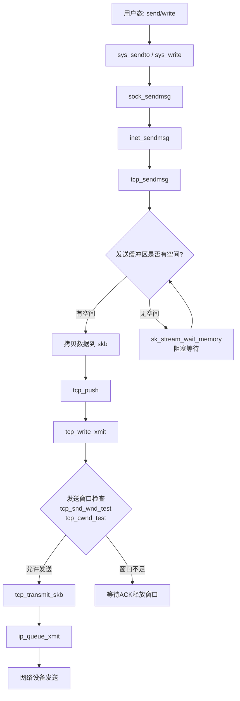

####	tcp_sendmsg 核心实现

[`tcp_sendmsg`](https://elixir.bootlin.com/linux/v4.11.6/source/net/ipv4/tcp.c#L1148) 负责将用户态数据拷贝到内核发送缓冲区（`sk_write_queue`），并触发发送

```cpp
//https://elixir.bootlin.com/linux/v4.11.6/source/net/ipv4/tcp.c#L1148
int tcp_sendmsg(struct sock *sk, struct msghdr *msg, size_t size)
{
	struct tcp_sock *tp = tcp_sk(sk);
	struct sk_buff *skb;
	int flags, err, copied = 0;
	int mss_now = 0, size_goal, copied_syn = 0;
	long timeo;

	lock_sock(sk);

	// 检查连接状态
	flags = msg->msg_flags;
	timeo = sock_sndtimeo(sk, flags & MSG_DONTWAIT);

	// 等待连接建立完成
	if ((1 << sk->sk_state) & ~(TCPF_ESTABLISHED | TCPF_CLOSE_WAIT))
		if ((err = sk_stream_wait_connect(sk, &timeo)) != 0)
			goto do_error;

	// 获取当前MSS和发送目标大小
	mss_now = tcp_send_mss(sk, &size_goal, flags);

	while (msg_data_left(msg)) {
		int copy = 0;
		int max = size_goal;

		// 获取发送队列尾部skb
		skb = tcp_write_queue_tail(sk);
		if (tcp_send_head(sk)) {
			// 计算当前skb还能容纳的数据量
			copy = max - skb->len;
		}

		if (copy <= 0) {
new_segment:
			// 需要分配新的skb
			if (!sk_stream_memory_free(sk))
				goto wait_for_sndbuf;

			skb = sk_stream_alloc_skb(sk, select_size(sk, sg),
						  sk->sk_allocation, skb_queue_empty(&sk->sk_write_queue));
			if (!skb)
				goto wait_for_memory;

			// 将新skb加入发送队列尾部
			skb_entail(sk, skb);
			copy = size_goal;
			max = size_goal;
		}

		if (copy > msg_data_left(msg))
			copy = msg_data_left(msg);

		// 数据拷贝：从用户空间拷贝到skb
		if (skb_availroom(skb) > 0) {
			// 线性区域有空间，直接拷贝
			copy = min_t(int, copy, skb_availroom(skb));
			err = skb_add_data_nocache(sk, skb, &msg->msg_iter, copy);
		} else {
			// 线性区域满了，使用分页区域
			bool merge = true;
			int i = skb_shinfo(skb)->nr_frags;
			// ...分页拷贝逻辑
			err = skb_copy_to_page_nocache(sk, &msg->msg_iter, skb,
						       pfrag->page, pfrag->offset,
						       copy);
		}

		if (unlikely(err)) {
			// 拷贝失败处理
			goto do_fault;
		}

		tp->write_seq += copy;
		TCP_SKB_CB(skb)->end_seq += copy;
		tcp_skb_pcount_set(skb, 0);
		copied += copy;

		// 判断是否触发发送
		if (forced_push(tp)) {
			tcp_mark_push(tp, skb);
			// 触发发送
			__tcp_push_pending_frames(sk, mss_now, TCP_NAGLE_PUSH);
		} else if (skb == tcp_send_head(sk))
			tcp_push_one(sk, mss_now);
		continue;

wait_for_sndbuf:
		set_bit(SOCK_NOSPACE, &sk->sk_socket->flags);
wait_for_memory:
		// 阻塞等待发送缓冲区有空间
		err = sk_stream_wait_memory(sk, &timeo);
		if (err)
			goto do_error;
		mss_now = tcp_send_mss(sk, &size_goal, flags);
	}

out:
	// 最后一次尝试发送所有pending数据
	if (copied)
		tcp_push(sk, flags, mss_now, tp->nonagle, size_goal);
	release_sock(sk);
	return copied + copied_syn;

do_fault:
	......
do_error:
	......
}
```

####	tcp_write_xmit：发送控制核心

[`tcp_write_xmit`](https://elixir.bootlin.com/linux/v4.11.6/source/net/ipv4/tcp_output.c#L2149) 是TCP发送的核心控制函数，负责从发送队列中取出skb，进行窗口检查、拥塞控制检查，然后调用`tcp_transmit_skb`实际发送

```cpp
//https://elixir.bootlin.com/linux/v4.11.6/source/net/ipv4/tcp_output.c#L2149
static bool tcp_write_xmit(struct sock *sk, unsigned int mss_now, int nonagle,
			   int push_one, gfp_t gfp)
{
	struct tcp_sock *tp = tcp_sk(sk);
	struct sk_buff *skb;
	unsigned int tso_segs, sent_pkts;
	int cwnd_quota;

	sent_pkts = 0;

	// 遍历发送队列中待发送的skb
	while ((skb = tcp_send_head(sk))) {
		unsigned int limit;

		tso_segs = tcp_init_tso_segs(skb, mss_now);

		// 拥塞窗口检查：还能发送多少段
		cwnd_quota = tcp_cwnd_test(tp, skb);
		if (!cwnd_quota) {
			// 拥塞窗口不允许发送更多数据
			if (push_one == 2)
				cwnd_quota = 1;
			else
				break;
		}

		// 发送窗口检查
		if (unlikely(!tcp_snd_wnd_test(tp, skb, mss_now)))
			break;

		// Nagle算法检查
		if (tso_segs == 1) {
			if (unlikely(!tcp_nagle_test(tp, skb, mss_now,
						    (tcp_skb_is_last(sk, skb) ?
						     nonagle : TCP_NAGLE_PUSH))))
				break;
		}

		// TSO分段
		limit = mss_now;
		if (tso_segs > 1 && !tcp_urg_mode(tp))
			limit = tcp_mss_split_point(sk, skb, mss_now,
						    min_t(unsigned int,
							  cwnd_quota,
							  sk->sk_gso_max_segs),
						    nonagle);

		if (skb->len > limit &&
		    unlikely(tso_fragment(sk, skb, limit, mss_now, gfp)))
			break;

		if (unlikely(tcp_transmit_skb(sk, skb, 1, gfp)))
			break;

		// 更新发送队列头指针
		tcp_event_new_data_sent(sk, skb);
		tcp_minshall_update(tp, mss_now, skb);
		sent_pkts += tcp_skb_pcount(skb);

		if (push_one)
			break;
	}

	if (likely(sent_pkts)) {
		if (tcp_in_cwnd_reduction(sk))
			tp->prr_out += sent_pkts;
		// 设置/重置重传定时器
		tcp_cwnd_validate(sk);
		return false;
	}
	// 没有发送任何数据（窗口满等）
	return !tp->packets_out && tcp_send_head(sk);
}
```

####	tcp_transmit_skb：构造TCP报文

[`tcp_transmit_skb`](https://elixir.bootlin.com/linux/v4.11.6/source/net/ipv4/tcp_output.c#L949) 负责为skb添加TCP头部，计算校验和，并调用IP层发送

```cpp
//https://elixir.bootlin.com/linux/v4.11.6/source/net/ipv4/tcp_output.c#L949
static int tcp_transmit_skb(struct sock *sk, struct sk_buff *skb, int clone_it,
			    gfp_t gfp_mask)
{
	const struct inet_connection_sock *icsk = inet_csk(sk);
	struct tcp_sock *tp = tcp_sk(sk);
	struct tcp_skb_cb *tcb = TCP_SKB_CB(skb);
	struct tcphdr *th;
	int err;

	// 克隆skb（发送队列中保留原始skb用于可能的重传）
	if (clone_it) {
		skb = skb_clone(skb, gfp_mask);
		if (unlikely(!skb))
			return -ENOBUFS;
	}

	// 构造TCP头部
	skb_push(skb, tcp_header_size);
	skb_reset_transport_header(skb);

	th = (struct tcphdr *)skb->data;
	th->source = inet->inet_sport;
	th->dest = inet->inet_dport;
	th->seq = htonl(tcb->seq);
	th->ack_seq = htonl(tp->rcv_nxt);  // 捎带ACK
	// 设置头部长度和标志位
	tcp_options_write((__be32 *)(th + 1), tp, &opts);
	th->window = htons(min(tp->rcv_wnd, 65535U));  // 通告接收窗口
	th->check = 0;
	th->urg_ptr = 0;

	// 计算校验和
	icsk->icsk_af_ops->send_check(sk, skb);

	// 调用IP层发送
	err = icsk->icsk_af_ops->queue_xmit(sk, skb, &inet->cork.fl);
	// 对于IPv4，queue_xmit = ip_queue_xmit

	if (likely(err <= 0))
		return err;

	tcp_enter_cwr(sk);
	return net_xmit_eval(err);
}
```

##	0x0C	数据传输：接收路径 tcp_recvmsg
前面章节简单介绍了数据在内核层的接收过程，本小节看下应用层是如何接收数据的。用户进程调用`recv()`/`read()`接收数据时，最终进入`tcp_recvmsg`。接收路径的核心调用链：

```text
recv()/read()
    |-- sock_recvmsg()
        |-- sock->ops->recvmsg()  # inet_recvmsg
            |-- sk->sk_prot->recvmsg()  # tcp_recvmsg
                |-- skb_copy_datagram_msg()  # 从sk_receive_queue拷贝到用户空间
```

核心流程图如下：

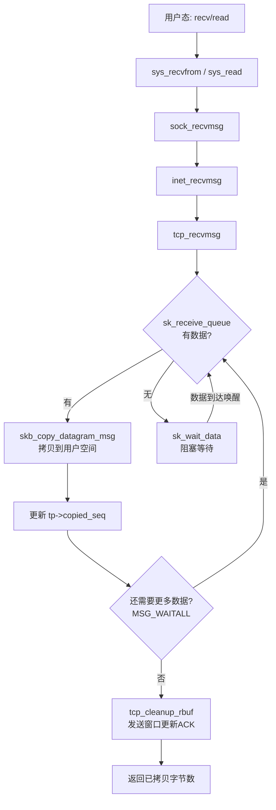

####	tcp_recvmsg 核心实现

[`tcp_recvmsg`](https://elixir.bootlin.com/linux/v4.11.6/source/net/ipv4/tcp.c#L1594) 从接收队列中读取数据并拷贝到用户空间

```cpp
//https://elixir.bootlin.com/linux/v4.11.6/source/net/ipv4/tcp.c#L1594
int tcp_recvmsg(struct sock *sk, struct msghdr *msg, size_t len, int nonblock,
		int flags, int *addr_len)
{
	struct tcp_sock *tp = tcp_sk(sk);
	int copied = 0;
	u32 peek_seq;
	u32 *seq;
	unsigned long used;
	int err;
	int target;
	long timeo;
	struct sk_buff *skb, *last;

	lock_sock(sk);

	err = -ENOTCONN;
	if (sk->sk_state == TCP_LISTEN)
		goto out;

	timeo = sock_rcvtimeo(sk, nonblock);

	// target: 最少需要读取的字节数
	// 如果设置了MSG_WAITALL，则target=len；否则target=1
	target = sock_rcvlowat(sk, flags & MSG_WAITALL, len);

	seq = &tp->copied_seq;  // 已拷贝的序列号

	do {
		u32 offset;

		// 遍历接收队列
		skb_queue_walk(&sk->sk_receive_queue, skb) {
			last = skb;
			offset = *seq - TCP_SKB_CB(skb)->seq;
			if (offset < skb->len)
				goto found_ok_skb;
			// 检查FIN
			if (TCP_SKB_CB(skb)->tcp_flags & TCPHDR_FIN)
				goto found_fin_ok;
		}

		// 接收队列为空，检查是否还有数据未到
		if (copied >= target)
			break;  // 已满足最低需求

		if (copied) {
			if (sk->sk_err || sk->sk_state == TCP_CLOSE ||
			    (sk->sk_shutdown & RCV_SHUTDOWN) || !timeo ||
			    signal_pending(current))
				break;
		}

		// 阻塞等待数据到达
		if (!timeo) {
			copied = -EAGAIN;
			break;
		}

		// 先清理接收缓冲区，可能发送窗口更新ACK
		//todo：tcp_cleanup_rbuf的作用
		tcp_cleanup_rbuf(sk, copied);

		// 等待数据
		sk_wait_data(sk, &timeo, last);
		continue;

found_ok_skb:
		// 计算本次可拷贝的数据量
		used = skb->len - offset;
		if (len < used)
			used = len;

		// 拷贝数据到用户空间
		err = skb_copy_datagram_msg(skb, offset, msg, used);
		if (err) {
			if (!copied)
				copied = -EFAULT;
			break;
		}

		*seq += used;
		copied += used;
		len -= used;

		// 释放已读取的skb
		tcp_rcv_space_adjust(sk);

		if (!(flags & MSG_PEEK)) {
			// 非PEEK模式下释放已读完的skb
			sk_eat_skb(sk, skb);
		}

		continue;

found_fin_ok:
		++*seq;
		break;
	} while (len > 0);

out:
	// 发送窗口更新
	tcp_cleanup_rbuf(sk, copied);
	release_sock(sk);
	return copied;
}
```

####	理解TCP的全双工本质

从tcp sock的结构，不难理解TCP协议全双工（Full-Duplex）的本质，**正是因为每一个 socket 都拥有一套完全独立的发送和接收队列（以及对应的缓冲区和状态控制变量）**，互不干扰

1、独立的队列结构

在内核的 `struct sock` 和 `struct tcp_sock` 中，发送和接收是由两套完全分离的队列和指针管理的，小结一下：

-	发送流水线（Write / Send Path）：应用层调用 write() 或 send() 写入数据时
	-	队列：数据会被切分成 `sk_buff`（网络数据包结构体），放进 `sk->sk_write_queue`（发送队列）
	-	控制：内核的发送引擎（如 `tcp_write_xmit()`）会从这个队列里取出包，经过 IP 层、驱动层扔到网卡上
	-	状态：拥塞控制和发送窗口由 `tcp_sk(sk)->snd_nxt`（下一个要发送的序号）和 `snd_una`（最早未确认的序号）独立控制
-	接收流水线（Read / Receive Path）：当网卡收到对端发来的数据包时
	-	队列：经过 `tcp_v4_rcv` 的层层校验后，有序的数据包会被放入 `sk->sk_receive_queue`（接收队列）
	-	读取：当应用层调用 `read()/recv()` 时，其实就是从接收队列里把数据拷贝到用户空间，然后释放内存
	-	状态：接收窗口和滑动窗口由 `tcp_sk(sk)->rcv_nxt`（期望接收的下一个序号）和 `rcv_wnd` 独立控制

2、状态机的独立性：互不影响的序号，即两端（客户端/服务器）的序号（Sequence Number）是完全独立的

-	A 给 B 发数据，使用的是 A 的 ISN（初始序号）自增序列
-	B 给 A 发数据，使用的是 B 的 ISN 自增序列

因为发送队列和接收队列各自维护着自己的 Sequence Number 和 Acknowledgment Number，所以 A 在拼命给 B 发送大文件的同时，B 也可以随时给 A 发送控制指令。A 内部的发送控制块和接收控制块在逻辑上是并发且互不干扰的

3、**不影响之中的微妙联系**，在实际运行中，存在着非常smart的捎带确认和流量控制算法，如

-	ACK 的捎带回复：当接收队列收到了数据，本该单独回一个 ACK 包。但如果此时发送队列也刚好有数据要发出去，内核就会把这个 ACK 标志位和确认号直接塞进发送队列的那个数据包的报头里。两条流水线在这里产生了一次完美的交集，省去了一个网络包的开销
-	窗口的相互制约（流量控制）：如果应用程序迟迟不调用 `read()`，导致 `sk_receive_queue`爆满，内核在发送数据或回 ACK 时，就会把报头里的 window（接收窗口size）改成 `0`。对端收到后，它的发送流水线就会被迫挂起

##	0x0D	TCP 状态图变迁总览

####	4.11.6 内核 TCP 状态机

内核 4.11.6 版本中TCP状态定义（含`TCP_NEW_SYN_RECV`）：

```cpp
//https://elixir.bootlin.com/linux/v4.11.6/source/include/net/tcp_states.h
enum {
	TCP_ESTABLISHED = 1,
	TCP_SYN_SENT,
	TCP_SYN_RECV,
	TCP_FIN_WAIT1,
	TCP_FIN_WAIT2,
	TCP_TIME_WAIT,
	TCP_CLOSE,
	TCP_CLOSE_WAIT,
	TCP_LAST_ACK,
	TCP_LISTEN,
	TCP_CLOSING,
	TCP_NEW_SYN_RECV,  // 4.x内核新增
	TCP_MAX_STATES
};
```

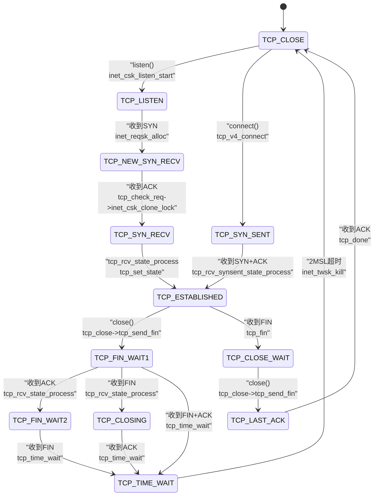

####	各阶段状态变迁与触发函数对照表

| 状态变迁 | 触发事件 | 内核函数 | 方向 |
|---------|---------|---------|------|
| CLOSE -> LISTEN | listen() | `inet_csk_listen_start` | Server |
| CLOSE -> SYN_SENT | connect() | `tcp_v4_connect->tcp_set_state` | Client |
| LISTEN -> NEW_SYN_RECV | 收到SYN | `inet_reqsk_alloc` | Server |
| NEW_SYN_RECV -> SYN_RECV | 收到ACK | `inet_csk_clone_lock` | Server |
| SYN_SENT -> ESTABLISHED | 收到SYN+ACK | `tcp_finish_connect` | Client |
| SYN_RECV -> ESTABLISHED | 处理ACK | `tcp_rcv_state_process` | Server |
| ESTABLISHED -> FIN_WAIT1 | close() | `tcp_close->tcp_send_fin` | 主动关闭方 |
| ESTABLISHED -> CLOSE_WAIT | 收到FIN | `tcp_fin` | 被动关闭方 |
| FIN_WAIT1 -> FIN_WAIT2 | 收到ACK | `tcp_rcv_state_process` | 主动关闭方 |
| FIN_WAIT2 -> TIME_WAIT | 收到FIN | `tcp_time_wait` | 主动关闭方 |
| CLOSE_WAIT -> LAST_ACK | close() | `tcp_close->tcp_send_fin` | 被动关闭方 |
| LAST_ACK -> CLOSE | 收到ACK | `tcp_done` | 被动关闭方 |
| TIME_WAIT -> CLOSE | 2MSL超时 | `inet_twsk_kill` | 主动关闭方 |

##	0x0E	TCP 重传机制

TCP重传是保证可靠传输的核心机制。内核实现了多种重传策略：超时重传（RTO-based）、快速重传（Fast Retransmit）和基于SACK的选择重传

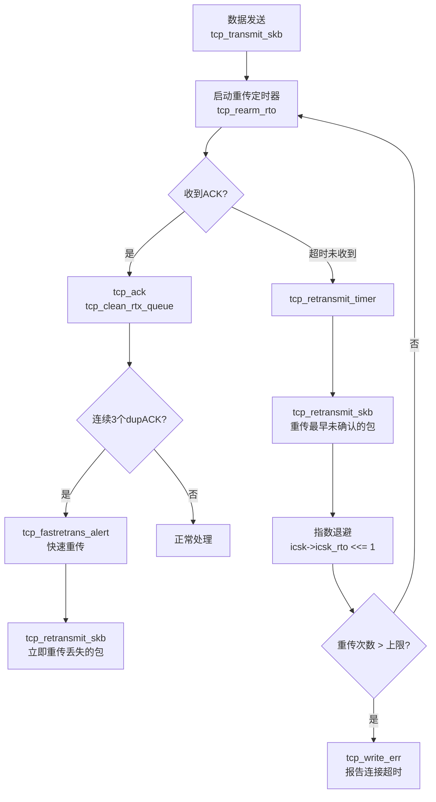

####	超时重传：tcp_retransmit_timer

当重传定时器超时触发时，内核调用[`tcp_retransmit_timer`](https://elixir.bootlin.com/linux/v4.11.6/source/net/ipv4/tcp_timer.c#L170)

```cpp
//https://elixir.bootlin.com/linux/v4.11.6/source/net/ipv4/tcp_timer.c#L170
void tcp_retransmit_timer(struct sock *sk)
{
	struct tcp_sock *tp = tcp_sk(sk);
	struct inet_connection_sock *icsk = inet_csk(sk);

	if (!tp->packets_out)
		goto out;

	// 检查是否超过重传上限
	if (icsk->icsk_retransmits && !tp->snd_wnd &&
	    !sock_flag(sk, SOCK_DEAD)) {
		// 零窗口探测超时
		......
	}

	// 尝试重传
	if (tcp_retransmit_skb(sk, tcp_write_queue_head(sk), 1) > 0) {
		// 重传失败（如内存不足），重置定时器稍后重试
		inet_csk_reset_xmit_timer(sk, ICSK_TIME_RETRANS,
					  min(icsk->icsk_rto, TCP_RESOURCE_PROBE_INTERVAL),
					  TCP_RTO_MAX);
		goto out;
	}

	// RTO指数退避（Exponential Backoff）
	icsk->icsk_backoff++;
	icsk->icsk_retransmits++;

	// 重传超过上限（net.ipv4.tcp_retries2，默认15次）
	if (icsk->icsk_retransmits >= sysctl_tcp_retries2) {
		tcp_write_err(sk);  // 报告连接超时，通知应用层
		return;
	}

	// 进入Loss状态，重置拥塞窗口
	tcp_enter_loss(sk);

	// 设置新的超时时间（指数退避）
	icsk->icsk_rto = min(icsk->icsk_rto << 1, TCP_RTO_MAX);
	inet_csk_reset_xmit_timer(sk, ICSK_TIME_RETRANS, icsk->icsk_rto, TCP_RTO_MAX);
}
```

####	tcp_retransmit_skb：执行重传

[`tcp_retransmit_skb`](https://elixir.bootlin.com/linux/v4.11.6/source/net/ipv4/tcp_output.c#L2765) 负责实际重传一个skb

```cpp
//https://elixir.bootlin.com/linux/v4.11.6/source/net/ipv4/tcp_output.c#L2765
int tcp_retransmit_skb(struct sock *sk, struct sk_buff *skb, int segs)
{
	struct tcp_sock *tp = tcp_sk(sk);
	int err = __tcp_retransmit_skb(sk, skb, segs);

	if (err == 0) {
		// 重传成功
		TCP_SKB_CB(skb)->sacked |= TCPCB_RETRANS;
		tp->retrans_out += tcp_skb_pcount(skb);
	}
	// 更新统计
	if (tp->undo_retrans < 0)
		tp->undo_retrans = 0;
	tp->undo_retrans += tcp_skb_pcount(skb);
	return err;
}
```

####	RTO 计算

RTO（Retransmission Timeout）基于RTT（Round Trip Time）的测量动态调整。内核使用Jacobson/Karels算法

```cpp
//https://elixir.bootlin.com/linux/v4.11.6/source/net/ipv4/tcp_input.c#L720
static void tcp_rtt_estimator(struct sock *sk, long mrtt_us)
{
	struct tcp_sock *tp = tcp_sk(sk);
	long m = mrtt_us;
	u32 srtt = tp->srtt_us;

	if (srtt != 0) {
		// SRTT = SRTT + 1/8 * (RTT - SRTT)
		m -= (srtt >> 3);
		srtt += m;
		if (m < 0) {
			m = -m;
			m -= (tp->mdev_us >> 2);
			if (m > 0)
				m >>= 3;
		} else {
			m -= (tp->mdev_us >> 2);
		}
		// RTTVAR = RTTVAR + 1/4 * (|RTT - SRTT| - RTTVAR)
		tp->mdev_us += m;
		if (tp->mdev_us > tp->mdev_max_us) {
			tp->mdev_max_us = tp->mdev_us;
			if (tp->mdev_max_us > tp->rttvar_us)
				tp->rttvar_us = tp->mdev_max_us;
		}
	} else {
		// 首次RTT测量
		srtt = m << 3;
		tp->mdev_us = m << 1;
		tp->rttvar_us = max(tp->mdev_us, tcp_rto_min_us(sk));
		tp->mdev_max_us = tp->rttvar_us;
	}
	tp->srtt_us = max(1U, srtt);
}

// RTO = SRTT + 4 * RTTVAR
static inline void tcp_set_rto(struct sock *sk)
{
	const struct tcp_sock *tp = tcp_sk(sk);
	inet_csk(sk)->icsk_rto = __tcp_set_rto(tp);
	tcp_bound_rto(sk);  // 限制在 [TCP_RTO_MIN, TCP_RTO_MAX] 之间
}
```

####	快速重传：tcp_fastretrans_alert

当收到`3`个重复ACK时触发快速重传，无需等待RTO超时。核心处理在[`tcp_fastretrans_alert`](https://elixir.bootlin.com/linux/v4.11.6/source/net/ipv4/tcp_input.c#L2700)

```cpp
//https://elixir.bootlin.com/linux/v4.11.6/source/net/ipv4/tcp_input.c#L2700
static void tcp_fastretrans_alert(struct sock *sk, const int acked,
				  bool is_dupack, int *ack_flag, int *rexmit)
{
	struct inet_connection_sock *icsk = inet_csk(sk);
	struct tcp_sock *tp = tcp_sk(sk);

	// 拥塞状态机
	switch (icsk->icsk_ca_state) {
	case TCP_CA_Open:
		// 正常状态，检查是否需要进入Recovery
		if (is_dupack)
			tp->dup_ack_counter++;
		if (tp->dup_ack_counter >= tp->reordering) {
			// 达到快速重传阈值（默认3个dupACK）
			tcp_enter_recovery(sk, false);
			// 标记需要重传
			*rexmit = REXMIT_NEW;
		}
		break;

	case TCP_CA_Recovery:
		// Recovery状态，继续进行选择性重传
		if (tcp_try_undo_recovery(sk))
			return;
		// PRR算法控制发送速率
		*rexmit = REXMIT_NEW;
		break;

	case TCP_CA_Loss:
		// Loss状态（超时重传后）
		tcp_try_undo_loss(sk, false);
		break;
	}
}
```

####	SACK（选择性确认）

SACK允许接收方告知发送方哪些数据段已经成功接收，使发送方仅重传真正丢失的段。内核在`tcp_sacktag_write_queue`[函数](https://elixir.bootlin.com/linux/v4.11.6/source/net/ipv4/tcp_input.c#L1643)中处理SACK信息：

TODO

```c
// SACK处理的核心逻辑（简化）
// 当收到带SACK选项的ACK时，tcp_ack->tcp_sacktag_write_queue
// 标记发送队列中哪些skb已被接收方确认（TCPCB_SACKED_ACKED）
// 哪些是确认有丢失的（hole），需要重传
```

关键sysctl参数：
- `net.ipv4.tcp_retries1`：放弃前的软重传次数（默认`3`），超过后通知IP层更新路由
- `net.ipv4.tcp_retries2`：放弃前的硬重传次数（默认`15`），超过后断开连接
- `net.ipv4.tcp_sack`：是否启用SACK（默认`1`）

##	0x0F	TCP 拥塞控制

TCP拥塞控制防止发送方向网络注入过多数据导致网络崩溃。内核实现了可插拔的拥塞控制框架，默认算法为CUBIC

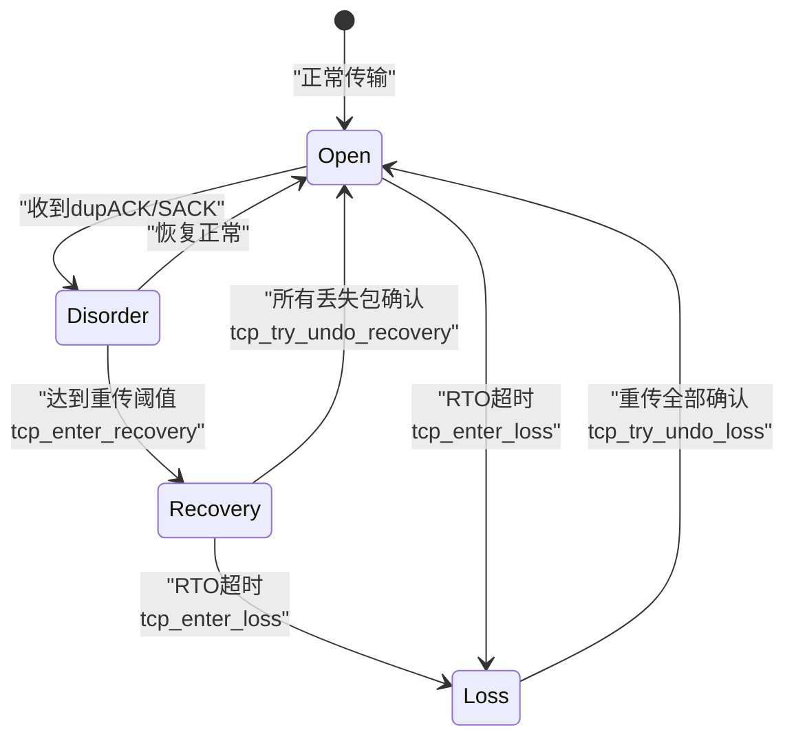

####	拥塞控制框架

内核通过`struct tcp_congestion_ops`定义拥塞控制算法的接口：

```cpp
//https://elixir.bootlin.com/linux/v4.11.6/source/include/net/tcp.h#L952
struct tcp_congestion_ops {
	struct list_head	list;
	u32 key;
	u32 flags;
	// 初始化
	void (*init)(struct sock *sk);
	// 释放
	void (*release)(struct sock *sk);
	// 每收到一个ACK时调用，更新拥塞窗口
	void (*cong_avoid)(struct sock *sk, u32 ack, u32 acked);
	// 设置慢启动阈值
	u32  (*ssthresh)(struct sock *sk);
	// 拥塞控制主函数（新接口，CUBIC使用）
	void (*cong_control)(struct sock *sk, const struct rate_sample *rs);
	// 拥塞窗口撤销
	u32  (*undo_cwnd)(struct sock *sk);
	// 状态变更通知
	void (*set_state)(struct sock *sk, u8 new_state);
	// PKT事件（如ECN等）
	void (*pkts_acked)(struct sock *sk, const struct ack_sample *sample);
	char name[TCP_CA_NAME_MAX];
	struct module *owner;
};
```

拥塞控制初始化在连接建立时调用：

```cpp
//https://elixir.bootlin.com/linux/v4.11.6/source/net/ipv4/tcp_cong.c#L177
void tcp_init_congestion_control(struct sock *sk)
{
	const struct inet_connection_sock *icsk = inet_csk(sk);
	// 调用算法的init函数
	if (icsk->icsk_ca_ops->init)
		icsk->icsk_ca_ops->init(sk);
	// 标记为打开状态
	if (tcp_ca_needs_ecn(sk))
		INET_ECN_xmit(sk);
	else
		INET_ECN_dontxmit(sk);
	icsk->icsk_ca_initialized = 1;
}
```

####	慢启动与拥塞避免

[`tcp_cong_avoid`](https://elixir.bootlin.com/linux/v4.11.6/source/net/ipv4/tcp_input.c#L3401) 在每次收到有效ACK时被调用

```cpp
static void tcp_cong_avoid(struct sock *sk, u32 ack, u32 acked)
{
	const struct inet_connection_sock *icsk = inet_csk(sk);

	// 调用注册的拥塞控制算法
	icsk->icsk_ca_ops->cong_avoid(sk, ack, acked);
	// 限制cwnd不超过最大值
	tp->snd_cwnd_stamp = tcp_time_stamp;
}
```

以Reno算法为例说明基本逻辑：

```cpp
// 慢启动：cwnd < ssthresh 时，每收到一个ACK，cwnd += 1（指数增长）
// 拥塞避免：cwnd >= ssthresh 时，每个RTT，cwnd += 1（线性增长）
void tcp_reno_cong_avoid(struct sock *sk, u32 ack, u32 acked)
{
	struct tcp_sock *tp = tcp_sk(sk);

	if (!tcp_is_cwnd_limited(sk))
		return;

	if (tcp_in_slow_start(tp)) {
		// 慢启动阶段
		acked = tcp_slow_start(tp, acked);
		if (!acked)
			return;
	}
	// 拥塞避免阶段
	tcp_cong_avoid_ai(tp, tp->snd_cwnd, acked);
}

// 慢启动实现
u32 tcp_slow_start(struct tcp_sock *tp, u32 acked)
{
	u32 cwnd = min(tp->snd_cwnd + acked, tp->snd_ssthresh);
	acked -= cwnd - tp->snd_cwnd;
	tp->snd_cwnd = min(cwnd, tp->snd_cwnd_clamp);
	return acked;
}
```

####	快速恢复与进入Recovery

```cpp
//https://elixir.bootlin.com/linux/v4.11.6/source/net/ipv4/tcp_input.c#L2590
static void tcp_enter_recovery(struct sock *sk, bool ece_ack)
{
	struct tcp_sock *tp = tcp_sk(sk);
	int mib_idx;

	// 记录进入Recovery时的状态
	tp->prior_ssthresh = tcp_current_ssthresh(sk);
	tcp_init_undo(tp);

	// 设置新的ssthresh（通常为cwnd的一半）
	tp->snd_ssthresh = inet_csk(sk)->icsk_ca_ops->ssthresh(sk);
	// 设置Recovery点
	tp->high_seq = tp->snd_nxt;
	tp->prr_delivered = 0;
	tp->prr_out = 0;

	// 进入Recovery状态
	inet_csk(sk)->icsk_ca_state = TCP_CA_Recovery;
}

// Loss状态进入（RTO超时）
void tcp_enter_loss(struct sock *sk)
{
	struct tcp_sock *tp = tcp_sk(sk);
	struct inet_connection_sock *icsk = inet_csk(sk);

	// 标记所有发送队列中的skb为丢失
	tcp_timeout_mark_lost(sk);

	// cwnd重置为1
	tp->snd_cwnd = 1;
	tp->snd_cwnd_cnt = 0;
	tp->snd_ssthresh = icsk->icsk_ca_ops->ssthresh(sk);

	tcp_set_ca_state(sk, TCP_CA_Loss);
	tp->high_seq = tp->snd_nxt;

	// 重置重传计数
	tcp_ecn_queue_cwr(tp);
}
```

####	CUBIC 算法

CUBIC是Linux默认的拥塞控制算法（`net.ipv4.tcp_congestion_control = cubic`），其核心思想是使用三次函数（cubic function）来计算拥塞窗口，使得窗口增长速率与上次发生丢包时的窗口大小相关

```cpp
//https://elixir.bootlin.com/linux/v4.11.6/source/net/ipv4/tcp_cubic.c
// W(t) = C * (t - K)^3 + Wmax
// K = cubic_root(Wmax * beta / C)
// C: 缩放常数
// Wmax: 上次丢包时的窗口大小
// beta: 乘性减少因子（默认0.7）

static void cubictcp_cong_avoid(struct sock *sk, u32 ack, u32 acked)
{
	struct tcp_sock *tp = tcp_sk(sk);
	struct bictcp *ca = inet_csk_ca(sk);

	if (!tcp_is_cwnd_limited(sk))
		return;

	if (tcp_in_slow_start(tp)) {
		// 慢启动使用超级慢启动
		if (hystart && after(ack, ca->end_seq))
			bictcp_hystart_reset(sk);
		acked = tcp_slow_start(tp, acked);
		if (!acked)
			return;
	}
	// CUBIC的拥塞避免
	bictcp_update(ca, tp->snd_cwnd, acked);
	tcp_cong_avoid_ai(tp, ca->cnt, acked);
}
```

##	0x10	TCP 窗口机制

TCP通过滑动窗口实现流量控制，确保发送方不会压垮接收方的缓冲区。窗口机制涉及发送窗口、接收窗口和拥塞窗口三个维度

####	有效发送窗口

发送方实际能发送的数据量由三个窗口共同决定：

```text
有效窗口 = min(cwnd, rwnd) - (snd_nxt - snd_una)
         = min(拥塞窗口, 接收窗口) - 已发送未确认的数据量
```

```cpp
// 发送窗口检查
//https://elixir.bootlin.com/linux/v4.11.6/source/net/ipv4/tcp_output.c#L1560
static bool tcp_snd_wnd_test(const struct tcp_sock *tp,
			     const struct sk_buff *skb,
			     unsigned int cur_mss)
{
	u32 end_seq = TCP_SKB_CB(skb)->end_seq;

	if (skb->len > cur_mss)
		end_seq = TCP_SKB_CB(skb)->seq + cur_mss;

	// snd_una + snd_wnd 即发送窗口的右边界
	return !after(end_seq, tcp_wnd_end(tp));
}

static inline u32 tcp_wnd_end(const struct tcp_sock *tp)
{
	return tp->snd_una + tp->snd_wnd;
}

// 拥塞窗口检查
static unsigned int tcp_cwnd_test(const struct tcp_sock *tp,
				  const struct sk_buff *skb)
{
	u32 in_flight, cwnd;

	in_flight = tcp_packets_in_flight(tp);  // 在途数据包数
	cwnd = tp->snd_cwnd;
	if (in_flight < cwnd)
		return (cwnd - in_flight);  // 还能发送的包数
	return 0;
}
```

####	接收窗口通告

接收方通过`tcp_select_window`计算并通告接收窗口大小：

```cpp
//https://elixir.bootlin.com/linux/v4.11.6/source/net/ipv4/tcp_output.c#L248
static u16 tcp_select_window(struct sock *sk)
{
	struct tcp_sock *tp = tcp_sk(sk);
	u32 old_win = tp->rcv_wnd;
	u32 cur_win = tcp_receive_window(tp);
	u32 new_win = __tcp_select_window(sk);

	// 窗口不能缩小（RFC规定）
	if (new_win < cur_win) {
		// 右边界不能回退
		new_win = ALIGN(cur_win, 1 << tp->rx_opt.rcv_wscale);
	}
	tp->rcv_wnd = new_win;
	tp->rcv_wup = tp->rcv_nxt;

	// 窗口缩放
	return min(new_win, 65535U) >> tp->rx_opt.rcv_wscale;
}

//https://elixir.bootlin.com/linux/v4.11.6/source/net/ipv4/tcp_output.c#L213
u32 __tcp_select_window(struct sock *sk)
{
	struct inet_connection_sock *icsk = inet_csk(sk);
	struct tcp_sock *tp = tcp_sk(sk);
	int mss = icsk->icsk_ack.rcv_mss;
	int free_space = tcp_space(sk);  // 当前可用接收缓冲区
	int allowed_space = tcp_full_space(sk);
	int full_space = min_t(int, tp->window_clamp, allowed_space);
	int window;

	if (free_space < (full_space >> 1)) {
		// 可用空间不足一半时，避免SWS
		icsk->icsk_ack.quick = 0;
		if (free_space < mss)
			return 0;  // 通告零窗口
	}

	// 通告窗口为可用空间（向下对齐MSS）
	window = tp->rcv_wnd;
	if (window <= free_space - mss || window > free_space)
		window = (free_space / mss) * mss;

	return window;
}
```

####	接收窗口自动调整

`tcp_rcv_space_adjust`根据实际接收速率动态调整接收缓冲区大小

```cpp
//https://elixir.bootlin.com/linux/v4.11.6/source/net/ipv4/tcp_input.c#L580
void tcp_rcv_space_adjust(struct sock *sk)
{
	struct tcp_sock *tp = tcp_sk(sk);
	int time;
	int copied;

	time = tcp_time_stamp - tp->rcvq_space.time;
	if (time < (tp->rcv_rtt_est.rtt >> 3) || tp->rcv_rtt_est.rtt == 0)
		return;

	// 计算这段时间内的接收速率
	copied = tp->copied_seq - tp->rcvq_space.seq;
	if (copied <= tp->rcvq_space.space)
		goto new_measure;

	// 增大接收缓冲区
	if (sysctl_tcp_moderate_rcvbuf &&
	    !(sk->sk_userlocks & SOCK_RCVBUF_LOCK)) {
		int rcvwin, rcvmem, rcvbuf;

		rcvwin = (copied << 1) + 16 * tp->advmss;
		// 需要为每个包预留struct sk_buff开销
		rcvmem = SKB_TRUESIZE(tp->advmss + MAX_TCP_HEADER);
		while (googletcp_space_from_win(sk, rcvwin) < rcvmem)
			rcvwin += tp->advmss;

		rcvbuf = min(rcvwin / googletcp_space_overhead(sk),
			     sysctl_tcp_rmem[2]);
		if (rcvbuf > sk->sk_rcvbuf) {
			sk->sk_rcvbuf = rcvbuf;
			tp->window_clamp = rcvwin;
		}
	}
	tp->rcvq_space.space = copied;

new_measure:
	tp->rcvq_space.seq = tp->copied_seq;
	tp->rcvq_space.time = tcp_time_stamp;
}
```

####	零窗口探测

当接收方通告窗口为`0`时，发送方启动Persist Timer进行零窗口探测

```cpp
//https://elixir.bootlin.com/linux/v4.11.6/source/net/ipv4/tcp_timer.c#L296
static void tcp_probe_timer(struct sock *sk)
{
	struct inet_connection_sock *icsk = inet_csk(sk);
	struct tcp_sock *tp = tcp_sk(sk);

	if (tp->packets_out || !tcp_send_head(sk)) {
		icsk->icsk_probes_out = 0;
		return;
	}

	// 超过探测上限，报告错误
	if (icsk->icsk_probes_out > sysctl_tcp_retries2) {
		tcp_write_err(sk);
		return;
	}

	// 发送窗口探测包（1字节数据）
	tcp_send_probe0(sk);
}

// 窗口探测在tcp_ack中检测到窗口更新时解除：
// 当收到ACK且窗口>0时，tcp_may_update_window会更新snd_wnd
```

####	Nagle算法

Nagle算法减少小包发送，与窗口机制配合使用

```cpp
// Nagle检查：在tcp_write_xmit中调用
static inline bool tcp_nagle_test(const struct tcp_sock *tp,
				  const struct sk_buff *skb,
				  unsigned int cur_mss, int nonagle)
{
	// TCP_NODELAY关闭Nagle
	if (nonagle & TCP_NAGLE_PUSH)
		return true;

	// 没有未确认的数据，直接发送
	if (!tp->packets_out)
		return true;

	// 数据填满一个MSS，直接发送
	if (skb->len >= cur_mss)
		return true;

	// 有小包且有未确认数据，延迟发送（Nagle）
	return false;
}
```

##	0x11	四次挥手的过程

TCP连接的关闭涉及四次挥手，内核通过`tcp_close`/`tcp_shutdown`发起主动关闭，通过`tcp_fin`处理被动关闭

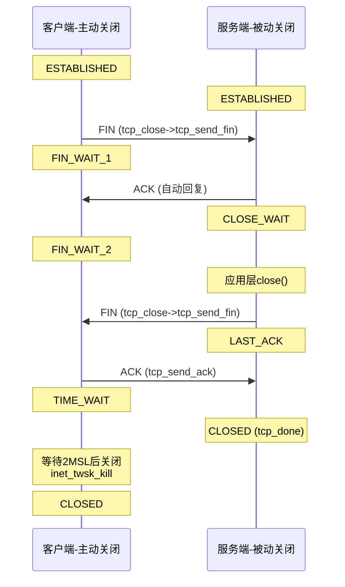

####	主动关闭：tcp_close

[`tcp_close`](https://elixir.bootlin.com/linux/v4.11.6/source/net/ipv4/tcp.c#L2079) 是用户调用`close()`时的TCP层处理函数

```cpp
//https://elixir.bootlin.com/linux/v4.11.6/source/net/ipv4/tcp.c#L2079
void tcp_close(struct sock *sk, long timeout)
{
	struct sk_buff *skb;
	int data_was_unread = 0;
	int state;

	lock_sock(sk);
	sk->sk_shutdown = SHUTDOWN_MASK;

	if (sk->sk_state == TCP_LISTEN) {
		// LISTEN状态直接关闭
		tcp_set_state(sk, TCP_CLOSE);
		inet_csk_listen_stop(sk);
		goto adjudge_to_death;
	}

	// 清空接收队列中未读数据
	while ((skb = __skb_dequeue(&sk->sk_receive_queue)) != NULL) {
		u32 len = TCP_SKB_CB(skb)->end_seq - TCP_SKB_CB(skb)->seq;
		if (TCP_SKB_CB(skb)->tcp_flags & TCPHDR_FIN)
			len--;
		data_was_unread += len;
		__kfree_skb(skb);
	}

	// 如果有未读数据，发送RST而非正常FIN
	if (data_was_unread) {
		tcp_set_state(sk, TCP_CLOSE);
		tcp_send_active_reset(sk, sk->sk_allocation);
	} else if (sock_flag(sk, SOCK_LINGER) && !sk->sk_lingertime) {
		// SO_LINGER且linger=0，也发送RST
		tcp_disconnect(sk, 0);
	} else if (tcp_close_state(sk)) {
		// 正常关闭：发送FIN（主动关闭的一端）
		tcp_send_fin(sk);
	}

	// 等待FIN_WAIT_2超时或进入TIME_WAIT
	......

adjudge_to_death:
	// 孤儿socket处理
	sock_hold(sk);
	sock_orphan(sk);
	release_sock(sk);

	// 设置TIME_WAIT或者直接关闭
	......
}
```

####	发送FIN：tcp_send_fin
继续，`tcp_send_fin`发送FIN包的逻辑

```cpp
//https://elixir.bootlin.com/linux/v4.11.6/source/net/ipv4/tcp_output.c#L2856
void tcp_send_fin(struct sock *sk)
{
	struct sk_buff *skb, *tskb = tcp_write_queue_tail(sk);
	struct tcp_sock *tp = tcp_sk(sk);

	// 尝试在发送队列最后一个skb上附加FIN标志
	if (tskb && (tcp_send_head(sk) || tcp_under_memory_pressure(sk))) {
coalesce:
		TCP_SKB_CB(tskb)->tcp_flags |= TCPHDR_FIN;
		TCP_SKB_CB(tskb)->end_seq++;
		tp->write_seq++;
		// 如果该skb尚未发送，会随数据一起发送
		if (tcp_send_head(sk) != NULL) {
			return;
		}
	} else {
		// 需要分配新的skb发送纯FIN
		skb = alloc_skb_fclone(MAX_TCP_HEADER, sk->sk_allocation);
		if (unlikely(!skb)) {
			// 内存不足，退回到附加模式
			if (tskb)
				goto coalesce;
			return;
		}
		tcp_init_nondata_skb(skb, tp->write_seq,
				     TCPHDR_ACK | TCPHDR_FIN);
		tcp_queue_skb(sk, skb);
	}
	// 触发发送
	__tcp_push_pending_frames(sk, tcp_current_mss(sk), TCP_NAGLE_OFF);
}
```

####	接收FIN处理：tcp_fin
由于FIN 标志位在 TCP 序列号中占用了 `1` 个字节的空间，代表了对端发送数据的终点线。因此，内核必须等到它在接收序列中变成**连续的下一字节**时才能处理，在4.11.6版本中，对应两处处理逻辑如下

1、[场景一](https://elixir.bootlin.com/linux/v4.11.6/source/net/ipv4/tcp_input.c#L4644)：`tcp_data_queue`函数中，即按序到达的终点。这是最常见的路径，此时对端发送的 FIN 报文（可能携带了最后一部分数据，也可能不带）到达本地时，其起始序列号正好等于本地期望接收的下一个序列号（`tp->rcv_nxt == TCP_SKB_CB(skb)->seq`）

```
网卡驱动软中断 -> tcp_v4_rcv()
                -> tcp_v4_do_rcv()
                     -> tcp_rcv_established() [快速路径或慢速路径]
                          -> tcp_data_queue()
                               -> tcp_fin()
```

当数据包进入 `tcp_data_queue` 后，内核会先[处理](https://elixir.bootlin.com/linux/v4.11.6/source/net/ipv4/tcp_input.c#L4638)该报文里可能携带的常规用户数据（将其放入接收队列 `sk_receive_queue` 中）。处理完数据段后，内核会通过以下代码检查检查控制标记：

```c
// net/ipv4/tcp_input.c - tcp_data_queue()
// 因为这个包是按序到达的，内核处理完可能存在的数据 payload 后，直接调用 tcp_fin() 来终结接收通道
if (TCPH_F(th) & TCP_FLAG_FIN)
    tcp_fin(sk, skb);
```

2、[场景二](https://elixir.bootlin.com/linux/v4.11.6/source/net/ipv4/tcp_input.c#L4356)：`tcp_ofo_queue`乱序队列处理。网络环境复杂时，对端发送的 FIN 包可能会先到达本地（或者前面的某些数据包在网络中丢失，触发了重传）。此时，内核绝对不会立刻调用 `tcp_fin`，否则会导致数据丢失，回顾下内核对乱序报文的处理：

-	2.1、（乱序入队）当 FIN 包先到时，由于 `TCP_SKB_CB(skb)->seq > tp->rcv_nxt`，它在 `tcp_data_queue` 中无法匹配，内核会将其分流至 `tcp_data_queue_ofo()`，将其挂在乱序红黑树 `tp->out_of_order_queue` 上
-	2.2、（空洞填补）随后，那些迟到的（或重传）数据包到达，这些包补齐了序列号的空洞，使得 `tp->rcv_nxt` 一路向前推进；接着触发串联及完成，当空洞被补齐之后，内核会调用 `tcp_ofo_queue()` 来扫描这个红黑树，试图把连续的乱序包转正搬移到正式的接收队列中

在 `tcp_ofo_queue` 函数处理中，循环遍历红黑树节点、合并连续的 sk_buff 时，如果戳到了当年那个提前接收入队列的 FIN 包，`tcp_fin`逻辑就会被触发

```c
// net/ipv4/tcp_input.c - tcp_ofo_queue()
while ((skb = skb_peek(&tp->out_of_order_queue)) != NULL) {
    ......
    // 检查这个乱序包是否已经可以和当前的 rcv_nxt 接上了
    if (before(TCP_SKB_CB(skb)->seq, tp->rcv_nxt)) {
        ......
        // 如果这个转正的包带有 FIN 标记
        if (TCPH_F(tcp_hdr(skb)) & TCP_FLAG_FIN) {
            _skb_unlink(skb, &tp->out_of_order_queue);
            tcp_fin(sk, skb); // 在这里终结
            break; 
        }
    }
}
```

```cpp
//https://elixir.bootlin.com/linux/v4.11.6/source/net/ipv4/tcp_input.c#L4104
void tcp_fin(struct sock *sk)
{
	struct tcp_sock *tp = tcp_sk(sk);

	// 调度延迟ACK
	inet_csk_schedule_ack(sk);

	sk->sk_shutdown |= RCV_SHUTDOWN;
	sock_set_flag(sk, SOCK_DONE);

	switch (sk->sk_state) {
	case TCP_SYN_RECV:
	case TCP_ESTABLISHED:
		// 进入CLOSE_WAIT
		tcp_set_state(sk, TCP_CLOSE_WAIT);
		// 延迟ACK
		inet_csk(sk)->icsk_ack.pingpong = 1;
		break;

	case TCP_CLOSE_WAIT:
	case TCP_CLOSING:
		break;

	case TCP_LAST_ACK:
		break;

	case TCP_FIN_WAIT1:
		// 收到对端FIN但自己的FIN还没被确认
		tcp_set_state(sk, TCP_CLOSING);
		break;

	case TCP_FIN_WAIT2:
		// 正常四次挥手：进入TIME_WAIT
		tcp_time_wait(sk, TCP_TIME_WAIT, 0);
		break;
	}

	// 唤醒等待读取的进程
	if (!sock_flag(sk, SOCK_DEAD)) {
		sk->sk_state_change(sk);
		/* Do not send POLL_HUP for half duplex close. */
		if (sk->sk_shutdown == SHUTDOWN_MASK ||
		    sk->sk_state == TCP_CLOSE)
			sk_wake_async(sk, SOCK_WAKE_WAITD, POLL_HUP);
		else
			sk_wake_async(sk, SOCK_WAKE_WAITD, POLL_IN);
	}
}
```

####	主动关闭tcp_close VS 被动关闭：内核侧的区别

TCP连接的关闭从内核视角可以明确区分为两条完全不同的路径：**主动关闭**（本端应用调用`close()`）和**被动关闭**（收到对端的FIN或者RST包），二者在入口函数、状态迁移、资源释放时机等方面存在显著差异

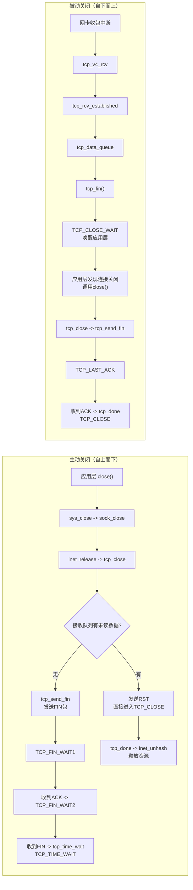

**一、主动关闭路径：tcp_close（自上而下过程）**

主动关闭由应用层调用`close()`系统调用触发，调用链为：`sys_close` -> `filp_close` -> `fput` -> `__fput` -> `sock_close` -> `inet_release` -> [`tcp_close`](https://elixir.bootlin.com/linux/v4.11.6/source/net/ipv4/tcp.c#L2073)

`tcp_close`的核心决策逻辑：

```c
//https://elixir.bootlin.com/linux/v4.11.6/source/net/ipv4/tcp.c#L2073
void tcp_close(struct sock *sk, long timeout)
{
	struct sk_buff *skb;
	int data_was_unread = 0;

	lock_sock(sk);
	sk->sk_shutdown = SHUTDOWN_MASK;  // 标记双向关闭

	if (sk->sk_state == TCP_LISTEN) {
		// LISTEN状态：直接关闭，释放所有半连接和全连接
		tcp_set_state(sk, TCP_CLOSE);
		inet_csk_listen_stop(sk);  // 清理accept队列
		goto adjudge_to_death;
	}

	// 清空接收缓冲区，统计未读数据量
	while ((skb = __skb_dequeue(&sk->sk_receive_queue)) != NULL) {
		u32 len = TCP_SKB_CB(skb)->end_seq - TCP_SKB_CB(skb)->seq;
		if (TCP_SKB_CB(skb)->tcp_flags & TCPHDR_FIN)
			len--;
		data_was_unread += len;
		__kfree_skb(skb);
	}

	// 关键决策：是否有未读数据？
	if (data_was_unread) {
		// 有未读数据：发送RST而非FIN（告知对端数据丢失）
		NET_INC_STATS(sock_net(sk), LINUX_MIB_TCPABORTONCLOSE);
		tcp_set_state(sk, TCP_CLOSE);
		tcp_send_active_reset(sk, sk->sk_allocation);
	} else if (sock_flag(sk, SOCK_LINGER) && !sk->sk_lingertime) {
		// SO_LINGER且linger=0：立即RST
		tcp_disconnect(sk, 0);
	} else if (tcp_close_state(sk)) {
		// 正常路径：发送FIN
		// tcp_close_state()根据当前状态决定新状态：
		//   ESTABLISHED -> FIN_WAIT1
		//   CLOSE_WAIT  -> LAST_ACK
		tcp_send_fin(sk);
	}

adjudge_to_death:
	sock_hold(sk);
	sock_orphan(sk);  // 与文件描述符解绑，设置SOCK_DEAD
	release_sock(sk);

	// 根据状态处理后续
	local_bh_disable();
	bh_lock_sock(sk);

	if (sk->sk_state == TCP_FIN_WAIT2) {
		if (tp->linger2 < 0) {
			// 不等待FIN_WAIT2超时，直接关闭
			tcp_set_state(sk, TCP_CLOSE);
			tcp_send_active_reset(sk, GFP_ATOMIC);
		} else {
			// 等待对端FIN，tcp_fin_time()计算超时时间
			int tmo = tcp_fin_time(sk);
			if (tmo > TCP_TIMEWAIT_LEN) {
				inet_csk_reset_keepalive_timer(sk, tmo - TCP_TIMEWAIT_LEN);
			} else {
				tcp_time_wait(sk, TCP_FIN_WAIT2, tmo);
			}
		}
	}
	// ...
}
```

**二、被动关闭路径：收到FIN或RST（自下而上过程）**

1、FIN场景，被动关闭由协议栈收包触发，调用链为：`tcp_v4_rcv` -> `tcp_v4_do_rcv` -> `tcp_rcv_established` -> `tcp_data_queue` -> [`tcp_fin`](https://elixir.bootlin.com/linux/v4.11.6/source/net/ipv4/tcp_input.c#L4104)

`tcp_fin`的核心是根据当前状态进行状态迁移并唤醒应用层（参考前文）：
- `ESTABLISHED` -> `CLOSE_WAIT`：最常见场景，唤醒阻塞在`recv`上的进程（返回`0`）
- `FIN_WAIT1` -> `CLOSING`：同时关闭场景
- `FIN_WAIT2` -> `TIME_WAIT`：正常四次挥手最后阶段

被动关闭方只有在应用层调用`close()`后才会发送己方的FIN（从`CLOSE_WAIT`进入`LAST_ACK`），这是通过`tcp_close`中的`tcp_close_state(sk)`完成的

2、RST场景，当 TCP 协议栈收到合法的 RST（Reset）包时，无论包是否在乱序队列中，最终都会调用到 `net/ipv4/tcp_input.c` 中的 `tcp_reset()` 函数，在这个函数中，最终会唤醒在用户态写的 `epoll_wait` 或是阻塞的 `read/write`逻辑

```c
//https://elixir.bootlin.com/linux/v4.11.6/source/net/ipv4/tcp_input.c#L6106
//https://elixir.bootlin.com/linux/v4.11.6/source/net/ipv4/tcp_input.c#L3992
/* When we get a reset we do this. */
void tcp_reset(struct sock *sk)
{
	/* We want the right error as BSD sees it (and indeed as we do). */
	switch (sk->sk_state) {
	case TCP_SYN_SENT:
		sk->sk_err = ECONNREFUSED;
		break;
	case TCP_CLOSE_WAIT:
		sk->sk_err = EPIPE;
		break;
	case TCP_CLOSE:
		return;
	default:
		sk->sk_err = ECONNRESET;
	}
	/* This barrier is coupled with smp_rmb() in tcp_poll() */
	smp_wmb();

	if (!sock_flag(sk, SOCK_DEAD)){
		//重要！
		sk->sk_error_report(sk);
	}

	tcp_done(sk);
}
```

在上述代码中，负责将收到RST包并通知给应用层的核心枢纽，正是 `sk->sk_error_report(sk)` 这个回调函数。先分析这个函数实现，内核会做`3`步：

1、归因：设置具体的错误码。内核会根据当前连接所处的状态，决定抛给应用层相应的错误码（`sk->sk_err`）

-	如果连接还在 `TCP_SYN_SENT`（客户端正在建连就被 RST 掉），错误码被设置为 `ECONNREFUSED`（拒绝连接）
-	如果连接处于 `TCP_CLOSE_WAIT`（半关闭状态），错误码被设置为 `EPIPE`（断开管道）
-	绝大多数默认情况（比如 `ESTABLISHED` 状态下收到 RST），错误码被设置为经典的 `ECONNRESET`（Connection reset by peer）

2、通知上层：调用`sk_error_report`。紧接着，如果这个 Socket 还没死透（没有被标记为 SOCK_DEAD），内核会调用`sk->sk_error_report(sk)`通知上层

3、清理连接。通知完上层后，调用 `tcp_done(sk)`，将 Socket 状态机直接强行拽入 `TCP_CLOSE`，并清理所有的定时器

`sk->sk_error_report`也是连接内核与用户态的桥梁，其本质上是一个函数指针。在最初通过 `socket()` 系统调用创建套接字初始化 `struct sock` 之时，内核（在 `sock_init_data` 函数中）会将它默认指向核心网络层的 `sock_def_error_report()` 函数

```c
//https://elixir.bootlin.com/linux/v4.11.6/source/net/core/sock.c#L2385
void sock_def_error_report(struct sock *sk)
{
    struct socket_wq *wq;
	//触发 Wait Queue 唤醒
    rcu_read_lock();
    wq = rcu_dereference(sk->sk_wq);
    // 关键点：唤醒等待在这个 socket 上的进程！
    if (skwq_has_sleeper(wq)){
		//wake_up_interruptible_poll 会去扫描挂载在这个 Socket 等待队列（sk->sk_wq）上的所有任务
        wake_up_interruptible_poll(&wq->wait, POLLERR);
	}
    // 如果开启了异步 IO (FASYNC)，发送 SIGIO 信号
    sk_wake_async(sk, SOCK_WAKE_IO, POLL_ERR);
    rcu_read_unlock();
}
```

在[Linux 内核之旅（十三）：epoll](https://pandaychen.github.io/2025/05/22/A-LINUX-KERNEL-TRAVEL-13/)详细分析过，对于内核epoll机制，epoll 会在这个等待队列里安插了一个钩子，当收到唤醒信号和 `POLLERR` 标志后，epoll 会把这个 fd 加入到它的就绪链表中。接着处于用户态的 `epoll_wait` 被唤醒，返回的 `events` 中会带上 `EPOLLERR`（可能同时伴随 `EPOLLIN` 和 `EPOLLHUP`）。此时业务代码如果去调用 `read(fd)` 或 `write(fd)`，由于连接状态已是 `TCP_CLOSE` 且 `sk->sk_err` 被赋了值，系统调用会立刻返回 `-1`，并且把进程的 `errno` 设置为之前存进去的 `ECONNRESET`

**三、对比总结**

| 维度 | 主动关闭 | 被动关闭 |
|------|---------|---------|
| **触发方** | 本端应用调用`close()` | 对端发送FIN包 |
| **入口函数** | `tcp_close()`（自上而下） | `tcp_fin()`（自下而上） |
| **首个状态迁移** | `ESTABLISHED -> FIN_WAIT1` | `ESTABLISHED -> CLOSE_WAIT` |
| **FIN发送时机** | `tcp_close` -> `tcp_send_fin`（立即） | 等待应用层`close()`后发送 |
| **TIME_WAIT归属** | 主动关闭方进入TIME_WAIT | 被动关闭方不进入TIME_WAIT |
| **完整状态路径** | `ESTABLISHED -> FIN_WAIT1 -> FIN_WAIT2 -> TIME_WAIT -> CLOSE` | `ESTABLISHED -> CLOSE_WAIT -> LAST_ACK -> CLOSE` |
| **资源释放** | TIME_WAIT期间使用轻量级`inet_timewait_sock`，2MSL后`inet_twsk_kill`释放 | 收到最后ACK后`tcp_done`直接释放完整sock |
| **RST场景** | 有未读数据时发RST跳过正常挥手 | 收到RST直接`tcp_reset`进入CLOSE |
| **socket与fd解绑** | `close`时立即`sock_orphan`解绑 | 收到FIN时仍保持fd关联，等应用层close |
| **唤醒方式** | 无需唤醒（应用主动发起） | `tcp_fin`通过`sk_state_change`唤醒阻塞读 |


####	TIME_WAIT管理

```cpp
//https://elixir.bootlin.com/linux/v4.11.6/source/net/ipv4/tcp_minisocks.c#L265
void tcp_time_wait(struct sock *sk, int state, int timeo)
{
	const struct inet_connection_sock *icsk = inet_csk(sk);
	const struct tcp_sock *tp = tcp_sk(sk);
	struct inet_timewait_sock *tw;

	// 分配轻量级的TIME_WAIT结构（不占用完整sock）
	tw = inet_twsk_alloc(sk, &tcp_death_row, state);
	if (tw) {
		struct tcp_timewait_sock *tcptw = tcp_twsk((struct sock *)tw);

		// 保存必要的TCP状态用于处理迟到包
		tcptw->tw_rcv_nxt = tp->rcv_nxt;
		tcptw->tw_snd_nxt = tp->snd_nxt;
		tcptw->tw_rcv_wnd = tcp_receive_window(tp);
		tcptw->tw_ts_offset = tp->tsoffset;
		tcptw->tw_ts_recent = tp->rx_opt.ts_recent;
		tcptw->tw_ts_recent_stamp = tp->rx_opt.ts_recent_stamp;

		// 设置超时时间（2MSL，通常60秒）
		if (timeo < rto)
			timeo = rto;
		tw->tw_timeout = timeo;

		// 加入TIME_WAIT管理表
		inet_twsk_schedule(tw, timeo);
		// 将原始sock从ehash中替换为tw
		inet_twsk_hashdance(tw, sk, &tcp_hashinfo);
	}

	// 释放原始sock
	tcp_done(sk);
}
```

TIME_WAIT状态存在的意义是：
1. 确保最后一个ACK能到达对端（如果丢失，对端会重传FIN）
2. 等待网络中残留的属于此连接的旧数据包过期，避免干扰相同四元组的新连接

一个有趣的case，在使用ebpf进行端口connect事件捕获时（原始hook点为`tcp_connect`与`inet_unhash`），存在因`tcp_tw_reuse`逃逸的事件：
当系统开启`/proc/sys/net/ipv4/tcp_tw_reuse`内核特性时，此时允许新连接随机分配端口时复用`TIME_WAIT`状态的socket。该场景下，套接字重新被分配出去，导致释放统计遗漏，会造成统计误差

##	0x12	总结：完整生命周期内核调用链

下面给出TCP完整通信过程的综合视图，涵盖系统调用、内核函数调用链和状态迁移：

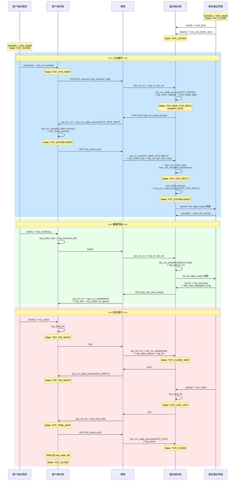

####	tcp_v4_rcv 状态分发总览

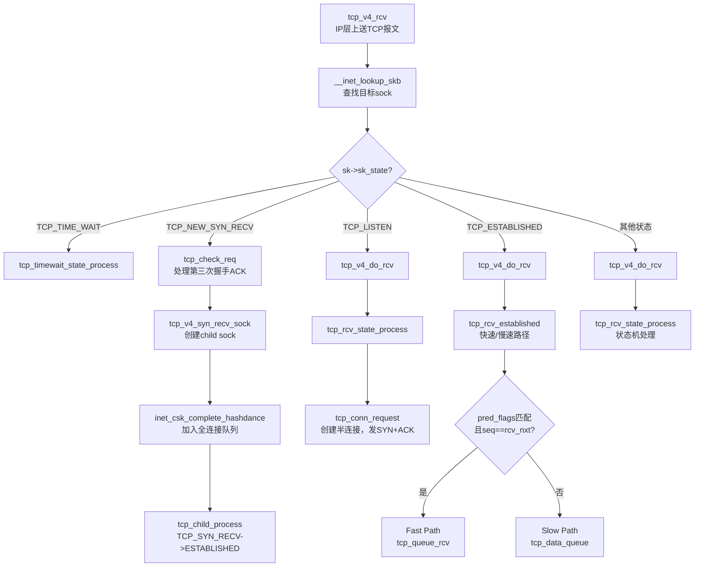

##	0x13	总结

####	 socket  VS	accept
在分析三次握手源码时产生的疑问：`socket`系统调用创建`struct socket`结构，与`accept`系统调用创建的`struct socket`结构，作用上有哪些不同？

1、监听套接字（socket）的核心功能是管理连接，而非数据传输。当用户调用 `socket()` 创建套接字时（如监听套接字），内核会通过`sock_init_data`初始化 `struct sock`的核心队列，包括：

-	接收队列（`sk_receive_queue`）：用于存储接收到的数据包（`sk_buff`），但监听套接字本身不使用此队列传输数据
-	发送队列（`sk_write_queue`）：缓存待发送数据，监听套接字通常不主动发送数据
-	等待队列（`sk_sleep`）：管理因 I/O 事件（如 `accept()` 阻塞）而休眠的进程

同时设置回调函数（如 `sk_data_ready = sock_def_readable`），用于数据到达（主要是有新连接到达时）时唤醒进程

2、通过 `accept()` 创建的新套接字关联的 `struct sock` 是三次握手期间内核已经创建的（非 `accept()` 新建），其队列作用完全不同，主要过程描述如下：

-	新建连接的 `struct sock` 在握手完成时创建，并加入监听套接字的 `icsk_accept_queue` 即全连接队列，`accept()` 函数仅将其取出，并与新 `struct socket` 结构绑定
-	此接收队列（`sk_receive_queue`）的核心作用是存储客户端发送的数据包，用户调用 `recv()` 时从此队列读取数据
-	发送队列（`sk_write_queue`）的作用是缓存待发送给客户端的数据，由协议栈逐步发送
-	等待队列（`sk_sleep`）会管理因 `recv()` 或 `send()` 阻塞的进程（如缓冲区空/满时）

因此在`accept()`系统调用新建的`struct socket`并关联的`struct sock`结构对应的队列是作为数据传输的载体，这些队列是实际数据收发的核心通道，与监听套接字的预留队列有本质区别

####	内核与应用态的模型（`sk_receive_queue`）
以sock的接收队列`sk_receive_queue`为例，可以用生产消费模型来理解软中断与用户态的交互，软中断（内核网络栈）作为生产者，源源不断地把网卡收到的报文打包成 `sk_buff` 喂进`sk_receive_queue`，用户态进程（通过 `read/recv` 等系统调用）作为消费者，负责把数据从队列里取走并拷贝到用户空间。但是为了保证高并发下的多核安全和高效通知，内核还额外实现了辅助结构，即`sk_backlog`（后备队列） 和 `sk_wq`（等待队列/通知机制）

1、`sk_backlog`，定义[在](https://elixir.bootlin.com/linux/v4.11.6/source/include/net/sock.h#L366)，是为了解决并发修改`sk_receive_queue`锁竞争引入

考虑这个场景，若用户态进程正在调用 `recv()` 处理数据，此时它会持有这个 socket 的锁。如果此时软中断强行去修改 `sk_receive_queue`，就会发生严重的锁冲突。因此内核引入了 `sk_backlog`：

-	一般情况：用户态进程没有访问这个 socket（没拿锁）。软中断拿着软中断锁，直接把包塞进`sk_receive_queue`
-	冲突情况：用户态进程正在持锁读取数据。软中断发现 socket 被锁住了，它绝对不会去碰 `sk_receive_queue`，而是默默地把数据包放入 `sk->sk_backlog` 队列中，然后直接返回
-	追加读取：当用户态进程读完数据、准备释放 socket 锁的时候，它会顺便检查一下 `sk_backlog`。如果发现里面有软中断漏掉的包，由用户态进程负责把包从 `sk_backlog` 挪到 `sk_receive_queue` 中（详细描述见后文）

2、跨越内核与用户态的等待唤醒机制：`sk_wq`（等待队列），主要解决如何通知/唤醒队列为空而等待的消费者，主要包含两块内容，一是如果队列空了，消费者该怎么等？二是数据来了，如何唤醒它？因此内核在这里引入了等待队列（Wait Queue）与回调机制

-	进程休眠： 当用户态进程调用 `recv()` 发现 `sk_receive_queue` 是空的时候，如果是非阻塞模式会直接返回，但如果是阻塞模式，进程会把自己挂到 socket 的等待队列 `sk->sk_wq` 上，然后进入睡眠状态
-	中断唤醒： 软中断把包塞进 `sk_receive_queue` 之后，会顺便调用内核函数 `sk->sk_data_ready()`（默认实现是 `sock_def_readable`），此函数会遍历 `sk->sk_wq`，唤醒进程或者通知 epoll 产生可读事件

####	本文涉及到核心内核函数

| 分类 | 函数 | 作用 |
|------|------|------|
| **连接建立** | `tcp_v4_connect` | 客户端发起连接 |
| | `tcp_conn_request` | 服务端处理SYN，创建半连接 |
| | `tcp_check_req` | 验证第三次握手ACK |
| | `tcp_v4_syn_recv_sock` | 创建子socket |
| | `inet_csk_complete_hashdance` | 加入全连接队列 |
| | `inet_csk_accept` | 从全连接队列取出连接 |
| **数据发送** | `tcp_sendmsg` | 用户数据→内核缓冲区 |
| | `tcp_write_xmit` | 发送窗口控制、分段发送 |
| | `tcp_transmit_skb` | 构造TCP头、发送到IP层 |
| **数据接收** | `tcp_v4_rcv` | TCP报文入口 |
| | `tcp_rcv_established` | ESTABLISHED状态接收 |
| | `tcp_data_queue` | 数据排序、乱序处理（`tcp_data_queue`是 TCP 慢速路径的核心处理引擎） |
| | `tcp_queue_rcv` | 数据入接收队列 |
| | `tcp_recvmsg` | 内核缓冲区→用户空间 |
| **重传** | `tcp_retransmit_timer` | 超时重传触发 |
| | `tcp_retransmit_skb` | 执行重传 |
| | `tcp_fastretrans_alert` | 快速重传处理 |
| **拥塞控制** | `tcp_cong_avoid` | 慢启动/拥塞避免 |
| | `tcp_enter_recovery` | 进入快速恢复 |
| | `tcp_enter_loss` | 进入Loss状态 |
| **窗口** | `tcp_select_window` | 计算接收窗口通告值 |
| | `tcp_snd_wnd_test` | 发送窗口检查 |
| | `tcp_cwnd_test` | 拥塞窗口检查 |
| **连接关闭** | `tcp_close` | 主动关闭 |
| | `tcp_send_fin` | 发送FIN |
| | `tcp_fin` | 接收FIN处理 |
| | `tcp_time_wait` | 进入TIME_WAIT |

##  0x14 参考
-	<<深入理解Linux网络>>
-   [深入理解Linux TCP的三次握手](https://mp.weixin.qq.com/s/vlrzGc5bFrPIr9a7HIr2eA)
-   [为什么服务端程序都需要先 listen 一下](https://mp.weixin.qq.com/s/hv2tmtVpxhVxr6X-RNWBsQ)
-	[Linux内核网络（三）：Linux内核中socket函数的实现](https://www.kerneltravel.net/blog/2020/network_ljr_no3/)
-	[数据包发送](https://www.cnblogs.com/mysky007/p/12347293.html)
-	[[内核源码] 网络协议栈 - tcp 三次握手状态](https://wenfh2020.com/2021/08/17/kernel-tcp-handshakes/)
-	[[内核源码] 网络协议栈 - connect (tcp)](https://wenfh2020.com/2021/08/07/linux-kernel-connect/)
-   [[内核源码] 网络协议栈 - listen (tcp)](https://wenfh2020.com/2021/07/21/kernel-sys-listen/)
-   [[内核源码] 网络协议栈 - socket (tcp)](https://wenfh2020.com/2021/07/13/kernel-sys-socket/)
-	[TCP拥塞控制算法](https://www.kernel.org/doc/html/latest/networking/tcp-congestion-control.html)
-	[Linux TCP实现分析](https://blog.csdn.net/zhangskd/category_1169998.html)