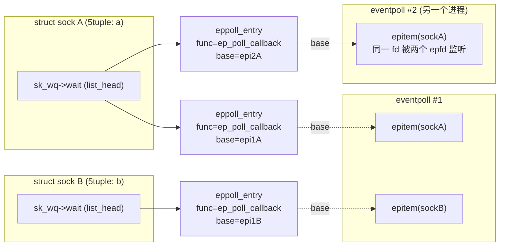
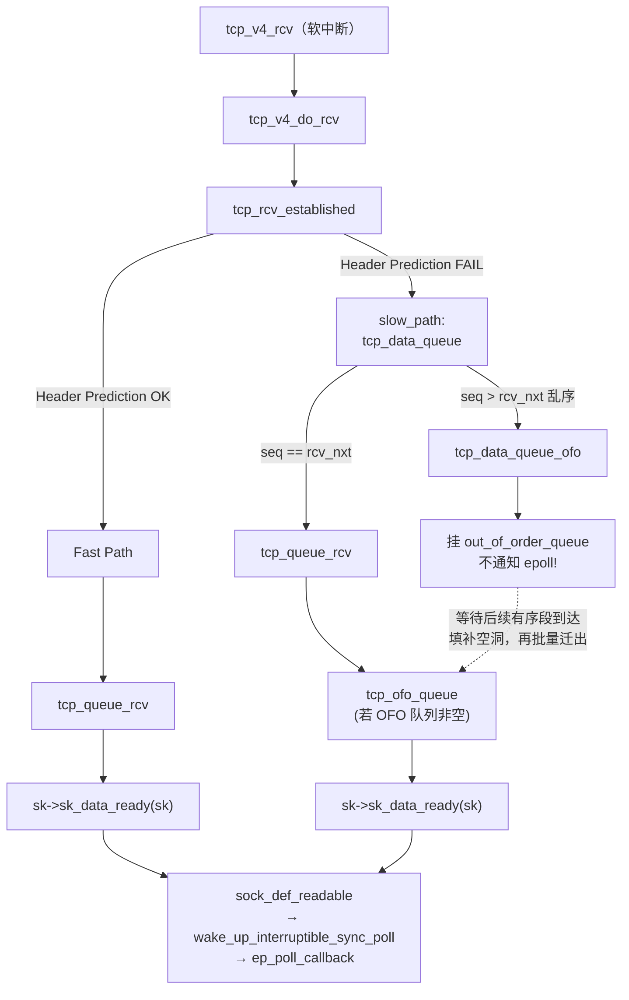
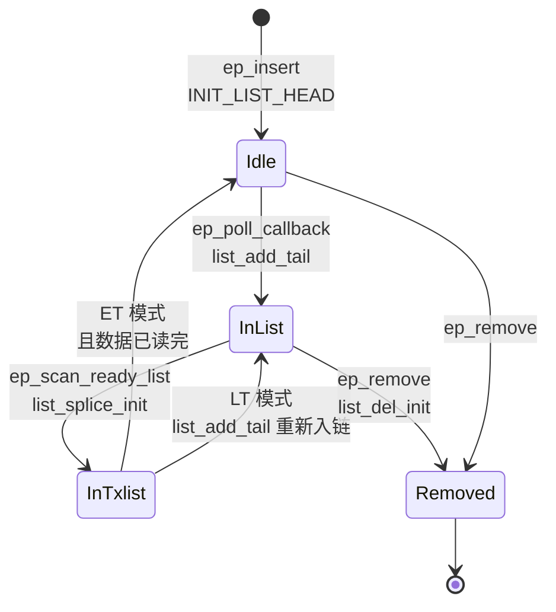
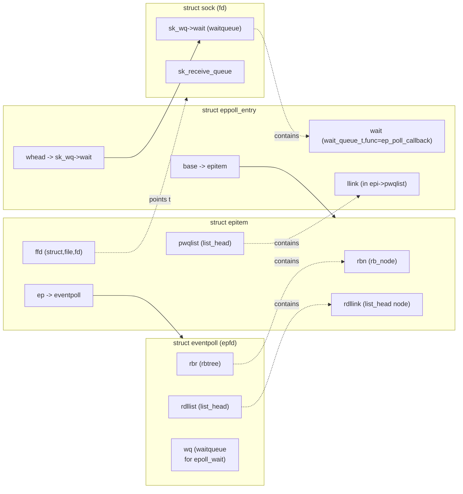
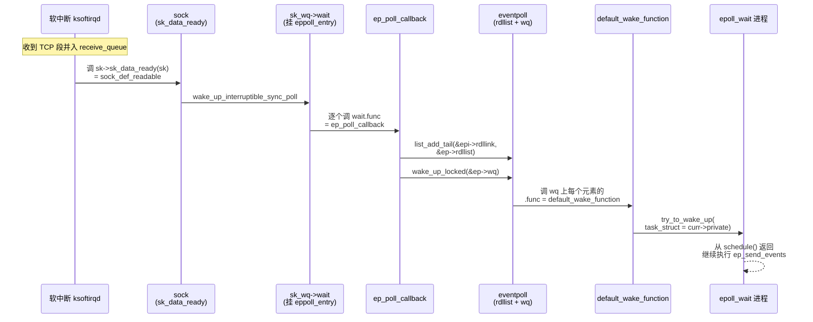
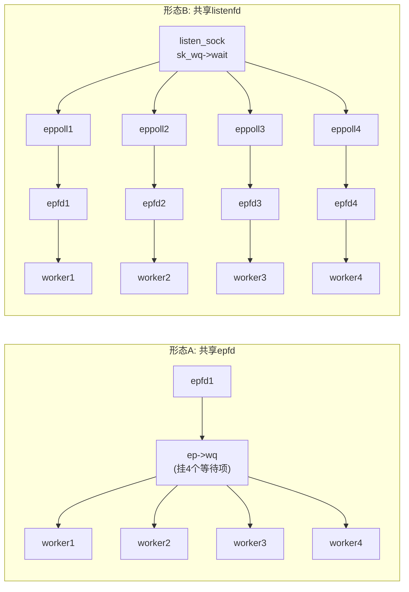
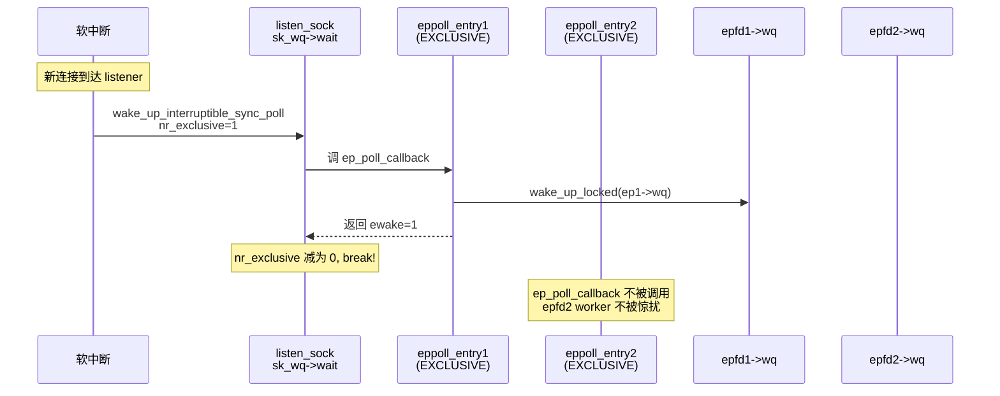
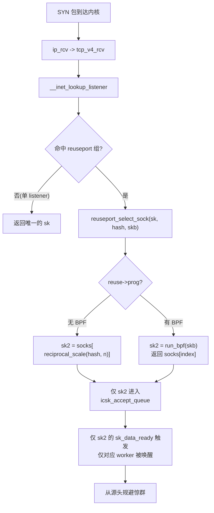

##  0x00    前言
Linux的IO 多路复用机制（I/O Multiplexing）是一种通过单个线程或进程同时管理多个 I/O 通道（如网络套接字、文件描述符）的机制，用来解决大量并发文件描述符fd场景下，如何快速发现哪些fd触发了事件（读/写）。为了解决遍历fds导致的性能浪费，内核提供了`select`、`poll`、`epoll`这几类机制，本文就以内核的角度来拆解下`epoll`机制的实现

本文代码基于 [v4.11.6](https://elixir.bootlin.com/linux/v4.11.6/source/include) 版本

####    epoll 简单服务端示例
```cpp
void epoll_server_run(){   
    //....
	char buf[BUF_SIZE];
	struct sockaddr_in srv_addr;
	struct sockaddr_in cli_addr;
	struct epoll_event events[MAX_EVENTS];

	listen_sock = socket(AF_INET, SOCK_STREAM, 0);

	set_sockaddr(&srv_addr);
	bind(listen_sock, (struct sockaddr *)&srv_addr, sizeof(srv_addr));

	//注意需要设置为NON-BLOCK
	setnonblocking(listen_sock);
	listen(listen_sock, MAX_CONN);
    
    //1.   创建epoll fd 并对listener fd加入监听
	epfd = epoll_create(1);
	epoll_ctl_add(epfd, listen_sock, EPOLLIN | EPOLLOUT | EPOLLET);

	socklen = sizeof(cli_addr);
	for (;;) {
        //2.   调用epoll_wait并等待返回就绪事件
		nfds = epoll_wait(epfd, events, MAX_EVENTS, -1);
        //3.   处理就绪事件（读、写、退出等），要区分是否为listener fd或者accept fd
		for (i = 0; i < nfds; i++) {
			if (events[i].data.fd == listen_sock) {
				/* handle new connection */
				// 若为listenfd，在ET模式下
				// 用 while 循环包裹住 accept 调用，处理完 TCP 就绪队列中的所有连接后再退出循环
				// 如何知道是否处理完就绪队列中的所有连接呢？ 
				// accept  返回 -1 并且 errno 设置为 EAGAIN 就表示所有连接都处理完
				// 当然读/写在ET模式下也是一样
				//读：只要可读, 就一直读, 直到返回 0, 或者 errno = EAGAIN 
				//写：只要可写, 就一直写, 直到数据发送完, 或者 errno = EAGAIN 
				while(1){
					conn_sock =
						accept(listen_sock,
						(struct sockaddr *)&cli_addr,
						&socklen);
					if (conn_sock == -1) {
						if ((errno == EAGAIN) || (errno == EWOULDBLOCK)) {
							break;  // We have processed all incoming connections.
						} else {
							perror("accept");
							break;
						}
					}

					inet_ntop(AF_INET, (char *)&(cli_addr.sin_addr),
						buf, sizeof(cli_addr));
					printf("[+] connected with %s:%d\n", buf,
						ntohs(cli_addr.sin_port));

					setnonblocking(conn_sock);
					epoll_ctl_add(epfd, conn_sock,
							EPOLLIN | EPOLLET | EPOLLRDHUP |
							EPOLLHUP);
					//check epoll_ctl_add return value
				}
			} else if (events[i].events & EPOLLIN) {
				/* handle EPOLLIN event */
				for (;;) {
					bzero(buf, sizeof(buf));
					n = read(events[i].data.fd, buf,
						 sizeof(buf));
					if (n <= 0 /* || errno == EAGAIN */ ) {
						break;
					} else {
						printf("[+] data: %s\n", buf);
						write(events[i].data.fd, buf,
						      strlen(buf));
					}
				}
			} else {
				printf("[+] unexpected\n");
			}
			/* check if the connection is closing */
			if (events[i].events & (EPOLLRDHUP | EPOLLHUP)) {
				printf("[+] connection closed\n");
                // 将fd移除epoll监听
				epoll_ctl(epfd, EPOLL_CTL_DEL,
					  events[i].data.fd, NULL);
				close(events[i].data.fd);
				continue;
			}
		}
	}
}
```

##  0x01    前置知识 && 问题
1、`struct socket/sock/sock_common`等结构与`struct file`关系

2、`struct sock`的等待队列`sock->wq`的作用及何时被唤醒、唤醒条件是什么？这里分为两种socket，其一是listener fd，其二是通过accept拿到的fd

3、`epoll`（通过`epoll_create`创建）的等待队列的作用及机制，调用`epoll_wait`系统调用的进程何时主动让出CPU（睡眠）？何时被唤醒？唤醒之后的流程是什么？

4、同步阻塞IO机制下的收包流程，在软中断核心逻辑中，当数据包送到某个socket（sock）关联的接收队列上时，内核是如何通知应用层有数据到达的？参考此文[深入理解高性能网络开发路上的绊脚石 - 同步阻塞网络 IO](https://mp.weixin.qq.com/s?__biz=MjM5Njg5NDgwNA==&mid=2247484834&idx=1&sn=b8620f402b68ce878d32df2f2bcd4e2e&scene=21#wechat_redirect)

5、内核协议栈的收包过程，[前文](https://pandaychen.github.io/2025/03/02/A-LINUX-KERNEL-TRAVEL-8/)已描述

6、`epoll`机制下，各个内核struct之间的关系以及回调函数（赋值为何种函数）

7、`epoll`机制下，为何要使用红黑树而不是hashtable？

####    struct sock/socket/sock_comm


`struct sock`结构关联的等待队列`socket_wq`，包含了内核等待队列的头节点：

```cpp
struct socket_wq {
	/* Note: wait MUST be first field of socket_wq */
	wait_queue_head_t	wait;
	......
};
```

注意 `struct sock` 与 `struct socket_wq` 通过指针 `sk->sk_wq` 相连，而 `struct socket` 通过 `socket->wq` 也指向同一份 `socket_wq`（见 [`sock_init_data`](https://elixir.bootlin.com/linux/v4.11.6/source/net/core/sock.c#L2460) 中的 `sk->sk_wq = &sock->wq`），故有：

```cpp
// https://elixir.bootlin.com/linux/v4.11.6/source/include/net/sock.h#L1822
static inline wait_queue_head_t *sk_sleep(struct sock *sk)
{
    BUILD_BUG_ON(offsetof(struct socket_wq, wait) != 0);
    return &rcu_dereference_raw(sk->sk_wq)->wait;
}
```

由于 `BUILD_BUG_ON` 保证 `wait` 是 `socket_wq` 的第一个成员，`&socket_wq` 与 `&socket_wq.wait` 地址相同，所以 `sk_sleep(sk)` 实际就是 `sock->sk_wq->wait` 这个等待队列头。后文 `ep_insert` 经 `tcp_poll → sock_poll_wait(file, sk_sleep(sk), wait)` 把 `eppoll_entry.wait` 挂入的，正是这条链表

####    epoll的API
1、`epoll_create`：创建一个 `epoll` 对象，返回fd

2、`epoll_ctl`：向 `epoll` 对象中添加要管理的连接，在代码示例中主要涉及到操作两类fd，第一类是listnerfd（服务端绑定socket），第二类是acceptfd（客户端新连接）

3、`epoll_wait`：等待其管理的连接上的 IO 事件

##  0x02    epoll_create实现
在用户进程调用 `epoll_create` 函数时，内核会创建一个 `struct eventpoll` 的[内核结构](https://elixir.bootlin.com/linux/v4.11.6/source/fs/eventpoll.c#L185)对象，注意`epoll_create`成功时会返回一个`fd`，内核也会把它关联到当前进程的已打开文件列表`fdtable`中

```cpp
//https://elixir.bootlin.com/linux/v4.11.6/source/fs/eventpoll.c#L1793
SYSCALL_DEFINE1(epoll_create1, int, flags)
{
	int error, fd;
	struct eventpoll *ep = NULL;
	struct file *file;
    // ...

    //1. 创建一个 eventpoll 对象
	error = ep_alloc(&ep);
	if (error < 0)
		return error;

	fd = get_unused_fd_flags(O_RDWR | (flags & O_CLOEXEC));
	if (fd < 0) {
		error = fd;
		goto out_free_ep;
	}
	file = anon_inode_getfile("[eventpoll]", &eventpoll_fops, ep,
				 O_RDWR | (flags & O_CLOEXEC));
	if (IS_ERR(file)) {
		error = PTR_ERR(file);
		goto out_free_fd;
	}
	ep->file = file;
    //安装fd
	fd_install(fd, file);
	return fd;
    //....
}
```

####    eventpoll结构
`struct eventpoll`的定义如下，这里重点看下面几个成员：

-   `wait_queue_head_t wq`：`epoll_wait`/`sys_epoll_wait`用到的等待队列（链表），内核软中断运行过程中，当数据就绪的时候会通过此 `wq` 来找到阻塞在 `epoll` 对象上的用户进程
-   `struct list_head rdllist`：接收就绪的描述符都会放到这里，即存放就绪的描述符的链表。当有连接就绪的时候，内核会把就绪的连接放到 `rdllist` 链表里。这样应用进程只需要遍历`rdllist`链表就能找出就绪进程，而不用去遍历整棵树
-   `struct rb_root rbr`：每个epoll对象中都有一颗红黑树，为了支持对海量连接的高效查找、插入和删除，`eventpoll` 内部使用了一棵红黑树并通过这棵树来管理用户进程下添加进来的所有 socket 连接（红黑树的key为`fd`）

```cpp
struct eventpoll {
	/* Protect the access to this structure */
	spinlock_t lock;

	/*
	 * This mutex is used to ensure that files are not removed
	 * while epoll is using them. This is held during the event
	 * collection loop, the file cleanup path, the epoll file exit
	 * code and the ctl operations.
	 */
	struct mutex mtx;

	/* Wait queue used by sys_epoll_wait() */
	wait_queue_head_t wq;

	/* Wait queue used by file->poll() */
	wait_queue_head_t poll_wait;

	/* List of ready file descriptors */
	struct list_head rdllist;

	/* RB tree root used to store monitored fd structs */
	struct rb_root rbr;

	/*
	 * This is a single linked list that chains all the "struct epitem" that
	 * happened while transferring ready events to userspace w/out
	 * holding ->lock.
	 */
	struct epitem *ovflist;

	/* wakeup_source used when ep_scan_ready_list is running */
	struct wakeup_source *ws;

	/* The user that created the eventpoll descriptor */
	struct user_struct *user;

	struct file *file;

	/* used to optimize loop detection check */
	int visited;
	struct list_head visited_list_link;
};
```

####    ep_alloc的实现
[`ep_alloc`](https://elixir.bootlin.com/linux/v4.11.6/source/fs/eventpoll.c#L940)的实现如下，其中包含了上面列出的重要成员的初始化工作

```cpp
static int ep_alloc(struct eventpoll **pep)
{
	int error;
	struct user_struct *user;
	struct eventpoll *ep;

	user = get_current_user();
	error = -ENOMEM;

    //1.  申请 epollevent 内存
	ep = kzalloc(sizeof(*ep), GFP_KERNEL);
	if (unlikely(!ep))
		goto free_uid;

	spin_lock_init(&ep->lock);
	mutex_init(&ep->mtx);

    //2. 初始化等待队列头
	init_waitqueue_head(&ep->wq);
	init_waitqueue_head(&ep->poll_wait);

    //3. 初始化就绪列表
	INIT_LIST_HEAD(&ep->rdllist);

    //4. 初始化红黑树指针
	ep->rbr = RB_ROOT;
	ep->ovflist = EP_UNACTIVE_PTR;
	ep->user = user;

	*pep = ep;

	return 0;

free_uid:
	free_uid(user);
	return error;
}
```

至此，完成了epoll机制最核心的管理结构`struct eventpoll`的创建及初始化工作，进程打开的`epfd`在内核的关系如下图：


##  0x03    服务端accept新连接（fd）
前文[Linux 内核之旅（十二）：内核视角下的三次握手](https://pandaychen.github.io/2025/04/25/A-LINUX-KERNEL-TRAVEL-12/#0x07-serveraccept操作)已经介绍了服务端accept的内核实现，这里再回顾下accept时`struct socket` 内核结构的创建、以及和内核已存在的`struct sock`关联的主要过程：

1.	初始化 `struct socket` 对象，并使用listnerfd关联的socket信息初始化（如`type`、`ops`等）
2.	为新 `struct socket` 对象申请 `struct file` 结构，关联`sock->file`指针，在 `accept` 方法里会调用 `sock_alloc_file` 函数来申请内存并初始化，该指针的主要目的是通过`task_struct->fdtable(fd)->file(private)->socket->sock....`，即通过进程+fd找到对应的`struct socket/sock`结构
3.	在`sock_alloc_file->alloc_file`函数中，会把`socket_file_ops`赋值给新建的`socket->file->f_op`
4.	调用`sock->ops->accept`（即`inet_accept`）接收新连接
5.	调用`fd_install`将`accept`返回的新连接`fd`加到当前进程打开文件列表`fdtable`

```cpp
SYSCALL_DEFINE4(accept4, int, fd, struct sockaddr __user *, upeer_sockaddr,
        int __user *, upeer_addrlen, int, flags)
{
    struct socket *sock, *newsock;

    //根据 fd 查找到监听的 socket
    sock = sockfd_lookup_light(fd, &err, &fput_needed);

    //1、申请并初始化新的 socket
    newsock = sock_alloc();

	//2、把 listen 状态的 socket 对象（关联AF_INET）上的协议操作函数集合 ops等赋值给新的 socket
    newsock->type = sock->type;
    newsock->ops = sock->ops;

    //3、 申请新的 file 对象，并设置到新 socket 上
	// sock_alloc_file最终会完成 sock->file = file
	// 
    newfile = sock_alloc_file(newsock, flags, sock->sk->sk_prot_creator->name);
    ......

    //4、 接收连接
    err = sock->ops->accept(sock, newsock, sock->file->f_flags);

    //5、 添加新文件到当前进程的打开文件列表
    fd_install(newfd, newfile);
```

####	新建立socket/file结构


上文说到，在`accept`里创建的新 `struct socket` 成员`file`，即`struct file`的`f_op`成员（类型为`struct file_operations`），被赋值为下面`socket_file_ops`的[方法](https://elixir.bootlin.com/linux/v4.11.6/source/net/socket.c#L140)：

```cpp
static const struct file_operations socket_file_ops = {
	.llseek =	no_llseek,
	.read_iter =	sock_read_iter,
	.write_iter =	sock_write_iter,
	.poll =		sock_poll,		//记住这个sock_poll函数
	.unlocked_ioctl = sock_ioctl,
	.mmap =		sock_mmap,
	.release =	sock_close,
	.fasync =	sock_fasync,
	.sendpage =	sock_sendpage,
	.splice_write = generic_splice_sendpage,
	.splice_read =	sock_splice_read,
};
```

记住上面这个`sock_poll`函数：在`accept`里创建的新 socket 里的 `file->f_op->poll` 函数指向的是 `sock_poll`

####	接收新连接
这里只列举`sock->ops->accept`中几个关键赋值结点：

内核在三次握手完成时会从全连接队列（已完成TCP连接建立）中取出，关联函数为[`inet_csk_accept`](https://elixir.bootlin.com/linux/v4.11.6/source/net/ipv4/inet_connection_sock.c#L427)，从这里可以看到，这个`struct sock`对象`sk`是内核在三次握手完成就已经创建完成的（这点与系统调用`socket`的流程不一样），在系统调用`accept`中只是将上层的`struct socket`与这个`sk`做了关联而已（实现函数为[`sock_graft`](https://elixir.bootlin.com/linux/v4.11.6/source/include/net/sock.h#L1705)）

还需要记住的一个细节，内核创建`struct sock`结构时同样是调用[`sock_init_data`](https://elixir.bootlin.com/linux/v4.11.6/source/net/core/sock.c#L2460)完成，注意其中的`sk->sk_data_ready = sock_def_readable;`这段代码，这段代码的意义是告诉内核，当前的`sk`上有数据了，该怎么处理（调用`sock_def_readable`回调函数）

```cpp
struct sock *inet_csk_accept(struct sock *sk, int flags, int *err, bool kern)
{
    struct inet_connection_sock *icsk = inet_csk(sk);
    struct request_sock_queue *queue = &icsk->icsk_accept_queue;
    struct request_sock *req;
    struct sock *newsk;

	// ......

    /* 从已完成连接队列中移除 */
    req = reqsk_queue_remove(queue, sk);

    /* 设置新控制块指针 */
	/* sk为 struct sock *sk 类型*/
    newsk = req->sk;

	// ......

    /* 返回找到的连接控制块 */
    return newsk;
}
```

```cpp
// https://elixir.bootlin.com/linux/v4.11.6/source/net/core/sock.c#L2460
void sock_init_data(struct socket *sock, struct sock *sk)
{
    // 关键：把 sock->wq 挂到 sk->sk_wq，从此 sk_sleep(sk) 与 socket 等待队列一一对应
    sk->sk_wq           =   sock ? &sock->wq : NULL;

    // 注册四类默认回调（v4.11.6 中均为单参签名）
    sk->sk_state_change =   sock_def_wakeup;        // 状态变化（如 tcp_fin、tcp_done）
    sk->sk_data_ready   =   sock_def_readable;      // 数据可读（receive_queue 有新数据）
    sk->sk_write_space  =   sock_def_write_space;   // 发送空间可用
    sk->sk_error_report =   sock_def_error_report;  // 错误上报（如 tcp_reset）
}
```

这 4 个默认回调函数的作用，将分别承担 `EPOLLIN/EPOLLHUP/EPOLLOUT/EPOLLERR` 通知的入口工作，是后文（`0x07`）理解整套回调链的基础（详见后文）

####    listener fd 与 accept fd 的 sk_data_ready 链路差异
两种 fd 都会复用 `sk_data_ready = sock_def_readable` 这套机制，但触发点完全不同：

- **acceptfd** 在前文 `tcp_rcv_established`/`tcp_data_queue` 中触发，事件含义是**`sk_receive_queue` 有有序数据可读**
- **listenerfd** 的 `sk_data_ready` 不在数据收包路径上，而是在三次握手完成时由 `inet_csk_complete_hashdance` → `parent->sk_data_ready(parent)` 显式触发（路径：`tcp_v4_rcv → tcp_v4_do_rcv → tcp_v4_hnd_req → tcp_check_req → inet_csk_complete_hashdance`），事件含义是**`icsk_accept_queue`（全连接队列）多了一个可 `accept` 的子 sock**

但二者从 `sk_data_ready` 之后的链路（`wake_up_interruptible_sync_poll → ep_poll_callback → ...`）是**完全一致**的，这也是 epoll 能用同一套机制统一处理新连接和数据可读事件的根本原因

##  0x04    epoll_ctl 实现：操作fd
这一步是`epoll`机制的核心，在上面的示例代码中，通过`epoll_ctl`操作网络连接socket fd的内核大致过程描述如下：

1.	分配一个红黑树节点对象 `epitem`
2.	添加等待事件到 socket 的等待队列中，其回调函数是 `ep_poll_callback`
3.  将 `epitem` 插入到 epoll 对象管理结构`eventpoll`的红黑树

####    相关数据结构
`epoll_ctl`操作`eventpoll`对象时会涉及到多个数据结构：

-	`struct epoll_filefd`
-   `struct epitem`
-	[`ep_pqueue`](https://elixir.bootlin.com/linux/v4.11.6/source/fs/eventpoll.c#L248)：临时粘合剂，传递 `epitem` 并注册回调到 `poll_table`
-	[`struct poll_table`](https://elixir.bootlin.com/linux/v4.11.6/source/include/linux/poll.h#L40)：标准化桥梁，触发文件操作并执行回调创建 `eppoll_entry`
-   `struct eppoll_entry`：持久枢纽，绑定sock、sock等待队列与 `epitem`，实现事件驱动的高效通知

其中，`ep_pqueue`、`poll_table`和`eppoll_entry`这三者完成了初始化 -> 注册 -> 持久监听的高效机制，非常优雅（这三者关系见附录描述）


1、`epitem`，从其成员定义易知，这就是红黑树的元素节点

```cpp
//https://elixir.bootlin.com/linux/v4.11.6/source/fs/eventpoll.c#L141
struct epitem {
	union {
		/* RB tree node links this structure to the eventpoll RB tree */
		struct rb_node rbn;
		/* Used to free the struct epitem */
		struct rcu_head rcu;
	};

	/* List header used to link this structure to the eventpoll ready list */
	struct list_head rdllink;

	/*
	 * Works together "struct eventpoll"->ovflist in keeping the
	 * single linked chain of items.
	 */
	struct epitem *next;

	/* The file descriptor information this item refers to */
	struct epoll_filefd ffd;

	/* Number of active wait queue attached to poll operations */
	int nwait;

	/* List containing poll wait queues */
	struct list_head pwqlist;

	/* The "container" of this item */
	struct eventpoll *ep;

	/* List header used to link this item to the "struct file" items list */
	struct list_head fllink;

	/* wakeup_source used when EPOLLWAKEUP is set */
	struct wakeup_source __rcu *ws;

	/* The structure that describe the interested events and the source fd */
	struct epoll_event event;
};
```

2、`eppoll_entry`

```cpp
//https://elixir.bootlin.com/linux/v4.11.6/source/fs/eventpoll.c#L230
struct eppoll_entry {
	/* List header used to link this structure to the "struct epitem" */
	struct list_head llink;

	/* The "base" pointer is set to the container "struct epitem" */
	struct epitem *base;

	/*
	 * Wait queue item that will be linked to the target file wait
	 * queue head.
	 */
	wait_queue_t wait;

	/* The wait queue head that linked the "wait" wait queue item */
	wait_queue_head_t *whead;
};
```

3、`poll_table`

```cpp
typedef struct poll_table_struct {
	poll_queue_proc _qproc;
	unsigned long _key;
} poll_table;
```

4、`ep_pqueue`

```cpp
/* Wrapper struct used by poll queueing */
struct ep_pqueue {
	poll_table pt;
	struct epitem *epi;
};
```

####    `epoll_ctl`系统调用
`epoll_ctl`的主要过程如下：

1.	根据传入参数 `ebpf`、`fd` 找到 `eventpoll`、`socket`相关的内核对象
2.	调用`ep_*`完成`fd`关联的socket/sock结构的注册（等待队列的事件就绪回调函数）
3.	操作rbtree

对于`EPOLL_CTL_ADD`选项而言，主要调用函数链为`epoll_ctl()->ep_insert()`

```cpp
// epoll_ctl的参数包括两个fd
SYSCALL_DEFINE4(epoll_ctl, int, epfd, int, op, int, fd,
        struct epoll_event __user *, event)
{
    struct eventpoll *ep;
    struct file *file, *tfile;

    //根据 epfd 找到 eventpoll 内核对象
    file = fget(epfd);
    ep = file->private_data;	// 又一次看到了private_data

    //根据 socket 句柄号， 找到其 file 内核对象
    tfile = fget(fd);

    switch (op) {
    case EPOLL_CTL_ADD:
        if (!epi) {
            epds.events |= POLLERR | POLLHUP;
			// for add
            error = ep_insert(ep, &epds, tfile, fd);
        } else
            error = -EEXIST;
        clear_tfile_check_list();
        break;

    //.....
}
```

####    EPOLL_CTL_ADD的过程（重点）
[`ep_insert`](https://elixir.bootlin.com/linux/v4.11.6/source/fs/eventpoll.c#L1293)又是`epoll_ctl`函数的核心实现过程，所有的注册都是在这个函数中完成的。`ep_insert`的核心逻辑：

1.	将需要监听的fd（不区分listenfd或acceptfd）包装为`epitem`对象，这个结构是作为`eventpoll`管理结构红黑树上的某个树节点
2.	`ep_insert`的最终目的是让告诉内核，这个`fd`上面发生了事件（读写错误等），要怎么处理。所以涉及到事件及事件的回调方法注册，这里还包含了一个隐藏的细节，当`fd`有事件发生时，还需要具备（内核）能够通过这个`fd`找到其归属的`task_struct`（进程），然后唤醒它，让它来干活（处理连接）了
3.	根据上面的描述，所以`ep_insert`就会利用内核的机制（如waitqueue）把上面的工作完成
4.	内核还需要考虑，如何在海量fd的集合中快速的定位到`fd`节点（`epoll_ctl`针对fd的CRUD操作）

```cpp
static int ep_insert(struct eventpoll *ep, 
                struct epoll_event *event,
                struct file *tfile, int fd)
{
    //1、分配并初始化 epitem
    struct epitem *epi;	    //分配一个epi对象
    if (!(epi = kmem_cache_alloc(epi_cache, GFP_KERNEL)))
        return -ENOMEM;

    //对分配的epi进行初始化
    //epi->ffd中存了句柄号和struct file对象地址
    INIT_LIST_HEAD(&epi->pwqlist);

	// 设置epitem的ep成员指向eventpoll管理对象
    epi->ep = ep;

	// 设置epitem的ffd 指向要添加的fd 相关对象
    ep_set_ffd(&epi->ffd, tfile, fd);

    //2、设置 socket 等待队列
    //定义并初始化 ep_pqueue 对象
    struct ep_pqueue epq;
    epq.epi = epi;
    init_poll_funcptr(&epq.pt, ep_ptable_queue_proc);

    //调用 ep_ptable_queue_proc 注册回调函数 
    //实际注入的函数为 ep_poll_callback
    revents = ep_item_poll(epi, &epq.pt);

    ......
    //3、将epi插入到 eventpoll 对象中的红黑树中
    ep_rbtree_insert(ep, epi);
    ......
}
```

对于上面的`ep_insert`的实现代码，这里拆开来分析：

1、**初始化`epitem`，建立成员关系**

```cpp
// 参数ffd为 新建的epitem成员
// 参数file/fd为 要添加监听的socket成员（epoll_ctl的操作对象）
static inline void ep_set_ffd(struct epoll_filefd *ffd,
                        struct file *file, int fd)
{
    ffd->file = file;
    ffd->fd = fd;
}
```

2、**设置`epoll_ctl`监控fd（socket）对象的`struct socket/sock`的等待队列（非常重要）**


**在创建 `epitem` 并初始化之后，`ep_insert` 会设置 socket 对象上的等待任务队列，并把函数 `ep_poll_callback` 设置为数据就绪时候的回调函数**，这里需要搞懂几个细节

-	`init_poll_funcptr`的参数是什么？
-	`ep_ptable_queue_proc`是什么？
-	内核设计`struct ep_pqueue epq`这个结构的意义是什么？

```cpp
static int ep_insert(...)
{
    ...
	// 新建一个 ep_pqueue 对象
    struct ep_pqueue epq;
	// 将新建的epitem挂在 epq上
	// 记住ep_pqueue结构包含了两个成员：
	// 1、poll_table pt
	// 2、struct epitem *epi
    epq.epi = epi;
    init_poll_funcptr(&epq.pt, ep_ptable_queue_proc);
    ...
	//ep_item_poll：核心
	//作用：调用 ep_ptable_queue_proc 注册回调函数（实际注入的函数为 ep_poll_callback）
	revents = ep_item_poll(epi, &epq.pt);
	// ......
}

static inline void init_poll_funcptr(poll_table *pt, 
    poll_queue_proc qproc)
{
    pt->_qproc = qproc;	// 这里的qproc就是ep_ptable_queue_proc
    pt->_key   = ~0UL; /* all events enabled */
}
```


在`ep_insert`的实现中，`ep_item_poll`函数在`init_poll_funcptr`之后被调用，注意它的参数是`struct ep_pqueue`的两个成员

-	`ep_item_poll`中，走到`epi->ffd.file->f_op->poll`调用，对应的函数是`sock_poll`，这个`epi`是关联`epoll_ctl`操作的那个fd
-	`sock_poll`中，走到`sock->ops->poll`调用，对应的函数是`tcp_poll`
-	`tcp_poll`中，走到`sock_poll_wait`调用

```cpp
static inline unsigned int ep_item_poll(struct epitem *epi, poll_table *pt)
{
	//......
    pt->_key = epi->event.events;

	// 重要：epi->ffd.file->f_op 找到被操作的fd的f_op成员
	// sock_poll
    return epi->ffd.file->f_op->poll(epi->ffd.file, pt) & epi->event.events;
}

//https://elixir.bootlin.com/linux/v4.11.6/source/net/socket.c#L1041
static unsigned int sock_poll(struct file *file, poll_table *wait)
{
    struct socket *sock;
	sock = file->private_data;
	// ......
	//tcp_poll
    return sock->ops->poll(file, sock, wait);
}

unsigned int tcp_poll(struct file *file, struct socket *sock, poll_table *wait)
{
    struct sock *sk = sock->sk;
	// ......
    sock_poll_wait(file, sk_sleep(sk), wait);
}
```

在进入`sock_poll_wait`函数之前，先看下`sk_sleep(sk)`获取的是啥结构？从实现来看，返回结果为`wait_queue_head_t *`结构，在此函数它获取了 `struct sock` 对象下的等待队列列表头 `wait_queue_head_t`，待会等待队列项就插入这里，还是需要强调两点：

-	这个`struct sock`是`epoll_ctl`函数操作的目标fd（listenfd或acceptfd）
-	这个等待队列是 socket/sock 的等待队列，非 epoll 对象的等待队列，二者的作用完全不同（见附录说明）

```cpp
static inline wait_queue_head_t *sk_sleep(struct sock *sk)
{
    BUILD_BUG_ON(offsetof(struct socket_wq, wait) != 0);
    return &rcu_dereference_raw(sk->sk_wq)->wait;
}
```

分析下`sock_poll_wait->poll_wait`的实现（记住调用路径为`ep_item_poll->sock_poll->tcp_poll->sock_poll_wait`），其参数为：

-	`file *filp`：`p->_qproc`的回调参数之一，需要操作哪个fd的file结构
-	`wait_queue_head_t *wait_address`：等待队列的头部
-	`poll_table *p`：需要使用到`p->_qproc`成员

终于在`poll_wait`中看到调用了前面在`init_poll_funcptr`函数中注册的回调函数`ep_ptable_queue_proc`

```cpp
static inline void sock_poll_wait(struct file *filp,
        wait_queue_head_t *wait_address, poll_table *p)
{	
	//poll_wait
    poll_wait(filp, wait_address, p);
}

static inline void poll_wait(struct file * filp, wait_queue_head_t * wait_address, poll_table *p)
{
    if (p && p->_qproc && wait_address)
		// qproc 为函数指针，
		// 在前面的 init_poll_funcptr 调用时被设置成了 ep_ptable_queue_proc 函数
		// 调用其实是ep_ptable_queue_proc方法
        p->_qproc(filp, wait_address, p);
}
```

所以，`ep_insert`最终的逻辑是在 `ep_ptable_queue_proc` 函数中，新建了一个等待队列项，并注册其回调函数为 `ep_poll_callback` 函数，然后再将这个等待项添加到fd关联的 socket 的等待队列中

继续分析，回调函数`ep_ptable_queue_proc`真正完成了socket等待队列的初始化及添加等工作，注意到参数`whead`是socket等待队列的头结点，等待队列项最终会通过`whead`插入

```cpp
// https://elixir.bootlin.com/linux/v4.11.6/source/fs/eventpoll.c#L1090
static void ep_ptable_queue_proc(struct file *file, wait_queue_head_t *whead,
                 poll_table *pt)
{
    // 从 poll_table 反向拿到 epitem（依赖 ep_pqueue 的内存布局：epi 紧跟 pt）
    struct epitem *epi = ep_item_from_epqueue(pt);
    // 新建一个 eppoll_entry 对象（重要！这才是 socket 等待队列的真正驻留项）
    struct eppoll_entry *pwq;

    if (epi->nwait >= 0 && (pwq = kmem_cache_alloc(pwq_cache, GFP_KERNEL))) {
        // 初始化 pwq->wait（wait_queue_t）：把回调 func 设为 ep_poll_callback，private 留 NULL
        init_waitqueue_func_entry(&pwq->wait, ep_poll_callback);
        pwq->whead = whead;     // 记录所属 socket 等待队列头
        pwq->base  = epi;       // 反向指针：回调时通过 base 拿到 epitem
        // 关键：根据是否设置 EPOLLEXCLUSIVE，决定挂入方式（决定唤醒时是否被 break）
        if (epi->event.events & EPOLLEXCLUSIVE)
            add_wait_queue_exclusive(whead, &pwq->wait); // 设置 WQ_FLAG_EXCLUSIVE
        else
            add_wait_queue(whead, &pwq->wait);
        // 同时把 pwq 挂到 epitem.pwqlist，方便 ep_remove 时反向清理
        list_add_tail(&pwq->llink, &epi->pwqlist);
        epi->nwait++;
    } else {
        epi->nwait = -1;
    }
}
```

在上面的`ep_ptable_queue_proc`函数中，一个很重要的细节是`add_wait_queue*`函数，这里是将`ep_poll_callback`放入socket/sock的等待队列`whead`（注意不是epoll的等待队列），这样对于内核而言，底层 sock/socket 完全不需要知道 epoll 的存在，socket 只需要负责在自己状态发生变化时，无脑地唤醒自己等待队列上的所有节点即可

`ep_ptable_queue_proc` 调用 `init_waitqueue_func_entry` 初始化 `eppoll_entry.wait` 这个等待队列项（注意：等待队列项是 `eppoll_entry` 的成员 `wait`，而非 `eppoll_entry` 整体），其中只设置 `func = ep_poll_callback`、`private = NULL`，其定义见 [`ep_poll_callback`](https://elixir.bootlin.com/linux/v4.11.6/source/fs/eventpoll.c#L1004)。注意 `EPOLLEXCLUSIVE` 分支：它是后文 `0x08` 章节解决惊群问题的源头


在内核软中断ksoftirqd将数据收到 socket 的接收队列后，内核会唤醒这个socket等待队列上的所有项，会通过注册的这个 `ep_poll_callback` 函数来回调（依次调用其注册的回调函数），进而通知到 `epoll` 对象

此外，这里思考下为何在 epoll 机制下的 `init_waitqueue_func_entry` 中 `q->private` 要设置为 `NULL`？首先 `private` 字段在内核等待队列机制中，承载的是**当条件就绪时需要唤醒的 `task_struct`**，但是**在 epoll 机制中，socket 是由 epoll 统一管理的，不需要在某一个 socket 就绪的瞬间直接唤醒应用进程（那样效率也极低），所以这里 `q->private` 被显式设置为 `NULL`**，唤醒进程的工作被推迟到后面的 `ep_poll_callback` 内部：先把 `epitem` 加入 `ep->rdllist`，再去唤醒挂在 `ep->wq`（epoll 自己的等待队列）上的进程。这种**两级唤醒**是 epoll 高效的核心

```cpp
// https://elixir.bootlin.com/linux/v4.11.6/source/include/linux/wait.h#L72
static inline void init_waitqueue_func_entry(
    wait_queue_t *q, wait_queue_func_t func)
{
    q->flags   = 0;
    q->private = NULL;  // 不绑定进程：唤醒时不会走 try_to_wake_up（设置为NULL的原因）
    q->func    = func;  // ep_poll_callback：有数据到达时被调用
}
```

3、**将`epitem`对象插入epoll的红黑树**

分配完 epitem 对象后，最后通过[`ep_rbtree_insert`](https://elixir.bootlin.com/linux/v4.11.6/source/fs/eventpoll.c#L1136)函数把它插入到红黑树`eventpoll.rbr`中，注意eventpoll红黑树的key为`epitem.ffd`（即`epoll_ctl`操作的fd）

```cpp
static void ep_rbtree_insert(struct eventpoll *ep, struct epitem *epi)
{
	int kcmp;
	struct rb_node **p = &ep->rbr.rb_node, *parent = NULL;
	struct epitem *epic;

	while (*p) {
		parent = *p;
		epic = rb_entry(parent, struct epitem, rbn);
		kcmp = ep_cmp_ffd(&epi->ffd, &epic->ffd);
		if (kcmp > 0)
			p = &parent->rb_right;
		else
			p = &parent->rb_left;
	}
	rb_link_node(&epi->rbn, parent, p);
	rb_insert_color(&epi->rbn, &ep->rbr);
}
```


总结下`epoll_ctl(ADD)`的过程：

1.	建立epoll机制的事件结构，并为其建立关联关系（这样某个`sk`上有数据到达时，内核可以通过此`sk`找到对应的`fd`，从而告知epoll哪些fd上有事件发生了）
2.	为操作参数fd关联的socket的等待队列，注册等待队列项及数据就绪时候的回调函数
3.	操作eventpoll的红黑树，变更信息
 


####    ep_poll_callback 是否绑定五元组？
这是一个常被误解的问题。准确回答：**`ep_poll_callback` 并不是按五元组哈希挂载，而是按 `struct sock` 实例挂载**，具体来说挂在 `sk->sk_wq->wait` 这个等待队列头上。两个推论：

1. **对一个 established TCP sock**：由于内核中 `(saddr, sport, daddr, dport, protocol)` 五元组与 `struct sock` 实例是 1:1 关系（由 `__inet_lookup_established` 通过 `tcp_hashinfo` 哈希定位），所以"每个五元组对应一份 `eppoll_entry`"在事实上成立，但本质是"每个 sock 对应一份"
2. **对 listener sock**：listener 没有完整五元组（远端二元组未确定），但它同样是一个 `struct sock`，因此 listener 的 `sk_wq->wait` 上也会被挂入一份 `eppoll_entry`

下面这种"一对多"的情况也是合法的，且常见于 prefork/fork 后多进程模型：**同一个 sock 被多个 `eventpoll` 实例（多个 epfd）通过 `epoll_ctl_add` 监听时，该 sock 的 `sk_wq->wait` 上会驻留多份 `eppoll_entry`（每份的 `base` 指向各自的 `epitem`，分别归属不同的 `eventpoll`）**。当数据到达触发 `sk_data_ready` 时，`__wake_up_common` 会沿着链表逐个调用每份 `eppoll_entry.wait.func`（即 `ep_poll_callback`），这正是惊群问题在"多个 epfd 监听同一 listener fd"场景下的物理基础



##  0x05    epoll_wait实现：等待就绪connection
[`epoll_wait`](https://elixir.bootlin.com/linux/v4.11.6/source/fs/eventpoll.c#L2005) 系统调用的核心流程如下，核心调用链为`sys_epoll_wait->ep_poll`

`epoll_wait`的主要工作流程是它会检查 `eventpoll->rdllist` 链表里有无数据，有数据就返回，没有数据就创建一个等待队列项，将其添加到 `eventpoll` 的等待队列上，然后把自己阻塞掉（让出CPU），等待唤醒重复上述过程

```cpp
SYSCALL_DEFINE4(epoll_wait, int, epfd, struct epoll_event __user *, events,
		int, maxevents, int, timeout)
{
	int error;
	struct fd f;
	struct eventpoll *ep;

	/* Get the "struct file *" for the eventpoll file */
	f = fdget(epfd);
	if (!f.file)
		return -EBADF;

	/*
	 * We have to check that the file structure underneath the fd
	 * the user passed to us _is_ an eventpoll file.
	 */
	error = -EINVAL;
	if (!is_file_epoll(f.file))
		goto error_fput;

	/*
	 * At this point it is safe to assume that the "private_data" contains
	 * our own data structure.
	 */
	ep = f.file->private_data;

	/* Time to fish for events ... */
	error = ep_poll(ep, events, maxevents, timeout);

	//.....
}
```

epoll_wait的核心工作都在[`ep_poll`](https://elixir.bootlin.com/linux/v4.11.6/source/fs/eventpoll.c#L1597)中完成，`ep_poll`的实现亦是一个典型的等待-唤醒模式

```cpp
static int ep_poll(struct eventpoll *ep, struct epoll_event __user *events,
		   int maxevents, long timeout)
{
	int res = 0, eavail, timed_out = 0;
	unsigned long flags;
	u64 slack = 0;
	// 定义一个等待队列
	wait_queue_t wait;
	ktime_t expires, *to = NULL;

	//.......

fetch_events:
	spin_lock_irqsave(&ep->lock, flags);

	//1、判断就绪队列上有没有事件就绪
	if (!ep_events_available(ep)) {

		//2、定义等待事件并关联当前进程（current为当前进程）
		init_waitqueue_entry(&wait, current);

		//3、 把新 waitqueue 添加到 epoll->wq 链表（eventpoll的等待队列）里
		__add_wait_queue_exclusive(&ep->wq, &wait);
		
		//4、启动等待-唤醒 循环机制
		for (;;) {
			// 将当前进程状态设置为可打断状态
			set_current_state(TASK_INTERRUPTIBLE);

			//5、current进入CPU切换前，先检查唤醒事件是否满足
			// 满足则退出等待
			// 不满足继续执行，让出CPU（进程调度切换）
			if (ep_events_available(ep) || timed_out)
				break;
			if (signal_pending(current)) {
				res = -EINTR;
				break;
			}

			spin_unlock_irqrestore(&ep->lock, flags);
			//6、让出CPU 主动进入睡眠状态
			if (!schedule_hrtimeout_range(to, slack, HRTIMER_MODE_ABS))
				timed_out = 1;
			
			//7、说明被唤醒了，拿到CPU的控制权，继续循环（检测等待条件是否满足....）
			spin_lock_irqsave(&ep->lock, flags);
		}

		__remove_wait_queue(&ep->wq, &wait);
		__set_current_state(TASK_RUNNING);
	}
check_events:
	/* Is it worth to try to dig for events ? */
	eavail = ep_events_available(ep);

	spin_unlock_irqrestore(&ep->lock, flags);

	/*
	 * Try to transfer events to user space. In case we get 0 events and
	 * there's still timeout left over, we go trying again in search of
	 * more luck.
	 */
	if (!res && eavail &&
	    !(res = ep_send_events(ep, events, maxevents)) && !timed_out)
		goto fetch_events;

	return res;
}
```

上面对`ep_poll`的核心流程都加了注释，这里再拆解下步骤：

1、判断就绪队列上有没有事件就绪

在`ep_poll`中首先调用 `ep_events_available` 来判断就绪链表`eventpoll.rdllist`中是否有可处理（已就绪）IO的事件
```cpp
//https://elixir.bootlin.com/linux/v4.11.6/source/fs/eventpoll.c#L374
static inline int ep_events_available(struct eventpoll *ep)
{
	return !list_empty(&ep->rdllist) || ep->ovflist != EP_UNACTIVE_PTR;
}
```

2、初始化定义等待队列事件（`wait_queue_t`结构）并关联当前进程`current`

当检测`rdllist`上没有已就绪的连接时，那就使用内核的等待队列把当前进程`current`挂到等待队列waitqueue上，此时epoll进程也会被阻塞
```cpp
static inline void init_waitqueue_entry(wait_queue_t *q, struct task_struct *p)
{
    q->flags = 0;
    q->private = p;	//current
    q->func = default_wake_function;	//等待被唤醒时的调用函数为default_wake_function
}

//https://elixir.bootlin.com/linux/v4.11.6/source/kernel/sched/core.c#L3665
int default_wake_function(wait_queue_t *curr, unsigned mode, int wake_flags,
			  void *key)
{
	return try_to_wake_up(curr->private, mode, wake_flags);
}
```

3、添加等待队列结构`wait_queue_t`到`eventpoll`的等待队列`wq`中，注意这里的`wait->flags`是被强行加上了一个`WQ_FLAG_EXCLUSIVE`参数的，`WQ_FLAG_EXCLUSIVE`的作用见下文

```cpp
static inline void __add_wait_queue_exclusive(wait_queue_head_t *q,
                                wait_queue_t *wait)
{
    wait->flags |= WQ_FLAG_EXCLUSIVE;	//注意这个WQ_FLAG_EXCLUSIVE
    __add_wait_queue(q, wait);
}
```

4-5、等待-唤醒机制的经典循环以及唤醒时再检测

6、当前进程主动调用`schedule`让出CPU（`schedule_hrtimeout_range`），主动进入睡眠状态，调度流程可以参考前文 [Linux 内核之旅：CFS 调度器](https://pandaychen.github.io/2025/02/05/A-LINUX-KERNEL-TRAVEL-CFS-STUDY-6/)

```cpp
int __sched schedule_hrtimeout_range(ktime_t *expires, 
    unsigned long delta, const enum hrtimer_mode mode)
{
    return schedule_hrtimeout_range_clock(
            expires, delta, mode, CLOCK_MONOTONIC);
}

int __sched schedule_hrtimeout_range_clock(...)
{
	//在 schedule 中选择下一个进程调度
    schedule();
    ...
}

static void __sched __schedule(void)
{
    next = pick_next_task(rq);
    ...
    context_switch(rq, prev, next);
}
```

先埋个问题：这里epoll等待队列的唤醒的逻辑是由谁完成的？

##  0x06    connection到达后的流程
本节将分析下软中断softirq是如何处理协议栈数据以及处理完之后依次进入各个回调函数（包括唤醒阻塞等待在`epoll_wait`上的进程），最后通知到用户进程的

1.	内核从协议栈收到数据之后完成的事情
2.	内核如何通知上层应用数据就绪了
3.	内核通知应用层的机制（epoll）
4.	ET/LT模式在内核层面的区别
5.	epoll惊群及解决

####	如何根据sk（有数据）找到epitem/eventpoll结构？
[`ep_item_from_wait`](https://elixir.bootlin.com/linux/v4.11.6/source/fs/eventpoll.c#L350)

```cpp
/* Get the "struct epitem" from a wait queue pointer */
static inline struct epitem *ep_item_from_wait(wait_queue_t *p)
{
	return container_of(p, struct eppoll_entry, wait)->base;
}
```

####	epoll机制下的两类等待队列
-	等待队列1：当`epoll_ctl` 执行注册监听fd时，内核为每一个 socket关联的sock 成员上都添加了一个等待队列项
-	等待队列2：当`epoll_wait` 运行时，在 `eventpoll` 对象上添加了等待队列元素

####	唤醒1：协议栈数据到达，唤醒sock/socket的等待队列
回想下软中断线程softirqd接收数据的处理逻辑，三次握手完成后最终会根据数据包中的ip与端口信息寻找到对应的sk结构（`struct sock`），然后把数据挂在`sk.sk_receive_queue`即`sock`结构关联的接收队列上，这段核心逻辑位于[`tcp_v4_rcv->tcp_v4_do_rcv->tcp_rcv_established->tcp_queue_rcv`](https://elixir.bootlin.com/linux/v4.11.6/source/net/ipv4/tcp_ipv4.c#L1605)

1、内核对已建立连接sock数据的处理，这里只关注如下调用链（正常有序数据包接收）

-	`tcp_v4_rcv`：处理从 IP 层传入的 TCP 数据包，完成基础校验、套接字查找和队列分发
-	`tcp_v4_do_rcv`：根据套接字的状态（`TCP_ESTABLISHED`、`TCP_LISTEN`等）分发到具体处理逻辑
-	`tcp_rcv_established`：处理已建立连接的数据包
-	`tcp_queue_rcv`：将 `sk_buff` 加入套接字（sock）的 `sk_receive_queue`，供应用读取
-	`tcp_data_queue`：在慢速路径中处理乱序、窗口外数据等复杂场景

```cpp
//https://elixir.bootlin.com/linux/v4.11.6/source/net/ipv4/tcp_ipv4.c#L1605
int tcp_v4_rcv(struct sk_buff *skb)
{
	struct sock *sk;
    ......
    th = tcp_hdr(skb); //获取tcp header
    iph = ip_hdr(skb); //获取ip header

    //1、根据数据包 header 中的 ip、端口信息查找到对应的sock结构
    sk = __inet_lookup_skb(&tcp_hashinfo, skb, __tcp_hdrlen(th), th->source,
			       th->dest, &refcounted);
    ......

    //sock 未被用户锁定
    if (!sock_owned_by_user(sk)) {
        {
            if (!tcp_prequeue(sk, skb))
				//2、go tcp_v4_do_rcv
                ret = tcp_v4_do_rcv(sk, skb);
        }
    }
	......
}

//tcp_v4_do_rcv
//https://elixir.bootlin.com/linux/v4.11.6/source/net/ipv4/tcp_ipv4.c#L1413
int tcp_v4_do_rcv(struct sock *sk, struct sk_buff *skb)
{
    if (sk->sk_state == TCP_ESTABLISHED) {
        // TCP_ESTABLISHED：执行连接状态下的数据处理（暂时只关注此状态）
        // v4.11.6 中 tcp_rcv_established 返回 void，无须 if 包裹
        tcp_rcv_established(sk, skb, tcp_hdr(skb), skb->len);
        return 0;
    }
    //其它非 ESTABLISH 状态的数据包处理
    ......
}

//tcp_rcv_established：非常复杂，基于TCP FSM处理
//https://elixir.bootlin.com/linux/v4.11.6/source/net/ipv4/tcp_input.c#L5388
void tcp_rcv_established(struct sock *sk, struct sk_buff *skb,
            const struct tcphdr *th, unsigned int len)
{
    ......

    // 1、调用 tcp_queue_rcv ，将接收数据放到 sock 的接收队列sk_receive_queue
    eaten = tcp_queue_rcv(sk, skb, tcp_header_len, &fragstolen);
	......
    // 2、数据 ready，唤醒 sock 等待队列上的等待者
    sk->sk_data_ready(sk);

	......
}

//tcp_queue_rcv
static int __must_check tcp_queue_rcv(struct sock *sk, struct sk_buff *skb, int hdrlen,
            bool *fragstolen)
{
    //1、把接收到的数据放到 sock 的接收队列的尾部
    if (!eaten) {
        __skb_queue_tail(&sk->sk_receive_queue, skb);
        skb_set_owner_r(skb, sk);
    }
    return eaten;
}
```

2、对`sk->sk_data_ready`的处理，查找数据就绪时的回调函数，**在前文 `accept` 函数创建 `socket` 并关联内核sock 这个流程里提到的 `sock_init_data` 函数，在该函数中会设置 `sk_data_ready` 为 `sock_def_readable` 函数，这就是默认的数据就绪处理函数，当某个 socket/sock 上数据就绪时候，内核将以 `sock_def_readable` 这个函数为入口，找到 `epoll_ctl` 添加 socket/fd 时在其上设置的回调函数 `ep_poll_callback`，接着就会进入`ep_poll_callback`的流程**

先回看下，上文介绍`epoll_ctl`内核实现时，最终会调用`poll_wait`，在`poll_wait`中会调用`p->_qproc(filp, wait_address, p)`即`ep_ptable_queue_proc`函数，如下代码：

在`ep_ptable_queue_proc`中会把一个fd关联的`eppoll_entry`对象，挂到该fd关联的sock结构的等待队列里面（简单理解`eppoll_entry`对象就是一个sock等待队列waitqueue的一个表项，其回调函数为`ep_poll_callback`）

```cpp
// 参数whead 来自于fd关联的sock对象的等待队列头： (sk->sk_wq)->wait
// 在ep_ptable_queue_proc会把新建的eppoll_entry对象挂到上面这个等待队列链表里面
static void ep_ptable_queue_proc(struct file *file, wait_queue_head_t *whead, poll_table *pt)
{
    struct epitem *epi = ep_item_from_epqueue(pt);
    struct eppoll_entry *pwq;  //新建一个eppoll_entry对象
    if (epi->nwait >= 0 && (pwq = kmem_cache_alloc(pwq_cache, GFP_KERNEL))) {
        //初始化pwq->wait（等待队列项）的回调方法
        init_waitqueue_func_entry(&pwq->wait, ep_poll_callback);
        pwq->whead = whead;
        pwq->base  = epi;
        //将 pwq->wait 放入socket的等待队列whead（注意不是epoll的等待队列）
        if (epi->event.events & EPOLLEXCLUSIVE)
            add_wait_queue_exclusive(whead, &pwq->wait);
        else
            add_wait_queue(whead, &pwq->wait);
        list_add_tail(&pwq->llink, &epi->pwqlist);
        epi->nwait++;
    }
    ...
}

// 初始化等待队列项wait_queue_t
static inline void
init_waitqueue_func_entry(wait_queue_t *q, wait_queue_func_t func)
{
	q->flags	= 0;
	q->private	= NULL;		//注意！这里是NULL
	q->func		= func;		// 这里是ep_poll_callback
}

// 追加到等待队列的成员task_list上
static inline void __add_wait_queue(wait_queue_head_t *head, wait_queue_t *new)
{
	list_add(&new->task_list, &head->task_list);
}
```

当内核调用 `tcp_queue_rcv` 完成数据接收后，接着再调用 `sk->sk_data_ready(sk)` 来唤醒在 `sock.sk_wq` 等待队列上等待的用户进程。前面已经介绍过在 `sock_init_data` 函数中的这段代码 `sk->sk_data_ready = sock_def_readable`，先看下 `sock_def_readable` 的[实现](https://elixir.bootlin.com/linux/v4.11.6/source/net/core/sock.c#L2397)：

```cpp
// https://elixir.bootlin.com/linux/v4.11.6/source/net/core/sock.c#L2397
static void sock_def_readable(struct sock *sk)
{
    struct socket_wq *wq;

    rcu_read_lock();
    wq = rcu_dereference(sk->sk_wq);

    //判断等待队列不为空
    if (skwq_has_sleeper(wq))
        //唤醒等待队列上的所有 EXCLUSIVE 项（受 nr_exclusive 控制）
        //会逐个调用 wait_queue_t.func，即 ep_poll_callback
        wake_up_interruptible_sync_poll(&wq->wait, POLLIN | POLLPRI |
                        POLLRDNORM | POLLRDBAND);
    //向通过 fcntl(F_SETOWN) 注册了 SIGIO 的进程发信号（与 epoll 路径无关）
    sk_wake_async(sk, SOCK_WAKE_WAITD, POLL_IN);
    rcu_read_unlock();
}
```

注意末尾的 `sk_wake_async(sk, SOCK_WAKE_WAITD, POLL_IN)`：它是给老式异步 I/O（即 `fcntl(F_SETOWN)+SIGIO`）的进程发信号用的，与 epoll 工作流没有直接关系，可以暂时忽略

`sock_def_readable`函数中，`skwq_has_sleeper`这里会检测`sk->sk_wq`及sock的等待队列上是否为空`!list_empty(&q->task_list)`

这里特别注明一点：对上面代码中的`skwq_has_sleeper`函数的实现，本质是判断 `fd/socket/sock`关联的等待队列成员`task_list`上是有不为空`!list_empty(&q->task_list)`，分为两种情况：

-	对于同步+阻塞fd场景下，`recvfrom` 系统调用在内核的实现，如何无数据可读时，是会把当前进程挂在sock等待队列上（相关内核函数[`sk_wait_data`](https://elixir.bootlin.com/linux/v4.11.6/source/net/core/sock.c#L2086)的实现）；唤醒时会唤醒睡眠的进程
-	对于epoll+非阻塞fd 场景下，从`ep_ptable_queue_proc`函数实现可知并不会把`current`挂到sock的等待队列上去（`q->private	= NULL`），那么唤醒的逻辑也只是检查 sock 等待队列是否为空，并不一定有进程阻塞。所以当判断sock等待队列不为空，在唤醒操作`wake_up_interruptible_sync_poll`中只是会进入到 sock 等待队列项上设置的回调函数，并没有唤醒进程的操作，相对第一种情况是非常高效的

```cpp
//https://elixir.bootlin.com/linux/v4.11.6/source/include/linux/wait.h#L106
static inline int waitqueue_active(wait_queue_head_t *q)
{
	return !list_empty(&q->task_list);
}

static inline bool wq_has_sleeper(wait_queue_head_t *wq)
{
	smp_mb();
	return waitqueue_active(wq);
}

static inline bool skwq_has_sleeper(struct socket_wq *wq)
{
	return wq && wq_has_sleeper(&wq->wait);
}
```

继续分析下`sock_def_readable`函数中，当检测到等待队列不为空时，`wake_up_interruptible_sync_poll`的实现，核心调用链为`wake_up_interruptible_sync_poll->__wake_up_sync_key->__wake_up_common`，在 `__wake_up_common` 中，会遍历等待队列项`task_list`选出等待队列里注册的每个元素 `curr`， 调用回调函数 `curr->func`（注意在`ep_insert` 调用时会设置 `func`为 `ep_poll_callback`）

```cpp
#define wake_up_interruptible_sync_poll(x, m)       \
    __wake_up_sync_key((x), TASK_INTERRUPTIBLE, 1, (void *) (m))


void __wake_up_sync_key(wait_queue_head_t *q, unsigned int mode,
            int nr_exclusive, void *key)
{
    ...
    __wake_up_common(q, mode, nr_exclusive, wake_flags, key);
}

static void __wake_up_common(wait_queue_head_t *q, unsigned int mode,
            int nr_exclusive, int wake_flags, void *key)
{
    wait_queue_t *curr, *next;

    list_for_each_entry_safe(curr, next, &q->task_list, task_list) {
        unsigned flags = curr->flags;

		//curr->func 为 ep_poll_callback
		// 注意ep_poll_callback的参数为
		// wait_queue_t *wait, unsigned mode, int sync, void *key
        if (curr->func(curr, mode, wake_flags, key) &&
                (flags & WQ_FLAG_EXCLUSIVE) && !--nr_exclusive)
            break;
    }
}
```

3、调用 sock 等待队列的就绪回调函数`ep_poll_callback`的[实现](https://elixir.bootlin.com/linux/v4.11.6/source/fs/eventpoll.c#L1004)

注意：内核会直接根据（遍历）已注册在sock等待队列上的等待项的成员，通过`ep_item_from_wait`函数直接定位到`epitem`结构，即在`ep_poll_callback` 根据等待任务队列项上的额外的 `base` 指针可以找到 `epitem`， 进而也可以找到 `eventpoll`对象

`ep_poll_callback`的主要流程为：

1.	把自己的 `epitem` 添加到 `epoll` 的就绪队列`rdllist`中
2.	查看 `eventpoll` 对象上的等待队列里是否有等待项（`epoll_wait` 执行的时候会设置）
3.	如果有等待项，那就查找到等待项里设置的回调函数

```cpp
//https://elixir.bootlin.com/linux/v4.11.6/source/fs/eventpoll.c#L1004
static int ep_poll_callback(wait_queue_t *wait, unsigned mode, int sync, void *key)
{
	// 1、根据sk的等待队列中的等待项wait_queue_t
	// 获取 waitqueue 对应的 epitem（前文已述）
	struct epitem *epi = ep_item_from_wait(wait);

	// 2、获取 epitem 对应的 eventpoll 结构体
	struct eventpoll *ep = epi->ep;
	int ewake = 0;

	//......

	// 3、将当前 epitem 添加到 eventpoll 的就绪队列中（尾部）
	if (!ep_is_linked(&epi->rdllink)) {
		list_add_tail(&epi->rdllink, &ep->rdllist);
		ep_pm_stay_awake_rcu(epi);
	}

	// 4、查看 eventpoll 的等待队列上是否有在等待
	// waitqueue_active：ep->wq的等待队列不为空返回true
	if (waitqueue_active(&ep->wq)) {
		if ((epi->event.events & EPOLLEXCLUSIVE) &&
					!((unsigned long)key & POLLFREE)) {
			switch ((unsigned long)key & EPOLLINOUT_BITS) {
			case POLLIN:
				if (epi->event.events & POLLIN)
					ewake = 1;
				break;
			case POLLOUT:
				if (epi->event.events & POLLOUT)
					ewake = 1;
				break;
			case 0:
				ewake = 1;
				break;
			}
		}
		wake_up_locked(&ep->wq);
	}

	//.......
}
```

`wake_up_locked`的调用链为`wake_up_locked->__wake_up_locked->__wake_up_common`，其中在 `__wake_up_common`调用 `curr->func`，该`func`是在 `epoll_wait` 中传入的 `default_wake_function` 函数，此外**需要格外注意`wake_up_locked`传入的参数是eventpoll的wq等待队列**，`__wake_up_common`的主要工作也是和`eventpoll`有关的

```cpp
static void __wake_up_common(wait_queue_head_t *q, unsigned int mode,
            int nr_exclusive, int wake_flags, void *key)
{
    wait_queue_t *curr, *next;

    list_for_each_entry_safe(curr, next, &q->task_list, task_list) {
        unsigned flags = curr->flags;
		//curr->func：default_wake_function
        if (curr->func(curr, mode, wake_flags, key) &&
                (flags & WQ_FLAG_EXCLUSIVE) && !--nr_exclusive)
            break;
    }
}
```

####	唤醒2：根据sock.wq->epitem->eventpoll.wq，唤醒因epoll_wait睡眠的进程

4、执行 `epoll` 就绪通知（`default_wake_function`）

在`default_wake_function` 中找到等待队列项里的进程描述符，然后唤醒它，这里等待队列项 `curr->private` 指针是在 epoll 对象上等待而被阻塞掉的进程。上一小节提出的问题的答案就在这里，经过两步唤醒后，内核将`epoll_wait`进程推入CPU 可运行队列runqueue，等待内核重新调度进程，继而当`epoll_wait`对应的这个进程重新运行后，就从 `schedule` 恢复，继续执行下面的代码

```cpp
int default_wake_function(wait_queue_t *curr, unsigned mode, int wake_flags, void *key)
{
    return try_to_wake_up(curr->private, mode, wake_flags);
}
```

当因`epoll_wait`阻塞进程醒来后，继续从 `epoll_wait` 时暂停（`schedule_hrtimeout_range(......)`之后）的代码继续执行，把 `rdlist` 中就绪的事件返回给用户进程，

```cpp
static int ep_poll(struct eventpoll *ep, struct epoll_event __user *events,
             int maxevents, long timeout)
{
    ......
	for (;;) {
			set_current_state(TASK_INTERRUPTIBLE);

			if (ep_events_available(ep) || timed_out)
                // 就绪队列有事件了，所以condition成立，跳出for(;;)循环
				break;

			if (!schedule_hrtimeout_range(to, slack, HRTIMER_MODE_ABS))
				timed_out = 1;
			// 唤醒后，继续从这里开始执行
	}

	// 将先前epoll_wait阻塞的进程，移除epoll的等待队列
    __remove_wait_queue(&ep->wq, &wait);
    set_current_state(TASK_RUNNING);
check_events:
    //返回就绪事件给用户进程
    ep_send_events(ep, events, maxevents)
}
```

最后看下`ep_send_events->ep_scan_ready_list`的实现，其中在`ep_scan_ready_list`中遍历事件就绪列表，发送就绪事件到用户空间，注意到该函数的参数为函数指针`ep_send_events_proc`，这二者协作完成事件从内核到用户态的传递，同时确保并发安全和高效率

```cpp
//https://elixir.bootlin.com/linux/v4.11.6/source/fs/eventpoll.c#L584
static int ep_send_events(struct eventpoll *ep,
			  struct epoll_event __user *events, int maxevents)
{
	struct ep_send_events_data esed;

	esed.maxevents = maxevents;
	esed.events = events;
    // 遍历事件就绪列表，发送就绪事件到用户空间
	return ep_scan_ready_list(ep, ep_send_events_proc/**/, &esed, 0, false);
}
```

`ep_scan_ready_list`与`ep_send_events_proc`的核心流程如下。其中`ep_scan_ready_list`主要完成就绪事件的分割与回调调度，在 `epoll_wait` 调用时，从 `eventpoll` 的就绪队列`rdllist`中提取事件并分发给用户态，同时处理新到达事件的并发冲突

1.	锁定与状态切换：通过自旋锁`spin_lock_irqsave`锁定 `eventpoll` 实例，暂停事件回调向 `rdllist` 的写入，然后将 `ovflist`（单链表）设置为临时接收区，后续新到达的事件会暂存于此（避免与当前处理冲突）
2.	分割就绪队列`rdllist`，将 `rdllist` 中的事件全部转移到临时链表 `txlist` 中，并清空 `rdllist`
3.	执行回调函数，调用传入的回调函数 `sproc`（`ep_send_events_proc`），将 `txlist` 作为参数传递，处理事件回传
4.	处理新事件与回滚：遍历 `ovflist`，将未处理的就绪事件重新加入 `rdllist`（如在回调执行期间新到达的事件），然后恢复 `ovflist` 为初始状态（`EP_UNACTIVE_PTR`），解自旋锁
5.	唤醒等待进程，若回调处理后仍有事件未完成（如 LT 模式重入），唤醒阻塞在 `epoll_wait` 的进程

```cpp
static __poll_t ep_scan_ready_list(struct eventpoll *ep,
                  __poll_t (*sproc)(struct eventpoll *,
                       struct list_head *, void *),
                  void *priv, int depth, bool ep_locked) {
    __poll_t res;
    struct epitem *epi, *nepi;
    LIST_HEAD(txlist);
    ......
    // 将就绪队列分片链接到 txlist 链表中
	//分割就绪队列`rdllist`，将 `rdllist` 中的事件全部转移到临时链表 `txlist` 中，并清空 `rdllist`
    list_splice_init(&ep->rdllist, &txlist);

	//CALL ep_send_events_proc
    res = (*sproc)(ep, &txlist, priv);
    ......
    // 在处理 sproc 回调处理过程中，可能产生新的就绪事件被写入 ovflist，将 ovflist 回写 rdllist
    for (nepi = READ_ONCE(ep->ovflist); (epi = nepi) != NULL;
         nepi = epi->next, epi->next = EP_UNACTIVE_PTR) {
        if (!ep_is_linked(epi)) {
            list_add(&epi->rdllink, &ep->rdllist);
            ep_pm_stay_awake(epi);
        }
    }
    ......
    // txlist 在 epitem 回调中，可能没有完全处理完，那么重新放回到 rdllist，下次处理
    list_splice(&txlist, &ep->rdllist);
    ......
}
```

`ep_send_events_proc`主要处理事件回传，将 `txlist` 中的事件逐个拷贝到用户空间，并根据触发模式（`ET/LT`）决定是否重新加入就绪队列

1.	遍历事件链表，循环处理 `txlist` 中的每个`epitem`（代表一个就绪的文件描述符）
2.	事件有效性校验，调用 `ep_item_poll` 重新检查文件状态（避免状态变更导致无效事件）
3.	用户空间数据拷贝，通过 `__put_user` 将事件类型`revents`和用户数据`event.data`拷贝到用户态数组，若copy失败，将事件重新链入 `txlist` 等待后续重试
4.	针对触发模式处理（`ET/LT`），对于`ET`边缘触发模式，事件处理后不重新加入 `rdllist`，仅当文件状态再次变化时重新触发；而`LT` 水平触发模式，事件处理后重新加入 `rdllist`，确保下次 `epoll_wait` 会再次检查（即使数据未读完）
5.	额外对`EPOLLONESHOT` 处理，若设置单次触发，事件处理后禁用后续监听（需重新注册）

```cpp
static int ep_send_events_proc(struct eventpoll *ep, struct list_head *head,
			       void *priv)
{
	struct ep_send_events_data *esed = priv;
	int eventcnt;
	unsigned int revents;
	struct epitem *epi;
	struct epoll_event __user *uevent;
	struct wakeup_source *ws;
	poll_table pt;

	......
	for (eventcnt = 0, uevent = esed->events;
	     !list_empty(head) && eventcnt < esed->maxevents;) {
		epi = list_first_entry(head, struct epitem, rdllink);
		......

		list_del_init(&epi->rdllink);

		revents = ep_item_poll(epi, &pt);

		if (revents) {
			// copy to 用户态
			if (__put_user(revents, &uevent->events) ||
			    __put_user(epi->event.data, &uevent->data)) {
				//copy error
				//把未处理的事件，再加回rdllink
				list_add(&epi->rdllink, head);
				ep_pm_stay_awake(epi);
				return eventcnt ? eventcnt : -EFAULT;
			}
			eventcnt++;
			uevent++;
			if (epi->event.events & EPOLLONESHOT)
				epi->event.events &= EP_PRIVATE_BITS;
			else if (!(epi->event.events & EPOLLET)) {
				// 非ET模式下，需要加回ep->rdllist
				list_add_tail(&epi->rdllink, &ep->rdllist);
				ep_pm_stay_awake(epi);
			}//ET模式，不加回
		}
	}

	return eventcnt;
}
```

####	快速路径 vs 慢速路径下 ep_poll_callback 的触发时机
前文反复出现 `tcp_rcv_established` 与 `tcp_data_queue`函数，二者都是 v4.11.6 协议栈收包路径的核心，但 `sk_data_ready` 的触发时机有微妙差异，下面分两条路径展开说明

**1、快速路径（Fast Path / Header Prediction）**

`tcp_rcv_established` 一进入就做Header预测，如果 TCP 头字段完全符合预期（无紧急、无 SACK、无窗口变化、序列号等于 `rcv_nxt`），就直接走快速路径，跳过完整的 TCP FSM 状态机处理。命中条件见 [`tcp_input.c`](https://elixir.bootlin.com/linux/v4.11.6/source/net/ipv4/tcp_input.c#L5400)：

```cpp
//https://elixir.bootlin.com/linux/v4.11.6/source/net/ipv4/tcp_input.c#L5388
void tcp_rcv_established(struct sock *sk, struct sk_buff *skb,
             const struct tcphdr *th, unsigned int len)
{
    ......
    // 头预测命中三连：
    // 1) flag 字段与 pred_flags 完全一致
    // 2) seq == rcv_nxt（顺序段）
    // 3) ack_seq 未超 snd_nxt
    if ((tcp_flag_word(th) & TCP_HP_BITS) == tp->pred_flags &&
        TCP_SKB_CB(skb)->seq == tp->rcv_nxt &&
        !after(TCP_SKB_CB(skb)->ack_seq, tp->snd_nxt)) {
        ......
        // ── Fast Path：直接入 receive_queue ──
        eaten = tcp_queue_rcv(sk, skb, tcp_header_len, &fragstolen);
        ......
        sk->sk_data_ready(sk);   // ★ 触发 sock_def_readable → ep_poll_callback
        return;
    }
slow_path:
    ......
    tcp_data_queue(sk, skb);     // 走慢速路径
    ......
}
```

**2、慢速路径（Slow Path）**

任何Header预测失败（如带 SACK、窗口变化、乱序、紧急、PSH+FIN 等）都进 `slow_path`，最终调用 `tcp_data_queue`，在此函数中又分为三个子分支：

```cpp
//https://elixir.bootlin.com/linux/v4.11.6/source/net/ipv4/tcp_input.c#L4561
static void tcp_data_queue(struct sock *sk, struct sk_buff *skb)
{
    ......
    if (TCP_SKB_CB(skb)->seq == tp->rcv_nxt) {
        //── 分支 A：有序段（in-sequence in-window）──
queue_and_out:
        eaten = tcp_queue_rcv(sk, skb, 0, &fragstolen);
        tcp_rcv_nxt_update(tp, TCP_SKB_CB(skb)->end_seq);
        ......
        if (!RB_EMPTY_ROOT(&tp->out_of_order_queue)) {
            //── 分支 B：本段填补了空洞，把 OFO 队列里能转正的段批量迁出 ──
            tcp_ofo_queue(sk);    // OFO -> receive_queue
            ......
        }
        if (!sock_flag(sk, SOCK_DEAD))
            sk->sk_data_ready(sk);     // ★ 此处触发 ep_poll_callback
        return;
    }
    ......
    //── 分支 C：纯乱序段（seq > rcv_nxt）──
    tcp_data_queue_ofo(sk, skb);   // 只挂 out_of_order_queue（rbtree）
    // ★ 注意：这里不调用 sk_data_ready，所以 epoll 不会收到通知！
}
```

**3、关键差异**

| 路径 | 是否触发 `sk_data_ready` | 原因 |
| --- | --- | --- |
| Fast Path：Header预测命中 | 是 | 数据有序入 `sk_receive_queue`，用户读得到 |
| Slow Path-有序段 | 是 | 数据有序入 `sk_receive_queue` |
| Slow Path-填补空洞 | 是（与有序段共用一次） | OFO 队列中能转正的段被 `tcp_ofo_queue` 批量迁入 `sk_receive_queue` |
| Slow Path-纯乱序段 | **否** | 数据进 `out_of_order_queue`（rbtree），需要等待重组，用户用 `recv()` 读不到，唤醒无意义 |



**4、对应用层的含义**

- 乱序数据到达时，**应用通过 epoll 是观察不到的**（实际上用户态 `recvfrom` 也读不到，因为协议栈本就不允许越过空洞读）
- 一旦空洞被填补，所有积累的有序数据会通过**一次** `sk_data_ready` 通知 epoll，这也是 epoll **不会丢事件**的保证
- **这也解释了 ET 模式必须配合 `while(read)` 直到 `EAGAIN` 的原因，一次唤醒可能对应多个段的合并入队**

####	epitem.rdllink 与 eventpoll.rdllist 的生命周期

```c
struct eventpoll *ep;
struct epitem *epi;
```

在代码中，经常可以看到`epitem.rdllink` 与 `eventpoll.rdllist`关联用法，二者的关系就是经典内核侵入式链表（intrusive list）的 head/node 关系。解释如下：

-  `eventpoll.rdllist` 是**链表头**（`struct list_head`），驻留在 `eventpoll` 对象中，全局唯一
-  `epitem.rdllink` 是**链表节点**（也是 `struct list_head`），每个 `epitem` 都有一份；它通过 `list_add_tail(&epi->rdllink, &ep->rdllist)` 串联到 `rdllist` 上
-   并发安全性：所有对 `rdllist`/`rdllink` 的修改都在 `ep->lock`（spinlock，禁中断）保护下进行，因为 `ep_poll_callback` 可能从软中断上下文调用

下表梳理 `rdllink` 的完整生命周期：

| 阶段 | 操作位置 | 动作 | 涉及代码 |
| :--- | :--- | :--- | :--- |
| 注册（ADD） | `ep_insert` | 仅 `INIT_LIST_HEAD(&epi->rdllink)`，节点为空，不在任何链表上 | [`fs/eventpoll.c#L1293`](https://elixir.bootlin.com/linux/v4.11.6/source/fs/eventpoll.c#L1293) |
| 就绪 | `ep_poll_callback` | `list_add_tail(&epi->rdllink, &ep->rdllist)`，节点入链 | [`fs/eventpoll.c#L1058`](https://elixir.bootlin.com/linux/v4.11.6/source/fs/eventpoll.c#L1058) |
| 上报 | `ep_scan_ready_list` | `list_splice_init(&ep->rdllist, &txlist)`，整链转移到栈上 `txlist` | [`fs/eventpoll.c#L666`](https://elixir.bootlin.com/linux/v4.11.6/source/fs/eventpoll.c#L666) |
| ET 模式 | `ep_send_events_proc` | `list_del_init(&epi->rdllink)`，永久脱链（除非状态再次变化） | [`fs/eventpoll.c#L1430`](https://elixir.bootlin.com/linux/v4.11.6/source/fs/eventpoll.c#L1430) |
| LT 模式 | `ep_send_events_proc` | `list_add_tail(&epi->rdllink, &ep->rdllist)`，重新入链供下次检查 | [`fs/eventpoll.c#L1467`](https://elixir.bootlin.com/linux/v4.11.6/source/fs/eventpoll.c#L1467) |
| 移除（DEL） | `ep_remove` | `list_del_init(&epi->rdllink)`，脱链 + 释放 epitem | [`fs/eventpoll.c#L697`](https://elixir.bootlin.com/linux/v4.11.6/source/fs/eventpoll.c#L697) |

下图状态机展示一个 `epitem` 在 LT/ET 两种模式下的链表状态翻转



所以，这个说法**epoll 的就绪 fd 都挂在一个链表上**是不准确的，精确版本是，每个 `eventpoll` 结构实例都有自己的 `rdllist`，它串起了**本实例内**所有就绪的 `epitem`；同一个 fd 若同时被多个 epfd 监听，则会被多个 rdllist 各自串住一份对应的 `epitem`

##  0x07    番外

####    内核通知机制与优化

todo

####    epitem / ep_pqueue / poll_table / eppoll_entry 四结构体全景
前文 `0x04` 节简要列出了四个epoll核心的数据结构，这里集中梳理它们各自的归属、生命周期与互相关系，这是理解 epoll 内部最重要的全景图

**1、归属与生命周期分类**

| 结构 | 归属（驻留位置） | 生命周期 | 实例数量 | 关键指针 |
| :--- | :--- | :--- | :--- | :--- |
| `epitem` | **eventpoll 全局**（挂在 `ep->rbr` rbtree、`ep->rdllist` 链表） | 自 `ep_insert` 起至 `ep_remove` / fd 关闭 | 每个 `(epfd, fd)` 对一个 | `ep`、`ffd`、`pwqlist` |
| `ep_pqueue` | **栈上临时**（`ep_insert` 局部变量） | 仅 `ep_insert` 内一次 ADD 期间 | 每次 ADD 一个 | 包含 `pt` 与 `epi` |
| `poll_table` | 栈上临时（即 `ep_pqueue.pt`，二者地址重合） | 同上 | 同上 | `_qproc`、`_key` |
| `eppoll_entry` | **socket 持久**（挂在 `sk->sk_wq->wait`，同时挂在 `epi->pwqlist`） | 自 `ep_ptable_queue_proc` 起至 `ep_remove` | 每个 `(epitem, sk)` 一份（同一 fd 被多个 epfd 监听时同 sk 上会有多份） | `base`、`wait`、`whead` |

**核心区分**：

- **epitem 与 eppoll_entry 是持久结构**，监听期间一直存在；前者归属于 `eventpoll`，后者归属于 `sock`
- **ep_pqueue 与 poll_table 是栈上一次性结构**，只在 `epoll_ctl(EPOLL_CTL_ADD)` 调用栈展开期间存在，仅扮演**把回调注册到 sock 等待队列**的临时桥梁角色

**2、五对象引用拓扑（含 `struct sock`）**



图中可以直观看出四类对象的两两关联：

- `epitem` 在 `eventpoll` 一侧通过 `rbn` 进 rbtree、通过 `rdllink` 进 rdllist
- `epitem` 在 `eventpoll` 内部通过 `pwqlist` 串起所有归属于自己的 `eppoll_entry`（同一 fd 通过 epoll set 监听到多个文件时会有多份）
- `eppoll_entry.wait` 则越界挂到 `sk_wq->wait`，构成 socket 这一侧的接入点
- 当 sock 上有数据，`sk_wq->wait` 被唤醒 → 调用 `eppoll_entry.wait.func`（`ep_poll_callback`）→ 通过 `base` 反向找到 `epitem` → 通过 `epitem.ep` 找到 `eventpoll` → 把 `rdllink` 加入 `rdllist`，再唤醒 `eventpoll.wq`。**整个sock 侧到epoll 侧的跨越就是靠 `eppoll_entry` 双向枢纽完成的**

更直观的物理对应关系如图：


####    epoll 体系的回调函数对比
本小节梳理下epoll完整路径中，涉及到的回调函数，按照**注册位置 → 挂载点 → 触发时机 → 作用**四个维度对比

| 回调 | 注册位置 / 何时设置 | 挂载到 | 触发场景 | private 字段 | 作用 |
| :--- | :--- | :--- | :--- | :--- | :--- |
| `sock_def_readable` | `sock_init_data`（创建 sock 时） | `sk->sk_data_ready` 字段 | 协议栈把有序数据放入 `sk_receive_queue` 后 | — | 入口函数：遍历 `sk_wq->wait` 唤醒等待者 |
| `ep_ptable_queue_proc` | `init_poll_funcptr`（`ep_insert` 内） | `poll_table._qproc` 字段 | `f_op->poll()`→`tcp_poll()`→`poll_wait()` 时（**仅一次**） | — | **一次性桥梁**：分配 `eppoll_entry`，把 `ep_poll_callback` 挂到 `sk_wq->wait` |
| `ep_poll_callback` | `init_waitqueue_func_entry`（在 `ep_ptable_queue_proc` 内） | `eppoll_entry.wait.func`（即 `sk_wq->wait` 链表元素的 func） | 每次 `sk_data_ready`、`sk_state_change`、`sk_error_report` 唤醒 sk_wq | **NULL**（不绑进程） | **常驻消费者**：把 `epi` 加入 `ep->rdllist`，再唤醒 `ep->wq` |
| `default_wake_function` | `init_waitqueue_entry`（`ep_poll` 内） | `ep->wq` 链表元素的 `.func` | `ep_poll_callback` 末尾 `wake_up_locked(&ep->wq)` 时 | **当前进程 `task_struct`** | 通过 `try_to_wake_up(curr->private, ...)` 把阻塞在 `epoll_wait` 的进程拉回 runqueue |


**回调函数的链式触发时序**



**关键洞察**：

- `ep_ptable_queue_proc` 是一次性桥梁，它只在 `EPOLL_CTL_ADD` 时被 `poll_wait` 间接调用一次，作用就是把 `ep_poll_callback` 这个常驻钩子对象植入 `sk_wq->wait` 链表。**之后它就再也不会被调用**
- `ep_poll_callback` 是常驻消费者，每次 sk 上有数据/状态变化都会触发；它特意把 `private` 设为 NULL，**就是为了避免在 sk 唤醒时直接调 `try_to_wake_up` 唤醒应用进程**（那将退化为同步阻塞 IO 的低效模型），而是先把 epi 入 rdllist，再统一通过 `ep->wq` 唤醒进程
- 这种两级解耦是 epoll 区别于 `select/poll` 的核心优势：内核协议栈 sock 侧的就绪事件被异步缓存到 rdllist，应用进程被唤醒后只需扫一遍 rdllist 即可，**无需重新遍历整个监听集合**

####    fd 关闭时的通知链
fd 关闭是 epoll 实际工程中最容易踩坑的场景，需要从协议栈与 epoll 双侧同时理解。下面按三种典型情形展开

**1、应用主动关闭 `close(fd)`**

调用链路（v4.11.6）：

```
close(fd)
  └─> __close_fd
       └─> filp_close
            └─> fput
                 └─> ____fput
                      └─> __fput
                           ├─> file->f_op->release  // socket_file_ops.release = sock_close
                           │     └─> __sock_release
                           │          └─> sock->ops->release  // inet_release
                           │               └─> tcp_close
                           │                    ├─> tcp_send_fin / tcp_set_state(TCP_CLOSE)
                           │                    └─> sk_state_change(sk)  // = sock_def_wakeup
                           │                         └─> wake_up_interruptible_all(&wq->wait)
                           │                              └─> ep_poll_callback (报 POLLHUP)
                           └─> eventpoll_release(file)
                                └─> eventpoll_release_file
                                     └─> 遍历 file->f_ep_links
                                          └─> ep_remove(ep, epi)   // 自动从 epoll 卸载
```

关键代码 [`eventpoll_release_file`](https://elixir.bootlin.com/linux/v4.11.6/source/fs/eventpoll.c#L989)：

```cpp
// https://elixir.bootlin.com/linux/v4.11.6/source/fs/file_table.c#L187
static void __fput(struct file *file)
{
	struct dentry *dentry = file->f_path.dentry;
	struct vfsmount *mnt = file->f_path.mnt;
	struct inode *inode = file->f_inode;

	might_sleep();

	fsnotify_close(file);
	/*
	 * The function eventpoll_release() should be the first called
	 * in the file cleanup chain.
	 */
	eventpoll_release(file);
    ......
}

//https://elixir.bootlin.com/linux/v4.11.6/source/include/linux/eventpoll.h#L42
static inline void eventpoll_release(struct file *file)
{

	/*
	 * Fast check to avoid the get/release of the semaphore. Since
	 * we're doing this outside the semaphore lock, it might return
	 * false negatives, but we don't care. It'll help in 99.99% of cases
	 * to avoid the semaphore lock. False positives simply cannot happen
	 * because the file in on the way to be removed and nobody ( but
	 * eventpoll ) has still a reference to this file.
	 */
	if (likely(list_empty(&file->f_ep_links)))
		return;

	/*
	 * The file is being closed while it is still linked to an epoll
	 * descriptor. We need to handle this by correctly unlinking it
	 * from its containers.
	 */
	eventpoll_release_file(file);
}

// 当 file 引用计数归零时被 __fput 调用
void eventpoll_release_file(struct file *file)
{
    struct eventpoll *ep;
    struct epitem *epi, *next;

    mutex_lock(&epmutex);
    // 一个 file 可能同时被多个 epoll 监听，所以是 list 遍历
    list_for_each_entry_safe(epi, next, &file->f_ep_links, fllink) {
        ep = epi->ep;
        mutex_lock_nested(&ep->mtx, 0);
        ep_remove(ep, epi);   // 从对应 eventpoll 上彻底卸载
        mutex_unlock(&ep->mtx);
    }
    mutex_unlock(&epmutex);
}
```

**一个常见误区**：close fd 后必须先 `EPOLL_CTL_DEL`，否则会内存泄露？

从上面的代码，`__fput` 路径下的 `eventpoll_release` 会**自动**调 `ep_remove`，但需要满足**该 fd 没有其他 dup（如 `fork` 共享 fdtable 后 dup）持有该 file 引用**这个前提；如果有 dup 引用，close 只是引用计数减 1，**eventpoll 仍持有该 file 的间接引用**（实际上 epoll 不持有 file refcnt，只是 epitem 还在 rbtree 里），事件继续上报，直到最后一份 file 被释放才触发清理。所以**正确的工程建议是：close 之前显式调用 `EPOLL_CTL_DEL`**，避免在多线程/dup 场景下出现close 后仍收到该 fd 事件的 bug

**2、对端发 FIN（半关闭）**

软中断收到带 FIN 的数据包后：

```cpp
// https://elixir.bootlin.com/linux/v4.11.6/source/net/ipv4/tcp_input.c#L4135
void tcp_fin(struct sock *sk)
{
    inet_csk_schedule_ack(sk);
    sk->sk_shutdown |= RCV_SHUTDOWN;
    sock_set_flag(sk, SOCK_DONE);
    // 状态机切换：ESTABLISHED -> CLOSE_WAIT，FIN_WAIT_2 -> TIME_WAIT 等
    switch (sk->sk_state) { case TCP_ESTABLISHED: tcp_set_state(sk, TCP_CLOSE_WAIT); break; ... }
    ......
    if (!sock_flag(sk, SOCK_DEAD)) {
        sk->sk_state_change(sk);    // = sock_def_wakeup -> 唤醒 sk_wq，上报 POLLHUP（仅 shutdown==SHUTDOWN_MASK 时）
        if (sk->sk_shutdown == SHUTDOWN_MASK || sk->sk_state == TCP_CLOSE)
            sk_wake_async(sk, SOCK_WAKE_WAITD, POLL_HUP);
        else
            sk_wake_async(sk, SOCK_WAKE_WAITD, POLL_IN);
    }
    ......
}
```

注意 `tcp_fin` 是被 `tcp_data_queue` 在[分支 A](https://elixir.bootlin.com/linux/v4.11.6/source/net/ipv4/tcp_input.c#L4609)（in-sequence）末尾[调用](https://elixir.bootlin.com/linux/v4.11.6/source/net/ipv4/tcp_input.c#L4644)的（见前文），所以 **`tcp_data_queue` 末尾的 `sk_data_ready(sk)` 会带着 `EPOLLIN | EPOLLRDHUP` 一起通知 epoll**。`tcp_poll()`（即 `f_op->poll`）会根据当前 sock 状态构造 `revents`：

- `sock_flag(sk, SOCK_DONE) == 1 && sk->sk_shutdown & RCV_SHUTDOWN` → 上报 `EPOLLRDHUP`
- `sk->sk_state == TCP_CLOSE_WAIT` → 同时上报 `EPOLLIN`（当应用 read 返回 `0`时，发现对端关闭）

**3、对端发 RST（强制关闭）**

当对端（向本端）发送RST，正常情况下，本端的内核调用链为`tcp_v4_rcv → tcp_v4_do_rcv → tcp_rcv_established → tcp_validate_incoming → tcp_reset → sk_error_report`，用户态的 epoll 随后会收到 EPOLLHUP 或 EPOLLERR 信号，再次调用 read() 时，系统调用就会返回 `-1` 并带上内核在 `tcp_reset` 中赋予的 `ECONNRESET` 错误码

```cpp
// https://elixir.bootlin.com/linux/v4.11.6/source/net/ipv4/tcp_input.c#L4097
void tcp_reset(struct sock *sk)
{
    switch (sk->sk_state) {
    case TCP_SYN_SENT:  sk->sk_err = ECONNREFUSED; break;
    case TCP_CLOSE_WAIT: sk->sk_err = EPIPE;        break;
    case TCP_CLOSE:     return;
    default:            sk->sk_err = ECONNRESET;
    }
    smp_wmb();
    if (!sock_flag(sk, SOCK_DEAD))
        sk->sk_error_report(sk);    // = sock_def_error_report
    tcp_done(sk);                   // 状态切到 TCP_CLOSE，触发 sk_state_change
}
```

`sock_def_error_report` 调用 `wake_up_interruptible_poll(&wq->wait, POLLERR)` ，这同样会触发 `ep_poll_callback`，最终 `tcp_poll` 看到 `sk->sk_err != 0` 上报 `EPOLLERR | EPOLLHUP`

**4、三场景汇总流程图**


**5、应用层处理建议**

- 在 `epoll_wait` 返回的 events 上同时检查 `EPOLLIN | EPOLLRDHUP | EPOLLHUP | EPOLLERR` 等四个标志
- `EPOLLRDHUP` 表示"对端发 FIN，本端可读端关闭"，可继续 `read` 直到返回 `0`，然后调用 `close`
- `EPOLLHUP` 与 `EPOLLERR` 是**强制上报的**（即便没在 `epoll_ctl` 时注册），表示连接已不可用，应直接 `close`
- close 之前显式调用 `EPOLL_CTL_DEL`，避免 dup/fork 场景下的幽灵事件

####	`EPOLL_CTL_DEL` AND `EPOLL_CTL_MOD`的流程
`EPOLL_CTL_DEL`关联实现为`ep_remove()`[函数](https://elixir.bootlin.com/linux/v4.11.6/source/fs/eventpoll.c#L697)，主要流程围绕解绑事件关联、清理数据结构、释放资源等


```cpp
static int ep_remove(struct eventpoll *ep, struct epitem *epi)
{
	unsigned long flags;
	struct file *file = epi->ffd.file;
	//1、解绑等待队列，移除事件回调
	//从 sock 等待队列中移除 eppoll_entry（通过 epi->pwqlist 链表定位）
	//解除事件回调函数 ep_poll_callback 的注册，确保后续事件不再触发通知
	ep_unregister_pollwait(ep, epi);

	/* Remove the current item from the list of epoll hooks */
	spin_lock(&file->f_lock);
	//将epitem从该fd关联的file结构的f_ep_links链表上移除
	// 从文件的 f_ep_links 链表中移除 epi（反向链接关系）
	// 解除文件与 epitem 的关联，确保文件关闭时不会误操作已移除的监听项
	// 添加代码位于：https://elixir.bootlin.com/linux/v4.11.6/source/fs/eventpoll.c#L1349
	list_del_rcu(&epi->fllink);
	spin_unlock(&file->f_lock);

	//2、从红黑树中删除epitem节点，解除全局监听
	//将 epi 从 epoll 实例的红黑树（rbr）中移除，此后内核不再监听该 fd 的事件
	rb_erase(&epi->rbn, &ep->rbr);

	//3、清理就绪队列，移除待处理事件（fd）
	//若 epi 已就绪但尚未被 epoll_wait 处理，需将其移出队列，避免无效事件上报
	spin_lock_irqsave(&ep->lock, flags);
	if (ep_is_linked(&epi->rdllink))
		list_del_init(&epi->rdllink);	// 从 rdllist 中移除epi
	spin_unlock_irqrestore(&ep->lock, flags);

	wakeup_source_unregister(ep_wakeup_source(epi));

	//5、释放资源：销毁 epitem，并减少文件引用计数
	// 若文件无其他引用，可触发关闭操作
	atomic_long_dec(&ep->user->epoll_watches);

	return 0;
}
```

####    epoll机制中的等待队列
1、`epoll_wait`中的等待队列机制实现：`epoll_wait->ep_poll`，在`ep_poll`函数的实现中发现了经典的等待->唤醒机制的模式，类似于`wait_event`内核调用中的`condition`参数，这里可以看到`condition`为`ep_events_available`函数的实现，即检查`eventpoll`的就绪队列`rdllist`是否不为空`!list_empty(&ep->rdllist)`，具体流程请看注释

```cpp
// 检查就绪队列是否可用（不为空）
static inline int ep_events_available(struct eventpoll *ep)
{
	return !list_empty(&ep->rdllist) || ep->ovflist != EP_UNACTIVE_PTR;
}


//https://elixir.bootlin.com/linux/v4.11.6/source/fs/eventpoll.c#L1614
static int ep_poll(struct eventpoll *ep, struct epoll_event __user *events,
		   int maxevents, long timeout)
{
	int res = 0, eavail, timed_out = 0;
	unsigned long flags;
	u64 slack = 0;
	wait_queue_t wait;
	ktime_t expires, *to = NULL;

	if (timeout > 0) {
		struct timespec64 end_time = ep_set_mstimeout(timeout);

		slack = select_estimate_accuracy(&end_time);
		to = &expires;
		*to = timespec64_to_ktime(end_time);
	} else if (timeout == 0) {
		/*
		 * Avoid the unnecessary trip to the wait queue loop, if the
		 * caller specified a non blocking operation.
		 */
		timed_out = 1;
		spin_lock_irqsave(&ep->lock, flags);
		goto check_events;
	}

fetch_events:
	spin_lock_irqsave(&ep->lock, flags);

	if (!ep_events_available(ep)) {
		/*
		 * We don't have any available event to return to the caller.
		 * We need to sleep here, and we will be wake up by
		 * ep_poll_callback() when events will become available.
		 */
        // 1. 先初始化等待队列并移入
		init_waitqueue_entry(&wait, current);
		__add_wait_queue_exclusive(&ep->wq, &wait);

		for (;;) {
			/*
			 * We don't want to sleep if the ep_poll_callback() sends us
			 * a wakeup in between. That's why we set the task state
			 * to TASK_INTERRUPTIBLE before doing the checks.
			 */
			set_current_state(TASK_INTERRUPTIBLE);

            // 2. 检查condition条件是否成立
			if (ep_events_available(ep) || timed_out)
                // 3. 若condition成立，则跳出for(;;)循环
				break;
			if (signal_pending(current)) {
				res = -EINTR;
				break;
			}

			spin_unlock_irqrestore(&ep->lock, flags);
            // 4. 走到这里说明condition不成立，那么就先让出CPU
            // 进程第一调度定律
            // 那么内核执行进程切换，上下文保存到堆栈至此
			if (!schedule_hrtimeout_range(to, slack, HRTIMER_MODE_ABS))
				timed_out = 1;

            //5. 执行到这里大概率说明内核通过wakeup机制唤醒了当前的进程，继续for(;;)循环
            // 下一步是检查condition是否满足
			spin_lock_irqsave(&ep->lock, flags);
		}

        // 6. 已经被唤醒了，且condition也满足了，那么就移除等待队列
        // 且设置当前的进程的运行状态的TASK_RUNNING
		__remove_wait_queue(&ep->wq, &wait);
		__set_current_state(TASK_RUNNING);
	}
check_events:
	/* Is it worth to try to dig for events ? */
	eavail = ep_events_available(ep);

	spin_unlock_irqrestore(&ep->lock, flags);

	/*
	 * Try to transfer events to user space. In case we get 0 events and
	 * there's still timeout left over, we go trying again in search of
	 * more luck.
	 */
	if (!res && eavail &&
	    !(res = ep_send_events(ep, events, maxevents)) && !timed_out)
		goto fetch_events;

	return res;
}
```

####	epoll机制下的回调函数
epoll 内核运作机制中涉及的 4 类回调函数（详细解读参考`0x07`章节）

-	`sock_def_readable`：在 `sock_init_data` 中赋给 `sk->sk_data_ready`，是协议栈数据可读时的入口
-	`ep_ptable_queue_proc`：在 `ep_insert` 中通过 `init_poll_funcptr` 注册到 `poll_table._qproc`，**只在 `EPOLL_CTL_ADD` 阶段被 `poll_wait` 调用一次**，作用是创建 `eppoll_entry` 并把 `ep_poll_callback` 挂到 `sk_wq->wait`
-	`ep_poll_callback`：在 `ep_ptable_queue_proc` 内通过 `init_waitqueue_func_entry` 注册到 `eppoll_entry.wait.func`，是 sock 等待队列上的**常驻消费者**（`.private` 为 `NULL`）
-	`default_wake_function`：在 `ep_poll` 内通过 `init_waitqueue_entry` 注册到 `ep->wq` 等待项的 `.func`（`.private` 为当前进程），负责把 `epoll_wait` 阻塞的进程拉回 runqueue

##	0x08	惊群问题（`epoll_wait`+IO 多路复用机制下）
惊群（thundering herd）是高并发服务端开发中最经典的问题之一。本小节从内核源码角度拆解 v4.11.6 上 epoll 惊群的成因，以及 `EPOLLEXCLUSIVE` 与 `SO_REUSEPORT` 两种主流解法

####	惊群问题的本质
epoll 场景下的惊群严格来说有**两种不同形态**，本小节分别讨论

**形态 A：多进程/多线程共享同一个 epfd**

典型代码模式：父进程 `epoll_create()` 创建 epfd 并 `epoll_ctl_add(listen_fd)`，然后 `fork()` 出 N 个 worker，所有 worker 都在同一个 epfd 上 `epoll_wait`。此时：

- 同一个 `eventpoll.wq` 上挂了 N 个等待项（每个 worker 一份）
- 当 listener sock 上有新连接到达，`ep_poll_callback` 调 `wake_up_locked(&ep->wq)`
- `__wake_up_common` 默认遍历整个 wq 链表，唤醒所有非 EXCLUSIVE 的等待项
- **N 个 worker 同时被唤醒**，但只有一个能成功 `accept`，其他 N-1 个（进程）白做了一次上下文切换

**形态 B：多进程各自 epoll，但都监听同一个 listener fd**

典型代码模式：先 `socket()+bind()+listen()` 拿到 listen_fd，再 `fork()`，每个 worker 各自 `epoll_create()` 并 `epoll_ctl_add(listen_fd)`。此时：

- listener sock 的 `sk_wq->wait` 上挂了 N 个 `eppoll_entry`（每个 worker 一份，`base` 分别指向各自 epfd 内的 epitem）
- 当新连接到达，`sock_def_readable → wake_up_interruptible_sync_poll` 遍历整个 `sk_wq->wait`
- **N 个 `ep_poll_callback` 都被触发**，N 个 epfd 都把 epi 加入各自的 rdllist，并唤醒各自的 `ep->wq`
- N 个 worker 同时被唤醒，同样只有一个能 `accept` 成功

两种形态的根本原因都是**等待队列被多个等待项注册了"非互斥"的唤醒回调**。下图对比两种形态：



形态 A 中 epoll 默认就用 `__add_wait_queue_exclusive`（见 `ep_poll` 中的 `__add_wait_queue_exclusive(&ep->wq, &wait)`），所以**形态 A 在 v4.11.6 上其实已经基本不惊群**了：`__wake_up_common` 看到 `WQ_FLAG_EXCLUSIVE` 后只唤醒 1 个 worker 就 break。但形态 B 是新增的惊群源，需要 `EPOLLEXCLUSIVE` 来解决

####	解决方案一：EPOLLEXCLUSIVE 选项（针对形态 B）
`EPOLLEXCLUSIVE` 是 4.5 版本内核引入的 epoll 标志位，专门用来缓解形态 B，其工作原理是把 sock 侧的 `eppoll_entry.wait` 设置为互斥，使得 `wake_up_interruptible_sync_poll` 遍历 `sk_wq->wait` 时**遇到一个被消费的 EXCLUSIVE 项就 break**

**1、注册侧：在 `sk_wq->wait` 上设置 `WQ_FLAG_EXCLUSIVE`**

回看 `ep_ptable_queue_proc`：

```cpp
// https://elixir.bootlin.com/linux/v4.11.6/source/fs/eventpoll.c#L1090
static void ep_ptable_queue_proc(struct file *file, wait_queue_head_t *whead,
                 poll_table *pt)
{
    struct epitem *epi = ep_item_from_epqueue(pt);
    struct eppoll_entry *pwq;
    if (epi->nwait >= 0 && (pwq = kmem_cache_alloc(pwq_cache, GFP_KERNEL))) {
        init_waitqueue_func_entry(&pwq->wait, ep_poll_callback);
        pwq->whead = whead;
        pwq->base  = epi;
        if (epi->event.events & EPOLLEXCLUSIVE)
            add_wait_queue_exclusive(whead, &pwq->wait); // ★ 设置 WQ_FLAG_EXCLUSIVE
        else
            add_wait_queue(whead, &pwq->wait);
        ......
    }
}
```

`add_wait_queue_exclusive` 与 `add_wait_queue` 的差别就是前者会置位 `wait->flags |= WQ_FLAG_EXCLUSIVE`，并且追加到队尾（而非头部），这样唤醒遍历时所有非互斥项排在前面，互斥项排在末尾

**2、唤醒侧：`__wake_up_common` 的"消费即停"逻辑**

```cpp
// https://elixir.bootlin.com/linux/v4.11.6/source/kernel/sched/wait.c#L74
static void __wake_up_common(wait_queue_head_t *q, unsigned int mode,
            int nr_exclusive, int wake_flags, void *key)
{
    wait_queue_t *curr, *next;
    list_for_each_entry_safe(curr, next, &q->task_list, task_list) {
        unsigned flags = curr->flags;
        // ★ 关键：func 返回非 0 表示"已消费"
        //   若该项是 EXCLUSIVE，且 nr_exclusive 减到 0，就 break
        if (curr->func(curr, mode, wake_flags, key) &&
                (flags & WQ_FLAG_EXCLUSIVE) && !--nr_exclusive)
            break;
    }
}
```

`wake_up_interruptible_sync_poll` 调用此函数时 `nr_exclusive = 1`，所以最多只唤醒 1 个 EXCLUSIVE 项

**3、`ep_poll_callback` 的配合：`ewake` 返回值**

光让 `ep_poll_callback` 总是返回 `1` 是不够的，如果 epoll 自己的 `ep->wq` 上没人等（即没有进程在 `epoll_wait`），那这个 epfd **并没有真正消费事件**，应该让下一个 epfd 继续被尝试唤醒。v4.11.6 内核在 `ep_poll_callback` [末尾](https://elixir.bootlin.com/linux/v4.11.6/source/fs/eventpoll.c#L1004)做了这件事：

```cpp
// https://elixir.bootlin.com/linux/v4.11.6/source/fs/eventpoll.c#L1057
static int ep_poll_callback(wait_queue_t *wait, unsigned mode, int sync, void *key)
{
    int pwake = 0;
    struct epitem *epi = ep_item_from_wait(wait);
    struct eventpoll *ep = epi->ep;
    int ewake = 0;
    ......
    if (waitqueue_active(&ep->wq)) {
        // ★ 只有 ep->wq 上确实有进程在等 + 事件类型匹配，才置 ewake=1
        if ((epi->event.events & EPOLLEXCLUSIVE) &&
                    !((unsigned long)key & POLLFREE)) {
            switch ((unsigned long)key & EPOLLINOUT_BITS) {
            case POLLIN:
                if (epi->event.events & POLLIN)  ewake = 1; break;
            case POLLOUT:
                if (epi->event.events & POLLOUT) ewake = 1; break;
            case 0:
                ewake = 1; break;
            }
        }
        wake_up_locked(&ep->wq);
    }
    ......
    // ★ EPOLLEXCLUSIVE 模式下，把"是否真消费"的信号返回给 __wake_up_common
    if (epi->event.events & EPOLLEXCLUSIVE)
        return ewake;
    return 1;
}
```

这样 `__wake_up_common` 拿到 `func` 的返回值后：

- 返回 0（`ewake == 0`，说明本 epfd 实际没人等）→ 继续往下遍历下一个 epfd
- 返回 1（`ewake == 1`，说明本 epfd 已唤醒一个进程）→ `nr_exclusive--`，若归零则 break

**4、效果时序图**



**5、注意事项**

- `EPOLLEXCLUSIVE` 只能用在 `EPOLL_CTL_ADD` 时设置，不能 `MOD`
- 不能与 `EPOLLONESHOT` 共用
- 解决的是**多个 epfd 监听同一 fd**的场景；如果是**多 worker 共享同一 epfd**，可以不用，因为 `__add_wait_queue_exclusive(&ep->wq, &wait)` 在 `ep_poll` 中已经默认互斥

####	解决方案二：SO_REUSEPORT 技术（从根本上避免惊群）

`SO_REUSEPORT` 是另外一种解决思路：让**多个 listener sock 各自绑定同一个 `(addr, port)`**，三次握手到达时由内核做负载均衡，**只把请求送到其中一个 sock**。这样从根本上避免了**同一 sock 触发多个监听者**的问题

**1、用户态用法**

```c
// 每个 worker 独立创建 socket 并设置 SO_REUSEPORT
int sk = socket(AF_INET, SOCK_STREAM, 0);
int one = 1;
setsockopt(sk, SOL_SOCKET, SO_REUSEPORT, &one, sizeof(one));
bind(sk, ...);   // 多个 worker bind 同一 (addr, port) 不会 EADDRINUSE
listen(sk, ...);
// 每个 worker 各自 epoll_create + epoll_ctl_add(sk)
```

**2、内核侧：reuseport 组与 `reuseport_select_sock`**

内核为同一 `(addr, port)` 的所有 reuseport sock 维护一个 `struct sock_reuseport` 组：

```cpp
// https://elixir.bootlin.com/linux/v4.11.6/source/include/net/sock_reuseport.h#L13
struct sock_reuseport {
    struct rcu_head     rcu;
    u16                 max_socks;     // socks[] 容量
    u16                 num_socks;     // 当前数量
    struct bpf_prog __rcu *prog;       // 可选：用户态 BPF 选择程序
    struct sock        *socks[0];      // 所有 reuseport 成员 sock
};
```

新 sock 加入组通过 `reuseport_add_sock` 完成

```c
//https://elixir.bootlin.com/linux/v4.11.6/source/net/core/sock_reuseport.c#L90
int reuseport_add_sock(struct sock *sk, struct sock *sk2)
{
	struct sock_reuseport *reuse;

    ......
	spin_lock_bh(&reuseport_lock);
	reuse = rcu_dereference_protected(sk2->sk_reuseport_cb,
					  lockdep_is_held(&reuseport_lock)),
	WARN_ONCE(rcu_dereference_protected(sk->sk_reuseport_cb,
					    lockdep_is_held(&reuseport_lock)),
		  "socket already in reuseport group");

	if (reuse->num_socks == reuse->max_socks) {
		reuse = reuseport_grow(reuse);
		if (!reuse) {
			spin_unlock_bh(&reuseport_lock);
			return -ENOMEM;
		}
	}

    // 重点看这一行
	reuse->socks[reuse->num_socks] = sk;
	smp_wmb();
	reuse->num_socks++;
	rcu_assign_pointer(sk->sk_reuseport_cb, reuse);

	spin_unlock_bh(&reuseport_lock);

	return 0;
}
```

握手到达时，`__inet_lookup_listener` 命中第一个 reuseport 组成员后，调用 `reuseport_select_sock` 做实际选择：

```cpp
// https://elixir.bootlin.com/linux/v4.11.6/source/net/core/sock_reuseport.c#L196
struct sock *reuseport_select_sock(struct sock *sk, u32 hash,
                                   struct sk_buff *skb, int hdr_len)
{
    struct sock_reuseport *reuse;
    struct bpf_prog *prog;
    struct sock *sk2 = NULL;
    u16 socks;

    rcu_read_lock();
    reuse = rcu_dereference(sk->sk_reuseport_cb);
    if (!reuse) goto out;
    prog  = rcu_dereference(reuse->prog);
    socks = READ_ONCE(reuse->num_socks);
    if (likely(socks)) {
        smp_rmb();   // 与 reuseport_add_sock 的 smp_wmb 配对
        if (prog && skb)
            // 路径1: 有 BPF 程序 → 跑 BPF 拿到 index
            sk2 = run_bpf(reuse, socks, prog, skb, hdr_len);
        else
            // 路径2: 默认按 hash 取模（基于源 IP/port + 目的 IP/port 计算）
            sk2 = reuse->socks[reciprocal_scale(hash, socks)];
    }
out:
    rcu_read_unlock();
    return sk2;
}
```

注意 `reciprocal_scale(hash, socks)` 是高效的 `32` 位哈希取模实现（无 `%`），`hash` 实际是 `inet_lhash2_for_each_icsk_rcu` 计算的连接哈希，**确保相同五元组连接稳定落到同一 sock**

**3、整体流程图**



**4、对比与组合策略**

| 维度 | EPOLLEXCLUSIVE | SO_REUSEPORT |
| :--- | :--- | :--- |
| 内核版本 | 4.5+ | 3.9+ |
| 解决形态 | 形态 B（多 epfd 共享同一 fd） | 多 worker bind 同一 port |
| 负载均衡 | 轮转（依赖等待队列顺序，可能不均） | hash 散列或 BPF 决定（可自定义） |
| fd 数 | 1 个共享 listener fd | N 个独立 listener fd |
| 性能特征 | 唤醒侧短路，但仍有 1 次 `ep_poll_callback` | 内核直接路由到目标 sock，开销最低 |
| 是否需要 BPF | 不需要 | 可选（默认 hash） |
| 进程模型 | 兼容 fork/prefork（共享 fd） | 通常配合 prefork（每 worker 独立 sock） |
| nginx 使用 | `accept_mutex on` 之外的备选 | 1.9.1+ 直接支持 `reuseport` 关键字 |

**最佳实践**：在 v4.11.6 及以上内核，**优先使用 `SO_REUSEPORT`**避免惊群问题

##  0x09    总结

####    epoll 事件处理流程的完整步骤
1、构建内核`eventpoll`结构，其中包含了 epoll进程的等待队列`wq`、fd（`epitem`）管理结构rbtree（`rbr`）以及事件就绪链表`rdllist`等核心成员，并初始化这些成员

2、注册监听（epoll_ctl），当调用 `epoll_ctl(EPOLL_CTL_ADD, fd)` 时，内核创建 `epitem` 结构体（封装 `fd` 及其监听事件），插入到 `eventpoll` 的红黑树（`rbr`）中，实现 `O(logN)` 的高效查找。这里有个关键流程是内核会同时创建 `eppoll_entry` 结构体，它作为桥梁，一端指向当前 `epitem`，另一端会通过 `wait_queue_t` 挂载到 socket 关联的 `struct sock` 的等待队列（`socket.sock->sk_wq`）上，这样当该socket（fd）发生可读可写事件时，内核会遍历该socket等待队列，对每个唤醒的结构（`curr->func`），调用其已注册的函数`ep_poll_callback`（在`ep_insert` 调用时会设置该 `func`为 `ep_poll_callback`）

3、事件触发与回调（`ep_poll_callback`）过程，当注册到epoll体系的 socket 发生可读/可写事件时（如收到数据），内核执行以下动作：

-   从 socket 关联的等待队列中获取 `eppoll_entry`，进而找到对应的 `epitem`
-   通过 `epitem` 定位到所属的 `eventpoll` 对象（每个 epoll 实例一个）
-   将 `epitem` 加入 `eventpoll` 的就绪链表（`rdllist`），此处是 `O(1)` 操作
-   唤醒逻辑：检查 `eventpoll->wq`（阻塞在 `epoll_wait` 上的进程等待队列），若有进程等待，则唤醒它处理已经就绪的fds

4、进程处理就绪事件（`epoll_wait`），被唤醒的进程从 `rdllist` 中取出 `epitem`，将其从`rdllist`链表中移除（但仍在红黑树中）,然后将就绪的 fd 和事件拷贝到用户空间（如 `events` 数组），最后返回就绪的 fd 数量，用户进程即可处理这些fds事件


####    Why rbtree？
epoll机制中，红黑树的作用主要是在`epoll_ctl`操作海量fd时能够快速的定位到相关`epitem`节点，此外还兼顾了查找效率、插入效率、内存开销等多方面因素

####	`ep_pqueue`、`poll_table`与`eppoll_entry`结构的关系

在介绍`ep_insert`的实现中，出现了三个数据结构`ep_pqueue`、`poll_table` 和 `eppoll_entry`（其中`ep_pqueue`包含了`poll_table`与`epitem`指针）这三者共同实现了高效的事件监听与回调机制。其中**ep_pqueue 是临时桥梁，用于向文件注册回调；poll_table 是标准接口，传递回调函数；eppoll_entry 是持久纽带，绑定文件等待队列与 epoll 监听项**

这里再稍微回顾下`epoll_ctl(EPOLL_CTL_ADD)`的流程，当调用 `epoll_ctl(EPOLL_CTL_ADD)` 添加监听fd时

**步骤1：初始化 `ep_pqueue` 与 `poll_table`**

1、内核创建 `ep_pqueue` 对象，其成员 `epi` 指向当前监听的 `epitem`

2、初始化 `ep_pqueue.pt`（即 `poll_table`），将其回调函数 `poll_table._qproc` 设为 `ep_ptable_queue_proc`

```cpp
struct ep_pqueue {
    poll_table pt;          // 内含 _qproc 回调函数指针
    struct epitem *epi;     // 指向监听的 epitem
};
init_poll_funcptr(&epq.pt, ep_ptable_queue_proc); // 关键初始化
```

**步骤2：触发文件操作，创建 `eppoll_entry`（关联`ep_item_poll()`）**

1、调用目标文件（socket）的 `f_op->poll()` 方法（`tcp_poll()`），传入 `poll_table` 参数

2、文件操作内部调用 `poll_table._qproc`（即 `ep_ptable_queue_proc`）

3、`ep_ptable_queue_proc` 创建 `eppoll_entry` 对象并初始化

```cpp
struct eppoll_entry {
    struct epitem *base;        // 指向 epitem（来自 ep_pqueue.epi）
    wait_queue_entry_t wait;     // 等待队列项，回调函数设为 ep_poll_callback
    wait_queue_head_t *whead;    // 指向文件的等待队列头
};

init_waitqueue_func_entry(&pwq->wait, ep_poll_callback); // 注册回调
```

4、将 `eppoll_entry.wait` 加入文件的等待队列（ socket 的 `sk_wq`）后，这里就返回了

**步骤3：事件触发与回调，当文件事件（如数据到达）发生时**

1、内核调用文件的等待队列回调函数 `ep_poll_callback`

2、通过 `eppoll_entry.base` 找到 `epitem`，将其加入 `eventpoll` 的就绪队列（`rdllist`）

3、唤醒阻塞在 `epoll_wait()` 的进程


| 结构 | 功能 | 依赖 | 存在周期 |意义|
| :-----| :---- | :---- |:---- |:---- |
| `ep_pqueue` | 作为临时粘合的结构体，用于关联 `poll_table` 与 `epitem`，用于向sock注册回调函数 | 依赖 `epitem` 传递监听上下文 |仅在 `epoll_ctl(EPOLL_CTL_ADD)` 期间存在，临时结构 | 避免每次调用重复创建实体，仅作为注册回调的媒介，提升性能| 
| `poll_table` | 作为标准轮询接口，封装回调函数指针（`_qproc`），由sock操作（`tcp_poll()`）调用 | 作为 `ep_pqueue` 的成员被初始化 |仅在 `epoll_ctl(EPOLL_CTL_ADD)` 期间存在，临时结构 | 提供通用接口，兼容不同文件操作（如 socket、pipe等），解耦 epoll 与具体设备|
|`eppoll_entry`| 作为持久结构体，绑定sock等待队列与 `epitem`结构，事件发生时触发回调通知 epoll | 由 `ep_pqueue` 的回调函数创建 |存在直到该fd监听被从epoll中移除 | 通过 `wait` 成员长期驻留文件等待队列，实现一次注册+永久监听的高效模型，此外，它还双向链接到 `epitem.pwqlist`，便于监听移除时清理资源（调用 `ep_remove()` 时遍历删除）| 

####	listenfd 与 acceptfd
在 Linux 的 epoll 机制中，通过 `epoll_ctl` 注册的监听套接字（listenfd）和通过 accept 获取的客户端套接字（acceptfd）在内核数据结构、队列机制以及唤醒后的处理流程都是有差异的，如下表：

| 维度 | listenfd（监听套接字） | acceptfd（客户端套接字） |
| :--- | :--- | :--- |
| 类型 | 被动套接字（仅监听），for accept | 主动套接字（数据通信），for read/write |
| TCP 状态 | `TCP_LISTEN` | `TCP_ESTABLISHED` 等 |
| 关联内核队列 | 半连接队列（`icsk_accept_queue.rskq_accept_head`）+ 全连接队列（`icsk_accept_queue` 主链） | `sk_receive_queue` / `sk_write_queue` |
| 等待队列触发条件 | 全连接队列非空（新连接到达） | `sk_receive_queue` 有有序数据 / 发送缓冲区可写 |
| `sk_data_ready` 触发点 | `tcp_check_req` → `inet_csk_complete_hashdance`，握手完成后由内核显式调用 | `tcp_rcv_established`（fast path）或 `tcp_data_queue`（slow path 有序段） |
| 注册事件 | `EPOLLIN`（新连接到达） | `EPOLLIN` / `EPOLLOUT` / `EPOLLRDHUP` |
| `EPOLLIN` 的语义 | 全连接队列非空 → 可 `accept` | `sk_receive_queue` 非空 → 可 `read`；或对端 FIN |
| `sk_receive_queue` 作用 | **无用**（listener 不收用户数据） | 存储 TCP 段供 `read`/`recvmsg` 消费 |
| 接收队列存储内容 | 全连接队列存的是 `struct request_sock`（已完成握手的连接） | `sk_buff`（数据包） |

对于 sock 等待队列机制与唤醒，二者些许区别：

1. **acceptfd（sock）**：处于 `TCP_ESTABLISHED` 状态的 socket 上有数据到达时，经由 `tcp_rcv_established → tcp_queue_rcv`（fast path）或 `tcp_data_queue → tcp_queue_rcv`（slow path 有序段）数据被挂到 sock 的接收队列 `sk_receive_queue`，然后内核触发唤醒 `sk->sk_data_ready(sk)`
2. **listenfd（sock）**：新连接到达并完成三次握手后，内核执行 `tcp_v4_do_rcv → tcp_v4_hnd_req → tcp_check_req`，在 `tcp_check_req` 末尾调用 `inet_csk_complete_hashdance`，把子 sock 挂入父 listener 的全连接队列，然后调用父 listener 的 `sk_data_ready(parent)`，从而唤醒 listenfd 上的等待者，调用 `ep_poll_callback`，把 listener 对应的 `epitem` 加入 `eventpoll.rdllist`，最终 `epoll_wait` 返回 `EPOLLIN` 事件

但是注册、唤醒之后（到达应用层之前）的流程本质上是一样的：对于 listenfd，epoll 将 `ep_poll_callback` 注册到 listener sock 的 `sk_wq->wait`，触发后会将 listenfd 对应的 `epitem` 加入 `eventpoll` 的就绪队列 `rdllist`；而对于 acceptfd，同样注册 `ep_poll_callback`，当数据到达或缓冲区可写时，将 acceptfd 的 epitem 加入 `rdllist`

此外，对 listenfd 而言，其本身无数据收发能力，其全连接队列存储的是 `struct sock`（代表已建立的连接），而非数据包。换句话说，listenfd 关联的 sock 结构的 `sk_receive_queue` 接收队列实际上是空置的

####    端到端全链路总图
一张图 `epoll_create → epoll_ctl → 协议栈收包 → ep_poll_callback → epoll_wait 返回`完整串连起来

```mermaid
flowchart TD
    subgraph Phase1["阶段1: epoll_create"]
        P1A["进程调用 epoll_create"] --> P1B["ep_alloc 分配 eventpoll<br/>初始化 wq, rdllist, rbr"]
        P1B --> P1C["anon_inode_getfile<br/>建立 epfd↔file↔eventpoll<br/>三方关联"]
    end
    subgraph Phase2["阶段2: epoll_ctl(ADD)"]
        P2A["进程调用 epoll_ctl_add"] --> P2B["ep_insert 分配 epitem<br/>设置 epi->ffd=(file,fd)<br/>epi->ep=eventpoll"]
        P2B --> P2C["init_poll_funcptr(<br/>&epq.pt, ep_ptable_queue_proc)"]
        P2C --> P2D["ep_item_poll<br/>→ tcp_poll<br/>→ sock_poll_wait<br/>→ poll_wait"]
        P2D --> P2E["调 ep_ptable_queue_proc<br/>分配 eppoll_entry<br/>挂 ep_poll_callback 到 sk_wq->wait"]
        P2E --> P2F["ep_rbtree_insert<br/>epi 入 ep->rbr"]
    end
    subgraph Phase3["阶段3: epoll_wait 阻塞"]
        P3A["进程调用 epoll_wait"] --> P3B{"rdllist 非空?"}
        P3B -->|"是"| P3F
        P3B -->|"否"| P3C["init_waitqueue_entry(wait, current)<br/>wait.func=default_wake_function"]
        P3C --> P3D["__add_wait_queue_exclusive(<br/>&ep->wq, &wait)"]
        P3D --> P3E["schedule_hrtimeout_range<br/>进程睡眠"]
    end
    subgraph Phase4["阶段4: 协议栈收包"]
        P4A["NIC 中断<br/>软中断 ksoftirqd"] --> P4B["tcp_v4_rcv"]
        P4B --> P4C{"sock 状态?"}
        P4C -->|"TCP_ESTABLISHED"| P4D["tcp_rcv_established<br/>fast/slow path<br/>入 sk_receive_queue"]
        P4C -->|"TCP_LISTEN<br/>(收 SYN/ACK)"| P4E["tcp_check_req<br/>完成3次握手<br/>挂全连接队列"]
        P4D --> P4F["sk->sk_data_ready(sk)<br/>= sock_def_readable"]
        P4E --> P4F2["父 listener sk_data_ready"]
        P4F --> P4G["wake_up_interruptible_sync_poll<br/>遍历 sk_wq->wait"]
        P4F2 --> P4G
        P4G --> P4H["调 ep_poll_callback"]
    end
    subgraph Phase5["阶段5: ep_poll_callback"]
        P5A["ep_item_from_wait<br/>反向找到 epitem"] --> P5B["list_add_tail<br/>(&epi->rdllink, &ep->rdllist)"]
        P5B --> P5C{"ep->wq 非空?"}
        P5C -->|"是"| P5D["wake_up_locked(&ep->wq)<br/>逐个调 default_wake_function"]
        P5D --> P5E["try_to_wake_up(<br/>task_struct = 等待中的进程)"]
    end
    subgraph Phase6["阶段6: 唤醒后 epoll_wait 返回"]
        P3F["ep_send_events"] --> P6B["ep_scan_ready_list<br/>list_splice_init(rdllist→txlist)"]
        P6B --> P6C["ep_send_events_proc<br/>__put_user copy 到用户态"]
        P6C --> P6D{"ET or LT?"}
        P6D -->|"ET"| P6E["不重新入 rdllist"]
        P6D -->|"LT"| P6F["list_add_tail<br/>重新入 rdllist"]
        P6E --> P6G["返回 nfds 给用户"]
        P6F --> P6G
    end
    P1C -.->|"准备好 epfd"| P2A
    P2F -.->|"注册完成"| P3A
    P3E -.->|"挂起等待"| P4A
    P4H --> P5A
    P5E --> P3F
```



**全文导读总结**：

1. `epoll_create` 准备 `eventpoll` 数据结构（rbtree + rdllist + wq）
2. `epoll_ctl_add` 通过 `ep_ptable_queue_proc` 把 `ep_poll_callback` 这个常驻钩子植入 sock 的 `sk_wq->wait`，自此协议栈 → epoll 的通知路径已建立
3. `epoll_wait` 把当前进程挂到 `ep->wq` 上睡眠，等待"事件就绪"信号
4. 协议栈收包后逐级回调（`sk_data_ready` → `ep_poll_callback` → `default_wake_function`），把进程拉回 runqueue
5. 进程醒来后扫描 `rdllist`，将就绪 fd 复制回用户态

##  0x0A 参考
-	[linux源码解读（十七）：红黑树在内核的应用 epoll](https://www.cnblogs.com/theseventhson/p/15829130.html)
-   [深入揭秘 epoll 是如何实现 IO 多路复用的](https://mp.weixin.qq.com/s/OmRdUgO1guMX76EdZn11UQ)
-	[epoll和惊群](https://plantegg.github.io/2019/10/31/epoll和惊群/)
-	[从内核看SO_REUSEPORT的实现（基于5.9.9）](https://cloud.tencent.com/developer/article/1844163)