##  0x00    前言
本文基于 Linux kernel 4.11.6，从内核视角系统梳理 IO 读写的基础知识、核心数据结构与系统调用实现，旨在铺开相关概念

####    IO过程的性能开销

1、网络包接收流程中的性能损失

-   应用程序通过系统调用（如`recv/read`等）从用户态转为内核态的开销以及系统调用返回时从内核态转为用户态的开销
-   网络数据从内核空间通过CPU拷贝到用户空间的开销
-   内核线程ksoftirqd响应软中断的开销
-   CPU响应硬中断的开销
-   DMA拷贝网络数据包到内存中的开销

2、网络包发送流程中的性能损失

-   应用程序系统调用`write/send`的时候会从用户态转为内核态以及发送完数据后，系统调用返回时从内核态转为用户态的开销
-   用户线程内核态CPU quota用尽时触发`NET_TX_SOFTIRQ`类型软中断，内核响应软中断的开销
-   网卡发送完数据，向CPU发送硬中断，CPU响应硬中断的开销；在硬中断中发送`NET_RX_SOFTIRQ`软中断执行具体的内存清理动作以及内核响应软中断的开销
-   内存copy的开销，具体为
    -   在内核协议栈的传输层中，TCP协议对应的发送函数`tcp_sendmsg`会申请`sk_buffer`，将用户要发送的数据拷贝到`sk_buffer`中
    -   在发送流程从传输层到网络层的时候，会copy一个`sk_buffer`副本出来，将这个`sk_buffer`副本向下传递。原始`sk_buffer`会保留在socket发送队列中，等待网络对端ACK，对端ACK后删除socket发送队列中的`sk_buffer`。对端没有发送ACK，则重新从socket发送队列中发送，实现TCP协议的可靠传输
    -   在网络层，如果发现要发送的数据大于MTU，则会进行分片操作，申请额外的`sk_buffer`，并将原来的`sk_buffer`拷贝到多个小的`sk_buffer`中

####	零拷贝 VS 异步IO
零拷贝（Zero-copy）和异步I/O 是两种不同的技术，但它们都旨在提高数据传输的效率，特别是在处理大量数据时。零拷贝主要减少数据在内核态和用户空间之间的不必要复制，而异步I/O 允许应用程序在等待I/O操作完成的同时执行其他任务，从而提高并发性，二者可以相互配合使用

####    read/write VS readv/writev

`read`/`write` 每次只能操作一个连续的用户态缓冲区，如果应用需要将数据分散到（或从）多个缓冲区读写，则必须多次系统调用。`readv`/`writev`（scatter-gather IO）允许一次系统调用操作多个不连续的缓冲区，优势在于：

| 对比项 | `read`/`write` | `readv`/`writev` |
|--------|---------------|------------------|
| 缓冲区数量 | 单个连续缓冲区 | 多个不连续缓冲区（`iovec`数组） |
| 系统调用次数 | 每个缓冲区一次 | 一次处理全部缓冲区 |
| 原子性 | 多次调用无原子性保证 | 单次调用保证写入的原子性 |
| 内核开销 | 每次调用都有用户态/内核态切换 | 只需一次切换 |
| 典型场景 | 简单的单缓冲区读写 | 协议头+数据体分离写入、日志多字段拼接 |

##	0x01	IO基础概念
这里以数据接收过程为例，前文介绍内核数据接收流程总结为两个阶段，即数据准备阶段与数据拷贝阶段，这里参考[聊聊Netty那些事儿之从内核角度看IO模型](https://mp.weixin.qq.com/s?__biz=Mzg2MzU3Mjc3Ng==&mid=2247483737&idx=1&sn=7ef3afbb54289c6e839eed724bb8a9d6&chksm=ce77c71ef9004e08e3d164561e3a2708fc210c05408fa41f7fe338d8e85f39c1ad57519b614e&scene=178&cur_album_id=2559805446807928833&search_click_id=#rd)一文对阻塞/非阻塞、同步/异步的定义：


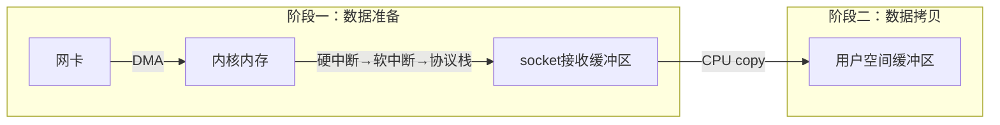

-	**数据准备阶段**：网络数据包到达网卡，通过DMA的方式将数据包拷贝到内存中，然后经过硬中断，软中断，接着通过内核线程ksoftirqd经过内核协议栈的处理，最终将数据拷贝到内核socket的接收缓冲区（队列）中
-	**数据拷贝阶段**：当数据到达内核socket的接收缓冲区中时，此时数据存在于内核空间中，需要将数据拷贝到用户空间中，才能够被应用程序读取

前文[]()描述了同步阻塞IO、以及epoll IO多路复用针对这两个阶段的不同处理

####	阻塞 VS 非阻塞
阻塞与非阻塞的区别主要发生在数据准备阶段，当应用程序发起系统调用`read`时，进（线）程从用户态转为内核态，读取内核socket的接收缓冲区中的网络数据

1、阻塞模式


如果这时内核socket的接收缓冲区没有数据，那么线程就会一直等待，直到socket接收缓冲区有数据为止。随后将数据从内核空间拷贝到用户空间，系统调用`read`返回。阻塞的特点是在第一阶段和第二阶段都会（阻塞）等待

2、非阻塞模式（阻塞和非阻塞主要的区分是在第一阶段，即数据准备阶段）


非阻塞模式在数据接收的流程如下：

-   第一阶段，当socket接收缓冲区中没有数据的时候，阻塞模式下应用线程会一直等待；而非阻塞模式下应用线程不会等待，系统调用直接返回错误`EWOULDBLOCK`
-   当socket接收缓冲区中有数据的时候，阻塞和非阻塞模式的表现是一样的，都会进入第二阶段等待数据从内核空间拷贝到用户空间，然后系统调用返回

小结下，非阻塞的特点是第一阶段不会等待，但是在第二阶段还是会等待

####    同步与异步
同步与异步的主要区别发生在第二阶段，即数据拷贝阶段。数据拷贝阶段主要是将数据从内核空间拷贝到用户空间。然后应用程序才可以读取数据，当内核socket接收缓冲区有数据到达时，进入第二阶段

1、同步模式

同步模式在数据准备好后，是由用户线程的内核态来执行第二阶段。所以应用程序会在第二阶段发生阻塞，直到数据从内核空间拷贝到用户空间，系统调用才会返回。Linux下的epoll机制就属于同步IO


2、异步模式

异步模式下是由内核来执行第二阶段的数据拷贝操作，当内核执行完第二阶段，会通知用户线程IO操作已经完成，并将数据回调给用户线程。所以在异步模式下数据准备阶段和数据拷贝阶段均是由内核来完成，不会对应用程序造成任何阻塞。异步模式需要内核底层的支持（如Linux内核 5.1版本引入的异步IO库`io_uring`）

##  0x02    IO模型
基于同步/异步、阻塞/非阻塞可构建如下IO模型（自上而下，性能更优）

-   阻塞IO
-   非阻塞IO
-   IO多路复用
-   信号驱动IO
-   异步IO

####    阻塞IO（BIO）
阻塞IO模型下，网络数据的读写过程如下。由于阻塞IO的读写特点，所以导致在阻塞IO模型下，每个请求都需要被一个独立的线程处理。一个线程在同一时刻只能与一个连接绑定。来一个请求，服务端就需要创建一个线程用来处理请求

1、阻塞读，当用户线程发起`read`系统调用，用户线程从用户态切换到内核态，在内核中去查看socket接收缓冲区是否有数据到来

-   socket接收缓冲区中有数据，则用户线程在内核态将内核空间中的数据拷贝到用户空间，系统IO调用返回
-   socket接收缓冲区中无数据，则用户线程让出CPU，进入阻塞状态。当数据到达socket接收缓冲区后，内核唤醒阻塞状态中的用户线程进入就绪状态，随后经过CPU的调度获取到CPU quota进入运行状态，将内核空间的数据拷贝到用户空间，随后系统调用返回

2、阻塞写，当用户线程发起`send`系统调用时，用户线程从用户态切换到内核态，将发送数据从用户空间拷贝到内核空间中的Socket发送缓冲区中

-   当socket发送缓冲区能够容纳下发送数据时，用户线程会将全部的发送数据写入socket缓冲区，然后执行在内核->协议栈的发送数据流程完成之后返回
-   当socket发送缓冲区空间不够，无法容纳下全部发送数据时，用户线程让出CPU并进入阻塞状态，直到socket发送缓冲区能够容纳下全部发送数据时，内核唤醒用户线程，执行后续发送流程


阻塞IO模型的缺点：

1.  一个线程只能处理一个连接，如果这个连接上没有数据的话，那么这个线程就只能阻塞在系统IO调用上，不能干其他的事情，浪费CPU资源
2.  单连接单线程模式下，大量的线程创建导致上下文切换，也是巨大的系统开销

####    非阻塞IO（NIO）
网络读写操作在非阻塞IO下的特点是：

1、非阻塞读，当用户线程发起非阻塞`read`系统调用时，用户线程从用户态转为内核态，在内核中去查看socket接收缓冲区是否有数据到来

-   若socket接收缓冲区中无数据，系统调用立马返回，并带有一个 `EWOULDBLOCK` 或 `EAGAIN` 错误，这个阶段用户线程不会阻塞，也不会让出CPU，而是会继续轮询直到socket接收缓冲区中有数据为止
-   若socket接收缓冲区中有数据，用户线程在内核态会将内核空间中的数据拷贝到用户空间，注意这个数据拷贝阶段，应用程序是阻塞的，当数据拷贝完成，系统调用返回

2、非阻塞写，当发送缓冲区中没有足够的空间容纳全部发送数据时，非阻塞写的特点是尽力写完剩下的缓冲区，如写不下了就立即返回，并将写入到发送缓冲区的字节数返回给应用程序，方便用户线程不断的轮询尝试将剩下的数据写入发送缓冲区中


非阻塞模型的缺点：

1.  用户线程不断地系统调用检查socket接收缓冲区，从用户态到内核态的切换导致的性能开销

####    IO多路复用（select/poll/epoll）
IO多路复用模型的出发点是如何用尽可能少的线程去处理更多的连接

-   多路：核心需求是要用尽可能少的线程来处理尽可能多的连接，多路指的就是需要处理的众多连接
-   复用：核心需求是使用尽可能少的线程，尽可能少的系统开销去处理尽可能多的连接（多路），那么这里的复用指的就是用有限的资源，比如用一个线程或者固定数量的线程去处理众多连接上的读写事件

既然非阻塞IO模型中使用的轮询机制可能存在较多的无效切换，那么Linux内核提供了`select/poll/epoll`等事件通知机制来解决

1、`select`机制

`select`系统调用使用`fd_set`位图来表示要监听的文件描述符集合（读/写/异常三个集合），内核中`do_select`函数对所有注册的fd进行线性扫描，检查每个fd是否就绪。其核心限制有：

-   `fd_set`的大小由`FD_SETSIZE`决定，默认`1024`，即最多同时监听`1024`个fd
-   每次调用`select`都需要将`fd_set`从用户空间拷贝到内核空间，返回时再拷贝回来
-   内核需要线性遍历所有fd（`O(n)`复杂度），即使大部分fd并未就绪
-   `fd_set`在返回后会被修改，下次调用前必须重新设置

2、`poll`机制

`poll`使用`struct pollfd`链表替代位图，突破了`1024`的fd数量限制。但仍然存在两个问题：每次调用需要将`pollfd`数组拷贝到内核空间，内核仍需线性扫描所有fd

3、`epoll`机制，参考[前文](https://pandaychen.github.io/2025/05/22/A-LINUX-KERNEL-TRAVEL-13/)

`epoll`是Linux特有的IO多路复用机制，它解决了`select/poll`的所有核心问题。`epoll`在内核中维护了两个核心数据结构：

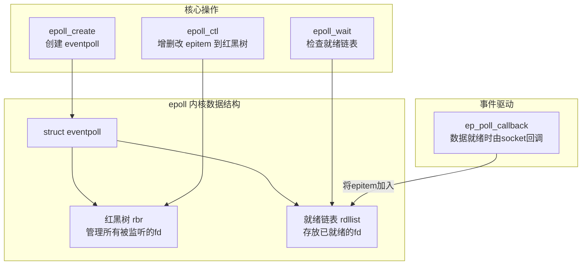

核心流程：

-   `epoll_create`：在内核中创建`struct eventpoll`结构，包含一棵红黑树`rbr`和一个就绪链表`rdllist`
-   `epoll_ctl(ADD)`：将fd封装为`struct epitem`插入红黑树（`O(logN)`），同时在对应的socket等待队列中注册回调函数`ep_poll_callback`
-   当数据就绪时（如网卡收到数据），通过中断→软中断→协议栈最终调用`ep_poll_callback`，将对应的`epitem`加入就绪链表`rdllist`
-   `epoll_wait`：检查就绪链表是否为空。非空则直接将就绪事件拷贝到用户空间返回；为空则阻塞当前进程，等待被`ep_poll_callback`唤醒

水平触发（LT）vs 边缘触发（ET）的内核实现差异：

-   **LT模式**（默认）：`epoll_wait`返回就绪事件后，如果用户没有处理完缓冲区中的数据，会将`epitem`重新放回就绪链表，下次`epoll_wait`仍然会返回该事件
-   **ET模式**：`epoll_wait`返回就绪事件后，不会自动将`epitem`放回就绪链表。只有当新数据到达触发`ep_poll_callback`时才会再次加入就绪链表

| 对比项 | select | poll | epoll |
|--------|--------|------|-------|
| fd管理方式 | `fd_set`位图 | `pollfd`链表 | 红黑树 |
| 最大fd数 | `1024`（`FD_SETSIZE`） | 无硬限制 | 无硬限制 |
| fd拷贝 | 每次调用都要拷贝 | 每次调用都要拷贝 | `epoll_ctl`时一次性注册 |
| 就绪检测 | 线性扫描 `O(n)` | 线性扫描 `O(n)` | 回调驱动 `O(1)` |
| 触发模式 | 仅LT | 仅LT | 支持LT和ET |

####    信号驱动IO（SIGIO）
信号驱动IO允许应用程序通过`sigaction`系统调用注册`SIGIO`信号处理函数。当socket上有数据就绪时，内核向应用进程发送`SIGIO`信号，应用在信号处理函数中发起`read`系统调用读取数据。信号驱动IO在第一阶段（数据准备）是非阻塞的，但在第二阶段（数据拷贝）仍然是同步阻塞的

信号驱动IO的局限：

-   信号处理函数的执行上下文受限，不能执行复杂操作
-   在大量连接场景下，信号排队和处理的开销显著
-   UDP场景下信号驱动IO工作较好，但TCP场景下由于信号触发条件过多（连接建立、断开、数据到达等），信号的过度产生导致实际不可用

####    异步IO（AIO / io_uring）

1、POSIX AIO（`aio_read`/`aio_write`）

Linux的POSIX AIO实现（glibc）实际上在用户空间通过线程池模拟异步，内核原生AIO（`io_submit`/`io_getevents`）仅支持`O_DIRECT`模式且限制较多，因此长期以来Linux缺乏真正高效的异步IO支持

2、`io_uring`（Linux 5.1+）

`io_uring`是Linux内核中真正意义上的异步IO框架，其核心设计是在用户空间和内核空间之间共享两个无锁环形缓冲区：

-   **Submission Queue（SQ）**：用户将IO请求（SQE）放入提交队列
-   **Completion Queue（CQ）**：内核将完成结果（CQE）放入完成队列

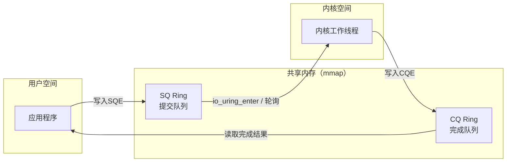

`io_uring`的优势：
-   用户态和内核态通过共享内存通信，减少系统调用（支持`SQPOLL`模式下零系统调用提交）
-   支持 Buffered IO 和 Direct IO
-   支持批量提交和完成，减少上下文切换
-   两个阶段（数据准备+数据拷贝）均由内核异步完成，应用程序完全不阻塞

##  0x03    Page Cache：页高速缓存

Page Cache是Linux内核在DRAM中维护的文件数据缓存，以`struct page`（`4KB`页）为单位。所有对常规文件的`read()`/`write()`默认都经过Page Cache

####    address_space 结构

每个inode通过内嵌的`struct address_space`管理其缓存页：

```cpp
//https://elixir.bootlin.com/linux/v4.11.6/source/include/linux/fs.h#L430
struct address_space {
    struct inode        *host;          // 所属的inode
    struct radix_tree_root  page_tree;  // 基数树，索引为页偏移(pgoff_t)，存储所有缓存页
    spinlock_t          tree_lock;      // 保护page_tree的自旋锁
    atomic_t            i_mmap_writable;// 可写mmap的计数
    struct rb_root      i_mmap;         // 所有映射该文件的VMA的红黑树
    unsigned long       nrpages;        // 缓存页总数
    unsigned long       writeback_index;// 下一次回写的起始页索引
    const struct address_space_operations *a_ops; // 文件系统操作虚表
    unsigned long       flags;          // GFP分配标志等
    ...
};
```

`a_ops`是关键的虚表指针，连接Page Cache通用代码与文件系统特定实现：

```cpp
//https://elixir.bootlin.com/linux/v4.11.6/source/include/linux/fs.h#L372
struct address_space_operations {
    int (*writepage)(struct page *page, struct writeback_control *wbc);
    int (*readpage)(struct file *, struct page *);
    int (*write_begin)(struct file *, struct address_space *mapping,
                loff_t pos, unsigned len, unsigned flags,
                struct page **pagep, void **fsdata);
    int (*write_end)(struct file *, struct address_space *mapping,
                loff_t pos, unsigned len, unsigned copied,
                struct page *page, void *fsdata);
    int (*writepages)(struct address_space *, struct writeback_control *);
    sector_t (*bmap)(struct address_space *, sector_t);
    int (*direct_IO)(struct kiocb *, struct iov_iter *iter);
    ...
};
```

####    缓存命中与缺失

读操作时，内核首先在`page_tree`中查找目标页：

-   **缓存命中**：页已在`page_tree`中且`PG_uptodate`标志（最核心的数据有效性状态标志）已设置，直接从内存拷贝数据到用户空间，无需磁盘IO（延迟约`100ns`级别）
-   **缓存缺失**：`page_tree`中找不到目标页，内核需要分配新页、将其加入`page_tree`、调用`a_ops->readpage()`提交`bio`到块层从磁盘读取，等待IO完成后设置`PG_uptodate`，最后拷贝到用户空间

**预读（Readahead）** 机制：内核检测到顺序读模式后，会通过`ondemand_readahead`/`page_cache_async_readahead`等函数预先发起后续页面的读取，预读窗口从小逐步增大，直到达到`ra->ra_pages`上限。典型的顺序读场景下可以达到超过`90%`的缓存命中率

####    Dirty Page生命周期

写操作将数据写入Page Cache中的页并标记为dirty，之后异步回写到磁盘：

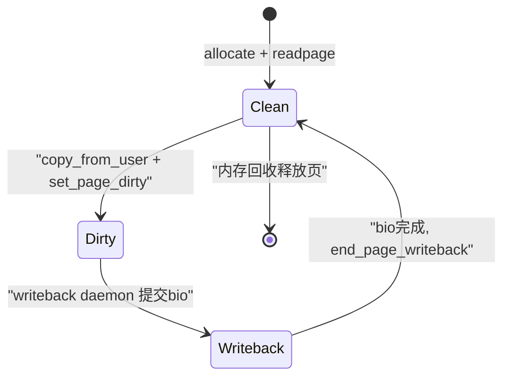

回写（Writeback）触发条件：
-   **定时**：dirty页存在超过`dirty_expire_centisecs`（默认`3000`，即`30`秒）
-   **内存压力**：dirty页占比超过`dirty_background_ratio`（默认`10%`）时启动后台回写；超过`dirty_ratio`（默认`20%`）时前台限流阻塞写入进程
-   **显式刷盘**：应用调用`fsync()`/`fdatasync()`

回写由per-BDI（块设备）的工作线程`wb_workfn`执行，遍历dirty inode列表，调用`a_ops->writepages()`将dirty页提交到块层

##  0x04    Direct IO VS Buffered IO

####    Buffered IO

Buffered IO是Linux默认的文件IO模式，所有读写都经过Page Cache

1、读路径核心流程（`generic_file_buffered_read`）：

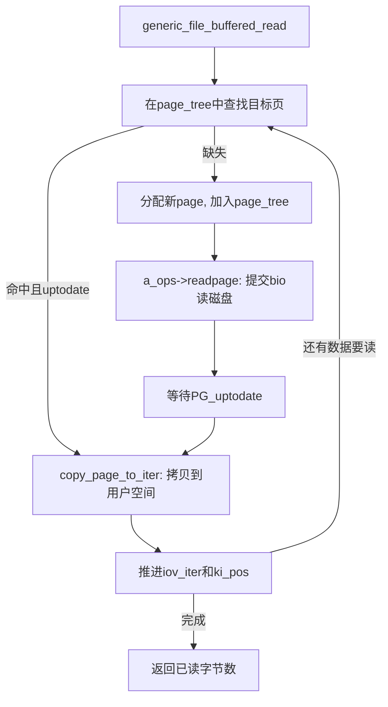

2、写路径核心流程（`generic_perform_write`）：

```cpp
//https://elixir.bootlin.com/linux/v4.11.6/source/mm/filemap.c#L2952
ssize_t generic_perform_write(struct file *file,
                struct iov_iter *i, loff_t pos)
{
    struct address_space *mapping = file->f_mapping;

    do {
        struct page *page;
        unsigned long offset = pos & (PAGE_SIZE - 1); // 页内偏移
        unsigned long bytes = min(PAGE_SIZE - offset, iov_iter_count(i));

        // 1. 让文件系统准备好目标页（可能需要从磁盘读取部分页内容）
        status = a_ops->write_begin(file, mapping, pos, bytes, flags,
                                    &page, &fsdata);

        // 2. 将用户数据拷贝到页中
        copied = iov_iter_copy_from_user_atomic(page, i, offset, bytes);
        flush_dcache_page(page);

        // 3. 通知文件系统写入完成，标记页为dirty
        status = a_ops->write_end(file, mapping, pos, bytes, copied,
                                  page, fsdata);

        pos += copied;
        written += copied;

        // 4. dirty页限流，防止dirty页占用过多内存
        balance_dirty_pages_ratelimited(mapping);
    } while (iov_iter_count(i));

    return written;
}
```

####    Direct IO

Direct IO通过`O_DIRECT`标志打开文件，绕过Page Cache直接与块设备交互。在`generic_file_read_iter`中的分发逻辑：

```cpp
ssize_t generic_file_read_iter(struct kiocb *iocb, struct iov_iter *iter)
{
    if (iocb->ki_flags & IOCB_DIRECT) {
        struct address_space *mapping = file->f_mapping;
        // Direct IO：绕过page cache
        retval = mapping->a_ops->direct_IO(iocb, iter);
    }
    // Buffered IO：从page cache读取
    retval = generic_file_buffered_read(iocb, iter, retval);
}
```

Direct IO的关键约束：

-   文件偏移、用户缓冲区地址、传输长度**必须对齐**到文件系统的逻辑块大小（通常`512B`或`4096B`），否则返回`EINVAL`
-   为保证一致性，内核在Direct IO前会先将Page Cache中该范围的dirty页刷盘并失效（`filemap_write_and_wait_range`）

Direct IO的典型使用场景：

-   **数据库**（MySQL InnoDB、PostgreSQL）：数据库自行管理缓冲池（Buffer Pool），使用`O_DIRECT`避免数据在DB缓冲池和Page Cache之间的双重缓存
-   **延迟可预测性**：避免Page Cache回写风暴导致的延迟毛刺

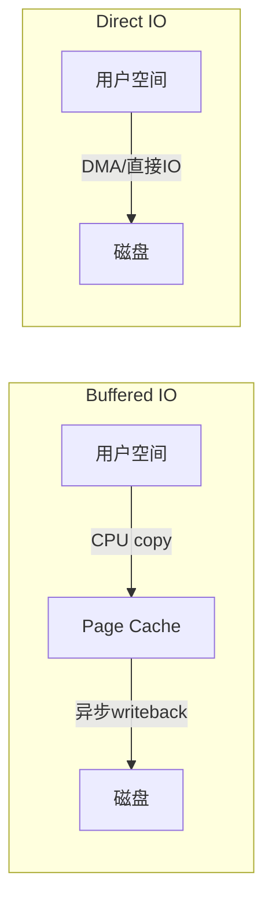

##  0x05    零拷贝技术

####    传统IO的数据拷贝问题

以`read()+write()`实现文件传输为例，传统IO流程需要`4`次数据拷贝和`4`次上下文切换：

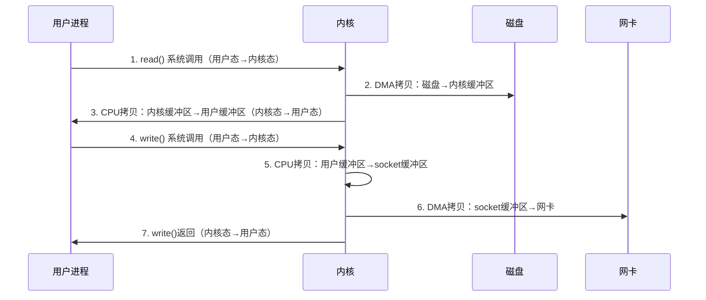

总计次数为`2`次DMA拷贝 + `2`次CPU拷贝 + `4`次上下文切换

####    mmap + write

`mmap`将文件的Page Cache映射到用户空间虚拟地址，用户进程可以直接访问Page Cache中的数据而无需CPU拷贝到用户缓冲区，减少一次CPU拷贝：

-   `mmap()`：将文件内容映射到用户空间（`2`次上下文切换）
-   `write()`：从映射区域写入socket（`2`次上下文切换）

总计次数为`2`次DMA拷贝 + `1`次CPU拷贝（Page Cache→socket缓冲区） + `4`次上下文切换

局限是，`mmap`需要管理虚拟内存映射，可能触发缺页异常；不适合小文件传输

####    sendfile

`sendfile`系统调用在内核态完成数据从文件到socket的传输，完全避免用户空间参与：

```cpp
//https://elixir.bootlin.com/linux/v4.11.6/source/fs/read_write.c#L1435
// 用户态原型：ssize_t sendfile(int out_fd, int in_fd, off_t *offset, size_t count);
// 内核实现：
static ssize_t do_sendfile(int out_fd, int in_fd, loff_t *ppos,
                           size_t count, loff_t max)
{
    ...
    // 通过splice机制在内核态完成数据传输
    retval = do_splice_direct(in_file, ppos, out_file, &out_pos, count, fl);
    ...
}
```

`sendfile`的数据流：`磁盘 →(DMA)→ Page Cache →(CPU copy)→ socket缓冲区 →(DMA)→ 网卡`

总计次数为`2`次DMA拷贝 + `1`次CPU拷贝 + `2`次上下文切换

如果网卡支持**SG-DMA**（Scatter-Gather DMA），可以进一步消除CPU拷贝，内核不再将数据从Page Cache拷贝到socket缓冲区，而是将Page Cache页的地址和长度信息追加到socket缓冲区，DMA引擎直接从Page Cache收集数据发送到网卡：

总计次数为`2`次DMA拷贝 + `0`次CPU拷贝 + `2`次上下文切换（**真正的零拷贝**）

####    splice

`splice`系统调用利用pipe（管道）作为中间桥梁，在两个文件描述符之间移动数据，无需在用户空间和内核空间之间拷贝。其核心原理是通过传递Page Cache页的引用（而非数据本身）实现零拷贝：

```cpp
// 用户态用法：
// 1. pipe(pipefd);
// 2. splice(file_fd, NULL, pipefd[1], NULL, len, SPLICE_F_MOVE);  // 文件→pipe
// 3. splice(pipefd[0], NULL, socket_fd, NULL, len, SPLICE_F_MOVE); // pipe→socket

//https://elixir.bootlin.com/linux/v4.11.6/source/fs/splice.c#L1402
SYSCALL_DEFINE6(splice, int, fd_in, loff_t __user *, off_in,
		int, fd_out, loff_t __user *, off_out,
		size_t, len, unsigned int, flags)
{
	struct fd in, out;
	long error;

	if (unlikely(!len))
		return 0;

	error = -EBADF;
	in = fdget(fd_in);
	if (in.file) {
		if (in.file->f_mode & FMODE_READ) {
			out = fdget(fd_out);
			if (out.file) {
				if (out.file->f_mode & FMODE_WRITE)
					error = do_splice(in.file, off_in,
							  out.file, off_out,
							  len, flags);
				fdput(out);
			}
		}
		fdput(in);
	}
	return error;
}
```

`splice`内部通过`splice_to_pipe`/`splice_from_pipe`在pipe buffer中传递`struct page`引用，配合`SPLICE_F_MOVE`标志可以移动页面而非拷贝

####    零拷贝方案对比

| 方案 | CPU拷贝 | DMA拷贝 | 上下文切换 | 适用场景 |
|------|---------|---------|-----------|---------|
| `read()+write()` | 2 | 2 | 4 | 通用，需要用户态处理数据 |
| `mmap()+write()` | 1 | 2 | 4 | 需要用户态读取文件内容 |
| `sendfile` | 1（SG-DMA下为0） | 2 | 2 | 文件→socket传输（静态文件服务） |
| `splice` | 0 | 2 | 2（两次splice为4） | 任意两个fd间的数据传输 |

##  0x06    核心数据结构

几个核心的数据结构：
-   `struct iovec`
-   `struct kvec`
-   `struct bio_vec`
-   `struct kiocb`
-   `struct iov_iter`：`read`用于读取数据到一个用户态缓冲区，`readv`读取数据到多个用户态缓冲区，为了兼容这两种syscall，引入了数据结构`iovec`，而`iov_iter`又是对`iovec`的迭代器，**使用`iov_iter`结构体的本质是用于协助处理用户态缓冲区数据和页缓存之间的映射关系**
-   `struct msghdr`

下文分别介绍上述结构的作用，区分，相互配合场景


以ext4为例，其文件系统中管理的文件对应的 `file_operations` 指向 `ext4_file_operations`，专门用于操作 ext4 文件系统中的文件

```cpp
const struct file_operations ext4_file_operations = {
    .read_iter  = ext4_file_read_iter,
    .write_iter = ext4_file_write_iter,
    // 注意：未定义 .read 和 .write 方法
};
```

那么对ext4文件的VFS读取调用链路中，`__vfs_read` 调用的是 `new_sync_read` 方法

```cpp
//https://elixir.bootlin.com/linux/v4.11.6/source/fs/read_write.c#L446
ssize_t __vfs_read(struct file *file, char __user *buf, size_t count, loff_t *pos) {
    ......
    if (file->f_op->read)
        return file->f_op->read(file, buf, count, pos);
    else if (file->f_op->read_iter)
        return new_sync_read(file, buf, count, pos);
    else
        return -EINVAL;
}
```

在`new_sync_read`方法中会对系统调用传进来的参数进行重新封装，把下述四个参数重新封装到 `struct iovec` 和 `struct kiocb`结构体中

-   `struct file *filp`：要读取文件的 `struct file` 结构
-   `char __user *buf`：用户空间（特意加了`__user`标识）的 Buffer，这里由用户态传入的最终内核要copy数据的目的地
-   `size_t count`：进行读取的字节数，即传入的用户态缓冲区剩余可容纳的容量大小
-   `loff_t *pos`：文件当前读取位置偏移 `offset`

```cpp
static inline void init_sync_kiocb(struct kiocb *kiocb, struct file *filp)
{
	*kiocb = (struct kiocb) {
		.ki_filp = filp,
		.ki_flags = iocb_flags(filp),
	};
}

//https://elixir.bootlin.com/linux/v4.11.6/source/lib/iov_iter.c#L421
void iov_iter_init(struct iov_iter *i, int direction,
			const struct iovec *iov, unsigned long nr_segs,
			size_t count)
{
	if (segment_eq(get_fs(), KERNEL_DS)) {
		direction |= ITER_KVEC;
		i->type = direction;
		i->kvec = (struct kvec *)iov;
	} else {
		i->type = direction;
		i->iov = iov;
	}
	i->nr_segs = nr_segs;
	i->iov_offset = 0;
	i->count = count;
}

//https://elixir.bootlin.com/linux/v4.11.6/source/fs/read_write.c#L429
static ssize_t new_sync_read(struct file *filp, char __user *buf, size_t len, loff_t *ppos)
{
    // 1、将用户态缓存空间以及要读取的字节数封装进 iovec 结构体中
    // len：希望读取文件字节数
	struct iovec iov = { .iov_base = buf, .iov_len = len };
	struct kiocb kiocb;
	struct iov_iter iter;
	ssize_t ret;

    // 2、利用文件 struct file 初始化 kiocb 结构体
	init_sync_kiocb(&kiocb, filp);
    // 设置文件读取偏移
	kiocb.ki_pos = *ppos;
    // 3、初始化 iov_iter 结构
	iov_iter_init(&iter, READ, &iov, 1, len);

    // 4、在ext4文件系统，这里最终是调用ext4_file_read_iter函数
	ret = call_read_iter(filp, &kiocb, &iter);
	BUG_ON(ret == -EIOCBQUEUED);
	*ppos = kiocb.ki_pos;
	return ret;
}
```

`new_sync_read`函数做了两件重要的事情：

1.  封装用户请求，将用户传入的缓冲区信息包装成内核通用的 `iovec`和 `iov_iter`结构
2.  初始化上下文，设置同步I/O控制块 `kiocb`，指明操作类型、文件和起始位置

####    `struct iovec`结构
`struct iovec` 结构主要用来封装用来接收文件数据用的用户缓存区相关的信息：

```cpp
//https://elixir.bootlin.com/linux/v4.11.6/source/include/uapi/linux/uio.h#L16
struct iovec
{
	void __user *iov_base;	 // 用户空间缓冲区地址（__user标识用户态指针）
	__kernel_size_t iov_len; // 缓冲区长度
};
```

作为一个整体，`struct iovec`描述了用户空间的一个缓冲区。当`read`系统调用只使用单个缓冲区时，`new_sync_read`内部会创建一个`iovec`；当`readv`系统调用传入多个缓冲区时，用户态的`iovec`数组会被`import_iovec`拷贝到内核

####    `struct kvec`结构

`struct kvec` 与 `struct iovec` 结构完全一致，但描述的是**内核空间**的缓冲区：

```cpp
//https://elixir.bootlin.com/linux/v4.11.6/source/include/linux/uio.h#L19
struct kvec {
	void *iov_base;      // 内核空间缓冲区地址（无__user标识）
	size_t iov_len;      // 缓冲区长度
};
```

在`iov_iter_init`中可以看到其选择逻辑，当地址空间限制为`KERNEL_DS`时（`segment_eq(get_fs(), KERNEL_DS)`），将`iovec`强转为`kvec`并设置`ITER_KVEC`标志。`kvec`典型的使用场景是内核内部的网络通信（如NFS、CIFS等内核网络文件系统通过`kernel_sendmsg`发送数据）

####    `struct bio_vec`结构

`struct bio_vec` 描述的是**物理页中的一段区域**，用于块设备IO：

```cpp
//https://elixir.bootlin.com/linux/v4.11.6/source/include/linux/bvec.h#L17
struct bio_vec {
	struct page	*bv_page;    // 指向物理页
	unsigned int	bv_len;      // 数据长度
	unsigned int	bv_offset;   // 页内偏移
};
```

`bio_vec`常用于块层的`struct bio`中，描述一个IO请求覆盖的物理页区域。在`iov_iter`中，当类型为`ITER_BVEC`时，迭代器直接操作`bio_vec`数组，适用于内核中的块设备IO路径（如Direct IO中`__blockdev_direct_IO`构建bio时）

####    三种缓冲区描述符对比

| 结构体 | 地址空间 | 用途 | `iov_iter`标志 |
|--------|---------|------|--------------|
| `struct iovec` | 用户空间（`__user`） | 用户态`read/write/readv/writev` | 默认（无标志） |
| `struct kvec` | 内核空间 | 内核内部通信（NFS/CIFS等） | `ITER_KVEC` |
| `struct bio_vec` | 物理页 | 块设备IO/Direct IO | `ITER_BVEC` |

####    `struct iov_iter`结构
内核中一般会使用 `struct iov_iter` 结构对 `struct iovec` 进行包装，`iov_iter` 中可以包含多个 `iovec`（`iov_iter`中的关键字 `iter`就说明了这点）。内核使用 `struct iov_iter` 结构体来包装 `struct iovec` 的目的是为了兼容 `readv()` 系列的系统调用，它允许用户使用多个用户缓存区去读取文件中的数据


```cpp
//https://elixir.bootlin.com/linux/v4.11.6/source/include/linux/uio.h#L30
struct iov_iter {
	int type;                // 标识读(READ)或写(WRITE)，以及迭代器类型（ITER_KVEC/ITER_BVEC/ITER_PIPE）
	size_t iov_offset;       // 当前iovec中已处理数据的偏移（即当前段内的游标）
	size_t count;            // 剩余待处理的总字节数
	// 注意这是个union类型
    union {
		const struct iovec *iov;     // 用户态缓冲区数组
		const struct kvec *kvec;     // 内核态缓冲区数组
		const struct bio_vec *bvec;  // 物理页缓冲区数组
		struct pipe_inode_info *pipe; // 管道IO
	};
	union {
		unsigned long nr_segs;       // 剩余的段（iovec/kvec/bvec）数量
		struct {
			int idx;
			int start_idx;
		};
	};
};
```

在内核中，迭代器`*_iter` 结构是常见设计，通常用来描述一个对象的处理进度。`iov_iter`最初主要用于描述一次IO流程中用户空间的处理进度，其中以`*iov`成员保存用户空间的内存地址，**`iov_offset`和`count`记录当前处理进度，这两个参数会随IO的进行（读写）不断变化**

`iov_iter`迭代进度变化示意（以包含`3`个`iovec`的`readv`为例）：

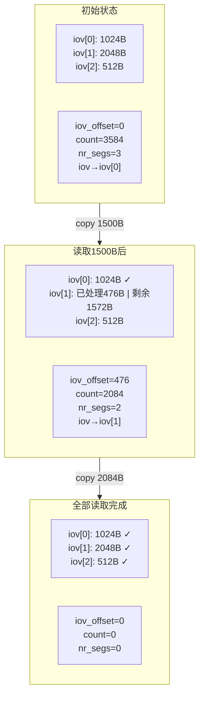

####    `struct kiocb`结构体
`struct kiocb` 结构体则是用来封装文件 IO 相关操作的状态和进度信息

```cpp
//https://elixir.bootlin.com/linux/v4.11.6/source/include/linux/fs.h#L274
struct kiocb {
	struct file	*ki_filp;    // 要操作的文件struct file结构（指向open文件创建的file结构）
	loff_t		ki_pos;      // 文件读写位置偏移，表示文件处理进度
	void (*ki_complete)(struct kiocb *iocb, long ret);  // IO完成回调
	int		ki_flags;    // IO标志（IOCB_DIRECT / IOCB_DSYNC / IOCB_APPEND等）
	void		*private;
};
```

`kiocb` 中主要保存了一个`file`结构以及记录读写偏移，相当于描述了一次IO中文件侧的处理进度

**`iov_iter` 和 `kiocb` 实际上分别描述了一次IO的两端，`iov_iter`描述内存侧，`kiocb`描述文件侧，文件系统提供`read_iter`/`write_iter`两个接口基于这两个数据结构封装读写操作**

同步IO vs 异步IO下`kiocb`的差异：

-   **同步IO**：`ki_complete`为`NULL`，`new_sync_read`/`new_sync_write`中通过`init_sync_kiocb`初始化，调用`call_read_iter`后直接返回结果
-   **异步IO**：`ki_complete`指向完成回调函数。`io_uring`或native AIO框架设置该回调，内核完成IO后通过`ki_complete`通知用户态

####    `struct msghdr`结构

`struct msghdr`是网络IO中的核心数据结构，用于`sendmsg`/`recvmsg`系统调用。内核中（4.11.6版本）`msghdr`已将`msg_iov`/`msg_iovlen`替换为`struct iov_iter msg_iter`：

```cpp
//https://elixir.bootlin.com/linux/v4.11.6/source/include/linux/socket.h#L48
struct msghdr {
	void		*msg_name;       // socket地址（struct sockaddr）
	int		msg_namelen;     // 地址长度
	struct iov_iter	msg_iter;        // 数据迭代器（替代了早期的msg_iov + msg_iovlen）
	void		*msg_control;    // 辅助数据（cmsg）
	__kernel_size_t	msg_controllen;  // 辅助数据长度
	unsigned int	msg_flags;       // 接收标志（MSG_DONTWAIT/MSG_PEEK等）
	struct kiocb	*msg_iocb;       // 异步IO请求关联
};
```

用户空间传入的是`struct user_msghdr`，内核通过`copy_msghdr_from_user`将其转换为内核态`struct msghdr`：

```cpp
//https://elixir.bootlin.com/linux/v4.11.6/source/include/linux/socket.h#L36
struct user_msghdr {
	void __user	*msg_name;        // 用户态socket地址
	int		msg_namelen;
	struct iovec __user *msg_iov;     // 用户态iovec数组（区别于内核态的msg_iter）
	__kernel_size_t	msg_iovlen;       // iovec数量
	void __user	*msg_control;
	__kernel_size_t	msg_controllen;
	unsigned int	msg_flags;
};
```

`msghdr`与`iov_iter`的关系（以`sendmsg`为例）：

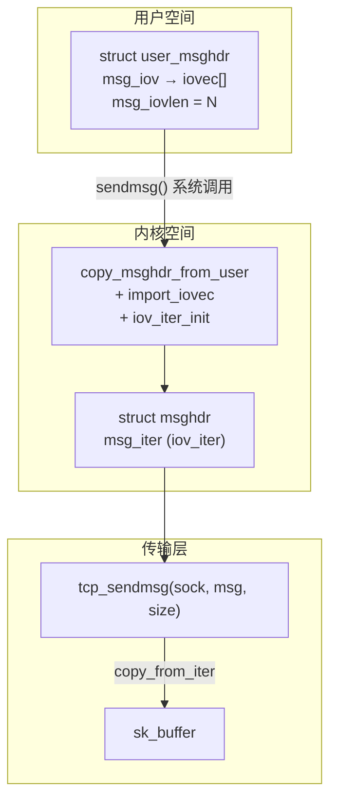

##  0x07    常用操作函数

####	copy_to_iter && copy_from_iter

-	`copy_to_iter`：从内核缓冲区拷贝到迭代器指定的目标（用于读操作：内核→用户）
-	`copy_from_iter`：从迭代器指定的源拷贝到内核缓冲区（用于写操作：用户→内核）

```cpp
//https://elixir.bootlin.com/linux/v4.11.6/source/lib/iov_iter.c#L555
size_t copy_to_iter(const void *addr, size_t bytes, struct iov_iter *i)
{
	const char *from = addr;
	if (unlikely(i->type & ITER_PIPE))
		return copy_pipe_to_iter(addr, bytes, i);
	iterate_and_advance(i, bytes, v,
		__copy_to_user(v.iov_base, (from += v.iov_len) - v.iov_len,
			       v.iov_len),
		memcpy_to_page(v.bv_page, v.bv_offset,
			       (from += v.bv_len) - v.bv_len, v.bv_len),
		memcpy(v.iov_base, (from += v.iov_len) - v.iov_len, v.iov_len)
	)

	return bytes;
}

size_t copy_from_iter(void *addr, size_t bytes, struct iov_iter *i)
{
	char *to = addr;
	if (unlikely(i->type & ITER_PIPE)) {
		WARN_ON(1);
		return 0;
	}
	iterate_and_advance(i, bytes, v,
		__copy_from_user((to += v.iov_len) - v.iov_len, v.iov_base,
				 v.iov_len),
		memcpy_from_page((to += v.bv_len) - v.bv_len, v.bv_page,
				 v.bv_offset, v.bv_len),
		memcpy((to += v.iov_len) - v.iov_len, v.iov_base, v.iov_len)
	)

	return bytes;
}
```

注意`iterate_and_advance`宏接收`3`个回调参数（`I`, `B`, `K`），分别对应`iovec`（用户空间）、`bio_vec`（物理页）、`kvec`（内核空间）三种迭代器类型。以`copy_to_iter`为例：
-   `I`回调 = `__copy_to_user`：将数据拷贝到用户空间
-   `B`回调 = `memcpy_to_page`：将数据写入物理页
-   `K`回调 = `memcpy`：内核地址空间内直接memcpy

####    iterate_and_advance 宏详解

`iterate_and_advance`是`iov_iter`操作的核心宏，负责遍历迭代器中的所有段，对每段执行回调操作，并自动推进迭代器状态：

```cpp
//https://elixir.bootlin.com/linux/v4.11.6/source/lib/iov_iter.c#L538
#define iterate_and_advance(i, n, v, I, B, K) {         \
	if (unlikely(i->count < n))                     \
		n = i->count;                           \
	if (i->count) {                                 \
		size_t skip = i->iov_offset;            \
		if (unlikely(i->type & ITER_BVEC)) {    \
			// bio_vec类型：遍历物理页段，执行B回调
			const struct bio_vec *bvec = i->bvec;   \
			struct bio_vec v;                       \
			struct bvec_iter __bi;                  \
			iterate_bvec(i, n, v, __bi, skip, (B)) \
			i->bvec = __bvec_iter_bvec(i->bvec, __bi);     \
			i->nr_segs -= i->bvec - bvec;          \
			skip = __bi.bi_bvec_done;              \
		} else if (unlikely(i->type & ITER_KVEC)) {     \
			// kvec类型：遍历内核缓冲区段，执行K回调
			const struct kvec *kvec;               \
			struct kvec v;                         \
			iterate_kvec(i, n, v, kvec, skip, (K)) \
			if (skip == kvec->iov_len) {           \
				kvec++;                        \
				skip = 0;                      \
			}                                      \
			i->nr_segs -= kvec - i->kvec;          \
			i->kvec = kvec;                        \
		} else {                                        \
			// iovec类型：遍历用户空间缓冲区段，执行I回调
			const struct iovec *iov;               \
			struct iovec v;                        \
			iterate_iovec(i, n, v, iov, skip, (I)) \
			if (skip == iov->iov_len) {            \
				iov++;                         \
				skip = 0;                      \
			}                                      \
			i->nr_segs -= iov - i->iov;            \
			i->iov = iov;                          \
		}                                               \
		i->count -= n;                                  \
		i->iov_offset = skip;                           \
	}                                                       \
}
```

核心逻辑流程：

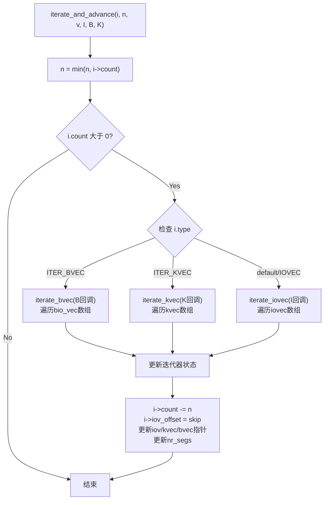

每轮迭代中的状态更新逻辑：
1.  `skip`（即`iov_offset`）：记录当前段内已处理的偏移。当一个段被完全消费（`skip == len`）时，移动到下一个段并重置`skip=0`
2.  `i->count -= n`：减去本轮处理的字节数
3.  `i->nr_segs`：减去已完全消费的段数
4.  `i->iov`/`kvec`/`bvec`指针：向后移动，跳过已完全消费的段

##  0x08    IO系统调用内核实现

####    read 系统调用链

`read`系统调用的完整内核调用链（以ext4文件系统为例）：

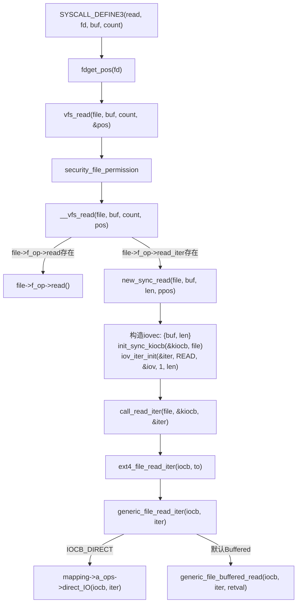

`read`系统调用的核心源码：

```cpp
//https://elixir.bootlin.com/linux/v4.11.6/source/fs/read_write.c#L564
SYSCALL_DEFINE3(read, unsigned int, fd, char __user *, buf, size_t, count)
{
	struct fd f = fdget_pos(fd);
	ssize_t ret = -EBADF;

	if (f.file) {
		loff_t pos = file_pos_read(f.file);
		ret = vfs_read(f.file, buf, count, &pos);
		if (ret >= 0)
			file_pos_write(f.file, pos);
		fdput_pos(f);
	}
	return ret;
}
```

继续跟踪`vfs_read` → `__vfs_read` → `new_sync_read`的调用链，最终到达文件系统的`read_iter`函数：

```cpp
static inline ssize_t call_read_iter(struct file *file, struct kiocb *kio,
				     struct iov_iter *iter)
{
	return file->f_op->read_iter(kio, iter);
}

static ssize_t ext4_file_read_iter(struct kiocb *iocb, struct iov_iter *to)
{
    ......
	return generic_file_read_iter(iocb, to);
}

//https://elixir.bootlin.com/linux/v4.11.6/source/mm/filemap.c#L2037
ssize_t generic_file_read_iter(struct kiocb *iocb, struct iov_iter *iter)
{
    ......
    if (iocb->ki_flags & IOCB_DIRECT) {
        struct address_space *mapping = file->f_mapping;
        ......
        retval = mapping->a_ops->direct_IO(iocb, iter);
    }
    retval = generic_file_buffered_read(iocb, iter, retval);
}
```

####    writev 系统调用全链路分析

`writev` 是一种向文件描述符写入数据的系统调用，它允许从多个缓冲区一次性写入数据，原型如下：

```cpp
ssize_t writev(int fd, const struct iovec *iov, int iovcnt);
```

writev 完整的内核调用链路（kernel 4.11.6）：

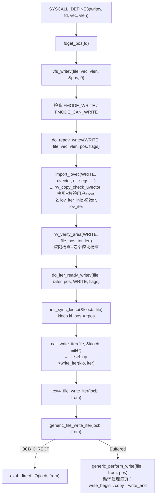

逐层源码分析：

**第一层：系统调用入口**

```cpp
//https://elixir.bootlin.com/linux/v4.11.6/source/fs/read_write.c#L1047
SYSCALL_DEFINE3(writev, unsigned long, fd, const struct iovec __user *, vec,
		unsigned long, vlen)
{
	struct fd f = fdget_pos(fd);
	ssize_t ret = -EBADF;

	if (f.file) {
		loff_t pos = file_pos_read(f.file);
		ret = vfs_writev(f.file, vec, vlen, &pos, 0);
		if (ret >= 0)
			file_pos_write(f.file, pos);
		fdput_pos(f);
	}

	if (ret > 0)
		add_wchar(current, ret);
	inc_syscw(current);
	return ret;
}
```

**第二层：VFS层权限检查**

```cpp
//https://elixir.bootlin.com/linux/v4.11.6/source/fs/read_write.c#L1030
ssize_t vfs_writev(struct file *file, const struct iovec __user *vec,
		   unsigned long vlen, loff_t *pos, int flags)
{
	if (!(file->f_mode & FMODE_WRITE))
		return -EBADF;
	if (!(file->f_mode & FMODE_CAN_WRITE))
		return -EINVAL;

	return do_readv_writev(WRITE, file, vec, vlen, pos, flags);
}
```

**第三层：iovec导入与迭代器初始化**

```cpp
//https://elixir.bootlin.com/linux/v4.11.6/source/fs/read_write.c#L985
static ssize_t do_readv_writev(int type, struct file *file,
			       const struct iovec __user *uvector,
			       unsigned long nr_segs, loff_t *pos,
			       int flags)
{
	struct iovec iovstack[UIO_FASTIOV];   // 栈上快速分配（UIO_FASTIOV=8）
	struct iovec *iov = iovstack;
	struct iov_iter iter;
	ssize_t ret;

	// 从用户空间拷贝iovec数组并校验，初始化iov_iter
	ret = import_iovec(type, uvector, nr_segs,
			   ARRAY_SIZE(iovstack), &iov, &iter);
	if (ret < 0)
		return ret;

	ret = do_iter_readv_writev(file, &iter, pos, type, flags);

	kfree(iov);
	return ret;
}
```

`import_iovec`内部先调用`rw_copy_check_uvector`将用户态`iovec`数组拷贝到内核（如果数量不超过`UIO_FASTIOV=8`则使用栈上数组避免`kmalloc`），逐个校验`iov_base`的用户态地址合法性和`iov_len`溢出，然后调用`iov_iter_init`初始化迭代器

**第四层：构建kiocb并调用文件系统**

```cpp
//https://elixir.bootlin.com/linux/v4.11.6/source/fs/read_write.c#L873
static ssize_t do_iter_readv_writev(struct file *file, struct iov_iter *iter,
				    loff_t *ppos, int type, int flags)
{
	struct kiocb kiocb;
	ssize_t ret;

	init_sync_kiocb(&kiocb, file);
	kiocb.ki_pos = *ppos;

	if (type == READ)
		ret = call_read_iter(file, &kiocb, iter);
	else
		ret = call_write_iter(file, &kiocb, iter);
	BUG_ON(ret == -EIOCBQUEUED);
	*ppos = kiocb.ki_pos;
	return ret;
}
```

####    write VS writev 在内核实现上的对比

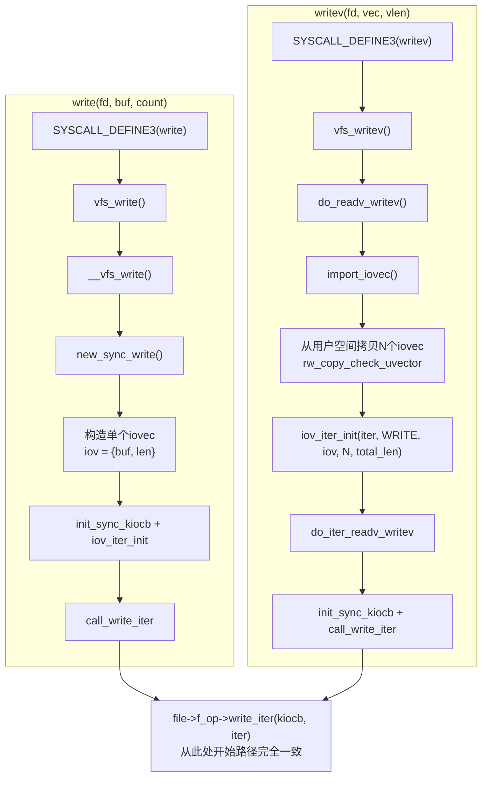

关键差异：

1.  **入口不同**：`write`走`vfs_write` → `__vfs_write` → `new_sync_write`；`writev`走`vfs_writev` → `do_readv_writev`
2.  **iovec构造**：`write`在`new_sync_write`中构造单个`iovec`（栈上）；`writev`通过`import_iovec`从用户空间拷贝多个`iovec`
3.  **汇合点**：两者最终都构建出`kiocb + iov_iter`，调用`file->f_op->write_iter`进入文件系统层，从此路径完全一致

####    writev：文件IO vs 网络IO

当`writev`的fd是文件时，`f_op->write_iter`指向文件系统的写函数（如`ext4_file_write_iter`），最终通过Page Cache写入磁盘

当`writev`的fd是socket时，路径完全不同：

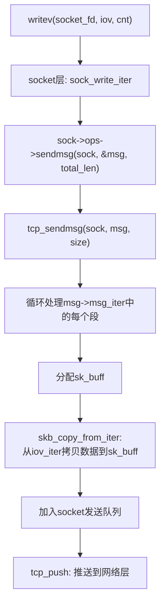

在socket路径中，内核将`iov_iter`包装进`struct msghdr`的`msg_iter`字段，由传输层协议（TCP/UDP）通过`copy_from_iter`从用户空间拷贝数据到`sk_buff`

##  0x09    协议栈视角：同步阻塞网络IO

以`recvfrom`系统调用为例，展示同步阻塞网络IO的完整等待路径：

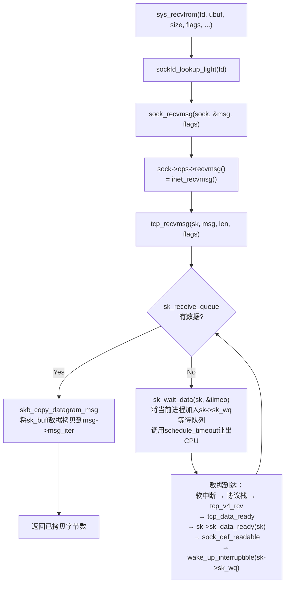

核心等待机制：

1.  `tcp_recvmsg`检查`sk->sk_receive_queue`是否有数据
2.  若队列为空，调用`sk_wait_data`：将当前进程挂到socket的等待队列`sk->sk_wq`上，然后调用`schedule_timeout`让出CPU进入`TASK_INTERRUPTIBLE`睡眠状态
3.  当网卡收到数据，经过中断→软中断→协议栈处理后，`tcp_data_ready`回调通过`wake_up_interruptible`唤醒等待队列中的进程
4.  进程被唤醒后，回到`tcp_recvmsg`重新检查接收队列，将数据通过`skb_copy_datagram_msg`拷贝到用户空间（`msg->msg_iter`→`copy_to_iter`→`__copy_to_user`）

##  0x0A 参考
-   [深入理解高性能网络开发路上的绊脚石 - 同步阻塞网络 IO](https://mp.weixin.qq.com/s/cIcw0S-Q8pBl1-WYN0UwnA)
-	[聊聊Netty那些事儿之从内核角度看IO模型](https://mp.weixin.qq.com/s?__biz=Mzg2MzU3Mjc3Ng==&mid=2247483737&idx=1&sn=7ef3afbb54289c6e839eed724bb8a9d6&chksm=ce77c71ef9004e08e3d164561e3a2708fc210c05408fa41f7fe338d8e85f39c1ad57519b614e&scene=178&cur_album_id=2559805446807928833&search_click_id=#rd)
-	[从 Linux 内核角度探秘 JDK NIO 文件读写本质](https://mp.weixin.qq.com/s?__biz=Mzg2MzU3Mjc3Ng==&mid=2247486623&idx=1&sn=0cafed9e89b60d678d8c88dc7689abda&chksm=ce77cad8f90043ceaaca732aaaa7cb692c1d23eeb6c07de84f0ad690ab92d758945807239cee&scene=178&cur_album_id=2559805446807928833&search_click_id=#rd)
-	[什么是零拷贝](https://www.xiaolincoding.com/os/8_network_system/zero_copy.html#%E4%B8%BA%E4%BB%80%E4%B9%88%E8%A6%81%E6%9C%89-dma-%E6%8A%80%E6%9C%AF)
-   [深入理解 Linux 物理内存分配全链路实现](https://www.cnblogs.com/binlovetech/p/17019710.html)
-   [从 Linux 内核角度探秘 JDK NIO 文件读写本质](https://www.cnblogs.com/binlovetech/p/16661323.html)
-   [The iov_iter interface](https://lwn.net/Articles/625077/)
-   [文件IO系统调用内幕](https://lrita.github.io/2019/03/13/the-internal-of-file-syscall/#msync)
-	[Linux I/O 原理和 Zero-copy 技术全面揭秘](https://zhuanlan.zhihu.com/p/308054212)
-   [Buffered I/O and the Page Cache - Linux Kernel Internals](https://kernel-internals.org/io/buffered-io/)
-   [Life of a write() Syscall - Linux Kernel Internals](https://kernel-internals.org/vfs/life-of-write/)
-   [Direct I/O - Linux Kernel Internals](https://kernel-internals.org/io/direct-io/)
