##  0x00    前言

本文主要结合 Linux dentry（dentry cache）的实现及机制，讨论生产环境中与 dcache 相关的典型性能陷阱，基于内核版本 `5.4.241`

1.  dcache 的核心数据结构与实现机制
2.  dcache 增长的内核侧原因分析
3.  `drop_caches` 如何回收 dcache（内核调用链解析）
4.  `systemctl daemon-reload` 与大量 negative dentry 共同作用导致机器偶发负载突高（soft lockup 问题）
5.  fsnotify 文件监控机制与 dcache 的性能影响

##  0x01    dcache 基础

先回顾一下dcache的基础知识

`struct dentry` 的完整定义如下（[include/linux/dcache.h](https://github.com/torvalds/linux/blob/v5.4/include/linux/dcache.h)）：

```c
struct dentry {
	/* RCU lookup touched fields */
	unsigned int d_flags;		/* 由 d_lock 保护，包含 dentry 类型和状态标志 */
	seqcount_t d_seq;		/* 每个 dentry 的序列锁，用于 rcu-walk 无锁查找 */
	struct hlist_bl_node d_hash;	/* dcache hash table 中的节点 */
	struct dentry *d_parent;	/* 父目录的 dentry */
	struct qstr d_name;		/* 目录项名称（含 hash 和 len） */
	struct inode *d_inode;		/* 关联的 inode，NULL 表示 negative dentry */
	unsigned char d_iname[DNAME_INLINE_LEN]; /* 内联短名称（64位系统下32字节） */

	/* Ref lookup also touches following */
	struct lockref d_lockref;	/* per-dentry 锁和引用计数（lock + count 合一） */
	const struct dentry_operations *d_op;	/* dentry 操作表 */
	struct super_block *d_sb;	/* 所属文件系统的超级块 */
	unsigned long d_time;		/* 由 d_revalidate 使用 */
	void *d_fsdata;			/* 文件系统私有数据 */

	union {
		struct list_head d_lru;		/* LRU 链表节点（unused 状态时使用） */
		wait_queue_head_t *d_wait;	/* 仅在 in-lookup 期间使用 */
	};
	struct list_head d_child;	/* 在父 dentry 的 d_subdirs 链表中的节点 */
	struct list_head d_subdirs;	/* 子 dentry 链表头 */
	/*
	 * d_alias 和 d_rcu 共享内存
	 */
	union {
		struct hlist_node d_alias;	/* inode 的别名链表（硬链接） */
		struct hlist_bl_node d_in_lookup_hash; /* 正在查找中的 hash 链表 */
		struct rcu_head d_rcu;		/* RCU 延迟释放 */
	} d_u;
} __randomize_layout;
```

####    dcache 的作用

dcache（dentry cache）是 VFS 层的核心缓存，将路径名的每个分量（component）映射为 `dentry` 对象，避免每次路径解析都访问磁盘。例如打开 `/usr/bin/vim` 时，内核需要依次解析 `/`、`usr`、`bin`、`vim` 四个分量，如果这些 dentry 已缓存在内存中，则无需读盘

####    dentry 在 VFS 中的位置

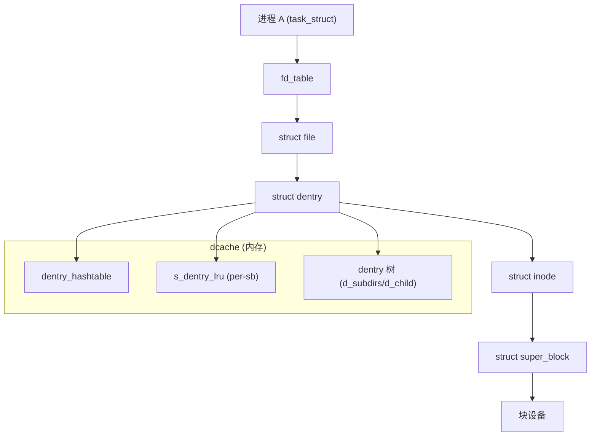

####    dentry 的三种状态

| 状态 | 条件 | 说明 |
|------|------|------|
| **in-use** | `d_lockref.count > 0` | 正在被 VFS 引用（如进程 `open` 了该文件） |
| **unused** | `d_lockref.count == 0`，`d_inode != NULL` | 不再被引用，但 inode 仍有效，缓存以加速后续访问 |
| **negative** | `d_inode == NULL` | 缓存"文件不存在"的结果，加速后续对同一不存在路径的查找 |

状态转换关系如下：

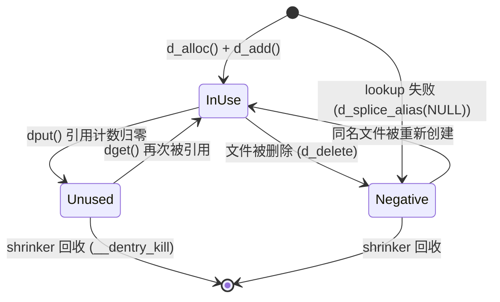

当内存紧张时，`unused` 和 `negative` 状态的 dentry 都可以被回收。可通过 `/proc/sys/fs/dentry-state` 查看当前系统中各状态 dentry 的数量：

```bash
# cat /proc/sys/fs/dentry-state
# nr_dentry  nr_unused  age_limit  want_pages  nr_negative  dummy
  239587546  239475968  45         0           187333985    0
```

其中 `nr_negative` 占比高是 dcache 膨胀的典型特征

####    dcache hash table

dcache 通过全局 hash 表 `dentry_hashtable` 组织所有已缓存的 dentry，hash key 由 `(parent_dentry, name)` 计算得出（[fs/dcache.c](https://github.com/torvalds/linux/blob/v5.4/fs/dcache.c)）：

```c
static unsigned int d_hash_shift __read_mostly;
static struct hlist_bl_head *dentry_hashtable __read_mostly;

static inline struct hlist_bl_head *d_hash(unsigned int hash)
{
	return dentry_hashtable + (hash >> d_hash_shift);
}
```

同一目录下不可能有两个同名文件，因此 `(parent, name)` 具有唯一性。不同 name 可能 hash 冲突，通过链表解决

####	dcache的主要操作函数

下面列出 dcache 核心操作函数的源码及锁机制分析。先给出整体的锁行为：

| 函数 | lock | 引用计数影响 | 要点 |
|------|--------|-------------|------|
| `d_alloc` | 获取 `parent->d_lock` | parent `count++`，新 dentry `count=1` | 新 dentry 加入 `d_subdirs` |
| `d_add` / `__d_add` | `inode->i_lock`（外）→ `dentry->d_lock`（内） | 无变动 | `d_seq` seqcount 保护 inode 写入；加入 hash table 和 alias 链表 |
| `d_lookup` / `__d_lookup` | `rcu_read_lock` + 逐个 `spin_lock(d_lock)` | 找到时 `count++` | 外层 `rename_lock` seqlock 防 rename 并发的 false-negative |
| `d_drop` / `__d_drop` | `dentry->d_lock` | 不变 | 从 hashtable 摘除，`d_seq` invalidate 通知 rcu-walk 重试 |
| `d_delete` | `inode->i_lock` → `dentry->d_lock`（严格顺序） | 依据 `count==1` 分支 | `count==1` 直接 `unlink` inode（变 negative）；`count>1` 仅 drop |
| `dget` | `lockref_get`（快速路径 `cmpxchg` 无锁，慢路径 `d_lock`） | `count++` | 纯引用计数增加 |
| `dput` | 快速路径 `fast_dput`（`cmpxchg`），慢路径 `d_lock` | `count--` | 归零时 `dentry_kill` → 释放或放入 LRU |
| `dentry_free` | 无锁（dentry 已完全隔离） | N/A | `call_rcu` 延迟释放，保证 rcu-walk 读者安全 |
| `d_lru_*` 系列 | 需在已持有 `dentry->d_lock` 下调用 | 不变 | 操作 per-sb LRU list + per-cpu 计数器 |

**dcache 全局锁层次（Lock Ordering）**：

为避免死锁，内核要求所有 dcache 操作严格按以下顺序获取锁：

```text
rename_lock（全局 seqlock，最外层）
  -> inode->i_lock
    -> dentry->d_lock (parent)
      -> dentry->d_lock (child, NESTED)
```

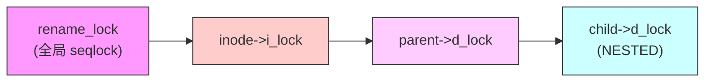

1、`d_alloc`：分配一个新 dentry 并挂入父目录的子链表

- **锁**：获取 `parent->d_lock`，保护 `d_subdirs` 链表的并发修改
- **引用计数**：`__dget_dlock(parent)` 增加父 dentry 引用（因为新 child 持有 parent 指针）；新 dentry 自身 count 初始为 `1`（由 `__d_alloc` 中 `lockref_init` 设置）
- **并发安全**：新 dentry 刚分配尚未对外可见，因此不需要对 child 加锁（代码注释：`don't need child lock because it is not subject to concurrency here`）

```c
//https://elixir.bootlin.com/linux/v5.4.241/source/fs/dcache.c#L1758
struct dentry *d_alloc(struct dentry * parent, const struct qstr *name)
{
	struct dentry *dentry = __d_alloc(parent->d_sb, name);
	if (!dentry)
		return NULL;
	spin_lock(&parent->d_lock);       // 保护 parent->d_subdirs 链表
	/*
	 * don't need child lock because it is not subject
	 * to concurrency here
	 */
	__dget_dlock(parent);              // parent 引用计数 +1
	dentry->d_parent = parent;         // 建立父子关系
	list_add(&dentry->d_child, &parent->d_subdirs);  // 加入父目录子链表
	spin_unlock(&parent->d_lock);

	return dentry;
}
EXPORT_SYMBOL(d_alloc);
```

2、`d_add` / `__d_add`：将 dentry 与 inode 关联，并加入 dcache hash table

- **锁顺序**：`inode->i_lock`（外层，由 `d_add` 获取）→ `dentry->d_lock`（内层，由 `__d_add` 获取），严格遵循全局锁层次
- **seqcount 保护**：`d_seq` 的 `raw_write_seqcount_begin/end` 包裹 inode 指针写入，使得并发的 rcu-walk 读者能检测到变更并重试
- **hash table**：`__d_rehash(dentry)` 将 dentry 加入全局 hash table，使后续 `d_lookup` 可以找到它
- **alias 链表**：`hlist_add_head(&dentry->d_u.d_alias, &inode->i_dentry)` 将 dentry 挂入 inode 的别名链表（支持硬链接场景：多个 dentry 指向同一 inode）
- **引用计数**：不变动（调用方已通过 `d_alloc` 持有 dentry 引用）

```c
void d_add(struct dentry *entry, struct inode *inode)
{
	if (inode) {
		security_d_instantiate(entry, inode);
		spin_lock(&inode->i_lock);   // 外层锁：保护 inode->i_dentry alias 链表
	}
	__d_add(entry, inode);
}
EXPORT_SYMBOL(d_add);

static inline void __d_add(struct dentry *dentry, struct inode *inode)
{
	struct inode *dir = NULL;
	unsigned n;
	spin_lock(&dentry->d_lock);          // 内层锁：保护 dentry 状态
	if (unlikely(d_in_lookup(dentry))) {
		dir = dentry->d_parent->d_inode;
		n = start_dir_add(dir);          // 获取目录 i_dir_seq 写锁
		__d_lookup_done(dentry);         // 唤醒等待该 lookup 完成的线程
	}
	if (inode) {
		unsigned add_flags = d_flags_for_inode(inode);
		hlist_add_head(&dentry->d_u.d_alias, &inode->i_dentry); // 加入 inode alias
		raw_write_seqcount_begin(&dentry->d_seq);   // seqcount 写屏障开始
		__d_set_inode_and_type(dentry, inode, add_flags); // 设置 d_inode 指针
		raw_write_seqcount_end(&dentry->d_seq);     // seqcount 写屏障结束
		fsnotify_update_flags(dentry);
	}
	__d_rehash(dentry);                  // 加入 dcache hash table
	if (dir)
		end_dir_add(dir, n);             // 释放目录 i_dir_seq 写锁
	spin_unlock(&dentry->d_lock);
	if (inode)
		spin_unlock(&inode->i_lock);     // 释放外层 inode 锁
}
```

3、`d_lookup` / `__d_lookup`：在 dcache hash table 中查找指定名称的 dentry（ref-walk 模式）

- **两层保护机制**：
  - 外层 `d_lookup()`：使用全局 `rename_lock`（seqlock）检测并发 rename。如果在查找期间有 rename 发生（`read_seqretry` 返回 true），则重试整个查找，避免 rename 导致的 false-negative（dentry 被 move 到另一个 hash bucket）
  - 内层 `__d_lookup()`：`rcu_read_lock()` 保护 hash 链表遍历 + 对每个候选 dentry 取 `spin_lock(d_lock)` 后再校验 parent/name/unhashed
- **引用计数**：找到匹配 dentry 后在持 `d_lock` 期间直接 `count++`，返回"持有引用"的 dentry，调用方必须通过 `dput()` 释放
- **性能特点**：每次查找都有 spin_lock/unlock 开销，在 SMP 高并发场景下会产生 cacheline bouncing

```c
//https://elixir.bootlin.com/linux/v5.4.241/source/fs/dcache.c#L2308
struct dentry *d_lookup(const struct dentry *parent, const struct qstr *name)
{
	struct dentry *dentry;
	unsigned seq;

	do {
		seq = read_seqbegin(&rename_lock);    // 读取 rename seqlock 序号
		dentry = __d_lookup(parent, name);
		if (dentry)
			break;
	} while (read_seqretry(&rename_lock, seq)); // rename 发生则重试
	return dentry;
}

struct dentry *__d_lookup(const struct dentry *parent, const struct qstr *name)
{
	unsigned int hash = name->hash;
	struct hlist_bl_head *b = d_hash(hash);   // 定位 hash bucket
	struct hlist_bl_node *node;
	struct dentry *found = NULL;
	struct dentry *dentry;

	/*
	 * Note: There is significant duplication with __d_lookup_rcu which is
	 * required to prevent single threaded performance regressions
	 * especially on architectures where smp_rmb (in seqcounts) are costly.
	 * Keep the two functions in sync.
	 */

	/*
	 * The hash list is protected using RCU.
	 *
	 * Take d_lock when comparing a candidate dentry, to avoid races
	 * with d_move().
	 *
	 * It is possible that concurrent renames can mess up our list
	 * walk here and result in missing our dentry, resulting in the
	 * false-negative result. d_lookup() protects against concurrent
	 * renames using rename_lock seqlock.
	 *
	 * See Documentation/filesystems/path-lookup.txt for more details.
	 */
	rcu_read_lock();                          // RCU 读侧临界区

	hlist_bl_for_each_entry_rcu(dentry, node, b, d_hash) {

		if (dentry->d_name.hash != hash)      // 快速跳过 hash 不匹配项
			continue;

		spin_lock(&dentry->d_lock);           // 逐个候选加锁校验
		if (dentry->d_parent != parent)       // 校验父目录
			goto next;
		if (d_unhashed(dentry))               // 校验未被摘除
			goto next;

		if (!d_same_name(dentry, parent, name)) // 校验名称完全匹配
			goto next;

		dentry->d_lockref.count++;            // 引用计数 +1
		found = dentry;
		spin_unlock(&dentry->d_lock);
		break;
next:
		spin_unlock(&dentry->d_lock);
	}
	rcu_read_unlock();

	return found;
}
```

4、`d_drop` / `__d_drop`：将 dentry 从 dcache hash table 中摘除（使其不可被 `d_lookup` 找到）

- **锁**：`d_drop()` 获取 `dentry->d_lock`，`__d_drop()` 假设调用方已持有该锁
- **seqcount invalidate**：`write_seqcount_invalidate(&dentry->d_seq)` 会使 `d_seq` 变为奇数值，通知所有并发的 rcu-walk 读者（`__d_lookup_rcu`）该 dentry 正在被修改，必须重试或回退到 ref-walk
- **引用计数**：不变动，仅改变 dentry 在 hash table 中的可见性
- **典型调用场景**：文件删除（`d_delete`）、rename（`d_move`）

```c
//https://elixir.bootlin.com/linux/v5.4.241/source/fs/dcache.c#L504
void __d_drop(struct dentry *dentry)
{
	if (!d_unhashed(dentry)) {
		___d_drop(dentry);                        // 从 hash bucket 链表摘除
		dentry->d_hash.pprev = NULL;              // 标记为 unhashed
		write_seqcount_invalidate(&dentry->d_seq); // 通知 rcu-walk 读者
	}
}
EXPORT_SYMBOL(__d_drop);

void d_drop(struct dentry *dentry)
{
	spin_lock(&dentry->d_lock);    // 获取 dentry 自身锁
	__d_drop(dentry);
	spin_unlock(&dentry->d_lock);
}
EXPORT_SYMBOL(d_drop);
```

5、`d_delete`：删除一个 dentry（将其从 inode 断开或仅从 hash 摘除）

- **锁顺序**：`inode->i_lock`（外层）→ `dentry->d_lock`（内层），这是全局统一的锁层次，所有涉及 inode+dentry 的操作都必须遵循此顺序，否则会死锁
- **两种路径**：
  - `count == 1`（仅当前持有者）：调用 `dentry_unlink_inode()`，将 dentry 变为 negative（断开与 inode 的关联），锁由 `dentry_unlink_inode` 内部释放
  - `count > 1`（还有其他引用者）：仅 `__d_drop()` 从 hash 摘除，其他引用者后续 `dput()` 时自行清理
- **引用计数**：不直接变动 count，但 `dentry_unlink_inode` 会 `dput` 导致后续引用释放

```c
//https://elixir.bootlin.com/linux/v5.4.241/source/fs/dcache.c#L2432
void d_delete(struct dentry * dentry)
{
	struct inode *inode = dentry->d_inode;

	spin_lock(&inode->i_lock);       // 外层锁：保护 inode->i_dentry alias 链表
	spin_lock(&dentry->d_lock);      // 内层锁：保护 dentry 状态
	/*
	 * Are we the only user?
	 */
	if (dentry->d_lockref.count == 1) {
		dentry->d_flags &= ~DCACHE_CANT_MOUNT;
		dentry_unlink_inode(dentry);  // 断开 inode 关联，dentry 变 negative
		// 注意：dentry_unlink_inode 内部会释放两把锁
	} else {
		__d_drop(dentry);             // 仅从 hash 摘除
		spin_unlock(&dentry->d_lock);
		spin_unlock(&inode->i_lock);
	}
}
EXPORT_SYMBOL(d_delete);
```

6、`dget`：增加 dentry 引用计数

- **锁机制**：`lockref_get()` 实现了两级路径：
  - **快速路径**（大多数情况）：使用 `cmpxchg` 原子指令直接修改 `lockref` 中的 count，完全无锁
  - **慢路径**（竞争激烈时 cmpxchg 失败）：退化为 `spin_lock(&dentry->d_lock)` + count++ + `spin_unlock`
- **引用计数**：无条件 count++
- **使用场景**：当需要从已有 dentry 指针获取一个新的引用时调用（例如 `dentry->d_parent` 的引用获取）

```c
//https://elixir.bootlin.com/linux/v5.4.241/source/include/linux/dcache.h#L318
static inline struct dentry *dget(struct dentry *dentry)
{
	if (dentry)
		lockref_get(&dentry->d_lockref);  // 快速路径: cmpxchg; 慢路径: spin_lock
	return dentry;
}
```

7、`dput`：减少 dentry 引用计数，count 归零时触发清理

- **快速路径** `fast_dput()`：在 `rcu_read_lock` 保护下尝试 `lockref_put_return`（cmpxchg），若 count > 1 且无特殊 flags 需要处理，直接减 count 返回，无需获取 `d_lock`
- **慢路径**：`fast_dput` 失败时已持有 `dentry->d_lock`（内部通过 lockref 降级），然后调用 `retain_dentry()` 判断是否应保留在 LRU 中
- **dentry_kill**：count 归零且不保留时，调用 `dentry_kill()` → `__dentry_kill()` 彻底释放 dentry；`dentry_kill` 返回 parent dentry 以支持 while 循环逐级向上 `dput` 父 dentry（自底向上回收链）
- **循环结构**：`while (dentry)` 支持级联释放：当子 dentry 释放后，父 dentry 引用也减少，可能导致父 dentry 也被释放

```c
//https://elixir.bootlin.com/linux/v5.4.241/source/fs/dcache.c#L840
void dput(struct dentry *dentry)
{
	while (dentry) {
		might_sleep();

		rcu_read_lock();
		if (likely(fast_dput(dentry))) {  // 快速路径：cmpxchg 减引用
			rcu_read_unlock();
			return;
		}

		/* Slow case: now with the dentry lock held */
		rcu_read_unlock();

		if (likely(retain_dentry(dentry))) { // 判断是否保留在 LRU
			spin_unlock(&dentry->d_lock);
			return;
		}

		dentry = dentry_kill(dentry);  // 释放 dentry，返回 parent 继续循环
	}
}
EXPORT_SYMBOL(dput);
```

8、`dentry_free`：真正释放 dentry 内存

- **无锁操作**：调用时 dentry 已完全从所有全局结构中隔离（hash table 已摘除、LRU 已移除、父子关系已断开），不会有并发访问
- **RCU 延迟释放**：通过 `call_rcu()` 注册回调，在 RCU grace period 结束后才真正调用 `__d_free()` 释放 kmem_cache 内存。这是因为并发的 rcu-walk 读者（`__d_lookup_rcu`）可能正在无锁访问该 dentry，必须等待所有读者退出 `rcu_read_lock` 临界区
- **DCACHE_NORCU 优化**：如果 dentry 设置了 `DCACHE_NORCU`（表示从未对 RCU 读者可见），可以直接释放，跳过 grace period 等待
- **外部名称处理**：长文件名（超过 `DNAME_INLINE_LEN`）使用外部分配的 `external_name`，需要额外的引用计数管理

```c
//https://elixir.bootlin.com/linux/v5.4.241/source/fs/dcache.c#L336
static void dentry_free(struct dentry *dentry)
{
	WARN_ON(!hlist_unhashed(&dentry->d_u.d_alias)); // 断言已从 alias 摘除
	if (unlikely(dname_external(dentry))) {
		struct external_name *p = external_name(dentry);
		if (likely(atomic_dec_and_test(&p->u.count))) {
			call_rcu(&dentry->d_u.d_rcu, __d_free_external); // RCU 延迟释放(含外部名)
			return;
		}
	}
	/* if dentry was never visible to RCU, immediate free is OK */
	if (dentry->d_flags & DCACHE_NORCU)
		__d_free(&dentry->d_u.d_rcu);      // 直接释放，无需等待 grace period
	else
		call_rcu(&dentry->d_u.d_rcu, __d_free); // 标准 RCU 延迟释放
}
```

9、`d_lru` 系列方法：管理 dentry 的 LRU 回收链表

- **前置锁条件**：所有 `d_lru_*` 函数都要求调用方已持有 `dentry->d_lock`（通过 `D_FLAG_VERIFY` 宏断言 flags 状态来间接保证）
- **per-sb LRU**：dentry 加入/移出的是所属超级块的 `s_dentry_lru`（`list_lru` 结构），而非全局链表，这使得 `umount` 时可以快速回收单个文件系统的所有缓存
- **per-cpu 计数器**：`nr_dentry_unused` / `nr_dentry_negative` 使用 per-cpu 变量避免计数器竞争（`this_cpu_inc/dec`），全局读取时通过 `sum_over_cpus` 汇总
- **isolate/shrink_move**：在 shrinker 回调（内存压力回收）中使用，需在全局 LRU lock 下调用

```c
//https://elixir.bootlin.com/linux/v5.4.241/source/fs/dcache.c#L396
#define D_FLAG_VERIFY(dentry,x) WARN_ON_ONCE(((dentry)->d_flags & (DCACHE_LRU_LIST | DCACHE_SHRINK_LIST)) != (x))

// dentry 引用计数归零时加入 LRU（变为 unused 状态）
static void d_lru_add(struct dentry *dentry)
{
	D_FLAG_VERIFY(dentry, 0);
	dentry->d_flags |= DCACHE_LRU_LIST;
	this_cpu_inc(nr_dentry_unused);          // per-cpu 无锁计数
	if (d_is_negative(dentry))
		this_cpu_inc(nr_dentry_negative);
	WARN_ON_ONCE(!list_lru_add(&dentry->d_sb->s_dentry_lru, &dentry->d_lru));
}

// dentry 被重新引用时从 LRU 移除
static void d_lru_del(struct dentry *dentry)
{
	D_FLAG_VERIFY(dentry, DCACHE_LRU_LIST);
	dentry->d_flags &= ~DCACHE_LRU_LIST;
	this_cpu_dec(nr_dentry_unused);
	if (d_is_negative(dentry))
		this_cpu_dec(nr_dentry_negative);
	WARN_ON_ONCE(!list_lru_del(&dentry->d_sb->s_dentry_lru, &dentry->d_lru));
}

// shrinker 回收过程中从 shrink list 移除
static void d_shrink_del(struct dentry *dentry)
{
	D_FLAG_VERIFY(dentry, DCACHE_SHRINK_LIST | DCACHE_LRU_LIST);
	list_del_init(&dentry->d_lru);
	dentry->d_flags &= ~(DCACHE_SHRINK_LIST | DCACHE_LRU_LIST);
	this_cpu_dec(nr_dentry_unused);
}

// 将 dentry 加入私有 shrink list（准备批量回收）
static void d_shrink_add(struct dentry *dentry, struct list_head *list)
{
	D_FLAG_VERIFY(dentry, 0);
	list_add(&dentry->d_lru, list);
	dentry->d_flags |= DCACHE_SHRINK_LIST | DCACHE_LRU_LIST;
	this_cpu_inc(nr_dentry_unused);
}

/*
 * These can only be called under the global LRU lock, ie during the
 * callback for freeing the LRU list. "isolate" removes it from the
 * LRU lists entirely, while shrink_move moves it to the indicated
 * private list.
 */
// 从 LRU 完全隔离（shrinker 回调中使用）
static void d_lru_isolate(struct list_lru_one *lru, struct dentry *dentry)
{
	D_FLAG_VERIFY(dentry, DCACHE_LRU_LIST);
	dentry->d_flags &= ~DCACHE_LRU_LIST;
	this_cpu_dec(nr_dentry_unused);
	if (d_is_negative(dentry))
		this_cpu_dec(nr_dentry_negative);
	list_lru_isolate(lru, &dentry->d_lru);
}

// 从 LRU 隔离并移入指定的私有 shrink list
static void d_lru_shrink_move(struct list_lru_one *lru, struct dentry *dentry,
			      struct list_head *list)
{
	D_FLAG_VERIFY(dentry, DCACHE_LRU_LIST);
	dentry->d_flags |= DCACHE_SHRINK_LIST;
	if (d_is_negative(dentry))
		this_cpu_dec(nr_dentry_negative);
	list_lru_isolate_move(lru, &dentry->d_lru, list);
}
```

10、`d_move` / `__d_move`：在 dcache 中移动 dentry（实现 rename 语义）

这是 dcache 中**锁操作最复杂**的函数，涉及全局 `rename_lock` 与多个 parent/child 的 `d_lock`以及两个 dentry 的 `d_seq` seqcount，理解它是理解整个 dcache 锁体系的关键

```c
//https://elixir.bootlin.com/linux/v4.11.6/source/include/linux/seqlock.h#L446
static inline void write_seqlock(seqlock_t *sl)
{
	spin_lock(&sl->lock);
	write_seqcount_begin(&sl->seqcount);
}

static inline void write_sequnlock(seqlock_t *sl)
{
	write_seqcount_end(&sl->seqcount);
	spin_unlock(&sl->lock);
}
```

- **`d_move` 外层锁**：`write_seqlock(&rename_lock)` 获取全局 rename seqlock 的**写端**，作用如下
  - 所有并发 `d_lookup()` 中的 `read_seqretry(&rename_lock, seq)` 代码段将返回 true，迫使它们重试查找（避免 rename 跨 hash bucket 导致的 false-negative）
  - rcu-walk 路径中 `__d_lookup_rcu` 的调用者在后续 seqcount 校验时会发现不一致

- **`__d_move` 的前置条件**：调用方必须已持有 `rename_lock`、源/目标目录的 `i_mutex`（VFS 层保证），以及针对单个超级快（同文件系统）时的 `sb->s_vfs_rename_mutex`

- **`__d_move` 内部的 d_lock 获取逻辑**，根据 dentry 与 target 的**父子层级关系**分三种情况，确保锁顺序一致避免死锁：

| 情况 | 条件 | 加锁顺序 |
|------|------|----------|
| (a) dentry 是根 | `IS_ROOT(dentry)` | `target->d_parent->d_lock` |
| (b) target 不是 `old_parent` 的后代 | `p == NULL` | `target->d_parent->d_lock` → `old_parent->d_lock`（NESTED） |
| (c) target 是 `old_parent` 的后代 | `p != NULL` | `old_parent->d_lock` → `target->d_parent->d_lock`（NESTED，若 p != target） |

最后统一获取 `dentry->d_lock`（level 2）和 `target->d_lock`（level 3）

- **seqcount 保护**：在 `write_seqcount_begin/end` 之间修改 dentry 和 target 的核心字段，通知所有 rcu-walk 并发读者
- **原子操作序列**：unhash both → 切换 parent 指针 → copy/swap 文件名 → rehash → seqcount end
- **引用计数调整**：`dentry->d_parent->d_lockref.count++`（新 parent 引用加一）+ `old_parent->d_lockref.count--`（旧 parent 引用减一）

**完整锁获取层次**：

```
rename_lock (全局 seqlock 写端，最外层)
  → parent d_lock（1-2个，视情况用 spin_lock_nested 区分）
    → dentry->d_lock (nested level 2)
      → target->d_lock (nested level 3)
        → dentry->d_seq + target->d_seq (seqcount write section)
```

**`__d_move` 操作流程**：

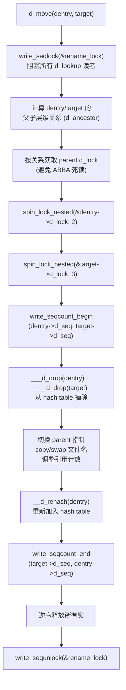

```c
//https://elixir.bootlin.com/linux/v5.4.241/source/fs/dcache.c#L2804
void d_move(struct dentry *dentry, struct dentry *target)
{
	write_seqlock(&rename_lock);   // 全局 rename seqlock 写端
	__d_move(dentry, target, false);
	write_sequnlock(&rename_lock);
}
EXPORT_SYMBOL(d_move);

/*
 * __d_move - move a dentry
 * @dentry: entry to move
 * @target: new dentry
 * @exchange: exchange the two dentries
 *
 * Update the dcache to reflect the move of a file name. Negative
 * dcache entries should not be moved in this way. Caller must hold
 * rename_lock, the i_mutex of the source and target directories,
 * and the sb->s_vfs_rename_mutex if they differ. See lock_rename().
 */
static void __d_move(struct dentry *dentry, struct dentry *target,
		     bool exchange)
{
	struct dentry *old_parent, *p;
	struct inode *dir = NULL;
	unsigned n;

	WARN_ON(!dentry->d_inode);
	if (WARN_ON(dentry == target))
		return;

	BUG_ON(d_ancestor(target, dentry));
	old_parent = dentry->d_parent;
	p = d_ancestor(old_parent, target);  // 判断 target 是否在 old_parent 子树中

	// ====== 第一阶段：获取 parent d_lock（按层级关系确定加锁顺序）======
	if (IS_ROOT(dentry)) {
		// 情况(a): dentry 是根，只需锁 target 的父
		BUG_ON(p);
		spin_lock(&target->d_parent->d_lock);
	} else if (!p) {
		// 情况(b): target 不在 old_parent 子树中（跨目录 rename）
		// 按地址顺序或固定顺序加锁避免死锁
		spin_lock(&target->d_parent->d_lock);
		spin_lock_nested(&old_parent->d_lock, DENTRY_D_LOCK_NESTED);
	} else {
		// 情况(c): target 在 old_parent 子树中（同目录内 rename）
		BUG_ON(p == dentry);
		spin_lock(&old_parent->d_lock);  // 祖先先加锁
		if (p != target)
			spin_lock_nested(&target->d_parent->d_lock,
					DENTRY_D_LOCK_NESTED);
	}
	// ====== 统一获取 dentry 和 target 自身的 d_lock ======
	spin_lock_nested(&dentry->d_lock, 2);   // lockdep level 2
	spin_lock_nested(&target->d_lock, 3);   // lockdep level 3

	if (unlikely(d_in_lookup(target))) {
		dir = target->d_parent->d_inode;
		n = start_dir_add(dir);
		__d_lookup_done(target);  // 唤醒等待 target lookup 完成的线程
	}

	// ====== 第二阶段：seqcount 写保护，通知 rcu-walk 读者 ======
	write_seqcount_begin(&dentry->d_seq);
	write_seqcount_begin_nested(&target->d_seq, DENTRY_D_LOCK_NESTED);

	// ====== 第三阶段：原子修改 dcache 结构 ======
	/* unhash both - 从 hash table 摘除 */
	if (!d_unhashed(dentry))
		___d_drop(dentry);
	if (!d_unhashed(target))
		___d_drop(target);

	/* switch them in the tree - 切换父子关系和名称 */
	dentry->d_parent = target->d_parent;  // dentry 移到 target 所在目录
	if (!exchange) {
		// 普通 rename：dentry 取代 target 的位置
		copy_name(dentry, target);          // 复制 target 的文件名给 dentry
		target->d_hash.pprev = NULL;        // target 标记为 unhashed
		dentry->d_parent->d_lockref.count++;   // 新 parent 引用 +1
		if (dentry != old_parent)
			WARN_ON(!--old_parent->d_lockref.count); // 旧 parent 引用 -1
	} else {
		// renameat2(RENAME_EXCHANGE)：交换两个 dentry 的位置
		target->d_parent = old_parent;
		swap_names(dentry, target);
		list_move(&target->d_child, &target->d_parent->d_subdirs);
		__d_rehash(target);
		fsnotify_update_flags(target);
	}
	list_move(&dentry->d_child, &dentry->d_parent->d_subdirs); // 移入新 parent 的子链表
	__d_rehash(dentry);              // 重新加入 hash table（新的 hash 位置）
	fsnotify_update_flags(dentry);
	fscrypt_handle_d_move(dentry);

	// ====== 第四阶段：结束 seqcount 写保护 ======
	write_seqcount_end(&target->d_seq);   // 先结束 target（内层）
	write_seqcount_end(&dentry->d_seq);   // 后结束 dentry（外层）

	if (dir)
		end_dir_add(dir, n);

	// ====== 第五阶段：逆序释放 d_lock ======
	if (dentry->d_parent != old_parent)
		spin_unlock(&dentry->d_parent->d_lock);  // 新 parent（如果变了）
	if (dentry != old_parent)
		spin_unlock(&old_parent->d_lock);         // 旧 parent
	spin_unlock(&target->d_lock);                    // target 自身
	spin_unlock(&dentry->d_lock);                    // dentry 自身
}
```

####    dcache LRU 管理

当 dentry 引用计数归零（`dput()` 后 count 变为 `0`），会加入所属 superblock 的 LRU 链表（[fs/dcache.c](https://github.com/torvalds/linux/blob/v5.4/fs/dcache.c) `d_lru_add()`）：

```c
//https://elixir.bootlin.com/linux/v5.4.241/source/fs/dcache.c#L397
static void d_lru_add(struct dentry *dentry)
{
	dentry->d_flags |= DCACHE_LRU_LIST;
	this_cpu_inc(nr_dentry_unused);
	if (d_is_negative(dentry))
		this_cpu_inc(nr_dentry_negative);
	WARN_ON_ONCE(!list_lru_add(&dentry->d_sb->s_dentry_lru, &dentry->d_lru));
}
```

最新加入的 unused dentry 放在链表头部，启动 shrink 操作时，链表尾部的 dentry 将被率先回收（LRU 策略）

####    dcache 查找：ref-walk VS rcu-walk

路径解析过程中，对每个路径分量都需要在 dcache 中查找对应的 dentry。内核提供两种查找模式：

**ref-walk**（`__d_lookup()`）：需要持有 dentry 的 `d_lock` 自旋锁，并增减引用计数。适用于需要修改 dentry 的场景，但开销大（cacheline bouncing）

**rcu-walk**（`__d_lookup_rcu()`）：不加锁、不修改引用计数，通过 `d_seq`（seqcount）检测并发修改。如果检测到被修改则回退到 ref-walk。这是 `open()`、`stat()` 等高频系统调用的快速路径

```c
// ref-walk: d_lookup()
struct dentry *d_lookup(const struct dentry *parent, const struct qstr *name)
{
	struct dentry *dentry;
	unsigned seq;
	do {
		seq = read_seqbegin(&rename_lock);
		dentry = __d_lookup(parent, name);
		if (dentry)
			break;
	} while (read_seqretry(&rename_lock, seq));
	return dentry;
}
```

####    `__d_lookup` 与 `__d_lookup_rcu` 的对比

内核为 dcache 查找提供了两个近乎重复的实现函数，这并非代码冗余，而是针对不同场景的性能权衡。内核源码注释（[fs/dcache.c L2339](https://github.com/torvalds/linux/blob/v5.4/fs/dcache.c#L2339)）明确说明：

> *"Note: There is significant duplication with __d_lookup_rcu which is required to prevent single threaded performance regressions especially on architectures where smp_rmb (in seqcounts) are costly. Keep the two functions in sync."*

**核心区别对比表：**

| 维度 | `__d_lookup` (ref-walk) | `__d_lookup_rcu` (rcu-walk) |
|------|------------------------|---------------------------|
| 调用上下文 | `d_lookup()` 包裹，可在任何进程上下文 | 仅在 rcu-walk 路径解析中（`link_path_walk` → `lookup_fast`） |
| 锁机制 | `rcu_read_lock` + 对每个候选 dentry 逐个 `spin_lock(d_lock)` | 仅 `rcu_read_lock`，**无任何 spin_lock** |
| 一致性保证 | 通过持 `d_lock` 后再校验 parent/name/unhashed | 通过 `d_seq`	（`seqcount`） 检测并发修改，读到脏数据时重试或回退 |
| 引用计数 | 找到时立即 `count++`（返回"持有引用"的 dentry） | **不修改 count**，返回的 dentry 可能随时被释放（调用方必须后续 check d_seq） |
| rename 处理 | 外层 `d_lookup()` 用 `rename_lock` seqlock 重试 | 靠 `d_seq` 检测，rename 会 invalidate seq |
| 返回值语义 | 返回引用计数+1 的 dentry（或 NULL），调用方必须 `dput` | 返回"不稳定"的 dentry 指针 + seq 值，调用方必须校验 seq 后才能使用 |
| 适用场景 | 需要长期持有 dentry 引用的操作（`open`、`rename`、`unlink`） | 高频只读路径解析（`stat`、`access`、`open` 的快速路径），大部分情况不会有写冲突 |
| 性能特点 | 每次查找都有 spin_lock/unlock 开销 + cacheline bouncing | 完全无锁（store-free），SMP 扩展性极佳 |

**`__d_lookup_rcu` 源码**（[fs/dcache.c L2339](https://github.com/torvalds/linux/blob/v5.4/fs/dcache.c#L2339)）：

```c
//for rcu-walk
struct dentry *__d_lookup_rcu(const struct dentry *parent,
                              const struct qstr *name,
                              unsigned *seqp)
{
	u64 hashlen = name->hash_len;
	const unsigned char *str = name->name;
	struct hlist_bl_head *b = d_hash(hashlen_hash(hashlen));
	struct hlist_bl_node *node;
	struct dentry *dentry;

	hlist_bl_for_each_entry_rcu(dentry, node, b, d_hash) {
		unsigned seq;

		if (dentry->d_name.hash_len != hashlen)     // 快速跳过
			continue;

		seq = raw_seqcount_begin(&dentry->d_seq);   // 读取 seqcount（不加锁）
		if (dentry->d_parent != parent)             // 无锁校验 parent
			continue;
		if (d_unhashed(dentry))                     // 无锁校验 hash 状态
			continue;

		if (unlikely(parent->d_flags & DCACHE_OP_COMPARE)) {
			// 文件系统自定义比较（如 case-insensitive）
			if (dentry->d_name.hash != hashlen_hash(hashlen))
				continue;
			*seqp = seq;
			switch (slow_dentry_cmp(parent, dentry, seq, name)) {
			case D_COMP_OK:
				return dentry;
			case D_COMP_NOMATCH:
				continue;
			default:
				return NULL;
			}
		}

		if (dentry->d_name.hash_len != hashlen)     // re-check after seq read
			continue;
		*seqp = seq;                                // 将 seq 传回调用方
		if (!dentry_cmp(dentry, str, hashlen_len(hashlen)))
			return dentry;                          // 返回"不稳定"指针
	}
	return NULL;
}
```

与 `__d_lookup` 的关键差异点：
- **无 `spin_lock`**：整个遍历过程不获取任何 dentry 的 `d_lock`
- **seqcount 代替锁**：通过 `raw_seqcount_begin` 读取 `d_seq`，返回给调用方（`*seqp = seq`），调用方后续通过 `read_seqcount_retry(&dentry->d_seq, seq)` 检测是否有并发写入
- **不修改引用计数**：返回的 dentry 没有增加 count，可能在返回后立即被其他 CPU 释放

**为何存在两套实现（而不是统一为一个）：**

1. **架构相关的性能差异**：`seqcount` 中的 `smp_rmb()`（读内存屏障）在某些 CPU 架构（如早期 ARM、PowerPC）上开销显著，如果 ref-walk 也使用 seqcount 会导致单线程性能回退
2. **历史演进**：rcu-walk 是 Linux 2.6.38 内核版本引入的路径解析优化（[commit 31e6b01f](https://git.kernel.org/pub/scm/linux/kernel/git/torvalds/linux.git/commit/?id=31e6b01f4183)），目的是消除 SMP 系统上路径解析时的 lock contention
3. **优雅降级**：如果 rcu-walk 期间检测到竞争（`d_seq` 变化），会回退（fallback）到 ref-walk 重新走完整锁路径，保证正确性

**调用关系：**

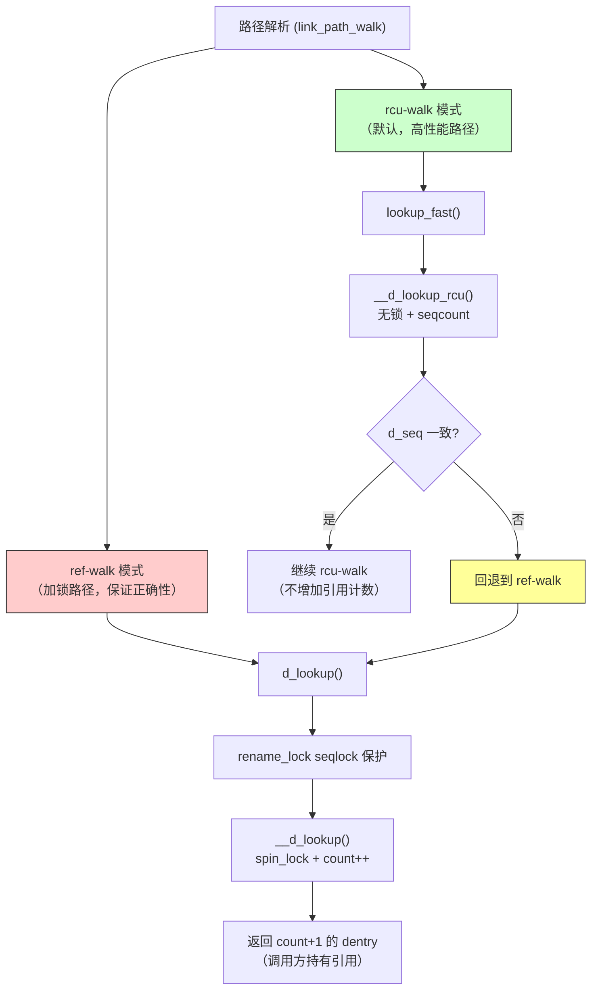

**性能对比示例**：在多核（如`64/128`core）服务器上，多线程并发执行 `stat("/path/to/file")` 时：
- **ref-walk**：所有线程竞争 `dentry->d_lock`，吞吐量随核数增加而下降（锁争用导致 cacheline bouncing）
- **rcu-walk**：完全无锁，吞吐量线性扩展。这也是为什么 `open()`/`stat()` 快速路径默认使用 rcu-walk 的原因

####    RCU-walk 到 ref-walk 的回退机制详解

回顾下，以 `open("/a/b/c/d/e", O_RDONLY)` 为例，结合 Linux v5.4 内核源码（[fs/namei.c](https://github.com/torvalds/linux/blob/v5.4/fs/namei.c)）详细说明路径解析过程中 rcu-walk 回退到 ref-walk 的完整机制

#####   整体调用架构

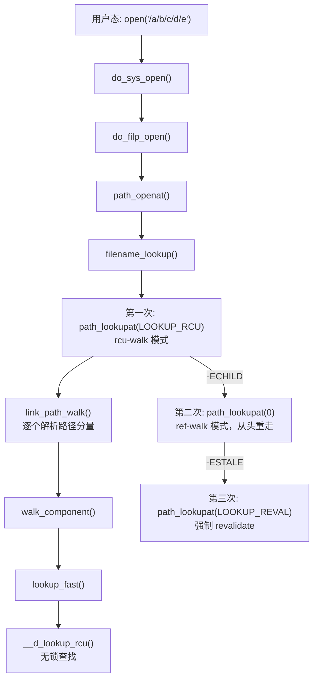

核心入口代码（[fs/namei.c L2336](https://github.com/torvalds/linux/blob/v5.4/fs/namei.c#L2336)）：

```c
// filename_lookup() 的三级降级策略
retval = path_lookupat(&nd, flags | LOOKUP_RCU, path);  // 第一次：rcu-walk
if (unlikely(retval == -ECHILD))
    retval = path_lookupat(&nd, flags, path);            // 第二次：ref-walk（从头重走）
if (unlikely(retval == -ESTALE))
    retval = path_lookupat(&nd, flags | LOOKUP_REVAL, path); // 第三次：强制 revalidate
```

#####   回退是"全局重走"还是"局部回退"？答案是两级机制

内核设计了**两级回退策略**，优先尝试局部切换，失败才全局重走：

| level层次 | 函数 | 行为 | 触发条件 |
|------|------|------|---------|
| 第一级（局部） | `unlazy_walk()` / `unlazy_child()` | **在当前（分量）的位置就地切换为 ref-walk** | dcache miss、需要磁盘 I/O、需要获取写锁 |
| 第二级（全局） | `filename_lookup` 重调 `path_lookupat` | **从路径开头以 ref-walk 重新解析所有分量** | 局部切换失败（dentry 已被释放或 d_seq 已变） |

**为什么需要两级**？
- 大多数情况下，rcu-walk 失败仅仅是因为某个中间分量不在 dcache 中（需要读磁盘），此时 `unlazy_walk` 可以在当前位置成功切换为 ref-walk，后续分量走 `lookup_slow`，无需回到路径开头
- 只有在真正存在并发写冲突（rename、unlink 等修改了某个 dentry）时，`unlazy_walk` 才会失败，此时才需要全局重走

#####   场景一：dcache miss（局部成功切换）
以`open`打开路径 `/a/b/c/d/e` 为例，假设 `/a/b` 在 dcache 中，但 `c` 不在：

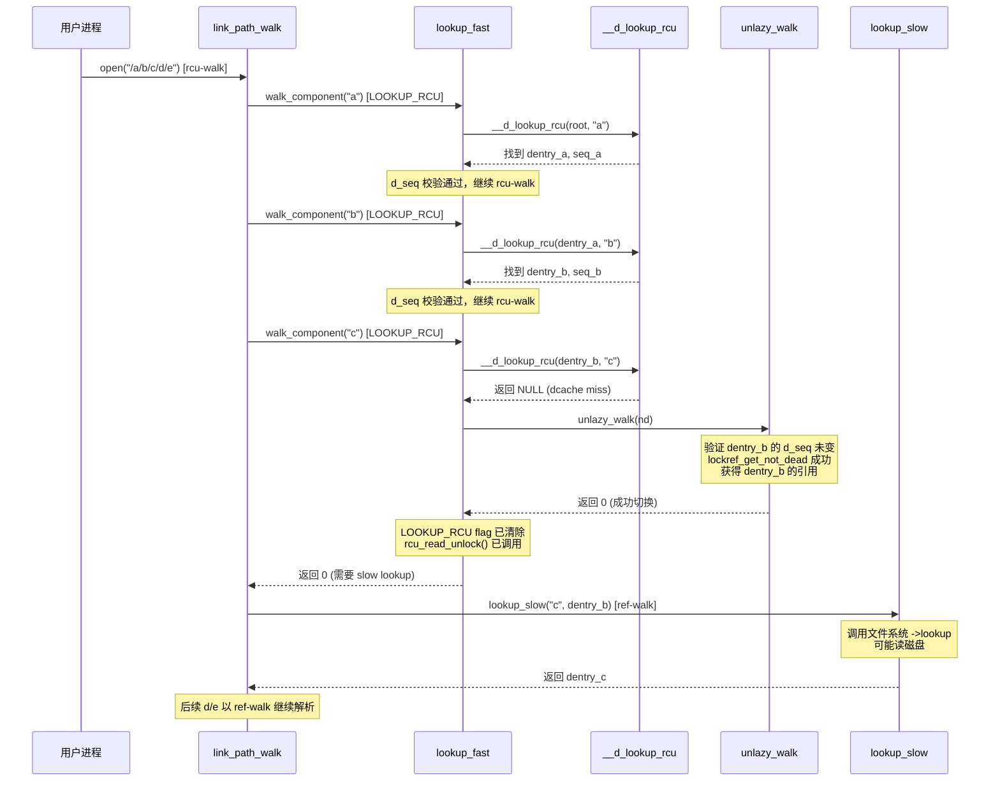

关键点：`unlazy_walk` 成功后，**已解析的 `a`、`b` 分量的引用已通过 `legitimize_path` 获取**（`count++`），后续 `c`、`d`、`e` 路径分量以 ref-walk 模式继续，无需回到路径开头

#####   场景二：并发 rename（全局重走）

假设所有分量都在 dcache 中，但解析到 `c` 时恰好有另一个 CPU 对 `c` 执行 rename：

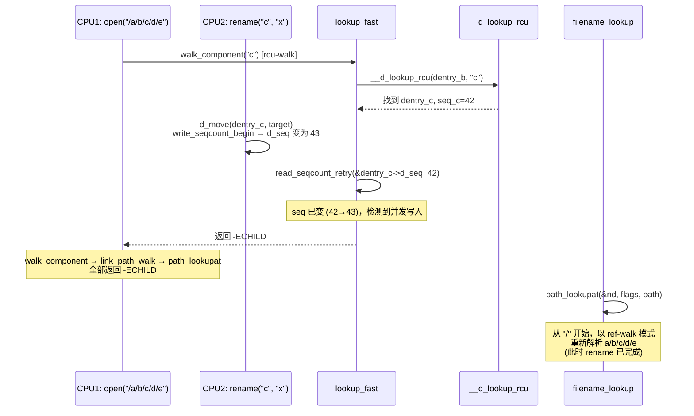

**为什么全局重走而不是从 `c` 分量重试？** 因为 rcu-walk 期间**没有持有任何引用计数**，前面已经"解析"的分量 `a`、`b` 的 dentry 指针可能在 rcu-walk 失败的同时被并发 `dput` 释放。只有从头以 ref-walk 重走，每个分量都 `count++`（**持有引用计数**），才能保证安全

#####   `unlazy_walk` 函数详解

`unlazy_walk` 是上述"就地切换"逻辑的核心函数（[fs/namei.c L672](https://github.com/torvalds/linux/blob/v5.4/fs/namei.c#L672)），它尝试将当前 `nd->path`（rcu-walk 期间仅持有不稳定指针）转换为持有引用的安全状态：

比如，在`lookup_fast`函数 rcu查找失败后，原地切换为ref-walk方式，关联[代码](https://elixir.bootlin.com/linux/v5.4.241/source/fs/namei.c#L1565)

```c
//lookup_fast rcu失败-->unlazy_walk
static int unlazy_walk(struct nameidata *nd)
{
    struct dentry *parent = nd->path.dentry;

    BUG_ON(!(nd->flags & LOOKUP_RCU));

    nd->flags &= ~LOOKUP_RCU;             // 清除 rcu-walk 标志
    if (unlikely(!legitimize_links(nd)))   // 验证符号链接栈中的 dentry
        goto out1;
    if (unlikely(!legitimize_path(nd, &nd->path, nd->seq)))  // 核心：验证当前路径
        goto out;
    if (unlikely(!legitimize_root(nd)))    // 验证根目录
        goto out;
    rcu_read_unlock();                     // 成功：退出 RCU 读临界区
    BUG_ON(nd->inode != parent->d_inode);

	// 重点：返回0，回到上层walk_component函数中的
	/*
		err = lookup_fast(nd, &path, &inode, &seq);
		if (unlikely(err <= 0)) {
			if (err < 0)
				return err;
			//lookup_fast返回0，则进入局部的ref-walk模式
			path.dentry = lookup_slow(&nd->last, nd->path.dentry,
						nd->flags);
			.......
		}
	*/
	//https://elixir.bootlin.com/linux/v5.4.241/source/fs/namei.c#L1797
    return 0;

out1:
    nd->path.mnt = NULL;
    nd->path.dentry = NULL;
out:
    rcu_read_unlock();
    return -ECHILD;                        // 失败：需要全局重走
}
```

`legitimize_path` 的核心逻辑：

```c
static bool legitimize_path(struct nameidata *nd,
                            struct path *path, unsigned seq)
{
    int res = __legitimize_mnt(path->mnt, nd->m_seq);  // 验证挂载点
    if (unlikely(res)) {
        if (res > 0)
            path->mnt = NULL;
        path->dentry = NULL;
        return false;
    }
    // 尝试获取 dentry 引用（如果 dentry 正在被释放则失败）
    if (unlikely(!lockref_get_not_dead(&path->dentry->d_lockref))) {
        path->dentry = NULL;
        return false;
    }
    // 最终校验：d_seq 是否在获取引用期间被修改
    return !read_seqcount_retry(&path->dentry->d_seq, seq);
}
```

关键设计：**先 `lockref_get_not_dead`（原子 count++），再 `read_seqcount_retry`（验证 d_seq）**。如果 d_seq 校验失败，说明在获取引用的瞬间 dentry 被修改了，虽然持有了引用（不会被释放），但内容可能已经不正确，仍需全局重走

#####   `unlazy_child` 函数详解

`unlazy_child` 用于在已找到 child dentry 后，将 parent 和 child 一起切换为 ref-walk（[fs/namei.c L710](https://github.com/torvalds/linux/blob/v5.4/fs/namei.c#L710)）：

关联`lookup_fast`函数中的`unlazy_child`[调用](https://elixir.bootlin.com/linux/v5.4.241/source/fs/namei.c#L1604)

```c
static int unlazy_child(struct nameidata *nd, struct dentry *dentry, unsigned seq)
{
    BUG_ON(!(nd->flags & LOOKUP_RCU));

    nd->flags &= ~LOOKUP_RCU;
    if (unlikely(!legitimize_links(nd)))
        goto out2;
    if (unlikely(!legitimize_mnt(nd->path.mnt, nd->m_seq)))
        goto out2;
    // 获取 parent (nd->path.dentry) 的引用
    if (unlikely(!lockref_get_not_dead(&nd->path.dentry->d_lockref)))
        goto out1;

    /*
     * 关键注释：child 的 seq 同时验证了 parent 和 child 两者，
     * 因为是在获取 child seq 之前检查了 parent seq 的。
     * 所以如果 child seq 仍然有效，parent 也一定有效。
     */
    // 获取 child (dentry) 的引用
    if (unlikely(!lockref_get_not_dead(&dentry->d_lockref)))
        goto out;
    // 校验 child 的 d_seq 未变
    if (unlikely(read_seqcount_retry(&dentry->d_seq, seq)))
        goto out_dput;
    // 验证根目录
    if (unlikely(!legitimize_root(nd)))
        goto out_dput;
    rcu_read_unlock();
    return 0;

out2:
    nd->path.mnt = NULL;
out1:
    nd->path.dentry = NULL;
out:
    rcu_read_unlock();
    return -ECHILD;
out_dput:
    rcu_read_unlock();
    dput(dentry);       // 已获取的引用需要释放
    return -ECHILD;
}
```

#####   `lookup_fast` 中的回退决策逻辑

将上述函数串联起来，`lookup_fast`（[fs/namei.c L1546](https://github.com/torvalds/linux/blob/v5.4/fs/namei.c#L1546)）的 rcu-walk 路径是这样工作的：

```c
if (nd->flags & LOOKUP_RCU) {
    unsigned seq;
    dentry = __d_lookup_rcu(parent, &nd->last, &seq);

    if (unlikely(!dentry)) {
        // dcache miss：尝试就地切换为 ref-walk
        if (unlazy_walk(nd))
            return -ECHILD;   // 切换失败 → 全局重走
        return 0;             // 切换成功 → 走 lookup_slow
    }

    // 找到了 dentry，校验一致性
    *inode = d_backing_inode(dentry);
    if (unlikely(read_seqcount_retry(&dentry->d_seq, seq)))
        return -ECHILD;       // child d_seq 变了 → 全局重走

    if (unlikely(__read_seqcount_retry(&parent->d_seq, nd->seq)))
        return -ECHILD;       // parent d_seq 变了 → 全局重走

    // d_revalidate 等后续操作...
    if (unlazy_child(nd, dentry, seq))
        return -ECHILD;       // 切换失败 → 全局重走
}
```

#####   回退机制总结

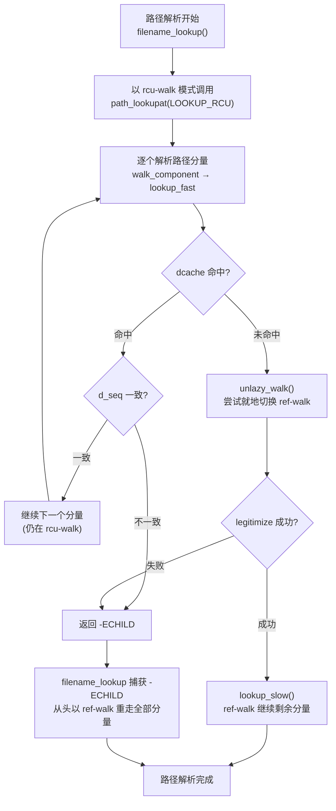

总结下：

1. rcu-walk 回退**不是**对单个分量的局部重试，而是"尝试就地切换 or 全局重走"的两级策略
2. 就地切换（`unlazy_walk`/`unlazy_child`）成功时，仅剩余未解析的分量需要 ref-walk，已解析的分量通过 `legitimize_path` 获得了合法引用
3. 就地切换失败时，**整条路径从头重走**（因为 rcu-walk 期间没有持有任何引用，已解析的 dentry 指针不可信）
4. 在实际运行中，全局重走极为罕见（需要恰好在 rcu-walk 期间发生 rename/unlink），绝大多数情况要么 rcu-walk 全程成功，要么 dcache miss 时通过 `unlazy_walk` 局部切换

####    锁层次

dcache 涉及多层锁，内核定义了严格的获取顺序以避免死锁：

```
dentry->d_inode->i_lock        （最外层）
  dentry->d_lock
    dentry->d_sb->s_dentry_lru_lock
      dcache_hash_bucket lock
        s_roots lock              （最内层）
```

####    dcache 锁的设计

从宏观视角来看，内核对 dcache 锁体系的设计遵循**从外到内、从全局到局部、从粗粒度到细粒度**的分层原则，核心目标是**让最频繁的读路径几乎零开销，同时让不频繁的写路径有明确的死锁避免规则**

**1. `rename_lock`（全局 seqlock），为何必须是全局锁？**

rename 操作的本质是将一个 dentry 从 hashtable 的某个 bucket 摘除，再加入另一个 bucket（因为文件名变了，hash 值也会变）。如果仅对单个 bucket 加锁，并发的 `d_lookup` 可能恰好在遍历 old bucket 和 new bucket 之间的间隙执行。此时 dentry 既不在 old bucket 也不在 new bucket，导致 **false-negative**（明明存在的文件找不到）

所以内核设计了全局锁解决了这个问题，但为什么选 seqlock 而非 rwlock/mutex呢？

| 锁类型 | 读端行为 | 写端行为 | 适用场景 |
|--------|---------|---------|---------|
| rwlock | 读端修改共享计数器（原子操作） | 等待所有读者退出 | 读写均频繁 |
| mutex | 读端获取锁（可能睡眠） | 获取互斥锁 | 需要睡眠的场景 |
| **seqlock** | **读端不修改任何共享状态**（仅读两次序号对比） | 递增序号 | **读极频繁、写极稀少** |

在实际系统中，`d_lookup` 的调用频率比 rename 高出数个数量级（每次路径解析的每个分量都需要 lookup，而 rename 是极低频操作）。seqlock 的读端**完全不修改任何共享 cacheline**，SMP 扩展性最佳。代价是写端发生时读端需要重试，但由于 rename 极稀有，重试概率可忽略

**`rename_lock` 与 `d_seq`（per-dentry seqcount）的分工**：

| 保护对象 | 锁 | 粒度 |
|----------|-----|------|
| hash table 全局一致性（跨 bucket 移动） | `rename_lock` | 全局唯一 |
| 单个 dentry 字段的一致性读取（`d_name`、`d_parent`、`d_inode`） | `d_seq` | per-dentry |

`rename_lock` 确保 `d_lookup` 遍历 hash 链时不会错过正在被移动的 dentry；`d_seq` 确保 rcu-walk 读取单个 dentry 的多个字段时得到一致的快照

**2. `inode->i_lock`锁：为何位于 `d_lock` 的外层？**

`inode->i_lock` 保护的核心数据是 `inode->i_dentry`（alias 链表是所有指向该 inode 的 dentry 的链表，支持硬链接）。操作如 `d_add`（将新 dentry 挂入 alias 链表）或 `d_delete`（从 alias 链表摘除）都需要同时操作 inode 的 alias 链表和 dentry 自身的状态

锁层次规则是：**先锁包含者（inode），再锁被包含者（dentry）**。因为遍历 alias 链表时需要先稳定 inode，然后才能安全访问链表中的每个 dentry。如果反过来（先锁 dentry 再锁 inode），会导致 ABBA 死锁

**3. `d_lock`（parent 和 child 两级）：per-dentry 细粒度并发**

- **parent 的 `d_lock`**：保护 `d_subdirs` 链表（子 dentry 的添加和移除）
- **child 的 `d_lock`**：保护 dentry 自身字段（`d_flags`、`d_name`、`d_parent`、`d_lockref`）

为什么要区分 parent/child？因为很多操作（如 `d_alloc` 加入子链表、`__fsnotify_update_child_dentry_flags` 遍历子 dentry）需要**同时持有父和子的 `d_lock`**。它们是同一类型的锁（都是 `struct dentry` 内嵌的 spinlock），如果不加区分，lockdep 会误报 AA 死锁。通过 `spin_lock_nested(&child->d_lock, DENTRY_D_LOCK_NESTED)` 告知 lockdep 这是不同层级的同类锁实例

per-dentry 的细粒度锁意味着**不同目录下的并发操作互不阻塞**，即在 `/home/user1/` 下创建文件不会阻塞 `/var/log/` 下的文件删除

**4. 设计哲学总结——读写路径的锁使用对比**

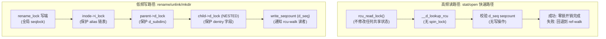

这种设计确保了：
- **99%+ 的路径解析操作**（`stat`、`open`、`access`）通过 rcu-walk 完成，不需要任何锁
- **写操作**有清晰的锁层次规则：rename_lock → inode->i_lock → parent d_lock → child d_lock → d_seq
- **写操作通过 seqcount 机制**通知读者重试，而非阻塞读者
- **per-dentry 细粒度锁**保证不同目录树分支的操作可以完全并行


##  0x02    dcache 增长机制分析

本小节从内核侧分析 dcache 增长的核心原因，重点关注 **negative dentry** 的无限增长问题

####    正向 dentry 创建路径

当用户空间调用 `open()` 打开一个文件时，内核主要路径如下：

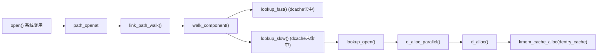

`d_alloc()` 分配新 dentry 并将其加入父 dentry 的 `d_subdirs` 链表（[fs/dcache.c L1761](https://github.com/torvalds/linux/blob/v5.4/fs/dcache.c#L1761)）：

```c
struct dentry *d_alloc(struct dentry *parent, const struct qstr *name)
{
	struct dentry *dentry = __d_alloc(parent->d_sb, name);
	if (!dentry)
		return NULL;
	spin_lock(&parent->d_lock);
	__dget_dlock(parent);
	dentry->d_parent = parent;
	list_add(&dentry->d_child, &parent->d_subdirs);  // 加入父目录的子链表
	spin_unlock(&parent->d_lock);
	return dentry;
}
```

####    Negative dentry 的产生

当进程尝试访问一个不存在的文件时，内核仍然会创建 dentry 并缓存"不存在"这个结果（即 negative dentry）。这样下次再查找同一路径时可以直接返回 `ENOENT`，无需访问磁盘

产生路径：文件系统的 `lookup` 操作返回 `NULL`（文件不存在），此时 `d_splice_alias(NULL, dentry)` 将 dentry 保留但不关联 inode，相关的内核代码如下：

```c
// fs/namei.c - lookup_open() 简化逻辑
// https://elixir.bootlin.com/linux/v5.4.241/source/fs/namei.c#L3118
static int lookup_open(struct nameidata *nd, ...)
{
	struct dentry *dentry;
	// ...
	// 在dcach中查找，肯定无法命中
	dentry = d_alloc_parallel(dir, &nd->last, &wq);
	// 调用具体文件系统的 lookup
	dentry = inode->i_op->lookup(inode, dentry, nd->flags);
	// 如果文件不存在，lookup 返回 NULL
	// dentry->d_inode 保持为 NULL → 即 negative dentry
}
```

可以使用下面的例子在用户态复现 negative dentry 产生：

```c
#include <fcntl.h>
#include <stdio.h>
#include <unistd.h>

int main(void)
{
    char path[64];
    for (int i = 0; i < 100000000; i++) {
        snprintf(path, sizeof(path), "/tmp/test/nonexist_%d", i);
        // open 不存在的文件，每次都会产生一个 negative dentry
        int fd = open(path, O_RDONLY);
        // fd == -1, errno == ENOENT
        // 但内核已经缓存了这个 negative dentry
    }
    return 0;
}
```

另一个常见场景是频繁创建/删除随机文件名文件：

```bash
#!/bin/bash
num=0
while true; do
    ((num++))
    touch /tmp/test/$num.tmp
    rm -f /tmp/test/$num.tmp
    # 删除后，dentry 关联的 inode 被释放
    # dentry 变为 negative（d_inode = NULL）
done
```

####    为何 negative dentry 无限增长

内核在 5.4.241 版本中**没有主动限制 negative dentry 数量的机制**。通常negative dentry 的回收仅在以下情况发生：

1. 内存压力触发 kswapd --> shrinker --> `prune_dcache_sb()`
2. 手动执行 `echo 2 > /proc/sys/vm/drop_caches`
3. 文件系统 umount

如果系统内存充足（如 256G 服务器），negative dentry 可以持续增长到数亿个而不触发回收；对于一些小内存机器，negative dentry更容易耗尽本机的可用内存，现象是应用并没有占用很多内存，但是机器频繁OOM

####    典型触发场景
在笔者日常工作中，有如下场景容易触发negative dentry爆炸场景：

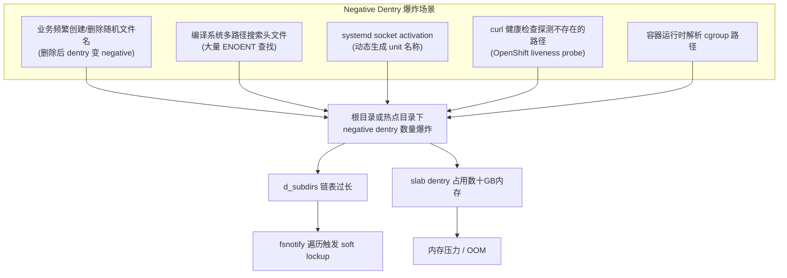

##  0x03    drop_caches 如何减少 dcache（内核视角）

执行 `echo 2 > /proc/sys/vm/drop_caches` 可以释放可回收的 slab 对象（包括 dentry 和 inode）。本节分析其完整的内核调用链

####    调用链概览

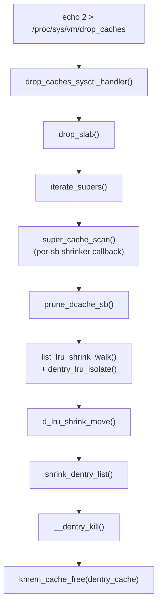

####    drop_caches_sysctl_handler

入口函数（[fs/drop_caches.c](https://github.com/torvalds/linux/blob/v5.4/fs/drop_caches.c)）：

```c
//https://elixir.bootlin.com/linux/v5.4.241/source/fs/drop_caches.c#L49
int drop_caches_sysctl_handler(struct ctl_table *table, int write,
		void __user *buffer, size_t *length, loff_t *ppos)
{
	int ret;
	ret = proc_dointvec_minmax(table, write, buffer, length, ppos);
	if (ret)
		return ret;
	if (write) {
		static int stfu;
		if (sysctl_drop_caches & 1) {
			iterate_supers(drop_pagecache_sb, NULL);  // case 1: 释放 page cache
			count_vm_event(DROP_PAGECACHE);
		}
		if (sysctl_drop_caches & 2) {
			drop_slab();  // case 2: 释放 slab (dentry + inode)
			count_vm_event(DROP_SLAB);
		}
		// ...
	}
	return 0;
}
```

####    prune_dcache_sb：dcache 回收的核心

`prune_dcache_sb()` **遍历 superblock 的 dentry LRU 链表**，筛选可回收的 dentry（[fs/dcache.c L1191](https://github.com/torvalds/linux/blob/v5.4/fs/dcache.c#L1191)）：

```c
long prune_dcache_sb(struct super_block *sb, struct shrink_control *sc)
{
	LIST_HEAD(dispose);
	long freed;
	freed = list_lru_shrink_walk(&sb->s_dentry_lru, sc,
			dentry_lru_isolate, &dispose);
	shrink_dentry_list(&dispose);
	return freed;
}
```

####    dentry_lru_isolate：（针对单个dentry）筛选逻辑

```c
static enum lru_status dentry_lru_isolate(struct list_head *item,
		struct list_lru_one *lru, spinlock_t *lru_lock, void *arg)
{
	struct list_head *freeable = arg;
	struct dentry *dentry = container_of(item, struct dentry, d_lru);

	if (!spin_trylock(&dentry->d_lock))
		return LRU_SKIP;  // 拿不到锁则跳过

	// 引用计数不为 0：正在使用，从 LRU 移除但不释放
	if (dentry->d_lockref.count) {
		d_lru_isolate(lru, dentry);
		spin_unlock(&dentry->d_lock);
		return LRU_REMOVED;
	}

	// 带 DCACHE_REFERENCED 标志：给"第二次机会"，清除标志后放回 LRU 尾部
	if (dentry->d_flags & DCACHE_REFERENCED) {
		dentry->d_flags &= ~DCACHE_REFERENCED;
		spin_unlock(&dentry->d_lock);
		return LRU_ROTATE;  // 移到 LRU 尾部（第二次机会算法）
	}

	// 可以回收：移入 dispose 链表
	d_lru_shrink_move(lru, dentry, freeable);
	spin_unlock(&dentry->d_lock);
	return LRU_REMOVED;
}
```

####    shrink_dentry_list 与 __dentry_kill

最终释放 dentry 的函数（[fs/dcache.c L1094](https://github.com/torvalds/linux/blob/v5.4/fs/dcache.c#L1094)）：

```c
//https://elixir.bootlin.com/linux/v5.4.241/source/fs/dcache.c#L1098
void shrink_dentry_list(struct list_head *list)
{
	while (!list_empty(list)) {
		struct dentry *dentry, *parent;
		dentry = list_entry(list->prev, struct dentry, d_lru);
		spin_lock(&dentry->d_lock);
		rcu_read_lock();
		if (!shrink_lock_dentry(dentry)) {
			// 无法获取锁，跳过
			// ...
			continue;
		}
		rcu_read_unlock();
		d_shrink_del(dentry);
		parent = dentry->d_parent;
		if (parent != dentry)
			__dput_to_list(parent, list);  // 父 dentry 引用减少，可能也需要回收
		__dentry_kill(dentry);  // 最终释放
	}
}
```

####    筛选流程图

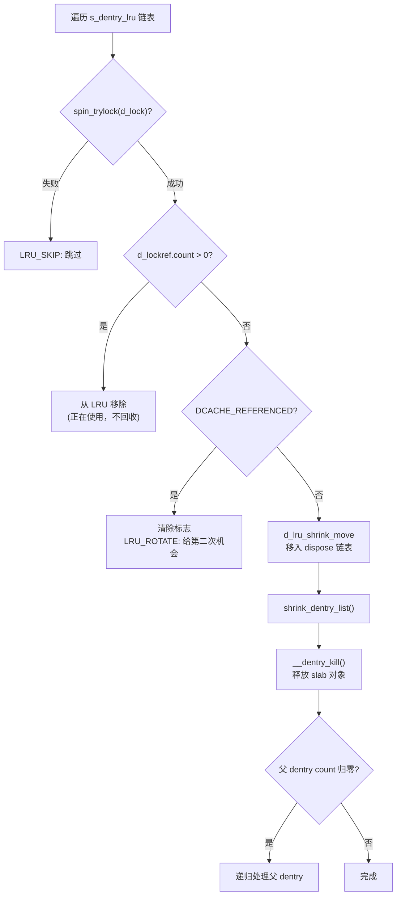

####    vfs_cache_pressure 参数

`sysctl_vfs_cache_pressure`（默认值 `100`）控制内核回收 dentry/inode cache 的倾向性：

- `= 0`：从不回收 dentry/inode cache
- `< 100`：倾向于保留 dentry/inode cache
- `= 100`：正常回收比例
- `> 100`：更积极地回收 dentry/inode cache

```c
// include/linux/dcache.h
extern int sysctl_vfs_cache_pressure;

static inline unsigned long vfs_pressure_ratio(unsigned long val)
{
	return mult_frac(val, sysctl_vfs_cache_pressure, 100);
}
```

##  0x04    systemd daemon-reload 与 negative dentry 导致负载突高

####    问题现象

执行 `systemctl daemon-reload` 时，某些机器会出现：
- 负载突然升高至数百
- 系统响应变慢数秒
- 极端情况下触发 soft lockup

什么是soft lockup呢？通常bash终端输出如下日志，看门狗监控CPU资源调度捕获的异常进程。soft lockup指bug没有让系统彻底死机，但存在若干个进程（或者kernel thread）被锁死在了某个状态（一般在内核区域）。多数情况下是由内核锁的使用问题导致，内核被锁死（软锁），无法进一步执行任务调度

```
kernel:NMI watchdog: BUG: soft lockup - CPU#6 stuck for 28s! xxxxxx
```

####    systemd daemon-reload 的行为

`daemon-reload` 会重新扫描所有 unit 文件目录。systemd 通过 inotify 监控这些目录的变化。在 reload 过程中，systemd 会关闭旧的 inotify fd 并重新建立监控，对 `/`、`/run`、`/run/systemd` 等目录执行 `inotify_add_watch`

strace 观测到的关键证据（部分）：

```text
17:25:23 inotify_add_watch(17, "/", IN_ATTRIB|IN_MOVED_TO|IN_CREATE|IN_DELETE_SELF|IN_MOVE_SELF) = 1 <2.666429>
17:25:26 inotify_add_watch(17, "/run", IN_ATTRIB|IN_MOVED_TO|IN_CREATE|IN_DELETE_SELF|IN_MOVE_SELF) = 2 <0.000194>
17:25:26 inotify_add_watch(17, "/", IN_MOVE_SELF) = 1 <2.690664>
```

对根目录 `/` 的 `inotify_add_watch` 耗时 **2.66 秒**，而对 `/run` 只需要 0.19ms

####    内核侧根因分析

`inotify_add_watch` 系统调用的内核路径：

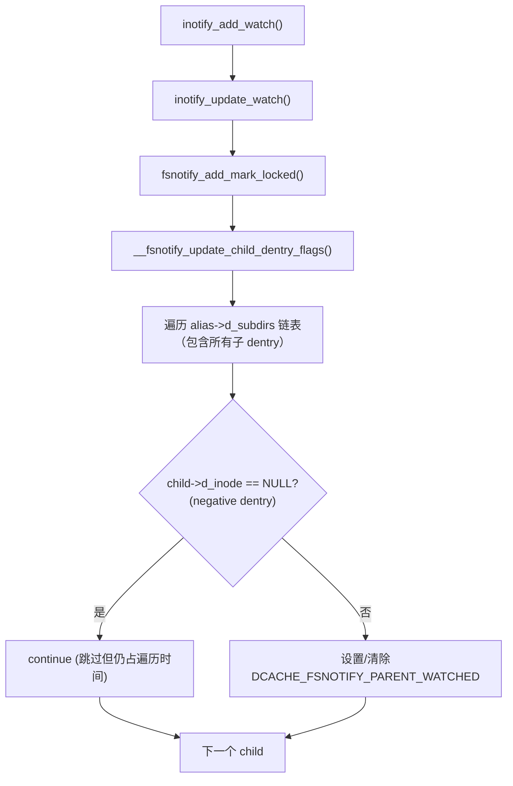

核心瓶颈代码（[fs/notify/fsnotify.c](https://github.com/torvalds/linux/blob/v5.4/fs/notify/fsnotify.c)）：

```c
//https://elixir.bootlin.com/linux/v5.4.241/source/fs/notify/fsnotify.c#L108
void __fsnotify_update_child_dentry_flags(struct inode *inode)
{
	struct dentry *alias;
	int watched;

	if (!S_ISDIR(inode->i_mode))
		return;

	watched = fsnotify_inode_watches_children(inode);

	spin_lock(&inode->i_lock);  // 持有 inode 自旋锁
	hlist_for_each_entry(alias, &inode->i_dentry, d_u.d_alias) {
		struct dentry *child;

		spin_lock(&alias->d_lock);
		// 遍历该目录下的所有子 dentry（包括 negative！）
		list_for_each_entry(child, &alias->d_subdirs, d_child) {
			if (!child->d_inode)
				continue;  // negative dentry 跳过，但遍历本身不跳过

			spin_lock_nested(&child->d_lock, DENTRY_D_LOCK_NESTED);
			if (watched)
				child->d_flags |= DCACHE_FSNOTIFY_PARENT_WATCHED;
			else
				child->d_flags &= ~DCACHE_FSNOTIFY_PARENT_WATCHED;
			spin_unlock(&child->d_lock);
		}
		spin_unlock(&alias->d_lock);
	}
	spin_unlock(&inode->i_lock);  // 整个遍历期间一直持有锁！
}
```

**锁机制深度分析**：

该函数使用了三层嵌套自旋锁，严格遵循全局锁层次：

```text
锁获取顺序：inode->i_lock（最外层）→ alias->d_lock（中间层）→ child->d_lock（最内层，NESTED）
```

| 锁 | 作用 | 持有时间 |
|---|---|---|
| `inode->i_lock` | 保护 `inode->i_dentry` alias 链表的遍历 | **整个函数执行期间不释放** |
| `alias->d_lock` | 保护 `alias->d_subdirs` 子目录链表的遍历 | 单个 alias 遍历期间 |
| `child->d_lock`（`spin_lock_nested` + `DENTRY_D_LOCK_NESTED`） | 保护 `child->d_flags` 的修改 | 仅设置/清除 flag 期间 |

**关键问题**：`spin_lock_nested` 的 `DENTRY_D_LOCK_NESTED` 参数仅用于 `lockdep` 调试子系统区分同类锁的不同实例（避免误报死锁），不改变锁的行为本身。整个遍历期间：
- `inode->i_lock` **从不释放**：任何其他需要该 inode 锁的操作（如 `d_add`、`d_delete`）都会阻塞
- 自旋锁禁止抢占和睡眠：CPU 在整个遍历期间无法被调度器切换，其他进程无法在该 CPU 上运行
- 如果 `d_subdirs` 链表有数千万个 dentry（常见于 negative dentry 堆积场景），遍历时间可达数秒，远超 `watchdog_thresh`（默认 `10s` 的一半 `5s`），触发 soft lockup

锁嵌套的 Mermaid 图示：

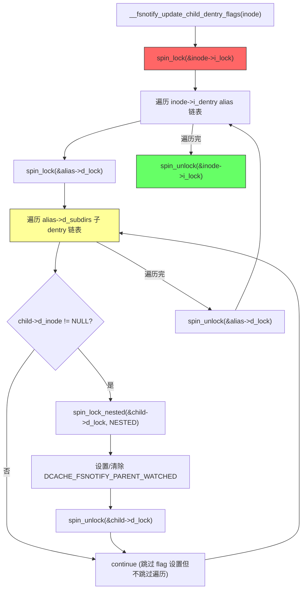

上面代码中**negative dentry 跳过，但遍历本身不跳过**这句话的含义是：`list_for_each_entry` 宏会逐一访问链表中的每个 `child`（包括 negative dentry），只是 `if (!child->d_inode) continue` 跳过了对其 `d_flags` 的锁获取和修改操作，但链表指针的移动（遍历开销）无法跳过


####    问题的核心

1. `list_for_each_entry(child, &alias->d_subdirs, d_child)` 遍历的是**完整的 `d_subdirs` 链表**，包括所有 negative dentry
2. 虽然 `if (!child->d_inode) continue` 跳过了对 negative dentry 的标志设置，但**链表遍历本身不会跳过**
3. 如果根目录 `/` 下有数千万个 negative dentry，遍历需要数秒
4. **整个遍历期间持有 `inode->i_lock` 自旋锁**，CPU 不可被调度

####    soft lockup 触发机制

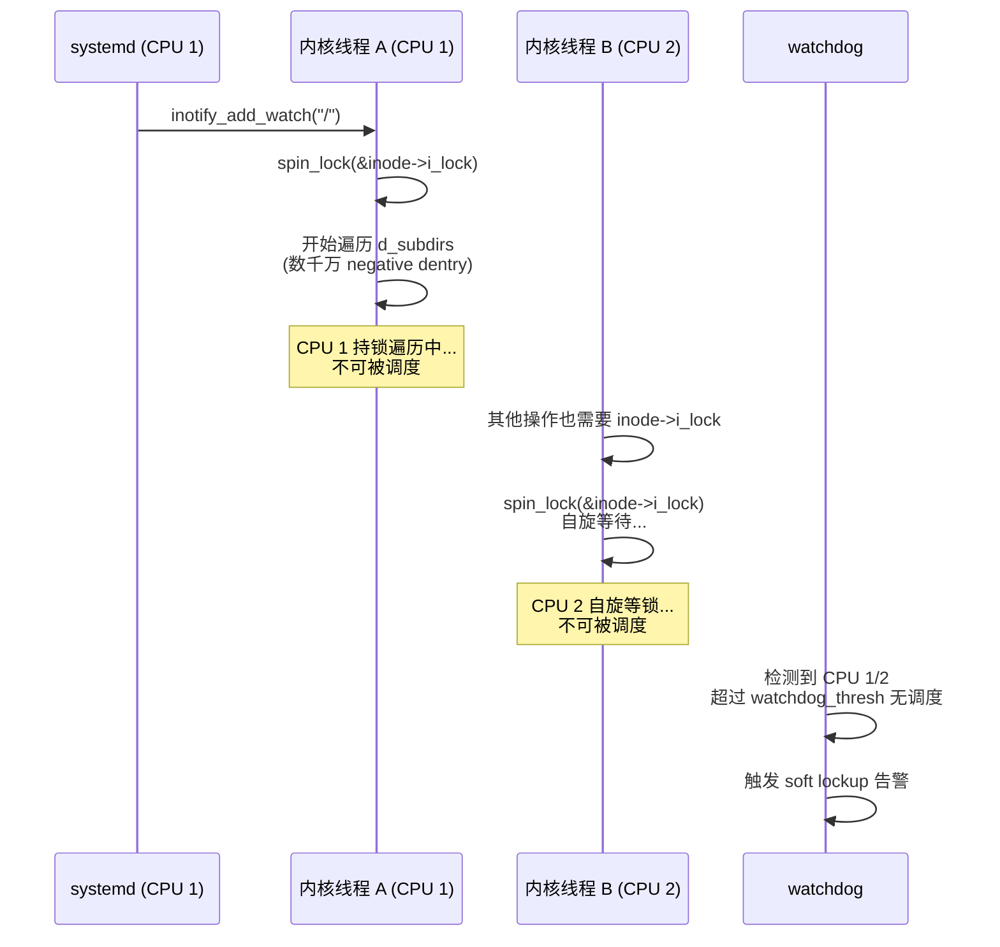

从 perf 火焰图来看，确认 **99.63%** 的 CPU 时间集中在 `__fsnotify_update_child_dentry_flags`的函数


####    复现方法
可以通过如下步骤复现类似的soft lockup告警：

```bash
# 1. 清空现有缓存
echo 2 > /proc/sys/vm/drop_caches

# 2. 降低 soft lockup 阈值（方便复现）
echo 1 > /proc/sys/kernel/watchdog_thresh

# 3. 在根目录下产生大量 negative dentry
cd /
for i in $(seq 1 50000000); do
    stat "nonexist_$i" 2>/dev/null
done

# 4. 观察 dentry 增长
slabtop --once | grep dentry

# 5. 触发问题
systemctl daemon-reload
# 或直接用测试程序:
# inotify_init() + inotify_add_watch(fd, "/", IN_MODIFY|IN_CREATE|IN_DELETE)
```

####    根目录 negative dentry 的来源

通过 kprobe 插桩 `__fsnotify_update_child_dentry_flags` 可确认 subdirs 数量：

```text
Jun 8 16:02:22 kernel: __fsnotify_update_child_dentry_flags:alias_cnt:1 subdirs:28673541
```

根目录下 **2867 万** 个子 dentry，其中绝大多数是 negative。常见的产生原因：
- 某些业务进程生成带时间戳的临时文件名并在根目录或 `/tmp` 下频繁探测
- systemd socket activation 产生的动态 unit 名称

##  0x05    fsnotify 与 dentry cache 的性能问题

####    fsnotify 架构概述

Linux 内核通过 `fsnotify` 统一框架支持多种文件事件通知机制：

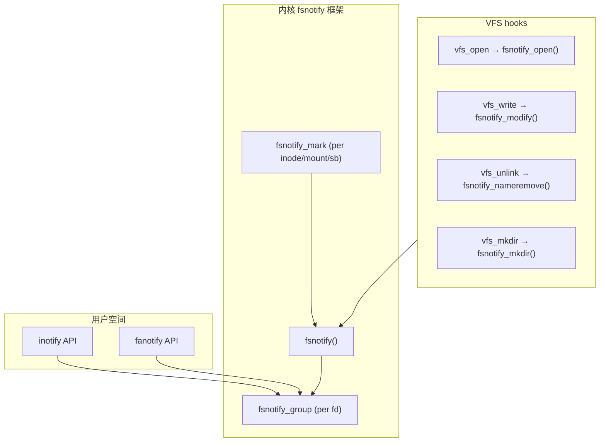

####    事件通知路径

以 `open` 系统调用为例，事件产生的内核调用链：

```text
open syscall
  -> do_filp_open()
    -> path_openat()
      -> do_last()
        -> vfs_open()
          -> fsnotify_open()
            -> fsnotify()
              -> send_to_group()
                -> inotify_handle_event()
```

####    DCACHE_FSNOTIFY_PARENT_WATCHED 标志

当一个目录被 inotify watch 时，其子 dentry 的 `d_flags` 会被设置 `DCACHE_FSNOTIFY_PARENT_WATCHED` 标志（值为 `0x00004000`）。这样当子文件发生事件时，可以快速判断是否需要通知父目录：

```c
// fs/notify/fsnotify.c
// https://elixir.bootlin.com/linux/v5.4.241/source/fs/notify/fsnotify.c#L146
int __fsnotify_parent(const struct path *path, struct dentry *dentry, __u32 mask)
{
	struct dentry *parent;
	struct inode *p_inode;
	int ret = 0;

	if (!dentry)
		dentry = path->dentry;
	// ...
	if (!(dentry->d_flags & DCACHE_FSNOTIFY_PARENT_WATCHED))
		return 0;  // 快速路径：父目录未被监控，直接返回

	parent = dget_parent(dentry);
	p_inode = parent->d_inode;

	if (unlikely(!fsnotify_inode_watches_children(p_inode))) {
		__fsnotify_update_child_dentry_flags(p_inode);
	} else if (p_inode->i_fsnotify_mask & mask & ALL_FSNOTIFY_EVENTS) {
		struct name_snapshot name;

		/* we are notifying a parent so come up with the new mask which
		 * specifies these are events which came from a child. */
		mask |= FS_EVENT_ON_CHILD;

		take_dentry_name_snapshot(&name, dentry);
		if (path)
			ret = fsnotify(p_inode, mask, path, FSNOTIFY_EVENT_PATH,
				       &name.name, 0);
		else
			ret = fsnotify(p_inode, mask, dentry->d_inode, FSNOTIFY_EVENT_INODE,
				       &name.name, 0);
		release_dentry_name_snapshot(&name);
	}

	dput(parent);
	// ...
}
```

####    性能问题：inotify 与大量 negative dentry

这里引用博客（[Linux上文件监控的踩坑分享](https://www.cnxct.com/linux-file-system-fsnotify-notes/)）中记录的两个真实生产事故：

**Case A：TCP timeout**

某文件监控服务变更后，扩大了 `inotify_add_watch` 的监控范围。对某个有大量 negative dentry 的目录执行 `inotify_add_watch` 时，该目录 inode 的 `spin_lock` 被长时间持有。此时其他线程也需要该锁，自旋等待导致 CPU 内核态被打满，影响了正常网络处理，导致 TCP timeout

**Case B：soft lockup**

业务在某目录下频繁创建/删除随机文件名文件，产生大量 negative dentry。当文件监控服务对该目录执行 `inotify_add_watch` 时，`__fsnotify_update_child_dentry_flags` 遍历子 dentry 链表过久，触发 soft lockup

Call trace：
```text
inotify_add_watch
  -> entry_SYSCALL_64_after_hwframe
    -> do_syscall_64
      -> __x64_sys_inotify_add_watch
        -> inotify_update_watch
          -> fsnotify_add_mark_locked
            -> __fsnotify_update_child_dentry_flags  <--- 卡在这里
```

soft lockup 的两条触发路径：
1. 线程 A 持有目录 inode 的 `i_lock` 遍历 `d_subdirs`，占据 CPU 1 太久 ，导致 soft lockup
2. 线程 B 尝试获取同一 `i_lock`，spin_lock 自旋导致 CPU 2 也产生 soft lockup

####    社区修复方案小结

针对 `__fsnotify_update_child_dentry_flags` 的性能问题，社区提出了多种修复方案，主要的方案如下：

| 方案 | 描述 | 状态 |
|------|------|------|
| 惰性清除标志 | 不在 add/remove watch 时遍历所有子 dentry，而是在事件触发时惰性检查 | CVE-2024-47660，已进入 5.10+ |
| 跳过 negative dentry 尾部 | 一旦遇到连续 negative dentry 则停止遍历 | RFC 阶段 |
| cursor-based 分批遍历 | 允许中间释放锁并调用 `cond_resched()`，避免长时间持锁 | RFC 阶段 |

惰性清除的核心思想（commit `41f49be2e51a71` "fsnotify: clear PARENT_WATCHED flags lazily"）：

```c
// 改进后：不再在 unwatch 时遍历清除标志
// 而是在 __fsnotify_parent() 中惰性检查
int __fsnotify_parent(const struct path *path, struct dentry *dentry, __u32 mask)
{
	// ...
	if (unlikely(!fsnotify_inode_watches_children(p_inode))) {
		// 父目录已不再被监控，惰性更新标志
		__fsnotify_update_child_dentry_flags(p_inode);
	}
	// ...
}
```

##  0x06    排查&&解决方案

####   	排查思路

**1. 查看 dentry 状态**

```bash
# 查看 dentry 三种状态的数量
cat /proc/sys/fs/dentry-state
# 输出: nr_dentry  nr_unused  age_limit  want_pages  nr_negative  dummy

# 查看 slab 中 dentry 占用
slabtop --once | grep dentry
# 或
cat /proc/slabinfo | grep dentry
```

**2. bpftrace 追踪open文件打开的情况**（适用于较新内核）

```c
#ifndef BPFTRACE_HAVE_BTF
#include <linux/path.h>
#include <linux/dcache.h>
#endif

kprobe:vfs_open
{
    printf("open path: %s, pid: %d, program: %s\n",
        str(((struct path *)arg0)->dentry->d_name.name), pid, comm);
}
```

**3. perf 分析热点**

```bash
# 对 inotify_add_watch 进行火焰图分析
perf record -g -p $(pidof ${your_monitor_service}) -- sleep 10
perf script | flamegraph.pl > flame.svg
```

####    应急处理方案

```bash
# 释放所有可回收的 slab 对象（包括 dentry + inode cache）
echo 2 > /proc/sys/vm/drop_caches
```

**副作用说明**：
- 短期内清理大量 cache 可能引起短暂的性能下降（后续文件访问需要重新从磁盘加载）
- 如果 `unused` 和 `negative` 数量远大于 `in-use` 数量，影响较小
- （重要）建议在业务低峰期操作

####    预防措施

**1. 调整 vfs_cache_pressure**

```bash
# 提高回收积极性（默认 100）
sysctl -w vm.vfs_cache_pressure=200
```

**2. 文件监控黑名单**

对于文件监控服务，应避免 watch 以下目录：
- 业务频繁创建/删除随机文件名的目录
- 高频探测不存在文件的目录
- 已知有大量 negative dentry 的目录（可以通过 kprobe 确认）

**3. 内核参数调优**

```bash
# 调整 soft lockup 阈值（默认 20s，调大可避免误报但会延迟检测真正的死锁）
sysctl -w kernel.watchdog_thresh=30
```

####   解决方案决策流程

小结下，解决方案的核心思路：

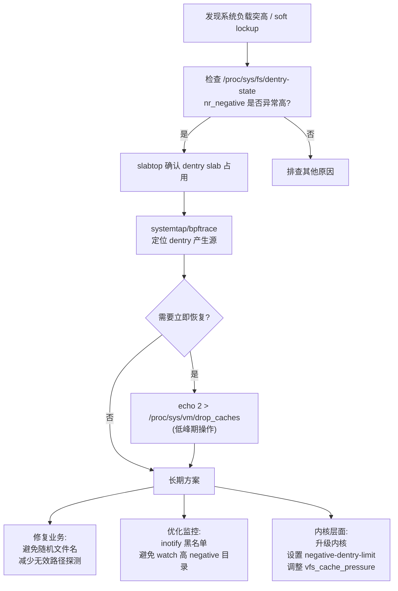

##  0x07    参考

-   [Linux的VFS实现 - 番外[一] - dcache](https://zhuanlan.zhihu.com/p/261669249)
-   [systemctl daemon-reload和根目录下的大量negative dentry共同作用导致机器偶发负载突高](https://zhuanlan.zhihu.com/p/635704426)
-   [Linux上文件监控的踩坑分享](https://www.cnxct.com/linux-file-system-fsnotify-notes/)
-   [slab dentry 缓存过多问题汇总](https://zhuanlan.zhihu.com/p/9056433374)
-   [Centos 系统 SLAB dentry 过高引起系统卡顿分析处理](https://blog.arstercz.com/centos-%e7%b3%bb%e7%bb%9f-slab-dentry-%e8%bf%87%e9%ab%98%e5%bc%95%e8%b5%b7%e7%b3%bb%e7%bb%9f%e5%8d%a1%e9%a1%bf%e5%88%86%e6%9e%90%e5%a4%84%e7%90%86/)
-   [Dealing with negative dentries (LWN)](https://lwn.net/Articles/894098/)
-   [Dentry negativity (LWN)](https://lwn.net/Articles/814535/)
-   [fs/dcache.c - Linux kernel v5.4](https://github.com/torvalds/linux/blob/v5.4/fs/dcache.c)
-   [fs/notify/fsnotify.c - Linux kernel v5.4](https://github.com/torvalds/linux/blob/v5.4/fs/notify/fsnotify.c)
-   [fs/drop_caches.c - Linux kernel v5.4](https://github.com/torvalds/linux/blob/v5.4/fs/drop_caches.c)
-   [RFC: fsnotify: allow sleepable child dentry flag update](https://lkml.indiana.edu/2210.1/06229.html)
-   [PATCH RFC: fsnotify: stop walking child dentries if remaining tail is negative](https://lkml.indiana.edu/2101.2/05972.html)
-   [Red Hat Solution: System crashed with soft lockup due to long looping in __fsnotify_update_child_dentry_flags](https://access.redhat.com/solutions/7095274)
-   [systemd issue #26950: Significant performance loss of daemon-reload](https://github.com/systemd/systemd/issues/26950)
-   [systemd PR #36607: path: Close inotify FD asynchronously](https://github.com/systemd/systemd/pull/36607)
