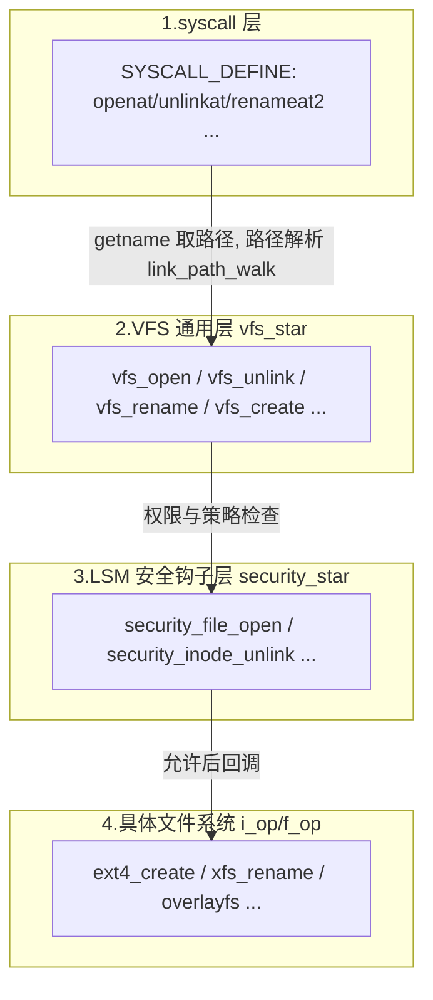

##  0x00    前言
本文从eBPF 内核态开发的视角，梳理 Linux VFS（虚拟文件系统）中值得挂载（hook）的监控点：文件的打开、创建、删除、重命名、目录/链接操作、属性与扩展属性修改、读写截断、挂载卸载等，并补齐 `inode`/`dentry` 相关操作与 `security_*` LSM 钩子

本文代码基于：

-	内核[v5.4.241](https://elixir.bootlin.com/linux/v5.4.241/source/)
-	内核[v6.6.47](https://elixir.bootlin.com/linux/v6.6.47/source/)

阅读导引：两套内核在 VFS 层的**调用链骨架基本一致**，但对 eBPF 开发者影响最大的是**函数签名的参数漂移**，集中在三处：

1.	`mnt_idmap`（挂载点 idmapping）在 6.x 版本被引入为多数 `vfs_*`/`security_inode_*` 的**首个参数**（前身是内核 5.12 版本引入的 `struct user_namespace *`，内核6.3 改为 `struct mnt_idmap *`）。这会导致 kprobe hook读取参数时**寄存器下标整体后移一位**
2.	`vfs_rename` 在内核 5.12+ 把一长串参数**收敛为 `struct renamedata *`** 单个结构体指针
3.	`open` 路径在内核 5.6+ 引入 `openat2`/`do_sys_openat2`，内核6.6 的 `open/openat` 也统一走该路径

```c
//https://elixir.bootlin.com/linux/v6.6.47/source/fs/mnt_idmapping.c#L12
struct mnt_idmap {
	struct user_namespace *owner;
	refcount_t count;
};

//https://elixir.bootlin.com/linux/v5.4.241/source/include/linux/user_namespace.h#L55
struct user_namespace {
	struct uid_gid_map	uid_map;
	struct uid_gid_map	gid_map;
	struct uid_gid_map	projid_map;
	atomic_t		count;
	struct user_namespace	*parent;
	int			level;
	kuid_t			owner;
	kgid_t			group;
	struct ns_common	ns;
	unsigned long		flags;

#ifdef CONFIG_KEYS
	/* List of joinable keyrings in this namespace.  Modification access of
	 * these pointers is controlled by keyring_sem.  Once
	 * user_keyring_register is set, it won't be changed, so it can be
	 * accessed directly with READ_ONCE().
	 */
	struct list_head	keyring_name_list;
	struct key		*user_keyring_register;
	struct rw_semaphore	keyring_sem;
#endif

	/* Register of per-UID persistent keyrings for this namespace */
#ifdef CONFIG_PERSISTENT_KEYRINGS
	struct key		*persistent_keyring_register;
#endif
	struct work_struct	work;
#ifdef CONFIG_SYSCTL
	struct ctl_table_set	set;
	struct ctl_table_header *sysctls;
#endif
	struct ucounts		*ucounts;
	int ucount_max[UCOUNT_COUNTS];
} __randomize_layout;
```

> 说明：下文代码片段均**只保留核心/关键路径**（省略错误处理、retry、加锁细节等），完整实现请对照 bootlin 源码链接。凡涉及具体行号或细节以内核源码为准

##	0x01	背景：VFS 分层与 eBPF 挂载点选型

###	VFS 调用分层

一次文件系统调用大致穿过四层，理解分层是选对 hook 点的前提：



各层的审计取舍：

-	**syscall 层**：能直接拿到用户态参数（路径字符串、flags），但参数是 `__user` 指针、易受 TOCTOU 影响，且不同架构/系统调用入口（`__x64_sys_*`、`__arm64_sys_*`、syscall wrapper）差异大。
-	**VFS 通用层（`vfs_*`）**：路径已解析为 `struct dentry`/`struct path`，语义稳定、覆盖所有文件系统，是审计的**首选层**；缺点是拿不到原始用户态路径字符串，需要靠 dentry 回溯。
-	**LSM 层（`security_*`）**：语义最稳定、且**可拦截（返回非 0 即拒绝）**，配合 `BPF_PROG_TYPE_LSM` 是现代审计/防护的最佳落点；缺点是需要内核开启 `CONFIG_BPF_LSM`（5.7+）。
-	**具体文件系统层（`i_op->create` 等）**：实现分散、随文件系统而变，通常不作为通用审计点。

###	eBPF 挂载点类型对比

| 类型 | 典型附着点 | 参数稳定性 | 可否拦截 | 备注 |
| --- | --- | --- | --- | --- |
| `kprobe/kretprobe` | 任意内核函数（如 `vfs_unlink`） | 依赖函数签名，跨版本易漂移 | 否 | 覆盖面最广，最通用 |
| `fentry/fexit`（BTF trampoline） | 有 BTF 的内核函数 | 同上，但读参更简洁（直接类型化） | 否 | 需 5.5+ 与 BTF，开销更低 |
| `tracepoint` | `syscalls:sys_enter_openat` 等 | ABI 稳定 | 否 | 稳定但只在 syscall 边界，拿的是原始参数 |
| `raw_tracepoint`/`btf raw_tp` | 内核静态 tracepoint | 稳定 | 否 | 比 tracepoint 开销更低 |
| `LSM-BPF` | `bpf_lsm_inode_unlink` 等 | 语义最稳定 | **是** | 需 `CONFIG_BPF_LSM`，5.7+ |

一句话选型建议：**审计优先挂 `vfs_*`/`security_*` 层，而非易变的 syscall 参数结构；需要“阻断”能力时用 LSM-BPF。**

###	路径/文件名提取

在 VFS 层拿到的是 `dentry`/`path`，eBPF 中常用三种方式还原路径：

-	`bpf_d_path(&file->f_path, buf, sz)`：最方便，但**仅允许在内核 allowlist 内的 hook 使用**（如 `security_*`、部分 `vfs_*`），且需 5.10+。
-	**手写 dentry 回溯**：沿 `dentry->d_name` 与 `dentry->d_parent` 向上循环拼接，配合 `bpf_probe_read_kernel_str` 读取 `d_name.name`，适用范围最广。
-	`bpf_probe_read_user_str`：在 syscall 层直接读用户态路径字符串（注意 TOCTOU）。

```c
// 手写回溯（示意）：从 dentry 逐级向上取 d_name，拼出路径
#pragma unroll
for (int i = 0; i < MAX_DEPTH; i++) {
    struct qstr d_name = BPF_CORE_READ(dentry, d_name);
    bpf_probe_read_kernel_str(&comp, sizeof(comp), d_name.name);
    struct dentry *parent = BPF_CORE_READ(dentry, d_parent);
    if (parent == dentry)          // 到达挂载点根
        break;
    dentry = parent;
}
```

##	0x02	文件打开 `open`

###	对应系统调用及参数

| 系统调用 | 原型 | 参数含义 |
| --- | --- | --- |
| `open` | `open(const char *filename, int flags, umode_t mode)` | `filename` 路径；`flags` 打开标志（`O_RDONLY/O_WRONLY/O_CREAT/O_TRUNC/O_EXCL...`）；`mode` 新建时权限 |
| `openat` | `openat(int dfd, const char *filename, int flags, umode_t mode)` | `dfd` 相对目录 fd（`AT_FDCWD` 表示 cwd） |
| `openat2` | `openat2(int dfd, const char *filename, struct open_how *how, size_t size)` | `how` 结构化打开参数（`flags/mode/resolve`），5.6+ |

###	内核核心调用链

`openat -> do_sys_open -> do_sys_openat2 -> do_filp_open -> path_openat -> vfs_open -> do_dentry_open`

```cpp
// v6.6：open/openat 统一走 openat2 路径
static long do_sys_openat2(int dfd, const char __user *filename,
			   struct open_how *how)
{
	struct open_flags op;
	int fd = build_open_flags(how, &op);
	struct filename *tmp = getname(filename);
	fd = get_unused_fd_flags(how->flags);
	struct file *f = do_filp_open(dfd, tmp, &op);   // 核心：解析+打开
	fd_install(fd, f);
	return fd;
}

// 打开的最终点：所有路径都会到 do_dentry_open
static int do_dentry_open(struct file *f, struct inode *inode,
			  int (*open)(struct inode *, struct file *))
{
	f->f_inode = inode;
	error = security_file_open(f);           // <== LSM 审计/拦截点
	...
	if (!open)
		open = f->f_op->open;
	error = open ? open(inode, f) : 0;       // 具体文件系统 .open
	...
}
```

###	版本差异（v5.4 vs v6.6）

-	v5.4：`do_sys_open()` 直接构造 `open_flags` 后调 `do_filp_open()`（无 `openat2`）。
-	v6.6：`open/openat` → `do_sys_open()` → `do_sys_openat2()`；另有独立 `openat2` 系统调用。
-	公共骨架 `do_filp_open -> path_openat -> vfs_open -> do_dentry_open` 两版一致；6.x 里 `path_openat` 内部把 `do_last()` 拆成了 `open_last_lookups()` + `do_open()`。

###	eBPF 挂载点建议

-	推荐 `security_file_open(struct file *f)`：可用 `bpf_d_path(&f->f_path, ...)` 取完整路径，且能拦截。
-	通用可挂 `do_filp_open`（返回 `struct file*`）或 `vfs_open(const struct path *path, struct file *file)`。
-	可提取：`f->f_flags`（打开标志）、`f->f_path`（路径）、`f->f_inode->i_ino`、进程上下文（`bpf_get_current_pid_tgid`、`comm`）。

##	0x03	文件创建 `create`/`mknod`

todo

###	对应系统调用及参数

| 系统调用 | 原型 | 参数含义 |
| --- | --- | --- |
| `creat` | `creat(const char *pathname, umode_t mode)` | 等价 `open(pathname, O_CREAT\|O_WRONLY\|O_TRUNC, mode)` |
| `open`(`O_CREAT`) | 见 0x02 | 带 `O_CREAT` 时若文件不存在则创建 |
| `mknod`/`mknodat` | `mknodat(int dfd, const char *filename, umode_t mode, dev_t dev)` | 创建普通文件/设备/FIFO/socket 节点；`dev` 设备号 |

###	内核核心调用链

普通文件创建走 open 路径的“最后一步”：`path_openat -> do_last/open_last_lookups -> lookup_open -> vfs_create`；`mknod` 走 `do_mknodat -> vfs_mknod`。

```cpp
// v5.4
int vfs_create(struct inode *dir, struct dentry *dentry, umode_t mode,
	       bool want_excl)
{
	int error = may_create(dir, dentry);
	...
	error = security_inode_create(dir, dentry, mode);   // <== LSM 点
	if (error)
		return error;
	error = dir->i_op->create(dir, dentry, mode, want_excl);  // ext4_create ...
	...
}

// v6.6：首参新增 struct mnt_idmap *idmap
int vfs_create(struct mnt_idmap *idmap, struct inode *dir,
	       struct dentry *dentry, umode_t mode, bool want_excl)
{
	...
	error = security_inode_create(dir, dentry, mode);
	...
	error = dir->i_op->create(idmap, dir, dentry, mode, want_excl);
	...
}
```

###	版本差异

-	`vfs_create`/`vfs_mknod` 在 6.x 首参新增 `struct mnt_idmap *`（5.12~6.2 曾是 `struct user_namespace *`）。
-	`security_inode_create(dir, dentry, mode)` 两版参数一致，故**审计更推荐挂 `security_inode_create`**，规避参数漂移。

###	eBPF 挂载点建议

-	推荐 `security_inode_create`：参数稳定，可从 `dentry->d_name` 取新建文件名，从 `dir->i_ino` 取父目录 inode。
-	`vfs_create`：注意 6.x 需按“idmap 在前”的顺序读参。

##	0x04	删除 `unlink`

###	对应系统调用及参数

| 系统调用 | 原型 | 参数含义 |
| --- | --- | --- |
| `unlink` | `unlink(const char *pathname)` | 删除文件/减少硬链接计数 |
| `unlinkat` | `unlinkat(int dfd, const char *pathname, int flag)` | `flag` 含 `AT_REMOVEDIR`（此时等价 `rmdir`） |

###	内核核心调用链

`unlinkat -> do_unlinkat -> vfs_unlink`（`AT_REMOVEDIR` 分流到 `do_rmdir`）：

```cpp
// v5.4
int vfs_unlink(struct inode *dir, struct dentry *dentry,
	       struct inode **delegated_inode)
{
	struct inode *target = dentry->d_inode;
	error = may_delete(dir, dentry, 0);
	...
	error = security_inode_unlink(dir, dentry);   // <== LSM 点
	if (!error) {
		error = try_break_deleg(target, delegated_inode);
		if (error)
			goto out;
		error = dir->i_op->unlink(dir, dentry);   // ext4_unlink ...
	}
	...
}

// v6.6：首参新增 idmap
int vfs_unlink(struct mnt_idmap *idmap, struct inode *dir,
	       struct dentry *dentry, struct inode **delegated_inode)
{ ... error = security_inode_unlink(dir, dentry); ... }
```

###	版本差异

-	`vfs_unlink` 6.x 新增首参 `mnt_idmap`，**kprobe 中 `dir`/`dentry` 分别从 arg0/arg1 后移到 arg1/arg2**——这是最容易踩坑的地方。
-	`security_inode_unlink(dir, dentry)` 两版一致。

###	eBPF 挂载点建议

-	推荐 `security_inode_unlink`（参数稳定）或 `vfs_unlink`（注意版本下标）。
-	可提取：被删 `dentry`（回溯路径）、`dentry->d_inode->i_ino`、`i_nlink`（删除前链接数）。

##	0x05	重命名 `rename`

###	对应系统调用及参数

| 系统调用 | 原型 | 参数含义 |
| --- | --- | --- |
| `rename` | `rename(const char *oldname, const char *newname)` | 移动/改名 |
| `renameat` | `renameat(int olddfd, const char *oldname, int newdfd, const char *newname)` | 支持相对目录 fd |
| `renameat2` | `renameat2(..., unsigned int flags)` | `flags`：`RENAME_NOREPLACE`（目标存在则失败）、`RENAME_EXCHANGE`（原子交换）、`RENAME_WHITEOUT`（overlayfs） |

###	内核核心调用链

`renameat2 -> do_renameat2 -> vfs_rename`：

```cpp
// v5.4：一长串参数
int vfs_rename(struct inode *old_dir, struct dentry *old_dentry,
	       struct inode *new_dir, struct dentry *new_dentry,
	       struct inode **delegated_inode, unsigned int flags)
{
	error = security_inode_rename(old_dir, old_dentry,
				      new_dir, new_dentry, flags);   // <== LSM 点
	...
	error = old_dir->i_op->rename(old_dir, old_dentry,
				      new_dir, new_dentry, flags);
	...
}

// v6.6：收敛为 struct renamedata *
struct renamedata {
	struct mnt_idmap *old_mnt_idmap;
	struct inode *old_dir;
	struct dentry *old_dentry;
	struct mnt_idmap *new_mnt_idmap;
	struct inode *new_dir;
	struct dentry *new_dentry;
	struct inode **delegated_inode;
	unsigned int flags;
};
int vfs_rename(struct renamedata *rd)
{
	error = security_inode_rename(rd->old_dir, rd->old_dentry,
				      rd->new_dir, rd->new_dentry, rd->flags);
	...
}
```

###	版本差异

-	**这是跨版本差异最大的函数**：5.4 是 6 个独立参数；5.12+/6.6 收敛为单个 `struct renamedata *`。eBPF 中 6.x 需先读 `renamedata` 指针，再按结构体偏移取 `old_dentry`/`new_dentry`。
-	`security_inode_rename(old_dir, old_dentry, new_dir, new_dentry, flags)` 两版参数一致，**强烈推荐用它规避 `renamedata` 差异**。

###	eBPF 挂载点建议

-	首选 `security_inode_rename`（参数稳定、可拦截）。
-	可提取：`old_dentry`/`new_dentry`（回溯源/目的路径）、`flags`（识别 `RENAME_EXCHANGE` 等）。

##	0x06	目录 `mkdir`/`rmdir`

###	对应系统调用及参数

| 系统调用 | 原型 | 参数含义 |
| --- | --- | --- |
| `mkdir` | `mkdir(const char *pathname, umode_t mode)` | 创建目录，`mode` 受 umask 影响 |
| `mkdirat` | `mkdirat(int dfd, const char *pathname, umode_t mode)` | 相对目录 fd 版 |
| `rmdir` | `rmdir(const char *pathname)` | 删除空目录 |

###	内核核心调用链

`mkdirat -> do_mkdirat -> vfs_mkdir`；`rmdir -> do_rmdir -> vfs_rmdir`：

```cpp
// v5.4
int vfs_mkdir(struct inode *dir, struct dentry *dentry, umode_t mode)
{
	error = may_create(dir, dentry);
	error = security_inode_mkdir(dir, dentry, mode);   // <== LSM 点
	error = dir->i_op->mkdir(dir, dentry, mode);
	...
}

// v6.6：首参新增 idmap（6.6 中 vfs_mkdir 仍返回 int）
int vfs_mkdir(struct mnt_idmap *idmap, struct inode *dir,
	      struct dentry *dentry, umode_t mode) { ... }
```

###	版本差异

-	`vfs_mkdir`/`vfs_rmdir` 6.x 首参新增 `mnt_idmap`。
-	`security_inode_mkdir(dir, dentry, mode)`、`security_inode_rmdir(dir, dentry)` 两版一致。

###	eBPF 挂载点建议

-	推荐 `security_inode_mkdir`/`security_inode_rmdir`；可从 `dentry` 取目录名、`dir->i_ino` 取父目录。

##	0x07	链接 `link`/`symlink`

###	对应系统调用及参数

| 系统调用 | 原型 | 参数含义 |
| --- | --- | --- |
| `link`/`linkat` | `linkat(int olddfd, const char *oldname, int newdfd, const char *newname, int flags)` | 创建**硬链接**；`flags` 含 `AT_SYMLINK_FOLLOW`、`AT_EMPTY_PATH` |
| `symlink`/`symlinkat` | `symlinkat(const char *oldname, int newdfd, const char *newname)` | 创建**软链接**，`oldname` 为链接目标（可不存在） |

###	内核核心调用链

`linkat -> do_linkat -> vfs_link`；`symlinkat -> do_symlinkat -> vfs_symlink`：

```cpp
// v5.4
int vfs_link(struct dentry *old_dentry, struct inode *dir,
	     struct dentry *new_dentry, struct inode **delegated_inode)
{
	error = security_inode_link(old_dentry, dir, new_dentry);  // <== LSM 点
	error = dir->i_op->link(old_dentry, dir, new_dentry);
	...
}

// v6.6：在 old_dentry 之后插入 idmap
int vfs_link(struct dentry *old_dentry, struct mnt_idmap *idmap,
	     struct inode *dir, struct dentry *new_dentry,
	     struct inode **delegated_inode) { ... }

// v5.4
int vfs_symlink(struct inode *dir, struct dentry *dentry, const char *oldname)
{
	error = security_inode_symlink(dir, dentry, oldname);   // <== LSM 点
	error = dir->i_op->symlink(dir, dentry, oldname);
	...
}
// v6.6：首参新增 idmap
int vfs_symlink(struct mnt_idmap *idmap, struct inode *dir,
		struct dentry *dentry, const char *oldname) { ... }
```

###	版本差异

-	`vfs_symlink` 6.x 首参新增 `idmap`；`vfs_link` 6.x 在 `old_dentry` **之后**插入 `idmap`（注意不是首参）。
-	`security_inode_link`/`security_inode_symlink` 两版参数一致。

###	eBPF 挂载点建议

-	推荐 `security_inode_link`/`security_inode_symlink`。
-	硬链接审计尤为重要（常被用于绕过基于路径的策略）：可提取 `old_dentry`（源）、`new_dentry`（新链接名）。

##	0x08	属性修改 `chmod`/`chown`/`setattr`/`utimes`

###	对应系统调用及参数

| 系统调用 | 原型 | 参数含义 |
| --- | --- | --- |
| `chmod`/`fchmodat` | `fchmodat(int dfd, const char *filename, umode_t mode)` | 改权限位 |
| `chown`/`fchownat` | `fchownat(int dfd, const char *filename, uid_t user, gid_t group, int flag)` | 改属主/属组；`flag` 含 `AT_SYMLINK_NOFOLLOW` |
| `utimensat` | `utimensat(int dfd, const char *filename, const struct timespec times[2], int flags)` | 改 atime/mtime |
| `truncate` 属性侧 | 见 0x0A | 改 size 也是一次 `setattr` |

`chmod` 与 `chown` 最终都汇聚到 `notify_change() -> inode->i_op->setattr()`，这是**属性变更的统一收敛点**。

`chmod/fchmodat -> do_fchmodat -> chmod_common`：

```cpp
int do_fchmodat(int dfd, const char __user *filename, umode_t mode)
{
	struct path path;
	int error = user_path_at(dfd, filename, LOOKUP_FOLLOW, &path);
	if (!error) {
		error = chmod_common(&path, mode);
		path_put(&path);
	}
	return error;
}

static int chmod_common(const struct path *path, umode_t mode)
{
	struct inode *inode = path->dentry->d_inode;
	struct iattr newattrs;
	newattrs.ia_mode = (mode & S_IALLUGO) | (inode->i_mode & ~S_IALLUGO);
	newattrs.ia_valid = ATTR_MODE | ATTR_CTIME;
	error = security_path_chmod(path, mode);              // <== LSM 点
	if (!error)
		error = notify_change(path->dentry, &newattrs, ...);  // 统一收敛
	...
}
```

`chown` 侧核心（`do_fchownat -> chown_common`）：

```cpp
static int chown_common(const struct path *path, uid_t user, gid_t group)
{
	struct inode *inode = path->dentry->d_inode;
	struct iattr newattrs;
	...
	newattrs.ia_valid = ATTR_CTIME;
	if (user != (uid_t)-1) { newattrs.ia_valid |= ATTR_UID; newattrs.ia_uid = uid; }
	if (group != (gid_t)-1) { newattrs.ia_valid |= ATTR_GID; newattrs.ia_gid = gid; }
	error = security_path_chown(path, uid, gid);          // <== LSM 点
	if (!error)
		error = notify_change(path->dentry, &newattrs, &delegated_inode);
	...
}
```

统一收敛点 `notify_change`：

```cpp
// v5.4
int notify_change(struct dentry *dentry, struct iattr *attr,
		  struct inode **delegated_inode)
{
	error = security_inode_setattr(dentry, attr);   // <== LSM 点
	...
	if (inode->i_op->setattr)
		error = inode->i_op->setattr(dentry, attr);
	...
}

// v6.6：首参新增 idmap；setattr 回调也带 idmap
int notify_change(struct mnt_idmap *idmap, struct dentry *dentry,
		  struct iattr *attr, struct inode **delegated_inode) { ... }
```

###	版本差异

-	`notify_change` 及 `i_op->setattr` 回调在 6.x 首参新增 `mnt_idmap`。
-	`security_inode_setattr` 在 6.x 也新增 `idmap` 首参（`security_path_chmod`/`security_path_chown` 参数保持稳定）。

###	eBPF 挂载点建议

-	推荐 `notify_change`/`security_inode_setattr`：**一处覆盖 chmod/chown/utimes/truncate 全部属性变更**。
-	关键提取 `struct iattr`：`ia_valid` 位掩码判断改了什么（`ATTR_MODE`/`ATTR_UID`/`ATTR_GID`/`ATTR_SIZE`/`ATTR_MTIME`），再取 `ia_mode`/`ia_uid`/`ia_gid`/`ia_size`。

##	0x09	扩展属性 `xattr`

###	对应系统调用及参数

| 系统调用 | 原型 | 参数含义 |
| --- | --- | --- |
| `setxattr`/`lsetxattr`/`fsetxattr` | `setxattr(const char *path, const char *name, const void *value, size_t size, int flags)` | 设置扩展属性；`name` 形如 `user.*`/`security.*`/`trusted.*`；`flags`：`XATTR_CREATE`/`XATTR_REPLACE` |
| `getxattr` 系列 | `getxattr(path, name, value, size)` | 读取扩展属性（审计可选） |
| `removexattr` 系列 | `removexattr(path, name)` | 删除扩展属性 |

> 审计重点：`security.capability`（file capabilities）、`security.selinux`、`system.posix_acl_access`（ACL）等属于安全敏感的 xattr。

###	内核核心调用链

`setxattr -> path_setxattr -> setxattr/do_setxattr -> vfs_setxattr`：

```cpp
// v5.4
int vfs_setxattr(struct dentry *dentry, const char *name, const void *value,
		 size_t size, int flags)
{
	error = security_inode_setxattr(dentry, name, value, size, flags);  // <== LSM 点
	if (!error)
		error = __vfs_setxattr_noperm(dentry, name, value, size, flags);
	...
}

// v6.6：首参新增 idmap
int vfs_setxattr(struct mnt_idmap *idmap, struct dentry *dentry,
		 const char *name, const void *value, size_t size, int flags)
{
	error = security_inode_setxattr(idmap, dentry, name, value, size, flags);
	...
}
```

###	版本差异

-	`vfs_setxattr`/`vfs_removexattr` 6.x 首参新增 `idmap`。
-	`security_inode_setxattr` 在 6.x 也新增 `idmap` 首参（5.4 无）。
-	6.x 对 xattr 路径做了重构：`setxattr` 系统调用侧多了 `do_setxattr()` 中间层，核心仍落到 `vfs_setxattr`。

###	eBPF 挂载点建议

-	推荐 `vfs_setxattr`/`vfs_removexattr` 或 `security_inode_setxattr`。
-	可提取：`name`（属性名字符串，用 `bpf_probe_read_kernel_str`）、`value`/`size`、目标 `dentry`。

##	0x0A	读写与截断 `read`/`write`/`truncate`

###	对应系统调用及参数

| 系统调用 | 原型 | 参数含义 |
| --- | --- | --- |
| `read` | `read(unsigned int fd, char *buf, size_t count)` | 读 `count` 字节到 `buf` |
| `write` | `write(unsigned int fd, const char *buf, size_t count)` | 写 `count` 字节 |
| `pread64`/`pwrite64` | `pread64(fd, buf, count, loff_t pos)` | 带偏移读写，不改文件位置 |
| `truncate`/`ftruncate` | `truncate(const char *path, off_t length)` | 把文件截断/扩展到 `length` 字节 |

###	内核核心调用链

`read -> ksys_read -> vfs_read`；`write -> ksys_write -> vfs_write`；`truncate -> do_sys_truncate -> do_truncate -> notify_change`：

```cpp
ssize_t vfs_read(struct file *file, char __user *buf, size_t count, loff_t *pos)
{
	if (!(file->f_mode & FMODE_READ)) return -EBADF;
	ret = rw_verify_area(READ, file, pos, count);
	...
	if (file->f_op->read)          ret = file->f_op->read(file, buf, count, pos);
	else if (file->f_op->read_iter) ret = new_sync_read(file, buf, count, pos);
	...
}

// v5.4
int do_truncate(struct dentry *dentry, loff_t length, unsigned int time_attrs,
		struct file *filp)
{
	struct iattr newattrs;
	newattrs.ia_size = length;
	newattrs.ia_valid = ATTR_SIZE | time_attrs;
	...
	ret = notify_change(dentry, &newattrs, NULL);   // 截断本质是 setattr(ATTR_SIZE)
}
// v6.6：do_truncate 首参新增 idmap
int do_truncate(struct mnt_idmap *idmap, struct dentry *dentry, loff_t length,
		unsigned int time_attrs, struct file *filp) { ... }
```

###	版本差异

-	`vfs_read`/`vfs_write` 两版签名稳定（不带 idmap），是少数“跨版本友好”的点。
-	`do_truncate` 6.x 首参新增 `idmap`；但截断最终仍收敛到 `notify_change(... ATTR_SIZE ...)`。

###	eBPF 挂载点建议

-	**读写路径频率极高**，全量 hook `vfs_read`/`vfs_write` 会带来显著开销与事件洪泛。审计场景建议：
	-	只对**敏感文件/目录**（按 inode 或路径前缀过滤）上报；
	-	或采样、或聚合计数后周期上报；
	-	或用 LSM `security_file_permission`（在打开后首次读写权限校验时触发，语义更“动作级”）。
-	截断推荐 `do_truncate` 或统一的 `notify_change`（`ATTR_SIZE`）。

##	0x0B	挂载 `mount`/`umount`

###	对应系统调用及参数

| 系统调用 | 原型 | 参数含义 |
| --- | --- | --- |
| `mount` | `mount(const char *dev_name, const char *dir_name, const char *type, unsigned long flags, void *data)` | `flags`：`MS_RDONLY/MS_BIND/MS_REMOUNT/MS_MOVE...`；`data` 文件系统私有选项 |
| `umount2` | `umount2(const char *target, int flags)` | `flags`：`MNT_FORCE/MNT_DETACH/MNT_EXPIRE` |
| 新挂载 API | `fsopen/fsconfig/fsmount/move_mount` | 5.2+ 引入的 fd 化挂载流程 |

###	内核核心调用链

```cpp
// v5.4：do_mount 内部直接分派
long do_mount(const char *dev_name, const char __user *dir_name,
	      const char *type_page, unsigned long flags, void *data_page)
{
	struct path path = ...;                    // 解析挂载点
	retval = security_sb_mount(dev_name, &path, type_page, flags, data_page); // LSM
	if (flags & MS_REMOUNT) retval = do_remount(...);
	else if (flags & MS_BIND) retval = do_loopback(...);
	else if (flags & MS_MOVE) retval = do_move_mount_old(...);
	else retval = do_new_mount(...);
	...
}

// v6.6：拆出 path_mount（挂载点已解析为 struct path）
int path_mount(const char *dev_name, struct path *path, const char *type_page,
	       unsigned long flags, void *data_page)
{
	ret = security_sb_mount(dev_name, path, type_page, flags, data_page);  // LSM
	...
	if (flags & MS_REMOUNT) return do_remount(...);
	if (flags & MS_BIND)    return do_loopback(...);
	if (flags & MS_MOVE)    return do_move_mount_old(...);
	return do_new_mount(...);
}
```

卸载：v5.4 走 `ksys_umount(name, flags)`；v6.6 走 `SYSCALL_DEFINE2(umount, ...) -> path_umount(&path, flags)`（`path_umount` 为 5.9+ 重构产物）。

###	版本差异

-	5.9 前后挂载路径重构：v5.4 分派逻辑在 `do_mount`；v6.6 挂载点解析后交给 `path_mount`，卸载有独立 `path_umount`。
-	新旧两套挂载 API 并存；`move_mount` 有独立 `security_move_mount`。

###	eBPF 挂载点建议

-	推荐 `security_sb_mount`（两版参数稳定、可拦截）；`path_mount`（6.x）/`do_mount`（5.4）作为通用点需分版本。
-	可提取：`dev_name`（设备/源）、`path`（挂载点，`bpf_d_path`）、`flags`（`MS_*`）。

##	0x0C	inode 操作函数

`struct inode_operations`（`inode->i_op`）是**具体文件系统实现命名空间语义的回调表**，前面各 `vfs_*` 在完成通用校验与 LSM 后，最终都调用它：

```cpp
struct inode_operations {
	struct dentry *(*lookup)(struct inode *, struct dentry *, unsigned int);
	int (*permission)(struct mnt_idmap *, struct inode *, int);   // 6.x 带 idmap
	int (*create)(struct mnt_idmap *, struct inode *, struct dentry *, umode_t, bool);
	int (*link)(struct dentry *, struct inode *, struct dentry *);
	int (*unlink)(struct inode *, struct dentry *);
	int (*symlink)(struct mnt_idmap *, struct inode *, struct dentry *, const char *);
	int (*mkdir)(struct mnt_idmap *, struct inode *, struct dentry *, umode_t);
	int (*rmdir)(struct inode *, struct dentry *);
	int (*rename)(struct mnt_idmap *, struct inode *, struct dentry *,
		      struct inode *, struct dentry *, unsigned int);
	int (*setattr)(struct mnt_idmap *, struct dentry *, struct iattr *);
	int (*getattr)(struct mnt_idmap *, const struct path *, struct kstat *, u32, unsigned int);
	...
};
```

审计视角要点：

-	`i_op` 的具体实现**随文件系统而异**（`ext4_dir_inode_operations`、`xfs_dir_inode_operations`、overlayfs 等），直接 hook 某个 `ext4_create` 会**漏掉其他文件系统**；因此通用审计应挂上层 `vfs_*`/`security_inode_*`，而非 `i_op` 回调。
-	仅在需要**针对特定文件系统**做深度分析（如 overlayfs 的 copy-up 行为）时，才 hook 具体 `i_op` 实现。
-	版本差异：6.x 中 `create/mkdir/symlink/rename/setattr/getattr/permission` 等回调普遍新增 `mnt_idmap` 首参；`lookup/unlink/rmdir/link` 不带 idmap。

##	0x0D	dentry 操作函数

`struct dentry`（目录项）是 VFS 的路径缓存节点，`struct dentry_operations`（`dentry->d_op`）定义其行为：

```cpp
struct dentry_operations {
	int (*d_revalidate)(struct dentry *, unsigned int);   // 缓存有效性校验
	int (*d_hash)(const struct dentry *, struct qstr *);
	int (*d_compare)(const struct dentry *, unsigned int, const char *, const struct qstr *);
	int (*d_delete)(const struct dentry *);               // 最后一个引用释放时是否立即销毁
	void (*d_release)(struct dentry *);
	void (*d_iput)(struct dentry *, struct inode *);
	char *(*d_dname)(struct dentry *, char *, int);       // 特殊文件系统自定义 d_path 显示
	...
};
```

对审计最有价值的是**从 dentry 还原绝对路径**，这也是 eBPF 文件审计的核心难点：

-	`dentry->d_name`（`struct qstr`：`{ hash_len; const unsigned char *name; }`）取当前组件名。
-	`dentry->d_parent` 指向父目录 dentry，循环向上直到 `d_parent == d_self`（挂载点根），再借 `vfsmount`/`mnt->mnt_mountpoint` 跨挂载点拼接。
-	内核态有 `d_path()`/`dentry_path_raw()`；eBPF 侧优先 `bpf_d_path`（allowlist 限制），否则手写回溯（见 0x01）。

```cpp
// 内核 d_path 思路（简化）：从 dentry 向上回溯拼路径
char *d_path(const struct path *path, char *buf, int buflen)
{
	// prepend_path -> 循环: prepend d_name; dentry = d_parent;
	// 跨挂载点时切换到父 mount 的 mountpoint
	...
}
```

审计注意：dentry 可能因 rename 而 `d_parent`/`d_name` 变化，采集时要在**事件发生的同步上下文**读取，避免异步读到已变更的缓存。

##	0x0E	security 系列 LSM 钩子汇总

前面各节反复出现的 `security_*` 是 **LSM（Linux Security Module）框架**暴露的策略挂钩点。相较 kprobe，它们对 eBPF 审计有三大优势：**参数语义稳定、位于动作发生前、返回非 0 即可拦截（阻断能力）**。

###	与文件审计相关的钩子分组

-	文件级 `security_file_*`
	-	`security_file_open(struct file *file)`：打开（含权限最终确认）。
	-	`security_file_permission(struct file *file, int mask)`：读写等访问前校验（`MAY_READ/MAY_WRITE`）。
	-	`security_mmap_file(struct file *file, unsigned long prot, unsigned long flags)`：映射可执行文件常用于审计。
-	inode 级 `security_inode_*`
	-	创建/删除/改名：`security_inode_create`、`security_inode_unlink`、`security_inode_rename`、`security_inode_mkdir`、`security_inode_rmdir`、`security_inode_mknod`。
	-	链接：`security_inode_link`、`security_inode_symlink`。
	-	属性：`security_inode_setattr`、`security_inode_getattr`、`security_inode_permission`。
	-	扩展属性：`security_inode_setxattr`、`security_inode_getxattr`、`security_inode_removexattr`、`security_inode_listxattr`。
-	路径级 `security_path_*`（依赖 `CONFIG_SECURITY_PATH`，如 AppArmor/TOMOYO）
	-	`security_path_chmod`、`security_path_chown`、`security_path_mknod`、`security_path_unlink`、`security_path_rename`、`security_path_link/symlink`、`security_path_truncate`。
-	超级块/挂载 `security_sb_*`
	-	`security_sb_mount`、`security_sb_umount`、`security_sb_remount`、`security_move_mount`。

###	LSM-BPF 用法

内核 5.7+ 开启 `CONFIG_BPF_LSM` 后，可用 `BPF_PROG_TYPE_LSM` 程序附着到 `bpf_lsm_<hook>`，libbpf 中用 `SEC("lsm/<hook>")`：

```c
SEC("lsm/inode_unlink")
int BPF_PROG(audit_unlink, struct inode *dir, struct dentry *dentry, int ret)
{
    // ret 为前序 LSM 的返回值；若已被拒绝则透传
    if (ret != 0)
        return ret;
    // ... 采集/判定 ...
    return 0;      // 返回 -EPERM 即可阻断该次 unlink
}
```

要点：

-	LSM-BPF hook 的**参数与内核 `security_*` 钩子签名一一对应**，且随 CO-RE/BTF 稳定，跨版本迁移成本低。
-	返回值直接决定放行/拒绝，是实现**主动防护（而非仅审计）**的关键。
-	依赖：`CONFIG_BPF_LSM=y`、启动参数 `lsm=...,bpf`（或内核默认已含 bpf）、5.7+。

##	0x0F	跨版本差异小结

面向 eBPF 开发者，两套内核在本文涉及函数上的关键差异汇总如下（重点是**参数下标漂移**）：

-	`mnt_idmap` 引入：6.x 中 `vfs_create/vfs_mknod/vfs_mkdir/vfs_rmdir/vfs_symlink/vfs_setxattr/vfs_removexattr/notify_change/do_truncate` 等**首参新增 `struct mnt_idmap *`**；`vfs_link` 则在 `old_dentry` 之后插入。演进：5.12 引入 `struct user_namespace *` → 6.3 改为 `struct mnt_idmap *`。kprobe 读参时对应寄存器下标整体后移一位。
-	`vfs_rename`：5.4 为 6 个独立参数；5.12+/6.6 收敛为 `struct vfs_rename` 的 `struct renamedata *`。**建议改挂 `security_inode_rename`** 以规避。
-	`open` 路径：5.6+ 引入 `openat2`/`do_sys_openat2`，6.6 的 open/openat 也走此路径；6.x `path_openat` 内部把 `do_last` 拆为 `open_last_lookups` + `do_open`。
-	`mount`：5.9 重构出 `path_mount`/`path_umount`；v5.4 分派逻辑仍在 `do_mount`。
-	`vfs_read`/`vfs_write`：两版签名稳定，跨版本友好。
-	**总结**：审计代码**优先挂 `security_*`（尤其 LSM-BPF）**，其签名对参数漂移最鲁棒；若必须挂 `vfs_*`，务必用 BTF/CO-RE 并区分内核版本处理参数下标。

##  0x10  参考
-	[Linux v5.4.241 source (bootlin)](https://elixir.bootlin.com/linux/v5.4.241/source/)
-	[Linux v6.6.47 source (bootlin)](https://elixir.bootlin.com/linux/v6.6.47/source/)
-	[fs/namei.c（open/unlink/rename/mkdir/link 等）](https://elixir.bootlin.com/linux/v6.6.47/source/fs/namei.c)
-	[fs/open.c（open/truncate/chmod/chown）](https://elixir.bootlin.com/linux/v6.6.47/source/fs/open.c)
-	[fs/xattr.c（setxattr/removexattr）](https://elixir.bootlin.com/linux/v6.6.47/source/fs/xattr.c)
-	[fs/namespace.c（mount/umount/path_mount）](https://elixir.bootlin.com/linux/v6.6.47/source/fs/namespace.c)
-	[include/linux/lsm_hook_defs.h（LSM 钩子定义）](https://elixir.bootlin.com/linux/v6.6.47/source/include/linux/lsm_hook_defs.h)
-	[BPF LSM 文档](https://docs.kernel.org/bpf/prog_lsm.html)
-	[idmapped mounts 文档](https://docs.kernel.org/filesystems/idmappings.html)
-	[cilium/ebpf](https://github.com/cilium/ebpf)
