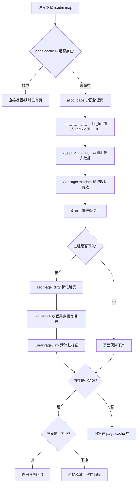
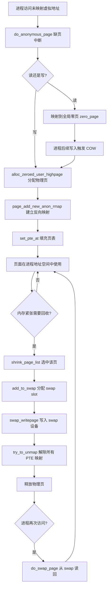
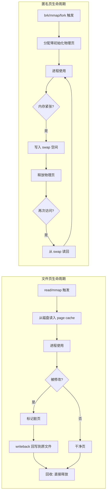
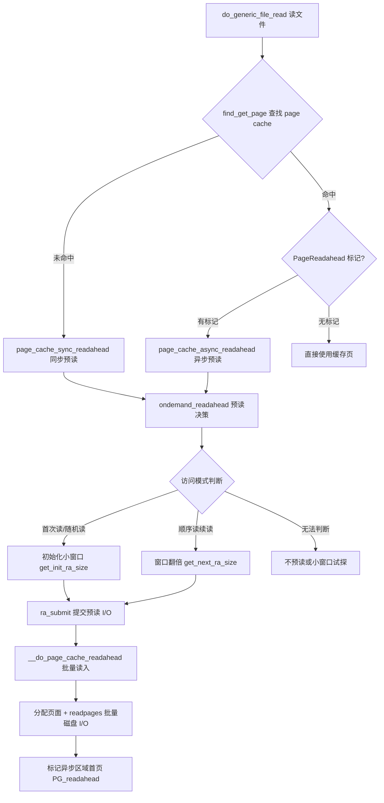
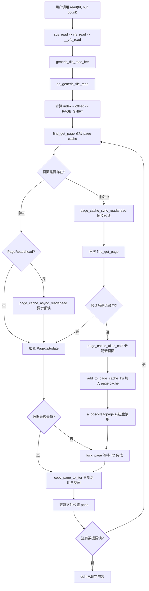
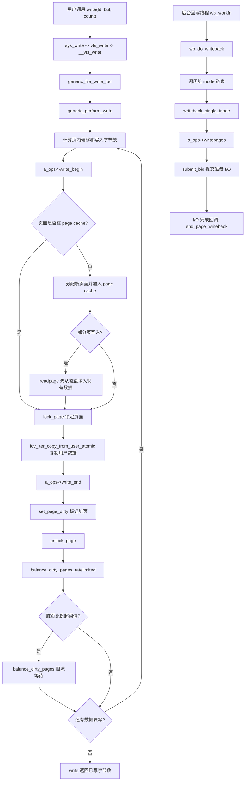
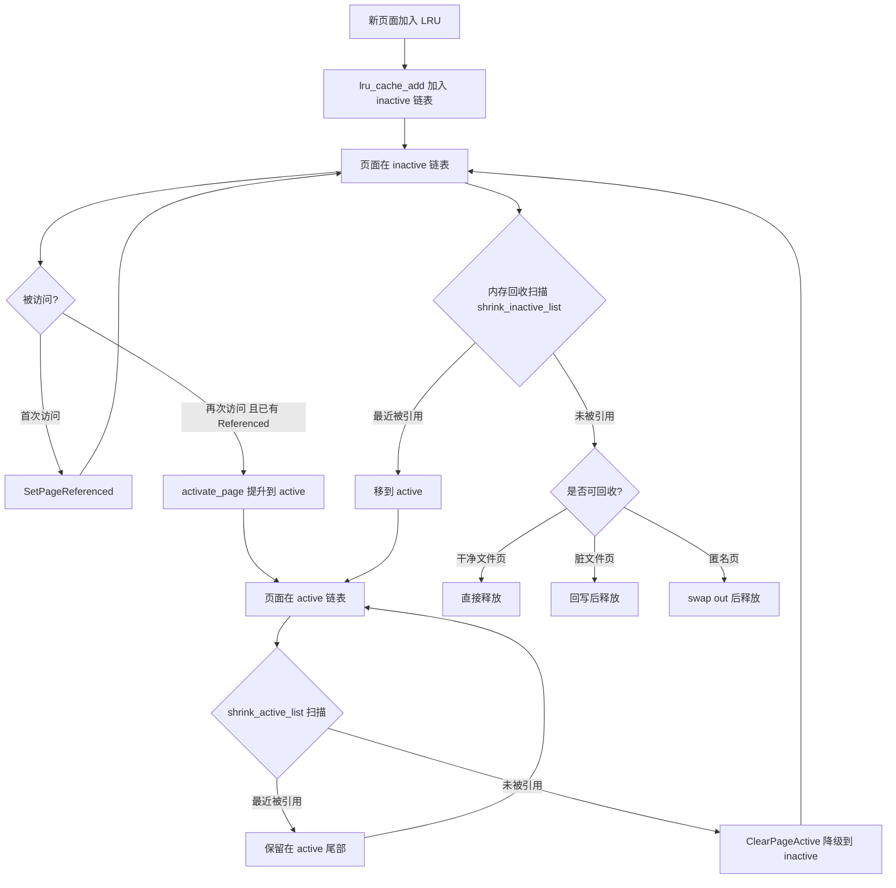
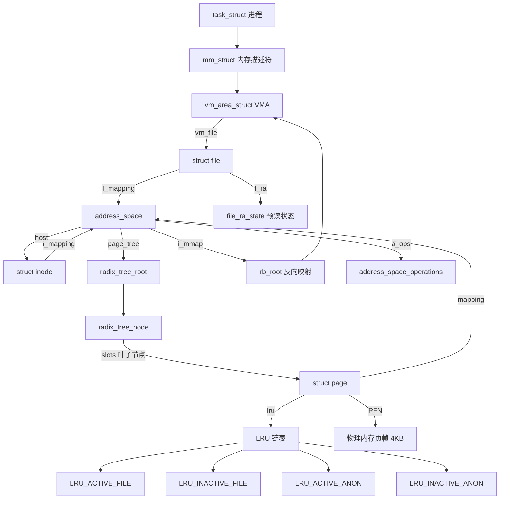

##  0x00    前言
本文主要梳理下page cache与管理的若干知识，本文基于[v4.11.6](https://elixir.bootlin.com/linux/v4.11.6/source/include)的源码

页高速缓存（page cache），它是一种对完整的数据页进行操作的磁盘高速缓存，即把磁盘的数据块缓存在页高速缓存中。page cache是内核为文件创建的内存缓存，用以加速相关的文件操作。当应用程序需要读取文件中的数据时，操作系统先分配一些内存，将数据从存储设备读入到这些内存中，然后再将数据分发给应用程序；当需要往文件中写数据时，操作系统先分配内存接收用户数据，然后再将数据从内存写到磁盘上


本文涉及到read/write讨论，不考虑`O_DIRECT`的情况（如MySQL）

##	0x01	内核如何描述物理内存页

####	内核物理内存管理（从 CPU 角度看FLATMEM物理内存模型）
以内核默认的平坦内存模型（FLATMEM ）为例，来解释下物理内存与虚拟内存（地址）之间的映射关系：

-	内核以页（page）为基本单位对物理内存进行管理，通过将物理内存划分为一页一页的内存块，每页大小为 `4K`。一页大小的内存块在内核中用 `struct page` 来进行管理，`struct page` 中封装了每页内存块的状态信息，比如组织结构、使用信息、统计信息以及与其他结构的关联映射信息等
-	为了快速索引到具体的物理内存页，内核为每个物理页 `struct page` 结构体定义了一个索引编号，即`PFN`（Page Frame Number），其中`PFN` 与 `struct page` 是一一对应的关系
-	内核提供了两个宏来完成 PFN 与 物理页结构体 `struct page` 之间的相互转换，分别是 `page_to_pfn` 与 `pfn_to_page`

内核中如何组织管理这些物理内存页 `struct page` 的方式称之为做物理内存模型，不同的物理内存模型，应对的场景以及 `page_to_pfn` 与 `pfn_to_page` 的计算逻辑都是不一样的，介绍下最简单的FLATMEM模型：


平坦内存模型 FLATMEM的架构如下：先把物理内存想象成一片地址连续的存储空间，在这一大片地址连续的内存空间中，内核将这块内存空间分为一页一页的内存块 `struct page`，由于这块物理内存是连续的，物理地址也是连续的，划分出来的这一页一页的物理页必然也是连续的，并且每页的大小都是固定的，所以很容易想到用一个数组来组织这些连续的物理内存页 `struct page` 结构，其在数组中对应的下标即为 `PFN`

-	`mem_map`是数组（虚拟内存地址）：是虚拟地址空间中 `struct page`结构体的连续数组（全局的 `struct page` 数组指针），此数组在内核的虚拟地址空间中连续存放，数组的每个元素对应一个物理页的元数据（状态信息）。在平坦模型下，系统认为物理内存是连续的，所以内核启动时会申请一个巨大的数组，数组的第 i 个元素就代表第 i 个物理页帧
-	`PFN`：物理概念，代表物理页的编号
-	`ARCH_PFN_OFFSET`：物理地址的起始偏移量（x86_64 系统通常为 `0`），但在某些架构上，物理内存可能从一个很高的地址开始（比如 `0x1000000`），这个偏移量就用来修正数组下标
-	指针减法：`(page) - mem_map` 用来计算两个指针之间的元素个数

相关的代码如下，在FLATMEM模型下 ，`page_to_pfn` 与 `pfn_to_page` 本质就是基于 `mem_map` 数组进行偏移操作，其中 `mem_map` 是全局数组，用来组织所有划分出来的物理内存页。`mem_map` 全局数组的下标就是相应物理页对应的 `PFN`

```cpp
struct page *mem_map;  // 全局数组，指向 struct page结构体数组的指针

#if defined(CONFIG_FLATMEM)
#define __pfn_to_page(pfn) (mem_map + ((pfn)-ARCH_PFN_OFFSET))	//ARCH_PFN_OFFSET 是 PFN 的起始偏移量
#define __page_to_pfn(page) ((unsigned long)((page)-mem_map) + ARCH_PFN_OFFSET)
#endif

/*
__page_to_pfn(page)：
((unsigned long)((page) - mem_map) + ARCH_PFN_OFFSET)

(page) - mem_map：计算给定 struct page指针在数组中的索引位置
加上 ARCH_PFN_OFFSET：得到实际的物理页帧号（因为物理内存可能不是从0开始）

__pfn_to_page(pfn)：
(mem_map + ((pfn) - ARCH_PFN_OFFSET))
(pfn) - ARCH_PFN_OFFSET：从PFN中减去偏移得到数组索引
mem_map + index：通过数组索引找到对应的 struct page指针
*/
```

关于`__pfn_to_page`与`__page_to_pfn`，需要注意的一点是，这两个操作不直接操作物理内存地址，而是在虚拟地址空间中完成 `struct page`指针 与 PFN 之间的转换，本质是**在虚拟地址空间的 `mem_map` 数组和物理页帧号 PFN 之间建立转换关系**，如下：

```text
虚拟地址空间中的 mem_map 数组：
+-----+-----+-----+-----+-----+
| pg0 | pg1 | pg2 | pg3 | ... |  <- struct page 结构体数组
+-----+-----+-----+-----+-----+
  ^     ^     ^     ^
  |     |     |     |
物理页：
+-----+-----+-----+-----+-----+
| PFN0| PFN1| PFN2| PFN3| ... |  <- 实际的物理内存页
+-----+-----+-----+-----+-----+
```

为什么说是虚拟地址空间中的转换呢？`mem_map`数组本身存在于内核的虚拟地址空间，每个 `struct page`是虚拟地址空间中的一个对象，`PFN` 代表的是物理地址的页帧号，上面两个宏实际上是建立了**虚拟地址（`struct page`指针）<-> 物理页编号（PFN）的映射关系**

实际使用时的地址转换流程如下：

```cpp
// 从 struct page 获取物理地址
struct page *page = .......;
unsigned long pfn = page_to_pfn(page);     // 1. 得到 PFN
phys_addr_t phys = pfn << PAGE_SHIFT;      // 2. PFN 转为物理地址
void *virt = phys_to_virt(phys);           // 3. 物理地址转虚拟地址

// 从虚拟内存地址转struct page
pfn = virt_to_pfn(virt);                   // 虚拟地址转 PFN
page = pfn_to_page(pfn);                   // PFN 转 struct page
```

在4.11.6内核，x86_64架构下（三种内存模型）的相关的定义如下：

```CPP
//https://elixir.bootlin.com/linux/v4.11.6/source/include/asm-generic/memory_model.h#L32
#define page_to_pfn __page_to_pfn
#define pfn_to_page __pfn_to_page

/*
 * supports 3 memory models.
 */
#if defined(CONFIG_FLATMEM)

// 本文：平坦内存模型
#define __pfn_to_page(pfn)	(mem_map + ((pfn) - ARCH_PFN_OFFSET))
#define __page_to_pfn(page)	((unsigned long)((page) - mem_map) + \
				 ARCH_PFN_OFFSET)
#elif defined(CONFIG_DISCONTIGMEM)

#define __pfn_to_page(pfn)			\
({	unsigned long __pfn = (pfn);		\
	unsigned long __nid = arch_pfn_to_nid(__pfn);  \
	NODE_DATA(__nid)->node_mem_map + arch_local_page_offset(__pfn, __nid);\
})

#define __page_to_pfn(pg)						\
({	const struct page *__pg = (pg);					\
	struct pglist_data *__pgdat = NODE_DATA(page_to_nid(__pg));	\
	(unsigned long)(__pg - __pgdat->node_mem_map) +			\
	 __pgdat->node_start_pfn;					\
})

#elif defined(CONFIG_SPARSEMEM_VMEMMAP)

/* memmap is virtually contiguous.  */
#define __pfn_to_page(pfn)	(vmemmap + (pfn))
#define __page_to_pfn(page)	(unsigned long)((page) - vmemmap)

#elif defined(CONFIG_SPARSEMEM)
/*
 * Note: section's mem_map is encoded to reflect its start_pfn.
 * section[i].section_mem_map == mem_map's address - start_pfn;
 */
#define __page_to_pfn(pg)					\
({	const struct page *__pg = (pg);				\
	int __sec = page_to_section(__pg);			\
	(unsigned long)(__pg - __section_mem_map_addr(__nr_to_section(__sec)));	\
})

#define __pfn_to_page(pfn)				\
({	unsigned long __pfn = (pfn);			\
	struct mem_section *__sec = __pfn_to_section(__pfn);	\
	__section_mem_map_addr(__sec) + __pfn;		\
})
#endif /* CONFIG_FLATMEM/DISCONTIGMEM/SPARSEMEM */
```

在x86_64上，常用`CONFIG_SPARSEMEM_VMEMMAP`（稀疏内存模型），由于FLATMEM模型要求 `mem_map` 数组在虚拟地址上必须是连续的，若物理内存中间有巨大的空洞，FLATMEM 依然要为这段空洞分配空的 `struct page` 结构体，非常浪费空间。而SPARSEMEM_VMEMMAP模型把不连续的物理内存映射到一段连续的 `struct page` 虚拟地址上。这样既能享受指针减法的高效，又不会浪费内存，简单描述下

SPARSEMEM模型为了支持内存热插拔和巨大的空洞，将内存分成了多个 Section，`page_to_pfn` 必须先找到这个 page 属于哪个 Section，然后计算该 page 在该 Section 内的偏移，最后加上该 Section 的起始 `PFN`

####	原理：page 与 PFN的关系
在[前文](https://pandaychen.github.io/2025/09/02/A-LINUX-KERNEL-TRAVEL-20/)讨论mmap文件映射缺页中断引发的radix树查找的时候，曾经描述过**内核从这个 struct page 中提取出物理页帧号（PFN），然后将其填入进程的 PTE（页表项）中，这样就完成了页表填充**，如何理解这个概念呢？这里涉及到**软件（内核数据结构）到硬件（MMU/页表）**的跨越

**由于CPU 并不认识 `struct page`，所以本质上将这个 PFN 转化成 x86_64 硬件能读懂的 64 位 PTE 值**，即将 `struct page` 转化为硬件能识别的 PTE，主要经历 **Page -> PFN -> PTE -> Memory**

-	内核世界（软件）：使用 `struct page`，该结构对象存放在内核内存里，记录了页面状态、引用计数等
-	硬件世界（CPU/MMU）：只认识物理地址，当访问内存时，MMU 需要的是一个 `64` 位的数字，这个数字代表电信号通往内存条的准确位置
-	PFN（Physical Frame Number）：物理页帧号（整数），内核提供了`page_to_pfn(page)`，它根据 `struct page` 结构体在内存中的位置，通过数学计算（下标偏移），直接算出它是第几个物理内存页。所以`PFN`这个数字就是硬件需要的核心信息

1、PTE（页表项）的本质，**PTE 是存在于内存中的一段硬件能读懂的数据**，格式如下，而页表映射的最终过程（填充PTE的过程），可汇总为如下两步（`handle_mm_fault`）：

-	内核拿到 `struct page`，通过 `page_to_pfn` 算出它是第 `N` 个页框
-	内核把 `N`左移（加上偏移量），填入 PTE 的高位，然后内核再把可读/可写/已存在等权限标志填入 PTE 的低位

| :-----| :---- | :---- |
| `63 ~ 12` 位  | `11 ~ 9`位 | `8 ~ 0` 位 |
| PFN (物理页帧号) | os保留 | 权限位 (Dirty, Accessed, Present R/W) |

那么在查找页表的过程中，CPU 重试访问之前缺页的虚拟内存地址，这样查询页表的过程中，PTE已经有值了，那么CPU/MMU 提取出其中的`PFN`（乘以 `4096`），即得到真正的物理地址，最后CPU 直接把电信号发往内存条，获得内存中数据

2、`handle_mm_fault`函数中，最终会调用[`alloc_set_pte-->set_pte_at`](https://elixir.bootlin.com/linux/v4.11.6/source/mm/memory.c#L3238)填充页表，这里涉及到几个关键的转换实现

-	`page_to_pfn`：从 `struct page` 到 PFN，所有的 `struct page` 都在一个连续的数组 `mem_map` 中。用当前的 page 指针减去数组首地址，就得到了它是第几个页（即 `PFN`）
-	`pfn_pte`：从 PFN 到 PTE 内容转换，将PFN封装为硬件CPU要求的`64`位格式
-	当PTE数值计算好后，内核需要把它真正写入到内存中的页表里，这里会调用[`set_pte_at`](https://elixir.bootlin.com/linux/v4.11.6/source/arch/x86/include/asm/pgtable.h#L47
)将PTE写入硬件页表

3、`set_pte_at`：写入页表的实现

```cpp
#define set_pte_at(mm, addr, ptep, pte)	native_set_pte(ptep, pte)

static inline void native_set_pte(pte_t *ptep, pte_t pte)
{
    // ptep 是指向页表位置的内核虚拟地址指针，它是通过 handle_mm_fault 逐级找下去得到的，如 PGD -> PUD -> PMD，最终定位到那张包含 512 个项的 PTE 页表页面中的某一个具体位置
    // pte 是刚才构造出来的 64 位值
	// 细节：在 x86_64 上，直接对对齐的 64 位内存进行赋值是原子的。这保证了PTE变量的原子性
    *ptep = pte;
}
```

当执行完`set_pte_at`之后，对应的内存条上那 `8` 字节的PTE格式大致如下：

| bit | 名称 | 含义 | 
| :-----| :---- | :---- |
|0|	P (Present)| `1` 表示物理页已存在，MMU 不再报错|
|1|	R/W| `0` 为只读，`1` 为读写|
|6|	D (Dirty)|	`1` 表示该页被写过|
|12 ~ 51| Physical Address| 这里存储即`page_to_pfn` 算出的地址高位，即第`N`个物理页的起始地址|
|63| NX| `1` 表示禁止执行（No Execute）|

```cpp
#define page_to_pfn(page) ((unsigned long)((page) - mem_map))

//https://elixir.bootlin.com/linux/v4.11.6/source/arch/x86/include/asm/pgtable.h#L699
#define mk_pte(page, pgprot)   pfn_pte(page_to_pfn(page), (pgprot))

//https://elixir.bootlin.com/linux/v4.11.6/source/arch/x86/include/asm/pgtable.h#L487
static inline pte_t pfn_pte(unsigned long page_nr, pgprot_t pgprot)
{
	// 将 PFN 左移 12 位（因为一个页是 4096 字节，即 2^12）
    // 然后加上权限位（pgprot）
	// 左移 12 位是因为物理地址 = PFN * 4096
	return __pte(((phys_addr_t)page_nr << PAGE_SHIFT) |
		     massage_pgprot(pgprot));
}


int alloc_set_pte(struct vm_fault *vmf, struct mem_cgroup *memcg,
		struct page *page)
{
	struct vm_area_struct *vma = vmf->vma;
	bool write = vmf->flags & FAULT_FLAG_WRITE;
	pte_t entry;
	......
	//生成 PTE 内容：使用 mk_pte(page, vma->vm_page_prot) 将物理页地址转换为页表项格式
	//mk_pte-->pfn_pte：生成64位pte格式

	// 核心操作1：生成 PTE 内容：提取 PFN 并加入 VMA 的权限标志
	entry = mk_pte(page, vma->vm_page_prot);
	
	/*
	下面这段代码有些意思：
	写时复制 (COW) 产生的匿名页 和 共享的文件页/只读页
	下面这段代码主要是权限位的设置：
	1.	此时生成的 PTE 是原始的，在 `handle_mm_fault` 结束前，内核会根据当前的异常类型（读还是写）修改标志位：
		-	pte_mkdirty(entry)：将第 6 位设为 1。告诉 CPU，这个内存页被写过了
		-	pte_mkwrite(entry)：将第 1 位设为 1。如果没设这一位，CPU 写入时会再次触发异常
		-	_PAGE_PRESENT：将第 0 位设为 1。这是最关键的，只有这一位是 1，MMU 才会认为这个映射是有效的
	*/

	//核心操作2：如果是写操作，标记为 Dirty 和 Write
	if (write)
		entry = maybe_mkwrite(pte_mkdirty(entry), vma);
	/* copy-on-write page */
	if (write && !(vma->vm_flags & VM_SHARED)) {
		//分支1：私有可写映射 （Private Writable Mapping）

		//因为这是 COW 出来的页，它已经脱离了原来的文件映射，变成了匿名页 (Anonymous Page)，所以增加进程的匿名页计数
		inc_mm_counter_fast(vma->vm_mm, MM_ANONPAGES);
		//为这个新生成的匿名页建立反向映射
		page_add_new_anon_rmap(page, vma, vmf->address, false);
		//将该页面的内存消耗计入当前进程所在的 cgroup
		mem_cgroup_commit_charge(page, memcg, false, false);
		//将该页加入 LRU 链表，以便内核进行内存回收管理
		lru_cache_add_active_or_unevictable(page, vma);
	} else {
		//分支2：共享映射 （Shared Mapping） 或者 只读映射 ）（Read-only Mapping）

		//增加进程的文件页 （File-backed Page） 计数
		inc_mm_counter_fast(vma->vm_mm, mm_counter_file(page));
		//建立文件页的反向映射
		page_add_file_rmap(page, false);
	}

	//核心操作3：将 entry 写入硬件页表
	//设置页表：调用 set_pte_at。这一步执行完，虚拟地址到物理地址的映射正式在硬件层面打通
	//真正将物理页的地址写入进程页表（PTE）的动作。从此以后，虚拟地址就指向了相应的物理地址
	set_pte_at(vma->vm_mm, vmf->address, vmf->pte, entry);

	/* no need to invalidate: a not-present page won't be cached */

	// 核心操作4：设置MMU缓存
	update_mmu_cache(vma, vmf->address, vmf->pte);

	//set_pte_at && update_mmu_cache结束：CPU 重新执行指令
	return 0;
}
```

小结下，从缺页中断到页表填充过程中，对页表的核心操作链路如下：

1.	缺页中断，软件查找：`filemap_fault` 根据虚拟内存地址（转换为radix树的index）在 `address_space` 找到 `struct page`
2.	地址计算&&格式化：通过 `page_to_pfn` 算出这个页在物理内存区域的第几个位置，通过`pfn_pte`构造`64`位的PTE数值
3.	物理写入，页表填充完成：`set_pte_at` 把这个 `64` 位整数写进 CPU 维护的那张页表里
4.	硬件恢复：缺页异常返回，CPU 再次执行指令。此时 MMU 读到这个新写入的 `64` 位整数，发现 `P=1`，直接提取出物理地址，访问成功

####	内核对物理内存页的描述

todo


`struct page` 内核中的物理内存页有两种类型，分别用于不同的场景：

-	匿名页：匿名页背后并没有一个磁盘中的文件作为数据来源，匿名页中的数据都是通过进程运行过程中产生的，匿名页直接和进程虚拟地址空间建立映射供进程使用
-	文件页（内存文件映射）：文件页中的数据来自于磁盘中的文件，文件页需要先关联一个磁盘中的文件，然后再和进程虚拟地址空间建立映射供进程使用，使得进程可以通过操作虚拟内存实现对文件的操作

##  0x02    基础数据结构

####	address_space
前面在介绍VFS的时候提到了`struct inode`中的一个重要成员：`address_space`，`address_space`对象是文件系统中管理内存页page cache的核心数据结构，即它代表的是一个数据源（通常是文件）在内存中的缓存管理结构

```cpp
//https://elixir.bootlin.com/linux/v4.11.6/source/include/linux/fs.h#L554
struct inode {
	umode_t			i_mode;
	unsigned short		i_opflags;
	kuid_t			i_uid;
	kgid_t			i_gid;
	unsigned int		i_flags;
    ......
	const struct inode_operations	*i_op;
	struct super_block	*i_sb;
	struct address_space	*i_mapping;
    ......
}

//https://elixir.bootlin.com/linux/v4.11.6/source/include/linux/fs.h#L379
struct address_space {
	/* 拥有此空间的 inode */
	struct inode		*host;		/* owner: inode, block_device */
	/* 核心：存储所有 Page Cache 的基数树 */
	struct radix_tree_root	page_tree;	/* radix tree of all pages */
	/* 保护基数树的自旋锁 */
	spinlock_t		tree_lock;	/* and lock protecting it */
	atomic_t		i_mmap_writable;/* count VM_SHARED mappings */
	/* 所有的 mmap 映射 VMA 链表 */
	struct rb_root		i_mmap;		/* tree of private and shared mappings */
	struct rw_semaphore	i_mmap_rwsem;	/* protect tree, count, list */
	/* 缓存页的总数 */
	/* Protected by tree_lock together with the radix tree */
	unsigned long		nrpages;	/* number of total pages */
	/* number of shadow or DAX exceptional entries */
	unsigned long		nrexceptional;
	pgoff_t			writeback_index;/* writeback starts here */
	/* 方法集：readpage, writepage 等 */
	const struct address_space_operations *a_ops;	/* methods */
	unsigned long		flags;		/* error bits */
	spinlock_t		private_lock;	/* for use by the address_space */
	gfp_t			gfp_mask;	/* implicit gfp mask for allocations */
	struct list_head	private_list;	/* ditto */
	void			*private_data;	/* ditto */
} __attribute__((aligned(sizeof(long))));

//https://elixir.bootlin.com/linux/v4.11.6/source/include/linux/mm_types.h#L40
struct page {
	/* First double word block */
	unsigned long flags;		/* Atomic flags, some possibly
					 * updated asynchronously */
	union {
		struct address_space *mapping;	/* If low bit clear, points to
						 * inode address_space, or NULL.
						 * If page mapped as anonymous
						 * memory, low bit is set, and
						 * it points to anon_vma object:
						 * see PAGE_MAPPING_ANON below.
						 */
		void *s_mem;			/* slab first object */
		atomic_t compound_mapcount;	/* first tail page */
		/* page_deferred_list().next	 -- second tail page */
	};

	/* Second double word */
	union {
		pgoff_t index;		/* Our offset within mapping. */
		void *freelist;		/* sl[aou]b first free object */
	};
    ......
}
```

每一个文件（一个inode指向的文件）都对应着一个`address_space`对象，`inode`中有一个`i_mmaping`成员，该成员即指向该文件对应的`address_space`对象，而`address_space`中的成员`page_tree`，这个指针指向的就是文件对应的基数树的根，而这棵radix树的叶子节点就是page cache

注意到每个`struct page` 描述符都包括把page链接到page cache的两个重要字段`mapping`和`index`。其中`mapping`成员指向拥有该页的索引节点的`address_space`对象，`index`成员表示在所有者的地址空间中以页大小为单位的偏移量，也就是在所有者的磁盘映射中页中数据的位置

`address_space`中的`host`成员指向其所属的`struct inode`对象，也就是`address_space`中的`host`字段与对应inode中的 `i_data`成员互相指向。对于普通文件而言，inode和address_space的相应指针的指向关系如下：


-	`page_tree`：它通过文件偏移量（index）作为索引，快速找到对应的物理页page
-	`a_ops`：一组函数指针，如缺页中断发现 Page 不存在时，就会调用 `a_ops->readpage` 去磁盘读数据，不同的文件系统（ext4/xfs/ nfs等）会实现不同的 `a_ops`

####	`address_space`的意义
`address_space`结构是Linux 统一管理 I/O 的核心，在内核中，不管是 `mmap` 文件映射场景下的缺页中断，还是普通的 `read()` 系统调用，最终都会走到 `address_space`，这意味着无论用哪种方式访问文件，内存里永远只有一份 Page Cache，这就是为什么`mmap` 后的内存和 `read` 读到的缓存是实时同步的

-	`mmap` 文件映射缺页：触发 `filemap_fault` -> 查`address_space`
-	`read` 读系统调用：触发 `generic_file_read_iter` -> 查`address_space`

####    内核中的radix tree
因为文件位于慢速的块设备上，如果没有缓存，每一次对文件的读写都要走到块设备，这样的访问速度是无法容忍的。在Linux上操作，如果一次读某个文件慢的话，紧接着读这个文件第二次，速度会有明显的提升。原因是Linux已经将文件的部分内容或全部内容缓存到了page cache，先列举几个问题：

1.  page cache在内核是通过radix树管理的，为何要使用该数据结构？
2.  从应用层的文件描述符fd，到`struct file`，从`struct file` 到 `struct dentry`，再从`struct dentry` 到`struct inode`，再`struct inode` 到 `struct address_space`, 只要知道文件的偏移量offset（如系统调用`read`参数），就能从radix_tree中查找对应的页面是否在页高速缓存，这里的整体过程是如何的？
3.  若A用户的a进程操作文件，将文件带入缓存，那么稍后B用户的b进程操作通一个文件时，同样可以享受文件内容在页高速缓存带来的福利
4.  page cache预读的原理是什么？
5.  要读某文件的第`N`个页面，内核是如何判断该页面是否在页高速缓存？如果在，如何找到该页的内容？如果不在，内核是如何处理的？

`ext4`支持到PB级文件存储，如此页的量级是巨大的。访问大文件时，page cache中存在着有关该文件巨大数量的页，所以内核提供了radix树来加快查找（一个address_space对象对应一个radix树）。`struct address_space`中成员`page_tree`指向是基树的根`radix_tree_root`，基树根中的`struct radix_tree_node *rnode`指向基树的最高层节点`radix_tree_node`，radix树节点都是`radix_tree_node`结构，节点中存放的都是指针，叶子节点的指针指向page描述符，radix树中上层节点指向存放其他节点的指针。一般一个`radix_tree_node`最多可以有`64`个指针，字段`count`表示该`radix_tree_node`已用节点数

```cpp
//https://elixir.bootlin.com/linux/v4.11.6/source/include/linux/radix-tree.h#L93
struct radix_tree_node {
	unsigned char	shift;		/* Bits remaining in each slot */
	unsigned char	offset;		/* Slot offset in parent */
	unsigned char	count;		/* Total entry count */
	unsigned char	exceptional;	/* Exceptional entry count */
	struct radix_tree_node *parent;		/* Used when ascending tree */
	struct radix_tree_root *root;		/* The tree we belong to */
	union {
		struct list_head private_list;	/* For tree user */
		struct rcu_head	rcu_head;	/* Used when freeing node */
	};
	void __rcu	*slots[RADIX_TREE_MAP_SIZE];
	unsigned long	tags[RADIX_TREE_MAX_TAGS][RADIX_TREE_TAG_LONGS];
};
```


如图，radix树利用文件偏移量作为索引，它是一个多叉树，层级固定，查找速度极快，且非常适合通过 index 范围进行批量操作（如预读）。radix树的叶子节点对应的就是`struct page`。再回顾下radix树的查询过程，参考[前文](https://pandaychen.github.io/2024/10/01/A-RADIX-TREE-REVIEW/)

1.	内核计算文件的 `pgoff`（比如访问文件的第`4096` 字节，index 就是 `1`）
2.	从 `page_tree` 的根节点向下跳转，每一层解析 index 的一部分bit
3.	最底层的叶子节点存放的就是 `struct page` 的指针

####	`address_space`与page cache的（状态）管理机制

`address_space` 对page的管理涉及两个关键状态，脏页（Dirty）和锁定（Locked），简单描述下：

1、页面写入与脏状态：当进程通过 `write/mmap` 等系统调用修改内存页时

-	内核调用 `set_page_dirty()`
-	`address_space` 标记该页page为 Dirty
-	为了加速扫描radix树中的脏页，radix树的中间节点会设置 Tag，内核回写线程（pdflush/kworker）在扫描脏页时，不需要遍历整棵树，只需要沿着带有 `PAGECACHE_TAG_DIRTY` 标记的路径向下找即可

2、页面回收机制（Eviction）与 LRU：当内存不足时，内核会通过 LRU (Least Recently Used) 算法回收页面（page cache）

-	`address_space` 中的页面会被挂载到全局的 `lru_list` 上
-	如果页面是干净的（与磁盘一致），直接释放
-	如果页面是脏的，必须先调用 `a_ops->writepage` 同步到磁盘，才能释放

####	反向映射
`address_space`结构中的`i_mmap`成员，也是rbtree方式存储，这棵rbtree存储了所有与该`address_space`相关的映射（包括私有的和共享的），所以`i_mmap`也是属于特定 inode 的，特点如下：

-	存储所有映射了该文件（inode）的 vma
-	存储类型包括共享映射（`VM_SHARED`）以及私有映射（`VM_PRIVATE`）、匿名映射与文件映射
-	多个进程的 vma 可能在同一棵树上，即不同进程映射到同一个文件（inode）的不同位置，它们对应的所有 VMA 都会被插入到该文件的 `i_mmap`红黑树中
-	反向映射的场景主要有从物理页找到映射它的所有的 vma、页面回收时快速定位所有映射（[参考](https://pandaychen.github.io/2025/09/02/A-LINUX-KERNEL-TRAVEL-20/#%E5%9B%9E%E6%94%B6shmem%E9%A1%B5)）以及文件 `truncate` 时解除相关映射等

```cpp
//https://elixir.bootlin.com/linux/v4.11.6/source/include/linux/fs.h#L379
struct address_space {
	......
    struct inode        *host;      /* owner: inode, block_device */
    struct radix_tree_root  page_tree;  /* radix tree of all pages */
    atomic_t        i_mmap_writable;/* count VM_SHARED mappings */
	// 文件与 vma 反向映射的核心数据结构，i_mmap 也是一颗红黑树
    // 在所有进程的地址空间中，只要与该文件发生映射的 vma 均挂在 i_mmap 中
    struct rb_root      i_mmap;     /* tree of private and shared mappings */
	......
}
```

反向映射的实际使用场景是，当内核需要回收某个物理页时，通过`try_to_unmap()`函数遍历`address_space->i_mmap`红黑树（文件页）或`anon_vma->rb_root`红黑树（匿名页），找到所有映射该物理页的VMA和对应的PTE，逐一解除映射后才能安全释放物理页

####	文件与进程之间的双向映射

-	进程（task_struct）-> 文件（inode）：通过进程的`mm_struct->mmap`（VMA链表）或`mm_rb`（VMA红黑树）定位到vma，通过`vma->vm_file`获取`struct file`，再通过`file->f_mapping`到达`address_space`，最终到`inode`
-	文件（inode）-> 进程（task_struct）：通过文件`inode`对应的`address_space->i_mmap`红黑树，找到所有映射该文件的VMA，每个VMA中的`vma->vm_mm`指向所属进程的`mm_struct`，从而定位到`task_struct`

##  0x03    struct page的本质
前文已经描述了内核中虚拟内存主要分为两种类型的页，即匿名页与文件页，此外还介绍了虚拟内存地址到物理内存地址的翻译过程、页表体系等

-   [Linux 内核之旅（三）：虚拟内存管理（上）](https://pandaychen.github.io/2024/11/05/A-LINUX-KERNEL-TRAVEL-2/)
-   [Linux 内核之旅（十四）：Linux内核的页表体系](https://pandaychen.github.io/2025/04/25/A-LINUX-KERNEL-TRAVEL-14/)


####    基础结构
```cpp
//https://elixir.bootlin.com/linux/v4.11.6/source/include/linux/mm_types.h#L40
struct page {
	/* First double word block */
	unsigned long flags;
	union {
		struct address_space *mapping;	/* If low bit clear, points to
						 * inode address_space, or NULL.
						 * If page mapped as anonymous
						 * memory, low bit is set, and
						 * it points to anon_vma object:
						 * see PAGE_MAPPING_ANON below.
						 */
		void *s_mem;			/* slab first object */
		atomic_t compound_mapcount;	/* first tail page */
		/* page_deferred_list().next	 -- second tail page */
	};

	/* Second double word */
	union {
		pgoff_t index;		/* Our offset within mapping. */
		void *freelist;		/* sl[aou]b first free object */
		/* page_deferred_list().prev	-- second tail page */
	};

	union {
		struct {
			union {
				atomic_t _mapcount;
				unsigned int active;		/* SLAB */
				struct {			/* SLUB */
					unsigned inuse:16;
					unsigned objects:15;
					unsigned frozen:1;
				};
				int units;			/* SLOB */
			};
			atomic_t _refcount;
		};
	};

	union {
		struct list_head lru;	/* Pageout list, eg. active_list
					 * protected by zone_lru_lock !
					 * Can be used as a generic list
					 * by the page owner.
					 */
		struct dev_pagemap *pgmap; /* ZONE_DEVICE pages are never on an
					    * lru or handled by a slab
					    * allocator, this points to the
					    * hosting device page map.
					    */
		struct {		/* slub per cpu partial pages */
			struct page *next;	/* Next partial slab */
		};

		struct rcu_head rcu_head;	/* Used by SLAB
						 * when destroying via RCU
						 */
		/* Tail pages of compound page */
		struct {
			unsigned long compound_head; /* If bit zero is set */

			/* First tail page only */
		}
	};
	......
}
```

需要注意的一点是：**`struct page`中是不包含存储数据的，其成员仅包含元数据，每个page对应的实际的页面内容放在物理内存中，需要通过虚拟地址访问**


####    文件页与匿名页

| 类别 | 内存来源 | 常用场景 |
| :-----:| :----: | :----: |
| 匿名页 | 从伙伴系统分配的新页面 | 进程堆、栈、通过`brk/sbrk`分配的内存，mmap匿名映射如`mmap(MAP_ANONYMOUS)`等 |
| 文件页 | Page Cache中的页面 | mmap文件映射，文件读写缓存等 |

如何区分`struct page`是哪种类型？在v4.11.6内核中，匿名页和文件页**共用同一个`mapping`字段**，通过最低位`PAGE_MAPPING_ANON`标志来区分，而不是使用独立的union成员：

```cpp
struct page {
    union {
        struct address_space *mapping;  // 文件页：指向address_space
        //void *s_mem;
        void *anon_vma;                  // 匿名页：反向映射
    };
    pgoff_t index;  // 偏移量
    // ...
};
```

```cpp
//https://elixir.bootlin.com/linux/v4.11.6/source/include/linux/page-flags.h#L318
#define PAGE_MAPPING_ANON	0x1
#define PAGE_MAPPING_FLAGS	(PAGE_MAPPING_ANON | PAGE_MAPPING_MOVABLE)

// 判断是否为匿名页：检查 mapping 指针的最低位是否设置了 PAGE_MAPPING_ANON
static __always_inline int PageAnon(struct page *page)
{
	page = compound_head(page);
	return ((unsigned long)page->mapping & PAGE_MAPPING_ANON) != 0;
}

// 获取真正的 address_space 指针（对文件页有效）
//https://elixir.bootlin.com/linux/v4.11.6/source/mm/util.c#L394
struct address_space *page_mapping(struct page *page)
{
	struct address_space *mapping;
	......
	mapping = page->mapping;
	// 清除低位标志，得到真正的指针
	if ((unsigned long)mapping & PAGE_MAPPING_FLAGS)
		return NULL;	// 匿名页返回 NULL
	return mapping;		// 文件页返回 address_space
}
```

核心要点：`struct page`中只有一个`mapping`字段（在union中），该字段通过指针的最低位编码来复用：

-	**文件页**：`mapping`低位为`0`，直接指向`struct address_space`，`index`表示文件内的页偏移
-	**匿名页**：`mapping`低位为`1`（`PAGE_MAPPING_ANON`），清除低位后指向`struct anon_vma`（用于反向映射），`index`表示在虚拟地址空间中的页偏移

这种设计之所以可行，是因为`struct address_space`和`struct anon_vma`的内存分配都是对齐的（至少`4`字节对齐），它们的地址最低位一定是`0`，因此可以安全地借用最低位作为标志位

####    文件页（File-backed Pages）

文件页是指数据来源于磁盘文件的物理内存页，内核通过page cache机制将文件数据缓存到内存中，避免每次访问都进行磁盘I/O。文件页的核心特征是其`page->mapping`指向所属文件的`struct address_space`，`page->index`记录该页在文件中的页偏移

**1、文件页的生命周期**



**2、文件页进入page cache的两条路径**

一般而言，有普通文件和mmap文件映射两种路径：

-	`read()`系统调用路径：`vfs_read` -> `generic_file_read_iter` -> `do_generic_file_read`，在`do_generic_file_read`中通过`find_get_page`查找radix树，若未命中则分配新页面并调用`a_ops->readpage`从磁盘读取数据
-	`mmap`文件映射缺页路径：进程访问`mmap`映射区域触发缺页中断 -> `handle_mm_fault` -> `filemap_fault`，同样查找`address_space`的radix树，未命中时从磁盘读入

两条路径最终都会走到同一个`address_space`的radix树，因此**内存中永远只有一份page cache**

**3、文件页的创建：`add_to_page_cache_lru`**

**当page cache未命中时，内核分配新的物理页并加入page cache**，关键实现如下：

```cpp
//https://elixir.bootlin.com/linux/v4.11.6/source/mm/filemap.c#L747
int add_to_page_cache_lru(struct page *page, struct address_space *mapping,
				pgoff_t offset, gfp_t gfp_mask)
{
	void *shadow = NULL;
	int ret;

	__SetPageLocked(page);
	ret = __add_to_page_cache_locked(page, mapping, offset,
					  gfp_mask, &shadow);
	if (unlikely(ret))
		__ClearPageLocked(page);
	else {
		// 将页面加入 LRU 链表，使其参与内存回收管理
		if (!(gfp_mask & __GFP_WRITE) && shadow)
			workingset_refault(page, shadow);
		lru_cache_add(page);
	}
	return ret;
}
```

其中`__add_to_page_cache_locked`函数会将`struct page`插入到`address_space`的radix树中，建立**文件偏移（index） -> 物理页（page）**的映射关系：

```cpp
//https://elixir.bootlin.com/linux/v4.11.6/source/mm/filemap.c#L710
static int __add_to_page_cache_locked(struct page *page,
				      struct address_space *mapping,
				      pgoff_t offset, gfp_t gfp_mask,
				      void **shadowp)
{
	......
	page->mapping = mapping;	// 建立 page -> address_space 的反向关联
	page->index = offset;		// 记录文件内的页偏移

	// 将 page 插入 radix 树
	error = radix_tree_maybe_preload(gfp_mask & ~__GFP_HIGHMEM);
	if (!error) {
		......
		error = page_cache_tree_insert(mapping, page, shadowp);
		......
		mapping->nrpages++;		// page cache 页面计数 +1
		......
	}
	return error;
}
```

**4、文件页的脏页标记与回写**

当文件页page被修改后，内核通过`set_page_dirty()`标记该页为脏，同时在radix树的中间节点设置`PAGECACHE_TAG_DIRTY` tag，加速脏页扫描：

```cpp
//https://elixir.bootlin.com/linux/v4.11.6/source/mm/page-writeback.c#L2430
int set_page_dirty(struct page *page)
{
	struct address_space *mapping = page_mapping(page);

	if (likely(mapping)) {
		int (*spd)(struct page *) = mapping->a_ops->set_page_dirty;
		......
		// 文件系统提供的 set_page_dirty 实现
		// 对于 ext4，通常调用 __set_page_dirty_buffers
		return (*spd)(page);
	}
	// 匿名页走这里
	if (!PageDirty(page)) {
		SetPageDirty(page);
		return 1;
	}
	return 0;
}
```

比如ext4文件系统的`set_page_dirty`[定义](https://elixir.bootlin.com/linux/v4.11.6/source/fs/ext4/inode.c#L3753)

**5、文件页的回收**

文件页的回收由`kswapd`或直接回收路径触发，核心逻辑在`shrink_page_list`[函数](https://elixir.bootlin.com/linux/v4.11.6/source/mm/vmscan.c#L948)中：

-	**干净页**（与磁盘一致）：直接从page cache移除并释放回伙伴系统
-	**脏页**（被修改但未回写）：先调用`a_ops->writepage`将数据同步到磁盘，完成后才能释放
-	**正在回写的页**：等待回写完成后再处理

####    匿名页（Anonymous Pages）

匿名页是指**没有磁盘文件作为数据来源的物理内存页，其数据完全由进程运行过程中产生。之所以叫匿名，是因为这些页面没有关联的文件名（inode），它们直接与进程的虚拟地址空间建立映射**

**1、匿名页的创建场景**

| 场景 | 触发方式 | 内核入口 |
| :-----| :---- | :---- |
| 进程堆内存 | `brk`/`sbrk`/`malloc` | `do_brk` -> 缺页时`do_anonymous_page` |
| 进程栈增长 | 栈自动扩展 | `expand_stack` -> 缺页时`do_anonymous_page` |
| 匿名`mmap` | `mmap(MAP_ANONYMOUS)` | `do_mmap` -> 缺页时`do_anonymous_page` |
| 写时复制（COW） | `fork`后子进程写入 | `do_wp_page` -> `alloc_set_pte` |

**2、匿名页的缺页创建：`do_anonymous_page`**

当进程首次访问匿名映射的虚拟地址时，触发缺页中断，内核通过`do_anonymous_page`分配物理页：

```cpp
//https://elixir.bootlin.com/linux/v4.11.6/source/mm/memory.c#L2941
static int do_anonymous_page(struct vm_fault *vmf)
{
	struct vm_area_struct *vma = vmf->vma;
	struct mem_cgroup *memcg;
	struct page *page;
	pte_t entry;
	......

	// 如果是读访问，映射到全局零页（节省内存）
	if (!(vmf->flags & FAULT_FLAG_WRITE) &&
			!mm_forbids_zeropage(vma->vm_mm)) {
		entry = pte_mkspecial(pfn_pte(my_zero_pfn(vmf->address),
						vma->vm_page_prot));
		......
		goto setpte;
	}

	// 写访问：分配一个新的物理页
	page = alloc_zeroed_user_highpage_movable(vma, vmf->address);
	......

	// 设置 PTE，标记为可写和脏
	entry = mk_pte(page, vma->vm_page_prot);
	if (vma->vm_flags & VM_WRITE)
		entry = pte_mkwrite(pte_mkdirty(entry));

	......
	// 建立匿名页的反向映射
	page_add_new_anon_rmap(page, vma, vmf->address, false);
	mem_cgroup_commit_charge(page, memcg, false, false);
	// 加入 LRU 链表
	lru_cache_add_active_or_unevictable(page, vma);
setpte:
	set_pte_at(vma->vm_mm, vmf->address, vmf->pte, entry);
	......
}
```

上述代码注意到匿名页读访问时的优化是，内核不立即分配物理页，而是映射到一个全局共享的零页（`zero_page`），只有当进程真正写入时才分配实际的物理页，这是一种延迟分配策略

**3、`anon_vma`反向映射机制**

匿名页的反向映射用于在页面回收时找到所有引用该物理页的PTE。核心数据结构有三个：

```cpp
//https://elixir.bootlin.com/linux/v4.11.6/source/include/linux/rmap.h#L26
struct anon_vma {
	struct anon_vma *root;		// 指向根 anon_vma
	struct rw_semaphore rwsem;	// 保护链表的读写信号量
	atomic_t refcount;
	......
	struct rb_root rb_root;		// 红黑树根，存储所有关联的 anon_vma_chain
};

//https://elixir.bootlin.com/linux/v4.11.6/source/include/linux/rmap.h#L74
struct anon_vma_chain {
	struct vm_area_struct *vma;	// 指向关联的 VMA
	struct anon_vma *anon_vma;	// 指向关联的 anon_vma
	struct list_head same_vma;	// 链入 vma->anon_vma_chain 链表
	struct rb_node rb;		// 挂入 anon_vma->rb_root 红黑树
	......
};
```

三者的关系是：`anon_vma`通过红黑树管理所有关联的`anon_vma_chain`，每个`anon_vma_chain`桥接一个`vma`和一个`anon_vma`。当`fork`产生子进程时，子进程的vma会通过新的`anon_vma_chain`链接到父进程的`anon_vma`上，使得内核在回收物理页时能找到所有引用它的进程

建立反向映射的核心函数：

```cpp
//https://elixir.bootlin.com/linux/v4.11.6/source/mm/rmap.c#L1067
void page_add_new_anon_rmap(struct page *page,
	struct vm_area_struct *vma, unsigned long address, bool compound)
{
	......
	// 设置 page->mapping，低位置1表示匿名页
	__page_set_anon_rmap(page, vma, address, 1);
}

static void __page_set_anon_rmap(struct page *page,
	struct vm_area_struct *vma, unsigned long address, int exclusive)
{
	struct anon_vma *anon_vma = vma->anon_vma;
	......
	// 将 anon_vma 指针的低位设置 PAGE_MAPPING_ANON 标志
	anon_vma = (void *) anon_vma + PAGE_MAPPING_ANON;
	page->mapping = (struct address_space *) anon_vma;
	page->index = linear_page_index(vma, address);
}
```

**4、匿名页与Swap的关系**

匿名页没有磁盘文件作为后备存储，当内存不足需要回收匿名页时，内核将其数据写入swap分区/文件。匿名页携带`PG_swapbacked`标志表明可以被swap out：

```cpp
//https://elixir.bootlin.com/linux/v4.11.6/source/include/linux/page-flags.h
// PG_swapbacked：该页可以被交换到swap空间
// 匿名页和shmem页会设置此标志
```

Swap回收匿名页的流程：
1.	`shrink_page_list`选中匿名页进行回收
2.	`add_to_swap`为该页分配swap slot并加入swap cache
3.	`swap_writepage`将页面数据写入swap设备
4.	解除所有映射该页的PTE（通过`anon_vma`反向映射遍历）
5.	用swap entry替换原来的PTE，使后续访问触发swap-in缺页
6.	释放物理页回伙伴系统

当进程再次访问被swap out的页面时，触发缺页中断，内核从swap空间读回数据到新的物理页，重新建立映射

**5、匿名页的生命周期**



####    小结：文件页 vs 匿名页

| 对比维度 | 文件页（File-backed Page） | 匿名页（Anonymous Page） |
| :-----| :---- | :---- |
| **数据来源** | 磁盘文件 | 进程运行时产生（零初始化） |
| **后备存储（Backing Store）** | 对应的磁盘文件 | Swap分区/文件（无swap则不可回收） |
| **`page->mapping`含义** | 指向`struct address_space`（低位为`0`） | 指向`struct anon_vma`（低位为`1`，`PAGE_MAPPING_ANON`）|
| **`page->index`含义** | 文件内的页偏移（`offset >> PAGE_SHIFT`） | 虚拟地址空间中的页偏移（`vaddr >> PAGE_SHIFT`）|
| **反向映射机制** | `address_space->i_mmap`红黑树 -> vma | `anon_vma->rb_root`红黑树 -> `anon_vma_chain` -> vma |
| **创建路径** | `add_to_page_cache_lru`（read/mmap缺页） | `do_anonymous_page` / `do_wp_page`（COW）|
| **回收策略** | 干净页直接释放；脏页回写到原文件后释放 | 写入swap空间后释放 |
| **关键标志位** | `PG_uptodate`、`PG_dirty`、`PG_writeback` | `PG_swapbacked`、`PG_dirty`、`PG_swapcache` |
| **LRU链表** | `LRU_INACTIVE_FILE` / `LRU_ACTIVE_FILE` | `LRU_INACTIVE_ANON` / `LRU_ACTIVE_ANON` |
| **共享机制** | 多进程通过同一`address_space`共享page cache | `fork`后父子进程共享，写时复制产生私有副本 |
| **`swappiness`影响** | `swappiness`越低越倾向于回收文件页 | `swappiness`越高越倾向于回收匿名页 |

**源码对比：页面类型判断**

```cpp
//https://elixir.bootlin.com/linux/v4.11.6/source/include/linux/page-flags.h
// 判断是否为匿名页
static __always_inline int PageAnon(struct page *page)
{
	page = compound_head(page);
	return ((unsigned long)page->mapping & PAGE_MAPPING_ANON) != 0;
}

// 判断是否可被swap（匿名页和shmem页）
static __always_inline int PageSwapBacked(struct page *page)
{
	return test_bit(PG_swapbacked, &page->flags);
}

// page_mapping() 返回文件页的 address_space，匿名页返回 NULL
// 内核大量使用此函数来区分文件页和匿名页的处理路径
```

**源码对比：回收时的差异处理**

在`shrink_page_list()`（`mm/vmscan.c`）中，内核对文件页和匿名页的回收路径有显著区别：

```cpp
//https://elixir.bootlin.com/linux/v4.11.6/source/mm/vmscan.c#L1064
static unsigned long shrink_page_list(struct list_head *page_list, ......)
{
	......
	while (!list_empty(page_list)) {
		struct page *page;
		......
		page = lru_to_page(page_list);
		......

		// 匿名页回收：需要先写入 swap
		if (PageAnon(page) && !PageSwapCache(page)) {
			if (!(sc->gfp_mask & __GFP_IO))
				goto keep_locked;
			// 为匿名页分配 swap slot 并加入 swap cache
			if (!add_to_swap(page, page_list))
				goto activate_locked;
			......
		}

		// 通用路径：解除所有进程对该页的映射
		if (page_mapped(page) && mapping) {
			// try_to_unmap 使用反向映射遍历所有 PTE
			// 文件页：通过 address_space->i_mmap
			// 匿名页：通过 anon_vma->rb_root
			switch (try_to_unmap(page,
				ttu_flags|TTU_BATCH_FLUSH)) {
			......
			}
		}

		// 文件页回收：如果是脏页，需要先回写到磁盘文件
		if (PageDirty(page)) {
			......
			// 调用文件系统的 writepage 回写
			switch (pageout(page, mapping, sc)) {
			......
			}
		}
		......
	}
}
```

**对比总结**



####    struct page 存储的位置
`struct page`结构体本身也需要内存存储，这些内存位于内核的虚拟地址空间，即直接映射区域（线性映射）。`mem_map`是全局数组，该存储在内核的虚拟地址空间中，位于直接映射区域（Direct Map）

```cpp
struct page *mem_map;  // 全局数组，指向所有struct page

// 系统启动时，内核计算需要多少内存来存储struct page
unsigned long nr_pages = total_physical_pages;
size_t page_struct_size = sizeof(struct page) * nr_pages;

// 为struct page数组分配内存（在内核初始化阶段通过bootmem/memblock分配）
// 注意：这个内存本身也是物理内存，也需要用struct page描述！
//https://elixir.bootlin.com/linux/v4.11.6/source/mm/page_alloc.c#L6094
// alloc_node_mem_map 在 free_area_init_node 中被调用，为每个NUMA节点分配 mem_map
```

以x86_64为例，虚拟内存地址布局如下，这里**直接映射区域是物理地址 + 固定偏移 = 虚拟地址**，偏移量是`PAGE_OFFSET`（x86_64通常是`0xffff880000000000`），这种`1:1`映射使得物理地址和虚拟地址可以快速转换

```text
0xffff 8000 0000 0000 ┬───────────────────┐
                      │  vmalloc区域      │
0xffff 8800 0000 0000 ┼───────────────────┤ <- 这里是struct page数组所在
                      │  直接映射区域      │   (PAGE_OFFSET = 0xffff880000000000)
                      │  1:1映射物理内存   │
0xffff 8800 0000 0000 ┼──────────────────┤
                      │  struct page数组  │
                      │  物理页描述符      │
0xffff 8800 0010 0000 ┼──────────────────┤
                      │  其他内核数据      │
0xffff c900 0000 0000 ┴──────────────────┘
```

####	struct page的本质
对于文件inode结构中`address_space`关联的radix树，其叶子结点存储的value是一个`struct page`，其**本质代表一个物理内存页**，即`address_space` 关联的 Radix 树叶子节点存放的指针，指向的就是该文件偏移量（`index`）对应的 `struct page` 结构体实例，注意`index`的意义是页偏移（`PAGE_SHIFT`），要点如下：

1、`struct page` 并不等同于物理内存本身（物理内存是一块 `4KB` 的电信号存储区域），它是内核用来管理物理页帧（Page Frame）的元数据结构

-	一一对应关系：系统中的每一个物理页帧，在内核初始化时都会创建一个唯一的 `struct page` 实例
-	指向物理地址：通过这个 `struct page` 结构，内核可以非常容易计算出它对应的实际物理起始地址（`page_to_phys`）

2、 radix树的叶子节点里存储的内容：叶子节点实际上存储的是一个指针，该指针指向内核虚拟地址空间中的 `mem_map` 数组里的某一个 `struct page`。为什么存指针而不是直接存储物理地址呢？ 因为 `struct page` 包含了很多极其重要的管理信息，内核在处理缺页中断或文件读写时会使用到，典型的几个成员如下：

- `flags`：标记这个页是否为脏（Dirty）、是否正在被锁定进行磁盘 I/O（Locked）、是否已经是最新的数据（Uptodate）
- `mapping`：反向指向它所属的 `address_space`
-  `index`：记录这个页在文件中的偏移位置
- `_count/_mapcount`：引用计数，记录有多少个进程或内核模块正在使用此页

3、缺页中断中的数据流转，结合查找 `address_space`过程来看，包含了输入/查找/定位/获取/映射的几个过程：

-	输入：缺页中断拿到虚拟地址，计算出文件偏移量 `index`
-	查找：内核拿着 `index` 去 `address_space`中的radix树里查找
-	定位：在 Radix 树的叶子节点找到了一个指针
-	获取：内核拿到这个指针（`struct page *`）
-	映射：**内核从这个 `struct page` 对象中提取出物理页帧号（PFN），然后将其填入进程的 PTE（页表项）中**

再思考一下前文描述过的`mmap`文件映射共享机制，进程 A 与 B 都 `mmap` 同一个文件（虽然它们的虚拟内存空间与`mmap`返回的地址都不同），正是由于 Radix 树存的是 `struct page` 指针，这就实现了 Page Cache 的共享。在进程A 与 B的 `handle_mm_fault`函数中，最终都会去同一个 `address_space` 的 Radix 树查找，最终会拿到同一个 `struct page` 指针，即最终两个进程的虚拟地址最终都指向了同一块物理内存

####    page cache相关的操作函数

page cache提供了一组核心API用于页面的查找、添加、删除和状态管理，这些函数主要定义在`mm/filemap.c`中：

**1、页面查找相关**

```cpp
//https://elixir.bootlin.com/linux/v4.11.6/source/mm/filemap.c#L1176
// 在page cache中查找指定偏移的页面，找到则增加引用计数
struct page *find_get_page(struct address_space *mapping, pgoff_t offset)
{
	struct page *page = pagecache_get_page(mapping, offset, 0, 0);
	return page;
}

// 查找并锁定页面，常用于需要修改页面内容的场景
struct page *find_lock_page(struct address_space *mapping, pgoff_t offset)
{
	return pagecache_get_page(mapping, offset, FGP_LOCK, 0);
}

// 查找或创建页面：如果不存在则分配新页面并加入page cache
struct page *find_or_create_page(struct address_space *mapping,
		pgoff_t index, gfp_t gfp_mask)
{
	return pagecache_get_page(mapping, index,
					FGP_LOCK|FGP_ACCESSED|FGP_CREAT,
					gfp_mask);
}
```

上述函数底层都调用`pagecache_get_page`函数，该函数实现了page cache查找（radix树查找）的核心[逻辑](https://elixir.bootlin.com/linux/v4.11.6/source/mm/filemap.c#L1169)：

```cpp
//https://elixir.bootlin.com/linux/v4.11.6/source/mm/filemap.c#L1280
struct page *pagecache_get_page(struct address_space *mapping, pgoff_t offset,
	int fgp_flags, gfp_t gfp_mask)
{
	struct page *page;

repeat:
	// 在 radix 树中查找
	// https://elixir.bootlin.com/linux/v4.11.6/source/mm/filemap.c#L1169
	page = find_get_entry(mapping, offset);
	......
	if (!page && (fgp_flags & FGP_CREAT)) {
		// 页面不存在且指定了创建标志，分配新页面
		page = __page_cache_alloc(gfp_mask);
		......
		// 加入 page cache（radix 树）和 LRU 链表
		err = add_to_page_cache_lru(page, mapping, offset, gfp_mask);
		......
	}
	return page;
}
```

**2、页面删除相关**

```cpp
//https://elixir.bootlin.com/linux/v4.11.6/source/mm/filemap.c#L218
void delete_from_page_cache(struct page *page)
{
	struct address_space *mapping = page_mapping(page);
	......
	spin_lock_irqsave(&mapping->tree_lock, flags);
	// 从 radix 树中删除
	__delete_from_page_cache(page, NULL);
	spin_unlock_irqrestore(&mapping->tree_lock, flags);
	......
	// 释放页面引用
	put_page(page);
}
```

**3、页面状态管理**

```cpp
// 页面锁定：防止并发访问（如同时读写同一页面）
//https://elixir.bootlin.com/linux/v4.11.6/source/mm/filemap.c#L831
void __lock_page(struct page *page)
{
	// 使用 wait queue 等待页面解锁
	DEFINE_WAIT_BIT(wait, &page->flags, PG_locked);
	__wait_on_bit_lock(page_waitqueue(page), &wait, bit_wait_io,
							TASK_UNINTERRUPTIBLE);
}

// 等待页面回写完成（常用于 fsync 路径）
//https://elixir.bootlin.com/linux/v4.11.6/source/mm/filemap.c#L283
void wait_on_page_writeback(struct page *page)
{
	if (PageWriteback(page))
		wait_on_page_bit(page, PG_writeback);
}
```

**4、页面标志位总结**

| 标志位 | 含义 | 设置时机 |
| :-----| :---- | :---- |
| `PG_locked` | 页面被锁定，防止并发I/O | `lock_page()`，读写page cache前 |
| `PG_uptodate` | 页面数据是最新的 | `SetPageUptodate()`，从磁盘读入完成后 |
| `PG_dirty` | 页面被修改但未回写 | `set_page_dirty()`，write/mmap写入后 |
| `PG_writeback` | 页面正在回写到磁盘 | 回写开始时设置，完成时清除 |
| `PG_referenced` | 页面最近被访问过 | `mark_page_accessed()`，LRU second chance |
| `PG_active` | 页面在active LRU链表中 | 从inactive提升到active时设置 |
| `PG_swapbacked` | 页面可被swap（匿名页/shmem） | 匿名页创建时设置 |

##  0x04 内核的预读机制（略）

预读（Read-ahead）是内核page cache的关键优化机制。当检测到顺序读取模式时，内核会**提前**将尚未请求的文件数据读入page cache，从而使后续的读取操作直接命中缓存，避免同步磁盘I/O阻塞

####    预读状态结构

每个打开的文件（`struct file`）都维护一个预读状态：

```cpp
//https://elixir.bootlin.com/linux/v4.11.6/source/include/linux/fs.h#L855
struct file {
	......
	struct file_ra_state	f_ra;	// 预读状态
	......
};

//https://elixir.bootlin.com/linux/v4.11.6/source/include/linux/fs.h#L1008
struct file_ra_state {
	pgoff_t start;			// 当前预读窗口的起始页偏移
	unsigned int size;		// 预读窗口总页数（同步+异步）
	unsigned int async_size;	// 异步预读部分的页数
	unsigned int ra_pages;		// 最大预读页数（通常为 /sys/block/xxx/queue/read_ahead_kb / 4）
	unsigned int mmap_miss;		// mmap 场景下的缺失计数
	loff_t prev_pos;		// 上一次读操作的文件位置（用于检测顺序性）
};
```

预读窗口由两部分组成：

```text
|<--------- size ----------->|
|<-- sync -->|<-- async_size -->|
+------------+------------------+
|  同步预读   |  异步预读         |
+------------+------------------+
^start       ^async触发点
```

-	**同步预读部分**：当前请求直接需要的页面加上少量额外页面，进程会等待这部分I/O完成
-	**异步预读部分**：当进程读到这个区域的**第一个页面（标记了`PG_readahead`）时，内核会在后台启动下一轮预读，不阻塞当前进程**

####    同步预读与异步预读

```cpp
//https://elixir.bootlin.com/linux/v4.11.6/source/mm/readahead.c#L505
// 同步预读：在page cache未命中时调用（页面不存在）
void page_cache_sync_readahead(struct address_space *mapping,
		struct file_ra_state *ra, struct file *filp,
		pgoff_t offset, unsigned long req_size)
{
	if (!ra->ra_pages)
		return;		// 预读被禁用

	// 检测到顺序访问模式时，触发预读
	ondemand_readahead(mapping, ra, filp, false, offset, req_size);
}

//https://elixir.bootlin.com/linux/v4.11.6/source/mm/readahead.c#L522
// 异步预读：在读取到带有PG_readahead标记的页面时调用（页面存在但需要预取后续）
void page_cache_async_readahead(struct address_space *mapping,
		struct file_ra_state *ra, struct file *filp,
		struct page *page, pgoff_t offset,
		unsigned long req_size)
{
	if (!ra->ra_pages)
		return;

	// 检查页面是否设置了预读标记
	if (!PageReadahead(page))
		return;

	// 如果当前 BDI（块设备）拥堵，跳过预读
	if (inode_read_congested(mapping->host))
		return;

	// 清除预读标记并触发异步预读
	ClearPageReadahead(page);
	ondemand_readahead(mapping, ra, filp, true, offset, req_size);
}
```

####    核心预读决策：`ondemand_readahead`

```cpp
//https://elixir.bootlin.com/linux/v4.11.6/source/mm/readahead.c#L399
static unsigned long ondemand_readahead(struct address_space *mapping,
		   struct file_ra_state *ra, struct file *filp,
		   bool hit_readahead_marker, pgoff_t offset,
		   unsigned long req_size)
{
	unsigned long max = ra->ra_pages;	// 最大预读窗口
	pgoff_t prev_offset;

	// 情况1：起始读或上下文切换后的首次读
	if (!offset || !ra->size || offset >= ra->start + ra->size) {
		ra->start = offset;
		ra->size = get_init_ra_size(req_size, max);
		ra->async_size = ra->size > req_size ?
					ra->size - req_size : ra->size;
		goto readit;
	}

	// 情况2：顺序读，命中了异步预读标记并且hit_readahead_marker为true（page_cache_async_readahead函数）
	if (hit_readahead_marker && (offset == (ra->start + ra->size -
					ra->async_size))) {
		ra->start += ra->size;
		ra->size = get_next_ra_size(ra, max);	// 窗口翻倍增长
		ra->async_size = ra->size;
		goto readit;
	}

	// 情况3：检测到可能的顺序读（跳过检测等）
	......

readit:
	return ra_submit(ra, mapping, filp);	// 提交预读I/O
}
```

预读窗口的增长策略：初始预读窗口较小（通常`4`页），检测到顺序读后窗口以**倍增**方式增长，直到达到`ra_pages`上限（默认`128KB / 4KB = 32`页）

####    预读决策流程



##  0x05 文件读与page cache

####    read系统调用的完整路径

普通文件的`read()`系统调用（非`O_DIRECT`）经过VFS层后，最终通过page cache完成数据传输。在v4.11.6中，完整调用链如下：

```text
sys_read
  -> vfs_read
    -> __vfs_read
      -> file->f_op->read_iter  (通常为 generic_file_read_iter)
        -> do_generic_file_read
          -> page_cache_sync_readahead  (预读)
          -> find_get_page              (查找page cache)
          -> a_ops->readpage            (从磁盘读取)
          -> copy_page_to_iter          (复制到用户空间)
```

####    核心实现：`do_generic_file_read`

```cpp
//https://elixir.bootlin.com/linux/v4.11.6/source/mm/filemap.c#L1855
static ssize_t do_generic_file_read(struct file *filp, loff_t *ppos,
		struct iov_iter *iter, ssize_t written)
{
	struct address_space *mapping = filp->f_mapping;
	struct inode *inode = mapping->host;
	struct file_ra_state *ra = &filp->f_ra;
	pgoff_t index;		// 当前读取的页偏移
	pgoff_t last_index;	// 最后一页的偏移
	pgoff_t prev_index;
	......

	index = *ppos >> PAGE_SHIFT;	// 文件偏移转换为页偏移
	prev_index = ra->prev_pos >> PAGE_SHIFT;
	last_index = (*ppos + iter->count + PAGE_SIZE - 1) >> PAGE_SHIFT;

	for (;;) {
		struct page *page;
		pgoff_t end_index;
		......

find_page:
		// 步骤1：在 page cache 中查找
		page = find_get_page(mapping, index);
		if (!page) {
			// 步骤2：未命中，触发同步预读
			page_cache_sync_readahead(mapping, ra, filp,
					index, last_index - index);
			page = find_get_page(mapping, index);
			if (unlikely(!page))
				goto no_cached_page;
		}

		// 步骤3：如果该页设置了预读标记，触发异步预读
		if (PageReadahead(page)) {
			page_cache_async_readahead(mapping, ra, filp, page,
					index, last_index - index);
		}

		// 步骤4：确保页面数据是最新的
		if (!PageUptodate(page)) {
			......
			// 等待页面 I/O 完成
			error = wait_on_page_locked_killable(page);
			......
			if (!PageUptodate(page)) {
				// 数据未就绪，需要从磁盘读取
				goto page_not_up_to_date;
			}
		}

page_ok:
		// 步骤5：将数据从内核页面复制到用户空间缓冲区
		ret = copy_page_to_iter(page, offset, nr, iter);
		......
		index += offset >> PAGE_SHIFT;
		continue;

no_cached_page:
		// 预读后仍未命中，分配新页面
		page = page_cache_alloc_cold(mapping);
		......
		// 加入 page cache
		error = add_to_page_cache_lru(page, mapping, index,
				mapping_gfp_constraint(mapping, GFP_KERNEL));
		......
		goto readpage;

readpage:
		// 调用文件系统的 readpage 从磁盘读取数据
		error = mapping->a_ops->readpage(filp, page);
		......
		// 等待 I/O 完成
		if (!PageUptodate(page)) {
			error = lock_page_killable(page);
			......
		}
		goto page_ok;
	}
	......
}
```

####    read路径核心流程图



##  0x06 文件写与page cache

这里讨论的是buffer-IO机制下的内核写入行为

####    write系统调用的完整路径

普通文件的`write()`系统调用经过VFS层后，数据首先写入page cache（标记为脏页），然后由内核的writeback机制异步回写到磁盘。调用链如下：

```text
sys_write
  -> vfs_write
    -> __vfs_write
      -> file->f_op->write_iter  （通常为 generic_file_write_iter）
        -> generic_perform_write
          -> a_ops->write_begin   （准备页面）
          -> iov_iter_copy_from_user_atomic （复制用户数据）
          -> a_ops->write_end     （标记脏页）
```

####    核心实现：`generic_perform_write`

```cpp
//https://elixir.bootlin.com/linux/v4.11.6/source/mm/filemap.c#L2955
ssize_t generic_perform_write(struct file *file,
				struct iov_iter *i, loff_t pos)
{
	struct address_space *mapping = file->f_mapping;
	const struct address_space_operations *a_ops = mapping->a_ops;
	long status = 0;
	ssize_t written = 0;
	unsigned int flags = 0;

	do {
		struct page *page;
		unsigned long offset;	// 页内偏移
		unsigned long bytes;	// 本次写入的字节数
		......
		offset = (pos & (PAGE_SIZE - 1));
		bytes = min_t(unsigned long, PAGE_SIZE - offset,
						iov_iter_count(i));

again:
		// 步骤1：write_begin - 准备页面
		// 在 page cache 中查找或分配目标页面
		// 如果是部分页写入（非整页），还需要先从磁盘读入该页的现有数据
		status = a_ops->write_begin(file, mapping, pos, bytes,
						flags, &page, &fsdata);
		if (unlikely(status < 0))
			break;

		// 步骤2：将用户空间数据复制到内核页面
		// 使用原子方式复制，因为持有页面锁
		copied = iov_iter_copy_from_user_atomic(page, i, offset, bytes);
		flush_dcache_page(page);

		// 步骤3：write_end - 完成写操作
		// 标记页面为脏（set_page_dirty），更新 inode 大小等元数据
		status = a_ops->write_end(file, mapping, pos, bytes,
						copied, page, fsdata);
		......

		// 步骤4：写入限流
		// 如果系统脏页过多，在这里等待，避免内存被脏页占满
		balance_dirty_pages_ratelimited(mapping);
		......
	} while (iov_iter_count(i));

	return written ? written : status;
}
```

####    脏页回写机制

`write()`系统调用返回后，数据仅存在于page cache中（内存），尚未写入磁盘。内核通过writeback机制在后台异步回写脏页

**1、回写触发条件**

| 触发条件 | 说明 |
| :-----| :---- |
| 定时回写 | 脏页超过`dirty_writeback_centisecs`（默认`5`秒）未回写 |
| 后台回写 | 脏页比例超过`dirty_background_ratio`（默认`10%`）|
| 前台限流 | 脏页比例超过`dirty_ratio`（默认`20%`），写入进程被阻塞 |
| 显式同步 | `sync`/`fsync`/`fdatasync`系统调用 |
| 内存回收 | `kswapd`/直接回收需要释放脏页时 |

**2、回写工作线程：`wb_workfn`**

```cpp
//https://elixir.bootlin.com/linux/v4.11.6/source/fs/fs-writeback.c#L1843
void wb_workfn(struct work_struct *work)
{
	struct bdi_writeback *wb = container_of(to_delayed_work(work),
						struct bdi_writeback, dwork);
	long pages_written;

	......
	// 处理所有待回写的工作项
	if (likely(!current_is_workqueue_rescuer() ||
		   !test_bit(WB_registered, &wb->state))) {
		do {
			pages_written = wb_do_writeback(wb);
			......
		} while (!list_empty(&wb->work_list));
	} else {
		pages_written = wb_do_writeback(wb);
	}

	// 如果还有脏数据，重新调度回写工作
	if (!list_empty(&wb->work_list) ||
	    (wb_has_dirty_io(wb) && dirty_writeback_interval))
		wb_wakeup_delayed(wb);
	......
}
```

`wb_do_writeback`会遍历`bdi_writeback`中的脏inode链表（`b_dirty` -> `b_io` -> `b_more_io`），对每个脏inode调用`writeback_single_inode`，最终通过`a_ops->writepage`或`a_ops->writepages`将脏页数据写入磁盘

**3、写入限流：`balance_dirty_pages`**

当系统中的脏页比例超过阈值时，内核会通过`balance_dirty_pages`限制写入进程的速度：

```cpp
//https://elixir.bootlin.com/linux/v4.11.6/source/mm/page-writeback.c#L1541
static void balance_dirty_pages(struct address_space *mapping,
				struct bdi_writeback *wb,
				unsigned long pages_dirtied)
{
	......
	for (;;) {
		......
		// dirty_ratio 是硬限制：达到后进程必须等待
		if (dirty > thresh) {
			......
			// 计算需要暂停的时间
			pause = wb_dirty_limits(......);
			......
			// 通过 io_schedule_timeout 让出CPU，等待回写完成
			io_schedule_timeout(pause);
		}
		......
	}
}
```

**4、`sync`/`fsync`/`fdatasync`的区别**

| 系统调用 | 作用范围 | 同步内容 |
| :-----| :---- | :---- |
| `sync` | 全局 | 将所有文件系统的脏页和元数据全部回写 |
| `fsync(fd)` | 单个文件 | 回写该文件的所有脏页**和**元数据（inode），等待I/O完成 |
| `fdatasync(fd)` | 单个文件 | 仅回写该文件的脏数据页，仅在必要时同步元数据（如文件大小变化） |

####    write路径核心流程图



##  0x07 Page Cache的LRU管理与页面回收

####    LRU双链表机制

内核将page cache中的页面组织在LRU（Least Recently Used）链表上，用于内存回收时选择淘汰的页面。在v4.11.6中，每个内存zone维护了`5`条LRU链表：

```cpp
//https://elixir.bootlin.com/linux/v4.11.6/source/include/linux/mmzone.h#L185
enum lru_list {
	LRU_INACTIVE_ANON = LRU_BASE,			// 不活跃匿名页
	LRU_ACTIVE_ANON = LRU_BASE + LRU_ACTIVE,	// 活跃匿名页
	LRU_INACTIVE_FILE = LRU_FILE,			// 不活跃文件页
	LRU_ACTIVE_FILE = LRU_FILE + LRU_ACTIVE,	// 活跃文件页
	LRU_UNEVICTABLE,				// 不可回收页（如mlock锁定的页）
	NR_LRU_LISTS
};

//https://elixir.bootlin.com/linux/v4.11.6/source/include/linux/mmzone.h#L435
struct zone {
	......
	struct lruvec	lruvec;
	......
};

struct lruvec {
	struct list_head lists[NR_LRU_LISTS];	// 5 条 LRU 链表
	......
};
```

文件页和匿名页分别有独立的active/inactive链表，这样在回收时可以独立控制两类页面的回收比例

####    Second Chance算法（双次机会）

内核使用`PG_referenced`和`PG_active`两个标志位配合实现类似"双次机会"的策略，避免频繁使用的页面被误回收：

**页面提升：inactive -> active**

```cpp
//https://elixir.bootlin.com/linux/v4.11.6/source/mm/swap.c#L310
void mark_page_accessed(struct page *page)
{
	// 页面在 inactive 链表上被再次访问
	if (!PageActive(page) && !PageUnevictable(page) &&
			PageReferenced(page) && PageLRU(page)) {
		// 已有 referenced 标志，说明是第二次访问
		// 提升到 active 链表
		activate_page(page);
		ClearPageReferenced(page);
	} else if (!PageReferenced(page)) {
		// 首次访问：仅设置 referenced 标志
		SetPageReferenced(page);
	}
	......
}
```

**页面降级：active -> inactive**

当active链表过长时，内核通过`shrink_active_list`将页面从active降级到inactive：

```cpp
//https://elixir.bootlin.com/linux/v4.11.6/source/mm/vmscan.c#L1970
static void shrink_active_list(unsigned long nr_to_scan,
			       struct lruvec *lruvec,
			       struct scan_control *sc,
			       enum lru_list lru)
{
	......
	while (!list_empty(&l_hold)) {
		......
		page = lru_to_page(&l_hold);
		......
		// 如果页面最近被访问过（referenced），保留在 active
		if (page_referenced(page, 0, sc->target_mem_cgroup,
				     &vm_flags)) {
			......
			// 被引用的页面仍保留在 active（发回 active 链表尾部）
			if (.....)
				list_add(&page->lru, &l_active);
			else
				list_add(&page->lru, &l_inactive);
		} else {
			// 未被引用，降级到 inactive
			ClearPageActive(page);
			list_add(&page->lru, &l_inactive);
		}
	}
	......
}
```

####    LRU页面迁移流程



####    kswapd与直接回收

内核通过两种方式触发页面回收：

| 回收方式 | 触发条件 | 特点 |
| :-----| :---- | :---- |
| **kswapd后台回收** | zone的空闲页低于`low`水位线 | 异步执行，不阻塞进程分配 |
| **直接回收（direct reclaim）** | zone的空闲页低于`min`水位线 | 在进程上下文中同步执行，阻塞内存分配 |

```text
    pages_high  ┌─────────────┐
                │  空闲充足    │ kswapd 休眠
    pages_low   ├─────────────┤
                │  kswapd 唤醒 │ 开始后台回收
    pages_min   ├─────────────┤
                │  直接回收     │ 进程阻塞等待回收完成
    0           └─────────────┘
```

####    `swappiness`参数

`/proc/sys/vm/swappiness`参数控制内核在回收文件页和匿名页之间的倾向性：

-	`swappiness = 0`：尽量不回收匿名页（除非内存极度紧张），优先回收文件页
-	`swappiness = 100`：对文件页和匿名页同等对待
-	默认值为`60`：适度偏向回收文件页

在`get_scan_count()`（`mm/vmscan.c`）中，`swappiness`决定了扫描匿名页和文件页LRU链表的比例：

```c
//https://elixir.bootlin.com/linux/v4.11.6/source/mm/vmscan.c#L2075
static void get_scan_count(struct lruvec *lruvec, struct mem_cgroup *memcg,
			   struct scan_control *sc, unsigned long *nr,
			   unsigned long *lru_pages)
{
	......
	// swappiness 影响匿名页和文件页的扫描权重
	int swappiness = mem_cgroup_swappiness(memcg);
	......
	// anon 扫描比例 = swappiness
	// file 扫描比例 = 200 - swappiness
	ap = swappiness * (total_cost + 1);
	fp = (200 - swappiness) * (total_cost + 1);

	fraction[0] = ap;	// 匿名页扫描比例
	fraction[1] = fp;	// 文件页扫描比例
	......
}
```

####    Page Cache核心数据结构关系图



##  0x08 总结

####    page cache核心要点

-   page cache的物理页是文件页（file-backed page），由`struct page`表示，这些页面在通过`read()`系统调用读取时不直接映射到用户进程的虚拟地址空间（内核通过`copy_to_user`复制数据）；而当用户进行`mmap`映射文件时，内核创建对应的vma，在访问到`mmap`的内存区域时触发page fault，在page fault回调中page cache的物理页才与用户进程的虚拟地址vma进行映射
-   每个文件的page cache元数据存储于对应的`struct inode->address_space`中，`address_space`通过radix树（`page_tree`）以文件偏移（index）为索引管理所有缓存页，因此进程之间可以共享同一个文件的page cache，同一个文件多次open不会影响其page cache
-   文件的page cache是延时分配的，当有读写命令时，才会按需创建缓存页
-   page cache的脏页回写由per-BDI的`wb_workfn`工作线程处理，通过`dirty_background_ratio`/`dirty_ratio`两级阈值控制回写时机，`balance_dirty_pages`在脏页过多时限流写入进程

####    文件页与匿名页

-   文件页和匿名页**共用`struct page`的`mapping`字段**，通过最低位`PAGE_MAPPING_ANON`标志区分：文件页的`mapping`直接指向`address_space`，匿名页的`mapping`低位置`1`后指向`anon_vma`
-   文件页的后备存储是磁盘文件，回收时干净页直接释放、脏页回写后释放；匿名页没有文件后备，回收时必须写入swap空间
-   文件页和匿名页分别维护独立的active/inactive LRU链表，`swappiness`参数控制两者的回收比例

####    读写路径

-   读路径：`read()` -> `do_generic_file_read` -> 查找page cache -> 命中则`copy_page_to_iter`复制到用户空间 -> 未命中则分配新页 + `readpage`从磁盘读入
-   写路径：`write()` -> `generic_perform_write` -> `write_begin`准备页面 -> 复制用户数据到页面 -> `write_end`标记脏页 -> 异步回写到磁盘
-   预读机制通过`file_ra_state`跟踪访问模式，检测到顺序读后以倍增方式扩大预读窗口（最大`ra_pages`），通过`PG_readahead`标记触发异步预读，避免I/O阻塞

####    LRU与页面回收

-   page cache在内核中使用active/inactive双链表LRU管理，通过`PG_referenced` + `PG_active`两个标志位实现双次机会（Second Chance）算法
-   `kswapd`在空闲页低于`low`水位线时后台回收，直接回收在低于`min`水位线时同步执行
-   对于`struct page`结构体，其存储在直接映射区域，虚拟地址=物理地址+固定偏移，通过简单的加减运算就能在`struct page`和物理地址间转换

##  0x09  参考
-   [Linux中的Page Cache [一]](https://zhuanlan.zhihu.com/p/68071761)
-   [Linux中的Page Cache [二]](https://zhuanlan.zhihu.com/p/71217136)
-   [Linux 内核源码分析-Page Cache 刷脏源码分析](https://www.leviathan.vip/2019/06/01/Linux%E5%86%85%E6%A0%B8%E6%BA%90%E7%A0%81%E5%88%86%E6%9E%90-Page-Cache%E5%8E%9F%E7%90%86%E5%88%86%E6%9E%90/)
-   [文件IO系统调用内幕](https://lrita.github.io/2019/03/13/the-internal-of-file-syscall/)
-   [Linux Kernel：物理内存模型](https://zhuanlan.zhihu.com/p/704170214)
-   [图解匿名反向映射](https://richardweiyang-2.gitbook.io/kernel-exploring/nei-cun-guan-li/00-index/01-anon_rmap_history/06-anon_rmap_usage)
-	[一步一图带你深入理解 Linux 物理内存管理](https://mp.weixin.qq.com/s?__biz=Mzg2MzU3Mjc3Ng==&mid=2247486879&idx=1&sn=0bcc59a306d59e5199a11d1ca5313743&chksm=ce77cbd8f90042ce06f5086b1c976d1d2daa57bc5b768bac15f10ee3dc85874bbeddcd649d88&scene=21#wechat_redirect)
-   [Page Cache Writeback - Linux Kernel Internals](https://kernel-internals.org/io/page-cache-writeback/)
-   [Life of a file read - Linux Kernel Internals](https://kernel-internals.org/mm/life-of-read/)
-   [Life of a Write - Linux Kernel Internals](https://kernel-internals.org/io/life-of-a-write/)
-   [Life of a page - Linux Kernel Internals](https://kernel-internals.org/mm/life-of-page/)
-   [Reverse mapping of anonymous pages in Linux](https://sobyte.net/post/2022-08/linux-anonymous-pages-reverse-mapping)
-   [Page Frame Reclamation - Kernel.org](https://www.kernel.org/doc/gorman/html/understand/understand013.html)