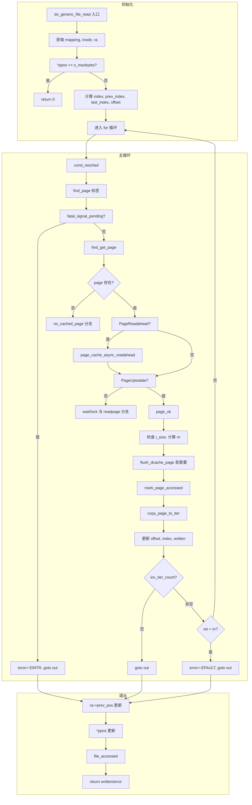

##  0x00    前言
先回顾一下，调用`read`系统调用之后，内核的调用路径是什么？


再回顾一下，前文介绍的`splice`实现零拷贝中的内核读操作，是怎么实现的？

本文主要梳理下基于page cache的内核read实现的若干细节，基于[v4.11.6](https://elixir.bootlin.com/linux/v4.11.6/source/include)的源码

##  0x01    generic_file_read_iter的实现细节
通常大部分文件系统的读取read实现，都是将`read_iter`置为`generic_file_read_iter`，如本文分析的ext4系统


预读函数栈分析的整体流程如上图，用户态程序执行`read`系统调用后进入到内核虚拟文件系统层`vfs_read`函数，然后逐层调用，`new_sync_read`函数中使用`struct kiocb`结构体封装了`struct file`结构体，并对当前读取文件的状态进行管理。`new_sync_read`函数创建`struct iov_iter`进行内核态与用户态之间数据的拷贝以及记录本次读取长度（`len`）。而后进入`generic_file_read_iter`函数进行了`direct_IO`的判断，即不通过页缓存读取文件数据。如果使用页缓存读取数据就进入了预读的主要处理函数`do_generic_file_read[generic_file_buffered_read]`。`generic_file_read_iter`的实现如下：

```cpp
//https://elixir.bootlin.com/linux/v4.11.6/source/mm/filemap.c#L2015
/**
 * generic_file_read_iter - generic filesystem read routine
 * @iocb:	kernel I/O control block
 * @iter:	destination for the data read
 *
 * This is the "read_iter()" routine for all filesystems
 * that can use the page cache directly.
 */
ssize_t
generic_file_read_iter(struct kiocb *iocb, struct iov_iter *iter)
{
	struct file *file = iocb->ki_filp;
	ssize_t retval = 0;
	size_t count = iov_iter_count(iter);

	if (!count)
		goto out; /* skip atime */

	if (iocb->ki_flags & IOCB_DIRECT) {
		//非page cache读
        ......
	}

    // buffered read
	retval = do_generic_file_read(file, &iocb->ki_pos, iter, retval);
out:
	return retval;
}
```

上面函数中`iov_iter_count`函数，就是**用户请求读取的字节数，也就是用户缓冲区的剩余容量**，回顾下前文的内容，`iov_iter`本质是一个迭代器，它的特点是：

1.	初始化时，`count`被设置为用户调用 `read(fd, buf, count)`时的 `count`参数
2.	随着数据拷贝（`page` copy到`iovec`），`count`逐渐减少（变化）
3.	当 `i->count`变为 `0` 时，表示用户缓冲区已满

```cpp
static inline size_t iov_iter_count(const struct iov_iter *i)
{
	return i->count;
}
```

继续分析`do_generic_file_read`的实现，`do_generic_file_read` 是内核处理缓冲 I/O（Buffered I/O）的核心函数，通过 Page Cache 机制读取文件数据。主要流程如下：

1.	计算页索引和偏移：将文件偏移转换为页号
2.	循环处理每一页：逐页从 Page Cache 读取
3.	页缓存命中/未命中处理
4.	数据拷贝到用户空间
5.	预读机制：优化顺序读取性能

在调用`do_generic_file_read`之前，主要注意`iov_iter`中保存了用户期望copy的长度以及分段`iovec`（缓冲区）

```cpp
//filp：要读取的文件对象
//ppos： 指向当前文件偏移量的指针
//iter：用户空间缓冲区的迭代器，支持分散/聚集 I/O
//written：已读取的字节数（用于部分读取的继续）
static ssize_t do_generic_file_read(struct file *filp, loff_t *ppos,
		struct iov_iter *iter, ssize_t written)
{
	struct address_space *mapping = filp->f_mapping;	// 文件的页缓存映射
	struct inode *inode = mapping->host;				// 文件的 inode（反向）
	struct file_ra_state *ra = &filp->f_ra;				// 预读状态
	pgoff_t index;			// 当前页索引
	pgoff_t last_index;		// 最后页索引
	pgoff_t prev_index;		
	unsigned long offset;    // 页内偏移  /* offset into pagecache page */	
	unsigned int prev_offset;
	int error = 0;

	if (unlikely(*ppos >= inode->i_sb->s_maxbytes))
		return 0;
	iov_iter_truncate(iter, inode->i_sb->s_maxbytes);

	// 重要：偏移量转换计算
	index = *ppos >> PAGE_SHIFT;		 // 计算当前页索引（注意：是当前文件对象）
	prev_index = ra->prev_pos >> PAGE_SHIFT;	
	prev_offset = ra->prev_pos & (PAGE_SIZE-1);
	last_index = (*ppos + iter->count + PAGE_SIZE-1) >> PAGE_SHIFT;	// 计算最后一页索引
	offset = *ppos & ~PAGE_MASK;		//计算页内偏移

	// 重要：page操作的核心循环流程
	for (;;) {	// 无限循环，处理多个页面
		struct page *page;
		pgoff_t end_index;
		loff_t isize;
		unsigned long nr, ret;

		// 条件调度：允许调度器中断
		cond_resched();
find_page:
		if (fatal_signal_pending(current)) {
			error = -EINTR;
			goto out;
		}

		// find_get_page：从页缓存查找
		// step1：查找页缓存
		page = find_get_page(mapping, index);
		if (!page) {
			// 页不在缓存（radix树）中，触发同步预读
			page_cache_sync_readahead(mapping,
					ra, filp,
					index, last_index - index);
			// 再次尝试查找
			page = find_get_page(mapping, index);
			if (unlikely(page == NULL))
				goto no_cached_page;	// 分配新页
		}

		// 重要：预读机制（step2）
		if (PageReadahead(page)) {
			// 异步预读：当读取到标记为预读的页面时触发
			page_cache_async_readahead(mapping,
					ra, filp, page,
					index, last_index - index);
		}

		//step3：页面状态检查
		if (!PageUptodate(page)) {	// 页面数据不是最新的
			/*
			 * See comment in do_read_cache_page on why
			 * wait_on_page_locked is used to avoid unnecessarily
			 * serialisations and why it's safe.
			 */
			error = wait_on_page_locked_killable(page);
			if (unlikely(error))
				goto readpage_error;
			if (PageUptodate(page))	// 等待后，页面已更新
				goto page_ok;

			// 检查是否为部分更新页（某些文件系统支持）
			if (inode->i_blkbits == PAGE_SHIFT ||
					!mapping->a_ops->is_partially_uptodate)
				goto page_not_up_to_date;
			/* pipes can't handle partially uptodate pages */
			// 管道不支持部分更新页
			if (unlikely(iter->type & ITER_PIPE))
				goto page_not_up_to_date;
			// 检查部分更新的具体状态
			if (!trylock_page(page))
				goto page_not_up_to_date;
			/* Did it get truncated before we got the lock? */
			if (!page->mapping)	// 页面已被截断
				goto page_not_up_to_date_locked;
			if (!mapping->a_ops->is_partially_uptodate(page,
							offset, iter->count))
				goto page_not_up_to_date_locked;
			unlock_page(page);
		}

		//step5：重要，page已经准备好，数据拷贝到用户空间
page_ok:
		/*
		 * i_size must be checked after we know the page is Uptodate.
		 *
		 * Checking i_size after the check allows us to calculate
		 * the correct value for "nr", which means the zero-filled
		 * part of the page is not copied back to userspace (unless
		 * another truncate extends the file - this is desired though).
		 */

		//检查文件大小边界
		isize = i_size_read(inode);
		end_index = (isize - 1) >> PAGE_SHIFT;
		if (unlikely(!isize || index > end_index)) {
			put_page(page);
			goto out;	// 已经读到文件末尾
		}

		/* nr is the maximum number of bytes to copy from this page */
		// 计算本页可拷贝的字节数
		nr = PAGE_SIZE;
		if (index == end_index) {	// 最后一页
			nr = ((isize - 1) & ~PAGE_MASK) + 1;	 // 计算文件在最后一页的字节数
			if (nr <= offset) {	// 偏移已超过文件末尾
				put_page(page);
				goto out;
			}
		}
		nr = nr - offset;	// 减去页内偏移

		/* If users can be writing to this page using arbitrary
		 * virtual addresses, take care about potential aliasing
		 * before reading the page on the kernel side.
		 */
		// 处理缓存一致性（写时拷贝等情况）
		if (mapping_writably_mapped(mapping))
			flush_dcache_page(page);

		/*
		 * When a sequential read accesses a page several times,
		 * only mark it as accessed the first time.
		 */
		// 标记页面访问（用于页面回收算法）
		if (prev_index != index || offset != prev_offset)
			mark_page_accessed(page);
		prev_index = index;

		/*
		 * Ok, we have the page, and it's up-to-date, so
		 * now we can copy it to user space...
		 */

		// copy_page_to_iter：拷贝数据到用户空间
		//负责从内核页拷贝数据到用户空间缓冲区，处理页边界、部分拷贝等情况，返回实际拷贝的字节数
		ret = copy_page_to_iter(page, offset, nr, iter);
		//offset：页面内的字节偏移
		//index：当前处理的页面索引
		//prev_offset：上一次访问的偏移（用于顺序性检测）
		//written：总共已读取的字节数
		offset += ret;
		index += offset >> PAGE_SHIFT;
		offset &= ~PAGE_MASK;
		prev_offset = offset;

		put_page(page);
		written += ret;
		if (!iov_iter_count(iter))
			goto out;
		if (ret < nr) {
			error = -EFAULT;
			goto out;
		}

		//继续下一页处理
		continue;

		//step4：从磁盘读取页面的过程
page_not_up_to_date:
		/* Get exclusive access to the page ... */
		error = lock_page_killable(page);
		if (unlikely(error))
			goto readpage_error;

page_not_up_to_date_locked:
		/* Did it get truncated before we got the lock? */
		if (!page->mapping) {	// 页面已被截断
			unlock_page(page);
			put_page(page);
			continue;	// 重新开始
		}

		/* Did somebody else fill it already? */
		if (PageUptodate(page)) {	 // 其他进程已更新页面
			unlock_page(page);
			goto page_ok;
		}

readpage:
		/*
		 * A previous I/O error may have been due to temporary
		 * failures, eg. multipath errors.
		 * PG_error will be set again if readpage fails.
		 */
		ClearPageError(page);	// 清除之前的错误
		/* Start the actual read. The read will unlock the page. */

		//重要：调用文件系统的 readpage 方法（实际磁盘读取）
		//比如对于ext4系统：调用 ext4_readpage
		//此调用会提交 BIO 请求到底层块设备
		//https://elixir.bootlin.com/linux/v4.11.6/source/fs/ext4/inode.c#L3224
		error = mapping->a_ops->readpage(filp, page);

		if (unlikely(error)) {
			if (error == AOP_TRUNCATED_PAGE) {
				put_page(page);
				error = 0;
				goto find_page;
			}
			goto readpage_error;
		}

		if (!PageUptodate(page)) {
			error = lock_page_killable(page);
			if (unlikely(error))
				goto readpage_error;
			if (!PageUptodate(page)) {
				if (page->mapping == NULL) {
					/*
					 * invalidate_mapping_pages got it
					 */
					unlock_page(page);
					put_page(page);
					goto find_page;
				}
				unlock_page(page);
				shrink_readahead_size_eio(filp, ra);
				error = -EIO;
				goto readpage_error;
			}
			unlock_page(page);
		}

		goto page_ok;

		//step7：错误处理
readpage_error:
		/* UHHUH! A synchronous read error occurred. Report it */
		put_page(page);
		goto out;


		//step 6：页面分配（缓存未命中）
no_cached_page:
		/*
		 * Ok, it wasn't cached, so we need to create a new
		 * page..
		 */
		// 分配cold页面，cold页面更适合一次性的读取操作，同时加入到页面缓存和 LRU 列表
		page = page_cache_alloc_cold(mapping);	
		if (!page) {
			error = -ENOMEM;
			goto out;
		}
		error = add_to_page_cache_lru(page, mapping, index,
				mapping_gfp_constraint(mapping, GFP_KERNEL));
		if (error) {
			put_page(page);
			if (error == -EEXIST) {	 // 其他进程已添加
				error = 0;
				goto find_page;
			}
			goto out;
		}
		goto readpage;	// 读取新分配的页面
	}

	//step8：完成
out:	
	ra->prev_pos = prev_index;
	ra->prev_pos <<= PAGE_SHIFT;
	ra->prev_pos |= prev_offset;

	//*ppos：即file->f_pos更新
	*ppos = ((loff_t)index << PAGE_SHIFT) + offset;
	file_accessed(filp);	 // 更新文件访问时间
	return written ? written : error;
}
```

核心流程图如下：



####	offset的意义
关于参数`pgoff_t offset`，`offset`是页索引（page index），表示文件被划分为页面大小的块后，从`0`开始计数的页面序号，来自文件偏移量。如在文件读取/写入操作中，`offset`从用户的文件偏移量计算而来（注意`offset`	代表页面个数，非字节）

```cpp
// 用户系统调用：read(fd, buf, count)
// 内核处理时：
loff_t pos = file->f_pos;  // 当前文件偏移（字节）
pgoff_t index = pos >> PAGE_SHIFT;  // 转换为页索引
unsigned int page_offset = pos & ~PAGE_MASK;  // 页内偏移

//对于类型pgoff_t

// offset 是 pgoff_t 类型，通常定义为 unsigned long
typedef unsigned long pgoff_t;

// 对于大于 4GB 的文件：
loff_t file_size = 10LL * 1024 * 1024 * 1024;  // 10GB
pgoff_t max_index = file_size >> PAGE_SHIFT;    // 2621440 个页面

// 在32位系统上：
// pgoff_t 是 32 位
// 最大文件大小 = 2^32 * 4096 = 16TB（实际上受文件系统和其他限制）
```

此外，在回顾一下，在IDR树中，key就是`offset`（页索引），而value 就是`struct page*`即页面指针

####	page_ok标签
`page_ok`标签处表示当前页面已准备就绪，可以进行用户空间拷贝。这个标签处理单个页面的读取完成，包括：

1.	检查文件边界
2.	计算可拷贝字节数
3.	处理缓存一致性
4.	执行实际拷贝
5.	更新状态并决定是否继续（检查退出状态）

```cpp
static ssize_t do_generic_file_read(struct file *filp, loff_t *ppos,
		struct iov_iter *iter, ssize_t written){
	......
page_ok:
		//检查文件大小边界
		isize = i_size_read(inode);
		end_index = (isize - 1) >> PAGE_SHIFT;
		if (unlikely(!isize || index > end_index)) {
			put_page(page);
			goto out;	// 已经读到文件末尾
		}

		/* nr is the maximum number of bytes to copy from this page */
		// 计算本页可拷贝的字节数
		nr = PAGE_SIZE;
		if (index == end_index) {	// 最后一页
			nr = ((isize - 1) & ~PAGE_MASK) + 1;	 // 计算文件在最后一页的字节数
			if (nr <= offset) {	// 偏移已超过文件末尾
				put_page(page);
				goto out;
			}
		}
		nr = nr - offset;	// 减去页内偏移

		// 处理缓存一致性（写时拷贝等情况）
		if (mapping_writably_mapped(mapping))
			flush_dcache_page(page);

		/*
		 * When a sequential read accesses a page several times,
		 * only mark it as accessed the first time.
		 */
		// 标记页面访问（用于页面回收算法）
		// 这里是执行page的顺序访问检测，只有第一次访问时才标记页面为"已访问"，这里影响页面回收算法的决策
		if (prev_index != index || offset != prev_offset)
			mark_page_accessed(page);
		prev_index = index;

		/*
		 * Ok, we have the page, and it's up-to-date, so
		 * now we can copy it to user space...
		 */

		// copy_page_to_iter：拷贝数据到用户空间
		//负责从内核页拷贝数据到用户空间缓冲区，处理页边界、部分拷贝等情况，返回实际拷贝的字节数
		ret = copy_page_to_iter(page, offset, nr, iter);
		offset += ret;					// 更新页内偏移
		index += offset >> PAGE_SHIFT;	// 如果offset跨页，index增加（下一次需要访问后面的page了）
		offset &= ~PAGE_MASK;			// 将offset限制在当前页内
		prev_offset = offset;			// 记录偏移用于下次访问检测

		put_page(page);	// 在每次循环结束时释放页面引用
		/*
		引用计数管理机制， 确保页面在使用期间不会被回收
		1、find_get_page()增加引用计数
		2、使用完毕后必须 put_page()
		*/
		written += ret;	// 累计已读取字节数
		if (!iov_iter_count(iter))	// 用户缓冲区用完了，退出
			goto out;
		if (ret < nr) {		// 拷贝失败，退出
			error = -EFAULT;
			goto out;
		}

		// 继续下一个循环，处理下一个页面
		continue;
	......
}
```

**细节一：如何检测copy完成（退出）**

从上面代码分析可知在`copy_page_to_iter`执行完对本page的copy动作完成之后，会依次检查这些（退出）条件是否满足：

-	通常情况下，用户缓冲区的size等于本次要copy的文件page的总字节大小，但实际跨越的page页数，需要由offset来决定，可能跨越多页
-	copy大文件的场景，本次copy未到达文件的尾部，用户缓冲区已经耗尽
-	copy小文件的场景，本次copy到达了文件尾部（到达了文件最后一页，但未占满最后一页），用户缓冲区还有剩余空间

1、检查用户缓冲区是否已满，代码片段：

```cpp
if (!iov_iter_count(iter))  // 用户缓冲区已空
    goto out;               // 退出循环，返回
```

2、检查`copy_page_to_iter`（参数`nr`为希望copy的字节数、返回值为实际copy的字节数）是否拷贝失败，代码片段：

```cpp
if (ret < nr) {             // 实际拷贝字节数小于预期拷贝字节数
    error = -EFAULT;        // 设置错误
    goto out;               // 退出循环
}
```

**细节二：对边界条件处理细节**，如下描述

1、在copy前发现已经到达了文件的末尾，如下：

```cpp
isize = i_size_read(inode);
end_index = (isize - 1) >> PAGE_SHIFT;

if (unlikely(!isize || index > end_index)) {
    put_page(page);
    goto out;  // 说明到达了文件末尾
}
```

2、对最后一页的特殊处理，片段如下：

```cpp
nr = PAGE_SIZE;
if (index == end_index) {	 // 当前页面是最后一页
	nr = ((isize - 1) & ~PAGE_MASK) + 1;	 
	if (nr <= offset) {	// 如果要读取的偏移已超过有效数据，说明已经读取完成了，可以退出
		put_page(page);
		goto out;
	}
}
```

####	如何计算本次处理的页面数目
注意到`do_generic_file_read`中，使用到了`for(;;)`，那么这个循环的退出条件是什么？或者说本次`do_generic_file_read`处理（读取）了多少页是如何计算出来的？考虑下面几个关键因子：

```cpp
//参数ppos：对应要读取的文件偏移（指向当前文件偏移量的指针）

//用户请求的数据量
// 原始请求来自用户空间的 read() 调用
// 在 __vfs_read -> generic_file_read_iter -> do_generic_file_read
size_t count = iov_iter_count(iter);  // 用户请求的字节数

//	实际读取边界计算
//  计算要读取的页面范围
index = *ppos >> PAGE_SHIFT;                      // 起始页索引
offset = *ppos & ~PAGE_MASK;                      // 页内偏移
last_index = (*ppos + iter->count/*待读的总数*/ + PAGE_SIZE-1) >> PAGE_SHIFT;  // 最后一页索引
```

上面的片段中，使用了 `iter->count`（用户请求的字节数）来计算需要读取的页面范围，但这个计算只是估算，不是限制。此外，对于系统调用`read`而言，参数`ppos`来自于`struct file`结构体中的`f_pos`字段：

```cpp
SYSCALL_DEFINE3(read, unsigned int, fd, char __user *, buf, size_t, count)
{
	struct fd f = fdget_pos(fd);
	ssize_t ret = -EBADF;

	if (f.file) {
		// 获取文件偏移
		loff_t pos = file_pos_read(f.file);
		ret = vfs_read(f.file, buf, count, &pos);
		if (ret >= 0)
			file_pos_write(f.file, pos);
		fdput_pos(f);
	}
	return ret;
}

//获取file结构的f_pos成员
static inline loff_t file_pos_read(struct file *file)
{
	return file->f_pos;
}
```

所以，这里了解到如下几个关键信息：
-	（要读取）文件page的起始页面位置
-	起始页面从哪个offset开始读
-	最后一页的位置`last_index`
-	估算的读取页数（`[last_index,index]`）

实际读取中，还需要考虑当前文件的大小（即当前读指针指向的page内容实质已经不满一页），关联如下代码：

```cpp
......
static ssize_t do_generic_file_read(struct file *filp, loff_t *ppos,
		struct iov_iter *iter, ssize_t written)
{
	// 在 page_ok 标签处：
	// 1. 根据文件大小计算当前页可用的字节数 (nr)
	if (index == end_index) {
		nr = ((isize - 1) & ~PAGE_MASK) + 1;  // 最后一页的有效字节
		if (nr <= offset) {
			put_page(page);
			goto out;  // 文件结束
		}
	}
	nr = nr - offset;  // 页内从 offset 开始的有效字节

	// 2. copy_page_to_iter 会读取 min(nr, iov_iter_count(iter))
	// 即会取 nr和 iov_iter_count(iter)的较小值进行拷贝
	ret = copy_page_to_iter(page, offset, nr, iter);

	......

}
```

当然针对读大文件的场景，最普遍的情况还是一直copy pages到用户缓冲区已经耗尽

此外，这里内核使用`for(;;)`，主要考虑到一个 `read` 系统调用可能跨越多个page内存页面（处理跨页读取），其中每个page都需要完成下面的操作：

1.	单独查找/分配
2.	单独从磁盘读取（如果不在page cache中）
3.	单独拷贝到用户空间

```cpp
static ssize_t do_generic_file_read(struct file *filp, loff_t *ppos,
		struct iov_iter *iter, ssize_t written)
{
	......
	for (;;) {
		......
		cond_resched();	// 允许调度器中断（防止无限循环）
	find_page:	//提供直接跳转的标签
		......
		// 处理某一页（page）
		copy_page_to_iter(......)
		// 在 page_ok 标签后：
		if (!iov_iter_count(iter))  // 用户缓冲区已满
			goto out;
		if (ret < nr) {  // copy_page_to_iter 拷贝不完整
			error = -EFAULT;
			goto out;
		}
		continue;  // 继续处理下一页
	}
	......
}
```

几个问题：

1、TODO

接下来继续跟踪`do_generic_file_read`的实现拆解分析，首先看下对单个页page的处理逻辑

##	0x02	do_generic_file_read：计算页索引和偏移
本节主要分析下`find_get_page`的实现过程，注意到其入参`pgoff_t offset`，来源于`index = *ppos >> PAGE_SHIFT`， 即page在文件中的索引index，这让人很容易联想到内核IDR结构的key

```cpp
//https://elixir.bootlin.com/linux/v4.11.6/source/include/linux/pagemap.h#L245
static inline struct page *find_get_page(struct address_space *mapping,
					pgoff_t offset)
{	
	//用于从页缓存中获取页面，支持多种获取模式
	return pagecache_get_page(mapping, offset, 0, 0);
}

//https://elixir.bootlin.com/linux/v4.11.6/source/mm/filemap.c#L1269
//mapping：	页缓存所属的地址空间（文件映射）
//offset：	页面在文件中的页索引
//fgp_flags：获取页面的标志位，控制函数行为
//gfp_mask：内存分配的 GFP 标志
struct page *pagecache_get_page(struct address_space *mapping, pgoff_t offset,
	int fgp_flags, gfp_t gfp_mask)
{
	struct page *page;

repeat:
	page = find_get_entry(mapping, offset);
	if (radix_tree_exceptional_entry(page))
		page = NULL;
	if (!page)
		goto no_page;

	if (fgp_flags & FGP_LOCK) {
		if (fgp_flags & FGP_NOWAIT) {
			if (!trylock_page(page)) {
				put_page(page);
				return NULL;
			}
		} else {
			lock_page(page);
		}

		/* Has the page been truncated? */
		if (unlikely(page->mapping != mapping)) {
			unlock_page(page);
			put_page(page);
			goto repeat;
		}
		VM_BUG_ON_PAGE(page->index != offset, page);
	}

	if (page && (fgp_flags & FGP_ACCESSED)){
		//标记页面访问
		//将页面标记为活跃，避免被快速回收，同时更新页面在 LRU 链表中的位置
		mark_page_accessed(page);
	}

	// 未在radix树中查找到相关的文件页，需要新建
no_page:
	if (!page && (fgp_flags & FGP_CREAT)) {
		......

		// 分配页面
		page = __page_cache_alloc(gfp_mask);
		if (!page)
			return NULL;

		if (WARN_ON_ONCE(!(fgp_flags & FGP_LOCK)))
			fgp_flags |= FGP_LOCK;

		/* Init accessed so avoid atomic mark_page_accessed later */
		if (fgp_flags & FGP_ACCESSED)
			__SetPageReferenced(page);
		// 重要：添加到page cache和全局LRU链表
		// 将这个新申请的page根据index插入到普通文件的address_space对应的radix树中
		err = add_to_page_cache_lru(page, mapping, offset,
				gfp_mask & GFP_RECLAIM_MASK);
		if (unlikely(err)) {
			put_page(page);
			page = NULL;
			if (err == -EEXIST)	// 竞争条件：其他线程已添加
				goto repeat;
		}
	}

	return page;
}
```

`find_get_entry`函数用于从页缓存中查找页面，它无锁查找页缓存，并使用 RCU 机制确保并发安全，这里会调用`radix_tree_lookup_slot`在文件的IDR树中进行查找

```cpp
//https://elixir.bootlin.com/linux/v4.11.6/source/mm/filemap.c#L1169
//mapping：文件的页缓存地址空间
//offset：页面在文件中的索引
struct page *find_get_entry(struct address_space *mapping, pgoff_t offset)
{
	void **pagep;
	struct page *head, *page;

	rcu_read_lock();
repeat:
	page = NULL;
	/*
	radix_tree_lookup_slot：返回指向存储页面指针的槽位的指针，槽位存储的是 void *，可能是 struct page *；如果没有对应的条目，返回 NULL
	*/
	pagep = radix_tree_lookup_slot(&mapping->page_tree, offset);
	if (pagep) {
		page = radix_tree_deref_slot(pagep);
		if (unlikely(!page))
			goto out;
		if (radix_tree_exception(page)) {
			if (radix_tree_deref_retry(page))
				goto repeat;
			/*
			 * A shadow entry of a recently evicted page,
			 * or a swap entry from shmem/tmpfs.  Return
			 * it without attempting to raise page count.
			 */
			goto out;
		}

		head = compound_head(page);
		if (!page_cache_get_speculative(head))
			goto repeat;

		/* The page was split under us? */
		if (compound_head(page) != head) {
			put_page(head);
			goto repeat;
		}

		/*
		 * Has the page moved?
		 * This is part of the lockless pagecache protocol. See
		 * include/linux/pagemap.h for details.
		 */
		if (unlikely(page != *pagep)) {
			put_page(head);
			goto repeat;
		}
	}
out:
	rcu_read_unlock();

	return page;
}
```

`add_to_page_cache_lru`函数

```cpp
int add_to_page_cache_lru(struct page *page, struct address_space *mapping,
				pgoff_t offset, gfp_t gfp_mask)
{
	void *shadow = NULL;
	int ret;

	__SetPageLocked(page);
	// __add_to_page_cache_locked：像page cache增加radix节点（page）
	ret = __add_to_page_cache_locked(page, mapping, offset,
					 gfp_mask, &shadow);
	if (unlikely(ret))
		__ClearPageLocked(page);
	else {
		if (!(gfp_mask & __GFP_WRITE) &&
		    shadow && workingset_refault(shadow)) {
			SetPageActive(page);
			workingset_activation(page);
		} else
			ClearPageActive(page);

		// 向全局的page链表中增加节点
		lru_cache_add(page);
	}
	return ret;
}
```

所以，这里有个细节是，虽然每个文件（inode）对应的`address_space`有自己的私有radix树，但所有的页面page都会链接到全局的LRU链表中，使得内核可以进行全局回收

##	0x03	循环处理每一页

####	流程图

```mermind
TODO
```

####	循环的过程：几个位置相关变量的变化
由于内核中文件数据被切分为大小相等的页（通常是 4KB），且Page Cache 是以页为管理单位的radix树，在循环中，有下面几个非常重要的遍历变量：

```cpp
TODO
```

-	`index`：当前读取位置所属的页面索引（第几页），继承于`*ppos >> PAGE_SHIFT`，内核必须先算出 `index`，才能通过 `find_get_page(mapping, index)` 去内存radix树里找对应的物理页面
-	`offset`：当前读取位置在页面内的偏移量（`0~4095`），继承于`*ppos & (PAGE_SIZE - 1)`，当定位到page时（找到页面后），再利用 `offset` 告诉 `copy_page_to_iter` 从页面的哪个位置开始把数据搬运给用户
-	`last_index`：本次读取任务结束位置所属的页面索引，继承于`(*ppos + count) >> PAGE_SHIFT`
-	`prev_index`：上一次成功读取后的页面索引（用于预读判断）。从 `f_ra->prev_pos` 恢复
-	`prev_offset`：上一次成功读取后的页内偏移量（用于预读判断）。从 `f_ra->prev_pos` 恢复
-	`last_index - index`：剩余需要读取的页面数量（对应于`page_cache_sync_readahead`函数的入参`req_size`）。用于指导预读readahead算法的步长

上面的`index`与`offset`的初始值又来自于file对象的`f_pos`成员（代码中的 `*ppos`）进行单位换算后的结果。前文描述过`f_pos` 是一个绝对字节偏移量，而内核为了在页面缓存（Page Cache）中定位数据，必须把它拆解成页面编号和页内偏移

读取是一个`for (;;)`，每处理完一个 page，这些变量会按以下逻辑更新：

```cpp
//1、初始化值（初始状态，循环开始前）	
index = *ppos >> PAGE_SHIFT;	//index 指向读取起始点所在的页
offset = *ppos & ~PAGE_MASK;	//offset 是起始点在该页内的起始位置
last_index = (*ppos + iter->count + PAGE_SIZE-1) >> PAGE_SHIFT;		//last_index 确定了循环何时可能结束

	//2、循环体内的变化
	//在for循环处理每page中，循环中的同步变化，index/offset都会更新
	for (;;) {
		struct page *page;
		pgoff_t end_index;
		loff_t isize;
		unsigned long nr, ret;

		......
	//last_index - index 的意义,这个差值被传递给预读函数
	//它代表了流水线窗口的大小
	//如果 last_index - index 很大，说明用户正准备进行一次大规模的顺序读取，内核会据此触发更大规模的预读（Readahead），提前把磁盘后面的数据页加载进内存
	page = find_get_page(mapping, index);
		if (!page) {
			page_cache_sync_readahead(mapping,
					ra, filp,
					index, last_index - index);
			page = find_get_page(mapping, index);
			if (unlikely(page == NULL))
				goto no_cached_page;
		}
		if (PageReadahead(page)) {
			page_cache_async_readahead(mapping,
					ra, filp, page,
					index, last_index - index);
		}
	

page_ok:
		......
		/* nr is the maximum number of bytes to copy from this page */
		//确定拷贝长度 (nr)，通常 nr = PAGE_SIZE
		nr = PAGE_SIZE;

		// 如果当前 index == last_index（读到了最后一页）
		// 则 nr 会被修正为文件末尾或请求末尾的边界
		if (index == end_index) {
			nr = ((isize - 1) & ~PAGE_MASK) + 1;
			if (nr <= offset) {
				put_page(page);
				goto out;
			}
		}
		//减去起始的 offset 后，剩下的 nr 就是本页要拷贝给用户的字节数
		nr = nr - offset;

		prev_index = index;

		//更新位置 (关键步骤)： 当 copy_page_to_iter 成功拷贝了 ret 字节后
		ret = copy_page_to_iter(page, offset, nr, iter);

		//每当成功拷贝完一个页面的一部分数据（ret 字节）后
		//保证了每一次for循环开始时，index 都会准确指向当前处理的那个 struct page
		offset += ret;                      // 页内偏移增加

		//如果 offset 达到了 PAGE_SIZE，index 会自增
		index += offset >> PAGE_SHIFT;      // 如果 offset 溢出到 4096，index 自动加 1

		// offset 重新回到 0 (如果跨页)
		// 如果是页内读取：offset 增加，index 保持不变
		// 如果是跨页读取：当 offset 累加超过 4096 时，index 增加 1，offset 变为 0（或新页的起始偏移）
		offset &= ~PAGE_MASK;               // offset 重新归零或保留余数

		//更新上一次记录 (prev_index / prev_offset)
		//prev_index、prev_offset这两个变量在循环末尾更新，并最终写回 filp->f_ra->prev_pos
		// 这告诉内核下一次读操作是从哪开始的，是顺序读还是随机读
		prev_offset = offset;
		......
		// 累加
		written += ret;
```

####	f_pos 的维护机制
当调用用户态的 `read(fd, buf, count)` 时，内核最终会进入 `vfs_read` 的函数，进而调用 `do_generic_file_read`

-	读取前：内核从 `file->f_pos` 中取出进程`task_struct`对于当前打开文件偏移量，并将其地址作为 `ppos` 参数传递
-	读取中：`do_generic_file_read` 使用 `*ppos` 来计算具体的 `index` 和 `offset`
-	读取后：在`out`标签处`*ppos = ((loff_t)index << PAGE_SHIFT) + offset`，会更新`f_pos`的值，将计算出的新位置写回了 `ppos`。下一次 `read` 调用时，起点就是上一次读取结束的位置

##	0x0	页缓存命中/未命中处理

##	0x0	预读机制

####	page：单个页的状态
在内核 `do_generic_file_read` 路径中，根据页面在 Page Cache 中的存在（与否）状态、数据的一致性（Uptodate）以及预读标记（Readahead），主要有以下几种类型：

1、缺失页：在上述流程`find_get_page`中，在 Radix 树中未找到对应 `index` 的slot，内核判定为缓存未命中（Cache Miss），此时处理过程如下：

-	内核会触发同步预读机制（`page_cache_sync_readahead`），内核认为这是首次读取（或随机跳读），尝试批量从磁盘加载数据
-	再次查找：预读后再次查找Radix树，若仍缺失（如内存极度紧张导致刚加入就被回收），则进入 `no_cached_page` 逻辑
-	手动补齐：调用 `page_cache_alloc_cold` 分配物理页，将其加入 Radix 树，并启动文件系统的`a_ops->readpage` 异步 I/O

2、预读触发页（Readahead Page）：页面已在缓存中且有效，但被标记了 `PG_readahead` 位。这里内核判定进程已读到之前预读窗口的阈值点。处理办法如下：

-	触发异步预读：调用 `page_cache_async_readahead`，内核会立即在后台启动对下一组连续页面的读取请求
-	非阻塞继续：进程不会因为这个标记而停止，它会清除该页面的标记，然后直接进入数据拷贝流程

内核如此实现的目的是维持 I/O 流水线，确保用户读到后面页面时，数据已经提前就绪

3、未就绪页（Not-Uptodate Page）：当页面在 Radix 树中存在，但 `PG_uptodate` 位为 `0`。该状态表示页面已被创建，但磁盘数据尚未完全搬运到内存（可能由于之前的预读还在进行中，或者读取出错了等原因），处理办法如下：

-	同步等待：调用 `lock_page_killable` 或 `wait_on_page_locked_killable`
-	阻塞进程：进程进入睡眠状态，等待磁盘 DMA 完成并触发中断
-	错误恢复：如果锁释放后发现仍非 `Uptodate`，则说明之前的读取失败，会尝试重新发起 `readpage`

4、理想页（Uptodate Page）：页面在缓存中，且 `PG_uptodate`被置位，且没有 `PG_readahead` 标记。该页为最理想的状态，处理如下：

-	直接访问：跳过所有预读和等待逻辑，直接跳转到 `page_ok` 标签
-	数据可交付：执行 `copy_page_to_iter`，将数据由内核copy到用户态

5、截断/无效页（Truncated Page）：查找到了页面，但在处理过程中，该页面被另一个进程从文件的 `address_space` 中移除了（例如文件被截断 `truncate`），即`page->mapping` 为空。内核处理办法如下：

-	释放并重试：执行`put_page(page)` 减少引用
-	跳转 `find_page`：返回循环起点重新查找。若文件变小了，后续流程会通过 `i_size_read` 判定并直接退出

####	进入预读的条件
从`do_generic_file_read`的实现可知，进入预读的条件有两种：

```cpp
static ssize_t do_generic_file_read(struct file *filp, loff_t *ppos,struct iov_iter *iter, ssize_t written){
	......
	for (;;) {	// 无限循环，处理多个页面
		page = find_get_page(mapping, index);
		if (!page) {
			if (iocb->ki_flags & IOCB_NOWAIT)
					goto would_block;
			page_cache_sync_readahead(mapping, //case1
							ra, filp,
							index, last_index - index);
			page = find_get_page(mapping, index);	//重新查找
			if (unlikely(page == NULL))
					goto no_cached_page;
		}
		if (PageReadahead(page)) {
			page_cache_async_readahead(mapping, //case2
							ra, filp, page,
							index, last_index - index);
		}
		.......
	}
	......
}
```

1.  radix tree 中没有找到页缓存，触发同步预读
2.	找到页缓存且该页面标记上 `PG_Readahead`，触发异步预读

在整个预读算法中，`file_ra_state`记录了当前预读状态

####	数据结构 file_ra_state（预读窗口）
预读状态结构体`file_ra_state`（预读窗口）定义如下。内核通过该窗口在当前文件读取流中不断后移，实现对文件页（page）的预读


预读（Readahead）算法的核心目标是通过识别用户的读取行为（顺序OR随机），动态调整提前加载到内存中的页面数量，这个提前加载的数量就是预读窗口（Readahead Window）

```cpp
//https://elixir.bootlin.com/linux/v4.11.6/source/include/linux/fs.h#L815
struct file_ra_state {
    pgoff_t start;                  // 预读窗口起始页，当前窗口的第一个page索引，初始0
    unsigned int size;               // 当前预读窗口大小（页面数），当前窗口的页面数量，值为-1表示预读临时关闭，0表示当前窗口为空，初始0
    unsigned int async_size;         // 异步预读大小，异步预读页面数量，预读窗口还剩余多少未被访问页面时启动下一次预读，初始0
    unsigned int ra_pages;           // 最大预读页面数，预读窗口最大页面数量。0表示预读暂时关闭，初始32
    unsigned int mmap_miss;          // mmap 缓存未命中，预读命中率。初始0
    loff_t prev_pos;                 // 上次读取位置， Cache中最近一次读位置。初始-1
};

static inline int ra_has_index(struct file_ra_state *ra, pgoff_t index)
{
	return (index >= ra->start &&
		index <  ra->start + ra->size);
}

static unsigned long get_init_ra_size(unsigned long size, unsigned long max)
{
	unsigned long newsize = roundup_pow_of_two(size);

	if (newsize <= max / 32)
		newsize = newsize * 4;
	else if (newsize <= max / 4)
		newsize = newsize * 2;
	else
		newsize = max;

	return newsize;
}

static unsigned long get_next_ra_size(struct file_ra_state *ra,
						unsigned long max)
{
	unsigned long cur = ra->size;
	unsigned long newsize;

	if (cur < max / 16)
		newsize = 4 * cur;
	else
		newsize = 2 * cur;

	return min(newsize, max);
}
```

`file_ra_state`结构体维护了readahead 状态信息，相关成员为 `start/size/async_size`，它们通过`O(1)`空间来维护 `ahead` 窗口

-	`start` 和 `size` 二元组构成预读窗口，记录最近一次预读请求的位置 `start` 和连续大小 `size`
-	`async_size` 为预读提前量，表示还剩余 `async_size` 个未访问页时启动下一次预读

需要注意的是，**页索引（`page_index`）为`(size-async_size)`的页会被标示为`PG_readahead`，即表示用户态程序读到该页时需要进行下一次预读，因此`async_size`的大小决定了当前窗口进行下一次预读并后移的时机**，同时`PG_readahead`只会在某个page（单页）被标记

```TEXT
/*
 * The fields in struct file_ra_state represent the most-recently-executed
 * readahead attempt:
 *
 *                        |<----- async_size ---------|
 *     |------------------- size -------------------->|
 *     |==================#===========================|
 *     ^start             ^page marked with PG_readahead
 */
```

简单描述一次完全顺序执行读请求的预读过程

-	`|`、`=` 为单个page
-	`#` ：被标记为 `PG_readahead` 的页
-	`^`： `ra->start`
-	`~`： `offset` 当前访问到的值
-	`x`：文件中待读取的剩余页
-	`$`：文件页末尾（``）

1、初始状态 (Initial)

文件刚打开，预读状态处于冷启动前的初始值。当对一个没有访问过的文件/页进行顺序读时，从 `offset = 0,request_size = 1`（页为单位）开始，会触发同步预读

```
|
~
```

由于没有访问过，`file_ra_state`中的四元组信息如下：

```cpp
.start = 0
.size = 0
.async_size = 0
.prev_pos = -1
```

2、第一次 read (`0-4096` 字节)，内核发现 Page `0` 缺失，触发同步预读（`ondemand_readahead`），预读流程会根据 `prev_pos` 构造出预读窗口，求出 `size` 和 `async_size`，并且在 `offset = #` 打上 `PG_readahead` 标记。其中 `#` 直到右边 `|` 为 `async_size` 范围，共预读入 `size` 大小的页

```
|===#======|xxxxxxxxxxxxxx$
^
~
```

3、假设下一次顺序读的起始页（`offset`）在 `^` 后和 `#` 前，则不触发预读，由于数据已经被读取到page cache，所以直接返回

```
|===#======|xxxxxxxxx$
^  ~
```

4、继续顺序读至 `offset = #`，则会发出下一次的异步预读

```
|==========|#======================|xxxxxxxxx$
    ~       ^
```

5、预读的过程（位置）会受到文件读取结束位置page的影响，相关[代码](https://elixir.bootlin.com/linux/v4.11.6/source/mm/readahead.c#L174)

####	readahead 状态
在`do_generic_file_read`函数中，针对内核设计的文件预读算法，主要是三种状态：

-	首次首部同步预读（第一次读取文件数据）
-	后续异步预读（后续读取，并且命中了预读标识`PG_readahead`）
-	后续缓存命中读取（缓存命中并且没有进行预读）

以下面的代码为例：

```cpp
int main()
{
    char c[4096];
    int in = -1;
    in = open("file.txt", O_RDONLY);
    int index=0;
	//通过用户态调用read系统调用，对文件进行每次4K（4096字节）大小的循环顺序读取
	//设置目标读取文件file.txt的大小为128K，预计全部读完需要循环读取32次
    while (read(in, &c, 4096/*缓冲区一次4k*/) == 4096)
    {
	    printf("index: %d,len: %ld.\n",index,strlen(c));
	    memset(c, 0, sizeof(c));
	     index++;
    } 
    close(in);
    return 0;
}
```

####	readahead阶段1：首次首部同步预读

第一次调用`read->new_sync_read`时，参数`len=4096`，继续执行到`do_generic_file_read`，该函数首先会获取当然读取文件的`struct file`，以及本次读取数据在文件内的偏移量`loff_t *ppos`，从`struct file`中获取初始预读窗口，初始值只有`ra_pages=32`（表示窗口最大为`32`个page），`prev_pos=-1`表示文件还没有读取过，初始值如下

```text
//struct file_ra_ state *ra = &filp->f_ra;
start=0
size=0
async_size=0
ra_pages=32
mmap_miss=0
prev_pos=-1        
```

接下来`do_generic_file_read`函数会计算文件内相关页索引以及偏移量，用于计算读取的次数，读取的位置进行读取状态、方式的判断。 页索引（`index`）初始值为`0`，表示文件中的第一页数据，核心代码如下：

```cpp
	//页索引
	index = *ppos >> PAGE_SHIFT;
	//上次页索引
	prev_index = ra->prev_pos >> PAGE_SHIFT;

	//上次页内偏移量
	prev_offset = ra->prev_pos & (PAGE_SIZE-1);

	//结束页下标，例如pos读到第1页的数据，则last_index=2
	last_index = (*ppos + iter->count + PAGE_SIZE-1) >> PAGE_SHIFT;
	//PAGE_MASK是12个0，本次页内偏移量
	offset = *ppos & ~PAGE_MASK;
```

接下来`do_generic_file_read`函数调用`find_get_page`，该函数会从该文件inode关联的地址空间（`address_space`）中尝试读取页索引（`index`）对应的页（page）。由于是首次读取，该文件的数据页并不会在PageCache中找到，因此会执行同步预读函数`page_cache_sync_readahead`，实现如下：

首先，判断预读窗口是否处于关闭状态以及检查是否为随机访问模式

```cpp
// 同步预读一些页面到内存中
// mapping：文件拥有者的addresss_space对象
// ra：包含此页面的文件file_ra_state描述符
// filp：文件对象
// offset：页面在文件内的偏量
// req_size：完成当前读操作需要的页面数
void page_cache_sync_readahead(struct address_space *mapping,
			       struct file_ra_state *ra, struct file *filp,
			       pgoff_t offset, unsigned long req_size)
{
	/* no read-ahead 预读窗口是否为关闭状态*/
	if (!ra->ra_pages)
		return;
	//当文件模式设置FMODE_RANDOM时，表示文件预期为随机访问
	if (filp && (filp->f_mode & FMODE_RANDOM)) {
		force_page_cache_readahead(mapping, filp, offset, req_size);
		return;
	}
	/* do read-ahead */
	ondemand_readahead(mapping, ra, filp, false, offset, req_size);
}
```

最后调用`ondemand_readahead`[函数](https://elixir.bootlin.com/linux/v4.11.6/source/mm/readahead.c#L376)，该函数的主要工作如下：

1、（首次进入）对同步预读窗口进行初始化，通过`get_init_ra_size`函数计算预读窗口长度（`ra->size`）

计算窗口长度的函数`get_init_ra_size`如下：

```cpp
static unsigned long get_init_ra_size(unsigned long size, unsigned long max){
    //size = reqsize = last_index-index;
	unsigned long newsize = roundup_pow_of_two(size);//四舍五入到最近的2次幂

	if (newsize <= max / 32)	//读的小 <1
		newsize = newsize * 4;	//预读四倍
	else if (newsize <= max / 4)	//读的中等1-8
		newsize = newsize * 2;	//预读2倍
	else	//>8
		newsize = max;
	return newsize;
}
```

此时，预读窗口的值更新为如下：

```text
start=0
size=4
async_size=3
ra_pages=32
mmap_miss=0
prev_pos=0   
```

2、（非首次进入）根据预读窗口的当前状态以及`offset`，调整预读窗口的值

3、当预读窗口取值确定以后，就该调用函数`__do_page_cache_readahead`进行页的分配与磁盘数据的读取


最后，分析下`__do_page_cache_readahead`的[实现](https://elixir.bootlin.com/linux/v4.11.6/source/mm/readahead.c#L150)

```cpp
int __do_page_cache_readahead(struct address_space *mapping, struct file *filp,
			pgoff_t offset, unsigned long nr_to_read,
			unsigned long lookahead_size)
{
	......
	LIST_HEAD(page_pool);// 将要读取的页存入到这个list当中
	......
	end_index = ((isize - 1) >> PAGE_SHIFT);

	/*
	 * Preallocate as many pages as we will need.
	 再次检查页面是否已经被其他进程读进内存，如果没有则申请页面。
	 nr_to_read是预读窗口的大小，ra->size
	 */
	for (page_idx = 0; page_idx < nr_to_read; page_idx++) {
		pgoff_t page_offset = offset + page_idx;// 计算得到page index

		if (page_offset > end_index)// 超过了文件的尺寸就break，停止读取
			break;

		rcu_read_lock();
		//查看是否在page cache，如果已经在了cache中，再判断是否为脏，要不要进行读取
		page = radix_tree_lookup(&mapping->page_tree, page_offset);
		rcu_read_unlock();
		if (page && !radix_tree_exceptional_entry(page))
			continue;
		// 如果不存在，则创建一个page cache结构
		page = __page_cache_alloc(gfp_mask);
		if (!page)
			break;
		// 设定page cache的index
		page->index = page_offset;

		// 加入到list当中
		list_add(&page->lru, &page_pool);
		//当分配到第nr_to_read ‐ lookahead_size个页面时，就设置该页面标志PG_readahead，以让下次进行异步预读
		if (page_idx == nr_to_read - lookahead_size)
			SetPageReadahead(page);
		ret++;
	}
	......

	if (ret)
		read_pages(mapping, filp, &page_pool, ret, gfp_mask);
	......
}
```

`__do_page_cache_readahead`的主要流程如下：

1、入参`nr_to_read`即为本次预读窗口的大小

2、然后循环执行`ra->size`次，即读取预读窗口中的每个page，调用`__page_cache_alloc`依次分配page，并保存在链表`page_pool`中，根据页索引（`page_idx = size-async_size`）的取值给预读的页设置`PageReadahead`标识，当用户态程序读到该标识页时进行下一次异步预读

```cpp
// 这里仅仅只会对唯一的单页进行设置
if (page_idx == nr_to_read - lookahead_size)
	SetPageReadahead(page);
```

3、最后调用`read_pages`（关联文件系统）进行磁盘读操作，完成后再次执行`find_get_page`，就能够从缓存中命中页面


上图展示了首次同步预读后的预读窗口情况，以及当前缓存中数据的状况，用户态当前正在读取的page index 为`0`，预读窗口`size`为`4`，预读`4`个页面到内存后，给页索引（`index=size-async_size`）为 `1`的页设置了预读标识（蓝色），该标识会在下一次用户态程序读到该page时触发异步预读

所以，再次说明了`PageReadahead`标识只是内核预读算法的一个记号

####	readahead阶段2：后续异步预读
当第一次用户态`read`操作读取完成后，用户态程序会进行第二次循环读取`read(in, &c, 4096)`，由于代码设置每次读取一页大小（`4k`），第二次`read`系统调用刚好读取`page_index = 1`的页，`do_generic_file_read`同样还是率先进行`find_get_page`，期望能够从page cache中获取到`index=1`的page


在上面阶段1读取进行同步预读，由于提前预读了下标为`0~3`的`4`个页面，本次可以在缓存中命中页面。命中缓存之后，会对当前page进行异步预读标识`PageReadahead`的判定，即查看当前读取的页面（本次`page_index=1`）是否被预读窗口标识了预读标识`PG_readahead`

```cpp
static ssize_t do_generic_file_read(struct file *filp, loff_t *ppos,struct iov_iter *iter, ssize_t written){
	......
	if (PageReadahead(page)) {
				//检测页标志是否设置了PG_readahead，启动异步预读
				page_cache_async_readahead(mapping,
						ra, filp, page,
						index, last_index - index);
	}
	......
}
```

在readahead阶段1同步完成之后，标识了页索引（`index`）为`1`的page为`PG_readahead`，所以本次读取会触发异步预读。触发异步预读之后，`page_cache_async_readahead`函数的主要工作流程：

1.	清除掉当前页面（page）的预读标志`PG_readahed`
2.	同样调用`ondemand_readahead`函数（和上面的同步预读相似），不同之处是在`ondemand_readahead`函数中会重新设置预读窗口长度（`ra->size`），通常会扩大为原来长度的`2/4`倍

此时预读窗口的值更新为：

```
start=4	//表示窗口往后推移了4个页面，将页索引为4的页面作为窗口开始
size=8	//表示窗口的长度扩大为原来的二倍，因为算法觉察到用户态程序是在顺序读取，加大预读的页数
async_size=8	//表示为当前窗口的第一个（index=0）页设置预读标识
ra_pages=32
mmap_miss=0
prev_pos=0
```

异步预读后的窗口和当前内存缓存页的情况如下图所示，本次预读了`index`为`4~11`共`8`个page，并给`index=4`的page设置了`PG_readahead`标识，当前用户态程序读取的`page_index=1`


####	readahead阶段3：后续缓存命中读取
至此已经完成两轮`read`系统调用，由于之前的两次预读，该文件的前`12`个page已经缓存在内存中（page cache），第三次`read`会直接命中缓存，并且该页未设置`PG_readahead`标识，也不会触发异步预读

此时，预读窗口的值更新为如下，本次读取完成后，可以看到预读窗口的大小没有发生变化，只更新了`prev_pos`，表示上次读文件的起始偏移位置

```text
start=4
size=8
async_size=8
ra_pages=32
mmap_miss=0
prev_pos=8192
```

当`find_get_page`函数命中缓存后，会执行`pageok`标签处的代码片段，然后调用`mark_page_accessed`函数，为page在其所属的LRU链表中提升等级。其中`inactive/unreferenced` 为最不活跃页面，`active/referenced`为最活跃页面

```text
inactive,unreferenced        ->      inactive,referenced
inactive,referenced          ->      active,unreferenced
active,unreferenced          ->      active,referenced
```


在这个阶段，读取`page_index=2,3`的页面都会直接命中缓存且不会触发预读机制，当用户态程序快进到读取`index=4`的page时，内核会再次启动预读

当用户态继续调用`read`时，读取页索引（`page_index`）为`4`的页面，由于`page_index=4`的页面被标识了`PG_readahead`，因此会再次启动异步预读，窗口大小变为原来的`2`倍，即`size=16`。本次预读了`index=12~27`，共`16`个页面，并且`index=12`的页面会被标识`PG_readahead`

此时，预读窗口的值更新为如下：

```text
start=12
size=16
async_size=16
ra_pages=32
mmap_miss=0
prev_pos=16384
```


当前用户态程序读取的`page_index=4`，后面的页面`5~11`会全部命中缓存，并且不会预读，直接跳到用户态程序读取`page_index=12`的页面时，内核才会触发异步预读

####	readahead阶段4：读取page_index=12的页面
本次预读窗口的`size`会变成`32`，也就是会预读`32`个后续page，测试文件的大小为`32`个页面，上一次已经预读了`28`个页面`index=0~27`，本文件还剩余`4`个页面未被缓存。注意在`__do_page_cache_readahead`函数中实际分配预读的page时，内核会通过文件的大小，计算文件的最大`page_index`。同时在分配页面的时候进行判断，若`page_index`超过了`end_index`，就会终止页面的分配

```cpp
int __do_page_cache_readahead(struct address_space *mapping, struct file *filp,
			pgoff_t offset, unsigned long nr_to_read,
			unsigned long lookahead_size)
{
	......
	end_index = ((isize - 1) >> PAGE_SHIFT);
	......
	pgoff_t page_offset = offset + page_idx;// 计算得到page index
	......
	if (page_offset > end_index)// 超过了文件的尺寸就break，停止读取
			break;
	......
}
```

此时，预读窗口的值更新为如下：

```text
start=28
size=32
async_size=32
ra_pages=32
mmap_miss=0
prev_pos=49152
```

本次异步预读窗口`size`虽然是`32`，但是目标文件只有`4`个剩余page，最终也只会分配`4`个page进行数据的缓存。最后还会给`page_index=28`的页面设置`PG_readahead`标识，当读到该页面时还是会触发异步预读


最后，走到读取页索引`page_index=28`的页面的流程时，此时预读窗口的值更新为如下：

```text
start=28
size=32
async_size=32
ra_pages=32
mmap_miss=0
prev_pos=49152
```

本次读取窗口`size`依然会更新，但是窗口`size`不能大于最大值`ra_pages=32`，因此本次预读还是`32`个page（窗口不再更新），同样因为文件已经没有数据，并不会进行实际的page分配和磁盘读取

继续，读取`page_index=28`的页面后的预读窗口状态：

```text
start=60
size=32
async_size=32
ra_pages=32
mmap_miss=0
prev_pos=114688
```

读取`page_index=31`的页面后的预读窗口状态：

```text
start=60
size=32
async_size=32
ra_pages=32
mmap_miss=0
prev_pos=130596
```

至此整个文件全部读取完成，数据全部缓存在内存中

####	page_cache_sync_readahead VS page_cache_async_readahead

####	page_cache_sync_readahead的实现原理
```cpp
//https://elixir.bootlin.com/linux/v4.11.6/source/mm/readahead.c#L495
void page_cache_sync_readahead(struct address_space *mapping,
			       struct file_ra_state *ra, struct file *filp,
			       pgoff_t offset, unsigned long req_size)
{
	/* no read-ahead */
	if (!ra->ra_pages)
		return;

	......
	
	/* do read-ahead */
	ondemand_readahead(mapping, ra, filp, false/*sync为false*/, offset, req_size);
}
```

`ondemand_readahead`函数是预读算法最核心的实现，主要任务是预测用户接下来的读取行为，并提前将数据从磁盘加载到页缓存（Page Cache）中，从而减少 I/O 等待。这个函数本质上是一个状态机，根据当前的读取偏移（`offset`）、之前的预读状态（`ra`）以及是否命中了预读标记（`hit_readahead_marker`）来决定下一步动作。正如前文所说会根据预读状态机及当前读取的参数来决定传入`__do_page_cache_readahead` 的参数（读多少、在哪设标记），具体流程如下：

1、场景 A，首次顺序读取（初次建仓）或者是重置预读，关联`initial_readahead`标签

-	文件刚开始读取时（`if (!offset)`触发时），第一次读文件，没有任何历史信息，直接从 `0` 开始建立预读窗口。当 `prev_pos == -1` 且读取连续时，内核会设置一个初始/的 `ra->size`（根据当前读取请求的大小`req_size`决定）以及`ra->async_size`做为预读标记的计算因子（满足`page_idx == nr_to_read - lookahead_size`就会给`page_idx`位置打上预读标记，其中`lookahead_size`即为`ra->async_size`，`nr_to_read`是`__do_page_cache_readahead`函数入参），意义为在这一批的第一个页面就打标记，尽快启动下一次预读
-	超大尺寸读取时（`if (req_size > max_pages)`触发），用户单次请求的数据量超过了系统默认的最大预读限制。此时不再进行复杂的启发式判断，直接按需读取
-	紧凑的顺序访问（Cache Miss），触发条件为`if (offset - prev_offset <= 1UL)`，虽然当前预读状态（`ra`）没匹配上，但当前的 `offset` 与上一次读取位置 `prev_offset` 是连续的（差 `0` 或 `1` 个 Page），内核认为这是一个新的顺序流的开始

2、场景B，执行 I/O 提交，关联`readit`标签

-	预读标记命中（Async Readahead）时：触发条件为`if (hit_readahead_marker)`，用户读到了之前被标记为 `PG_readahead` 的页面。这意味着后台预读跟上了用户的脚步。代码会重新计算 `start` 和 `size`，并步进预读窗口
-	完美的顺序流匹配：关联条件为`if (offset == (ra->start + ra->size - ra->async_size) || offset == (ra->start + ra->size))`，用户的读取位置正好落在预读窗口的触发点（结束点）。这是预读最理想的情况，直接倍增预读窗口大小，计算逻辑`new_size = old_size * 2`，对异步策略而言，此时 `lookahead_size` 通常等于 `new_size`
-	上下文启发式预读成功：关联条件为`if (try_context_readahead(...))`，如果不满足简单的顺序逻辑，内核会扫描页缓存，寻找是否存在之前留下的痕迹。如果发现该文件在当前位置附近有连续缓存页，则认为它是顺序流

3、场景C，都不满足（随机读），那么直接返回 I/O，不建立预读窗口

这里有个细节问题：对于同步预读`page_cache_sync_readahead`和异步预读`page_cache_async_readahead`，会调用`ondemand_readahead`，区别在哪里？

对于同步预读而言，在调用上级的触发场景是由当前page缓存缺失（Cache Miss）导致，即当用户尝试读取的 page 不在页缓存中时触发，当前调用进程会阻塞，直到 I/O 请求完成并将数据加载到内存

对异步预读而言，在调用上级的触发是缓存命中（Cache Hit）且命中了带有预读`PG_readahead`标记的页面，当前调用进程不阻塞，它一边处理已经命中的数据，一边由内核在后台异步启动下一批数据的读取

在 `ondemand_readahead` 函数内部的逻辑差异，区别主要在入参 `hit_readahead_marker`，对同步路径`hit_readahead_marker = false`，函数主要判断这是否是一个新的顺序流：

1.	检查连续性：通过 `offset - prev_offset` 判断当前请求是否紧跟上一次请求
2.	重置/启动：如果是新流，跳转到 `initial_readahead`，初始化 `ra->start` 为当前 `offset`，并计算一个较小的初始 `size`
3.	上下文探测： 如果不连续，会通过 `try_context_readahead` 扫描 Page Cache，看看是否有其他进程读过附近的数据，尝试捡起之前的预读流
4.	同步预读下，内核会把这一大批 I/O 全部提交。虽然函数叫同步预读，但它发起的请求包含当前急需的页和未来需要的页

而异步路径`hit_readahead_marker = true`满足时，调用上层函数是踩中标记入口，即内核知道用户已经读到了预读窗口的警戒线，会额外推进预读窗口：

1.	确认位置：内核会通过 `page_cache_next_hole` 确认当前缓存的边界
2.	推后窗口：它不会从 `offset` 开始，而是将 `ra->start` 设置为当前预读窗口之后的第一个 Page
3.	激进扩张：异步预读通常意味着用户正处于稳定的顺序读取状态，因此它会调用 `get_next_ra_size` 来倍增预读窗口的大小
4.	异步预读下，只负责把未来的页面读进来，完全不影响当前正在进行的 Page Cache 拷贝

```cpp
//https://elixir.bootlin.com/linux/v4.11.6/source/mm/readahead.c#L376
static unsigned long
ondemand_readahead(struct address_space *mapping,
		   struct file_ra_state *ra, struct file *filp,
		   bool hit_readahead_marker, pgoff_t offset,
		   unsigned long req_size)
{
	struct backing_dev_info *bdi = inode_to_bdi(mapping->host);
	unsigned long max_pages = ra->ra_pages;
	pgoff_t prev_offset;

	/*
	 * If the request exceeds the readahead window, allow the read to
	 * be up to the optimal hardware IO size
	 */
	if (req_size > max_pages && bdi->io_pages > max_pages)
		max_pages = min(req_size, bdi->io_pages);

	/*
	 * start of file
	 */

	// 初始化时，直接跳转到initial_readahead，进行初始化处理
	if (!offset)
		goto initial_readahead;

	/*
	 * It's the expected callback offset, assume sequential access.
	 * Ramp up sizes, and push forward the readahead window.
	 */
	if ((offset == (ra->start + ra->size - ra->async_size) ||
	     offset == (ra->start + ra->size))) {
		ra->start += ra->size;
		ra->size = get_next_ra_size(ra, max_pages);
		ra->async_size = ra->size;
		goto readit;
	}

	/*
	 * Hit a marked page without valid readahead state.
	 * E.g. interleaved reads.
	 * Query the pagecache for async_size, which normally equals to
	 * readahead size. Ramp it up and use it as the new readahead size.
	 */

	//sync模式：false
	//async模式：true
	if (hit_readahead_marker) {
		pgoff_t start;

		rcu_read_lock();
		start = page_cache_next_hole(mapping, offset + 1, max_pages);
		rcu_read_unlock();

		if (!start || start - offset > max_pages)
			return 0;

		ra->start = start;
		ra->size = start - offset;	/* old async_size */
		ra->size += req_size;
		ra->size = get_next_ra_size(ra, max_pages);
		ra->async_size = ra->size;
		goto readit;
	}

	/*
	 * oversize read
	 */
	if (req_size > max_pages)
		goto initial_readahead;	//

	/*
	 * sequential cache miss
	 * trivial case: (offset - prev_offset) == 1
	 * unaligned reads: (offset - prev_offset) == 0
	 */
	prev_offset = (unsigned long long)ra->prev_pos >> PAGE_SHIFT;
	if (offset - prev_offset <= 1UL)
		goto initial_readahead;

	/*
	 * Query the page cache and look for the traces(cached history pages)
	 * that a sequential stream would leave behind.
	 */
	if (try_context_readahead(mapping, ra, offset, req_size, max_pages))
		goto readit;

	/*
	 * standalone, small random read
	 * Read as is, and do not pollute the readahead state.
	 */
	return __do_page_cache_readahead(mapping, filp, offset, req_size, 0);

initial_readahead:
	ra->start = offset;
	ra->size = get_init_ra_size(req_size, max_pages);
	// 预读算法初始化时：ra->async_size(lookahead_size)的设置规则
	// req_size为`last_index - index`，即剩余需要读取的页面数量，用于指导readahead算法的步长
	// ra->size为预读算法的窗口长度（由算法更新）
	// ra->async_size的初始化值：若窗口长度大于待读取的长度，那么为二者差值，否则等于窗口长度
	// 这也容易理解，在预读算法开始时，必须激进一些
	// 1.	如果用户请求量较小，那么就将PG_readahead设置的更早一些
	// 2.	如果用户请求量较大，超过预读窗口长度，那么就设置预读窗口为下一个PG_readahead
	ra->async_size = ra->size > req_size ? ra->size - req_size : ra->size;

readit:
	/*
	 * Will this read hit the readahead marker made by itself?
	 * If so, trigger the readahead marker hit now, and merge
	 * the resulted next readahead window into the current one.
	 */
	if (offset == ra->start && ra->size == ra->async_size) {
		ra->async_size = get_next_ra_size(ra, max_pages);
		ra->size += ra->async_size;
	}

	return ra_submit(ra, mapping, filp);
}
```

最核心的实现`__do_page_cache_readahead`

```cpp
static inline unsigned long ra_submit(struct file_ra_state *ra,
		struct address_space *mapping, struct file *filp)
{
	return __do_page_cache_readahead(mapping, filp,
					ra->start, ra->size, ra->async_size/*lookahead_size*/);
}

//https://elixir.bootlin.com/linux/v4.11.6/source/mm/readahead.c#L150
int __do_page_cache_readahead(struct address_space *mapping, struct file *filp,
			pgoff_t offset, unsigned long nr_to_read,
			unsigned long lookahead_size)
{
	/*
	1.  关于`lookahead_size`（`ra->async_size`）的意义，定义为**I/O 管道流水线**，从代码可知，此值越大，设置`PG_readahead`的index就越小，就越早出触发预读
	2.  如果等 32 页全部读完再启动下一次预读，磁盘会进入空闲状态，等下一次 read 触发 Miss 时才工作，性能会呈锯齿状波动
	3.	通过 lookahead_size，在读到第 1 页时，就发出了第 33-64 页的指令
	4.	结果：当用户读到第 33 页时，磁盘早就在几毫秒前把数据填好了
	*/
	struct inode *inode = mapping->host;
	struct page *page;
	unsigned long end_index;	/* The last page we want to read */
	LIST_HEAD(page_pool);
	int page_idx;
	int ret = 0;
	loff_t isize = i_size_read(inode);
	gfp_t gfp_mask = readahead_gfp_mask(mapping);

	if (isize == 0)
		goto out;

	end_index = ((isize - 1) >> PAGE_SHIFT);

	/*
	 * Preallocate as many pages as we will need.
	 */
	for (page_idx = 0; page_idx < nr_to_read; page_idx++) {
		pgoff_t page_offset = offset + page_idx;

		if (page_offset > end_index)
			break;

		rcu_read_lock();
		page = radix_tree_lookup(&mapping->page_tree, page_offset);
		rcu_read_unlock();
		if (page && !radix_tree_exceptional_entry(page))
			continue;

		page = __page_cache_alloc(gfp_mask);
		if (!page)
			break;
		page->index = page_offset;
		list_add(&page->lru, &page_pool);
		if (page_idx == nr_to_read - lookahead_size)
			SetPageReadahead(page);

		//本次循环中，page cache分配了多少页
		//即需要去触发文件系统读多少page
		ret++;
	}

	/*
	 * Now start the IO.  We ignore I/O errors - if the page is not
	 * uptodate then the caller will launch readpage again, and
	 * will then handle the error.
	 */
	if (ret)
		read_pages(mapping, filp, &page_pool, ret, gfp_mask);
	BUG_ON(!list_empty(&page_pool));
out:
	return ret;
}
```

####	page_cache_async_readahead的实现原理
[`page_cache_async_readahead`](https://elixir.bootlin.com/linux/v4.11.6/source/mm/readahead.c#L530)函数

```cpp
//https://elixir.bootlin.com/linux/v4.11.6/source/mm/readahead.c#L530
void page_cache_async_readahead(struct address_space *mapping,
			   struct file_ra_state *ra, struct file *filp,
			   struct page *page, pgoff_t offset,
			   unsigned long req_size)
{
	/* no read-ahead */
	if (!ra->ra_pages)
		return;

	/*
	 * Same bit is used for PG_readahead and PG_reclaim.
	 */
	if (PageWriteback(page))
		return;

	ClearPageReadahead(page);

	/*
	 * Defer asynchronous read-ahead on IO congestion.
	 */
	if (inode_read_congested(mapping->host))
		return;

	/* do read-ahead */
	ondemand_readahead(mapping, ra, filp, true/*async模式为true*/, offset, req_size);
}
```

##	0x0	page_ok标签：数据拷贝到用户空间
[`iov_iter`](https://elixir.bootlin.com/linux/v4.11.6/source/include/linux/uio.h#L30)结构的作用：

```cpp
struct iovec {
    void __user *iov_base;  // 用户空间缓冲区地址
    __kernel_size_t iov_len;  // 缓冲区长度
};

struct iov_iter {
    const struct iovec *iov;  // 当前 iovec
    unsigned long nr_segs;    // 剩余段数
    size_t iov_offset;        // 在当前 iovec 中的偏移
    size_t count;             // 剩余总字节数
	......
};
```

`copy_page_to_iter`：当page cache中的数据准备好之后，内核调用此函数`copy_page_to_iter`将数据从内存copy至用户空间的缓冲区。`i->type`对应四种不同的迭代器类型：

```cpp
// include/linux/uio.h
#define ITER_IOVEC     0  // 用户空间 iovec，常用于readv/writev, sendmsg/recvmsg
#define ITER_KVEC      1  // 内核空间 kvec，常用于内核内部 I/O
#define ITER_BVEC      2  // 块 I/O 向量，直接 I/O, 块设备操作
#define ITER_PIPE      3  // 管道，关联pipe, splice 系统调用
```

```cpp
//https://elixir.bootlin.com/linux/v4.11.6/source/lib/iov_iter.c#L642
//copy_page_to_iter：在read*调用中是内核通过 struct page访问文件内容并拷贝到用户空间的核心实现

/*参数
page：要拷贝的源页面（struct page*）
offset：页面内的字节偏移量
bytes：要拷贝的字节数
i：目标迭代器，表示用户空间缓冲区
*/
size_t copy_page_to_iter(struct page *page, size_t offset, size_t bytes,
			 struct iov_iter *i)
{
	if (i->type & (ITER_BVEC|ITER_KVEC)) {
		// 处理 bio_vec 或 kvec 类型的迭代器

		// 通过kmap_atomic映射页面到内核虚拟地址
		void *kaddr = kmap_atomic(page);

		// 基于内核的虚拟地址完成copy
		size_t wanted = copy_to_iter(kaddr + offset, bytes, i);
		// 解除映射
		kunmap_atomic(kaddr);
		return wanted;
	} else if (likely(!(i->type & ITER_PIPE)))
		return copy_page_to_iter_iovec(page, offset, bytes, i);
	else
		return copy_page_to_iter_pipe(page, offset, bytes, i);
}
```

##	0x0	copy_page_to_iter的实现

####	分支1：copy_page_to_iter对ITER_KVEC类型的处理
关联代码如下：
```cpp
void *kaddr = kmap_atomic(page);
// 基于内核的虚拟地址完成copy
size_t wanted = copy_to_iter(kaddr + offset, bytes, i);
// 解除映射
kunmap_atomic(kaddr);
```

在Linux内核中，`kmap_atomic`函数**用于将给定的页面（page）临时映射到内核虚拟地址空间，主要用于高端内存（High Memory）的映射**。在x86架构中，对于32位系统，由于虚拟地址空间有限（通常只有`4GB`），所以需要特殊处理高端内存。而对于64位系统，由于虚拟地址空间巨大（`128TB`用户空间 + `128TB`内核空间），理论上可以不需要高端内存映射，但为了兼容性和优化，内核仍然保留了相关机制（TODO）

```cpp
size_t copy_to_iter(const void *addr, size_t bytes, struct iov_iter *i)
{
	const char *from = addr;
	if (unlikely(i->type & ITER_PIPE))
		return copy_pipe_to_iter(addr, bytes, i);
	iterate_and_advance(i, bytes, v,
		__copy_to_user(v.iov_base, (from += v.iov_len) - v.iov_len,
			       v.iov_len),
		memcpy_to_page(v.bv_page, v.bv_offset,
			       (from += v.bv_len) - v.bv_len, v.bv_len),
		memcpy(v.iov_base, (from += v.iov_len) - v.iov_len, v.iov_len)
	)

	return bytes;
}
```

这里有一个细节问题，为何`copy_to_iter`的`addr`参数需要先把page转为内核虚拟地址呢？思考前文介绍的内核页表转换机制，涉及到内核内存管理和虚拟地址映射，内核需要虚拟地址访问物理内存

`copy_to_iter`需要内核虚拟地址作为源数据指针，而 `struct page`本身不提供这个地址，所以必须先用`kmap_atomic(page)`将物理页面映射到内核虚拟地址空间，然后将映射后的地址传递给 `copy_to_iter`

先回顾下CPU 工作原理，CPU 只能通过虚拟地址访问内存。当内核需要读写物理内存中的数据时，必须先建立虚拟地址到物理地址的映射

```text
// CPU访问流程
CPU发出指令：mov [0xffff888012345678], eax
    |
MMU查找页表：虚拟地址 0xffff888012345678 -> 物理地址 0x12345678
    |
内存控制器访问物理内存地址 0x12345678
```

####	kmap_atomic的作用
`kmap_atomic`是原子操作，作用是建立临时映射，从而使内核能访问物理页面，映射过程如下：

```text
物理页面 (PFN 0x12345)
    | 通过 page_to_pfn(page) 获取页帧号
物理地址 = 0x12345000
    | 通过 kmap_atomic 建立映射
内核虚拟地址 = 0xffffc90001234500
```

```cpp
//for x86_64
void *kmap_atomic(struct page *page)
{
    // 如果是低端内存，直接计算地址
    if (!PageHighMem(page))
        return page_address(page);	// 页面地址可以直接计算
    
    // 高端内存：分配固定映射槽位
    idx = type + KM_TYPE_NR * smp_processor_id();
    vaddr = __fix_to_virt(FIX_KMAP_BEGIN + idx);
    
    // 建立页表项：虚拟地址->物理页面
    set_pte_at(&init_mm, vaddr, mk_pte(page, kmap_prot));
    
    return (void *)vaddr;
}
```

TODO：低端内存 AND 高端内存的处理

####	copy_to_iter的实现
继续回到`copy_to_iter(kaddr + offset, bytes, i)`的调用，这里入参`kaddr + offset`也说明了从这个虚拟地址开始读取数据，其内部实现操作都需要使用虚拟内存地址

```cpp
//addr： 内核虚拟地址，指向源数据
//bytes： 要拷贝的字节数
//i： 目标迭代器
size_t copy_to_iter(const void *addr, size_t bytes, struct iov_iter *i)
{
	const char *from = addr;	//虚拟内存地址
	if (unlikely(i->type & ITER_PIPE))
		//用于从页缓存拷贝到管道的场景，非零拷贝
		return copy_pipe_to_iter(addr, bytes, i);
	iterate_and_advance(i, bytes, v,
		//下面函数都需要源地址作为参数，而这个源地址必须是可寻址的内核虚拟地址

		// 对于 ITER_IOVEC（用户空间缓冲区）
		__copy_to_user(v.iov_base, (from += v.iov_len) - v.iov_len,
			       v.iov_len),

		// 对于 ITER_BVEC（块I/O向量）
		memcpy_to_page(v.bv_page, v.bv_offset,
			       (from += v.bv_len) - v.bv_len, v.bv_len),

		// 对于 ITER_KVEC（内核空间缓冲区） 
		memcpy(v.iov_base, (from += v.iov_len) - v.iov_len, v.iov_len)
	)

	return bytes;
}
```

上面[`iterate_and_advance`](https://elixir.bootlin.com/linux/v4.11.6/source/lib/iov_iter.c#L94)是一个宏定义，简化定义如下：

```cpp
#define iterate_and_advance(i, n, v, I, B, K)           \
    while (n) {                                         \
        // 获取当前的段                            \
        v = i->current_segment();                       \
                                                        \
        // 计算这次可拷贝的长度                     \
        size_t len = min(n, v.len);                     \
                                                        \
        if (iov_iter_is_iovec(i)) {                     \
            // 对于iovec：用户空间拷贝                 \
            __copy_to_user(v.iov_base, from, len);      \
        } else if (iov_iter_is_bvec(i)) {               \
            // 对于bvec：页面拷贝                     \
            memcpy_to_page(v.bv_page, v.bv_offset,      \
                           from, len);                  \
        } else {                                        \
            // 对于kvec：内核空间拷贝                 \
            memcpy(v.iov_base, from, len);              \
        }                                               \
                                                        \
        from += len;                                    \
        n -= len;                                       \
        i->advance(len);                                \
    }
```

####	copy_page_to_iter_iovec的实现
`copy_page_to_iter_iovec`将一个内存页面的数据拷贝到由 `iovec` 数组描述的用户空间缓冲区

```cpp
//page：源页面
//offset：页面内的偏移量
//bytes：要拷贝的字节数
//i：迭代器，包含 iovec 数组信息
//https://elixir.bootlin.com/linux/v4.11.6/source/lib/iov_iter.c#L133
static size_t copy_page_to_iter_iovec(struct page *page, size_t offset, size_t bytes,
			 struct iov_iter *i)
{
	size_t skip, copy, left, wanted;
	const struct iovec *iov;
	char __user *buf;
	void *kaddr, *from;

	if (unlikely(bytes > i->count))
		bytes = i->count;	// 不能超过迭代器中剩余字节数

	if (unlikely(!bytes))
		return 0;	// 没有要拷贝的字节

	wanted = bytes;	// 保存原始请求的字节数（用户请求的字节数）
	iov = i->iov;	 // 获取当前 iovec（当前 iovec 结构指针）
	skip = i->iov_offset;	// 当前 iovec 中的偏移（在当前 iovec 中已处理的字节数）
	buf = iov->iov_base + skip;	// 目标用户空间地址（目标用户空间缓冲区地址）
	copy = min(bytes, iov->iov_len - skip);	// 本次可拷贝的字节数（本次调用可拷贝的字节数，取最小）

	//针对高端内存优化路径
	//fault_in_pages_writeable：由于在快速路径中，__copy_to_user_inatomic不处理缺页
	//的情况，所以调用此函数预故障处理，提前触发可能的缺页异常，如果用户空间地址不可写，会返回非0

	//fault_in_pages_writeable：提前触发可能的缺页异常，避免在原子上下文中处理
	if (IS_ENABLED(CONFIG_HIGHMEM) && !fault_in_pages_writeable(buf, copy)) {
		kaddr = kmap_atomic(page);	// 原子映射页面（很眼熟）
		from = kaddr + offset;		// 源地址

		/* first chunk, usually the only one */
		// 第一个块，通常是唯一的一个块

		// __copy_to_user_inatomic：原子的拷贝到用户空间，不会休眠，适合原子上下文；返回未能拷贝的字节数（0表示成功）
		left = __copy_to_user_inatomic(buf, from, copy);
		copy -= left;	// 减去未能拷贝的字节
		skip += copy;	// 更新当前 iovec 的偏移
		from += copy;	// 更新源地址偏移
		bytes -= copy;	 // 更新剩余字节数

		//case2：处理多个 iovec 的情况
		//这里循环处理的原因：用户缓冲区由多个 iovec 组成
		//第一个 iovec 填满后，继续填充下一个
		//直到所有字节拷贝完成或遇到错误
		while (unlikely(!left && bytes)) {
			iov++;	// 移动到下一个 iovec
			buf = iov->iov_base;	 // 新的目标地址
			copy = min(bytes, iov->iov_len);	// 计算本次可拷贝的字节数
			left = __copy_to_user_inatomic(buf, from, copy);
			copy -= left;	// 减去失败的字节
			skip = copy;	// 更新跳过字节数
			from += copy;	 // 更新源地址
			bytes -= copy;	// 更新剩余字节
		}
		if (likely(!bytes)) {
			// 所有字节已拷贝，跳转到结束处理
			kunmap_atomic(kaddr);
			goto done;
		}
		offset = from - kaddr;	 // 计算新的偏移
		buf += copy;			 // 更新目标地址
		kunmap_atomic(kaddr);	 // 解除原子映射
		copy = min(bytes, iov->iov_len - skip);	// 重新计算可拷贝字节
	}
	/* Too bad - revert to non-atomic kmap */
	//回退到非原子映射，为什么要回退呢？原因如下：
	//1. 原子映射只适合短时间持有
	//2. 如果拷贝没有完成，需要回退到普通映射
	kaddr = kmap(page);		//注意：这里更换为普通映射
	from = kaddr + offset;
	left = __copy_to_user(buf, from, copy);
	copy -= left;
	skip += copy;
	from += copy;
	bytes -= copy;
	while (unlikely(!left && bytes)) {
		iov++;
		buf = iov->iov_base;
		copy = min(bytes, iov->iov_len);
		left = __copy_to_user(buf, from, copy);
		copy -= left;
		skip = copy;
		from += copy;
		bytes -= copy;
	}
	kunmap(page);	// 解除普通映射

	//更新迭代器状态
done:
	if (skip == iov->iov_len) {	// 当前 iovec 已满
		iov++;	 	 // 移动到下一个
		skip = 0;	 // 重置偏移
	}
	i->count -= wanted - bytes;
	i->nr_segs -= iov - i->iov;
	i->iov = iov;
	i->iov_offset = skip;
	return wanted - bytes;
}
```

在上面实现中，`__copy_to_user_inatomic`用于原子拷贝，而`__copy_to_user`是非原子的，此外前者原子操作，不处理缺页；而后者可能休眠，可处理缺页

##	0x0	read系统调用到

TODO

##	0x0	零拷贝splice中的page读
`copy_page_to_iter_pipe`用于`splice`函数即零拷贝技术的底层实现，用于从管道读出数据。`splice`直接将页面从一个文件描述符的页缓存"移动"到另一个文件描述符的缓冲区，不经过用户空间，也不复制页面数据

```cpp
//https://elixir.bootlin.com/linux/v4.11.6/source/lib/iov_iter.c#L342
static size_t copy_page_to_iter_pipe(struct page *page, size_t offset, size_t bytes,
			 struct iov_iter *i)
{
	struct pipe_inode_info *pipe = i->pipe;
	struct pipe_buffer *buf;
	size_t off;
	int idx;
	......
	off = i->iov_offset;
	idx = i->idx;
	buf = &pipe->bufs[idx];
	if (off) {
		if (offset == off && buf->page == page) {
			/* merge with the last one */
			buf->len += bytes;
			i->iov_offset += bytes;
			goto out;
		}
		idx = next_idx(idx, pipe);
		buf = &pipe->bufs[idx];
	}
	if (idx == pipe->curbuf && pipe->nrbufs)
		return 0;
	pipe->nrbufs++;
	buf->ops = &page_cache_pipe_buf_ops;
	// 零拷贝技术的核心：不是真正拷贝数据，而是添加页面引用
	get_page(buf->page = page);
	buf->offset = offset;
	buf->len = bytes;
	i->iov_offset = offset + bytes;
	i->idx = idx;
out:
	i->count -= bytes;
	//copy done
	return bytes;
}
```

####	do_generic_file_read中的页表转换


####	read_pages

```cpp
//https://elixir.bootlin.com/linux/v4.11.6/source/mm/readahead.c#L111
static int read_pages(struct address_space *mapping, struct file *filp,
		struct list_head *pages, unsigned int nr_pages, gfp_t gfp)
{
	struct blk_plug plug;
	unsigned page_idx;
	int ret;

	blk_start_plug(&plug);

	if (mapping->a_ops->readpages) {
		ret = mapping->a_ops->readpages(filp, mapping, pages, nr_pages);
		/* Clean up the remaining pages */
		put_pages_list(pages);
		goto out;
	}

	for (page_idx = 0; page_idx < nr_pages; page_idx++) {
		struct page *page = lru_to_page(pages);
		list_del(&page->lru);
		if (!add_to_page_cache_lru(page, mapping, page->index, gfp))
			mapping->a_ops->readpage(filp, page);
		put_page(page);
	}
	ret = 0;

out:
	blk_finish_plug(&plug);

	return ret;
}
```

##	0x0	总结

####	关于预读的一些问题

1、当同步预读触发时，由于内核会提交包含当前page和预读的page的BIO请求，那么当前阻塞的进程应该只等待当前page被cache就会被唤醒吗？

TODO


##  0x0 参考
-   [VFS：读文件的过程中发生了什么](https://zhuanlan.zhihu.com/p/268375848)
-   [read 文件一个字节实际会发生多大的磁盘IO？](https://cloud.tencent.com/developer/article/1964473)
-   [Linux内核中跟踪文件PageCache预读](https://mp.weixin.qq.com/s/8GIeK8C3bz8nbLcwmk1vcA?from=singlemessage&isappinstalled=0&scene=1&clicktime=1646449253&enterid=1646449253)
-   [The iov_iter interface](https://lwn.net/Articles/625077/)
-	[Linux readahead文件预读分析](https://zhuanlan.zhihu.com/p/690066876)
-	<<Linux 内核文件 Cache 机制>>
-	[Linux 内核的 IO 预读算法](https://www.bluepuni.com/archives/kernel-readahead/)
-	[Linux文件系统预读（一）](https://zhuanlan.zhihu.com/p/41307290)
-	[Linux文件系统预读(二)](https://zhuanlan.zhihu.com/p/41851040)
-	[Linux文件系统预读(三)](https://zhuanlan.zhihu.com/p/42406805)
-	[Linux内核中跟踪文件页缓存预读](https://www.kerneltravel.net/blog/2021/debug_pagecache_szp/)