##  0x00    前言
本文梳理 Linux 内核 `v4.11.6` 中 `rename` 系统调用从用户态到内核 VFS 层，再到具体文件系统（以 ext4 为例）的完整执行流程。`rename(2)` 是一个看似简单但内部实现相当精妙的系统调用，涉及到路径解析、dentry 查找、跨文件系统检测、死锁避免的加锁策略、以及文件系统层的目录项原子操作等

先给出几个关键结论：

- `rename` **不支持**跨文件系统操作，若源和目标不在同一挂载点，返回 `-EXDEV`
- `rename` 本质是**目录项（directory entry）的操作**，不涉及文件数据的搬移，因此执行 `rename(a, b)` 后，新文件 `b` 的 inode number **与原来的 `a` 相同**
- 同一文件系统上同一时刻只能执行**一个** rename（受 `s_vfs_rename_mutex` 保护）
- 为避免死锁，`lock_rename` 按照 dentry 地址顺序加锁

##  0x01    rename 系统调用族
Linux 提供了三个 `rename` 相关的系统调用：

```cpp
// 最基础的 rename
int rename(const char *oldpath, const char *newpath);

// 支持相对目录的 rename
int renameat(int olddirfd, const char *oldpath, int newdirfd, const char *newpath);

// 支持 flags 的 rename（Linux 3.15+）
int renameat2(int olddirfd, const char *oldpath, int newdirfd, const char *newpath, unsigned int flags);
```

`renameat2` 支持的 `flags` 包括：

| Flag | 说明 |
|------|------|
| `RENAME_NOREPLACE` | 若 `newpath` 已存在则返回错误，不覆盖 |
| `RENAME_EXCHANGE` | 原子交换两个路径名 |
| `RENAME_WHITEOUT` | 在源位置创建 whiteout（用于 overlay 文件系统） |

在内核中，`rename` 和 `renameat` 最终都会调用 `renameat2`，其内核调用关系如下：

```cpp
// https://elixir.bootlin.com/linux/v4.11.6/source/fs/namei.c#L4378
SYSCALL_DEFINE2(rename, const char __user *, oldname, const char __user *, newname)
{
    return sys_renameat2(AT_FDCWD, oldname, AT_FDCWD, newname, 0);
}

SYSCALL_DEFINE4(renameat, int, olddfd, const char __user *, oldname,
        int, newdfd, const char __user *, newname)
{
    return sys_renameat2(olddfd, oldname, newdfd, newname, 0);
}
```

##  0x02    完整调用链

####    调用链全景图

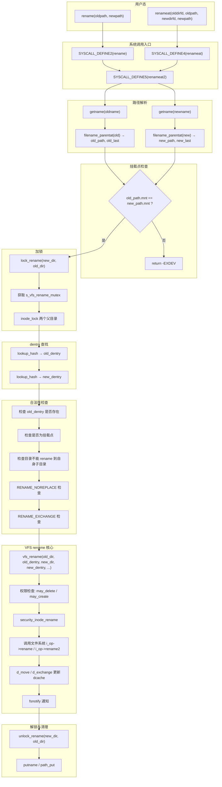
```mermaid
flowchart TB
    subgraph userspace["用户态"]
        U1["rename(oldpath, newpath)"]
        U2["renameat(olddirfd, oldpath, newdirfd, newpath)"]
    end

    subgraph syscall["系统调用入口"]
        S1["SYSCALL_DEFINE2(rename)"]
        S2["SYSCALL_DEFINE4(renameat)"]
        S3["SYSCALL_DEFINE5(renameat2)"]
    end

    subgraph pathresolve["路径解析"]
        P1["getname(oldname)"]
        P2["getname(newname)"]
        P3["filename_parentat(old) → old_path, old_last"]
        P4["filename_parentat(new) → new_path, new_last"]
    end

    subgraph mountcheck["挂载点检查"]
        M1{"old_path.mnt == new_path.mnt ?"}
        M2["return -EXDEV"]
    end

    subgraph locking["加锁"]
        L1["lock_rename(new_dir, old_dir)"]
        L2["获取 s_vfs_rename_mutex"]
        L3["inode_lock 两个父目录"]
    end

    subgraph lookup["dentry 查找"]
        D1["lookup_hash → old_dentry"]
        D2["lookup_hash → new_dentry"]
    end

    subgraph checks["合法性检查"]
        C1["检查 old_dentry 是否存在"]
        C2["检查是否为挂载点"]
        C3["检查目录不能 rename 到自身子目录"]
        C4["RENAME_NOREPLACE 检查"]
        C5["RENAME_EXCHANGE 检查"]
    end

    subgraph vfsrename["VFS rename 核心"]
        V1["vfs_rename(old_dir, old_dentry, new_dir, new_dentry, ...)"]
        V2["权限检查: may_delete / may_create"]
        V3["security_inode_rename"]
        V4["调用文件系统 i_op->rename / i_op->rename2"]
        V5["d_move / d_exchange 更新 dcache"]
        V6["fsnotify 通知"]
    end

    subgraph unlock["解锁与清理"]
        UL1["unlock_rename(new_dir, old_dir)"]
        UL2["putname / path_put"]
    end

    U1 --> S1
    U2 --> S2
    S1 --> S3
    S2 --> S3
    S3 --> P1
    S3 --> P2
    P1 --> P3
    P2 --> P4
    P3 --> M1
    P4 --> M1
    M1 -->|否| M2
    M1 -->|是| L1
    L1 --> L2
    L2 --> L3
    L3 --> D1
    D1 --> D2
    D2 --> C1
    C1 --> C2
    C2 --> C3
    C3 --> C4
    C4 --> C5
    C5 --> V1
    V1 --> V2
    V2 --> V3
    V3 --> V4
    V4 --> V5
    V5 --> V6
    V6 --> UL1
    UL1 --> UL2
```

####    renameat2 的完整实现
`SYSCALL_DEFINE5(renameat2)` 是整个 rename 操作的入口函数，[代码](https://elixir.bootlin.com/linux/v4.11.6/source/fs/namei.c#L4295)如下：

```cpp
// https://elixir.bootlin.com/linux/v4.11.6/source/fs/namei.c#L4295
SYSCALL_DEFINE5(renameat2, int, olddfd, const char __user *, oldname,
        int, newdfd, const char __user *, newname, unsigned int, flags)
{
    struct dentry *old_dentry, *new_dentry;
    struct dentry *trap;
    struct path old_path, new_path;
    struct qstr old_last, new_last;
    int old_type, new_type;
    struct inode *delegated_inode = NULL;
    struct filename *from;
    struct filename *to;
    unsigned int lookup_flags = 0;
    bool should_retry = false;
    int error;

    // 1. flags 合法性检查
    if (flags & ~(RENAME_NOREPLACE | RENAME_EXCHANGE | RENAME_WHITEOUT))
        return -EINVAL;
    if ((flags & (RENAME_NOREPLACE | RENAME_EXCHANGE)) == (RENAME_NOREPLACE | RENAME_EXCHANGE))
        return -EINVAL;
    if ((flags & (RENAME_WHITEOUT | RENAME_EXCHANGE)) == (RENAME_WHITEOUT | RENAME_EXCHANGE))
        return -EINVAL;
    if (flags & RENAME_EXCHANGE)
        lookup_flags |= LOOKUP_REVAL;

    // 2. 将用户态路径名拷贝到内核空间
retry:
    from = filename_parentat(olddfd, getname(oldname), lookup_flags,
                &old_path, &old_last, &old_type);
    if (IS_ERR(from)) {
        error = PTR_ERR(from);
        goto exit;
    }

    to = filename_parentat(newdfd, getname(newname), lookup_flags,
                &new_path, &new_last, &new_type);
    if (IS_ERR(to)) {
        error = PTR_ERR(to);
        goto exit1;
    }

    // 3. 关键检查：old_last 和 new_last 必须是 LAST_NORM 类型
    // 即不能是 "." 或 ".." 或空
    error = -EXDEV;
    if (old_path.mnt != new_path.mnt)   // 必须在同一挂载点
        goto exit2;

    error = -EBUSY;
    if (old_type != LAST_NORM)
        goto exit2;

    if (flags & RENAME_NOREPLACE)
        error = -EEXIST;
    if (new_type != LAST_NORM)
        goto exit2;

    error = mnt_want_write(old_path.mnt);
    if (error)
        goto exit2;

retry_deleg:
    // 4. 加锁：lock_rename 对两个父目录加锁（核心）
    trap = lock_rename(new_path.dentry, old_path.dentry);

    // 5. 在已加锁的父目录中 lookup 源和目标 dentry
    old_dentry = __lookup_hash(&old_last, old_path.dentry, lookup_flags);
    error = PTR_ERR(old_dentry);
    if (IS_ERR(old_dentry))
        goto exit3;
    error = -ENOENT;
    if (d_is_negative(old_dentry))  // 源文件不存在
        goto exit4;

    new_dentry = __lookup_hash(&new_last, new_path.dentry, lookup_flags | LOOKUP_RENAME_TARGET);
    error = PTR_ERR(new_dentry);
    if (IS_ERR(new_dentry))
        goto exit4;

    // 6. 合法性检查
    error = -EEXIST;
    if ((flags & RENAME_NOREPLACE) && d_is_positive(new_dentry))
        goto exit5;
    if (flags & RENAME_EXCHANGE) {
        error = -ENOENT;
        if (d_is_negative(new_dentry))  // EXCHANGE 模式要求两者都存在
            goto exit5;
    }

    // 检查是否为挂载点
    if (!d_is_dir(old_dentry)) {
        error = -ENOTDIR;
        if (old_last.name[old_last.len])
            goto exit5;
        if (!(flags & RENAME_EXCHANGE) && new_last.name[new_last.len])
            goto exit5;
    }

    // 检查是否试图将目录 rename 到其子目录
    error = -EINVAL;
    if (old_dentry == trap)
        goto exit5;
    error = -ENOTEMPTY;
    if (new_dentry == trap)
        goto exit5;

    // 7. 调用 vfs_rename 执行真正的 rename 操作
    error = vfs_rename(old_path.dentry->d_inode, old_dentry,
               new_path.dentry->d_inode, new_dentry,
               &delegated_inode, flags);

exit5:
    dput(new_dentry);
exit4:
    dput(old_dentry);
exit3:
    // 8. 解锁
    unlock_rename(new_path.dentry, old_path.dentry);

    if (delegated_inode) {
        error = break_deleg_wait(&delegated_inode);
        if (!error)
            goto retry_deleg;
    }
    mnt_drop_write(old_path.mnt);
exit2:
    if (retry_estale(error, lookup_flags))
        should_retry = true;
    path_put(&new_path);
    putname(to);
exit1:
    path_put(&old_path);
    putname(from);
    if (should_retry) {
        should_retry = false;
        lookup_flags |= LOOKUP_REVAL;
        goto retry;
    }
exit:
    return error;
}
```

上面代码的核心流程：

1. **flags 合法性检查**：确保 flags 组合有效
2. **路径解析**（`filename_parentat`）：将用户态的路径字符串解析为内核的 `path`（挂载点+dentry）结构，同时提取出路径的最后一个分量（文件名）
3. **挂载点检查**：`old_path.mnt != new_path.mnt` 时返回 `-EXDEV`，**这是不允许跨文件系统 rename 的关键检查点**
4. **加锁**：`lock_rename` 对两个父目录的 `i_mutex` 加锁
5. **dentry 查找**：在已加锁的父目录中查找源和目标的 dentry
6. **合法性检查**：源文件存在性、目标文件的覆盖策略、目录循环等
7. **执行 rename**：调用 `vfs_rename`
8. **解锁和清理**

##  0x03    路径解析：filename_parentat函数

`filename_parentat` 是路径解析的核心函数，它将用户态的路径字符串解析为父目录的 `path` 结构和最后一个路径分量。例如对于 `/home/user/a.txt`，它解析出 `/home/user/` 的 path 和 `a.txt` 的 qstr

```cpp
// https://elixir.bootlin.com/linux/v4.11.6/source/fs/namei.c#L2256
static struct filename *
filename_parentat(int dfd, struct filename *name,
          unsigned int flags, struct path *parent,
          struct qstr *last, int *type)
{
    int retval = path_parentat(dfd, name, flags | LOOKUP_PARENT, parent);
    if (likely(!retval)) {
        *last = nd.last;    // 最后一个分量（文件名）
        *type = nd.last_type;   // 分量类型：LAST_NORM, LAST_DOT, LAST_DOTDOT
    }
    // ...
    return name;
}
```

路径解析的内部实际调用链：

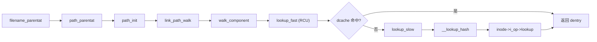
```mermaid
flowchart LR
    A["filename_parentat"] --> B["path_parentat"]
    B --> C["path_init"]
    C --> D["link_path_walk"]
    D --> E["walk_component"]
    E --> F["lookup_fast (RCU)"]
    F --> G{"dcache 命中?"}
    G -->|是| H["返回 dentry"]
    G -->|否| I["lookup_slow"]
    I --> J["__lookup_hash"]
    J --> K["inode->i_op->lookup"]
    K --> H
```

####    dentry 的 lookup 过程
在 `renameat2` 中，路径解析完成后，内核通过 `__lookup_hash` 在父目录中查找具体的 dentry。这个函数在父目录的 `i_mutex` 已经被 `lock_rename` 持有的情况下调用：

dentry查找的详细分析可以参考[Linux 内核之旅（十一）：追踪 open 系统调用](https://pandaychen.github.io/2025/04/02/A-LINUX-KERNEL-TRAVEL-11/)

```cpp
// __lookup_hash 的简化逻辑
static struct dentry *__lookup_hash(const struct qstr *name,
         struct dentry *base, unsigned int flags)
{
    struct dentry *dentry;

    // 先在 dcache 中查找
    dentry = d_lookup(base, name);
    if (dentry) {
        // dcache 命中，检查是否需要 revalidate
        if (d_revalidate(dentry, flags))
            return dentry;
        dput(dentry);
    }

    // dcache 未命中，调用文件系统的 lookup
    dentry = d_alloc(base, name);
    if (!dentry)
        return ERR_PTR(-ENOMEM);
    // 调用具体文件系统的 lookup 方法
    // 对于 ext4: ext4_lookup
    return base->d_inode->i_op->lookup(base->d_inode, dentry, flags);
}
```

`d_lookup` 在 dcache 哈希表中查找，如果命中则直接返回；如果未命中则需要调用具体文件系统的 `lookup` 方法从磁盘读取目录项信息并创建新的 dentry

##  0x04    lock_rename：加锁策略与死锁避免

`lock_rename` 是 `rename` 操作中最精妙的部分之一，它需要同时锁定两个父目录的 `i_mutex`，同时避免死锁

####    为什么需要特殊的加锁策略？

考虑两个并发的 rename 操作：

- 进程 A：`rename("/a/x", "/b/y")` → 需要锁 dir_a, dir_b
- 进程 B：`rename("/b/m", "/a/n")` → 需要锁 dir_b, dir_a

如果不规定加锁顺序，就可能出现经典的 ABBA 死锁：

```text
进程A: lock(dir_a)            -> 等待 lock(dir_b)
进程B:            lock(dir_b) -> 等待 lock(dir_a)
                  ↑ 死锁！
```

####    lock_rename 的实现

```cpp
// https://elixir.bootlin.com/linux/v4.11.6/source/fs/namei.c#L2653
struct dentry *lock_rename(struct dentry *p1, struct dentry *p2)
{
    struct dentry *p;

    // Case 1: 源和目标在同一个目录
    if (p1 == p2) {
        inode_lock_nested(p1->d_inode, I_MUTEX_PARENT);
        return NULL;
    }

    // Case 2: 不同目录，先获取文件系统级别的 rename 互斥锁
    mutex_lock(&p1->d_sb->s_vfs_rename_mutex);

    // 检查 p1 是否是 p2 的祖先
    p = d_ancestor(p2, p1);
    if (p) {
        inode_lock_nested(p2->d_inode, I_MUTEX_PARENT);
        inode_lock_nested(p1->d_inode, I_MUTEX_CHILD);
        return p;   // 返回 trap（公共祖先）
    }

    // 检查 p2 是否是 p1 的祖先
    p = d_ancestor(p1, p2);
    if (p) {
        inode_lock_nested(p1->d_inode, I_MUTEX_PARENT);
        inode_lock_nested(p2->d_inode, I_MUTEX_CHILD);
        return p;
    }

    // Case 3: 没有祖先关系，按地址顺序加锁
    inode_lock_nested(p1->d_inode, I_MUTEX_PARENT);
    inode_lock_nested(p2->d_inode, I_MUTEX_CHILD);
    return NULL;
}
```

####    lock_rename 的加锁原则

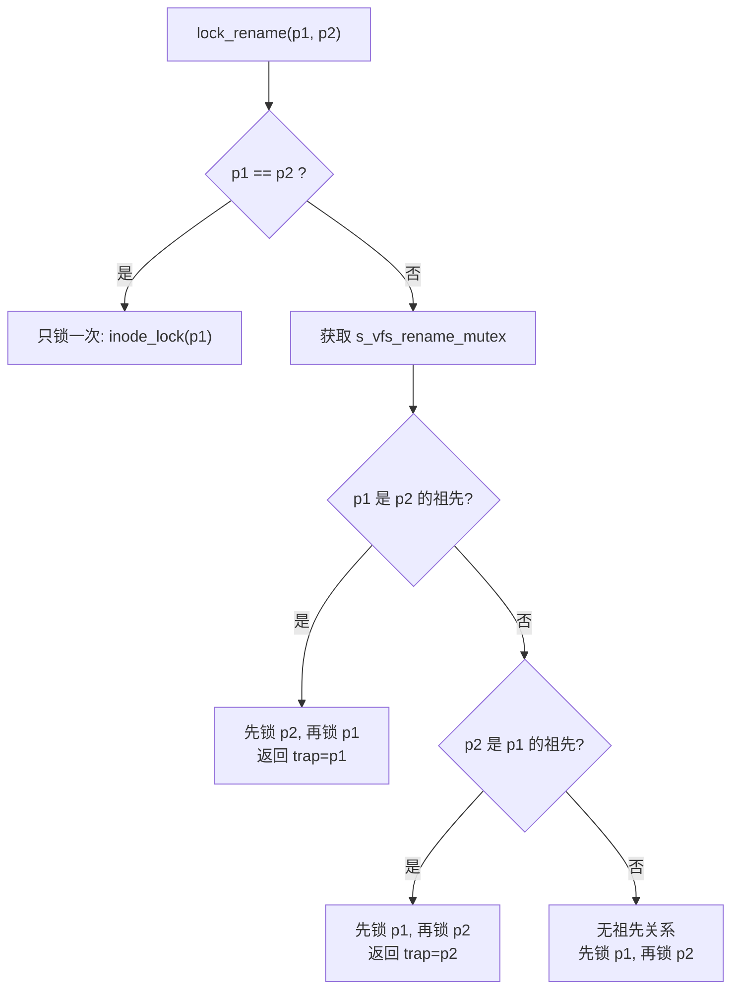
```mermaid
flowchart TB
    START["lock_rename(p1, p2)"] --> Q1{"p1 == p2 ?"}
    Q1 -->|是| SAME["只锁一次: inode_lock(p1)"]
    Q1 -->|否| LOCK_SB["获取 s_vfs_rename_mutex"]
    LOCK_SB --> Q2{"p1 是 p2 的祖先?"}
    Q2 -->|是| ORDER1["先锁 p2, 再锁 p1<br/>返回 trap=p1"]
    Q2 -->|否| Q3{"p2 是 p1 的祖先?"}
    Q3 -->|是| ORDER2["先锁 p1, 再锁 p2<br/>返回 trap=p2"]
    Q3 -->|否| ORDER3["无祖先关系<br/>先锁 p1, 再锁 p2"]
```

加锁原则总结：

| 场景 | 加锁策略 | 说明 |
|------|----------|------|
| 同一目录内 rename | 只锁一个 `i_mutex` | `p1 == p2`，无需 `s_vfs_rename_mutex` |
| 不同目录，有祖先关系 | `s_vfs_rename_mutex` + 先子后父 | 避免与 lookup 路径冲突 |
| 不同目录，无祖先关系 | `s_vfs_rename_mutex` + 按地址顺序 | 经典的有序加锁避免死锁 |

关键点：`s_vfs_rename_mutex` 是**超级块（superblock）级别**的互斥锁，这意味着同一文件系统上同一时刻只能执行一个跨目录的 rename。但不同文件系统的 rename 可以并发执行

`lock_rename` 返回值 `trap` 的含义：如果两个目录存在祖先关系，`trap` 指向作为祖先的那个 dentry。在 `renameat2` 中会检查 `old_dentry == trap` 或 `new_dentry == trap`，防止把目录 rename 到自身的子目录中（这会造成目录树环路）

##  0x05    vfs_rename：VFS 层的 rename 核心

####    vfs_rename 流程图

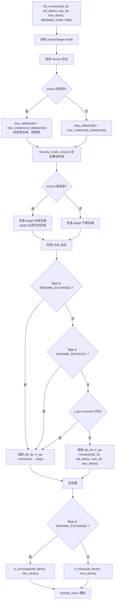
```mermaid
flowchart TB
    START["vfs_rename(old_dir, old_dentry, new_dir, new_dentry, delegated_inode, flags)"] --> INIT["获取 source/target inode"]
    INIT --> CHK1["检查 source 存在"]
    CHK1 --> CHK2{"source 是目录?"}
    CHK2 -->|是| DIR_CHK["may_delete(old) + may_create/may_delete(new)<br/>检查空目录、权限等"]
    CHK2 -->|否| FILE_CHK["may_delete(old) + may_create/may_delete(new)"]
    DIR_CHK --> SEC["security_inode_rename 安全模块检查"]
    FILE_CHK --> SEC
    SEC --> ISDIR{"source 是目录?"}
    ISDIR -->|是| DCHK["检查 target 也是目录<br/>target 必须为空目录"]
    ISDIR -->|否| FCHK["检查 target 不是目录"]
    DCHK --> NLINK["检查 nlink 溢出"]
    FCHK --> NLINK
    NLINK --> EXCHANGE{"flags & RENAME_EXCHANGE ?"}
    EXCHANGE -->|是| CALL_RENAME2["调用 old_dir->i_op->rename2(..., flags)"]
    EXCHANGE -->|否| WHITEOUT{"flags & RENAME_WHITEOUT ?"}
    WHITEOUT -->|是| CALL_RENAME2
    WHITEOUT -->|否| HAS_RENAME2{"i_op->rename2 存在?"}
    HAS_RENAME2 -->|是| CALL_RENAME2
    HAS_RENAME2 -->|否| CALL_RENAME["调用 old_dir->i_op->rename(old_dir, old_dentry, new_dir, new_dentry)"]
    CALL_RENAME --> POST["后处理"]
    CALL_RENAME2 --> POST
    POST --> DCACHE{"flags & RENAME_EXCHANGE ?"}
    DCACHE -->|是| D_EXCHANGE["d_exchange(old_dentry, new_dentry)"]
    DCACHE -->|否| D_MOVE["d_move(old_dentry, new_dentry)"]
    D_EXCHANGE --> NOTIFY["fsnotify_move 通知"]
    D_MOVE --> NOTIFY
```

####    vfs_rename 的源码分析

```cpp
// https://elixir.bootlin.com/linux/v4.11.6/source/fs/namei.c#L4200
int vfs_rename(struct inode *old_dir, struct dentry *old_dentry,
           struct inode *new_dir, struct dentry *new_dentry,
           struct inode **delegated_inode, unsigned int flags)
{
    struct inode *source = old_dentry->d_inode;
    struct inode *target = new_dentry->d_inode;
    bool new_is_dir = false;
    unsigned max_links = new_dir->i_sb->s_max_links;
    struct renamedata rd;

    // source 不能为空（源文件必须存在）
    if (source == target)
        return 0;   // rename 到自身，直接返回成功

    error = may_delete(old_dir, old_dentry, is_dir);
    if (error)
        return error;

    if (!target) {
        // 目标不存在：创建新条目
        error = may_create(new_dir, new_dentry);
    } else {
        // 目标已存在：替换（删除旧条目）
        new_is_dir = d_is_dir(new_dentry);
        if (!(flags & RENAME_EXCHANGE))
            error = may_delete(new_dir, new_dentry, is_dir);
        else
            error = may_delete(new_dir, new_dentry, new_is_dir);
    }
    if (error)
        return error;

    // 安全模块检查（SELinux/AppArmor 等）
    error = security_inode_rename(old_dir, old_dentry, new_dir, new_dentry, flags);
    if (error)
        return error;

    // 目录相关的额外检查
    if (is_dir) {
        // 如果目标存在且不是目录 → 错误
        if (target && !new_is_dir) {
            error = -ENOTDIR;
            goto out;
        }
        // 检查 nlink 是否溢出（对目录 rename 会改变父目录的 nlink）
        if (max_links && !target && new_dir != old_dir &&
            new_dir->i_nlink >= max_links) {
            error = -EMLINK;
            goto out;
        }
    }
    if (!is_dir) {
        // 源不是目录，目标不能是目录
        if (target && new_is_dir) {
            error = -EISDIR;
            goto out;
        }
    }

    // 调用具体文件系统的 rename 实现
    if (flags & (RENAME_EXCHANGE | RENAME_WHITEOUT) ||
        old_dir->i_op->rename2) {
        // 使用新的 rename2 接口（支持 flags）
        error = old_dir->i_op->rename2(old_dir, old_dentry,
                        new_dir, new_dentry, flags);
    } else {
        // 使用传统的 rename 接口
        error = old_dir->i_op->rename(old_dir, old_dentry,
                       new_dir, new_dentry);
    }
    if (error)
        goto out;

    // rename 成功后的 dcache 更新
    if (!(flags & RENAME_EXCHANGE) && target) {
        // 旧的目标文件被替换
        if (is_dir)
            target->i_flags |= S_DEAD;
        dont_mount(new_dentry);
        detach_mounts(new_dentry);
    }

    if (flags & RENAME_EXCHANGE) {
        // EXCHANGE：交换两个 dentry
        d_exchange(old_dentry, new_dentry);
    } else {
        // 普通 rename：移动 dentry
        d_move(old_dentry, new_dentry);
    }

    // 发送文件系统通知
    // inotify/fanotify 等机制会收到 IN_MOVED_FROM / IN_MOVED_TO 事件
    fsnotify_move(old_dir, new_dir, old_dentry->d_name.name,
              is_dir, target, old_dentry);
out:
    return error;
}
```

####    d_move 的作用
`d_move(old_dentry, new_dentry)` 是 `rename` 在 dcache 层面的关键操作。它将 `old_dentry` 从旧的父目录移到新的父目录下，并更新其名称：

```cpp
// 简化的 d_move 逻辑
void d_move(struct dentry *dentry, struct dentry *target)
{
    // 1. 从 dcache 哈希表中摘除两个 dentry
    __d_drop(dentry);
    __d_drop(target);

    // 2. 交换名称和父目录指针
    // dentry 现在指向 target 原来的位置（名称和父目录）
    switch_names(dentry, target);
    swap(dentry->d_parent, target->d_parent);

    // 3. 将 dentry 重新加入 dcache 哈希表（新位置）
    __d_rehash(dentry);

    // 4. target 变成 negative dentry（如果 target 有 inode，其 inode 被释放）
}
```

`d_move` 的意义在于：**rename 操作不会改变文件的 inode，只是改变了 dentry 在目录树中的位置**。这是 `rename` 操作高效（不需要拷贝数据）且原子的根本原因

##  0x06   核心：rename 前后 inode 的变化
`rename` 操作的核心本质是**目录项（directory entry）的增删改**，而**不是 inode 或数据块的搬移**。下面分场景详细画出每种 `rename` 场景下，目录项、inode、数据块、nlink 的变化，本小节进行全场景详解

####    场景一：rename(a, b)，目标 b 不存在（最简单）

最常见的场景：将文件从一个名字改为另一个名字，目标位置没有同名文件

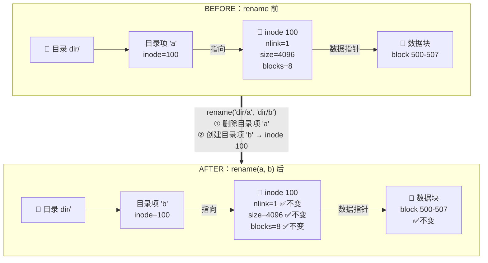
```mermaid
flowchart TB
    subgraph before1["BEFORE：rename 前"]
        direction LR
        D1["📁 目录 dir/"]
        E1["目录项 'a'<br/>inode=100"]
        I1["🔵 inode 100<br/>nlink=1<br/>size=4096<br/>blocks=8"]
        BLK1["💾 数据块<br/>block 500-507"]

        D1 --> E1
        E1 -->|"指向"| I1
        I1 -->|"数据指针"| BLK1
    end

    subgraph after1["AFTER：rename(a, b) 后"]
        direction LR
        D1a["📁 目录 dir/"]
        E1a["目录项 'b'<br/>inode=100"]
        I1a["🔵 inode 100<br/>nlink=1 ✅不变<br/>size=4096 ✅不变<br/>blocks=8 ✅不变"]
        BLK1a["💾 数据块<br/>block 500-507<br/>✅不变"]

        D1a --> E1a
        E1a -->|"指向"| I1a
        I1a -->|"数据指针"| BLK1a
    end

    before1 ==>|"rename('dir/a', 'dir/b')<br/>① 删除目录项 'a'<br/>② 创建目录项 'b' → inode 100"| after1
```

变化汇总：

| 对象 | 变化 |
|------|------|
| 目录项 `a` | **被删除** |
| 目录项 `b` | **新创建**，inode 字段 = 100 |
| inode 100 | **完全不变**（nlink、size、权限、时间戳等） |
| 数据块 | **完全不变** |
| b 的 inode number | **= 原 a 的 inode number = 100** |

####    场景二：rename(a, b)，目标 b 已存在（覆盖）

目标位置已有文件，`rename` 会**原子替换**目标文件

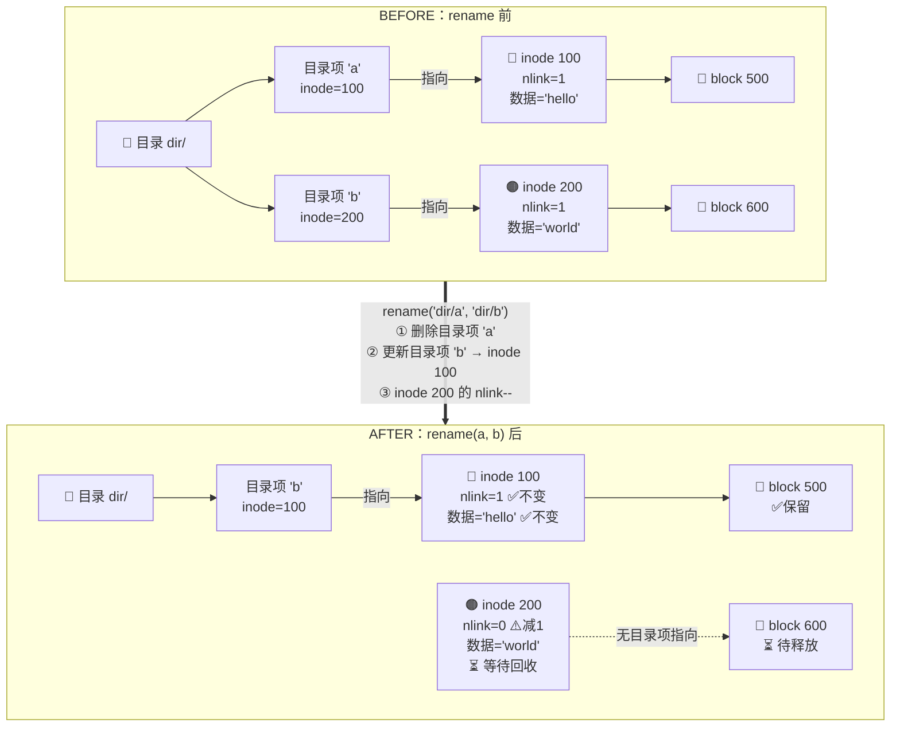
```mermaid
flowchart TB
    subgraph before2["BEFORE：rename 前"]
        direction LR
        D2["📁 目录 dir/"]
        EA2["目录项 'a'<br/>inode=100"]
        EB2["目录项 'b'<br/>inode=200"]
        IA2["🔵 inode 100<br/>nlink=1<br/>数据='hello'"]
        IB2["🟠 inode 200<br/>nlink=1<br/>数据='world'"]
        BLKA2["💾 block 500"]
        BLKB2["💾 block 600"]

        D2 --> EA2
        D2 --> EB2
        EA2 -->|"指向"| IA2
        EB2 -->|"指向"| IB2
        IA2 --> BLKA2
        IB2 --> BLKB2
    end

    subgraph after2["AFTER：rename(a, b) 后"]
        direction LR
        D2a["📁 目录 dir/"]
        EB2a["目录项 'b'<br/>inode=100"]
        IA2a["🔵 inode 100<br/>nlink=1 ✅不变<br/>数据='hello' ✅不变"]
        IB2a["🟠 inode 200<br/>nlink=0 ⚠️减1<br/>数据='world'<br/>⏳ 等待回收"]
        BLKA2a["💾 block 500<br/>✅保留"]
        BLKB2a["💾 block 600<br/>⏳ 待释放"]

        D2a --> EB2a
        EB2a -->|"指向"| IA2a
        IA2a --> BLKA2a
        IB2a -.->|"无目录项指向"| BLKB2a
    end

    before2 ==>|"rename('dir/a', 'dir/b')<br/>① 删除目录项 'a'<br/>② 更新目录项 'b' → inode 100<br/>③ inode 200 的 nlink--"| after2
```

变化汇总：

| 对象 | 变化 |
|------|------|
| 目录项 `a` | **被删除** |
| 目录项 `b` | inode 字段从 `200` **改为** `100` |
| inode 100（原 a） | **完全不变** |
| inode 200（原 b） | nlink 减 `1` → `0`，若无进程打开则**被释放** |
| 原 b 的数据块 | nlink=0 时**被释放回文件系统** |
| 新 b 的 inode number | **= 100**（原 a 的 inode） |

注意：如果 inode 200 还有其他硬链接（nlink > 1），或者有进程正在打开该文件，则 inode 200 和数据块**不会**立即释放

####    场景三：rename(a, b)，b 已存在且有进程打开

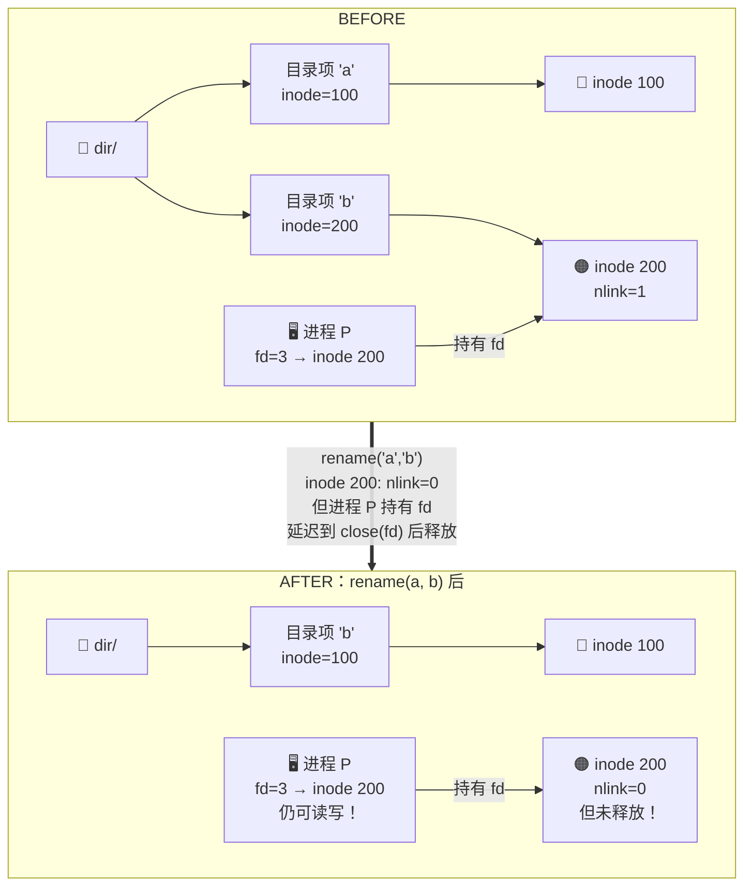
```mermaid
flowchart TB
    subgraph before3["BEFORE"]
        direction LR
        D3["📁 dir/"]
        EA3["目录项 'a'<br/>inode=100"]
        EB3["目录项 'b'<br/>inode=200"]
        IA3["🔵 inode 100"]
        IB3["🟠 inode 200<br/>nlink=1"]
        PROC3["🖥️ 进程 P<br/>fd=3 → inode 200"]

        D3 --> EA3
        D3 --> EB3
        EA3 --> IA3
        EB3 --> IB3
        PROC3 -->|"持有 fd"| IB3
    end

    subgraph after3["AFTER：rename(a, b) 后"]
        direction LR
        D3a["📁 dir/"]
        EB3a["目录项 'b'<br/>inode=100"]
        IA3a["🔵 inode 100"]
        IB3a["🟠 inode 200<br/>nlink=0<br/>但未释放！"]
        PROC3a["🖥️ 进程 P<br/>fd=3 → inode 200<br/>仍可读写！"]

        D3a --> EB3a
        EB3a --> IA3a
        PROC3a -->|"持有 fd"| IB3a
    end

    before3 ==>|"rename('a','b')<br/>inode 200: nlink=0<br/>但进程 P 持有 fd<br/>延迟到 close(fd) 后释放"| after3
```

这是 Linux **unlink-but-still-open** 机制：inode 200 的 nlink 降为 `0`，但由于进程 P 仍持有文件描述符，inode 和数据块会**延迟到最后一个 fd 关闭后才释放**。这个特性常被用于安全的临时文件处理

####    场景四：跨目录 rename(dir1/a, dir2/b)，b 不存在

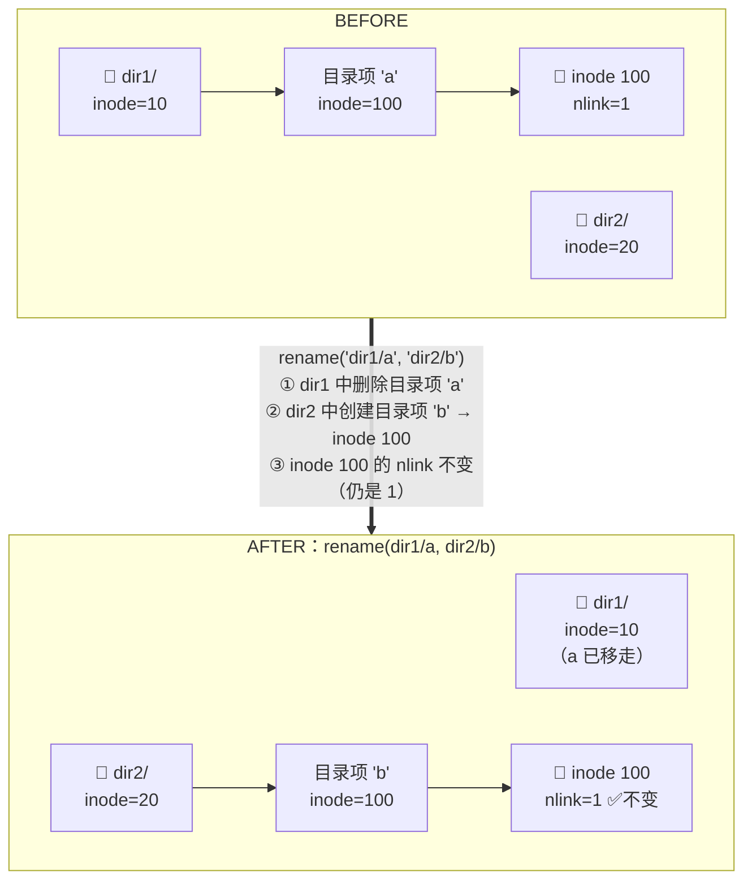
```mermaid
flowchart TB
    subgraph before4["BEFORE"]
        direction LR
        DIR1_4["📁 dir1/<br/>inode=10"]
        DIR2_4["📁 dir2/<br/>inode=20"]
        EA4["目录项 'a'<br/>inode=100"]
        IA4["🔵 inode 100<br/>nlink=1"]

        DIR1_4 --> EA4
        EA4 --> IA4
    end

    subgraph after4["AFTER：rename(dir1/a, dir2/b)"]
        direction LR
        DIR1_4a["📁 dir1/<br/>inode=10<br/>（a 已移走）"]
        DIR2_4a["📁 dir2/<br/>inode=20"]
        EB4a["目录项 'b'<br/>inode=100"]
        IA4a["🔵 inode 100<br/>nlink=1 ✅不变"]

        DIR2_4a --> EB4a
        EB4a --> IA4a
    end

    before4 ==>|"rename('dir1/a', 'dir2/b')<br/>① dir1 中删除目录项 'a'<br/>② dir2 中创建目录项 'b' → inode 100<br/>③ inode 100 的 nlink 不变（仍是 1）"| after4
```

关键点：文件从 dir1 移到 dir2，但 **inode number 不变**，因为 inode 没有移动，只是目录项的位置变了

####    场景五：rename 目录，dir1/subdir → dir2/subdir（b 不存在）

目录的 `rename` 比文件复杂，因为需要更新 `..` 条目和父目录的 nlink

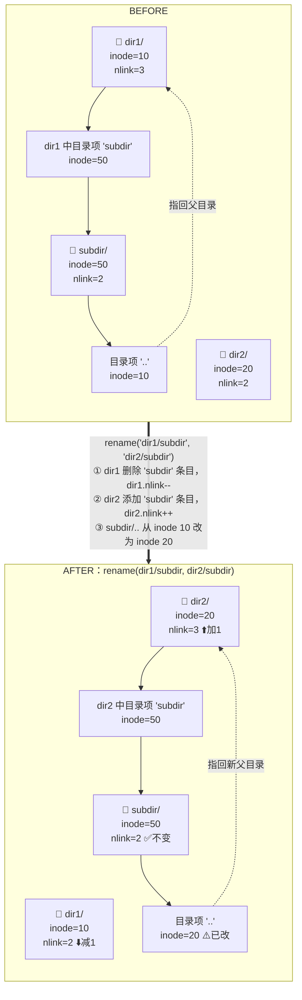
```mermaid
flowchart TB
    subgraph before5["BEFORE"]
        direction TB
        D1_5["📁 dir1/<br/>inode=10<br/>nlink=3"]
        SUB5["📁 subdir/<br/>inode=50<br/>nlink=2"]
        DOTDOT5["目录项 '..'<br/>inode=10"]
        D2_5["📁 dir2/<br/>inode=20<br/>nlink=2"]
        ENTRY5["dir1 中目录项 'subdir'<br/>inode=50"]

        D1_5 --> ENTRY5
        ENTRY5 --> SUB5
        SUB5 --> DOTDOT5
        DOTDOT5 -.->|"指回父目录"| D1_5
    end

    subgraph after5["AFTER：rename(dir1/subdir, dir2/subdir)"]
        direction TB
        D1_5a["📁 dir1/<br/>inode=10<br/>nlink=2 ⬇️减1"]
        SUB5a["📁 subdir/<br/>inode=50<br/>nlink=2 ✅不变"]
        DOTDOT5a["目录项 '..'<br/>inode=20 ⚠️已改"]
        D2_5a["📁 dir2/<br/>inode=20<br/>nlink=3 ⬆️加1"]
        ENTRY5a["dir2 中目录项 'subdir'<br/>inode=50"]

        D2_5a --> ENTRY5a
        ENTRY5a --> SUB5a
        SUB5a --> DOTDOT5a
        DOTDOT5a -.->|"指回新父目录"| D2_5a
    end

    before5 ==>|"rename('dir1/subdir', 'dir2/subdir')<br/>① dir1 删除 'subdir' 条目，dir1.nlink--<br/>② dir2 添加 'subdir' 条目，dir2.nlink++<br/>③ subdir/.. 从 inode 10 改为 inode 20"| after5
```

目录 `rename` 的 nlink 变化规则：

| 对象 | nlink 变化 | 原因 |
|------|-----------|------|
| 旧父目录 dir1 | **减 1** | 子目录的 `..` 不再指向它 |
| 新父目录 dir2 | **加 1** | 子目录的 `..` 现在指向它 |
| 被移动的 subdir | **不变** | 自身的 `.` 和父目录的条目一进一出，抵消 |

####    场景六：rename(a, b)，a 有多个硬链接

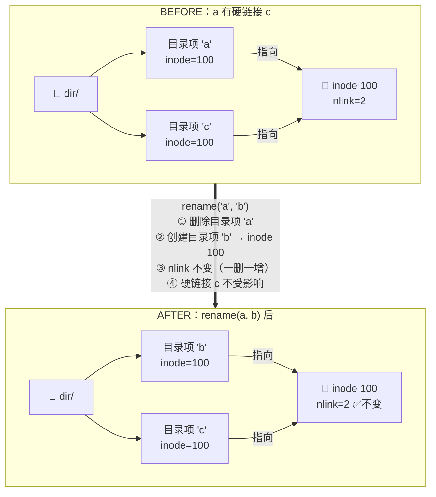
```mermaid
flowchart TB
    subgraph before6["BEFORE：a 有硬链接 c"]
        direction LR
        D6["📁 dir/"]
        EA6["目录项 'a'<br/>inode=100"]
        EB6["目录项 'c'<br/>inode=100"]
        IA6["🔵 inode 100<br/>nlink=2"]

        D6 --> EA6
        D6 --> EB6
        EA6 -->|"指向"| IA6
        EB6 -->|"指向"| IA6
    end

    subgraph after6["AFTER：rename(a, b) 后"]
        direction LR
        D6a["📁 dir/"]
        EB6a["目录项 'b'<br/>inode=100"]
        EC6a["目录项 'c'<br/>inode=100"]
        IA6a["🔵 inode 100<br/>nlink=2 ✅不变"]

        D6a --> EB6a
        D6a --> EC6a
        EB6a -->|"指向"| IA6a
        EC6a -->|"指向"| IA6a
    end

    before6 ==>|"rename('a', 'b')<br/>① 删除目录项 'a'<br/>② 创建目录项 'b' → inode 100<br/>③ nlink 不变（一删一增）<br/>④ 硬链接 c 不受影响"| after6
```

注意：`rename` 对 nlink 的影响是"删除旧目录项 + 创建新目录项"，**净效果是 nlink 不变**。硬链接 `c` 完全不受影响，仍然指向同一个 inode

####    场景七：rename(a, b)，a 和 b 是同一个 inode 的硬链接

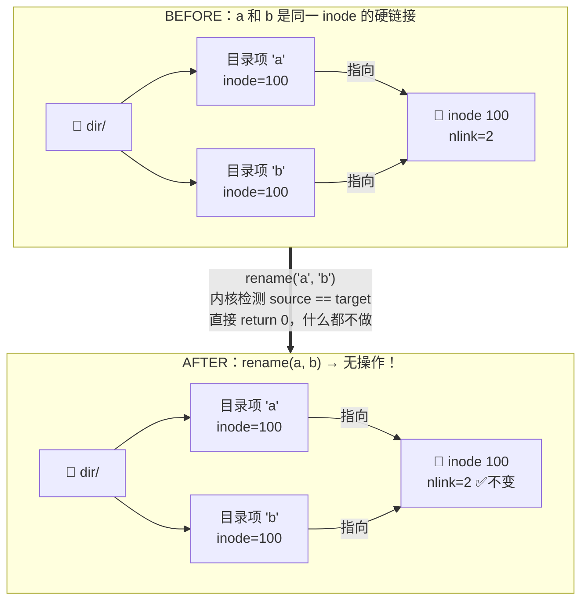
```mermaid
flowchart TB
    subgraph before7["BEFORE：a 和 b 是同一 inode 的硬链接"]
        direction LR
        D7["📁 dir/"]
        EA7["目录项 'a'<br/>inode=100"]
        EB7["目录项 'b'<br/>inode=100"]
        IA7["🔵 inode 100<br/>nlink=2"]

        D7 --> EA7
        D7 --> EB7
        EA7 -->|"指向"| IA7
        EB7 -->|"指向"| IA7
    end

    subgraph after7["AFTER：rename(a, b) → 无操作！"]
        direction LR
        D7a["📁 dir/"]
        EA7a["目录项 'a'<br/>inode=100"]
        EB7a["目录项 'b'<br/>inode=100"]
        IA7a["🔵 inode 100<br/>nlink=2 ✅不变"]

        D7a --> EA7a
        D7a --> EB7a
        EA7a -->|"指向"| IA7a
        EB7a -->|"指向"| IA7a
    end

    before7 ==>|"rename('a', 'b')<br/>内核检测 source == target<br/>直接 return 0，什么都不做"| after7
```

在 `vfs_rename` 中：

```cpp
if (source == target)
    return 0;   // 同一个 inode，直接返回成功
```

POSIX 规定：如果 oldpath 和 newpath 是指向同一文件的硬链接，`rename()` 应什么也不做并返回成功

####    场景八：RENAME_EXCHANGE（原子交换）

Linux 3.15 引入的 `renameat2(RENAME_EXCHANGE)` 支持**原子交换**两个路径名

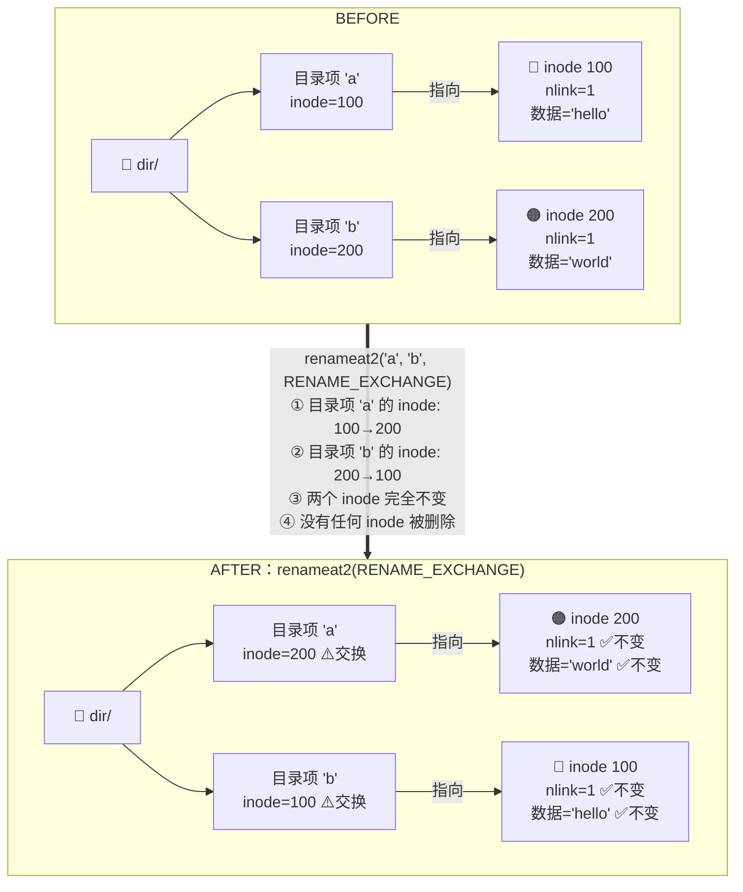
```mermaid
flowchart TB
    subgraph before8["BEFORE"]
        direction LR
        D8["📁 dir/"]
        EA8["目录项 'a'<br/>inode=100"]
        EB8["目录项 'b'<br/>inode=200"]
        IA8["🔵 inode 100<br/>nlink=1<br/>数据='hello'"]
        IB8["🟠 inode 200<br/>nlink=1<br/>数据='world'"]

        D8 --> EA8
        D8 --> EB8
        EA8 -->|"指向"| IA8
        EB8 -->|"指向"| IB8
    end

    subgraph after8["AFTER：renameat2(RENAME_EXCHANGE)"]
        direction LR
        D8a["📁 dir/"]
        EA8a["目录项 'a'<br/>inode=200 ⚠️交换"]
        EB8a["目录项 'b'<br/>inode=100 ⚠️交换"]
        IA8a["🔵 inode 100<br/>nlink=1 ✅不变<br/>数据='hello' ✅不变"]
        IB8a["🟠 inode 200<br/>nlink=1 ✅不变<br/>数据='world' ✅不变"]

        D8a --> EA8a
        D8a --> EB8a
        EA8a -->|"指向"| IB8a
        EB8a -->|"指向"| IA8a
    end

    before8 ==>|"renameat2('a', 'b', RENAME_EXCHANGE)<br/>① 目录项 'a' 的 inode: 100→200<br/>② 目录项 'b' 的 inode: 200→100<br/>③ 两个 inode 完全不变<br/>④ 没有任何 inode 被删除"| after8
```

EXCHANGE 与普通 `rename` 的关键区别：

| 特性 | 普通 `rename` | RENAME_EXCHANGE |
|------|-----------|-----------------|
| 目标必须存在？ | 否 | **是**（两者都必须存在） |
| 是否删除 inode？ | 可能删除目标 inode | **不删除任何 inode** |
| nlink 变化 | 目标 inode nlink-- | **nlink 不变** |
| dcache 操作 | `d_move` | `d_exchange` |
| 典型用途 | 移动/重命名文件 | **原子替换配置文件** |

内核中对应的 dcache 操作是 `d_exchange`（交换两个 dentry 的位置），而非 `d_move`

####    场景九：RENAME_NOREPLACE（不覆盖）

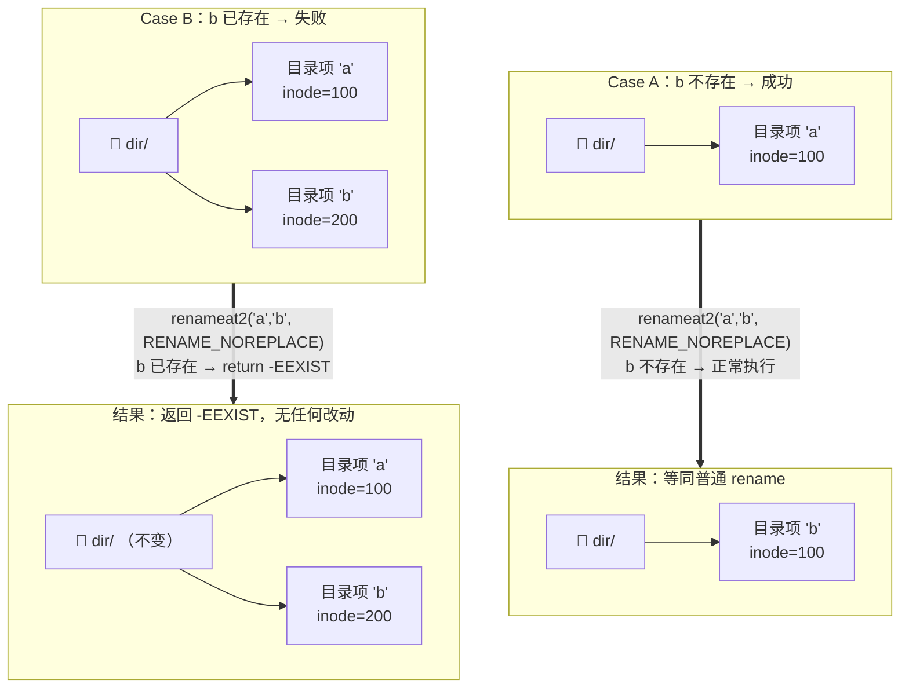
```mermaid
flowchart TB
    subgraph case9a["Case A：b 不存在 → 成功"]
        direction LR
        D9a["📁 dir/"]
        EA9a["目录项 'a'<br/>inode=100"]
        D9a --> EA9a
    end

    subgraph result9a["结果：等同普通 rename"]
        direction LR
        D9a2["📁 dir/"]
        EB9a2["目录项 'b'<br/>inode=100"]
        D9a2 --> EB9a2
    end

    case9a ==>|"renameat2('a','b', RENAME_NOREPLACE)<br/>b 不存在 → 正常执行"| result9a

    subgraph case9b["Case B：b 已存在 → 失败"]
        direction LR
        D9b["📁 dir/"]
        EA9b["目录项 'a'<br/>inode=100"]
        EB9b["目录项 'b'<br/>inode=200"]
        D9b --> EA9b
        D9b --> EB9b
    end

    subgraph result9b["结果：返回 -EEXIST，无任何改动"]
        direction LR
        D9b2["📁 dir/ （不变）"]
        EA9b2["目录项 'a'<br/>inode=100"]
        EB9b2["目录项 'b'<br/>inode=200"]
        D9b2 --> EA9b2
        D9b2 --> EB9b2
    end

    case9b ==>|"renameat2('a','b', RENAME_NOREPLACE)<br/>b 已存在 → return -EEXIST"| result9b
```

####    全场景 inode 变化总结

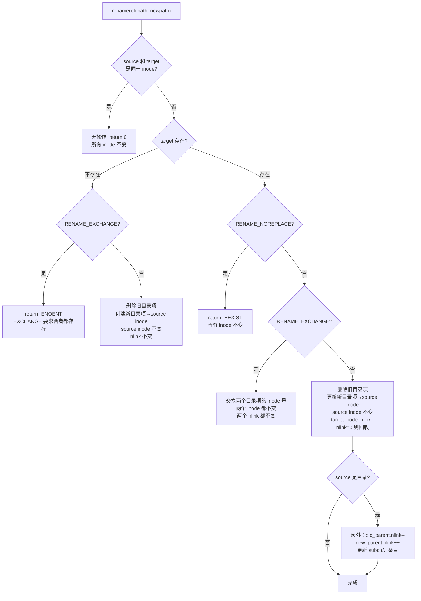
```mermaid
flowchart TB
    START["rename(oldpath, newpath)"] --> Q1{"source 和 target<br/>是同一 inode?"}
    Q1 -->|是| NOOP["无操作, return 0<br/>所有 inode 不变"]
    Q1 -->|否| Q2{"target 存在?"}

    Q2 -->|不存在| Q3{"RENAME_EXCHANGE?"}
    Q3 -->|是| ERR1["return -ENOENT<br/>EXCHANGE 要求两者都存在"]
    Q3 -->|否| CREATE["删除旧目录项<br/>创建新目录项→source inode<br/>source inode 不变<br/>nlink 不变"]

    Q2 -->|存在| Q4{"RENAME_NOREPLACE?"}
    Q4 -->|是| ERR2["return -EEXIST<br/>所有 inode 不变"]
    Q4 -->|否| Q5{"RENAME_EXCHANGE?"}
    Q5 -->|是| SWAP["交换两个目录项的 inode 号<br/>两个 inode 都不变<br/>两个 nlink 都不变"]
    Q5 -->|否| REPLACE["删除旧目录项<br/>更新新目录项→source inode<br/>source inode 不变<br/>target inode: nlink--<br/>nlink=0 则回收"]

    REPLACE --> ISDIR{"source 是目录?"}
    ISDIR -->|是| DIR_ADJ["额外：old_parent.nlink--<br/>new_parent.nlink++<br/>更新 subdir/.. 条目"]
    ISDIR -->|否| DONE["完成"]
    DIR_ADJ --> DONE
```

**核心结论**：在任何场景下，**source 文件的 inode 都不会被修改**。rename 只操作目录项（directory entry），这就是为什么 rename 后文件的 inode number 始终等于原始文件的 inode number

以下是验证示例：

```bash
# 创建文件 a 和 b
$ echo "hello" > a
$ echo "world" > b

# 查看 inode number
$ ls -i a b
12345 a
67890 b

# 执行 rename
$ mv a b

# 查看 rename 后 b 的 inode number
$ ls -i b
12345 b    # inode number 与原来的 a 相同！
```

**为什么 inode number 保持不变？** 因为 rename 操作只修改目录项（directory entry），即修改"名字→inode编号"的映射关系，**不修改 inode 本身**。文件的 inode 中保存了文件的所有元数据（大小、权限、数据块指针等），这些在 rename 过程中完全不变。这也是 rename 能做到原子操作的根本原因——它只需要原子地修改目录项，不需要移动任何数据

##  0x07    跨文件系统的 rename

####    为什么 rename 不能跨文件系统？

`rename` 的本质是修改目录项中"文件名-->inode编号"的映射。而 **inode 编号只在单个文件系统内有意义**，不同文件系统有各自独立的 inode 编号空间

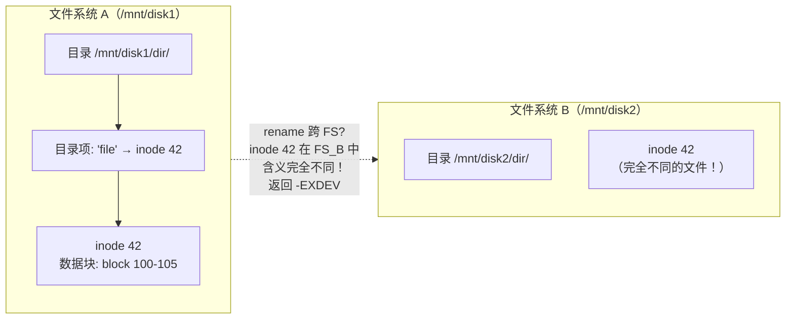
```mermaid
flowchart LR
    subgraph fs1["文件系统 A（/mnt/disk1）"]
        DIR_A["目录 /mnt/disk1/dir/"] --> ENTRY_A["目录项: 'file' → inode 42"]
        ENTRY_A --> INODE_A["inode 42<br/>数据块: block 100-105"]
    end

    subgraph fs2["文件系统 B（/mnt/disk2）"]
        DIR_B["目录 /mnt/disk2/dir/"]
        INODE_B["inode 42<br/>（完全不同的文件！）"]
    end

    fs1 -.->|"rename 跨 FS?<br/>inode 42 在 FS_B 中<br/>含义完全不同！<br/>返回 -EXDEV"| fs2
```

从实现角度看，不能跨文件系统 `rename` 的原因有：

1. **inode 空间不同**：文件系统 A 的 inode `42` 和文件系统 B 的 inode `42` 是完全不同的两个文件，不能在文件系统 B 的目录中创建一个指向文件系统 A 的 inode 的目录项
2. **底层存储不同**：inode 中的数据块指针指向的是当前文件系统的磁盘块编号，不能被另一个文件系统理解
3. **文件系统操作不可跨越**：`i_op->rename()` 是单个文件系统实例的操作，无法操作另一个文件系统的目录
4. **原子性无法保证**：即使能跨文件系统操作，也无法保证两个不同文件系统的目录项修改是原子的

在内核代码中，检查点在 `renameat2` 的第 `3` 步：

```cpp
error = -EXDEV;
if (old_path.mnt != new_path.mnt)   // 不在同一挂载点
    goto exit2;
```

####    mv 命令如何支持跨文件系统？

`mv` 命令在用户态首先尝试 `rename(2)`，如果返回 `-EXDEV`，则自动降级为 **copy + delete** 策略：

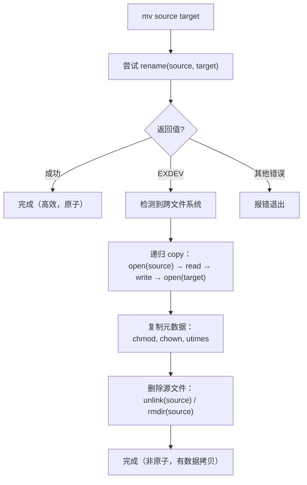
```mermaid
flowchart TB
    MV["mv source target"] --> TRY["尝试 rename(source, target)"]
    TRY --> CHK{"返回值?"}
    CHK -->|成功| DONE["完成（高效，原子）"]
    CHK -->|EXDEV| CROSS["检测到跨文件系统"]
    CROSS --> COPY["递归 copy：<br/>open(source) → read → write → open(target)"]
    COPY --> META["复制元数据：<br/>chmod, chown, utimes"]
    META --> DEL["删除源文件：<br/>unlink(source) / rmdir(source)"]
    DEL --> DONE2["完成（非原子，有数据拷贝）"]
    CHK -->|其他错误| ERR["报错退出"]
```

`mv` 跨文件系统的关键特点：

| 特性 | 同文件系统 rename | 跨文件系统 mv |
|------|-------------------|---------------|
| 实现方式 | `rename(2)` 系统调用 | copy + unlink |
| 原子性 | 原子操作 | **非原子**（可能中途失败） |
| 数据搬移 | 不搬移数据 | **需要完整拷贝数据** |
| 性能 | O(1)，与文件大小无关 | O(n)，与文件大小成正比 |
| inode 变化 | inode number 不变 | **inode number 改变** |
| 硬链接 | 保留硬链接关系 | **硬链接关系丢失** |

查看 GNU coreutils `mv` 的相关伪代码逻辑：

```cpp
// mv 的核心逻辑（简化）
int do_move(const char *source, const char *dest)
{
    // 首先尝试 rename
    if (rename(source, dest) == 0)
        return 0;   // 同文件系统，一步搞定

    if (errno != EXDEV)
        return -1;  // 其他错误，直接失败

    // 跨文件系统：降级为 copy + delete
    if (copy_file(source, dest) != 0)
        return -1;
    if (copy_metadata(source, dest) != 0)
        return -1;  // 尽力复制权限、时间戳等

    return remove(source);  // 删除源文件
}
```

##  0x08    并发 rename 与锁机制

####    内核在同一时刻可以执行多个 rename 吗？

| 场景 | 是否可并发 | 原因 |
|------|-----------|------|
| 不同文件系统上的 `rename` | **可以** | 各自使用各自超级块的 `s_vfs_rename_mutex` |
| 同一文件系统，同一目录内 `rename` | **不可以** | 同一 `i_mutex` |
| 同一文件系统，不同目录间 `rename` | **不可以** | `s_vfs_rename_mutex` 互斥 |

关键限制来自 `s_vfs_rename_mutex`：**同一个文件系统上的所有跨目录 rename 操作是串行执行的**。这是一个粗粒度的锁，保证了目录树操作的安全性

```cpp
// lock_rename 中的关键代码：
if (p1 != p2) {
    // 不同目录：必须获取 s_vfs_rename_mutex
    mutex_lock(&p1->d_sb->s_vfs_rename_mutex);
    // ...
}
```

注意：同一目录内的 rename（`p1 == p2`）**不需要获取** `s_vfs_rename_mutex`，只需要该目录的 `i_mutex`，因此理论上不同目录内部的各自 `rename` 操作可以并发。但在实际场景中，跨目录 `rename` 是更常见的场景

####    锁的层次结构

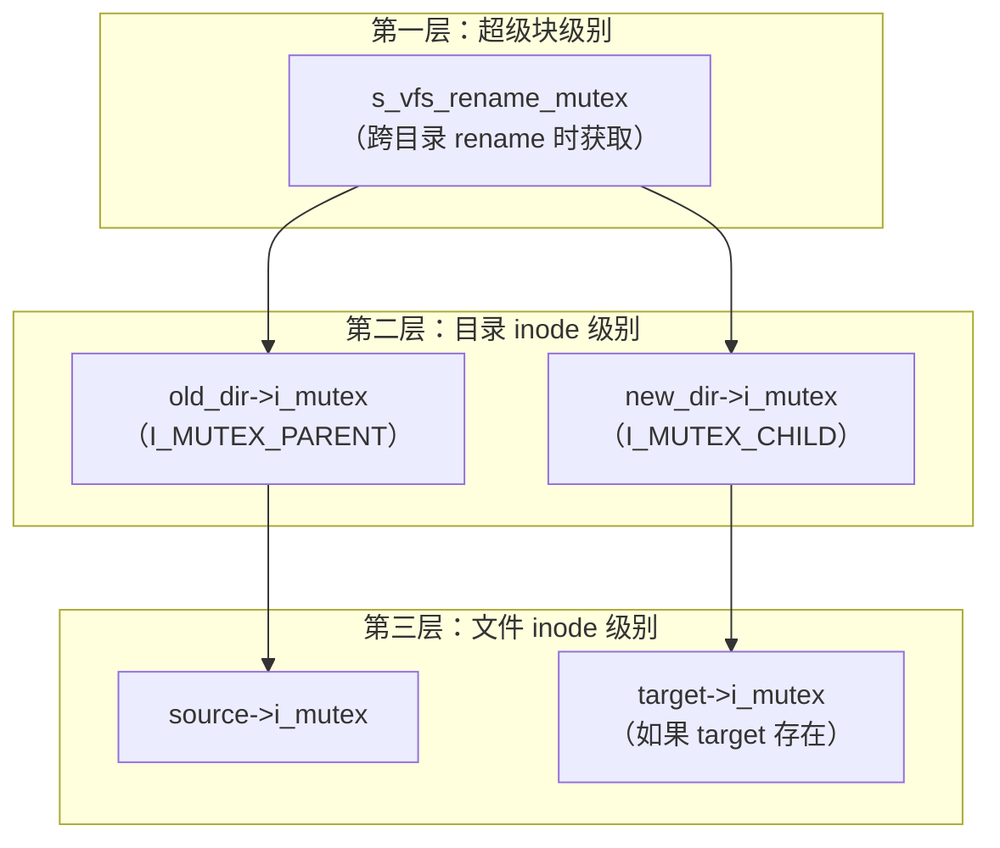
```mermaid
flowchart TB
    subgraph level1["第一层：超级块级别"]
        SB["s_vfs_rename_mutex<br/>（跨目录 rename 时获取）"]
    end

    subgraph level2["第二层：目录 inode 级别"]
        IM1["old_dir->i_mutex<br/>（I_MUTEX_PARENT）"]
        IM2["new_dir->i_mutex<br/>（I_MUTEX_CHILD）"]
    end

    subgraph level3["第三层：文件 inode 级别"]
        IM3["source->i_mutex"]
        IM4["target->i_mutex<br/>（如果 target 存在）"]
    end

    SB --> IM1
    SB --> IM2
    IM1 --> IM3
    IM2 --> IM4
```

为避免死锁，`rename` 的加锁原则总结如下：

1. **全局有序**：同一文件系统内跨目录 rename 通过 `s_vfs_rename_mutex` 串行化
2. **父子有序**：如果两个目录有祖先关系，先锁子目录，再锁父目录（和 lookup 路径的锁顺序一致）
3. **地址有序**：如果两个目录没有祖先关系，按内存地址顺序加锁
4. **嵌套级别标记**：使用 `I_MUTEX_PARENT` 和 `I_MUTEX_CHILD` 标记锁的嵌套级别，lockdep 工具可以检测潜在的死锁

##  0x09    ext4 文件系统的 rename 实现

当 VFS 层的 `vfs_rename` 调用 `old_dir->i_op->rename()` 时，对于 ext4 文件系统，实际调用的是 `ext4_rename2` 或 `ext4_rename`

####    ext4 rename 调用链


```mermaid
flowchart TB
    VFS["vfs_rename → i_op->rename2 / i_op->rename"]

    subgraph ext4["ext4 文件系统层"]
        R2["ext4_rename2(old_dir, old_dentry, new_dir, new_dentry, flags)"]
        R1["ext4_rename(old_dir, old_dentry, new_dir, new_dentry, flags)"]
        R2 --> FLAGS{"检查 flags"}
        FLAGS -->|RENAME_EXCHANGE| CROSS["ext4_cross_rename(...)"]
        FLAGS -->|其他| R1

        R1 --> JNL["ext4_journal_start 开启日志事务"]
        JNL --> FIND_OLD["ext4_find_entry(old_dir, old_name)<br/>找到源目录项"]
        FIND_OLD --> FIND_NEW["ext4_find_entry(new_dir, new_name)<br/>查找目标目录项"]
        FIND_NEW --> EXIST{"目标已存在?"}
        EXIST -->|是| UPDATE["ext4_rename_dir_finish:<br/>更新目标目录项的 inode 号<br/>指向源文件的 inode"]
        EXIST -->|否| ADD["ext4_add_entry:<br/>在目标目录添加新目录项"]
        UPDATE --> DEL_OLD["ext4_delete_entry:<br/>删除源目录中的旧目录项"]
        ADD --> DEL_OLD
        DEL_OLD --> DIR_CHK{"源是目录?"}
        DIR_CHK -->|是| DOTDOT["更新源目录的 '..' 条目<br/>指向新的父目录"]
        DIR_CHK -->|否| NLINK_UPD["更新 nlink 计数"]
        DOTDOT --> NLINK_UPD
        NLINK_UPD --> COMMIT["ext4_journal_stop 提交日志事务"]
    end
```

####    ext4_rename 的核心代码

```cpp
// https://elixir.bootlin.com/linux/v4.11.6/source/fs/ext4/namei.c#L3444
static int ext4_rename(struct inode *old_dir, struct dentry *old_dentry,
               struct inode *new_dir, struct dentry *new_dentry,
               unsigned int flags)
{
    // ...
    struct inode *old_inode, *new_inode;
    struct buffer_head *old_bh, *new_bh, *dir_bh;
    struct ext4_dir_entry_2 *old_de, *new_de;
    handle_t *handle;
    int retval;

    old_inode = d_inode(old_dentry);
    new_inode = d_inode(new_dentry);

    // 1. 开始 ext4 日志事务（Journal Transaction）
    // 需要足够的 credits 来修改多个目录块和 inode
    handle = ext4_journal_start(old_dir, EXT4_HT_DIR,
        (2 * EXT4_DATA_TRANS_BLOCKS(old_dir->i_sb) +
         EXT4_INDEX_EXTRA_TRANS_BLOCKS + 2));
    if (IS_ERR(handle))
        return PTR_ERR(handle);

    // 2. 在源目录中查找目录项
    old_bh = ext4_find_entry(old_dir, &old_dentry->d_name, &old_de, NULL);
    if (IS_ERR(old_bh)) {
        retval = PTR_ERR(old_bh);
        goto end_rename;
    }
    // 验证目录项指向正确的 inode
    if (le32_to_cpu(old_de->inode) != old_inode->i_ino)
        goto end_rename;

    // 3. 处理目标位置
    if (new_inode) {
        // 目标已存在：在目标目录中查找其目录项
        new_bh = ext4_find_entry(new_dir, &new_dentry->d_name, &new_de, NULL);
        if (IS_ERR(new_bh)) {
            retval = PTR_ERR(new_bh);
            goto end_rename;
        }
        // 如果目标是目录，检查是否为空
        if (S_ISDIR(new_inode->i_mode) && !ext4_empty_dir(new_inode))
            goto end_rename;
    } else {
        // 目标不存在：在目标目录中添加新目录项
        retval = ext4_add_entry(handle, new_dentry, old_inode);
        if (retval)
            goto end_rename;
    }

    // 4. 如果源是目录，更新 ".." 条目指向新父目录
    if (S_ISDIR(old_inode->i_mode)) {
        if (new_dir != old_dir) {
            // 修改子目录中 ".." 目录项的 inode 号
            // 使其指向新的父目录
            // ...
            // 更新父目录的 link count
            ext4_inc_count(handle, new_dir);
            ext4_update_dx_flag(new_dir);
            ext4_mark_inode_dirty(handle, new_dir);
        }
    }

    // 5. 如果目标已存在，更新其目录项指向源 inode
    if (new_inode) {
        ext4_rename_dir_finish(handle, new_de, new_bh, old_inode->i_ino);
        // 减少目标 inode 的 link count
        drop_nlink(new_inode);
        if (S_ISDIR(new_inode->i_mode))
            drop_nlink(new_inode);
        ext4_mark_inode_dirty(handle, new_inode);
    }

    // 6. 删除源目录中的旧目录项
    // 实质是将目录块中该目录项标记为删除（合并到前一个目录项的 rec_len 中）
    retval = ext4_delete_entry(handle, old_dir, old_de, old_bh);
    if (retval)
        goto end_rename;

    // 7. 如果源是目录，减少旧父目录的 link count
    if (S_ISDIR(old_inode->i_mode)) {
        ext4_dec_count(handle, old_dir);
        if (new_inode) {
            drop_nlink(new_inode);  // 目标目录也减少
        }
        ext4_update_dx_flag(old_dir);
    }

    // 8. 更新时间戳
    old_dir->i_ctime = old_dir->i_mtime = ext4_current_time(old_dir);
    new_dir->i_ctime = new_dir->i_mtime = ext4_current_time(new_dir);
    ext4_mark_inode_dirty(handle, old_dir);
    ext4_mark_inode_dirty(handle, new_dir);

    // 9. 提交日志事务
    retval = 0;

end_rename:
    brelse(dir_bh);
    brelse(old_bh);
    brelse(new_bh);
    ext4_journal_stop(handle);
    return retval;
}
```

####    ext4_rename2 入口

```cpp
// https://elixir.bootlin.com/linux/v4.11.6/source/fs/ext4/namei.c#L3583
static int ext4_rename2(struct inode *old_dir, struct dentry *old_dentry,
            struct inode *new_dir, struct dentry *new_dentry,
            unsigned int flags)
{
    // RENAME_NOREPLACE 在 VFS 层已经处理，这里直接走普通 rename
    if (flags & ~(RENAME_NOREPLACE | RENAME_EXCHANGE | RENAME_WHITEOUT))
        return -EINVAL;

    if (flags & RENAME_EXCHANGE) {
        // 原子交换两个文件的目录项
        return ext4_cross_rename(old_dir, old_dentry,
                     new_dir, new_dentry);
    }

    return ext4_rename(old_dir, old_dentry,
               new_dir, new_dentry, flags);
}
```

####    ext4 rename 的日志保护
ext4 使用 jbd2 日志系统来保证 rename 操作的原子性和崩溃一致性。整个 `rename` 操作被包裹在一个 **journal transaction** 中：

```text
ext4_journal_start(...)    // 开启事务
    ├── ext4_find_entry          // 查找目录项
    ├── ext4_add_entry           // 添加新目录项
    ├── ext4_delete_entry        // 删除旧目录项
    ├── ext4_mark_inode_dirty    // 标记 inode 脏
    └── ...
ext4_journal_stop(...)     // 提交事务
```

如果在 `rename` 过程中系统崩溃，jbd2 在下次挂载时会执行日志回放（replay），要么将事务完全提交，要么完全回滚，保证文件系统的一致性

####    ext4 目录项操作细节

`ext4_find_entry` 在目录的数据块中查找指定名称的目录项。ext4 支持两种目录组织方式：

1. **线性目录**：遍历目录块中的每个 `ext4_dir_entry_2` 结构
2. **HTree 索引目录**（大目录）：使用 B-tree 风格的哈希索引加速查找

```cpp
struct ext4_dir_entry_2 {
    __le32  inode;      // inode 编号（rename 时修改这个字段）
    __le16  rec_len;    // 到下一个目录项的距离
    __u8    name_len;   // 文件名长度
    __u8    file_type;  // 文件类型
    char    name[];     // 文件名（变长）
};
```

`ext4_delete_entry` 删除一个目录项的方式并非清零，而是将该目录项的空间合并到前一个目录项的 `rec_len` 中。这使得删除操作不需要移动其他目录项

##  0x0A    总结

####    rename 全流程时序

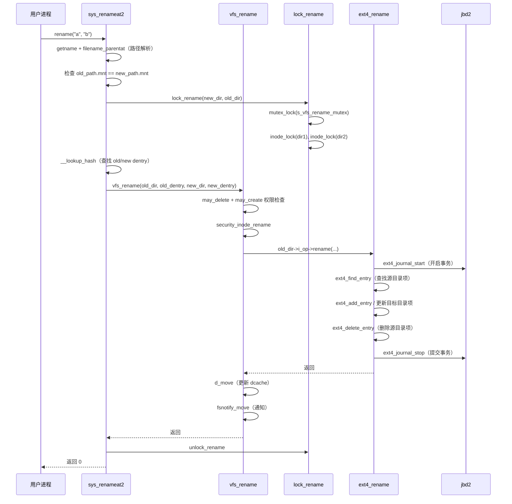
```mermaid
sequenceDiagram
    participant User as 用户进程
    participant Syscall as sys_renameat2
    participant VFS as vfs_rename
    participant Lock as lock_rename
    participant FS as ext4_rename
    participant Journal as jbd2

    User->>Syscall: rename("a", "b")
    Syscall->>Syscall: getname + filename_parentat（路径解析）
    Syscall->>Syscall: 检查 old_path.mnt == new_path.mnt
    Syscall->>Lock: lock_rename(new_dir, old_dir)
    Lock->>Lock: mutex_lock(s_vfs_rename_mutex)
    Lock->>Lock: inode_lock(dir1), inode_lock(dir2)
    Syscall->>Syscall: __lookup_hash（查找 old/new dentry）
    Syscall->>VFS: vfs_rename(old_dir, old_dentry, new_dir, new_dentry)
    VFS->>VFS: may_delete + may_create 权限检查
    VFS->>VFS: security_inode_rename
    VFS->>FS: old_dir->i_op->rename(...)
    FS->>Journal: ext4_journal_start（开启事务）
    FS->>FS: ext4_find_entry（查找源目录项）
    FS->>FS: ext4_add_entry / 更新目标目录项
    FS->>FS: ext4_delete_entry（删除源目录项）
    FS->>Journal: ext4_journal_stop（提交事务）
    FS-->>VFS: 返回
    VFS->>VFS: d_move（更新 dcache）
    VFS->>VFS: fsnotify_move（通知）
    VFS-->>Syscall: 返回
    Syscall->>Lock: unlock_rename
    Syscall-->>User: 返回 0
```

####    关键知识点小结

| 问题 | 说明 |
|------|------|
| `rename` 支持跨文件系统吗？ | **不支持**，返回 `EXDEV`。因为 inode 编号只在单个文件系统内有意义 |
| `rename` a-->b 后，b 的 inode 与谁相同？ | 与原来 **a** 的 inode 相同。rename 只修改目录项，不动 inode |
| mv 如何处理跨文件系统？ | 先尝试 `rename(2)`，失败后降级为 copy+delete（非原子） |
| 同一时刻能执行多个 `rename` 吗？ | 不同文件系统可以并发；同一文件系统的跨目录 rename 由 `s_vfs_rename_mutex` 串行化 |
| 加锁如何避免死锁？ | `lock_rename` 按祖先关系或地址顺序加锁，且使用 `s_vfs_rename_mutex` 保证全局有序 |
| ext4 如何保证 `rename` 原子性？ | 整个操作在一个 jbd2 journal transaction 中完成，崩溃时可回滚或重放 |

##  0x0B    参考
-	[rename代码阅读（linux 3.10.104）](https://blog.csdn.net/geshifei/article/details/81482660)
-   [rename(2) man page](https://man7.org/linux/man-pages/man2/rename.2.html)
-   [Linux v4.11.6 fs/namei.c](https://elixir.bootlin.com/linux/v4.11.6/source/fs/namei.c)
-   [Linux v4.11.6 fs/ext4/namei.c](https://elixir.bootlin.com/linux/v4.11.6/source/fs/ext4/namei.c)
-   [Documentation/filesystems/path-lookup.txt](https://www.kernel.org/doc/Documentation/filesystems/path-lookup.txt)
-   [Documentation/filesystems/directory-locking](https://www.kernel.org/doc/Documentation/filesystems/directory-locking)
