##  0x00    前言

本文以 ext4 文件系统为例，基于 [v4.11.6](https://elixir.bootlin.com/linux/v4.11.6/source) 内核源码，**全景分析** `write(fd, buf, count)` 系统调用从用户态进入内核后的完整执行路径。分析以 **Buffered I/O**（缓存写，默认路径）为主线，同时对 **Direct I/O**（直接写）做中等深度的补充分析


####    两种写入模式

-   **Buffered I/O（缓存 I/O）**：默认路径。数据先写入内核 Page Cache，`write` 系统调用即返回。之后由内核 writeback 线程异步将脏页刷到磁盘。对应用程序来说写入很快，但数据存在丢失风险（掉电时 Page Cache 中的脏数据未落盘）
-   **Direct I/O（直接 I/O）**：通过 `O_DIRECT` 标志打开文件。数据绕过 Page Cache，直接从用户空间缓冲区写到磁盘块设备。延迟更高但数据一致性更强，常用于数据库等自管缓存的场景

####    文档结构

本文按照数据在内核中流转的六个阶段进行分析：


-   **阶段一**：从用户态到 VFS（`write` → `vfs_write` → `new_sync_write`）
-   **阶段二**：ext4 层接入（`ext4_file_write_iter` → `__generic_file_write_iter`）
-   **阶段三**：Page Cache 与 `address_space_operations`（`generic_perform_write` 三大钩子）
-   **阶段四**：ext4 核心特性（Delayed Allocation / Extents Tree / mballoc）
-   **阶段五**：JBD2 日志层（Handle / Transaction / 日志模式）
-   **阶段六**：Writeback 回写与磁盘交互（`wb_workfn` → `ext4_writepages` → `submit_bio`）

一些前置的关联文章：

-   对Page Cache 管理的详细分析，参考 [内核之旅（二十一）：page cache](https://pandaychen.github.io/2025/11/02/A-LINUX-KERNEL-TRAVEL-21/)
-   对内核 read 路径分析，参考 [内核之旅（二十二）：内核视角下的 IO 读写（三）](https://pandaychen.github.io/2025/12/02/A-LINUX-KERNEL-TRAVEL-22/)
-   VFS 基础数据结构，参考 [内核之旅（二）：VFS（基础篇）](https://pandaychen.github.io/2024/11/20/A-LINUX-KERNEL-TRAVEL-3/)
-   对`iov_iter` 及其结构演进的详细分析，参考 [一次有趣的内核追踪：关于 iov_iter](https://pandaychen.github.io/2026/02/16/A-FUNNY-IOV_ITER-TRANSFORM/)

##  0x01    相关背景知识

####    应用层：一个write的例子
TODO

####    ext4 文件系统的三种日志模式

ext4 的可靠性依赖 JBD2（Journaling Block Device 2）日志子系统。根据挂载时 `data=` 参数的不同，ext4 支持三种日志模式：

| 模式 | 数据写日志 | 元数据写日志 | 安全性 | 性能 | 说明 |
|------|-----------|-------------|--------|------|------|
| `data=journal` | 是 | 是 | 最高 | 最低 | 数据和元V数据都先写日志再写磁盘，崩溃后可完整恢复 |
| `data=ordered`（默认） | 否 | 是 | 中等 | 中等 | 先将数据刷到磁盘，再提交元数据日志。保证元数据指向的数据块已写入 |
| `data=writeback` | 否 | 是 | 最低 | 最高 | 仅保证元数据一致性，数据写入顺序不做保证。崩溃后可能出现旧数据 |

不同日志模式对应不同的 `address_space_operations` 实现：

| 日志模式 | `address_space_operations` | `write_begin` | `write_end` |
|---------|--------------------------|---------------|-------------|
| `data=ordered` + delalloc（默认） | `ext4_da_aops` | `ext4_da_write_begin` | `ext4_da_write_end` |
| `data=ordered` 无 delalloc | `ext4_aops` | `ext4_write_begin` | `ext4_write_end` |
| `data=journal` | `ext4_journalled_aops` | `ext4_write_begin` | `ext4_journalled_write_end` |
| `data=writeback` + delalloc | `ext4_da_aops` | `ext4_da_write_begin` | `ext4_da_write_end` |

`ext4_da_aops`是ext4文件系统默认提供的实现，其他结构还有`ext4_journalled_aops`、`ext4_aops`。本文主要讨论ext4分区下，默认方式为delay allocation，对应的`write_begin/write_end`方法为`ext4_da_write_begin/ext4_da_write_end`


```cpp
static const struct address_space_operations ext4_aops = {
	.readpage		= ext4_readpage,
	.readpages		= ext4_readpages,
	.writepage		= ext4_writepage,
	.writepages		= ext4_writepages,
	.write_begin		= ext4_write_begin,
	.write_end		= ext4_write_end,
  ......
};

static const struct address_space_operations ext4_journalled_aops = {
	.readpage		= ext4_readpage,
	.readpages		= ext4_readpages,
	.writepage		= ext4_writepage,
	.writepages		= ext4_writepages,
	.write_begin		= ext4_write_begin,
	.write_end		= ext4_journalled_write_end,
  ......
};

// https://elixir.bootlin.com/linux/v4.11.6/source/fs/ext4/inode.c#L3779
static const struct address_space_operations ext4_da_aops = {
	.readpage		= ext4_readpage,
	.readpages		= ext4_readpages,
	.writepage		= ext4_writepage,
	.writepages		= ext4_writepages,
	.write_begin		= ext4_da_write_begin,
	.write_end		= ext4_da_write_end,
  ......
};
```

####    Delayed Allocation（延迟分配）机制概述

传统的写入流程中，`write_begin` 阶段就会调用块分配器为数据分配物理磁盘块。ext4 引入了 **Delayed Allocation（延迟分配）** 机制：在 `write` 阶段**只做空间预留（reservation）而不做实际的物理块分配**，真正的块分配推迟到 writeback（回写）阶段

延迟分配的优势：

1.  **减少磁盘碎片**：积累多个写请求后一次性分配，块分配器可以做出更优的布局决策
2.  **批量分配提高效率**：writeback 时知道文件的实际大小，可以一次分配连续的物理块
3.  **减少元数据更新**：短生命周期的临时文件可能在 writeback 前就被删除，完全避免了磁盘 I/O
4.  **与 extent 机制协同**：延迟分配使得 extent 可以覆盖更大的连续区域

####    核心数据结构

**`struct kiocb`**（Kernel I/O Control Block）：封装一次 I/O 操作的上下文

```cpp
// https://elixir.bootlin.com/linux/v4.11.6/source/include/linux/fs.h#L310
struct kiocb {
    struct file     *ki_filp;       // 关联的 file 结构
    loff_t          ki_pos;         // 当前读写位置
    void (*ki_complete)(struct kiocb *iocb, long ret, long ret2);
    void            *private;
    int             ki_flags;       // IOCB_DIRECT / IOCB_DSYNC / IOCB_SYNC 等标志
};
```

**`struct iov_iter`**：用户空间缓冲区的迭代器抽象，统一管理 `iovec`（用户态缓冲区数组）、`kvec`（内核态缓冲区）、`bio_vec`（块设备 I/O 向量）等多种缓冲区类型

```cpp
// https://elixir.bootlin.com/linux/v4.11.6/source/include/linux/uio.h#L36
struct iov_iter {
    int type;               // 迭代器类型（READ/WRITE）和缓冲区类型（ITER_IOVEC/ITER_KVEC/ITER_BVEC）
    size_t iov_offset;      // 当前 iovec 段内的偏移
    size_t count;           // 剩余待处理的总字节数
    union {
        const struct iovec *iov;    // 用户态缓冲区数组
        const struct kvec *kvec;    // 内核态缓冲区数组
        const struct bio_vec *bvec; // 块设备 I/O 向量
    };
    unsigned long nr_segs;  // 缓冲区段数
};
```

**`struct address_space`**：Page Cache 的核心管理结构，关联 inode 和其在内存中的所有缓存页

```cpp
// https://elixir.bootlin.com/linux/v4.11.6/source/include/linux/fs.h#L433
struct address_space {
    struct inode        *host;          // 所属的 inode
    struct radix_tree_root page_tree;   // 基数树，索引所有缓存页
    spinlock_t          tree_lock;      // 保护 page_tree
    atomic_t            i_mmap_writable;// 可写 mmap 的计数
    struct rb_root      i_mmap;         // 映射该 address_space 的 VMA 红黑树
    unsigned long       nrpages;        // 总页数
    const struct address_space_operations *a_ops;  // 操作方法表
    // ...
};
```

##  0x02    阶段一：从用户态到 VFS（Entry Point）

本节分析数据从 `write(fd, buf, count)` 系统调用进入内核空间，经过 VFS 通用处理后分发到具体文件系统的过程

####    调用链总览

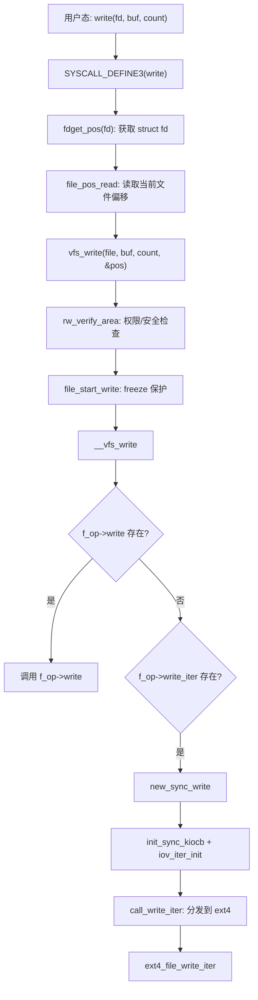

####    write 系统调用入口（调用链）

```cpp
// https://elixir.bootlin.com/linux/v4.11.6/source/fs/read_write.c#L564
SYSCALL_DEFINE3(write, unsigned int, fd, const char __user *, buf,
        size_t, count)
{
    struct fd f = fdget_pos(fd);    // 通过 fd 查找 struct file，同时获取文件位置锁
    ssize_t ret = -EBADF;

    if (f.file) {
        loff_t pos = file_pos_read(f.file);     // 读取当前文件偏移 f_pos
        ret = vfs_write(f.file, buf, count, &pos);
        if (ret >= 0)
            file_pos_write(f.file, pos);         // 写入成功，更新 f_pos
        fdput_pos(f);                            // 释放引用
    }

    return ret;
}

static inline void file_pos_write(struct file *file, loff_t pos)
{
	file->f_pos = pos;
}
```

`fdget_pos` 的关键点：它不仅通过文件描述符表查找 `struct file`，还会在多线程共享 fd 的场景下获取 `f_pos_lock` 互斥锁，保证并发 `write` 对同一 fd 的偏移更新是串行化的

####    vfs_write：VFS 通用写入处理

```cpp
// https://elixir.bootlin.com/linux/v4.11.6/source/fs/read_write.c#L520
ssize_t vfs_write(struct file *file, const char __user *buf, size_t count, loff_t *pos)
{
    ssize_t ret;

    if (!(file->f_mode & FMODE_WRITE))      // 检查文件是否以写模式打开
        return -EBADF;
    if (!(file->f_mode & FMODE_CAN_WRITE))   // 检查文件是否支持写操作
        return -EINVAL;
    if (unlikely(!access_ok(VERIFY_READ, buf, count)))  // 校验用户空间缓冲区地址合法性
        return -EFAULT;

    ret = rw_verify_area(WRITE, file, pos, count);  // LSM 安全检查 + 强制锁检查
    if (!ret) {
        if (count > MAX_RW_COUNT)
            count = MAX_RW_COUNT;            // 单次写入上限 MAX_RW_COUNT（2G - 1 页）
        file_start_write(file);              // 获取 sb_writers 信号量，防止文件系统 freeze 期间写入
        ret = __vfs_write(file, buf, count, pos);
        if (ret > 0) {
            fsnotify_modify(file);           // 通知 inotify/fanotify 监控
            add_wchar(current, ret);         // 更新进程的写入字节统计
        }
        inc_syscw(current);                  // 更新进程的系统调用写计数
        file_end_write(file);                // 释放 sb_writers 信号量
    }

    return ret;
}
```

`vfs_write` 中几个关键操作：

1.  **`rw_verify_area`**：调用 LSM（Linux Security Module）的 `security_file_permission` 检查写权限，同时检查 POSIX 强制锁（mandatory lock）是否阻止写入
2.  **`file_start_write` / `file_end_write`**：获取/释放 `sb_writers` 信号量。当文件系统执行 freeze（冻结）操作（如快照等操作），所有写入操作会被阻塞在此处
3.  **`MAX_RW_COUNT`**：限制单次写入不超过 `INT_MAX & PAGE_MASK`（约 2GB），避免溢出

####    __vfs_write 与 new_sync_write：写操作分发

```cpp
// https://elixir.bootlin.com/linux/v4.11.6/source/fs/read_write.c#L504
ssize_t __vfs_write(struct file *file, const char __user *p, size_t count,
            loff_t *pos)
{
    if (file->f_op->write)
        return file->f_op->write(file, p, count, pos);  // 旧式接口（已不推荐）
    else if (file->f_op->write_iter)
        return new_sync_write(file, p, count, pos);      // 新式迭代器接口（ext4_file_write_iter）
    else
        return -EINVAL;
}
```

由于ext4文件系统只实现了 `write_iter` 方法（即 `ext4_file_write_iter`），因此走 `new_sync_write` 路径：

```cpp
//ext4 文件系统的定义
const struct file_operations ext4_file_operations = {
  ......
	.write_iter	= ext4_file_write_iter, //只实现了write_iter方法
	.mmap		= ext4_file_mmap,
	.open		= ext4_file_open,
	.fsync		= ext4_sync_file,
	.get_unmapped_area = thp_get_unmapped_area,
	.splice_read	= generic_file_splice_read,
	.splice_write	= iter_file_splice_write,
  ......
};

// https://elixir.bootlin.com/linux/v4.11.6/source/fs/read_write.c#L474
static ssize_t new_sync_write(struct file *filp, const char __user *buf,
                              size_t len, loff_t *ppos)
{
    // 将用户空间缓冲区地址和长度封装为 iovec

    // 注意：用户空间的缓冲区地址buf是保存在iov中的
    // 该结构体对象记录了用户空间缓冲区地址buf和所要写的字节数len
    struct iovec iov = { .iov_base = (void __user *)buf, .iov_len = len };
    struct kiocb kiocb;
    struct iov_iter iter;
    ssize_t ret;

    init_sync_kiocb(&kiocb, filp);      // 初始化同步 IO 控制块，关联 file
    kiocb.ki_pos = *ppos;               // 设置写入起始位置

    // 将 iovec 封装为迭代器，type = WRITE | ITER_IOVEC
    iov_iter_init(&iter, WRITE, &iov, 1, len);

    // 调用文件系统的 write_iter 方法，对 ext4 即 ext4_file_write_iter
    ret = call_write_iter(filp, &kiocb, &iter);
    BUG_ON(ret == -EIOCBQUEUED);         // 同步 IO 不应返回排队状态
    if (ret > 0)
        *ppos = kiocb.ki_pos;            // 更新文件偏移
    return ret;
}
```

`new_sync_write` 完成了三个关键的封装：

1.  **`struct kiocb`**：将 `struct file` 和写入位置封装为 I/O 控制块。`init_sync_kiocb` 会根据文件的打开标志（`O_DSYNC`/`O_SYNC`）设置 `ki_flags` 中的 `IOCB_DSYNC`/`IOCB_SYNC`
2.  **`struct iov_iter`**：将用户空间的缓冲区地址和长度封装为迭代器。后续内核中所有的数据拷贝都通过这个迭代器进行
3.  **`call_write_iter`**：通过 `file->f_op->write_iter(kiocb, iter)` 将控制权交给具体文件系统

TODO

##  0x03    阶段二：ext4 层的接入

本节分析 ext4 如何接管写入请求，区分 Buffered I/O 与 Direct I/O，以及如何进入通用的缓冲区写入函数

####    ext4_file_operations 的定义

ext4 通过 `ext4_file_operations` 注册其文件操作方法表：

```cpp
// https://elixir.bootlin.com/linux/v4.11.6/source/fs/ext4/file.c#L691
const struct file_operations ext4_file_operations = {
    .llseek     = ext4_llseek,
    .read_iter  = generic_file_read_iter,       // 读：使用通用实现
    .write_iter = ext4_file_write_iter,         // 写：ext4 自定义实现
    .unlocked_ioctl = ext4_ioctl,
    .mmap       = ext4_file_mmap,
    .open       = ext4_file_open,
    .release    = ext4_release_file,
    .fsync      = ext4_sync_file,
    .get_unmapped_area = thp_get_unmapped_area,
    .splice_read    = generic_file_splice_read,
    .splice_write   = iter_file_splice_write,
    .fallocate  = ext4_fallocate,
};
```

####    ext4_file_write_iter：ext4 写入入口

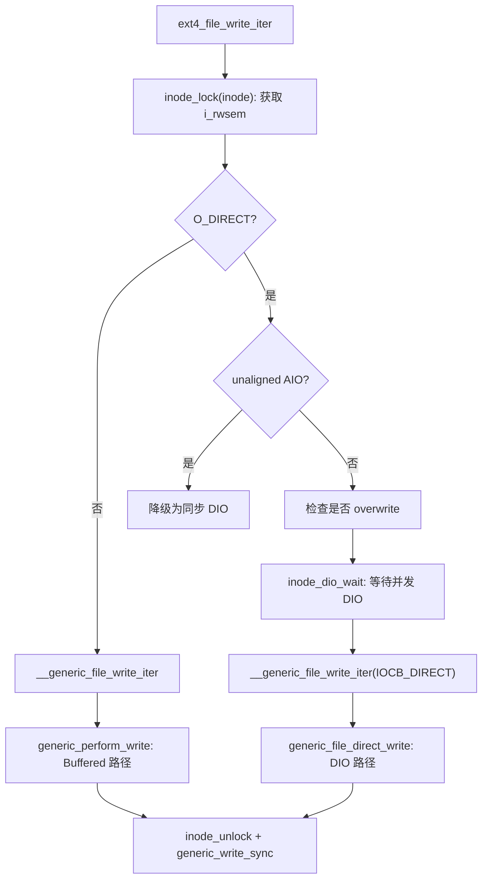

`ext4_file_write_iter`的实现如下：

```cpp
// https://elixir.bootlin.com/linux/v4.11.6/source/fs/ext4/file.c#L203
static ssize_t
ext4_file_write_iter(struct kiocb *iocb, struct iov_iter *from)
{
    struct inode *inode = file_inode(iocb->ki_filp);
    int o_direct = iocb->ki_flags & IOCB_DIRECT;
    int unaligned_aio = 0;
    int overwrite = 0;
    ssize_t ret;

    // 检查文件系统是否被强制关闭（如磁盘故障触发的 shutdown）
    if (unlikely(ext4_forced_shutdown(EXT4_SB(inode->i_sb))))
        return -EIO;

    /*
     * 获取 inode 的 i_rwsem 写锁，保护并发写操作。
     * 在 4.11.6 中 inode_lock 就是 mutex_lock(&inode->i_mutex)
     * (此版本 i_rwsem 已替代旧的 i_mutex，但语义相同：写独占)
     */
    inode_lock(inode);
    ret = generic_write_checks(iocb, from);  // 通用写入检查：文件大小限制、append 模式处理等
    if (ret <= 0)
        goto out;

    /*
     * 如果 inode 设置了 EXTENTS 标志但文件系统不支持 extent，
     * 或者遇到 inline data 的情况，需要特殊处理
     */
    if (o_direct) {
        /* Direct I/O 路径的特殊处理 */

        // 检测非对齐的异步 DIO：如果写入的偏移或长度不是块大小对齐的，
        // 且是异步 IO，则降级为同步处理（避免部分块写的复杂性）
        if (ext4_test_inode_flag(inode, EXT4_INODE_EXTENTS) &&
            !is_sync_kiocb(iocb) &&
            (iocb->ki_pos & (inode->i_sb->s_blocksize - 1) ||
             iov_iter_count(from) & (inode->i_sb->s_blocksize - 1))) {
            unaligned_aio = 1;
            inode_dio_wait(inode);  // 等待所有正在进行的 DIO 完成
        }

        /*
         * overwrite 检测：如果写入范围完全在已分配块内（不需要新分配块），
         * 则标记为 overwrite。overwrite 模式下可以降低锁粒度提升并发性能
         */
        // 通过 ext4_map_blocks 检查写入范围是否已分配 ...
    }

    ret = __generic_file_write_iter(iocb, from);

    inode_unlock(inode);

    if (ret > 0)
        ret = generic_write_sync(iocb, ret);    // 仅在 O_SYNC/O_DSYNC 模式下触发同步刷盘（仅在SYNC模式下有效）--- 见后文补充

    return ret;

out:
    inode_unlock(inode);
    return ret;
}
```

`ext4_file_write_iter` 中的关键机制：

1.  **`i_rwsem` 互斥锁**：ext4 在整个写入过程中持有 inode 的 `i_rwsem` 写锁（`inode_lock`），保证同一 inode 的并发写操作是串行化的。注意：读操作（`generic_file_read_iter`）只需要共享锁
2.  **unaligned AIO 降级**：对非块对齐的异步 DIO，内核需要做 read-modify-write，这在异步场景下很复杂，因此降级为同步处理
3.  **`generic_write_checks`**：检查文件大小限制（`RLIMIT_FSIZE`）、`O_APPEND` 模式下调整写入位置、检查写入范围是否超出文件系统限制等
4.  **`generic_write_sync`**：仅当文件以 `O_SYNC` 或 `O_DSYNC` 模式打开时才调用 `vfs_fsync_range` 强制刷盘

####    __generic_file_write_iter：Buffered vs Direct 分支（核心）

```cpp
// https://elixir.bootlin.com/linux/v4.11.6/source/mm/filemap.c#L2874
ssize_t __generic_file_write_iter(struct kiocb *iocb, struct iov_iter *from)
{
    struct file *file = iocb->ki_filp;
    struct address_space *mapping = file->f_mapping;
    struct inode *inode = mapping->host;
    ssize_t written = 0;
    ssize_t err;
    ssize_t status;

    /* 关联当前进程的 backing_dev_info，用于 writeback 的脏页限流 */
    current->backing_dev_info = inode_to_bdi(inode);

    err = file_remove_privs(file);      // 写入时清除 setuid/setgid 位（安全考量）
    if (err)
        goto out;

    err = file_update_time(file);       // 更新 mtime（修改时间）和 ctime（变更时间）
    if (err)
        goto out;

    if (iocb->ki_flags & IOCB_DIRECT) {
        /* Direct I/O 路径 */
        loff_t pos, endbyte;

        written = generic_file_direct_write(iocb, from);
        /*
         * DIO 可能回退到 buffered write（当写入范围包含空洞时）
         * 如果 DIO 写了部分数据，继续用 buffered 写剩余部分
         */
        if (written < 0 || !iov_iter_count(from) ||
            IS_DAX(inode))
            goto out;

        status = generic_perform_write(file, from, pos = iocb->ki_pos);
        if (unlikely(status < 0)) {
            err = status;
            goto out;
        }
        iocb->ki_pos += status;
        written += status;

        /*
         * DIO 回退到 buffered 后需要使 page cache 中相关页面失效，
         * 确保后续 DIO 读不会读到过期的缓存数据
         */
        endbyte = pos + status - 1;
        err = filemap_write_and_wait_range(mapping, pos, endbyte);
        if (err == 0) {
            invalidate_mapping_pages(mapping,
                         pos >> PAGE_SHIFT,
                         endbyte >> PAGE_SHIFT);
        }
    } else {
        /* Buffered I/O 路径（默认） */
        written = generic_perform_write(file, from, iocb->ki_pos);
        if (likely(written > 0))
            iocb->ki_pos += written;     // 更新 kiocb 中的文件偏移
    }

out:
    current->backing_dev_info = NULL;
    return written ? written : err;
}
EXPORT_SYMBOL(__generic_file_write_iter);
```

对于 **Buffered I/O**（本文重点），控制流直接进入 `generic_perform_write`，这是 VFS 层与具体文件系统 `address_space_operations` 交互的核心纽带

####    iov_iter 的工作方式

前文中，理解到 `iov_iter` 是内核用于迭代访问用户/内核缓冲区的统一接口。在 `write` 路径中，`new_sync_write` 通过 `iov_iter_init` 将用户的单个缓冲区（`buf + len`）包装为迭代器。对于 `writev` 系统调用，用户可以传入多个 `iovec` 段，`iov_iter` 同样可以透明地逐段迭代

`generic_perform_write` 中与 `iov_iter` 相关的关键操作：

-   `iov_iter_count(i)`：获取迭代器中剩余的待写入字节数
-   `iov_iter_fault_in_readable(i, bytes)`：预先触发用户页面的缺页，确保后续原子拷贝不会因缺页而失败
-   `iov_iter_copy_from_user_atomic(page, i, offset, bytes)`：在持有页锁的情况下，通过 `kmap_atomic` 原子地将用户数据拷贝到内核页
-   `iov_iter_advance(i, bytes)`：推进迭代器的位置和计数器

##  0x04    阶段三：Page Cache 与 address_space_operations

本节是 Buffered I/O 写入的核心部分。`generic_perform_write` 将用户数据以页为单位写入 Page Cache，这个过程通过三大钩子函数（`write_begin`、`write_end`等）与具体文件系统交互

####    generic_perform_write：按页写入循环

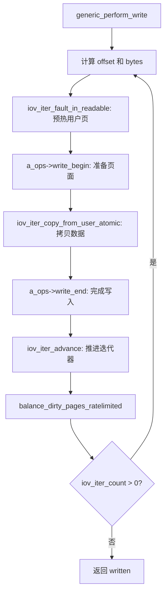

```cpp
// https://elixir.bootlin.com/linux/v4.11.6/source/mm/filemap.c#L2784
ssize_t generic_perform_write(struct file *file,
                struct iov_iter *i, loff_t pos)
{
    struct address_space *mapping = file->f_mapping;
    const struct address_space_operations *a_ops = mapping->a_ops;
    long status = 0;
    ssize_t written = 0;
    unsigned int flags = 0;

    if (!iter_is_iovec(i))
        flags |= AOP_FLAG_UNINTERRUPTIBLE;  // 内核空间拷贝不可中断（NFSD 是主要用户）

    //由于可能要写多页，所以需要一个大的循环进行处理
    do {
        struct page *page;
        unsigned long offset;   // 页内偏移
        unsigned long bytes;    // 本次写入字节数（不超过页内剩余空间）
        size_t copied;          // 实际拷贝的字节数
        void *fsdata;

        /* 计算页内偏移和本次写入字节数 */
        offset = (pos & (PAGE_SIZE - 1));   // pos 对 PAGE_SIZE 取模
        bytes = min_t(unsigned long, PAGE_SIZE - offset,
                        iov_iter_count(i));

again:
        /*
         * 预先触发用户页面的缺页异常。如果不这样做，后续在持有页锁的情况下
         * 执行 copy_from_user 可能触发缺页，而缺页处理可能需要获取同一个页锁
         * （当用户缓冲区恰好 mmap 到同一文件时），导致 ABBA 死锁
         */
        if (unlikely(iov_iter_fault_in_readable(i, bytes))) {
            status = -EFAULT;
            break;
        }

        if (fatal_signal_pending(current)) {
            status = -EINTR;
            break;
        }

        /* step1： write_begin：准备页面（分配/查找缓存页，准备 buffer_head） */
        status = a_ops->write_begin(file, mapping, pos, bytes, flags,
                        &page, &fsdata);
        if (unlikely(status < 0))
            break;

        /* 如果该页面被用户空间 mmap 了，刷新 dcache 保证一致性 */
        if (mapping_writably_mapped(mapping))
            flush_dcache_page(page);

        /* step2：数据拷贝：将用户数据原子地拷贝到内核页 */
        copied = iov_iter_copy_from_user_atomic(page, i, offset, bytes);
        flush_dcache_page(page);

        /* step3：write_end：完成写入（更新元数据、标记脏页） */
        status = a_ops->write_end(file, mapping, pos, bytes, copied,
                        page, fsdata);
        if (unlikely(status < 0))
            break;
        copied = status;

        cond_resched();     // 主动让出 CPU，避免长时间占用（大文件写入时）

        iov_iter_advance(i, copied);    // 推进迭代器
        if (unlikely(copied == 0)) {
            /*
             * 如果一个字节都没拷贝成功，说明用户页面可能跨段边界。
             * 缩小为单段长度重试，避免活锁
             */
            bytes = min_t(unsigned long, PAGE_SIZE - offset,
                        iov_iter_single_seg_count(i));
            goto again;
        }
        pos += copied;
        written += copied;

        /*
         * 脏页限流：如果系统中脏页比例超过阈值（dirty_ratio），
         * 当前进程会被阻塞在此处，直到 writeback 线程回写了足够的脏页。
         * 这是内核防止 OOM 的重要背压机制
         */
        balance_dirty_pages_ratelimited(mapping);
    } while (iov_iter_count(i));

    return written ? written : status;
}
```

####    write_begin 钩子：ext4_da_write_begin（循环内第一个钩子）

在默认的延迟分配模式下，`write_begin` 对应 `ext4_da_write_begin`。它负责在 Page Cache 中准备好一个页面供后续数据拷贝使用

```cpp
// https://elixir.bootlin.com/linux/v4.11.6/source/fs/ext4/inode.c#L3093
static int ext4_da_write_begin(struct file *file, struct address_space *mapping,
                loff_t pos, unsigned len, unsigned flags,
                struct page **pagep, void **fsdata)
{
    int ret, retries = 0;
    struct page *page;
    pgoff_t index;
    struct inode *inode = mapping->host;
    handle_t *handle;

    index = pos >> PAGE_SHIFT;  // 将文件偏移转换为页号

    // ...trim len to not cross page boundary...

retry_grab:
    /* 在 Page Cache 中查找或分配页面 */
    page = grab_cache_page_write_begin(mapping, index, flags);
    if (!page)
        return -ENOMEM;
    unlock_page(page);

    /*
     * 开启 JBD2 事务 handle。延迟分配模式下，write_begin 阶段主要操作的
     * 是元数据（extent status tree 的更新），所以需要日志保护
     */
retry_journal:
    handle = ext4_journal_start(inode, EXT4_HT_WRITE_PAGE,
                ext4_da_write_credits(inode, pos, len));
    if (IS_ERR(handle)) {
        put_page(page);
        return PTR_ERR(handle);
    }

    lock_page(page);
    if (page->mapping != mapping) {
        /* 页面在我们重新获取锁之前被截断了，重试 */
        unlock_page(page);
        put_page(page);
        ext4_journal_stop(handle);
        goto retry_grab;
    }

    /* 准备 buffer_head 并预留延迟分配空间 */
    ret = __block_write_begin(page, pos, len, ext4_da_get_block_prep);
    if (ret < 0) {
        unlock_page(page);
        ext4_journal_stop(handle);
        if (ret == -ENOSPC &&
            ext4_should_retry_alloc(inode->i_sb, &retries))
            goto retry_journal;
        put_page(page);
        return ret;
    }

    *pagep = page;
    return ret;
}
```

`ext4_da_write_begin` 的关键步骤：

1.  **`grab_cache_page_write_begin`**：在 Page Cache 的 radix tree 中查找指定页号的页面。如果不存在，分配一个新页面并插入 radix tree。返回时页面已被锁定且引用计数递增

2.  **`ext4_journal_start`**：开启一个 JBD2 事务 handle。即使是延迟分配，也需要日志来保护 extent status tree 的元数据更新

3.  **`__block_write_begin`**（通过 `ext4_da_get_block_prep`）：为页面中需要写入的区域准备 `buffer_head`。对于延迟分配，`ext4_da_get_block_prep` 不会真正分配物理块，而是：
    -   调用 `ext4_da_reserve_space` 在磁盘配额和计数器中预留空间
    -   调用 `ext4_es_insert_delayed_block` 在 extent status tree 中记录一个 delayed 状态的 extent
    -   对于需要部分写入的页面（不是整页覆盖），如果页面不是 uptodate 的，需要先从磁盘读入已有数据

补充一下`grab_cache_page_write_begin--->pagecache_get_page`的实现：

todo

```c
//https://elixir.bootlin.com/linux/v4.11.6/source/mm/filemap.c#L2766
struct page *grab_cache_page_write_begin(struct address_space *mapping,
					pgoff_t index, unsigned flags)
{
	struct page *page;
	int fgp_flags = FGP_LOCK|FGP_WRITE|FGP_CREAT;

	if (flags & AOP_FLAG_NOFS)
		fgp_flags |= FGP_NOFS;

	page = pagecache_get_page(mapping, index, fgp_flags,
			mapping_gfp_mask(mapping));
	if (page)
		wait_for_stable_page(page);

	return page;
}
EXPORT_SYMBOL(grab_cache_page_write_begin);

//https://elixir.bootlin.com/linux/v4.11.6/source/mm/filemap.c#L1269
struct page *pagecache_get_page(struct address_space *mapping, pgoff_t offset,
	int fgp_flags, gfp_t gfp_mask)
{
	struct page *page;

repeat:
	page = find_get_entry(mapping, offset);
	if (radix_tree_exceptional_entry(page))
		page = NULL;
	if (!page)
		goto no_page;

	if (fgp_flags & FGP_LOCK) {
		if (fgp_flags & FGP_NOWAIT) {
			if (!trylock_page(page)) {
				put_page(page);
				return NULL;
			}
		} else {
			lock_page(page);
		}

		/* Has the page been truncated? */
		if (unlikely(page->mapping != mapping)) {
			unlock_page(page);
			put_page(page);
			goto repeat;
		}
		VM_BUG_ON_PAGE(page->index != offset, page);
	}

	if (page && (fgp_flags & FGP_ACCESSED))
		mark_page_accessed(page);

no_page:
	if (!page && (fgp_flags & FGP_CREAT)) {
		int err;
		if ((fgp_flags & FGP_WRITE) && mapping_cap_account_dirty(mapping))
			gfp_mask |= __GFP_WRITE;
		if (fgp_flags & FGP_NOFS)
			gfp_mask &= ~__GFP_FS;

		page = __page_cache_alloc(gfp_mask);
		if (!page)
			return NULL;

		if (WARN_ON_ONCE(!(fgp_flags & FGP_LOCK)))
			fgp_flags |= FGP_LOCK;

		/* Init accessed so avoid atomic mark_page_accessed later */
		if (fgp_flags & FGP_ACCESSED)
			__SetPageReferenced(page);

		err = add_to_page_cache_lru(page, mapping, offset,
				gfp_mask & GFP_RECLAIM_MASK);
		if (unlikely(err)) {
			put_page(page);
			page = NULL;
			if (err == -EEXIST)
				goto repeat;
		}
	}

	return page;
}
EXPORT_SYMBOL(pagecache_get_page);
```

####    数据拷贝：iov_iter_copy_from_user_atomic

`write_begin` 完成后，页面已准备就绪，接下来将用户数据拷贝到内核页：

TODO

```cpp
// https://elixir.bootlin.com/linux/v4.11.6/source/lib/iov_iter.c#L763
size_t iov_iter_copy_from_user_atomic(struct page *page,
        struct iov_iter *i, unsigned long offset, size_t bytes)
{
    char *kaddr = kmap_atomic(page), *p = kaddr + offset;
    iterate_all_kinds(i, bytes, v,
        copyin((p += v.iov_len) - v.iov_len, v.iov_base, v.iov_len),
        memcpy_from_page((p += v.bv_len) - v.bv_len, v.bv_page,
                 v.bv_offset, v.bv_len),
        memcpy((p += v.iov_len) - v.iov_len, v.iov_base, v.iov_len)
    )
    kunmap_atomic(kaddr);
    return bytes;
}
```

关键机制：

-   **`kmap_atomic`**：对高端内存（HIGHMEM）页面建立临时的内核虚拟地址映射。这个映射是 per-CPU 的、不可抢占的，所以称为"原子"。在 64 位系统上这通常是空操作（直接线性映射）
-   **`copyin`**（即 `__copy_from_user_inatomic`）：从用户空间拷贝数据。与普通的 `copy_from_user` 不同，原子版本在缺页时不会睡眠，而是返回未拷贝的字节数。这就是为什么前面要先调用 `iov_iter_fault_in_readable` 预热页面
-   **`kunmap_atomic`**：解除临时映射

####    write_end 钩子：ext4_da_write_end（循环内第二个钩子）

数据拷贝完成后，`write_end` 负责更新元数据并标记脏页：

```cpp
// https://elixir.bootlin.com/linux/v4.11.6/source/fs/ext4/inode.c#L3164
static int ext4_da_write_end(struct file *file,
                struct address_space *mapping,
                loff_t pos, unsigned len, unsigned copied,
                struct page *page, void *fsdata)
{
    struct inode *inode = mapping->host;
    int ret = 0, ret2;
    handle_t *handle = ext4_journal_current_handle();
    loff_t new_i_size;
    unsigned long start, end;
    int write_mode = (int)(unsigned long)fsdata;

    // ...inline data handling...

    start = pos & (PAGE_SIZE - 1);
    end = start + copied - 1;

    /*
     * generic_write_end 是通用的 write_end 实现，它会：
     * 1. 调用 block_write_end 更新 buffer_head 状态（标记 BH_Uptodate / BH_Dirty）
     * 2. 如果写入扩展了文件，更新 i_size
     * 3. 解锁页面并释放引用
     * 4. 标记页面为 dirty（通过 __set_page_dirty_buffers）
     */
    ret = generic_write_end(file, mapping, pos, len, copied, page, fsdata);

    /*
     * 如果写入位置超出了当前文件大小，需要更新 inode 的 i_disksize。
     * i_disksize 是已知的磁盘上的文件大小（可能小于 i_size），
     * 在延迟分配模式下，i_size 可能超前于 i_disksize
     */
    new_i_size = pos + copied;
    if (new_i_size > EXT4_I(inode)->i_disksize) {
        ext4_update_i_disksize(inode, new_i_size);
    }

    /* 停止 JBD2 事务 handle */
    ret2 = ext4_journal_stop(handle);
    if (!ret)
        ret = ret2;

    return ret ? ret : copied;
}
```

`generic_write_end` 内部调用链：

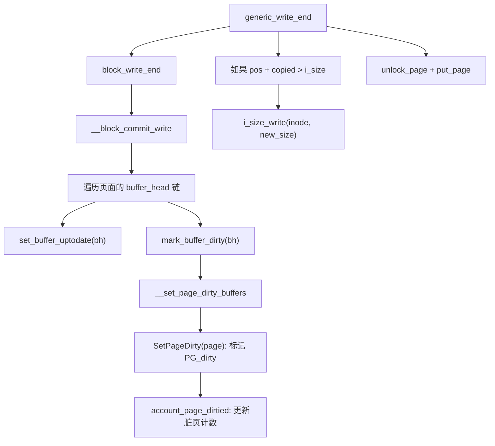

`write_end` 完成后的状态如下：

1.  数据已经从用户空间拷贝到 Page Cache 的页面中
2.  页面被标记为 `PG_dirty`（脏页）
3.  关联的 `buffer_head` 被标记为 `BH_Dirty` 和 `BH_Uptodate`
4.  如果文件增长了，`i_size` 已更新
5.  JBD2 事务 handle 已停止

**此时 `write` 系统调用就可以返回了**（对于用户态系统调用而言），**数据还在内存中的 Page Cache 里，并未写入磁盘。后续由 writeback 机制异步刷盘**

##  0x05    阶段四：ext4 核心特性分析

本节深入分析在写入路径中涉及的三个 ext4 核心特性：延迟分配、范围树（Extents）和多块分配器（mballoc）

####    Delayed Allocation（延迟分配）

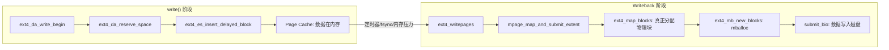

**为什么不在 write 阶段立即分配物理块？**

考虑一个应用程序向文件写入 100 个 4KB 的块：

-   **即时分配**：每次 `write_begin` 都调用块分配器，可能分配到不连续的物理块，产生碎片。如果文件随后被删除，这 100 次分配完全浪费
-   **延迟分配**：100 次 `write` 都只在 Page Cache 中标记脏页。当 writeback 触发时，分配器一次性看到需要 100 个连续块，可以做出最优的分配决策

**`ext4_da_reserve_space`：空间预留**

```cpp
// https://elixir.bootlin.com/linux/v4.11.6/source/fs/ext4/inode.c#L1563
static int ext4_da_reserve_space(struct inode *inode)
{
    struct ext4_sb_info *sbi = EXT4_SB(inode->i_sb);
    struct ext4_inode_info *ei = EXT4_I(inode);
    int ret;

    /*
     * 使用 dquot 系统预留一个数据块 + 可能需要的元数据块。
     * 虽然还没有分配物理块，但需要确保后续 writeback 时有足够的空间
     */
    ret = dquot_reserve_block(inode, EXT4_C2B(sbi, 1));
    if (ret)
        return ret;

    spin_lock(&ei->i_block_reservation_lock);
    ei->i_reserved_data_blocks++;        // 预留的数据块计数 +1
    spin_unlock(&ei->i_block_reservation_lock);

    return 0;
}
```

**`ext4_es_insert_delayed_block`：在 extent status tree 中记录**

Extent status tree 是 ext4 在内存中维护的一棵红黑树，记录每个逻辑块的状态（已写入 / 未写入 / 延迟分配 / 空洞）。延迟分配的块在此树中标记为 `EXTENT_STATUS_DELAYED`，直到 writeback 阶段转换为实际的物理映射

####    Extents Tree（范围树）

ext4 使用 **extent** 而非传统的间接块映射（ext2/ext3）来管理逻辑块到物理块的映射。一个 extent 描述一段连续的逻辑块到连续物理块的映射，大幅减少了大文件的元数据开销

```cpp
// https://elixir.bootlin.com/linux/v4.11.6/source/fs/ext4/ext4_extents.h#L88
struct ext4_extent {
    __le32  ee_block;       // 起始逻辑块号
    __le16  ee_len;         // 覆盖的块数（高位用于标记 unwritten）
    __le16  ee_start_hi;    // 起始物理块号的高 16 位
    __le32  ee_start_lo;    // 起始物理块号的低 32 位
};

struct ext4_extent_idx {
    __le32  ei_block;       // 覆盖的起始逻辑块号
    __le32  ei_leaf_lo;     // 指向下一层节点的物理块号（低 32 位）
    __le16  ei_leaf_hi;     // 物理块号的高 16 位
    __u16   ei_unused;
};

struct ext4_extent_header {
    __le16  eh_magic;       // 魔数 0xF30A
    __le16  eh_entries;     // 有效 entry 数
    __le16  eh_max;         // 最大 entry 容量
    __le16  eh_depth;       // 树的深度（0 = 叶节点）
    __le32  eh_generation;  // 版本号
};
```

Extents tree 的结构是一棵 B-tree：

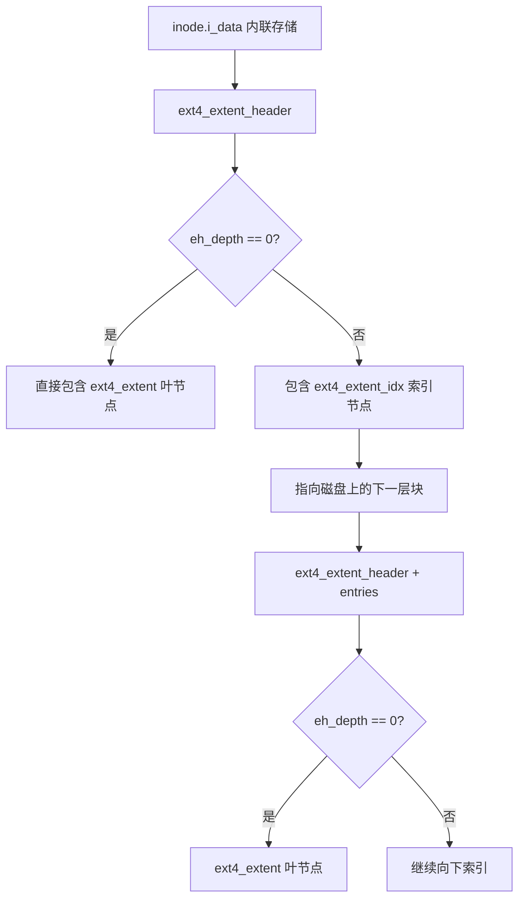

-   **小文件**（几个 extent 就能描述）：extent 直接内联在 inode 的 `i_data`（60 字节，可容纳 4 个 extent）
-   **大文件**：扩展为多层索引树，索引节点存储在额外的磁盘块中

**`ext4_ext_map_blocks`**：extent 树的核心查找/插入函数，在 writeback 阶段被调用，负责将逻辑块号映射到物理块号。如果找不到映射（延迟分配的块），则调用 mballoc 分配新的物理块

####    Multi-Block Allocator（mballoc）

mballoc 是 ext4 的块分配器，当 writeback 阶段需要真正分配物理块时被调用

```cpp
// https://elixir.bootlin.com/linux/v4.11.6/source/fs/ext4/mballoc.c#L4586
ext4_fsblk_t ext4_mb_new_blocks(handle_t *handle,
                struct ext4_allocation_request *ar, int *errp)
{
    struct ext4_allocation_context *ac = NULL;
    struct ext4_sb_info *sbi;
    // ...

    /* 归一化请求：将小的分配请求扩展为更大的对齐请求 */
    ext4_mb_normalize_request(ac, ar);

    /* 尝试使用 preallocation（预分配）满足请求 */
    ext4_mb_use_preallocation(ac);

    if (!ac->ac_found) {
        /* 预分配未满足，走正式的伙伴系统分配 */
        ext4_mb_regular_allocator(ac);
    }

    // ...
    *errp = ext4_mb_mark_diskspace_used(ac, handle, reserv_clstrs);
    // ...

    return block;
}
```

mballoc 的分配策略：

1.  **预分配（Preallocation）**：ext4 维护两级预分配池：
    -   **inode preallocation**（`pa_inode_list`）：为单个文件预分配的连续块，文件下次写入时直接从中取用
    -   **locality group preallocation**（`pa_loc_list`）：同一目录下小文件共享的预分配池，减少碎片

2.  **`ext4_mb_normalize_request`**：将实际的分配请求"归一化"为更大的请求。例如，分配 1 个块时可能被扩展为 32 个块的请求，多余的块放入预分配池

3.  **伙伴系统（Buddy System）**：每个块组（block group）维护一个伙伴系统位图，管理不同大小的连续空闲块。分配时按照"best fit"或"first fit"策略查找合适的空闲区域

4.  **分配目标选择**：mballoc 会尽量将同一文件的数据块分配在同一块组中（locality），减少寻道时间

##  0x06    阶段五：JBD2 日志层（Journaling）

JBD2（Journaling Block Device 2）是 ext4 的日志子系统，保证文件系统元数据在系统崩溃后的一致性

####    Handle、Transaction 与 Journal 的关系

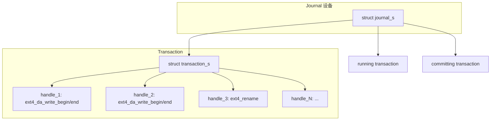

三者的层次关系：

-   **`handle_t`**（`struct handle_s`）：代表一次原子文件系统操作（如一次 `write_begin` + `write_end`）。每个 handle 声明自己需要修改的最大块数（credits）
-   **`transaction_t`**（`struct transaction_s`）：一个事务容器，包含多个 handle。日志系统将多个 handle 的修改合并到一个 transaction 中批量提交，提高吞吐量
-   **`journal_t`**（`struct journal_s`）：日志设备的管理结构，维护运行中的 transaction（`j_running_transaction`）和正在提交的 transaction（`j_committing_transaction`）

####    日志 API 在 write 路径中的使用

在 `ext4_da_write_begin` 和 `ext4_da_write_end` 中，日志 API 的使用方式：

```cpp
// ext4_da_write_begin 中
handle = ext4_journal_start(inode, EXT4_HT_WRITE_PAGE,
            ext4_da_write_credits(inode, pos, len));
// ... 修改元数据 ...

// ext4_da_write_end 中
ext4_journal_stop(handle);
```

`ext4_journal_start` 和 `ext4_journal_stop` 的实现：

```cpp
// ext4_journal_start 最终调用：
// https://elixir.bootlin.com/linux/v4.11.6/source/fs/jbd2/transaction.c#L341
handle_t *jbd2__journal_start(journal_t *journal, int nblocks, int rsv_blocks,
                  gfp_t gfp_mask, unsigned int type,
                  unsigned int line_no)
{
    handle_t *handle = journal_current_handle();

    if (handle) {
        /* 嵌套 handle：递增引用计数即可 */
        handle->h_ref++;
        return handle;
    }

    handle = new_handle(nblocks);
    // ...

    /*
     * 将 handle 加入当前运行的 transaction。
     * 如果当前没有 running transaction，会创建一个新的。
     * 如果 running transaction 的剩余 credits 不足，
     * 会等待当前 transaction 提交后再开启新的
     */
    err = start_this_handle(journal, handle, gfp_mask);
    // ...

    return handle;
}
```

```cpp
// https://elixir.bootlin.com/linux/v4.11.6/source/fs/jbd2/transaction.c#L1537
int jbd2_journal_stop(handle_t *handle)
{
    transaction_t *transaction = handle->h_transaction;
    journal_t *journal;

    // ...

    if (handle->h_ref > 1) {
        handle->h_ref--;    // 嵌套 handle，递减引用即可
        return 0;
    }

    journal = transaction->t_journal;

    /*
     * 如果当前 handle 是 transaction 中的最后一个活跃 handle，
     * 且 transaction 已经超时（达到 commit interval），
     * 则唤醒 kjournald2 线程提交 transaction
     */
    if (handle->h_sync ||
        transaction->t_outstanding_credits >
            journal->j_max_transaction_buffers ||
        time_after_eq(jiffies, transaction->t_expires)) {
        // ... 触发 transaction commit ...
    }

    // 释放 handle
    jbd2_free_handle(handle);
    return err;
}
```

####    Transaction Commit 流程

当 transaction 需要提交时（定时器超时、日志空间不足或显式 `fsync`），`jbd2_journal_commit_transaction` 执行以下步骤：

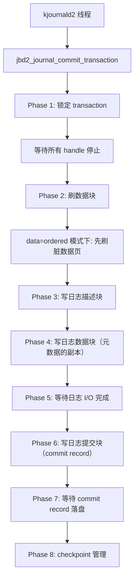

在 `data=ordered` 模式（默认）下，commit 流程保证了以下顺序：
1.  先将数据页（file data）刷到磁盘
2.  再将元数据的日志记录写入日志设备
3.  最后写入 commit record

这个顺序保证了：如果在步骤 2 之后、步骤 3 之前崩溃，日志没有 commit record，恢复时会丢弃这个 transaction，元数据回到旧状态；如果在步骤 3 完成后崩溃，恢复时会重放日志，元数据指向的数据块一定是新写入的（因为步骤 1 保证了数据先落盘）

##  0x07    阶段六：Writeback（回写）与磁盘交互

`write` 系统调用返回时，数据通常还在 Page Cache（内存）中。本节分析数据是如何最终落盘的

####    Writeback 触发条件

| 触发场景 | 触发路径 | 说明 |
|---------|---------|------|
| 定时器过期 | `wb_workfn` → `wb_check_old_data_flush` | 默认每 5 秒（`dirty_writeback_centisecs = 500`）检查一次 |
| 脏页比例超限 | `balance_dirty_pages_ratelimited` → `balance_dirty_pages` | 脏页占总内存超过 `dirty_ratio`（默认 20%）时，写入进程被同步回写阻塞 |
| 后台回写 | `wb_over_bg_thresh` → `wb_start_background_writeback` | 脏页占比超过 `dirty_background_ratio`（默认 10%）时，唤醒后台回写线程 |
| 显式 fsync/sync | `vfs_fsync_range` → `ext4_sync_file` | 应用程序主动要求数据落盘 |
| 内存回收 | `shrink_page_list` → `pageout` | OOM 或内存紧张时，回收脏页前先写回 |

####    内核回写线程调用链

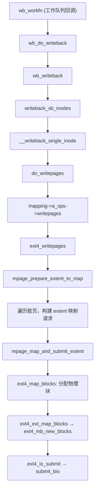

每个 `backing_dev_info`（BDI，即每个块设备）关联一个回写工作队列。内核线程池中的 worker 线程执行 `wb_workfn`，它是回写的入口：

```cpp
// https://elixir.bootlin.com/linux/v4.11.6/source/fs/fs-writeback.c#L1861
void wb_workfn(struct work_struct *work)
{
    struct bdi_writeback *wb = container_of(to_delayed_work(work),
                        struct bdi_writeback, dwork);
    long pages_written;

    // ...
    if (likely(!current_is_workqueue_rescuer() ||
          !test_bit(WB_registered, &wb->state))) {
        do {
            pages_written = wb_do_writeback(wb);
        } while (!list_empty(&wb->work_list));
    }
    // ...
}
```

`wb_writeback` 会遍历 BDI 上所有需要回写的 inode（按脏标记时间排序），对每个 inode 调用 `__writeback_single_inode`。最终通过 `do_writepages` 调用文件系统的 `writepages` 方法

####    ext4_writepages：ext4 的回写核心

`ext4_writepages` 是延迟分配模式下真正将数据从 Page Cache 写到磁盘的函数。这是 **Delayed Allocation 生命周期的后半段**——此时才进行物理块的分配

```cpp
// https://elixir.bootlin.com/linux/v4.11.6/source/fs/ext4/inode.c#L2579
static int ext4_writepages(struct address_space *mapping,
               struct writeback_control *wbc)
{
    struct inode *inode = mapping->host;
    struct ext4_map_blocks map;
    struct mpage_da_data mpd;
    handle_t *handle = NULL;
    // ...

    mpd.inode = inode;
    mpd.first_page = 0;
    mpd.next_page = 0;
    mpd.io_submit.io_end = NULL;

    /* 遍历脏页区间 */
    while (!ret && mpd.first_page <= mpd.last_page) {
        /* 开启 JBD2 事务（此时需要真正修改磁盘元数据） */
        handle = ext4_journal_start(inode, EXT4_HT_WRITE_PAGE,
                    needed_blocks);

        /*
         * 扫描脏页，构建逻辑块范围 → 物理块的映射请求。
         * 将连续的脏页聚合为尽可能大的 extent
         */
        ret = mpage_prepare_extent_to_map(&mpd);

        if (mpd.map.m_len > 0) {
            /*
             * 核心操作：将延迟分配的逻辑块映射为物理块。
             * 这里真正调用 ext4_map_blocks → ext4_ext_map_blocks → ext4_mb_new_blocks
             * 完成物理块分配
             */
            ret = mpage_map_and_submit_extent(handle, &mpd, &give_up_on_write);
        }

        ext4_journal_stop(handle);
    }

    // ...
}
```

**`mpage_prepare_extent_to_map`**：遍历 address_space 中的脏页（通过 `pagevec_lookup_tag` 查找带 `PAGECACHE_TAG_DIRTY` 标签的页面），将连续的脏页聚合为一个逻辑块范围

**`mpage_map_and_submit_extent`**：对聚合的逻辑块范围调用 `ext4_map_blocks` 分配物理块，然后将映射好的页面构建为 BIO 并提交

```cpp
// mpage_map_and_submit_extent 中的核心调用
static int mpage_map_one_extent(handle_t *handle, struct mpage_da_data *mpd)
{
    struct inode *inode = mpd->inode;
    struct ext4_map_blocks *map = &mpd->map;
    int get_blocks_flags;

    /*
     * ext4_map_blocks 是 extent 操作的统一入口：
     * 对于延迟分配的块，它会调用 ext4_ext_map_blocks 真正分配物理块，
     * 并将 extent 插入到 inode 的 extent tree 中
     */
    return ext4_map_blocks(handle, inode, map, get_blocks_flags);
}
```

####    BIO 提交：从 Page Cache 到块设备

物理块分配完成后，`ext4_writepages` 将脏页构建为 BIO（Block I/O）结构并提交给块设备层：

```cpp
// https://elixir.bootlin.com/linux/v4.11.6/source/fs/ext4/page-io.c
void ext4_io_submit(struct ext4_io_submit *io)
{
    struct bio *bio = io->io_bio;

    if (bio) {
        int io_op_flags = io->io_wbc->sync_mode == WB_SYNC_ALL ?
                  WRITE_SYNC : 0;
        submit_bio(WRITE | io_op_flags, bio);   // 提交 BIO 到块设备层
    }
    io->io_bio = NULL;
}
```

`submit_bio` 将 BIO 提交给块设备的请求队列（request queue）。块设备层的 I/O 调度器（如 CFQ、deadline、noop）会对请求进行合并和排序，最终由块设备驱动将数据写入物理磁盘

**`struct bio`** 是内核块 I/O 子系统的核心数据结构，描述一次磁盘 I/O 操作：

```cpp
// https://elixir.bootlin.com/linux/v4.11.6/source/include/linux/blk_types.h#L46
struct bio {
    struct bio          *bi_next;       // 链表，多个 bio 可以链在一起
    struct block_device *bi_bdev;       // 目标块设备
    unsigned int        bi_opf;         // 操作类型（READ/WRITE）和标志
    struct bvec_iter    bi_iter;        // 迭代器：起始扇区、剩余字节数
    unsigned short      bi_vcnt;        // bio_vec 段数
    struct bio_vec      *bi_io_vec;     // 指向页面数组（每个元素描述一个页面+偏移+长度）
    bio_end_io_t        *bi_end_io;     // I/O 完成回调
    // ...
};
```

数据从 Page Cache 到磁盘的路径：

```
ext4_writepages
  → mpage_map_and_submit_extent
    → ext4_bio_write_page          // 将单个页面添加到 bio
      → io_submit_add_bh           // 将 buffer_head 对应的扇区加入 bio
        → ext4_io_submit           // bio 满了或不连续时提交
          → submit_bio             // 进入通用块层
            → generic_make_request // 块设备请求队列
              → blk_queue_bio      // I/O 调度器合并/排序
```

##  0x08    Direct I/O 路径分析

Direct I/O 绕过 Page Cache，数据直接在用户空间缓冲区和磁盘块设备之间传输。以 `O_DIRECT` 标志打开文件时走此路径

####    调用链

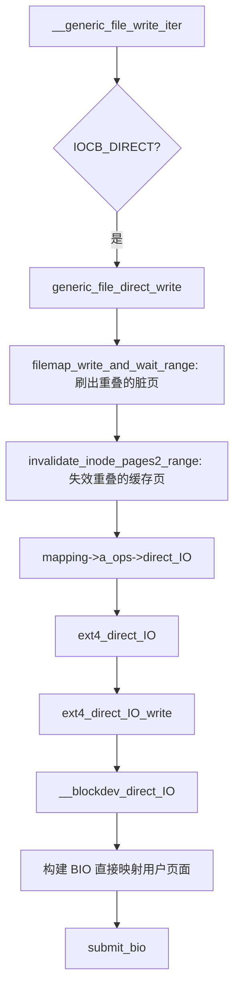

####    generic_file_direct_write

```cpp
// https://elixir.bootlin.com/linux/v4.11.6/source/mm/filemap.c#L2834
ssize_t generic_file_direct_write(struct kiocb *iocb, struct iov_iter *from)
{
    struct file *file = iocb->ki_filp;
    struct address_space *mapping = file->f_mapping;
    struct inode *inode = mapping->host;
    loff_t pos = iocb->ki_pos;
    ssize_t written;
    size_t write_len;
    pgoff_t end;

    write_len = iov_iter_count(from);
    end = (pos + write_len - 1) >> PAGE_SHIFT;

    /*
     * 如果 Page Cache 中有与写入范围重叠的脏页，必须先刷出到磁盘，
     * 否则 DIO 写入的新数据可能被后续 Page Cache 回写的旧数据覆盖
     */
    written = filemap_write_and_wait_range(mapping, pos, pos + write_len - 1);
    if (written)
        goto out;

    /*
     * 使 Page Cache 中重叠范围的页面失效。
     * 这保证后续读操作不会从 Page Cache 读到过期数据，而是从磁盘读取 DIO 写入的新数据
     */
    invalidate_inode_pages2_range(mapping, pos >> PAGE_SHIFT, end);

    /* 调用文件系统的 direct_IO 方法 */
    written = mapping->a_ops->direct_IO(iocb, from);

    if (written > 0) {
        pos += written;
        iocb->ki_pos = pos;
        /* 再次失效，防止并发 buffered read 在 DIO 期间填充了 Page Cache */
        invalidate_inode_pages2_range(mapping, pos >> PAGE_SHIFT, end);
    }

    // ...
    return written;
}
```

####    ext4_direct_IO_write

```cpp
// https://elixir.bootlin.com/linux/v4.11.6/source/fs/ext4/inode.c#L3454
static ssize_t ext4_direct_IO_write(struct kiocb *iocb, struct iov_iter *iter)
{
    struct file *file = iocb->ki_filp;
    struct inode *inode = file->f_mapping->host;
    ssize_t ret;
    // ...

    /*
     * 对于 overwrite（写入范围内所有块已分配），可以直接走 DIO。
     * 对于需要分配新块的情况，ext4 需要先分配块（不能延迟分配，
     * 因为 DIO 直接写磁盘，必须知道目标物理块号）
     */
    ret = __blockdev_direct_IO(iocb, inode, inode->i_sb->s_bdev,
                iter, ext4_dio_get_block, ext4_end_io_dio, NULL,
                get_block_flags);

    // ...
    return ret;
}
```

`__blockdev_direct_IO` 的核心工作：

1.  **映射用户页面**：通过 `get_user_pages_fast` 将用户空间缓冲区对应的物理页面锁定（pin），防止在 I/O 期间被换出
2.  **构建 BIO**：将用户页面直接作为 BIO 的 `bio_vec`，BIO 的目标扇区通过 `ext4_dio_get_block` 回调获取（该回调调用 `ext4_map_blocks` 获取物理块号）
3.  **提交 BIO**：通过 `submit_bio` 提交。数据直接在用户页面和磁盘之间 DMA 传输，不经过 Page Cache

####    Buffered I/O vs Direct I/O 对比

| 特性 | Buffered I/O | Direct I/O |
|------|-------------|------------|
| Page Cache | 使用 | 绕过 |
| 数据拷贝 | 用户空间 → Page Cache → 磁盘 | 用户空间 → 磁盘（DMA） |
| 块分配时机 | 延迟到 writeback | write 时立即分配 |
| 对齐要求 | 无 | 缓冲区地址和大小需要块大小对齐 |
| write 返回速度 | 快（数据仅到 Page Cache） | 慢（等待磁盘 I/O 完成） |
| 适用场景 | 通用场景 | 数据库等自管缓存的应用 |
| 顺序写性能 | 高（批量回写、合并 I/O） | 中（每次写都是独立 I/O） |
| 随机写性能 | 中（脏页积压后回写开销大） | 高（无 Page Cache 管理开销） |

##  0x09    SYNC 模式下的处理

当文件以 `O_SYNC` 或 `O_DSYNC` 模式打开时，`write` 系统调用在返回前必须保证数据已落盘

####    generic_write_sync的实现

```cpp
// https://elixir.bootlin.com/linux/v4.11.6/source/include/linux/fs.h#L2534
static inline ssize_t generic_write_sync(struct kiocb *iocb, ssize_t count)
{
    if (iocb->ki_flags & IOCB_DSYNC) {
        /*
         * IOCB_DSYNC: 需要同步数据（O_DSYNC 或 O_SYNC 都会设置此标志）
         * IOCB_SYNC:  额外需要同步元数据（仅 O_SYNC 设置）
         * datasync = 1 表示只同步数据（fdatasync 语义）
         * datasync = 0 表示同步数据 + 元数据（fsync 语义）
         */
        int ret = vfs_fsync_range(iocb->ki_filp,
                iocb->ki_pos - count, iocb->ki_pos - 1,
                (iocb->ki_flags & IOCB_SYNC) ? 0 : 1);
        if (ret)
            return ret;
    }

    return count;
}
```

####    vfs_fsync_range → ext4_sync_file

```cpp
// https://elixir.bootlin.com/linux/v4.11.6/source/fs/sync.c#L224
int vfs_fsync_range(struct file *file, loff_t start, loff_t end, int datasync)
{
    struct inode *inode = file->f_mapping->host;

    if (!file->f_op->fsync)
        return -EINVAL;
    if (!datasync && (inode->i_state & I_DIRTY_TIME)) {
        spin_lock(&inode->i_lock);
        inode->i_state &= ~I_DIRTY_TIME;
        spin_unlock(&inode->i_lock);
        mark_inode_dirty_sync(inode);
    }
    //ext4 对应的fsync实现为ext4_sync_file
    return file->f_op->fsync(file, start, end, datasync);
}
```

```cpp
// https://elixir.bootlin.com/linux/v4.11.6/source/fs/ext4/fsync.c#L88
int ext4_sync_file(struct file *file, loff_t start, loff_t end, int datasync)
{
    struct inode *inode = file->f_mapping->host;
    struct ext4_inode_info *ei = EXT4_I(inode);
    journal_t *journal = EXT4_SB(inode->i_sb)->s_journal;
    int ret = 0, err;
    tid_t commit_tid;
    bool needs_barrier = false;

    // ...

    /* 将指定范围的脏页刷到磁盘（调用 ext4_writepages） */
    ret = filemap_write_and_wait_range(inode->i_mapping, start, end);
    if (ret)
        return ret;

    inode_lock(inode);

    if (!journal) {
        /* 无日志模式：直接同步 inode 元数据 */
        ret = __generic_file_fsync(file, start, end, datasync);
        goto out;
    }

    /*
     * data=journal 模式下，数据也在日志中，只需确保 transaction 提交即可。
     * data=ordered/writeback 模式下，数据已经通过 filemap_write_and_wait_range 刷出
     */
    if (ext4_should_journal_data(inode)) {
        ret = ext4_force_commit(inode->i_sb);
        goto out;
    }

    /*
     * 获取包含本次写入元数据修改的 transaction ID，
     * 然后强制提交该 transaction 并等待完成
     */
    commit_tid = datasync ? ei->i_datasync_tid : ei->i_sync_tid;
    if (journal->j_flags & JBD2_BARRIER &&
        !jbd2_trans_will_send_data_barrier(journal, commit_tid))
        needs_barrier = true;

    ret = jbd2_complete_transaction(journal, commit_tid);

    if (needs_barrier) {
        /* 发送 flush/FUA barrier 确保磁盘缓存刷出 */
        err = blkdev_issue_flush(inode->i_sb->s_bdev, GFP_KERNEL, NULL);
        if (!ret)
            ret = err;
    }

out:
    inode_unlock(inode);
    // ...
    return ret;
}
```

`ext4_sync_file` 的关键流程：

1.  **`filemap_write_and_wait_range`**：将指定范围的所有脏页回写到磁盘并等待 I/O 完成
2.  **`jbd2_complete_transaction`**：强制提交包含本次写入元数据的 JBD2 transaction，并等待日志落盘
3.  **`blkdev_issue_flush`**：发送 FLUSH 命令到磁盘控制器，确保磁盘的写缓存（volatile write cache）也被刷到持久化介质

##  0x0A    总结

本文从六个阶段完整剖析了 ext4 文件系统的 `write` 系统调用在内核中的全路径。总结各阶段的核心要点：

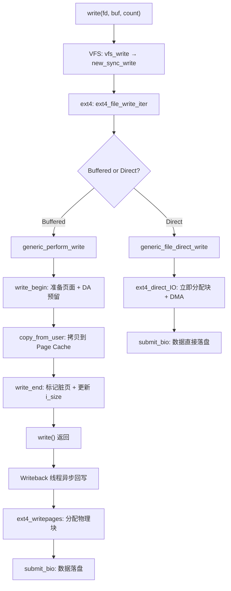

| 阶段 | 关键函数 | 核心工作 |
|------|---------|---------|
| VFS 入口 | `vfs_write` → `new_sync_write` | 权限检查、缓冲区封装（`iov_iter`）、freeze 保护 |
| ext4 接入 | `ext4_file_write_iter` | `i_rwsem` 锁、Buffered/Direct 分支 |
| Page Cache | `generic_perform_write` | 按页循环：`write_begin` → 拷贝 → `write_end` |
| ext4 特性 | `ext4_da_reserve_space` | 延迟分配预留、extent 管理、mballoc |
| JBD2 日志 | `ext4_journal_start/stop` | handle → transaction → commit，保证元数据一致性 |
| Writeback | `ext4_writepages` | 物理块分配、BIO 构建、`submit_bio` 落盘 |
| Direct I/O | `ext4_direct_IO_write` | 绕过 Page Cache，DMA 直写磁盘 |
| SYNC | `ext4_sync_file` | 强制回写 + journal commit + 磁盘 flush |

##  0x0B    参考

-   [Linux Kernel v4.11.6 源码](https://elixir.bootlin.com/linux/v4.11.6/source)
-   [ext4 Data Structures and Algorithms - kernel.org](https://www.kernel.org/doc/html/latest/filesystems/ext4/index.html)
-   [Documentation/filesystems/ext4.txt](https://elixir.bootlin.com/linux/v4.11.6/source/Documentation/filesystems/ext4.txt)
-   [JBD2 设计文档](https://www.kernel.org/doc/html/latest/filesystems/journalling.html)
-   [Understanding the Linux Kernel, 3rd Edition - Chapter 15: The Page Cache](https://www.oreilly.com/library/view/understanding-the-linux/0596005652/)
-   [Delayed allocation and the ext4 filesystem - LWN.net](https://lwn.net/Articles/323455/)
-   [The multi-block allocator - LWN.net](https://lwn.net/Articles/297696/)
-   [内核之旅（二十一）：page cache](https://pandaychen.github.io/2025/11/02/A-LINUX-KERNEL-TRAVEL-21/)
-   [内核之旅（二十二）：内核视角下的 IO 读写（三）](https://pandaychen.github.io/2025/12/02/A-LINUX-KERNEL-TRAVEL-22/)
