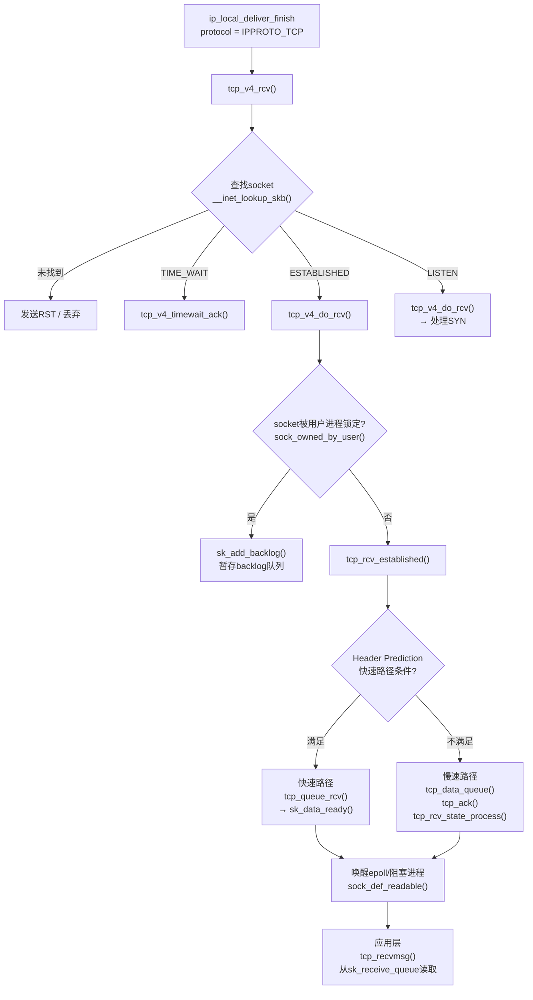
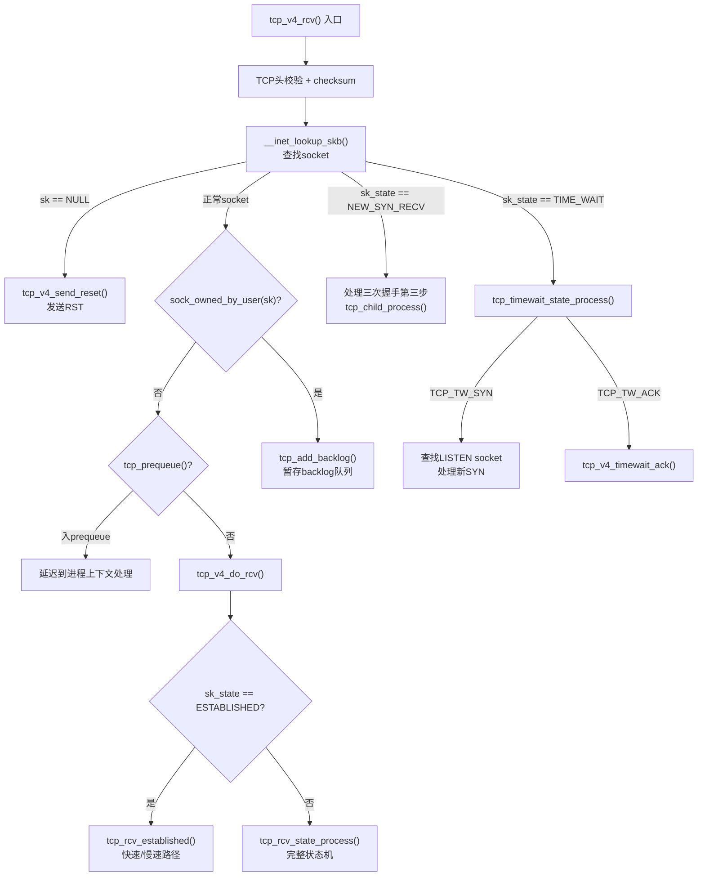
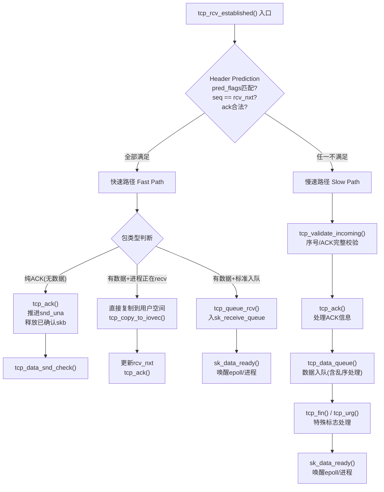
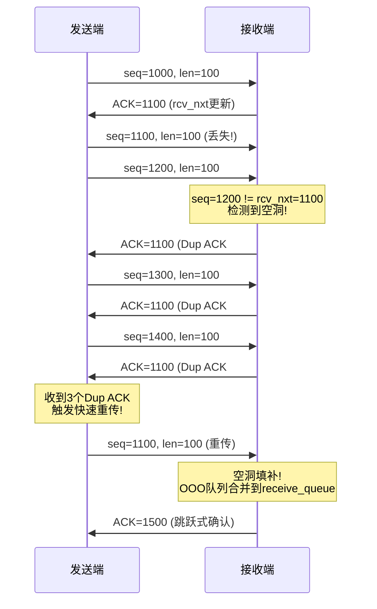
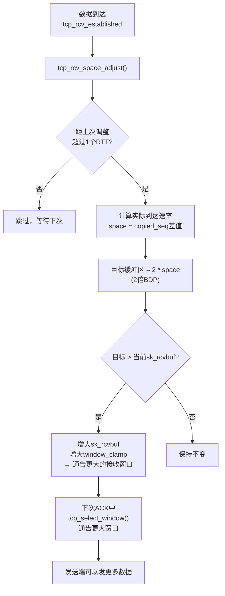
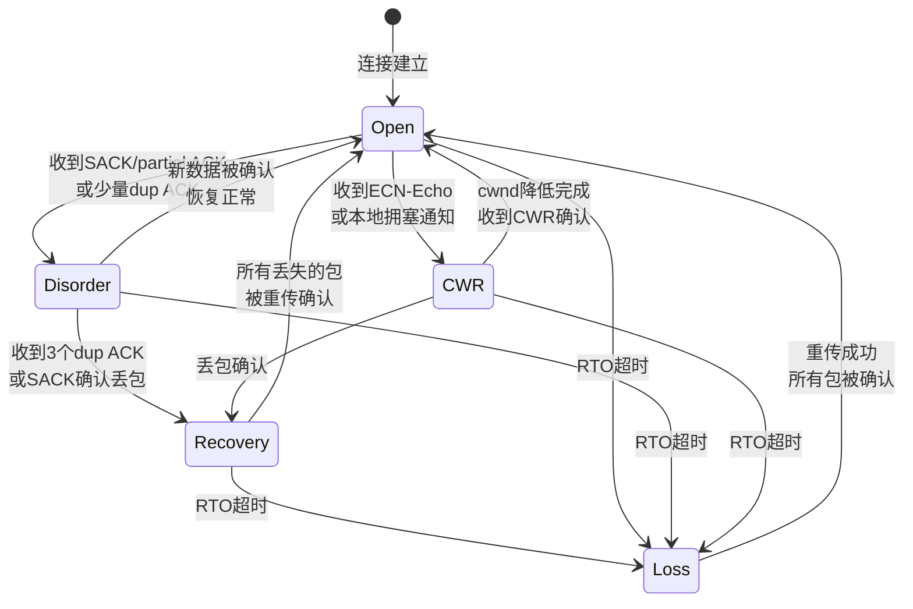
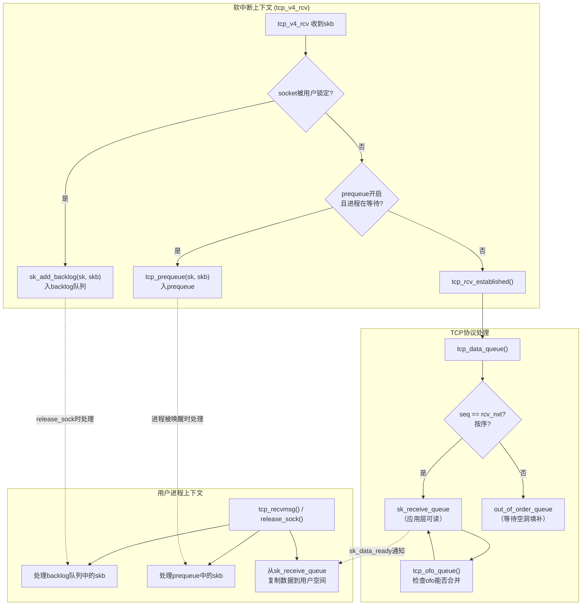
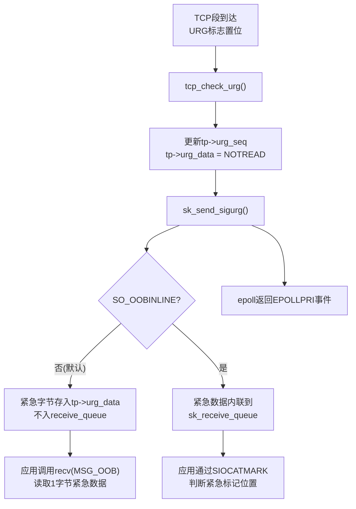
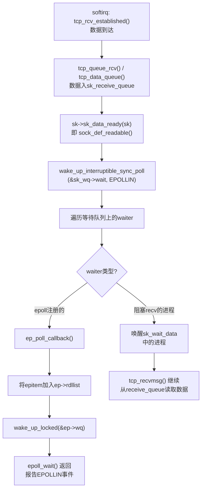

##  0x00    前言

本文学习下 Linux 内核 TCP 数据包**接收路径**中 TCP 协议层特有的核心机制，基于内核 [v4.11.6](https://elixir.bootlin.com/linux/v4.11.6/source)版本，已有相关文章：

-   **通用收包路径**（关联路径为 NIC → NAPI → netif_receive_skb → ip_rcv → ip_rcv_finish → ip_local_deliver）：TCP 与 UDP 共享，详见 [Linux内核之旅（八）：内核数据包接收](https://pandaychen.github.io/2025/03/02/A-LINUX-KERNEL-TRAVEL-8/)
-   **TCP 完整通信过程**（三次握手 / 四次挥手 / 状态机）：详见 [Linux内核之旅（十二）](https://pandaychen.github.io/2025/04/25/A-LINUX-KERNEL-TRAVEL-12/)
-   **TCP 发送路径的协议栈视角**（关联路径为 tcp_sendmsg → 拥塞窗口 → IP 层 → 驱动）：详见 [TCP 发送路径内核源码深度分析](https://pandaychen.github.io/2026/05/11/A-TCP-SENDING-PATH-DEEP-DIVE/)

本文主要分析如下知识点：

1.  `tcp_v4_rcv` 入口与状态分发过程
2.  快速路径（Fast Path）与慢速路径（Slow Path）的 header prediction 机制
3.  序号校验与 ACK 处理（含 Delayed ACK、Duplicate ACK）
4.  接收端滑动窗口与流量控制
5.  拥塞控制（双端视角下的CUBIC/Reno 算法源码、拥塞状态机）
6.  数据入队、乱序处理、Prequeue/Backlog 队列
7.  URG 紧急数据机制
8.  应用层 `recv`/`tcp_recvmsg` 读取路径
9.  **TCP 层与 epoll 的交互机制**（正常可读通知 + 连接断开/错误通知的完整内核调用链）
10. 接收链路上可观测相关知识

##  0x01    TCP接收路径全景概览

当一个 TCP 数据包从网卡经过 IP 层到达 `ip_local_deliver_finish` 后，内核根据 IP 头中的协议号（`IPPROTO_TCP = 6`）调用注册的协议 handler：

```cpp
//file: net/ipv4/ip_input.c - ip_local_deliver_finish
int protocol = ip_hdr(skb)->protocol;
const struct net_protocol *ipprot;

ipprot = rcu_dereference(inet_protos[protocol]);
// 对于TCP，ipprot->handler = tcp_v4_rcv
ret = ipprot->handler(skb);
```

TCP 协议在初始化时注册了 handler：

```cpp
//file: net/ipv4/tcp_ipv4.c
static const struct net_protocol tcp_protocol = {
    .early_demux    = tcp_v4_early_demux,
    .handler        = tcp_v4_rcv,
    .err_handler    = tcp_v4_err,
    .no_policy      = 1,
    .netns_ok       = 1,
};
```

从这里开始，数据包进入 TCP 协议栈的处理流程。整体架构如下：



关键数据结构关系：

```TEXT
                    tcp_v4_rcv 入口
                         │
                         ▼
        ┌──────────────────────────────┐
        │  struct sock (tcp_sock)      │
        │                              │
        │  sk_receive_queue ──────────►│──► 按序到达的数据（应用层可读）
        │  tp->out_of_order_queue ────►│──► 乱序到达的数据（等待填补空洞）
        │  sk_backlog ────────────────►│──► socket被锁时暂存的数据
        │  tp->ucopy.prequeue ────────►│──► prequeue（进程上下文处理）
        │                              │
        │  sk_data_ready ─────────────►│──► 回调：通知epoll/阻塞进程
        │  sk_error_report ───────────►│──► 回调：通知错误事件
        │                              │
        │  tp->rcv_nxt ───────────────►│──► 期望接收的下一个序号
        │  tp->rcv_wnd ───────────────►│──► 当前接收窗口大小
        │  tp->pred_flags ────────────►│──► 快速路径预测标志
        └──────────────────────────────┘
```

##  0x02    tcp_v4_rcv入口分析

`tcp_v4_rcv`是TCP协议栈接收数据包的总入口，负责从IP层接管skb、查找对应的socket、根据连接状态分发到不同的处理函数

####    socket查找

```cpp
//file: net/ipv4/tcp_ipv4.c
int tcp_v4_rcv(struct sk_buff *skb)
{
    const struct tcphdr *th;
    const struct iphdr *iph;
    struct sock *sk;
    int ret;
    struct net *net = dev_net(skb->dev);

    // 1. 基本校验：数据包长度至少包含TCP头
    if (skb->pkt_type != PACKET_HOST)
        goto discard_it;

    // 2. 解析TCP头
    if (!pskb_may_pull(skb, sizeof(struct tcphdr)))
        goto discard_it;

    th = (const struct tcphdr *)skb->data;
    if (th->doff < sizeof(struct tcphdr) / 4)
        goto bad_packet;

    // 3. 完整TCP头部校验（含options）
    if (!pskb_may_pull(skb, th->doff * 4))
        goto discard_it;

    // 4. TCP checksum校验
    if (skb_checksum_init(skb, IPPROTO_TCP, inet_compute_pseudo))
        goto csum_error;

    th = (const struct tcphdr *)skb->data;
    iph = ip_hdr(skb);

    // 5. 核心：查找对应的socket
    // 先在ESTABLISHED哈希表中查找（四元组精确匹配）
    // 未命中再在LISTEN哈希表中查找（目的IP+端口匹配）
    sk = __inet_lookup_skb(&tcp_hashinfo, skb, __tcp_hdrlen(th),
                           th->source, th->dest, &refcounted);
    if (!sk)
        goto no_tcp_socket;  // 无对应socket → 发送RST

    // ...后续状态分发
}
```

`__inet_lookup_skb`内部先调用`__inet_lookup_established`在established连接哈希表中查找（以四元组`{saddr, sport, daddr, dport}`为key），如果命中则直接返回对应的`struct sock`；如果未命中，再调用`__inet_lookup_listener`在listening socket哈希表中查找（以`{daddr, dport}`为key）

####    状态分发逻辑
继续，`tcp_v4_rcv`函数后续的逻辑：

```cpp
//file: net/ipv4/tcp_ipv4.c - tcp_v4_rcv 续
    // 6. TIME_WAIT状态特殊处理
    if (sk->sk_state == TCP_TIME_WAIT)
        goto do_time_wait;

    // 7. NEW_SYN_RECV状态（收到ACK完成三次握手）
    if (sk->sk_state == TCP_NEW_SYN_RECV) {
        struct request_sock *req = inet_reqsk(sk);
        sk = req->rsk_listener;
        // ... 将连接从半连接队列提升为全连接
        // 最终转入tcp_child_process()
    }

    // 8. 加锁处理
    bh_lock_sock_nested(sk);
    ret = 0;

    if (!sock_owned_by_user(sk)) {
        // socket未被用户进程锁定，直接处理
        if (!tcp_prequeue(sk, skb))
            ret = tcp_v4_do_rcv(sk, skb);
    } else {
        // socket正被用户进程使用（如正在recv）
        // 将skb加入backlog队列，延迟到release_sock时处理
        if (tcp_add_backlog(sk, skb))
            goto discard_and_relse;
    }
    bh_unlock_sock(sk);

    // ...
    return ret;

do_time_wait:
    // TIME_WAIT状态：仅处理合法的SYN或发送ACK
    switch (tcp_timewait_state_process(inet_twsk(sk), skb, th)) {
    case TCP_TW_SYN:
        // 收到SYN，可能是新连接复用旧四元组
        // 查找LISTEN socket处理
        break;
    case TCP_TW_ACK:
        tcp_v4_timewait_ack(sk, skb);
        break;
    case TCP_TW_RST:
        // ...
    }
}
```

####   `TCP_NEW_SYN_RECV`状态下的处理：tcp_child_process

TODO：半连接如何转为全连接？

####    tcp_v4_do_rcv：进入具体处理

```cpp
//file: net/ipv4/tcp_ipv4.c
int tcp_v4_do_rcv(struct sock *sk, struct sk_buff *skb)
{
    struct tcp_sock *tp = tcp_sk(sk);

    if (sk->sk_state == TCP_ESTABLISHED) {
        // 已建立连接的数据包 → 快速路径优化
        struct dst_entry *dst = sk->sk_rx_dst;
        // ... early demux路由缓存复用
        tcp_rcv_established(sk, skb, tcp_hdr(skb), skb->len);
        return 0;
    }

    // 非ESTABLISHED状态（SYN_RECV/FIN_WAIT等）
    // 走完整的状态机处理
    if (tcp_rcv_state_process(sk, skb)) {
        rsk = sk;
        goto reset;
    }
    return 0;
}
```

状态分发逻辑的 Mermaid 图：



##  0x03    快速路径与慢速路径（Fast Path / Slow Path）

`tcp_rcv_established`是ESTABLISHED状态下TCP数据包处理的核心函数。它实现了一个关键优化机制，即**Header Prediction（头部预测）**，对于常见的、按序到达的纯数据包，跳过大量检查直接入队，极大提升性能

####    Header Prediction机制

TCP接收处理的绝大多数场景是：连接已建立，数据按序到达，窗口未变，无特殊标志。内核利用`tp->pred_flags`对这种"典型情况"进行预测，匹配则走快速路径

```cpp
//file: net/ipv4/tcp_input.c
void tcp_rcv_established(struct sock *sk, struct sk_buff *skb,
                         const struct tcphdr *th, unsigned int len)
{
    struct tcp_sock *tp = tcp_sk(sk);

    // ====== Header Prediction 快速路径检查 ======
    // pred_flags在窗口/状态变化时由tcp_fast_path_check()更新
    // 它预编码了：窗口大小未变 + 无SYN/FIN/RST/URG标志 + ACK已设置
    if ((tcp_flag_word(th) & TCP_HP_BITS) == tp->pred_flags &&
        TCP_SKB_CB(skb)->seq == tp->rcv_nxt &&        // 序号是期望的下一个
        !after(TCP_SKB_CB(skb)->ack_seq, tp->snd_nxt)) {  // ACK合法
        int tcp_header_len = th->doff * 4;

        // ---- 快速路径分支1：纯ACK包（无数据负载）----
        if (tcp_header_len == len) {
            // 只有ACK，无数据
            tcp_ack(sk, skb, 0);   // 处理ACK（推进snd_una、释放已确认skb）
            __kfree_skb(skb);      // 释放skb

            // 检查是否有数据需要发送（ACK可能释放了窗口）
            if (!tcp_data_snd_check(sk))
                tcp_ack_snd_check(sk);
            return;
        }

        // ---- 快速路径分支2：纯数据包（有负载，按序到达）----
        if (tp->ucopy.task == current &&
            tp->copied_seq == tp->rcv_nxt &&
            len - tcp_header_len <= tp->ucopy.len &&
            sock_owned_by_user(sk)) {
            // 用户进程正在recv且缓冲区足够：直接复制到用户空间（零中间拷贝）
            __set_current_state(TASK_RUNNING);
            if (!tcp_copy_to_iovec(sk, skb, tcp_header_len)) {
                // 直接复制成功
                tp->rcv_nxt = TCP_SKB_CB(skb)->end_seq;
                // ...
                __kfree_skb(skb);
                tcp_ack(sk, skb, FLAG_DATA);
                tcp_data_snd_check(sk);
                return;
            }
        }

        // 快速路径分支3：标准入队
        if (eaten <= 0) {
eaten:
            // 数据入sk_receive_queue
            tcp_queue_rcv(sk, skb, tcp_header_len, &fragstolen);

            // 更新rcv_nxt
            tp->rcv_nxt = TCP_SKB_CB(skb)->end_seq;
        }

        // 处理ACK
        tcp_event_data_recv(sk, skb);
        tcp_ack(sk, skb, FLAG_DATA);

        // 重要：唤醒等待数据的进程/epoll
        sk->sk_data_ready(sk);

        // 检查是否需要发送ACK
        tcp_data_snd_check(sk);
        return;
    }

    // ====== 慢速路径 ======
    // 条件不满足header prediction时走此路径
    tcp_rcv_established_slow(sk, skb, th, len);
}
```

####    快速路径条件（pred_flags）

`pred_flags`由`tcp_fast_path_check()`计算并缓存：

```cpp
//file: net/ipv4/tcp_input.c
static inline void tcp_fast_path_check(struct sock *sk)
{
    struct tcp_sock *tp = tcp_sk(sk);

    // 快速路径条件：
    // 1. 没有乱序数据（out_of_order_queue为空）
    // 2. 接收窗口大于0
    // 3. 没有紧急数据待处理
    // 4. 没有被用户进程关闭接收方向
    if (skb_queue_empty(&tp->out_of_order_queue) &&
        tp->rcv_wnd &&
        !tp->urg_data &&
        !tcp_receive_window(tp) /* ... */)
        tcp_fast_path_on(tp);
    else
        tcp_fast_path_off(tp);
}

static inline void tcp_fast_path_on(struct tcp_sock *tp)
{
    // 预编码期望的TCP头标志：ACK置位 + 窗口大小不变
    __tcp_fast_path_on(tp, tp->rcv_wnd >> tp->rx_opt.rcv_wscale);
}

static inline void __tcp_fast_path_on(struct tcp_sock *tp, u32 snd_wnd)
{
    // pred_flags = (TCP头的前32位应该匹配的值)
    // 包含：doff=5(无options) + ACK标志 + 窗口大小
    tp->pred_flags = htonl((tp->tcp_header_len << 26) |
                           ntohl(TCP_FLAG_ACK) |
                           snd_wnd);
}
```

####    慢速路径的触发条件

以下情况会导致`pred_flags`不匹配，进入慢速路径：
-   **数据乱序到达**：`TCP_SKB_CB(skb)->seq != tp->rcv_nxt`
-   **窗口大小变化**：对端通告窗口改变
-   **携带特殊标志**：SYN/FIN/RST/URG任一置位
-   **有乱序队列未处理**：`out_of_order_queue`非空
-   **SACK/DSACK需要处理**
-   **ACK序号超前**：`after(ack_seq, tp->snd_nxt)`



##  0x04    序号与ACK机制

####    序号校验：tcp_validate_incoming

每个到达的TCP段都必须通过序号校验才能被接受。内核通过`tcp_sequence`宏检查段的序号是否在接收窗口内：

```cpp
//file: net/ipv4/tcp_input.c
// 判断段[seq, end_seq)是否与接收窗口[rcv_nxt, rcv_nxt+rcv_wnd)有交集
static inline bool tcp_sequence(const struct tcp_sock *tp, u32 seq, u32 end_seq)
{
    return !before(end_seq, tp->rcv_wup) &&
           !after(seq, tp->rcv_nxt + tcp_receive_window(tp));
}

// before/after 宏处理序号回绕
static inline bool before(__u32 seq1, __u32 seq2)
{
    return (__s32)(seq1 - seq2) < 0;
}
#define after(seq2, seq1) before(seq1, seq2)
```

`tcp_validate_incoming`是慢速路径中的完整校验：

```cpp
//file: net/ipv4/tcp_input.c
static bool tcp_validate_incoming(struct sock *sk, struct sk_buff *skb,
                                  const struct tcphdr *th, int syn_inerr)
{
    struct tcp_sock *tp = tcp_sk(sk);

    // 1. 序号校验：段必须在接收窗口内
    if (!tcp_sequence(tp, TCP_SKB_CB(skb)->seq, TCP_SKB_CB(skb)->end_seq)) {
        // 序号不在窗口内
        if (!th->rst) {
            // 非RST包：发送一个ACK通知对端我方的rcv_nxt
            // （常见场景：对端重传了已确认的旧数据）
            tcp_send_dupack(sk, skb);
        }
        goto discard;
    }

    // 2. RST标志检查
    if (th->rst) {
        if (TCP_SKB_CB(skb)->seq == tp->rcv_nxt)
            tcp_reset(sk);  // 合法RST → 重置连接
        else
            // 窗口内的非精确RST → challenge ACK（RFC 5961）
            tcp_send_challenge_ack(sk, skb);
        goto discard;
    }

    // 3. SYN标志检查（ESTABLISHED状态不应收到SYN）
    if (th->syn) {
        tcp_send_challenge_ack(sk, skb);
        goto discard;
    }

    return true;

discard:
    return false;
}
```

####    ACK处理：tcp_ack（复杂）

`tcp_ack`是TCP接收路径中最复杂的函数之一，主要负责处理对端返回的ACK信息，驱动发送端的窗口滑动和拥塞控制：

```cpp
//file: net/ipv4/tcp_input.c
static int tcp_ack(struct sock *sk, const struct sk_buff *skb, int flag)
{
    struct tcp_sock *tp = tcp_sk(sk);
    u32 ack_seq = TCP_SKB_CB(skb)->ack_seq;  // 对端确认的序号
    u32 prior_snd_una = tp->snd_una;         // 之前的发送未确认起始点
    int prior_packets = tp->packets_out;

    // 1. ACK合法性检查
    if (before(ack_seq, prior_snd_una))
        goto old_ack;    // 旧ACK（已处理过的确认）
    if (after(ack_seq, tp->snd_nxt))
        goto invalid_ack; // 超前ACK（确认了未发送的数据）

    // 2. 标记确认了新数据
    flag |= FLAG_SND_UNA_ADVANCED;

    // 3. SACK信息处理
    if (TCP_SKB_CB(skb)->sacked)
        flag |= tcp_sacktag_write_queue(sk, skb, prior_snd_una, &sack_state);

    // 4. 推进snd_una（发送窗口左边界右移）
    tp->snd_una = ack_seq;

    // 5. 释放已确认的skb（从重传队列中移除）
    flag |= tcp_clean_rtx_queue(sk, prior_fackets, prior_snd_una,
                                 &sack_state);

    // 6. RTT估算更新
    if (flag & FLAG_DATA_ACKED)
        tcp_rtt_estimator(sk, flag);

    // 7. 拥塞控制更新（核心！）
    tcp_cong_avoid(sk, ack_seq, prior_in_flight);

    // 8. 更新发送窗口
    tcp_ack_update_window(sk, skb, ack_seq, ntohs(th->window) << tp->rx_opt.snd_wscale);

    // 9. 快速重传/恢复检测
    tcp_fastretrans_alert(sk, acked, prior_unsacked, is_dupack, flag);

    return 1;

old_ack:
    // duplicate ACK检测
    if (TCP_SKB_CB(skb)->sacked) {
        flag |= tcp_sacktag_write_queue(sk, skb, prior_snd_una, &sack_state);
    }
    // ...
}
```

####    Delayed ACK机制

TCP不会对每个数据段立即回复ACK，而是延迟合并以减少网络上的小包数量：

```cpp
//file: net/ipv4/tcp_input.c
static void tcp_event_data_recv(struct sock *sk, struct sk_buff *skb)
{
    struct tcp_sock *tp = tcp_sk(sk);
    struct inet_connection_sock *icsk = inet_csk(sk);

    // 判断是否需要延迟ACK
    tcp_ecn_check_ce(tp, skb);

    if (tcp_in_quickack_mode(sk)) {
        // QuickACK模式：立即发送ACK（如连接建立初期）
        tcp_send_ack(sk);
    } else {
        // 设置delayed ACK定时器
        // 等待最多40ms（TCP_DELACK_MIN），期间如果有数据要发送可捎带ACK
        icsk->icsk_ack.pending |= ICSK_ACK_SCHED;
        if (!icsk->icsk_ack.ato) {
            icsk->icsk_ack.ato = TCP_ATO_MIN;  // 初始延迟40ms
        } else {
            // 根据之前的ACK间隔自适应调整
            tcp_incr_quickack(sk);
        }
        // 启动delayed ACK定时器
        sk_reset_timer(sk, &icsk->icsk_delack_timer,
                       jiffies + icsk->icsk_ack.ato);
    }
}
```

Delayed ACK的规则：
-   最多延迟`TCP_DELACK_MAX`（`200ms`），通常为`40ms`（`TCP_DELACK_MIN`）
-   如果在延迟期间有数据要发送，ACK会捎带在数据包中（Piggybacking）
-   收到两个连续的全尺寸段后，立即发送ACK（每收两个包ACK一次）
-   连接建立初期和丢包恢复期使用QuickACK模式（立即回复）

####    Duplicate ACK与快速重传触发

接收端在什么条件下发送Duplicate ACK（触发发送端的快速重传）：

```cpp
//file: net/ipv4/tcp_input.c
static void tcp_send_dupack(struct sock *sk, const struct sk_buff *skb)
{
    struct tcp_sock *tp = tcp_sk(sk);

    // 收到一个序号不等于rcv_nxt的包（即乱序到达）
    // 发送一个重复的ACK（ack_seq仍是rcv_nxt），通知对端有包丢失

    if (TCP_SKB_CB(skb)->end_seq != TCP_SKB_CB(skb)->seq &&
        before(TCP_SKB_CB(skb)->seq, tp->rcv_nxt)) {
        // D-SACK: 收到已确认过的重复数据
        tcp_dsack_set(sk, TCP_SKB_CB(skb)->seq, TCP_SKB_CB(skb)->end_seq);
    }

    tcp_send_ack(sk);  // 发送ACK（携带SACK块信息）
}
```



##  0x05    滑动窗口与流量控制

接收端通过通告窗口（Advertised Window / Receive Window）实现流量控制，告诉发送端"我还能接收多少数据"，防止发送端发送速度超过接收端的处理能力

####    接收窗口的核心字段

```cpp
//file: include/linux/tcp.h - struct tcp_sock
struct tcp_sock {
    // 接收窗口相关
    u32 rcv_wnd;        // 当前接收窗口大小（字节）
    u32 rcv_wup;        // 上次通告窗口时的rcv_nxt值
    u32 rcv_nxt;        // 期望接收的下一个序号
    u32 window_clamp;   // 窗口上限（对端不会超过此值）

    // 窗口缩放
    u8  rx_opt.rcv_wscale;  // 接收窗口缩放因子（2^wscale）

    // 自动调优
    u32 rcvq_space;     // 估算的接收速率（用于自动调优）
    u32 space;          // 最近一段时间内的数据到达量
};
```

####    窗口通告：tcp_select_window

每次发送ACK时，内核通过`tcp_select_window`计算要通告给对端的接收窗口大小：

```cpp
//file: net/ipv4/tcp_output.c
u16 tcp_select_window(struct sock *sk)
{
    struct tcp_sock *tp = tcp_sk(sk);
    u32 old_win = tp->rcv_wnd;
    u32 cur_win;
    u32 new_win;

    // 1. 计算当前可用窗口空间
    // = sk_rcvbuf（接收缓冲区总大小）- 已使用的空间
    cur_win = tcp_receive_window(tp);
    new_win = __tcp_select_window(sk);

    // 2. 窗口只增不减原则（避免SWS - Silly Window Syndrome）
    if (new_win < cur_win) {
        // 不能收缩已通告的窗口（RFC规定）
        // 但如果内存确实紧张，可以冻结窗口为0（零窗口）
    }

    // 3. 更新rcv_wnd
    tp->rcv_wnd = new_win;
    tp->rcv_wup = tp->rcv_nxt;  // 记录通告时的rcv_nxt

    // 4. 返回窗口值（需要右移wscale位放入TCP头的16bit字段）
    return new_win >> tp->rx_opt.rcv_wscale;
}

static u32 __tcp_select_window(struct sock *sk)
{
    struct tcp_sock *tp = tcp_sk(sk);
    int mss = tp->advmss;  // 对端MSS

    // 可用空间 = 接收缓冲区剩余
    int free_space = tcp_space(sk);

    // Silly Window Syndrome防护：
    // 如果可用空间小于MSS的一半，通告窗口为0
    // 避免对端发送大量小包
    if (free_space < (int)(mss / 2))
        return 0;

    // 对齐到MSS的整数倍（鼓励对端发送满尺寸段）
    free_space = round_down(free_space, mss);

    // 不超过window_clamp
    if (free_space > tp->window_clamp)
        free_space = tp->window_clamp;

    return free_space;
}
```

####    接收缓冲区自动调优：tcp_rcv_space_adjust

内核不使用固定的接收缓冲区大小，而是根据实际数据到达速率动态调整`sk_rcvbuf`：

```cpp
//file: net/ipv4/tcp_input.c
void tcp_rcv_space_adjust(struct sock *sk)
{
    struct tcp_sock *tp = tcp_sk(sk);
    int time, space;

    // 每隔一段时间（RTT级别）调整一次
    if (tp->rcvq_space.time == 0)
        goto new_measure;

    time = tcp_time_stamp - tp->rcvq_space.time;
    if (time < (tp->rcv_rtt_est.rtt >> 3) || tp->rcv_rtt_est.rtt == 0)
        return;

    // 计算这段时间内到达的数据量
    space = tp->copied_seq - tp->rcvq_space.seq;
    if (space <= 0)
        goto new_measure;

    // 目标：缓冲区至少能容纳2倍的BDP（Bandwidth-Delay Product）
    // 即 2 * (实际速率 * RTT)
    space *= 2;  // 留出2倍冗余

    // 只增不减：仅在需要更大缓冲区时才调大
    if (space > tp->rcvq_space.space) {
        int rcvbuf = min(space, sysctl_tcp_rmem[2]);  // 不超过rmem_max
        if (rcvbuf > sk->sk_rcvbuf) {
            sk->sk_rcvbuf = rcvbuf;
            // 调大缓冲区后重新计算接收窗口
            tp->window_clamp = rcvbuf;
        }
    }
    tp->rcvq_space.space = space;

new_measure:
    tp->rcvq_space.seq = tp->copied_seq;
    tp->rcvq_space.time = tcp_time_stamp;
}
```

自动调优通过`net.ipv4.tcp_moderate_rcvbuf=1`（默认开启）控制，缓冲区范围由`net.ipv4.tcp_rmem`三元组定义：`[min, default, max]`



####    零窗口与窗口探测

当接收端缓冲区满时，`tcp_select_window`返回`0`，通告零窗口。此时发送端停止发送，并启动**窗口探测定时器**（Persist Timer），定期发送`1`字节的探测包询问接收端窗口是否重新打开。接收端收到窗口探测后，回复当前的窗口大小（即使仍为`0`）

##  0x06    拥塞控制（双端视角）

拥塞控制是TCP最复杂的机制之一，虽然拥塞窗口（cwnd）由发送端维护，但其更新完全由**接收端返回的ACK驱动**，这是接收路径的一部分

####    接收端在拥塞控制中的角色

1. **通告接收窗口rwnd**：限制发送端的有效发送窗口 `min(cwnd, rwnd)`
2. **生成SACK/DSACK信息**：告知发送端哪些段已收到/重复，帮助发送端精确判断丢包
3. **ECN处理**：如果网络层标记了ECE（Explicit Congestion Experienced），接收端在ACK中设置ECE标志通知发送端降速

```cpp
//file: net/ipv4/tcp_input.c
// ECN接收处理
static void TCP_ECN_check_ce(struct tcp_sock *tp, const struct sk_buff *skb)
{
    // 检查IP头的ECN字段
    if (TCP_SKB_CB(skb)->ip_dsfield & INET_ECN_CE) {
        // 路由器标记了拥塞
        // 在下一个ACK中设置ECE标志通知发送端
        tp->ecn_flags |= TCP_ECN_DEMAND_CWR;
    }
}
```

####    发送端拥塞状态机

当发送端收到ACK（在接收路径的`tcp_ack`中处理），会触发拥塞状态机的转换：

```cpp
//file: include/net/tcp.h
enum tcp_ca_state {
    TCP_CA_Open = 0,       // 正常状态：慢启动或拥塞避免
    TCP_CA_Disorder = 1,   // 检测到潜在丢包（少量dup ACK/SACK）
    TCP_CA_CWR = 2,        // 收到ECN或本地拥塞，正在主动降窗
    TCP_CA_Recovery = 3,   // 快速恢复中（收到3个dup ACK触发）
    TCP_CA_Loss = 4,       // 超时重传，进入拥塞避免重置
};
```



####    tcp_cong_avoid：慢启动与拥塞避免

ACK到达时，`tcp_ack`调用`tcp_cong_avoid`更新拥塞窗口：

```cpp
//file: net/ipv4/tcp_input.c
static void tcp_cong_avoid(struct sock *sk, u32 ack, u32 acked, u32 in_flight)
{
    const struct inet_connection_sock *icsk = inet_csk(sk);
    // 调用当前拥塞控制算法的cong_avoid回调
    icsk->icsk_ca_ops->cong_avoid(sk, ack, acked, in_flight);
    // 确保cwnd不超过snd_cwnd_clamp
    tp->snd_cwnd = min(tp->snd_cwnd, tp->snd_cwnd_clamp);
}
```

####    CUBIC算法核心实现

CUBIC是Linux默认的拥塞控制算法（v4.11.6），使用三次函数（cubic function）计算窗口大小，使得窗口增长在距离上次丢包点较远时更快，接近时变慢：

```cpp
//file: net/ipv4/tcp_cubic.c
static void bictcp_cong_avoid(struct sock *sk, u32 ack, u32 acked, u32 in_flight)
{
    struct tcp_sock *tp = tcp_sk(sk);
    struct bictcp *ca = inet_csk_ca(sk);

    if (!tcp_is_cwnd_limited(sk, in_flight))
        return;  // 窗口未满，无需调整

    if (tp->snd_cwnd <= tp->snd_ssthresh) {
        // 慢启动阶段：每个ACK窗口+1（指数增长）
        tcp_slow_start(tp, acked);
    } else {
        // 拥塞避免阶段：使用CUBIC函数
        bictcp_update(ca, tp->snd_cwnd);
        tcp_cong_avoid_ai(tp, ca->cnt, acked);
    }
}

// CUBIC核心：计算窗口增长目标
static inline void bictcp_update(struct bictcp *ca, u32 cwnd)
{
    u32 delta, bic_target, max_cnt;
    u64 offs, t;

    ca->ack_cnt += ca->delayed_ack;

    // 计算距上次窗口缩减的时间 t
    t = (s32)(tcp_time_stamp - ca->epoch_start);
    t += ca->delay_min >> 3;  // 加上最小RTT（K值修正）

    // CUBIC函数: W(t) = C * (t - K)^3 + W_max
    // K = cubic_root(W_max * beta / C)
    // C = 0.4, beta = 0.7

    // 计算K（从W_max恢复到满窗的时间）
    // ... 省略K的计算

    // 计算W_cubic(t) = C*(t-K)^3 + W_max
    if (t < ca->bic_K) {
        // t < K: 在W_max下方，凹函数慢增长
        offs = ca->bic_K - t;
        delta = (cube_rtt_scale * offs * offs * offs) >> 40;
        bic_target = ca->bic_origin_point - delta;
    } else {
        // t >= K: 在W_max上方，凸函数快增长
        offs = t - ca->bic_K;
        delta = (cube_rtt_scale * offs * offs * offs) >> 40;
        bic_target = ca->bic_origin_point + delta;
    }

    // cnt = cwnd / (bic_target - cwnd)
    // 即每cnt个ACK才增加1个cwnd
    if (bic_target > cwnd) {
        ca->cnt = cwnd / (bic_target - cwnd);
    } else {
        ca->cnt = 100 * cwnd;  // 非常慢的增长
    }
}
```

####    Reno算法（对比）

Reno作为经典算法，逻辑简单直接：

```cpp
//file: net/ipv4/tcp_cong.c
// Reno拥塞避免：每RTT增加1个MSS（线性增长）
void tcp_reno_cong_avoid(struct sock *sk, u32 ack, u32 acked, u32 in_flight)
{
    struct tcp_sock *tp = tcp_sk(sk);

    if (!tcp_is_cwnd_limited(sk, in_flight))
        return;

    if (tp->snd_cwnd <= tp->snd_ssthresh) {
        // 慢启动：每ACK增1（指数增长）
        tcp_slow_start(tp, acked);
    } else {
        // 拥塞避免：每cwnd个ACK增1（线性增长）
        // 即每个RTT增加1个MSS
        tcp_cong_avoid_ai(tp, tp->snd_cwnd, acked);
    }
}
```

####    快速重传与快速恢复

当`tcp_ack`检测到需要进入Recovery状态时：

```cpp
//file: net/ipv4/tcp_input.c
static void tcp_fastretrans_alert(struct sock *sk, ...)
{
    struct tcp_sock *tp = tcp_sk(sk);

    // 进入Recovery状态
    if (icsk->icsk_ca_state != TCP_CA_Recovery) {
        // 记录当前cwnd为ssthresh的参考
        tp->snd_ssthresh = icsk->icsk_ca_ops->ssthresh(sk);
        // CUBIC: ssthresh = cwnd * 0.7
        // Reno:  ssthresh = cwnd / 2

        tcp_set_ca_state(sk, TCP_CA_Recovery);
        tp->high_seq = tp->snd_nxt;  // 标记恢复点

        // PRR（Proportional Rate Reduction）：
        // 在恢复期间按比例降低发送速率，而非直接砍半
        tp->prr_delivered = 0;
        tp->prr_out = 0;

        // 触发快速重传
        tcp_retransmit_skb(sk, tcp_write_queue_head(sk));
    }
}
```

##  0x07    数据入队与乱序处理

####    tcp_data_queue：数据分发总控

```cpp
//file: net/ipv4/tcp_input.c
static void tcp_data_queue(struct sock *sk, struct sk_buff *skb)
{
    struct tcp_sock *tp = tcp_sk(sk);
    int eaten = -1;

    // 1. 检查是否按序到达
    if (TCP_SKB_CB(skb)->seq == tp->rcv_nxt) {
        // ===== 按序到达：直接入sk_receive_queue =====

        // 尝试与队列尾部的skb合并（减少skb数量）
        if (tcp_try_coalesce(sk, skb)) {
            eaten = 1;
        }

        if (eaten <= 0) {
            // 入receive_queue尾部
            __skb_queue_tail(&sk->sk_receive_queue, skb);
        }

        // 更新rcv_nxt
        tp->rcv_nxt = TCP_SKB_CB(skb)->end_seq;

        // 检查ofo_queue中是否有后续数据可以补齐
        if (!skb_queue_empty(&tp->out_of_order_queue))
            tcp_ofo_queue(sk);

        // 通知应用层有数据可读
        if (!sock_flag(sk, SOCK_DEAD))
            sk->sk_data_ready(sk);

    } else {
        // ===== 乱序到达：入out_of_order_queue =====

        // 先检查是否完全在窗口外（应丢弃）
        if (!after(TCP_SKB_CB(skb)->end_seq, tp->rcv_nxt)) {
            // 完全重复的数据（seq < rcv_nxt）
            tcp_dsack_set(sk, ...);
            goto discard;
        }

        // 入乱序队列
        tcp_data_queue_ofo(sk, skb);

        // 发送duplicate ACK（携带SACK信息）
        tcp_send_dupack(sk, skb);
    }
}
```

####    乱序队列管理与恢复

```cpp
//file: net/ipv4/tcp_input.c
// 将乱序数据插入ofo_queue（按seq排序的链表）
static void tcp_data_queue_ofo(struct sock *sk, struct sk_buff *skb)
{
    struct tcp_sock *tp = tcp_sk(sk);
    struct sk_buff *skb1;

    // 在ofo_queue中找到正确的插入位置（按seq升序）
    skb_queue_walk(&tp->out_of_order_queue, skb1) {
        if (before(TCP_SKB_CB(skb)->seq, TCP_SKB_CB(skb1)->seq))
            break;
    }

    // 插入到skb1之前
    __skb_queue_before(&tp->out_of_order_queue, skb1, skb);

    // 生成SACK块信息
    tcp_sack_new_ofo_skb(sk, TCP_SKB_CB(skb)->seq,
                         TCP_SKB_CB(skb)->end_seq);
}

// 尝试将ofo_queue中的连续数据转入receive_queue
static void tcp_ofo_queue(struct sock *sk)
{
    struct tcp_sock *tp = tcp_sk(sk);
    struct sk_buff *skb;

    while ((skb = skb_peek(&tp->out_of_order_queue)) != NULL) {
        // 检查ofo队列头部是否能衔接上rcv_nxt
        if (after(TCP_SKB_CB(skb)->seq, tp->rcv_nxt))
            break;  // 还有空洞，等待

        // 可以衔接 → 从ofo_queue移到receive_queue
        __skb_unlink(skb, &tp->out_of_order_queue);
        __skb_queue_tail(&sk->sk_receive_queue, skb);
        tp->rcv_nxt = TCP_SKB_CB(skb)->end_seq;
    }
}
```

TODO：

1.  乱序队列对报文的处理？
2.  SACK机制的详细实现与乱序合并的配合
3.  skb_queue_walk的详细实现

####    三个队列的关系



####    Prequeue机制

Prequeue是内核v4.11.6中的一个优化：将数据包的TCP处理延迟到用户进程上下文中，而非在softirq中完成，减少softirq的处理时间和锁竞争：

```cpp
//file: net/ipv4/tcp_ipv4.c
//https://elixir.bootlin.com/linux/v4.11.6/source/net/ipv4/tcp_ipv4.c#L1511
static bool tcp_prequeue(struct sock *sk, struct sk_buff *skb)
{
    struct tcp_sock *tp = tcp_sk(sk);

    // 条件：有进程正在等待数据（ucopy.task != NULL）
    if (sysctl_tcp_low_latency || !tp->ucopy.task)
        return false;

    // 入prequeue
    __skb_queue_tail(&tp->ucopy.prequeue, skb);
    tp->ucopy.memory += skb->truesize;

    // 如果prequeue累积的数据超过sk_rcvbuf的一半
    // 或者进程正在sleeping，唤醒进程来处理
    if (tp->ucopy.memory > sk->sk_rcvbuf >> 1) {
        // 唤醒等待的进程
        sk->sk_data_ready(sk);
    }

    return true;
}
```

##  0x08    URG紧急数据机制

TCP的URG（Urgent）标志允许发送端标记"紧急数据"，接收端可以优先处理（较少应用）

####    URG在接收路径中的处理

```cpp
//file: net/ipv4/tcp_input.c
static void tcp_check_urg(struct sock *sk, const struct tcphdr *th)
{
    struct tcp_sock *tp = tcp_sk(sk);
    u32 ptr = ntohs(th->urg_ptr);

    // URG pointer指向紧急数据的末尾偏移
    if (ptr && !th->syn) {
        u32 urg_seq = ntohl(th->seq) + ptr - 1;

        // 新的紧急数据序号比之前的更新
        if (after(urg_seq, tp->copied_seq) &&
            after(urg_seq, tp->urg_seq)) {
            // 更新紧急数据序号
            tp->urg_seq = urg_seq;
            tp->urg_data = TCP_URG_NOTREAD;  // 标记有未读紧急数据

            // 通知应用层（SIGURG信号或POLLPRI事件）
            sk_send_sigurg(sk);
        }
    }
}

// 读取紧急数据
static void tcp_urg(struct sock *sk, struct sk_buff *skb, const struct tcphdr *th)
{
    struct tcp_sock *tp = tcp_sk(sk);

    if (th->urg) {
        tcp_check_urg(sk, th);
    }

    // 如果SO_OOBINLINE未设置，紧急数据存储在tp->urg_data单字节中
    // 应用层通过recv(MSG_OOB)读取
    if (tp->urg_data == TCP_URG_NOTREAD &&
        tp->urg_seq == tp->copied_seq &&
        !sock_flag(sk, SOCK_URGINLINE)) {
        tp->urg_data = TCP_URG_READ;
        // 紧急字节存储在 tp->urg_data的高字节中
    }
}
```

####    用户态接口

```TEXT
应用层读取紧急数据的两种方式：

方式1：带外读取（默认）
  recv(fd, buf, len, MSG_OOB)  → 读取tp->urg_data中的1字节
  ioctl(fd, SIOCATMARK, &flag) → 查询当前读取位置是否到达紧急标记

方式2：内联读取（SO_OOBINLINE）
  setsockopt(fd, SOL_SOCKET, SO_OOBINLINE, &on, sizeof(on))
  紧急数据混入正常数据流中，不需要MSG_OOB
  应用通过SIOCATMARK判断当前位置
```



##  0x09    应用层读取：tcp_recvmsg

####    tcp_recvmsg核心流程

```cpp
//file: net/ipv4/tcp.c
int tcp_recvmsg(struct sock *sk, struct msghdr *msg, size_t len,
                int nonblock, int flags, int *addr_len)
{
    struct tcp_sock *tp = tcp_sk(sk);
    int copied = 0;
    u32 *seq;       // 当前读取位置（copied_seq）
    long timeo;

    lock_sock(sk);

    // 读取位置指针
    seq = &tp->copied_seq;
    if (flags & MSG_OOB)
        goto recv_urg;  // 带外数据走单独路径

    // 确定超时时间
    timeo = sock_rcvtimeo(sk, nonblock);

    do {
        struct sk_buff *skb;
        u32 offset;

        // 1. 先处理prequeue中积压的数据
        if (!skb_queue_empty(&tp->ucopy.prequeue))
            tcp_prequeue_process(sk);

        // 2. 从sk_receive_queue中获取下一个skb
        skb_queue_walk(&sk->sk_receive_queue, skb) {
            // 跳过已读取的部分
            offset = *seq - TCP_SKB_CB(skb)->seq;
            if (offset < skb->len)
                goto found_ok_skb;
        }

        // 3. 队列为空，检查是否需要等待
        if (copied >= target)
            break;  // 已读取足够数据

        if (sk->sk_err || sk->sk_state == TCP_CLOSE ||
            (sk->sk_shutdown & RCV_SHUTDOWN)) {
            // 连接出错或已关闭
            break;
        }

        if (!timeo) {
            // 非阻塞模式：返回EAGAIN
            copied = -EAGAIN;
            break;
        }

        // 4. 阻塞等待数据到达
        // 释放socket锁 → 等待sk_data_ready唤醒 → 重新加锁
        sk_wait_data(sk, &timeo, last);
        continue;

found_ok_skb:
        // 5. 复制数据到用户空间
        used = min_t(unsigned int, skb->len - offset, len);
        if (!(flags & MSG_TRUNC)) {
            err = skb_copy_datagram_msg(skb, offset, msg, used);
            if (err) {
                copied = -EFAULT;
                break;
            }
        }

        *seq += used;
        copied += used;
        len -= used;

        // 6. 如果skb数据全部读完，释放skb
        if (offset + used == skb->len) {
            __skb_unlink(skb, &sk->sk_receive_queue);
            __kfree_skb(skb);
        }

    } while (len > 0);

    // 7. 读取后更新接收窗口
    // 应用层消费了数据 → 释放了缓冲区空间 → 可以通告更大窗口
    tcp_cleanup_rbuf(sk, copied);

    release_sock(sk);
    return copied;

recv_urg:
    // MSG_OOB路径：读取tp->urg_data
    err = tcp_recv_urg(sk, msg, len, flags);
    goto out;
}
```

####    tcp_cleanup_rbuf：读取后触发窗口更新

```cpp
//file: net/ipv4/tcp.c
static void tcp_cleanup_rbuf(struct sock *sk, int copied)
{
    struct tcp_sock *tp = tcp_sk(sk);

    // 判断是否需要发送窗口更新ACK
    // 条件：释放了足够的缓冲区空间（窗口增大超过一定阈值）
    if (tcp_time_to_send_ack(sk, tp)) {
        // 立即发送ACK，通告新的更大接收窗口
        tcp_send_ack(sk);
    }
}
```

####    零拷贝接收

Linux提供了`splice`系统调用实现零拷贝接收：数据直接从socket接收缓冲区的skb通过pipe传递到文件/另一个socket，无需经过用户空间：

```TEXT
数据流对比：
  普通recv:   NIC → skb → sk_receive_queue → [copy] → 用户空间buffer
  splice:     NIC → skb → sk_receive_queue → [page ref] → pipe → 文件/socket
```

TODO：splice零拷贝机制中，`sk_receive_queue`是如何与page（pipe）打通的？

##  0x0A    TCP层与epoll的交互机制（补充）

本节深入分析TCP协议层如何通知epoll/应用层，包括正常数据可读时的通知链路，以及各种连接异常（FIN/RST/超时）时的错误通知等机制

####    正常数据可读时的通知链路

当TCP数据按序到达并入队`sk_receive_queue`后，内核通过以下调用链通知等待的进程/epoll：

```cpp
//file: net/ipv4/tcp_input.c - tcp_data_queue() 中
// 数据入sk_receive_queue后
if (!sock_flag(sk, SOCK_DEAD))
    sk->sk_data_ready(sk);  // 触发通知
```

`sk->sk_data_ready`是一个函数指针，在socket创建时由`sock_init_data`初始化：

```cpp
//file: net/core/sock.c
void sock_init_data(struct socket *sock, struct sock *sk)
{
    // ...
    sk->sk_data_ready  = sock_def_readable;   // 数据可读通知
    sk->sk_error_report = sock_def_error_report; // 错误通知
    sk->sk_write_space = sock_def_write_space;  // 可写通知
    // ...
}
```

`sock_def_readable`的实现——唤醒所有在socket等待队列上等待的进程：

```cpp
//file: net/core/sock.c
static void sock_def_readable(struct sock *sk)
{
    struct socket_wq *wq;

    rcu_read_lock();
    wq = rcu_dereference(sk->sk_wq);

    // 唤醒等待队列上的所有waiter
    // EPOLLIN | EPOLLRDNORM 表示可读事件
    if (skwq_has_sleeper(wq))
        wake_up_interruptible_sync_poll(&wq->wait,
                                        EPOLLIN | EPOLLRDNORM |
                                        EPOLLRDBAND);

    // 通知fasync（SIGIO信号）
    sk_wake_async(sk, SOCK_WAKE_WAITD, POLL_IN);
    rcu_read_unlock();
}
```

当epoll通过`epoll_ctl(EPOLL_CTL_ADD)`添加socket fd时，会在socket的等待队列`sk->sk_wq->wait`上注册一个`wait_queue_entry`，其回调函数为`ep_poll_callback`：

```cpp
//file: fs/eventpoll.c
static int ep_poll_callback(wait_queue_entry_t *wait, unsigned mode,
                            int sync, void *key)
{
    struct epitem *epi = ep_item_from_wait(wait);
    struct eventpoll *ep = epi->ep;
    unsigned long flags;
    __poll_t pollflags = key_to_poll(key);  // EPOLLIN等事件标志

    spin_lock_irqsave(&ep->lock, flags);

    // 将epitem加入就绪链表rdllist
    if (!ep_is_linked(&epi->rdllink))
        list_add_tail(&epi->rdllink, &ep->rdllist);

    // 唤醒epoll_wait中阻塞的进程
    if (waitqueue_active(&ep->wq))
        wake_up_locked(&ep->wq);

    // 唤醒通过eventfd等待的进程
    if (waitqueue_active(&ep->poll_wait))
        pwake++;

    spin_unlock_irqrestore(&ep->lock, flags);

    return 1;
}
```

完整通知链路：



####    快速路径与慢速路径中sk_data_ready的调用位置

| 路径 | 调用位置 | 触发条件 |
|------|---------|---------|
| 快速路径 | `tcp_rcv_established` 末尾 | 数据入队后直接调用 `sk->sk_data_ready(sk)` |
| 慢速路径 | `tcp_data_queue` 中 | 按序数据入 `sk_receive_queue` 后调用 |
| Prequeue | `tcp_prequeue` 中 | prequeue 积累超过阈值时调用 |
| Backlog | `release_sock → __release_sock` | 处理 backlog 中的 skb 时，最终通过 `tcp_data_queue` 调用 |

####    对端正常关闭连接（FIN）

当对端调用`close()`发送FIN后，本端收到FIN时的内核处理：

```cpp
//file: net/ipv4/tcp_input.c
static void tcp_fin(struct sock *sk)
{
    struct tcp_sock *tp = tcp_sk(sk);

    // 更新接收序号（FIN占一个序号）
    tp->fin_seq = tp->rcv_nxt;

    // 标记接收方向关闭
    sk->sk_shutdown |= RCV_SHUTDOWN;
    sock_set_flag(sk, SOCK_DONE);

    // 状态切换（根据当前状态）
    switch (sk->sk_state) {
    case TCP_ESTABLISHED:
        tcp_set_state(sk, TCP_CLOSE_WAIT);
        break;
    case TCP_FIN_WAIT1:
        tcp_set_state(sk, TCP_CLOSING);
        break;
    case TCP_FIN_WAIT2:
        tcp_set_state(sk, TCP_TIME_WAIT);
        break;
    // ...
    }

    // 关键：通知应用层！
    // FIN等效于"对端不再发送数据"，对应用来说就是"可读"事件
    // recv()会返回0表示连接关闭
    if (!sock_flag(sk, SOCK_DEAD)) {
        sk->sk_state_change(sk);  // 状态变更通知
        sk->sk_data_ready(sk);    // 可读通知（recv返回0）
    }
}
```

epoll对FIN的响应：
-   `sk_data_ready(sk)` 触发 → `EPOLLIN`（有数据可读——虽然实际是EOF）
-   `sk_state_change(sk)` 触发 → `EPOLLRDHUP`（对端关闭了写端）
-   应用层 `recv()` 返回 `0`，表示对端已关闭

####    对端异常断开（RST）

当收到RST（如对端进程崩溃、端口不存在等）：

```cpp
//file: net/ipv4/tcp_input.c
static void tcp_reset(struct sock *sk)
{
    // 根据当前状态设置不同的错误码
    switch (sk->sk_state) {
    case TCP_SYN_SENT:
        sk->sk_err = ECONNREFUSED;  // 连接被拒绝
        break;
    case TCP_CLOSE_WAIT:
        sk->sk_err = EPIPE;         // 对端已关闭
        break;
    default:
        sk->sk_err = ECONNRESET;    // 连接被重置
    }

    // 设置连接为CLOSE状态
    tcp_done(sk);

    // 通知应用层——通过错误报告通道
    if (!sock_flag(sk, SOCK_DEAD))
        sk->sk_error_report(sk);  // 即 sock_def_error_report()
}
```

`sock_def_error_report`的实现：

```cpp
//file: net/core/sock.c
static void sock_def_error_report(struct sock *sk)
{
    struct socket_wq *wq;

    rcu_read_lock();
    wq = rcu_dereference(sk->sk_wq);

    // 唤醒等待队列，报告EPOLLERR事件
    if (skwq_has_sleeper(wq))
        wake_up_interruptible_poll(&wq->wait, EPOLLERR);

    sk_wake_async(sk, SOCK_WAKE_IO, POLL_ERR);
    rcu_read_unlock();
}
```

epoll对RST的响应：
-   `sk_error_report(sk)` → `EPOLLERR`
-   同时因为连接关闭：`EPOLLIN | EPOLLHUP` 也会被设置
-   应用层 `recv()` 返回 `-1`，`errno = ECONNRESET`

####    连接超时 / Keepalive失败

```cpp
//file: net/ipv4/tcp_timer.c
static void tcp_keepalive_timer(unsigned long data)
{
    struct sock *sk = (struct sock *)data;
    struct tcp_sock *tp = tcp_sk(sk);

    // 如果探测次数超过tcp_keepalive_probes
    if (tp->probes_out >= keepalive_probes(tp)) {
        // 连接死亡
        tcp_send_active_reset(sk, GFP_ATOMIC);
        tcp_done(sk);  // 内部会设置sk_err并调用sk_error_report
        goto out;
    }

    // 否则发送keepalive探测
    tcp_write_wakeup(sk);
    tp->probes_out++;
    // 重置定时器
}

// tcp_done: 连接终结的统一处理
void tcp_done(struct sock *sk)
{
    if (sk->sk_state == TCP_SYN_SENT || sk->sk_state == TCP_SYN_RECV)
        TCP_INC_STATS_BH(sock_net(sk), TCP_MIB_ATTEMPTFAILS);

    tcp_set_state(sk, TCP_CLOSE);
    tcp_clear_xmit_timers(sk);

    sk->sk_shutdown = SHUTDOWN_MASK;

    if (!sock_flag(sk, SOCK_DEAD))
        sk->sk_state_change(sk);  // 触发EPOLLHUP
}
```

####    tcp_poll：epoll判断就绪状态的核心

当`epoll_wait`返回或有事件通知时，内核通过`tcp_poll`检查socket的当前状态以确定返回哪些事件标志：

```cpp
//file: net/ipv4/tcp.c
unsigned int tcp_poll(struct file *file, struct socket *sock,
                      struct poll_table_struct *wait)
{
    unsigned int mask = 0;
    struct sock *sk = sock->sk;
    const struct tcp_sock *tp = tcp_sk(sk);
    int state;

    // 注册到等待队列（epoll_ctl时调用）
    sock_poll_wait(file, sk_sleep(sk), wait);

    state = sk->sk_state;

    // === 连接已关闭 / 出错 ===
    if (sk->sk_err)
        mask |= EPOLLERR;
    if (state == TCP_CLOSE)
        mask |= EPOLLHUP;              // 完全关闭
    if (sk->sk_shutdown == SHUTDOWN_MASK)
        mask |= EPOLLHUP;
    if (sk->sk_shutdown & RCV_SHUTDOWN)
        mask |= EPOLLIN | EPOLLRDNORM | EPOLLRDHUP;  // 对端关闭写端

    // === 监听socket ===
    if (state == TCP_LISTEN) {
        // accept队列非空 → 可读
        if (reqsk_queue_empty(&inet_csk(sk)->icsk_accept_queue) == 0)
            mask |= EPOLLIN | EPOLLRDNORM;
        return mask;
    }

    // === 可读判断 ===
    if (tp->rcv_nxt != tp->copied_seq &&     // receive_queue中有未读数据
        (tp->rcv_nxt - tp->copied_seq >= sk->sk_rcvlowat ||  // 超过低水位
         tp->urg_data ||                      // 有紧急数据
         (state == TCP_CLOSE)))               // 连接关闭
        mask |= EPOLLIN | EPOLLRDNORM;

    // === 连接状态检查（用于非阻塞connect） ===
    if (state == TCP_SYN_SENT) {
        // connect还没完成，不报任何就绪
        return mask;
    }

    // === 可写判断 ===
    if (sk_stream_is_writeable(sk)) {
        // 发送缓冲区有空间
        mask |= EPOLLOUT | EPOLLWRNORM;
    } else {
        // 缓冲区满，设置NOSPACE标志
        set_bit(SOCK_NOSPACE, &sk->sk_socket->flags);
        // 再检查一次（避免竞态）
        if (sk_stream_is_writeable(sk))
            mask |= EPOLLOUT | EPOLLWRNORM;
    }

    // === 紧急数据 ===
    if (tp->urg_data & TCP_URG_VALID)
        mask |= EPOLLPRI;

    return mask;
}
```

####    各场景事件汇总

| 场景 | 触发函数 | epoll事件 | recv()返回值 |
|------|---------|-----------|-------------|
| 正常数据到达 | `sk_data_ready` | `EPOLLIN \| EPOLLRDNORM` | `> 0`（数据长度）|
| 对端FIN（正常关闭）| `sk_data_ready` + `sk_state_change` | `EPOLLIN \| EPOLLRDHUP` | `0` |
| 对端RST（异常断开）| `sk_error_report` | `EPOLLERR \| EPOLLIN \| EPOLLHUP` | `-1, errno=ECONNRESET` |
| 连接超时 | `sk_state_change` | `EPOLLERR \| EPOLLHUP` | `-1, errno=ETIMEDOUT` |
| Keepalive失败 | `sk_state_change` | `EPOLLERR \| EPOLLHUP` | `-1, errno=ETIMEDOUT` |
| 紧急数据到达 | `sk_send_sigurg` | `EPOLLPRI` | `recv(MSG_OOB)` |
| 可写（缓冲区有空间）| `sk_write_space` | `EPOLLOUT \| EPOLLWRNORM` | N/A |
| connect完成 | `sk_state_change` | `EPOLLOUT` | N/A |
| connect失败 | `sk_error_report` | `EPOLLERR` | N/A |

错误通知的完整对比：

```mermaid
flowchart TD
    subgraph fin_path ["对端正常关闭(FIN)"]
        F1["tcp_fin()"] --> F2["sk_shutdown |= RCV_SHUTDOWN"]
        F2 --> F3["sk_state_change()"]
        F3 --> F4["sk_data_ready()"]
        F4 --> F5["epoll返回:<br/>EPOLLIN | EPOLLRDHUP"]
        F5 --> F6["recv() = 0"]
    end

    subgraph rst_path ["对端异常断开(RST)"]
        R1["tcp_reset()"] --> R2["sk_err = ECONNRESET"]
        R2 --> R3["tcp_done() → TCP_CLOSE"]
        R3 --> R4["sk_error_report()"]
        R4 --> R5["epoll返回:<br/>EPOLLERR | EPOLLIN | EPOLLHUP"]
        R5 --> R6["recv() = -1<br/>errno = ECONNRESET"]
    end

    subgraph timeout_path ["连接超时/Keepalive"]
        T1["tcp_keepalive_timer()<br/>或 tcp_retransmit_timer()"] --> T2["超过重试次数"]
        T2 --> T3["tcp_done()"]
        T3 --> T4["sk_err = ETIMEDOUT"]
        T4 --> T5["sk_state_change()"]
        T5 --> T6["epoll返回:<br/>EPOLLERR | EPOLLHUP"]
        T6 --> T7["recv() = -1<br/>errno = ETIMEDOUT"]
    end
```



####    水平触发（LT）与边缘触发（ET）的差异

epoll的LT/ET模式差异体现在`ep_poll_callback`和`epoll_wait`的交互上：

-   **水平触发（LT，默认）**：只要`tcp_poll`返回的事件掩码与用户关注的事件有交集，`epoll_wait`就会返回该fd。即使事件没有被"消费"完（如缓冲区还有数据），下次`epoll_wait`仍会返回
-   **边缘触发（ET）**：仅在状态**变化**时触发一次。内核通过`ep_poll_callback`中检查`epi->event.events & EPOLLET`，如果设置了ET且事件已经在rdllist中，不重复添加。应用必须一次性读完所有数据（循环`recv`直到`EAGAIN`）

##  0x0B    性能调优与可观测

####    关键sysctl参数

| 参数 | 默认值 | 说明 |
|------|--------|------|
| `net.ipv4.tcp_rmem` | `4096 87380 6291456` | TCP接收缓冲区 [min, default, max] |
| `net.ipv4.tcp_moderate_rcvbuf` | `1` | 开启接收缓冲区自动调优 |
| `net.ipv4.tcp_congestion_control` | `cubic` | 拥塞控制算法 |
| `net.ipv4.tcp_sack` | `1` | 开启SACK |
| `net.ipv4.tcp_window_scaling` | `1` | 开启窗口缩放 |
| `net.ipv4.tcp_low_latency` | `0` | 关闭prequeue（低延迟场景用） |
| `net.ipv4.tcp_ecn` | `2` | ECN模式（2=被动支持） |
| `net.ipv4.tcp_delack_min` | `40ms` | Delayed ACK最小延迟 |
| `net.core.rmem_max` | `212992` | socket接收缓冲区全局上限 |
| `net.core.rmem_default` | `212992` | socket接收缓冲区全局默认值 |

####    /proc/net/tcp字段解读

```TEXT
sl  local_address rem_address   st tx_queue rx_queue tr tm->when retrnsmt   uid  timeout inode
 0: 0100007F:0050 0100007F:A2B4 01 00000000:00000000 02:00000032 00000000     0        0 12345

字段说明：
st:       连接状态（01=ESTABLISHED, 06=TIME_WAIT, 0A=LISTEN...）
rx_queue: sk_receive_queue中待读取的字节数
tx_queue: 发送队列中未确认的字节数
tr:       定时器类型（0=无, 1=重传, 2=keepalive, 4=TIME_WAIT）
```

####    eBPF可观测hook点

| Hook点 | 类型 | 可观测信息 |
|--------|------|-----------|
| `kprobe:tcp_v4_rcv` | kprobe | TCP入口包计数、协议分布 |
| `kprobe:tcp_rcv_established` | kprobe | ESTABLISHED包处理速率 |
| `kprobe:tcp_data_queue` | kprobe | 数据入队事件、按序/乱序比例 |
| `kprobe:tcp_ack` | kprobe | ACK处理频率、cwnd变化 |
| `tracepoint:tcp:tcp_retransmit_skb` | tracepoint | 重传事件 |
| `tracepoint:tcp:tcp_receive_reset` | tracepoint | RST接收事件 |
| `kprobe:tcp_send_dupack` | kprobe | Duplicate ACK发送（乱序指标）|
| `kprobe:tcp_fastretrans_alert` | kprobe | 进入快速恢复事件 |
| `tracepoint:sock:sock_rcvqueue_full` | tracepoint | 接收队列满丢包 |

####    常见性能问题诊断

1.  **接收缓冲区溢出**：`/proc/net/netstat`中`TCPRcvQDrop`增长 → 调大`tcp_rmem[2]`
2.  **零窗口频繁**：`ss -tnpi`显示`rcv_space`很小 → 应用层读取太慢或`tcp_rmem`过小
3.  **大量乱序导致延迟**：`/proc/net/netstat`中`TCPOFOQueue`持续增长 → 网络抖动或多路径
4.  **Delayed ACK引起延迟**：小消息交互场景（如RPC），可设置`TCP_QUICKACK`或`TCP_NODELAY`
5.  **拥塞窗口过小**：`ss -tnpi`查看cwnd，如持续很小可能是丢包严重或算法不适配

##  0x0C    参考

-   [Linux 网络栈接收数据（RX）：原理及内核实现（2022）](https://arthurchiao.art/blog/linux-net-stack-implementation-rx-zh/)
-   [TCP Implementation in Linux: A Brief Tutorial](https://www.cs.unc.edu/~jeffay/papers/MASCOTS-Shihada-08.pdf)
-   [How TCP backlog works in Linux](http://veithen.io/2014/01/01/how-tcp-backlog-works-in-linux.html)
-   [Congestion Avoidance and Control - Van Jacobson](https://ee.lbl.gov/papers/congavoid.pdf)
-   [CUBIC: A New TCP-Friendly High-Speed TCP Variant](https://www.cs.princeton.edu/courses/archive/fall16/cos561/papers/Cubic08.pdf)
-   [Kernel TCP Stack: CUBIC and BBR](https://www.kernel.org/doc/html/latest/networking/tcp-rst.html)
-   <<TCP/IP详解 卷1：协议>>
-   <<Linux内核源码剖析：TCP/IP实现>>


