##  0x00    前言

本文学习下 Linux 内核 TCP 数据包**接收路径**中 TCP 协议层特有的核心机制，基于内核 [v4.11.6](https://elixir.bootlin.com/linux/v4.11.6/source)版本，已有相关文章：

-   **通用收包路径**（关联路径为 NIC → NAPI → netif_receive_skb → ip_rcv → ip_rcv_finish → ip_local_deliver）：TCP 与 UDP 共享，详见 [Linux内核之旅（八）：内核数据包接收](https://pandaychen.github.io/2025/03/02/A-LINUX-KERNEL-TRAVEL-8/)
-   **TCP 完整通信过程**（三次握手 / 四次挥手 / 状态机）：详见 [Linux内核之旅（十二）](https://pandaychen.github.io/2025/04/25/A-LINUX-KERNEL-TRAVEL-12/)
-   **TCP 发送路径的协议栈视角**（关联路径为 tcp_sendmsg → 拥塞窗口 → IP 层 → 驱动）：详见 [TCP 发送路径内核源码深度分析](https://pandaychen.github.io/2026/05/11/A-TCP-SENDING-PATH-DEEP-DIVE/)

本文主要分析如下知识点：

1.  `tcp_v4_rcv` 入口与状态分发过程
2.  快速路径（Fast Path）与慢速路径（Slow Path）的 header prediction 机制
3.  序号校验与 ACK 处理（含 Delayed ACK、Duplicate ACK）
4.  接收端滑动窗口与流量控制
5.  拥塞控制（双端视角下的CUBIC/Reno 算法源码、拥塞状态机）
6.  数据入队、乱序处理、Prequeue/Backlog 队列
7.  URG 紧急数据机制
8.  应用层 `recv`/`tcp_recvmsg` 读取路径
9.  **TCP 层与 epoll 的交互机制**（正常可读通知 + 连接断开/错误通知的完整内核调用链）
10. 接收链路上可观测相关知识


####    基础函数（补充）

1、`__skb_queue_tail` 

`__skb_queue_tail`是 Linux 内核链表操作的底层原语，关联数据结构为Socket 的 `sk_receive_queue`，`sk_receive_queue`是一个通过 `struct sk_buff_head` 组织的双向循环链表，抽象如下：

```c
//https://elixir.bootlin.com/linux/v4.11.6/source/include/linux/skbuff.h#L1748
void __skb_queue_tail(struct sk_buff_head *list, struct sk_buff *newsk)
{
    struct sk_buff *prev, *next;
    list->qlen++;          // 队列长度 +1
    next = (struct sk_buff *)list;
    prev = next->prev;     // 找到原本的队尾
    newsk->next = next;    // 新节点的 next 指向 list head
    newsk->prev = prev;    // 新节点的 prev 指向原本的队尾
    next->prev  = prev->next = newsk; // 缝合链表
}
```

在 Linux 内核约定中，带有 `__` 前缀的队列操作函数通常表示调用者必须自己保证锁安全。这里是无锁设计（极其重要），因为当报文走到 `tcp_queue_rcv` 时，内核必定已经持有该 Socket 的自旋锁（通常是底半部 SoftIRQ 上下文中的 `bh_lock_sock`）。既然外层已经加了锁，这里直接修改链表指针效率最高，避免了二次加锁的开销

##  0x01    TCP接收路径全景概览

当一个 TCP 数据包从网卡经过 IP 层到达 `ip_local_deliver_finish` 后，内核根据 IP 头中的协议号（`IPPROTO_TCP = 6`）调用注册的协议 handler：

```cpp
//file: net/ipv4/ip_input.c - ip_local_deliver_finish
int protocol = ip_hdr(skb)->protocol;
const struct net_protocol *ipprot;

ipprot = rcu_dereference(inet_protos[protocol]);
// 对于TCP，ipprot->handler = tcp_v4_rcv
ret = ipprot->handler(skb);
```

TCP 协议在初始化时注册了 handler：

```cpp
//file: net/ipv4/tcp_ipv4.c
static const struct net_protocol tcp_protocol = {
    .early_demux    = tcp_v4_early_demux,
    .handler        = tcp_v4_rcv,
    .err_handler    = tcp_v4_err,
    .no_policy      = 1,
    .netns_ok       = 1,
};
```

从这里开始，数据包进入 TCP 协议栈的处理流程。整体架构如下：

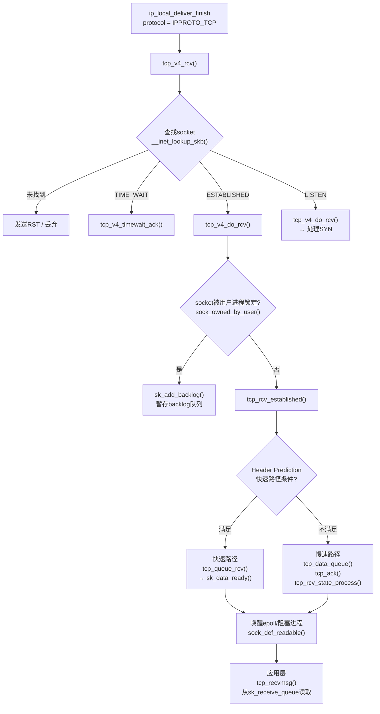

关键数据结构关系：

```TEXT
                    tcp_v4_rcv 入口
                         │
                         ▼
        ┌──────────────────────────────────┐
        │  struct sock (tcp_sock)          │
        │                                  │
        │  sk_receive_queue ──────────────►│──► 按序到达的数据（sk_buff_head链表）
        │  tp->out_of_order_queue ────────►│──► 乱序到达的数据（rb_root红黑树）
        │  tp->ooo_last_skb ──────────────►│──► rb_tree最右节点缓存（优化尾部追加）
        │  sk_backlog ────────────────────►│──► socket被锁时暂存的数据
        │  tp->ucopy.prequeue ────────────►│──► prequeue（v4.14后移除）
        │                                  │
        │  sk_data_ready ─────────────────►│──► 回调：通知epoll/阻塞进程
        │  sk_error_report ───────────────►│──► 回调：通知错误事件
        │                                  │
        │  tp->rcv_nxt ───────────────────►│──► 期望接收的下一个序号
        │  tp->rcv_wnd ───────────────────►│──► 当前接收窗口大小
        │  tp->pred_flags ────────────────►│──► 快速路径预测标志
        └──────────────────────────────────┘
```

##  0x02    tcp_v4_rcv入口分析

`tcp_v4_rcv`是TCP协议栈接收数据包的总入口，负责从IP层接管skb、查找对应的socket、根据连接状态分发到不同的处理函数

####    socket查找

```cpp
//file: net/ipv4/tcp_ipv4.c
int tcp_v4_rcv(struct sk_buff *skb)
{
    const struct tcphdr *th;
    const struct iphdr *iph;
    struct sock *sk;
    int ret;
    struct net *net = dev_net(skb->dev);

    // 1. 基本校验：数据包长度至少包含TCP头
    if (skb->pkt_type != PACKET_HOST)
        goto discard_it;

    // 2. 解析TCP头
    if (!pskb_may_pull(skb, sizeof(struct tcphdr)))
        goto discard_it;

    th = (const struct tcphdr *)skb->data;
    if (th->doff < sizeof(struct tcphdr) / 4)
        goto bad_packet;

    // 3. 完整TCP头部校验（含options）
    if (!pskb_may_pull(skb, th->doff * 4))
        goto discard_it;

    // 4. TCP checksum校验
    if (skb_checksum_init(skb, IPPROTO_TCP, inet_compute_pseudo))
        goto csum_error;

    th = (const struct tcphdr *)skb->data;
    iph = ip_hdr(skb);

    // 5. 核心：查找对应的socket
    // 先在ESTABLISHED哈希表中查找（四元组精确匹配）
    // 未命中再在LISTEN哈希表中查找（目的IP+端口匹配）
    sk = __inet_lookup_skb(&tcp_hashinfo, skb, __tcp_hdrlen(th),
                           th->source, th->dest, &refcounted);
    if (!sk)
        goto no_tcp_socket;  // 无对应socket → 发送RST

    // ...后续状态分发
}
```

`__inet_lookup_skb`内部先调用`__inet_lookup_established`在established连接哈希表中查找（以四元组`{saddr, sport, daddr, dport}`为key），如果命中则直接返回对应的`struct sock`；如果未命中，再调用`__inet_lookup_listener`在listening socket哈希表中查找（以`{daddr, dport}`为key）

####    状态分发逻辑
继续，`tcp_v4_rcv`函数后续的逻辑：

```cpp
//file: net/ipv4/tcp_ipv4.c - tcp_v4_rcv 续
    // 6. TIME_WAIT状态特殊处理
    if (sk->sk_state == TCP_TIME_WAIT)
        goto do_time_wait;

    // 7. NEW_SYN_RECV状态（收到ACK完成三次握手）
    if (sk->sk_state == TCP_NEW_SYN_RECV) {
        struct request_sock *req = inet_reqsk(sk);
        sk = req->rsk_listener;
        // ... 将连接从半连接队列提升为全连接
        // 最终转入tcp_child_process()
    }

    // 8. 加锁处理
    bh_lock_sock_nested(sk);
    ret = 0;

    if (!sock_owned_by_user(sk)) {
        // socket未被用户进程锁定，直接处理
        if (!tcp_prequeue(sk, skb))
            ret = tcp_v4_do_rcv(sk, skb);
    } else {
        // socket正被用户进程使用（如正在recv）
        // 将skb加入backlog队列，延迟到release_sock时处理
        if (tcp_add_backlog(sk, skb))
            goto discard_and_relse;
    }
    bh_unlock_sock(sk);

    // ...
    return ret;

do_time_wait:
    // TIME_WAIT状态：仅处理合法的SYN或发送ACK
    switch (tcp_timewait_state_process(inet_twsk(sk), skb, th)) {
    case TCP_TW_SYN:
        // 收到SYN，可能是新连接复用旧四元组
        // 查找LISTEN socket处理
        break;
    case TCP_TW_ACK:
        tcp_v4_timewait_ack(sk, skb);
        break;
    case TCP_TW_RST:
        // ...
    }
}
```

####   `TCP_NEW_SYN_RECV`状态下的处理：半连接转全连接

当客户端发送TCP三次握手的第三个ACK包到达时，内核在`__inet_lookup_skb`中查到的socket处于`TCP_NEW_SYN_RECV`状态（这是`request_sock`在半连接哈希表中的状态），`tcp_v4_rcv`中的完整处理如下：

```cpp
//file: net/ipv4/tcp_ipv4.c - tcp_v4_rcv().
......
    if (sk->sk_state == TCP_NEW_SYN_RECV) {
        struct request_sock *req = inet_reqsk(sk);
        struct sock *nsk;

        // 1. 获取listener socket
        sk = req->rsk_listener;

        // 2. MD5校验（如果开启）
        if (unlikely(tcp_v4_inbound_md5_hash(sk, skb))) {
            sk_drops_add(sk, skb);
            reqsk_put(req);
            goto discard_it;
        }

        // 3. 如果listener已不在LISTEN状态（竞态），丢弃req重新查找
        if (unlikely(sk->sk_state != TCP_LISTEN)) {
            inet_csk_reqsk_queue_drop_and_put(sk, req);
            goto lookup;
        }

        sock_hold(sk);
        refcounted = true;

        // 4. 核心：验证ACK并创建子socket
        nsk = tcp_check_req(sk, skb, req, false);
        if (!nsk) {
            reqsk_put(req);
            goto discard_and_relse;
        }

        if (nsk == sk) {
            // SYN重传等场景：listener自己处理
            reqsk_put(req);
        } else if (tcp_child_process(sk, nsk, skb)) {
            // 5. 子socket创建成功，处理数据
            tcp_v4_send_reset(nsk, skb);
            goto discard_and_relse;
        } else {
            sock_put(sk);
            return 0;
        }
    }
    ......
```

####    tcp_check_req：验证ACK并创建子socket

`tcp_check_req`是三次握手完成的核心函数，负责验证第三个ACK的合法性并创建全连接socket：

```cpp
//file: net/ipv4/tcp_minisocks.c
//https://elixir.bootlin.com/linux/v4.11.6/source/net/ipv4/tcp_minisocks.c#L562
struct sock *tcp_check_req(struct sock *sk, struct sk_buff *skb,
                           struct request_sock *req, bool fastopen)
{
    struct tcp_options_received tmp_opt;
    struct sock *child;
    const struct tcphdr *th = tcp_hdr(skb);
    bool own_req;

    // 1. 解析TCP选项（时间戳等）
    tcp_parse_options(skb, &tmp_opt, 0, NULL);

    // 2. 检查是否为纯SYN重传（对端没收到SYN-ACK）
    if (TCP_SKB_CB(skb)->seq == tcp_rsk(req)->rcv_isn &&
        flg == TCP_FLAG_SYN && !paws_reject) {
        // 重发SYN-ACK
        inet_rtx_syn_ack(sk, req);
        return NULL;
    }

    // 3. ACK序号校验：必须确认的是我方SYN-ACK的序号+1
    if ((flg & TCP_FLAG_ACK) && !fastopen &&
        (TCP_SKB_CB(skb)->ack_seq != tcp_rsk(req)->snt_isn + 1))
        return sk;  // 无效ACK → 交给listener处理（发送RST）

    // 4. 序号窗口校验（PAWS + 窗口范围）
    if (paws_reject || !tcp_in_window(...))
        return NULL;

    // 5. RST/SYN检查
    if (flg & (TCP_FLAG_RST | TCP_FLAG_SYN))
        goto embryonic_reset;

    // 6. TCP_DEFER_ACCEPT处理：如果设置了且是纯ACK（无数据），则忽略
    if (req->num_timeout < inet_csk(sk)->icsk_accept_queue.rskq_defer_accept &&
        TCP_SKB_CB(skb)->end_seq == tcp_rsk(req)->rcv_isn + 1) {
        inet_rsk(req)->acked = 1;
        return NULL;
    }

    // 7. 核心：创建子socket
    // 调用 tcp_v4_syn_recv_sock() → tcp_create_openreq_child()
    // 子socket初始状态为 TCP_SYN_RECV
    child = inet_csk(sk)->icsk_af_ops->syn_recv_sock(sk, skb, req, NULL,
                                                      req, &own_req);
    if (!child)
        goto listen_overflow;

    // 8. 将子socket插入ESTABLISHED哈希表，从半连接队列移到全连接队列
    return inet_csk_complete_hashdance(sk, child, req, own_req);
}
```

####    inet_csk_complete_hashdance：完成连接建立

```cpp
//file: net/ipv4/inet_connection_sock.c
//https://elixir.bootlin.com/linux/v4.11.6/source/net/ipv4/inet_connection_sock.c#L947
struct sock *inet_csk_complete_hashdance(struct sock *sk, struct sock *child,
                                         struct request_sock *req, bool own_req)
{
    if (own_req) {
        // 1. 从半连接队列中移除request_sock
        inet_csk_reqsk_queue_drop(sk, req);

        // 2. 将子socket加入listener的accept队列（全连接队列）
        //    req->sk = child，req链入 icsk_accept_queue
        inet_csk_reqsk_queue_add(sk, req, child);

        // accept队列非空 → listener的sk_data_ready会唤醒accept()调用
    }
    ......
    return child;
}
```

####    tcp_child_process：在子socket上处理数据

```cpp
//file: net/ipv4/tcp_minisocks.c
//https://elixir.bootlin.com/linux/v4.11.6/source/net/ipv4/tcp_minisocks.c#L811
int tcp_child_process(struct sock *parent, struct sock *child,
                      struct sk_buff *skb)
{
    int ret = 0;
    int state = child->sk_state;  // 此时为TCP_SYN_RECV

    if (!sock_owned_by_user(child)) {
        // 子socket未被锁定：直接处理
        // tcp_rcv_state_process会将状态从TCP_SYN_RECV推进到TCP_ESTABLISHED
        ret = tcp_rcv_state_process(child, skb);

        // 如果状态发生了变化（SYN_RECV → ESTABLISHED）
        // 通知listener的sk_data_ready → 唤醒阻塞在accept()的进程
        if (state == TCP_SYN_RECV && child->sk_state != state)
            parent->sk_data_ready(parent);
    } else {
        // 子socket被锁定：暂存到backlog
        __sk_add_backlog(child, skb);
    }

    bh_unlock_sock(child);
    sock_put(child);
    return ret;
}
```

半连接转全连接的完整流程：

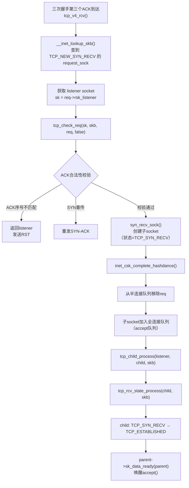

####    tcp_v4_do_rcv：进入具体处理

```cpp
//file: net/ipv4/tcp_ipv4.c
int tcp_v4_do_rcv(struct sock *sk, struct sk_buff *skb)
{
    struct tcp_sock *tp = tcp_sk(sk);

    if (sk->sk_state == TCP_ESTABLISHED) {
        // 已建立连接的数据包 → 快速路径优化
        struct dst_entry *dst = sk->sk_rx_dst;
        // ... early demux路由缓存复用
        tcp_rcv_established(sk, skb, tcp_hdr(skb), skb->len);
        return 0;
    }

    // 非ESTABLISHED状态（SYN_RECV/FIN_WAIT等）
    // 走完整的状态机处理
    if (tcp_rcv_state_process(sk, skb)) {
        rsk = sk;
        goto reset;
    }
    return 0;
}
```

状态分发逻辑的 Mermaid 图：

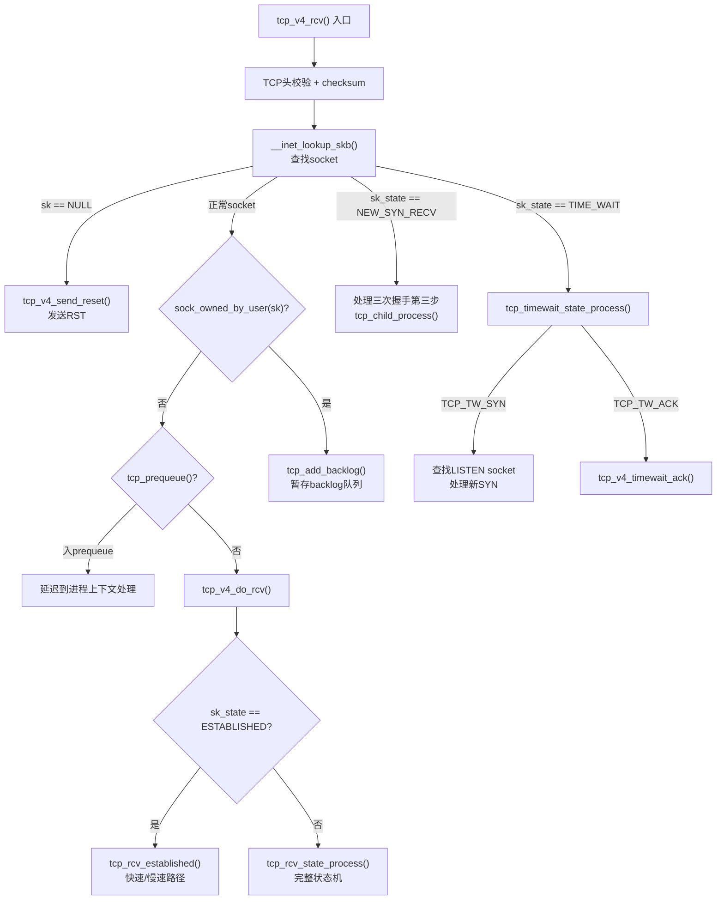

####    tcp_rcv_state_process：完整的状态机逻辑（核心）

`tcp_rcv_state_process` 主要完成对TCP状态机处理函数，是处理慢接收路径（Slow Path）和状态流转的核心引擎。当 Socket 处于建立连接阶段（如三次握手）、断开连接阶段（如四次挥手），或者虽然处于 ESTABLISHED 状态但收到带有特殊标志位的报文时，都会进入此函数

1、第一阶段：特殊前置状态处理 (Pre-ACK 状态)，函数入口，首先处理不需要或者还没到校验 ACK 阶段的三个初始状态：

-   TCP_CLOSE：最简单，连接已关闭，直接 `goto discard` 丢弃报文
-   TCP_LISTEN：服务端监听状态下，如果收到带 ACK 或 RST 标志的包，直接拒绝/丢弃。如果收到 SYN 包（建连请求），且不带 FIN，则关闭下半部中断（`local_bh_disable`），调用 `icsk->icsk_af_ops->conn_request`（通常是 `tcp_v4_conn_request`）来分配 Request Socket 并回复 SYN+ACK。这是**三次握手的第一步**
-   TCP_SYN_SENT：客户端发起连接后的状态。调用 `tcp_rcv_synsent_state_process` 专门处理服务端的 SYN+ACK 回复。如果处理成功（即三次握手第二步完成），直接返回或继续发送数据

2、第二阶段：基础校验与 Fast Open 处理。如果 Socket 不是上述三种状态，说明连接至少处于握手中期或已建立：

-   TCP Fast Open (TFO)：检查 `tp->fastopen_rsk`，处理 TFO 机制下的特定校验
-   非法标志拦截：如果包里既没有 ACK，也没有 RST 和 SYN（非法包），直接丢弃
-   序列号校验：调用 `tcp_validate_incoming`。这一步非常关键，它会校验报文的序列号是否在合法的接收窗口内，如果是非法序列号或者非法的 RST 包，直接丢弃（返回 `0` 让外层处理或忽略）

3、**第三阶段：处理 ACK （状态流转的核心），这一步严格遵循 RFC 793 的第 5 步**

```c
/* step 5: check the ACK field */
acceptable = tcp_ack(sk, skb, FLAG_SLOWPATH | FLAG_UPDATE_TS_RECENT) > 0;
switch (sk->sk_state) {
    ......
}
```

`tcp_ack` [函数](https://elixir.bootlin.com/linux/v4.11.6/source/net/ipv4/tcp_input.c#L3538)会解析报文中的 ACK 序号，更新本地的发送窗口、RTT（往返时间）等。如果 ACK 的序号合法，`acceptable`为 `true`。紧接着，根据当前状态和 ACK 的结果进行状态机流转：

3.1、`TCP_SYN_RECV`（服务端收到握手第三步的 ACK）：这是服务端三次握手的最后一步，主要完成如下步骤

-   如果 ACK 不合法，直接退出
-   释放掉暂存的 request_sock（要变成真正的 socket）
-   初始化拥塞控制、MTU、缓冲区等
-   核心代码是`tcp_set_state(sk, TCP_ESTABLISHED);`，即将 Socket 状态正式切换为已连接
-   唤醒可能阻塞在 `accept()` 上的应用层进程（`sk_wake_async`）

3.2、TCP_FIN_WAIT1 （主动关闭方收到 ACK）：主动调用 `close()` 后，发送了 FIN，处于此状态等待对方的 ACK

-   如果 `tp->snd_una == tp->write_seq`（说明本端发送的 FIN 被对方 ACK 确认了）
-   核心代码为`tcp_set_state(sk, TCP_FIN_WAIT2);`，即进入等待对方发送 FIN 的状态
-   根据是否配置了 Linger配置（延迟关闭），决定是启动 Keepalive 定时器，还是直接进入 TIME_WAIT 或清理关闭

3.3、TCP_CLOSING & TCP_LAST_ACK，这两种都是等待最后一个 ACK 的状态（前者是同时关闭，后者是被动关闭发送 FIN 后）

如果发现 FIN 被确认（`snd_una == write_seq`），则：

-   TCP_CLOSING 进入 TCP_TIME_WAIT
-   TCP_LAST_ACK 直接关闭连接（`tcp_done`）

4、第四阶段：处理紧急指针与数据载荷，状态流转处理完毕后，开始处理报文携带的实际数据：

-   URG：调用 `tcp_urg(sk, skb, th)` 处理紧急指针（带外数据）
-   无URG仅普通Payload的场景，根据当前状态决定如何处理数据：
    -   如果处于 CLOSE_WAIT / CLOSING / LAST_ACK（对方已发送 FIN），忽略正常数据，除非是收到由于重传导致的乱序旧数据
    -   如果处于 FIN_WAIT1 / FIN_WAIT2（本端已停止发送但可接收，但对方仍可发送），或者 Fall through 到了 TCP_ESTABLISHED：
        -   安全检查：如果本地 Socket 已经关闭了接收端（RCV_SHUTDOWN），但对方还发来新数据，根据 RFC 1122 规范，会增加统计计数，并发送 RST 强行重置连接
        -  数据入队：调用 `tcp_data_queue(sk, skb)`，按序放入接收队列，或者乱序放入 OFO (Out Of Order) 红黑树

5、第五阶段：扫尾工作（收包响应反馈）

```c
if (sk->sk_state != TCP_CLOSE) {
    tcp_data_snd_check(sk);
    tcp_ack_snd_check(sk);
}
```

经过以上处理，接收端的状态可能发生了改变（接收窗口可能移动了OR收到了数据）。此时后续操作为：

-   `tcp_data_snd_check`：查看发送队列里是不是有数据因为窗口打开或拥塞状态解除而可以发送了，如果有，立刻发出去
-   `tcp_ack_snd_check`：看看是不是需要给刚刚收到的包回复一个 ACK（可能是立即回复 QuickACK，也可能是延迟确认 Delayed ACK）

最后，若此报文没有被加入到任何队列（`!queued`），就在 `discard` 标签处调用 `tcp_drop` 释放内存

```c
//https://elixir.bootlin.com/linux/v4.11.6/source/net/ipv4/tcp_input.c#L5875
int tcp_rcv_state_process(struct sock *sk, struct sk_buff *skb)
{
	struct tcp_sock *tp = tcp_sk(sk);
	struct inet_connection_sock *icsk = inet_csk(sk);
	const struct tcphdr *th = tcp_hdr(skb);
	struct request_sock *req;
	int queued = 0;
	bool acceptable;

	switch (sk->sk_state) {
	case TCP_CLOSE:
		goto discard;

	case TCP_LISTEN:
		if (th->ack)
			return 1;

		if (th->rst)
			goto discard;

		if (th->syn) {
			if (th->fin)
				goto discard;
			/* It is possible that we process SYN packets from backlog,
			 * so we need to make sure to disable BH right there.
			 */
			local_bh_disable();
			acceptable = icsk->icsk_af_ops->conn_request(sk, skb) >= 0;
			local_bh_enable();

			if (!acceptable)
				return 1;
			consume_skb(skb);
			return 0;
		}
		goto discard;

	case TCP_SYN_SENT:
		tp->rx_opt.saw_tstamp = 0;
		queued = tcp_rcv_synsent_state_process(sk, skb, th);
		if (queued >= 0)
			return queued;

		/* Do step6 onward by hand. */
		tcp_urg(sk, skb, th);
		__kfree_skb(skb);
		tcp_data_snd_check(sk);
		return 0;
	}

	tp->rx_opt.saw_tstamp = 0;
	req = tp->fastopen_rsk;
	if (req) {
		WARN_ON_ONCE(sk->sk_state != TCP_SYN_RECV &&
		    sk->sk_state != TCP_FIN_WAIT1);

		if (!tcp_check_req(sk, skb, req, true))
			goto discard;
	}

	if (!th->ack && !th->rst && !th->syn)
		goto discard;

	if (!tcp_validate_incoming(sk, skb, th, 0))
		return 0;

	/* step 5: check the ACK field */
	acceptable = tcp_ack(sk, skb, FLAG_SLOWPATH |
				      FLAG_UPDATE_TS_RECENT) > 0;

	switch (sk->sk_state) {
	case TCP_SYN_RECV:
		if (!acceptable)
			return 1;

		if (!tp->srtt_us)
			tcp_synack_rtt_meas(sk, req);

		/* Once we leave TCP_SYN_RECV, we no longer need req
		 * so release it.
		 */
		if (req) {
			inet_csk(sk)->icsk_retransmits = 0;
			reqsk_fastopen_remove(sk, req, false);
		} else {
			/* Make sure socket is routed, for correct metrics. */
			icsk->icsk_af_ops->rebuild_header(sk);
			tcp_init_congestion_control(sk);

			tcp_mtup_init(sk);
			tp->copied_seq = tp->rcv_nxt;
			tcp_init_buffer_space(sk);
		}
		smp_mb();
		tcp_set_state(sk, TCP_ESTABLISHED);
		sk->sk_state_change(sk);

		/* Note, that this wakeup is only for marginal crossed SYN case.
		 * Passively open sockets are not waked up, because
		 * sk->sk_sleep == NULL and sk->sk_socket == NULL.
		 */
		if (sk->sk_socket)
			sk_wake_async(sk, SOCK_WAKE_IO, POLL_OUT);

		tp->snd_una = TCP_SKB_CB(skb)->ack_seq;
		tp->snd_wnd = ntohs(th->window) << tp->rx_opt.snd_wscale;
		tcp_init_wl(tp, TCP_SKB_CB(skb)->seq);

		if (tp->rx_opt.tstamp_ok)
			tp->advmss -= TCPOLEN_TSTAMP_ALIGNED;

		if (req) {
			/* Re-arm the timer because data may have been sent out.
			 * This is similar to the regular data transmission case
			 * when new data has just been ack'ed.
			 *
			 * (TFO) - we could try to be more aggressive and
			 * retransmitting any data sooner based on when they
			 * are sent out.
			 */
			tcp_rearm_rto(sk);
		} else
			tcp_init_metrics(sk);

		if (!inet_csk(sk)->icsk_ca_ops->cong_control)
			tcp_update_pacing_rate(sk);

		/* Prevent spurious tcp_cwnd_restart() on first data packet */
		tp->lsndtime = tcp_time_stamp;

		tcp_initialize_rcv_mss(sk);
		tcp_fast_path_on(tp);
		break;

	case TCP_FIN_WAIT1: {
		int tmo;

		/* If we enter the TCP_FIN_WAIT1 state and we are a
		 * Fast Open socket and this is the first acceptable
		 * ACK we have received, this would have acknowledged
		 * our SYNACK so stop the SYNACK timer.
		 */
		if (req) {
			/* Return RST if ack_seq is invalid.
			 * Note that RFC793 only says to generate a
			 * DUPACK for it but for TCP Fast Open it seems
			 * better to treat this case like TCP_SYN_RECV
			 * above.
			 */
			if (!acceptable)
				return 1;
			/* We no longer need the request sock. */
			reqsk_fastopen_remove(sk, req, false);
			tcp_rearm_rto(sk);
		}
		if (tp->snd_una != tp->write_seq)
			break;

		tcp_set_state(sk, TCP_FIN_WAIT2);
		sk->sk_shutdown |= SEND_SHUTDOWN;

		sk_dst_confirm(sk);

		if (!sock_flag(sk, SOCK_DEAD)) {
			/* Wake up lingering close() */
			sk->sk_state_change(sk);
			break;
		}

		if (tp->linger2 < 0 ||
		    (TCP_SKB_CB(skb)->end_seq != TCP_SKB_CB(skb)->seq &&
		     after(TCP_SKB_CB(skb)->end_seq - th->fin, tp->rcv_nxt))) {
			tcp_done(sk);
			NET_INC_STATS(sock_net(sk), LINUX_MIB_TCPABORTONDATA);
			return 1;
		}

		tmo = tcp_fin_time(sk);
		if (tmo > TCP_TIMEWAIT_LEN) {
			inet_csk_reset_keepalive_timer(sk, tmo - TCP_TIMEWAIT_LEN);
		} else if (th->fin || sock_owned_by_user(sk)) {
			/* Bad case. We could lose such FIN otherwise.
			 * It is not a big problem, but it looks confusing
			 * and not so rare event. We still can lose it now,
			 * if it spins in bh_lock_sock(), but it is really
			 * marginal case.
			 */
			inet_csk_reset_keepalive_timer(sk, tmo);
		} else {
			tcp_time_wait(sk, TCP_FIN_WAIT2, tmo);
			goto discard;
		}
		break;
	}

	case TCP_CLOSING:
		if (tp->snd_una == tp->write_seq) {
			tcp_time_wait(sk, TCP_TIME_WAIT, 0);
			goto discard;
		}
		break;

	case TCP_LAST_ACK:
		if (tp->snd_una == tp->write_seq) {
			tcp_update_metrics(sk);
			tcp_done(sk);
			goto discard;
		}
		break;
	}

	/* step 6: check the URG bit */
	tcp_urg(sk, skb, th);

	/* step 7: process the segment text */
	switch (sk->sk_state) {
	case TCP_CLOSE_WAIT:
	case TCP_CLOSING:
	case TCP_LAST_ACK:
		if (!before(TCP_SKB_CB(skb)->seq, tp->rcv_nxt))
			break;
	case TCP_FIN_WAIT1:
	case TCP_FIN_WAIT2:
		/* RFC 793 says to queue data in these states,
		 * RFC 1122 says we MUST send a reset.
		 * BSD 4.4 also does reset.
		 */
		if (sk->sk_shutdown & RCV_SHUTDOWN) {
			if (TCP_SKB_CB(skb)->end_seq != TCP_SKB_CB(skb)->seq &&
			    after(TCP_SKB_CB(skb)->end_seq - th->fin, tp->rcv_nxt)) {
				NET_INC_STATS(sock_net(sk), LINUX_MIB_TCPABORTONDATA);
				tcp_reset(sk);
				return 1;
			}
		}
		/* Fall through */
	case TCP_ESTABLISHED:
		tcp_data_queue(sk, skb);
		queued = 1;
		break;
	}

	/* tcp_data could move socket to TIME-WAIT */
	if (sk->sk_state != TCP_CLOSE) {
		tcp_data_snd_check(sk);
		tcp_ack_snd_check(sk);
	}

	if (!queued) {
discard:
		tcp_drop(sk, skb);
	}
	return 0;
}
EXPORT_SYMBOL(tcp_rcv_state_process);
```

##  0x03    快速路径与慢速路径（Fast Path / Slow Path）

`tcp_rcv_established`是ESTABLISHED状态下TCP数据包处理的核心函数。它实现了一个关键优化机制，即**Header Prediction（头部预测）**，对于常见的、按序到达的纯数据包，跳过大量检查直接入队，极大提升性能

####    Header Prediction机制

TCP接收处理的绝大多数场景是：连接已建立，数据按序到达，窗口未变，无特殊标志。内核利用`tp->pred_flags`对这种"典型情况"进行预测，匹配则走快速路径
快速路径，触发条件（必须同时满足极其苛刻的完美条件）：

1.  报文完全按序到达（`seq == tp->rcv_nxt`）
2.  报文是纯数据或纯 ACK，没有携带 SYN、FIN、URG、RST 等特殊控制标志
3.  接收窗口（Receive Window）充足
4.  报文的时间戳合法，且没有发生乱序或丢包引发的各种重传状态

```cpp
//file: net/ipv4/tcp_input.c
//https://elixir.bootlin.com/linux/v4.11.6/source/net/ipv4/tcp_input.c#L5351
void tcp_rcv_established(struct sock *sk, struct sk_buff *skb,
                         const struct tcphdr *th, unsigned int len)
{
    struct tcp_sock *tp = tcp_sk(sk);

    // ====== Header Prediction 快速路径检查 ======
    // pred_flags在窗口/状态变化时由tcp_fast_path_check()更新
    // 它预编码了：窗口大小未变 + 无SYN/FIN/RST/URG标志 + ACK已设置
    if ((tcp_flag_word(th) & TCP_HP_BITS) == tp->pred_flags &&
        TCP_SKB_CB(skb)->seq == tp->rcv_nxt &&        // 序号是期望的下一个
        !after(TCP_SKB_CB(skb)->ack_seq, tp->snd_nxt)) {  // ACK合法
        int tcp_header_len = th->doff * 4;

        // ---- 快速路径分支1：纯ACK包（无数据负载）----
        if (tcp_header_len == len) {
            // 只有ACK，无数据
            tcp_ack(sk, skb, 0);   // 处理ACK（推进snd_una、释放已确认skb）
            __kfree_skb(skb);      // 释放skb

            // 检查是否有数据需要发送（ACK可能释放了窗口）
            if (!tcp_data_snd_check(sk))
                tcp_ack_snd_check(sk);
            return;
        }

        // ---- 快速路径分支2：纯数据包（有负载，按序到达）----
        if (tp->ucopy.task == current &&
            tp->copied_seq == tp->rcv_nxt &&
            len - tcp_header_len <= tp->ucopy.len &&
            sock_owned_by_user(sk)) {
            // 用户进程正在recv且缓冲区足够：直接复制到用户空间（零中间拷贝）
            __set_current_state(TASK_RUNNING);
            if (!tcp_copy_to_iovec(sk, skb, tcp_header_len)) {
                // 直接复制成功
                tp->rcv_nxt = TCP_SKB_CB(skb)->end_seq;
                // ...
                __kfree_skb(skb);
                tcp_ack(sk, skb, FLAG_DATA);
                tcp_data_snd_check(sk);
                return;
            }
        }

        // 快速路径分支3：标准入队
        if (eaten <= 0) {
eaten:
            // 数据入sk_receive_queue
            tcp_queue_rcv(sk, skb, tcp_header_len, &fragstolen);

            // 更新rcv_nxt
            tp->rcv_nxt = TCP_SKB_CB(skb)->end_seq;
        }

        // 处理ACK
        tcp_event_data_recv(sk, skb);
        tcp_ack(sk, skb, FLAG_DATA);

        // 重要：唤醒等待数据的进程/epoll
        sk->sk_data_ready(sk);

        // 检查是否需要发送ACK
        tcp_data_snd_check(sk);
        return;
    }

    ......

    // ====== 慢速路径 ======
    // 条件不满足header prediction时，通过goto跳转到slow_path标签
    // 注意：慢速路径是tcp_rcv_established内部的inline代码

slow_path:
    if (len < (th->doff << 2) || tcp_checksum_complete(skb))
        goto csum_error;

    if (!th->ack && !th->rst && !th->syn)
        goto discard;

    // 完整校验（序号、RST、SYN检查）
    if (!tcp_validate_incoming(sk, skb, th, 1))
        return;

step5:
    if (tcp_ack(sk, skb, FLAG_SLOWPATH | FLAG_UPDATE_TS_RECENT) < 0)
        goto discard;

    tcp_rcv_rtt_measure_ts(sk, skb);

    tcp_urg(sk, skb, th);           // 处理紧急数据
    tcp_data_queue(sk, skb);        // 数据入队（含乱序处理）
    tcp_data_snd_check(sk);
    tcp_ack_snd_check(sk);
    return;

csum_error:
    TCP_INC_STATS(sock_net(sk), TCP_MIB_CSUMERRORS);
    TCP_INC_STATS(sock_net(sk), TCP_MIB_INERRS);
discard:
    tcp_drop(sk, skb);
    ......
}
```

####    快速路径条件（pred_flags）

`pred_flags`由`tcp_fast_path_check()`计算并缓存：

```cpp
//file: include/net/tcp.h
//https://elixir.bootlin.com/linux/v4.11.6/source/include/net/tcp.h#L644
static inline void tcp_fast_path_check(struct sock *sk)
{
    struct tcp_sock *tp = tcp_sk(sk);

    ......
    
    // 快速路径条件（全部满足才开启）：
    // 1. 乱序队列为空（rb_tree为空）
    // 2. 接收窗口大于0
    // 3. 已分配的接收内存 < 接收缓冲区上限（有空间接收）
    // 4. 没有待处理的紧急数据
    if (RB_EMPTY_ROOT(&tp->out_of_order_queue) &&
        tp->rcv_wnd &&
        atomic_read(&sk->sk_rmem_alloc) < sk->sk_rcvbuf &&
        !tp->urg_data)
        tcp_fast_path_on(tp);
}

static inline void tcp_fast_path_on(struct tcp_sock *tp)
{
    // 预编码期望的TCP头标志：ACK置位 + 对端通告的窗口大小不变
    // 注意：这里用snd_wnd（对端通告给我方的窗口），不是rcv_wnd
    // 因为pred_flags需要与到达包的TCP头中的window字段匹配
    __tcp_fast_path_on(tp, tp->snd_wnd >> tp->rx_opt.snd_wscale);
}

static inline void __tcp_fast_path_on(struct tcp_sock *tp, u32 snd_wnd)
{
    // pred_flags = (TCP头的前32位应该匹配的值)
    // 包含：doff=5(无options) + ACK标志 + 窗口大小
    tp->pred_flags = htonl((tp->tcp_header_len << 26) |
                           ntohl(TCP_FLAG_ACK) |
                           snd_wnd);
}
```

####    快速路径的（最终）处理函数：tcp_queue_rcv
ps：这里其实不仅仅是快速路径的场景，`tcp_queue_rcv` 扮演着**按序数据入队最终执行者**的角色。无论是经过怎样的前置条件检查，只要内核确认一段数据是合法、按序（In-Sequence）且需要暂存到 Socket 接收队列中等待用户态读取的，最终都会调用`tcp_queue_rcv`函数。在本内核版本中，`tcp_queue_rcv` 只有两个核心调用场景（快+慢），先分别说明：

1、场景一：命中快速路径（Fast Path）

调用位置为`tcp_rcv_established` 函数（这是 `tcp_queue_rcv` 最频繁被调的场景）。当网络状况良好，且连接处于稳定的 `TCP_ESTABLISHED` 状态时，绝大多数的数据包都会走这条路径。此时，内核会直接绕过复杂的 TCP 状态机和慢速路径（跳过 `tcp_data_queue`），然后：

-   首先，内核会尝试检查当前是否有用户态进程正阻塞在 `recv/read` 系统调用上（`tp->ucopy.task == current`）。如果有，内核会尝试直接将数据从网卡 skb 拷贝到用户态内存中（Zero-copy 的一种形态）
-   如果用户态没有人在等，或者直接拷贝失败，内核就会直接调用 `tcp_queue_rcv`。将剥离了 TCP 协议头的纯 payload 数据（尝试与队尾合并）挂入 `sk_receive_queue`，然后立即回复 ACK 或等待延迟确认（Delayed ACK）

2、场景二：跌入慢速路径（Slow Path）

调用位置为`tcp_data_queue` 函数（具体是在 `if (TCP_SKB_CB(skb)->seq == tp->rcv_nxt)` 的[分支](https://elixir.bootlin.com/linux/v4.11.6/source/net/ipv4/tcp_input.c#L4609)中，这是 `tcp_queue_rcv` 作为兜底处理的场景。当数据包不够完美，会被内核扔进慢速路径（`tcp_rcv_state_process` 或 `tcp_rcv_established` 的 slow path 分支），并在最终到达 `tcp_data_queue` 时被调用

在慢速路径的触发条件（数据包是按序的，但伴随了其他复杂状况）如下：

-   状态不完美：Socket 可能处于 FIN_WAIT_1、FIN_WAIT_2 等半关闭状态，非 ESTABLISHED
-   携带特殊标志：报文带了 PSH（推送）、URG（紧急指针），内核需要特殊处理
-   经历了异常恢复：例如刚刚填补了乱序队列（OFO）的空洞，或者发生过窗口缩小、内存紧张等问题
-   有趣的场景：**部分重叠（Partial overlap）**，即内核收到一个重传包，其中有一部分是旧数据，一部分是新数据。内核在 `tcp_data_queue` 中通过 `__skb_pull` 裁掉旧数据后，剩下的新数据依然符合按序条件，对应这部分[代码](https://elixir.bootlin.com/linux/v4.11.6/source/net/ipv4/tcp_input.c#L4609)

然后，进入 `tcp_data_queue` 后，内核发现这个包（或裁剪后的包）的序列号刚好等于 `tp->rcv_nxt`（即填补了当前的期望序号）。同样，内核会先尝试直接拷贝给用户态（`skb_copy_datagram_msg`），如果未被用户态吃掉（`eaten <= 0`），并且接收缓冲区内存没有爆满（通过 `tcp_try_rmem_schedule` 检查），就会在 `queue_and_out` 标签处调用 `tcp_queue_rcv`，将这个**虽然经过波折但依然合法按序**的数据包挂入 `sk_receive_queue`，关联[代码](https://elixir.bootlin.com/linux/v4.11.6/source/net/ipv4/tcp_input.c#L4638)

```c
//https://elixir.bootlin.com/linux/v4.11.6/source/net/ipv4/tcp_input.c#L4521
static int __must_check tcp_queue_rcv(struct sock *sk, struct sk_buff *skb, int hdrlen,
		  bool *fragstolen)
{
	int eaten;
    // 1. 获取当前接收队列的最后一个报文
	struct sk_buff *tail = skb_peek_tail(&sk->sk_receive_queue);

    // 2. 剥离协议头，只保留 Payload
	__skb_pull(skb, hdrlen);

    // 3. 尝试与队尾报文合并 (核心优化)
	eaten = (tail &&
		 tcp_try_coalesce(sk, tail, skb, fragstolen)) ? 1 : 0;

    /*
    这是整个函数里非常重要的逻辑
    在万兆网络下，如果每一个 TCP 段都用一个独立的 sk_buff 结构体挂在链表上，会产生巨大的内存开销（sk_buff 本身就是个庞大的结构体），并且严重降低 CPU 缓存命中率。
    tcp_try_coalesce 会尝试将新来的 skb 的数据，直接追加到队尾 tail 报文的分片页（skb_shared_info 中的 frags 数组）中
    如果合并成功，新来的 skb 结构体外壳在后续就会被释放（即被 "eaten" 吃掉了），返回 1
    */

    // 4. 更新 TCP 状态机的期望序列号
    //重要：无论是否被吃掉，这批数据已经被接收了，所以必须更新 rcv_nxt
	tcp_rcv_nxt_update(tcp_sk(sk), TCP_SKB_CB(skb)->end_seq);

    // 5. 如果没有被吃掉，作为独立节点挂入队列
	if (!eaten) {
		__skb_queue_tail(&sk->sk_receive_queue, skb);
		skb_set_owner_r(skb, sk);
	}

	return eaten;
}

/* If we update tp->rcv_nxt, also update tp->bytes_received */
static void tcp_rcv_nxt_update(struct tcp_sock *tp, u32 seq)
{
	u32 delta = seq - tp->rcv_nxt;

	sock_owned_by_me((struct sock *)tp);
	tp->bytes_received += delta;

    //将 Socket 控制块（tcp_sock）中记录的"期望接收的下一个序列号"更新为当前报文的结束序列号
	tp->rcv_nxt = seq;
}
```

`tcp_queue_rcv` 是 Linux 内核 TCP 快速路径接收流程的最后一步，将已经确认合法、按序到达的纯 payload 数据，正式放入 Socket 的接收队列 (`sk_receive_queue`)，以供用户态进程读取，上述代码有几个要点：

-   `skb_peek_tail`：内核试图找到当前队列尾部的 skb。这是为了接下来的合并（Coalesce）操作做准备
-   `__skb_pull`：将 `skb->data` 指针向前推 `hdrlen`（通常是 MAC头 + IP头 + TCP头 的长度）。执行完这一句后，这个 skb 就只剩下纯粹的 TCP 数据载荷了

注意，如果 `tcp_try_coalesce` 失败（比如队尾报文的分片数组满了，或者内存不连续等原因），则走传统的慢速路径，即将这个完整的 skb 挂到队列尾部，并通过 `skb_set_owner_r` 将这个报文占用的内存计入当前 Socket 的接收缓冲区内存配额（`sk_rmem_alloc`）中

当`tcp_queue_rcv`成功执行后，对调用方（前文）而言，会触发如下可能的后续动作：

-   给对端发送ACK确认：当内核接下来准备发送 ACK 回应对方时，填入 TCP 报头中的 Acknowledgment Number 就是直接读取更新后的 `tp->rcv_nxt`
-   窗口滑动：它的更新标志着接收窗口（Receive Window）左边缘的右移，意味着这部分数据已经安全着陆
-   乱序队列检查：当调用方来自于慢速路径的 `tcp_data_queue`函数时，在 `rcv_nxt` 更新后，内核通常会立刻检查乱序红黑树（OFO queue），看看有没有 `seq == 新 rcv_nxt` 的暂存报文可以顺势一起处理掉

####    慢速路径的触发条件

以下情况会导致`pred_flags`不匹配，进入慢速路径：
-   **数据乱序到达（Out of Order）**：`TCP_SKB_CB(skb)->seq != tp->rcv_nxt`，这是最常见的原因。报文序列号大于 `rcv_nxt`，不能立即交付，必须调用 `tcp_data_queue` 将其放入红黑树暂存
-   **窗口大小变化**：对端通告窗口改变
-   **携带特殊标志**：SYN/FIN/RST/URG任一置位，当携带特殊控制标志位时，比如报文中带有 FIN 标志（对方准备断开连接），或者带有 URG（紧急指针）。快速路径无法处理这些标志，必须走慢速路径调用 `tcp_data_queue` 去处理带有特殊标记的载荷
-   **有乱序队列未处理**：`out_of_order_queue`非空
-   **SACK/DSACK需要处理**
-   **ACK序号超前**：`after(ack_seq, tp->snd_nxt)`
-   发生丢包或重传（Duplicate/Retransmit）：收到了之前已经收到过的数据包（完全重叠或部分重叠），需要交由 `tcp_data_queue` 去触发 DSACK 并裁剪/丢弃冗余数据
-   接收窗口（Receive Window）变动或耗尽：例如由于内存压力导致零窗口（Zero Window Probe），需要复杂的逻辑来决定是接收还是丢弃

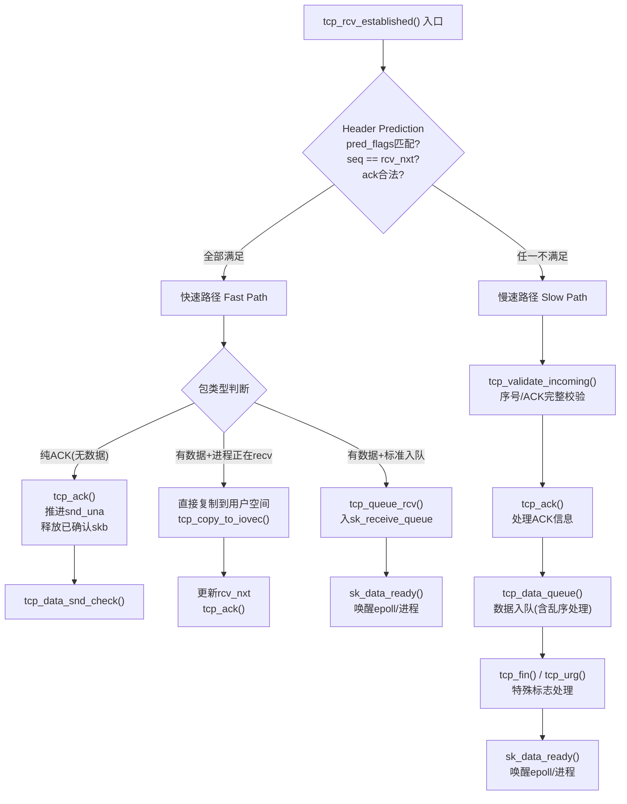

##  0x04    序号与ACK机制

####    序号校验：tcp_validate_incoming

每个到达的TCP段都必须通过序号校验才能被接受。内核通过`tcp_sequence`宏检查段的序号是否在接收窗口内：

```cpp
//file: net/ipv4/tcp_input.c
// 判断段[seq, end_seq)是否与接收窗口[rcv_nxt, rcv_nxt+rcv_wnd)有交集
static inline bool tcp_sequence(const struct tcp_sock *tp, u32 seq, u32 end_seq)
{
    return !before(end_seq, tp->rcv_wup) &&
           !after(seq, tp->rcv_nxt + tcp_receive_window(tp));
}

// before/after 宏处理序号回绕
static inline bool before(__u32 seq1, __u32 seq2)
{
    return (__s32)(seq1 - seq2) < 0;
}
#define after(seq2, seq1) before(seq1, seq2)
```

`tcp_validate_incoming`是慢速路径中的完整校验：

```cpp
//file: net/ipv4/tcp_input.c
static bool tcp_validate_incoming(struct sock *sk, struct sk_buff *skb,
                                  const struct tcphdr *th, int syn_inerr)
{
    struct tcp_sock *tp = tcp_sk(sk);

    // 1. 序号校验：段必须在接收窗口内
    if (!tcp_sequence(tp, TCP_SKB_CB(skb)->seq, TCP_SKB_CB(skb)->end_seq)) {
        // 序号不在窗口内
        if (!th->rst) {
            // 非RST包：发送一个ACK通知对端我方的rcv_nxt
            // （常见场景：对端重传了已确认的旧数据）
            tcp_send_dupack(sk, skb);
        }
        goto discard;
    }

    // 2. RST标志检查
    if (th->rst) {
        if (TCP_SKB_CB(skb)->seq == tp->rcv_nxt)
            tcp_reset(sk);  // 合法RST → 重置连接
        else
            // 窗口内的非精确RST → challenge ACK（RFC 5961）
            tcp_send_challenge_ack(sk, skb);
        goto discard;
    }

    // 3. SYN标志检查（ESTABLISHED状态不应收到SYN）
    if (th->syn) {
        tcp_send_challenge_ack(sk, skb);
        goto discard;
    }

    return true;

discard:
    return false;
}
```

####    ACK处理：tcp_ack（复杂）

`tcp_ack`是TCP接收路径中最复杂的函数之一，**主要负责处理对端返回的ACK信息，驱动发送端的窗口滑动和拥塞控制**：

```cpp
//file: net/ipv4/tcp_input.c
static int tcp_ack(struct sock *sk, const struct sk_buff *skb, int flag)
{
    struct tcp_sock *tp = tcp_sk(sk);
    u32 ack_seq = TCP_SKB_CB(skb)->ack_seq;  // 对端确认的序号
    u32 prior_snd_una = tp->snd_una;         // 之前的发送未确认起始点
    int prior_packets = tp->packets_out;

    // 1. ACK合法性检查
    if (before(ack_seq, prior_snd_una))
        goto old_ack;    // 旧ACK（已处理过的确认）
    if (after(ack_seq, tp->snd_nxt))
        goto invalid_ack; // 超前ACK（确认了未发送的数据）

    // 2. 标记确认了新数据
    flag |= FLAG_SND_UNA_ADVANCED;

    // 3. SACK信息处理
    if (TCP_SKB_CB(skb)->sacked)
        flag |= tcp_sacktag_write_queue(sk, skb, prior_snd_una, &sack_state);

    // 4. 推进snd_una（发送窗口左边界右移）
    tp->snd_una = ack_seq;

    // 5. 释放已确认的skb（从重传队列中移除）
    // tcp_clean_rtx_queue内部会调用tcp_rtt_estimator更新RTT估算
    flag |= tcp_clean_rtx_queue(sk, prior_fackets, prior_snd_una,
                                 &sack_state);

    // 6. 拥塞控制更新（核心！）
    // 如果算法实现了cong_control（如BBR），走tcp_cong_control
    // 否则走传统的tcp_cong_avoid
    tcp_cong_avoid(sk, ack_seq, acked);

    // 7. 更新发送窗口
    tcp_ack_update_window(sk, skb, ack_seq, ntohs(th->window) << tp->rx_opt.snd_wscale);

    // 8. 快速重传/恢复检测
    tcp_fastretrans_alert(sk, acked, prior_unsacked, is_dupack, flag);

    return 1;

old_ack:
    // duplicate ACK检测
    if (TCP_SKB_CB(skb)->sacked) {
        flag |= tcp_sacktag_write_queue(sk, skb, prior_snd_una, &sack_state);
    }
    // ...
}
```

####    Delayed ACK机制

TCP不会对每个数据段立即回复ACK，而是延迟合并以减少网络上的小包数量：

```cpp
//file: net/ipv4/tcp_input.c
// https://elixir.bootlin.com/linux/v4.11.6/source/net/ipv4/tcp_input.c#L657
static void tcp_event_data_recv(struct sock *sk, struct sk_buff *skb)
{
    struct tcp_sock *tp = tcp_sk(sk);
    struct inet_connection_sock *icsk = inet_csk(sk);
    u32 now;

    // 1. 标记需要发送ACK（调度ACK，但不一定立即发送）
    inet_csk_schedule_ack(sk);

    // 2. 测量接收MSS
    tcp_measure_rcv_mss(sk, skb);

    // 3. 测量接收端RTT
    tcp_rcv_rtt_measure(tp);

    now = tcp_time_stamp;

    // 4. 自适应调整ACK延迟时间（ATO）
    if (!icsk->icsk_ack.ato) {
        // 第一个数据包：初始化delayed ACK引擎
        tcp_incr_quickack(sk);           // 进入QuickACK模式
        icsk->icsk_ack.ato = TCP_ATO_MIN;  // ATO初始值（40ms）
    } else {
        int m = now - icsk->icsk_ack.lrcvtime;  // 距上次收包的间隔

        if (m <= TCP_ATO_MIN / 2) {
            // 包到达非常快：缩小ATO（更快发送ACK）
            icsk->icsk_ack.ato = (icsk->icsk_ack.ato >> 1) + TCP_ATO_MIN / 2;
        } else if (m < icsk->icsk_ack.ato) {
            // 正常间隔：平滑调整ATO
            icsk->icsk_ack.ato = (icsk->icsk_ack.ato >> 1) + m;
            if (icsk->icsk_ack.ato > icsk->icsk_rto)
                icsk->icsk_ack.ato = icsk->icsk_rto;
        } else if (m > icsk->icsk_rto) {
            // 间隔太长（发送端可能窗口受限）：进入QuickACK模式
            tcp_incr_quickack(sk);
            sk_mem_reclaim(sk);
        }
    }
    icsk->icsk_ack.lrcvtime = now;  // 记录本次收包时间

    // 5. ECN检查
    tcp_ecn_check_ce(tp, skb);

    // 6. 如果收到较大的数据段，尝试增长接收窗口
    if (skb->len >= 128)
        tcp_grow_window(sk, skb);
}
```

注意：`tcp_event_data_recv`本身不直接发送ACK，它只标记ACK调度（`inet_csk_schedule_ack`）和调整ATO。实际ACK的发送由后续的`__tcp_ack_snd_check`或`tcp_ack_snd_check`根据以下规则决定：
- 如果处于QuickACK模式（`tcp_in_quickack_mode`为真），立即发送
- 如果收到了两个连续的全尺寸段，立即发送（每两个包ACK一次）
- 否则，启动delayed ACK定时器（等待ATO超时后发送）

Delayed ACK的规则：
-   最多延迟`TCP_DELACK_MAX`（`200ms`），通常为`40ms`（`TCP_DELACK_MIN`）
-   如果在延迟期间有数据要发送，ACK会捎带在数据包中（Piggybacking）
-   收到两个连续的全尺寸段后，立即发送ACK（每收两个包ACK一次）
-   连接建立初期和丢包恢复期使用QuickACK模式（立即回复）

####    Duplicate ACK与快速重传触发

接收端在什么条件下发送Duplicate ACK（触发发送端的快速重传）：

```cpp
//file: net/ipv4/tcp_input.c
static void tcp_send_dupack(struct sock *sk, const struct sk_buff *skb)
{
    struct tcp_sock *tp = tcp_sk(sk);

    // 收到一个序号不等于rcv_nxt的包（即乱序到达）
    // 发送一个重复的ACK（ack_seq仍是rcv_nxt），通知对端有包丢失

    if (TCP_SKB_CB(skb)->end_seq != TCP_SKB_CB(skb)->seq &&
        before(TCP_SKB_CB(skb)->seq, tp->rcv_nxt)) {
        // D-SACK: 收到已确认过的重复数据
        tcp_dsack_set(sk, TCP_SKB_CB(skb)->seq, TCP_SKB_CB(skb)->end_seq);
    }

    tcp_send_ack(sk);  // 发送ACK（携带SACK块信息）
}
```

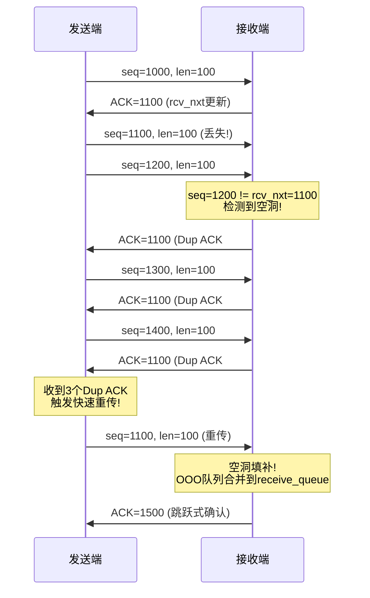

####    SACK机制：基础

SACK（Selective Acknowledgment，选择性确认）是TCP的重要扩展（RFC 2018），解决了传统累积ACK的"只能确认连续数据"的缺陷。没有SACK时，发送端在丢包场景下只能通过超时或Dup ACK推测哪些包丢了；有了SACK，接收端可以精确告诉发送端"哪些不连续的数据块已经收到了"，使发送端能精准地只重传丢失的段

####    SACK协商与数据结构

SACK在三次握手期间通过TCP选项协商开启，双方在SYN/SYN-ACK中携带`SACK Permitted`选项表示支持。协商成功后，`tp->rx_opt.sack_ok`非零

```cpp
//file: include/net/tcp.h
static inline int tcp_is_sack(const struct tcp_sock *tp)
{
    return tp->rx_opt.sack_ok;
}
```

内核中SACK相关的核心数据结构：

```cpp
//file: include/linux/tcp.h
struct tcp_sock {
    // === 接收端SACK（我方生成，随ACK发送给对端）===
    struct tcp_sack_block selective_acks[4];  // 最多4个SACK块
    // selective_acks[i].start_seq / end_seq 描述一段已收到的不连续区间

    struct tcp_options_received rx_opt;
    // rx_opt.num_sacks:  当前SACK块数量（0~4）
    // rx_opt.dsack:      本次ACK是否携带D-SACK信息
    // rx_opt.sack_ok:    SACK是否已协商开启

    // === 发送端SACK处理（解析对端返回的SACK信息）===
    struct tcp_sack_block recv_sack_cache[4]; // 缓存上一次收到的SACK块（优化增量处理）
    u32 sacked_out;   // 被SACK标记但未确认的段数量
    // ...
};

struct tcp_sack_block {
    u32 start_seq;    // SACK块起始序号
    u32 end_seq;      // SACK块结束序号（不包含）
};
```

####    接收端：SACK块的生成

当乱序数据到达时，接收端在`tcp_data_queue_ofo`中生成SACK块，随后在ACK中携带发送给对端：

```cpp
//file: net/ipv4/tcp_input.c
// 乱序段入队后，生成或更新SACK块
// https://elixir.bootlin.com/linux/v4.11.6/source/net/ipv4/tcp_input.c#L4191
static void tcp_sack_new_ofo_skb(struct sock *sk, u32 seq, u32 end_seq)
{
    struct tcp_sock *tp = tcp_sk(sk);
    struct tcp_sack_block *sp = &tp->selective_acks[0];
    int cur_sacks = tp->rx_opt.num_sacks;
    int this_sack;

    // 检查是否能与已有的SACK块合并
    for (this_sack = 0; this_sack < cur_sacks; this_sack++, sp++) {
        if (tcp_sack_extend(sp, seq, end_seq)) {
            // 与已有块相邻或重叠 → 合并扩展
            // 将合并后的块移到selective_acks[0]（RFC要求最新的排最前）
            // ...
            return;
        }
    }

    // 无法合并 → 创建新的SACK块
    if (cur_sacks < TCP_NUM_SACKS) {
        // 还有空间：直接添加
        tp->rx_opt.num_sacks++;
    }
    // 将新块放在selective_acks[0]，已有块后移
    // （超过4个块时，最旧的块被丢弃）
    sp = tp->selective_acks;
    memmove(sp + 1, sp, cur_sacks * sizeof(*sp));
    sp[0].start_seq = seq;
    sp[0].end_seq = end_seq;
}
```

SACK块的管理规则：
- 由于TCP选项空间有限，一个ACK最多携带**4个**SACK块（`TCP_NUM_SACKS = 4`），如果同时使用时间戳选项则最多**3个**
- **最新的SACK块排在最前面**（RFC 2018要求），确保即使ACK丢失，对端也能收到最新的信息
- 当按序数据到达填补空洞后，`tcp_sack_remove`会移除已被`rcv_nxt`覆盖的SACK块

####    发送端：SACK信息处理（tcp_sacktag_write_queue）

发送端收到携带SACK选项的ACK时，在`tcp_ack`中调用`tcp_sacktag_write_queue`处理：

```cpp
//file: net/ipv4/tcp_input.c
static int tcp_sacktag_write_queue(struct sock *sk, const struct sk_buff *ack_skb,
                                    u32 prior_snd_una,
                                    struct tcp_sacktag_state *state)
{
    struct tcp_sock *tp = tcp_sk(sk);
    // 从ACK的TCP选项中解析SACK块
    const unsigned char *ptr = (skb_transport_header(ack_skb) +
                                TCP_SKB_CB(ack_skb)->sacked);

    // 1. D-SACK检测：第一个SACK块如果落在snd_una之前，则为D-SACK
    //    D-SACK表示对端收到了重复数据（可能是不必要的重传）

    // 2. SACK块合法性校验：必须在[snd_una, snd_nxt]范围内

    // 3. 遍历发送队列（write_queue），标记被SACK覆盖的skb
    //    使用 recv_sack_cache 做增量处理（只处理新增的SACK范围）

    // 4. 对每个被SACK覆盖的skb：
    //    TCP_SKB_CB(skb)->sacked |= TCPCB_SACKED_ACKED
    //    tp->sacked_out++ （记录被SACK的段数）

    // 5. 更新FACK（Forward ACK）：tp->fackets_out = 最远SACK覆盖的段

    // 6. 检测乱序（reordering）：
    //    如果SACK填补了旧空洞且该段从未被重传 → 网络发生了乱序

    return flag;  // 返回FLAG_DATA_SACKED等标志
}
```

发送队列中每个skb通过`TCP_SKB_CB(skb)->sacked`字段维护状态，形成一个有限状态机：

```TEXT
skb的sacked字段状态位：
  TCPCB_SACKED_ACKED  (S)  - 被SACK确认
  TCPCB_SACKED_RETRANS (R) - 已重传
  TCPCB_LOST           (L) - 被判定为丢失

有效状态组合：
  0    → 发送中，等待确认
  S    → 被SACK确认（对端已收到，但尚未被累积ACK确认）
  L    → 被判定为丢失（需要重传）
  L|R  → 丢失后已重传
  S|R  → 重传后被SACK确认
```

####    D-SACK（Duplicate SACK）

D-SACK（RFC 2883）是SACK的扩展，允许接收端通知发送端"收到了重复的数据"。内核通过`tcp_dsack_set`/`tcp_dsack_extend`设置D-SACK信息：

```cpp
//file: net/ipv4/tcp_input.c
//https://elixir.bootlin.com/linux/v4.11.6/source/net/ipv4/tcp_input.c#L4112
// 当接收端收到已确认过的重复数据时，标记D-SACK
static void tcp_dsack_set(struct sock *sk, u32 seq, u32 end_seq)
{
    struct tcp_sock *tp = tcp_sk(sk);

    // D-SACK块放在selective_acks[0]，其范围落在ack_seq之前
    // 发送端看到 SACK[0].start < ack_seq 就知道这是D-SACK
    if (tp->rx_opt.sack_ok) {
        tp->rx_opt.dsack = 1;
        tp->duplicate_sack[0].start_seq = seq;
        tp->duplicate_sack[0].end_seq = end_seq;
    }
}
```

D-SACK的意义如下：
- **检测不必要的重传**：如果发送端收到D-SACK，说明原始包并没有丢（可能只是延迟），之前的重传是多余的
- **辅助撤销拥塞窗口缩减**：如果丢包判断是错误的（实际是乱序），`tp->undo_marker`和`tp->undo_retrans`机制可以撤销`ssthresh`的降低
- **精确测量网络乱序度**：`tcp_update_reordering`根据D-SACK信息更新乱序估计

####    SACK与其他机制的协作

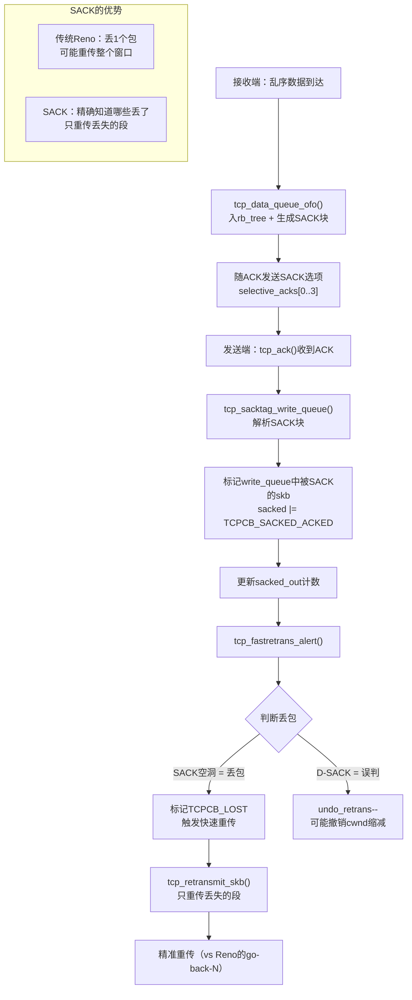

| 场景 | 无SACK（Reno） | 有SACK |
|------|---------------|--------|
| 单包丢失 | `3`个Dup ACK触发重传，但不知道后续包的状态 | 精确知道哪个包丢了，后续包已收到 |
| 多包丢失 | 每个RTT只能发现一个丢包，恢复慢 | 一次ACK可以报告多个空洞，一次性重传所有丢失的包 |
| 乱序（非丢包） | 误判为丢包，不必要地缩减cwnd | D-SACK检测到重复数据，可以撤销cwnd缩减 |
| 拥塞窗口利用 | 恢复期间窗口利用率低 | 通过SACK信息实现PRR（按比例发送），窗口利用率高 |

##  0x05    滑动窗口与流量控制

接收端通过通告窗口（Advertised Window / Receive Window）实现流量控制，告诉发送端"我还能接收多少数据"，防止发送端发送速度超过接收端的处理能力

####    接收窗口的核心字段

```cpp
//file: include/linux/tcp.h - struct tcp_sock
struct tcp_sock {
    // 接收窗口相关
    u32 rcv_wnd;        // 当前接收窗口大小（字节）
    u32 rcv_wup;        // 上次通告窗口时的rcv_nxt值
    u32 rcv_nxt;        // 期望接收的下一个序号
    u32 window_clamp;   // 窗口上限（对端不会超过此值）

    // 窗口缩放
    u8  rx_opt.rcv_wscale;  // 接收窗口缩放因子（2^wscale）

    // 自动调优
    u32 rcvq_space;     // 估算的接收速率（用于自动调优）
    u32 space;          // 最近一段时间内的数据到达量
};
```

####    窗口通告：tcp_select_window

每次发送ACK时，内核通过`tcp_select_window`计算要通告给对端的接收窗口大小：

```cpp
//file: net/ipv4/tcp_output.c
u16 tcp_select_window(struct sock *sk)
{
    struct tcp_sock *tp = tcp_sk(sk);
    u32 old_win = tp->rcv_wnd;
    u32 cur_win;
    u32 new_win;

    // 1. 计算当前可用窗口空间
    // = sk_rcvbuf（接收缓冲区总大小）- 已使用的空间
    cur_win = tcp_receive_window(tp);
    new_win = __tcp_select_window(sk);

    // 2. 窗口只增不减原则（避免SWS - Silly Window Syndrome）
    if (new_win < cur_win) {
        // 不能收缩已通告的窗口（RFC规定）
        // 但如果内存确实紧张，可以冻结窗口为0（零窗口）
    }

    // 3. 更新rcv_wnd
    tp->rcv_wnd = new_win;
    tp->rcv_wup = tp->rcv_nxt;  // 记录通告时的rcv_nxt

    // 4. 返回窗口值（需要右移wscale位放入TCP头的16bit字段）
    return new_win >> tp->rx_opt.rcv_wscale;
}

static u32 __tcp_select_window(struct sock *sk)
{
    struct tcp_sock *tp = tcp_sk(sk);
    int mss = tp->advmss;  // 对端MSS

    // 可用空间 = 接收缓冲区剩余
    int free_space = tcp_space(sk);

    // Silly Window Syndrome防护：
    // 如果可用空间小于MSS的一半，通告窗口为0
    // 避免对端发送大量小包
    if (free_space < (int)(mss / 2))
        return 0;

    // 对齐到MSS的整数倍（鼓励对端发送满尺寸段）
    free_space = round_down(free_space, mss);

    // 不超过window_clamp
    if (free_space > tp->window_clamp)
        free_space = tp->window_clamp;

    return free_space;
}
```

####    接收缓冲区自动调优：tcp_rcv_space_adjust

内核不使用固定的接收缓冲区大小，而是根据实际数据到达速率动态调整`sk_rcvbuf`：

```cpp
//file: net/ipv4/tcp_input.c
void tcp_rcv_space_adjust(struct sock *sk)
{
    struct tcp_sock *tp = tcp_sk(sk);
    int time, space;

    // 每隔一段时间（RTT级别）调整一次
    if (tp->rcvq_space.time == 0)
        goto new_measure;

    time = tcp_time_stamp - tp->rcvq_space.time;
    if (time < (tp->rcv_rtt_est.rtt >> 3) || tp->rcv_rtt_est.rtt == 0)
        return;

    // 计算这段时间内到达的数据量
    space = tp->copied_seq - tp->rcvq_space.seq;
    if (space <= 0)
        goto new_measure;

    // 目标：缓冲区至少能容纳2倍的BDP（Bandwidth-Delay Product）
    // 即 2 * (实际速率 * RTT)
    space *= 2;  // 留出2倍冗余

    // 只增不减：仅在需要更大缓冲区时才调大
    if (space > tp->rcvq_space.space) {
        int rcvbuf = min(space, sysctl_tcp_rmem[2]);  // 不超过rmem_max
        if (rcvbuf > sk->sk_rcvbuf) {
            sk->sk_rcvbuf = rcvbuf;
            // 调大缓冲区后重新计算接收窗口
            tp->window_clamp = rcvbuf;
        }
    }
    tp->rcvq_space.space = space;

new_measure:
    tp->rcvq_space.seq = tp->copied_seq;
    tp->rcvq_space.time = tcp_time_stamp;
}
```

自动调优通过`net.ipv4.tcp_moderate_rcvbuf=1`（默认开启）控制，缓冲区范围由`net.ipv4.tcp_rmem`三元组定义：`[min, default, max]`

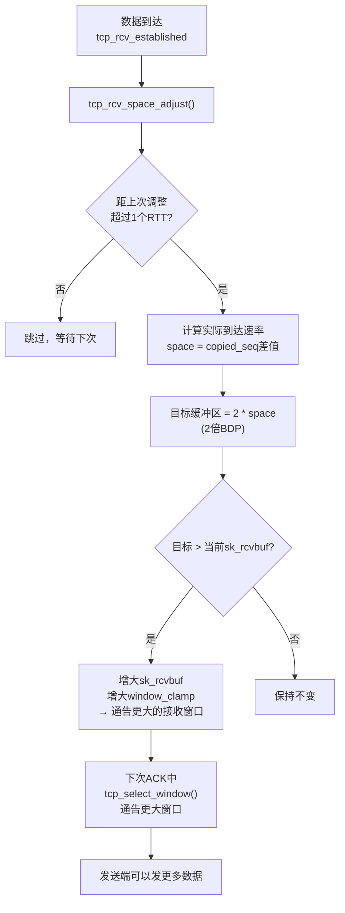

####    零窗口与窗口探测

当接收端缓冲区满时，`tcp_select_window`返回`0`，通告零窗口。此时发送端停止发送，并启动**窗口探测定时器**（Persist Timer），定期发送`1`字节的探测包询问接收端窗口是否重新打开。接收端收到窗口探测后，回复当前的窗口大小（即使仍为`0`）

##  0x06    拥塞控制（双端视角）

拥塞控制是TCP最复杂的机制之一，虽然拥塞窗口（cwnd）由发送端维护，但其更新完全由**接收端返回的ACK驱动**，这是接收路径的一部分

####    接收端在拥塞控制中的角色

1. **通告接收窗口rwnd**：限制发送端的有效发送窗口 `min(cwnd, rwnd)`
2. **生成SACK/DSACK信息**：告知发送端哪些段已收到/重复，帮助发送端精确判断丢包
3. **ECN处理**：如果网络层标记了ECE（Explicit Congestion Experienced），接收端在ACK中设置ECE标志通知发送端降速

```cpp
//file: net/ipv4/tcp_input.c
// ECN接收处理
static void TCP_ECN_check_ce(struct tcp_sock *tp, const struct sk_buff *skb)
{
    // 检查IP头的ECN字段
    if (TCP_SKB_CB(skb)->ip_dsfield & INET_ECN_CE) {
        // 路由器标记了拥塞
        // 在下一个ACK中设置ECE标志通知发送端
        tp->ecn_flags |= TCP_ECN_DEMAND_CWR;
    }
}
```

####    发送端拥塞状态机

当发送端收到ACK（在接收路径的`tcp_ack`中处理），会触发拥塞状态机的转换：

```cpp
//file: include/net/tcp.h
enum tcp_ca_state {
    TCP_CA_Open = 0,       // 正常状态：慢启动或拥塞避免
    TCP_CA_Disorder = 1,   // 检测到潜在丢包（少量dup ACK/SACK）
    TCP_CA_CWR = 2,        // 收到ECN或本地拥塞，正在主动降窗
    TCP_CA_Recovery = 3,   // 快速恢复中（收到3个dup ACK触发）
    TCP_CA_Loss = 4,       // 超时重传，进入拥塞避免重置
};
```

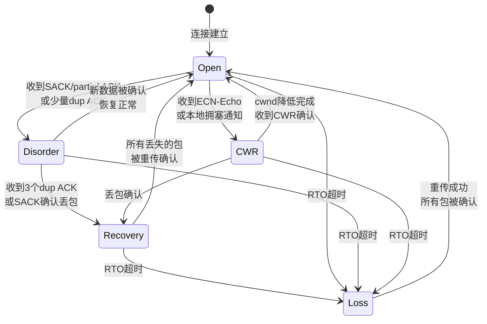

####    tcp_cong_avoid：慢启动与拥塞避免

ACK到达时，`tcp_ack`调用`tcp_cong_avoid`更新拥塞窗口：

在v4.11.6内核中，拥塞控制的调用有两种路径：如果拥塞控制算法实现了`cong_control`回调（如BBR），则通过`tcp_cong_control`统一调用；否则走传统的`tcp_cong_avoid`路径

```cpp
//file: net/ipv4/tcp_input.c
static void tcp_cong_avoid(struct sock *sk, u32 ack, u32 acked)
{
    const struct inet_connection_sock *icsk = inet_csk(sk);
    // 调用当前拥塞控制算法的cong_avoid回调
    icsk->icsk_ca_ops->cong_avoid(sk, ack, acked);
    // 确保cwnd不超过snd_cwnd_clamp
    tcp_sk(sk)->snd_cwnd = min(tcp_sk(sk)->snd_cwnd,
                               tcp_sk(sk)->snd_cwnd_clamp);
}
```

####    CUBIC算法核心实现

CUBIC是Linux默认的拥塞控制算法（v4.11.6），使用三次函数（cubic function）计算窗口大小，使得窗口增长在距离上次丢包点较远时更快，接近时变慢：

```cpp
//file: net/ipv4/tcp_cubic.c
static void bictcp_cong_avoid(struct sock *sk, u32 ack, u32 acked, u32 in_flight)
{
    struct tcp_sock *tp = tcp_sk(sk);
    struct bictcp *ca = inet_csk_ca(sk);

    if (!tcp_is_cwnd_limited(sk, in_flight))
        return;  // 窗口未满，无需调整

    if (tp->snd_cwnd <= tp->snd_ssthresh) {
        // 慢启动阶段：每个ACK窗口+1（指数增长）
        tcp_slow_start(tp, acked);
    } else {
        // 拥塞避免阶段：使用CUBIC函数
        bictcp_update(ca, tp->snd_cwnd);
        tcp_cong_avoid_ai(tp, ca->cnt, acked);
    }
}

// CUBIC核心：计算窗口增长目标
static inline void bictcp_update(struct bictcp *ca, u32 cwnd)
{
    u32 delta, bic_target, max_cnt;
    u64 offs, t;

    ca->ack_cnt += ca->delayed_ack;

    // 计算距上次窗口缩减的时间 t
    t = (s32)(tcp_time_stamp - ca->epoch_start);
    t += ca->delay_min >> 3;  // 加上最小RTT（K值修正）

    // CUBIC函数: W(t) = C * (t - K)^3 + W_max
    // K = cubic_root(W_max * beta / C)
    // C = 0.4, beta = 0.7

    // 计算K（从W_max恢复到满窗的时间）
    // ... 省略K的计算

    // 计算W_cubic(t) = C*(t-K)^3 + W_max
    if (t < ca->bic_K) {
        // t < K: 在W_max下方，凹函数慢增长
        offs = ca->bic_K - t;
        delta = (cube_rtt_scale * offs * offs * offs) >> 40;
        bic_target = ca->bic_origin_point - delta;
    } else {
        // t >= K: 在W_max上方，凸函数快增长
        offs = t - ca->bic_K;
        delta = (cube_rtt_scale * offs * offs * offs) >> 40;
        bic_target = ca->bic_origin_point + delta;
    }

    // cnt = cwnd / (bic_target - cwnd)
    // 即每cnt个ACK才增加1个cwnd
    if (bic_target > cwnd) {
        ca->cnt = cwnd / (bic_target - cwnd);
    } else {
        ca->cnt = 100 * cwnd;  // 非常慢的增长
    }
}
```

####    Reno算法（对比）

Reno作为经典算法，逻辑简单直接：

```cpp
//file: net/ipv4/tcp_cong.c
// Reno拥塞避免：每RTT增加1个MSS（线性增长）
void tcp_reno_cong_avoid(struct sock *sk, u32 ack, u32 acked, u32 in_flight)
{
    struct tcp_sock *tp = tcp_sk(sk);

    if (!tcp_is_cwnd_limited(sk, in_flight))
        return;

    if (tp->snd_cwnd <= tp->snd_ssthresh) {
        // 慢启动：每ACK增1（指数增长）
        tcp_slow_start(tp, acked);
    } else {
        // 拥塞避免：每cwnd个ACK增1（线性增长）
        // 即每个RTT增加1个MSS
        tcp_cong_avoid_ai(tp, tp->snd_cwnd, acked);
    }
}
```

####    快速重传与快速恢复

当`tcp_ack`检测到需要进入Recovery状态时：

```cpp
//file: net/ipv4/tcp_input.c
static void tcp_fastretrans_alert(struct sock *sk, ...)
{
    struct tcp_sock *tp = tcp_sk(sk);

    // 进入Recovery状态
    if (icsk->icsk_ca_state != TCP_CA_Recovery) {
        // 记录当前cwnd为ssthresh的参考
        tp->snd_ssthresh = icsk->icsk_ca_ops->ssthresh(sk);
        // CUBIC: ssthresh = cwnd * 0.7
        // Reno:  ssthresh = cwnd / 2

        tcp_set_ca_state(sk, TCP_CA_Recovery);
        tp->high_seq = tp->snd_nxt;  // 标记恢复点

        // PRR（Proportional Rate Reduction）：
        // 在恢复期间按比例降低发送速率，而非直接砍半
        tp->prr_delivered = 0;
        tp->prr_out = 0;

        // 触发快速重传
        tcp_retransmit_skb(sk, tcp_write_queue_head(sk));
    }
}
```

##  0x07    数据入队与乱序处理

####    tcp_data_queue的调用场景（重要）
`tcp_data_queue`在内核v4.11.6中，有两处调用场景：

1.  路径1：`tcp_rcv_state_proces`，包括`tcp_v4_rcv --> tcp_v4_do_rcv --> tcp_rcv_state_proces`、`tcp_child_process -->  tcp_rcv_state_process`两种场景
2.  路径2：`tcp_rcv_established`，`tcp_v4_rcv --> tcp_v4_do_rcv --> tcp_rcv_established`

在 Linux 内核 TCP 协议栈的架构设计中，接收处理逻辑被分为了数据传输阶段和状态转换阶段。`tcp_data_queue` 作为专门负责处理 TCP 数据载荷（Payload）入队（包括正常接收队列和乱序 OFO 队列）的设计，在上述两个阶段都有体现。核心区别是**当前 Socket （状态机）所处的生命周期状态以及报文是否命中了性能优化的快速路径**

1、路径1：`tcp_rcv_established` 中的调用

背景：此时 Socket 处于 `TCP_ESTABLISHED`（已连接）状态，处于 TCP 生命周期的主要数据交换阶段。如前文所描述，报文处理分为快速路径（Fast Path）和慢速路径（Slow Path）

-   快速路径（首选）：如果收到的报文非常完美（完全按序、没有任何特殊 Flag 如 URG/FIN/SYN、仅仅是纯数据或纯 ACK、接收窗口充足），内核会直接绕过 `tcp_data_queue`，在 `tcp_rcv_established` 内部直接调用更底层的函数（如 `tcp_queue_rcv`）将数据放入队列或直接拷贝给用户态程序
-   慢速路径（Fallback）：一旦报文不够完美，内核会剥夺它的 Fast Path 待遇，将其打入 Slow Path。在 Slow Path 的最后一步，内核就会调用 `tcp_data_queue`（兜底处理不规矩的报文）

2、路径2：`tcp_rcv_state_process` 中的调用

背景：此时 Socket 不处于稳定的 `TCP_ESTABLISHED` 状态（或者处于建连/断连的边缘状态），在这个函数中调用 `tcp_data_queue`的场景，通常是为了处理在连接建立末期或连接断开期间到达的数据，主要包含如下case：

-   TCP Fast Open (TFO) 或建连最后的捎带数据：当处于 `TCP_SYN_RECV` 状态的服务端收到客户端三次握手的最后一个 ACK 时，如果这个 ACK 报文中捎带了应用层数据，Socket 状态会刚刚在这个函数内被切换为 `TCP_ESTABLISHED`（即`tcp_set_state(sk, TCP_ESTABLISHED);`）。状态切换完成后，调用 `tcp_data_queue` 来处理这批随握手包一起到达的第一波数据
-   半关闭状态下的数据接收（FIN_WAIT1 / FIN_WAIT2）：当本地应用层调用 `close()` 主动关闭连接，发出 FIN 后，Socket 进入 FIN_WAIT1 或 FIN_WAIT2 状态。由于TCP 是全双工的。此时虽然本地不再发送数据，但依然可以接收对端发送的数据。如果在这两个状态下收到了对方发来的数据包，`tcp_rcv_state_process` 会走入相应的 case，最后向下 fall through 到调用 `tcp_data_queue`，将这些对端在关闭前抢发的最后数据放入接收队列供应用层读取
-   等待关闭的僵死期数据排错（CLOSE_WAIT / CLOSING / LAST_ACK）：理论上，在对方发送 FIN 之后（本地处于 CLOSE_WAIT 及后续状态），不应该再收到具有新序列号的正常数据包。如果由于网络延迟，在这些状态下收到了一些旧的重传乱序包（其序列号在 `rcv_nxt` 之前），内核代码也会放行这些包，让 `tcp_data_queue` 去做最终的清理（例如触发 RST 或是默默丢弃并回复 ACK）

####    tcp_data_queue：数据分发总控
这里分两部分来拆解 `tcp_data_queue` [函数](https://elixir.bootlin.com/linux/v4.11.6/source/net/ipv4/tcp_input.c#L4588)的功能

1、分支一

关于 `if (TCP_SKB_CB(skb)->seq == tp->rcv_nxt)`条件分支满足时，说明包是按序到达的（In sequence），即当前收到的报文起始序号刚好等于内核期望接收的下一个字节序号（`rcv_nxt`），通俗点说是在此序列号之前的所有数据，（本端）接收端都已经连续且完整地接收到了。下一步可以交给应用层了，此时如果用户态进程刚好在阻塞读取（`tp->ucopy.task == current`），内核会尝试直接把数据拷贝到用户空间（Zero-copy 优化机制）。如果没有直接拷贝，也会放入正常接收队列（`sk_receive_queue`），并在最后调用 `sk->sk_data_ready(sk)` 来唤醒/通知应用层（例如触发 `epollin` 事件），告诉应用层有新数据可以读了。

同时，会触发 OFO 队列检查，收到按序包后，内核还会顺便检查一下乱序队列（`!RB_EMPTY_ROOT(&tp->out_of_order_queue)`），看看这个新到的包是否刚好填补了之前的空洞。如果填补了，就会调用 `tcp_ofo_queue(sk)` 把乱序队列里现在能拼接上的包一起移到正常接收队列中

2、分支二：非按序的情况，这里主要分为四种情况

-   case1：完全重复的旧包 / 重传包（代码块为`if (!after(TCP_SKB_CB(skb)->end_seq, tp->rcv_nxt)) { ... }`），即这个包的结束序列号都小于等于当前期望的 `rcv_nxt`，说明这个包里的数据早就接收过了。此时，内核会记录 DSACK，触发 QuickACK（立即回复 ACK 告诉对方本端收到了，别再重传了），然后直接 Drop（丢弃），不进入 OFO 队列
-   case2：超出接收窗口的包 (Out of window)，代码块为`if (!before(TCP_SKB_CB(skb)->seq, tp->rcv_nxt + tcp_receive_window(tp)))`，即这个包的序列号跑得太靠后了，甚至超出了本端当前通告给对方的接收窗口大小。这种包内核无法处理，同样触发 QuickACK 纠正对方的发送窗口，然后 Drop（丢弃），不进入 OFO 队列
-   case3：部分重叠的包 (Partial packet)，代码块为`if (before(TCP_SKB_CB(skb)->seq, tp->rcv_nxt)) { ... }`，即这个包的开头部分是本端已经收过的，但结尾部分是新的（`seq < rcv_nxt < end_seq`）。此时，内核会对旧数据部分记录 DSACK，然后通过 `goto queue_and_out` 将这个包裁剪后（只保留新数据部分），放入正常的接收队列，不进入 OFO 队列
-   case4：真正的乱序包 (Out of Order)，代码块为`tcp_data_queue_ofo(sk, skb);`，即只有排除了上面所有情况**包的起始序列号大于 `rcv_nxt`，且包在接收窗口范围内，这才是真正的乱序包（中间出现了丢包或者包到达顺序错乱）**。此时，内核才会调用 `tcp_data_queue_ofo`，将它放入红黑树构成的 OFO 队列中暂存，等待空洞被填补

```cpp
//file: net/ipv4/tcp_input.c
//https://elixir.bootlin.com/linux/v4.11.6/source/net/ipv4/tcp_input.c#L4588
static void tcp_data_queue(struct sock *sk, struct sk_buff *skb)
{
    struct tcp_sock *tp = tcp_sk(sk);
    int eaten = -1;

    // 1. 检查是否按序到达
    if (TCP_SKB_CB(skb)->seq == tp->rcv_nxt) {
        // ===== 按序到达：直接入sk_receive_queue =====

        // 尝试与队列尾部的skb合并（减少skb数量）
        if (tcp_try_coalesce(sk, skb)) {
            eaten = 1;
        }

        if (eaten <= 0) {
            // 入receive_queue尾部
            __skb_queue_tail(&sk->sk_receive_queue, skb);
        }

        // 更新rcv_nxt
        tp->rcv_nxt = TCP_SKB_CB(skb)->end_seq;

        // 检查ofo_queue（rb_tree）中是否有后续数据可以补齐
        //https://elixir.bootlin.com/linux/v4.11.6/source/net/ipv4/tcp_input.c#L4646
        if (!RB_EMPTY_ROOT(&tp->out_of_order_queue))
            tcp_ofo_queue(sk);

        // 通知应用层有数据可读
        if (!sock_flag(sk, SOCK_DEAD))
            sk->sk_data_ready(sk);

    } else {
        // ===== 乱序到达：入out_of_order_queue =====

        // 先检查是否完全在窗口外（应丢弃）
        if (!after(TCP_SKB_CB(skb)->end_seq, tp->rcv_nxt)) {
            // 完全重复的数据（seq < rcv_nxt）
            tcp_dsack_set(sk, ...);
            goto discard;
        }

        // 入乱序队列
        tcp_data_queue_ofo(sk, skb);

        // 发送duplicate ACK（携带SACK信息）
        tcp_send_dupack(sk, skb);
    }
    ......
}
```

####    tcp_data_queue_ofo：乱序队列管理与恢复
继续，`tcp_data_queue_ofo`函数的核心作用是处理并暂存接收到的乱序（Out Of Order） TCP 报文，当 TCP 层接收到一个合法报文，但它的序列号（Sequence Number）大于内核当前期望接收的下一个序列号（`tp->rcv_nxt`），这意味着中间有数据包丢失或走错路了。只要该报文仍在接收窗口（Receive Window）内，内核就不会将其丢弃，而是调用该函数将它放入乱序队列中暂存，等待缺失的报文到达后再进行拼接

1、触发场景与调用上下文

在 TCP 输入处理的核心流程中，当 `tcp_data_queue()` 函数判断新到的 skb（套接字缓存）满足以下条件时，就会调用`tcp_data_queue_ofo`：

-   `seq > tp->rcv_nxt`：报文序列号靠后，出现了数据空洞
-   `seq < tp->rcv_nxt + tcp_receive_window(tp)`：报文在有效的接收窗口内

2、核心处理流程与内部机制

`tcp_data_queue_ofo` 的处理主要包含以下几个关键步骤：

2.1 内存额度检查（Memory Scheduling）

内核首先会调用 `tcp_try_rmem_schedule()` 检查当前 Socket 的接收缓冲区（`sk_rcvbuf`）是否还有足够的内存。如果内存不足，内核会尝试清理（prune）乱序队列。如果清理后依然无法分配空间，该乱序报文就会被直接丢弃，并增加全局统计计数 `LINUX_MIB_TCPOFODROP`

2.2 红黑树检索与插入逻辑，针对乱序队列 `out_of_order_queue` 红黑树结构，会遍历这棵红黑树，根据 skb 的序列号（`seq`）寻找它在这棵树中的正确位置

2.3 报文重叠与合并处理（Overlap & Coalescing）

由于网络环境复杂，新到的乱序报文可能与红黑树中已有的报文发生数据重叠。函数会进行以下处理：
-   完全覆盖：如果新报文的数据已经被现有的某个乱序 skb 完全包含，则直接释放新报文
-   部分重叠：如果新报文与前一个或后一个 skb 有部分重叠，内核会进行裁剪（截断）操作，去掉重复的字节

高效合并（Coalesce）：如果新报文刚好能与树中的相邻报文无缝拼接，内核会调用 `tcp_try_coalesce()` 设法将数据合并到同一个 skb 的分片中，以减少结构体本身的内存开销

2.4 更新 SACK（选择性确认）

为了让发送方知道接收方已经收到了这部分乱序数据，函数会触发 SACK 逻辑（`tcp_dsack_set` 或 `tcp_dsack_extend`），同时会更新 Socket 的 SACK 块信息，并通过后续回复的 ACK 报文通知发送方，避免发送方盲目重传这部分已经送达的数据，从而节省带宽

2.5 统计数据更新，成功将报文放入红黑树后，更新相应的 SNMP 统计计数（如`LINUX_MIB_TCPOFOQUEUE`）

```cpp
//file: net/ipv4/tcp_input.c
// 将乱序数据插入ofo_queue（v4.11.6使用红黑树，按seq排序）
static void tcp_data_queue_ofo(struct sock *sk, struct sk_buff *skb)
{
    struct tcp_sock *tp = tcp_sk(sk);
    struct rb_node **p, *q, *parent;
    struct sk_buff *skb1;
    u32 seq, end_seq;
    bool fragstolen;

    // 内存调度检查（内存不足则丢弃）
    if (unlikely(tcp_try_rmem_schedule(sk, skb, skb->truesize))) {
        tcp_drop(sk, skb);
        return;
    }

    // 关闭快速路径（有乱序数据时pred_flags必须清零）
    tp->pred_flags = 0;
    inet_csk_schedule_ack(sk);

    seq = TCP_SKB_CB(skb)->seq;
    end_seq = TCP_SKB_CB(skb)->end_seq;

    p = &tp->out_of_order_queue.rb_node;
    if (RB_EMPTY_ROOT(&tp->out_of_order_queue)) {
        // 空树：创建第一个SACK块，直接插入
        if (tcp_is_sack(tp)) {
            tp->rx_opt.num_sacks = 1;
            tp->selective_acks[0].start_seq = seq;
            tp->selective_acks[0].end_seq = end_seq;
        }
        rb_link_node(&skb->rbnode, NULL, p);
        rb_insert_color(&skb->rbnode, &tp->out_of_order_queue);
        tp->ooo_last_skb = skb;
        goto end;
    }

    // 快速路径：尝试与ooo_last_skb合并或追加在其后（O(1)）
    if (tcp_try_coalesce(sk, tp->ooo_last_skb, skb, &fragstolen)) {
        goto coalesce_done;
    }
    if (!before(seq, TCP_SKB_CB(tp->ooo_last_skb)->end_seq)) {
        parent = &tp->ooo_last_skb->rbnode;
        p = &parent->rb_right;
        goto insert;
    }

    // 通用路径：在rb_tree中查找插入位置（O(log n)）
    parent = NULL;
    while (*p) {
        parent = *p;
        skb1 = rb_entry(parent, struct sk_buff, rbnode);
        if (before(seq, TCP_SKB_CB(skb1)->seq)) {
            p = &parent->rb_left;
            continue;
        }
        if (before(seq, TCP_SKB_CB(skb1)->end_seq)) {
            if (!after(end_seq, TCP_SKB_CB(skb1)->end_seq)) {
                // 新段完全被已有段包含 → 丢弃，标记D-SACK
                tcp_dsack_set(sk, seq, end_seq);
                goto discard;
            }
            if (after(seq, TCP_SKB_CB(skb1)->seq)) {
                // 部分重叠 → 标记D-SACK
                tcp_dsack_set(sk, seq, TCP_SKB_CB(skb1)->end_seq);
            } else {
                // seq相同但新段更大 → 替换旧段
                rb_replace_node(&skb1->rbnode, &skb->rbnode,
                                &tp->out_of_order_queue);
                tcp_dsack_extend(sk, TCP_SKB_CB(skb1)->seq,
                                 TCP_SKB_CB(skb1)->end_seq);
                __kfree_skb(skb1);
                goto merge_right;
            }
        } else if (tcp_try_coalesce(sk, skb1, skb, &fragstolen)) {
            goto coalesce_done;
        }
        p = &parent->rb_right;
    }

insert:
    rb_link_node(&skb->rbnode, parent, p);
    rb_insert_color(&skb->rbnode, &tp->out_of_order_queue);

merge_right:
    // 向右合并：移除被新段完全覆盖的后续段
    while ((q = rb_next(&skb->rbnode)) != NULL) {
        skb1 = rb_entry(q, struct sk_buff, rbnode);
        if (!after(end_seq, TCP_SKB_CB(skb1)->seq))
            break;
        if (before(end_seq, TCP_SKB_CB(skb1)->end_seq)) {
            tcp_dsack_extend(sk, TCP_SKB_CB(skb1)->seq, end_seq);
            break;
        }
        rb_erase(&skb1->rbnode, &tp->out_of_order_queue);
        tcp_dsack_extend(sk, TCP_SKB_CB(skb1)->seq,
                         TCP_SKB_CB(skb1)->end_seq);
        tcp_drop(sk, skb1);
    }
    // 更新ooo_last_skb缓存
    if (!tp->ooo_last_skb || !after(end_seq, TCP_SKB_CB(tp->ooo_last_skb)->end_seq))
        tp->ooo_last_skb = skb;

add_sack:
    if (tcp_is_sack(tp))
        tcp_sack_new_ofo_skb(sk, seq, end_seq);
end:
    ......
}

// 尝试将ofo_queue中的连续数据转入receive_queue（使用rb_tree遍历）
//https://elixir.bootlin.com/linux/v4.11.6/source/net/ipv4/tcp_input.c#L4314
static void tcp_ofo_queue(struct sock *sk)
{
    struct tcp_sock *tp = tcp_sk(sk);
    struct sk_buff *skb, *tail;
    struct rb_node *p;

    p = rb_first(&tp->out_of_order_queue);
    while (p) {
        skb = rb_entry(p, struct sk_buff, rbnode);
        // 检查该段是否能衔接上rcv_nxt
        if (after(TCP_SKB_CB(skb)->seq, tp->rcv_nxt))
            break;  // 还有空洞，等待

        // 处理重叠部分（D-SACK）
        if (before(TCP_SKB_CB(skb)->seq, tp->rcv_nxt))
            tcp_dsack_extend(sk, TCP_SKB_CB(skb)->seq, tp->rcv_nxt);

        p = rb_next(p);
        rb_erase(&skb->rbnode, &tp->out_of_order_queue);

        if (unlikely(!after(TCP_SKB_CB(skb)->end_seq, tp->rcv_nxt))) {
            // 完全重复的旧数据 → 丢弃
            tcp_drop(sk, skb);
            continue;
        }

        // 入sk_receive_queue尾部
        tail = skb_peek_tail(&sk->sk_receive_queue);
        eaten = tail && tcp_try_coalesce(sk, tail, skb, &fragstolen);
        tcp_rcv_nxt_update(tp, TCP_SKB_CB(skb)->end_seq);
        if (!eaten)
            __skb_queue_tail(&sk->sk_receive_queue, skb);
        // ...
    }
    ......
}
```

####    乱序队列 rb_tree 实现详解

内核v4.11.6中`out_of_order_queue`使用红黑树（`struct rb_root`）实现，在高丢包率网络环境下，乱序段数量可达十万级别，链表的`O(n)`查找会严重消耗CPU，红黑树将其优化为`O(log n)`

**关键数据结构**：
```cpp
//file: include/linux/tcp.h
struct tcp_sock {
    struct rb_root out_of_order_queue;  // 乱序队列rb_tree根节点
    struct sk_buff *ooo_last_skb;       // 缓存rb_tree最右节点（优化尾部追加）
    // ...
};
```

`ooo_last_skb`是一个重要的优化：因为大多数乱序到达的包在序号上是递增的（即追加在队列尾部），缓存最后一个节点可以跳过`O(log n)`的rb_tree查找

**插入算法的三级快速路径**：

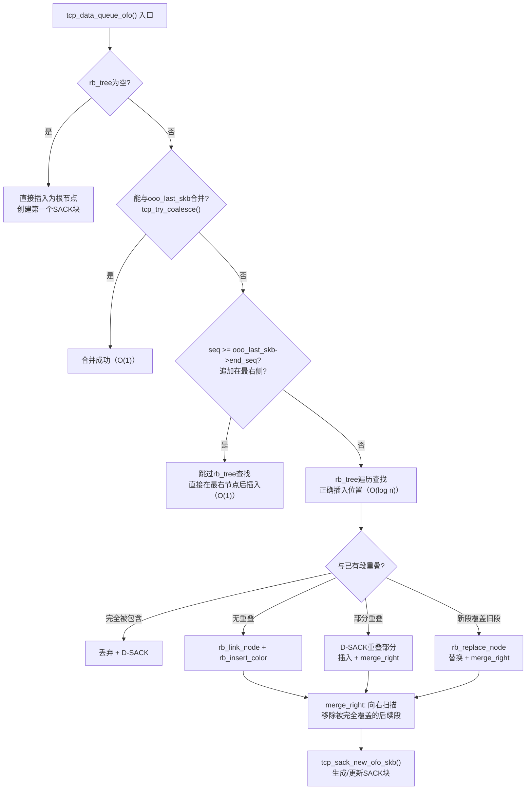

**SACK块的生成与管理**：

TCP最多携带`4`个SACK块（`TCP_NUM_SACKS`）。每次乱序段入队时，`tcp_sack_new_ofo_skb`函数完成如下事情：

1. 为新段创建一个SACK块`[seq, end_seq)`
2. 尝试与已有SACK块合并（相邻或重叠的块合并为一个）
3. 如果SACK块数量超过`4`个，丢弃最旧的块
4. 最新的SACK块被放在`selective_acks[0]`位置（RFC 2018要求最近的SACK块排在最前面）

**`tcp_ofo_queue`合并流程**：

当按序数据到达填补了空洞后，`tcp_ofo_queue`从rb_tree最小节点开始遍历，将所有`seq <= rcv_nxt`的段移入`sk_receive_queue`：

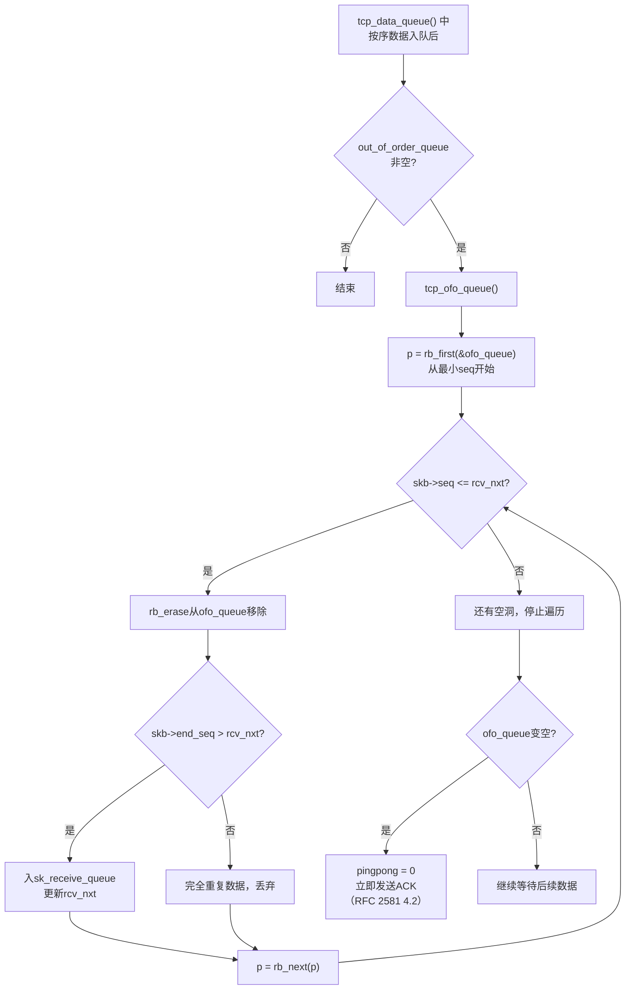

**关于 `skb_queue_walk` 宏**：

`skb_queue_walk`是`sk_buff_head`双向链表的遍历宏，定义在`include/linux/skbuff.h`中：
```cpp
#define skb_queue_walk(queue, skb) \
    for (skb = (queue)->next;      \
         skb != (struct sk_buff *)(queue); \
         skb = skb->next)
```
它仅用于`sk_receive_queue`等仍使用链表的队列，**不用于**乱序队列（乱序队列使用`rb_first`/`rb_next`遍历rb_tree）

####    三个队列的关系

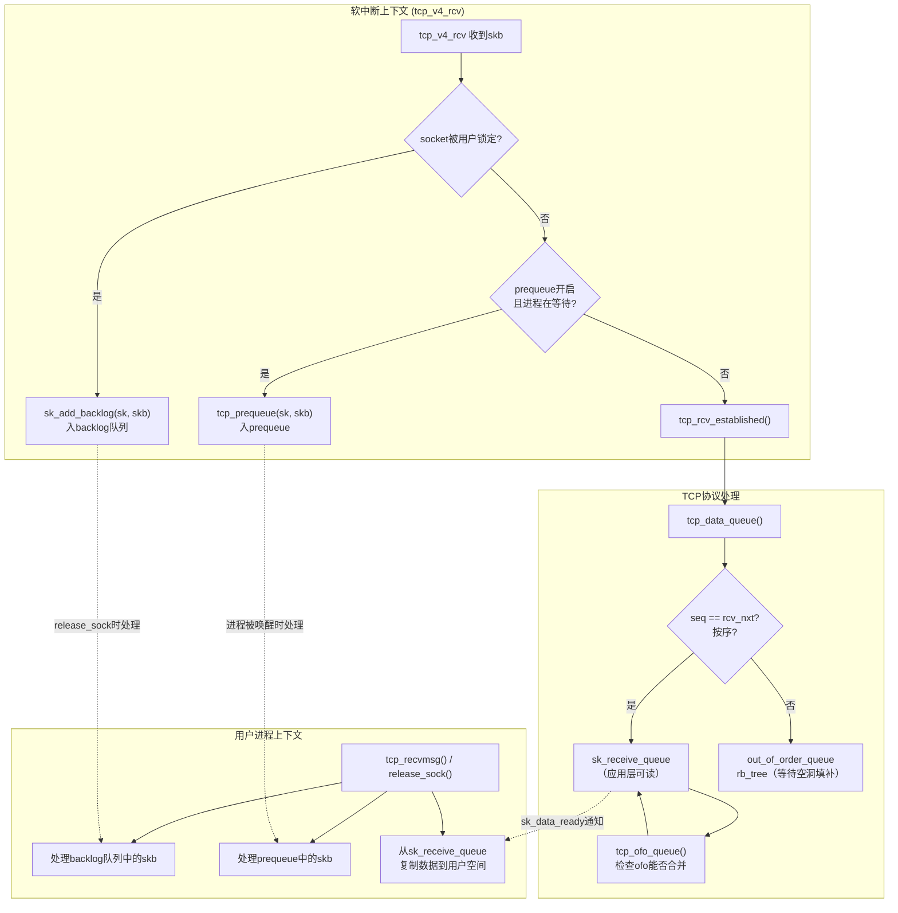

####    Prequeue机制

Prequeue是内核v4.11.6中的优化：将数据包的TCP处理延迟到用户进程上下文中，而非在softirq中完成，减少softirq的处理时间和锁竞争

**历史注意**：Prequeue机制在Linux v4.14中被移除（commit `ea3bea3a`，Florian Westphal, 2017-11），原因是引入了per-socket backlog的改进后，prequeue带来的额外复杂度已不再值得。v4.14+中，`sysctl_tcp_low_latency`参数也随之移除，所有数据包统一在softirq中完成TCP协议处理，不再有进程上下文延迟处理的路径

简单介绍下Prequeue机制在v4.11.6中的实现：

```cpp
//file: net/ipv4/tcp_ipv4.c
//https://elixir.bootlin.com/linux/v4.11.6/source/net/ipv4/tcp_ipv4.c#L1511
static bool tcp_prequeue(struct sock *sk, struct sk_buff *skb)
{
    struct tcp_sock *tp = tcp_sk(sk);

    // 条件：有进程正在等待数据（ucopy.task != NULL）
    if (sysctl_tcp_low_latency || !tp->ucopy.task)
        return false;

    // 入prequeue
    __skb_queue_tail(&tp->ucopy.prequeue, skb);
    tp->ucopy.memory += skb->truesize;

    // 如果prequeue累积的数据超过sk_rcvbuf的一半
    // 或者进程正在sleeping，唤醒进程来处理
    if (tp->ucopy.memory > sk->sk_rcvbuf >> 1) {
        // 唤醒等待的进程
        sk->sk_data_ready(sk);
    }

    return true;
}
```

##  0x08    URG紧急数据机制

TCP的URG（Urgent）标志允许发送端标记"紧急数据"，接收端可以优先处理（较少应用）

####    URG在接收路径中的处理

```cpp
//file: net/ipv4/tcp_input.c
static void tcp_check_urg(struct sock *sk, const struct tcphdr *th)
{
    struct tcp_sock *tp = tcp_sk(sk);
    u32 ptr = ntohs(th->urg_ptr);

    // URG pointer指向紧急数据的末尾偏移
    if (ptr && !th->syn) {
        u32 urg_seq = ntohl(th->seq) + ptr - 1;

        // 新的紧急数据序号比之前的更新
        if (after(urg_seq, tp->copied_seq) &&
            after(urg_seq, tp->urg_seq)) {
            // 更新紧急数据序号
            tp->urg_seq = urg_seq;
            tp->urg_data = TCP_URG_NOTREAD;  // 标记有未读紧急数据

            // 通知应用层（SIGURG信号或POLLPRI事件）
            sk_send_sigurg(sk);
        }
    }
}

// 读取紧急数据
static void tcp_urg(struct sock *sk, struct sk_buff *skb, const struct tcphdr *th)
{
    struct tcp_sock *tp = tcp_sk(sk);

    if (th->urg) {
        tcp_check_urg(sk, th);
    }

    // 如果SO_OOBINLINE未设置，紧急数据存储在tp->urg_data单字节中
    // 应用层通过recv(MSG_OOB)读取
    if (tp->urg_data == TCP_URG_NOTREAD &&
        tp->urg_seq == tp->copied_seq &&
        !sock_flag(sk, SOCK_URGINLINE)) {
        tp->urg_data = TCP_URG_READ;
        // 紧急字节存储在 tp->urg_data的高字节中
    }
}
```

####    用户态接口

```TEXT
应用层读取紧急数据的两种方式：

方式1：带外读取（默认）
  recv(fd, buf, len, MSG_OOB)  → 读取tp->urg_data中的1字节
  ioctl(fd, SIOCATMARK, &flag) → 查询当前读取位置是否到达紧急标记

方式2：内联读取（SO_OOBINLINE）
  setsockopt(fd, SOL_SOCKET, SO_OOBINLINE, &on, sizeof(on))
  紧急数据混入正常数据流中，不需要MSG_OOB
  应用通过SIOCATMARK判断当前位置
```

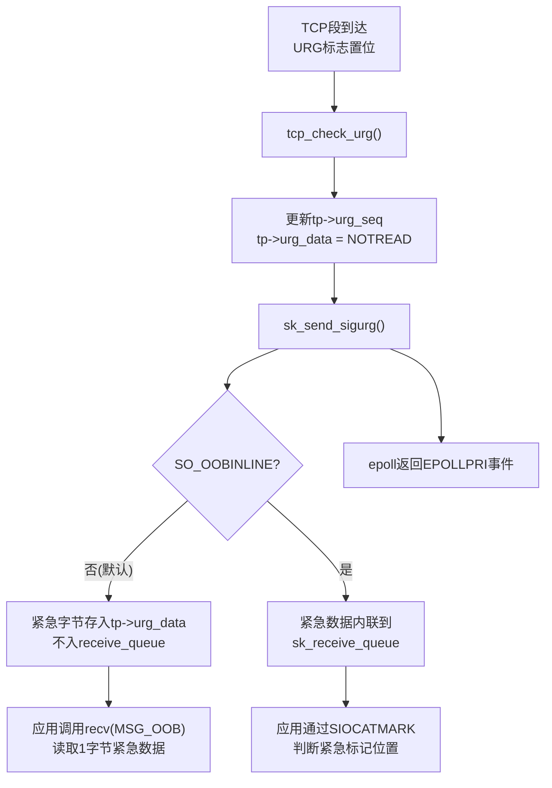

##  0x09    应用层读取：tcp_recvmsg

####    tcp_recvmsg核心流程

```cpp
//file: net/ipv4/tcp.c
int tcp_recvmsg(struct sock *sk, struct msghdr *msg, size_t len,
                int nonblock, int flags, int *addr_len)
{
    struct tcp_sock *tp = tcp_sk(sk);
    int copied = 0;
    u32 *seq;       // 当前读取位置（copied_seq）
    long timeo;

    lock_sock(sk);

    // 读取位置指针
    seq = &tp->copied_seq;
    if (flags & MSG_OOB)
        goto recv_urg;  // 带外数据走单独路径

    // 确定超时时间
    timeo = sock_rcvtimeo(sk, nonblock);

    do {
        struct sk_buff *skb;
        u32 offset;

        // 1. 先处理prequeue中积压的数据
        if (!skb_queue_empty(&tp->ucopy.prequeue))
            tcp_prequeue_process(sk);

        // 2. 从sk_receive_queue中获取下一个skb
        skb_queue_walk(&sk->sk_receive_queue, skb) {
            // 跳过已读取的部分
            offset = *seq - TCP_SKB_CB(skb)->seq;
            if (offset < skb->len)
                goto found_ok_skb;
        }

        // 3. 队列为空，检查是否需要等待
        if (copied >= target)
            break;  // 已读取足够数据

        if (sk->sk_err || sk->sk_state == TCP_CLOSE ||
            (sk->sk_shutdown & RCV_SHUTDOWN)) {
            // 连接出错或已关闭
            break;
        }

        if (!timeo) {
            // 非阻塞模式：返回EAGAIN
            copied = -EAGAIN;
            break;
        }

        // 4. 阻塞等待数据到达
        // 释放socket锁 → 等待sk_data_ready唤醒 → 重新加锁
        sk_wait_data(sk, &timeo, last);
        continue;

found_ok_skb:
        // 5. 复制数据到用户空间
        used = min_t(unsigned int, skb->len - offset, len);
        if (!(flags & MSG_TRUNC)) {
            err = skb_copy_datagram_msg(skb, offset, msg, used);
            if (err) {
                copied = -EFAULT;
                break;
            }
        }

        *seq += used;
        copied += used;
        len -= used;

        // 6. 如果skb数据全部读完，释放skb
        if (offset + used == skb->len) {
            __skb_unlink(skb, &sk->sk_receive_queue);
            __kfree_skb(skb);
        }

    } while (len > 0);

    // 7. 读取后更新接收窗口
    // 应用层消费了数据 → 释放了缓冲区空间 → 可以通告更大窗口
    tcp_cleanup_rbuf(sk, copied);

    release_sock(sk);
    return copied;

recv_urg:
    // MSG_OOB路径：读取tp->urg_data
    err = tcp_recv_urg(sk, msg, len, flags);
    goto out;
}
```

####    tcp_cleanup_rbuf：读取后触发窗口更新

```cpp
//file: net/ipv4/tcp.c
static void tcp_cleanup_rbuf(struct sock *sk, int copied)
{
    struct tcp_sock *tp = tcp_sk(sk);

    // 判断是否需要发送窗口更新ACK
    // 条件：释放了足够的缓冲区空间（窗口增大超过一定阈值）
    if (tcp_time_to_send_ack(sk, tp)) {
        // 立即发送ACK，通告新的更大接收窗口
        tcp_send_ack(sk);
    }
}
```

####    零拷贝接收

Linux提供了`splice`系统调用实现零拷贝接收：数据直接从socket接收缓冲区的skb通过pipe传递到文件/另一个socket，无需经过用户空间：

```TEXT
数据流对比：
  普通recv:   NIC → skb → sk_receive_queue → [copy] → 用户空间buffer
  splice:     NIC → skb → sk_receive_queue → [page ref] → pipe → 文件/socket
```

####    splice零拷贝接收的内核实现

`splice`系统调用可以在两个文件描述符之间直接传递数据，跳过用户空间缓冲区。当源fd是TCP socket时，**数据从`sk_receive_queue`中的skb直接通过page引用共享传递到pipe buffer，再从pipe传递到目标fd（文件或另一个socket）**

**调用链**如下：

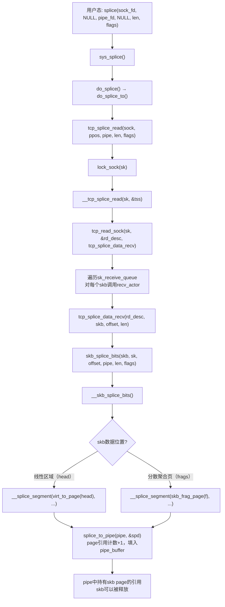

核心函数详解：

```cpp
//file: net/ipv4/tcp.c
//https://elixir.bootlin.com/linux/v4.11.6/source/net/ipv4/tcp.c#L722
ssize_t tcp_splice_read(struct socket *sock, loff_t *ppos,
                        struct pipe_inode_info *pipe, size_t len,
                        unsigned int flags)
{
    struct sock *sk = sock->sk;
    struct tcp_splice_state tss = {
        .pipe = pipe,
        .len = len,
        .flags = flags,
    };
    long timeo;
    ssize_t spliced;

    lock_sock(sk);
    timeo = sock_rcvtimeo(sk, sock->file->f_flags & O_NONBLOCK);

    ......

    while (tss.len) {
        ret = __tcp_splice_read(sk, &tss);
        if (ret < 0)
            break;
        else if (!ret) {
            // 无数据可读，处理各种状态
            if (spliced) break;
            if (sock_flag(sk, SOCK_DONE)) break;
            if (sk->sk_shutdown & RCV_SHUTDOWN) break;
            if (!timeo) { ret = -EAGAIN; break; }
            // 如果receive_queue非空但__tcp_splice_read返回0
            // 可能是URG数据导致，避免死循环
            if (!skb_queue_empty(&sk->sk_receive_queue)) break;
            // 阻塞等待数据
            sk_wait_data(sk, &timeo, NULL);
            continue;
        }
        tss.len -= ret;
        spliced += ret;
    }
    ......
    release_sock(sk);
    return spliced ? spliced : ret;
}

// __tcp_splice_read通过tcp_read_sock遍历receive_queue
static int __tcp_splice_read(struct sock *sk, struct tcp_splice_state *tss)
{
    read_descriptor_t rd_desc = {
        .arg.data = tss,
        .count = tss->len,
    };
    return tcp_read_sock(sk, &rd_desc, tcp_splice_data_recv);
}
```

`tcp_read_sock`是通用的socket读取框架，它遍历`sk_receive_queue`，对每个skb调用`recv_actor`回调：

```cpp
//file: net/ipv4/tcp.c
int tcp_read_sock(struct sock *sk, read_descriptor_t *desc,
                  sk_read_actor_t recv_actor)
{
    struct sk_buff *skb;
    struct tcp_sock *tp = tcp_sk(sk);
    u32 seq = tp->copied_seq;

    while ((skb = tcp_recv_skb(sk, seq, &offset)) != NULL) {
        if (offset < skb->len) {
            // 调用recv_actor（splice场景下为tcp_splice_data_recv）
            used = recv_actor(desc, skb, offset, len);
            seq += used;
            copied += used;
        }
        // skb数据读完后释放
        sk_eat_skb(sk, skb);
    }
    tp->copied_seq = seq;
    tcp_rcv_space_adjust(sk);
    tcp_cleanup_rbuf(sk, copied);  // 触发窗口更新ACK
    return copied;
}
```

`tcp_splice_data_recv`调用`skb_splice_bits`完成零拷贝的核心操作：

```cpp
//file: net/ipv4/tcp.c
//https://elixir.bootlin.com/linux/v4.11.6/source/net/ipv4/tcp.c#L686
static int tcp_splice_data_recv(read_descriptor_t *rd_desc,
                                struct sk_buff *skb,
                                unsigned int offset, size_t len)
{
    struct tcp_splice_state *tss = rd_desc->arg.data;
    // 将skb的page通过引用计数共享到pipe buffer
    return skb_splice_bits(skb, skb->sk, offset, tss->pipe,
                           min(rd_desc->count, len), tss->flags);
}

//https://elixir.bootlin.com/linux/v4.11.6/source/net/core/skbuff.c#L1975
int skb_splice_bits(struct sk_buff *skb, struct sock *sk, unsigned int offset,
		    struct pipe_inode_info *pipe, unsigned int tlen,
		    unsigned int flags)
{
	struct partial_page partial[MAX_SKB_FRAGS];
	struct page *pages[MAX_SKB_FRAGS];
	struct splice_pipe_desc spd = {
		.pages = pages,
		.partial = partial,
		.nr_pages_max = MAX_SKB_FRAGS,
		.flags = flags,
		.ops = &nosteal_pipe_buf_ops,
		.spd_release = sock_spd_release,
	};
	int ret = 0;

	__skb_splice_bits(skb, pipe, &offset, &tlen, &spd, sk);

	if (spd.nr_pages)
		ret = splice_to_pipe(pipe, &spd);

	return ret;
}

//splice_to_pipe
//https://elixir.bootlin.com/linux/v4.11.6/source/fs/splice.c#L185
```

**零拷贝的关键**：`skb_splice_bits` → `__skb_splice_bits` → `__splice_segment` 处理skb中的每一段数据（线性区域和分散聚合页fragments），对每个page调用`get_page()`增加引用计数后填入`splice_pipe_desc`，最终通过`splice_to_pipe()`将page引用安装到pipe的buffer中。整个过程不发生数据拷贝，只传递page的引用

**限制条件**：当skb的线性数据区域位于slab分配的内存中（`head_frag`为false）时，无法直接`get_page()`，此时会退化为拷贝模式。只有当数据在page fragment中（网卡DMA直接写入的page）时才能实现真正的零拷贝

##  0x0A    TCP层与epoll的交互机制（补充）

本节深入分析TCP协议层如何通知epoll/应用层，包括正常数据可读时的通知链路，以及各种连接异常（FIN/RST/超时）时的错误通知等机制

####    正常数据可读时的通知链路

当TCP数据按序到达并入队`sk_receive_queue`后，内核通过以下调用链通知等待的进程/epoll：

```cpp
//file: net/ipv4/tcp_input.c - tcp_data_queue() 中
// 数据入sk_receive_queue后
if (!sock_flag(sk, SOCK_DEAD))
    sk->sk_data_ready(sk);  // 触发通知
```

`sk->sk_data_ready`是一个函数指针，在socket创建时由`sock_init_data`初始化：

```cpp
//file: net/core/sock.c
void sock_init_data(struct socket *sock, struct sock *sk)
{
    // ...
    sk->sk_data_ready  = sock_def_readable;   // 数据可读通知
    sk->sk_error_report = sock_def_error_report; // 错误通知
    sk->sk_write_space = sock_def_write_space;  // 可写通知
    // ...
}
```

`sock_def_readable`的实现——唤醒所有在socket等待队列上等待的进程：

```cpp
//file: net/core/sock.c
static void sock_def_readable(struct sock *sk)
{
    struct socket_wq *wq;

    rcu_read_lock();
    wq = rcu_dereference(sk->sk_wq);

    // 唤醒等待队列上的所有waiter
    // EPOLLIN | EPOLLRDNORM 表示可读事件
    if (skwq_has_sleeper(wq))
        wake_up_interruptible_sync_poll(&wq->wait,
                                        EPOLLIN | EPOLLRDNORM |
                                        EPOLLRDBAND);

    // 通知fasync（SIGIO信号）
    sk_wake_async(sk, SOCK_WAKE_WAITD, POLL_IN);
    rcu_read_unlock();
}
```

当epoll通过`epoll_ctl(EPOLL_CTL_ADD)`添加socket fd时，会在socket的等待队列`sk->sk_wq->wait`上注册一个`wait_queue_entry`，其回调函数为`ep_poll_callback`：

```cpp
//file: fs/eventpoll.c
static int ep_poll_callback(wait_queue_entry_t *wait, unsigned mode,
                            int sync, void *key)
{
    struct epitem *epi = ep_item_from_wait(wait);
    struct eventpoll *ep = epi->ep;
    unsigned long flags;
    __poll_t pollflags = key_to_poll(key);  // EPOLLIN等事件标志

    spin_lock_irqsave(&ep->lock, flags);

    // 将epitem加入就绪链表rdllist
    if (!ep_is_linked(&epi->rdllink))
        list_add_tail(&epi->rdllink, &ep->rdllist);

    // 唤醒epoll_wait中阻塞的进程
    if (waitqueue_active(&ep->wq))
        wake_up_locked(&ep->wq);

    // 唤醒通过eventfd等待的进程
    if (waitqueue_active(&ep->poll_wait))
        pwake++;

    spin_unlock_irqrestore(&ep->lock, flags);

    return 1;
}
```

完整通知链路：

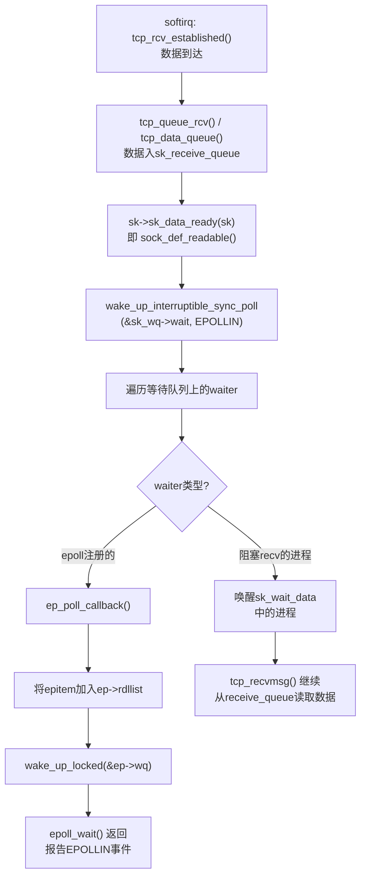

####    快速路径与慢速路径中sk_data_ready的调用位置

注意两条路径中`sk_data_ready`的调用位置有细微差别：

- **快速路径**：在`tcp_rcv_established`[函数中](https://elixir.bootlin.com/linux/v4.11.6/source/net/ipv4/tcp_input.c#L5503)，数据通过`tcp_queue_rcv`入`sk_receive_queue`后，**直接**调用`sk->sk_data_ready(sk)`
- **慢速路径**：在`tcp_data_queue`[函数中](https://elixir.bootlin.com/linux/v4.11.6/source/net/ipv4/tcp_input.c#L4664)，按序数据入`sk_receive_queue`且与OFO（ooo）队列合并完成后，调用`sk->sk_data_ready(sk)`。这意味着如果有OFO（ooo）队列合并，通知时已经包含了合并后的所有连续数据

| 路径 | 调用位置 | 触发条件 |
|------|---------|---------|
| 快速路径 | `tcp_rcv_established`  | `tcp_queue_rcv`入队后直接调用 |
| 慢速路径 | `tcp_data_queue` | 按序入队 + OFO合并完成后调用 |
| Prequeue | `tcp_prequeue` 中 | prequeue积累超过`sk_rcvbuf/2`时调用 |
| Backlog | `release_sock → __release_sock` | 处理backlog中的skb时，最终通过`tcp_data_queue`调用 |

####    对端正常关闭连接（FIN）

当对端调用`close()`发送FIN后，本端收到FIN时的内核处理：

```cpp
//file: net/ipv4/tcp_input.c
static void tcp_fin(struct sock *sk)
{
    struct tcp_sock *tp = tcp_sk(sk);

    // 更新接收序号（FIN占一个序号）
    tp->fin_seq = tp->rcv_nxt;

    // 标记接收方向关闭
    sk->sk_shutdown |= RCV_SHUTDOWN;
    sock_set_flag(sk, SOCK_DONE);

    // 状态切换（根据当前状态）
    switch (sk->sk_state) {
    case TCP_ESTABLISHED:
        tcp_set_state(sk, TCP_CLOSE_WAIT);
        break;
    case TCP_FIN_WAIT1:
        tcp_set_state(sk, TCP_CLOSING);
        break;
    case TCP_FIN_WAIT2:
        tcp_set_state(sk, TCP_TIME_WAIT);
        break;
    // ...
    }

    // 关键：通知应用层！
    // FIN等效于"对端不再发送数据"，对应用来说就是"可读"事件
    // recv()会返回0表示连接关闭
    if (!sock_flag(sk, SOCK_DEAD)) {
        sk->sk_state_change(sk);  // 状态变更通知
        sk->sk_data_ready(sk);    // 可读通知（recv返回0）
    }
}
```

epoll对FIN的响应：
-   `sk_data_ready(sk)` 触发 → `EPOLLIN`（有数据可读——虽然实际是EOF）
-   `sk_state_change(sk)` 触发 → `EPOLLRDHUP`（对端关闭了写端）
-   应用层 `recv()` 返回 `0`，表示对端已关闭

####    对端异常断开（RST）

当收到RST（如对端进程崩溃、端口不存在等）：

```cpp
//file: net/ipv4/tcp_input.c
static void tcp_reset(struct sock *sk)
{
    // 根据当前状态设置不同的错误码
    switch (sk->sk_state) {
    case TCP_SYN_SENT:
        sk->sk_err = ECONNREFUSED;  // 连接被拒绝
        break;
    case TCP_CLOSE_WAIT:
        sk->sk_err = EPIPE;         // 对端已关闭
        break;
    default:
        sk->sk_err = ECONNRESET;    // 连接被重置
    }

    // 设置连接为CLOSE状态
    tcp_done(sk);

    // 通知应用层——通过错误报告通道
    if (!sock_flag(sk, SOCK_DEAD))
        sk->sk_error_report(sk);  // 即 sock_def_error_report()
}
```

`sock_def_error_report`的实现：

```cpp
//file: net/core/sock.c
static void sock_def_error_report(struct sock *sk)
{
    struct socket_wq *wq;

    rcu_read_lock();
    wq = rcu_dereference(sk->sk_wq);

    // 唤醒等待队列，报告EPOLLERR事件
    if (skwq_has_sleeper(wq))
        wake_up_interruptible_poll(&wq->wait, EPOLLERR);

    sk_wake_async(sk, SOCK_WAKE_IO, POLL_ERR);
    rcu_read_unlock();
}
```

epoll对RST的响应：
-   `sk_error_report(sk)` → `EPOLLERR`
-   同时因为连接关闭：`EPOLLIN | EPOLLHUP` 也会被设置
-   应用层 `recv()` 返回 `-1`，`errno = ECONNRESET`

####    连接超时 / Keepalive失败

```cpp
//file: net/ipv4/tcp_timer.c
static void tcp_keepalive_timer(unsigned long data)
{
    struct sock *sk = (struct sock *)data;
    struct tcp_sock *tp = tcp_sk(sk);

    // 如果探测次数超过tcp_keepalive_probes
    if (tp->probes_out >= keepalive_probes(tp)) {
        // 连接死亡
        tcp_send_active_reset(sk, GFP_ATOMIC);
        tcp_done(sk);  // 内部会设置sk_err并调用sk_error_report
        goto out;
    }

    // 否则发送keepalive探测
    tcp_write_wakeup(sk);
    tp->probes_out++;
    // 重置定时器
}

// tcp_done: 连接终结的统一处理
void tcp_done(struct sock *sk)
{
    if (sk->sk_state == TCP_SYN_SENT || sk->sk_state == TCP_SYN_RECV)
        TCP_INC_STATS_BH(sock_net(sk), TCP_MIB_ATTEMPTFAILS);

    tcp_set_state(sk, TCP_CLOSE);
    tcp_clear_xmit_timers(sk);

    sk->sk_shutdown = SHUTDOWN_MASK;

    if (!sock_flag(sk, SOCK_DEAD))
        sk->sk_state_change(sk);  // 触发EPOLLHUP
}
```

####    tcp_poll：epoll判断就绪状态的核心

当`epoll_wait`返回或有事件通知时，内核通过`tcp_poll`检查socket的当前状态以确定返回哪些事件标志：

```cpp
//file: net/ipv4/tcp.c
unsigned int tcp_poll(struct file *file, struct socket *sock,
                      struct poll_table_struct *wait)
{
    unsigned int mask = 0;
    struct sock *sk = sock->sk;
    const struct tcp_sock *tp = tcp_sk(sk);
    int state;

    // 注册到等待队列（epoll_ctl时调用）
    sock_poll_wait(file, sk_sleep(sk), wait);

    state = sk->sk_state;

    // === 连接已关闭 / 出错 ===
    if (sk->sk_err)
        mask |= EPOLLERR;
    if (state == TCP_CLOSE)
        mask |= EPOLLHUP;              // 完全关闭
    if (sk->sk_shutdown == SHUTDOWN_MASK)
        mask |= EPOLLHUP;
    if (sk->sk_shutdown & RCV_SHUTDOWN)
        mask |= EPOLLIN | EPOLLRDNORM | EPOLLRDHUP;  // 对端关闭写端

    // === 监听socket ===
    if (state == TCP_LISTEN) {
        // accept队列非空 → 可读
        if (reqsk_queue_empty(&inet_csk(sk)->icsk_accept_queue) == 0)
            mask |= EPOLLIN | EPOLLRDNORM;
        return mask;
    }

    // === 可读判断 ===
    if (tp->rcv_nxt != tp->copied_seq &&     // receive_queue中有未读数据
        (tp->rcv_nxt - tp->copied_seq >= sk->sk_rcvlowat ||  // 超过低水位
         tp->urg_data ||                      // 有紧急数据
         (state == TCP_CLOSE)))               // 连接关闭
        mask |= EPOLLIN | EPOLLRDNORM;

    // === 连接状态检查（用于非阻塞connect） ===
    if (state == TCP_SYN_SENT) {
        // connect还没完成，不报任何就绪
        return mask;
    }

    // === 可写判断 ===
    if (sk_stream_is_writeable(sk)) {
        // 发送缓冲区有空间
        mask |= EPOLLOUT | EPOLLWRNORM;
    } else {
        // 缓冲区满，设置NOSPACE标志
        set_bit(SOCK_NOSPACE, &sk->sk_socket->flags);
        // 再检查一次（避免竞态）
        if (sk_stream_is_writeable(sk))
            mask |= EPOLLOUT | EPOLLWRNORM;
    }

    // === 紧急数据 ===
    if (tp->urg_data & TCP_URG_VALID)
        mask |= EPOLLPRI;

    return mask;
}
```

####    各场景事件汇总

| 场景 | 触发函数 | epoll事件 | recv()返回值 |
|------|---------|-----------|-------------|
| 正常数据到达 | `sk_data_ready` | `EPOLLIN \| EPOLLRDNORM` | `> 0`（数据长度）|
| 对端FIN（正常关闭）| `sk_data_ready` + `sk_state_change` | `EPOLLIN \| EPOLLRDHUP` | `0` |
| 对端RST（异常断开）| `sk_error_report` | `EPOLLERR \| EPOLLIN \| EPOLLHUP` | `-1, errno=ECONNRESET` |
| 连接超时 | `sk_state_change` | `EPOLLERR \| EPOLLHUP` | `-1, errno=ETIMEDOUT` |
| Keepalive失败 | `sk_state_change` | `EPOLLERR \| EPOLLHUP` | `-1, errno=ETIMEDOUT` |
| 紧急数据到达 | `sk_send_sigurg` | `EPOLLPRI` | `recv(MSG_OOB)` |
| 可写（缓冲区有空间）| `sk_write_space` | `EPOLLOUT \| EPOLLWRNORM` | N/A |
| connect完成 | `sk_state_change` | `EPOLLOUT` | N/A |
| connect失败 | `sk_error_report` | `EPOLLERR` | N/A |

错误通知的完整对比：

```mermaid
flowchart TD
    subgraph fin_path ["对端正常关闭(FIN)"]
        F1["tcp_fin()"] --> F2["sk_shutdown |= RCV_SHUTDOWN"]
        F2 --> F3["sk_state_change()"]
        F3 --> F4["sk_data_ready()"]
        F4 --> F5["epoll返回:<br/>EPOLLIN | EPOLLRDHUP"]
        F5 --> F6["recv() = 0"]
    end

    subgraph rst_path ["对端异常断开(RST)"]
        R1["tcp_reset()"] --> R2["sk_err = ECONNRESET"]
        R2 --> R3["tcp_done() → TCP_CLOSE"]
        R3 --> R4["sk_error_report()"]
        R4 --> R5["epoll返回:<br/>EPOLLERR | EPOLLIN | EPOLLHUP"]
        R5 --> R6["recv() = -1<br/>errno = ECONNRESET"]
    end

    subgraph timeout_path ["连接超时/Keepalive"]
        T1["tcp_keepalive_timer()<br/>或 tcp_retransmit_timer()"] --> T2["超过重试次数"]
        T2 --> T3["tcp_done()"]
        T3 --> T4["sk_err = ETIMEDOUT"]
        T4 --> T5["sk_state_change()"]
        T5 --> T6["epoll返回:<br/>EPOLLERR | EPOLLHUP"]
        T6 --> T7["recv() = -1<br/>errno = ETIMEDOUT"]
    end
```

####    水平触发（LT）与边缘触发（ET）的差异

epoll的LT/ET模式差异体现在`ep_poll_callback`和`epoll_wait`的交互上：

-   **水平触发（LT，默认）**：只要`tcp_poll`返回的事件掩码与用户关注的事件有交集，`epoll_wait`就会返回该fd。即使事件没有被"消费"完（如缓冲区还有数据），下次`epoll_wait`仍会返回
-   **边缘触发（ET）**：仅在状态**变化**时触发一次。内核通过`ep_poll_callback`中检查`epi->event.events & EPOLLET`，如果设置了ET且事件已经在rdllist中，不重复添加。应用必须一次性读完所有数据（循环`recv`直到`EAGAIN`）

##  0x0B    性能调优与可观测

####    关键sysctl参数

| 参数 | 默认值 | 说明 |
|------|--------|------|
| `net.ipv4.tcp_rmem` | `4096 87380 6291456` | TCP接收缓冲区 [min, default, max] |
| `net.ipv4.tcp_moderate_rcvbuf` | `1` | 开启接收缓冲区自动调优 |
| `net.ipv4.tcp_congestion_control` | `cubic` | 拥塞控制算法 |
| `net.ipv4.tcp_sack` | `1` | 开启SACK |
| `net.ipv4.tcp_window_scaling` | `1` | 开启窗口缩放 |
| `net.ipv4.tcp_low_latency` | `0` | 关闭prequeue（低延迟场景用） |
| `net.ipv4.tcp_ecn` | `2` | ECN模式（2=被动支持） |
| `net.ipv4.tcp_delack_min` | `40ms` | Delayed ACK最小延迟 |
| `net.core.rmem_max` | `212992` | socket接收缓冲区全局上限 |
| `net.core.rmem_default` | `212992` | socket接收缓冲区全局默认值 |

####    /proc/net/tcp字段解读

```TEXT
sl  local_address rem_address   st tx_queue rx_queue tr tm->when retrnsmt   uid  timeout inode
 0: 0100007F:0050 0100007F:A2B4 01 00000000:00000000 02:00000032 00000000     0        0 12345

字段说明：
st:       连接状态（01=ESTABLISHED, 06=TIME_WAIT, 0A=LISTEN...）
rx_queue: sk_receive_queue中待读取的字节数
tx_queue: 发送队列中未确认的字节数
tr:       定时器类型（0=无, 1=重传, 2=keepalive, 4=TIME_WAIT）
```

####    eBPF可观测hook点

| Hook点 | 类型 | 可观测信息 |
|--------|------|-----------|
| `kprobe:tcp_v4_rcv` | kprobe | TCP入口包计数、协议分布 |
| `kprobe:tcp_rcv_established` | kprobe | ESTABLISHED包处理速率 |
| `kprobe:tcp_data_queue` | kprobe | 数据入队事件、按序/乱序比例 |
| `kprobe:tcp_ack` | kprobe | ACK处理频率、cwnd变化 |
| `tracepoint:tcp:tcp_retransmit_skb` | tracepoint | 重传事件 |
| `tracepoint:tcp:tcp_receive_reset` | tracepoint | RST接收事件 |
| `kprobe:tcp_send_dupack` | kprobe | Duplicate ACK发送（乱序指标）|
| `kprobe:tcp_fastretrans_alert` | kprobe | 进入快速恢复事件 |
| `tracepoint:sock:sock_rcvqueue_full` | tracepoint | 接收队列满丢包 |

####    常见性能问题诊断

1.  **接收缓冲区溢出**：`/proc/net/netstat`中`TCPRcvQDrop`增长 → 调大`tcp_rmem[2]`
2.  **零窗口频繁**：`ss -tnpi`显示`rcv_space`很小 → 应用层读取太慢或`tcp_rmem`过小
3.  **大量乱序导致延迟**：`/proc/net/netstat`中`TCPOFOQueue`持续增长 → 网络抖动或多路径
4.  **Delayed ACK引起延迟**：小消息交互场景（如RPC），可设置`TCP_QUICKACK`或`TCP_NODELAY`
5.  **拥塞窗口过小**：`ss -tnpi`查看cwnd，如持续很小可能是丢包严重或算法不适配

##  0x0C    总结

####    sk_receive_queue与ACK回复的时机
在内核设计中，数据成功接收的边界就停留在OS的内核缓冲区（即 `sk_receive_queue`）。一旦 `tcp_queue_rcv` 成功将报文挂入队列，并且更新了 `tp->rcv_nxt`（期望的下一个序列号），此时内核已经可以向对端发送 ACK 确认了。这与应用层是否调用了 `read()/recv()` 毫无关系，即协议栈与应用层的解耦：内核只会通过 epoll/select 或阻塞唤醒机制发出可读事件（Data Ready）通知，绝不会等待应用层读完才发 ACK

1、第一个问题：ACK 的实际发送时机（重要）

虽然内核在 `tcp_queue_rcv` 之后具备了发送 ACK 的条件，具体的发送逻辑在`tcp_ack_snd_check(sk)`函数，发送时机有两种策略：

-   快速确认（Quick ACK）：如果当前处于连接初期、或者刚刚填补了乱序空洞、或者接收窗口发生了显著变化，内核会立即构造一个纯 ACK 报文发回
-   延迟确认（Delayed ACK）：此时，内核会启动一个定时器（通常最大 `40ms`）。它会hold一下，看看能不能把这个 ACK 顺便搭载在应用层即将发送的业务数据报文上（捎带确认），或者等收到下一个包时合并发送（每两个数据包回一个 ACK），这样可以减少网络带宽

2、第二个问题：如果应用层一直不读取怎么办？（流量控制）

这里就引出了 TCP 滑动窗口（Flow Control）的核心机制，当 `tcp_queue_rcv` 不断把数据塞进队列，而应用层一直不调用 `recv()`时，`sk_receive_queue` 会越来越长。如此这样，每一次packet入队，内核都会对 Socket 消耗的内存（`sk_rmem_alloc`）进行记账，随着可用缓存空间的减少，内核在回复给对端的 ACK 报文中，包含的接收窗口大小（Receive Window）会越来越小。

极限情况（Zero Window）：当接收缓冲区完全塞满时，内核会给对端发送一个带有 `Window = 0` 的 ACK。对端收到后就会立刻停止发送新数据，进入零窗口探测（Zero Window Probe）状态

所以，即使接收窗口变成了 `0`，那些已经被塞进队列的数据，依然是**成功接收并被 ACK 确认的状态**

##  0x0D    参考

-   [Linux 网络栈接收数据（RX）：原理及内核实现（2022）](https://arthurchiao.art/blog/linux-net-stack-implementation-rx-zh/)
-   [TCP Implementation in Linux: A Brief Tutorial](https://www.cs.unc.edu/~jeffay/papers/MASCOTS-Shihada-08.pdf)
-   [How TCP backlog works in Linux](http://veithen.io/2014/01/01/how-tcp-backlog-works-in-linux.html)
-   [Congestion Avoidance and Control - Van Jacobson](https://ee.lbl.gov/papers/congavoid.pdf)
-   [CUBIC: A New TCP-Friendly High-Speed TCP Variant](https://www.cs.princeton.edu/courses/archive/fall16/cos561/papers/Cubic08.pdf)
-   [Kernel TCP Stack: CUBIC and BBR](https://www.kernel.org/doc/html/latest/networking/tcp-rst.html)

