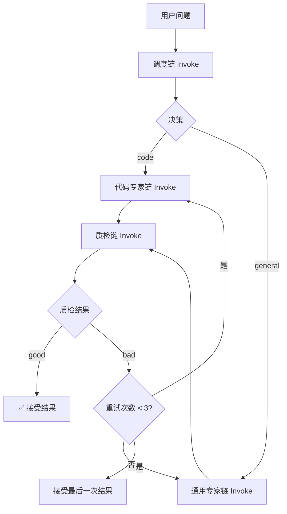

##  0x00    前言

本文梳理下笔者实践过eino的若干示例

-   self-correcting-agent：自我反思与结果判定

##  0x01   Eino开发：review
Eino 的核心思想是图（Graph），可以将一个复杂的 AI 任务拆解成一个个独立的节点（Node），然后用边（Edge）将它们连接起来，定义数据的流向和处理逻辑。最终，这张Graph会被编译（Compile）成一个可执行的对象（Runnable）

-   Graph：构建工作流的画布
-   Node： 图中的操作单元
    -   ChatModelNode： 专门用于和 LLM 进行交互的节点。它的输入是标准的消息格式（`[]*schema.Message`），输出是模型的回复（`*schema.Message`）
    -   LambdaNode：一个通用的瑞士军刀，可以封装任意自定义的 Go 函数。通常用于：
        -   数据转换，即将一种数据类型转换为另一种，例如将简单的字符串输入包装成 ChatModelNode 需要的 `[]*schema.Message` 格式
        -   Prompt 格式化：根据输入动态生成复杂的提示词
        -   输出解析：从模型的原始输出中提取和清理需要的信息，例如从一段文本中解析出 code 或 general 这样的分类标签
-   BranchNode： 实现工作流的条件分支。它内部包含一个函数，该函数根据输入动态地返回下一个应该执行的节点的名称。这使得图可以根据不同的情况执行不同的路径，是实现智能路由的关键
-   Edge：定义数据在节点之间的流向
-   Runnable: 由图编译而成的可执行实例

####    如何选择节点？
-   当需要与 LLM 对话时，使用 ChatModelNode
-   当需要进行数据格式化、自定义逻辑处理、或者在调用模型前后进行预处理/后处理时，使用 LambdaNode，它是连接不同节点的胶水
-   当需要根据某个条件动态地决定下一步走向时（如根据问题类型选择不同的专家模型），使用 BranchNode

##  0x01    基础编排示例：Chain

**定义节点 --> 连接节点 --> 编译 --> 执行**

```go
func main(ctx context.Context) {
	// 1. 配置并创建模型实例
	qwenConfig := &openai.ChatModelConfig{
		BaseURL: "http://localhost:11434/v1", // Ollama 端点
		APIKey:  "ollama",                    // 任意字符串
		Model:   "qwen2.5:0.5b",
	}
	qwenModel, _ := openai.NewChatModel(ctx, qwenConfig)

	// 2. 创建图 (Graph)
	sg := compose.NewGraph[string, *schema.Message]()

	// 3. 添加节点 (Node)
	// 节点1: LambdaNode，将 string 类型的输入（input）转换成模型需要的 []*schema.Message
	formatInput := compose.InvokableLambda(func(ctx context.Context, input string/*用户提问的问题*/) ([]*schema.Message, error) {
		return []*schema.Message{{Role: "user", Content: input}}, nil
	})
	_ = sg.AddLambdaNode("format_input", formatInput)

	// 节点2: ChatModelNode，代表大模型
	_ = sg.AddChatModelNode("qwen_model", qwenModel)

	// 4. 添加边 (Edge)，定义数据流
	_ = sg.AddEdge(compose.START, "format_input") // 数据从起点流入 format_input
	_ = sg.AddEdge("format_input", "qwen_model") // format_input 的输出是 qwen_model 的输入
	_ = sg.AddEdge("qwen_model", compose.END)       // qwen_model 的输出是整个链的最终输出

	// 5. 编译 (Compile) 成 Runnable
	simpleChain, _ := sg.Compile(ctx)

	// 6. 执行 (Invoke)
	result, _ := simpleChain.Invoke(ctx, "Go语言的主要特点是什么？")

	fmt.Println(result.Content)
}
```

##  0x02 self-correcting-agent
本agent的实现流程如下：



-   调度链（Dispatcher Chain）：主要职责是接收用户问题，并输出问题的分类
-   主路由图（Main Router Graph）：它包含两个并行的专家模型节点（代码专家链和通用专家链）。它使用一个特殊的 BranchNode 来调用调度链，并根据其结果，动态地决定数据应该流向哪个专家节点

##  参考
-   [从原理到实践：万字长文深入浅出教你优雅开发复杂AI Agent](https://zhuanlan.zhihu.com/p/1919338285160965135)