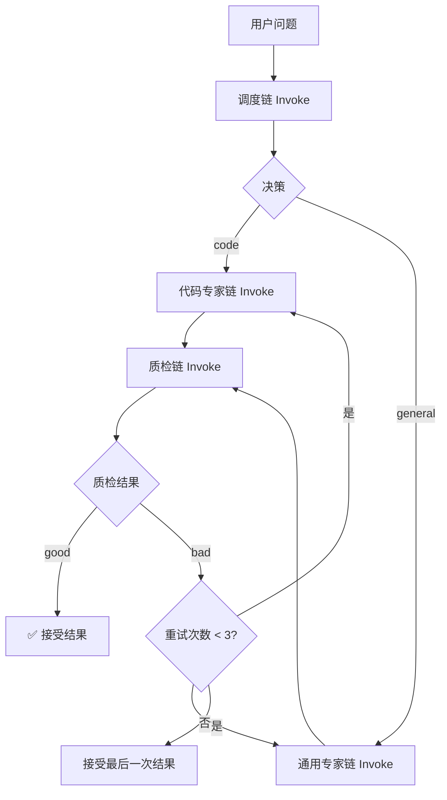

##  0x00    前言

本文梳理下笔者实践过eino的若干示例

-   self-correcting-agent：自我反思与结果判定

##  0x01   Eino开发：review
Eino 的核心思想是图（Graph），可以将一个复杂的 AI 任务拆解成一个个独立的节点（Node），然后用边（Edge）将它们连接起来，定义数据的流向和处理逻辑。最终，这张Graph会被编译（Compile）成一个可执行的对象（Runnable）

-   Graph：构建工作流的画布
-   Node： 图中的操作单元
    -   ChatModelNode： 专门用于和 LLM 进行交互的节点。它的输入是标准的消息格式（`[]*schema.Message`），输出是模型的回复（`*schema.Message`）
    -   LambdaNode：一个通用的瑞士军刀，可以封装任意自定义的 Go 函数。通常用于：
        -   数据转换，即将一种数据类型转换为另一种，例如将简单的字符串输入包装成 ChatModelNode 需要的 `[]*schema.Message` 格式
        -   Prompt 格式化：根据输入动态生成复杂的提示词
        -   输出解析：从模型的原始输出中提取和清理需要的信息，例如从一段文本中解析出 code 或 general 这样的分类标签
-   BranchNode： 实现工作流的条件分支。它内部包含一个函数，该函数根据输入动态地返回下一个应该执行的节点的名称。这使得图可以根据不同的情况执行不同的路径，是实现智能路由的关键
-   Edge：定义数据在节点之间的流向
-   Runnable: 由图编译而成的可执行实例

####    如何选择节点？
-   当需要与 LLM 对话时，使用 ChatModelNode
-   当需要进行数据格式化、自定义逻辑处理、或者在调用模型前后进行预处理/后处理时，使用 LambdaNode，它是连接不同节点的胶水
-   当需要根据某个条件动态地决定下一步走向时（如根据问题类型选择不同的专家模型），使用 BranchNode

####    ReAct Agent
ReAct 模式的核心是**思考 --> 行动 --> 观察 --> 再思考**的闭环，解决传统 Agent 盲目行动或推理与行动脱节的痛点，举例来说：

1、行业赛道分析：使用 ReAct 模式避免了一次性搜集全部信息导致的信息过载，通过逐步推理聚焦核心问题；同时使用数据验证思考，而非凭空靠直觉决策，过程可解释，提升了生成报告的准确性

-   Think-1：判断赛道潜力，需要 **政策支持力度、行业增速、龙头公司盈利能力、产业链瓶颈** 等四类信息
-   Act-1：调用 API 获取行业财报整体数据
-   Think-2：分析数据，判断行业高增长 + 政策背书，但上游价格上涨可能挤压中下游利润，需要进一步验证是否有影响
-   Act-2: 调用 API 获取供需、行业研报等详细数据
-   Think-3: 整合结论生成分析报告，附关键数据来源

2、IT 故障运维：使用 ReAct 模式逐步缩小问题范围，避免盲目操作；每一步操作有理有据，方便运维工程师实施解决方案前的二次验证，为后续复盘与制定预防措施提供基础

-   Think-1：理清故障的常见原因，例如宕机的常见原因是 **CPU 过载、内存不足、磁盘满、服务崩溃**，需要先查基础监控数据
-   Act-1：调用**监控系统 API**查询服务器打点数据
-   Think-2：判断主因，例如 CPU 利用率异常则进一步排查哪些进程 CPU 占用高
-   Act-2：用**进程管理工具**查 TOP 进程，看是否有异常服务
-   Think-3：发现日志服务异常，可能是 日志文件过大或配置错误，需要进一步查看日志服务的配置和日志文件大小
-   Act-3：bash 执行命令，发现日志文件过大，同时配置未开启滚动，也未设置最大日志大小
-   Think-4：向运维工程师提供可行的解决方案：清理日志，修改配置并开启滚动，重启日志服务与应用

##  0x01    基础编排示例：Chain

**定义节点 --> 连接节点 --> 编译 --> 执行**

```go
func main(ctx context.Context) {
	// 1. 配置并创建模型实例
	qwenConfig := &openai.ChatModelConfig{
		BaseURL: "http://localhost:11434/v1", // Ollama 端点
		APIKey:  "ollama",                    // 任意字符串
		Model:   "qwen2.5:0.5b",
	}
	qwenModel, _ := openai.NewChatModel(ctx, qwenConfig)

	// 2. 创建图 (Graph)
	sg := compose.NewGraph[string, *schema.Message]()

	// 3. 添加节点 (Node)
	// 节点1: LambdaNode，将 string 类型的输入（input）转换成模型需要的 []*schema.Message
	formatInput := compose.InvokableLambda(func(ctx context.Context, input string/*用户提问的问题*/) ([]*schema.Message, error) {
		return []*schema.Message{{Role: "user", Content: input}}, nil
	})
	_ = sg.AddLambdaNode("format_input", formatInput)

	// 节点2: ChatModelNode，代表大模型
	_ = sg.AddChatModelNode("qwen_model", qwenModel)

	// 4. 添加边 (Edge)，定义数据流
	_ = sg.AddEdge(compose.START, "format_input") // 数据从起点流入 format_input
	_ = sg.AddEdge("format_input", "qwen_model") // format_input 的输出是 qwen_model 的输入
	_ = sg.AddEdge("qwen_model", compose.END)       // qwen_model 的输出是整个链的最终输出

	// 5. 编译 (Compile) 成 Runnable
	simpleChain, _ := sg.Compile(ctx)

	// 6. 执行 (Invoke)
	result, _ := simpleChain.Invoke(ctx, "Go语言的主要特点是什么？")

	fmt.Println(result.Content)
}
```

##  0x02 self-correcting-agent
本agent的实现流程如下：


```mermaid
flowchart TB
    A[用户问题] --> B[调度链 Invoke]
    B --> C{决策}
    C -->|code| D[代码专家链 Invoke]
    C -->|general| E[通用专家链 Invoke]
    D --> F[质检链 Invoke]
    E --> F
    F --> G{质检结果}
    G -->|good| H[✅ 接受结果]
    G -->|bad| I{重试次数 < 3?}
    I -->|是| D
    I -->|是| E
    I -->|否| J[接受最后一次结果]
```

这个agent实现包括如下核心组件：

-   调度链（Dispatcher Chain）：主要职责是接收用户问题，并输出问题的分类
-   主路由图（Main Router Graph）：它包含两个并行的专家模型节点（代码专家链和通用专家链）。它使用一个特殊的 BranchNode 来调用调度链，并根据其结果，动态地决定数据应该流向哪个专家节点

##  0x0 参考
-   [从原理到实践：万字长文深入浅出教你优雅开发复杂AI Agent](https://zhuanlan.zhihu.com/p/1919338285160965135)
-   [用 Eino ADK 构建你的第一个 AI 智能体：从 Excel Agent 实战开始](https://segmentfault.com/a/1190000047399985)
-   [Eino ADK：一文搞定 AI Agent 核心设计模式，从 0 到 1 搭建智能体系统](https://cloud.tencent.com/developer/article/2594023)
-	[DeepResearch之DeerFlow](https://zhuanlan.zhihu.com/p/1905211481391366801)
-	[使用Eino框架实现DeerFlow系统](https://mp.weixin.qq.com/s?__biz=Mzg2MTc0Mjg2Mw==&mid=2247495153&idx=1&sn=e207794d53c6bc8256c5f8784aa13218&scene=21&poc_token=HGcIj2mjT2Tq4suIikAy3dGkk5fZthr4OP4gJjcA)
-	[Eino ADK：一文搞定 AI Agent 核心设计模式，从 0 到 1 搭建智能体系统](https://www.infoq.cn/article/ovk37gmwcrjug7q17qcf)
-	[eino examples](https://github.com/cloudwego/eino-examples/blob/main/README.zh_CN.md)