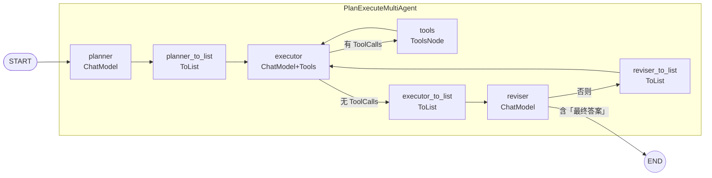

##  0x00    前言
[plan_execute](https://github.com/cloudwego/eino-examples/tree/main/flow/agent/multiagent/plan_execute)

##  0x01    基础

##  0x02    核心编排
`PlanExecuteMultiAgent`的编排图如下：



##  0x03    核心代码解读
智能体初始化`NewMultiAgent`：

```go
// Config 计划——执行 多智能体的配置.
type Config struct {
	PlannerModel        model.BaseChatModel // planner 智能体使用的大模型
	PlannerSystemPrompt string              // planner 智能体的 system prompt

	ExecutorModel        model.ToolCallingChatModel // executor 智能体使用的大模型
	ToolsConfig          compose.ToolsNodeConfig    // executor 智能体使用的工具执行器配置
	ExecutorSystemPrompt string                     // executor 智能体的 system prompt

	ReviserModel        model.BaseChatModel // reviser 智能体使用的大模型
	ReviserSystemPrompt string              // reviser 智能体的 system prompt

	MaxStep int // 多智能体的最大执行步骤数，避免无限循环
}
```

```go
//https://github.com/cloudwego/eino-examples/blob/main/flow/agent/multiagent/plan_execute/compose.go#L72
// NewMultiAgent 根据配置编排一个 计划——执行 多智能体.
func NewMultiAgent(ctx context.Context, config *Config) (*PlanExecuteMultiAgent, error) {
        var (
                toolInfos      []*schema.ToolInfo
                toolsNode      *compose.ToolsNode
                err            error
                plannerPrompt  = config.PlannerSystemPrompt
                executorPrompt = config.ExecutorSystemPrompt
                reviserPrompt  = config.ReviserSystemPrompt
                maxStep        = config.MaxStep
        )

        ......

        if toolInfos, err = genToolInfos(ctx, config.ToolsConfig); err != nil {
                return nil, err
        }

        // 为 Executor 配置工具
        if config.ExecutorModel, err = config.ExecutorModel.WithTools(toolInfos); err != nil {
                return nil, err
        }

        // 初始化 Tool 执行器节点，传入可执行的工具
        if toolsNode, err = compose.NewToolNode(ctx, &config.ToolsConfig); err != nil {
                return nil, err
        }

        // 创建一个待编排的 graph，规定整体的输入输出类型，配置全局状态的初始化方法
        graph := compose.NewGraph[[]*schema.Message, *schema.Message](compose.WithGenLocalState(func(ctx context.Context) *state {
                return &state{}
        }))

        // 在大模型执行之前，向全局状态中保存上下文，并组装本次的上下文
        modelPreHandle := func(systemPrompt string, isDeepSeek bool) compose.StatePreHandler[[]*schema.Message, *state] {
                return func(ctx context.Context, input []*schema.Message, state *state) ([]*schema.Message, error) {
                        for _, msg := range input {
                                state.messages = append(state.messages, msg)
                        }

                        if isDeepSeek {
                                return append([]*schema.Message{schema.SystemMessage(systemPrompt)}, convertMessagesForDeepSeek(state.messages)...), nil
                        }

                        return append([]*schema.Message{schema.SystemMessage(systemPrompt)}, convertMessagesForArk(state.messages)...), nil
                }
        }

        // 定义 Executor 后的分支判断用的条件函数。该函数的输出是运行时选中的 NodeKey
        executorPostBranchCondition := func(_ context.Context, msg *schema.Message) (endNode string, err error) {
                if len(msg.ToolCalls) == 0 {
                        return nodeKeyExecutorToList, nil
                }

                return nodeKeyTools, nil
        }

        // 定义 Reviser 后的分支判断用的条件函数。
        reviserPostBranchCondition := func(_ context.Context, sr *schema.StreamReader[*schema.Message]) (endNode string, err error) {
                defer sr.Close()

                var content string
                for {
                        msg, err := sr.Recv()
                        if err != nil {
                                if err == io.EOF {
                                        // 回到nodeKeyExecutor节点
                                        return nodeKeyReviserToList, nil
                                }
                                return "", err
                        }

                        content += msg.Content

                        if strings.Contains(content, "最终答案") {
                                // 输出已经包含<最终答案>，结束
                                return compose.END, nil
                        }
                }
        }

        // 添加 Planner 节点，同时添加 StatePreHandler 读写上下文
        _ = graph.AddChatModelNode(nodeKeyPlanner, config.PlannerModel, compose.WithStatePreHandler(modelPreHandle(plannerPrompt, true)), compose.WithNodeName(nodeKeyPlanner))

        // 添加 Executor 节点，同时添加 StatePreHandler 读写上下文
        _ = graph.AddChatModelNode(nodeKeyExecutor, config.ExecutorModel, compose.WithStatePreHandler(modelPreHandle(executorPrompt, false)), compose.WithNodeName(nodeKeyExecutor))

        // 添加 Reviser 节点，同时添加 StatePreHandler 读写上下文
        _ = graph.AddChatModelNode(nodeKeyReviser, config.ReviserModel, compose.WithStatePreHandler(modelPreHandle(reviserPrompt, true)), compose.WithNodeName(nodeKeyReviser))

        // 添加 Tool 执行器节点，同时添加 StatePreHandler 读写上下文
        _ = graph.AddToolsNode(nodeKeyTools, toolsNode, compose.WithStatePreHandler(func(ctx context.Context, in *schema.Message, state *state) (*schema.Message, error) {
                state.messages = append(state.messages, in)
                return in, nil
        }))

        // 添加三个 ToList 转换节点
        _ = graph.AddLambdaNode(nodeKeyPlannerToList, compose.ToList[*schema.Message]())
        _ = graph.AddLambdaNode(nodeKeyExecutorToList, compose.ToList[*schema.Message]())
        _ = graph.AddLambdaNode(nodeKeyReviserToList, compose.ToList[*schema.Message]())

        // 添加节点之间的边和分支
        _ = graph.AddEdge(compose.START, nodeKeyPlanner)
        _ = graph.AddEdge(nodeKeyPlanner, nodeKeyPlannerToList)
        _ = graph.AddEdge(nodeKeyPlannerToList, nodeKeyExecutor)
        _ = graph.AddBranch(nodeKeyExecutor, compose.NewGraphBranch(executorPostBranchCondition, map[string]bool{
                nodeKeyTools:          true,
                nodeKeyExecutorToList: true,
        }))
        _ = graph.AddEdge(nodeKeyTools, nodeKeyExecutor)
        _ = graph.AddEdge(nodeKeyExecutorToList, nodeKeyReviser)
        _ = graph.AddBranch(nodeKeyReviser, compose.NewStreamGraphBranch(reviserPostBranchCondition, map[string]bool{
                nodeKeyReviserToList: true,
                compose.END:          true,
        }))
        _ = graph.AddEdge(nodeKeyReviserToList, nodeKeyExecutor)

        // 编译 graph，并生成 Mermaid 拓扑图。由于 graph 中存在环，使用 AnyPredecessor 模式，同时设置运行时最大步数。
        gen := visualize.NewMermaidGenerator("flow/agent/multiagent/plan_execute")
        runnable, err := graph.Compile(ctx,
                compose.WithNodeTriggerMode(compose.AnyPredecessor),
                compose.WithMaxRunSteps(maxStep),
                compose.WithGraphCompileCallbacks(gen),
                compose.WithGraphName("PlanExecuteMultiAgent"),
        )
        if err != nil {
                return nil, err
        }

        // Mermaid markdown and images are auto-generated in flow/agent/multiagent/plan_execute

        return &PlanExecuteMultiAgent{
                runnable: runnable,
        }, nil
}
```

##  0x0 参考
-   [DeepSeek + Function Call：基于 Eino 的 计划--执行 多智能体范式实战](https://mp.weixin.qq.com/s?__biz=Mzg2MTc0Mjg2Mw==&mid=2247494906&idx=1&sn=3dcf6f93de1508202b4e4b055c9446d2&scene=21&poc_token=HECOt2mj-Lw0jIiExrvZ5jAgfK4TfM06S5lKQZKm)
-   [execution_example](https://github.com/cloudwego/eino-examples/blob/main/flow/agent/multiagent/plan_execute/debug/execution_example.txt)