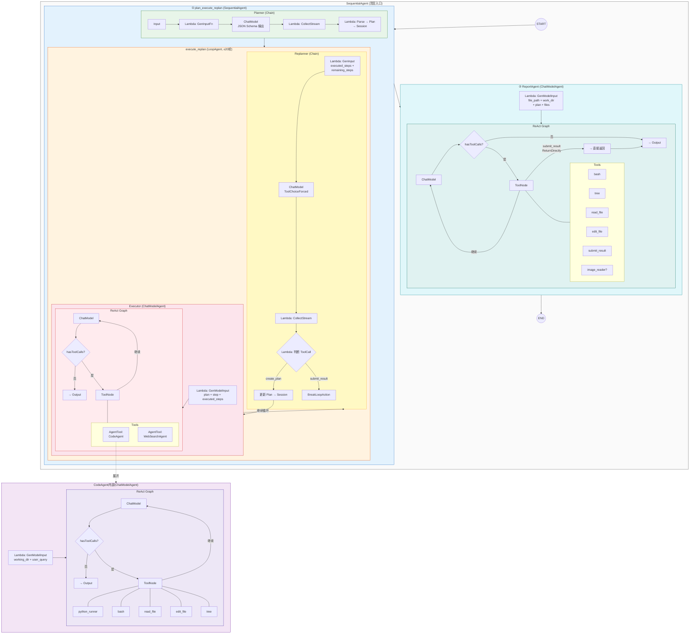

##  0x00    前言
Eino ADK 参考 Google-ADK 的设计，提供了 Go 语言 的 Agents 开发的灵活组合框架，即 Agent、特别是是Multi-Agent 开发框架，并为多 Agent 交互场景沉淀了通用的上下文传递、事件流分发和转换、任务控制权转让、中断与恢复、通用切面等能力


####    Eino ADK 中的 Agent
Eino ADK 抽象设计：

```go
type Agent interface {
    Name(ctx context.Context) string
    Description(ctx context.Context) string
    Run(ctx context.Context, input *AgentInput) *AsyncIterator[*AgentEvent]
}
```

基于 Agent 抽象，ADK 提供了三大类基础拓展：

-   ChatModel Agent: 应用程序的思考部分，利用 LLM 作为核心，理解自然语言，进行推理、规划、生成响应，并动态决定如何执行或使用哪些工具
-   Workflow Agents：应用程序的协调管理部分，基于预定义的逻辑，按照自身类型（顺序 / 并发 / 循环）控制子 Agent 执行流程。Workflow Agents 产生确定性的，可预测的执行模式，不同于 ChatModel Agent 生成的动态随机的决策
    -   顺序（Sequential Agent）：按顺序依次执行子 Agents
    -   循环（Loop Agent）：重复执行子 Agents，直至满足特定的终止条件
    -   并行（Parallel Agent）：并行执行多个子 Agents
-   Custom Agent：通过接口实现自己的 Agent，允许定义高度定制的复杂 Agent

Eino 内置了几种开箱即用的 Multi-Agent 最佳范式：

-   Supervisor: 监督者模式，监督者 Agent 控制所有通信流程和任务委托，并根据当前上下文和任务需求决定调用哪个 Agent
-   Plan-Execute：计划-执行模式，Plan Agent 生成含多个步骤的计划，Execute Agent 根据用户 query 和计划来完成任务。Execute 后会再次调用 Plan，决定完成任务 / 重新进行规划（前文已介绍）

##  0x0 eino ADK 核心知识点梳理


##  0x0 excel agent实现解读



##  0x0 参考
-	[Eino ADK: Quickstart](https://www.cloudwego.io/zh/docs/eino/core_modules/eino_adk/agent_quickstart/)
-	[Eino: ADK - Agent Development Kit](https://www.cloudwego.io/zh/docs/eino/core_modules/eino_adk/)
-   [用 Eino ADK 构建你的第一个 AI 智能体：从 Excel Agent 实战开始](https://segmentfault.com/a/1190000047399985)
-   [Eino ADK：一文搞定 AI Agent 核心设计模式，从0到1搭建智能体系统](https://www.51cto.com/article/829335.html)