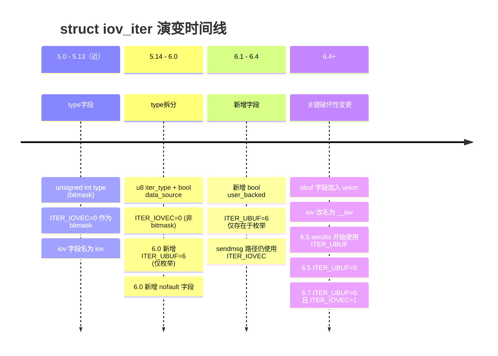

##  0x00    前言
本文梳理下笔者在实现内核`5.4.241-1-tlinux4-0017.14~6.6.47-12.tl4.x86_64`对DNS hook相关兼容性解决的一些知识点的梳理总结，主要涉及到如下hook与内核数据结构

hook涉及：
-	`k*probe/udp_sendmsg`
-	`k*probe/tcp_sendmsg`

关联的内核数据结构：

-	`struct iov_iter`
-	`struct iovec`

> **内核源码引用约定**：本文所有结构体定义均引自 [elixir.bootlin.com](https://elixir.bootlin.com/linux/latest/source/include/linux/uio.h) 对应版本

##	0x01	基础知识

####	内核数据结构
`struct iov_iter` 是 Linux 内核IO处理过程中核心的数据结构之一，它是 VFS 层、网络协议栈、块设备子系统之间传递 I/O 数据描述的**统一迭代器抽象**，几乎每一次 `read/write/send/recv` 系统调用的数据流都要经过它


从内核版本 4.x 到 6.7+，`iov_iter` 经历了 **5 次重大结构变更**（Linux 内核 I/O 子系统持续追求极致性能），每一次改动背后都有清晰的内核工程优化逻辑：从简化类型判断、到消除不必要的间接寻址、再到利用零初始化语义减少指令数等

####	dns数据发送流向


---

## 0x02 基础概念：三层 I/O 数据描述体系

在深入演进细节之前，需要先理解 Linux 内核 I/O 路径上的三层数据描述体系。以 `sendto()` 系统调用为例

#### 用户态视角
用户只看到一个连续的缓冲区 `buf` 和长度 `53`

```c
// 用户程序
char buf[53] = { /* DNS query */ };
sendto(sockfd, buf, 53, 0, &dest_addr, sizeof(dest_addr));
```

#### 内核态视角

```text
┌─────────────────────────────────────────────────────────────────────┐
│ 第 1 层：struct msghdr（消息头，封装一次 I/O 操作的全部元数据）         │
│ ┌─────────────────────────────────────────────────────────────────┐ │
│ │  msg_name      →  目标地址 (struct sockaddr *)                  │ │
│ │  msg_namelen   →  地址长度                                      │ │
│ │  msg_control   →  辅助数据 (cmsg)                               │ │
│ │  msg_flags     →  标志位                                        │ │
│ │                                                                 │ │
│ │  msg_iter      →  ┌─────────────────────────────────────────┐   │ │
│ │ 第 2 层：struct    │ iov_iter（迭代器，描述数据的内存布局）   │   │ │
│ │                    │   iter_type  →  数据类型（IOVEC/UBUF/…）│   │ │
│ │                    │   count      →  总字节数               │   │ │
│ │                    │   iov / ubuf →  指向实际数据描述        │   │ │
│ │                    └───────────────────┬─────────────────────┘   │ │
│ └────────────────────────────────────────┼─────────────────────────┘ │
│                                          ↓                           │
│  第 3 层：struct iovec[]（散布/聚集向量，描述用户态缓冲区）           │
│  ┌──────────────────┐  ┌──────────────────┐                          │
│  │ iov[0]           │  │ iov[1]           │                          │
│  │  iov_base → 0x7f…│  │  iov_base → 0x7f…│                         │
│  │  iov_len  = 53   │  │  iov_len  = 128  │                          │
│  └──────────────────┘  └──────────────────┘                          │
└──────────────────────────────────────────────────────────────────────┘
```

#### struct iovec：POSIX I/O 向量（全版本稳定）

```c
// include/uapi/linux/uio.h — 从 Linux 2.x 至今，定义未变
struct iovec {
    void __user *iov_base;    // 用户空间缓冲区起始地址
    __kernel_size_t iov_len;  // 缓冲区长度（字节）
};
```

`iovec` 是 POSIX 标准（`<sys/uio.h>`） 定义的散布/聚集 I/O（scatter/gather I/O）描述符。系统调用`writev()` / `sendmsg()` 可传入一个 `iovec` 数组来描述多段非连续缓冲区，内核在一次系统调用中将它们聚合发送

**关键认知**：`iovec` 本身是一个 **UAPI 结构**（用户态 ABI 的一部分），因此它**永远不会改变**，任何改动都会破坏所有已编译的用户态程序。内核演进的全部变更都发生在内核态的 `iov_iter` 层面

####    struct iov_iter：为何需要迭代器抽象

Linux内核中不止有用户态 `iovec` 一种数据源，比如块设备 I/O 有 `bio_vec`，内核内部传输有 `kvec`，管道有 `pipe`等，如果每个子系统都针对每种数据源写一套处理逻辑，这显然是不符合内核设计艺术的，因此内核引入了`iov_iter`

`iov_iter` 的设计意图是**用一个统一的迭代器接口封装所有数据源类型**，使上层 VFS / 网络栈只需面对 `iov_iter` 的通用 API（`copy_from_iter()`、`iov_iter_advance()` 等），无需关心底层是 `iovec`、`kvec`、`bio_vec` 还是其他

```text
                  ┌─────────────────┐
                  │   VFS / 网络栈   │
                  │                 │
                  │  copy_from_iter │
                  │  iov_iter_count │
                  │  ...            │
                  └────────┬────────┘
                           │ 统一 API
                  ┌────────┴────────┐
                  │   iov_iter      │  <--- 迭代器抽象层
                  │   iter_type=?   │
                  └────────┬────────┘
           ┌───────┬───────┼───────┬───────┐
           ↓       ↓       ↓       ↓       ↓
        IOVEC    KVEC    BVEC    PIPE    UBUF (6.0+)
       (用户态)  (内核态) (块I/O)  (管道)  (单缓冲区)
```

理解了这个分层，就能明白后续内核每次改动的意图了，**它们都在优化 `iov_iter` 这个中间层的类型判断效率和数据访问路径长度**

---




##  0x02    版本一：4.9 ~ 5.13（位掩码时代）

####    结构定义（v5.1.1版本）

```c
// include/linux/uio.h (v4.9 - v5.13)
// https://elixir.bootlin.com/linux/v5.1.1/source/include/linux/uio.h#L37
struct iov_iter {
    /*
     * Bit 0 is the read/write bit, set if we're writing.
     * Bit 1 is the BVEC_FLAG_NO_REF bit, set if type is a bvec and
     * the caller isn't expecting to drop a page reference when done.
     */7
    unsigned int type;        // 位掩码：方向 + 类型混合编码
    size_t iov_offset;        // 当前段内已消费的偏移
    size_t count;             // 剩余总字节数
    union {
        const struct iovec *iov;       // 用户态 I/O 向量
        const struct kvec *kvec;       // 内核态 I/O 向量
        const struct bio_vec *bvec;    // 块 I/O 向量
        struct pipe_inode_info *pipe;  // 管道
    };
    union {
        unsigned long nr_segs;         // 段数（iov/kvec/bvec）
        struct {
            unsigned int head;
            unsigned int start_head;
        };
    };
};
```

####    类型编码方式

```c
// 方向（占最低位）
#define READ   0
#define WRITE  1

// 迭代器类型（占高位，与方向叠加为位掩码）
#define ITER_IOVEC    0
#define ITER_KVEC     2
#define ITER_BVEC     4
#define ITER_PIPE     8

// 判断类型需要掩码操作
#define iov_iter_type(iter)   ((iter)->type & ~(READ | WRITE))
#define iov_iter_is_write(iter) ((iter)->type & WRITE)
```

####    设计特征与问题

**优点**：结构简单，`union` 中的指针根据 `type` 高位判断使用哪个成员

**问题**：

1. **类型判断代码冗长**：每次判断类型都需要 `iter->type & ~(READ | WRITE)`，掩码操作散布在整个 `lib/iov_iter.c` 中
2. **扩展性差**：位掩码的位数有限，且方向与类型混合编码使得新增类型必须选择不冲突的位
3. **编译器优化困难**：位掩码判断比简单的整数比较更难被编译器优化为跳转表

####    数据访问路径

如下，对于 `sendto(fd, buf, 53, 0, ...)` 这样的单缓冲区发送，数据访问路径大致如下：

```text
用户态调用:
  sendto(fd, buf, 53, ...)

内核 __sys_sendto():
  struct iovec iov;               // 1. 栈上分配 iovec
  iov.iov_base = buf;             // 2. 填入用户指针
  iov.iov_len  = 53;              // 3. 填入长度
  
  struct iov_iter iter;
  iter.type = ITER_IOVEC | WRITE; // 4. 设置类型（位掩码）
  iter.iov  = &iov;               // 5. 指向栈上 iovec
  iter.nr_segs = 1;               // 6. 一段（数据）
  iter.count = 53;                // 7. 总长度
  
  --> sock_sendmsg() --> udp_sendmsg(sk, msg, 53)
```

注意步骤 `1~3`：即使用户只有一个连续缓冲区，内核仍然要在栈上构造一个 `struct iovec`，通过 `iov_iter.iov` 指针间接引用，这是后续 `ITER_UBUF` 优化要消除的开销

---

##  0x03    版本二：5.14 ~ 5.19（类型字段独立化）

####    关键 Commit

- **Commit**: `8cd54c1c8480`（`v5.14-rc1`）
- **作者**: Al Viro
- **标题**: *"iov_iter: separate direction from flavour"*
- **合入版本**: Linux 5.14

参考[[RFC PATCH 12/37] iov_iter: separate direction from flavour](https://lkml.org/lkml/2021/6/6/290)

####    改动原因

Al Viro 在这次重构中将**方向（direction）**和**类型（flavour）**拆分为两个独立字段：

> 原有的位掩码设计源自早期只有两三种类型的时代。随着 `ITER_XARRAY`、`ITER_DISCARD` 等新类型不断加入，位掩码空间紧张，且每次类型判断都需要 `& ~(READ|WRITE)` 掩码操作。将两者分离为独立字段更清晰、更可扩展，也更利于编译器优化

#### 结构变更（版本5.15.1）

```c
// include/linux/uio.h (v5.14+)
// https://elixir.bootlin.com/linux/v5.15.1/source/include/linux/uio.h#L37
struct iov_iter {
    u8 iter_type;          // ← 从 unsigned int type 改为 u8 枚举
    bool data_source;      // ← 方向独立出来：true=WRITE, false=READ
    size_t iov_offset;
    size_t count;
    union {
        const struct iovec *iov;
        const struct kvec *kvec;
        const struct bio_vec *bvec;
        struct xarray *xarray;          // 新增类型
        struct pipe_inode_info *pipe;
    };
    union {
        unsigned long nr_segs;
        struct {
            unsigned int head;
            unsigned int start_head;
        };
        loff_t xarray_start;            // 新增
    };
};

// 枚举定义取代位掩码
enum iter_type {
    ITER_IOVEC   = 0,     // 用户空间散布/聚集 I/O
    ITER_KVEC    = 1,     // 内核空间 I/O 向量
    ITER_BVEC    = 2,     // 块 I/O 向量
    ITER_PIPE    = 3,     // 管道
    ITER_XARRAY  = 4,     // XArray（页缓存）
    ITER_DISCARD = 5,     // 丢弃（/dev/null 场景）
};
```

####    优化效果分析

**1. 类型判断从位运算变为整数比较**

```c
// 改动前（5.13）：每次判断需要掩码
if (iov_iter_type(iter) == ITER_IOVEC)  // 展开为: (iter->type & ~3) == 0

// 改动后（5.14）：直接比较
if (iter->iter_type == ITER_IOVEC)       // 单条 cmp 指令
```

**2. 字段大小从 4 字节缩小到 1 字节**

`unsigned int type` (4B) → `u8 iter_type` (1B) + `bool data_source` (1B)。在频繁访问的热路径上，更小的字段意味着更好的缓存行利用率

**3. 枚举值连续，可生成跳转表**

连续的 `0—5` 枚举值使编译器可以将 `switch (iter_type)` 优化为 `O(1)` 的跳转表，而非链式 `if-else`逻辑

####     对外部模块的影响

| 变化 | 影响 |
|------|------|
| `type` --> `iter_type` | 直接访问 `iter->type` 的代码编译失败 |
| `unsigned int` --> `u8` | 读取偏移量改变，二进制兼容性破坏 |
| `iov` 字段不变 | 数据读取路径不受影响 |

---

##  0x04 版本三：6.0 ~ 6.3（ITER_UBUF 引入）

这个版本是非常重要的一次优化实现

####    关键 Commit

- **Commit**: `fcb14cb1bdac`（v6.0-rc1）
- **作者**: Al Viro
- **标题**: *"new iov_iter flavour - ITER_UBUF"*
- **合入版本**: Linux 6.0

参考[[PATCH 09/44] new iov_iter flavour - ITER_UBUF](https://www.spinics.net/lists/linux-fsdevel/msg220449.html)

####    改动原因：消除单缓冲区场景的冗余间接寻址

这是 `iov_iter` 演进中**最具影响力的一次优化**，其动机来自对真实 I/O 工作负载的观察：

> **事实**：绝大多数 `read()` / `write()` / `send()` / `recv()` 调用只传入**单个连续缓冲区**（single contiguous buffer），而非 scatter/gather I/O

但在 `ITER_UBUF` 引入之前，即使是单缓冲区场景，内核也必须走完整的 `ITER_IOVEC` 路径：

```
传统路径（ITER_IOVEC 处理单缓冲区）： 3 级间接寻址

  用户调用: send(fd, buf, 53, 0)
  
  内核处理:
    1. struct iovec iov = { .iov_base = buf, .iov_len = 53 };  // 栈上分配
    2. iter->iov = &iov;         // 第 1 级：iter 指向 iovec
    3. iov[0].iov_base           // 第 2 级：iovec 指向用户缓冲区
    4. copy_from_user(dst, iov_base, len)  // 第 3 级：实际拷贝
    
  开销:
    - 栈上分配 struct iovec（16 字节）
    - 两次指针解引用（iter→iov→iov_base）
    - nr_segs 判断（虽然只有 1 段）
```

Al Viro 的观点是：**既然 90%+ 的场景是单缓冲区，为什么不直接把用户指针和长度存在 `iov_iter` 里，跳过 `iovec` 这一层？**

```
优化路径（ITER_UBUF）： 2 级间接寻址

  用户调用: send(fd, buf, 53, 0)
  
  内核处理:
    1. iter->ubuf = buf;          // 直接存储用户指针，无需栈上 iovec
    2. iter->count = 53;          // 直接存储长度
    3. copy_from_user(dst, ubuf, count)  // 实际拷贝
    
  节省:
    - 省去栈上 struct iovec 分配
    - 省去一级指针解引用
    - 省去 nr_segs 字段（单缓冲区无需段数）
```

####    内存布局对比

```text
ITER_IOVEC（旧路径）:                    ITER_UBUF（新路径）:

 iov_iter (内核栈/堆)                    iov_iter (内核栈/堆)
┌──────────────┐                        ┌──────────────┐
│ iter_type = 0│                        │ iter_type = 6│
│ count = 53   │                        │ count = 53   │
│ iov ─────────┼──→ iovec (内核栈)       │ ubuf ────────┼──→ 用户态 buf
│ nr_segs = 1  │    ┌─────────────┐     │              │    (0x7ffd...)
└──────────────┘    │ iov_base ───┼──→  └──────────────┘
                    │ iov_len = 53│  用户态 buf
                    └─────────────┘  (0x7ffd...)
                    
间接寻址层数: 3                          间接寻址层数: 2
栈上额外分配: 16B (iovec)               栈上额外分配: 0
```

#### 结构变更（版本v6.1.1）

```c
// include/linux/uio.h (v6.0 - v6.3)
// https://elixir.bootlin.com/linux/v6.1.1/source/include/linux/uio.h#L37
struct iov_iter {
    u8 iter_type;
    bool nofault;
    bool data_source;
    bool user_backed;         // 新增：标识是否来自用户空间
    union {
        size_t iov_offset;
        int last_offset;
    };
    size_t count;
    union {
        const struct iovec *iov;
        const struct kvec *kvec;
        const struct bio_vec *bvec;
        struct xarray *xarray;
        struct pipe_inode_info *pipe;
        void __user *ubuf;            // <--- 新增！直接存储用户态指针
    };
    union {
        unsigned long nr_segs;
        struct {
            unsigned int head;
            unsigned int start_head;
        };
        loff_t xarray_start;
    };
};

enum iter_type {
    ITER_IOVEC   = 0,
    ITER_KVEC    = 1,
    ITER_BVEC    = 2,
    ITER_PIPE    = 3,
    ITER_XARRAY  = 4,
    ITER_DISCARD = 5,
    ITER_UBUF    = 6,          // ← 新增
};
```

####     新增 API

```c
// 初始化 ITER_UBUF 迭代器（替代 import_single_range）
void iov_iter_ubuf(struct iov_iter *i, unsigned int direction,
                   void __user *buf, size_t count);

// 类型判断谓词
static inline bool iter_is_ubuf(const struct iov_iter *i) {
    return i->iter_type == ITER_UBUF;
}

// 统一的"用户态支持"判断（IOVEC 和 UBUF 都是用户态数据源）
static inline bool user_backed_iter(const struct iov_iter *i) {
    return i->iter_type == ITER_IOVEC || i->iter_type == ITER_UBUF;
}
```

####    union 共享的关键陷阱

**`iov` 和 `ubuf` 共享同一 `union` 的同一内存位置**。这意味着：

```c
// 当 iter_type == ITER_UBUF 时:
iter->ubuf = 0x7ffd5a3b1000;   // 用户态虚拟地址

// 此时读取 iter->iov 得到的是：
iter->iov  = 0x7ffd5a3b1000;     // 完全相同的值！
                                 // 但它不是一个 struct iovec * 内核指针
                                 // 将其当作 iov 解引用会导致 -EFAULT
```

这是**eBPF 程序在 6.0+ 上踩的最大坑**，不检查 `iter_type` 就直接读 `iov` 字段

####    性能收益量化

Al Viro 和后续的 Jens Axboe 在 io_uring 场景的 benchmark 中观察到：

- **减少 16 字节栈分配**：每次 I/O 调用省去一个 `struct iovec` 的构造
- **消除一级指针解引用**：在网络 I/O 热路径上，每秒可能执行数百万次，每次省几个 CPU 周期累计可观
- **减少分支判断**：`ITER_UBUF` 的处理代码比 `ITER_IOVEC` 更短，因为无需处理 `nr_segs > 1` 的多段情况

随后，`import_single_range()`（旧的单缓冲区初始化函数）被 `import_ubuf()` 逐步替代，最终在 6.7 中被彻底移除

---

##  0x05 版本四：6.4 ~ 6.6（iov → \_\_iov 重命名与 overlay 优化）

####     关键 Commit

- **Commit**: `db68ce10c4f0`（v6.4-rc1）
- **作者**: Jens Axboe
- **标题**: *"iov_iter: overlay struct iovec and ubuf for ITER_UBUF"*
- **合入版本**: Linux 6.4

参考[]()

####    改动原因：统一 UBUF 和 IOVEC 的代码路径

引入 `ITER_UBUF` 后，内核中许多函数需要同时处理两种**用户态数据源**类型。典型模式如下：

```c
// 6.0~6.3 时代的典型代码：需要分支处理
if (iter_is_ubuf(iter)) {
    void __user *addr = iter->ubuf;
    size_t len = iter->count;
    // ... 处理 ubuf
} else {
    const struct iovec *iov = iter->iov;
    void __user *addr = iov->iov_base;
    size_t len = iov->iov_len;
    // ... 处理 iovec
}
```

Jens Axboe 的观点是`ITER_UBUF` 的 `(ubuf, count)` 在语义上等价于一个单元素 `struct iovec { .iov_base = ubuf, .iov_len = count }`。如果让它们在**内存布局上也完全重叠**，就可以用一个统一的 `struct iovec *` 指针同时处理两种情况

####     结构变更（版本v6.6.6）

```c
// include/linux/uio.h (v6.4 - v6.6)
// https://elixir.bootlin.com/linux/v6.6.6/source/include/linux/uio.h#L37
struct iov_iter {
    u8 iter_type;
    bool copy_mc;
    bool nofault;
    bool data_source;
    bool user_backed;
    union {
        size_t iov_offset;
        int last_offset;
    };
    /*
     * Hack alert: overlay ubuf_iovec with iovec + count, so
     * that the members resolve correctly regardless of the type
     * of iterator used. This means that you can use:
     *
     *   &iter->__ubuf_iovec or iter->__iov
     *
     * interchangeably for the user_backed cases, hence simplifying
     * some of the cases that need to deal with both.
     */
    union {
        struct iovec __ubuf_iovec;     // ← 新增 overlay 结构
        struct {
            union {
                const struct iovec *__iov;   // ← iov 重命名为 __iov
                const struct kvec *kvec;
                const struct bio_vec *bvec;
                struct xarray *xarray;
                void __user *ubuf;
            };
            size_t count;                    // ← count 移入此 struct
        };
    };
    union {
        unsigned long nr_segs;
        loff_t xarray_start;
    };
};
```

####     overlay 内存布局解析

这是此次改动最精妙的部分，看下 `union` 的内存布局，如下：

```
偏移（相对于 union 起始）:

+0  ┌───────────────────────────────┐
    │         __ubuf_iovec          │  struct iovec:
    │  +0: iov_base (void *)       │    .iov_base 占 8 字节
    │  +8: iov_len  (size_t)       │    .iov_len  占 8 字节
+16 └───────────────────────────────┘
                                    
    ════════════ 与下面完全重叠 ════════════
                                    
+0  ┌───────────────────────────────┐
    │ union { __iov / ubuf / ... }  │  指针占 8 字节
+8  ├───────────────────────────────┤
    │         count (size_t)        │  8 字节
+16 └───────────────────────────────┘
```

**关键**：当 `iter_type == ITER_UBUF` 时：
- `ubuf` 的值 == `__ubuf_iovec.iov_base` 的值（同一内存位置）
- `count` 的值 == `__ubuf_iovec.iov_len` 的值（同一内存位置）

所以 `&iter->__ubuf_iovec` 是一个完全有效的 `struct iovec *`，无需任何转换

####     统一访问函数 `iter_iov()`

```c
// 新的统一访问接口
static inline const struct iovec *iter_iov(const struct iov_iter *iter) {
    if (iter->iter_type == ITER_UBUF)
        return (const struct iovec *) &iter->__ubuf_iovec;
    return iter->__iov;
}
```

这意味着之前需要 `if-else` 分支处理的代码现在可以统一为：

```c
// 6.4+ 统一代码——不再需要分支
const struct iovec *iov = iter_iov(iter);
void __user *addr = iov->iov_base;
size_t len = iov->iov_len;
```

####     为什么要重命名 `iov` --> `__iov`呢？

熟悉内核的开发者都了解，双下划线前缀是一种 **API 封装信号**，即告诉内核开发者"不要直接访问 `__iov`，请通过 `iter_iov()` 接口"。如果仍然允许 `iter->iov`，开发者可能跳过类型检查直接使用，在 `ITER_UBUF` 场景下导致 bug。重命名是一种**编译期强制迁移**策略

---

##   0x06 版本五：6.7+（枚举值重排：零初始化优化）

### 关键 Commit

- **Commit**: `de4f5fed3f23`（v6.7-rc1）
- **作者**: Jens Axboe
- **标题**: *"iov_iter: restructure iter type"*
- **合入版本**: Linux 6.7

####    改动原因：让最常见的类型获得零值

```c
// 6.0 - 6.6 的枚举
enum iter_type {
    ITER_IOVEC   = 0,    // ← 默认值 0
    ITER_KVEC    = 1,
    ITER_BVEC    = 2,
    ITER_PIPE    = 3,
    ITER_XARRAY  = 4,
    ITER_DISCARD = 5,
    ITER_UBUF    = 6,    // ← 最常见的类型，值却是 6
};

// 6.7+ 的枚举
enum iter_type {
    ITER_UBUF    = 0,    // ← 最常见的类型获得值 0
    ITER_IOVEC   = 1,
    ITER_KVEC    = 2,
    ITER_BVEC    = 3,
    ITER_XARRAY  = 4,
    ITER_DISCARD = 5,
};
```

####    优化哲学：利用 C 语言的零初始化语义

在 C 语言中，以下场景的变量自动为零：

1. **全局/静态变量**：BSS 段零初始化
2. **`= {}` 初始化**：所有成员置零
3. **`memset(0)`**：手动清零
4. **`calloc()`**：分配的内存已清零

当 `ITER_UBUF = 0` 时，一个零初始化的 `iov_iter` 默认就是 `ITER_UBUF` 类型。这意味着：

```c
// 6.7+ 初始化 ITER_UBUF
struct iov_iter iter = {};       // iter_type 自动为 0 = ITER_UBUF
iter.ubuf = user_buf;            // 只需设置数据指针和长度
iter.count = len;
// 不需要显式设置 iter_type！

// 对比 6.0-6.6
struct iov_iter iter = {};
iter.iter_type = ITER_UBUF;      // 必须显式设置为 6
iter.ubuf = user_buf;
iter.count = len;
```

####     更深层的意义

在热路径上，减少一条赋值指令看似微不足道，但考虑到：

- Linux 系统上每秒可能有**数百万次** I/O 系统调用
- `ITER_UBUF` 覆盖了其中 **90%+** 的场景（所有单缓冲区 read/write/send/recv）
- 每条指令在 L1 cache 中的占用、分支预测器中的记录都有成本

这种"把最常见路径的开销降到极致"的思维方式，是 Linux 内核性能工程的典型手法。

####     ITER_PIPE 的移除

注意 6.7 版本代码，枚举中 `ITER_PIPE` 消失了，它在 6.7 中被移除。管道 I/O 不再使用独立的迭代器类型，而是统一到其他机制中。这进一步简化了 `iov_iter` 的类型分支

---

##   0x07 完整演进总览

####    时间线

```
4.9 ─────── 5.0 ─── 5.13 ── 5.14 ── 5.19 ── 6.0 ── 6.3 ── 6.4 ── 6.6 ── 6.7 ──→
│                     │       │              │       │       │       │       │
│     位掩码时代       │       │  类型字段独立  │ UBUF  │ 引入  │ __iov │ 重命名│
│  type = 位掩码      │       │ iter_type(u8)│       │       │ overlay│      │
│  iov 字段           │       │ data_source  │  ubuf │ 加入  │ 结构  │ UBUF=0│
│  ITER_IOVEC=0       │       │ ITER_IOVEC=0 │ union │       │       │ IOV=1 │
│                     │       │              │ =6    │       │       │       │
└─────────────────────┘       └──────────────┘       └───────┘       └───────┘
     约 7 年不变                   1 次重构        关键优化    布局统一   语义翻转
```

####     结构差异一览表

| 维度 | 4.9~5.13 | 5.14~5.19 | 6.0~6.3 | 6.4~6.6 | 6.7+ |
|:-----|:---------|:----------|:--------|:--------|:-----|
| **类型字段** | `type` (u32 位掩码) | `iter_type` (u8) | `iter_type` (u8) | `iter_type` (u8) | `iter_type` (u8) |
| **方向编码** | 混在 `type` 低位 | `data_source` (bool) | `data_source` (bool) | `data_source` (bool) | `data_source` (bool) |
| **iov 字段名** | `iov` | `iov` | `iov` | `__iov` | `__iov` |
| **ubuf 字段** | 不存在 | 不存在 | 存在 (union) | 存在 (union) | 存在 (union) |
| **ITER_UBUF** | 不存在 | 不存在 | = 6 | = 6 | = **0** |
| **ITER_IOVEC** | = 0 (掩码) | = 0 (枚举) | = 0 | = 0 | = **1** |
| **overlay** | 无 | 无 | 无 | `__ubuf_iovec` | `__ubuf_iovec` |
| **单缓冲区路径** | IOVEC + 栈 iovec | IOVEC + 栈 iovec | **UBUF 直接** | UBUF 直接 | UBUF 直接 |
| **间接寻址层数** | 3 | 3 | **2** | 2 | 2 |

####     设计哲学演进

```
  第 1 阶段: "统一抽象"（4.x ~ 5.13）
    目标: 用一个结构体封装所有 I/O 数据源
    手段: union + 位掩码
    代价: 类型判断复杂，单缓冲区路径冗余
    
      ↓ 问题暴露: 位掩码不可扩展，掩码操作冗余
    
  第 2 阶段: "分离关注点"（5.14 ~ 5.19）
    目标: 让类型判断更清晰、更可扩展
    手段: 枚举 + 独立 bool 方向字段
    收益: 代码可读性↑、编译器优化空间↑
    
      ↓ 问题暴露: 90%+ 的 I/O 是单缓冲区，却走多段路径
    
  第 3 阶段: "消除冗余抽象"（6.0 ~ 6.3）
    目标: 为最常见场景（单缓冲区）提供 fast path
    手段: ITER_UBUF 新类型，直接存储用户指针
    收益: 减少 1 级间接寻址 + 省去栈上 iovec 分配
    
      ↓ 问题暴露: UBUF 和 IOVEC 两套处理代码重复
    
  第 4 阶段: "布局统一"（6.4 ~ 6.6）
    目标: 让 UBUF 和 IOVEC 共享代码路径
    手段: overlay struct iovec + __iov 重命名强制迁移
    收益: 统一接口 iter_iov()，减少分支
    
      ↓ 问题暴露: UBUF 是最常见类型，但枚举值 6，零初始化无法利用
    
  第 5 阶段: "极致优化"（6.7+）
    目标: 让最常见路径的初始化开销最小
    手段: 枚举重排，ITER_UBUF = 0
    收益: 零初始化即为 UBUF，热路径少一条赋值指令
```

---

##  0x08    对 eBPF / 内核模块开发者的影响

以上每一次变更对外部观察者（eBPF 程序、内核模块）都会造成兼容性问题。以下是按影响程度排序的完整清单：

| 变更 | 影响程度 | 症状 | 解决方案 |
|:-----|:---------|:-----|:---------|
| `iov`--->`__iov` (6.4) | **致命** | CORE 模式 BTF 字段匹配失败，加载报错 | CORE flavor 结构体（`iov_iter___old` / `iov_iter___v64`） |
| ITER_UBUF 引入 (6.0) | **致命** | `iov` 读到用户态地址，解引用失败，`iov_len=0` | 先检查 `iter_type`，UBUF 走 `ubuf` 路径 |
| ITER_UBUF 枚举重排 (6.7) | **高** | 硬编码 `ITER_UBUF==6` 在 6.7 上判断错误 | `bpf_core_enum_value()` 运行时解析枚举值 |
| `type`--->`iter_type` (5.14) | **中** | 字段名/偏移变化 | CORE 可以自动处理；非CORE 则需要根据内核版本区分 |
| `count` 位置移动 (6.4) | **低** | 偏移变化 | CORE 自动处理 |

####     BPF CO-RE 的解法

BPF CO-RE（Compile Once - Run Everywhere）机制通过 **BTF 重定位**在加载时自动适配目标内核的结构体布局。对于 `iov_iter` 的变更，核心技巧是：

1. **Flavor 结构体**：定义 `iov_iter___old`（有 `iov`）和 `iov_iter___v64`（有 `__iov`），libbpf 根据后缀 `___xxx` 匹配目标 BTF
2. **Flavor 枚举**：定义 `enum iter_type___dns` 包含 `ITER_UBUF___dns`，用 `bpf_core_enum_value_exists()` 检测 UBUF 是否存在
3. **运行时枚举值解析**：`bpf_core_enum_value(enum iter_type___dns, ITER_UBUF___dns)` 获取目标内核上 UBUF 的实际数值（`6` 或 `0`）

---

##   0x09 总结

`struct iov_iter` 的五次演进是 Linux 内核工程思维的缩影：

1. **先抽象，再优化**：先建立统一的迭代器抽象（4.x），在抽象稳定后再针对热路径优化（6.0+）
2. **数据驱动**：ITER_UBUF 的引入源于对**90%+ I/O 是单缓冲区**这一事实的观察，非理论推演
3. **向后兼容在内核内部不是教条**：当性能收益足够大时，内核乐于打破内部 ABI（如重命名字段、重排枚举值），但 UAPI（`struct iovec`）绝不改变
4. **每一条指令都值得优化**：从位掩码优化为枚举（省几个 AND 指令）到 `UBUF=0`（省一条 MOV 指令），在百万级 QPS 下累计效果显著
5. **编译期约束胜于文档约束**：`iov`--->`__iov` 的重命名不是代码风格变更，而是**通过编译错误强制所有调用者迁移到 `iter_iov()` 接口**

---


##  0x0A  参考
-   [`struct iov_iter`](https://elixir.bootlin.com/linux/latest/source/include/linux/uio.h)
-   [Al Viro: "separate direction from flavour" (5.14)](commit `8cd54c1c8480`)
-   [Al Viro: "new iov_iter flavour - ITER_UBUF" (6.0)](commit `fcb14cb1bdac`)
-   [Jens Axboe: "overlay struct iovec and ubuf" (6.4)](commit `db68ce10c4f0`)
-   [Jens Axboe: "restructure iter type" (6.7)](commit `de4f5fed3f23`)
-   [Jens Axboe: "Get rid of import_single_range()" (6.7)](https://patchew.org/linux/20231204174827.1258875-1-axboe@kernel.dk/)
-   [BPF CO-RE Reference Guide](https://nakryiko.com/posts/bpf-core-reference-guide/)
-   [LKML: io_uring use ITER_UBUF](https://lore.gnuweeb.org/io-uring/Y2q7Kn4tDlaKCVMS@kbusch-mbp/T/)