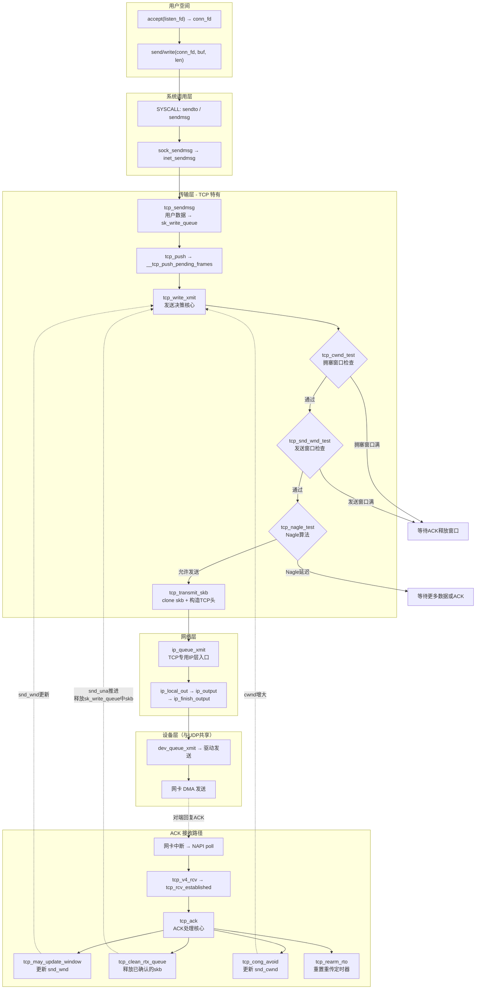
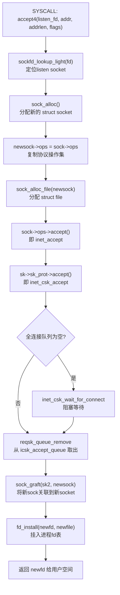
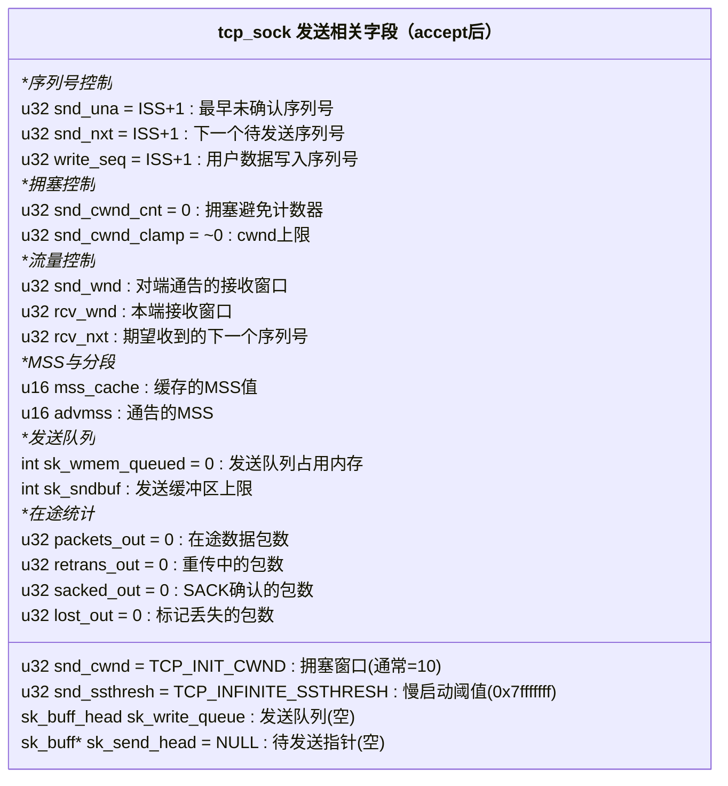
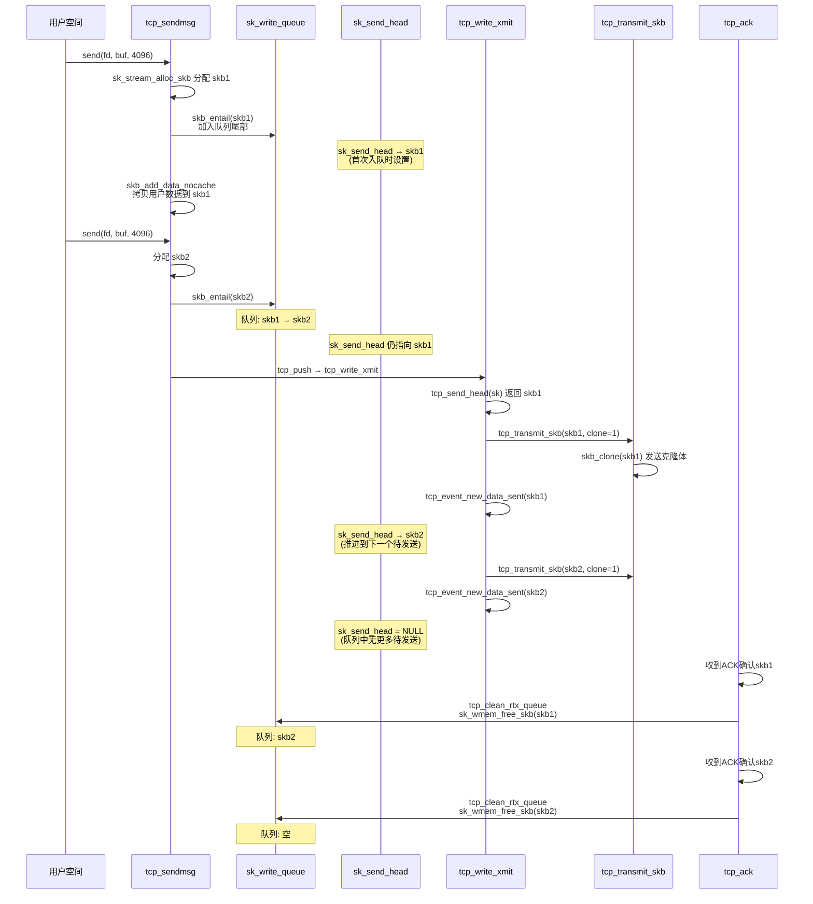
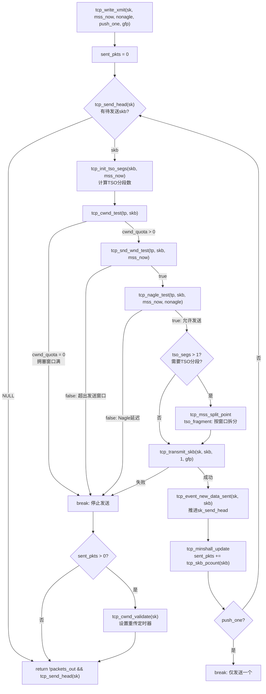
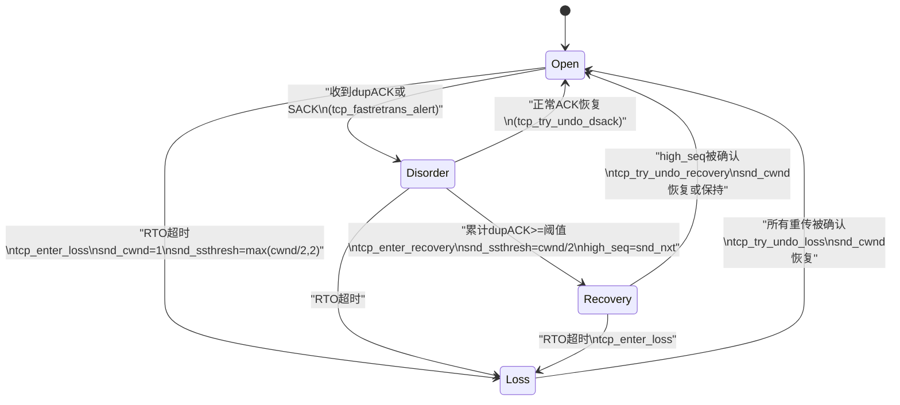
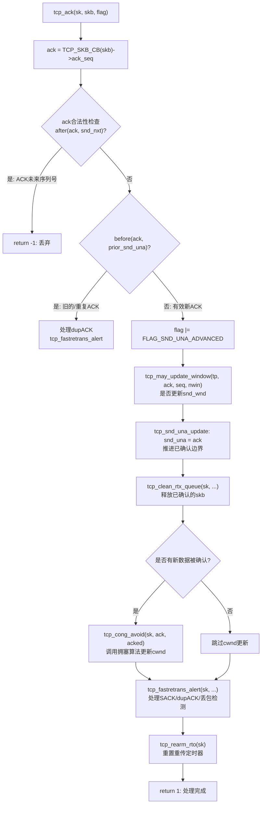
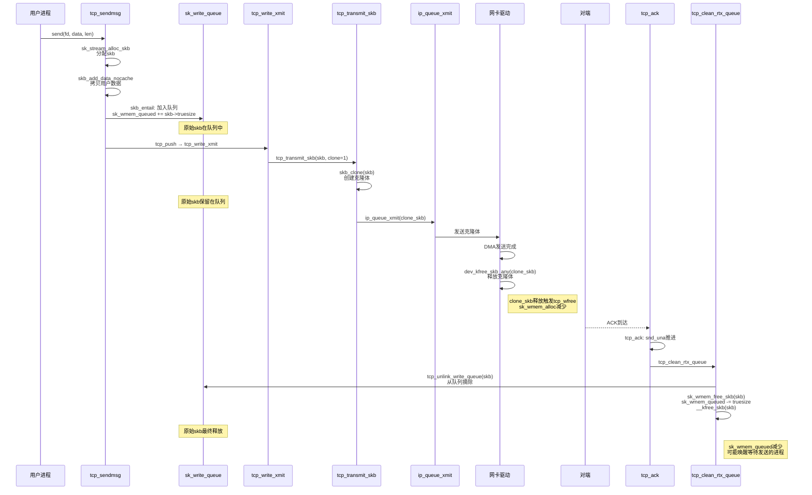

##  0x00    前言

本文代码基于 [v4.11.6](https://elixir.bootlin.com/linux/v4.11.6/source) 版本，主要涉及到如下知识点：

1.  `accept` 完成后 `tcp_sock` 中与发送相关字段的初始化状态
2.  `tcp_sendmsg` → `tcp_write_xmit` → `tcp_transmit_skb` 发送链路的字段级分析
3.  拥塞控制在发送时的门控作用（哪些字段影响发送决策）
4.  `tcp_ack` 收到 ACK 时的完整处理：窗口更新、skb 释放、拥塞窗口调整
5.  滑动窗口在发送侧和接收侧的判断逻辑与更新机制（`tcp_ack`与滑动窗口的应用的双端视角）
6.  TCP 内存管理与背压（TSQ）机制

##  0x01    TCP 发送路径全景图

下图展示了 TCP 数据从 `accept` 获取连接 fd 到 ACK 驱动 skb 释放的完整生命周期：



核心要点：
-   **发送路径**：`tcp_sendmsg` 只负责将用户数据拷贝到 `sk_write_queue`，真正的发送决策在 `tcp_write_xmit` 中完成，受拥塞窗口（`snd_cwnd`）、发送窗口（`snd_wnd`）和 Nagle 算法三重门控
-   **ACK 驱动**：TCP 发送是 ACK 驱动的闭环——`tcp_ack` 收到确认后推进 `snd_una`、释放 skb、更新拥塞窗口，从而允许 `tcp_write_xmit` 发送更多数据
-   **skb 生命周期**：skb 在 `tcp_sendmsg` 中创建并加入 `sk_write_queue`，`tcp_transmit_skb` 发送时 clone 一份（原始 skb 保留用于可能的重传），直到 `tcp_clean_rtx_queue` 收到 ACK 后才释放原始 skb

##  0x02    accept 完成后的 tcp_sock 状态布局

TCP 服务端通过 `accept` 获取客户端连接的 fd，此时三次握手已经完成，`tcp_sock` 中的各项字段已经初始化完毕。理解这些字段的初始状态，是分析后续发送路径的基础

####    accept 系统调用全流程

[`accept4`](https://elixir.bootlin.com/linux/v4.11.6/source/net/socket.c#L1470) 系统调用的核心流程：



关键源码分析：

```cpp
// net/socket.c
SYSCALL_DEFINE4(accept4, int, fd, struct sockaddr __user *, upeer_sockaddr,
        int __user *, upeer_addrlen, int, flags)
{
    struct socket *sock, *newsock;
    struct file *newfile;
    int err, len, newfd, fput_needed;

    sock = sockfd_lookup_light(fd, &err, &fput_needed);
    if (!sock)
        goto out;

    newsock = sock_alloc();
    newsock->type = sock->type;
    newsock->ops = sock->ops;   // 复制 inet_stream_ops

    newfile = sock_alloc_file(newsock, flags, sock->sk->sk_prot_creator->name);

    // inet_accept → inet_csk_accept：从全连接队列取出已完成三次握手的 sock
    err = sock->ops->accept(sock, newsock, sock->file->f_flags, false);

    fd_install(newfd, newfile);
    /* ...... */
}
```

[`inet_csk_accept`](https://elixir.bootlin.com/linux/v4.11.6/source/net/ipv4/inet_connection_sock.c#L427) 从全连接队列中取出在三次握手过程中已经创建好的 `struct sock`：

```cpp
// net/ipv4/inet_connection_sock.c
struct sock *inet_csk_accept(struct sock *sk, int flags, int *err, bool kern)
{
    struct inet_connection_sock *icsk = inet_csk(sk);
    struct request_sock_queue *queue = &icsk->icsk_accept_queue;
    struct request_sock *req;
    struct sock *newsk;
    int error;

    lock_sock(sk);

    if (reqsk_queue_empty(queue)) {
        long timeo = sock_rcvtimeo(sk, flags & O_NONBLOCK);
        error = inet_csk_wait_for_connect(sk, timeo);
        if (error)
            goto out_err;
    }
    req = reqsk_queue_remove(queue, sk);
    newsk = req->sk;       // 三次握手期间已创建的 tcp_sock

    /* ...... */
    release_sock(sk);
    return newsk;
}
```

####    accept 完成后 tcp_sock 关键字段

三次握手完成时，`tcp_v4_syn_recv_sock` → `tcp_create_openreq_child` 已经初始化了新 `tcp_sock` 的关键字段。accept 返回后，该 `tcp_sock` 处于 `TCP_ESTABLISHED` 状态，各发送相关字段的初始值：



关键字段的初始化位置（`tcp_create_openreq_child` / `tcp_init_xmit_timers` / `tcp_v4_syn_recv_sock`）：

| 字段 | 初始值 | 初始化函数 | 说明 |
|------|--------|-----------|------|
| `snd_una` | `ISS + 1` | `tcp_create_openreq_child` | SYN 占一个序列号，握手完成后指向 SYN 的下一个 |
| `snd_nxt` | `ISS + 1` | `tcp_create_openreq_child` | 与 `snd_una` 相同，尚未发送数据 |
| `write_seq` | `ISS + 1` | `tcp_create_openreq_child` | 用户数据写入位置 |
| `snd_cwnd` | `TCP_INIT_CWND`(10) | `tcp_init_metrics` | [RFC 6928](https://tools.ietf.org/html/rfc6928) 推荐初始窗口 |
| `snd_ssthresh` | `0x7fffffff` | `tcp_create_openreq_child` | 初始为无穷大，首次丢包前一直处于慢启动 |
| `snd_wnd` | SYN-ACK中的窗口值 | `tcp_ack`（握手阶段） | 对端在 SYN-ACK 中通告的接收窗口 |
| `mss_cache` | 对端MSS或默认536 | `tcp_sync_mss` | 由对端 SYN 中的 MSS 选项决定 |
| `sk_send_head` | `NULL` | `tcp_create_openreq_child` | 尚无待发送数据 |
| `packets_out` | `0` | `tcp_create_openreq_child` | 握手完成后 SYN 已被确认 |

```cpp
// net/ipv4/tcp_minisocks.c - tcp_create_openreq_child（精简）
struct sock *tcp_create_openreq_child(const struct sock *sk,
                      struct request_sock *req,
                      struct sk_buff *skb)
{
    struct sock *newsk = inet_csk_clone_lock(sk, req, GFP_ATOMIC);
    struct tcp_sock *newtp = tcp_sk(newsk);
    struct tcp_sock *oldtp = tcp_sk(sk);

    newtp->snd_una     = treq->snt_isn + 1;
    newtp->snd_nxt     = treq->snt_isn + 1;
    newtp->write_seq   = treq->snt_isn + 1;
    newtp->rcv_nxt     = treq->rcv_isn + 1;
    newtp->snd_sml     = treq->snt_isn + 1;

    tcp_init_wl(newtp, treq->rcv_isn);

    newtp->snd_ssthresh = TCP_INFINITE_SSTHRESH;

    newtp->packets_out = 0;
    newtp->retrans_out = 0;
    newtp->sacked_out  = 0;
    newtp->lost_out    = 0;

    newtp->snd_cwnd = TCP_INIT_CWND;
    newtp->snd_cwnd_cnt = 0;

    /* ...... */
    return newsk;
}
```

此刻发送队列 `sk_write_queue` 为空，`sk_send_head` 为 `NULL`。用户通过 `send`/`write` 写入数据后，数据才会进入发送队列

##  0x03    tcp_sendmsg：用户数据到发送队列

`tcp_sendmsg` 的核心职责是将用户空间数据拷贝到内核的 `sk_write_queue` 中，但并不直接决定何时发送。发送决策由后续的 `tcp_push` → `tcp_write_xmit` 完成

####    sk_write_queue 与 sk_send_head 的关系



关键机制说明：
-   `sk_write_queue` 是双向链表，保存所有已入队但尚未被 ACK 确认的 skb
-   `sk_send_head` 指向队列中第一个尚未发送（未调用 `tcp_transmit_skb`）的 skb
-   `sk_send_head` 之前的 skb：已发送但等待 ACK 确认（保留用于可能的重传）
-   `sk_send_head` 之后（含）的 skb：尚未发送

####    tcp_sendmsg 核心源码分析

[`tcp_sendmsg`](https://elixir.bootlin.com/linux/v4.11.6/source/net/ipv4/tcp.c#L1148) 的完整逻辑：

```cpp
// net/ipv4/tcp.c
int tcp_sendmsg(struct sock *sk, struct msghdr *msg, size_t size)
{
    struct tcp_sock *tp = tcp_sk(sk);
    struct sk_buff *skb;
    int flags, err, copied = 0;
    int mss_now = 0, size_goal, copied_syn = 0;
    bool sg;
    long timeo;

    lock_sock(sk);

    flags = msg->msg_flags;
    // TCP Fast Open：在 SYN 中携带数据
    if (unlikely(flags & MSG_FASTOPEN || inet_sk(sk)->defer_connect)) {
        err = tcp_sendmsg_fastopen(sk, msg, &copied_syn, size);
        if (err == -EINPROGRESS && copied_syn > 0)
            goto out;
        else if (err)
            goto out_err;
    }

    timeo = sock_sndtimeo(sk, flags & MSG_DONTWAIT);
    tcp_rate_check_app_limited(sk);

    // 只有 ESTABLISHED 和 CLOSE_WAIT 状态允许发送数据
    if (((1 << sk->sk_state) & ~(TCPF_ESTABLISHED | TCPF_CLOSE_WAIT)) &&
        !tcp_passive_fastopen(sk)) {
        err = sk_stream_wait_connect(sk, &timeo);
        if (err != 0)
            goto do_error;
    }

    /* ...... repair 模式处理 ...... */

    copied = 0;

restart:
    // 获取当前 MSS 和 size_goal
    // size_goal: 支持 GSO 时为 MSS 的整数倍，否则等于 MSS
    mss_now = tcp_send_mss(sk, &size_goal, flags);

    sg = !!(sk->sk_route_caps & NETIF_F_SG);

    while (msg_data_left(msg)) {
        int copy = 0;
        int max = size_goal;

        skb = tcp_write_queue_tail(sk);
        if (tcp_send_head(sk)) {
            if (skb->ip_summed == CHECKSUM_NONE)
                max = mss_now;
            // 检查当前 skb 还能容纳多少数据
            copy = max - skb->len;
        }

        if (copy <= 0 || !tcp_skb_can_collapse_to(skb)) {
new_segment:
            // 检查发送缓冲区是否还有空间
            // sk_wmem_queued >= sk_sndbuf 时返回 false
            if (!sk_stream_memory_free(sk))
                goto wait_for_sndbuf;

            if (process_backlog && sk_flush_backlog(sk)) {
                process_backlog = false;
                goto restart;
            }

            // 分配新的 skb
            skb = sk_stream_alloc_skb(sk,
                          select_size(sk, sg, first_skb),
                          sk->sk_allocation, first_skb);
            if (!skb)
                goto wait_for_memory;

            if (sk_check_csum_caps(sk))
                skb->ip_summed = CHECKSUM_PARTIAL;

            // 将 skb 加入 sk_write_queue 尾部
            // 如果 sk_send_head 为 NULL，同时设置 sk_send_head 指向此 skb
            skb_entail(sk, skb);
            copy = size_goal;
            max = size_goal;
        }

        if (copy > msg_data_left(msg))
            copy = msg_data_left(msg);

        // 数据拷贝：线性区 or 分页区
        if (skb_availroom(skb) > 0) {
            copy = min_t(int, copy, skb_availroom(skb));
            err = skb_add_data_nocache(sk, skb, &msg->msg_iter, copy);
            if (err)
                goto do_fault;
        } else {
            // 线性区已满，使用分页区（skb_shared_info->frags）
            bool merge = true;
            int i = skb_shinfo(skb)->nr_frags;
            struct page_frag *pfrag = sk_page_frag(sk);

            if (!sk_page_frag_refill(sk, pfrag))
                goto wait_for_memory;

            if (!skb_can_coalesce(skb, i, pfrag->page, pfrag->offset)) {
                if (i >= sysctl_max_skb_frags || !sg) {
                    tcp_mark_push(tp, skb);
                    goto new_segment;
                }
                merge = false;
            }

            copy = min_t(int, copy, pfrag->size - pfrag->offset);
            if (!sk_wmem_schedule(sk, copy))
                goto wait_for_memory;

            err = skb_copy_to_page_nocache(sk, &msg->msg_iter, skb,
                               pfrag->page, pfrag->offset, copy);
            if (err)
                goto do_error;

            if (merge) {
                skb_frag_size_add(&skb_shinfo(skb)->frags[i - 1], copy);
            } else {
                skb_fill_page_desc(skb, i, pfrag->page,
                           pfrag->offset, copy);
                page_ref_inc(pfrag->page);
            }
            pfrag->offset += copy;
        }

        if (!copied)
            TCP_SKB_CB(skb)->tcp_flags &= ~TCPHDR_PSH;

        // 更新序列号
        tp->write_seq += copy;
        TCP_SKB_CB(skb)->end_seq += copy;
        tcp_skb_pcount_set(skb, 0);

        copied += copy;
        if (!msg_data_left(msg)) {
            if (unlikely(flags & MSG_EOR))
                TCP_SKB_CB(skb)->eor = 1;
            goto out;
        }

        // skb 未满且不是 OOB，继续填充
        if (skb->len < max || (flags & MSG_OOB) || unlikely(tp->repair))
            continue;

        // 检查是否需要立即推送
        if (forced_push(tp)) {
            tcp_mark_push(tp, skb);
            __tcp_push_pending_frames(sk, mss_now, TCP_NAGLE_PUSH);
        } else if (skb == tcp_send_head(sk))
            tcp_push_one(sk, mss_now);

        continue;

wait_for_sndbuf:
        set_bit(SOCK_NOSPACE, &sk->sk_socket->flags);
wait_for_memory:
        if (copied)
            tcp_push(sk, flags & ~MSG_MORE, mss_now,
                 TCP_NAGLE_PUSH, size_goal);
        // 阻塞等待发送缓冲区释放
        err = sk_stream_wait_memory(sk, &timeo);
        if (err != 0)
            goto do_error;
        mss_now = tcp_send_mss(sk, &size_goal, flags);
    }

out:
    if (copied) {
        tcp_tx_timestamp(sk, sockc.tsflags, tcp_write_queue_tail(sk));
        // tcp_push 决定是否立即发送，受 Nagle 算法影响
        tcp_push(sk, flags, mss_now, tp->nonagle, size_goal);
    }
out_nopush:
    release_sock(sk);
    return copied + copied_syn;

    /* ...... 错误处理 ...... */
}
```

####    关键辅助函数

`skb_entail` 将 skb 加入发送队列并更新内存计数：

```cpp
// net/ipv4/tcp.c
static void skb_entail(struct sock *sk, struct sk_buff *skb)
{
    struct tcp_sock *tp = tcp_sk(sk);
    struct tcp_skb_cb *tcb = TCP_SKB_CB(skb);

    skb->csum    = 0;
    tcb->seq     = tcb->end_seq = tp->write_seq;
    tcb->tcp_flags = TCPHDR_ACK;
    tcb->sacked  = 0;
    __skb_header_release(skb);
    tcp_add_write_queue_tail(sk, skb);
    sk_wmem_queued_add(sk, skb->truesize);
    sk_mem_charge(sk, skb->truesize);

    // 如果 sk_send_head 为 NULL，设置为当前 skb
    if (tp->nonagle & TCP_NAGLE_PUSH)
        tp->nonagle &= ~TCP_NAGLE_PUSH;
}
```

`sk_stream_memory_free` 检查发送缓冲区是否还有空间：

```cpp
// include/net/sock.h
static inline bool sk_stream_memory_free(const struct sock *sk)
{
    if (sk->sk_wmem_queued >= sk->sk_sndbuf)
        return false;
    return sk->sk_prot->stream_memory_free ?
        sk->sk_prot->stream_memory_free(sk) : true;
}
```

当 `sk_wmem_queued >= sk_sndbuf` 时，`tcp_sendmsg` 将阻塞在 `sk_stream_wait_memory`，等待 ACK 释放 skb 后唤醒

####    tcp_push：触发发送

`tcp_push` 是 `tcp_sendmsg` 到 `tcp_write_xmit` 的桥梁：

```cpp
// net/ipv4/tcp.c
static void tcp_push(struct sock *sk, int flags, int mss_now,
             int nonagle, int size_goal)
{
    struct tcp_sock *tp = tcp_sk(sk);
    struct sk_buff *skb;

    if (!tcp_send_head(sk))
        return;

    skb = tcp_write_queue_tail(sk);
    if (!(flags & MSG_MORE) || forced_push(tp))
        tcp_mark_push(tp, skb);

    tcp_mark_urg(tp, flags);

    if (tcp_should_autocork(sk, skb, size_goal)) {
        /* 自动 cork：数据量不足一个 MSS 且 qdisc/设备队列有待发送数据 */
        return;
    }

    __tcp_push_pending_frames(sk, mss_now, nonagle);
}
```

`__tcp_push_pending_frames` 直接调用 `tcp_write_xmit`：

```cpp
void __tcp_push_pending_frames(struct sock *sk, unsigned int cur_mss,
                   int nonagle)
{
    if (tcp_write_xmit(sk, cur_mss, nonagle, 0,
               sk_gfp_mask(sk, GFP_ATOMIC)))
        tcp_check_probe_timer(sk);
}
```

##  0x04    tcp_write_xmit：发送决策核心

[`tcp_write_xmit`](https://elixir.bootlin.com/linux/v4.11.6/source/net/ipv4/tcp_output.c#L2149) 是 TCP 发送路径中最重要的函数，负责从 `sk_write_queue` 中取出待发送的 skb，逐一通过三重门控检查，决定是否实际发送



####    门控一：tcp_cwnd_test —— 拥塞窗口检查

```cpp
// net/ipv4/tcp_output.c
static unsigned int tcp_cwnd_test(const struct tcp_sock *tp,
                  const struct sk_buff *skb)
{
    u32 in_flight, cwnd;

    /* Don't be strict about the congestion window for the final FIN.  */
    if ((TCP_SKB_CB(skb)->tcp_flags & TCPHDR_FIN) &&
        tcp_skb_pcount(skb) == 1)
        return 1;

    in_flight = tcp_packets_in_flight(tp);
    cwnd = tp->snd_cwnd;
    if (in_flight >= cwnd)
        return 0;           // 拥塞窗口已满，不允许发送
    return (cwnd - in_flight);  // 还能发送的数据包数
}
```

`tcp_packets_in_flight` 计算在途数据包数：

```cpp
// include/net/tcp.h
static inline unsigned int tcp_packets_in_flight(const struct tcp_sock *tp)
{
    return tp->packets_out - tcp_left_out(tp) + tp->retrans_out;
}

static inline unsigned int tcp_left_out(const struct tcp_sock *tp)
{
    return tp->sacked_out + tp->lost_out;
}
```

含义：`in_flight = packets_out - sacked_out - lost_out + retrans_out`
-   `packets_out`：已发送但未确认的数据包总数
-   `sacked_out`：被对端 SACK 选项确认的包数（虽然未被累积 ACK 确认，但对端已收到）
-   `lost_out`：被标记为丢失的包数
-   `retrans_out`：正在重传的包数

当 `in_flight >= snd_cwnd` 时，拥塞窗口不允许发送更多数据

####    门控二：tcp_snd_wnd_test —— 发送窗口检查

```cpp
// net/ipv4/tcp_output.c
static bool tcp_snd_wnd_test(const struct tcp_sock *tp,
                 const struct sk_buff *skb,
                 unsigned int cur_mss)
{
    u32 end_seq = TCP_SKB_CB(skb)->end_seq;

    if (skb->len > cur_mss)
        end_seq = TCP_SKB_CB(skb)->seq + cur_mss;

    return !after(end_seq, tcp_wnd_end(tp));
}

// tcp_wnd_end: 发送窗口右边界
static inline u32 tcp_wnd_end(const struct tcp_sock *tp)
{
    return tp->snd_una + tp->snd_wnd;
}
```

检查 skb 的数据是否在发送窗口范围内。发送窗口 = `[snd_una, snd_una + snd_wnd)`，如果 `end_seq > snd_una + snd_wnd`，则超出对端接收能力

####    门控三：tcp_nagle_test —— Nagle 算法

```cpp
// net/ipv4/tcp_output.c
static inline bool tcp_nagle_test(const struct tcp_sock *tp,
                  const struct sk_buff *skb,
                  unsigned int cur_mss,
                  int nonagle)
{
    // TCP_NAGLE_PUSH: 强制推送（如 forced_push）
    if (nonagle & TCP_NAGLE_PUSH)
        return true;

    // 设置了 TCP_NODELAY 或 TCP_CORK 解除
    if (tp->urg_mode || (TCP_SKB_CB(skb)->tcp_flags & TCPHDR_FIN))
        return true;

    if (!tcp_nagle_check(skb->len < cur_mss, tp, nonagle))
        return true;

    return false;
}

// 核心判断
static inline bool tcp_nagle_check(bool partial,
                   const struct tcp_sock *tp,
                   int nonagle)
{
    // 不是小包（填满MSS），直接发送
    // 或者设置了 TCP_NODELAY
    // 或者没有在途数据包
    return partial &&
        ((nonagle & TCP_NAGLE_CORK) ||
         (!nonagle && tp->packets_out && tcp_minshall_check(tp)));
}
```

Nagle 算法的核心规则：当存在未确认的小包时，延迟发送后续小包，等待前一个包的 ACK 到达。`TCP_NODELAY` 关闭 Nagle，`TCP_CORK` 强制积攒数据

####    tcp_event_new_data_sent：推进 sk_send_head

发送成功后调用此函数，移动 `sk_send_head` 并启动重传定时器：

```cpp
// net/ipv4/tcp_input.c
static void tcp_event_new_data_sent(struct sock *sk, struct sk_buff *skb)
{
    struct inet_connection_sock *icsk = inet_csk(sk);
    struct tcp_sock *tp = tcp_sk(sk);
    unsigned int prior_packets = tp->packets_out;

    tcp_advance_send_head(sk, skb);    // sk_send_head 指向下一个 skb
    tp->snd_nxt = TCP_SKB_CB(skb)->end_seq;

    tp->packets_out += tcp_skb_pcount(skb);
    if (!prior_packets || icsk->icsk_pending == ICSK_TIME_LOSS_PROBE)
        tcp_rearm_rto(sk);             // 启动/重置重传定时器
}

static inline void tcp_advance_send_head(struct sock *sk, const struct sk_buff *skb)
{
    if (tcp_skb_is_last(sk, skb))
        sk->sk_send_head = NULL;        // 队列中最后一个，无更多待发送
    else
        sk->sk_send_head = tcp_write_queue_next(sk, skb);
}
```

##  0x05    tcp_transmit_skb：构造 TCP 报文

[`tcp_transmit_skb`](https://elixir.bootlin.com/linux/v4.11.6/source/net/ipv4/tcp_output.c#L920) 是实际发送 TCP 段的函数，负责 clone skb、构造 TCP 头、计算校验和，最终调用 IP 层发送

####    skb clone 机制

TCP 与 UDP 最大的不同在于发送时需要 **clone** skb：

```cpp
// net/ipv4/tcp_output.c（精简）
static int tcp_transmit_skb(struct sock *sk, struct sk_buff *skb, int clone_it,
                gfp_t gfp_mask)
{
    const struct inet_connection_sock *icsk = inet_csk(sk);
    struct inet_sock *inet;
    struct tcp_sock *tp;
    struct tcp_skb_cb *tcb;
    struct tcphdr *th;
    int err;

    tp = tcp_sk(sk);

    if (clone_it) {
        // 记录发送时间戳
        skb_mstamp_get(&skb->skb_mstamp);
        TCP_SKB_CB(skb)->tx.in_flight = TCP_SKB_CB(skb)->end_seq - tp->snd_una;
        tcp_rate_skb_sent(sk, skb);

        if (unlikely(skb_cloned(skb)))
            skb = pskb_copy(skb, gfp_mask);    // 已被clone过，需要深拷贝
        else
            skb = skb_clone(skb, gfp_mask);     // 共享数据区的浅拷贝
        if (unlikely(!skb))
            return -ENOBUFS;
    }
    /* ...... */
```

**为什么需要 clone？**
-   原始 skb 保留在 `sk_write_queue` 中，等待 ACK 确认后才能释放
-   如果丢包需要重传，重传时再次 clone 原始 skb 发送
-   `skb_clone` 创建一个新的 `sk_buff` 头部，但共享底层数据缓冲区（引用计数增加）
-   `pskb_copy`：如果 skb 已经被 clone 过（`skb_cloned()` 返回 true），需要连数据一起拷贝

####    TCP 头部构造

```cpp
    inet = inet_sk(sk);
    tcb = TCP_SKB_CB(skb);

    tcp_header_size = tcp_options_size + sizeof(struct tcphdr);

    skb_push(skb, tcp_header_size);
    skb_reset_transport_header(skb);

    skb_orphan(skb);
    skb->sk = sk;
    // 纯 ACK 使用 __sock_wfree，数据包使用 tcp_wfree（TSQ机制）
    skb->destructor = skb_is_tcp_pure_ack(skb) ? __sock_wfree : tcp_wfree;
    skb_set_hash_from_sk(skb, sk);
    atomic_add(skb->truesize, &sk->sk_wmem_alloc);

    /* 构造TCP头 */
    th = (struct tcphdr *)skb->data;
    th->source      = inet->inet_sport;
    th->dest        = inet->inet_dport;
    th->seq         = htonl(tcb->seq);
    th->ack_seq     = htonl(tp->rcv_nxt);     // 捎带 ACK
    *(((__be16 *)th) + 6) = htons(((tcp_header_size >> 2) << 12) |
                    tcb->tcp_flags);

    th->check       = 0;
    th->urg_ptr     = 0;

    /* 设置窗口通告 */
    if (likely(!(tcb->tcp_flags & TCPHDR_SYN))) {
        th->window = htons(tcp_select_window(sk));   // 动态计算接收窗口
        tcp_ecn_send(sk, skb, th, tcp_header_size);
    } else {
        th->window = htons(min(tp->rcv_wnd, 65535U));
    }

    /* 写入TCP选项 */
    tcp_options_write((__be32 *)(th + 1), tp, &opts);

    /* 计算校验和 */
    icsk->icsk_af_ops->send_check(sk, skb);

    /* 调用IP层发送 */
    err = icsk->icsk_af_ops->queue_xmit(sk, skb, &inet->cork.fl);
    // 对于 IPv4：queue_xmit = ip_queue_xmit

    if (likely(err <= 0))
        return err;

    tcp_enter_cwr(sk);
    return net_xmit_eval(err);
}
```

####    tcp_wfree：TSQ 背压机制的入口

当 clone 的 skb 被网络设备层释放时（如 `dev_kfree_skb_any`），`tcp_wfree` 被调用：

```cpp
// net/ipv4/tcp_output.c
void tcp_wfree(struct sk_buff *skb)
{
    struct sock *sk = skb->sk;
    struct tcp_sock *tp = tcp_sk(sk);
    int wmem;

    wmem = atomic_sub_return(skb->truesize - 1, &sk->sk_wmem_alloc);

    // TSQ: 如果队列中积压的字节数低于阈值，触发后续发送
    if (wmem < SKB_TRUESIZE(1) && this_cpu_ksoftirqd() == current)
        goto out;

    // 下半部处理：将 sk 加入 tsq_tasklet
    if (test_and_clear_bit(TSQ_THROTTLED, &tp->tsq_flags)) {
        struct tsq_tasklet *tsq;
        tsq = this_cpu_ptr(&tsq_tasklet);
        list_add(&tp->tsq_node, &tsq->head);
        tasklet_schedule(&tsq->tasklet);
    }
out:
    sk_free(sk);
}
```

TSQ（TCP Small Queues）防止 TCP 在 qdisc/设备队列中积压过多数据，通过 `tcp_wfree` 回调在 skb 释放时触发 `tcp_tsq_handler` → `tcp_write_xmit`，继续发送更多数据

##  0x06    ip_queue_xmit：TCP 的 IP 层入口

TCP 使用 [`ip_queue_xmit`](https://elixir.bootlin.com/linux/v4.11.6/source/net/ipv4/ip_output.c#L424) 进入 IP 层，而 UDP 使用 `ip_send_skb`。两者的主要差异在于路由处理方式：

```cpp
// net/ipv4/ip_output.c
int ip_queue_xmit(struct sock *sk, struct sk_buff *skb, struct flowi *fl)
{
    struct inet_sock *inet = inet_sk(sk);
    struct net *net = sock_net(sk);
    struct ip_options_rcu *inet_opt;
    struct flowi4 *fl4;
    struct rtable *rt;
    struct iphdr *iph;
    int res;

    rcu_read_lock();
    inet_opt = rcu_dereference(inet->inet_opt);
    fl4 = &fl->u.ip4;

    // TCP 路由缓存：连接级别复用路由
    rt = skb_rtable(skb);
    if (rt)
        goto packet_routed;

    rt = (struct rtable *)__sk_dst_check(sk, 0);
    if (!rt) {
        __be32 daddr;
        daddr = inet->inet_daddr;
        if (inet_opt && inet_opt->opt.srr)
            daddr = inet_opt->opt.faddr;

        // 路由查找
        rt = ip_route_output_ports(net, fl4, sk,
                       daddr, inet->inet_saddr,
                       inet->inet_dport, inet->inet_sport,
                       sk->sk_protocol, RT_CONN_FLAGS(sk),
                       sk->sk_bound_dev_if);
        if (IS_ERR(rt))
            goto no_route;
        sk_setup_caps(sk, &rt->dst);
    }
    skb_dst_set_noref(skb, &rt->dst);

packet_routed:
    /* IP 选项处理 */
    if (inet_opt && inet_opt->opt.is_strictroute && rt->rt_uses_gateway)
        goto no_route;

    /* 构造 IP 头 */
    skb_push(skb, sizeof(struct iphdr) + (inet_opt ? inet_opt->opt.optlen : 0));
    skb_reset_network_header(skb);
    iph = ip_hdr(skb);
    *((__be16 *)iph) = htons((4 << 12) | (5 << 8) | (inet->tos & 0xff));
    if (ip_dont_fragment(sk, &rt->dst) && !skb->ignore_df)
        iph->frag_off = htons(IP_DF);
    else
        iph->frag_off = 0;
    iph->ttl      = ip_select_ttl(inet, &rt->dst);
    iph->protocol = sk->sk_protocol;    // IPPROTO_TCP
    iph->saddr    = fl4->saddr;
    iph->daddr    = fl4->daddr;

    ip_select_ident_segs(net, skb, sk, tcp_skb_pcount(skb));

    if (inet_opt && inet_opt->opt.optlen)
        ip_options_build(skb, &inet_opt->opt, inet->inet_daddr, rt, 0);

    // 进入公共 IP 输出路径
    res = ip_local_out(net, sk, skb);
    /* ...... */
}
```

**与 UDP 的 `ip_send_skb` 的关键差异**：
1. **路由缓存**：TCP 连接级别复用路由（`__sk_dst_check`），UDP 每次发送可能重新查找
2. **IP 头构造位置**：TCP 在 `ip_queue_xmit` 中构造 IP 头，UDP 在 `__ip_make_skb` 中构造
3. **IP 选项**：TCP 需要处理连接级别的 IP 选项（如源路由）

`ip_local_out` 之后的流程（`__ip_local_out` → netfilter → `ip_output` → `ip_finish_output` → 邻居子系统 → 设备层）与 UDP 完全相同，详见 [内核之旅（十）](https://pandaychen.github.io/2025/04/02/A-LINUX-KERNEL-TRAVEL-10/) 的 0x07-0x0C 章节

##  0x07    拥塞控制深度分析

拥塞控制是 TCP 区别于 UDP 的核心机制之一，其通过动态调整 `snd_cwnd` 来控制发送速率，防止网络拥塞

####    tcp_sock 中拥塞控制相关字段

| 字段 | 类型 | 含义 | 更新时机 |
|------|------|------|----------|
| `snd_cwnd` | `u32` | 拥塞窗口（单位：MSS段） | `tcp_cong_avoid`（每次ACK）、`tcp_enter_loss`/`tcp_enter_recovery`（丢包） |
| `snd_ssthresh` | `u32` | 慢启动阈值 | `tcp_enter_loss`/`tcp_enter_recovery`（设为 cwnd/2） |
| `snd_cwnd_cnt` | `u32` | 拥塞避免阶段的字节计数器 | `tcp_cong_avoid_ai`（线性增长） |
| `snd_cwnd_clamp` | `u32` | cwnd 上限 | 连接初始化时设置 |
| `snd_cwnd_stamp` | `u32` | cwnd 最后更新时间戳 | `tcp_cong_avoid` |
| `packets_out` | `u32` | 已发送未确认的包数 | `tcp_event_new_data_sent`（发送+1）、`tcp_clean_rtx_queue`（ACK-1） |
| `retrans_out` | `u32` | 正在重传的包数 | `tcp_retransmit_skb`（+1）、`tcp_clean_rtx_queue`（-1） |
| `sacked_out` | `u32` | SACK 确认的包数 | `tcp_sacktag_write_queue` |
| `lost_out` | `u32` | 标记丢失的包数 | `tcp_mark_head_lost`、`tcp_clean_rtx_queue` |
| `icsk_ca_state` | `u8` | 拥塞状态机当前状态 | `tcp_set_ca_state` |
| `icsk_ca_ops` | `ptr` | 拥塞控制算法操作集 | 连接初始化（默认 CUBIC） |

####    发送时的拥塞控制交互

在 `tcp_write_xmit` 中，发送决策受以下字段约束：

```
能否发送 = (in_flight < snd_cwnd)
其中 in_flight = packets_out - sacked_out - lost_out + retrans_out
```

每发送一个 skb：
1. `tcp_event_new_data_sent`：`packets_out++`，`snd_nxt` 推进
2. `in_flight` 增大，接近 `snd_cwnd` 后无法继续发送

每收到一个 ACK：
1. `tcp_clean_rtx_queue`：`packets_out--`（被确认的包），`snd_una` 推进
2. `tcp_cong_avoid`：根据拥塞算法增大 `snd_cwnd`
3. `in_flight` 减小，`snd_cwnd` 增大，允许发送更多数据

####    拥塞状态机



**Open** 状态（正常传输）：
-   `snd_cwnd < snd_ssthresh`：慢启动，每 ACK `snd_cwnd += 1`（指数增长）
-   `snd_cwnd >= snd_ssthresh`：拥塞避免，每 RTT `snd_cwnd += 1`（线性增长）

**Loss** 状态（RTO 超时）：

```cpp
// net/ipv4/tcp_input.c
void tcp_enter_loss(struct sock *sk)
{
    struct tcp_sock *tp = tcp_sk(sk);
    struct inet_connection_sock *icsk = inet_csk(sk);

    tp->snd_ssthresh = icsk->icsk_ca_ops->ssthresh(sk);
    // 对于 CUBIC：ssthresh = max(cwnd * beta, 2)，beta 默认 0.7
    tp->snd_cwnd       = 1;        // 重置为 1
    tp->snd_cwnd_cnt   = 0;
    tp->snd_cwnd_stamp = tcp_time_stamp;

    tcp_set_ca_state(sk, TCP_CA_Loss);
    tp->high_seq = tp->snd_nxt;

    // 标记所有在途包为丢失
    tcp_timeout_mark_lost(sk);
    /* ...... */
}
```

**Recovery** 状态（快速重传/恢复）：

```cpp
// net/ipv4/tcp_input.c
static void tcp_enter_recovery(struct sock *sk, bool ece_ack)
{
    struct tcp_sock *tp = tcp_sk(sk);

    tp->prior_ssthresh = tcp_current_ssthresh(sk);
    tcp_init_undo(tp);

    tp->snd_ssthresh = inet_csk(sk)->icsk_ca_ops->ssthresh(sk);
    tp->high_seq = tp->snd_nxt;    // Recovery 结束标志
    tp->prr_delivered = 0;
    tp->prr_out = 0;

    inet_csk(sk)->icsk_ca_state = TCP_CA_Recovery;
}
```

Recovery 使用 PRR（Proportional Rate Reduction）算法控制发送速率，直到 `snd_una` 越过 `high_seq`（所有 Recovery 前发送的数据都被确认）

##  0x08    ACK 处理与 skb 生命周期

`tcp_ack` 是 ACK 接收处理的核心函数，负责推进 `snd_una`、释放已确认的 skb、更新拥塞窗口。其是整个 TCP 发送闭环的关键环节

####    tcp_ack 完整流程



####    tcp_ack 核心源码

```cpp
// net/ipv4/tcp_input.c（精简）
static int tcp_ack(struct sock *sk, const struct sk_buff *skb, int flag)
{
    struct inet_connection_sock *icsk = inet_csk(sk);
    struct tcp_sock *tp = tcp_sk(sk);
    struct tcp_sacktag_state sack_state;
    u32 prior_snd_una = tp->snd_una;
    u32 ack_seq = TCP_SKB_CB(skb)->seq;
    u32 ack = TCP_SKB_CB(skb)->ack_seq;
    bool is_dupack = false;
    u32 prior_fackets;
    int prior_packets = tp->packets_out;
    const int prior_unsacked = tp->packets_out - tp->sacked_out;
    int acked = 0;

    /* ACK 合法性检查 */
    if (after(ack, tp->snd_nxt))
        goto invalid_ack;

    if (before(ack, prior_snd_una)) {
        /* 旧ACK，忽略（但可能是 dupACK） */
        if (!(flag & FLAG_NO_CHALLENGE_ACK))
            tcp_send_challenge_ack(sk, skb);
        return -1;
    }

    /* SACK 处理 */
    if (TCP_SKB_CB(skb)->sacked)
        flag |= tcp_sacktag_write_queue(sk, skb, prior_snd_una, &sack_state);

    /* 窗口更新 */
    if (tcp_may_update_window(tp, ack, ack_seq, ntohs(tcp_hdr(skb)->window)))
        flag |= FLAG_WIN_UPDATE;

    /* SND_UNA 推进 */
    if (after(ack, prior_snd_una)) {
        flag |= FLAG_SND_UNA_ADVANCED;
        icsk->icsk_retransmits = 0;  // 重置重传计数
    }

    /* 释放已确认的skb */
    prior_fackets = tp->fackets_out;
    acked = tcp_clean_rtx_queue(sk, prior_fackets, prior_snd_una,
                    &sack_state);

    if (tcp_ack_is_dubious(sk, flag)) {
        is_dupack = !(flag & (FLAG_SND_UNA_ADVANCED | FLAG_NOT_DUP));
        tcp_fastretrans_alert(sk, acked, prior_unsacked,
                      is_dupack, flag);
    }

    /* 拥塞控制：更新 cwnd */
    if (tp->snd_una != prior_snd_una)
        tcp_cong_avoid(sk, ack, acked);

    /* 重传定时器管理 */
    if (tp->packets_out) {
        if (!prior_packets)
            inet_csk_reset_xmit_timer(sk, ICSK_TIME_RETRANS,
                          icsk->icsk_rto, TCP_RTO_MAX);
    } else {
        tcp_rearm_rto(sk);
    }

    /* 唤醒等待发送缓冲区的进程 */
    if (acked)
        tcp_check_space(sk);

    return 1;

invalid_ack:
    return -1;
}
```

####    tcp_clean_rtx_queue：skb 释放的核心

这是 `sk_write_queue` 中 skb 被释放的唯一正常路径：

```cpp
// net/ipv4/tcp_input.c（精简）
static int tcp_clean_rtx_queue(struct sock *sk, int prior_fackets,
                   u32 prior_snd_una,
                   struct tcp_sacktag_state *sack)
{
    struct tcp_sock *tp = tcp_sk(sk);
    const struct inet_connection_sock *icsk = inet_csk(sk);
    struct sk_buff *skb;
    u32 now = tcp_time_stamp;
    int fully_acked = true;
    int flag = 0;
    long ca_rtt_us = -1L;
    long seq_rtt_us = -1L;
    struct sk_buff *head;
    u32 reord = tp->packets_out;
    u32 acked_pcount;
    s32 sack_rtt_us = -1;

    while ((skb = tcp_write_queue_head(sk)) && skb != tcp_send_head(sk)) {
        struct tcp_skb_cb *scb = TCP_SKB_CB(skb);
        u8 sacked = scb->sacked;

        // 检查此 skb 的序列号是否在 ACK 范围内
        if (after(scb->end_seq, tp->snd_una)) {
            if (tcp_skb_pcount(skb) == 1 ||
                !after(tp->snd_una, scb->seq))
                break;
            // 部分确认：需要拆分 skb
            acked_pcount = tcp_tso_acked(sk, skb);
            if (!acked_pcount)
                break;
        } else {
            acked_pcount = tcp_skb_pcount(skb);
        }

        // 计算 RTT（用于 RTO 更新）
        if (likely(!(sacked & TCPCB_RETRANS))) {
            seq_rtt_us = tcp_stamp_us_delta(now, scb->tx.transmit_skb_mstamp);
            ca_rtt_us = seq_rtt_us;
        }

        // 更新统计
        tp->packets_out -= acked_pcount;
        flag |= FLAG_DATA_ACKED;

        if (sacked & TCPCB_RETRANS) {
            tp->retrans_out -= acked_pcount;
            flag |= FLAG_RETRANS_DATA_ACKED;
        }
        if (sacked & TCPCB_SACKED_ACKED)
            tp->sacked_out -= acked_pcount;
        if (sacked & TCPCB_LOST)
            tp->lost_out -= acked_pcount;

        // 释放 skb
        tcp_unlink_write_queue(skb, sk);
        sk_wmem_free_skb(sk, skb);     // 核心：释放内存
    }

    /* RTT 采样更新 */
    if (ca_rtt_us >= 0)
        tcp_ack_update_rtt(sk, flag, seq_rtt_us, sack_rtt_us, ca_rtt_us);

    /* ...... */
    return flag;
}
```

`sk_wmem_free_skb` 的实现：

```cpp
// include/net/sock.h
static inline void sk_wmem_free_skb(struct sock *sk, struct sk_buff *skb)
{
    // 从 sk_wmem_queued 中减去 skb 占用的内存
    sock_set_flag(sk, SOCK_QUEUE_SHRUNK);
    sk->sk_wmem_queued -= skb->truesize;
    sk_mem_uncharge(sk, skb->truesize);
    __kfree_skb(skb);
}
```

`sk_wmem_queued` 减少后，`sk_stream_memory_free` 可能返回 true，唤醒在 `sk_stream_wait_memory` 中等待的发送进程

####    skb 完整生命周期



##  0x09    滑动窗口详解

TCP 滑动窗口是流量控制的核心，确保发送方不会压垮接收方的缓冲区。窗口机制涉及发送窗口和接收窗口两个维度

####    发送侧窗口字段

```
    已确认         已发送未确认        可以发送         不可发送
 ←──────── ┃←─────────────── ┃←──────────── ┃←───────────→
           snd_una          snd_nxt        snd_una+snd_wnd

 ←──── snd_wnd（对端通告的接收窗口）──→
```

| 字段 | 含义 | 更新时机 |
|------|------|----------|
| `snd_una` | 最早未被确认的序列号（发送窗口左边界） | `tcp_ack` 收到有效 ACK 时推进 |
| `snd_nxt` | 下一个待发送的序列号 | `tcp_event_new_data_sent` 发送后推进 |
| `snd_wnd` | 对端通告的接收窗口大小 | `tcp_may_update_window` 收到 ACK 时更新 |
| `snd_wl1` | 用于窗口更新判断的 ACK 序列号 | `tcp_may_update_window` |
| `snd_wl2` | 用于窗口更新判断的 ACK 确认号 | `tcp_may_update_window` |
| `write_seq` | 用户已写入的最大序列号 | `tcp_sendmsg` 中数据拷贝后更新 |

有效发送窗口的计算：

```
effective_window = min(snd_cwnd * mss, snd_wnd) - (snd_nxt - snd_una)
```

即 `min(拥塞窗口, 对端接收窗口) - 已发送未确认的数据量`

####    tcp_may_update_window：窗口更新逻辑

收到 ACK 时，内核需要判断是否更新 `snd_wnd`：

```cpp
// net/ipv4/tcp_input.c
static int tcp_may_update_window(const struct tcp_sock *tp,
                 const u32 ack, const u32 ack_seq,
                 const u32 nwin)
{
    return  after(ack, tp->snd_una) ||
        after(ack_seq, tp->snd_wl1) ||
        (ack_seq == tp->snd_wl1 && nwin > tp->snd_wnd);
}
```

三个条件满足任一即更新：
1. `ack > snd_una`：ACK 确认了新数据
2. `ack_seq > snd_wl1`：报文序列号比上次更新窗口的报文更新
3. `ack_seq == snd_wl1 && nwin > snd_wnd`：同一报文但窗口增大了

窗口更新的执行：

```cpp
// tcp_ack 中的窗口更新
if (tcp_may_update_window(tp, ack, ack_seq, nwin)) {
    flag |= FLAG_WIN_UPDATE;
    tcp_update_wl(tp, ack_seq);     // snd_wl1 = ack_seq
    if (tp->snd_wnd != nwin) {
        tp->snd_wnd = nwin;         // 更新发送窗口
        tp->pred_flags = 0;         // 窗口变化，重置快速路径

        if (nwin > tp->max_window) {
            tp->max_window = nwin;
            tcp_sync_mss(sk, inet_csk(sk)->icsk_pmtu_cookie);
        }
    }
}
```

####    接收侧窗口字段

| 字段 | 含义 | 更新时机 |
|------|------|----------|
| `rcv_nxt` | 期望接收的下一个序列号 | `tcp_rcv_established` 收到数据后推进 |
| `rcv_wnd` | 当前通告的接收窗口大小 | `tcp_select_window` 发送 ACK 时计算 |
| `rcv_wup` | 上次通告窗口时的 `rcv_nxt` | `tcp_select_window` |
| `window_clamp` | 接收窗口上限 | `tcp_rcv_space_adjust` 动态调整 |
| `rcv_ssthresh` | 接收窗口慢启动阈值 | 避免突然增大窗口 |

####    tcp_select_window：通告窗口计算

每次发送 ACK 或数据包时，`tcp_transmit_skb` 调用 `tcp_select_window` 计算通告窗口：

```cpp
// net/ipv4/tcp_output.c
static u16 tcp_select_window(struct sock *sk)
{
    struct tcp_sock *tp = tcp_sk(sk);
    u32 old_win = tp->rcv_wnd;
    u32 cur_win = tcp_receive_window(tp);
    u32 new_win = __tcp_select_window(sk);

    // 窗口不能缩小（RFC 规定窗口右边界不能回退）
    if (new_win < cur_win) {
        new_win = ALIGN(cur_win, 1 << tp->rx_opt.rcv_wscale);
    }
    tp->rcv_wnd = new_win;
    tp->rcv_wup = tp->rcv_nxt;

    // 应用窗口缩放
    return min(new_win, 65535U) >> tp->rx_opt.rcv_wscale;
}

// 当前接收窗口
static inline u32 tcp_receive_window(const struct tcp_sock *tp)
{
    s32 win = tp->rcv_wup + tp->rcv_wnd - tp->rcv_nxt;
    if (win < 0)
        win = 0;
    return (u32) win;
}
```

`__tcp_select_window` 根据可用接收缓冲区计算通告窗口：

```cpp
// net/ipv4/tcp_output.c
u32 __tcp_select_window(struct sock *sk)
{
    struct inet_connection_sock *icsk = inet_csk(sk);
    struct tcp_sock *tp = tcp_sk(sk);
    int mss = icsk->icsk_ack.rcv_mss;
    int free_space = tcp_space(sk);           // 当前可用接收缓冲区
    int allowed_space = tcp_full_space(sk);
    int full_space = min_t(int, tp->window_clamp, allowed_space);
    int window;

    if (free_space < (full_space >> 1)) {
        // 可用空间不足一半：避免 SWS（糊涂窗口综合症）
        icsk->icsk_ack.quick = 0;
        if (free_space < mss)
            return 0;  // 通告零窗口
    }

    // 通告窗口按 MSS 向下对齐
    window = tp->rcv_wnd;
    if (window <= free_space - mss || window > free_space)
        window = (free_space / mss) * mss;

    return window;
}
```

**SWS（Silly Window Syndrome）防护**：当可用接收缓冲区不足总空间的一半时，通告较小甚至零窗口，避免对端发送大量小包

####    零窗口探测

当接收方通告窗口为 `0` 时，发送方无法发送数据。此时启动 Persist Timer 进行零窗口探测：

```cpp
// net/ipv4/tcp_timer.c
static void tcp_probe_timer(struct sock *sk)
{
    struct inet_connection_sock *icsk = inet_csk(sk);
    struct tcp_sock *tp = tcp_sk(sk);

    if (tp->packets_out || !tcp_send_head(sk)) {
        icsk->icsk_probes_out = 0;
        return;
    }

    // 探测超过上限，报告错误
    if (icsk->icsk_probes_out > sysctl_tcp_retries2) {
        tcp_write_err(sk);
        return;
    }

    // 发送窗口探测包（1字节数据）
    tcp_send_probe0(sk);
}
```

当对端缓冲区释放后，发送的 ACK 中会携带更新的窗口值，`tcp_ack` → `tcp_may_update_window` 更新 `snd_wnd`，解除零窗口状态

####    接收窗口自动调整

[`tcp_rcv_space_adjust`](https://elixir.bootlin.com/linux/v4.11.6/source/net/ipv4/tcp_input.c#L580) 根据实际接收速率动态调整接收缓冲区大小，优化吞吐：

```cpp
// net/ipv4/tcp_input.c
void tcp_rcv_space_adjust(struct sock *sk)
{
    struct tcp_sock *tp = tcp_sk(sk);
    int time, copied;

    time = tcp_time_stamp - tp->rcvq_space.time;
    if (time < (tp->rcv_rtt_est.rtt >> 3) || tp->rcv_rtt_est.rtt == 0)
        return;

    copied = tp->copied_seq - tp->rcvq_space.seq;
    if (copied <= tp->rcvq_space.space)
        goto new_measure;

    // 增大接收缓冲区
    if (sysctl_tcp_moderate_rcvbuf &&
        !(sk->sk_userlocks & SOCK_RCVBUF_LOCK)) {
        int rcvwin, rcvmem, rcvbuf;

        rcvwin = (copied << 1) + 16 * tp->advmss;
        rcvmem = SKB_TRUESIZE(tp->advmss + MAX_TCP_HEADER);

        rcvbuf = min(rcvwin / tp->advmss * rcvmem,
                 sysctl_tcp_rmem[2]);
        if (rcvbuf > sk->sk_rcvbuf) {
            sk->sk_rcvbuf = rcvbuf;
            tp->window_clamp = rcvwin;
        }
    }
    tp->rcvq_space.space = copied;

new_measure:
    tp->rcvq_space.seq = tp->copied_seq;
    tp->rcvq_space.time = tcp_time_stamp;
}
```

##  0x0A    Nagle 算法与发送时机

Nagle 算法的目标是减少网络中的小包数量。它在 `tcp_write_xmit` 的门控检查中通过 `tcp_nagle_test` 实现

####    Nagle 算法判断逻辑

```cpp
// net/ipv4/tcp_output.c
static inline bool tcp_nagle_test(const struct tcp_sock *tp,
                  const struct sk_buff *skb,
                  unsigned int cur_mss,
                  int nonagle)
{
    /* TCP_NAGLE_PUSH 强制发送（如 forced_push 触发） */
    if (nonagle & TCP_NAGLE_PUSH)
        return true;

    /* 紧急模式或 FIN 标志直接发送 */
    if (tp->urg_mode || (TCP_SKB_CB(skb)->tcp_flags & TCPHDR_FIN))
        return true;

    /* 核心判断 */
    if (!tcp_nagle_check(skb->len < cur_mss, tp, nonagle))
        return true;

    return false;
}

static inline bool tcp_nagle_check(bool partial,
                   const struct tcp_sock *tp,
                   int nonagle)
{
    /* partial: 数据不足一个 MSS */
    /* 不是小包 → 直接发 */
    /* TCP_NODELAY → 直接发 */
    /* 没有未确认数据 → 直接发 */
    return partial &&
        ((nonagle & TCP_NAGLE_CORK) ||
         (!nonagle && tp->packets_out && tcp_minshall_check(tp)));
}
```

Nagle 延迟发送的条件（全部满足时才延迟）：
1. 数据量不足一个 MSS（`partial = true`）
2. 没有设置 `TCP_NODELAY`
3. 存在未确认的在途数据包（`packets_out > 0`）

####    TCP_NODELAY 与 TCP_CORK

| 选项 | 效果 | 适用场景 |
|------|------|----------|
| `TCP_NODELAY` | 关闭 Nagle，所有数据立即发送 | 交互式应用（SSH、游戏） |
| `TCP_CORK` | 强制积攒数据，直到解除或超时 | 文件传输、HTTP 响应头+体 |
| 默认（均不设置） | Nagle 算法生效 | 通用场景 |

在内核中，`TCP_CORK` 通过 `nonagle` 字段中的 `TCP_NAGLE_CORK` 位控制：

```cpp
// net/ipv4/tcp.c - setsockopt
case TCP_CORK:
    if (val) {
        tp->nonagle |= TCP_NAGLE_CORK;
    } else {
        tp->nonagle &= ~TCP_NAGLE_CORK;
        if (tp->nonagle & TCP_NAGLE_OFF)
            tp->nonagle |= TCP_NAGLE_PUSH;
        tcp_push_pending_frames(sk);   // 解除 CORK 时立即推送
    }
    break;
```

####    Nagle 与 Delayed ACK 的交互问题

经典的延迟问题：当一端启用 Nagle，另一端启用 Delayed ACK 时，可能产生 40-200ms 的延迟：

1. 发送方发送小包 A（不足 MSS），等待 ACK 后发送小包 B
2. 接收方启用 Delayed ACK，延迟 40ms 等待是否有数据捎带 ACK
3. 发送方被 Nagle 阻塞，无法发送新数据
4. 延迟 40ms 后接收方才发送 ACK，发送方才继续

解决方案：对延迟敏感的应用设置 `TCP_NODELAY`

##  0x0B    TCP 内存管理与背压

TCP 的内存管理涉及发送缓冲区限制、TSQ 机制和全局内存压力，这些机制共同防止单个连接占用过多内存

####    发送缓冲区：sk_wmem_queued vs sk_sndbuf

```
 sk_sndbuf (发送缓冲区上限，sysctl: net.ipv4.tcp_wmem)
 ┃
 ┃  sk_wmem_queued (sk_write_queue 中所有 skb 的 truesize 之和)
 ┃  ┃
 ┃  ┃   增加：skb_entail 时 sk_wmem_queued += skb->truesize
 ┃  ┃   减少：tcp_clean_rtx_queue → sk_wmem_free_skb 时 sk_wmem_queued -= skb->truesize
 ┃  ┃
 ┃  当 sk_wmem_queued >= sk_sndbuf 时：
 ┃  → sk_stream_memory_free 返回 false
 ┃  → tcp_sendmsg 阻塞在 sk_stream_wait_memory
 ┃
 sk_wmem_alloc (已提交给协议栈/设备层的内存)
     增加：tcp_transmit_skb 中 atomic_add(skb->truesize, &sk->sk_wmem_alloc)
     减少：clone skb 释放时 tcp_wfree 中 atomic_sub
```

####    sk_stream_wait_memory：等待缓冲区释放

```cpp
// net/core/stream.c
int sk_stream_wait_memory(struct sock *sk, long *timeo_p)
{
    int err = 0;
    long vm_wait = 0;
    long current_timeo = *timeo_p;
    DEFINE_WAIT(wait);

    if (sk_stream_memory_free(sk))
        current_timeo = vm_wait = (prandom_u32() % (HZ / 5)) + 2;

    while (1) {
        set_bit(SOCK_ASYNC_NOSPACE, &sk->sk_socket->flags);

        prepare_to_wait(sk_sleep(sk), &wait, TASK_INTERRUPTIBLE);

        if (sk->sk_err || (sk->sk_shutdown & SEND_SHUTDOWN))
            goto do_error;
        if (!*timeo_p) {
            err = -EAGAIN;
            goto do_nonblock;
        }
        if (signal_pending(current)) {
            err = sock_intr_errno(*timeo_p);
            goto do_interrupted;
        }
        sk_clear_bit(SOCKWQ_ASYNC_NOSPACE, sk);

        if (sk_stream_memory_free(sk) && !vm_wait)
            break;

        // 进入睡眠
        set_bit(SOCK_NOSPACE, &sk->sk_socket->flags);
        sk->sk_write_pending++;
        sk_wait_event(sk, &current_timeo, sk_stream_memory_free(sk) &&
                          vm_wait);
        sk->sk_write_pending--;

        if (vm_wait) {
            vm_wait -= current_timeo;
            current_timeo = *timeo_p;
            if (current_timeo != MAX_SCHEDULE_TIMEOUT &&
                (current_timeo -= vm_wait) < 0)
                current_timeo = 0;
            vm_wait = 0;
        }
        *timeo_p = current_timeo;
    }

    finish_wait(sk_sleep(sk), &wait);
    return err;
    /* ...... */
}
```

唤醒路径：`tcp_ack` → `tcp_clean_rtx_queue` → `sk_wmem_free_skb` → `sk_wmem_queued` 减少 → `tcp_check_space` → `sk_stream_write_space` → 唤醒睡眠进程

####    TSQ（TCP Small Queues）机制

TSQ 防止单个 TCP 连接在 qdisc/设备队列中积压过多数据，从而降低其他连接的延迟：

```cpp
// net/ipv4/tcp_output.c

// 自动 cork 判断：如果 qdisc 中已有数据且当前 skb 不足 MSS，延迟发送
static bool tcp_should_autocork(struct sock *sk, struct sk_buff *skb,
                int size_goal)
{
    return skb->len < size_goal &&
           sysctl_tcp_autocorking &&
           skb != tcp_write_queue_head(sk) &&
           atomic_read(&sk->sk_wmem_alloc) > SKB_TRUESIZE(1);
}
```

TSQ 工作流程：
1. `tcp_transmit_skb` 发送 clone skb 时设置 `skb->destructor = tcp_wfree`
2. 当 clone skb 在设备层被释放时，`tcp_wfree` 被调用
3. `tcp_wfree` 检查 `sk_wmem_alloc` 是否低于阈值
4. 如果是，触发 `tcp_tsq_handler` → `tcp_write_xmit`，继续发送更多数据

TSQ 的限制阈值默认为 `sysctl_tcp_limit_output_bytes`（`net.ipv4.tcp_limit_output_bytes`，默认 256KB）

####    关键 sysctl 参数

| 参数 | 默认值 | 说明 |
|------|--------|------|
| `net.ipv4.tcp_wmem` | 4096 16384 4194304 | TCP 发送缓冲区（min / default / max） |
| `net.ipv4.tcp_rmem` | 4096 87380 6291456 | TCP 接收缓冲区（min / default / max） |
| `net.ipv4.tcp_mem` | 系统计算 | TCP 全局内存限制（页数：low / pressure / high） |
| `net.ipv4.tcp_limit_output_bytes` | 262144 | TSQ 限制：单连接在设备层的最大积压 |
| `net.ipv4.tcp_autocorking` | 1 | 自动 cork 开关 |
| `net.ipv4.tcp_notsent_lowat` | -1 | 未发送数据低水位（epoll 可写通知阈值） |

```bash
# 增大 TCP 发送缓冲区
$ sudo sysctl -w net.ipv4.tcp_wmem="4096 65536 16777216"

# 增大 TCP 接收缓冲区
$ sudo sysctl -w net.ipv4.tcp_rmem="4096 87380 16777216"

# 调整 TSQ 限制（高吞吐场景）
$ sudo sysctl -w net.ipv4.tcp_limit_output_bytes=524288
```

##  0x0C    参考

-   [内核之旅（十）：内核数据包发送](https://pandaychen.github.io/2025/04/02/A-LINUX-KERNEL-TRAVEL-10/) —— UDP/TCP 共享的通用发送路径（IP层 → 设备层 → 驱动）
-   [内核之旅（十二）：内核视角下的 TCP 完整通信过程](https://pandaychen.github.io/2025/04/25/A-LINUX-KERNEL-TRAVEL-12/) —— TCP 三次握手、数据传输、四次挥手、重传机制、CUBIC 算法
-   [Monitoring and Tuning the Linux Networking Stack: Sending Data](https://blog.packagecloud.io/monitoring-tuning-linux-networking-stack-sending-data/)
-   [[内核源码] 网络协议栈 - write (tcp) 发送数据](https://wenfh2020.com/2021/08/19/kernel-tcp-write/)
-   [TCP的发送系列 - tcp_sendmsg()的实现](https://www.cnblogs.com/aiwz/p/6333235.html)
-   [25 张图，一万字，拆解 Linux 网络包发送过程](https://blog.csdn.net/zhangyanfei01/article/details/116725966)
-   [Linux 4.11.6 源码 - tcp.c](https://elixir.bootlin.com/linux/v4.11.6/source/net/ipv4/tcp.c)
-   [Linux 4.11.6 源码 - tcp_output.c](https://elixir.bootlin.com/linux/v4.11.6/source/net/ipv4/tcp_output.c)
-   [Linux 4.11.6 源码 - tcp_input.c](https://elixir.bootlin.com/linux/v4.11.6/source/net/ipv4/tcp_input.c)
