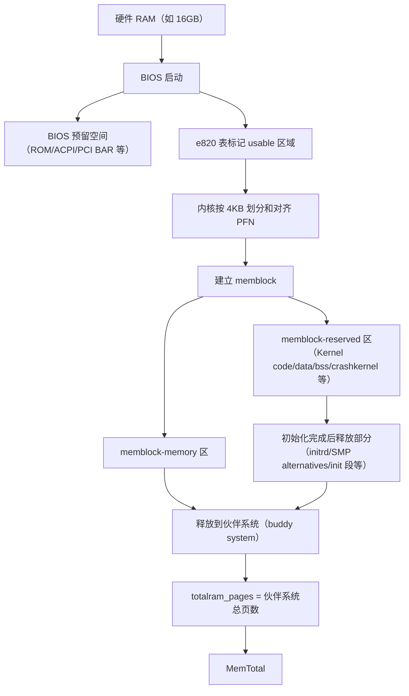
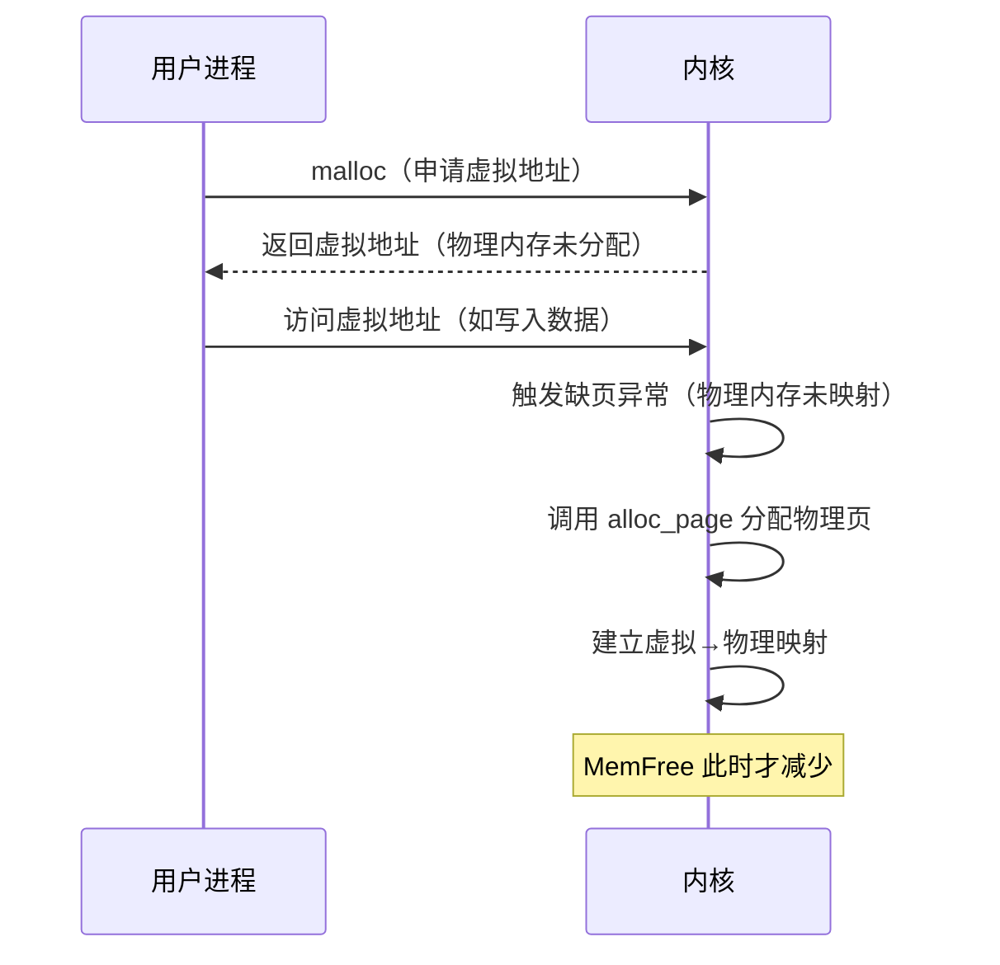
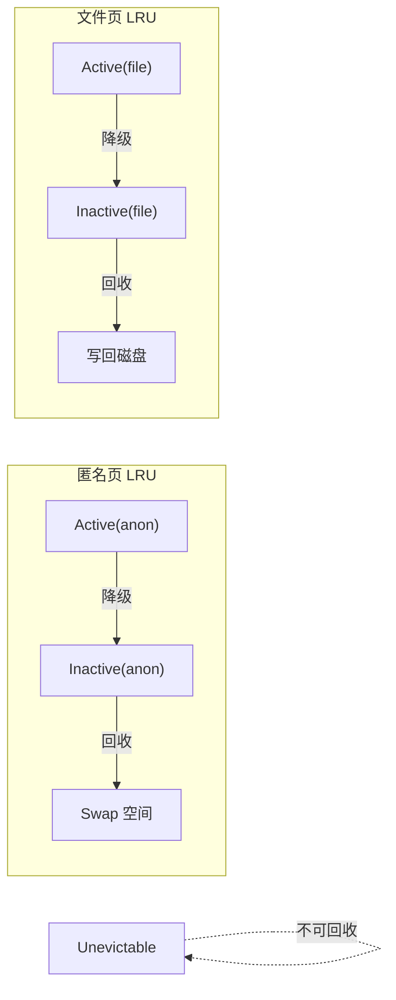
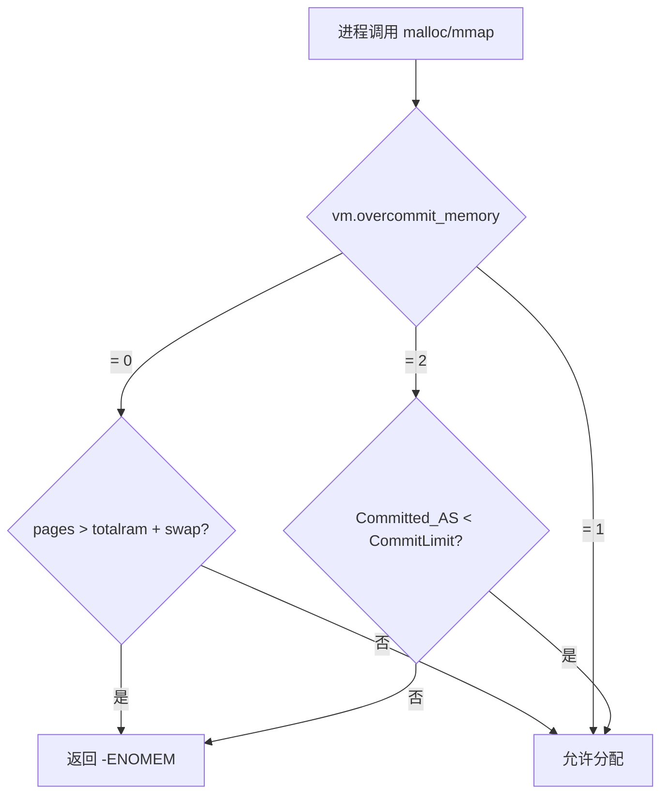
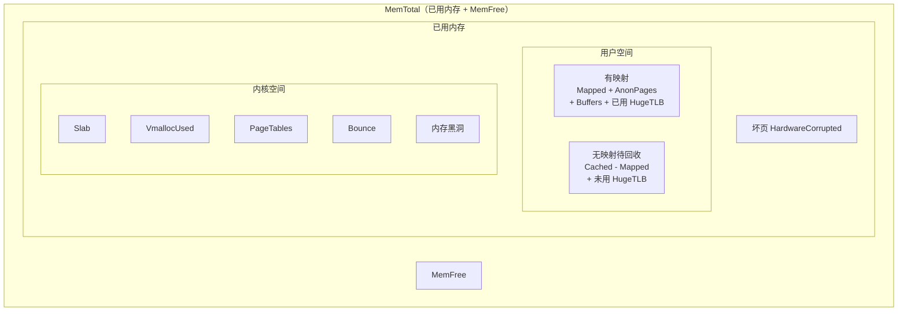

##  0x00    前言

在日常 Linux 系统运维和性能调优中，经常会遇到内存相关的问题

1.	`free` 命令显示内存几乎用光了，但找不到是谁在占用
2.	`16G` 的机器 `MemTotal` 却只显示 `15G`
3.	`malloc` 申请了大块内存但 `MemFree` 并没有减少
4.	dirty dentry cache为何不可回收
5.	OOM的判定机制

本文基于 Linux 内核 [v5.4](https://elixir.bootlin.com/linux/v5.4/source) 版本源码，从 `/proc/meminfo` 的内核实现函数 `meminfo_proc_show()` 出发，逐一解析各字段的含义、数据来源和计算逻辑

-   [Linux procfs 知识点汇总](https://pandaychen.github.io/2024/08/05/A-LINUX-PROC-ALLINONE/)
-   [Linux 内核之旅（二十一）：page cache](https://pandaychen.github.io/2025/11/02/A-LINUX-KERNEL-TRAVEL-21/)
-	[Linux 内核之旅（三）：虚拟内存管理（上）](https://pandaychen.github.io/2024/11/05/A-LINUX-KERNEL-TRAVEL-2/)

本文主要分析如下知识点：

1.  `free` 命令与 `/proc/meminfo` 的对应关系
2.  物理内存 vs 虚拟内存、内核空间 vs 用户空间
3.  `/proc/meminfo` 的内核实现：`meminfo_proc_show` 源码全解
4.  `MemTotal` 的由来：从硬件 RAM 到 `totalram_pages` 的初始化路径
5.  `MemFree` vs `MemAvailable`：`si_mem_available()` 源码分析
6.  用户空间内存分类：AnonPages / Cached / Buffers / Mapped 与 LRU 管理
7.  共享内存（Shmem）分类详解
8.  内核空间内存：Slab / Vmalloc / PageTables 与内存黑洞
9.  Swap 机制、脏页回写、HugeTLB 与 THP
10. 内存计算公式汇总

##  0x01    基础：物理内存 vs 虚拟内存

`meminfo` 中大部分字段是物理内存（比如 `MemTotal`），少部分字段是虚拟内存（比如 `VmallocTotal`）

####    虚拟内存 vs 物理内存

|  | **虚拟内存** | **物理内存** |
|:---:|:---:|:---:|
| **定义** | 进程视角的连续逻辑地址空间 | 硬件内存 |
| **大小** | 由 CPU 寻址位数决定（32 位→4GB，64 位→16EB） | 由硬件规格决定 |

假设系统为 32 位，则每个进程都可以使用 4GB 虚拟内存，但这 4GB 不是随意映射到物理内存的。为了保护物理内存上一些重要数据（如内核代码段等），内核给映射到这些数据的虚拟地址设置了访问权限。**内核进程（运行在内核态）才能访问这段地址，用户进程（运行在用户态）则无法访问**。这段地址称为**内核空间**，剩余地址则是**用户空间**

以 32 位地址空间为例，总共 4GB：`0x00000000` ~ `0xBFFFFFFF` 为用户空间，`0xC0000000` ~ `0xFFFFFFFF` 为内核空间

```text
+---------------------------------+ 0xFFFFFFFF (4GB)
|          内核空间               |     |
+---------------------------------+ 0xC0000000 (3GB)
|           用户空间              |
| +-----------------------------+ |
| |           栈                | | <-- 向低地址增长
| +-----------------------------+ |
| |   内存映射区域 (mmap等)      | |
| +-----------------------------+ |
| |           堆                | | <-- 向高地址增长 (malloc/new)
| +-----------------------------+ |
| |    未初始化数据段 (.bss)     | |
| +-----------------------------+ |
| |    已初始化数据段 (.data)    | |
| +-----------------------------+ |
| |          代码段 (.text)      | |
| +-----------------------------+ | 0x00000000
```

####    内核空间 vs 用户空间

| | **内核空间** | **用户空间** |
|:---:|:---:|:---:|
| **地址范围** | `0xC0000000 ~ 0xFFFFFFFF`（32 位） | `0x00000000 ~ 0xBFFFFFFF`（32 位） |
| **映射对象** | 内核代码段等 | 应用程序代码段、堆、栈等 |
| **访问权限** | 用户进程访问会触发段错误 | 用户进程可操作 |

####    怎样查看内存使用量？

Linux 查看内存占用有以下两种方式，它们没有本质区别：**`free` 的各项值均来自于 `/proc/meminfo`**

```bash
[root@VM-x-x-tencentos ~]# free 
               total        used        free      shared  buff/cache   available
Mem:        16111320     3622952      491188      918540    13257744    12488368
Swap:              0           0 
```

对应关系如下：

| `free` 命令 | `/proc/meminfo` |
|:---|:---|
| Mem: total | `MemTotal` |
| Mem: used | `MemTotal - MemFree`（不同内核版本有差异） |
| Mem: free | `MemFree` |
| Mem: shared | `Shmem` |
| Mem: buff/cache | `Buffers + Cached + Slab` |
| Mem: available | `MemAvailable` |
| Swap: total | `SwapTotal` |
| Swap: used | `SwapTotal - SwapFree` |
| Swap: free | `SwapFree` |

所以**要分析内存使用情况，最终都是看 `/proc/meminfo`**

```text
[root@VM-235-81-tencentos ~]# cat /proc/meminfo 
MemTotal:       16111320 kB
MemFree:          483664 kB
MemAvailable:   12484084 kB
Buffers:         1613500 kB
Cached:         10029856 kB
SwapCached:            0 kB
Active:          5172384 kB
Inactive:        7779824 kB
Active(anon):    1229860 kB
Inactive(anon):   997528 kB
Active(file):    3942524 kB
Inactive(file):  6782296 kB
Unevictable:        1620 kB
Mlocked:               0 kB
SwapTotal:             0 kB
SwapFree:              0 kB
Zswap:                 0 kB
Zswapped:              0 kB
Dirty:               136 kB
Writeback:             0 kB
AnonPages:       1310504 kB
Mapped:          1026680 kB
Shmem:            918536 kB
KReclaimable:    1617624 kB
Slab:            1979004 kB
SReclaimable:    1617624 kB
SUnreclaim:       361380 kB
KernelStack:       14448 kB
PageTables:        17600 kB
SecPageTables:         0 kB
NFS_Unstable:          0 kB
Bounce:                0 kB
WritebackTmp:          0 kB
CommitLimit:     8055660 kB
Committed_AS:    8089572 kB
VmallocTotal:   34359738367 kB
VmallocUsed:       42928 kB
VmallocChunk:          0 kB
Percpu:            38976 kB
HardwareCorrupted:     0 kB
AnonHugePages:         0 kB
ShmemHugePages:        0 kB
ShmemPmdMapped:        0 kB
FileHugePages:     14336 kB
FilePmdMapped:         0 kB
CmaTotal:              0 kB
CmaFree:               0 kB
Unaccepted:            0 kB
HugePages_Total:       0
HugePages_Free:        0
HugePages_Rsvd:        0
HugePages_Surp:        0
Hugepagesize:       2048 kB
Hugetlb:               0 kB
DirectMap4k:      262000 kB
DirectMap2M:    12320768 kB
DirectMap1G:     6291456 kB
```

##  0x02    /proc/meminfo 的内核实现：meminfo_proc_show

`/proc/meminfo` 的全部输出由内核函数 [`meminfo_proc_show()`](https://elixir.bootlin.com/linux/v5.4/source/fs/proc/meminfo.c#L35) 生成。该函数通过 `proc_create_single` 注册到 procfs，当用户 `cat /proc/meminfo` 时被调用

####    注册入口

```c
//https://elixir.bootlin.com/linux/v5.4/source/fs/proc/meminfo.c#L155
static int __init proc_meminfo_init(void)
{
	proc_create_single("meminfo", 0, NULL, meminfo_proc_show);
	return 0;
}
fs_initcall(proc_meminfo_init);
```

####    meminfo_proc_show 核心源码

以下是 `meminfo_proc_show` 的实现：

```c
//https://elixir.bootlin.com/linux/v5.4/source/fs/proc/meminfo.c#L35
static int meminfo_proc_show(struct seq_file *m, void *v)
{
	struct sysinfo i;
	unsigned long committed;
	long cached;
	long available;
	unsigned long pages[NR_LRU_LISTS];
	unsigned long sreclaimable, sunreclaim;
	int lru;

	// 第一步：调用 si_meminfo 填充 sysinfo 结构体
	// 获得 MemTotal / MemFree / Buffers / Shmem 等基础数据
	si_meminfo(&i);
	si_swapinfo(&i);

	// Committed_AS：当前所有进程已申请的虚拟内存总量
	committed = percpu_counter_read_positive(&vm_committed_as);

	// Cached = 全部文件页(NR_FILE_PAGES) - SwapCache - Buffers
	cached = global_node_page_state(NR_FILE_PAGES) -
			total_swapcache_pages() - i.bufferram;
	if (cached < 0)
		cached = 0;

	// 收集 5 个 LRU 列表的页面计数
	for (lru = LRU_BASE; lru < NR_LRU_LISTS; lru++)
		pages[lru] = global_node_page_state(NR_LRU_BASE + lru);

	// MemAvailable 通过专门的 si_mem_available() 计算
	available = si_mem_available();

	sreclaimable = global_node_page_state(NR_SLAB_RECLAIMABLE);
	sunreclaim = global_node_page_state(NR_SLAB_UNRECLAIMABLE);

	// 下面按顺序输出各字段
	show_val_kb(m, "MemTotal:       ", i.totalram);
	show_val_kb(m, "MemFree:        ", i.freeram);
	show_val_kb(m, "MemAvailable:   ", available);
	show_val_kb(m, "Buffers:        ", i.bufferram);
	show_val_kb(m, "Cached:         ", cached);
	show_val_kb(m, "SwapCached:     ", total_swapcache_pages());

	// Active / Inactive 是 anon + file 的聚合
	show_val_kb(m, "Active:         ", pages[LRU_ACTIVE_ANON] +
					   pages[LRU_ACTIVE_FILE]);
	show_val_kb(m, "Inactive:       ", pages[LRU_INACTIVE_ANON] +
					   pages[LRU_INACTIVE_FILE]);
	show_val_kb(m, "Active(anon):   ", pages[LRU_ACTIVE_ANON]);
	show_val_kb(m, "Inactive(anon): ", pages[LRU_INACTIVE_ANON]);
	show_val_kb(m, "Active(file):   ", pages[LRU_ACTIVE_FILE]);
	show_val_kb(m, "Inactive(file): ", pages[LRU_INACTIVE_FILE]);
	show_val_kb(m, "Unevictable:    ", pages[LRU_UNEVICTABLE]);
	show_val_kb(m, "Mlocked:        ", global_zone_page_state(NR_MLOCK));

	show_val_kb(m, "SwapTotal:      ", i.totalswap);
	show_val_kb(m, "SwapFree:       ", i.freeswap);

	// AnonPages 来自 NR_ANON_MAPPED，Mapped 来自 NR_FILE_MAPPED
	show_val_kb(m, "Dirty:          ",
		    global_node_page_state(NR_FILE_DIRTY));
	show_val_kb(m, "Writeback:      ",
		    global_node_page_state(NR_WRITEBACK));
	show_val_kb(m, "AnonPages:      ",
		    global_node_page_state(NR_ANON_MAPPED));
	show_val_kb(m, "Mapped:         ",
		    global_node_page_state(NR_FILE_MAPPED));
	show_val_kb(m, "Shmem:          ", i.sharedram);

	// Slab = SReclaimable + SUnreclaim
	show_val_kb(m, "KReclaimable:   ", sreclaimable +
		    global_node_page_state(NR_KERNEL_MISC_RECLAIMABLE));
	show_val_kb(m, "Slab:           ", sreclaimable + sunreclaim);
	show_val_kb(m, "SReclaimable:   ", sreclaimable);
	show_val_kb(m, "SUnreclaim:     ", sunreclaim);

	// KernelStack / PageTables 来自 zone 级统计
	seq_printf(m, "KernelStack:    %8lu kB\n",
		   global_zone_page_state(NR_KERNEL_STACK_KB));
	show_val_kb(m, "PageTables:     ",
		    global_zone_page_state(NR_PAGETABLE));

	show_val_kb(m, "NFS_Unstable:   ",
		    global_node_page_state(NR_UNSTABLE_NFS));
	show_val_kb(m, "Bounce:         ",
		    global_zone_page_state(NR_BOUNCE));
	show_val_kb(m, "WritebackTmp:   ",
		    global_node_page_state(NR_WRITEBACK_TEMP));

	// CommitLimit 和 Committed_AS
	show_val_kb(m, "CommitLimit:    ", vm_commit_limit());
	show_val_kb(m, "Committed_AS:   ", committed);

	// VmallocTotal 是编译期常量，VmallocUsed 运行时统计
	seq_printf(m, "VmallocTotal:   %8lu kB\n",
		   (unsigned long)VMALLOC_TOTAL >> 10);
	show_val_kb(m, "VmallocUsed:    ", vmalloc_nr_pages());
	show_val_kb(m, "VmallocChunk:   ", 0ul);
	show_val_kb(m, "Percpu:         ", pcpu_nr_pages());

	// HugePages 由 hugetlb_report_meminfo 输出
	hugetlb_report_meminfo(m);
	arch_report_meminfo(m);
	return 0;
}
```

####    si_meminfo：填充基础内存信息

[`si_meminfo()`](https://elixir.bootlin.com/linux/v5.4/source/mm/page_alloc.c#L4911) 是获取系统基础内存信息的核心函数，它填充 `struct sysinfo` 结构体：

```c
//https://elixir.bootlin.com/linux/v5.4/source/mm/page_alloc.c#L4911
void si_meminfo(struct sysinfo *val)
{
	val->totalram = totalram_pages();        // MemTotal 来源
	val->sharedram = global_node_page_state(NR_SHMEM);  // Shmem
	val->freeram = global_zone_page_state(NR_FREE_PAGES); // MemFree
	val->bufferram = nr_blockdev_pages();    // Buffers
	val->totalhigh = totalhigh_pages();
	val->freehigh = nr_free_highpages();
	val->mem_unit = PAGE_SIZE;
}
```

各字段数据来源汇总：

| meminfo 字段 | 内核数据来源 | 说明 |
|:---|:---|:---|
| `MemTotal` | `totalram_pages()` | 系统总可用物理内存页数 |
| `MemFree` | `global_zone_page_state(NR_FREE_PAGES)` | buddy system 中的空闲页 |
| `MemAvailable` | `si_mem_available()` | 估算的可用内存 |
| `Buffers` | `nr_blockdev_pages()` | 块设备元数据缓存 |
| `Cached` | `NR_FILE_PAGES - SwapCache - Buffers` | 文件数据缓存 |
| `SwapCached` | `total_swapcache_pages()` | Swap 缓存 |
| `Active(anon/file)` | `global_node_page_state(NR_LRU_BASE + lru)` | LRU 列表统计 |
| `AnonPages` | `global_node_page_state(NR_ANON_MAPPED)` | 匿名页 |
| `Mapped` | `global_node_page_state(NR_FILE_MAPPED)` | 被映射的文件页 |
| `Shmem` | `global_node_page_state(NR_SHMEM)` | 共享内存 |
| `Slab` | `NR_SLAB_RECLAIMABLE + NR_SLAB_UNRECLAIMABLE` | Slab 分配器 |
| `CommitLimit` | `vm_commit_limit()` | 虚拟内存申请上限 |
| `Committed_AS` | `percpu_counter_read_positive(&vm_committed_as)` | 已申请虚拟内存总量 |
| `VmallocTotal` | `VMALLOC_TOTAL` | vmalloc 地址空间（编译期常量） |
| `VmallocUsed` | `vmalloc_nr_pages()` | vmalloc 已分配页数 |

####    内核统计接口分层

从源码可以看到，meminfo 的数据来源分为两个层次：

-   **`global_zone_page_state()`**：**zone 级别**统计，用于 `NR_FREE_PAGES`、`NR_MLOCK`、`NR_BOUNCE`、`NR_KERNEL_STACK_KB`、`NR_PAGETABLE` 等 zone 敏感的指标
-   **`global_node_page_state()`**：**node 级别**统计，用于 `NR_FILE_PAGES`、`NR_ANON_MAPPED`、`NR_FILE_MAPPED`、`NR_SLAB_RECLAIMABLE`、`NR_FILE_DIRTY` 等全局内存统计

两者均通过 per-CPU 的 `vm_zone_stat[]` 和 `vm_node_stat[]` 数组进行无锁快速读取

todo

##  0x03    MemTotal的疑惑：为什么 16G 机器只显示 15G？

`MemTotal` 来源于 `totalram_pages()`，表示系统总可用物理内存页数。**因为 BIOS 启动和 Kernel 启动都会消耗部分内存，所以 `MemTotal` 必定小于硬件 RAM 规格**

####    MemTotal 初始化流程



####    BIOS 预留与 e820 表

e820 表是 BIOS 提供的物理内存布局信息表，用于描述物理内存各区域的起始地址、大小和类型。可以在 `dmesg` 中查看：

```bash
[root@VM-x-x-tencentos ~]# dmesg | grep -iE "e820|BIOS"
[    0.000000] Command line: BOOT_IMAGE=(hd0,msdos1)/boot/vmlinuz-6.6.47-12.tl4.x86_64 root=UUID=5a22c1c9-bd80-443c-aaa0-214a2d65fc16 ro lsm=lockdown,capability,yama,apparmor,bpf quiet elevator=noop console=ttyS0,115200 console=tty0 vconsole.keymap=us crashkernel=1800M-64G:256M,64G-128G:512M,128G-486G:768M,486G-972G:1024M,972G-:2048M vconsole.font=latarcyrheb-sun16 net.ifnames=0 biosdevname=0 intel_idle.max_cstate=1 intel_pstate=disable iommu=pt amd_iommu=on
[    0.000000] BIOS-provided physical RAM map:
[    0.000000] BIOS-e820: [mem 0x0000000000000000-0x000000000009fbff] usable
[    0.000000] BIOS-e820: [mem 0x000000000009fc00-0x000000000009ffff] reserved
[    0.000000] BIOS-e820: [mem 0x00000000000f0000-0x00000000000fffff] reserved
[    0.000000] BIOS-e820: [mem 0x0000000000100000-0x00000000bffdbfff] usable
[    0.000000] BIOS-e820: [mem 0x00000000bffdc000-0x00000000bfffffff] reserved
[    0.000000] BIOS-e820: [mem 0x00000000feffc000-0x00000000feffffff] reserved
[    0.000000] BIOS-e820: [mem 0x00000000fffc0000-0x00000000ffffffff] reserved
[    0.000000] BIOS-e820: [mem 0x0000000100000000-0x000000043fffffff] usable
[    0.000000] BIOS-e820: [mem 0x000000fd00000000-0x000000ffffffffff] reserved
[    0.000000] SMBIOS 2.8 present.
[    0.000000] DMI: Tencent Cloud CVM, BIOS seabios-1.9.1-qemu-project.org 04/01/2014
[    0.000695] e820: update [mem 0x00000000-0x00000fff] usable ==> reserved
[    0.000698] e820: remove [mem 0x000a0000-0x000fffff] usable
[    0.033083] Kernel command line: BOOT_IMAGE=(hd0,msdos1)/boot/vmlinuz-6.6.47-12.tl4.x86_64 root=UUID=5a22c1c9-bd80-443c-aaa0-214a2d65fc16 ro lsm=lockdown,capability,yama,apparmor,bpf quiet elevator=noop console=ttyS0,115200 console=tty0 vconsole.keymap=us crashkernel=1800M-64G:256M,64G-128G:512M,128G-486G:768M,486G-972G:1024M,972G-:2048M vconsole.font=latarcyrheb-sun16 net.ifnames=0 biosdevname=0 intel_idle.max_cstate=1 intel_pstate=disable iommu=pt amd_iommu=on
[    0.033207] Unknown kernel command line parameters "BOOT_IMAGE=(hd0,msdos1)/boot/vmlinuz-6.6.47-12.tl4.x86_64 biosdevname=0", will be passed to user space.
[    0.249346] PCI: Using E820 reservations for host bridge windows
[    0.371252] e820: reserve RAM buffer [mem 0x0009fc00-0x0009ffff]
[    0.371252] e820: reserve RAM buffer [mem 0xbffdc000-0xbfffffff]
[    1.017468]     biosdevname=0
```

表中被标注为 `reserved` 的区域就是 BIOS 预留空间。BIOS 预留的用途包括：

-   **固件自身运行**：BIOS/UEFI 代码和数据存储（如系统 ROM、Option ROM）
-   **硬件初始化**：PCI/PCIe 设备、显卡、磁盘控制器等的 BAR 空间
-   **系统关键数据**：ACPI 表（DSDT、FADT）、中断描述符表（IDT）、启动参数等

####    Kernel 预留

Kernel 预留是 kernel 启动阶段自身占用的内存（属于 e820 的 `usable` 区域），可以在 `/proc/iomem` 中查看：

```bash
01000000-020011d0 : Kernel code    # 代码段
020011d1-02e5b5bf : Kernel data    # data 段
030e0000-035fffff : Kernel bss     # bss 段
af000000-beffffff : Crash kernel   # 崩溃转储缓冲区
```

####    实际计算示例

对于 16G 机器，内存初始化过程如下：

```text
1. 硬件 RAM 规格:  16777216 KB (16384MB, 16GB)
2. BIOS-e820 检测: BIOS 预留 262673 KB，剩余可用 16514543 KB
3. 建立 memblock: reserve 区 686484 KB, memory 区 15828052 KB
   - Kernel code: 16388 KB
   - Kernel data: 2413 KB
   - Kernel bss:  5248 KB
   - Crash kernel: 262144 KB
   - 其他: 387639 KB
4. 启动后释放 initrd/SMP alternatives 等: 共释放 38744 KB
5. 最终 memory 区释放到伙伴系统: 15866796 KB
   => MemTotal = 15866796 KB (约 15.13GB)
```

##  0x04    MemFree vs MemAvailable：可用内存到底看哪个？

| 指标 | 定义 | 性质 | 组成说明 |
|:---|:---|:---|:---|
| `MemFree` | 真正空闲的内存 | **确定值** | 直接来自 buddy system（`NR_FREE_PAGES`） |
| `MemAvailable` | 空闲内存 + 可快速回收内存 | **估算值** | `MemFree + 可回收的文件页 + 可回收的 Slab`（按权重） |

####    si_mem_available 源码分析

[`si_mem_available()`](https://elixir.bootlin.com/linux/v5.4/source/mm/page_alloc.c#L4865) 是计算 `MemAvailable` 的核心函数：

```c
//https://elixir.bootlin.com/linux/v5.4/source/mm/page_alloc.c#L4865
long si_mem_available(void)
{
	long available;
	unsigned long pagecache;
	unsigned long wmark_low = 0;
	unsigned long pages[NR_LRU_LISTS];
	unsigned long reclaimable;
	struct zone *zone;
	int lru;

	for (lru = LRU_BASE; lru < NR_LRU_LISTS; lru++)
		pages[lru] = global_node_page_state(NR_LRU_BASE + lru);

	// 汇总所有 zone 的低水位线
	for_each_zone(zone)
		wmark_low += low_wmark_pages(zone);

	// 起点：空闲页 - 保留页（totalreserve_pages 是内核预留的不可分配页）
	available = global_zone_page_state(NR_FREE_PAGES) - totalreserve_pages;

	// 加入可回收的文件页缓存（至少保留一半或低水位量的缓存）
	pagecache = pages[LRU_ACTIVE_FILE] + pages[LRU_INACTIVE_FILE];
	pagecache -= min(pagecache / 2, wmark_low);
	available += pagecache;

	// 加入可回收的 Slab 和其他内核可回收内存（同样保留一半或低水位量）
	reclaimable = global_node_page_state(NR_SLAB_RECLAIMABLE) +
			global_node_page_state(NR_KERNEL_MISC_RECLAIMABLE);
	available += reclaimable - min(reclaimable / 2, wmark_low);

	if (available < 0)
		available = 0;
	return available;
}
```

用公式表示：

```text
MemAvailable = NR_FREE_PAGES - totalreserve_pages
             + (pagecache - min(pagecache/2, wmark_low))
             + (reclaimable - min(reclaimable/2, wmark_low))

其中:
  pagecache  = Active(file) + Inactive(file)
  reclaimable = SReclaimable + NR_KERNEL_MISC_RECLAIMABLE
```

**关键设计思想**：`MemAvailable` 不是简单地将所有可回收内存加到 `MemFree` 上，而是假设至少需要保留一半的文件缓存和 Slab，以避免过度回收导致系统频繁 I/O

####    OOM 是参考 MemFree 还是 MemAvailable？

**主要参考 `MemFree`**。OOM 是在内存回收无法回收足够内存后触发的，而内存回收的触发指标是 `MemFree`（即 `NR_FREE_PAGES` 低于各 zone 的水位线 watermark）

##  0x05    用户空间内存：文件页与匿名页

Linux 将用户空间使用的物理内存页分为**文件页**和**匿名页**：

-   **文件页**：有文件背景的页，必与磁盘上某个文件关联（如打开的文件内容、代码段等）
-   **匿名页**：没有文件背景的页，与磁盘上的文件无关联（如进程堆、栈）

####    为什么 malloc 后 MemFree 没有立刻变小？

前文已知，根本原因是**`malloc()` 仅分配虚拟内存，并没有分配物理页。在首次访问时才通过缺页异常分配物理页**



####    meminfo 中的用户空间相关指标

| 指标 | 类型 | 说明 | 内核数据来源 |
|:---|:---|:---|:---|
| `Cached` | 文件页（数据） | 缓存文件数据，包含无映射待回收和有映射（Mapped）两部分 | `NR_FILE_PAGES - SwapCache - Buffers` |
| `Buffers` | 文件页（元数据） | 缓存文件元数据（如目录结构、inode） | `nr_blockdev_pages()` |
| `Mapped` | 文件页（活跃） | `Cached` 的子集，进程正在映射使用的文件 | `NR_FILE_MAPPED` |
| `AnonPages` | 匿名页 | 无文件背景的内存（如堆、栈） | `NR_ANON_MAPPED` |

关键关系：

```text
文件页总和 = Cached + Buffers
匿名页总和 = AnonPages
用户进程总占用（PSS 之和）≈ Mapped + AnonPages
```

####    进程内存使用量指标

| 指标 | 全称 | 说明 |
|:---|:---|:---|
| VSS | Virtual Set Size | 进程虚拟地址空间总大小（含未映射部分），不反映实际物理占用 |
| RSS | Resident Set Size | 进程实际占用物理内存（含共享库全部占用），大于等于实际占用 |
| PSS | Proportional Set Size | 物理内存按比例分配值（共享内存均摊），约等于实际占用 |
| USS | Unique Set Size | 进程独占的物理内存，小于等于实际占用 |

其中 **PSS 最准确**，可通过以下命令计算所有用户进程总占用：

```bash
grep Pss /proc/[0-9]*/smaps | awk '{a+=$2}; END {print a " kB"}'
```

####    LRU 分级管理

为了高效回收内存，内核采用 LRU（Least Recently Used）算法对用户空间物理页进行分级管理，划分为 5 个 LRU 列表。在 `meminfo_proc_show` 中，这 5 个列表的统计通过遍历 `NR_LRU_BASE + lru` 获得：

| 指标 | 说明 | 回收方式 |
|:---|:---|:---|
| `Active(anon)` | 活跃匿名页 - 近期被访问 | 先移动到 `Inactive(anon)`，再交换到 swap |
| `Inactive(anon)` | 非活跃匿名页 - 长期未访问 | 交换到 swap |
| `Active(file)` | 活跃文件页 - 频繁使用 | 先移动到 `Inactive(file)`，再写回磁盘 |
| `Inactive(file)` | 非活跃文件页 - 较少访问 | 写回磁盘 |
| `Unevictable` | 锁定页（mlock/ramfs 等） | **不可回收** |



**关键等式**（注意 `Shmem` 的归属）：

```text
Active  = Active(anon) + Active(file)
Inactive = Inactive(anon) + Inactive(file)

// AnonPages 不等于 Active(anon) + Inactive(anon)
// 因为 Shmem 虽然以 swap 方式回收，但不算匿名页
AnonPages = Active(anon) + Inactive(anon) - Shmem

// Cached + Buffers 不等于 Active(file) + Inactive(file)
// 因为 Shmem 虽然计入 Cached，但以 swap 方式回收
Cached + Buffers = Active(file) + Inactive(file) + Shmem
```

##  0x06    Shmem：共享内存分类详解

`Shmem` 是共享内存的总量。需要区分**共享库**和**共享内存**：

| 类型 | 本质 | 核心目的 |
|:---|:---|:---|
| **共享库** | 多进程共享同一磁盘库文件的文件页缓存（Cache） | 减少资源占用 |
| **共享内存** | 进程显式在物理内存中创建一块区域供多进程访问 | 进程间通信 |

####    共享内存的四种类型

| 类型 | 标识方式 | 创建方法 | 查看方式 |
|:---|:---|:---|:---|
| **System V 共享内存** | 整型 key | `shmget` + `shmat` | `ipcs -m` |
| **tmpfs/devtmpfs** | 文件名 | `mount -t tmpfs` + 文件读写 | `df -h` |
| **POSIX 共享内存** | 文件名 | `shm_open` + `mmap`（本质是 `/dev/shm` 下 tmpfs） | `df -h /dev/shm` |
| **匿名共享内存** | 无显式标识 | `mmap` + `MAP_SHARED|MAP_ANONYMOUS` | `grep '/dev/zero' /proc/*/maps` |

在 `si_meminfo` 源码中，`Shmem` 直接取自 `NR_SHMEM`：

```c
val->sharedram = global_node_page_state(NR_SHMEM);
```

`NR_SHMEM` 在 `shmem_add_to_page_cache` 等[函数](https://elixir.bootlin.com/linux/v5.4.241/source/mm/shmem.c#L611)中递增，覆盖上述所有共享内存类型（只要页面加入了 tmpfs/shmem 文件系统的 page cache）

todo

##  0x07    内核空间内存：Slab / Vmalloc / PageTables

内核空间的内存占用包括以下几类：

####    Slab 分配器

| 指标 | 定义 | 内核数据来源 |
|:---|:---|:---|
| `Slab` | Slab 分配器分配的内存总量 | `NR_SLAB_RECLAIMABLE + NR_SLAB_UNRECLAIMABLE` |
| `SReclaimable` | 可回收部分（dentry/inode cache 等） | `NR_SLAB_RECLAIMABLE` |
| `◊` | 不可回收部分（skbuff/task_struct 等） | `NR_SLAB_UNRECLAIMABLE` |

在源码中的输出：

```c
//https://elixir.bootlin.com/linux/v5.4/source/fs/proc/meminfo.c#L103
show_val_kb(m, "Slab:           ", sreclaimable + sunreclaim);
show_val_kb(m, "SReclaimable:   ", sreclaimable);
show_val_kb(m, "SUnreclaim:     ", sunreclaim);
```

Slab 分配的内存还包括：
-   `KernelStack`：进程内核栈，进程创建时分配，销毁时释放（来自 `NR_KERNEL_STACK_KB`）
-   `Percpu`：Per-CPU 变量内存（来自 `pcpu_nr_pages()`）

**当 `SUnreclaim` 超过 `MemTotal` 的 10% 时，大概率存在 Slab 泄露**，可用 `slabtop` 或 `/proc/slabinfo` 排查

todo

####    Vmalloc

| 指标 | 定义 | 内核数据来源 |
|:---|:---|:---|
| `VmallocTotal` | vmalloc 可分配的虚拟地址空间总大小 | `VMALLOC_TOTAL`（编译期常量） |
| `VmallocUsed` | 当前已通过 vmalloc 分配的页数 | `vmalloc_nr_pages()` |
| `VmallocChunk` | 最大连续可分配块（v5.4 已固定输出 `0`） | 硬编码为 `0ul` |

在源码中：

```c
//https://elixir.bootlin.com/linux/v5.4/source/fs/proc/meminfo.c#L122
seq_printf(m, "VmallocTotal:   %8lu kB\n",
	   (unsigned long)VMALLOC_TOTAL >> 10);
show_val_kb(m, "VmallocUsed:    ", vmalloc_nr_pages());
show_val_kb(m, "VmallocChunk:   ", 0ul);
```

vmalloc 的分配流程：先申请虚拟地址空间，再逐页调用 `alloc_page` 分配物理页并建立页表映射

####    PageTables 和 Bounce

| 指标 | 定义 | 内核数据来源 |
|:---|:---|:---|
| `PageTables` | 进程页表占用的内存 | `NR_PAGETABLE` |
| `Bounce` | DMA 缓冲区（适配老式 24 位寻址设备） | `NR_BOUNCE` |

####    内存黑洞

**内存黑洞是直接使用 `alloc_page` 分配但未被任何指标统计的内存**。`alloc_page` 接口本身只负责分配物理页，没有统计功能。如果调用者也不主动统计，这些内存将无法体现在任何指标上，成为不可追踪的**黑户**

内核总占用计算公式：

```text
内核总占用 = Slab + VmallocUsed + PageTables + Bounce + 内存黑洞
```

##  0x08    Swap 机制与 CommitLimit

####    Swap 机制

Swap 机制就是在磁盘（或 zram）上建立一个空间，当内存不够时，系统把内存中部分匿名页（注意不是文件页）迁到磁盘上以腾出空间，现网环境默认是关闭swap机制的

| 指标 | 定义 | 内核数据来源 |
|:---|:---|:---|
| `SwapTotal` | Swap 空间总大小 | `si_swapinfo() -> i.totalswap` |
| `SwapFree` | 未使用的 Swap 空间 | `si_swapinfo() -> i.freeswap` |
| `SwapCached` | 曾被换出又被换入但仍保留在 Swap 中的页 | `total_swapcache_pages()` |

`SwapCached` 的意义：当匿名页被换出到 Swap 后又被访问（换入），如果 Swap 中的副本未被覆盖，内核会保留这份 SwapCache。下次如果同一页再次需要被换出，可以直接标记而无需重新写入磁盘

####    CommitLimit 与 overcommit 控制

**CommitLimit 机制用于限制虚拟内存申请量**，防止系统过度承诺

[`vm_commit_limit()`](https://elixir.bootlin.com/linux/v5.4/source/mm/util.c#L648) 的计算逻辑：

```c
//https://elixir.bootlin.com/linux/v5.4/source/mm/util.c#L648
unsigned long vm_commit_limit(void)
{
	unsigned long allowed;

	if (sysctl_overcommit_kbytes)
		allowed = sysctl_overcommit_kbytes >> (PAGE_SHIFT - 10);
	else
		allowed = ((totalram_pages() - hugetlb_total_pages())
			   * sysctl_overcommit_ratio / 100);
	allowed += total_swap_pages;

	return allowed;
}
```

即：`CommitLimit = (MemTotal - HugePages_Total * Hugepagesize) * overcommit_ratio / 100 + SwapTotal`

[`__vm_enough_memory()`](https://elixir.bootlin.com/linux/v5.4/source/mm/util.c#L698) 是内存申请时的检查函数：

```c
//https://elixir.bootlin.com/linux/v5.4/source/mm/util.c#L698
int __vm_enough_memory(struct mm_struct *mm, long pages, int cap_sys_admin)
{
	long allowed;

	vm_acct_memory(pages);  // 先将申请量累加到 vm_committed_as

	// overcommit_memory = 1：无任何限制，总是允许
	if (sysctl_overcommit_memory == OVERCOMMIT_ALWAYS)
		return 0;

	// overcommit_memory = 0（默认）：启发式检查
	if (sysctl_overcommit_memory == OVERCOMMIT_GUESS) {
		if (pages > totalram_pages() + total_swap_pages)
			goto error;
		return 0;
	}

	// overcommit_memory = 2：严格按 CommitLimit 检查
	allowed = vm_commit_limit();
	if (!cap_sys_admin)
		allowed -= sysctl_admin_reserve_kbytes >> (PAGE_SHIFT - 10);

	if (mm) {
		long reserve = sysctl_user_reserve_kbytes >> (PAGE_SHIFT - 10);
		allowed -= min_t(long, mm->total_vm / 32, reserve);
	}

	if (percpu_counter_read_positive(&vm_committed_as) < allowed)
		return 0;

error:
	vm_unacct_memory(pages);    // 申请失败，回退计数
	return -ENOMEM;
}
```

三种 overcommit 策略：

| `vm.overcommit_memory` | 行为 |
|:---|:---|
| `0`（默认） | 启发式检查：申请量不超过 `MemTotal + SwapTotal` 即允许 |
| `1` | 无限制：总是允许 |
| `2` | 严格模式：`Committed_AS` 不超过 `CommitLimit` 才允许 |



##  0x09    脏页与回写机制

脏页（Dirty Page）是已被修改但尚未写回磁盘的内存页

####    脏页生命周期


####    脏页相关指标

| 指标 | 定义 | 内核数据来源 |
|:---|:---|:---|
| `Dirty` | 标记为 Dirty 但未加入 Writeback 队列的页 | `NR_FILE_DIRTY` |
| `Writeback` | 正在写回磁盘的页 | `NR_WRITEBACK` |
| `WritebackTmp` | 写回过程中创建的临时页 | `NR_WRITEBACK_TEMP` |
| `NFS_Unstable` | NFS 客户端已发送给服务端但未确认落盘的页 | `NR_UNSTABLE_NFS` |

**总脏页 = Dirty + Writeback + NFS_Unstable**

##  0x0A    HugeTLB vs THP

两者都是内存大页机制，但工作方式不同：

| 机制 | HugeTLB（标准大页） | THP（透明大页） |
|:---|:---|:---|
| **引入版本** | Linux 2.6 | Linux 2.6.38 |
| **原理** | 内核预先分配大页池，用户进程显式使用 `mmap` + `MAP_HUGETLB` | 内核自动合并物理页为大页，对应用透明 |
| **配置方式** | 手动配置池大小和代码适配 | 默认开启，通过 `/sys/kernel/mm/transparent_hugepage/` 配置 |
| **统计归属** | 独立统计，不计入进程 PSS | 匿名 THP 计入 `AnonPages` |

####    HugeTLB 指标

这些指标由 `hugetlb_report_meminfo()` 函数输出：

| 指标 | 说明 |
|:---|:---|
| `HugePages_Total` | 大页池总页数 |
| `HugePages_Free` | 大页池中未分配的页数 |
| `HugePages_Rsvd` | 已预申请但未实际分配的页数 |
| `HugePages_Surp` | 超额分配的大页数 |
| `Hugepagesize` | 大页大小（通常 2MB） |
| `Hugetlb` | 大页池总内存 = `HugePages_Total * Hugepagesize` |

####    THP 指标

这些指标在 `CONFIG_TRANSPARENT_HUGEPAGE` 启用时输出：

| 指标 | 说明 |
|:---|:---|
| `AnonHugePages` | 匿名 THP 数量，已包含在 `AnonPages` 中 |
| `ShmemHugePages` | 共享内存中使用的 THP 数量 |
| `ShmemPmdMapped` | 已映射到用户空间的共享 THP 数量 |
| `FileHugePages` | 文件相关 THP 数量 |
| `FilePmdMapped` | 已映射到用户空间的文件 THP 数量 |

##  0x0B    内存计算公式汇总

####    用户空间

```text
用户空间总占用 = Cached + Buffers + AnonPages + Hugetlb
用户进程使用 = 所有进程 PSS 之和 ≈ Mapped + AnonPages
用户空间已映射 = Mapped + AnonPages + Buffers + 已用 Hugetlb
用户空间无映射待回收 = Cached - Mapped + 未用 Hugetlb

匿名页 = Active(anon) + Inactive(anon) - Shmem = AnonPages
文件页 = Active(file) + Inactive(file) + Shmem = Cached + Buffers

脏页 = Dirty + Writeback + NFS_Unstable
```

####    内核空间

```text
内核空间使用 = Slab + VmallocUsed + PageTables + Bounce + 内存黑洞
```

####    已用内存

```text
已用内存 = 用户空间 + 内核空间 + 坏页
        = AnonPages + Cached + Buffers + Hugetlb
          + Slab + VmallocUsed + Bounce + PageTables
          + 内存黑洞 + HardwareCorrupted
```

####    内存分类全景图



##  0x0C    参考

-   [Linux Kernel Documentation: /proc/meminfo](https://www.kernel.org/doc/Documentation/filesystems/proc.txt)
-   [meminfo_proc_show - Linux v5.4 源码](https://elixir.bootlin.com/linux/v5.4/source/fs/proc/meminfo.c#L35)
-   [si_meminfo - Linux v5.4 源码](https://elixir.bootlin.com/linux/v5.4/source/mm/page_alloc.c#L4911)
-   [si_mem_available - Linux v5.4 源码](https://elixir.bootlin.com/linux/v5.4/source/mm/page_alloc.c#L4865)
-   [__vm_enough_memory - Linux v5.4 源码](https://elixir.bootlin.com/linux/v5.4/source/mm/util.c#L698)
-   [vm_commit_limit - Linux v5.4 源码](https://elixir.bootlin.com/linux/v5.4/source/mm/util.c#L648)
-   [Linux Kernel Documentation: overcommit-accounting](https://www.kernel.org/doc/Documentation/vm/overcommit-accounting.rst)
-   [Linux Kernel Documentation: hugetlbpage](https://www.kernel.org/doc/Documentation/vm/hugetlbpage.txt)