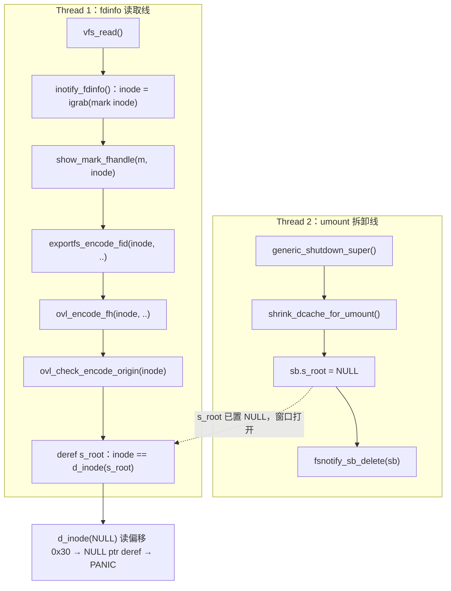
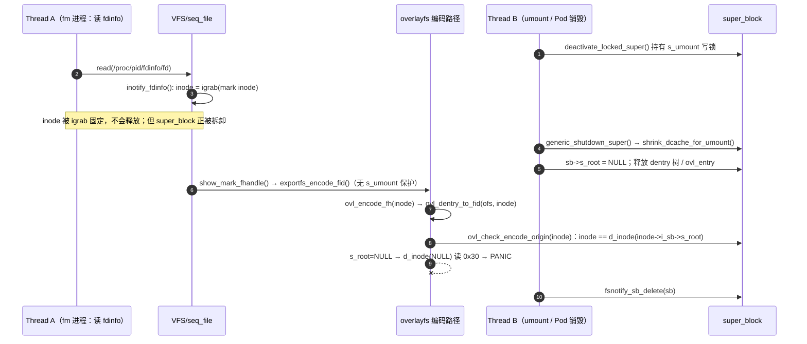
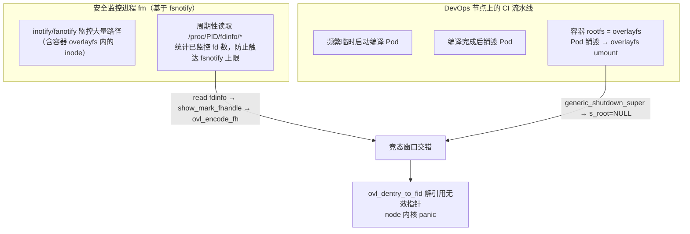

##  0x00    前言

本文分析 [CVE-2025-40237](https://nvd.nist.gov/vuln/detail/CVE-2025-40237)，一个比较典型的内核竞态漏洞，描述如下：

**当一个 `inotify`/`fanotify` 句柄正在监控 overlayfs 上的 inode，而这个 overlayfs 恰好正在被 `umount` 时，读取该句柄的 `/proc/<pid>/fdinfo/<fd>` 会解引用一个已经被拆卸/置空的指针，触发内核空指针解引用（CWE-476）并 panic**

本文的分析基线是 **v6.6.98**（与笔者现网机器 `6.6.92-34.1.tl4.x86_64` 同处受影响区间），并对照官方修复补丁。核心内容如下：

- 结合内核源码，还原竞态的两条执行线与精确触发点
- 给出官方修复代码及设计取舍说明
- 现网 panic review
- 未升级前的缓解方案

> 源码约定：本文引用的所有代码均标注文件与版本；`fs/notify/fdinfo.c`、`fs/overlayfs/export.c` 取自 v6.6.98，修复补丁取自 6.6 稳定分支（`bc1c6b803e14`，6.6.115 合入）与官方 patch

先看现网 panic 现场，如下图所示：


现场关键行解读：

- `BUG: kernel NULL pointer dereference, address: 0000000000000030`：访问了 `0x30` 这个近 NULL 地址；`error_code(0x0000)` 且 `supervisor read access` 说明是**内核态的读取**
- `CPU: 2 PID: 16359 Comm: fm`：崩在一个名为 `fm` 的进程上下文（即现网的安全监控进程），它正在读取文件
- `RIP: 0010:ovl_dentry_to_fid+0x60/0x1f0 [overlay]`：崩溃指令位于 overlayfs 模块的 `ovl_dentry_to_fid()`
- Call Trace：`ovl_encode_fh` → `ovl_dentry_to_fid` → `show_mark_fhandle`（截图下方还可见 `ovl_encode_fh+0x3d/0x70 [overlay]`、`show_mark_fhandle+0x4e/0xd0`），与官方 race 的调用链完全一致

后文会把 `address 0x30` 精确对应到 `struct dentry.d_inode` 字段偏移

##  0x01    背景说明：三个关键机制

要看懂这个 CVE，需要先理清三块内核机制如何在一次 `read()` 中被串起来

####    1、fsnotify 与 fdinfo 导出

`inotify`/`fanotify` 通过一个匿名 fd 对外，内核为它们实现了 `proc_ops`/`file_operations` 的 `show_fdinfo` 回调。当用户读取 `/proc/<pid>/fdinfo/<fd>` 时，seq_file 框架会调用到 `inotify_show_fdinfo()` / `fanotify_show_fdinfo()`，遍历该 group 上挂着的所有 `fsnotify_mark`，逐条打印。对每个监控在 inode 上的 mark，还会调用 `show_mark_fhandle()` 打印该 inode 的 **file handle（NFS 导出用的 fid）**

####    2、exportfs / file handle 编码

`show_mark_fhandle()` 调用 `exportfs_encode_fid()`，本质是问底层文件系统：请把这个 inode 编码成一个可持久化、可跨挂载/重启重新解析的 file handle。不同文件系统实现各自的 `export_operations->encode_fh`。对于 overlayfs，就是 `ovl_encode_fh()`

####    3、overlayfs 的 fid 编码

前文介绍过，overlayfs 是叠加文件系统（upper + lower），它的 file handle 编码需要判断这个对象应该用 **upper** 层还是 **lower** 层的真实 fid 来表示，并在某些目录场景下为了「可解码」而 copy-up 祖先。相关逻辑集中在 `fs/overlayfs/export.c` 的 `ovl_encode_fh` → `ovl_dentry_to_fid` → `ovl_check_encode_origin`（v6.6.98 版本上均以 `struct inode *` 为入参）。而这些判断会访问 inode 的 upper/lower 状态，以及 `inode->i_sb->s_root`（superblock 的根 dentry）等状态

一句话串起来：**读 fdinfo → 编码 file handle → overlayfs 去访问 super_block / dentry 树的状态**。问题就出在最后这步访问的对象，可能正在被 `umount` 并发销毁

####	procfs：fdinfo
比如，`4022596`是一个启用了fsnotify机制的进程，那么相关的fdinfo数据格式大致如下：

```bash
[root@VM-x-x-tencentos ~]# ls /proc/4022596/fdinfo/
0  1  2  3  4  5
[root@VM-x-x-tencentos ~]# cat /proc/4022596/fdinfo/0
pos:    0
flags:  02
mnt_id: 34
ino:    10
[root@VM-x-x-tencentos ~]# cat /proc/4022596/fdinfo/1
pos:    0
flags:  02
mnt_id: 34
ino:    10
[root@VM-x-x-tencentos ~]# cat /proc/4022596/fdinfo/2
pos:    0
flags:  02
mnt_id: 34
ino:    10
[root@VM-x-x-tencentos ~]# cat /proc/4022596/fdinfo/3
pos:    0
flags:  02004000
mnt_id: 16
ino:    1059
inotify wd:1 ino:86567 sdev:fd00001 mask:fc6 ignored_mask:0 fhandle-bytes:8 fhandle-type:1 f_handle:676508005259ab53
[root@VM-x-x-tencentos ~]# cat /proc/4022596/fdinfo/4
pos:    0
flags:  02000002
mnt_id: 16
ino:    1059
tfd:        3 events: 8000201d data: 7f6bd87056800001  pos:0 ino:423 sdev:f
tfd:        5 events:       19 data:           5bb0d8  pos:0 ino:423 sdev:f
[root@VM-x-x-tencentos ~]# cat /proc/4022596/fdinfo/5
pos:    0
flags:  02004002
mnt_id: 16
ino:    1059
eventfd-count:                0
eventfd-id: 40
eventfd-semaphore: 0
```

todo

##  0x02    根因分析：两条执行线的竞态

本文漏洞的本质是一个经典的 **无锁保护的并发访问**问题：`show_mark_fhandle()` 在调用 `exportfs_encode_fid()` 时，**没有持有 `s_umount` 锁**，因此无法与 `umount` 路径串行化

官方 commit message 给出的 race 图如下：

```text
Thread 1                           Thread 2
--------                           --------

generic_shutdown_super()
 shrink_dcache_for_umount
  sb->s_root = NULL
                    |
                    |             vfs_read()
                    |              inotify_fdinfo()
                    |               * inode get from mark *
                    |               show_mark_fhandle(m, inode)
                    |                exportfs_encode_fid(inode, ..)
                    |                 ovl_encode_fh(inode, ..)
                    |                  ovl_check_encode_origin(inode)
                    |                   * deref i_sb->s_root *
                    |
                    v
 fsnotify_sb_delete(sb)
```

把这张官方的原始竞态图转成 mermaid（左侧 umount 拆卸线、右侧 fdinfo 读取线，中间为交错时刻），如下：



再用时序图刻画两个线程的交错与崩溃点：



####    1、umount调用路径（线）（Thread B：umount）

Pod 销毁触发容器 rootfs 的 overlayfs `umount`，内核路径为 `deactivate_locked_super()`（**此处已持有 `s_umount` 写锁**）→ `generic_shutdown_super()` → `shrink_dcache_for_umount(sb)`，后者会**把 `sb->s_root` 置为 NULL 并拆除整棵 dentry 树**（释放 dentry、`ovl_entry` 等私有状态），最后走到 `fsnotify_sb_delete(sb)` 清理 marks

关键点：**在 `shrink_dcache_for_umount()` 把 `s_root` 置空、并开始释放 dentry 树之后，`fsnotify_sb_delete()` 之前，存在一个时间窗口**

####    2、读取路径（线）（Thread A：fdinfo）

`fdinfo` 读取路径（`fs/notify/fdinfo.c`，v6.6.98，源码：[fdinfo.c#L74-L92](https://github.com/gregkh/linux/blob/v6.6.98/fs/notify/fdinfo.c#L74-L92)）：

```c
//https://elixir.bootlin.com/linux/v6.6.98/source/fs/notify/fdinfo.c#L74
static void inotify_fdinfo(struct seq_file *m, struct fsnotify_mark *mark)
{
	struct inotify_inode_mark *inode_mark;
	struct inode *inode;

	if (mark->connector->type != FSNOTIFY_OBJ_TYPE_INODE)
		return;

	inode_mark = container_of(mark, struct inotify_inode_mark, fsn_mark);
	inode = igrab(fsnotify_conn_inode(mark->connector));   // 固定 inode
	if (inode) {
		seq_printf(m, "inotify wd:%x ino:%lx sdev:%x mask:%x ignored_mask:0 ",
			   inode_mark->wd, inode->i_ino, inode->i_sb->s_dev,
			   inotify_mark_user_mask(mark));
		show_mark_fhandle(m, inode);                       // 进入 file handle 编码
		seq_putc(m, '\n');
		iput(inode);
	}
}

//https://elixir.bootlin.com/linux/v6.6.98/source/fs/inode.c#L1459
struct inode *igrab(struct inode *inode)
{
	//lock inode
	spin_lock(&inode->i_lock);
	if (!(inode->i_state & (I_FREEING|I_WILL_FREE))) {
		__iget(inode);
		spin_unlock(&inode->i_lock);
	} else {
		spin_unlock(&inode->i_lock);
		/*
		 * Handle the case where s_op->clear_inode is not been
		 * called yet, and somebody is calling igrab
		 * while the inode is getting freed.
		 */
		inode = NULL;
	}
	return inode;
}
```

`igrab()` 只固定住了 **inode**，但**没有、也无法阻止其所在 super_block 被 umount 拆卸**（umount 不会因为某个 inode 被 grab 就中止；`generic_shutdown_super` 依然会推进）。于是拿着一个**活的 inode + 正在被销毁的 super_block**进入编码

核心缺陷函数 `show_mark_fhandle()`（v6.6.98，**注意此处没有任何 `s_umount` 保护**，源码：[fdinfo.c#L42-L65](https://github.com/gregkh/linux/blob/v6.6.98/fs/notify/fdinfo.c#L42-L65)）：

```c
#if defined(CONFIG_EXPORTFS)
static void show_mark_fhandle(struct seq_file *m, struct inode *inode)
{
	struct {
		struct file_handle handle;
		u8 pad[MAX_HANDLE_SZ];
	} f;
	int size, ret, i;

	f.handle.handle_bytes = sizeof(f.pad);
	size = f.handle.handle_bytes >> 2;

	/* 缺陷：直接编码，未与 umount 串行化 */
	ret = exportfs_encode_fid(inode, (struct fid *)f.handle.f_handle, &size);
	if ((ret == FILEID_INVALID) || (ret < 0)) {
		WARN_ONCE(1, "Can't encode file handler for inotify: %d\n", ret);
		return;
	}
	...
}
#endif
```

####    3、崩溃点：overlayfs 编码时解引用被拆卸的 `s_root`

> 关键：v6.6.98 上 overlayfs 的编码入口在 backport `f0c0ac84de17`（即 mainline `c45beebfde34`「support encoding fid from inode with no alias」）之后，已经**改为直接从 `inode` 出发**，`ovl_dentry_to_fid()`/`ovl_check_encode_origin()` 的形参都是 `struct inode *` 而非 `struct dentry *`。这正是本 CVE 的引入点，务必以此版本为准

`exportfs_encode_fid()` 最终转到 `ovl_encode_fh()`（`fs/overlayfs/export.c`，v6.6.98，源码：[export.c#L275-L294](https://github.com/gregkh/linux/blob/v6.6.98/fs/overlayfs/export.c#L275-L294)）：

todo

```c
static int ovl_encode_fh(struct inode *inode, u32 *fid, int *max_len,
			 struct inode *parent)
{
	struct ovl_fs *ofs = OVL_FS(inode->i_sb);
	int bytes, buflen = *max_len << 2;

	/* TODO: encode connectable file handles */
	if (parent)
		return FILEID_INVALID;

	bytes = ovl_dentry_to_fid(ofs, inode, fid, buflen);   // 直接用 inode（无需 alias）
	if (bytes <= 0)
		return FILEID_INVALID;
	...
}
```

`ovl_dentry_to_fid()` 调用 `ovl_check_encode_origin(inode)`（v6.6.98，源码：[export.c#L239-L273](https://github.com/gregkh/linux/blob/v6.6.98/fs/overlayfs/export.c#L239-L273)）：

```c
//https://elixir.bootlin.com/linux/v6.6.98/source/fs/overlayfs/export.c#L239
static int ovl_dentry_to_fid(struct ovl_fs *ofs, struct inode *inode,
			     u32 *fid, int buflen)
{
	struct ovl_fh *fh = NULL;
	int err, enc_lower;
	int len;

	//https://elixir.bootlin.com/linux/v6.6.98/source/fs/overlayfs/export.c#L250
	err = enc_lower = ovl_check_encode_origin(inode);   // ← 崩溃在这里
	if (enc_lower < 0)
		goto fail;
	...
}
```

真正解引用被拆卸状态的是 `ovl_check_encode_origin()`（v6.6.98，源码：[export.c#L184-L237](https://github.com/gregkh/linux/blob/v6.6.98/fs/overlayfs/export.c#L184-L237)）：

```c
//https://elixir.bootlin.com/linux/v6.6.98/source/fs/overlayfs/export.c#L184
static int ovl_check_encode_origin(struct inode *inode)
{
	struct ovl_fs *ofs = OVL_FS(inode->i_sb);
	bool decodable = ofs->config.nfs_export;
	struct dentry *dentry;
	int err;

	/* No upper layer? */
	if (!ovl_upper_mnt(ofs))
		return 1;

	/* Lower file handle for non-upper non-decodable */
	if (!ovl_inode_upper(inode) && !decodable)
		return 1;

	/* Upper file handle for pure upper */
	if (!ovl_inode_lower(inode))
		return 0;

	/*
	 * Root is never indexed, so if there's an upper layer, encode upper for
	 * root.
	 */
	if (inode == d_inode(inode->i_sb->s_root))   // ★ s_root 若为 NULL → d_inode(NULL)
		return 0;
	...
}
```

如官方给出的结论，`ovl_check_encode_origin` 会解引用 `inode->i_sb->s_root`，而它已在 umount 路径中被 `shrink_dcache_for_umount()` 置为 `NULL`。这里的 `d_inode(inode->i_sb->s_root)` 展开就是 `((struct dentry *)NULL)->d_inode`，直接构成对 `NULL` 指针成员的读取

####    4、把 `address 0x30` 对上号

现网 panic 报 `address: 0x30`，KASAN 版本报 `null-ptr-deref in range [0x30-0x37]`（`8` 字节读取，基址为 NULL、偏移 `0x30`）。对着 v6.6.98 源码可以**逐字对上**：

- 崩溃行是 `ovl_check_encode_origin()` 里的 `inode == d_inode(inode->i_sb->s_root)`
- 此刻 `inode->i_sb->s_root == NULL`（umount 已置空），于是 `d_inode(s_root)` 即 `d_inode(NULL)`
- `d_inode(x)` 展开为 `x->d_inode`，`struct dentry` 的 `d_inode` 字段在 x86_64 上位于偏移 **`0x30`**
- 因此实际访问地址 = `0 + 0x30 = 0x30`，正是 `address: 0x30` / KASAN `[0x30-0x37]`
- `ovl_check_encode_origin` 被内联进 `ovl_dentry_to_fid`，故 `RIP` 落在 `ovl_dentry_to_fid+0x60/0x1f0 [overlay]`

`0x30`偏移的计算参考如下：
```
//http://elixir.bootlin.com/linux/v6.6.98/source/include/linux/dcache.h#L82
struct dentry {
	/* RCU lookup touched fields */
	unsigned int d_flags;		/* protected by d_lock */		//4byte,0
	seqcount_spinlock_t d_seq;	/* per dentry seqlock */		//4,4
	struct hlist_bl_node d_hash;	/* lookup hash list */		//16,8
	struct dentry *d_parent;	/* parent directory */			//8,24
	struct qstr d_name;											//16,32
	struct inode *d_inode;										//8,48
	unsigned char d_iname[DNAME_INLINE_LEN];	/* small names */	

	.....
}
```

> 这里不需要「走到失效 dentry」之类的推测：**就是 `d_inode(NULL)` 读取 `struct dentry.d_inode`（偏移 `0x30`）**。字段偏移依赖具体内核 `struct dentry` 布局，本文以 mainline v6.6.x 通用布局为准；vendor 内核若布局有差异，偏移数值可能微调，但「解引用 NULL 的 `s_root`」这一根因不变

##  0x03    影响范围与引入提交

从 CVE 元数据（kernel.org）整理：

| 主线 | 引入版本/提交 | 修复版本/提交 |
| --- | --- | --- |
| 6.6.y | 6.6.74（backport [`f0c0ac84de17`](https://github.com/gregkh/linux/commit/f0c0ac84de17)） | 6.6.115（[`bc1c6b803e14`](https://github.com/gregkh/linux/commit/bc1c6b803e14)） |
| 6.12.y | 6.12.10（[`3c7c90274ae3`](https://github.com/gregkh/linux/commit/3c7c90274ae3)） | 6.12.56（[`3f307a9f7a7a`](https://github.com/gregkh/linux/commit/3f307a9f7a7a)） |
| mainline | 6.13（[`c45beebfde34`](https://github.com/gregkh/linux/commit/c45beebfde34)） | 6.18 |

- **根因引入提交**：`c45beebfde34 ("ovl: support encoding fid from inode with no alias")`。该补丁扩展了 overlayfs 「仅凭 inode（无稳定 dentry alias）也能编码 fid」的能力，使得 `show_mark_fhandle()` 这类**从 inode 出发**的编码路径被真正走通，从而暴露了与 umount 的竞态（`Fixes:` 标签即指向它）。在 6.6 上以 `f0c0ac84de17` backport，落在 6.6.74
- 笔者现网 `6.6.92` 与本文分析基线 `6.6.98` 均处于 **6.6.74 ≤ v < 6.6.115** 的受影响区间

##  0x04    修复代码及说明

官方修复标题：**`fs/notify: call exportfs_encode_fid with s_umount`**（6.6 稳定分支修复提交 [`bc1c6b803e14`](https://github.com/gregkh/linux/commit/bc1c6b803e14)）。思路是在 `show_mark_fhandle()` 调用 `exportfs_encode_fid()` 前后，用 `s_umount` **读锁**把编码与 umount 串行化；若 `trylock` 失败（说明 umount 正持有写锁在拆卸），直接返回、不再编码

如6.6.115 的补丁实现（`fs/notify/fdinfo.c`，修复后源码：[fdinfo.c#L42-L69 @ v6.6.115](https://github.com/gregkh/linux/blob/v6.6.115/fs/notify/fdinfo.c#L42-L69)）：

```diff
 #include "fanotify/fanotify.h"
 #include "fdinfo.h"
 #include "fsnotify.h"
+#include "../internal.h"

 #if defined(CONFIG_PROC_FS)

@@ static void show_mark_fhandle(struct seq_file *m, struct inode *inode)
 	f.handle.handle_bytes = sizeof(f.pad);
 	size = f.handle.handle_bytes >> 2;

+	if (!super_trylock_shared(inode->i_sb))
+		return;
+
 	ret = exportfs_encode_fid(inode, (struct fid *)f.handle.f_handle, &size);
+	up_read(&inode->i_sb->s_umount);
+
 	if ((ret == FILEID_INVALID) || (ret < 0))
 		return;
```

修复后的 mainline 版本（等价逻辑）：

```c
static void show_mark_fhandle(struct seq_file *m, struct inode *inode)
{
	DEFINE_FLEX(struct file_handle, f, f_handle, handle_bytes, MAX_HANDLE_SZ);
	int size, ret, i;

	size = f->handle_bytes >> 2;

	if (!super_trylock_shared(inode->i_sb))   // 与 umount 的 down_write 互斥
		return;

	ret = exportfs_encode_fid(inode, (struct fid *)f->f_handle, &size);
	up_read(&inode->i_sb->s_umount);          // 编码完成后立即释放读锁

	if ((ret == FILEID_INVALID) || (ret < 0))
		return;
	...
}
```

设计取舍说明：

- **为什么是 `s_umount`**：umount 路径 `deactivate_locked_super()` 全程持有 `s_umount` **写锁**；只要编码路径拿到 `s_umount` **读锁**，就与「置空 `s_root`、拆卸 dentry 树」的写侧互斥，从根上消除竞态窗口
- **为什么用 `super_trylock_shared()`（trylock）而非阻塞的 `down_read()`**：读 fdinfo 走在 `seq_read` 上下文，若在此阻塞等待 `s_umount`，会与正在 umount 的线程形成长时间等待甚至更复杂的锁序问题；用 trylock 语义更干净——**拿不到锁就等于「文件系统正在卸载」，此时放弃打印 fhandle 是完全可接受的**（fdinfo 里少一行 `fhandle:` 无伤大雅）。`super_trylock_shared()` 成功即持有 `s_umount` 读锁，失败即返回 false
- **为什么修在 `fs/notify` 层而不是 overlayfs 内部补 NULL 判断**：这是采纳 Amir Goldstein 的建议（见 commit 引用的 [lore 讨论](https://lore.kernel.org/all/CAOQ4uxhbDwhb+2Brs1UdkoF0a3NSdBAOQPNfEHjahrgoKJpLEw@mail.gmail.com/)）。在通用编码入口统一加 `s_umount` 保护，`inotify` 与 `fanotify` 两条路径**同时受益**，也避免在每个文件系统的 `encode_fh` 里各自打补丁、各自漏判；比在 overlayfs 里零散加 `if (!s_root) return` 更根治
- `#include "../internal.h"` 是为了引入 `super_trylock_shared()` 的声明。它的实现（[fs/super.c#L605-L615 @ v6.6.98](https://github.com/gregkh/linux/blob/v6.6.98/fs/super.c#L605-L615)）本身就是一道**双保险**：

```c
bool super_trylock_shared(struct super_block *sb)
{
	if (down_read_trylock(&sb->s_umount)) {
		if (!(sb->s_flags & SB_DYING) && sb->s_root &&   // 额外校验 s_root != NULL
		    (sb->s_flags & SB_BORN))
			return true;
		super_unlock_shared(sb);
	}
	return false;
}
```

即使抢到了 `s_umount` 读锁，它还会显式检查 `sb->s_root != NULL` 且未处于 `SB_DYING`；一旦文件系统正在/已经卸载就返回 false。因此修复后 `show_mark_fhandle()` 在 umount 窗口内根本不会进入 `exportfs_encode_fid()`，从两个维度（锁互斥 + `s_root` 显式判空）根除了对 NULL `s_root` 的解引用

##  0x05    如何复现？

> 关于 `CONFIG_KASAN` 与"偶发"：该 NULL 解引用（`d_inode(NULL)` 读 `0x30`）在**任何内核上都会 oops**，现网未开 KASAN 也照样 panic，KASAN **不是触发条件**。测试环境建议打开 [`CONFIG_KASAN`](https://docs.kernel.org/dev-tools/kasan.html)（内核地址消毒剂：编译期插桩 + 影子内存，在每次内存访问处检查越界/释放/非法访问并即时报告），目的是**稳定复现并把问题精确定位到出错那一行**，尤其能抓住"读已释放但仍映射的内存"这类不开 KASAN 会静默的 use-after-free 变体（官方 syzkaller 报告里的 `0xdffffc0000000006` 就是 KASAN 对 `0x30` 算出的影子地址）
>
> "低概率偶发"指这是**竞态**：必须让"某次 `fdinfo` 读恰好执行到 `d_inode(s_root)`"与"umount 恰好已把 `s_root` 置 NULL 但未清理完"在几微秒的窗口内精确对齐，正常负载下极少撞上，故表现为非确定性、命中率低。本文现网之所以能自然复现，是 DevOps 节点把"高频 umount + 高频 fdinfo 轮询"两个必要条件同时拉满、放大了撞窗口的概率

####    1、syzkaller 触发面

本 CVE 由 syzkaller 发现，触发面可概括为两组并发系统调用：

- A 组：在 overlayfs 内某路径上 `inotify_add_watch()`/`fanotify_mark()` 建立 inode 监控，随后循环 `read(/proc/self/fdinfo/<notify_fd>)`
- B 组：反复 `mount(overlay)` / `umount(overlay)`

两组并发跑，命中「`s_root` 已置 NULL、dentry 树释放中」的窗口即触发

####    2、复现相关命令

```bash
# 1) 准备 overlayfs
mkdir -p /tmp/ovl/{lower,upper,work,merged}
echo hi > /tmp/ovl/lower/f
mount -t overlay overlay \
  -o lowerdir=/tmp/ovl/lower,upperdir=/tmp/ovl/upper,workdir=/tmp/ovl/work \
  /tmp/ovl/merged
```

主程序代码：

```c
// 2) watcher：监控 overlayfs inode，并反复读取自身 fdinfo
int fd = inotify_init1(IN_CLOEXEC);
inotify_add_watch(fd, "/tmp/ovl/merged/f", IN_ALL_EVENTS);

char path[64];
snprintf(path, sizeof(path), "/proc/self/fdinfo/%d", fd);
for (;;) {
    int f = open(path, O_RDONLY);
    char buf[4096];
    while (read(f, buf, sizeof(buf)) > 0) {}   // 触发 show_mark_fhandle → ovl_encode_fh
    close(f);
}
```

复现脚本：

```bash
# 3) 并发反复卸载/挂载 merged（另一个进程/线程）
while :; do
  umount /tmp/ovl/merged 2>/dev/null
  mount -t overlay overlay \
    -o lowerdir=/tmp/ovl/lower,upperdir=/tmp/ovl/upper,workdir=/tmp/ovl/work \
    /tmp/ovl/merged
done
```

竞态窗口很窄，通常需要多核 + KASAN + 持续跑一段时间才能稳定复现。现网之所以自然复现，（大概）是因为 DevOps 节点天然提供了高频的 umount 与高频的 fdinfo 读取场景

##  0x06    现网场景复盘



- **安全进程侧（高频 fdinfo 读取）**：`fm` 基于 fsnotify，会监控包括容器 overlayfs 内对象在内的大量路径；同时它**周期性读取自己的 `/proc/<pid>/fdinfo/*`** 来统计当前监控了多少 fd（避免超过 `fs.inotify.max_user_watches` 等上限）。每次读取都会对每个 inode mark 走一遍 `show_mark_fhandle → exportfs_encode_fid → ovl_encode_fh`
- **DevOps 节点侧（高频 umount）**：用户的编译流水线不断**临时起/销 Pod**，容器 rootfs 是 overlayfs，**Pod 销毁即触发 overlayfs `umount`**（`generic_shutdown_super` → `s_root=NULL`）
- **两者交错**：只要某次 fdinfo 读取正好落在某个 overlayfs 卸载的窗口内，且该 mark 的 inode 属于这个正在卸载的 overlayfs，就命中 CVE-2025-40237，导致 **node 级内核 panic**。DevOps 节点把高频 umount和高频 fdinfo 轮询这两个必要条件同时拉满，因此复现概率远高于普通业务节点

这也解释了 panic 里 `Comm: fm`：崩溃发生在安全进程读取 fdinfo 的上下文，但**根因不在安全进程本身，而在内核缺失 `s_umount` 保护**

##  0x07    缓解方案

1. **根治：升级内核**。将 6.6.x 升级到 **6.6.115 及以上**；6.12.x 升级到 6.12.56+，其余升级到 6.18+。这是唯一能彻底消除竞态窗口的方案
2. **规避策略（未升级前，不能根治）**：
   - **改造安全进程的 fd 计数方式**：不要通过读取 `/proc/<pid>/fdinfo/*` 来统计已监控 fd 数（这正是触发 `show_mark_fhandle` 的路径）。改用进程内部自维护计数器（每次 `inotify_add_watch`/`fanotify_mark` 成功 +1、`IN_IGNORED`/删除 -1），从源头绕开 `exportfs_encode_fid`
   - **降低 fdinfo 轮询频率 / 避开高频 umount 窗口**：拉长轮询周期、在节点 Pod 生命周期高峰期避免读取，只能减小命中概率
   - **缩小监控面**：让安全进程尽量不监控容器 overlayfs 内的 inode（例如按 mount namespace/挂载类型过滤）

##  0x08    小结

CVE-2025-40237 是一个机制交汇处缺锁的典型竞态bug场景：

- `fdinfo` 导出会为 overlayfs inode 编码 file handle（`show_mark_fhandle → exportfs_encode_fid → ovl_encode_fh`）
- 该编码路径访问 `super_block`/dentry 树/`s_root` 等状态，却**没有持 `s_umount`** 与 `umount` 串行化
- `igrab()` 只固定 inode、拦不住 super_block 拆卸，于是在 `shrink_dcache_for_umount()` 把 `s_root` 置 NULL 后，`ovl_check_encode_origin()` 的 `inode == d_inode(inode->i_sb->s_root)` 就退化成 `d_inode(NULL)`，读取 `struct dentry.d_inode`（偏移 `0x30`）→ `address 0x30` NULL 解引用，触发 `ovl_dentry_to_fid` panic
- 修复只需在编码入口用 `super_trylock_shared(s_umount)` 与 umount 互斥，拿不到锁就放弃打印 fhandle

##  0x09    参考

- [NVD - CVE-2025-40237](https://nvd.nist.gov/vuln/detail/CVE-2025-40237)
- [PATCH: fs/notify: call exportfs_encode_fid with s_umount（linux-kernel）](https://lists.openwall.net/linux-kernel/2025/10/01/440)
- [PATCH 6.6.y: fs/notify: call exportfs_encode_fid with s_umount（linux-fsdevel）](https://www.spinics.net/lists/linux-fsdevel/msg316740.html)
- [linux-cve-announce: CVE-2025-40237](https://lists.openwall.net/linux-cve-announce/2025/12/04/30)
- [lore 讨论（Amir 建议以 s_umount 修复）](https://lore.kernel.org/all/CAOQ4uxhbDwhb+2Brs1UdkoF0a3NSdBAOQPNfEHjahrgoKJpLEw@mail.gmail.com/)
- Linux v6.6.98 源码（gregkh/linux stable 镜像）：
  - [fs/notify/fdinfo.c（`show_mark_fhandle` L42-L65 / `inotify_fdinfo` L74-L92）](https://github.com/gregkh/linux/blob/v6.6.98/fs/notify/fdinfo.c)
  - [fs/overlayfs/export.c（`ovl_check_encode_origin` L184 / `ovl_dentry_to_fid` L239 / `ovl_encode_fh` L275）](https://github.com/gregkh/linux/blob/v6.6.98/fs/overlayfs/export.c)
  - [fs/super.c（`super_trylock_shared` L605-L615）](https://github.com/gregkh/linux/blob/v6.6.98/fs/super.c#L605-L615)
- 修复提交：[`bc1c6b803e14`（6.6.115）](https://github.com/gregkh/linux/commit/bc1c6b803e14)；引入提交：[`c45beebfde34`（mainline 6.13）](https://github.com/gregkh/linux/commit/c45beebfde34) / [`f0c0ac84de17`（6.6.74 backport）](https://github.com/gregkh/linux/commit/f0c0ac84de17)
-	[CVE-2025-40237— Linux kernel 安全漏洞](https://cve.imfht.com/detail/CVE-2025-40237)