##  0x00    前言

本文代码基于 [v4.11.6](https://elixir.bootlin.com/linux/v4.11.6/source) 版本，架构为x86_64

内核是一个天生高度并发的程序，同一份数据结构变量（`task_struct`、`dentry`、`sk_buff`、路由表等）可能被**多个 CPU 上运行的进程上下文、软中断、硬中断**同时访问。如何在保证正确性的前提下把同步开销降到最低，是内核设计的核心命题之一。本文系统梳理下内核中常见的并发与同步机制，覆盖如下场景：

-   基石：内存屏障、原子操作、抢占/中断控制
-   自旋类（不可睡眠）：`spinlock`（qspinlock）、`rwlock`（qrwlock）、`seqlock`
-   睡眠类：`semaphore`、`mutex`、`rwsem`
-   无锁/读侧优化：`RCU`（含 SRCU）、Per-CPU 变量
-   进程休眠原语：等待队列（wait queue）

> 提示：本文讨论到的若干机制在 4.11 版本之后有重写（例如 `wait_queue_t` 在 4.13 改名 `wait_queue_entry_t`、`rwsem` 在 5.3 大改等等）
> 凡涉及版本差异处均显式标注，正文严格以 4.11.6 为准

##  0x01    并发的根源与内核上下文

### 三个并发来源

| 来源 | 说明 | 在单核（UP）是否存在 |
| --- | --- | --- |
| SMP 多核 | 多个 CPU 真正并行访问同一数据 | 否 |
| 内核抢占（`CONFIG_PREEMPT`） | 一个进程在内核态执行时被更高优先级进程抢占 | 是 |
| 中断/软中断 | 硬中断、软中断、tasklet 打断当前执行流 | 是 |

这解释了为什么内核锁总要区分如下三个典型场景：
-   关不关抢占
-   关不关中断
-   关不关下半部

因为竞争对手可能来自另一个 CPU，也可能来自本 CPU 上打断本端的那个中断处理程序

### 执行上下文与「能否睡眠」

由于内核代码运行在若干上下文中，是否允许睡眠（调用 `schedule()` 主动让出）是选锁的第一判断要素，参考下文（注意一些禁止的场景）：

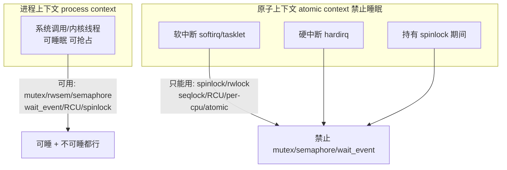

这里简单小结下，**只要处在"原子上下文"（硬/软中断、持自旋锁、显式关抢占），就绝不能调用任何可能睡眠的函数**（`mutex_lock`、`kmalloc(GFP_KERNEL)`、`copy_from_user`、`msleep` 等）。违反会触发 `scheduling while atomic` 或死锁问题

那么什么叫可能睡眠呢？回顾下，在 Linux 内核中，睡眠（Sleep）的本质动作是当前执行流主动或被动地调用了 `schedule()` 函数，将 CPU 的执行权交给了内核调度器，让调度器去运行其他进程。 此时当前进程的状态会被设置为可中断睡眠（TASK_INTERRUPTIBLE）或不可中断睡眠（TASK_UNINTERRUPTIBLE），直到它等待的条件满足后才被唤醒。在原子上下文中（如持自旋锁、中断处理中），由于系统无法或者不该进行进程切换，如果强行发生睡眠，系统就会死锁或直接崩溃。所谓的可能睡眠的函数，是指那些在底层逻辑中，有任何几率调用 `schedule()` 等待资源的函数。在内核开发中通常有如下场景：

1. 使用 `GFP_KERNEL` 标志的内存分配，代表函数`kmalloc(size, GFP_KERNEL)`、`vmalloc()`、`kmem_cache_alloc(...)` 等。为什么会睡眠？传入 `GFP_KERNEL` 标志等于告诉内核内存管理系统"如果现在物理内存不够，可以把当前进程挂起（睡眠），去执行页面回收、把别人的内存交换（Swap）到磁盘上，甚至触发 OOM 杀手，等腾出空闲内存了再唤醒我"。而原子上下文替代方案必须使用 `GFP_ATOMIC`。它告诉分配器"千万别让我睡眠，有内存就立刻给，没有就立刻返回 NULL 报错"
2. 阻塞型锁机制，如`mutex_lock()`（互斥锁）、`down()`（信号量）、`rwsem_down_read()`（读写信号量）等，这类锁的设计初衷就是阻塞等待。如果锁已经被别人拿走了，内核会把当前进程放入等待队列并调用 `schedule()` 睡眠，直到锁被释放才唤醒它。对比原子上下文替代方案是，在原子上下文中只能使用自旋锁（Spinlock），该机制在拿不到锁时，会在 CPU 上原地死循环（自旋）等待，绝不会让出 CPU
3. 用户空间内存访问（比较隐蔽的睡眠），如 `copy_to_user()`、`copy_from_user()`、`get_user()`、`put_user()`等。由于用户空间的内存是按需分配的，并且可能被 Swap 交换到了磁盘上等，当通过这些函数读写用户态地址时，如果发现该内存页不在物理内存中，就会触发缺页异常（Page Fault）。内核的缺页中断处理程序必须去读取磁盘将页面调入内存，而读磁盘是一个极其漫长的 I/O 过程，必定会导致当前进程睡眠等待
4. 显式的延时与等待，如`msleep()`、`ssleep()`、`wait_event()`、`wait_for_completion()`等，比如`msleep()` 会直接让出 CPU 并在指定的毫秒数后通过定时器唤醒；等待队列（`wait_event`）则会休眠等待某个硬件条件或标志位变为真。相对的原子上下文替代方案是，如果必须在原子上下文中延时，只能使用忙等待（Busy-wait）延时函数，如 `mdelay()` 或 `udelay()`。它们是通过 CPU 空转来消耗时间的，不会触发调度（但极度浪费 CPU，应尽量避免或缩短时间）
5. 任何底层的同步 I/O 操作，如读写磁盘文件系统、发送同步网络请求等。硬件的速度比 CPU 慢几个数量级。内核向硬件发送指令后，通常会进入睡眠，直到硬件触发中断告知"数据准备好了"，内核才会唤醒对应的进程

一个小tips，判断一个函数在内核里能不能在原子上下文中调用，最简单的办法就是看它的源码里有没有包着一层 `might_sleep()`。如果内核开启了 `CONFIG_DEBUG_ATOMIC_SLEEP` 编译选项，当在持有一把自旋锁、或者处于中断里时，不小心调用了带有 `might_sleep()` 的函数，内核的检查机制会立刻捕获到这个违规行为，并在控制台打印出著名的红字警告，甚至直接触发 `Panic：BUG: sleeping function called from invalid context at ...`

### 并发的本质：交错，而不一定是并行

先厘清一个常被混淆的点：**并发（concurrency）不等于并行（parallelism）**

-   **并行**：两个执行流在两个 CPU 上*同一时刻*真的一起跑。只有 SMP 多核才有
-   **并发**：两个执行流的操作在时间上*可以交错*（interleave），且它们访问了共享数据。**不要求同一时刻**

数据竞争（race）的成立需要三者同时满足：**1、 多个执行流的操作可交错　2、 访问同一份数据　3、至少一方是写**。注意第一条只要求"可交错"，而"真并行"只是产生交错的*一种*方式而已

这就正面解答了一个疑问：**一个进程在内核态执行时被更高优先级进程抢占，为什么和并发有关？**

设想进程 A 在内核态正往一个全局链表插入节点，执行到一半（比如新节点的 `next` 已接好、但前驱的 `next` 还没更新）时，被更高优先级的进程 B 抢占。B 也陷入内核、也去操作同一条链表。它看到的是一个**处于中间态、自相矛盾的链表**，于是链表被写坏。整个过程发生在**同一个 CPU** 上，全程没有任何"并行"，但因为 A 的操作被 B *交错*了，竞争照样发生

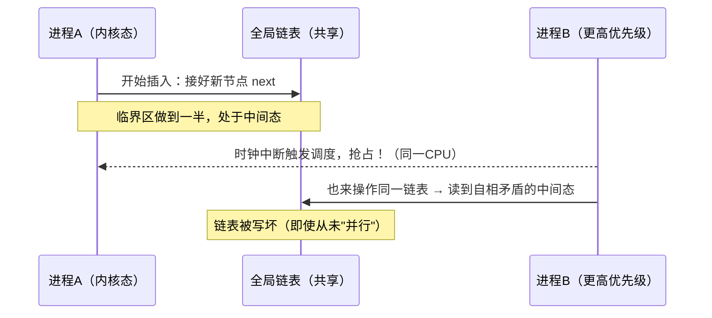

所以**抢占（以及中断）是"单核也存在的并发来源"**：它们把本来顺序执行的代码变成了*可被交错*的代码。这正是前表中"内核抢占 / 中断在 UP 单核依然存在"的真正含义，若把"并发"理解成"交错"而非"并行"，整张表就通了

### 内核如何堵住此窗口：把插入放进临界区

先回到上面"插入执行一半被抢占"的例子。先看内核链表普通方式插入（下文介绍还有RCU方式）的实现 `__list_add`（[include/linux/list.h](https://elixir.bootlin.com/linux/v4.11.6/source/include/linux/list.h)），可以清楚看到这个中间态窗口：

```c
static inline void __list_add(struct list_head *new,
                              struct list_head *prev,
                              struct list_head *next)
{
    next->prev = new;                 /* STEP1 */
    new->next  = next;                /* STEP2 */
    new->prev  = prev;                /* STEP3 到这里:new 已"半接入",但 prev 还没指向它 */
    WRITE_ONCE(prev->next, new);      /* STEP4 直到这一步,从 prev 前向遍历才看得到 new */
}
```

在 STEP1/2/3 与 STEP4 之间，正是上文描述的"新节点 `next` 已接好、但前驱 `next` 还没更新"的**不一致中间态**：从 `prev` 往后遍历还看不到 `new`，而 `new->next` 却已指入链表

这里需要注意到 **`__list_add` 本身不做任何加锁/关抢占**，内核假设调用者已经在临界区里（`__xxx`这种写法也是不成文的规定）

因此，内核堵住这个窗口的办法是：**任何会被并发访问的链表，其插入都必须在锁的保护下进行，而这把锁会顺带关掉抢占**。以等待队列为例（[kernel/sched/wait.c](https://elixir.bootlin.com/linux/v4.11.6/source/kernel/sched/wait.c)）：

```c
struct __wait_queue_head {
	spinlock_t		lock;       //q->lock是自旋锁类型
	struct list_head	task_list;
};
typedef struct __wait_queue_head wait_queue_head_t;

//https://elixir.bootlin.com/linux/v4.11.6/source/kernel/sched/wait.c#L24
void add_wait_queue(wait_queue_head_t *q, wait_queue_t *wait)
{
    unsigned long flags;
    wait->flags &= ~WQ_FLAG_EXCLUSIVE;
    spin_lock_irqsave(&q->lock, flags);   /* 进入临界区 */
    __add_wait_queue(q, wait);            /* 内部就是 list_add → __list_add */
    spin_unlock_irqrestore(&q->lock, flags);
}
```

而 `spin_lock`（乃至 `spin_lock_irqsave`）的第一件事就是**关抢占**（[include/linux/spinlock_api_smp.h](https://elixir.bootlin.com/linux/v4.11.6/source/include/linux/spinlock_api_smp.h)、[kernel/locking/spinlock.c](https://elixir.bootlin.com/linux/v4.11.6/source/kernel/locking/spinlock.c)）：

```c
static inline void __raw_spin_lock(raw_spinlock_t *lock)
{
    preempt_disable();                    /* ★ 关键：持锁期间本 CPU 不可被抢占 */
    spin_acquire(&lock->dep_map, 0, 0, _RET_IP_);
    LOCK_CONTENDED(lock, do_raw_spin_trylock, do_raw_spin_lock);
}

//https://elixir.bootlin.com/linux/v4.11.6/source/include/linux/spinlock_api_smp.h#L104
/* irqsave 版本还会先关中断，把三个来源一次性堵死 */
static inline unsigned long __raw_spin_lock_irqsave(raw_spinlock_t *lock)
{
    unsigned long flags;
    local_irq_save(flags);                /* 关中断:挡住硬中断里的并发访问 */
    preempt_disable();                    /* 关抢占:挡住被高优先级进程抢占 */
    /* ... 拿锁 ... */
    return flags;
}
```

于是那三个"半更新时被打断"的隐患被逐一封死：

-   **被更高优先级进程 B 抢占**：`preempt_disable` 让本 CPU 在持锁期间**不会触发调度**，B 根本无法在 A 的 STEP1/2/3/4 之间被切进来。A 一口气做完四步之后，`spin_unlock` 才重新开抢占
-   **被本 CPU 硬中断打断**：`irqsave` 会关闭中断，中断处理程序也进不来（否则中断里若也来抢同一把锁，还会自死锁，见后文 `0x0E`章节的 case5）
-   **被另一个 CPU 并行访问**：另一个 CPU 上的写者会在 `spin_lock` 处自旋等待，直到 A `spin_unlock`，从而看不到中间态

小结下，以内核的链表并发安全为例，**`__list_add` 只管"怎么改指针"，"改的时候不许别人插进来"这件事交给外面的锁；而锁通过 `preempt_disable` / `local_irq_save` 把抢占和中断这两个"单核并发来源"一并关掉**

### 例外：如果读者是无锁的（RCU）怎么办？

上面的锁只解决了"写者 vs 写者 / 中断"的互斥；但**读者若也想无锁**（不加锁、不关抢占地遍历链表），光靠 `preempt_disable` 就不够了，因为无锁读者可能恰好在写者做 STEP1/2/3/4 的中途读到半成品。内核对这类场景改用 `list_add_rcu`（[include/linux/rculist.h](https://elixir.bootlin.com/linux/v4.11.6/source/include/linux/rculist.h)）：

```c
//https://elixir.bootlin.com/linux/v4.11.6/source/include/linux/rculist.h#L48
static inline void __list_add_rcu(struct list_head *new,
                                  struct list_head *prev, struct list_head *next)
{
    new->next = next;                              /* 先把 new 内部指针备好 */
    new->prev = prev;
    rcu_assign_pointer(list_next_rcu(prev), new);  /* 带写屏障地"发布"前向指针 */
    next->prev = new;                              /* 反向指针后补(读者只走前向) */
}
```

两点关键区别：
-   调整赋值顺序，保证**发布 `prev->next` 是最后一步**，且这一步用 `rcu_assign_pointer`（内含 `smp_wmb`），它保证"`new` 的内部字段先于 '`prev->next` 指向 `new`' 对其他 CPU 可见"
-   于是无锁读者要么看到"还没接入 `new`"，要么看到"已完全接入且内容就绪的 `new`"，**永远不会看到半成品**。写者之间仍需持锁互斥（`list_add_rcu` 注释明确要求调用者持锁），回收还要等宽限期（这正是 `0x0F`章节 "链表：RCU 保护的双向链表" 一节的机制来源）

此外，还需要建立一个认知（内核开发的"生态隔离"原则）。内核开发者在设计数据结构时，会在一开始就给链表定性：

-   普通链表生态：所有操作都必须带锁。配套使用的是 `list_add`、`list_del`、`list_for_each_entry`。删除节点后可以直接 `kfree`
-    RCU 链表生态：专门为读多写少优化。配套使用的是 `list_add_rcu`、`list_del_rcu`、`list_for_each_entry_rcu`。删除节点后必须用 `synchronize_rcu` 或 `call_rcu` 延迟释放（绝不能直接 kfree）

### 并发来源 → 防御机制的对应关系

不同来源的竞争对手，需要不同的"防御动作"，这直接决定了内核锁的形态：

| 竞争对手来自 | 要做的防御 | 对应手段 |
| --- | --- | --- |
| 另一个 CPU（SMP） | 真正的互斥 + 保证内存可见性/顺序 | spinlock 的自旋、`atomic` 的 `LOCK` 前缀、内存屏障 |
| 本 CPU 被抢占的另一进程 | 关抢占，堵住"临界区中途被换出" | `preempt_disable()`（spinlock 已内含，spinlock禁止被抢占）|
| 本 CPU 的软中断/下半部 | 关下半部 | `local_bh_disable()` / `spin_lock_bh()` |
| 本 CPU 的硬中断 | 关中断 | `local_irq_save()` / `spin_lock_irqsave()` |

**关键洞察**：内核提供的 `spin_lock_irqsave()`函数其实是"三合一"的功能，它同时做了三件事情： 

1.  对其他 CPU 自旋互斥（防 SMP）
2.  `preempt_disable`（防抢占）
3.   `local_irq_save`（防中断）

所以选择 spinlock 的哪个变体，本质是在回答**"我的竞争对手可能来自上表哪几行"**。多关一层是正确但更贵，少关一层就留下竞争窗口

-   只跟别的进程争 → `spin_lock`（已含关抢占）
-   还会被软中断碰 → `spin_lock_bh`
-   还会被硬中断碰 → `spin_lock_irqsave`

反过来，这张表也解释了**为什么 `spin_lock` 一定要内含 `preempt_disable`**。若持锁期间不关抢占，就正好落回上一节"进程 A 插链表插一半被 B 抢占"的陷阱，如此这样锁本身就失去意义了

多说一句，内核也提供了持锁期间允许抢占/被调度的机制，如读写信号量rw_semaphore等

### 应用视角 vs 内核视角：为什么内核的并发控制"更难"

站在应用开发者视角，并发控制大体是"用 mutex / 读写锁 / 原子变量保护共享变量和数据结构，避免多线程读写冲突"。内核侧的**目标相同**（保护共享数据一致性），但有几个本质差异，使得"选哪把锁"复杂得多：

| 维度 | 应用视角 | 内核视角 |
| --- | --- | --- |
| 执行流类型 | 基本同质：都是线程/协程，都能睡、都可被调度 | **异构**：进程上下文、软中断、硬中断、NMI，各自能力不同 |
| 能否睡眠 | 几乎总能睡（阻塞一个线程无妨） | **硬约束**：中断上下文、持自旋锁时绝不能睡 |
| 竞争对手 | 主要是"线程 vs 线程" | 还有"进程 vs 中断""中断 vs 中断""CPU0 软中断 vs CPU1 软中断" |
| 对象生命周期 | 多由 GC / 智能指针兜底 | **无 GC**，并发控制还要额外保证"读的对象不会在脚下被释放" |
| 内存序 | 语言/运行时大多隐藏了屏障 | 常需**显式** `READ_ONCE`/`smp_wmb`/`rcu_assign_pointer` |
| 出错代价 | 通常是单个进程 hang / 崩溃 | 可能整机死锁、panic（内核自己就是运行时） |

所以，内核选锁其实要**考虑两个问题**：

1.  **"我这段代码运行在什么上下文？"**：决定我*能不能睡*（进程上下文可用 mutex/rwsem；中断上下文或持自旋锁时只能用 spinlock/RCU/atomic）
2.  **"我的竞争对手来自哪个来源？"**：决定我*要额外关掉什么*（关抢占 / 关下半部 / 关中断，即上一节的对应表）

两个问题的答案叠加，才唯一确定该用哪把锁。这就是为什么应用侧"无脑上 mutex"在内核里行不通的原因，原因如下：

-   当前上下文可能根本不允许睡眠
-   竞争对手可能是一个无法"加锁"的中断处理程序（对中断只能"关"，不能"锁"）

此外还有一个应用侧很少触及的维度，即**存在性（existence）**，应用里对象常有 GC 保证"只要还有人引用就不释放"；内核没有 GC，"我正在读的这个 `task_struct` / `dentry` 会不会在我读的过程中被别人释放"本身就是一个并发问题，需要 RCU、引用计数（`get_task_struct`）、existence lock 等专门手段来解决（参考下文介绍）。这是内核并发控制比应用侧多出来的一整类工作

### 执行上下文与「能否睡眠」

内核代码运行在若干上下文中，是否允许睡眠（调用 `schedule()` 主动让出）是选锁的第一判据：


**只要处在"原子上下文"（硬/软中断、持自旋锁、显式关抢占），就绝不能调用任何可能睡眠的函数**（`mutex_lock`、`kmalloc(GFP_KERNEL)`、`copy_from_user`、`msleep` 等）。违反会触发 `scheduling while atomic` 或死锁


### 并发争用的典型场景
当一份数据（通常是队列、缓冲区或状态机）需要同时跨越多核CPU、进程上下文（Process）、软中断（Softirq/Tasklet） 和 硬中断（Hardirq） 时，必须使用内核 `spin_lock_irqsave()`，关本地CPU中断 + 自旋锁。比如，内核网络子系统中共享的数据结构网卡驱动的发送环形队列（TX Ring Buffer），即网络报文从内存走向物理网卡的中转站

```c
unsigned long flags;

// 1. 保存当前 CPU 的中断状态标志到 flags
// 2. 彻底关闭本地 CPU 的硬中断（防止被本地硬中断抢占打断）
// 3. 尝试获取自旋锁（防止被其他 CPU 并发访问）
spin_lock_irqsave(&shared_lock, flags);

// ---------------------------
// 临界区：安全地修改 队列 / 缓冲区
// ---------------------------

// 1. 释放自旋锁
// 2. 恢复之前保存在 flags 里的中断状态（重新打开硬中断）
spin_unlock_irqrestore(&shared_lock, flags);
```

并发访问场景：

-   进程上下文：用户在 CPU0 上的应用程序调用 `send()` 发送数据，数据包经过 TCP/IP 协议栈，最终调用网卡驱动的 `ndo_start_xmit` 函数，试图将数据包挂载到发送环形队列中
-   软中断上下文：如果系统网络负载极高导致进程发包受阻，内核会把发包任务推迟。稍后，CPU1 上触发了网络软中断（NET_TX_SOFTIRQ），它也会试图把积压的数据包挂入同一个发送环形队列
-   硬中断上下文：网卡硬件把之前队列里的数据发送完毕后，向 CPU2 发送一个物理硬中断。CPU2 立即进入硬中断处理函数，它需要访问这个发送环形队列，把刚才发完的数据包从队列里摘除，并释放相关的 `sk_buff` 内存
-   灾难后果：如果不用 `spin_lock_irqsave` 保护，当 CPU0 正在排队挂载新包时，CPU0 突然被网卡硬中断打断，硬中断也去操作同一个队列，直接导致队列指针错乱、死锁，引发严重灾难

###    copy_process中的 list_add_tail 与list_add_tail_rcu
在全面介绍内核的并发机制之前，先以进程创建的内核函数`copy_process`中涉及到对全局task_struct链表并发操作为例进行一个简要分析

调用侧`copy_process`的实现如下：

```c
//https://elixir.bootlin.com/linux/v4.11.6/source/kernel/fork.c#L1491
static __latent_entropy struct task_struct *copy_process(
					unsigned long clone_flags,
					unsigned long stack_start,
					unsigned long stack_size,
					int __user *child_tidptr,
					struct pid *pid,
					int trace,
					unsigned long tls,
					int node)
{
    ......
    write_lock_irq(&tasklist_lock);

	/* CLONE_PARENT re-uses the old parent */
	if (clone_flags & (CLONE_PARENT|CLONE_THREAD)) {
		p->real_parent = current->real_parent;
		p->parent_exec_id = current->parent_exec_id;
	} else {
		p->real_parent = current;
		p->parent_exec_id = current->self_exec_id;
	}

	spin_lock(&current->sighand->siglock);

	/*
	 * Copy seccomp details explicitly here, in case they were changed
	 * before holding sighand lock.
	 */
	copy_seccomp(p);

	/*
	 * Process group and session signals need to be delivered to just the
	 * parent before the fork or both the parent and the child after the
	 * fork. Restart if a signal comes in before we add the new process to
	 * it's process group.
	 * A fatal signal pending means that current will exit, so the new
	 * thread can't slip out of an OOM kill (or normal SIGKILL).
	*/
	recalc_sigpending();
	if (signal_pending(current)) {
		retval = -ERESTARTNOINTR;
		goto bad_fork_cancel_cgroup;
	}
	if (unlikely(!(ns_of_pid(pid)->nr_hashed & PIDNS_HASH_ADDING))) {
		retval = -ENOMEM;
		goto bad_fork_cancel_cgroup;
	}

	if (likely(p->pid)) {
		ptrace_init_task(p, (clone_flags & CLONE_PTRACE) || trace);

		init_task_pid(p, PIDTYPE_PID, pid);
		if (thread_group_leader(p)) {
			init_task_pid(p, PIDTYPE_PGID, task_pgrp(current));
			init_task_pid(p, PIDTYPE_SID, task_session(current));

			if (is_child_reaper(pid)) {
				ns_of_pid(pid)->child_reaper = p;
				p->signal->flags |= SIGNAL_UNKILLABLE;
			}

			p->signal->leader_pid = pid;
			p->signal->tty = tty_kref_get(current->signal->tty);
			/*
			 * Inherit has_child_subreaper flag under the same
			 * tasklist_lock with adding child to the process tree
			 * for propagate_has_child_subreaper optimization.
			 */
			p->signal->has_child_subreaper = p->real_parent->signal->has_child_subreaper ||
							 p->real_parent->signal->is_child_subreaper;
			list_add_tail(&p->sibling, &p->real_parent->children);
			list_add_tail_rcu(&p->tasks, &init_task.tasks);
			attach_pid(p, PIDTYPE_PGID);
			attach_pid(p, PIDTYPE_SID);
			__this_cpu_inc(process_counts);
		} else {
			current->signal->nr_threads++;
			atomic_inc(&current->signal->live);
			atomic_inc(&current->signal->sigcnt);
			list_add_tail_rcu(&p->thread_group,
					  &p->group_leader->thread_group);
			list_add_tail_rcu(&p->thread_node,
					  &p->signal->thread_head);
		}
		attach_pid(p, PIDTYPE_PID);
		nr_threads++;
	}

	total_forks++;
	spin_unlock(&current->sighand->siglock);
	syscall_tracepoint_update(p);
	write_unlock_irq(&tasklist_lock);
    ......
}
```


先给结论：**`list_add_tail` 与 `list_add_tail_rcu` 的差别不在"写者要不要加锁"（两者都要、且都不自带锁），而在"这条链表有没有*无锁读者*"**。先看这几个原语的实现（`list_add_tail`/`list_add_tail_rcu` 只是尾插的封装，真正干活的是 `__list_add`/`__list_add_rcu`）：

```c
static inline void list_add_rcu(struct list_head *new, struct list_head *head)
{
	__list_add_rcu(new, head, head->next);
}

static inline void list_add_tail_rcu(struct list_head *new,
					struct list_head *head)
{
	__list_add_rcu(new, head->prev, head);
}

static inline void list_add_tail(struct list_head *new, struct list_head *head)
{
	__list_add(new, head->prev, head);
}

//https://elixir.bootlin.com/linux/v4.11.6/source/include/linux/list.h#L55
static inline void __list_add(struct list_head *new,
			      struct list_head *prev,
			      struct list_head *next)
{
	if (!__list_add_valid(new, prev, next))
		return;

	next->prev = new;
	new->next = next;
	new->prev = prev;
	WRITE_ONCE(prev->next, new);
}

#define list_next_rcu(list)	(*((struct list_head __rcu **)(&(list)->next)))

static inline void __list_add_rcu(struct list_head *new,
		struct list_head *prev, struct list_head *next)
{
	if (!__list_add_valid(new, prev, next))
		return;

	new->next = next;
	new->prev = prev;
	rcu_assign_pointer(list_next_rcu(prev), new);   //？todo
	next->prev = new;
}
```

这里先抛出几个问题

**问题 1：`__list_add` 与 `__list_add_rcu` 的区别？为何一个用 `WRITE_ONCE`、一个用 `rcu_assign_pointer`？**

把两者并排看（忽略 `__list_add_valid` 的 debug 校验），差异集中在如下三点：

| 维度 | `__list_add`（普通方式） | `__list_add_rcu`（RCU方式） |
| --- | --- | --- |
| 发布前初始化 `new` | `next->prev` → `new->next` → `new->prev` | `new->next` → `new->prev` |
| 发布 `prev->next` 那步 | `WRITE_ONCE`（仅保证单指针原子写） | `rcu_assign_pointer`（= `smp_store_release`，带**写屏障**） |
| `next->prev`（后继反向指针） | 在发布**之前**写 | 挪到发布**之后**写 |
| 跨 CPU 写序保证 | 无 | 有：初始化先于发布可见 |
| 对读者的假设 | 读者持同一把外部锁 | 读者仅 `rcu_read_lock` 无锁遍历 |
| 删除配对 | `list_del` | `list_del_rcu` + 宽限期回收 |

todo

**1、赋值顺序**。两者的*共同点*是：都保证"发布 `prev->next = new`"这一步之前，`new` 自身的 `next` 已就绪。因为无锁前向读者一旦经 `prev->next` 到达 `new`，会立刻解引用 `new->next` 继续走，故 `new->next` 必须先备好。*差异点*是：RCU 版把"后继的反向指针 `next->prev = new`"挪到了发布之后，因为 RCU 读者**只走前向 `->next`、从不读 `->prev`**，这个反向指针晚更新对读者无影响

**2、发布那一步的"内存序强度"，这正是 `WRITE_ONCE` VS `rcu_assign_pointer` 的核心**：

-   `WRITE_ONCE(prev->next, new)`：只是一条"不可被编译器拆分/优化掉"的原子单指针写。它保证这条指针写本身是一次完整 store（服务于 `list_empty()` 用 `READ_ONCE(head->next)` 的无锁判空），但**不提供任何跨 CPU 的写序保证**：在弱序架构（如ARM等）上，别的 CPU 可能先看到 `prev->next = new`、后看到 `new->next = next`
-   `rcu_assign_pointer(list_next_rcu(prev), new)`：等价于 `smp_store_release()`。它插入**写屏障**，保证"初始化 `new` 各字段（乃至节点承载的数据）"这些先前的写，一定先于"发布 `prev->next = new`"对其他 CPU 可见

**3、对读者的隐含要求（发布-订阅配对）**：

-   **非 RCU 链表**：读者与写者持同一把外部锁。读者拿锁的 acquire 语义与写者 `unlock` 的 `release` 语义配对，读者进临界区自然能看到写者的全部写。**没有无锁读者能观察到中间态**，故每次插入无需额外写屏障，`WRITE_ONCE` 足矣
-   **RCU 链表**：读者只在 `rcu_read_lock()` 下无锁遍历（`rcu_read_lock` 本质是 `preempt_disable`，**不含**与写者配对的内存屏障）。因此写者必须自己在发布点给出屏障，`rcu_assign_pointer`（发布）正是与读者侧 `list_for_each_entry_rcu`/`rcu_dereference`（订阅，依赖序读）配对的另一半。这就是 RCU "publish-subscribe" 的全部要义（详见章节 `0x0C`）

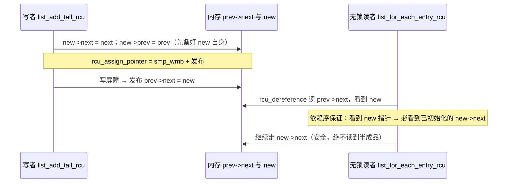

**外部调用方的差异**：

-   `list_add_tail` / `list_del`：用于"从不被无锁遍历"的链表（所有读者与写者持同一把锁）
-   `list_add_tail_rcu` / `list_del_rcu` + `call_rcu`/`synchronize_rcu`：用于"存在 `rcu_read_lock` 下无锁遍历"的链表；删除只摘链，须过宽限期再释放（见 `0x0E` 章节case2）
-   **共同点：两者都不自带锁，写者之间的互斥一律由调用方的外部锁负责**（下文）


**问题 2：`copy_process` 为何两种混用（而非只用一种）**

先回答"**怎么加锁**"的问题，观察到（`list_add_tail`/`list_add_tail_rcu` 实现里确实没有额外加锁）：

-   这几处`list_add_*`插入函数，全部位于 `write_lock_irq(&tasklist_lock) -----> write_unlock_irq(&tasklist_lock)` 之间。`tasklist_lock` 是一把**全局 `rwlock_t`**，写模式独占 → 它负责**所有写者之间的互斥**（另一个 CPU 上并发 `fork`/`exit` 的写者会在 `write_lock` 处等待）。这正印证 `0x01` 章节的结论，即**`list_add*` 系列不自带锁，锁是调用方的事，插入原语只负责"内存序正确的挂链"**
-   为什么用 `_irq` 变体？：`tasklist_lock` 会在中断相关路径以读模式被访问，且要堵住"改到一半被本 CPU 中断/抢占"的窗口，故写侧必须使用 `write_lock_irq` 关中断 + 关抢占（ `0x01`章节的结论："把插入放进临界区"把三个并发来源一并封死）
-   读者侧分两类：需要稳定视图的读者用 `read_lock(&tasklist_lock)`；无锁遍历的读者只用 `rcu_read_lock()`，**不需要碰** `tasklist_lock`
-   后文会提到，`tasklist_lock`是`rwlock_t`类型（参考`0x05`章节读写自旋锁）

再回答"**为何不统一用一种**"，取决于每条链表各自的**读者纪律**：

| 链表 | 节点 / 头 | 读者及其纪律 | 插入原语 | 为何 |
| --- | --- | --- | --- | --- |
| 子进程链表 | `p->sibling` / `real_parent->children` | `do_wait`→`do_wait_thread`：`list_for_each_entry(p, &tsk->children, sibling)`，在 `read_lock(&tasklist_lock)` 下遍历（**非 RCU**） | `list_add_tail` | 只有持锁读者，无无锁读者，普通版足矣 |
| 全局任务链表 | `p->tasks` / `init_task.tasks` | `for_each_process`：`next_task` = `list_entry_rcu(...tasks...)`，在 `rcu_read_lock` 下**无锁**遍历 | `list_add_tail_rcu` | 有无锁 RCU 读者，必须带发布屏障 |
| 线程组链表 | `p->thread_group` | `next_thread`/`while_each_thread` = `list_entry_rcu(...thread_group...)` | `list_add_tail_rcu` | 同上 |
| 线程链表 | `p->thread_node` / `signal->thread_head` | `for_each_thread` = `list_for_each_entry_rcu(...thread_head, thread_node)` | `list_add_tail_rcu` | 同上 |

小结下，**同一个 `copy_process` 把新任务挂进多条链表，而这些链表的"读者纪律"不同**。`children` 只有持锁读者（`do_wait`）→ 普通 `list_add_tail`；`tasks` / `thread_group` / `thread_node` 都有 `rcu_read_lock` 下的无锁遍历者（`for_each_process` / `next_thread` / `for_each_thread`）→ 必须 `list_add_tail_rcu`。反证两个方向：

-   把 `children` 也换成 `_rcu`：**正确但浪费**：多一次无谓的写屏障（读者根本不走 RCU）
-   把 `tasks`/`thread_*` 换成非 `_rcu`：**是 bug**：弱序架构上无锁读者可能读到"指针已发布、`new->next` 却还没就绪"的半成品，遍历语义不确定

所以一个明确的结论是，**选普通版还是 `_rcu` 版，看的是「读者要不要无锁」，而不是「写者要不要加锁」**。写者两种情况下都在 `tasklist_lock` 里，当确定了读者的方式之后，再选择对应的写者配套函数

**对本文主题的指导意义**

1.  **锁与原语分工**：`list_add*` 只管"怎么正确地改指针（含无锁读者所需的内存序）"，"改的时候不许别的写者插进来"永远交给外层锁（此处 `tasklist_lock`）
2.  **选 RCU 与否看读者、不看写者**：这是选型最易搞反的点。决定用不用 `_rcu` 的唯一依据是"这条链表有没有 `rcu_read_lock` 下的无锁遍历者"
3.  **一把锁保护多个异构结构**：`tasklist_lock` 一个临界区里同时维护了"进程树（`children`，锁读）"与"任务/线程链表（`tasks`/`thread_*`，RCU 读）"。同一份写侧互斥，服务于纪律不同的多类读者。这正是内核"一锁多表"的真实形态
4.  **发布-订阅是 RCU 的地基**：`rcu_assign_pointer`（写发布）↔ `list_for_each_entry_rcu`/`rcu_dereference`（读订阅）的配对机制；`WRITE_ONCE` 只是其"去掉屏障"的退化版，适用于无无锁读者的场景

todo

### 同步原语选型总表

先给出一些总结性结论：

| 原语 | 可否睡眠（持有时） | 典型场景 | 开销/特点 |
| --- | --- | --- | --- |
| 原子操作 `atomic_t` | 不睡 | 计数器、标志位 | 最轻，无临界区 |
| `spinlock` | 持有时禁抢占，不可睡 | 短临界区、可能被中断访问 | 忙等，临界区必须短 |
| `rwlock` | 同上 | 读多写少的短临界区 | 读者并发，写者独占 |
| `seqlock` | 读侧不阻塞写侧 | 读极多、写极少（时间、路由） | 读者可能重试，无写者饥饿 |
| `semaphore` | 可睡 | 遗留代码、计数信号量 | 已被 mutex 取代 |
| `mutex` | 可睡 | 一般互斥、长临界区 | 有乐观自旋，进程上下文 |
| `rwsem` | 可睡 | 读多写少的长临界区 | 如 `mmap_sem` |
| `RCU` | 读侧几乎零开销 | 读极多、指针发布/回收 | 写者延迟回收 |
| Per-CPU | —— | 每 CPU 独立数据、统计 | 消除共享，靠关抢占 |
| 等待队列 | 可睡 | 阻塞等待某条件成立 | 配合条件谓词 |

下面各个章节自底向上展开

##  0x02    基石：内存屏障与原子操作

在深入学习内核的并发机制之前，必须先理解两个更底层的问题：**一、编译器/CPU 会乱序**，以及**二、普通读写不是原子的**。锁的本质上是在这两个基石之上构建的

### 编译器屏障与 `READ_ONCE`/`WRITE_ONCE`

`barrier()` 只阻止**编译器**跨越它重排内存访问，不生成任何 CPU 指令。`READ_ONCE()`/`WRITE_ONCE()`（[include/linux/compiler.h](https://elixir.bootlin.com/linux/v4.11.6/source/include/linux/compiler.h)）强制通过一次内存访问读/写变量，防止编译器把它优化进寄存器或拆分访问：

```c
#define READ_ONCE(x)  __READ_ONCE(x, 1)

//https://elixir.bootlin.com/linux/v4.11.6/source/include/linux/compiler.h#L314
#define __READ_ONCE(x, check)						\
({									\
	union { typeof(x) __val; char __c[1]; } __u;			\
	if (check)							\
		__read_once_size(&(x), __u.__c, sizeof(x));		\
	else								\
		__read_once_size_nocheck(&(x), __u.__c, sizeof(x));	\
	__u.__val;							\
})
#define READ_ONCE(x) __READ_ONCE(x, 1)

#define WRITE_ONCE(x, val) \
({                          \
    union { typeof(x) __val; char __c[1]; } __u = { .__val = (val) }; \
    __write_once_size(&(x), __u.__c, sizeof(x)); \
    __u.__val;              \
})
```

一个经典误区是，**先置 flag 再读数据的忙等循环**：

```c
/* 错误：编译器可能把 flag 缓存进寄存器，永远读不到更新 */
while (!flag) ;
use(data);
```

必须写成 `while (!READ_ONCE(flag)) ;`

### CPU 内存屏障

在多 CPU 下，即使编译器不乱序，CPU 和缓存也会让**另一个 CPU 观察到的写顺序**与程序顺序不同。因此内核提供（[include/asm-generic/barrier.h](https://elixir.bootlin.com/linux/v4.11.6/source/include/asm-generic/barrier.h)、[arch/x86/include/asm/barrier.h](https://elixir.bootlin.com/linux/v4.11.6/source/arch/x86/include/asm/barrier.h)）：

| 宏 | 作用 |
| --- | --- |
| `smp_mb()` | 全屏障，读写都不越过 |
| `smp_wmb()` | 写屏障，屏障前的写先于屏障后的写可见 |
| `smp_rmb()` | 读屏障，屏障前的读先于屏障后的读完成 |
| `smp_store_release()` / `smp_load_acquire()` | release/acquire 语义，成对使用 |

经典的发布数据范式（这正是 `rcu_assign_pointer` 的底层实现）：

```c
/* 生产者 */
obj->a = 1;
obj->b = 2;
smp_wmb();            /* 保证上面的初始化先于指针发布可见 */
WRITE_ONCE(gp, obj);  /* 发布指针 */

/* 消费者 */
p = READ_ONCE(gp);
if (p) {
    smp_rmb();        /* 保证先读到指针，再读它指向的内容 */
    use(p->a, p->b);
}
```

**关键认知：屏障解决的是"可见性/顺序"，不是"互斥"** ，它不能替代锁，只是无锁编程和锁实现的构件和基础

```c
//https://elixir.bootlin.com/linux/v4.11.6/source/include/linux/rcupdate.h#L594
#define rcu_assign_pointer(p, v)					      \
({									      \
	uintptr_t _r_a_p__v = (uintptr_t)(v);				      \
									      \
	if (__builtin_constant_p(v) && (_r_a_p__v) == (uintptr_t)NULL)	      \
		WRITE_ONCE((p), (typeof(p))(_r_a_p__v));		      \
	else								      \
		smp_store_release(&p, RCU_INITIALIZER((typeof(p))_r_a_p__v)); \
	_r_a_p__v;							      \
})
```

todo

### 原子操作与引用计数

`atomic_t` / `atomic64_t`（[include/linux/atomic.h](https://elixir.bootlin.com/linux/v4.11.6/source/include/linux/atomic.h)、[arch/x86/include/asm/atomic.h](https://elixir.bootlin.com/linux/v4.11.6/source/arch/x86/include/asm/atomic.h)）在 x86 上用 `lock` 前缀指令实现，**无需临界区即可完成不可分割的读-改-写**：

```c
static __always_inline void atomic_inc(atomic_t *v)
{
    asm volatile(LOCK_PREFIX "incl %0" : "+m" (v->counter));
}
```

`cmpxchg(ptr, old, new)` 是无锁编程和几乎所有锁（qspinlock、mutex、rwsem）的核心，只有当 `*ptr == old` 时才写入 `new` 并返回旧值

todo：cmpxchg和atomic_inc的关系是什么？

在内核中，引用计数场景常见于 `refcount_t`（v4.11 新引入，[include/linux/refcount.h](https://elixir.bootlin.com/linux/v4.11.6/source/include/linux/refcount.h)），相比裸 `atomic_t` 增加了溢出/UAF 防护；面向对象生命周期管理则用 `kref`（[include/linux/kref.h](https://elixir.bootlin.com/linux/v4.11.6/source/include/linux/kref.h)），典型模式 `kref_get` / `kref_put(&obj->ref, release_fn)`


##  0x03    抢占与中断控制

自旋锁的语义高度依赖「关抢占/关中断」，先单独讲清楚。

### 三对开关

| 操作 | 关闭了什么 | 头文件 |
| --- | --- | --- |
| `preempt_disable()` / `preempt_enable()` | 内核抢占（本 CPU 不会被调度走） | [include/linux/preempt.h](https://elixir.bootlin.com/linux/v4.11.6/source/include/linux/preempt.h) |
| `local_irq_save(flags)` / `local_irq_restore(flags)` | 本 CPU 的**硬中断** | [include/linux/irqflags.h](https://elixir.bootlin.com/linux/v4.11.6/source/include/linux/irqflags.h) |
| `local_bh_disable()` / `local_bh_enable()` | 本 CPU 的**软中断/下半部** | [include/linux/bottom_half.h](https://elixir.bootlin.com/linux/v4.11.6/source/include/linux/bottom_half.h) |

`preempt_count`（存于 `thread_info`）用不同 bit 段同时记录抢占计数、软中断计数、硬中断计数等，关联查询函数如`in_interrupt()`、`in_atomic()` 

```c
//https://elixir.bootlin.com/linux/v4.11.6/source/arch/x86/include/asm/thread_info.h#L55
struct thread_info {
	unsigned long		flags;		/* low level flags */
};
```

todo

### 为什么 spinlock 有那么多变体

考虑一个数据既被进程上下文访问、又被中断处理程序访问的场景：如果进程上下文持有 spinlock 时被同 CPU 的中断打断，而中断里又去抢同一把锁，由于 spinlock 是忙等且当前 CPU 不会释放，就会**自锁死**。因此可以按照「竞争对手来自哪个上下文」挑选spinlock的变体：

| spinlock变体 | 额外动作 | 何时用 |
| --- | --- | --- |
| `spin_lock()/spin_unlock()` | 只关抢占 | 只在进程上下文访问的数据 |
| `spin_lock_bh()/spin_unlock_bh()` | 关抢占 + 关软中断 | 数据也被软中断访问（如网络） |
| `spin_lock_irqsave()` | 关抢占 + 关硬中断（保存 flags） | 数据也被硬中断访问 |

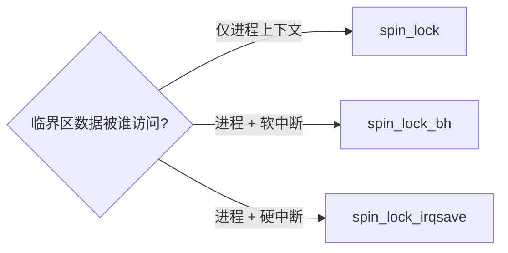

##  0x04    自旋锁 spinlock

### 用法与语义

自旋锁是**忙等**锁：拿不到锁的 CPU 原地打转（`cpu_relax()`）而不睡眠。因此：

-   临界区必须极短（不能睡眠、不能调用可能睡眠的函数）
-   持锁期间关抢占，避免持锁者被调度走导致其他 CPU 长时间空转

```c
spinlock_t lock;
spin_lock_init(&lock);
spin_lock(&lock);
/* 极短临界区 */
spin_unlock(&lock);
```

todo

### x86_64 的实现：qspinlock

> x86_64 在4.11.6版本默认启用**队列自旋锁 qspinlock**（`ARCH_USE_QUEUE_SPINLOCK`）。spinlock 底层实现**非** ticket spinlock，而是基于 MCS 的 qspinlock

调用链如下（[include/linux/spinlock.h](https://elixir.bootlin.com/linux/v4.11.6/source/include/linux/spinlock.h) → [include/asm-generic/qspinlock.h](https://elixir.bootlin.com/linux/v4.11.6/source/include/asm-generic/qspinlock.h) → [kernel/locking/qspinlock.c](https://elixir.bootlin.com/linux/v4.11.6/source/kernel/locking/qspinlock.c)）：

```text
spin_lock
  → raw_spin_lock
  → __raw_spin_lock
  → do_raw_spin_lock → arch_spin_lock
  → queued_spin_lock                (fast path)
      → queued_spin_lock_slowpath   (contended)
```

fast path 只是一次 `cmpxchg`：

```c
static __always_inline void queued_spin_lock(struct qspinlock *lock)
{
    u32 val;
    val = atomic_cmpxchg_acquire(&lock->val, 0, _Q_LOCKED_VAL);
    if (likely(val == 0))
        return;                 /* 无竞争，直接拿到 */
    queued_spin_lock_slowpath(lock, val);
}
```

qspinlock 的 `32` 位 `val` 划分为三段：`(tail, pending, locked)`。竞争升级路径：

1.  锁空闲 → 直接置 `locked`（fast path）
2.  锁被占但队列空 → 设置 `pending` 位，自旋等 `locked` 清零（第一个等待者的快速通道，避免立即排队的开销）
3.  已有等待者 → 取本 CPU 的 per-CPU `mcs_spinlock` 节点入队，在**自己的节点**上自旋（`arch_mcs_spin_lock_contended`）。前驱释放时只唤醒后继一个 CPU

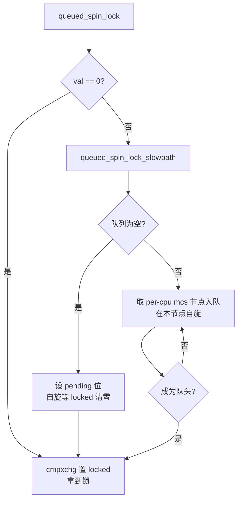

**为什么用 MCS 队列**：

-   ticket lock 下所有等待 CPU 自旋在同一个 cache line 上，每次释放都造成全体 cache 失效（cache-line bouncing）
-   MCS 让每个等待者自旋在自己的本地节点上，扩展性在大核数下显著更好

### spin_lock内核用例

1.  **进程 — `sighand->siglock`**：保护进程信号相关字段。信号既可能在进程上下文发送，也可能在中断/定时器上下文发送，所以用的是关中断变体。见 [kernel/signal.c](https://elixir.bootlin.com/linux/v4.11.6/source/kernel/signal.c) 中大量 `spin_lock_irqsave(&sighand->siglock, flags)`。

2.  **VFS — `dentry->d_lock`**：保护单个 dentry 的字段（`d_count`、`d_subdirs`、`d_flags` 等），是极短临界区的典型。见 [fs/dcache.c](https://elixir.bootlin.com/linux/v4.11.6/source/fs/dcache.c) 中 `spin_lock(&dentry->d_lock)`。它常与 seqlock（`rename_lock`）、RCU 配合，构成 0x0E 的综合案例。

##  0x05    读写自旋锁 rwlock

### 用法

允许**多个读者并发**、写者独占，适合读多写少的短临界区：

```c
rwlock_t lock;
read_lock(&lock);   /* 多读者可同时进入 */
/* 只读临界区 */
read_unlock(&lock);

write_lock(&lock);  /* 写者独占 */
/* 读写临界区 */
write_unlock(&lock);
```

同样有 `read_lock_irqsave` / `write_lock_bh` 等变体，选取规则同 spinlock

### 内核实现：qrwlock

x86_64 默认使用**队列读写锁 qrwlock**（[include/asm-generic/qrwlock.h](https://elixir.bootlin.com/linux/v4.11.6/source/include/asm-generic/qrwlock.h)、[kernel/locking/qrwlock.c](https://elixir.bootlin.com/linux/v4.11.6/source/kernel/locking/qrwlock.c)）。`arch_rwlock_t` 内含一个 `atomic_t cnts`（低 `8` 位记录写者状态，其余记录读者计数）与一把内部 `arch_spinlock_t wait_lock`：

-   读者的 fast path：`atomic_add_return_acquire(_QR_BIAS, &cnts)`，若无写者则直接进入
-   写者：`cmpxchg` 抢占写标志；争用时经 `queued_write_lock_slowpath` 用内部 qspinlock 排队，并等所有读者退出

qrwlock 相比旧 rwlock 的关键改进是**写者优先**，避免持续到来的读者把写者饿死

> 注意：rwlock 是自旋锁，读者临界区同样**不能睡眠**。需要在可睡眠的长临界区做读写并发的场景，建议使用`rwsem`（下文）

### 内核用例：`tasklist_lock`（全局进程链表）

在内核实现中，全局进程链表用读写锁保护（[kernel/fork.c](https://elixir.bootlin.com/linux/v4.11.6/source/kernel/fork.c) 定义 `DEFINE_RWLOCK(tasklist_lock)`）：

-   遍历进程树、发送信号等读操作用 `read_lock(&tasklist_lock)`（可多核并发）
-   而 `fork`/`exit` 修改链表用 `write_lock_irq(&tasklist_lock)`

这正是读多（各种查询遍历）写少（进程创建销毁）的教科书场景

```c
//https://elixir.bootlin.com/linux/v4.11.6/source/include/linux/sched/task.h#L20
extern rwlock_t tasklist_lock;
```
todo

##  0x06    顺序锁 seqlock / seqcount

回顾下，在`open`系统调用的rcu-walk模式时

todo

### 动机与用法

对于**读极多、写极少**且读者不希望阻塞写者的数据（如系统时间），rwlock 的读者仍要做原子加减，仍有 cache 竞争。seqlock 让**读者完全不写共享状态**，代价是读到"半更新"数据时需要重试

```c
seqlock_t sl;
/* 写者：更新序号（奇数=写进行中） */
write_seqlock(&sl);
/* 修改数据 */
write_sequnlock(&sl);

/* 读者：读前后各取一次序号，若变化或为奇则重试 */
unsigned seq;
do {
    seq = read_seqbegin(&sl);
    /* 读数据到局部变量 */
} while (read_seqretry(&sl, seq));
```

原理（[include/linux/seqlock.h](https://elixir.bootlin.com/linux/v4.11.6/source/include/linux/seqlock.h)）：写者进入时把序号 `+1`（变为奇数），退出时再 `+1`（变为偶数），并有 `smp_wmb` 保证数据更新与序号更新的顺序。读者在临界区前后各读一次序号：若不相等（期间有写者）或为奇数（正有写者在写），说明读到的可能是撕裂数据，重试

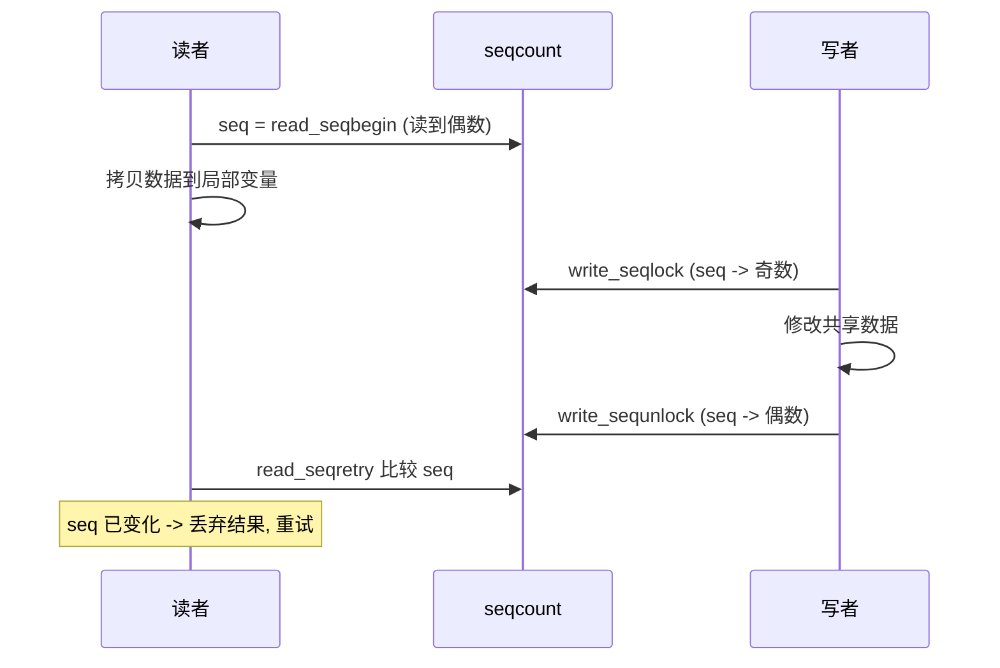

**适用性约束**：读者临界区里读到的数据可能是不一致的中间态，所以读者**只能拷贝、不能带副作用地使用**（不能据此解引用可能失效的指针）。纯值语义的数据（时间戳、坐标）最合适

### 内核用例

1.  **时间子系统**：`jiffies`/timekeeper 用 seqlock 保护，读时间的路径极热且不能阻塞时钟中断更新。见 [kernel/time/timekeeping.c](https://elixir.bootlin.com/linux/v4.11.6/source/kernel/time/timekeeping.c) 的 `tk_core.seq` 与 [kernel/time/jiffies.c](https://elixir.bootlin.com/linux/v4.11.6/source/kernel/time/jiffies.c)

todo

2.  **VFS — `rename_lock`**：[fs/dcache.c](https://elixir.bootlin.com/linux/v4.11.6/source/fs/dcache.c) 中 `__cacheline_aligned_in_smp DEFINE_SEQLOCK(rename_lock);`。目录项 RCU-walk 查找时，并发 `rename` 可能让哈希链遍历"走错链"而漏掉目标（false-negative）；`rename_lock` 提供一个全局序号，读者发现期间发生过 rename 就整体重试。每个 dentry 另有 `d_seq`（seqcount）保护其 name/parent/inode 三元组的原子快照。参考下文综合案例

todo

##  0x07    信号量 semaphore

### 用法与定位

`semaphore` 是一个**可睡眠的计数信号量**（[include/linux/semaphore.h](https://elixir.bootlin.com/linux/v4.11.6/source/include/linux/semaphore.h)、[kernel/locking/semaphore.c](https://elixir.bootlin.com/linux/v4.11.6/source/kernel/locking/semaphore.c)）：

```c
//https://elixir.bootlin.com/linux/v4.11.6/source/include/linux/semaphore.h#L16
struct semaphore {
    raw_spinlock_t      lock;
    unsigned int        count;
    struct list_head    wait_list;
};

void down(struct semaphore *sem);   /* count-- ，为 0 则睡眠等待 */
void up(struct semaphore *sem);     /* count++ ，唤醒一个等待者 */
```

`down()` 拿内部 `raw_spinlock` 保护 `count`：若 `count > 0` 直接减一返回；否则把自己挂到 `wait_list` 并 `schedule()` 睡眠。`up()` 若有等待者则唤醒队首

**定位**：当`count` 初值为 `1` 时退化为「二值信号量」即互斥。但对纯互斥场景，`mutex` 更优（有 owner 追踪、乐观自旋、lockdep 支持），所以**新代码互斥一律用 mutex，semaphore 现已属遗留**。计数信号量（`count > 1`，限制并发数）的场景也大多被其他机制替代

todo：和system 信号量的区别

### 内核用例：`console_sem`

内核控制台仍用信号量串行化输出：[kernel/printk/printk.c](https://elixir.bootlin.com/linux/v4.11.6/source/kernel/printk/printk.c) 中的 `console_sem`，配套 `console_lock()`/`console_unlock()` 即封装 `down(&console_sem)`/`up(&console_sem)`。这是理解 semaphore 现实用途的直观例子

todo

##  0x08    互斥锁 mutex

### 用法

`mutex` 是进程上下文的睡眠互斥锁，是内核中**最常用的互斥原语**：

```c
struct mutex m;
mutex_lock(&m);
/* 可以较长、可以睡眠的临界区 */
mutex_unlock(&m);
```

规则：**只能在进程上下文使用**（会睡眠），加锁者必须是解锁者（有 owner 概念），不可递归

todo

### 数据结构：单 `atomic_long_t owner`

> 版本说明：4.11.6版本中， mutex rework 把旧的 `atomic_t count` + 非原子 `owner` 合并为**单个 `atomic_long_t owner`**。参考（[include/linux/mutex.h](https://elixir.bootlin.com/linux/v4.11.6/source/include/linux/mutex.h)）：

```c
//https://elixir.bootlin.com/linux/v4.11.6/source/include/linux/mutex.h#L53
struct mutex {
    atomic_long_t       owner;      /* 指向 owner task_struct，低位存标志 */
    spinlock_t          wait_lock;
#ifdef CONFIG_MUTEX_SPIN_ON_OWNER
    struct optimistic_spin_queue osq; /* MCS 乐观自旋队列 */
#endif
    struct list_head    wait_list;
    ......
};
```

`owner` 指针低位（task_struct 按 L1 cache 对齐，低位为 `0` 可复用）存两个标志（[kernel/locking/mutex.c](https://elixir.bootlin.com/linux/v4.11.6/source/kernel/locking/mutex.c)）：

```c
#define MUTEX_FLAG_WAITERS  0x01  /* 有等待者，unlock 必须唤醒 */
#define MUTEX_FLAG_HANDOFF  0x02  /* unlock 需把锁直接交给队首（防饥饿） */
```

### 三条路径：fast → 乐观自旋 → 慢路径

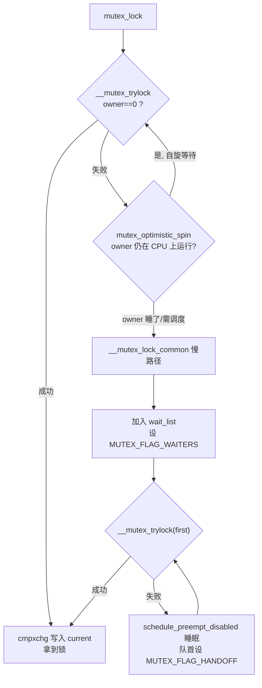

1.  **fast path**：`__mutex_trylock` 用 `atomic_long_cmpxchg_acquire` 把 `owner` 从 `0` 换成 `current`，成功即拿锁

2.  **乐观自旋（optimistic spinning）**：`mutex_optimistic_spin`（[kernel/locking/mutex.c](https://elixir.bootlin.com/linux/v4.11.6/source/kernel/locking/mutex.c)）。核心洞察是：**如果锁的持有者当前正在另一 CPU 上运行，那么它很可能马上就会释放锁**，此时自旋等待比睡眠再唤醒（涉及两次上下文切换）更划算。自旋者通过 `osq_lock`（MCS 队列）排队，保证同一时刻只有一个自旋者竞争，并用 `mutex_spin_on_owner` 持续检查 owner 是否还在运行、是否 `need_resched`

3.  **慢路径 `__mutex_lock_common`**：自旋无望则真正入睡，加入 `wait_list`，设 `MUTEX_FLAG_WAITERS`，循环 `__mutex_trylock` 失败就 `schedule_preempt_disabled()`。为防止乐观自旋者持续插队饿死队首，队首等待者会设置 `MUTEX_FLAG_HANDOFF`，迫使 `unlock` 把锁**直接移交**给它：

```c
/* __mutex_lock_common 主循环（简化自 v4.11.6） */
for (;;) {
    if (__mutex_trylock(lock, first))   /* first: 是否已是队首, 处理 handoff */
        goto acquired;
    if (unlikely(signal_pending_state(state, task))) { ret = -EINTR; goto err; }
    spin_unlock_mutex(&lock->wait_lock, flags);
    schedule_preempt_disabled();        /* 睡眠 */
    spin_lock_mutex(&lock->wait_lock, flags);
    if (!first && __mutex_waiter_is_first(lock, &waiter)) {
        first = true;
        __mutex_set_flag(lock, MUTEX_FLAG_HANDOFF);  /* 我成了队首，要求直接移交 */
    }
}
```

### 内核用例

1.  **VFS — `inode->i_rwsem`（对比引出）**：4.5 起 `inode->i_mutex` 已升级为 rwsem（下一节），说明连"目录/文件操作串行化"这种典型 mutex 场景，都在往"读写分离"演进。

2.  **子系统级互斥**：内核里保护某模块全局状态的锁绝大多数是 mutex，如各类 `xxx_mutex`（设备探测、netlink、cgroup 等）。凡是"进程上下文、临界区里可能睡眠或较长"的互斥，答案基本都是 mutex

todo

##  0x09    读写信号量 rwsem

### 用法与 vs rwlock

`rw_semaphore`（[include/linux/rwsem.h](https://elixir.bootlin.com/linux/v4.11.6/source/include/linux/rwsem.h)）是**可睡眠**的读写锁：多读者并发、写者独占，但持有期间**允许睡眠**

```c
struct rw_semaphore rwsem;
down_read(&rwsem);   /* 读者，可多个 */
/* 可睡眠的只读临界区 */
up_read(&rwsem);

down_write(&rwsem);  /* 写者独占 */
up_write(&rwsem);
```

与 `rwlock_t` 的根本区别：

| | `rwlock_t`（qrwlock） | `rw_semaphore` |
| --- | --- | --- |
| 持有时能否睡眠 | 不能（自旋） | 能 |
| 上下文 | 任意（含中断） | 仅进程上下文 |
| 争用行为 | 忙等 | 睡眠 |
| 临界区长度 | 极短 | 可长 |

4.11 的 rwsem 结构含 `atomic_long_t count`（编码读者数/写者状态）、`wait_list`、`wait_lock`，以及写者的乐观自旋支持（`osq` + `owner`，类似 mutex，[kernel/locking/rwsem-xadd.c](https://elixir.bootlin.com/linux/v4.11.6/source/kernel/locking/rwsem-xadd.c)）。

> 版本提示：rwsem 在 5.3 有一次大重写（读写状态合并进单一 `count`、引入更完善的自旋/偷锁策略）。4.11 是重写前实现，正文以 4.11 为准。

### 源码用例：`mm->mmap_sem`

进程地址空间用 `mm->mmap_sem`（[include/linux/mm_types.h](https://elixir.bootlin.com/linux/v4.11.6/source/include/linux/mm_types.h) 中 `struct mm_struct`）这把 rwsem 保护 VMA 红黑树。这是 rwsem 最著名的用例：

-   缺页异常 `do_page_fault` → `down_read(&mm->mmap_sem)`：只是查询 VMA，多个线程的缺页可并发（读者），且缺页处理里可能睡眠（分配页、读磁盘），所以必须是可睡眠的 rwsem 而非自旋 rwlock。
-   `mmap`/`munmap`/`brk` 修改地址空间 → `down_write(&mm->mmap_sem)`：独占。

这解释了多线程程序里"缺页可并发、但 mmap 会串行化"的行为本质。相关代码见 [mm/memory.c](https://elixir.bootlin.com/linux/v4.11.6/source/mm/memory.c)、[mm/mmap.c](https://elixir.bootlin.com/linux/v4.11.6/source/mm/mmap.c)。

##  0x0A    Per-CPU 型变量

### 思想：用空间替换共享

最快的同步是**没有共享**。Per-CPU 变量为每个 CPU 分配一份独立副本，各 CPU 只访问自己的那份，从根本上消除跨 CPU 竞争与 cache bouncing。适合统计计数、每 CPU 缓存/队列等

```c
DEFINE_PER_CPU(int, my_counter);        /* 定义 */

/* 访问：关抢占以保证"取本 CPU id"和"访问副本"之间不被迁移 */
int *p = get_cpu_var(my_counter);       /* = this_cpu_ptr + preempt_disable */
(*p)++;
put_cpu_var(my_counter);                /* preempt_enable */

/* 或用 this_cpu_* 原子式访问（自身保证本 CPU 原子） */
this_cpu_inc(my_counter);
```

相关内核实现代码：

```c
//https://elixir.bootlin.com/linux/v4.11.6/source/include/linux/percpu-defs.h#L262
/*
 * Must be an lvalue. Since @var must be a simple identifier,
 * we force a syntax error here if it isn't.
 */
#define get_cpu_var(var)						\
(*({									\
	preempt_disable();						\
	this_cpu_ptr(&var);						\
}))


/*
 * The weird & is necessary because sparse considers (void)(var) to be
 * a direct dereference of percpu variable (var).
 */
#define put_cpu_var(var)						\
do {									\
	(void)&(var);							\
	preempt_enable();						\
} while (0)
```

要点（[include/linux/percpu-defs.h](https://elixir.bootlin.com/linux/v4.11.6/source/include/linux/percpu-defs.h)、[include/asm-generic/percpu.h](https://elixir.bootlin.com/linux/v4.11.6/source/include/asm-generic/percpu.h)）：

-   `per_cpu_ptr(ptr, cpu)`：拿指定 CPU 的副本（如汇总统计时遍历所有 CPU）
-   `this_cpu_ptr(ptr)` / `this_cpu_inc()`：获取/修改本 CPU 副本
-   **陷阱**：用 `this_cpu_ptr` 拿到指针后如果发生抢占/迁移，指针就指向了"原来那个 CPU"的副本。所以要么用带抢占保护的 `get_cpu_var`/`this_cpu_*`，要么自己 `preempt_disable`

### 内核用例

1.  **协议栈 SNMP 统计**：`/proc/net/snmp` 里的海量计数（收发包、错误数）都是 per-CPU 的 MIB，收发热路径上用 `__SNMP_INC_STATS`/`SNMP_INC_STATS`（[include/net/snmp.h](https://elixir.bootlin.com/linux/v4.11.6/source/include/net/snmp.h)）只改本 CPU 计数，读取 `/proc` 时才 `per_cpu_ptr` 遍历求和。若这些计数用全局原子变量，收包路径的 cache 竞争会摧毁性能

2.  **调度器 `runqueues`**：每 CPU 一个运行队列 `DEFINE_PER_CPU_SHARED_ALIGNED(struct rq, runqueues)`（[kernel/sched/core.c](https://elixir.bootlin.com/linux/v4.11.6/source/kernel/sched/core.c)），本 CPU 调度只操作本地 rq

3.  **内存统计 vmstat**：`vm_event_states`、per-zone/per-cpu 计数（[mm/vmstat.c](https://elixir.bootlin.com/linux/v4.11.6/source/mm/vmstat.c)）

##  0x0B    等待队列 wait queue

### 用途

当内核代码需要**阻塞等待某个条件成立**（数据到达、缓冲区可用、子进程退出）时，用等待队列把当前进程挂起，待条件满足时由另一方唤醒。这是"睡眠—唤醒"机制的通用基础设施

> 版本提示：4.11 类型名是 `wait_queue_head_t`（队列头）与 `wait_queue_t`（队列项），4.13 才分别保留 `wait_queue_head_t` 与改名 `wait_queue_entry_t`。本文用 4.11 名字。

### 用法：条件谓词 + 唤醒

```c
DECLARE_WAIT_QUEUE_HEAD(wq);
/* 等待方：wait_event 会循环检查 condition，为假则睡眠 */
wait_event_interruptible(wq, condition);
/* 唤醒方：改变条件后唤醒 */
condition = true;
wake_up_interruptible(&wq);
```

`wait_event` 系列（[include/linux/wait.h](https://elixir.bootlin.com/linux/v4.11.6/source/include/linux/wait.h)）的核心是一个**带条件的循环**，展开后本质是 `prepare_to_wait` / `schedule` / `finish_wait`：

```c
/* 手写版，等价于 wait_event 的展开 */
DEFINE_WAIT(wait);
for (;;) {
    prepare_to_wait(&wq, &wait, TASK_INTERRUPTIBLE); /* 挂入队列，置睡眠态 */
    if (condition)          /* 关键：必须先置态再判条件，避免丢唤醒 */
        break;
    if (signal_pending(current)) { ... }
    schedule();             /* 让出 CPU */
}
finish_wait(&wq, &wait);    /* 出队，置 TASK_RUNNING */
```

todo

**为什么要"先置睡眠态、再判条件"**：如果先判条件（为假）再准备睡眠，中间条件可能恰好被满足并发出唤醒，而此时还没进入队列/睡眠态，唤醒就丢了（lost wakeup），导致永久睡眠。这个顺序是等待队列正确性的核心

唤醒相关：

-   `wake_up()` 唤醒队列上所有非独占等待者 + 一个独占等待者；
-   `add_wait_queue_exclusive()` 标记独占等待者，用于**避免惊群**（thundering herd）：如 accept 多个进程等同一 listen socket，只唤醒一个。

### 内核典型用例

1.  **管道 pipe**：读端在数据为空时 `wait_event`（等 `pipe->wait`），写端写入后 `wake_up_interruptible`。见 [fs/pipe.c](https://elixir.bootlin.com/linux/v4.11.6/source/fs/pipe.c)。

2.  **socket 阻塞收发**：`sk->sk_wq` 等待队列，`sk_wait_data` 等数据到达，协议栈收到数据后 `sk->sk_data_ready` 唤醒。见 [net/core/sock.c](https://elixir.bootlin.com/linux/v4.11.6/source/net/core/sock.c)。

3.  **`wait4`/`waitpid`**：父进程用 `__wait_event` 等子进程状态变化

##  0x0C    RCU：读-拷贝-更新

前面在深入分析`open`内核实现时，讨论过RCU-walk机制。RCU（Read-Copy-Update）是内核为**读极多、写极少**场景设计的同步机制，读侧几乎零开销、无锁、无等待。它是理解现代内核可扩展性的关键

### 三条读侧约束 + 发布/订阅

读者用 `rcu_read_lock()`/`rcu_read_unlock()` 界定读侧临界区（[include/linux/rcupdate.h](https://elixir.bootlin.com/linux/v4.11.6/source/include/linux/rcupdate.h)）。在非抢占内核里，`rcu_read_lock()` 实际就是 `preempt_disable()`，**没有任何原子操作、没有等待**，这就是读侧零开销的来源

todo：为什么是preempt_disable，作用？

```c
rcu_read_lock();
p = rcu_dereference(gp);        /* 订阅：安全读取被 RCU 保护的指针 */
if (p)
    do_something(p->field);     /* 保证在本临界区内 p 不会被释放 */
rcu_read_unlock();
```

发布用 `rcu_assign_pointer(gp, p)`（内含 `smp_wmb`/release，保证 `p` 指向内容的初始化先于指针可见，正是 `0x02` 提到的发布范式）；订阅用 `rcu_dereference`（保证依赖顺序）

todo

### 写侧：宽限期与两种回收

写者要更新时的模式是：**分配新副本 → 初始化 → `rcu_assign_pointer` 发布 → 等所有"旧读者"离开 → 释放旧副本**。"等旧读者离开"就是**宽限期（grace period）**：

-   同步等待：`synchronize_rcu()` 阻塞直到宽限期结束（写者可睡眠时用）
-   异步回调：`call_rcu(&p->rcu, free_fn)` 注册回调，宽限期后由内核调用（不能睡眠或不想阻塞时用）；便捷宏 `kfree_rcu(p, rcu)`

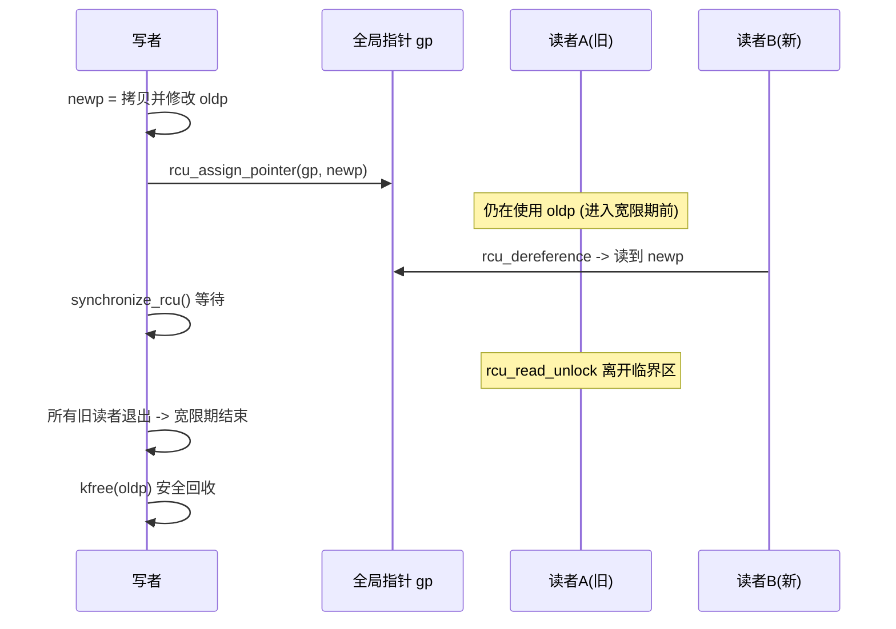

**宽限期的定义**：一段时间，长到足以让"宽限期开始时正处在读侧临界区的所有读者"都退出。判定依据是**静止状态（quiescent state, QS）**，即每个 CPU 经历一次上下文切换/空闲/用户态，就说明它已不在任何 RCU 读侧临界区（因为读侧禁抢占）。所有 CPU 都报告过 QS，宽限期即结束

宽限期与读/写端的时间线关系


todo

顺序锁+RCU机制的配合

### Tree RCU 状态机（追踪）

大核数下若用单一全局状态记录 QS 会成为瓶颈， 内核提供了使用 **Tree RCU**（[kernel/rcu/tree.c](https://elixir.bootlin.com/linux/v4.11.6/source/kernel/rcu/tree.c)）：把 CPU 组织成 `rcu_node` 树，QS 信息逐层向上汇报，`rcu_state` 为根

```text
时钟中断 rcu_check_callbacks
  → 记录本 CPU 是否处于 QS（用户态/空闲/上下文切换即 QS）
  → rcu_process_callbacks（RCU_SOFTIRQ 软中断）
      → note_gp_changes         (感知宽限期开始/结束)
      → rcu_check_quiescent_state → rcu_report_qs_rnp / rcu_report_qs_rsp
          (QS 逐层上报 rcu_node → rcu_state)
      → 宽限期结束后 → rcu_do_batch → 执行到期的 call_rcu 回调
```

`synchronize_rcu` 内部即 `wait_rcu_gp`：注册一个回调并睡眠，等回调被调用（宽限期结束）时被唤醒

### RCU的变体

1.  **SRCU（Sleepable RCU）**：普通 RCU 读侧禁抢占、不可睡眠。SRCU（[kernel/rcu/srcu.c](https://elixir.bootlin.com/linux/v4.11.6/source/kernel/rcu/srcu.c)）允许**读侧睡眠**，代价是每个 SRCU 域需独立的 `struct srcu_struct`，读侧 `srcu_read_lock` 返回一个 index、`srcu_read_unlock` 传回。适合读侧可能阻塞的场景

2.  **list/hlist RCU 遍历**：内核大量链表用 RCU 保护遍历（[include/linux/rculist.h](https://elixir.bootlin.com/linux/v4.11.6/source/include/linux/rculist.h)）：`list_for_each_entry_rcu`、`hlist_for_each_entry_rcu`；修改用 `list_add_rcu`/`list_del_rcu`（删除只摘链、`kfree` 推迟到宽限期后）。哈希表常用 `hlist_nulls`（[include/linux/rculist_nulls.h](https://elixir.bootlin.com/linux/v4.11.6/source/include/linux/rculist_nulls.h)）以应对遍历中元素被移动到别的桶

### 内核典型用例

1.  **协议栈 — TCP 连接查找**：established 连接哈希表 `ehash` 用 `hlist_nulls` + RCU，收包软中断里 `__inet_lookup_established`（[net/ipv4/inet_hashtables.c](https://elixir.bootlin.com/linux/v4.11.6/source/net/ipv4/inet_hashtables.c)）在 `rcu_read_lock()` 下无锁查找 socket，避免每包都抢全局锁，这是高并发连接性能的关键

2.  **进程 — pid/task 查找**：`find_task_by_vpid` 路径在 RCU 读侧遍历 pid 哈希（[kernel/pid.c](https://elixir.bootlin.com/linux/v4.11.6/source/kernel/pid.c)），`task_struct` 的释放经 `call_rcu` 延迟（`delayed_put_task_struct`），保证读者手中的指针在临界区内有效

3.  **VFS — RCU-walk 路径查找**：见 0x10 综合案例（并在 0x0E 案例 6 概览其四原语协作）

todo

##  0x0D    番外

### 决策速查

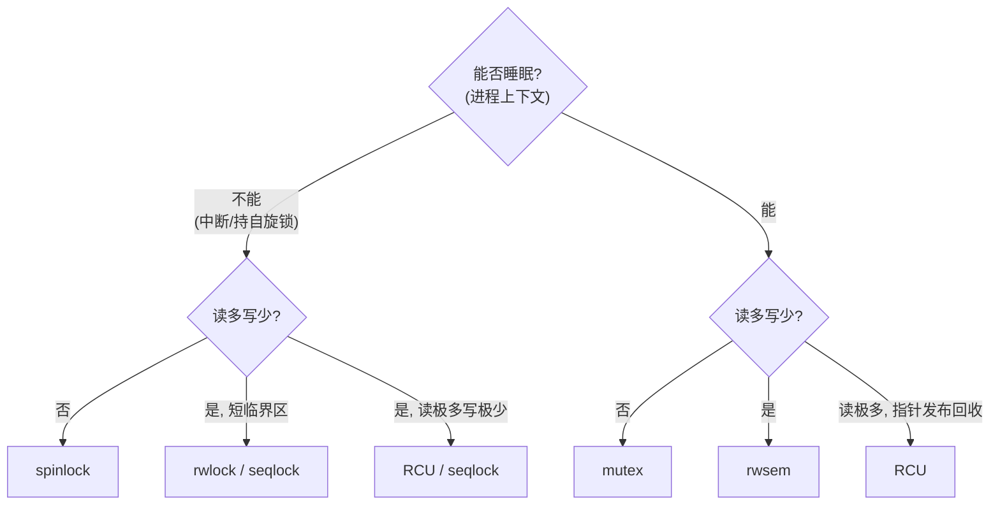

### 常见问题

1.  **原子上下文里睡眠**：在 spinlock 内、软/硬中断里调用 `mutex_lock`、`kmalloc(GFP_KERNEL)`、`copy_from_user`。后果：`BUG: scheduling while atomic` 或死锁。持自旋锁时分配内存要用 `GFP_ATOMIC`

2.  **锁序死锁**：两处以不同顺序获取同两把锁（A→B 与 B→A）。规范：**全局固定加锁顺序**，或用 `spin_lock_nested`；开发期开启 `CONFIG_PROVE_LOCKING`（lockdep）自动检测

3.  **中断变体选错**：数据被硬中断访问却用了 `spin_lock()` 而非 `spin_lock_irqsave()` → 同 CPU 中断重入自锁死

4.  **Per-CPU 未关抢占**：`this_cpu_ptr` 拿指针后被迁移到别的 CPU，改错副本。用 `get_cpu_var`/`this_cpu_*` 或显式 `preempt_disable`

5.  **RCU 读侧睡眠**：`rcu_read_lock()` 后禁抢占，其中不可睡眠、不可阻塞；需要睡眠请用 SRCU

6.  **seqlock 读侧滥用**：读到的可能是撕裂数据，只能拷贝值、不能据此做不可逆操作或解引用可能失效的指针

##  0x0E    综合案例：原语协作（组合）范式

真实内核代码几乎总是**多种原语配合**：RCU 定"生死存续"、引用计数保"跨临界区长期持有"、spinlock 串行化写者、屏障保证发布顺序等等

本节列举若干真实用例

### case1：RCU + 引用计数 —— 查找对象并安全"带走"

场景（非常经典的例子）：通过 `struct pid` 找到对应的 `task_struct`，并希望在函数返回之后**继续使用**它（比如后续给它发信号）。见 [kernel/pid.c](https://elixir.bootlin.com/linux/v4.11.6/source/kernel/pid.c)

```c
/* 读侧内层：仅在 RCU 临界区(或持 tasklist_lock)内有效 */
struct task_struct *pid_task(struct pid *pid, enum pid_type type)
{
    struct task_struct *result = NULL;
    if (pid) {
        struct hlist_node *first;
        /* rcu_dereference_check: 带依赖序地读链表首节点；
         * lockdep 断言:调用者要么持 rcu_read_lock,要么持 tasklist_lock */
        first = rcu_dereference_check(hlist_first_rcu(&pid->tasks[type]),
                                      lockdep_tasklist_lock_is_held());
        if (first)
            result = hlist_entry(first, struct task_struct, pids[(type)].node);
    }
    return result;   /* 出了保护区,这个指针就不保证有效 */
}

/* 调用层：把"临界区内有效"升级为"跨临界区长期有效" */
struct task_struct *get_pid_task(struct pid *pid, enum pid_type type)
{
    struct task_struct *result;
    rcu_read_lock();                 /* STEP1： 进入 RCU 读侧:保证 result 在本区间内不被 kfree */
    result = pid_task(pid, type);
    if (result)
        get_task_struct(result);     /* STEP2： 关键:还在临界区内就把引用计数 +1 */
    rcu_read_unlock();               /* STEP3： 离开临界区:此后 result 靠引用计数(而非RCU)存活 */
    return result;                   /* 调用者用完必须 put_task_struct() 配平 */
}

//get_task_struct：本质是累加引用计数
#define get_task_struct(tsk) do { atomic_inc(&(tsk)->usage); } while(0)
```

**协作分析**：

-   RCU 保证的只是"读侧临界区内 `result` 不会被回收"（对象的释放要等宽限期，详见 `0x0C`章节）。一旦 `rcu_read_unlock()`，宽限期随时可能结束、对象随时可能被 `free`
-   所以必须在 `rcu_read_unlock()` **之前**做 `get_task_struct()`（本质是 `atomic_inc(&t->usage)`，见 [include/linux/sched/task.h](https://elixir.bootlin.com/linux/v4.11.6/source/include/linux/sched/task.h)）。若把顺序颠倒成"先 unlock 再 get"，中间就有一个窗口：对象已被释放而正要去 `atomic_inc` 它 → **use-after-free**
-   小结：**RCU 负责"我能安全地读到并触碰它"（瞬时存在性），引用计数负责"我能把它带出临界区长期持有"（长期存在性）**。这是内核最常见的"查找 + 带走"范式

### case2：RCU 读 + spinlock 写 + call_rcu 回收（existence lock 三段式）

case 1 是读侧，那么写侧如何与之配合？以进程/pid hash表的增删为例（[kernel/pid.c](https://elixir.bootlin.com/linux/v4.11.6/source/kernel/pid.c)、[kernel/exit.c](https://elixir.bootlin.com/linux/v4.11.6/source/kernel/exit.c)）：

如下`attach_pid`的实现（在`copy_process`函数中被调用，会使用全局`rwlock_t tasklist_lock`进行写保护）

```c
extern rwlock_t tasklist_lock;

//https://elixir.bootlin.com/linux/v4.11.6/source/kernel/pid.c#L388
/* 写侧-加入:必须在 tasklist_lock 写锁保护下调用 */
void attach_pid(struct task_struct *task, enum pid_type type)
{
    struct pid_link *link = &task->pids[type];
    /* hlist_add_head_rcu: 内含发布语义(smp)把新节点挂链,读者可无锁并发遍历 */
    hlist_add_head_rcu(&link->node, &link->pid->tasks[type]);
}

/* 写侧-摘除并回收(简化自 release_task) */
void release_task(struct task_struct *p)
{
    write_lock_irq(&tasklist_lock);   /* STEP1： 写者互斥:防并发增删撕裂链表 */
    __exit_signal(p);                 /*    内部 __unhash_process → detach_pid(→hlist_del_rcu)/list_del_rcu */
    write_unlock_irq(&tasklist_lock);
    ......
    call_rcu(&p->rcu, delayed_put_task_struct); /* STEP2： 延迟回收:等宽限期后才真正 put/free */
}

static void delayed_put_task_struct(struct rcu_head *rhp)
{
    struct task_struct *tsk = container_of(rhp, struct task_struct, rcu);
    ......
    put_task_struct(tsk);             /* STEP3：宽限期已过,读者都退出,安全递减最终引用 */
}
```

**协作分析（三段式闭环）**：

-   **写者之间**用 `tasklist_lock`（rwlock，参考章节 `0x05`）互斥，保证链表结构不被并发增删撕裂
-   **读者**（case1 的 `pid_task`、`for_each_process`）用 RCU **无需**拿 `tasklist_lock`，靠 `hlist_add_head_rcu`/`list_del_rcu` 的发布/摘链语义看到一致的链
-   `list_del_rcu` 只把节点**摘链**，不释放内存；真正释放推迟到 `call_rcu` 回调（宽限期后）。这确保"删除时可能正在遍历的读者"手里的 `next` 指针仍指向有效内存。这被称为 **existence lock**：RCU 让对象在"所有可能持有它的读者"退出前不消失
-   与case1 正好配对：读者要长期持有 → 在 RCU 内 `get_task_struct`；写者要删除 → `list_del_rcu` + `call_rcu(put)`。**引用计数与 RCU 回收共同决定对象何时真正被 free**

小结下，case1（读侧）与case2（写侧）围绕 pid 哈希/`task_struct` 的协作时序如下：

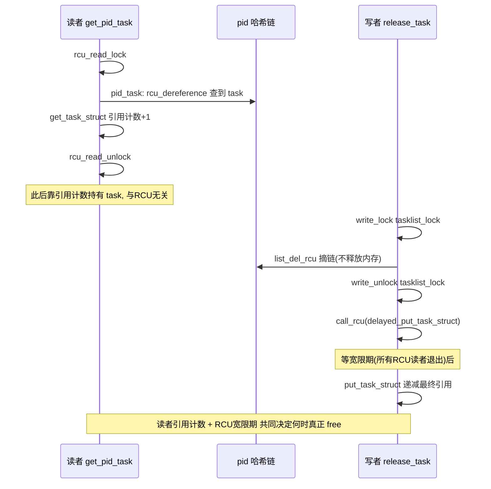

### case3：原子操作 + spinlock （引用降到 0 才拿锁）

场景：引用计数递减是热路径，若每次 `put` 都先 `spin_lock` 再判零，锁竞争会很重。`iput()` 用 `atomic_dec_and_lock` 把"递减 + 判零 + 按需拿锁"合成一个原子决策（[fs/inode.c](https://elixir.bootlin.com/linux/v4.11.6/source/fs/inode.c)）：

```c
//https://elixir.bootlin.com/linux/v4.11.6/source/fs/inode.c#L1527
void iput(struct inode *inode)
{
    if (!inode)
        return;
    BUG_ON(inode->i_state & I_CLEAR);
retry:
    /* atomic_dec_and_lock: 原子递减 i_count
     *   - 递减后 != 0: 不拿锁,直接返回（快路径,绝大多数 put）
     *   - 递减后 == 0: 拿住 i_lock 并返回真（慢路径,进入销毁）*/
    if (atomic_dec_and_lock(&inode->i_count, &inode->i_lock)) {
        if (inode->i_nlink && (inode->i_state & I_DIRTY_TIME)) {
            atomic_inc(&inode->i_count);
            inode->i_state &= ~I_DIRTY_TIME;
            spin_unlock(&inode->i_lock);
            mark_inode_dirty_sync(inode);
            goto retry;
        }
        iput_final(inode);            /* 持 i_lock 进入最终销毁 */
    }
}
```

todo

**协作分析**：

-   **原子操作**负责"绝大多数无竞争的快路径"：普通 `put` 只是一条 `lock dec`，完全无锁
-   **spinlock** 只在"引用归零、要销毁、需要与其他访问者互斥"的稀有慢路径才出现。`atomic_dec_and_lock`（[lib/dec_and_lock.c](https://elixir.bootlin.com/linux/v4.11.6/source/lib/dec_and_lock.c)）内部保证"判零"和"拿锁"这两步对外是一个原子决策，避免"刚判零、锁还没拿、别人又 `iget` 复活了"的竞争
-   **进阶：`lockref`**（[include/linux/lockref.h](https://elixir.bootlin.com/linux/v4.11.6/source/include/linux/lockref.h)）把一个 spinlock 和一个 count 打包进同一个机器字，`lockref_get_not_zero` 先用 `cmpxchg` 无锁地"计数 +1（若非 0）"，失败才退回拿 spinlock。dcache 用它让 `dget`/`dput` 在无竞争时完全无锁。此封装正是 VFS RCU-walk（下文介绍）中 `lockref_get_not_zero` 的底层实现

todo

**另一端（取引用 `igrab`）**：与"放"动作的 `iput` 对应的是"拿"动作的 `igrab`。实现如下，同样用 `i_lock` 守护"计数 + 状态"的一致性（[fs/inode.c](https://elixir.bootlin.com/linux/v4.11.6/source/fs/inode.c)）：

```c
//igrab 的作用是安全地获取并增加一个现有 inode 的引用计数
//https://elixir.bootlin.com/linux/v4.11.6/source/fs/inode.c#L1218
struct inode *igrab(struct inode *inode)
{
    spin_lock(&inode->i_lock);
    /* 只有 inode 未进入销毁流程时才允许 +1;
     * i_lock 保证这里读到的 i_state 与 iput 里的"判零/置 I_FREEING"互斥 */
    if (!(inode->i_state & (I_FREEING | I_WILL_FREE))) {
        __iget(inode);             /* = atomic_inc(&inode->i_count) */
        spin_unlock(&inode->i_lock);
    } else {
        spin_unlock(&inode->i_lock);
        inode = NULL;              /* 正在被释放,拿不到,返回 NULL */
    }
    return inode;
}
```

**读/写两端协作**：`iput`（写/放）用 `atomic_dec_and_lock` 在归零时拿 `i_lock` 进入销毁并置 `I_FREEING`；`igrab`（读/拿）拿 `i_lock` 后先查 `I_FREEING/I_WILL_FREE` 再决定能否 `__iget`。**同一把 `i_lock` 把"最后一次 put 的销毁决定"与"新的 get"串起来**，杜绝"计数刚归零、正要销毁，却被 `igrab` 复活"的竞争

### case4：等待队列 + spinlock —— 防丢唤醒（lost wakeup）

在前文（`0x0B`章节），提到"必须先置睡眠态再判条件"，其正确性还依赖等待队列**内建的一把 spinlock**（[include/linux/wait.h](https://elixir.bootlin.com/linux/v4.11.6/source/include/linux/wait.h)、[kernel/sched/wait.c](https://elixir.bootlin.com/linux/v4.11.6/source/kernel/sched/wait.c)）：

```c
struct __wait_queue_head {
    spinlock_t        lock;          /* 队列自带的锁 */
    struct list_head  task_list;
};

/* 等待方：入队与置睡眠态在同一把锁下 */
void prepare_to_wait(wait_queue_head_t *q, wait_queue_t *wait, int state)
{
    unsigned long flags;
    wait->flags &= ~WQ_FLAG_EXCLUSIVE;
    spin_lock_irqsave(&q->lock, flags);
    if (list_empty(&wait->task_list))
        __add_wait_queue(q, wait);   /* 挂入队列 */
    set_current_state(state);        /* 置睡眠态(内含屏障) */
    spin_unlock_irqrestore(&q->lock, flags);
}

/* 唤醒方：遍历唤醒也拿同一把 q->lock */
void __wake_up(wait_queue_head_t *q, unsigned int mode, int nr, void *key)
{
    unsigned long flags;
    spin_lock_irqsave(&q->lock, flags);
    __wake_up_common(q, mode, nr, 0, key);
    spin_unlock_irqrestore(&q->lock, flags);
}
```

**完整的等待端（读者）**：`wait_event` 展开等价于下面的循环，把"入队 + 置睡眠态 + 判条件 + 睡眠"串起来：

```c
#define wait_event(wq, condition)                            \
do {                                                         \
    DEFINE_WAIT(__wait);                                     \
    for (;;) {                                               \
        prepare_to_wait(&wq, &__wait, TASK_UNINTERRUPTIBLE); \
        if (condition)          /* 先置睡眠态,再判条件 */     \
            break;                                           \
        schedule();             /* 让出CPU,被 wake_up 唤醒后重判 */ \
    }                                                        \
    finish_wait(&wq, &__wait);  /* 出队 + 置 TASK_RUNNING */ \
} while (0)
```

todo

**协作分析**：

-   等待方展开顺序是：`prepare_to_wait`（入队 + 置睡眠态）→ 判条件 → `schedule`；唤醒方是：改条件 → `wake_up`
-   若无协作会 **lost wakeup**：等待方判条件为假、还没睡下时，唤醒方改了条件并 `wake_up`（此刻等待方尚未入队/尚未置睡眠态）→ 唤醒落空 → 永久睡眠
-   `q->lock` 保证"入队 + 置睡眠态"与"遍历唤醒"两段**互斥**；`set_current_state` 与 `wake_up` 内部的屏障（见 0x02）再保证"置睡眠态"先于"判条件"、"改条件"先于"读睡眠态"。二者合起来堵住丢唤醒窗口
-   注意分工：**条件变量本身**（如 pipe 的可读字节数）通常另有一把锁（`pipe->mutex`）保护；等待队列的 `q->lock` 只保护**队列结构**。两把锁各管一摊，配合才安全


### case5：spin_lock_irqsave + 唤醒 （中断上下文与进程上下文协作）

场景：一个动作在**中断上下文**完成（如 DMA 完成中断），需要唤醒在**进程上下文**睡眠等待的线程。`completion` 是这个范式的标准封装（[kernel/sched/completion.c](https://elixir.bootlin.com/linux/v4.11.6/source/kernel/sched/completion.c)）：

```c
//https://elixir.bootlin.com/linux/v4.11.6/source/kernel/sched/completion.c#L18
/* 通知方：可能在硬中断里被调用 */
void complete(struct completion *x)
{
    unsigned long flags;
    /* irqsave: 关本CPU中断，防"进程上下文持 x->wait.lock 时被同CPU中断重入抢同一把锁"自锁死 */
    spin_lock_irqsave(&x->wait.lock, flags);
    x->done++;                               /* 更新条件 */
    __wake_up_locked(&x->wait, TASK_NORMAL, 1); /* 已持锁,唤醒一个等待者 */
    spin_unlock_irqrestore(&x->wait.lock, flags);
}

/* 等待方:进程上下文 */
//https://elixir.bootlin.com/linux/v4.11.6/source/kernel/sched/completion.c#L113
void wait_for_completion(struct completion *x)
{
    /* 内部 spin_lock_irq(&x->wait.lock); 若 x->done==0 则挂入 x->wait 睡眠,
     * 被 complete() 唤醒后 x->done-- 返回 */
    wait_for_common(x, MAX_SCHEDULE_TIMEOUT, TASK_UNINTERRUPTIBLE);
}

static inline long __sched
__wait_for_common(struct completion *x,
		  long (*action)(long), long timeout, int state)
{
	might_sleep();

	spin_lock_irq(&x->wait.lock);
	timeout = do_wait_for_common(x, action, timeout, state);
	spin_unlock_irq(&x->wait.lock);
	return timeout;
}
```

**协作分析**：

-   这是"中断上下文 ↔ 进程上下文"经由**一把锁 + 一个条件（`x->done`）+ 一个等待队列**协作的范式，与case4 同源，但强调**跨上下文**
-   **为什么必须使用 `irqsave` 而非普通 `spin_lock`**（基于`0x03`章节的规则）：`complete()` 可能在硬中断里调用；若进程上下文在 `wait_for_completion` 里持有 `x->wait.lock` 时被**同 CPU** 的中断打断，中断里的 `complete()` 又来抢同一把锁 → 忙等且当前 CPU 不释放 → **自锁死**。`irqsave` 在持锁期间关本 CPU 中断，杜绝这种重入
-   同理，`sighand->siglock`（`0x04`章节引用）用 `spin_lock_irqsave`，因为信号可能在定时器中断等中断上下文里投递

**另一端（等待）**：`wait_for_completion` 的核心是 `do_wait_for_common`（简化自 [kernel/sched/completion.c](https://elixir.bootlin.com/linux/v4.11.6/source/kernel/sched/completion.c)）：

```c
static long __sched
do_wait_for_common(struct completion *x,
                   long (*action)(long), long timeout, int state)
{
    if (!x->done) {
        DECLARE_WAITQUEUE(wait, current);
        __add_wait_queue_tail_exclusive(&x->wait, &wait); /* 独占入队,避免惊群 */
        do {
            if (signal_pending_state(state, current)) { /* ... 处理信号 */ }
            __set_current_state(state);        /* 置睡眠态 */
            spin_unlock_irq(&x->wait.lock);    /* 放锁再睡 */
            timeout = action(timeout);         /* 通常是 schedule_timeout */
            spin_lock_irq(&x->wait.lock);      /* 醒来重新拿锁 */
        } while (!x->done && timeout);         /* 复检条件:防丢唤醒/伪唤醒 */
        __remove_wait_queue(&x->wait, &wait);
        if (!x->done)
            return timeout;
    }
    x->done--;                                 /* 消费一次完成事件 */
    return timeout ?: 1;
}
```

**读/写两端协作**：等待方持 `x->wait.lock` 判 `x->done`、入队、置睡眠态后**放锁**再 `schedule`；通知方（前面的 `complete`）持**同一把** `x->wait.lock` 做 `x->done++` 再 `__wake_up_locked`。二者靠"放锁前已置睡眠态并入队"避免丢唤醒（与案例 4 同理），只是这里的条件被封装成了 `x->done` 计数，即`complete` 递增、等待方递减消费

### case6：RCU + seqcount + rename_lock + d_lock（四套原语协作）

dcache 的 RCU-walk 路径查找是"多原语协作"的经典范例

-   **RCU** 保证 dentry 不被释放
-   **每 dentry 的 `d_seq`（seqcount）** 保证 name/parent/inode 三元组的原子快照
-   **全局 `rename_lock`（seqlock）** 兜底检测 rename
-   **`d_lock`（spinlock）** 只在最后取引用时短暂持有

四者按"访问频率"分层付费

| 层 | 原语 | 职责 |
| --- | --- | --- |
| 1 | RCU | 遍历期间对象不被 free |
| 2 | `d_seq` seqcount | 单个 dentry 字段快照一致 |
| 3 | `rename_lock` seqlock | 全局 rename 兜底重试 |
| 4 | `d_lock` spinlock + lockref | 收尾取引用转 ref-walk |

### case7：双重检查锁定 + 屏障（延迟初始化）

内核存在如下场景，某个昂贵对象只需初始化一次，但初始化点会被多个 CPU 并发触及。若每次都拿锁判断会拖慢已初始化后的热路径。经典解法是 **double-checked locking**，即无锁快检 → 未命中才拿锁 → 锁内**再检一次** → 初始化并**带屏障发布**。内核页表按需分配的 `__pte_alloc` 就是此例（[mm/memory.c](https://elixir.bootlin.com/linux/v4.11.6/source/mm/memory.c)）：

```c
//https://elixir.bootlin.com/linux/v4.11.6/source/mm/memory.c#L614
int __pte_alloc(struct mm_struct *mm, pmd_t *pmd, unsigned long address)
{
    spinlock_t *ptl;
    pgtable_t new = pte_alloc_one(mm, address);   /* 先在锁外分配、清零、初始化 */
    if (!new)
        return -ENOMEM;

    /* 关键屏障:保证"页表页的初始化"先于"指针被挂入 pmd"对其他CPU可见;
     * 否则无锁遍历页表的 CPU 可能看到指针却读到未初始化内容 */
    smp_wmb();

    ptl = pmd_lock(mm, pmd);                       /* 拿页表锁 */
    if (likely(pmd_none(*pmd))) {                  /* 再检一次:别的CPU是否已经装好了? */
        atomic_long_inc(&mm->nr_ptes);
        pmd_populate(mm, pmd, new);                /* 发布:把新页表挂入 pmd */
        new = NULL;
    }
    spin_unlock(ptl);
    if (new)                                       /* 输给了别人,释放自己多分配的那份 */
        pte_free(mm, new);
    return 0;
}
```

**协作分析**：

-   **第一次检查**（这里体现为"多个 CPU 都可能进来分配"）在锁外，让绝大多数已装好的情况走无锁快路径。**第二次检查 `pmd_none(*pmd)`** 在锁内，防止两个 CPU 同时判空后**重复安装**。谁先装好，后来者就 `pte_free` 掉自己那份
-   **`smp_wmb()` 缺一不可**：`pmd_populate` 是"发布指针"，若初始化对新页表内容的写没有先于发布可见，另一个**无锁遍历页表**的 CPU 就可能顺着指针读到垃圾。这正是 0x02 的发布范式（等价于 `rcu_assign_pointer` 里的写屏障）
-   通用形态（用 mutex 时）：`if (!READ_ONCE(p)) { mutex_lock(&m); if (!p) { q = init(); smp_store_release(&p, q); } mutex_unlock(&m); }`，快检用 `READ_ONCE`、发布用 `smp_store_release`，是同一套"检查-锁-复检-带屏障发布"的骨架

**另一端（无锁读者）**：与 `__pte_alloc` 的"发布"配对的是**无锁遍历页表**的读者（缺页/GUP 快路径）。它顺着 `pgd → pud → pmd → pte` 的指针链读取、**不加页表锁**：

```c
/* 读者:无锁 pointer chasing(简化) */
pmd_t *pmd = pmd_offset(pud, addr);
if (pmd_none(*pmd))            /* 读到"发布后的指针" */
    return NULL;
pte = pte_offset_map(pmd, addr); /* 依赖"先读指针,再读其内容"的数据依赖序 */
```

读/写两端配对：写者 `__pte_alloc` 的 `smp_wmb()` 保证"页表内容初始化"先于"指针发布"；读者靠 **数据依赖序**（load 指针 → load 指针指向的内容天然有序，仅 alpha 需 `smp_read_barrier_depends`）保证不会看到指针却读到发布前的垃圾。通用 mutex-DCL 的读者端则是那句 `if (READ_ONCE(p)) return p;` 快检，与 `smp_store_release` 配对

##  0x0F    常见数据结构的并发控制

同一种数据结构，配不同的锁策略就得到不同的并发能力。本节介绍内核中典型的三类数据结构：链表 / 哈希表 / 红黑树，分**读、写两端**并发安全性讨论

### 链表：RCU 保护的双向链表（读无锁、写串行 + 延迟回收）

以内核网络设备链表为例，即 `net->dev_base_head` 是 RCU 链表的典型（[net/core/dev.c](https://elixir.bootlin.com/linux/v4.11.6/source/net/core/dev.c)）：

```c
/* 读端：无锁遍历(调用者持 rcu_read_lock) */
//https://elixir.bootlin.com/linux/v4.11.6/source/include/linux/netdevice.h#L2343
#define for_each_netdev_rcu(net, d) \
    list_for_each_entry_rcu(d, &(net)->dev_base_head, dev_list)

struct net_device *dev_getbyhwaddr_rcu(struct net *net, unsigned short type,
                                       const char *ha)
{
    struct net_device *dev;
    for_each_netdev_rcu(net, dev)          /* rcu_dereference 跟 next 指针 */
        if (dev->type == type && !memcmp(dev->dev_addr, ha, dev->addr_len))
            return dev;
    return NULL;
}

//https://elixir.bootlin.com/linux/v4.11.6/source/include/linux/netdevice.h#L2337
//全局锁
extern rwlock_t				dev_base_lock;		/* Device list lock */

/* 写端：加入（持 RTNL + dev_base_lock）*/
//https://elixir.bootlin.com/linux/v4.11.6/source/net/core/dev.c#L226
static int list_netdevice(struct net_device *dev)
{
    struct net *net = dev_net(dev);
    ASSERT_RTNL();                          /* 写者之间用 RTNL 互斥 */
    write_lock_bh(&dev_base_lock);          /* 只用来挡住老式 read_lock 纯读者 */
    list_add_tail_rcu(&dev->dev_list, &net->dev_base_head); /* 发布语义挂链 */
    hlist_add_head_rcu(&dev->index_hlist, dev_index_hash(net, dev->ifindex));
    write_unlock_bh(&dev_base_lock);
    return 0;
}

/* 写端：删除(只摘链；调用者随后须过一个 RCU 宽限期才能 free/复用 dev) */
//https://elixir.bootlin.com/linux/v4.11.6/source/net/core/dev.c#L245
static void unlist_netdevice(struct net_device *dev)
{
    ASSERT_RTNL();
    write_lock_bh(&dev_base_lock);
    list_del_rcu(&dev->dev_list);           /* 只摘链,不释放 */
    hlist_del_rcu(&dev->index_hlist);
    write_unlock_bh(&dev_base_lock);

	dev_base_seq_inc(dev_net(dev));
}
```

todo

**协作分析**：

-   **读端零锁**：`list_for_each_entry_rcu` 用 `rcu_dereference` 跟 `next`，配合 `rcu_read_lock` 保证遍历期间节点不被 free
-   **写端两把锁各司其职**：`RTNL`（大互斥）串行化**写者之间**；`dev_base_lock`（rwlock）只挡住"用 `read_lock(&dev_base_lock)` 的老式纯读者"。挂/摘链用 `list_add_tail_rcu`/`list_del_rcu` 提供内存序
-   **回收**：`unlist_netdevice` 只摘链，源码注释明确要求调用者"过一个 RCU 宽限期后才能释放/复用 dev"（参考章节 `0x0E` case2 的 existence lock 同构）

### 哈希表：hlist_nulls + per-bucket spinlock + RCU（TCP 连接表）

TCP established 连接表 `ehash` 要在收包软中断里被高频无锁查找、又要被建立连接/拆散连接等并发修改（[net/ipv4/inet_hashtables.c](https://elixir.bootlin.com/linux/v4.11.6/source/net/ipv4/inet_hashtables.c)）：

```c
//https://elixir.bootlin.com/linux/v4.11.6/source/net/ipv4/inet_hashtables.c#L267
/* 读端：软中断里无锁查找 socket（调用者持 rcu_read_lock）*/
struct sock *__inet_lookup_established(struct net *net,
                struct inet_hashinfo *hashinfo, ...)
{
    unsigned int slot = hash & hashinfo->ehash_mask;
    struct inet_ehash_bucket *head = &hashinfo->ehash[slot];
    const struct hlist_nulls_node *node;
    struct sock *sk;
begin:
    sk_nulls_for_each_rcu(sk, node, &head->chain) {   /* RCU 遍历该桶 */
        if (sk->sk_hash != hash) continue;
        if (likely(INET_MATCH(sk, net, acookie, saddr, daddr, ports, dif))) {
            if (unlikely(!atomic_inc_not_zero(&sk->sk_refcnt)))
                goto out;                     /* 已在销毁,放弃 */
            if (unlikely(!INET_MATCH(sk, net, acookie, saddr, daddr, ports, dif))) {
                sock_gen_put(sk); goto begin; /* 拿到引用后复检,防窗口内被改 */
            }
            goto found;
        }
    }
    /* nulls 值 != 起始 slot：说明遍历中元素被移到别的桶，整体重试 */
    if (get_nulls_value(node) != slot)
        goto begin;
out:   sk = NULL;
found: return sk;
}

/* 写端：插入（拿该桶的 per-bucket spinlock） */
//https://elixir.bootlin.com/linux/v4.11.6/source/net/ipv4/inet_hashtables.c#L392
bool inet_ehash_insert(struct sock *sk, struct sock *osk)
{
    struct hlist_nulls_head *list;
    struct inet_ehash_bucket *head;
    spinlock_t *lock;

    sk->sk_hash = sk_ehashfn(sk);
    head = inet_ehash_bucket(hashinfo, sk->sk_hash);
    list = &head->chain;
    lock = inet_ehash_lockp(hashinfo, sk->sk_hash);   /* 按 hash 取该桶的锁 */
    spin_lock(lock);
    if (osk)                                  /* 需替换（如 TIMEWAIT）时先原子摘除 */
        sk_nulls_del_node_init_rcu(osk);
    __sk_nulls_add_node_rcu(sk, list);        /* 发布语义挂入桶 */
    spin_unlock(lock);
    return true;
}
```

```c
struct inet_hashinfo {
	/* This is for sockets with full identity only.  Sockets here will
	 * always be without wildcards and will have the following invariant:
	 *
	 *          TCP_ESTABLISHED <= sk->sk_state < TCP_CLOSE
	 *
	 */
	struct inet_ehash_bucket	*ehash;
	spinlock_t			*ehash_locks;   //每个bucket一个spin_lock
    ......
}


//https://elixir.bootlin.com/linux/v4.11.6/source/include/net/inet_hashtables.h#L163
static inline spinlock_t *inet_ehash_lockp(
	struct inet_hashinfo *hashinfo,
	unsigned int hash)
{
	return &hashinfo->ehash_locks[hash & hashinfo->ehash_locks_mask];
}
```

**协作分析**：

-   **读端零锁 + 引用 + 复检**：`rcu_read_lock` + `sk_nulls_for_each_rcu` 无锁遍历；命中后 `atomic_inc_not_zero(&sk->sk_refcnt)` 拿引用、再 `INET_MATCH` **复检**一次（对象可能在拿引用的窗口内被改），失败重试（这正是 `0x0E`章节中case1 的"RCU + 引用计数 + 复检"组合）
-   **写端 per-bucket 锁**：`inet_ehash_lockp` 按 hash 选一把桶级 spinlock，不同桶的插入/删除可**并行**，只与同桶写者之间互斥，读者完全不碰这把锁
-   **`hlist_nulls` 为何必要**：RCU 无锁遍历时，元素可能从桶 A 被删除并重新插入桶 B；普通 `hlist` 会顺着它的新 `next` 走到**别的桶**从而漏查。`hlist_nulls`（[include/linux/rculist_nulls.h](https://elixir.bootlin.com/linux/v4.11.6/source/include/linux/rculist_nulls.h)）让每条链的结尾是一个**编码了 slot 号的特殊 nulls 指针**，遍历到尾部比较 `get_nulls_value(node) != slot`，不一致就说明"串桶"了，整体重试（这是 hashtable + RCU 机制的经典配套）

### 红黑树：rbtree + 外部锁（进程地址空间 VMA 树）

红黑树的插入/删除要做树**旋转**，牵动多个节点指针，无法像链表那样用 RCU 让读者永远看到一致视图，因此内核 rbtree 一律用**外部锁**保护。进程 VMA 树 `mm->mm_rb` 由 `mm->mmap_sem`（rwsem，关联章节 `0x09`）保护（[mm/mmap.c](https://elixir.bootlin.com/linux/v4.11.6/source/mm/mmap.c)）：

```c
/* 读端:查找覆盖 addr 的 VMA(调用者持 down_read(&mm->mmap_sem);省略 vmacache 快查) */
struct vm_area_struct *find_vma(struct mm_struct *mm, unsigned long addr)
{
    struct rb_node *rb_node = mm->mm_rb.rb_node;
    struct vm_area_struct *vma = NULL;
    while (rb_node) {
        struct vm_area_struct *tmp =
            rb_entry(rb_node, struct vm_area_struct, vm_rb);
        if (tmp->vm_end > addr) {
            vma = tmp;
            if (tmp->vm_start <= addr) break;    /* 命中 */
            rb_node = rb_node->rb_left;
        } else {
            rb_node = rb_node->rb_right;
        }
    }
    return vma;
}

/* 写端:插入新 VMA(调用者持 down_write(&mm->mmap_sem)) */
void __vma_link_rb(struct mm_struct *mm, struct vm_area_struct *vma,
                   struct rb_node **rb_link, struct rb_node *rb_parent)
{
    rb_link_node(&vma->vm_rb, rb_parent, rb_link); /* 挂上新节点 */
    vma->rb_subtree_gap = 0;
    vma_gap_update(vma);
    vma_rb_insert(vma, &mm->mm_rb);                /* 旋转 + 着色 rebalance */
}
```

`find_vma`的调用方加锁情况（`down_read/up_read`）：

```c
static noinline void
__do_page_fault(struct pt_regs *regs, unsigned long error_code,
		unsigned long address)
{
	struct vm_area_struct *vma;
	struct task_struct *tsk;
	struct mm_struct *mm;
    ......
    if (unlikely(!down_read_trylock(&mm->mmap_sem))) {
		if ((error_code & PF_USER) == 0 &&
		    !search_exception_tables(regs->ip)) {
			bad_area_nosemaphore(regs, error_code, address, NULL);
			return;
		}
retry:  
		down_read(&mm->mmap_sem);
	} else {
		might_sleep();
	}

	vma = find_vma(mm, address);
	if (unlikely(!vma)) {
		bad_area(regs, error_code, address);
		return;
	}
    ......
	if (unlikely(expand_stack(vma, address))) {
		bad_area(regs, error_code, address);
		return;
	}

good_area:
	if (unlikely(access_error(error_code, vma))) {
		bad_area_access_error(regs, error_code, address, vma);
		return;
	}

	/*
	 * If for any reason at all we couldn't handle the fault,
	 * make sure we exit gracefully rather than endlessly redo
	 * the fault.  Since we never set FAULT_FLAG_RETRY_NOWAIT, if
	 * we get VM_FAULT_RETRY back, the mmap_sem has been unlocked.
	 */
	fault = handle_mm_fault(vma, address, flags);
	major |= fault & VM_FAULT_MAJOR;
    ......

	up_read(&mm->mmap_sem);

    ......
}
```

`__vma_link_rb`的调用方加锁情况（写锁）

```c

```

todo

**协作分析**：

-   **为什么不用无锁/RCU？**：插入/删除的旋转会同时改动祖先、父、子的多个指针，无锁读者可能落在一个**自洽性被破坏**的中间态（甚至走进环）。rbtree 因此需要一把真正的锁把读者挡在树外
-   **读多写少 → rwsem**：查 VMA（缺页、`/proc/<pid>/maps`）远多于改地址空间（`mmap`/`munmap`）。`mmap_sem` 这把 rwsem 让读者 `down_read` 并发、写者 `down_write` 独占，且持有期间**可睡眠**（缺页里要分配页、读盘）。这正是选 rwsem 而非自旋 rwlock 的原因（关联章节`0x09`），rwlock要求临界区不可以睡眠
-   **对照 seqlock**：只读值语义的结构可用 seqlock 让读者重试；但 `find_vma` 返回的是**要继续解引用的指针**，不适合 seqlock"可能读到撕裂数据"的模型，故用可睡眠的 rwsem

### 小结
**能容忍"摘链后延迟回收"的链式结构（list/hlist）最适合 RCU 读无锁；需要旋转/再平衡的结构（rbtree）必须用外部锁；哈希表则用"每桶一把小锁 + RCU 读 + nulls 防串桶"兼顾并发与正确**

| 数据结构 | 锁策略 | 读端 | 写端 |
| --- | --- | --- | --- |
| 链表（dev list） | RCU + RTNL + dev_base_lock | `list_for_each_entry_rcu`（无锁） | `list_add/del_rcu` + 宽限期回收 |
| 哈希表（TCP ehash） | RCU + per-bucket spinlock + hlist_nulls | `sk_nulls_for_each_rcu` + 引用 + 复检 | 桶锁 + `__sk_nulls_add_node_rcu` |
| 红黑树（VMA） | rwsem（`mmap_sem`） | `find_vma`（`down_read`） | `vma_rb_insert`（`down_write`） |


##  0x10    综合案例：一次 VFS 路径查找中的并发协同

前文提到过，RCU-walk（`LOOKUP_RCU`）是多种原语协同的典范。当解析路径 `/a/b/c` 时，内核**不取任何 dentry 引用计数、不加 `d_lock`**，全程在 RCU + seqcount 保护下"无锁"走完，失败才回退到 ref-walk

核心是 `__d_lookup_rcu`（[fs/dcache.c](https://elixir.bootlin.com/linux/v4.11.6/source/fs/dcache.c)），内核使用了顺序锁配合rcu机制实现。这段代码浓缩了内核并发设计哲学**为最热的读路径（路径查找每秒百万次）榨干每一分开销，只在真正需要修改时才付出锁的代价**

```c
//https://elixir.bootlin.com/linux/v4.11.6/source/fs/dcache.c#L2064
struct dentry *__d_lookup_rcu(const struct dentry *parent,
                const struct qstr *name, unsigned *seqp)
{
    ......
    hlist_bl_for_each_entry_rcu(dentry, node, head, d_hash) {  /* RCU 遍历哈希链 */
        unsigned seq;
seqretry:
        seq = raw_seqcount_begin(&dentry->d_seq);   /* 取该 dentry 的 seqcount 快照 */
        if (dentry->d_parent != parent)
            continue;
        if (d_unhashed(dentry))
            continue;
        *seqp = seq;
        if (dentry->d_name.hash_len != hashlen)
            continue;
        if (dentry_cmp(dentry, str, hashlen_len(hashlen)) != 0)
            continue;
        return dentry;
    }
    return NULL;
}
```

多层保护各司其职：

| 机制 | 在此处的职责 |
| --- | --- |
| `rcu_read_lock`（调用方 `link_path_walk` 持有） | 保证遍历期间 dentry 不被释放（释放经 `call_rcu`） |
| `hlist_bl_for_each_entry_rcu` | RCU 安全遍历哈希桶链 |
| 每 dentry 的 `d_seq`（seqcount） | 原子快照 name/parent/inode 三元组；被 `d_move` 改动则读者重试 |
| 全局 `rename_lock`（seqlock） | 检测遍历期间是否发生 rename，若"走错链"漏查则整体重试回退 |
| `dentry->d_lock`（spinlock） | 到达目标、要真正取引用（`lockref_get_not_zero`）转入 ref-walk 时才短暂持有 |

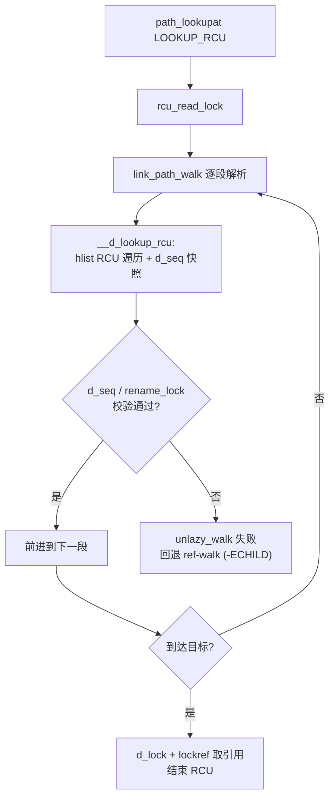

上面贴出的`__d_lookup_rcu`的实现主要依靠顺序锁与rcu来实现无锁访问，这里再补充下`__d_lookup_rcu`的两处调用场景：

### 场景一：lookup_fast

```c
//https://elixir.bootlin.com/linux/v4.11.6/source/fs/namei.c#L1537
static int lookup_fast(struct nameidata *nd,
		       struct path *path, struct inode **inode,
		       unsigned *seqp)
{
	struct vfsmount *mnt = nd->path.mnt;
	struct dentry *dentry, *parent = nd->path.dentry;
	int status = 1;
	int err;

	/*
	 * Rename seqlock is not required here because in the off chance
	 * of a false negative due to a concurrent rename, the caller is
	 * going to fall back to non-racy lookup.
	 */
	if (nd->flags & LOOKUP_RCU) {
		unsigned seq;
		bool negative;
        //外侧无任何锁
		dentry = __d_lookup_rcu(parent, &nd->last, &seq);
		if (unlikely(!dentry)) {
			if (unlazy_walk(nd))
				return -ECHILD;
			return 0;
		}

		......
	} else {
		dentry = __d_lookup(parent, &nd->last);
		if (unlikely(!dentry))
			return 0;
		status = d_revalidate(dentry, nd->flags);
	}
	......

	path->mnt = mnt;
	path->dentry = dentry;
	err = follow_managed(path, nd);
	if (likely(err > 0))
		*inode = d_backing_inode(path->dentry);
	return err;
}
```

`__d_lookup`的实现如下，可以看到，对比与`__d_lookup_rcu`，在`rcu_read_lock()` 的临界区内调用自旋锁（spin_lock）。此动作不仅是合法的，而且在 Linux 内核（dcache 模块中）是一种非常经典的设计模式：RCU 负责保护对象存在，自旋锁负责保护对象状态

todo

```c
//https://elixir.bootlin.com/linux/v4.11.6/source/fs/dcache.c#L2203
struct dentry *__d_lookup(const struct dentry *parent, const struct qstr *name)
{
	unsigned int hash = name->hash;
	struct hlist_bl_head *b = d_hash(hash);
	struct hlist_bl_node *node;
	struct dentry *found = NULL;
	struct dentry *dentry;

	rcu_read_lock();
	
	hlist_bl_for_each_entry_rcu(dentry, node, b, d_hash) {

		if (dentry->d_name.hash != hash)
			continue;

		spin_lock(&dentry->d_lock);
		if (dentry->d_parent != parent)
			goto next;
		if (d_unhashed(dentry))
			goto next;

		if (!d_same_name(dentry, parent, name))
			goto next;

		dentry->d_lockref.count++;
		found = dentry;
		spin_unlock(&dentry->d_lock);
		break;
next:
		spin_unlock(&dentry->d_lock);
 	}
 	rcu_read_unlock();

 	return found;
}
```

### 场景二：lookup_slow

```c
//https://elixir.bootlin.com/linux/v4.11.6/source/fs/namei.c#L1638
/* Fast lookup failed, do it the slow way */
static struct dentry *lookup_slow(const struct qstr *name,
				  struct dentry *dir,
				  unsigned int flags)
{
	struct dentry *dentry = ERR_PTR(-ENOENT), *old;
	struct inode *inode = dir->d_inode;
	DECLARE_WAIT_QUEUE_HEAD_ONSTACK(wq);

	inode_lock_shared(inode);
	/* Don't go there if it's already dead */
	if (unlikely(IS_DEADDIR(inode)))
		goto out;
again:
	dentry = d_alloc_parallel(dir, name, &wq);
	if (IS_ERR(dentry))
		goto out;
	if (unlikely(!d_in_lookup(dentry))) {
		if (!(flags & LOOKUP_NO_REVAL)) {
			int error = d_revalidate(dentry, flags);
			if (unlikely(error <= 0)) {
				if (!error) {
					d_invalidate(dentry);
					dput(dentry);
					goto again;
				}
				dput(dentry);
				dentry = ERR_PTR(error);
			}
		}
	} else {
		old = inode->i_op->lookup(inode, dentry, flags);
		d_lookup_done(dentry);
		if (unlikely(old)) {
			dput(dentry);
			dentry = old;
		}
	}
out:
	inode_unlock_shared(inode);
	return dentry;
}
```


```c
struct dentry *d_alloc_parallel(struct dentry *parent,
				const struct qstr *name,
				wait_queue_head_t *wq)
{
	unsigned int hash = name->hash;
	struct hlist_bl_head *b = in_lookup_hash(parent, hash);
	struct hlist_bl_node *node;
	struct dentry *new = d_alloc(parent, name);
	struct dentry *dentry;
	unsigned seq, r_seq, d_seq;

	if (unlikely(!new))
		return ERR_PTR(-ENOMEM);

retry:
	rcu_read_lock();
	seq = smp_load_acquire(&parent->d_inode->i_dir_seq) & ~1;
	r_seq = read_seqbegin(&rename_lock);
    //call __d_lookup_rcu
	dentry = __d_lookup_rcu(parent, name, &d_seq);
	if (unlikely(dentry)) {
		if (!lockref_get_not_dead(&dentry->d_lockref)) {
			rcu_read_unlock();
			goto retry;
		}
		if (read_seqcount_retry(&dentry->d_seq, d_seq)) {
			rcu_read_unlock();
			dput(dentry);
			goto retry;
		}
		rcu_read_unlock();
		dput(new);
		return dentry;
	}
	if (unlikely(read_seqretry(&rename_lock, r_seq))) {
		rcu_read_unlock();
		goto retry;
	}
	hlist_bl_lock(b);
	if (unlikely(parent->d_inode->i_dir_seq != seq)) {
		hlist_bl_unlock(b);
		rcu_read_unlock();
		goto retry;
	}
	/*
	 * No changes for the parent since the beginning of d_lookup().
	 * Since all removals from the chain happen with hlist_bl_lock(),
	 * any potential in-lookup matches are going to stay here until
	 * we unlock the chain.  All fields are stable in everything
	 * we encounter.
	 */
	hlist_bl_for_each_entry(dentry, node, b, d_u.d_in_lookup_hash) {
		if (dentry->d_name.hash != hash)
			continue;
		if (dentry->d_parent != parent)
			continue;
		if (!d_same_name(dentry, parent, name))
			continue;
		hlist_bl_unlock(b);
		/* now we can try to grab a reference */
		if (!lockref_get_not_dead(&dentry->d_lockref)) {
			rcu_read_unlock();
			goto retry;
		}

		rcu_read_unlock();
		/*
		 * somebody is likely to be still doing lookup for it;
		 * wait for them to finish
		 */
		spin_lock(&dentry->d_lock);
		d_wait_lookup(dentry);
		/*
		 * it's not in-lookup anymore; in principle we should repeat
		 * everything from dcache lookup, but it's likely to be what
		 * d_lookup() would've found anyway.  If it is, just return it;
		 * otherwise we really have to repeat the whole thing.
		 */
		if (unlikely(dentry->d_name.hash != hash))
			goto mismatch;
		if (unlikely(dentry->d_parent != parent))
			goto mismatch;
		if (unlikely(d_unhashed(dentry)))
			goto mismatch;
		if (unlikely(!d_same_name(dentry, parent, name)))
			goto mismatch;
		/* OK, it *is* a hashed match; return it */
		spin_unlock(&dentry->d_lock);
		dput(new);
		return dentry;
	}
	rcu_read_unlock();
	/* we can't take ->d_lock here; it's OK, though. */
	new->d_flags |= DCACHE_PAR_LOOKUP;
	new->d_wait = wq;
	hlist_bl_add_head_rcu(&new->d_u.d_in_lookup_hash, b);
	hlist_bl_unlock(b);
	return new;
mismatch:
	spin_unlock(&dentry->d_lock);
	dput(dentry);
	goto retry;
}
EXPORT_SYMBOL(d_alloc_parallel);
```